# 애플리케이션 관리

## 1. 스프링 부트 애플리케이션을 모니터링(Monitoring) 하기

#### 1) 스프링 부트 애플리케이션 만들기

* (1) 실습하기

    * ① 스프링 부트 프로젝트를 새로 생성한다.

        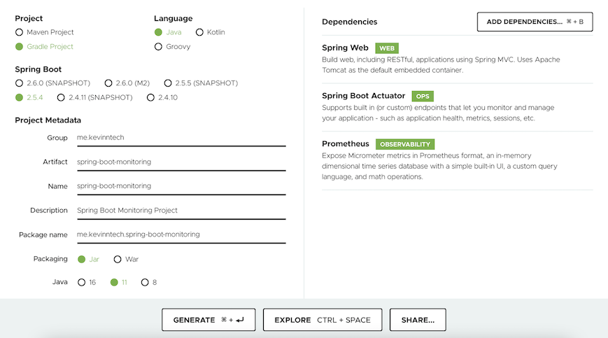
    
        * 위와 같이 설정한 다음, `[GENERATE]` 버튼을 클릭한다.

        * Spring Boot Actuator에 대한 자세한 내용은 `(2) Actuator`를 참고하자.

    * ② 다음과 같은 컨트롤러를 작성한다.

        ```java
        @RestController
        public class ProductApiController {
        
            @GetMapping("/api/v1/products")
            public String getProducts() {
                return "suit, sneakers";
            }
        
        }
        ```

    * ③ 다음과 같은 Endpoint의 공개 여부를 활성화한다.

        * `application.properties`를 사용하는 경우

            ```
            management.endpoints.web.exposure.include=health,info,prometheus
            ```

        * `application.yml`를 사용하는 경우
        
            ```
            management:
              endpoints:
                web:
                  exposure:
                    include: health, info, prometheus
            ```

    * ④ 애플리케이션을 실행한 다음, 웹 브라우저에서 http://localhost:8080/actuator 로 접속하면 Actuator가 제공하는 Endpoint들을 확인 할 수 있다.

        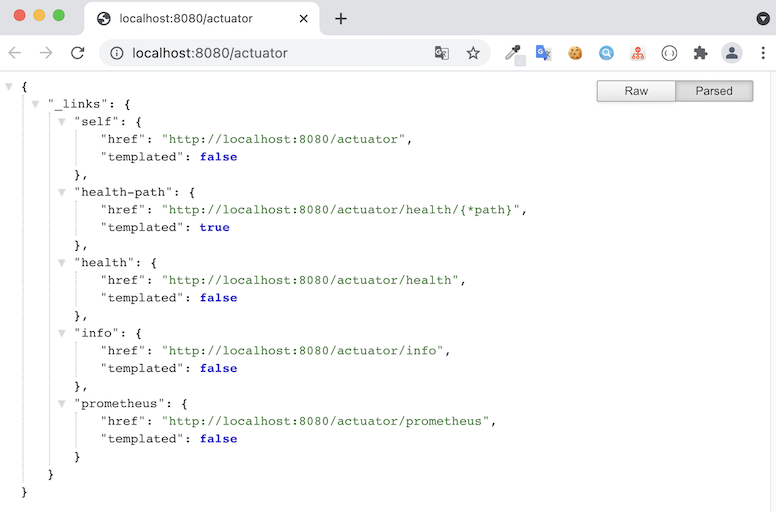

* (2) Actuator

    * `액추에이터(Actuator)` : 스프링 부트의 모듈이며 실행중인 애플리케이션의 상태를 확인할 수 있는 엔드포인트(Endpoint)를 제공한다.

        * `엔드 포인트(Endpoint)` : 최종 사용자가 네트워크에 접속하는 지점을 의미한다.

            * 본문에서는 정보를 얻을 수 있는 특정 URL를 의미한다.

    * Actuator의 특징

        * ① 다양한 엔드포인트를 제공한다.

            * 엔드포인트의 종류

                |         ID       |                                           설명                                           |
                |:-----------------|:----------------------------------------------------------------------------------------|
                |  `auditevents`   | 현재 애플리케이션에 대한 Audit 이벤트 정보를 표시한다.                                              | 
                |  `beans`         | 애플리케이션에 있는 모든 Spring 빈의 전체 목록을 표시한다.                                          | 
                |  `caches`        | 사용 가능한 캐시를 표시한다.                                                                  | 
                |  `env`           | Spring의 현재 환경설정 정보를 표시한다.                                                        |
                |  `health`        | 애플리케이션 상태 정보를 표시한다.                                                              |
                |  `httptrace`     | HTTP를 trace한 정보를 표시한다. (기본적으로 마지막 100 개의 request-response를 주고 받는것을 보여준다.) |
                |  `loggers`       | 애플리케이션의 로거 구성을 표시하고 수정합니다.                                                    |
                |  `metrics`       | 현재 애플리케이션에 대한 메트릭 정보(애플리케이션이 사용하고 있는 CPU와 메모리 사용량)를 표시한다.            |  
                |  `mappings`      | @RequestMapping에 해당하는 핸들러 메소드의 목록를 표시한다.                                       |
                |  `sessions`      | Spring 세션 저장소에서 사용자 세션의 검색 및 삭제를 허용한다.                                       |
                |  `shutdown`      | 애플리케이션을 정상적으로 종료시킬 수 있다.                                                       |  
                |  `threaddump`    | thread dump를 수행한다.                                                                   | 
                |  `prometheus`    | (웹 애플리케이션인 경우) Prometheus 서버에서 스크랩할 수 있는 형식으로 메트릭을 공개한다.                 | 
              
                * [참고] https://docs.spring.io/spring-boot/docs/current/reference/htmlsingle/#actuator.endpoints

        * ② 엔드포인트는 JMX 또는 HTTP를 통해 접근이 가능하다.

        * ③ shutdown을 제외한 모든 Endpoint는 기본적으로 활성화 상태다.

        * ④ health와 info를 제외한 대부분의 Endpoint는 기본적으로 비공개 상태다.

            * 활성화(`enabled`)와 공개 여부(`exposure`)는 따로 관리된다.

                * 활성화 여부 조정하기

                    ```
                    management.endpoints.enabled-by-default=false           -- 기본적으로 활성화되는 Endpoint가 적용되지 않도록 한다.
                    management.endpoint.info.enabled=true                   -- info Endpoint를 활성화한다.
                    ```

                * 공개 여부 조정하기

                    ```
                    management.endpoints.web.exposure.include=*             -- 모든 Endpoint를 공개한다.
                    management.endpoints.web.exposure.exclude=env,beans     -- env, beans Endpoint는 공개하지 않는다.
                    ```

#### 2) 프로메테우스(Prometheus)

* (1) 프로메테우스 ?

    * `프로메테우스(Prometheus)` : 오픈 소스 기반의 모니터링 시스템이다.
    
        * exporter를 이용해서 대상 시스템으로 부터 각종 모니터링 지표를 수집하여 저장하고 검색할 수 있다.

    * 프로메테우스의 특징

        * 풀링(pulling) 방식으로 메트릭을 수집한다.

            * 즉, 프로메테우스가 주기적으로 Exporter로 부터 메트릭을 읽어와서 수집한다.

        * 서비스 디스커버리(Service Discovery)를 통해 대상 서비스를 찾는다.
    
        * Kubernetes 환경에서 설치가 간단하고, 그라파나(Grafana)와의 연동을 통한 운영이 쉽다.
    
* (2) 프로메테우스 설치 및 실행하기

    * 프로메테우스를 설치 및 실행하는 방법은 여러 가지가 존재한다. 

        * 서버에 직접 설치해서 실행하기
    
        * 도커를 이용해서 설치한 다음 실행하기
    
            * ① 도커 이미지를 다운로드 받는다.

                ```
                docker pull prom/prometheus
                ```

            * ② 프로메테우스 설정 파일(`prometheus.yml`)을 만든다.
    
                * 설정 파일을 만드는 과정
                
                    ```
                    -- 디렉토리를 하나 만든다.
                    mkdir monitoring
                    
                    -- 앞서 만든 디렉토리로 이동한다.
                    cd monitoring
                    
                    -- prometheus.yml 파일을 작성한다.
                    vim prometheus.yml
                    ```

                * `prometheus.yml` 설정 파일 내용은 다음과 같다.
                
                    ```
                    global:
                      scrape_interval: 10s                              # 10초 마다 Metric을 Pulling 한다.
                      evaluation_interval: 10s
                    scrape_configs:
                      - job_name: 'spring-boot-app'
                        metrics_path: '/actuator/prometheus'            # Application prometheus endpoint
                        static_configs:
                          - targets: ['host.docker.internal:8080']      # Application host:port
                    ```

                    * `host.docker.internal`은 docker에서 특별한 DNS name으로 사용되며 docker를 실행하는 host를 가리킨다. 
                      
                        * 개발용으로만 사용해야 한다.    
              
                * `pwd` 명령어로 현재 디렉토리 주소를 복사 해놓는다.
    
                    * Ex) `/Users/FINTFACE/monitoring`
    
            * ③ 도커를 이용해서 프로메테우스를 실행한다.
    
                ```
                docker run \
                    -p 9090:9090 \
                    -v /Users/FINTFACE/monitoring/prometheus.yml:/etc/prometheus/prometheus.yml \
                    prom/prometheus
                ```
              
                * 실행에 성공 했다면 웹 브라우저에서 http://localhost:9090 를 입력해서 프로메테우스에 접근한다.

            * ④ 프로메테우스 설정 파일이 잘 적용되었는지도 확인해보자.
    
                * `[Status]` - `[Configuration]`를 클릭한다.
    
                * 다음과 같이 설정된 것을 확인 할 수 있다.

                    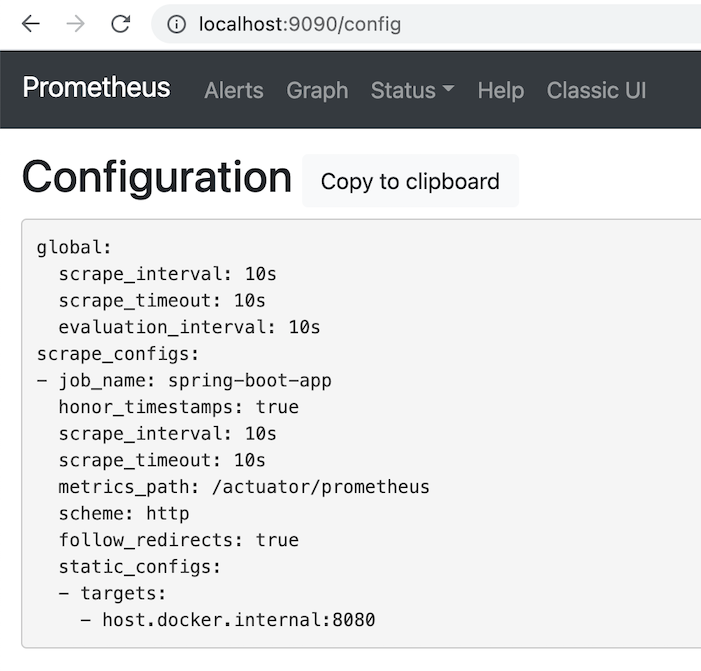
    
            * ⑤ 애플리케이션의 상태를 확인 할 수도 있다.

                * `[Status]` - `[Targets]`를 클릭한다.

                * 다음과 같이 애플리케이션의 상태가 표시된다.

                    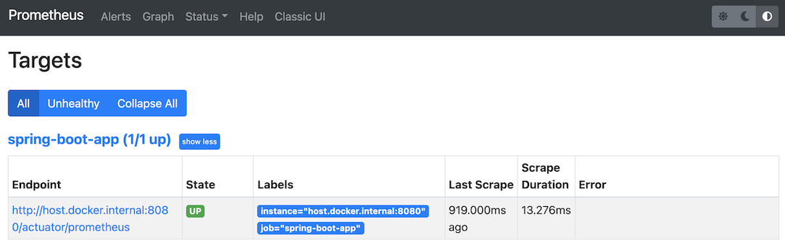

                    * Application의 State가 DOWN인 경우에는 현재 Application이 동작 중인지, prometheus.yml의 targets 값이 정상적으로 설정되어 있는지 확인해야 한다.

            * ⑥ `[Graph]`를 클릭한 다음, 아래처럼 수집된 metric 중 하나를 선택해서 값이 나오는지 확인해보자.

                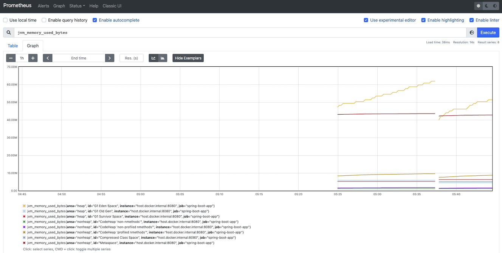

#### 3) 그라파나(Grafana)

* (1) 그라파나 ?

    * `그라파나(Grafana)` : (Prometheus를 통해서) 수집한 지표(Metric)를 시각화 해주는 오픈소스 도구이다.
    
        * 프로메테우스를 이용해서 지표(Metric)를 그래프로 시각화 할 수 있지만 한계가 있기 때문에 그라파나를 이용한다.

* (2) 그라파나 설치 및 실행하기

    * 그라파나를 설치 및 실행하는 방법은 여러 가지가 존재한다.

        * 서버에 직접 설치해서 실행하기

        * 도커를 이용해서 설치한 다음 실행하기

            * ① 도커 이미지를 다운로드 받는다.

                ```
                docker pull grafana/grafana
                ```
    
            * ② 도커를 이용해서 그라파나를 실행한다.
    
                ```
                docker run --name grafana -d -p 3000:3000 grafana/grafana
                ```
              
                * 실행에 성공 했다면 웹 브라우저에서 http://localhost:3000 를 입력해서 그라파나에 접근한다.

            * ③ 그라파나에 성공적으로 접근했다면 다음과 같은 로그인 화면을 확인 할 수 있으며 로그인을 하자.

                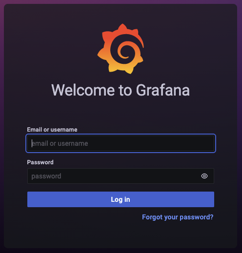
    
                * 초기 아이디/패스워드는 `admin/admin` 이다.

            * ④ 로그인에 성공 했다면 다음처럼 새로운 패스워드를 입력하라는 화면이 나타난다. 변경하거나 skip 하자.

                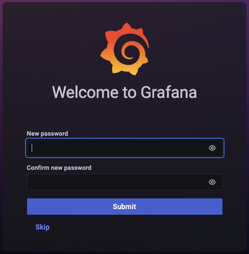

            * ⑤ 그라파나의 첫 페이지에서 `DATA SOURCES`를 클릭해서 데이터 소스를 추가한다.

                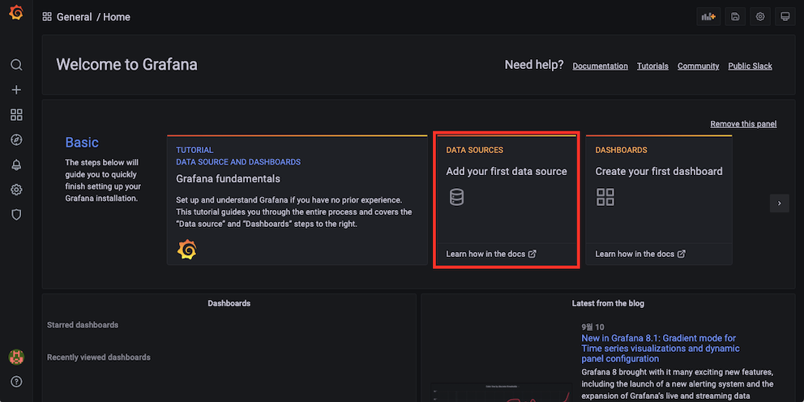

            * ⑥ `Prometheus`에 수집되고 있는 지표(Metric)를 이용해서 시각화를 할 것이기 때문에 `Prometheus`를 선택한다.

                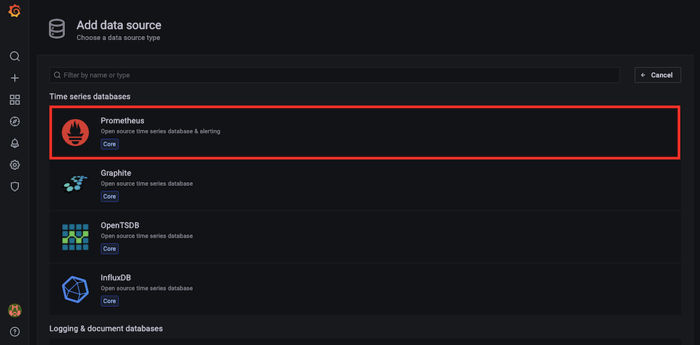

            * ⑦ Name과 URL를 설정한 다음, `[Save & test]`를 클릭한다.

                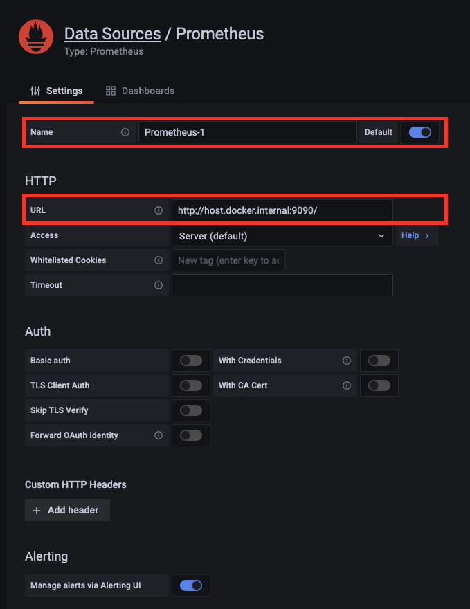
    
                * Data Source의 Name은 아무거나 지정하면 된다.
    
                * URL는 도커를 사용하고 있기 때문에 http://host.docker.internal:9090/ 를 입력한다.
    
                * 성공적으로 설정하였다면 "Data source is working"이라는 녹색 창이 나타난다.

            * ⑧ `[+]`-`[Import]`를 클릭해서 대시보드를 생성한다.
    
                * `Import via grafana.com`에 `https://grafana.com/grafana/dashboards/4701` 를 입력한 다음, `[Load]`를 클릭한다.
    
                * [참고] 다양한 대시보드를 사용하고 싶다면 https://grafana.com/grafana/dashboards 를 살펴보자. 
    
            * ⑨ `Name`에 원하는 대시보드 이름을 입력하고 `Prometheus`에 방금전에 만든 데이터 소스 `Prometheus-1`를 선택한 다음, `[Import]`를 클릭한다.

                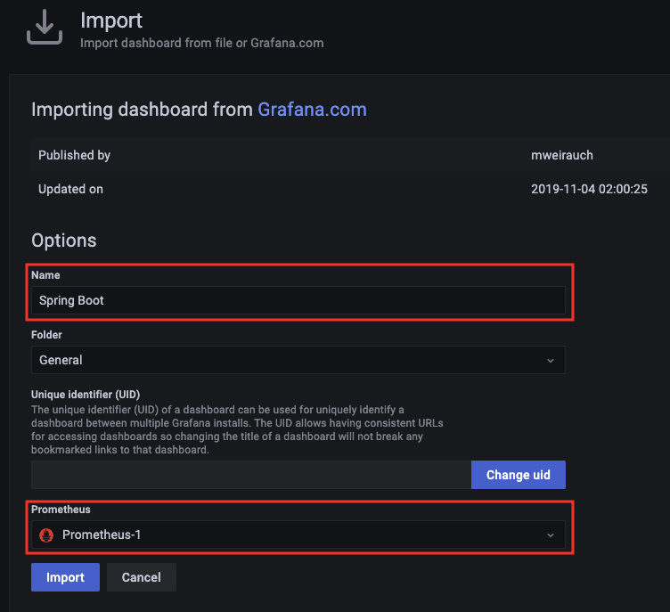

            * ⑩ 다음과 같은 대시보드가 생성된 것을 확인 할 수 있다.

                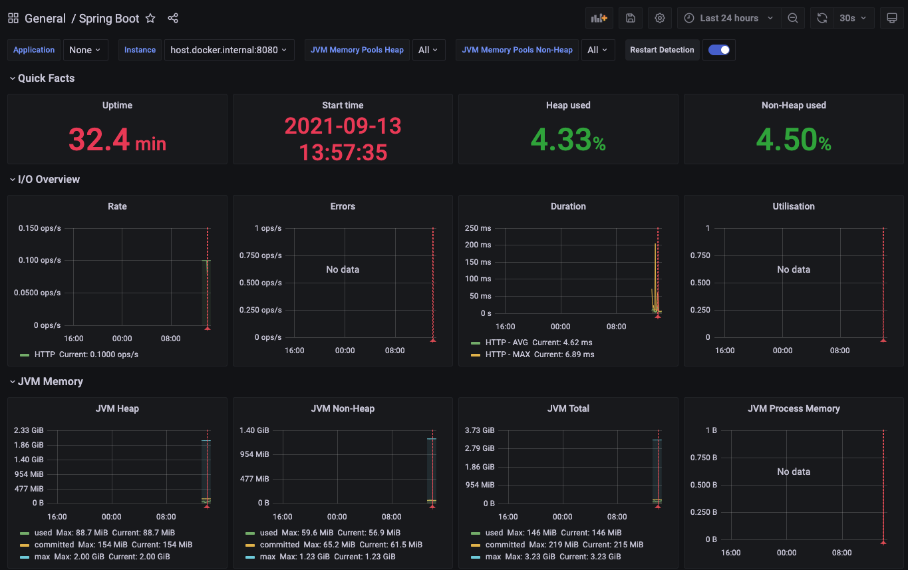

                * [참고] 위에서 적용한 대시보드가 아닌 다른 대시보드를 적용할 때 Instance를 제대로 가져오지 못하는 경우가 발생 했었다. 
                  
                    * 이러한 경우에는 일시적인 해결책으로 `[Dashboard settings]` - `[Variables]`를 클릭한 다음, Instance 값을 직접 수정하였다.
                    
                        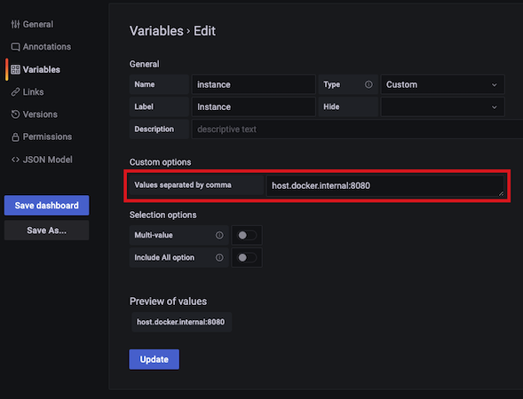
    
            * ⑪ 상단에 있는 `[Add panel]`를 클릭하여 패널을 추가 할 수도 있다.

                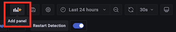

#### 4) 참고 문서

* https://jongmin92.github.io/2019/12/04/Spring/prometheus/

* https://covenant.tistory.com/244