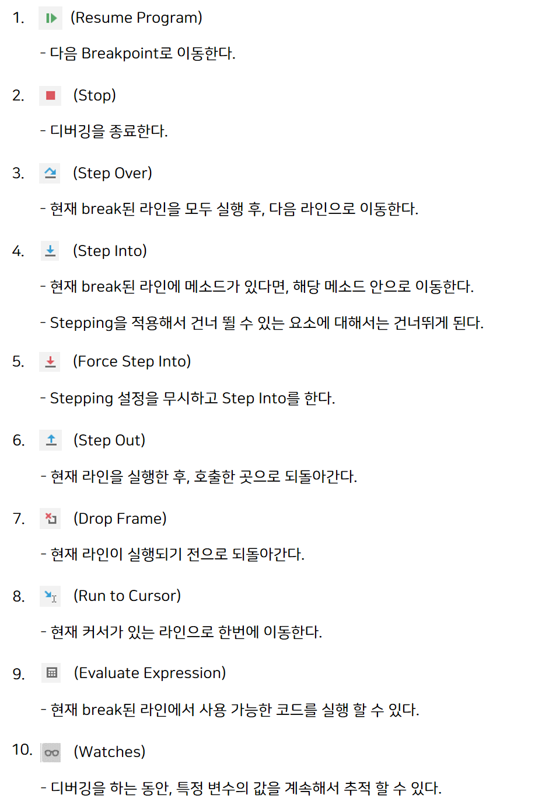

# 디버깅 및 자주 사용하는 인텔리제이(IntelliJ) 단축키
> 아래 내용은 Mac OS를 기준으로 작성 되었습니다.

* (1) 디버깅

    
    
    * `Stepping` : 디버그 중 건너 뛸 수 있는 요소를 지정한다.
    
        * `[Shift]`를 두 번 누른 다음, Stepping으로 검색하면 설정 할 수 있다.

* (2) 단축키

    * 단축 키워드
    
        * `psvm` : main 메서드를 선언한다.
    
        * `sout` : `System.out.println();`를 자동으로 생성한다.
        
        * `soutv` : `System.out.println("변수명 = " + 변수명);`를 자동으로 생성한다.
    
        * `soutm` : `System.out.println("클래스명.메소드명");`를 자동으로 생성한다.
        
        * `itar` : 기본적인 for문을 자동으로 생성한다.
        
        * `iter` : for each문을 자동으로 생성한다.
        
    * `Command + N`
    
        * 프로젝트(Project) 탭에서는 디렉토리, 패키지, 클래스 등 생성 목록 보기
    
        * 소스코드 탭에서는 생성자, getter/setter, 오버라이딩 등 목록 보기
    
    * `Ctrl + Space` : 자동 완성 기능 (변수 선언 또는 new 연산자 뒤에 사용)
    
    * `Command + 마우스 왼쪽 버튼 클릭` : 코드를 링크처럼 타고 이동하기
    
    * `Command + Shift + T` : 테스트 코드 만들기
    
    * `Command + Option + B` : 구현으로 이동하기
    
    * `Option + Enter` : 퀵 픽스
    
    * `Shift + Shift` : 전체 검색
    
    * `Shift + Shift + Tab` : 전체 검색 (클래스 찾기)
    
    * `Shift + Command + F` : 코드 검색하기
    
    * 리팩토링
    
        * `Command + Option + V` : 변수로 추출하기
        
        * `Command + Option + M` : 메소드로 추출하기
        
        * `Shift + F6` : 변수, 메서드 이름을 일괄 변경하기
        
    * `Ctrl + Shift + R` : 메인 메소드 실행하기
    
    * `Command + F9` : 빌드하기
    
    * `Ctrl + Option + O` : 사용하지 않은 import 문 정리하기
    
    * 프로젝트(Project) 탭
    
        * ① `Command + 1` : 프로젝트 탭으로 이동하기
    
        * ② `Esc` : 소스코드 화면으로 돌아가기
    
        * ③ `Command + 1 ` : 소스코드 화면에서 해당 단축키를 두번 누르면 프로젝트 탭이 사라진다.
    
    * `Shift + Option + ← 또는 →` : 단어 단위로 드래그 하기
    
    * `Command + p` : 메소드 파라미터 정보 확인하기
    
    * `Command + Option + ← 또는 →` : 이전 / 이후 화면으로 돌아가기
    
    * `Command + Option + N` : Inline Variable
    
        * return 문이나 변수명에 포커스를 두고 단축키를 누른다.
    
    * 주석 처리
    
        * `Command + /` : 한줄 주석 처리하기 
        
        * `Command + Option + /` : 여러 줄 주석 처리하기
    
    * `F1` : Java Doc 보기 (Quick Documentation)
    
    * `Command + D` : 현재, 코드 라인 복사하기
    
    * `Command + Shift + Enter` : 현재 문장 자동 완성하기 (if문 등 ...)
    
        * `Ctrl + Space` 단축키와 같이 사용하면 유용하다.
    
    * `Command + Shift + ↑↓` : 라인 단위로 코드 이동 시키기