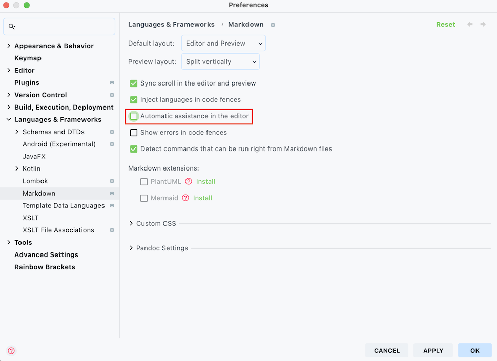

# 인텔리제이(IntelliJ)에서 자주 사용하는 기능 및 단축키
> 아래 내용은 Mac OS를 기준으로 작성 되었습니다.

## 1. 단축키

* (1) 디버깅

    
    
    * `Stepping` : 디버그 중 건너 뛸 수 있는 요소를 지정한다.
    
        * `[Shift]`를 두 번 누른 다음, Stepping으로 검색하면 설정 할 수 있다.
    
* (2) 단축키

    * 단축 키워드
    
        * `psvm` : main 메서드를 선언한다.
    
        * `sout` : `System.out.println();`를 자동으로 생성한다.
        
        * `soutv` : `System.out.println("변수명 = " + 변수명);`를 자동으로 생성한다.
    
        * `soutm` : `System.out.println("클래스명.메소드명");`를 자동으로 생성한다.
        
        * `itar` : 기본적인 for문을 자동으로 생성한다.
        
        * `iter` : for each문을 자동으로 생성한다.
        
    * `Command + N`
    
        * 프로젝트(Project) 탭에서는 디렉토리, 패키지, 클래스 등 생성 목록 보기
    
        * 소스코드 탭에서는 생성자, getter/setter, 오버라이딩 등 목록 보기
    
    * `Ctrl + Space` : 자동 완성 기능 (변수 선언 또는 new 연산자 뒤에 사용)
    
    * `Command + 마우스 왼쪽 버튼 클릭` : 코드를 링크처럼 타고 이동하기
    
    * `Command + Shift + T` : 테스트 코드 만들기
    
    * `Command + Option + B (마우스 왼쪽 버튼)` : 구현으로 이동하기
    
    * `Option + Enter` : 퀵 픽스
    
    * `Shift + Shift` : 전체 검색
    
    * `Shift + Shift + Tab` : 전체 검색 (클래스 찾기)
    
    * `Shift + Command + F` : 코드 검색하기
    
    * 리팩토링
    
        * `Command + Option + V` : 변수로 추출하기
    
        * `Command + Option + C` : 상수로 추출하기
        
        * `Command + Option + M` : 메소드로 추출하기
        
        * `Shift + F6` : 변수, 메서드 이름을 일괄 변경하기
        
    * `Ctrl + Shift + R` : 메인 메소드 실행하기
    
    * `Command + F9` : 빌드하기
    
    * `Ctrl + Option + O` : 사용하지 않은 import 문 정리하기
    
    * 프로젝트(Project) 탭
    
        * ① `Command + 1` : 프로젝트 탭으로 이동하기
    
        * ② `Esc` : 소스코드 화면으로 돌아가기
    
        * ③ `Command + 1 ` : 소스코드 화면에서 해당 단축키를 두번 누르면 프로젝트 탭이 사라진다.
    
    * `Shift + Option + ← 또는 →` : 단어 단위로 드래그 하기
    
    * `Command + p` : 메소드 파라미터 정보 확인하기
    
    * `Command + Option + ← 또는 →` : 이전 / 이후 화면으로 돌아가기
    
    * `Command + Option + N` : Inline Variable
    
        * return 문이나 변수명에 포커스를 두고 단축키를 누른다.
    
    * 주석 처리
    
        * `Command + /` : 한줄 주석 처리하기 
        
        * `Command + Option + /` : 여러 줄 주석 처리하기
    
        * `/**` + `Enter` : 자동 주석 생성
    
    * `F1` : Java Doc 보기 (Quick Documentation)
    
    * `Command + D` : 현재, 코드 라인 복사하기
    
    * `Command + Shift + Enter` : 현재 문장 자동 완성하기 (if문 등 ...)
    
        * `Ctrl + Space` 단축키와 같이 사용하면 유용하다.
    
    * `Command + Shift + ↑↓` : 라인 단위로 코드 이동 시키기
    
    * `클래스명 + 오른쪽 마우스 버튼` + `Diagrams -> Show Diagram` : 다이어그램 확인

* (3) Live Templates 기능

    * ① `[IntelliJ IDEA]` - `[Preferences]` 를 클릭한다.
    
    * ② `live template`으로 검색한다.
    
    * ③ + 버튼을 클릭한 다음, `Template Group...`으로 그룹을 생성한다.
    
    * ④ 다시 + 버튼을 클릭한 다음, `Live Template`으로 다음과 같은 라이브 템플릿을 작성한다.
    
        ```java
        @Test
        public void $NAME$() throws Exception {
            //given
            $END$
            //when
            
            //then
        }
        ```
    
    * ⑤ `Abbreviation`를 tdd로 지정한다.
      
    * ⑥ `Define`를 클릭하여 `Java`를 체크한다.

    * ⑦ `Use static import if possible` , `Shorten FQ names`를 체크한다.

* (4) 인텔리제이 실행 시 자동 빌드

    * ① 인텔리제이 환경설정에서 `Build project automatically`를 체크한다.
    
    * ② 키보드에서 Shift를 두 번 눌렀을 때 나타나는 검색 창에서 Registry를 입력한다.
    
    * ③ `compiler.automake.allow.when.app.running`을 체크한다.

## 2. HTTP Client 기능 (Ultimate 버전만 지원)

### 1) 실습 준비

* 아래와 같은 위치에 `client` 디렉토리와 `.http` 확장자(HTTP Request)에 해당하는 파일을 작성한다.

    

* 컨트롤러와 DTO를 작성한다.

    ```java
    @RestController
    public class ProductApiController {
    
        @GetMapping("/products")
        public List<String> getProducts() {
            return Arrays.asList("컴퓨터", "키보드", "마우스");
        }
    
        @PostMapping("/products")
        public ProductDto createProduct(@RequestBody ProductDto productDto) {
            return productDto;
        }
    
    }
    ```
    
    ```java
    @Getter
    @NoArgsConstructor
    public class ProductDto {
    
        private String code;
    
        private String name;
    
    }
    ```

### 2) 사용 방법

* (1) GET 요청

    * `product-api-test.http` 파일에 GET 요청을 하는 내용을 작성한다.

        ```
        GET localhost:8080/products
        ```
      
        * 파일 내용의 첫 번째 줄에는 HTTP Method와 요청 URL을 입력한다.
    
        * GET 요청의 경우에는 보낼 데이터가 없으므로 한 줄만 입력한다.
    
        * [Tip] 각 테스트는 `###`으로 구분한다.

* (2) POST 요청

    * 간단한 POST 요청하기

        * `product-api-test.http` 파일에 POST 요청을 하는 내용을 작성한다.
    
            ```
            POST localhost:8080/products
            Content-Type: application/json
            
            {
              "code": "ITEM-001",
              "name": "컴퓨터"
            }
            ```
    
            * 파일 내용의 첫 번째 줄에는 HTTP Method와 요청 URL을 입력한다.
    
            * 파일 내용의 두 번째 줄 부터는 요청 헤더를 입력한다.
    
            * 요청 헤더를 모두 입력 했다면 요청 본문 내용을 입력한다. 
    
    * JSON 파일을 이용한 POST 요청하기

        * `product-api-test.http` 파일에 POST 요청을 하는 내용을 작성한다.
        
            ```
            POST localhost:8080/products
            Content-Type: application/json
            
            < ./post-product.json
            ```
          
            * 요청 본문 내용으로 `< 파일위치`를 지정하면 해당 파일의 내용을 전송한다.

* (3) 요청 헤더 관련

    * 인증

        ```
        GET localhost:8080/auth
        Authorization: DEV
        ```

    * 쿠키

        ```
        GET localhost:8080/cookie
        Cookie: user=test
        ```

## 3. 마크다운 자동 완성 기능 비활성화하기

* 마크다운 문서 작성 시, 자동으로 완성되는 기능을 비활성화 한다.

    