# 자바(Java) 기본 문법 정리
> 아래 내용은 [자바의 정석](https://book.naver.com/bookdb/book_detail.nhn?bid=10191151 "자바의 정석")을 참고 하였습니다.

## 1. 변수(Variable)

#### 1) 변수(Variable)란?

* 변수(Variable)는 하나의 값을 저장할 수 있는 메모리 공간

#### 2) 변수의 선언

* 변수의 선언 방법

  `변수타입 변수이름;`
  
* 변수 선언 예시

    ```java
    int age;      // 정수 타입의 변수 age를 선언
    ```
 
#### 3) 변수에 값 저장하기

* 변수에 값 저장하기

    ```java
    int age;      // 정수 타입의 변수 age를 선언
    age = 25;     // 변수 age에 25를 저장
    ```
  
* 변수에 값 저장하기 (축약형)

    ```java
    int age = 25;
    ```
  
* 변수의 초기화는 변수에 처음으로 값을 저장하는 것을 말한다.

    * 지역변수는 사용하기 전에 반드시 초기화를 해야한다. 그렇지 않으면 컴파일 시 에러가 발생한다.

        ```java
        int x = 0; // 변수 x를 선언 후, 0으로 초기화
        int y = 0;
      
        int x = 0, y = 5; // 위의 두 줄을 한 줄로 표현할 수 있다.
        ```
      
#### 4) 변수의 값 읽어오기

* 변수에 값이 필요한 곳에 변수 이름을 적으면 된다.

    ```java
    int year = 0, age = 14; // int형 변수 year, age를 선언한 다음, 각각 0과 14로 초기화한다.
    year = age + 2000; // 2014
    ```
  
#### 5) 변수의 타입

* 변수의 타입은 저장할 값의 타입에 의해 결정된다.

* 저장할 값의 타입과 일치하는 타입으로 변수를 선언한다.

    ```java
    char ch = '가';    // char는 문자 타입
    double pi = 3.14; // double은 실수 타입
    ```
  
* 변수의 타입은 크게 기본형과 참조형으로 나눌 수 있다.

    * `기본형(Primitive type)`
    
        * 8개의 타입이 있다. (char, byte, short, int, long, float, double, boolean)
    
        * 실제 값을 저장한다.
        
    * `참조형(Reference type)`
    
        * 기본형을 제외한 나머지 타입 (String, System 등)
    
        * 객체의 주소를 저장한다. (4 byte 또는 8 byte)
              
#### 6) 상수와 리터럴

* 변수(Variable) : 하나의 값을 저장할 수 있는 공간

* 상수(constant) : 한 번만 값을 저장 할 수 있는 공간

* 리터럴(literal) : 그 자체로 값을 의미하는 것

    ```java
    final int MAX = 100; // MAX는 상수
    MAX = 200; // 에러 발생
    ```
  
#### 7) 리터럴의 접두사와 접미사

* 접두사

    * 정수형 리터럴 앞에 어떠한 접두사도 없다면 10 진수
    
    * 정수형 리터럴 앞에 0를 붙이면 8진수이다.
    
    * 정수형 리터럴 앞에 0x를 붙이면 16진수이다.
    
    * 정수형 리터럴 앞에 0b를 붙이면 2진수이다. (JDK 1.7 부터 추가됨)
    
        ```java
        int i = 100;
        int oct = 0100;
        int hex = 0x100;
        ```

* 접미사

    * Long 타입의 리터럴에는 접미사 l 또는 L를 사용한다.
 
         ```java
         long l = 10_000_000_000L; // 100억은 int의 최대 값인 20억을 넘기 때문에 접미사 L을 붙이지 않으면 에러가 발생한다.
         long l = 100; // OK
         ```
    
    * float 타입의 리터럴에는 접미사 f 또는 F를 사용한다.
    
    * double 타입의 리터럴에는 접미사 d 또는 D를 사용한다.

         ```java
         float f = 3.14f;
         double d = 3.14d; // d는 생략가능
         ```

* 소수점(.)과 e의 의미
    
    * 소수점(.)의 의미는 다음과 같다.   
        
        * `10.` → `10.0d`
        
        * `.10` → `0.10d`
    
        * `10f` → 10.0f
    
    * e는 10^n를 의미한다.
    
        * `1e3` → `1000.0d`
    
    * 리터럴에 소수점(.) 또는 e, 실수형 접미사(f, d)가 포함된 경우, 실수형 리터럴로 간주한다.

#### 8) 문자와 문자열

 ```java
char ch = 'A';    // char형 변수는 단 하나의 문자밖에 저장 할 수 없다.
char ch = 'AB';   // 둘 이상의 문자를 저장하려고 하면 에러가 발생한다.
String s = "ABC"; // 문자열을 저장하려면 변수의 타입은 String이어야 한다.

char ch = ''; // char형 변수에는 반드시 하나의 문자를 저장해야하므로 에러가 발생한다.
String s = ""; // String 타입의 변수에는 빈 문자열을 저장 할 수 있다.

String s1 = "A" + "B" // String은 덧셈 연산자를 이용해서 문자열을 결합할 수 있다.

// "" + 7는 문자열 "7"이 된다. 즉, 숫자를 문자열로 변경하려면 숫자 + 문자열을 하면된다.
 ```

* 문자열에 어떤 타입을 더하면 그 결과는 문자열이 된다.

#### 9) 두 변수의 값 교환하기

 ```java
int x = 10, y = 20;
int temp;

temp = x;   // x의 값을 temp에 저장
x = y;      // x의 값을 y에 저장
y = temp;   // temp의 값을 y에 저장
 ```

#### 10) 기본형(Primitive type)의 종류와 범위

* 기본형의 종류

    * 논리형 - true와 false 중 하나를 값으로 갖으며, 조건식과 논리적 계산에 사용된다. boolean이 있다.
    
    * 문자형 - 문자를 저장하는데 사용되며, 변수 당 하나의 문자만을 저장 할 수 있다.
    
    * 정수형 - 정수 값을 저장하는데 사용된다. 주로 사용하는 것은 int와 long이며, byte는 이진 데이터를 다루는데 사용되며, short는 c 언어와의 호환을 위해 추가되었다. (잘 쓰이지 않음)

    * 실수형 - 실수 값을 저장하는데 사용된다. float와 double이 있다.

* 기본형의 크기

    * 논리형 - boolean (1byte)

    * 문자형 - char (2byte)

    * 정수형 - byte (1byte) , short (2byte) , int (4byte, 디폴트 타입), long (8byte)
    
    * 실수형 - float (4byte) , double (8byte, 디폴트 타입)
    
* 기본형의 표현범위 (정수형)

    * 1 bit는 이진수 한 자리(0 또는 1)를 의미한다.
    
        * n 비트로 표현 할 수 있는 값의 개수는 2^n개 이다.
        
            * Ex) 8 비트는 256개의 값을 표현 할 수 있다.
 
        * n 비트로 표현 할 수 있는 부호 없는 정수(양수)의 범위는 0 ~ 2<sup>n</sup> - 1 이다.
        
            * 0이 포함되므로 -1을 한다.
            
            * Ex) 8 비트로 표현 할 수 있는 부호 없는 정수의 범위는 1 ~ 256이 아닌 0 ~ 255 이다.
            
        * n 비트로 표현 할 수 있는 부호 있는 정수의 범위는 -2<sup>n-1</sup> ~ 2<sup>n-1</sup> - 1 이다.        

            * Ex) 8 비트로 표현 할 수 있는 부호 있는 정수의 범위는 -128 ~ 127이다.
          
    * 1 byte는 8 bit이다.
    
    * 음수를 표현하기 위해서 첫 번째 비트를 부호 비트(Sign bit)로 사용한다. 
    
    * 부호 비트(Sign bit)의 값이 0이면 양수이고 1이면 음수이다.
         
    * byte로 표현 할 수 있는 값의 범위는 -2<sup>7</sup> ~ 2<sup>7</sup> - 1이다.

    * short로 표현 할 수 있는 값의 범위는 -2<sup>15</sup> ~ 2<sup>15</sup> - 1이다.
    
    * char로 표현 할 수 있는 값의 범위는 0 ~ 2<sup>16</sup> - 1이다.
    
        * char는 문자 코드 값을 저장하기 때문에 음수가 필요 없어서 0 부터 시작한다.
    
    * int로 표현 할 수 있는 값의 범위는 -2<sup>31</sup> ~ 2<sup>31</sup> - 1이다.
    
        * int의 범위는 약 -20억 ~ 20억 이다.
        
    * long으로 표현 할 수 있는 값의 범위는 -2<sup>63</sup> ~ 2<sup>63</sup> - 1이다.
    
        * long의 범위는 약 -800경 ~ 800경 이다.

* 기본형의 표현범위 (실수형)

    * 부동소수점수는 부호(Sign), 지수(Exponent), 가수(Mantissa) 세 부분으로 나눠서 저장한다.
    
    * 실수형은 오차가 발생 할 수 있기 때문에 정밀도가 중요하다.
    
        * float의 정밀도는 7 자리이다. (7 자리까지는 오차 없이 표현 할 수 있다.)
        
            * 정밀도는 오차 없이 표현 할 수 있는 자리 수를 말한다.
            
            * 정밀도를 결정하는 것은 가수의 bit 수이며 float 타입의 가수는 23 bit 이지만 정규화를 통해서 24 bit까지 저장 할 수 있다. 

                * 2<sup>24</sup>는 10<sup>7</sup> 보다는 크고 10<sup>8</sup> 보다는 작다.
                
                * 그래서 float의 정밀도가 7 자리인 것이다.
            
        * double의 정밀도는 15 자리이다.
        
#### 11) 형식화된 출력 - printf()

* 형식화된 출력 - printf()

    * println()의 단점 - 출력형식을 지정 할 수 없다.
    
        * 실수의 자리 수 조절 불가 - (소수점 n자리만 출력 X)
        
        * 10진수로만 출력된다.
        
    * printf()로 출력형식을 지정 할 수 있다.
    
         ```java
        System.out.printf("%.2f", 10.0 / 3);
        System.out.printf("%d", 0x1A);
        System.out.printf("%X", 0x1A);
         ```
      
* printf()의 지시자 (1)

    * 불리언
        * `%b` : 불리언(boolean) 형식으로 출력
    
    * 정수
        * `%d` : 10진(decimal) 정수의 형식으로 출력
        * `%o` : 8진(octal) 정수의 형식으로 출력
        * `%x` , `%X` : 16진(hexa-decimal) 정수의 형식으로 출력
        
    * 실수
        * `%f` : 부동 소수점(floating-point)의 형식으로 출력
        * `%e` , `%E` : 지수(exponent) 표현식의 형식으로 출력
        
    * 문자
        * `%c` : 문자(character)로 출력
        * `%s` : 문자열(string)로 출력
        
    ```java
    // "age:14 year:2017\n"이 화면에 출력된다. \n 또는 %n는 개행문자(줄바꿈)를 의미한다.
    System.out.printf("age:%d year:%d \n", 14, 2017);
    ```
    
* printf()의 지시자 (2)

    * 정수를 10진수, 8진수, 16진수로 출력
    
        ```java
        System.out.printf("%d", 15); // 10진수 15
        System.out.printf("%o", 15); // 10진수 15는 8진수로 17다.
        System.out.printf("%x", 15); // 10진수 15는 16진수로 f다.
        System.out.printf("%s", Integer.toBinaryString(15)); // 2진수 1111로 표현
        ```
      
    * 8진수와 16진수에 접두사 붙이기
    
        * 지시자 앞에 `#`를 붙이면 접두사가 붙어서 출력된다.
    
        ```java
        System.out.printf("%#o", 15); // 017
        System.out.printf("%#x", 15); // 0xf
        System.out.printf("%#X", 15); // 0XF
        ```
      
    * 실수 출력을 위한 지시자 `%f` - 지수 형식(`%e`) , 간략한 형식(`%g`)
    
        ```java
        float f = 123.4567890f;
        /* %f는 소수점 아래 6자리까지 출력된다. 
           정밀도가 7자리 이므로 앞의 7자리까지만 정확하다. 
           %e는 지수형식으로 출력된다. */
        System.out.printf("%f", f); // 123.456787
        System.out.printf("%e", f); // 1.234568e+02

        /* %g는 소수점을 포함해서 7자리까지 간략히 출력한다. 
           지수형태로 표현하는 것이 더 간략하다고 표현되면 지시자 %e와 같이 출력한다. */            
        System.out.printf("%g", 123.456789); // 123.457 
        System.out.printf("%g", 0.00000001); // 1.00000e-8
        ```

* printf()의 지시자 (3)

    * 지시자에 숫자를 붙이면 값이 출력되는 자리 수를 지정 할 수 있다.
    
        ```java
        System.out.printf("[%5d]%n", 10); // 5자리로 출력된다. 빈 자리는 공백으로 채운다.
        System.out.printf("[%-5d]%n", 10); // 왼쪽 정렬을 하려면 지시자에 -를 붙인다.
        System.out.printf("[%05d]%n", 10); // 지시자에 0을 붙이면 빈 자리를 0으로 채운다.
        ```
      
    * 실수형 지시자는 `%전체자리.소수점아래자리f`와 같이 지정 할 수 있다.
    
        ```java
        /* 소수점 아래는 빈 자리를 0으로 채우며 정수 앞 쪽은 공백으로 채운다. */
        System.out.printf("d=%14.10f%n", d); // 전체 14자리 중 소수점 아래 10자리
        ```
      
    * 문자열 지시자는 사용법이 지시자 d와 비슷하다.
    
        ```java
        System.out.printf("[%s]%n", url);
        System.out.printf("[%.8s]%n", url); // 지시자 앞에 .과 숫자를 붙이면 문자열의 일부만 출력 할 수 있다.
        ```
        
#### 12) 정수형의 오버플로우(Overflow)

* `오버플로우(Overflow)`는 표현 가능한 범위를 넘는 것을 말한다.

* `최대값 + 1`는 `최소값`이 되며 `최소값 - 1`는 `최대값`이 된다.

```java
/* byte의 최대 값인 127을 저장
   byte 타입의 값의 범위는 -128 ~ 127 */
byte b = 127;

/* b에 저장된 값을 1 증가한다.
   byte가 저장 할 수 있는 최대 값을 넘었지만 에러가 발생하지 않는다.
   결과는 128이 아닌 -128을 결과로 얻는다. 
   그 이유는 최대 값을 넘어서면 최소 값이 되기 때문이다. */
b = b + 1; // b

byte b2 = 128; // 에러 발생
```

#### 13) 타입 간의 변환 방법

* 문자와 숫자 간의 변환

    * 숫자를 문자로 변경하려면 문자 '0'를 더하면 된다.

    * 문자를 숫자로 변경하려면 문자 '0'를 빼면 된다.

* 문자열과 숫자 간의 변환

    * 숫자를 문자열로 변경하려면 빈 문자열 ""를 더하면 된다.

    * 문자열을 숫자로 변경하려면 `Integer.parseInt()`를 사용하면 된다.

        * 실수 형태의 문자열을 실수로 변경하려면 `Double.parseDouble()`를 사용하면 된다.
        
* 문자열과 문자 간의 변환

    * 문자열을 문자로 변경하려면 `charAt()`를 사용하면 된다.
    
```java
public class TypeTest {
    public static void main(String[] args) {
        String str = "3";

        char result1 = 3 + '0'; // 숫자 3를 문자 3으로 변환
        int result2 = '3' - '0'; // 문자 3를 숫자 3으로 변환
        String result3 = 3 + ""; // 숫자 3를 문자열 3으로 변환
        int result4 = Integer.parseInt(str); // 문자열 3를 숫자 3으로 변환
        char result5 = str.charAt(0); // 문자열 "3"를 문자 '0'으로 변환
    }
}
```

## 2. 연산자(Operator)

#### 1) 연산자 관련 용어

* 연산자는 연산을 수행하는 기호를 말한다. (+, -, *, /)

* 피연산자는 연산자의 연산 수행 대상을 말한다. (변수, 상수, 리터럴 등...)

* 모든 연산자는 연산 결과를 반환한다. (괄호는 연산자가 아니다.)

#### 2) 연산자의 종류

* 단항 연산자 : 연산에 필요한 피연산자의 개수가 1개다.

    * 부호 연산자 : `+` , `-` 
    * 형변환 연산자 : `(type)`
    * 증감 연산자 : `++` , `--` 
    * 비트 전환 연산자 : `~`
    * 논리 부정 연산자 : `!`
    
* 이항 연산자 : 연산에 필요한 피연산자의 개수가 2개다.

    * 산술 연산자
    
        * 사칙 연산자 : `+` , `-` , `*` , `/`
        * 시프트 연산자 : `<<` , `>>`
        * 나머지 연산자 : `%`
        
    * 비교 연산자 : `>`, `<`, `>=`, `<=`, `==`, `!=`
    
    * 논리 연산자
        
        * 논리 연산자 : `&&`, `||`
        * 비트 연산자 : `&`, `|`, `^`
        
* 삼항 연산자 : `? :`
    
* 대입 연산자 : `=`

#### 3) 연산자의 우선순위

* 연산자의 우선순위는 하나의 식에 연산자가 둘 이상이 있을 때, 어떤 연산을 먼저 수행할지를 자동 결정하는 것을 말한다.

    * ① 단항 연산자
    
    * ② 이항 연산자
    
        * 산술 연산자
        
        * 비교 연산자
        
        * 논리 연산자
    
    * ③ 삼항 연산자
    
    * ④ 대입 연산자
    
* 연산자의 우선순위는 상식적으로 생각하자. 우리는 이미 다 알고 있다.

#### 4) 연산자의 결합규칙

* 연산자의 결합규칙은 우선순위가 같은 연산자가 있을 때, 어떤 것을 먼저 수행할 것인가를 말한다.

    * 연산자의 연산 진행 방향은 기본적으로 왼쪽에서 오른쪽이다.
    
    * 단, 단항과 대입 연산자만 오른쪽에서 왼쪽이다.
    
#### 5) 증감 연산자

* 증가 연산자(++) : 피연산자의 값을 1 증가시킨다.

* 감소 연산자(--) : 피연산자의 값을 1 감소시킨다.

    * 전위형 : 값이 참조되기 **전에** 증가시킨다. `j = ++i;`
    
    * 후위형 : 값이 참조된 **후에** 증가시킨다. `j = i++;`
    
#### 6) 부호 연산자

* `-`는 피연산자의 부호를 반대로 변경한다.

* `+`는 아무런 일도 하지 않는다. (실제로는 사용하지 않음)

#### 7) 형변환 연산자

* 형변환은 변수 또는 상수의 타입을 다른 타입으로 변환하는 것을 말한다.

    * `(type) 피연산자`
    
        ```java
        double d = 85.4;
        int score = (int) d; // int로 형변환
        ```

* 형변환 - 예시

    * 표현범위가 좁은 타입에서 넓은 타입으로 형변환하는 경우, 값 손실이 발생하지 않는다.
    
        ```java
        // byte -> int
        byte b = 10;
        int i = b; // 형 변환 생략 가능
        ```

    * 표현범위가 넓은 타입에서 좁은 타입으로 형변환하는 경우, 값 손실이 발생 할 수 있다.
    
        ```java
        // int -> byte
        int i2 = 300;
        byte b2 = (byte) i2; // 형 변환 생략 불가 (명시적으로 형 변환을 해야한다.)
        ```      

    * 타입의 크기가 같더라도 변수의 타입이 다른 경우, 명시적인 형변환을 해야한다.
    
        ```java
        char c1 = 'A';
        short S1 = c1; // 컴파일 불가
        float f1 = 13.3f;
        int i1 = f1; // 컴파일 불가
        ```   

    * 정수와 소수 간의 연산결과는 소수이다.
    
        ```java
        // 정수와 정수 간의 연산결과는 정수이다.
        int x = 10;
        int y = 3;
        System.out.println(x/y); // 결과 : 3
        ```
      
        ```java
        // 정수와 소수 간의 연산는 소수로 자동 형변환된다.
        int x = 10;
        double y = 3;
        System.out.println(x/y); // 결과 : 3.333...5
        ```      
      
  
* 자동 형변환

    * 형변환을 하는 이유는 서로 다른 두 타입을 일치시키기 위해서인데, 형변환을 생략하면 컴파일러가 알아서 자동적으로 형변환을 한다.
    
    * 표현범위가 좁은 타입에서 넓은 타입으로 형변환하는 경우에는 값 손실이 없으므로 두 타입 중에서 표현범위가 더 넓은 쪽으로 형변환된다.

        ```java
        byte b = 10;
        int i = b; // 형변환 생략 가능
        ```
      
    * 자동 형변환 - 예시

        ```java
        byte b = 100; // OK. byte 타입의 범위(-128 ~ 127)의 값을 대입하면
        byte b = (byte) 100; // OK. 컴파일러가 byte 타입으로 자동 형변환하여 대입한다.
      
        int i = 100;
        byte b = i; // 에러. int 타입의 변수를 byte 타입의 변수에 대입하면 에러가 발생한다. (변수이기 때문에 컴파일러가 변수 안에 어떤 값이 들어있는지 알 수 없음)
        byte b = (byte) i; // OK. byte 타입으로 직접 형변환하여 대입하는 것은 가능하다.
        ```
      
#### 8) 사칙 연산자, 산술변환

* 사칙 연산자 (+, -, *, /)

    ```java
    class OperatorEx5{
        public static void main(String args[]) { 
            int a = 10;
            int b = 4;
    
            System.out.printf("%d + %d = %d%n",  a, b, a + b);
            System.out.printf("%d - %d = %d%n",  a, b, a - b);
            System.out.printf("%d * %d = %d%n",  a, b, a * b);
            System.out.printf("%d / %d = %d%n",  a, b, a / b);
            System.out.printf("%d / %f = %f%n",  a, (float)b, a / (float)b);
        }
    }
    ```

* 산술 변환은 연산 전에 피연산자의 타입을 일치시키는 것을 말한다.

    * 두 피연산자의 타입을 같게 일치시킨다. (값 손실을 최소화하기 위해 보다 큰 타입으로 일치시킨다.)
    
        * long + int → long + long → long
        * float + int → float + float → float
        * double + float → double + double → double
    
    * 피연산자의 타입이 int보다 작은 타입이면 int로 변환된다.
    
        * byte + short → int + int → int
        * char + short → int + int → int
        * char - char → int - int → int
            * '2' - '0' → 50 - 48 → 2 (문자를 숫자로 변경하는 경우)
        
#### 9) 반올림, 나머지 연산자

* 반올림

    * `Math.round()` : 실수를 소수점 첫째자리에서 반올림한 정수를 반환한다.
    
        ```java
        long result = Math.round(4.52); // result에 5가 저장된다.
        ```
      
        ```java
        class MathRoundEx{
            public static void main(String args[]) { 
                // pi의 값을 소수점 넷째 자리인 5에서 반올림하려고 함
                double pi = 3.141592;
                double shortPi = Math.round(pi * 1000) / 1000.0;
                // double shortPi = (double) Math.round(pi * 1000) / 1000;
                System.out.println(shortPi); // 결과 : 3.142
      
                // 3.141을 얻고 싶다면?
                System.out.println((int)(pi*1000) / 1000.0); // 결과 : 3.142
            }
        }
        ```

* 나머지 연산자(`%`)
    
    * 왼쪽의 피연산자를 오른쪽 피연산자로 나누고 남은 나머지를 반환한다.

    * 나누는 피연산자는 0이 아닌 정수만 허용하며 부호는 무시된다.

        ```java
        class OperatorEx19 {
            public static void main(String args[]) { 
                int x = 10;
                int y = 8;
        
                System.out.printf("%d을 %d로 나누면, %n", x, y); 
                System.out.printf("몫은 %d이고, 나머지는 %d입니다.%n", x / y, x % y); 
            }
        }
        ```

#### 10) 비교 연산자, 문자열의 비교

* 비교 연산자 (`>`, `<`, `>=`, `<=`, `==`, `!=`)

    * 비교 연산자는 두 피연산자를 비교해서 true(참) 또는 false(거짓)을 반환한다.
    
* 비교 연산자의 종류

    * `>` : 좌변 값이 **크면** true 아니면 false

    * `<` : 좌변 값이 **작으면** true 아니면 false
    
    * `>=` : 좌변 값이 **크거나 같으면** true 아니면 false
    
    * `<=` : 좌변 값이 **작거나 같으면** true 아니면 false
                
    * `==` : 두 값이 **같으면** true 아니면 false

    * `!=` : 두 값이 **다르면** true 아니면 false
    
* 문자열의 비교

    * 문자열을 비교할 때는 `==` 대신에 `equals()`를 사용해야 한다.
    
    * 문자열의 내용이 같은지 비교하기 위해서는 `equals()`를 사용해야 한다.
    
        ```java
        String str1 = new String("abc");
        String str2 = new String("abc");
        
        System.out.println(str1 == str2); // false
        System.out.println(str1.equals(str2)); // true
        ```
  
#### 11) 논리 연산자, 논리 부정 연산자

* 논리 연산자 (`&&`, `||`)

    * 논리 연산자는 두 조건식을 연결할 때 사용한다.
    
        * `||` : 피연산자 중 어느 한 쪽이 true이면 true를 결과로 얻는다. 
    
        * `&&` : 피연산자 양쪽 모두 true이어야 true를 결과로 얻는다.

    * 논리 연산자 - 예시
    
        * `x > 10 && x < 20`는 x는 10 보다 크고, 20보다 작다.
    
        * `i%2==0 || i%3==0`는 i는 2의 배수 또는 3의 배수이다.
        
        * `(i%2==0 || i%3==0) && i%6!=0`는 i는 2의 배수 또는 3의 배수지만 6의 배수는 아니다.

        * `'0' <= ch && ch <= '9'`는 문자 ch는 숫자('0'~'9')이다.

        * `('a' <= ch && ch <= 'z') || ('A' <= ch && ch <= 'Z')`는 문자 ch는 대문자 또는 소문자이다.
                
* 논리 부정 연산자 (`!`)

    * 논리 부정 연산자는 피연산자가 true이면 false를, false이면 true를 결과로 반환한다.
    
        ```java
        boolean b = true;
        System.out.println(!b);
        ```   
    
#### 12) 조건 연산자, 대입 연산자

* 조건 연산자 (`? :`)

    * 조건 연산자는 조건식의 평가결과에 따라 다른 결과를 반환한다. `조건식? 식1 : 식2`
    
    * 조건식의 평가결과가 true이면 식1이, false이면 식2가 연산결과가 된다.
    
        ```java
        result = (x > y) ? x : y; // 괄호 생략 가능
        ```
      
* 대입 연산자 (`=`)

    * 대입 연산자는 오른쪽 피연산자를 왼쪽 피연산자에 저장 후 저장된 값을 반환한다.

        ```java
        System.out.println(x = 3); // 변수 x에 3이 저장되고
        → System.out.println(3); // 연산결과인 3이 출력된다.
        ```

    * 복합 대입 연산자 : 대입 연산자는 다른 연산자와 결합하여 사용 될 수 있다.
    
        * `+=` , `-=` , `/=` , `%=` ...
        
        * `i *= 10 + j;`는 `i = i * (10 + j);`와 같다.
        
## 3. 조건문과 반복문

#### 1) if문

* 조건식이 참(true)일 때, 괄호{} 안의 문장들을 수행한다.

* 거짓이면 if문 다음 문장으로 넘어간다.

    ```java
    if(조건식){
      // 조건식이 참(true)일 때, 수행될 문장들을 적는다.
    } 
    ```
  
    ```java
    if(score > 60){
      System.out.println("합격입니다.");
    } 
    ```
  
#### 2) if-else문

* 조건식이 참(true)일 때와 거짓(false)일 때로 나눠서 처리한다.

* 조건식의 결과에 따라 두 개의 블럭 중 어느 한 블럭{}의 내용이 수행되고 전체 if문을 벗어나게 된다.

    ```java
    if(조건식){
      // 조건식이 참(true)일 때, 수행될 문장들을 적는다.
    }else{
      // 조건식이 거짓(false)일 때, 수행될 문장들을 적는다.
    }
    ```
  
    ```java
    if(input == 0){
      System.out.println("0 입니다.");
    }else{
      System.out.println("0이 아닙니다."); 
    }
    ```
  
#### 3) if-else if문

* 처리해야 할 경우의 수가 셋 이상인 경우에 사용한다.

    ```java
    if(조건식1){
      // 조건식1의 연산결과가 참일 때 수행될 문장들을 적는다.
    }else if(조건식2){
      // 조건식2의 연산결과가 참일 때 수행될 문장들을 적는다.
    }else if(조건식3){
      // 조건식3의 연산결과가 참일 때 수행될 문장들을 적는다.
    }else{
      // 위의 어느 조건식도 만족하지 않을 때 수행될 문장들을 적는다.
    }
    ```

    * 첫 번째 조건식부터 순서대로 평가해서 결과가 참인 조건식을 만나면, 해당 블럭{}만 수행하고 if-else if문 전체를 벗어난다.
    
    * 만일 결과가 참인 조건식이 하나도 없으면, 마지막에 있는 else 블럭의 문장들이 수행된다. 그리고 else 블럭은 생략이 가능하다.
    
    ```java
    class If_Else_If_Ex {
    	public static void main(String[] args) { 
    		int score  = 0;   // 점수를 저장하기 위한 변수
    		char grade =' ';  // 학점을 저장하기 위한 변수. 공백으로 초기화한다.
    
    		System.out.print("점수를 입력하세요.>");
    		Scanner scanner = new Scanner(System.in);
    		score = scanner.nextInt(); // 화면을 통해 입력받은 숫자를 score에 저장
    
    		if (score >= 90) {         // score가 90점 보다 같거나 크면 A학점
    			 grade = 'A';             
    		} else if (score >=80) {   // score가 80점 보다 같거나 크면 B학점 
    			 grade = 'B'; 
    		} else if (score >=70) {   // score가 70점 보다 같거나 크면 C학점 
    			 grade = 'C'; 
    		} else {                   // 나머지는 D학점
    			 grade = 'D'; 
    		}
    		System.out.println("당신의 학점은 "+ grade +"입니다.");
    	}
    }
    ```

#### 4) 중첩 if문

* 중첩 if문은 if 문 블럭 내에 또 다른 if문을 포함시키는 것을 말한다.
    
    ```java
    if(조건식1){
      // 조건식1의 연산결과가 true일 때 수행될 문장들을 적는다.
      if(조건식2){
        // 조건식1의 연산결과가 true일 때 수행될 문장들을 적는다.
      }else{
        // 조건식1이 true이고, 조건식2가 false일 때 수행될 문장들을 적는다.
      }
    }else{
      // 조건식1의 연산결과가 false일 때 수행될 문장들을 적는다.
    }
    ```

    ```java
    if (score >= 90) {           // score가 90점 보다 같거나 크면 A학점(grade)
        grade = 'A';
        if (score >= 98) {        // 90점 이상 중에서도 98점 이상은 A+
            opt = '+';	
        } else if (score < 94) {  // 90점 이상 94점 미만은 A-
            opt = '-';
        }
    } else if (score >= 80){     // score가 80점 보다 같거나 크면 B학점(grade)
        grade = 'B';
        if (score >= 88) {
            opt = '+';
        } else if (score < 84)	{
            opt = '-';
        }
    } else {                     // 나머지는 C학점(grade)
        grade = 'C';
    }
    ```

#### 5) switch 문

* switch 문은 처리해야 하는 경우의 수가 많을 때, 유용한 조건문이다.

    ```java
    switch(조건식){
          case 값1 :
              // 조건식의 결과가 값1과 같을 경우, 수행될 문장들
              break; // switch문을 벗어난다.
          case 값2 :
              // 조건식의 결과가 값2와 같을 경우, 수행될 문장들
              break;
          //...
          default :
              // 조건식의 결과와 일치하는 case문이 없을 때 수행될 문장들
    }   
    ```
  
    * switch 문 동작 순서
    
        * ① 조건식을 계산한다.
        * ② 조건식의 결과와 일치하는 case문으로 이동한다.
        * ③ 이후의 문장들을 수행한다.
        * ④ break문이나 switch문의 끝을 만나면 switch문 전체를 빠져나간다.

* switch 문의 제약조건

    * switch 문의 조건식 결과는 정수 또는 문자열(JDK 1.7 부터)이어야 한다.
    
    * case문의 값은 정수 상수(문자 포함), 문자열만 가능하며, 중복되지 않아야 한다.
    
        ```java
        int num, result;
        final int ONE = 1;
        
        switch(result){
              case '1' :      // OK. 문자 리터럴 (정수 49와 동일)
              case ONE:       // OK. 정수 상수
              case "YES":     // OK. 문자열 리터럴 (JDK 1.7부터 허용)
              case num:       // 에러. 변수는 불가
              case 1.0:       // 에러. 실수도 불가
                  ...
        }   
        ```

```java
class FlowEx6 {
	public static void main(String[] args) { 
		System.out.print("현재 월을 입력하세요.>");

		Scanner scanner = new Scanner(System.in);
		int month = scanner.nextInt();  // 화면을 통해 입력받은 숫자를 month에 저장

		switch(month) {
			case 3: 
			case 4: 
			case 5:
				System.out.println("현재의 계절은 봄입니다.");
				break;
			case 6: case 7: case 8:
				System.out.println("현재의 계절은 여름입니다.");
				break;
			case 9: case 10: case 11:
				System.out.println("현재의 계절은 가을입니다.");
				break;
			default:
				System.out.println("현재의 계절은 겨울입니다.");
		}
	}
} 
```

#### 6) for문

* for 문은 반복 횟수를 알고 있을 때, 사용하기 적합하다.

    ```java
    for(초기화; 조건식; 증감식){
      // 수행될 문장
    }
    ```
  
    * 제일 먼저 ①초기화가 수행되고, 그 이후부터는 조건식이 참인 동안 ②조건식 → ③수행될 문장 → ④증감식의 순서로 계속 반복된다.

    * 그러다가 조건식이 거짓이 되면, for문 전체를 빠져나가게 된다.
    
    ```java
    for (int i = 1; i <= 3; i++) { // 괄호{} 안의 문장을 3번 반복한다.
        System.out.println("Hello");
    }
    ```
  
* for문 관련 용어

    * 초기화 : 반복문에 사용될 변수를 초기화하는 부분이며 처음에 한번만 수행된다.
    * 조건식 : 조건식의 값이 참(true)이면 반복을 계속하고, 거짓(false)이면 반복을 중단하고 for문을 벗어난다.
    * 증감식 : 반복문을 제어하는 변수의 값을 증가 또는 감소시키는 식이다.
    
* 무한 반복문

    * 조건식이 생략되면 참(true)으로 간주되어 무한 반복문이 된다.
    
    * 대신 블럭{} 안에 if문을 넣어서 특정 조건을 만족하면 for문을 빠져 나오게 해야한다.
    
        ```java
        for (;;) {
            ...
        }
        ```
      
#### 7) 중첩 for문

* 중첩 for문은 for문 안에 또 다른 for문을 포함시키는 것을 말한다.

    ```java
    for(int i=2; i<=9; i++){ // 구구단
        for(int j=1; j<=9; j++){
            System.out.println(i + "*" + j + "=" + (i * j));
        }
    }
    ```

#### 8) 향상된 for문

* JDK 1.5 부터 배열과 컬렉션에 저장된 요소에 접근할 때 기존보다 편리한 방법으로 처리 할 수 있도록 for문의 새로운 문법이 추가되었다.

    ```java
    for(타입 변수명 : 배열 또는 컬렉션){
      // 반복할 문장
    }
    ```

    * 배열 또는 컬렉션에 저장된 값이 매 반복마다 하나씩 순서대로 읽혀서 변수에 저장된다.
    
    * 그리고 반복문의 괄호{}내에서는 이 변수를 사용해서 코드를 작성한다. 
  
#### 9) while문 , do-while문

* while문은 조건식이 참(true)인 동안, 블럭{} 내의 문장을 반복한다. (반복 횟수를 모를 때 사용한다.)

    ```java
    while(조건식){
      // 조건식의 연산결과가 참(true)인 동안, 반복될 문장들을 적는다.
    }
    ```
  
    * while문 동작 순서
        * ① 조건식이 참(true)이면 블럭{}안으로 들어가고, 거짓(false)이면 while문을 벗어난다.
        * ② 블럭{}의 문장을 수행하고 다시 조건식으로 돌아간다.

    ```java
    int i=1; // 초기화
  
    while(i<=10){ // 조건식
      System.out.println(i);
      i++; // 증감식
    }
    ```
        
* while문의 무한 반복문

    ```java
    while(true){
      // ...
    }
    ```
  
* do-while문은 블럭{}을 먼저 수행한 후에 조건식을 평가한다.

* 그리고 do-while문은 최소한 한번은 수행될 것을 보장한다.        

    ```java
    class FlowEx28 {
    	public static void main(String[] args) { 
    		int input  = 0, answer = 0;
    
    		answer = (int)(Math.random() * 100) + 1; // 1~100 사이의 임의의 수를 저장
    		Scanner scanner = new Scanner(System.in);
    
    		do {
    			System.out.print("1과 100사이의 정수를 입력하세요.>");
    			input = scanner.nextInt();
    
    			if(input > answer) {
    				System.out.println("더 작은 수로 다시 시도해보세요.");	
    			} else if(input < answer) {
    				System.out.println("더 큰 수로 다시 시도해보세요.");			
    			}
    		} while(input!=answer);
    
    		System.out.println("정답입니다.");
    	}
    }
    ```
  
#### 10) break문 , continue문

* break문은 자신이 포함된 하나의 반복문을 벗어난다.

    ```java
    class FlowEx30 {
    	public static void main(String[] args) { 
    		int sum = 0;
    		int i   = 0;
    
    		while(true) {
    			if(sum > 100)
    				break;
    			// break문이 수행되면 아래 문장은 실행되지 않고 while문을 완전히 벗어난다.
    			++i;
    			sum += i;
    		} // end of while
    
    		System.out.println("i=" + i);
    		System.out.println("sum=" + sum);
    	}   
    }
    ```
  
* continue문은 자신이 포함된 반복문의 끝으로 이동한다. (다음 반복으로 넘어간다.)

    ```java
    class FlowEx31 {
    	public static void main(String[] args) {
    		for(int i=0;i <= 10;i++) {
    			if (i%3==0)
    				continue; // 조건식이 참이 되어 continue문이 수행되면 블럭의 끝으로 이동한다.
                              // break문과 달리 반복문을 벗어나지 않는다.
    			System.out.println(i);
    		}
    	}
    }
    ```

#### 11) 임의의 정수 만들기

* `Math.random()`는 0.0과 1.0 사이의 범위에 속하는 하나의 double 값을 반환한다.

* 0.0은 범위에 포함되고 1.0은 범위에 포함되지 않는다.

* 임의의 정수 만들기 - 예시 (1) : 1과 3 사이의 정수를 구하기

    * ① 각 변에 3을 곱한다.
    
        ```
        0.0 * 3 <= Math.random() * 3 < 1.0 * 3
        0.0 <= Math.random() * 3 < 3.0
        ```
      
    * ② 각 변을 int형으로 변환한다.

        ```
        (int) 0.0 <= (int) (Math.random() * 3) < (int) 3.0
        0 <= (int) (Math.random() * 3) < 3
        ```
          
    * ③ 각 변에 1을 더한다.

        ```
        0 + 1 <= (int) (Math.random() * 3) + 1 < 3 + 1
        1 <= (int) (Math.random() * 3) + 1 < 4
        ```
      
    * 정답 : `(int) (Math.random() * 3) + 1`

* 임의의 정수 만들기 - 예시 (2)

    ```java
    class MathRandomEx {
        public static void main(String args[]) {
            int num = 0;
    
            // 괄호{} 안의 내용을 5번 반복한다.
            for (int i = 1; i <= 5; i++) {
                num = (int) (Math.random() * 6) + 1; // 1~6까지의 임의의 정수 구하기
                System.out.println(num);
            }
        }
    }
    ```

## 4. 배열(Array)

#### 1) 배열의 생성과 선언, 배열의 인덱스

* 배열이란?

    * `배열(Array)`은 같은 타입의 여러 데이터를 저장 할 수 있는 공간

    * 배열의 각 요소는 서로 연속적이다.

* 배열의 선언과 생성

    * `배열의 선언`은 배열을 다루기 위한 참조변수를 선언하는 것이다.

    * 배열 선언 방법
    
        * `타입[] 변수이름;`
        
            ```java
            int[] score;
            String[] name;
            ```
        
        * `타입 변수이름[];` 

            ```java
            int score[];
            String name[];
            ```

    * 배열 생성 방법
    
        * `변수이름 = new 타입[길이];` 
        
            ```java
            int[] score;  // int 타입의 배열을 다루기 위한 참조변수 score를 선언
            score = new int[5]; // int 타입의 값 5개를 저장할 수 있는 배열 생성 (실제 저장 공간을 생성)
            ```

    * `타입[] 변수이름 = new 타입[길이];`과 같이 배열의 선언과 생성을 동시에 할 수도 있다.

* 배열의 인덱스

    * `배열의 인덱스`은 배열의 각 요소에 자동으로 붙는 번호를 말한다.
    
    * 인덱스(index)의 범위는 0 부터 배열길이 - 1까지다.
    
#### 2) 배열의 길이, 배열의 초기화

* 배열의 길이

    * `배열이름.length`은 배열의 길이를 알려준다. (int형 상수)

        ```java
        int[] arr = new int[5]; // 길이가 5인 int 배열
        int tmp = arr.length; // arr.length의 값은 5이고 tmp에 5가 저장된다.
        ```
      
    * 배열은 한번 생성하면 실행 중에 그 길이를 변경 할 수 없다.
    
        ```java
        int[] score = new int[6];
        
        for(int i = 0; i < score.length; i++){
          System.out.println(score[i]);
        } 
        ```

* 배열의 초기화

    * `배열의 초기화`는 배열의 각 요소에 처음으로 값을 저장하는 것을 말한다.
    
    * 배열은 생성하면 각 타입의 기본 값으로 자동 초기화된다. (int의 경우, 0)
    
    * 배열의 초기화 방법

        * `int[] score = new int[]{100, 90, 80, 70, 60};`
            
        * `int[] score = {100, 90, 80, 70, 60}; // new int[]를 생략 할 수 있음`

#### 3) 배열의 출력

```java
int[] iArr = {100, 95, 80, 70, 60};

// 배열을 가리키는 참조변수 iArr의 값을 출력한다.
System.out.println(iArr); // [I@14318bb와 같은 형식의 문자열이 출력된다.

// char 배열인 경우, 예외로 다음과 같이 출력된다. (이것은 println 메소드의 기능)
char[] chArr = { 'a', 'b', 'c', 'd' };
System.out.println(chArr); // abcd가 출력된다.

// 배열의 모든 요소를 for문으로 출력
for(int i=0; i < iArr.length; i++){
    System.out.println(iArr[i]);
}

// 배열의 모든 요소를 Arrays.toString()으로 출력한다.
System.out.println(Arrays.toString(iArr));
```
        
#### 4) 커맨드 라인을 통해 입력 받기

* 커맨드 라인에 입력한 값은 문자열 배열에 담겨서 참조변수 args로 전달된다.

    * `java ArrayEx16 abc 123 "Hello world"`
    
    * 즉, `["abc"]["123"]["Hello world"]`가 참조변수 args로 전달된다.
    
* 커맨드 라인에 매개변수를 입력하지 않으면 크기가 0인 배열이 생성되어 참조변수 args로 전달된다.

#### 5) 다차원 배열

* 다차원 배열이란?

    * 2차원 배열은 테이블 형태의 데이터를 저장하기 위한 배열을 말한다.
    
    * 1차원 배열이 여러 개 모인 것이 2차원 배열이다.
    
    * 2차원 배열이 여러 개 모인 것이 3차원 배열이다.
    
    * `[]`의 개수가 차원의 수를 의미한다.
    
* 2차원 배열의 선언과 생성

    * `int[][] score = new int[4][3];` // 4행 3열의 2차원 배열을 생성한다.
    
* 2차원 배열의 인덱스

    * 행 index : `0` ~ `행의 길이 - 1`
    
    * 열 index : `0` ~ `열의 길이 - 1`
    
    * 예시
    
        * `int[][] score = new int[4][3];`
    
        * 행 index : 0 ~ 3 , 열 index : 0 ~ 2

* 2차원 배열에 접근

```java
score[0][0] = 100; // 배열 score의 1행 1열에 100을 저장
System.out.println(score[0][0]); // 배열 score의 1행 1열의 값을 출력
```

* 2차원 배열의 초기화

```java
int[][] arr = new int[][]{ {1, 2, 3}, {4, 5, 6} };
int[][] arr = { {1, 2, 3}, {4, 5, 6} }; // new int[][]가 생략됨

int[][] arr = { 
                 {1, 2, 3}, 
                 {4, 5, 6} 
              };
```

#### 6) 가변 배열 

* 가변 배열은 다차원 배열에서 마지막 차수의 길이를 지정하지 않고 각각 다른 길이의 배열을 생성하는 것을 말한다.

    ```java
    // 다음 코드와 같이 2차원 배열을 생성하면 각 행마다 다른 길이의 배열을 생성하는 것이 가능하다.
    int[][] score = new int[5][];
    score[0] = new int[4];
    score[1] = new int[3];
    score[2] = new int[2];
    score[3] = new int[2];
    score[4] = new int[3];
    ```
  
* 가변 배열도 중괄호{}를 이용하여 생성과 초기화를 동시에 할 수 있다.

    ```java
    int[][] score = {
                          {100, 100, 100, 100},
                          {20, 20, 20},
                          {30, 30},
                          {40, 40},
                          {50, 50, 50}                         
                    };
    ```

#### 7) String 클래스

* 문자열은 여러 개의 문자가 나열된 것을 말한다.

* `String` 클래스는 `char[]`와 `메서드`를 결합한 것이다.

* `String` 클래스는 내용을 변경 할 수 없다.

    ```java
    String a = "a";
    String b = "b";
    a = a + b; // "ab"라는 새로운 문자열이 a에 저장된다.
    ```
  
    * 위의 문장에서 문자열 a의 내용이 변경되는 것 같지만, 문자열은 변경할 수 없으므로 새로운 내용의 문자열이 생성된다.

    * 변경 가능한 문자열을 다루려면, StringBuffer 클래스를 사용하면 된다.
    
* String 클래스의 주요 메서드

    * charAt(int index) : 문자열에서 해당 위치(index)에 있는 문자를 반환한다.
    
    * length() : 문자열의 길이를 반환한다.
    
    * substring(int from, int to) : 문자열에서 해당 범위(from~to)의 문자열을 반환한다. (to는 포함 안 됨)
    
    * equals(Object obj) : 문자열의 내용이 같은지 확인한다. 같으면 true, 다르면 false
    
    * toCharArray() : 문자열을 문자 배열(char[])로 변환해서 반환한다.
    
        ```java
        String str = "ABCDE";
        char ch = str.charAt(3); // 문자열 str의 4번째 문자 'D'를 ch에 저장
        ```

## 5. 객체지향 프로그래밍 1

## 6. 객체지향 프로그래밍 2

## 7. 예외처리(Exception Handling)

## 8. java.lang 패키지와 유용한 클래스

## 9. 날짜와 시간 & 형식화

#### 1) java.time 패키지란?

* java.time 패키지

    * `Date`, `Calendar`의 단점을 보완하기 위해 JDK 1.8 부터 추가된 패키지
    
    * 해당 패키지에 속한 클래스들은 모두 `불변(immutable)`이다.

#### 2) java.time 패키지의 핵심 클래스

* `LocalDate`는 날짜를 표현할 때 사용한다.

* `LocalTime`는 시간을 표현할 때 사용한다.

* `LocalDateTime`는 날짜와 시간을 같이 표현할 때 사용한다.

    * `LocalDate`와 `LocalTime`을 합쳐놓은 것이다.

* `ZonedDateTime`는 날짜와 시간, 그리고 시간대까지 표현할 때 사용한다.

    * `LocalDateTime`에 시간대(time zone)를 추가한 것이다.

* `Period`는 날짜간의 차이를 표현할 때 사용하며 `Duration`은 시간의 차이를 표현할 때 사용한다.

* `Temporal`과 `TemporalAmount`

    * 날짜와 시간을 표현하기 위한 클래스들은 (LocalDate, LocalTime, LocalDateTime, ZonedDateTime, Instant 등) 모두 Temporal, TemporalAccessor, TemporalAdjuster 인터페이스를 구현했다.
    
    * Period과 Duration는 `TemporalAmount`를 구현했다.
    
    * `Temporal`로 시작하는 인터페이스들은 매개변수 타입으로 많이 사용되며 `TemporalAmount`인지 아닌지만 구별하면 된다.
    
* `TemporalUnit`과 `TemporalField`

    * `TemporalUnit`는 날짜와 시간의 단위를 정의해 놓은 인터페이스이다.
    
    * `TemporalField`는 날짜와 시간의 필드(년, 월, 일 등)를 정의해 놓은 인터페이스이다.
    
    * `ChronoUnit`은 `TemporalUnit`을, `ChronoField`는 `TemporalField`를 구현한 열거형이다.

        ```java
        LocalDate today = LocalDate.now(); // 오늘 날짜
        LocalDate tomorrow = today.plus(1, ChronoUnit.DAYS); // 오늘 날짜에 1일을 더함
        //LocalDate tomorrow = today.plusDays(1); // 위의 문장과 동일

        LocalTime now = LocalTime.now(); // 현재 시간
        int minute = now.getMinute();  // 현재 시간에서 분(minute)만 뽑아낸다.
        //int minute2 = now.get(ChronoField.MINUTE_OF_HOUR); // 위의 문장과 동일
        ```

#### 3) LocalDate와 LocalTime

* LocalDate와 LocalTime 객체 생성하기

    * `now()`는 현재 날짜와 시간을 저장하는 객체를 생성한다.

        ```java
        LocalDate today = LocalDate.now(); // 오늘 날짜
        LocalTime now = LocalTime.now(); // 현재 시간
        ```
    
    * `of()`는 지정된 날짜와 시간을 저장하는 객체를 생성한다.
    
        ```java
        LocalDate today = LocalDate.now(); // 오늘 날짜
        LocalTime now = LocalTime.now(); // 현재 시간
        ```

    * 일 단위나 초 단위로도 지정 할 수 있다. (1일은 24 * 60 * 60 = 86400 초)
    
        ```java
        LocalDate birthDate = LocalDate.ofYearDay(2020, 365); // 2020년의 365번째 날 == 2020년 12월 30일
        LocalTime birthTime = LocalTime.ofSecondOfDay(86399); // 그 날의 0시 0분 0초 부터 86399초가 지난 시간 == 23시 59분 59초
        ```

* 특정 필드의 값 가져오기 

    * LocalDate와 LocalTime 객체에서 특정 필드의 값을 가져올 때는 get() 또는 getXXX()를 사용한다.
    
        * 대부분의 필드는 int 타입의 범위에 속하지만, 몇몇 필드는 int 타입의 범위를 넘을 수 있으므로 그럴 때는 getLong()를 사용해야 한다.
    
            ```java
            LocalDate today = LocalDate.now();
    
            int year = today.getYear();
            int month = today.getMonthValue();
            int day = today.getDayOfMonth();
            System.out.println(year + "년 " + month + "월 " + day + "일");
    
            int chronoYear = today.get(ChronoField.YEAR); // get()로 원하는 필드를 직접 지정 할 수도 있다.
            System.out.println(chronoYear);
            ```
        
        * 더 자세한 내용은 자바의 정석 3판 p556를 참고하자. 

* 특정 필드의 값 변경하기

    * `with()`, `plus()`, `minus()`로 특정 필드의 값을 변경 할 수 있다.
    
        * 필드를 변경하는 메서드들은 항상 새로운 객체를 생성해서 반환하므로 대입 연산자를 같이 사용해야한다.
        
            ```java
            LocalDate date = LocalDate.of(2000, 1, 1); // 2000년 1월 1일
            LocalTime time = LocalTime.of(12, 0, 0); // 12시 0분 0초
    
            date = date.withYear(2020); // 2020년 1월 1일
            time = time.withHour(13); // 13시 0분 0초
            date = date.plusDays(1); // 2020년 1월 2일
    
            System.out.println(date);
            System.out.println(time);
            ```

* 날짜와 시간 비교

    * `isAfter()`, `isBefore()`, `isEqual()`로 날짜와 시간을 비교 할 수 있다.
    
    * `compareTo()`로도 비교 할 수 있다.

        ```java
        int result = date1.compareTo(date2); // 같으면 0, date1이 이전이면 -1, 이후면 1
        ```

    * 대부분의 경우, `isEqual()` 대신 `equals()`를 사용해도 된다.
    
        * equals()는 모든 필드가 일치해야 하지만 isEqual()은 날짜만 비교한다. 

        ```java
        LocalDate kDate = LocalDate.of(1999, 12, 31);
        JapaneseDate jDate = JapaneseDate.of(1999, 12, 31);

        System.out.println(kDate.equals(jDate)); // 결과 : false (연대가 다름)
        System.out.println(kDate.isEqual(jDate)); // 결과 : true
        ```

#### 4) Instant

* `Instant`는 에포크 타임(EPOCH TIME, 1970년 1월 1일 0시 0분 0초) 부터 경과된 시간을 나노초 단위로 표현한다.

    * `Instant`는 기계용 시간이다.

        ```java
        Instant now = Instant.now();
        long epochSecond = now.getEpochSecond();
        int nano = now.getNano();
        
        System.out.println(epochSecond);
        System.out.println(nano);
        ```

    * `Instant`는 항상 UTC(Universal Time Coordinated)를 기준으로 하기 때문에 `LocalTime`과 차이가 있을 수 있다. 
    
    * 나노초 단위가 아닌 밀리초 단위의 에포크 타임이 필요할 때는 `toEpochMilli()`를 사용한다.

#### 5) LocalDateTime과 ZonedDateTime

* `LocalDateTime`과 `ZonedDateTime` 객체 생성하기

    * `now()` 또는 `of()`를 사용하여 생성한다.

        ```java
        LocalDateTime localDateTime = LocalDateTime.of(2015, 12, 31, 12, 34, 56);
        ZonedDateTime zonedDateTime = ZonedDateTime.now();

        System.out.println(localDateTime);
        System.out.println(zonedDateTime);
        ```

    * `LocalDateTime`을 `LocalDate` 또는 `LocalTime`으로 변환하기

        ```java
        LocalDateTime dt = LocalDateTime.of(2015, 12, 31, 12, 34, 56);
        LocalDate date = dt.toLocalDate();
        LocalTime time = dt.toLocalTime();
        ```  

    * `LocalDateTime`으로 `ZonedDateTime` 만들기
    
        * `LocalDateTime`에 `atZone()`으로 시간대 정보를 추가하면 `ZonedDateTime`을 얻을 수 있다.

        ```java
        LocalDateTime dateTime = LocalDateTime.now();
        ZoneId zid = ZoneId.of("Asia/Seoul");
        ZonedDateTime zonedDateTime = dateTime.atZone(zid);
        System.out.println(zonedDateTime);
        ```  

    * 현재 특정 시간대(예를 들어, 뉴욕)의 시간을 알고 싶다면 다음과 같이 한다.
    
        ```java
        ZoneId newYorkZoneId = ZoneId.of("America/New_York");
        ZonedDateTime newYorkTime = ZonedDateTime.now().withZoneSameInstant(newYorkZoneId);

        System.out.println(newYorkTime);
        ```
  
    * ZonedDateTime의 변환
    
        * ZonedDateTime을 변환하는데 사용되는 메서드는 다음과 같다.
        
            * LocalDate **toLocalDate**()
            * LocalTime **toLocalTime**()
            * LocalDateTime **toLocalDateTime**()
            * OffsetDateTime **toOffsetDateTime**()
            * long **toEpochSecond**()
            * Instant **toInstant**()
            
        * ZonedDateTime을 GregorianCalendar(Calendar)로 변환하는 방법
        
            * 자바의 정석 3판 p563를 참고하자.
            
#### 6) ZoneOffset과 OffsetDateTime

* `ZoneOffset`은 UTC(표준 시)로 부터 얼마만큼 떨어져 있는지를 표현할 때 사용한다.

    * 예를 들어, 한국은 UTC+9 이다. 즉, UTC 보다 9시간이 빠르다.
    
        ```java
        // 현재 위치(서울)의 ZoneOffset을 얻은 다음, offset을 초 단위로 구한다.
        ZoneOffset krOffset = ZonedDateTime.now().getOffset();
        int krOffsetInSec = krOffset.get(ChronoField.OFFSET_SECONDS); // 32400초 (9 시간)

        System.out.println(krOffsetInSec);
        ```
      
* `OffsetDateTime`은 `ZoneOffset`으로 시간대를 표현한다.

    * `ZonedDateTime`은 ZoneId로 시간대를 표현한다.
    
* `OffsetDateTime`은 서로 다른 시간대에 존재하는 컴퓨터 간의 통신에 유용하다.

    ```java
    ZonedDateTime zonedDateTime = ZonedDateTime.now();
    OffsetDateTime offsetDateTime = zonedDateTime.toOffsetDateTime(); // ZonedDateTime를 OffsetDateTime로 변경

    System.out.println(offsetDateTime);
    ```

#### 7) TemporalAdjusters

* `TemporalAdjusters`는 자주 쓰일만한 날짜 계산들을 대신 해주는 메서드를 정의해놓은 클래스이다.

* 자세한 내용은 자바의 정석 3판 p565를 참고하자.

#### 8) Period와 Duration

* 두 날짜 또는 시간의 차이를 구할 때는 `between()`를 사용한다.

    ```java
    // 두 날짜의 차이를 구하기
    LocalDate date1 = LocalDate.of(2014, 1, 1);
    LocalDate date2 = LocalDate.of(2015, 12, 31);

    Period period = Period.between(date1, date2);
    
    // 두 시각의 차이를 구하기
    LocalTime time1 = LocalTime.of(00, 00, 00);
    LocalTime time2 = LocalTime.of(12, 34, 56);
    
    Duration duration = Duration.between(time1, time2);
    ```
  
* `Period`와 `Duration`에서 특정 필드의 값을 얻을 때는 `get()`를 사용한다.

    ```java
    // Period에서 특정 필드 값 얻기
    long year = period.get(ChronoUnit.YEARS);
    long month = period.get(ChronoUnit.MONTHS);
    long day = period.get(ChronoUnit.DAYS);

    // Duration에서 특정 필드 값 얻기
    long sec = duration.get(ChronoUnit.SECONDS);
    long nano = duration.get(ChronoUnit.NANOS);
    ```

* getUnits()라는 메서드로 get()에 사용 할 수 있는 ChronoUnit의 종류를 알 수 있다.

    ```java
    System.out.println(period.getUnits());
    System.out.println(duration.getUnits());
    ```

* 시분초를 구할 때는 `Duration`을 `LocalTime`으로 변환하는 것이 편리하다.

* of(), ofXXX()를 사용 할 수 있으며 with(), withXXX()로 특정 필드의 값을 변경 할 수 있다.

* 다른 단위로 변환하고 싶다면 to로 시작하는 메서드를 사용한다.

* 자세한 내용은 자바의 정석 3판 p567~571를 참고하자.

#### 9) 파싱과 포맷

* `java.time.format` 패키지는 형식화와 관련된 클래스를 제공한다.

* `DateTimeFormatter`의 `format()`를 사용해서 날짜와 시간을 형식화한다.
    
    ```java
    LocalDate date = LocalDate.of(2016, 1, 2);
    String yyyymmdd = DateTimeFormatter.ISO_LOCAL_DATE.format(date);
    String yyyymmdd2 = date.format(DateTimeFormatter.ISO_LOCAL_DATE);

    System.out.println(yyyymmdd);
    System.out.println(yyyymmdd2);
    ```

* `ofLocalizedDate()`, `ofLocalizedTime()`, `ofLocalizedDateTime()`은 로케일(Locale)에 종속적인 포매터를 생성한다. 

    ```java
    DateTimeFormatter formatter = DateTimeFormatter.ofLocalizedDate(FormatStyle.SHORT);
    String shortFormat = formatter.format(LocalDate.now());
    ```

* `DateTimeFormatter`의 `ofPattern()`으로 원하는 출력 형식을 직접 작성 할 수 있다.

    ```java
    DateTimeFormatter formatter = DateTimeFormatter.ofPattern("yyyy/MM/dd");
    ```
   
* 문자열을 날짜와 시간으로 파싱하기

    * 파싱(Parsing) : 해석
    
    * 문자열을 날짜 또는 시간으로 변환하려면 `parse()`를 사용한다.
    
        ```java
        LocalDate date = LocalDate.parse("2016-01-02", DateTimeFormatter.ISO_LOCAL_DATE);
        ```   

    * 자주 사용되는 형식의 문자열은 `ISO_LOCAL_DATE`와 같은 형식화 상수를 사용하지 않고 파싱이 가능하다.
    
        ```java
		LocalDate     newDate     = LocalDate.parse("2001-01-01");
		LocalTime     newTime     = LocalTime.parse("23:59:59");
		LocalDateTime newDateTime = LocalDateTime.parse("2001-01-01T23:59:59");
        ```

    * `ofPattern()`로 파싱 할 수도 있다.
    
        ```java
		DateTimeFormatter pattern = DateTimeFormatter.ofPattern("yyyy-MM-dd HH:mm:ss");
		LocalDateTime endOfYear   = LocalDateTime.parse("2015-12-31 23:59:59", pattern);
        ```  

## 10. 컬렉션 프레임워크

## 11. 제네릭스, 열거형, 애노테이션

## 12. 스레드(Thread)

#### 1) 프로세스와 쓰레드(process & thread)

* 프로세스와 쓰레드

    * `프로세스` : 실행 중인 프로그램, 자원(메모리, CPU ...)과 쓰레드로 구성
    
    * `쓰레드`
    
        * 프로세스 내에서 실제 작업을 수행한다.
        
        * 모든 프로세스는 최소한 하나의 쓰레드를 가지고 있다.
        
        * 싱글 스레드, 멀티 스레드
        
    * 하나의 새로운 프로세스를 생성하는 것 보다 하나의 새로운 스레드를 생성하는 것이 더 적은 비용이 든다.
    
        * `2 프로세스 1 쓰레드` vs `1 프로세스 2 쓰레드`
        
            * 둘 다 결국 2개의 쓰레드를 생성하지만 `1 프로세스 2 쓰레드`가 더 적은 비용이 든다. 
        
        * `CGI` 방식은 클라이언트의 요청이 있을 때 마다 프로세스를 만드는 방식 이었으며 `Java Servlet`은 멀티 쓰레드를 지원하므로 하나의 프로세스에 요청이 있을 때 마다 쓰레드를 만드는 방식이다.

#### 2) 멀티 쓰레드의 장단점

* 대부분의 프로그램이 멀티쓰레드로 작성 되어 있다. 그러나 멀티 쓰레드 프로그래밍이 장점만 있는 것은 아니다.

* 장점

    * 시스템 자원을 보다 **효율적**으로 사용 할 수 있다.

    * 사용자에 대한 **응답성**이 향상된다.
    
        * 메신저 프로그램에서 파일을 전송하면서 대화를 할 수 있다. (싱글 스레드에서는 한 번에 한 가지 일만 할 수 있음)

    * 작업이 분리되어 **코드가 간결**해 진다.
    
    * 즉, "여러 모로 좋다."
    
* 단점

    * `동기화(Synchronization)`에 주의해야 한다.
    
    * `교착 상태(dead-lock)`가 발생하지 않도록 주의해야 한다.
    
    * 각 쓰레드가 효율적으로 고르게 실행될 수 있게 해야 한다.
    
    * 즉, "프로그래밍 할 때, 고려해야 할 사항들이 많다."
    
#### 3) 쓰레드의 구현과 실행

* (1) 쓰레드를 구현하는 방법은 다음 두 가지가 존재한다.

    * ① `Thread` 클래스를 상속해서 쓰레드를 구현하는 것
    
        ```java
        class MyThread extends Thread{
          public void run(){ // Thread 클래스의 run()을 오버라이딩
              /* 쓰레드가 수행할 작업을 작성한다. */
          }
        }
        ```
      
        * Thread 클래스를 상속 받으면 다른 클래스를 상속 받을 수 없으므로 인터페이스를 구현하는 것이 좋다. 
    
    * ② `Runnable` 인터페이스를 구현해서 쓰레드를 구현하는 것
    
        ```java
        class MyThread implements Runnable{
          public void run(){ // Runnable 인터페이스의 추상 메서드 run()을 구현 
              /* 쓰레드가 수행할 작업을 작성한다. */
          }
        }
        ```

* (2) 쓰레드 생성 및 실행

    * ① `Thread` 클래스를 상속하는 경우
    
        * Thread의 자손 클래스의 인스턴스를 생성한 다음, 해당 쓰레드를 실행한다.
    
            ```java
            MyThread t1 = new MyThread();
            t1.start();
            ```

    * ② `Runnable` 인터페이스를 구현하는 경우

        * Runnable 인터페이스를 구현한 클래스의 인스턴스를 생성한 다음, 이 인스턴스를 Thread 클래스의 생성자의 매개변수로 제공한다. 
        
        * 그리고 해당 쓰레드를 실행한다.
           
            ```java
            Runnable r = new MyThread2();
            Thread t2 = new Thread(r); // Thread(Runnable r)
            // Thread t2 = new Thread(new MyThread2());
            t2.start();
            ```

* (3) 실습 - 쓰레드 생성 및 실행

    ```java
    public class Ex13_1 {
        public static void main(String[] args) {
            ThreadEx1_1 t1 = new ThreadEx1_1();
    
            Runnable r = new ThreadEx1_2();
            Thread t2 = new Thread(r);
    
            t1.start();
            t2.start();
        }
    }
    
    class ThreadEx1_1 extends Thread{ // Thread 클래스를 상속해서 쓰레드를 구현하는 것
        public void run(){ // 쓰레드가 수행 할 작업을 작성한다.
            for(int i = 0; i < 5; i++){
                // getName() : 쓰레드의 이름을 반환한다.
                System.out.println(getName()); // 조상인 Thread의 getName()를 호출한다.
            }
        }
    }
    
    class ThreadEx1_2 implements Runnable{ // Runnable 인터페이스를 구현해서 쓰레드를 구현하는 것
        public void run(){ // 쓰레드가 수행 할 작업을 작성한다.
            for(int i = 0; i < 5; i++){
                // Thread.currentThread() : 현재 실행중인 쓰레드를 반환한다.
                System.out.println(Thread.currentThread().getName());
            }
        }
    }
    ```

* (4) 쓰레드 실행 - start()

    * 쓰레드를 생성한 후에 start()를 호출해야 쓰레드가 작업을 시작한다.
    
        ```java
        ThreadEx1_1 t1 = new ThreadEx1_1(); // 쓰레드 t1를 생성한다.
        ThreadEx1_1 t2 = new ThreadEx1_1(); // 쓰레드 t2를 생성한다.
      
        t1.start();   // 쓰레드 t1를 실행시킨다.
        t2.start();  // 쓰레드 t2를 실행시킨다.
        ```

        * 쓰레드에 start()를 호출하면 실행 대기 상태가 되며 자신의 차례가 되면 실행된다.
        
        * 쓰레드 t1를 먼저 start() 했다고 해서 반드시 먼저 실행되는 것은 아니다.
       
            * 쓰레드의 실행 순서는 운영체제(OS)의 스케줄러가 결정한다.

* (5) start()와 run()

    * 자바의 정석 3판 p728~729를 참고하자.

#### 4) 싱글 쓰레드와 멀티 쓰레드, 쓰레드의 I/O 블락킹

* (1) main 쓰레드

    * `main 쓰레드`는 main 메서드의 코드를 수행하는 쓰레드
    
    * 쓰레드는 `사용자 쓰레드`와 `데몬 쓰레드` 두 종류가 있다.
    
        * main 쓰레드는 사용자 쓰레드다.
        
    * 실행 중인 사용자 쓰레드가 하나도 없을 때, 프로그램은 종료된다.
    
    * 실습
    
        ```java
        class Ex13_11 {
            static long startTime = 0;
        
            public static void main(String args[]) {
                ThreadEx11_1 th1 = new ThreadEx11_1();
                ThreadEx11_2 th2 = new ThreadEx11_2();
                th1.start();
                th2.start();
                startTime = System.currentTimeMillis();
        
                try {
                    th1.join();	// main 쓰레드가 th1의 작업이 끝날 때까지 기다린다.
                    th2.join();	// main 쓰레드가 th2의 작업이 끝날 때까지 기다린다.
                } catch(InterruptedException e) {}
        
                System.out.print("소요시간:" + (System.currentTimeMillis() - Ex13_11.startTime));
            }
        }
        
        class ThreadEx11_1 extends Thread {
            public void run() {
                for(int i=0; i < 300; i++) {
                    System.out.print(new String("-"));
                }
            }
        }
        
        class ThreadEx11_2 extends Thread {
            public void run() {
                for(int i=0; i < 300; i++) {
                    System.out.print(new String("|"));
                }
            }
        }
        ```   

* (2) 싱글 쓰레드와 멀티 쓰레드
    
    * 싱글 쓰레드
    
        * `-`를 출력하는 작업과 `|`를 출력하는 작업을 하나의 쓰레드가 연속적으로 처리하는 시간을 측정하는 예제다.
    
            ```java
            class Ex13_2 {
                public static void main(String args[]) {
                    long startTime = System.currentTimeMillis();
            
                    for(int i=0; i < 300; i++)
                        System.out.printf("%s", new String("-"));
            
                    System.out.print("소요시간1:" +(System.currentTimeMillis()- startTime));
            
                    for(int i=0; i < 300; i++)
                        System.out.printf("%s", new String("|"));
            
                    System.out.print("소요시간2:"+(System.currentTimeMillis() - startTime));
                }
            }
            ```
          
    * 멀티 쓰레드
    
        * 새로운 쓰레드를 하나 생성해서 두 개의 쓰레드가 작업을 하나씩 나누어서 수행한 후 실행 결과를 비교하는 코드를 작성한다.
    
            ```java
            class Ex13_3 {
                static long startTime = 0;
            
                public static void main(String args[]) {
                    ThreadEx3_1 th1 = new ThreadEx3_1();
                    th1.start();
                    startTime = System.currentTimeMillis();
            
                    for(int i=0; i < 300; i++)
                        System.out.printf("%s", new String("-"));
            
                    System.out.print("소요시간1:" + (System.currentTimeMillis() - Ex13_3.startTime));
                }
            }
            
            class ThreadEx3_1 extends Thread {
                public void run() {
                    for(int i=0; i < 300; i++)
                        System.out.printf("%s", new String("|"));
            
                    System.out.print("소요시간2:" + (System.currentTimeMillis() - Ex13_3.startTime));
                }
            }
            ```
          
        * 두 개의 쓰레드로 작업하는데도 더 많은 시간이 걸린 이유는 두 가지다.
        
            * 하나는 두 쓰레드가 번갈아가면서 작업을 처리하기 때문에 쓰레드 간의 작업 전환 시간이 소요되기 때문이다.
            
                * `컨텍스트 스위칭(context switching)` : 프로세스 또는 쓰레드 간의 작업 전환을 말한다.
        
            * 나머지 하나는 한 쓰레드가 화면에 출력하고 있는 동안 다른 쓰레드는 출력이 끝나기를 기다려야하는데, 이때 발생하는 대기시간 때문이다.
          
        * 시간이 더 걸리는 멀티쓰레드를 사용하는 이유는 무엇일까? 시간은 조금 더 걸리더라도 2가지 작업을 동시에 할 수 있다는 것이 장점이다.
          
    * 더 자세한 내용은 자바의 정석 3판 p732~735를 참고하자.

* (3) 쓰레드의 I/O 블락킹(blocking)
    
    * `쓰레드의 I/O 블락킹(blocking)` : 입출력 시 작업이 중단되는 것을 말한다.

        * 싱글 쓰레드
        
            ```java
            class Ex13_4 {
                public static void main(String[] args) throws Exception {
                    /* A 작업 */
                    String input = JOptionPane.showInputDialog("아무 값이나 입력하세요."); 
                    System.out.println("입력하신 값은 " + input + "입니다.");
            
                    /* B 작업 : 카운트 다운을 한다 */
                    for(int i=10; i > 0; i--) {
                        System.out.println(i);
                        try {
                            Thread.sleep(1000);  // 1초간 시간을 지연한다.
                        } catch(Exception e ) {}
                    }
                }
            }
            ```
          
            * 사용자로 부터 입력을 기다리는 구간에는 아무 일도 하지 않는다. 
            
        * 멀티 쓰레드
        
            ```java
            class Ex13_5 {
                /* A 작업 */
            	public static void main(String[] args) throws Exception { 
            		ThreadEx5_1 th1 = new ThreadEx5_1();
            		th1.start();
            	
            		String input = JOptionPane.showInputDialog("아무 값이나 입력하세요."); 
            		System.out.println("입력하신 값은 " + input + "입니다.");
            	}
            }
            
            class ThreadEx5_1 extends Thread {
                /* B 작업 : 카운트 다운을 한다 */
            	public void run() {
            		for(int i=10; i > 0; i--) {
            			System.out.println(i);
            			try {
            				sleep(1000);
            			} catch(Exception e ) {}
            		}
            	} // run()
            }
            ```
          
            * 사용자로 부터 입력을 기다리는 구간에는 B 작업이 수행된다.

#### 5) 쓰레드의 우선순위(priority of thread), 쓰레드 그룹(thread group)

* (1) 쓰레드의 우선순위

    * **쓰레드가 수행하는 작업의 중요도에 따라 쓰레드의 우선순위를 서로 다르게 지정하여 특정 쓰레드가 더 많은 작업시간을 갖도록 할 수 있다.**
    
    * `void setPriority(int newPriority)` : 쓰레드의 우선순위를 지정한 값으로 변경한다.
    
    * `int getPriority()` : 쓰레드의 우선순위를 반환한다.

        ```java
        public static final int MAX_PRIORITY = 10 // 최대 우선 순위
        public static final int MIN_PRIORITY = 1 // 최소 우선 순위
        public static final int NORM_PRIORITY = 5 // 보통 우선 순위
        ```
      
        * 쓰레드가 가질 수 있는 우선순위의 범위는 1~10이며 숫자가 높을수록 우선순위가 높다.
        
            * 사실, 쓰레드의 우선순위는 해당 쓰레드가 수행하는 작업이 중요하므로 더 우선적으로 수행 되었으면 좋겠다는 희망사항을 OS의 스케줄러에 전달하는 것일뿐이다.
            
            * 쓰레드에 높은 우선순위를 준다고 해서 무조건 더 많은 실행시간을 갖게 될 것이라고 기대 할 수는 없다.
            
                * 쓰레드에 높은 우선순위를 주면 더 많은 실행시간을 갖게 되어 빨리 끝날 확률이 더 높아지긴 함
        
        * 쓰레드의 우선순위는 쓰레드를 생성한 쓰레드로 부터 상속 받는다.
        
* (2) 실습 - 쓰레드의 우선순위

    ```java
    class Ex13_6 {
        public static void main(String args[]) {
            ThreadEx6_1 th1 = new ThreadEx6_1();
            ThreadEx6_2 th2 = new ThreadEx6_2();
    
            th2.setPriority(7);
    
            System.out.println("Priority of th1(-) : " + th1.getPriority());
            System.out.println("Priority of th2(|) : " + th2.getPriority());
            th1.start();
            th2.start();
        }
    }
    
    class ThreadEx6_1 extends Thread {
        public void run() {
            for(int i=0; i < 300; i++) {
                System.out.print("-");
                for(int x=0; x < 10000000; x++); // 시간 지연용 for문
            }
        }
    }
    
    class ThreadEx6_2 extends Thread {
        public void run() {
            for(int i=0; i < 300; i++) {
                System.out.print("|");
                for(int x=0; x < 10000000; x++); // 시간 지연용 for문
            }
        }
    }
    ```

* (3) 쓰레드 그룹(thread group)

    * `쓰레드 그룹`은 서로 관련된 쓰레드를 그룹으로 묶어서 다루기 위한 것이다.
    
    * 모든 쓰레드는 반드시 하나의 쓰레드 그룹에 포함되어 있어야 한다.
    
    * 쓰레드 그룹을 지정하지 않고 생성한 쓰레드는 `main 쓰레드 그룹`에 속한다.
    
        * `main 쓰레드`는 `main 쓰레드 그룹`에 속한다.
        
        * 우리가 만드는 쓰레드는 `main 쓰레드`에서 만들기 때문에 `main 쓰레드 그룹`에 속하게 된다.
        
    * 자신을 생성한 쓰레드(부모 쓰레드)의 그룹과 우선순위를 상속받는다.

    * 쓰레드를 쓰레드 그룹에 포함시키려면 Thread의 생성자를 이용한다.

        ```java
        Thread(ThreadGroup group, String name)
        Thread(ThreadGroup group, Runnable target)
        Thread(ThreadGroup group, Runnable target, String name)
        Thread(ThreadGroup group, Runnable target, String name, long stackSize)
        ```

    * Thread의 쓰레드 그룹과 관련된 메서드는 다음과 같다.
    
        * `ThreadGroup getThreadGroup()`
        
            * 쓰레드 자신이 속한 쓰레드 그룹을 반환한다.
        
        * `void uncaughtException(Thread t, Throwable e)`
        
            * 처리되지 않은 예외에 의해 쓰레드 그룹의 쓰레드가 실행이 종료되었을 때, JVM에 의해 이 메서드가 자동적으로 호출된다.

#### 6) 데몬 쓰레드, 쓰레드의 상태

* (1) 데몬 쓰레드(daemon thread)

    * `데몬 쓰레드`는 일반 쓰레드(non-daemon thread)의 작업을 돕는 보조적인 역할을 수행한다.
    
    * **일반 쓰레드가 모두 종료되면 자동적으로 종료된다.**
    
    * 가비지 컬렉터, 자동 저장, 화면 자동 갱신 등에 사용된다.
    
    * `데몬 쓰레드`는 무한 루프와 조건을 이용해서 실행 후 대기하고 있다가 특정 조건이 만족되면 작업을 수행하고 다시 대기하도록 작성한다.

    * 데몬 쓰레드 관련 메서드 
    
        * `boolean isDaemon()`
        
            * 쓰레드가 데몬 쓰레드인지 확인한다. 
            
            * 데몬 쓰레드이면 true를 반환한다.
        
        * `void setDaemon(boolean on)`
        
            * 쓰레드를 데몬 쓰레드로 또는 사용자 쓰레드로 변경한다.
            
            * 매개변수 on을 true로 지정하면 데몬 쓰레드가 된다.
            
            * `setDaemon()`은 반드시 `start()`를 호출하기 전에 실행 되어야 한다. 그렇지 않으면 `IllegalThreadStateException`이 발생한다. 

    * 실습 - 데몬 쓰레드
    
        ```java
        class Ex13_7 implements Runnable  {
        	static boolean autoSave = false;
        
        	public static void main(String[] args) {
        		Thread t = new Thread(new Ex13_7());
        		t.setDaemon(true); // 이 부분이 없으면 종료되지 않는다. (데몬 쓰레드로 만들어서 일반 쓰레드가 종료되면 데몬 쓰레드도 같이 종료된다.)
        		t.start();
        
        		for(int i=1; i <= 10; i++) {
        			try{
        				Thread.sleep(1000);
        			} catch(InterruptedException e) {}
        			System.out.println(i);
        
        			if(i==5) autoSave = true; // 5초 이후 부터 출력 되도록 함
        		}
        
        		System.out.println("프로그램을 종료합니다.");
        	}
        
        	/* 3초 마다 변수 autoSave의 값을 확인해서 그 값이 true이면 autoSave()를 호출하는 일을 무한히 반복하도록 쓰레드를 작성 */
        	public void run() {
        		while(true) {
        			try { 
        				Thread.sleep(3 * 1000); // 3초마다
        			} catch(InterruptedException e) {}
        
        			// autoSave의 값이 true이면 autoSave()를 호출한다.
        			if(autoSave) autoSave();
        		}
        	}
        
        	public void autoSave() {
        		System.out.println("작업파일이 자동저장되었습니다.");
        	}
        }
        ```

* (2) 쓰레드의 상태

    * ① 생성(`NEW`) : 쓰레드가 생성되고 아직 start()가 호출되지 않은 상태
    
    * ② 실행 대기(`RUNNABLE`) : 실행 중 또는 실행 가능한 상태
    
    * ③ 일시 정지
    
        * `BLOCKED` : 동기화 블럭에 의해서 일시 정지된 상태(lock이 풀릴 때까지 기다리는 상태)
    
        * `WAITING`, `TIMED_WAITING`
    
            * 쓰레드의 작업이 종료되지는 않았지만 실행 가능 하지 않은 일시 정지 상태
         
            * `TIMED_WAITING`은 일시 정지 시간이 지정된 경우를 의미한다.
        
    * ④ 소멸(`TERMINATED`) : 쓰레드의 작업이 종료된 상태
    
    * 더 자세한 내용은 자바의 정석 3판 p749를 참고하자.

* (3) 쓰레드의 실행 제어 

    * 쓰레드의 실행을 제어할 수 있는 메서드가 제공된다.

        * `sleep()`

            * 지정된 시간(1000분의 1초 단위) 동안 쓰레드를 일시 정지 시킨다.
            * 지정한 시간이 지나고 나면, 자동적으로 다시 실행 대기 상태가 된다.
                
                ```java
                static void sleep(long millis)
                static void sleep(long millis, int nanos)
                ```
        
        * `join()` 

            * 다른 쓰레드가 끝날 때까지 기다린다.
            
            * 지정된 시간이 지나거나 작업이 종료되면 join()을 호출한 쓰레드로 다시 돌아와 실행을 계속한다.
                          
                ```java
                void join() 
                void join(long millis)
                void join(long millis)
                ```
              
        * `void interrupt()`
                       
            * sleep()이나 join()에 의해 일시 정지 상태인 쓰레드를 깨워서 실행 대기 상태로 만든다.
            * 해당 쓰레드에서는 Interrupted Exception이 발생함으로써 일시정지 상태를 벗어나게 만든다.

        * `void stop()` : 쓰레드를 즉시 종료시킨다.
               
        * `void suspend()` : 쓰레드를 일시 정지 시킨다. resume()을 호출하면 다시 실행 대기 상태가 된다.
        
        * `void resume()` : suspend()에 의해 일시 정지 상태에 있는 쓰레드를 실행 대기 상태로 만든다.
        
        * `static void yield()` : 실행 중에 자신에게 주어진 실행 시간을 다른 쓰레드에게 양보(yield)하고 자신은 실행 대기 상태가 된다.

    * Thread의 실행제어 메서드 중 static 메서드는 쓰레드 자기 자신에게만 동작한다.

#### 7) sleep(), interrupt()

* (1) sleep()

    * `sleep()`는 현재 쓰레드를 지정된 시간 동안 멈추게 한다. (잠들게 한다.)
    
        ```java
        static void sleep(long millis) // 천분의 일초 단위
        static void sleep(long millis, int nanos) // 천분의 일초 + 나노초
        ```
      
    * `sleep()`에 의해 일시 정지 상태가 된 쓰레드는 지정된 시간이 다 되거나 interrupt()가 호출되면 (`InterruptedException`이 발생함) 잠에서 깨어나 실행 대기 상태가 된다.
    
    * `sleep()`을 호출할 때는 예외 처리를 해야 한다.

        ```java
        try{
          Thread.sleep(1, 500000); // 쓰레드를 0.0015초 동안 멈추게 한다. (밀리초 , 나노초)
        }catch(InterruptedException e){}
        ```
      
    * 특정 쓰레드를 지정해서 멈추게 하는 것은 불가능하다.
    
        * `th1.sleep(2000);`가 아닌 `Thread.sleep(2000);`으로 작성해야 한다. (에러가 발생하지는 않지만 오해 할 수 있음)

    * 실습
    
        ```java
        class Ex13_8 {
        	public static void main(String args[]) {
        		ThreadEx8_1 th1 = new ThreadEx8_1();
        		ThreadEx8_2 th2 = new ThreadEx8_2();
        		th1.start(); 
        		th2.start();
        
        		try {
        			th1.sleep(2000); // Thread.sleep(2000)으로 작성 해야 한다. (main 쓰레드를 잠재우는 것)
        		} catch(InterruptedException e) {}
        
        		System.out.print("<<main 종료>>");
        	} // main
        }
        
        class ThreadEx8_1 extends Thread {
        	public void run() {
        		for(int i=0; i < 300; i++) System.out.print("-");
        		System.out.print("<<th1 종료>>");
        	} // run()
        }
        
        class ThreadEx8_2 extends Thread {
        	public void run() {
        		for(int i=0; i < 300; i++) System.out.print("|");
        		System.out.print("<<th2 종료>>");
        	} // run()
        }
        ```
    
* (2) interrupt()

    * `interrupt()`는 일시 정지 상태(WAITING)인 쓰레드를 실행 대기 상태(RUNNABLE)로 만든다. (다른 쓰레드를 깨운다.)

        * `void interrupt()` : 쓰레드의 interrupted 상태를 false에서 true로 변경한다.

        * `boolean isInterrupted()` : 쓰레드의 interrupted 상태를 반환한다.

        * `static boolean interrupted()` : 현재 쓰레드의 interrupted 상태를 알려주고, false로 초기화 한다.

    * 실습
    
        ```java
        class Ex13_9 {
        	public static void main(String[] args) throws Exception {
        		ThreadEx9_1 th1 = new ThreadEx9_1();
        		th1.start();
        
        		String input = JOptionPane.showInputDialog("아무 값이나 입력하세요."); 
        		System.out.println("입력하신 값은 " + input + "입니다.");
        		th1.interrupt();  // interrupt()를 호출하면, interrupted 상태가 true가 된다.
        		System.out.println("isInterrupted():"+ th1.isInterrupted()); // true
        	}
        }
        
        class ThreadEx9_1 extends Thread {
        	public void run() {
        		int i = 10;
        
        		while(i!=0 && !isInterrupted()) {
        			System.out.println(i--);
        			for(long x=0;x<2500000000L;x++); // 시간 지연
        		}
      
        		System.out.println("카운트가 종료되었습니다.");
        	} 
        }
        ```

    * `sleep()`에 의해 쓰레드가 잠시 멈춰있을 때, `interrupt()`를 호출하면 `InterruptedException`이 발생되고 쓰레드의 interrupted 상태는 false로 자동 초기화 된다. 

#### 8) suspend(), resume(), stop()

* suspend(), resume(), stop()

    * `suspend()`는 쓰레드를 일시 정지 시킨다.
    
    * `resume()`는 일시 정지된 쓰레드를 실행 대기 상태로 만든다.
    
    * `stop()`는 쓰레드를 즉시 종료 시킨다.
    
    * suspend(), resume(), stop()는 교착 상태(deadlock)에 빠지기 쉬워서 deprecated 되었다.
    
        * 그래서 다음과 같이 직접 정의해서 사용하면 된다.
       
            ```java
             class ThreadEx17 {
                public static void main(String args[]) {
                    ThreadEx17_1 th1 = new ThreadEx17_1("*");
                    ThreadEx17_1 th2 = new ThreadEx17_1("**");
                    ThreadEx17_1 th3 = new ThreadEx17_1("***");
                    th1.start();
                    th2.start();
                    th3.start();
            
                    try {
                        Thread.sleep(2000); // main 쓰레드를 2초 동안 멈추게 한다.
                        th1.suspend();		// th1 쓰레드를 일시 정지 시킨다.
                        Thread.sleep(2000);
                        th2.suspend();
                        Thread.sleep(3000);
                        th1.resume();       // th1 쓰레드가 다시 동작 하도록 한다.
                        Thread.sleep(3000);
                        th1.stop();   // th1 쓰레드를 강제 종료 시킨다.
                        th2.stop();
                        Thread.sleep(2000);
                        th3.stop();
                    } catch (InterruptedException e) {}
                }
            }
            
            class ThreadEx17_1 implements Runnable {
                /* volatile는 코어의 캐시가 아닌 메모리에서 읽어 오도록 함 (캐시와 메모리 간의 불일치를 해결) */
                volatile boolean suspended = false; // 일시정지 여부
                volatile boolean stopped   = false; // 정지 여부
            
                Thread th;
            
                /* 생성자에서 매개변수로 전달 받은 이름으로 쓰레드를 생성한다. */
                ThreadEx17_1(String name) {
                    // Runnable을 구현한 것은 ThreadEx17_1 자신 이므로 this로 지정한다.
                    th = new Thread(this, name); // Thread(Runnable r, String name)
                }
            
                public void run() {
                    while(!stopped) {
                        if(!suspended) {
                            /* 쓰레드가 수행할 코드를 작성한다. */
                            System.out.println(Thread.currentThread().getName()); // 쓰레드의 이름을 1초 마다 출력
                            try {
                                Thread.sleep(1000);
                            } catch(InterruptedException e) {}			
                        }
                    }
                    System.out.println(Thread.currentThread().getName() + " - stopped");
                }
            
                public void suspend() { suspended = true;  }
                public void resume()  { suspended = false; }
                public void stop()    { stopped   = true;  }
                public void start()   { th.start();        } // 내부적으로 선언된 쓰레드를 시작한다.
            }
            ```
            
            * 쓰레드의 실행을 제어하는 메소드가 변수(suspended, stopped) 값을 변경한다.

#### 9) join(), yield()

* (1) join()

    * `join()`는 특정 쓰레드가 끝날 때까지 기다린다.
    
    * 다른 쓰레드의 작업이 먼저 수행 되어야 할 때, join()를 사용한다.
        
        ```java
         void join() : 작업이 모두 끝날 때까지 기다린다.
         void join(long millis) : 1000분의 1초 동안 기다린다.
         void join(long millis, int nanos) : 1000분의 1초 + 나노 초 동안 기다린다. 
        ```

    * `join()`도 `sleep()`처럼 `interrupt()`에 의해 일시 정지 상태에서 벗어날 수 있으며 join()를 호출하는 부분을 예외 처리 해야 한다.

        ```java
         class Ex13_11 {
            static long startTime = 0;
         
            public static void main(String args[]) {
                ThreadEx11_1 th1 = new ThreadEx11_1();
                ThreadEx11_2 th2 = new ThreadEx11_2();
                th1.start();
                th2.start();
      
                startTime = System.currentTimeMillis();
         
                try {
                    th1.join();	// main 쓰레드가 th1의 작업이 끝날 때까지 기다린다.
                    th2.join();	// main 쓰레드가 th2의 작업이 끝날 때까지 기다린다.
                } catch(InterruptedException e) {}
         
                System.out.print("소요시간:" + (System.currentTimeMillis() - startTime));
            } // main
         }
         
         class ThreadEx11_1 extends Thread {
            public void run() {
                for(int i=0; i < 300; i++) {
                    System.out.print(new String("-"));
                }
            } // run()
         }
         
         class ThreadEx11_2 extends Thread {
            public void run() {
                for(int i=0; i < 300; i++) {
                    System.out.print(new String("|"));
                }
            } // run()
         }
        ```    

* (2) yield()

    * `yield()`는 남은 시간을 다음 쓰레드에게 양보하고, 자신(현재 쓰레드)은 실행 대기 상태가 된다.
    
        * `yield()`도 OS 스케줄러의 판단 하에 동작하게 됨
    
    * `yield()`와 `interrupt()`를 적절히 사용하면 응답성과 효율을 높일 수 있다.

        ```java
         class ThreadEx18_1 implements Runnable {
         	boolean suspended = false;
         	boolean stopped   = false;
         
         	Thread th;
         
         	ThreadEx18_1(String name) {
         		th = new Thread(this, name); // Thread(Runnable r, String name)
         	}
         
         	public void run() {
         		String name =th.getName();
         
         		while(!stopped) {
         			if(!suspended) { // 일시 정지 상태가 아니면
         				System.out.println(name);
         				try {
         					Thread.sleep(1000);
         				} catch(InterruptedException e) {
         					System.out.println(name + " - interrupted");
         				}			
         			} else { // 일시 정지 상태이면 다른 쓰레드에게 양보한다.
         				Thread.yield();
         			}
         		}
         		System.out.println(name + " - stopped");
         	}
         
         	public void suspend() {
         		suspended = true;
         		th.interrupt();
         		System.out.println(th.getName() + " - interrupt() by suspend()");
         	}
         
         	public void resume() {
         		suspended = false;
         	}
         
         	public void stop() {
         		stopped = true;
         		th.interrupt();
         		System.out.println(th.getName() + " - interrupt() by stop()");
         	}
         
         	public void start() {
         		th.start();
         	}
         }
        ```  

#### 10) 쓰레드의 동기화

* (1) 쓰레드의 동기화(synchronization)

    * 멀티 쓰레드 프로세스에서는 다른 쓰레드의 작업에 영향을 미칠 수 있다.
    
    * 진행 중인 작업이 다른 쓰레드에게 간섭받지 않게 하려면 `동기화(synchronization)`가 필요하다.
    
    * 즉, `쓰레드의 동기화`는 한 쓰레드가 진행중인 작업을 다른 쓰레드가 간섭하지 못하게 막는 것을 말한다.
    
    * 동기화를 하려면 간섭 받지 않아야 하는 문장들을 `임계 영역`으로 설정한다.
    
    * `임계 영역`은 `락(lock)`을 얻은 **단 하나의 쓰레드만 출입 가능**하다. 
    
        * 객체 1개 마다 락(lock) 1개를 가진다.
        
        * `임계 영역`은 한 번에 하나의 쓰레드만 사용 할 수 있기 때문에 영역을 최소화 해야한다.
        
        * 멀티 쓰레드의 장점은 동시에 여러 쓰레드가 동작하는 것인데 `임계 영역`이 많아지면 성능은 떨어진다. 
        
* (2) synchronized를 이용한 동기화

    * synchronized로 임계 영역을 설정하는 2가지 방법

        * ① 메서드 전체를 임계 영역으로 지정
        
            ```java
            public synchronized void calcSum(){
                // 임계 영역(critical section)
            }
            ```
          
            * 가능하면 메서드 전체를 임계 영역으로 지정하는 것은 사용 하지 않는 것이 좋다.
        
        * ② 특정한 영역을 임계 영역으로 지정
        
            ```java
            synchronized(객체의 참조변수){
                // 임계 영역(critical section)
            }
            ```

    * 예시
    
        * ① 메서드 전체를 임계 영역으로 지정
    
            ```java
            public synchronized void withdraw(int money){
              if(balance >= money){
                  try{
                      Thread.sleep(1000);
                  }catch(Exception e){}
              }
            
              balance -= money;
            }
            ```
          
        * ② 특정한 영역을 임계 영역으로 지정
    
            ```java
            public void withdraw(int money){
                synchronized(this){
                    if(balance >= money){
                        try{
                            Thread.sleep(1000);
                        }catch(Exception e){}
                    }
                    
                    balance -= money;
                }
            }
            ```
      
    * 실습 - synchronized로 임계 영역을 설정하는 방법
    
        ```java
        class ThreadEx22 {
        	public static void main(String args[]) {
        		Runnable r = new RunnableEx22();
        		new Thread(r).start();
        		new Thread(r).start();
        	}
        }
        
        class Account {
        	private int balance = 1000; // private으로 해야 동기화가 의미가 있다.
        
        	public synchronized int getBalance() { // 읽을 때도 동기화 해야 한다. 
        		return balance;
        	}
        
        	public synchronized void withdraw(int money){ // synchronized로 메서드를 동기화한다.
        		if(balance >= money) {
        			try { Thread.sleep(1000);} catch(InterruptedException e) {} // 1초 쉰다.
        			balance -= money; // 동기화가 되어 있기 때문에 절대 음수가 나오지 않는다.
        		}
        	} // withdraw
        }
        
        class RunnableEx22 implements Runnable {
        	Account acc = new Account();
        
        	public void run() {
        		while(acc.getBalance() > 0) {
        			// 100, 200, 300중의 한 값을 임의로 선택해서 출금(withdraw)
        			int money = (int)(Math.random() * 3 + 1) * 100;
        			acc.withdraw(money);
        			System.out.println("balance:"+acc.getBalance());
        		}
        	} // run()
        }
        ```

* (3) wait()과 notify()

    * 동기화의 효율을 높이기 위해 `wait()`, `notify()`를 사용한다.
    
    * Object 클래스에 정의되어 있으며, 동기화 블록 내에서만 사용 할 수 있다.
    
        * `wait()` : 해당 객체의 lock을 반납하고 쓰레드를 해당 객체의 대기실(waiting pool)에 넣는다.

        * `notify()` : 해당 객체의 대기실(waiting pool)에서 대기중인 쓰레드 중의 하나를 깨운다.
        
        * `notifyAll()` : 해당 객체의 대기실(waiting pool)에서 대기중인 모든 쓰레드를 깨운다.
        
    * 예시
    
        ```java
        class Account {
            private int balance = 1000;
        
            public synchronized void withdraw(int money){ // 출금
                // balance : 잔고 , money : 출금액
                if(balance < money) {  // 잔고가 부족하면
                    try {
                        wait(); // 대기 - 락을 풀고 기다린다. 통지를 받으면 락을 재획득(ReEntrance)
                    } catch(InterruptedException e) {}
                }
        
                balance -= money;
            } // withdraw
        
            public synchronized void deposit(int money){ // 입금
                balance += money;
                notify(); // 통지 - 대기 중인 쓰레드 중 하나에게 알린다.
            }
        
        }
        ```
      
    * 실습 1 - 동기화 사용
    
        * 요리사는 Table에 음식을 추가하고 손님은 Table의 음식을 소비한다.
        
        * 요리사와 손님이 같은 객체(Table)을 공유하므로 동기화가 필요하다.
        
            * 즉, 요리사와 손님 쓰레드가 같은 Table 객체를 공유하므로 동기화가 필요하다.
        
                ```java
                /*
                * Table
                * */
                class Table {
                    String[] dishNames = { "donut", "donut", "burger" };
                    final int MAX_FOOD = 6;
              
                    // 테이블 위에 놓인 접시를 담는 ArrayList (ArrayList는 동기화 처리 X)
                    private ArrayList<String> dishes = new ArrayList<>();
                      
                    /* dishes라는 ArrayList에 추가, 삭제하는 메서드를 동기화 해야 한다. */
                    // Table에 dish(음식)을 추가하는 메서드
                    public synchronized void add(String dish) { // synchronized를 추가
                        // 테이블이 가득차면, 음식을 추가하지 않는다.
                        if(dishes.size() >= MAX_FOOD) 
                            return;
                        dishes.add(dish);
                        System.out.println("Dishes:" + dishes.toString());
                    }
                
                    // Table에 dish(음식)을 제거하는 메서드
                    public boolean remove(String dishName) {
                        synchronized(this) {	
                            while(dishes.size()==0) {
                                String name = Thread.currentThread().getName();
                                System.out.println(name+" is waiting.");
                                try { Thread.sleep(500);} catch(InterruptedException e) {}	
                            }
                
                            // 지정된 요리와 일치하는 요리를 테이블에서 제거한다.
                            for(int i=0; i<dishes.size();i++)
                                if(dishName.equals(dishes.get(i))) {
                                    dishes.remove(i);
                                    return true;
                                }
                        } // 이번 예제에서는 여기서 처럼 synchronized 블럭이 아닌 메서드에 사용 해도 된다. 
                
                        return false;
                    }
                
                    public int dishNum() { return dishNames.length; }
                }
                ```
              
                ```java
                /*
                * Cook
                * */
                class Cook implements Runnable {
                    private Table table;
                
                    Cook(Table table) {	this.table = table; }
                
                    public void run() {
                        while(true) {
                            // 임의의 요리를 하나 선택해서 table에 추가한다.
                            int idx = (int)(Math.random()*table.dishNum());
                            // 요리사는 테이블(table)에 음식(dish)을 추가하는 일을 한다.
                            table.add(table.dishNames[idx]);
                            try { Thread.sleep(100);} catch(InterruptedException e) {}
                        } // while
                    }
                }
                ```
              
                ```java
                /*
                * Customer
                * */
                class Customer implements Runnable {
                    private Table  table;
                    private String food;
                
                    Customer(Table table, String food) {
                        this.table = table;  
                        this.food  = food;
                    }
                
                    public void run() {
                        while(true) {
                            try { Thread.sleep(10);} catch(InterruptedException e) {}
                            String name = Thread.currentThread().getName();
                
                            // 손님은 table의 음식(dish)을 먹는 일을 한다.
                            if(eatFood())
                                System.out.println(name + " ate a " + food);
                            else 
                                System.out.println(name + " failed to eat. :(");
                        } // while
                    }
                
                    // 음식을 먹는 것은 테이블에서 음식(dish)를 제거하는 것이다. 
                    boolean eatFood() { return table.remove(food); }
                }
                ```
              
                ```java
                /*
                * main 메소드
                * */
                class Ex13_14 {
                	public static void main(String[] args) throws Exception {
                		Table table = new Table(); // 여러 쓰레드가 공유하는 객체
                
                        // 요리사 1명, 손님 2명 생성
                		new Thread(new Cook(table), "COOK").start();
                		new Thread(new Customer(table, "donut"),  "CUST1").start();
                		new Thread(new Customer(table, "burger"), "CUST2").start();
                
                		Thread.sleep(5000); // 5초 뒤에 종료된다.
                		System.exit(0);
                	}
                }
                ```
              
                * 위의 코드에서 동기화 코드 없이 실행하면 예외가 발생 할 수 있다.
                                    
                    * [문제점] Table을 여러 쓰레드가 공유하기 때문에 작업 중에 끼어들기가 발생
                    
                    * [해결책] Table의 add()와 remove()를 synchronized로 동기화 해야 한다.
                           
    * 실습 2 - 동기화 + wait()과 notify() 사용
    
        * 실습 1에서 처럼 동기화를 처리하면 다음과 같은 문제가 발생한다.
        
            * [문제점] 예외는 발생하지 않지만, 손님이 Table의 lock을 쥐고 놓지 않는다.
            
            * 그래서 요리사는 Table의 lock을 얻지 못해서 Table에 음식을 추가 할 수 없다. 
            
            * [해결책] 음식이 없을 때, wait()로 손님이 lock을 풀고 기다리게 하자.
    
            * 요리사가 음식을 추가하면 notify()로 손님에게 알리자. (손님이 lock을 재 획득)
        
                ```java
                /*
                * Table
                * */
                class Table {
                	String[] dishNames = { "donut","donut","burger" }; // donut의 확률을 높인다.
                	final int MAX_FOOD = 6;
                	private ArrayList<String> dishes = new ArrayList<>();
                
                	// 테이블에 음식을 추가하는 메소드
                	public synchronized void add(String dish) {
                		while(dishes.size() >= MAX_FOOD) { // 테이블에 음식이 가득차면
                				String name = Thread.currentThread().getName();
                				System.out.println(name+" is waiting.");
                				try {
                					wait(); // 요리사(COOK 쓰레드)를 기다리게 한다.
                					Thread.sleep(500);
                				} catch(InterruptedException e) {}	
                		}
                		dishes.add(dish); // 테이블에 음식을 추가한 다음, 
                		notify();  // 음식을 기다리고 있는 손님을 깨우기 위해서 notify()를 한다.
                		System.out.println("Dishes:" + dishes.toString());
                	}
                
                	// 테이블의 음식을 소비하는 메소드
                	public void remove(String dishName) {
                		synchronized(this) {	
                			String name = Thread.currentThread().getName();
                
                			while(dishes.size()==0) { // 테이블의 음식 개수가 0이면
                					System.out.println(name+" is waiting.");
                					try {
                						wait(); // 손님(CUST 쓰레드)이 lock을 반납하고 기다리게 한다.
                						Thread.sleep(500);
                					} catch(InterruptedException e) {}	
                			}
                
                			// 테이블의 음식 개수가 0이 아니면 아래 코드가 실행된다.
                			while(true) {
                				for(int i=0; i<dishes.size();i++) {
                					if(dishName.equals(dishes.get(i))) {
                						dishes.remove(i); // 음식을 하나 소비한다.
                						notify(); // 요리사(잠자고 있는 COOK)를 깨우기 위함 
                						return;
                					}
                				} // for문의 끝
                
                                // 테이블에 원하는 음식이 없는 경우
                				try {
                					System.out.println(name+" is waiting.");
                					wait(); // 원하는 음식이 없는 CUST 쓰레드를 기다리게 한다.
                					Thread.sleep(500);
                				} catch(InterruptedException e) {}	
                			} // while(true)
                		} // synchronized
                	}
                	public int dishNum() { return dishNames.length; }
                }
                ```
              
                * wait()과 notify()를 사용하면 하나의 쓰레드가 lock을 오래 쥐고 있는 일이 없어지게 되어 효율적으로 바뀐다.
              
                * 요리사는 테이블이 가득 차면 대기(`wait()`)하고 음식을 추가하고 나면 손님에게 통보(`notify()`)한다.
                
                * 손님은 음식이 없으면 대기(`wait()`)하고 음식을 먹고 나면 요리사에게 통보(`notify()`)한다.
                
                * wait()과 notify()의 대상이 명확하지 않아서 이를 해결하려면 `Lock`과 `Condition`을 사용해야 한다.
                
## 13. 람다와 스트림

#### 1) 람다식 (Lambda Expression)

* (1) 람다식이란?

    * `람다식`은 함수(메서드)를 하나의 `식(Expression)`으로 표현한 것이다.
    
        * `(매개변수 선언) -> { 실행문; }`
        
    * 익명 함수(이름이 없는 함수, anonymous function) 라고도 한다.
    
    * 함수와 메서드의 차이 : 함수는 클래스에 독립적으로 존재하고 메서드는 클래스에 종속적이다.
    
* (2) 람다식 작성하기

    * 반환 타입과 메서드의 이름을 제거하고 중괄호{} 앞에 ‘->’를 추가한다. [이것만 적용하더라도 람다식]

        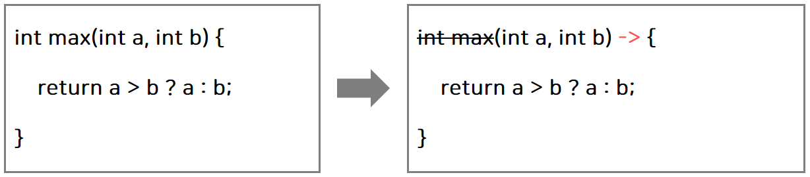

    * 반환 값이 있는 경우, 식이나 값만 적고 return 문 생략 가능 (끝에 ‘;’ 을 붙이지 않는다.) 

        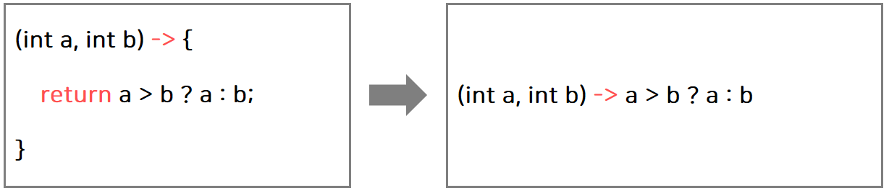

    * 매개변수의 타입이 추론 가능하면 생략 가능 (대부분의 경우, 생략 가능) 

        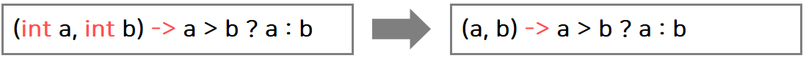
 
    * 매개변수가 하나인 경우, 소괄호() 생략 가능 (단, 타입이 없을 때만) 

        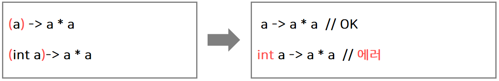

    * 블록 안의 문장이 하나 일 때는 중괄호 {} 생략 가능 (끝에 ‘;’ 을 붙이지 않는다) 

        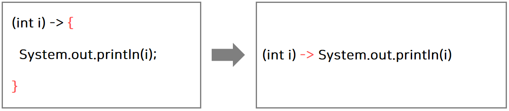  
  
    * 단, 하나뿐인 문장이 return문이면 중괄호{} 생략 불가 [대부분, return을 생략하기 때문에 신경 X]

        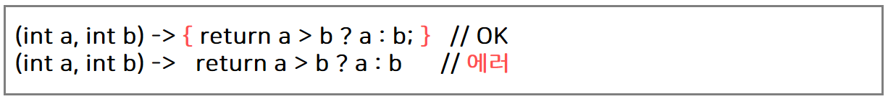  

* (3) 람다식은 익명 함수? 익명 객체!

    * 람다식은 익명 함수가 아니라 `익명 클래스의 객체(익명 객체)`와 같다. 
    
        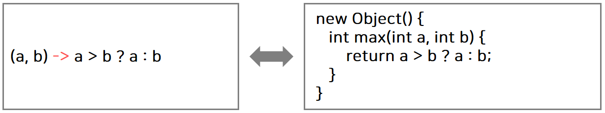
    
    * 람다식(익명 객체)를 다루기 위한 참조변수가 필요하다. 그런데 참조변수의 타입은 어떻게 지정해야 할까? `함수형 인터페이스`
    
        * `타입 obj = (a, b) -> a > b ? a : b;`

#### 2) 함수형 인터페이스
        
* (1) 함수형 인터페이스(Functional Interface)

    * `함수형 인터페이스`는 하나의 추상 메서드만 선언된 인터페이스이다.

* (2) 함수형 인터페이스 - 예시

    * ① 예를 들어, 아래와 같이 `max()`라는 메서드가 정의된 `MyFunction` 인터페이스(함수형 인터페이스)를 정의한다.
    
        ```java
         @FunctionalInterface
         interface MyFunction {
             public abstract int max(int a, int b);  // 추상 메서드
         }
        ```

    * ② 그러면 이 인터페이스를 구현한 익명 클래스의 객체는 다음과 같이 생성한 다음, max()를 호출 할 수 있다.
    
        ```java
         MyFunction f = new MyFunction() {
                            public int max(int a, int b) {
                                  return a > b ? a : b;
                            }
                        };
                        
         int big = f.max(5, 3);
        ```
      
    * ③ MyFunction 인터페이스에 정의된 메서드 max()는 람다식 `(int a, int b) -> a > b ? a : b`과 메서드의 선언부가 일치한다. 
    
    * 그래서 위에서 살펴본 코드의 익명 객체를 람다식으로 대체할 수 있다.
    
        ```java
        // 람다식(익명 객체)을 다루기 위한 참조변수의 타입은 "함수형 인터페이스"로 한다.
        MyFunction f = (int a, int b) -> a > b ? a : b;  // 익명 객체를 람다식으로 대체
        
        int big = f.max(5,3); // 익명 객체의 메서드를 호출
        ```

        * 함수형 인터페이스 타입의 참조변수로 람다식을 참조할 수 있음. 
        
        * 단, 함수형 인터페이스의 메서드와 람다식의 매개변수의 타입과 개수 그리고 반환 값이 일치해야 함.

* (3) 함수형 인터페이스 타입의 매개변수와 반환 타입

    * 함수형 인터페이스 타입의 매개변수
    
        * 함수형 인터페이스 MyFunction가 정의되어 있다.
    
            ```java
            // 람다식(익명 객체)을 다루기 위한 참조변수의 타입은 "함수형 인터페이스"로 한다.
            MyFunction f = (int a, int b) -> a > b ? a : b;  // 익명 객체를 람다식으로 대체
            
            int big = f.max(5,3); // 익명 객체의 메서드를 호출
            ```
    
        * ① 메서드 호출 시, 람다식을 가리키는 참조변수를 매개변수로 지정하는 경우
    
            ```java
            void aMethod(MyFunction f) {  // 매개변수의 타입이 함수형 인터페이스
                f.myMethod(); // MyFunction에 정의된 메서드 호출 (람다식 호출)
            }
            
            //...
            
            MyFunction f = ()-> System.out.println("myMethod()");
            
            aMethod(f);
            ```
      
          * 위와 같이 메서드(aMethod)를 호출할 때, 
              
          * "메서드의 매개변수 타입이 함수형 인터페이스(MyFunction)이면 해당 함수형 인터페이스의 추상 메서드와 동등한 람다식을 가리키는 참조변수 또는 직접 람다식을 매개변수로 지정해야 한다"는 뜻이다.
          
        * ② 메서드 호출 시, 직접 람다식을 매개변수로 지정하는 경우 
    
            ```java
            aMethod( ()-> System.out.println("myMethod()") );
            ```

    * 함수형 인터페이스 타입의 반환 타입
     
      * "메서드의 반환 타입이 함수형 인터페이스이면 해당 함수형 인터페이스의 추상 메서드와 동등한 람다식을 가리키는 참조변수를 반환하거나 직접 람다식을 반환해야 한다"는 뜻이다.     
 
        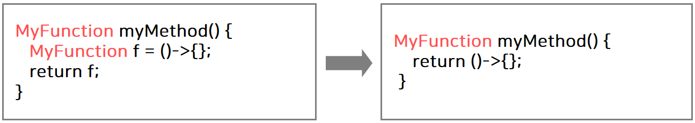

#### 3) java.util.function 패키지
        
* (1) java.util.function 패키지

    * 자주 사용되는 다양한 함수형 인터페이스를 제공한다.
    
* (2) 함수형 인터페이스의 종류

    * ① `Runnable` : **매개변수도 없고 반환 값도 없는** 추상 메서드를 가지고 있다.
    
        * `void run()`
        
        * 예시
        
            ```java
            Runnable runnable = () -> {
                for(int i=0; i<10; i++){
                    System.out.println(i);
                }
            };
            
            Thread thread = new Thread(runnable);
            thread.start();
            ```           
        
    * ② `Consumer` : **매개변수만 있고 반환 값이 없는 추상** 메서드를 가지고 있다. 
    
        * `void accept(T t)`
        
    * ③ `Supplier` : **매개변수는 없고 반환 값만 있는 추상** 메서드를 가지고 있다.
    
        * `T get()`
        
    * ④ `Function`
    
        * **매개변수와 반환 값이 모두 있는** 추상 메서드를 가지고 있다. 
    
            * `R apply(T t)`
        
        * 주로 **매개변수의 값을 반환 타입으로 매핑(형 변환)** 할 경우에 사용한다.
        
    * ⑤ `Operator`
      
        * **매개변수와 반환 값이 모두 있는** 추상 메서드를 가지고 있다.
        
            * `T apply(T t)`
            
            * `T apply(T t, T t)`
        
        * 주로 **매개변수의 값을 연산한 다음, 그 결과를 반환** 할 경우에 사용한다.
        
    * ⑥ `Predicate`
      
        * **매개변수와 반환 값이 모두 있는** 추상 메서드를 가지고 있다.
        
            * `boolean test(T t)`
        
        * **매개변수의 값을 검사하여 boolean 값을 반환** 할 때 사용한다.

* (3) 매개변수가 2개인 함수형 인터페이스

    * ① `BiConsumer<T, U>` : 두 개의 매개변수만 있고 반환 값이 없다.
    
    * ② `BiPredicate<T, U>` : 두 개의 매개변수가 있고 반환 값이 boolean이다. 조건식을 표현하는데 사용 됨 
    
    * ③ `BiFunction<T, U, R>` : 두 개의 매개변수를 받아서 하나의 결과를 반환한다.
    
        * `Bi` : "두 개"를 의미한다.
        
        * `T`, `U` : 매개변수 타입 , `R` : 반환 타입
        
* (4) 매개변수가 3개인 함수형 인터페이스를 만들기

    * 매개변수가 3개 이상의 함수형 인터페이스가 필요하다면 직접 만들어서 사용해야 한다.
    
        ```java
        @FunctionalInterface
        interface TriFunction<T, U, V, R>{
            R apply(T t, U u, V v);
        }
        ```
      
* (5) 매개변수의 타입과 반환타입이 일치하는 함수형 인터페이스

    * `UnaryOperator<T>` 
    
        * `Function`의 자손 
        
        * `Function`과 달리, 매개변수와 반환 타입이 같다.
        
            * `T apply(T t)`
    
    * `BinaryOperator<T>`
    
        * `BiFunction`의 자손
        
        * `BiFunction`과 달리, 매개변수와 반환 타입이 같다.
        
            * `T apply(T t, T t)`
            
* (6) 실습

    ```java
    class Ex14_2 {
    	public static void main(String[] args) {
    		Supplier<Integer>  s = ()-> (int)(Math.random() * 100) + 1; // 1 ~ 100 까지 난수 발생
    		Consumer<Integer>  c = i -> System.out.print(i + ", "); 
    		Predicate<Integer> p = i -> i % 2 == 0; // 짝수인지 검사한다.
    		Function<Integer, Integer> f = i -> i / 10 * 10; // i의 일의 자리를 제거한다. (일의 자리를 0으로 만듦)
    		
    		List<Integer> list = new ArrayList<>();	
    		makeRandomList(s, list); // list를 랜덤 값으로 채운다.
    		System.out.println(list);
    		printEvenNum(p, c, list); // 짝수를 출력한다.
  
    		List<Integer> newList = doSomething(f, list);
    		System.out.println(newList);
    	}
    
    	static <T> List<T> doSomething(Function<T, T> f, List<T> list) {
    		List<T> newList = new ArrayList<T>(list.size()); // list의 사이즈와 같은 새로운 List를 만든다.
    
    		for(T i : list) {
    			newList.add(f.apply(i)); // 일의 자리를 제거한 값을 새로운 리스트에 저장한다.
    		}	
    
    		return newList; // 새로운 리스트를 반환한다.
    	}
    
    	static <T> void printEvenNum(Predicate<T> p, Consumer<T> c, List<T> list) {
    		System.out.print("[");
    		for(T i : list) {
    			if(p.test(i)) // 짝수인지 검사하여 콘솔에 i를 출력한다.
    				c.accept(i);
    		}	
    		System.out.println("]");
    	}
    
    	static <T> void makeRandomList(Supplier<T> s, List<T> list) {
    		for(int i=0;i<10;i++) {
    			list.add(s.get());
    		}
    	}
    }
    ```

#### 4) Function의 합성, Predicate의 결합, CF와 함수형 인터페이스

* (1) Function의 합성

    * `andThen()`, `compose()`로 두 개의 Function를 합성해서 하나의 새로운 함수를 만들 수 있다.
    
        * 즉, 두 람다식을 합쳐서 새로운 람다식을 만들 수 있다.
      
    * `andThen()`과 `compose()`의 차이점은 어떠한 함수형 인터페이스부터 적용하는지가 다르다.
    
        * `f.andThen(g)`는 함수 f를 먼저 적용하고, 그 다음에 함수 g를 적용한다.
        
        * `f.compose(g)`는 반대로, 함수 g를 먼저 적용하고, 그 다음에 함수 f를 적용한다.
    
* (2) Predicate의 결합

    * `and()`, `or()`, `negate()`로 두 Predicate를 하나로 결합 할 수 있다. (default 메서드)

        * ① and() : 두 Predicate가 모두 true를 반환 하면 true를 반환
        
        * ② or() : 두 Predicate 중 하나만 true를 반환 하면 true를 반환
        
        * ③ negate() : Predicate의 결과가 true이면 false, false이면 true를 반환

    * 등가 비교를 위한 Predicate의 작성에는 `isEqual()`를 사용한다. (static 메서드)
    
        * `isEqual()`의 매개변수로 비교 대상을 하나 지정하고, 또 다른 비교 대상은 `test()`의 매개변수로 지정한다. 
    
    * 예시 - and(), or(), negate()
          
        ```java
        Predicate<Integer> p = i -> i < 100;
        Predicate<Integer> q = i -> i < 200;
        Predicate<Integer> r = i -> i % 2 == 0;
        
        Predicate<Integer> notP = p.negate();        // i >= 100
        Predicate<Integer> all = notP.and(q).or(r);  // 100 <= i && i < 200 || i % 2 == 0
        Predicate<Integer> all2 = notP.and(q.or(r)); // 100 <= i && (i < 200 || i % 2 == 0)
        ```
      
        ```java
        System.out.println(all.test(2));  // true
        System.out.println(all2.test(2)); // false
        ```
      
    * 예시 - isEqual()
          
        ```java
        String str1 = "abc";
        String str2 = "abc";

        Predicate<String> p = Predicate.isEqual(str1); // isEqual()은 static 메서드
        boolean result = p.test(str2); // str1과 str2가 같은지 비교한 결과를 반환
        //boolean result = Predicate.isEqual(str1).test(str2);
        ```

* (3) 항등 함수

    * `항등 함수`는 함수에 x를 대입하면 결과가 x인 함수를 말한다.
    
        * 즉, 입력 받은 것을 그대로 반환한다.
       
    * 예시
     
        ```java
        Function<String, String> f = x -> x;
        //Function<String, String> f = Function.identity(); // 위의 문장과 동일
        
        System.out.println(f.apply("AAA")); // AAA가 그대로 출력 됨
        ```

* (4) 실습 - Function의 합성, Predicate의 결합

    ```java
    class Ex14_3 {
    	public static void main(String[] args) {
    		Function<String, Integer>	f  = (s) -> Integer.parseInt(s, 16);
    		Function<Integer, String>	g  = (i) -> Integer.toBinaryString(i);
    
    		Function<String, String>    h  = f.andThen(g);
    		Function<Integer, Integer>  h2 = f.compose(g);
    
    		System.out.println(h.apply("FF")); // "FF" → 255 → "11111111"
    		System.out.println(h2.apply(2));   // 2 → "10" → 16
    
    		Function<String, String> f2 = x -> x; // 항등 함수(identity function)
    		System.out.println(f2.apply("AAA"));  // AAA가 그대로 출력됨
    
    		Predicate<Integer> p = i -> i < 100;
    		Predicate<Integer> q = i -> i < 200;
    		Predicate<Integer> r = i -> i%2 == 0;
    		Predicate<Integer> notP = p.negate(); // i >= 100
    
    		Predicate<Integer> all = notP.and(q.or(r));
    		System.out.println(all.test(150));       // true
    
    		String str1 = "abc";
    		String str2 = "abc";
    		
    		// str1과 str2가 같은지 비교한 결과를 반환
    		Predicate<String> p2 = Predicate.isEqual(str1); 
    		boolean result = p2.test(str2);   
    		System.out.println(result);
    	}
    }
    ```

* (5) 컬렉션 프레임워크와 함수형 인터페이스

    * 컬렉션 프레임워크의 인터페이스에 여러 개의 디폴트 메서드가 추가 되었다.
    
    * 그 중 함수형 인터페이스를 사용하는 컬렉션 프레임워크의 메서드를 살펴본다.
    
        * Collection 인터페이스
        
            * `boolean removeIf(Predicate<E> filter)` : 조건(filter)에 맞는 요소를 삭제한다.

        * List 인터페이스
              
            * `void replaceAll(UnaryOperator<E> operator)` : 모든 요소를 변환(operator)하여 대체한다.
      
        * Iterable 인터페이스
          
            * `void forEach(Consumer<T> action)` : 모든 요소에 작업(action)을 수행한다.
            
        * Map 인터페이스
        
            * `V compute(K key, BiFunction<K, V, V> f)` : 지정된 키(key)의 값에 작업(f)를 수행
            
            * `V computeIfAbsent(K key, Function<K, V> f)` : 지정된 키(key)가 없으면, 작업(f)을 수행 후 추가
            
            * `V computeIfPresent(K key, BiFunction<K, V, V> f)` : 지정된 키가 있을 때, 작업(f을) 수행
            
            * `V merge(K key, BiFunction<V, V, V> f)` : 모든 요소에 병합 작업(f)을 수행
            
            * `void forEach(BiConsumer<K, V> action)` : 모든 요소에 작업(action)을 수행
            
            * `void replaceAll(BiFunction<K, V, V> f)` : 모든 요소에 치환 작업(f)을 수행
            
    * 예시
    
        ```java
        ArrayList<Integer> list = new ArrayList<>();
        for(int i = 0; i < 10; i++)
            list.add(i);

        list.forEach(i -> System.out.print(i+","));     // list의 모든 요소를 출력
        list.removeIf(x -> x % 2 == 0 || x % 3 == 0);   // list에서 2 또는 3의 배수를 제거
        list.replaceAll(i -> i * 10);                   // list의 모든 요소에 10을 곱한다.

        Map<String, String> map = new HashMap<>();
        map.put("1", "1");
        map.put("2", "2");
        map.put("3", "3");
        map.put("4", "4");

        // map의 모든 요소를 {k,v}의 형식으로 출력한다.
        map.forEach((k,v)-> System.out.print("{" + k + "," + v + "},"));
        ```

* (6) 실습 - 컬렉션 프레임워크와 함수형 인터페이스

        ```java
        class Ex14_4 {
            public static void main(String[] args) 	{
                ArrayList<Integer> list = new ArrayList<>();
                for(int i = 0; i < 10; i++)
                    list.add(i);
        
                // list의 모든 요소를 출력
                list.forEach(i -> System.out.print(i + ","));
                System.out.println();
        
                // list에서 2 또는 3의 배수를 제거한다.
                list.removeIf(x -> x % 2 == 0 || x % 3 == 0);
                System.out.println(list);
        
                list.replaceAll(i -> i * 10); // list의 각 요소에 10을 곱한다.
                System.out.println(list);
        
                Map<String, String> map = new HashMap<>();
                map.put("1", "1");
                map.put("2", "2");
                map.put("3", "3");
                map.put("4", "4");
        
                // map의 모든 요소를 {k,v}의 형식으로 출력한다.
                map.forEach((k, v)-> System.out.print("{" + k + "," + v + "},"));
                System.out.println();
            }
        }
        ```

#### 5) 메서드 참조(method reference)

* (1) 메서드 참조

    * 하나의 메서드만 호출하는 람다식은 `메서드 참조`로 더 간단히 할 수 있다.
    
    * `클래스명::메서드명`으로 바꿀 수 있다.
    
        * ① static 메서드 참조
        
            * `클래스명::메서드명` 
            
                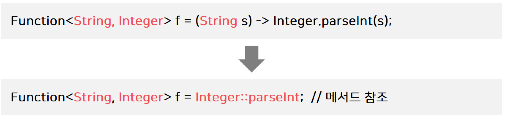
            
        * ② 인스턴스 메서드 참조
        
            * `클래스명::메서드명`
            
                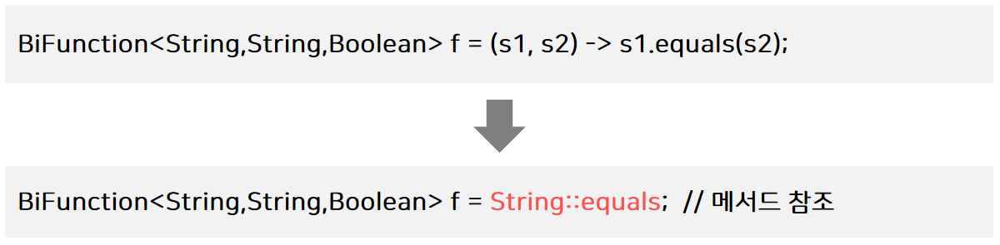

        * ③ 특정 객체의 인스턴스 메서드 참조 **(거의 사용 되지 X)**

            * `참조변수명::메서드명`
            
                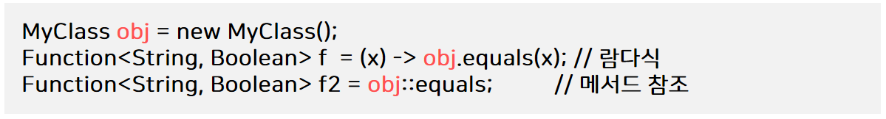

                * 이미 생성된 객체의 메서드를 람다식에서 사용한 경우에는 클래스 이름 대신 그 객체의 참조변수를 적어줘야 한다.

* (2) 실습 - 메서드 참조

    ```java
    public class MethodReferenceEx {
        public static void main(String[] args) {
            Function<String, Integer> f = (String s) -> Integer.parseInt(s);
            //Function<String, Integer> f = Integer::parseInt; // 메서드 참조
            /*
            * 참조변수의 타입을 보면 매개변수 타입을 추측 할 수 있기 때문에
            * (String s)를 생략한 "메서드 참조"로 작성 할 수 있다.
            * ★★★ 람다식 ↔ 메서드 참조 간의 변환 연습을 해서 익숙해지자.
            * */
            System.out.println(f.apply("100") + 200);
        }
    }
    ```
  
* (3) 생성자 및 배열 생성의 메서드 참조

    * ① `생성자의 메서드 참조` : 생성자를 호출하는 람다식을 메서드 참조로 변환
    
        * `클래스명::new` 
        
            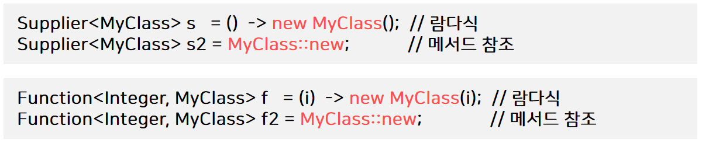
                   
    * ② `배열 생성의 메서드 참조` : 배열을 생성하는 람다식을 메서드 참조로 변환
    
        * `배열타입[]::new`
        
            

* (4) 실습 - 생성자 및 배열 생성의 메서드 참조

    ```java
    public class MethodReferenceEx {
        public static void main(String[] args) {
            /*
            * 생성자의 메서드 참조
            * */
            Supplier<MyClass> s = MyClass::new;
            //Supplier<MyClass> s = () -> new MyClass();
            System.out.println(s.get()); // MyClass 객체를 생성한 다음, 출력
            System.out.println(s.get()); // 또 다른 MyClass 객체를 생성한 다음, 출력
    
            Function<Integer, MyClass2> f = i -> new MyClass2(i);
            //Function<Integer, MyClass2> f = MyClass2::new;
            System.out.println(f.apply(100).iv);
    
            /*
             * 배열 생성의 메서드 참조
             * */
            Function<Integer, int[]> f2 = int[]::new;
            //Function<Integer, int[]> f2 = (i) -> new int[i];
            // 길이가 100인 배열을 생성한 다음, 그 길이를 출력한다.
            System.out.println(f2.apply(100).length);
        }
    }
    
    class MyClass {}
    
    class MyClass2 {
        int iv;
    
        MyClass2(int iv){
            this.iv = iv;
        }
    }
    ```

#### 6) 스트림(Stream)

* (1) 스트림(Stream)

    * `스트림(Stream)`은 다양한 데이터 소스를 표준화된 방법으로 다루기 위한 것
    
        * 데이터 소스 : 컬렉션 또는 배열처럼 여러 데이터를 저장하고 있는 것을 말함
        
        * 예를 들어, 컬렉션은 List, Set과 Map은 사용 방법이 다르다. (100% 표준화 된 것은 아님)
        
    * 스트림으로 작업하는 과정은 다음과 같다.
    
        * ① `스트림 생성`
                      
        * ② `중간 연산` : 여러 번 가능
        
        * ③ `최종 연산` : 1번만 가능
        
    * 스트림이 제공하는 기능 - 중간 연산과 최종 연산
    
        * `중간 연산` : 연산 결과가 스트림인 연산이다. 반복적으로 적용 가능
        
        * `최종 연산` : 연산 결과가 스트림이 아닌 연산이다. 단 한번만 적용 가능 (스트림의 요소를 소모)
        
        * `stream.distinct().limit(5).sorted().forEach(System.out::println)`
        
            * `distinct().limit(5).sorted()` : 중간 연산
            
            * `forEach(System.out::println)` : 최종 연산
            
* (2) 스트림의 특징

    * 스트림은 데이터 소스로 부터 데이터를 읽기만 할 뿐 변경하지 않는다. (즉, 원본을 변경하지 않는다.)
    
        ```java
        List<Integer> list = Arrays.asList(3, 1, 5, 4, 2);
        
        /*
        * list를 스트림으로 만들어서 정렬한 다음, 새로운 List에 저장한다.
        * */
        List<Integer> sortedList = list.stream().sorted()
                .collect(Collectors.toList());
        
        System.out.println(list); // [3, 1, 5, 4, 2]
        System.out.println(sortedList); // [1, 2, 3, 4, 5]
        ```
      
    * 스트림은 일회용이다. (필요하면 다시 스트림을 생성해야 한다.)
    
        ```java
        String[] strArr = {"aaa", "ddd", "ccc"};
        Stream<String> strStream = Arrays.stream(strArr);
        
        strStream.forEach(System.out::println); // 모든 요소를 화면에 출력 (최종 연산)
      
        /*
        * 스트림에 더 이상 사용 할 요소가 없어서 스트림이 닫힌다.
        * 에러. 스트림이 이미 닫혔음.
        * */
        int numOfStr = (int) strStream.count();
        ```
      
    * 최종 연산이 수행되기 전까지는 중간 연산이 수행되지 않는다. - 지연된 연산
    
        ```java
        /*
        * 1~45 범위의 난수를 생성하는 무한 스트림
        * 즉, 로또 번호를 생성하여 출력한다.
        * */
        IntStream intStream = new Random().ints(1, 46);
        intStream.distinct().limit(6).sorted()
                .forEach(i -> System.out.print(i + ", "));
        ```
      
    * 스트림은 작업을 내부 반복으로 처리한다.
    
        * 내부 반복이라는 것은 반복문을 메서드의 내부에 숨긴 것을 말한다.
        
            ```java
            for (String str : strList) {
                System.out.println(str);
            }
            ```
          
        * forEach()는 매개변수에 대입된 람다식을 데이터 소스의 모든 요소에 적용한다. (코드가 간결해 짐)
        
            ```java
            stream().forEach(System.out::println);
            ```
          
    * 스트림의 작업을 병렬로 처리 할 수 있다. - 병렬 스트림
    
        * 병렬 스트림은 내부적으로 `fork&join 프레임워크`를 이용해서 자동적으로 연산을 병렬로 수행한다.
        
            ```java
            Stream<String> strStream = Stream.of("dd", "aaa", "CC", "cc", "b");
            int sum = strStream.parallel()     // 병렬 스트림으로 전환(속성만 변경)
                    .mapToInt(s -> s.length()) // 모든 문자열의 길이의 합
                    .sum();
            ```
          
    * 기본형 스트림을 제공한다. - IntStream, LongStream, DoubleStream
    
        * 즉, 데이터 소스의 요소를 기본형으로 다루는 스트림을 제공한다.
    
        * 오토박싱, 언박싱으로 인한 비효율이 제거된다. (`Stream<Integer>` 대신 `IntStream`을 사용한다.)
        
            * `Stream<Integer> `: Stream의 요소가 Integer다. (기본형은 불가능)
        
        * 숫자와 관련된 유용한 메서드를 `Stream<T>` 보다 더 많이 제공한다.

#### 7) 스트림 만들기
 
* (1) 스트림 만들기 - 컬렉션으로 부터 스트림 만들기

    * `Collection` 인터페이스의 `stream()`로 컬렉션을 스트림으로 변환한다.
    
        * `Stream<E> stream()` 
    
    * 예시
    
        ```java
        List<Integer> list = Arrays.asList(1, 2, 3, 4, 5);
        Stream<Integer> intStream = list.stream(); // list로 부터 스트림을 생성

        /*
        * 스트림의 모든 요소를 출력, forEach()는 최종 연산이므로 스트림이 닫힌다.
        * 즉, stream은 1회용이다. stream에 대해 최종 연산을 수행하면 stream이 닫힌다.
        * */
        intStream.forEach(System.out::print); // 12345
        System.out.println();

        intStream = list.stream(); // list로 부터 스트림을 다시 생성
        intStream.forEach(System.out::print);
        ```      

* (2) 스트림 만들기 - 배열로 부터 스트림 만들기

    * 객체 배열로 부터 스트림 생성하기
    
        * `Stream<T> Stream.of(T... values)`
                
        * `Stream<T> Stream.of(T[])`
        
        * `Stream<T> Arrays.stream(T[])`
        
        * `Stream<T> Arrays.stream(T[] array, int startInclusive, int endExclusive)` 
        
            * 배열의 일부를 스트림으로 만들 때 사용한다. (마지막 요소는 범위에 포함되지 않음)
                
    * 기본형 배열로 부터 스트림 생성하기
    
        * `IntStream IntStream.of(int... values)`
        
        * `IntStream IntStream.of(int[])`
        
        * `IntStream Arrays.stream(int[])`
        
        * `IntStream Arrays.stream(int[], int startInclusive, int endExclusive)`
        
    * 예시
    
        ```java
        // 문자열 스트림 생성
        Stream<String> strStream1 = Stream.of("a", "b", "c");
        Stream<String> strStream2 = Stream.of(new String[]{"a", "b", "c"});
        Stream<String> strStream3 = Arrays.stream(new String[]{"a", "b", "c"});
        Stream<String> strStream4 = Arrays.stream(new String[]{"a", "b", "c"}, 0, 3);
        strStream1.forEach(System.out::println);
        System.out.println();

        int[] intArr = {1, 2, 3, 4, 5};
        IntStream intStream = Arrays.stream(intArr);
        intStream.forEach(System.out::println);
        //System.out.println(intStream.sum());
        System.out.println();
      
        /*
        * Stream<T>는 숫자 외에도 여러 타입의 스트림이 가능해야 하므로
        * 숫자 스트림에만 사용 할 수 있는 sum(), average()를 넣지 않은 것이다.
        * */
        Integer[] intArr2 = {1, 2, 3, 4, 5};
        Stream<Integer> intStream2 = Arrays.stream(intArr2);
        intStream2.forEach(System.out::println);
        //System.out.println("count=" + intStream2.count());
        ```  
    
* (3) 스트림 만들기 - 임의의 수(난수)

    * 난수를 요소로 갖는 스트림 생성하기
    
        * Random 클래스의 `ints()`, `longs()`, `doubles()`는 해당 타입의 난수들로 이루어진 스트림을 반환한다.

            ```
            Integer.MIN_VALUE <= ints() <= Integer.MAX_VALUE
            Long.MIN_VALUE <= longs() <= Long.MAX_VALUE
            0.0 <= doubles() < 1.0
            ```
               
        * 이 메서드들이 반환하는 스트림은 크기가 정해지지 않은 무한 스트림이므로 limit()으로 스트림의 크기를 제한 해주어야 한다.
                
        * `limit()`는 스트림의 요소 개수를 제한하는데 사용된다.

            ```java
            IntStream intStream = new Random().ints(); // 무한 스트림
            intStream.limit(5).forEach(System.out::println); // 5개의 요소만 출력한다.
    
            IntStream intStream2 = new Random().ints(5); // 크기가 5인 난수 스트림을 반환한다.
            ```
          
        * 지정된 범위의 난수를 요소로 갖는 스트림을 생성하는 메서드(Random 클래스)

            ```
            // begin은 범위에 포함되며 end는 범위에 포함되지 않는다.
            // 무한 스트림 
            IntStream ints(int begin, int end)
            LongStream longs(long begin, long end)
            DoubleStream doubles(double begin, double end)
            
            // 유한 스트림
            IntStream ints(long streamSize, int begin, int end)
            LongStream longs(long streamSize, long begin, long end)
            DoubleStream doubles(long streamSize, double begin, double end)
            ```
        
* (4) 스트림 만들기 - 특정 범위의 정수

    * 특정 범위의 정수를 요소로 갖는 스트림 생성하기(IntStream, LongStream)
    
        * `IntStream IntStream.range(int begin, int end)`
        
        * `IntStream IntStream.rangeClosed(int begin, int end)`
        
            * `rangeClosed()`는 끝 범위(end)가 포함된다.
        
    * 예시
    
        ```java
        IntStream intStream1 = IntStream.range(1, 5);        // 1, 2, 3, 4
        IntStream intStream2 = IntStream.rangeClosed(1, 5); // 1, 2, 3, 4, 5

        intStream1.forEach(System.out::println);
        intStream2.forEach(System.out::println);
        ```
      
* (4) 스트림 만들기 - 람다식으로 스트림을 만드는 `iterate()`, `generate()`

    * 람다식을 소스로 하는 스트림 생성하기 (무한 스트림)
    
        * `static <T> Stream<T> iterate(T seed, UnaryOperator<T> f)` : 이전 요소에 종속적
    
        * `static <T> Stream<T> generate(Supplier<T> s)` : 이전 요소에 독립적
    
    * `iterate()`는 이전 요소를 seed로 해서 다음 요소를 계산한다.

        ```java
        // Stream.iterate(초기 값, 람다식)
        Stream<Integer> evenStream = Stream.iterate(0, n -> n + 2); // 0, 2, 4, 6 ...
        
        /*  n -> n + 2
          ===============
            0 -> 0 + 2
            2 -> 2 + 2
            4 -> 4 + 2
                ...     */
        ```
      
    * `generate()`는 seed를 사용하지 않는다.
    
        ```java
        // Math.random()를 호출한 값을 계속 생성하는 무한 스트림
        Stream<Double> randomStream = Stream.generate(Math::random);
        // 계속해서 1을 만드는 무한 스트림
        Stream<Integer> oneStream = Stream.generate(() -> 1);
        ```
    
* (5) 스트림 만들기 - 파일과 빈 스트림

    * 파일을 소스로 하는 스트림 생성하기
    
        * `Stream<Path> Files.list(Path dir)`
        
            * `Path`는 파일 또는 디렉토리

    * 아래 메서드들은 파일의 한 행(line)을 요소로 하는 스트림을 생성한다. 

        ```java
        Stream<String> Files.lines(Path path)
        Stream<String> Files.lines(Path path, Charset cs)
        Stream<String> lines() // BufferedReader 클래스의 메서드
        ```
      
    * 비어있는 스트림 생성하기
    
        ```java
        Stream emptyStream = Stream.empty(); // empty()는 비어있는 스트림을 생성해서 반환한다.
        long count = emptyStream.count(); // count의 값은 0
        ```
        
## 14. 입출력(I/O)

    


    

      


      
  
    
   

    

            


    


    


    


        

        


    
    
    
    
    
    

    

    

    


  

  

  

  

  

    


     
