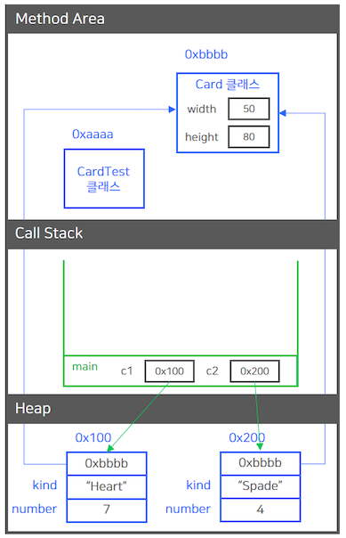
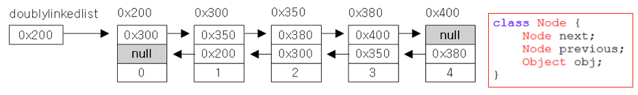
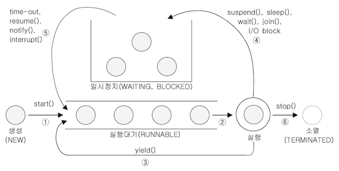
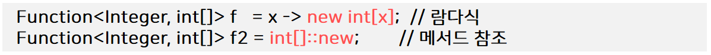

# 자바(Java) 기본 문법 정리
> 아래 내용은 [자바의 정석](https://book.naver.com/bookdb/book_detail.nhn?bid=10191151 "자바의 정석")을 참고 하였습니다.

## 1. 변수(Variable)

#### 1) 변수(Variable)란?

* 변수(Variable)는 하나의 값을 저장할 수 있는 메모리 공간

#### 2) 변수의 선언

* 변수의 선언 방법

  `변수타입 변수이름;`
  
* 변수 선언 예시

    ```java
    int age;      // 정수 타입의 변수 age를 선언
    ```
 
#### 3) 변수에 값 저장하기

* 변수에 값 저장하기

    ```java
    int age;      // 정수 타입의 변수 age를 선언
    age = 25;     // 변수 age에 25를 저장
    ```
  
* 변수에 값 저장하기 (축약형)

    ```java
    int age = 25;
    ```
  
* 변수의 초기화는 변수에 처음으로 값을 저장하는 것을 말한다.

    * 지역변수는 사용하기 전에 반드시 초기화를 해야한다. 그렇지 않으면 컴파일 시 에러가 발생한다.

        ```java
        int x = 0; // 변수 x를 선언 후, 0으로 초기화
        int y = 0;
      
        int x = 0, y = 5; // 위의 두 줄을 한 줄로 표현할 수 있다.
        ```
      
#### 4) 변수의 값 읽어오기

* 변수에 값이 필요한 곳에 변수 이름을 적으면 된다.

    ```java
    int year = 0, age = 14; // int형 변수 year, age를 선언한 다음, 각각 0과 14로 초기화한다.
    year = age + 2000; // 2014
    ```
  
#### 5) 변수의 타입

* 변수의 타입은 저장할 값의 타입에 의해 결정된다.

* 저장할 값의 타입과 일치하는 타입으로 변수를 선언한다.

    ```java
    char ch = '가';    // char는 문자 타입
    double pi = 3.14; // double은 실수 타입
    ```
  
* 변수의 타입은 크게 기본형과 참조형으로 나눌 수 있다.

    * `기본형(Primitive type)`
    
        * 8개의 타입이 있다. (char, byte, short, int, long, float, double, boolean)
    
        * 실제 값을 저장한다.
        
    * `참조형(Reference type)`
    
        * 기본형을 제외한 나머지 타입 (String, System 등)
    
        * 객체의 주소를 저장한다. (4 byte 또는 8 byte)
              
#### 6) 상수와 리터럴

* 변수(Variable) : 하나의 값을 저장할 수 있는 공간

* 상수(constant) : 한 번만 값을 저장 할 수 있는 공간

* 리터럴(literal) : 그 자체로 값을 의미하는 것

    ```java
    final int MAX = 100; // MAX는 상수
    MAX = 200; // 에러 발생
    ```
  
#### 7) 리터럴의 접두사와 접미사

* 접두사

    * 정수형 리터럴 앞에 어떠한 접두사도 없다면 10 진수
    
    * 정수형 리터럴 앞에 0를 붙이면 8진수이다.
    
    * 정수형 리터럴 앞에 0x를 붙이면 16진수이다.
    
    * 정수형 리터럴 앞에 0b를 붙이면 2진수이다. (JDK 1.7 부터 추가됨)
    
        ```java
        int i = 100;
        int oct = 0100;
        int hex = 0x100;
        ```

* 접미사

    * Long 타입의 리터럴에는 접미사 l 또는 L를 사용한다.
 
         ```java
         long l = 10_000_000_000L; // 100억은 int의 최대 값인 20억을 넘기 때문에 접미사 L을 붙이지 않으면 에러가 발생한다.
         long l = 100; // OK
         ```
    
    * float 타입의 리터럴에는 접미사 f 또는 F를 사용한다.
    
    * double 타입의 리터럴에는 접미사 d 또는 D를 사용한다.

         ```java
         float f = 3.14f;
         double d = 3.14d; // d는 생략가능
         ```

* 소수점(.)과 e의 의미
    
    * 소수점(.)의 의미는 다음과 같다.   
        
        * `10.` → `10.0d`
        
        * `.10` → `0.10d`
    
        * `10f` → 10.0f
    
    * e는 10^n를 의미한다.
    
        * `1e3` → `1000.0d`
    
    * 리터럴에 소수점(.) 또는 e, 실수형 접미사(f, d)가 포함된 경우, 실수형 리터럴로 간주한다.

#### 8) 문자와 문자열

 ```java
char ch = 'A';    // char형 변수는 단 하나의 문자밖에 저장 할 수 없다.
char ch = 'AB';   // 둘 이상의 문자를 저장하려고 하면 에러가 발생한다.
String s = "ABC"; // 문자열을 저장하려면 변수의 타입은 String이어야 한다.

char ch = ''; // char형 변수에는 반드시 하나의 문자를 저장해야하므로 에러가 발생한다.
String s = ""; // String 타입의 변수에는 빈 문자열을 저장 할 수 있다.

String s1 = "A" + "B" // String은 덧셈 연산자를 이용해서 문자열을 결합할 수 있다.

// "" + 7는 문자열 "7"이 된다. 즉, 숫자를 문자열로 변경하려면 숫자 + 문자열을 하면된다.
 ```

* 문자열에 어떤 타입을 더하면 그 결과는 문자열이 된다.

#### 9) 두 변수의 값 교환하기

 ```java
int x = 10, y = 20;
int temp;

temp = x;   // x의 값을 temp에 저장
x = y;      // x의 값을 y에 저장
y = temp;   // temp의 값을 y에 저장
 ```

#### 10) 기본형(Primitive type)의 종류와 범위

* 기본형의 종류

    * 논리형 - true와 false 중 하나를 값으로 갖으며, 조건식과 논리적 계산에 사용된다. boolean이 있다.
    
    * 문자형 - 문자를 저장하는데 사용되며, 변수 당 하나의 문자만을 저장 할 수 있다.
    
    * 정수형 - 정수 값을 저장하는데 사용된다. 주로 사용하는 것은 int와 long이며, byte는 이진 데이터를 다루는데 사용되며, short는 c 언어와의 호환을 위해 추가되었다. (잘 쓰이지 않음)

    * 실수형 - 실수 값을 저장하는데 사용된다. float와 double이 있다.

* 기본형의 크기

    * 논리형 - boolean (1byte)

    * 문자형 - char (2byte)

    * 정수형 - byte (1byte) , short (2byte) , int (4byte, 디폴트 타입), long (8byte)
    
    * 실수형 - float (4byte) , double (8byte, 디폴트 타입)
    
* 기본형의 표현범위 (정수형)

    * 1 bit는 이진수 한 자리(0 또는 1)를 의미한다.
    
        * n 비트로 표현 할 수 있는 값의 개수는 2^n개 이다.
        
            * Ex) 8 비트는 256개의 값을 표현 할 수 있다.
 
        * n 비트로 표현 할 수 있는 부호 없는 정수(양수)의 범위는 0 ~ 2<sup>n</sup> - 1 이다.
        
            * 0이 포함되므로 -1을 한다.
            
            * Ex) 8 비트로 표현 할 수 있는 부호 없는 정수의 범위는 1 ~ 256이 아닌 0 ~ 255 이다.
            
        * n 비트로 표현 할 수 있는 부호 있는 정수의 범위는 -2<sup>n-1</sup> ~ 2<sup>n-1</sup> - 1 이다.        

            * Ex) 8 비트로 표현 할 수 있는 부호 있는 정수의 범위는 -128 ~ 127이다.
          
    * 1 byte는 8 bit이다.
    
    * 음수를 표현하기 위해서 첫 번째 비트를 부호 비트(Sign bit)로 사용한다. 
    
    * 부호 비트(Sign bit)의 값이 0이면 양수이고 1이면 음수이다.
         
    * byte로 표현 할 수 있는 값의 범위는 -2<sup>7</sup> ~ 2<sup>7</sup> - 1이다.

    * short로 표현 할 수 있는 값의 범위는 -2<sup>15</sup> ~ 2<sup>15</sup> - 1이다.
    
    * char로 표현 할 수 있는 값의 범위는 0 ~ 2<sup>16</sup> - 1이다.
    
        * char는 문자 코드 값을 저장하기 때문에 음수가 필요 없어서 0 부터 시작한다.
    
    * int로 표현 할 수 있는 값의 범위는 -2<sup>31</sup> ~ 2<sup>31</sup> - 1이다.
    
        * int의 범위는 약 -20억 ~ 20억 이다.
        
    * long으로 표현 할 수 있는 값의 범위는 -2<sup>63</sup> ~ 2<sup>63</sup> - 1이다.
    
        * long의 범위는 약 -800경 ~ 800경 이다.

* 기본형의 표현범위 (실수형)

    * 부동소수점수는 부호(Sign), 지수(Exponent), 가수(Mantissa) 세 부분으로 나눠서 저장한다.
    
    * 실수형은 오차가 발생 할 수 있기 때문에 정밀도가 중요하다.
    
        * float의 정밀도는 7 자리이다. (7 자리까지는 오차 없이 표현 할 수 있다.)
        
            * 정밀도는 오차 없이 표현 할 수 있는 자리 수를 말한다.
            
            * 정밀도를 결정하는 것은 가수의 bit 수이며 float 타입의 가수는 23 bit 이지만 정규화를 통해서 24 bit까지 저장 할 수 있다. 

                * 2<sup>24</sup>는 10<sup>7</sup> 보다는 크고 10<sup>8</sup> 보다는 작다.
                
                * 그래서 float의 정밀도가 7 자리인 것이다.
            
        * double의 정밀도는 15 자리이다.
        
#### 11) 형식화된 출력 - printf()

* 형식화된 출력 - printf()

    * println()의 단점 - 출력형식을 지정 할 수 없다.
    
        * 실수의 자리 수 조절 불가 - (소수점 n자리만 출력 X)
        
        * 10진수로만 출력된다.
        
    * printf()로 출력형식을 지정 할 수 있다.
    
         ```java
        System.out.printf("%.2f", 10.0 / 3);
        System.out.printf("%d", 0x1A);
        System.out.printf("%X", 0x1A);
         ```
      
* printf()의 지시자 (1)

    * 불리언
        * `%b` : 불리언(boolean) 형식으로 출력
    
    * 정수
        * `%d` : 10진(decimal) 정수의 형식으로 출력
        * `%o` : 8진(octal) 정수의 형식으로 출력
        * `%x` , `%X` : 16진(hexa-decimal) 정수의 형식으로 출력
        
    * 실수
        * `%f` : 부동 소수점(floating-point)의 형식으로 출력
        * `%e` , `%E` : 지수(exponent) 표현식의 형식으로 출력
        
    * 문자
        * `%c` : 문자(character)로 출력
        * `%s` : 문자열(string)로 출력
        
    ```java
    // "age:14 year:2017\n"이 화면에 출력된다. \n 또는 %n는 개행문자(줄바꿈)를 의미한다.
    System.out.printf("age:%d year:%d \n", 14, 2017);
    ```
    
* printf()의 지시자 (2)

    * 정수를 10진수, 8진수, 16진수로 출력
    
        ```java
        System.out.printf("%d", 15); // 10진수 15
        System.out.printf("%o", 15); // 10진수 15는 8진수로 17다.
        System.out.printf("%x", 15); // 10진수 15는 16진수로 f다.
        System.out.printf("%s", Integer.toBinaryString(15)); // 2진수 1111로 표현
        ```
      
    * 8진수와 16진수에 접두사 붙이기
    
        * 지시자 앞에 `#`를 붙이면 접두사가 붙어서 출력된다.
    
        ```java
        System.out.printf("%#o", 15); // 017
        System.out.printf("%#x", 15); // 0xf
        System.out.printf("%#X", 15); // 0XF
        ```
      
    * 실수 출력을 위한 지시자 `%f` - 지수 형식(`%e`) , 간략한 형식(`%g`)
    
        ```java
        float f = 123.4567890f;
        /* %f는 소수점 아래 6자리까지 출력된다. 
           정밀도가 7자리 이므로 앞의 7자리까지만 정확하다. 
           %e는 지수형식으로 출력된다. */
        System.out.printf("%f", f); // 123.456787
        System.out.printf("%e", f); // 1.234568e+02

        /* %g는 소수점을 포함해서 7자리까지 간략히 출력한다. 
           지수형태로 표현하는 것이 더 간략하다고 표현되면 지시자 %e와 같이 출력한다. */            
        System.out.printf("%g", 123.456789); // 123.457 
        System.out.printf("%g", 0.00000001); // 1.00000e-8
        ```

* printf()의 지시자 (3)

    * 지시자에 숫자를 붙이면 값이 출력되는 자리 수를 지정 할 수 있다.
    
        ```java
        System.out.printf("[%5d]%n", 10); // 5자리로 출력된다. 빈 자리는 공백으로 채운다.
        System.out.printf("[%-5d]%n", 10); // 왼쪽 정렬을 하려면 지시자에 -를 붙인다.
        System.out.printf("[%05d]%n", 10); // 지시자에 0을 붙이면 빈 자리를 0으로 채운다.
        ```
      
    * 실수형 지시자는 `%전체자리.소수점아래자리f`와 같이 지정 할 수 있다.
    
        ```java
        /* 소수점 아래는 빈 자리를 0으로 채우며 정수 앞 쪽은 공백으로 채운다. */
        System.out.printf("d=%14.10f%n", d); // 전체 14자리 중 소수점 아래 10자리
        ```
      
    * 문자열 지시자는 사용법이 지시자 d와 비슷하다.
    
        ```java
        System.out.printf("[%s]%n", url);
        System.out.printf("[%.8s]%n", url); // 지시자 앞에 .과 숫자를 붙이면 문자열의 일부만 출력 할 수 있다.
        ```
        
#### 12) 정수형의 오버플로우(Overflow)

* `오버플로우(Overflow)`는 표현 가능한 범위를 넘는 것을 말한다.

* `최대값 + 1`는 `최소값`이 되며 `최소값 - 1`는 `최대값`이 된다.

```java
/* byte의 최대 값인 127을 저장
   byte 타입의 값의 범위는 -128 ~ 127 */
byte b = 127;

/* b에 저장된 값을 1 증가한다.
   byte가 저장 할 수 있는 최대 값을 넘었지만 에러가 발생하지 않는다.
   결과는 128이 아닌 -128을 결과로 얻는다. 
   그 이유는 최대 값을 넘어서면 최소 값이 되기 때문이다. */
b = b + 1; // b

byte b2 = 128; // 에러 발생
```

#### 13) 타입 간의 변환 방법

* 문자와 숫자 간의 변환

    * 숫자를 문자로 변경하려면 문자 '0'를 더하면 된다.

    * 문자를 숫자로 변경하려면 문자 '0'를 빼면 된다.

* 문자열과 숫자 간의 변환

    * 숫자를 문자열로 변경하려면 빈 문자열 ""를 더하면 된다.

    * 문자열을 숫자로 변경하려면 `Integer.parseInt()`를 사용하면 된다.

        * 실수 형태의 문자열을 실수로 변경하려면 `Double.parseDouble()`를 사용하면 된다.
        
* 문자열과 문자 간의 변환

    * 문자열을 문자로 변경하려면 `charAt()`를 사용하면 된다.
    
```java
public class TypeTest {
    public static void main(String[] args) {
        String str = "3";

        char result1 = 3 + '0'; // 숫자 3를 문자 3으로 변환
        int result2 = '3' - '0'; // 문자 3를 숫자 3으로 변환
        String result3 = 3 + ""; // 숫자 3를 문자열 3으로 변환
        int result4 = Integer.parseInt(str); // 문자열 3를 숫자 3으로 변환
        char result5 = str.charAt(0); // 문자열 "3"를 문자 '0'으로 변환
    }
}
```

## 2. 연산자(Operator)

#### 1) 연산자 관련 용어

* 연산자는 연산을 수행하는 기호를 말한다. (+, -, *, /)

* 피연산자는 연산자의 연산 수행 대상을 말한다. (변수, 상수, 리터럴 등...)

* 모든 연산자는 연산 결과를 반환한다. (괄호는 연산자가 아니다.)

#### 2) 연산자의 종류

* 단항 연산자 : 연산에 필요한 피연산자의 개수가 1개다.

    * 부호 연산자 : `+` , `-` 
    * 형변환 연산자 : `(type)`
    * 증감 연산자 : `++` , `--` 
    * 비트 전환 연산자 : `~`
    * 논리 부정 연산자 : `!`
    
* 이항 연산자 : 연산에 필요한 피연산자의 개수가 2개다.

    * 산술 연산자
    
        * 사칙 연산자 : `+` , `-` , `*` , `/`
        * 시프트 연산자 : `<<` , `>>`
        * 나머지 연산자 : `%`
        
    * 비교 연산자 : `>`, `<`, `>=`, `<=`, `==`, `!=`
    
    * 논리 연산자
        
        * 논리 연산자 : `&&`, `||`
        * 비트 연산자 : `&`, `|`, `^`
        
* 삼항 연산자 : `? :`
    
* 대입 연산자 : `=`

#### 3) 연산자의 우선순위

* 연산자의 우선순위는 하나의 식에 연산자가 둘 이상이 있을 때, 어떤 연산을 먼저 수행할지를 자동 결정하는 것을 말한다.

    * ① 단항 연산자
    
    * ② 이항 연산자
    
        * 산술 연산자
        
        * 비교 연산자
        
        * 논리 연산자
    
    * ③ 삼항 연산자
    
    * ④ 대입 연산자
    
* 연산자의 우선순위는 상식적으로 생각하자. 우리는 이미 다 알고 있다.

#### 4) 연산자의 결합규칙

* 연산자의 결합규칙은 우선순위가 같은 연산자가 있을 때, 어떤 것을 먼저 수행할 것인가를 말한다.

    * 연산자의 연산 진행 방향은 기본적으로 왼쪽에서 오른쪽이다.
    
    * 단, 단항과 대입 연산자만 오른쪽에서 왼쪽이다.
    
#### 5) 증감 연산자

* 증가 연산자(++) : 피연산자의 값을 1 증가시킨다.

* 감소 연산자(--) : 피연산자의 값을 1 감소시킨다.

    * 전위형 : 값이 참조되기 **전에** 증가시킨다. `j = ++i;`
    
    * 후위형 : 값이 참조된 **후에** 증가시킨다. `j = i++;`
    
#### 6) 부호 연산자

* `-`는 피연산자의 부호를 반대로 변경한다.

* `+`는 아무런 일도 하지 않는다. (실제로는 사용하지 않음)

#### 7) 형변환 연산자

* 형변환은 변수 또는 상수의 타입을 다른 타입으로 변환하는 것을 말한다.

    * `(type) 피연산자`
    
        ```java
        double d = 85.4;
        int score = (int) d; // int로 형변환
        ```

* 형변환 - 예시

    * 표현범위가 좁은 타입에서 넓은 타입으로 형변환하는 경우, 값 손실이 발생하지 않는다.
    
        ```java
        // byte -> int
        byte b = 10;
        int i = b; // 형 변환 생략 가능
        ```

    * 표현범위가 넓은 타입에서 좁은 타입으로 형변환하는 경우, 값 손실이 발생 할 수 있다.
    
        ```java
        // int -> byte
        int i2 = 300;
        byte b2 = (byte) i2; // 형 변환 생략 불가 (명시적으로 형 변환을 해야한다.)
        ```      

    * 타입의 크기가 같더라도 변수의 타입이 다른 경우, 명시적인 형변환을 해야한다.
    
        ```java
        char c1 = 'A';
        short S1 = c1; // 컴파일 불가
        float f1 = 13.3f;
        int i1 = f1; // 컴파일 불가
        ```   

    * 정수와 소수 간의 연산결과는 소수이다.
    
        ```java
        // 정수와 정수 간의 연산결과는 정수이다.
        int x = 10;
        int y = 3;
        System.out.println(x/y); // 결과 : 3
        ```
      
        ```java
        // 정수와 소수 간의 연산는 소수로 자동 형변환된다.
        int x = 10;
        double y = 3;
        System.out.println(x/y); // 결과 : 3.333...5
        ```      
      
  
* 자동 형변환

    * 형변환을 하는 이유는 서로 다른 두 타입을 일치시키기 위해서인데, 형변환을 생략하면 컴파일러가 알아서 자동적으로 형변환을 한다.
    
    * 표현범위가 좁은 타입에서 넓은 타입으로 형변환하는 경우에는 값 손실이 없으므로 두 타입 중에서 표현범위가 더 넓은 쪽으로 형변환된다.

        ```java
        byte b = 10;
        int i = b; // 형변환 생략 가능
        ```
      
    * 자동 형변환 - 예시

        ```java
        byte b = 100; // OK. byte 타입의 범위(-128 ~ 127)의 값을 대입하면
        byte b = (byte) 100; // OK. 컴파일러가 byte 타입으로 자동 형변환하여 대입한다.
      
        int i = 100;
        byte b = i; // 에러. int 타입의 변수를 byte 타입의 변수에 대입하면 에러가 발생한다. (변수이기 때문에 컴파일러가 변수 안에 어떤 값이 들어있는지 알 수 없음)
        byte b = (byte) i; // OK. byte 타입으로 직접 형변환하여 대입하는 것은 가능하다.
        ```
      
#### 8) 사칙 연산자, 산술변환

* 사칙 연산자 (+, -, *, /)

    ```java
    class OperatorEx5{
        public static void main(String args[]) { 
            int a = 10;
            int b = 4;
    
            System.out.printf("%d + %d = %d%n",  a, b, a + b);
            System.out.printf("%d - %d = %d%n",  a, b, a - b);
            System.out.printf("%d * %d = %d%n",  a, b, a * b);
            System.out.printf("%d / %d = %d%n",  a, b, a / b);
            System.out.printf("%d / %f = %f%n",  a, (float)b, a / (float)b);
        }
    }
    ```

* 산술 변환은 연산 전에 피연산자의 타입을 일치시키는 것을 말한다.

    * 두 피연산자의 타입을 같게 일치시킨다. (값 손실을 최소화하기 위해 보다 큰 타입으로 일치시킨다.)
    
        * long + int → long + long → long
        * float + int → float + float → float
        * double + float → double + double → double
    
    * 피연산자의 타입이 int보다 작은 타입이면 int로 변환된다.
    
        * byte + short → int + int → int
        * char + short → int + int → int
        * char - char → int - int → int
            * '2' - '0' → 50 - 48 → 2 (문자를 숫자로 변경하는 경우)
        
#### 9) 반올림, 나머지 연산자

* 반올림

    * `Math.round()` : 실수를 소수점 첫째자리에서 반올림한 정수를 반환한다.
    
        ```java
        long result = Math.round(4.52); // result에 5가 저장된다.
        ```
      
        ```java
        class MathRoundEx{
            public static void main(String args[]) { 
                // pi의 값을 소수점 넷째 자리인 5에서 반올림하려고 함
                double pi = 3.141592;
                double shortPi = Math.round(pi * 1000) / 1000.0;
                // double shortPi = (double) Math.round(pi * 1000) / 1000;
                System.out.println(shortPi); // 결과 : 3.142
      
                // 3.141을 얻고 싶다면?
                System.out.println((int)(pi*1000) / 1000.0); // 결과 : 3.142
            }
        }
        ```

* 나머지 연산자(`%`)
    
    * 왼쪽의 피연산자를 오른쪽 피연산자로 나누고 남은 나머지를 반환한다.

    * 나누는 피연산자는 0이 아닌 정수만 허용하며 부호는 무시된다.

        ```java
        class OperatorEx19 {
            public static void main(String args[]) { 
                int x = 10;
                int y = 8;
        
                System.out.printf("%d을 %d로 나누면, %n", x, y); 
                System.out.printf("몫은 %d이고, 나머지는 %d입니다.%n", x / y, x % y); 
            }
        }
        ```

#### 10) 비교 연산자, 문자열의 비교

* 비교 연산자 (`>`, `<`, `>=`, `<=`, `==`, `!=`)

    * 비교 연산자는 두 피연산자를 비교해서 true(참) 또는 false(거짓)을 반환한다.
    
* 비교 연산자의 종류

    * `>` : 좌변 값이 **크면** true 아니면 false

    * `<` : 좌변 값이 **작으면** true 아니면 false
    
    * `>=` : 좌변 값이 **크거나 같으면** true 아니면 false
    
    * `<=` : 좌변 값이 **작거나 같으면** true 아니면 false
                
    * `==` : 두 값이 **같으면** true 아니면 false

    * `!=` : 두 값이 **다르면** true 아니면 false
    
* 문자열의 비교

    * 문자열을 비교할 때는 `==` 대신에 `equals()`를 사용해야 한다.
    
    * 문자열의 내용이 같은지 비교하기 위해서는 `equals()`를 사용해야 한다.
    
        ```java
        String str1 = new String("abc");
        String str2 = new String("abc");
        
        System.out.println(str1 == str2); // false
        System.out.println(str1.equals(str2)); // true
        ```
  
#### 11) 논리 연산자, 논리 부정 연산자

* 논리 연산자 (`&&`, `||`)

    * 논리 연산자는 두 조건식을 연결할 때 사용한다.
    
        * `||` : 피연산자 중 어느 한 쪽이 true이면 true를 결과로 얻는다. 
    
        * `&&` : 피연산자 양쪽 모두 true이어야 true를 결과로 얻는다.

    * 논리 연산자 - 예시
    
        * `x > 10 && x < 20`는 x는 10 보다 크고, 20보다 작다.
    
        * `i%2==0 || i%3==0`는 i는 2의 배수 또는 3의 배수이다.
        
        * `(i%2==0 || i%3==0) && i%6!=0`는 i는 2의 배수 또는 3의 배수지만 6의 배수는 아니다.

        * `'0' <= ch && ch <= '9'`는 문자 ch는 숫자('0'~'9')이다.

        * `('a' <= ch && ch <= 'z') || ('A' <= ch && ch <= 'Z')`는 문자 ch는 대문자 또는 소문자이다.
                
* 논리 부정 연산자 (`!`)

    * 논리 부정 연산자는 피연산자가 true이면 false를, false이면 true를 결과로 반환한다.
    
        ```java
        boolean b = true;
        System.out.println(!b);
        ```   
    
#### 12) 조건 연산자, 대입 연산자

* 조건 연산자 (`? :`)

    * 조건 연산자는 조건식의 평가결과에 따라 다른 결과를 반환한다. `조건식? 식1 : 식2`
    
    * 조건식의 평가결과가 true이면 식1이, false이면 식2가 연산결과가 된다.
    
        ```java
        result = (x > y) ? x : y; // 괄호 생략 가능
        ```
      
* 대입 연산자 (`=`)

    * 대입 연산자는 오른쪽 피연산자를 왼쪽 피연산자에 저장 후 저장된 값을 반환한다.

        ```java
        System.out.println(x = 3); // 변수 x에 3이 저장되고
        → System.out.println(3); // 연산결과인 3이 출력된다.
        ```

    * 복합 대입 연산자 : 대입 연산자는 다른 연산자와 결합하여 사용 될 수 있다.
    
        * `+=` , `-=` , `/=` , `%=` ...
        
        * `i *= 10 + j;`는 `i = i * (10 + j);`와 같다.
        
## 3. 조건문과 반복문

#### 1) if문

* 조건식이 참(true)일 때, 괄호{} 안의 문장들을 수행한다.

* 거짓이면 if문 다음 문장으로 넘어간다.

    ```java
    if(조건식){
      // 조건식이 참(true)일 때, 수행될 문장들을 적는다.
    } 
    ```
  
    ```java
    if(score > 60){
      System.out.println("합격입니다.");
    } 
    ```
  
#### 2) if-else문

* 조건식이 참(true)일 때와 거짓(false)일 때로 나눠서 처리한다.

* 조건식의 결과에 따라 두 개의 블럭 중 어느 한 블럭{}의 내용이 수행되고 전체 if문을 벗어나게 된다.

    ```java
    if(조건식){
      // 조건식이 참(true)일 때, 수행될 문장들을 적는다.
    }else{
      // 조건식이 거짓(false)일 때, 수행될 문장들을 적는다.
    }
    ```
  
    ```java
    if(input == 0){
      System.out.println("0 입니다.");
    }else{
      System.out.println("0이 아닙니다."); 
    }
    ```
  
#### 3) if-else if문

* 처리해야 할 경우의 수가 셋 이상인 경우에 사용한다.

    ```java
    if(조건식1){
      // 조건식1의 연산결과가 참일 때 수행될 문장들을 적는다.
    }else if(조건식2){
      // 조건식2의 연산결과가 참일 때 수행될 문장들을 적는다.
    }else if(조건식3){
      // 조건식3의 연산결과가 참일 때 수행될 문장들을 적는다.
    }else{
      // 위의 어느 조건식도 만족하지 않을 때 수행될 문장들을 적는다.
    }
    ```

    * 첫 번째 조건식부터 순서대로 평가해서 결과가 참인 조건식을 만나면, 해당 블럭{}만 수행하고 if-else if문 전체를 벗어난다.
    
    * 만일 결과가 참인 조건식이 하나도 없으면, 마지막에 있는 else 블럭의 문장들이 수행된다. 그리고 else 블럭은 생략이 가능하다.
    
    ```java
    class If_Else_If_Ex {
    	public static void main(String[] args) { 
    		int score  = 0;   // 점수를 저장하기 위한 변수
    		char grade =' ';  // 학점을 저장하기 위한 변수. 공백으로 초기화한다.
    
    		System.out.print("점수를 입력하세요.>");
    		Scanner scanner = new Scanner(System.in);
    		score = scanner.nextInt(); // 화면을 통해 입력받은 숫자를 score에 저장
    
    		if (score >= 90) {         // score가 90점 보다 같거나 크면 A학점
    			 grade = 'A';             
    		} else if (score >=80) {   // score가 80점 보다 같거나 크면 B학점 
    			 grade = 'B'; 
    		} else if (score >=70) {   // score가 70점 보다 같거나 크면 C학점 
    			 grade = 'C'; 
    		} else {                   // 나머지는 D학점
    			 grade = 'D'; 
    		}
    		System.out.println("당신의 학점은 "+ grade +"입니다.");
    	}
    }
    ```

#### 4) 중첩 if문

* 중첩 if문은 if 문 블럭 내에 또 다른 if문을 포함시키는 것을 말한다.
    
    ```java
    if(조건식1){
      // 조건식1의 연산결과가 true일 때 수행될 문장들을 적는다.
      if(조건식2){
        // 조건식1의 연산결과가 true일 때 수행될 문장들을 적는다.
      }else{
        // 조건식1이 true이고, 조건식2가 false일 때 수행될 문장들을 적는다.
      }
    }else{
      // 조건식1의 연산결과가 false일 때 수행될 문장들을 적는다.
    }
    ```

    ```java
    if (score >= 90) {           // score가 90점 보다 같거나 크면 A학점(grade)
        grade = 'A';
        if (score >= 98) {        // 90점 이상 중에서도 98점 이상은 A+
            opt = '+';	
        } else if (score < 94) {  // 90점 이상 94점 미만은 A-
            opt = '-';
        }
    } else if (score >= 80){     // score가 80점 보다 같거나 크면 B학점(grade)
        grade = 'B';
        if (score >= 88) {
            opt = '+';
        } else if (score < 84)	{
            opt = '-';
        }
    } else {                     // 나머지는 C학점(grade)
        grade = 'C';
    }
    ```

#### 5) switch 문

* switch 문은 처리해야 하는 경우의 수가 많을 때, 유용한 조건문이다.

    ```java
    switch(조건식){
          case 값1 :
              // 조건식의 결과가 값1과 같을 경우, 수행될 문장들
              break; // switch문을 벗어난다.
          case 값2 :
              // 조건식의 결과가 값2와 같을 경우, 수행될 문장들
              break;
          //...
          default :
              // 조건식의 결과와 일치하는 case문이 없을 때 수행될 문장들
    }   
    ```
  
    * switch 문 동작 순서
    
        * ① 조건식을 계산한다.
        * ② 조건식의 결과와 일치하는 case문으로 이동한다.
        * ③ 이후의 문장들을 수행한다.
        * ④ break문이나 switch문의 끝을 만나면 switch문 전체를 빠져나간다.

* switch 문의 제약조건

    * switch 문의 조건식 결과는 정수 또는 문자열(JDK 1.7 부터)이어야 한다.
    
    * case문의 값은 정수 상수(문자 포함), 문자열만 가능하며, 중복되지 않아야 한다.
    
        ```java
        int num, result;
        final int ONE = 1;
        
        switch(result){
              case '1' :      // OK. 문자 리터럴 (정수 49와 동일)
              case ONE:       // OK. 정수 상수
              case "YES":     // OK. 문자열 리터럴 (JDK 1.7부터 허용)
              case num:       // 에러. 변수는 불가
              case 1.0:       // 에러. 실수도 불가
                  ...
        }   
        ```

```java
class FlowEx6 {
	public static void main(String[] args) { 
		System.out.print("현재 월을 입력하세요.>");

		Scanner scanner = new Scanner(System.in);
		int month = scanner.nextInt();  // 화면을 통해 입력받은 숫자를 month에 저장

		switch(month) {
			case 3: 
			case 4: 
			case 5:
				System.out.println("현재의 계절은 봄입니다.");
				break;
			case 6: case 7: case 8:
				System.out.println("현재의 계절은 여름입니다.");
				break;
			case 9: case 10: case 11:
				System.out.println("현재의 계절은 가을입니다.");
				break;
			default:
				System.out.println("현재의 계절은 겨울입니다.");
		}
	}
} 
```

#### 6) for문

* for 문은 반복 횟수를 알고 있을 때, 사용하기 적합하다.

    ```java
    for(초기화; 조건식; 증감식){
      // 수행될 문장
    }
    ```
  
    * 제일 먼저 ①초기화가 수행되고, 그 이후부터는 조건식이 참인 동안 ②조건식 → ③수행될 문장 → ④증감식의 순서로 계속 반복된다.

    * 그러다가 조건식이 거짓이 되면, for문 전체를 빠져나가게 된다.
    
    ```java
    for (int i = 1; i <= 3; i++) { // 괄호{} 안의 문장을 3번 반복한다.
        System.out.println("Hello");
    }
    ```
  
* for문 관련 용어

    * 초기화 : 반복문에 사용될 변수를 초기화하는 부분이며 처음에 한번만 수행된다.
    * 조건식 : 조건식의 값이 참(true)이면 반복을 계속하고, 거짓(false)이면 반복을 중단하고 for문을 벗어난다.
    * 증감식 : 반복문을 제어하는 변수의 값을 증가 또는 감소시키는 식이다.
    
* 무한 반복문

    * 조건식이 생략되면 참(true)으로 간주되어 무한 반복문이 된다.
    
    * 대신 블럭{} 안에 if문을 넣어서 특정 조건을 만족하면 for문을 빠져 나오게 해야한다.
    
        ```java
        for (;;) {
            ...
        }
        ```
      
#### 7) 중첩 for문

* 중첩 for문은 for문 안에 또 다른 for문을 포함시키는 것을 말한다.

    ```java
    for(int i=2; i<=9; i++){ // 구구단
        for(int j=1; j<=9; j++){
            System.out.println(i + "*" + j + "=" + (i * j));
        }
    }
    ```

#### 8) 향상된 for문

* JDK 1.5 부터 배열과 컬렉션에 저장된 요소에 접근할 때 기존보다 편리한 방법으로 처리 할 수 있도록 for문의 새로운 문법이 추가되었다.

    ```java
    for(타입 변수명 : 배열 또는 컬렉션){
      // 반복할 문장
    }
    ```

    * 배열 또는 컬렉션에 저장된 값이 매 반복마다 하나씩 순서대로 읽혀서 변수에 저장된다.
    
    * 그리고 반복문의 괄호{}내에서는 이 변수를 사용해서 코드를 작성한다. 
  
#### 9) while문 , do-while문

* while문은 조건식이 참(true)인 동안, 블럭{} 내의 문장을 반복한다. (반복 횟수를 모를 때 사용한다.)

    ```java
    while(조건식){
      // 조건식의 연산결과가 참(true)인 동안, 반복될 문장들을 적는다.
    }
    ```
  
    * while문 동작 순서
        * ① 조건식이 참(true)이면 블럭{}안으로 들어가고, 거짓(false)이면 while문을 벗어난다.
        * ② 블럭{}의 문장을 수행하고 다시 조건식으로 돌아간다.

    ```java
    int i=1; // 초기화
  
    while(i<=10){ // 조건식
      System.out.println(i);
      i++; // 증감식
    }
    ```
        
* while문의 무한 반복문

    ```java
    while(true){
      // ...
    }
    ```
  
* do-while문은 블럭{}을 먼저 수행한 후에 조건식을 평가한다.

* 그리고 do-while문은 최소한 한번은 수행될 것을 보장한다.        

    ```java
    class FlowEx28 {
    	public static void main(String[] args) { 
    		int input  = 0, answer = 0;
    
    		answer = (int)(Math.random() * 100) + 1; // 1~100 사이의 임의의 수를 저장
    		Scanner scanner = new Scanner(System.in);
    
    		do {
    			System.out.print("1과 100사이의 정수를 입력하세요.>");
    			input = scanner.nextInt();
    
    			if(input > answer) {
    				System.out.println("더 작은 수로 다시 시도해보세요.");	
    			} else if(input < answer) {
    				System.out.println("더 큰 수로 다시 시도해보세요.");			
    			}
    		} while(input!=answer);
    
    		System.out.println("정답입니다.");
    	}
    }
    ```
  
#### 10) break문 , continue문

* break문은 자신이 포함된 하나의 반복문을 벗어난다.

    ```java
    class FlowEx30 {
    	public static void main(String[] args) { 
    		int sum = 0;
    		int i   = 0;
    
    		while(true) {
    			if(sum > 100)
    				break;
    			// break문이 수행되면 아래 문장은 실행되지 않고 while문을 완전히 벗어난다.
    			++i;
    			sum += i;
    		} // end of while
    
    		System.out.println("i=" + i);
    		System.out.println("sum=" + sum);
    	}   
    }
    ```
  
* continue문은 자신이 포함된 반복문의 끝으로 이동한다. (다음 반복으로 넘어간다.)

    ```java
    class FlowEx31 {
    	public static void main(String[] args) {
    		for(int i=0;i <= 10;i++) {
    			if (i%3==0)
    				continue; // 조건식이 참이 되어 continue문이 수행되면 블럭의 끝으로 이동한다.
                              // break문과 달리 반복문을 벗어나지 않는다.
    			System.out.println(i);
    		}
    	}
    }
    ```

#### 11) 임의의 정수 만들기

* `Math.random()`는 0.0과 1.0 사이의 범위에 속하는 하나의 double 값을 반환한다.

* 0.0은 범위에 포함되고 1.0은 범위에 포함되지 않는다.

* 임의의 정수 만들기 - 예시 (1) : 1과 3 사이의 정수를 구하기

    * ① 각 변에 3을 곱한다.
    
        ```
        0.0 * 3 <= Math.random() * 3 < 1.0 * 3
        0.0 <= Math.random() * 3 < 3.0
        ```
      
    * ② 각 변을 int형으로 변환한다.

        ```
        (int) 0.0 <= (int) (Math.random() * 3) < (int) 3.0
        0 <= (int) (Math.random() * 3) < 3
        ```
          
    * ③ 각 변에 1을 더한다.

        ```
        0 + 1 <= (int) (Math.random() * 3) + 1 < 3 + 1
        1 <= (int) (Math.random() * 3) + 1 < 4
        ```
      
    * 정답 : `(int) (Math.random() * 3) + 1`

* 임의의 정수 만들기 - 예시 (2)

    ```java
    class MathRandomEx {
        public static void main(String args[]) {
            int num = 0;
    
            // 괄호{} 안의 내용을 5번 반복한다.
            for (int i = 1; i <= 5; i++) {
                num = (int) (Math.random() * 6) + 1; // 1~6까지의 임의의 정수 구하기
                System.out.println(num);
            }
        }
    }
    ```

## 4. 배열(Array)

#### 1) 배열의 생성과 선언, 배열의 인덱스

* 배열이란?

    * `배열(Array)`은 같은 타입의 여러 데이터를 저장 할 수 있는 공간

    * 배열의 각 요소는 서로 연속적이다.

* 배열의 선언과 생성

    * `배열의 선언`은 배열을 다루기 위한 참조변수를 선언하는 것이다.

    * 배열 선언 방법
    
        * `타입[] 변수이름;`
        
            ```java
            int[] score;
            String[] name;
            ```
        
        * `타입 변수이름[];` 

            ```java
            int score[];
            String name[];
            ```

    * 배열 생성 방법
    
        * `변수이름 = new 타입[길이];` 
        
            ```java
            int[] score;  // int 타입의 배열을 다루기 위한 참조변수 score를 선언
            score = new int[5]; // int 타입의 값 5개를 저장할 수 있는 배열 생성 (실제 저장 공간을 생성)
            ```

    * `타입[] 변수이름 = new 타입[길이];`과 같이 배열의 선언과 생성을 동시에 할 수도 있다.

* 배열의 인덱스

    * `배열의 인덱스`은 배열의 각 요소에 자동으로 붙는 번호를 말한다.
    
    * 인덱스(index)의 범위는 0 부터 배열길이 - 1까지다.
    
#### 2) 배열의 길이, 배열의 초기화

* 배열의 길이

    * `배열이름.length`은 배열의 길이를 알려준다. (int형 상수)

        ```java
        int[] arr = new int[5]; // 길이가 5인 int 배열
        int tmp = arr.length; // arr.length의 값은 5이고 tmp에 5가 저장된다.
        ```
      
    * 배열은 한번 생성하면 실행 중에 그 길이를 변경 할 수 없다.
    
        ```java
        int[] score = new int[6];
        
        for(int i = 0; i < score.length; i++){
          System.out.println(score[i]);
        } 
        ```

* 배열의 초기화

    * `배열의 초기화`는 배열의 각 요소에 처음으로 값을 저장하는 것을 말한다.
    
    * 배열은 생성하면 각 타입의 기본 값으로 자동 초기화된다. (int의 경우, 0)
    
    * 배열의 초기화 방법

        * `int[] score = new int[]{100, 90, 80, 70, 60};`
            
        * `int[] score = {100, 90, 80, 70, 60}; // new int[]를 생략 할 수 있음`

#### 3) 배열의 출력

```java
int[] iArr = {100, 95, 80, 70, 60};

// 배열을 가리키는 참조변수 iArr의 값을 출력한다.
System.out.println(iArr); // [I@14318bb와 같은 형식의 문자열이 출력된다.

// char 배열인 경우, 예외로 다음과 같이 출력된다. (이것은 println 메소드의 기능)
char[] chArr = { 'a', 'b', 'c', 'd' };
System.out.println(chArr); // abcd가 출력된다.

// 배열의 모든 요소를 for문으로 출력
for(int i=0; i < iArr.length; i++){
    System.out.println(iArr[i]);
}

// 배열의 모든 요소를 Arrays.toString()으로 출력한다.
System.out.println(Arrays.toString(iArr));
```
        
#### 4) 커맨드 라인을 통해 입력 받기

* 커맨드 라인에 입력한 값은 문자열 배열에 담겨서 참조변수 args로 전달된다.

    * `java ArrayEx16 abc 123 "Hello world"`
    
    * 즉, `["abc"]["123"]["Hello world"]`가 참조변수 args로 전달된다.
    
* 커맨드 라인에 매개변수를 입력하지 않으면 크기가 0인 배열이 생성되어 참조변수 args로 전달된다.

#### 5) 다차원 배열

* 다차원 배열이란?

    * 2차원 배열은 테이블 형태의 데이터를 저장하기 위한 배열을 말한다.
    
    * 1차원 배열이 여러 개 모인 것이 2차원 배열이다.
    
    * 2차원 배열이 여러 개 모인 것이 3차원 배열이다.
    
    * `[]`의 개수가 차원의 수를 의미한다.
    
* 2차원 배열의 선언과 생성

    * `int[][] score = new int[4][3];` // 4행 3열의 2차원 배열을 생성한다.
    
* 2차원 배열의 인덱스

    * 행 index : `0` ~ `행의 길이 - 1`
    
    * 열 index : `0` ~ `열의 길이 - 1`
    
    * 예시
    
        * `int[][] score = new int[4][3];`
    
        * 행 index : 0 ~ 3 , 열 index : 0 ~ 2

* 2차원 배열에 접근

```java
score[0][0] = 100; // 배열 score의 1행 1열에 100을 저장
System.out.println(score[0][0]); // 배열 score의 1행 1열의 값을 출력
```

* 2차원 배열의 초기화

```java
int[][] arr = new int[][]{ {1, 2, 3}, {4, 5, 6} };
int[][] arr = { {1, 2, 3}, {4, 5, 6} }; // new int[][]가 생략됨

int[][] arr = { 
                 {1, 2, 3}, 
                 {4, 5, 6} 
              };
```

#### 6) 가변 배열 

* 가변 배열은 다차원 배열에서 마지막 차수의 길이를 지정하지 않고 각각 다른 길이의 배열을 생성하는 것을 말한다.

    ```java
    // 다음 코드와 같이 2차원 배열을 생성하면 각 행마다 다른 길이의 배열을 생성하는 것이 가능하다.
    int[][] score = new int[5][];
    score[0] = new int[4];
    score[1] = new int[3];
    score[2] = new int[2];
    score[3] = new int[2];
    score[4] = new int[3];
    ```
  
* 가변 배열도 중괄호{}를 이용하여 생성과 초기화를 동시에 할 수 있다.

    ```java
    int[][] score = {
                          {100, 100, 100, 100},
                          {20, 20, 20},
                          {30, 30},
                          {40, 40},
                          {50, 50, 50}                         
                    };
    ```

#### 7) String 클래스

* 문자열은 여러 개의 문자가 나열된 것을 말한다.

* `String` 클래스는 `char[]`와 `메서드`를 결합한 것이다.

* `String` 클래스는 내용을 변경 할 수 없다.

    ```java
    String a = "a";
    String b = "b";
    a = a + b; // "ab"라는 새로운 문자열이 a에 저장된다.
    ```
  
    * 위의 문장에서 문자열 a의 내용이 변경되는 것 같지만, 문자열은 변경할 수 없으므로 새로운 내용의 문자열이 생성된다.

    * 변경 가능한 문자열을 다루려면, StringBuffer 클래스를 사용하면 된다.
    
* String 클래스의 주요 메서드

    * charAt(int index) : 문자열에서 해당 위치(index)에 있는 문자를 반환한다.
    
    * length() : 문자열의 길이를 반환한다.
    
    * substring(int from, int to) : 문자열에서 해당 범위(from~to)의 문자열을 반환한다. (to는 포함 안 됨)
    
    * equals(Object obj) : 문자열의 내용이 같은지 확인한다. 같으면 true, 다르면 false
    
    * toCharArray() : 문자열을 문자 배열(char[])로 변환해서 반환한다.
    
        ```java
        String str = "ABCDE";
        char ch = str.charAt(3); // 문자열 str의 4번째 문자 'D'를 ch에 저장
        ```

## 5. 객체지향 프로그래밍 1

#### 1) 객체 지향 언어

* 객체 지향 언어의 특징
  
    * 기존의 프로그래밍 언어와 크게 다르지 않다.
      
    * 코드의 재사용성이 높다.
    
    * 코드의 관리가 쉬워졌다.
    
    * 신뢰성이 높은 프로그램의 개발을 가능하게 한다.
    
    * 객체 지향 프로그래밍이 추구하는 궁극적인 목표는 재사용성을 높이고 중복을 제거하는 것이다.

#### 2) 클래스와 객체

* (1) 클래스와 객체의 정의와 용도

    * 클래스(class)
      
        * 클래스의 정의 : 객체를 정의해 놓은 것이다.
    
        * 클래스의 용도 : 객체를 생성하는데 사용된다.

    * 객체(object)

        * 객체의 정의 : 실제로 존재하는 것. 사물 또는 개념.

        * 객체의 용도 : 객체의 속성과 기능에 따라 다름.

* (2) 객체와 인스턴스

    * 객체 ≒ 인스턴스
    
        * 객체(object)는 인스턴스(instance)를 포함하는 일반적인 의미
    
        * 인스턴스(instance)는 특정 클래스의 객체라는 것을 강조할 때 사용된다.
    
    * 인스턴스화(instantiate)

        * 클래스로 부터 인스턴스를 생성하는 것을 말함

* (3) 객체의 구성 요소 - 속성과 기능

    * 객체는 속성과 기능으로 이루어져 있다. 
      
    * 속성은 변수로, 기능은 메서드로 정의한다.

* (4) 인스턴스의 생성과 사용

    * 인스턴스 생성 방법

        ```java
        클래스명 참조변수명;
        참조변수명 = new 클래스명 ();
        ```

    * 인스턴스 생성 예시

        ```java
        class Tv {
            // Tv의 속성(멤버변수) 
            String color;           	// 색상 
            boolean power;         	// 전원상태(on/off) 
            int channel;           	// 채널 
        
            // Tv의 기능(메서드) 
            void power()   { power = !power; }  // TV를 켜거나 끄는 기능을 하는 메서드  
            void channelUp()   {  ++channel; }  // TV의 채널을 높이는 기능을 하는 메서드 
            void channelDown() { --channel; }   // TV의 채널을 낮추는 기능을 하는 메서드  
        }
        
        class TvTest {
            public static void main(String args[]) {
                Tv t;                  // Tv인스턴스를 참조하기 위한 변수 t를 선언       
                t = new Tv();          // Tv인스턴스를 생성한다. 
                t.channel = 7;         // Tv인스턴스의 멤버변수 channel의 값을 7로 한다. 
                t.channelDown();       // Tv인스턴스의 메서드 channelDown()을 호출한다. 
                System.out.println("현재 채널은 " + t.channel + " 입니다.");
            }
        } 
        ```

        ```java
        class TvTest3 {
            public static void main(String args[]) {
                Tv t1 = new Tv();
                Tv t2 = new Tv();
                System.out.println("t1의 channel값은 " + t1.channel + "입니다.");
                System.out.println("t2의 channel값은 " + t2.channel + "입니다.");
        
                t2 = t1;        // t1이 저장하고 있는 값(주소)을 t2에 저장한다.
                t1.channel = 7;	// channel 값을 7로 한다.
                System.out.println("t1의 channel값을 7로 변경하였습니다.");
        
                System.out.println("t1의 channel값은 " + t1.channel + "입니다.");
                System.out.println("t2의 channel값은 " + t2.channel + "입니다.");
            }
        }
        ```

* (5) 객체 배열

    * 객체를 배열로 생성 할 수도 있다.

    * 객체 배열은 참조 변수 배열이다.

        ```java
        Tv[] tvArr = new Tv[3]; // 참조변수 배열(객체 배열)을 생성
        
        // 배열의 각 요소에 객체를 생성해서 저장
        tvArr[0] = new Tv();
        tvArr[1] = new Tv();
        tvArr[2] = new Tv();
        ```
      
    * 즉, 객체 배열을 생성하는 것은 참조 변수들이 만들어진 것일 뿐 객체 배열의 각 요소에 객체를 생성해서 저장해야 한다.

        ```java
        class TvTest4 {
            public static void main(String args[]) {
                Tv[] tvArr = new Tv[3]; // 길이가 3인 Tv객체 배열
        
                // Tv객체 배열의 각 요소에 Tv객체를 생성해서 저장
                for(int i=0; i < tvArr.length;i++) {
                    tvArr[i] = new Tv();
                    tvArr[i].channel = i+10; // tvArr[i]의 channel에 i+10을 저장
                }
        
                for(int i=0; i < tvArr.length;i++) {
                    tvArr[i].channelUp();  // tvArr[i]의 메서드를 호출. 채널이 1증가
                    System.out.printf("tvArr[%d].channel=%d%n",i,tvArr[i].channel);
                }
            } // main의 끝
        }
        ```

* (6) 클래스의 또 다른 정의
  
    * 클래스 - 데이터와 함수의 결합

        * ① `변수` : 하나의 데이터를 저장할 수 있는 공간
        
        * ② `배열` : 같은 타입의 여러 데이터를 저장할 수 있는 공간
        
        * ③ `구조체` : 타입에 관계없이 서로 관련된 데이터들을 저장할 수 있는 공간
        
        * ④ `클래스` : 서로 관련된 데이터와 함수의 결합 (구조체 + 함수)

    * 클래스 - 사용자 정의 타입(User-defined type)
    
        * 프로그래머가 직접 새로운 타입을 정의할 수 있다.
        
        * 서로 관련된 값을 묶어서 하나의 타입으로 정의한다.

            ```java
            class Time{
                int hour;
                int minute;
                int second;
            }
            ```

#### 3) 변수와 메서드

* (1) 선언 위치에 따른 변수의 종류

    * "변수의 선언 위치가 변수의 종류와 범위(scope)를 결정한다."

    * 변수는 클래스 변수, 인스턴스 변수, 지역 변수 모두 세 종류가 있다.

* (2) 예시 - 변수의 선언 위치

    ```java
    class Variables
    {
        int iv; // 인스턴스 변수
        static int cv; // 클래스 변수(static 변수)
    
        void method(){
            int lv = 0; // 지역 변수
        }
    }
    ```

    * 아래 예제에서 모두 3개의 int형 변수가 선언되어 있는데, iv와 cv는 클래스 영역에 선언되어 있으므로 멤버변수이다.

    * 그 중 cv는 키워드 static과 함께 선언되어 있으므로 클래스 변수이며, iv는 인스턴스 변수이다.

    * lv는 메서드 영역에 선언되어 있으므로 지역변수이다.
    
        * [참고] 
          
            * 클래스 영역에 선언된 변수를 멤버 변수라 한다.
    
            * 멤버 변수 중에 static이 붙은 것은 클래스 변수(static 변수), static이 붙지 않은 것은 인스턴스 변수라 한다.

* (3) 변수의 종류와 특징

    * `인스턴스 변수(instance variable)`
    
        * `인스턴스 변수`는 각 인스턴스의 개별적인 저장공간이며 인스턴스 마다 다른 값 저장 가능
        
        * 인스턴스 생성 후, "참조변수.인스턴스변수명"으로 접근
        
        * 클래스의 인스턴스를 생성할 때 만들어지며 참조변수가 없을 때 가비지컬렉터에 의해 자동 제거됨
        
        * 인스턴스 마다 고유한 상태를 유지해야하는 속성의 경우, 인스턴스 변수로 선언
    
    * `클래스 변수(class variable)`
      
        * `클래스 변수`는 같은 클래스의 모든 인스턴스들이 공유하는 변수
        
        * 인스턴스 생성 없이 "클래스이름.클래스변수명"으로 접근
        
        * 클래스가 메모리에 로딩(loading)될 때 생성되어 프로그램이 종료될 때까지 유지된다.
          
        * 한 클래스의 모든 인스턴스들이 공통적인 값을 유지해야하는 속성의 경우, 클래스 변수로 선언
        
    * `지역 변수(local variable)`
    
        * `지역 변수`는 메서드 내에 선언되며 메서드의 종료와 함께 소멸
        
        * 조건문, 반복문의 블럭 내에 선언된 지역변수는 블럭을 벗어나면 소멸

* (4) 클래스 변수와 인스턴스 변수

    * 예를 들어, Card 클래스를 작성한다면 각 Card 인스턴스는 자신 만의 무늬(kind)와 숫자(number)를 유지하고 있어야 하므로
    
    * 이들을 인스턴스 변수로 선언하고, 각 카드의 폭(width)와 높이(height)는 모든 인스턴스가 공통적으로 같은 값을 유지해야하므로 클래스 변수로 선언 하였다.

        * 소스코드
    
            ```java
            class Card{
            
                String kind; // 카드의 무늬 - 인스턴스 변수
                int number; // 카드의 숫자 - 인스턴스 변수
            
                static int width = 100; // 카드의 폭  - 클래스 변수
                static int height = 250; // 카드의 높이 - 클래스 변수
            
            }
            ```
            
            ```java
            class CardTest{
                public static void main(String args[]) {
                    Card c1 = new Card();
                    c1.kind = "Heart";    // 인스턴스 변수의 값을 변경한다.
                    c1.number = 7;
            
                    Card c2 = new Card();
                    c2.kind = "Spade";
                    c2.number = 4;
            
                    System.out.println("c1은 " + c1.kind + ", " + c1.number + "이며, 크기는 (" + c1.width + ", " + c1.height + ")" );
                    System.out.println("c2는 " + c2.kind + ", " + c2.number + "이며, 크기는 (" + c2.width + ", " + c2.height + ")" );
            
                    System.out.println("c1의 width와 height를 각각 50, 80으로 변경합니다.");
                    c1.width = 50;         // 클래스 변수의 값을 변경한다.
                    c1.height = 80;        // 클래스 변수를 사용할 때는 Card.width와 같은 형식 사용이 좋다.
            
                    System.out.println("c1은 " + c1.kind + ", " + c1.number + "이며, 크기는 (" + c1.width + ", " + c1.height + ")" );
                    System.out.println("c2는 " + c2.kind + ", " + c2.number + "이며, 크기는 (" + c2.width + ", " + c2.height + ")" );
                }
            }
            ```

        * JVM의 메모리 구조

            
    
            * 1번 과정 
              
                * `CardTest` 클래스를 실행하면 `CardTest` 클래스가 메소드 영역에 로딩되고 `CardTest` 클래스의 `main()`가 호출되면서 프로그램이 시작된다. 
    
            * 2번 과정
              
                * `main()`의 첫 번째 줄에서 `Card` 클래스의 인스턴스를 생성하는데 인스턴스가 생성되기 전에 먼저 `Card` 클래스가 메모리에 로딩된다. 
    
                    * `Card` 클래스의 인스턴스를 생성하려면 `Card` 클래스의 정보가 필요하기 때문이다. 
    
                * 이때, `Card` 클래스의 클래스 변수 `width`와 `height`가 만들어진다. 그리고 각각 100과 250으로 초기화된다. 

            * 3번 과정 
              
                * 그 다음에 `Card` 인스턴스가 생성되어 인스턴스 변수 `kind`와 `number`가 생성되고 참조변수 `c1`이 `Card` 인스턴스를 가리키게 된다.
    
            * 4번 과정 
              
                * 앞으로 참조변수 `c1`이 가리키는 인스턴스를 간단히 "인스턴스 `c1`"이라고 부르겠다. 
    
                * 인스턴스 `c1`의 인스턴스 변수 `kind`와 `number`의 값을 각각 heart와 7로 저장한다. 
    
                * `Card` 인스턴스를 하나 더 만들어서 참조변수 `c2`가 가리키게 하고 인스턴스 `c2`의 인스턴스 변수 `kind`와 `number`에 spade와 4를 각각 저장한다. 
    
                    * `Card` 클래스의 인스턴스 변수 `kind`와 `number`는 인스턴스 마다 별도의 저장 공간이지만 클래스 변수 `width`와 `height`는 모든 인스턴스가 함께 공유한다. 
    
            * 5번 과정 
              
                * 인스턴스에는 자신의 클래스 정보에 대한 참조를 가지고 있기 때문에 참조 변수를 통해서 클래스 변수의 값을 변경 할 수 있다. 
        
                * 클래스 변수의 값은 참조 변수를 통해 변경하면 인스턴스 변수로 착각 할 수 있기 때문에 클래스 변수는 반드시 `클래스 이름.클래스 변수명`으로 접근해야 한다. 
        
                * 그래서 `c1.width` 대신 `Card.width`로 변경하는 것이 올바른 코딩 방법이다. 

* (5) 메서드

    * `메서드(method)`는 특정 작업을 수행하는 일련의 문장들을 하나로 묶은 것이다.

        * 메서드를 사용하는 이유
        
            * 1) 높은 재사용성(reusability)
            
            * 2) 중복된 코드 제거
            
            * 3) 프로그램의 구조화

    * 메서드의 선언과 구현

        * 문법
        
            ```
            반환타입 메서드이름 (타입 변수명, 타입 변수명 ...){
            
                // 메서드 호출 시 수행 될 코드
            
            }
            ```
        
            * 메서드는 선언부와 구현부로 이루어져 있다.

        * 예시

            ```java
            int add(int a, int b){
                int result = a + b;
                return result; // 호출한 메서드로 결과를 반환한다.
            }
            ```

    * 메서드의 호출

        * 문법
          
            * `메서드명(값1, 값2, ...);` : 메서드를 호출하면 구현부의 문장들이 수행된다.
    
        * 예시

            ```java
            class MyMathTest {
                public static void main(String args[]) {
                    MyMath mm = new MyMath();
                    long result1 = mm.add(5L, 3L);
                    long result2 = mm.subtract(5L, 3L);
                    long result3 = mm.multiply(5L, 3L);
                    double result4 = mm.divide(5L, 3L);
                    System.out.println("add(5L, 3L) = "      + result1);
                    System.out.println("subtract(5L, 3L) = " + result2);
                    System.out.println("multiply(5L, 3L) = " + result3);
                    System.out.println("divide(5L, 3L) = "   + result4);
                }
            }
            
            class MyMath {
                long add(long a, long b) {
                    long result = a+b;
                    return result;
                //	return a + b;	// 위의 두 줄을 이와 같이 한 줄로 간단히 할 수 있다.
                }
            
                long subtract(long a, long b) {
                    return a - b;
                }
            
                long multiply(long a, long b) {
                    return a * b;
                }
            
                double divide(double a, double b) {
                    return a / b;
                }
            }
            ```

            * 인자(argument)와 매개변수(parameter)
            
                * `인자(argument)` 또는 `인수` : 메서드를 호출할 때 괄호()안에 지정한 값들을 말한다.
                
                    * 인자의 개수와 순서는 호출된 메서드에 선언된 매개변수와 일치해야 한다.
                    
                * `인자`는 메서드가 호출되면서 매개변수에 대입되므로, 인자의 타입은 매개변수의 타입과 일치하거나
                
                    * 자동 형 변환이 가능한 것이어야 한다.

* (6) return문

    * `return 문`은 현재 실행중인 메서드를 종료하고 호출한 메서드로 되돌아간다.
    
    * 반환 값의 유무에 관계 없이 모든 메서드에는 반드시 하나의 return 문이 있어야한다.
    
    * 그런데도 반환 타입이 void인 경우, return 문 없이 아무런 문제가 없었던 이유는 컴파일러가 메서드의 마지막에 'return;'을 자동적으로 추가해주었기 때문이다.
    
    * 메서드의 반환 타입이 'void'가 아닌 경우, 반드시 구현부 안에 'return 반환값;'이 포함되어 있어야 한다.
    
    * 이 값의 타입은 반환 타입과 일치하거나 적어도 자동 형변환이 가능한 것이어야 한다.

        ```java
        int max(int a, int b){
            int result = 0;
            
            if(a > b)
                result = a;
            else
                result = b;
            
            return result;
        }
        ```

* (7) JVM의 메모리 구조

    * 메서드 영역(Method Area)
    
        * 클래스 정보와 클래스 변수가 저장되는 곳
    
    * 호출 스택(Call Stack)
    
        * 메서드의 작업 공간
          
        * 메서드가 호출되면 메서드 수행에 필요한 메모리를 할당 받고, 메서드가 종료되면 사용하던 메모리를 반환한다.
        
            * (해당 메모리는 메서드가 작업을 수행하는 동안, 지역변수(매개변수 포함)들과 연산의 중간 결과 등을 저장하는데 사용된다.)
    
    * 힙(Heap)
    
        * 메서드의 작업 공간
        
        * 메서드가 호출되면 메서드 수행에 필요한 메모리를 할당 받고, 메서드가 종료되면 사용하던 메모리를 반환한다.

* (8) 호출스택의 특징

    * 메서드가 호출되면 수행에 필요한 메모리를 스택에 할당 받는다.
        
    * 메서드가 수행을 마치고 나면 사용 했던 메모리를 반환하고 스택에서 제거된다.
        
    * 호출 스택의 제일 위에 있는 메서드가 현재 실행 중인 메서드이다.
    
    * 아래에 있는 메서드가 바로 위의 메서드를 호출한 메서드이다.

        ```java
        class CallStackTest {
            public static void main(String[] args) {
                firstMethod();
            }
        
            static void firstMethod() {
                secondMethod();
            }
        
            static void secondMethod() {
                System.out.println("secondMethod()");
            }
        }
        ```
      
        * 위의 예제에서 사용된 메서드들은 static 메서드이며 static 메서드는 객체를 생성하지 않고도 메서드를 호출 할 수 있다.

* (9) 기본형 매개변수와 참조형 매개변수

    * 자바에서는 메서드를 호출할 때 매개변수로 지정한 값을 메서드의 매개변수에 복사해서 넘겨준다.

    * 매개변수의 타입이 기본형(primitive type)일 때는 기본형 값이 복사되지만, 참조형(reference type)이면 인스턴스의 주소가 복사된다.
    
        * ① 기본형 매개변수 : 변수의 값을 읽기만 할 수 있다. (read only)

            ```java
            class Data { int x; }
            
            class PrimitiveParamEx {
                public static void main(String[] args) {
                    Data d = new Data();
                    d.x = 10;
                    System.out.println("main() : x = " + d.x);
            
                    change(d.x);
                    System.out.println("After change(d.x)");
                    System.out.println("main() : x = " + d.x);
                }
            
                static void change(int x) {  // 기본형 매개변수
                    x = 1000;
                    System.out.println("change() : x = " + x);
                }
            }
            ```

        * ② 참조형 매개변수 : 변수의 값을 읽고 변경 할 수 있다. (read & write)

            ```java
            class Data { int x; }
            
            class ReferenceParamEx {
                public static void main(String[] args) {
            
                    Data d = new Data();
                    d.x = 10;
                    System.out.println("main() : x = " + d.x);
            
                    change(d);
                    System.out.println("After change(d)");
                    System.out.println("main() : x = " + d.x);
            
                }
            
                static void change(Data d) { // 참조형 매개변수
                    d.x = 1000;
                    System.out.println("change() : x = " + d.x);
                }
            }
            ```

* (10) 참조형 반환타입

    * 반환 타입이 '참조형'이라는 것은 메서드가 '인스턴스의 주소'를 반환한다는 것을 의미한다.

        ```java
        class Data { int x; }
        
        class ReferenceReturnEx {
            public static void main(String[] args)
            {
                Data d = new Data();
                d.x = 10;
        
                Data d2 = copy(d);
                System.out.println("d.x ="+d.x);
                System.out.println("d2.x="+d2.x);
            }
        
            static Data copy(Data d) {
                Data tmp = new Data(); // 새로운 객체 tmp를 생성한다.
                tmp.x = d.x; // d.x의 값을 tmp.x에 복사한다.
        
                return tmp; // 복사한 객체의 주소를 반환한다.
            }
        }
        ```

* (11) 재귀 호출(recursive call)

    * 재귀 호출(recursive call) : 메서드의 내부에서 메서드 자신을 다시 호출하는 것을 말함

        ```java
        static int factorial(int n){
        
            int result = 0;
            
            if( n == 1)
                result = 1;
            else
                result = n * factorial(n-1); // 다시 메서드 자신을 호출한다.
            
            return result;
           
        }
        ```

* (12) 클래스 메서드(static 메서드)와 인스턴스 메서드

    * 클래스 메서드(static 메서드)
    
        * `클래스 메서드(static 메서드)`는 객체 생성 없이 '클래스이름.메서드명()'으로 호출한다.
        
        * 인스턴스 변수나 인스턴스 메서드를 사용하지 않는 메서드를 클래스 메서드로 정의한다.
        
        * 메서드 내에서 인스턴스 변수 사용 불가

    * 인스턴스 메서드

        * `인스턴스 메서드`는 객체 생성 후, '참조변수.메서드명()'으로 호출한다.
  
        * 인스턴스 변수나 인스턴스 메서드와 관련된 작업을 하는 메서드를 인스턴스 메서드로 정의한다.

        * 메서드 내에서 인스턴스 변수 사용 가능
    
    * [참고]

        * 클래스의 멤버변수 중 모든 인스턴스에 공통된 값을 유지해야하는 것이 있는지 살펴 보고 있으면, static을 붙여준다.

        * 작성한 메서드 중에서 인스턴스 변수나 인스턴스 메서드를 사용하지 않는 메서드에 static을 붙일 것을 고려한다.
    
    * 예시

        ```java
        class MyMath2 {
            long a, b;
        
            // 인스턴스변수 a, b만을 이용해서 작업하므로 매개변수가 필요없다.
            long add()      { return a + b; }  // a, b는 인스턴스변수
            long subtract() { return a - b; }
            long multiply() { return a * b; }
            double divide() { return a / b; }
        
            // 인스턴스변수와 관계없이 매개변수만으로 작업이 가능하다.
            static long   add(long a, long b) 	   	 { return a + b; } // a, b는 지역변수
            static long   subtract(long a, long b)   { return a - b; }
            static long   multiply(long a, long b)	 { return a * b; }
            static double divide(double a, double b) { return a / b; }
        }
        
        class MyMathTest2 {
            public static void main(String args[]) {
                // 클래스메서드 호출. 인스턴스 생성없이 호출가능
                System.out.println(MyMath2.add(200L, 100L));
                System.out.println(MyMath2.subtract(200L, 100L));
                System.out.println(MyMath2.multiply(200L, 100L));
                System.out.println(MyMath2.divide(200.0, 100.0));
        
                MyMath2 mm = new MyMath2(); // 인스턴스를 생성
                mm.a = 200L;
                mm.b = 100L;
                // 인스턴스메서드는 객체생성 후에만 호출이 가능함.
                System.out.println(mm.add());
                System.out.println(mm.subtract());
                System.out.println(mm.multiply());
                System.out.println(mm.divide());
            }
        }
        ```

        * 위의 예제에서는 add(), subtract() 등은 인스턴스 변수인 a와 b만으로도 충분히 작업이 가능하기 때문에 매개변수를 선언하지 않았다.
        
        * 반면에 add(long a, long b), subtract(long a, long b) 등은 인스턴스 변수 없이 매개변수 만으로 작업하기 때문에 클래스 메서드로 선언 하였다.

* (13) 클래스 멤버와 인스턴스 멤버 간의 참조와 호출

    * 같은 클래스에 속한 멤버들 간에는 별도의 인스턴스를 생성하지 않고도 서로 참조 또는 호출이 가능하다.
    
    * 단, 클래스 멤버가 인스턴스 멤버를 참조 또는 호출하고자 하는 경우에는 인스턴스를 생성해야 한다.
    
        * 그 이유는 인스턴스 멤버가 존재하는 시점에 클래스 멤버는 항상 존재하지만, 클래스 멤버가 존재하는 시점에 인스턴스 멤버가 존재하지 않을 수도 있기 때문이다.
    
    * 예시
    
        ```java
        class TestClass{
        
            void instanceMethod() {} // 인스턴스 메서드
            static void staticMethod() {} // static 메서드
        
            void instanceMethod2() { // 인스턴스 메서드
                instanceMethod();	// 다른 인스턴스 메서드를 호출한다.
                staticMethod();		// static 메서드를 호출한다.
            }
        
            static void staticMethod2() { // static 메서드
                instanceMethod();	// 에러!!! 인스턴스 메서드를 호출할 수 없다.
                staticMethod();		// static 메서드는 호출 할 수 있다.
            }
        
        }
        ```
        
        ```java
        class TestClass2{
        
            int iv; 	// 인스턴스 변수
            static int cv;	// 클래스 변수
        
            void instanceMethod() { // 인스턴스 메서드
                System.out.println(iv); // 인스턴스 변수를 사용할 수 있다.
                System.out.println(cv); // 클래스 변수를 사용할 수 있다.
            }
        
            static void staticMethod() { // static 메서드
                System.out.println(iv); // 에러!!! 인스턴스 변수를 사용할 수 없다.
                System.out.println(cv); // 클래스 변수는 사용할 수 있다.
            }
        
        }
        ```

        * 인스턴스 메서드는 인스턴스 변수를 사용할 수 있지만, static 메서드는 인스턴스 변수를 사용할 수 없다.
        
        * 클래스 멤버는 언제나 참조 또는 호출이 가능하지만 인스턴스 멤버는 반드시 객체를 생성한 후에만 참조 또는 호출이 가능하다.

#### 4) 오버로딩(overloading)과 가변인자

* `메서드 오버로딩(method overloading)`은 한 클래스 내에 같은 이름의 메서드를 매개변수만 다르게 해서 여러 개 정의하는 것이다.

    ```java
    long add(int a, long b) { return a + b; }
    
    long add(long a, int b) { return a + b; }
    ```

    * 오버로딩의 조건
    
        * ① 메서드 이름이 같아야 한다.
        
        * ② 매개변수의 개수 또는 타입이 달라야 한다.
    
* 오버로딩의 장점

    ```java
    class OverloadingTest {
        public static void main(String args[]) {
            MyMath3 mm = new MyMath3();
            System.out.println("mm.add(3, 3) 결과:"    + mm.add(3,3));
            System.out.println("mm.add(3L, 3) 결과: "  + mm.add(3L,3));
            System.out.println("mm.add(3, 3L) 결과: "  + mm.add(3,3L));
            System.out.println("mm.add(3L, 3L) 결과: " + mm.add(3L,3L));
    
            int[] a = {100, 200, 300};
            System.out.println("mm.add(a) 결과: " + mm.add(a));
        }
    }
    
    class MyMath3 {
        int add(int a, int b) {
            System.out.print("int add(int a, int b) - ");
            return a+b;
        }
    
        long add(int a, long b) {
            System.out.print("long add(int a, long b) - ");
            return a+b;
        }
    
        long add(long a, int b) {
            System.out.print("long add(long a, int b) - ");
            return a+b;
        }
    
        long add(long a, long b) {
            System.out.print("long add(long a, long b) - ");
            return a+b;
        }
    
        int add(int[] a) {		// 배열의 모든 요소의 합을 결과로 돌려준다.
            System.out.print("int add(int[] a) - ");
            int result = 0;
            for(int i=0; i < a.length;i++) {
                result += a[i];
            }
            return result;
        }
    }
    ```

* 가변인자(variable arguments)

    * `가변인자(variable arguments)`는 메서드의 매개변수 개수를 동적으로 지정할 수 있는 기능이다. (JDK 1.5 부터)

        * 문법
        
            * `타입... 변수명`
   
        * 특징
    
            * 가변인자는 항상 마지막 매개변수이어야 한다. 그렇지 않으면 컴파일 에러가 발생한다.
    
            * 가변인자는 내부적으로 배열을 이용하는 것이다. 그래서 가변인자가 선언된 메서드를 호출할 때마다 배열이 새로 생성된다.

                * 이런 비효율이 숨어 있으므로 꼭 필요한 경우에만 사용하자.

            * 가변인자를 사용한 메서드는 가능하면 오버로딩하지 않는 것이 좋다.    

        * 매개변수의 타입이 가변인자와 배열인 것의 차이점
            
            * 매개변수의 타입이 가변인자면 인자를 생략 할 수 있다.
            
            * 매개변수의 타입이 배열이면 반드시 인자를 지정해야 한다.

                ```java
                String concatenate(String[] str) { ... } // 인자로 배열을 지정
                
                String result = concatenate(); // 에러. 인자가 필요함.
                ```
              
    * 예시

        ```java
        class VarArgsEx {
            public static void main(String[] args) {
                String[] strArr = { "100", "200", "300" };
        
                System.out.println(concatenate("", "100", "200", "300"));
                System.out.println(concatenate("-", strArr));
                System.out.println(concatenate(",", new String[]{"1", "2", "3"}));
                System.out.println("["+concatenate(",", new String[0])+"]");
                System.out.println("["+concatenate(",")+"]");
            }
        
            static String concatenate(String delim, String... args) {
                String result = "";
        
                for(String str : args) {
                    result += str + delim;
                }
        
                return result;
            }
        
        /*
            static String concatenate(String... args) {
                return concatenate("",args);
            }
        */
        } // class
        ```

        * concatenate 메서드는 매개변수로 입력된 문자열에 구분자를 사이에 포함시킨 다음, 결합해서 반환한다.
          
        * 가변인자를 매개변수로 선언 했기 때문에 문자열을 개수의 제약 없이 전달 받을 수 있다. 

#### 5) 생성자

* (1) 생성자란?

    * 생성자(constructor)는 인스턴스가 생성될 때 마다 호출되는 ‘인스턴스 초기화 메서드’이다.
    
    * 인스턴스 초기화는 인스턴스 변수에 적절한 값을 저장하는 것이다.
    
    * 인스턴스 변수의 초기화 또는 인스턴스 생성 시 수행할 작업에 사용된다.
    
    * 모든 클래스에는 반드시 하나 이상의 생성자가 있어야 한다.

* (2) 생성자의 조건

    * ① 생성자의 이름은 클래스의 이름과 같아야 한다.
      
    * ② 생성자는 리턴 값이 없다. (하지만 void를 쓰지 않는다.)
    
        ```java
        클래스이름 (타입 변수명, 타입 변수명 ...){
        
            // 인스턴스 생성 시 수행 될 코드
            // 주로 인스턴스 변수의 초기화 코드를 적는다. 
        
        }
        ```
      
        * 연산자 new가 인스턴스를 생성하는 것이지 생성자가 인스턴스를 생성하는 것은 아니다.

* (3) Card 클래스의 인스턴스를 생성하는 과정

    * Card 클래스의 인스턴스를 생성하는 코드를 예로 들어, 수행되는 과정을 단계 별로 나누어 보면 다음과 같다.
    
        * `Card c = new Card();`
    
            * ① 연산자 new에 의해서 메모리(heap)에 Card 클래스의 인스턴스가 생성된다.
            
            * ② 생성자 Card()가 호출되어 수행된다.
            
            * ③ 연산자 new의 결과로, 생성된 Card 인스턴스의 주소가 반환되어 참조변수 c에 저장된다.

* (4) 기본 생성자(default constructor)

    * `기본 생성자`는 매개변수가 없는 생성자이다.

        * 문법

            * `클래스이름() {}`

            * `Card() {}` 
              
                * 컴파일러에 의해 추가된 Card 클래스의 기본 생성자.

          * 예시
        
            ```java
            class Data1 {
                int value;
            }
            
            class Data2 {
                int value;
            
                Data2(int x) { 	// 매개변수가 있는 생성자.
                    value = x;
                }
            }
            
            class ConstructorTest {
                public static void main(String[] args) {
                    Data1 d1 = new Data1();
                    Data2 d2 = new Data2();		// compile error발생
                }
            }
            ```
            
            * 위의 예제를 컴파일 하면 에러 메시지가 나타난다.
            
            * 에러 발생한 이유는 Data2에는 이미 생성자 `Data2(int x)`가 정의되어 있으므로 기본 생성자가 추가되지 않았기 때문이다.
                      
    * 클래스에 생성자가 하나도 없으면 컴파일러가 기본 생성자를 추가한다.

        * 생성자가 하나라도 있으면 컴파일러는 기본 생성자를 추가하지 않는다.

* (5) 매개변수가 있는 생성자

    * 생성자도 메서드처럼 매개변수를 선언하여 호출 시 값을 넘겨받아서 인스턴스의 초기화 작업에 사용할 수 있다.

        ```java
        class Car {
            String color;      // 색상
            String gearType;   // 변속기 종류 - auto(자동), manual(수동)
            int door;          // 문의 개수
        
            Car() {}           // 생성자
            Car(String c, String g, int d) {  // 생성자
                color = c;
                gearType = g;
                door = d;
            }
        }
        
        class CarTest {
            public static void main(String[] args) {
                Car c1 = new Car();
                c1.color = "white";
                c1.gearType = "auto";
                c1.door = 4;
        
                Car c2 = new Car("white", "auto", 4);
        
                System.out.println("c1의 color=" + c1.color + ", gearType=" + c1.gearType+ ", door="+c1.door);
                System.out.println("c2의 color=" + c2.color + ", gearType=" + c2.gearType+ ", door="+c2.door);
            }
        }
        ```

* (6) 생성자에서 다른 생성자 호출하기 - this()

    * 생성자 `this()`는 같은 클래스의 다른 생성자를 호출할 때 사용한다.
    
    * 다른 생성자 호출은 생성자의 첫 문장에서만 가능하다.

        ```java
        class Car {
            String color;		// 색상
            String gearType;	// 변속기 종류 - auto(자동), manual(수동)
            int door;           // 문의 개수
        
            Car() {
                this("white", "auto", 4);
            }
        
            Car(String color) {
                this(color, "auto", 4); // 생성자에서 다른 생성자 호출할 때는 this() 사용
            }
            Car(String color, String gearType, int door) {
                this.color    = color;
                this.gearType = gearType;
                this.door     = door;
            }
        }
        
        class CarTest2 {
            public static void main(String[] args) {
                Car c1 = new Car();
                Car c2 = new Car("blue");
        
                System.out.println("c1의 color=" + c1.color + ", gearType=" + c1.gearType+ ", door="+c1.door);
                System.out.println("c2의 color=" + c2.color + ", gearType=" + c2.gearType+ ", door="+c2.door);
            }
        }
        ```

* (7) 참조변수 - this

    * this는 인스턴스 자신을 가리키는 참조변수이다.
    
    * this는 인스턴스의 주소를 저장하고 있으며 모든 인스턴스 메서드에 지역변수로 숨겨진 채로 존재한다.
    
    * static 메서드(클래스 메서드)에서는 this를 사용할 수 없다.

    * 왜냐하면 static 메서드는 인스턴스를 생성하지 않고도 호출 될 수 있으므로 static 메서드가 호출된 시점에 인스턴스가 존재하지 않을 수도 있기 때문이다.

        ```java
        Car(String color, String gearType, int door){
            this.color = color;		// this.color, this.gearType, this.door는 인스턴스 변수이다.
            this.gearType = gearType; // color, gearType, door는 생성자의 매개변수로 지역 변수이다.
            this.door = door;
        }
        ```
      
* (8) 생성자를 이용한 인스턴스의 복사

    * 현재 사용하고 있는 인스턴스와 같은 상태를 갖는 인스턴스를 하나 더 만들고자 할 때 생성자를 이용할 수 있다.
    
    * 두 인스턴스가 같은 상태를 갖는다는 것은 두 인스턴스의 모든 인스턴스 변수가 동일한 값을 갖고 있다는 것을 뜻한다.
    
    * 생성자에서 참조변수를 매개변수로 받아서 인스턴스 변수들의 값을 복사하면 같은 상태를 갖는 독립적인 인스턴스가 하나 더 만들어진다.

        ```java
        class Car {
            String color;       // 색상
            String gearType;    // 변속기 종류 - auto(자동), manual(수동)
            int door;           // 문의 개수
        
            Car() {
                this("white", "auto", 4);
            }
        
            Car(Car c) {	// 인스턴스의 복사를 위한 생성자.
                this(c.color, c.gearType, c.door);
            }
        
            Car(String color, String gearType, int door) {
                this.color    = color;
                this.gearType = gearType;
                this.door     = door;
            }
        }
        class CarTest3 {
            public static void main(String[] args) {
                Car c1 = new Car();
                Car c2 = new Car(c1);	// c1의 복사본 c2를 생성한다.
                System.out.println("c1의 color=" + c1.color + ", gearType=" + c1.gearType+ ", door="+c1.door);
                System.out.println("c2의 color=" + c2.color + ", gearType=" + c2.gearType+ ", door="+c2.door);
        
                c1.door=100;	// c1의 인스턴스변수 door의 값을 변경한다.
                System.out.println("c1.door=100; 수행 후");
                System.out.println("c1의 color=" + c1.color + ", gearType=" + c1.gearType+ ", door="+c1.door);
                System.out.println("c2의 color=" + c2.color + ", gearType=" + c2.gearType+ ", door="+c2.door);
            }
        }
        ```

* (9) 변수의 초기화

    * 변수의 초기화란?
      
        * 변수의 초기화란 변수를 선언하고 처음으로 값을 저장하는 것을 말한다.
        
        * 멤버 변수(인스턴스 변수, 클래스 변수)와 배열은 각 타입의 기본값으로 자동 초기화되므로 초기화를 생략할 수 있다.
    
        * 지역 변수는 사용하기 전에 반드시 초기화를 해주어야한다.

    * 예시 - 변수의 초기화
      
        ```java
        int i = 10;
        int j = 10;
        ```

    * 멤버 변수의 초기화 방법
    
        * ① 명시적 초기화(explicit initialization)
    
        * ② 생성자(constructor)
    
        * ③ 초기화 블럭(initialization block)

            * 인스턴스 초기화 블럭 : `{ }`
              
            * 클래스 초기화 블럭 : `static { }`

* (10) 명시적 초기화(explicit initialization)

    * `명시적 초기화`는 변수를 선언과 동시에 초기화하는 것을 말한다.

        ```java
        class Car{
            int door = 4;	         // 기본형(primitive type) 변수의 초기화
            Engine e = new Engine(); // 참조형(reference type) 변수의 초기화
        }
        ```

* (11) 초기화 블럭(initialization block)

    * `클래스 초기화 블럭`은 클래스가 메모리에 처음 로딩될 때 단 한번만 실행된다.

        ```java
        class StaticBlockTest {
            static int[] arr = new int[10];
        
            static {
                for(int i=0;i<arr.length;i++) {
                    // 1과 10사이의 임의의 값을 배열 arr에 저장한다.
                    arr[i] = (int)(Math.random()*10) + 1;
                }
            }
        
            public static void main(String args[]) {
                for(int i=0; i<arr.length;i++)
                    System.out.println("arr["+i+"] :" + arr[i]);
            }
        }
        ```

    * `인스턴스 초기화 블럭`은 인스턴스를 생성할 때 마다 실행된다. 
    
        ```java
        {
            count++;
            serialNo = count;
        }
        
        Car() {
            color = "White";
            gearType = "Auto";
        }
        
        Car(String color, String gearType){
            this.color = color;
            this.gearType = gearType;
        }
        ```

        * `인스턴스 초기화 블럭`은 생성자 보다 먼저 수행된다.
    
* (12) 멤버변수의 초기화 시기와 순서

    * 클래스 변수와 인스턴스 변수의 초기화 시점
      
        * 클래스 변수의 초기화 시점 : 클래스가 처음 메모리에 로딩될 때 단 한번 초기화 된다.
    
        * 인스턴스 변수의 초기화 시점 : 인스턴스가 생성될 때 마다 각 인스턴스 별로 초기화가 이루어진다.
        
    * 클래스 변수가 인스턴스 변수 보다 항상 먼저 생성되고 초기화 된다.
    
        * 클래스 변수의 초기화 순서 : `기본 값` → `명시적 초기화` → `클래스 초기화 블럭`
        
        * 인스턴스 변수의 초기화 순서 : `기본 값` → `명시적 초기화` → `인스턴스 초기화 블럭`  → `생성자`

    * 예시
    
        ```java
        class Product {
            static int count = 0;   // 생성된 인스턴스의 수를 저장하기 위한 변수
            int serialNo;	        // 인스턴스 고유의 번호
        
            {
                ++count;
                serialNo = count;
            }
        
            public Product() {}     // 기본생성자, 생략가능
        }
        
        class ProductTest {
            public static void main(String args[]) {
                Product p1 = new Product();
                Product p2 = new Product();
                Product p3 = new Product();
        
                System.out.println("p1의 제품번호(serial no)는 " + p1.serialNo);
                System.out.println("p2의 제품번호(serial no)는 " + p2.serialNo);
                System.out.println("p3의 제품번호(serial no)는 " + p3.serialNo);
                System.out.println("생산된 제품의 수는 모두 "+Product.count+"개 입니다.");
            }
        }
        ```
        
        * Product 클래스의 인스턴스를 생성할 때 마다 인스턴스 블럭이 수행 되어, 클래스 변수 count의 값을 1 증가 시킨 다음, 그 값을 인스턴스 변수 serialNo에 저장한다.
        
        * 만일 count를 인스턴스 변수로 선언 했다면, 인스턴스가 생성될 때마다 0으로 초기화 될 것이므로 모든 Product 인스턴스의 serialNo 값은 항상 1이 될 것이다.

## 6. 객체지향 프로그래밍 2

#### 1) 상속(inheritance)

* (1) 상속(inheritance)의 정의와 장점

    * 상속이란?
    
        * 상속은 기존의 클래스를 재사용해서 새로운 클래스를 작성하는 것이다.
    
        * 두 클래스를 조상과 자손으로 관계를 맺어주는 것.
        
        * 자손은 조상의 모든 멤버를 상속받는다. (생성자, 초기화블럭 제외)
        
        * 자손의 멤버 개수는 조상보다 적을 수 없다. (같거나 많다.)
        
            ```java
            class 자손클래스 extends 조상클래스 {
                
            }
            ```
    
    * 예시
    
        ```java
        class Tv {
            boolean power; 	// 전원상태(on/off)
            int channel;	// 채널
        
            void power()        {   power = !power; }
            void channelUp()    { 	 ++channel;     }
            void channelDown()  {	 --channel;	    }
        }
        
        class CaptionTv extends Tv {
            boolean caption;		// 캡션상태(on/off)
            void displayCaption(String text) {
                if (caption) {	// 캡션 상태가 on(true)일 때만 text를 보여 준다.
                    System.out.println(text);
                }
            }
        }
        
        class CaptionTvTest {
            public static void main(String args[]) {
                CaptionTv ctv = new CaptionTv();
                ctv.channel = 10;				// 조상 클래스로부터 상속받은 멤버
                ctv.channelUp();				// 조상 클래스로부터 상속받은 멤버
                System.out.println(ctv.channel);
                ctv.displayCaption("Hello, World");
                ctv.caption = true;				    // 캡션기능을 켠다.
                ctv.displayCaption("Hello, World");	// 캡션을 화면에 보여 준다.
            }
        }
        ```

* (2) 클래스 간의 관계 - 상속 관계(inheritance)

    * 상속 관계에서 공통 부분은 조상에서 관리하고 개별적인 부분은 자손에서 관리한다.
        
        ```java
        class Parent{
            int age;
        }
      
        class Child extends Parent{}
        class Child2 extends Parent{}
        class GrandChild extends Child{}
        ```
    
        * Parent 클래스에 age라는 정수형 변수를 멤버변수로 추가하면, 자손 클래스는 조상의 멤버를 모두 상속받기 때문에
        
        * Child 클래스는 자동적으로 age라는 멤버변수가 추가된 것과 같은 효과를 얻는다.
    
    * 조상의 변경은 자손에 영향을 미치지만, 자손의 변경은 조상에 아무런 영향을 미치지 않는다.
    
        ```java
        class Parent{
            int age;
        }
        
        class Child extends Parent {
            void play() {  // 새로운 멤버 추가
                System.out.println("놀자~");
            }
        }
        ```

* (3) 클래스 간의 관계 - 포함 관계(composite)

    * 포함 관계는 한 클래스의 멤버 변수로 다른 클래스 타입의 참조변수를 선언하는 것이다.
    
    * 작은 단위의 클래스를 먼저 만들고, 이들을 조합해서 하나의 커다란 클래스를 만든다.
    
        ```java
        class Car{
            Engine e = new Engine(); // 엔진
            Door[] d = new Door[4]; // 문, 문의 개수를 넷으로 가정하고 배열로 처리했다.
        }
        ```
    
        * 위와 같은 Car 클래스를 작성할 때, Car 클래스의 단위 구성 요소인 Engine, Door와 같은 클래스를 먼저 작성해 놓고
        
        * 이 들을 Car 클래스의 멤버 변수로 선언하여 포함관계를 맺어주면, 클래스를 작성하는 것도 쉽고 코드도 간결해서 이해하기 쉽다.

* (4) 클래스 간의 관계 결정하기

    * 설명
      
        * 상속 관계 : '~은 ~이다. (is-a)'
          
        * 포함 관계 : '~은 ~을 가지고 있다. (has-a)'

    * 예시 
      
        * 1번 
        
            * 원(Circle)은 점(Point)이다. - Circle is a Point. (X)
            
            * 원(Circle)은 점(Point)를 가지고 있다. - Circle has a Point.  (O)
        
                * 대부분의 경우(90% 이상), 포함 관계라고 보면 됨.
    
        * 2번
    
            ```java
            class DrawShape {
                public static void main(String[] args) {
                    Point[] p = {   new Point(100, 100),
                            new Point(140,  50),
                            new Point(200, 100)
                    };
            
                    Triangle t = new Triangle(p);
                    Circle   c = new Circle(new Point(150, 150), 50);
            
                    t.draw(); // 삼각형을 그린다.
                    c.draw(); // 원을 그린다.
                }
            }
            
            class Shape {
                String color = "black";
                void draw() {
                    System.out.printf("[color=%s]%n", color);
                }
            }
            
            class Point {
                int x;
                int y;
            
                Point(int x, int y) {
                    this.x = x;
                    this.y = y;
                }
            
                Point() {
                    this(0,0);
                }
            
                String getXY() {
                    return "("+x+","+y+")"; // x와 y의 값을 문자열로 반환
                }
            }
            
            class Circle extends Shape { // Circle과 Shape는 상속 관계
                // Circle과 Point는 포함 관계
                Point center;	  // 원의 원점좌표
                int r;			// 반지름
            
                Circle() {
                    this(new Point(0, 0), 100); // Circle(Point center, int r)를 호출
                }
            
                Circle(Point center, int r) {
                    this.center = center;
                    this.r = r;
                }
            
                void draw() { // 원을 그리는 대신에 원의 정보를 출력하도록 했다.
                    System.out.printf("[center=(%d, %d), r=%d, color=%s]%n",
                            center.x, center.y, r, color);
                }
            }
            
            class Triangle extends Shape {
                Point[] p = new Point[3];
            
                Triangle(Point[] p) {
                    this.p = p;
                }
            
                void draw() {
                    System.out.printf("[p1=%s, p2=%s, p3=%s, color=%s]%n",
                            p[0].getXY(), p[1].getXY(), p[2].getXY(), color);
                }
            }
            ```

* (5) 단일 상속(single inheritance)

    * 단일 상속이란?
    
        * Java는 단일 상속만을 허용한다. (둘 이상의 클래스로 부터 상속을 받을 수 없다.)
        
            ```java
            class TvDVD extends TV, DVD {   // 에러. 조상은 하나만 허용된다.
            
                //...
            
            }
            ```
    
            * 둘 이상의 클래스로 부터 상속을 받을 수 없다.
    
        * 비중이 높은 클래스 하나만 상속 관계로 하고 나머지는 포함 관계로 한다.
    
            ```java
            class Tv {
                boolean power; 	// 전원상태(on/off)
                int channel;		// 채널
            
                void power()       { 	power = !power; }
                void channelUp()   { 	++channel; }
                void channelDown() {	--channel; }
            }
            
            class VCR {
                boolean power; 	// 전원상태(on/off)
                int counter = 0;
                void power() { 	power = !power; }
                void play()  { /* 내용생략*/ }
                void stop()  { /* 내용생략*/ }
                void rew()   { /* 내용생략*/ }
                void ff()    { /* 내용생략*/ }
            }
            
            class TVCR extends Tv {
                VCR vcr = new VCR();
                int counter = vcr.counter;
            
                void play() {
                    vcr.play();
                }
            
                void stop() {
                    vcr.stop();
                }
            
                void rew() {
                    vcr.rew();
                }
            
                void ff() {
                    vcr.ff();
                }
            }
            ```

* (6) Object 클래스 - 모든 클래스의 최고 조상

    * Object 클래스?
    
        * Object 클래스는 모든 클래스의 최고 조상이다.
          
        * 조상이 없는 클래스는 자동적으로 Object클래스를 상속받게 된다.
        
            * 다른 클래스로 부터 상속을 받지 않는 Tv 클래스를 정의 한 다음, 컴파일 하면 컴파일러는 'extends Object'를 추가하여 Tv 클래스가 Object 클래스로 부터 상속 받도록 한다.
    
                ```java
                class Tv extends Object{
                
                    //...
                
                }
                ```
    
        * 상속계층도의 최상위에는 Object클래스가 위치한다.
        
        * 모든 클래스는 Object 클래스에 정의된 11개의 메서드를 상속받는다.
        
            * toString(), equals(Object obj), hashCode(), ...

#### 2) 오버라이딩(overriding)

* (1) 오버라이딩(overriding)이란?

    * 오버라이딩은 조상 클래스로 부터 상속 받은 메서드의 내용을 변경하는 것이다.
    
        ```java
        class Point {
            int x;
            int y;
        
            Point(int x, int y) {
                this.x = x;
                this.y = y;
            }
        
            String getLocation() {
                return "x :" + x + ", y :"+ y;
            }
        }
        
        class Point3D extends Point {
            int z;
        
            Point3D(int x, int y, int z) {
                super(x, y);
                this.z = z;
            }
        
            String getLocation() {	// 오버라이딩
                return "x :" + x + ", y :"+ y + ", z :" + z;
            }
        }
        ```

* (2) 오버라이딩의 조건

    * 선언부가 조상 클래스의 메서드와 같아야 한다.(이름, 매개변수, 리턴타입)
    
    * 접근 제어자를 조상 클래스의 메서드 보다 좁은 범위로 변경할 수 없다.
    
    * 예외는 조상 클래스의 메서드 보다 많이 선언 할 수 없다. 
      
        * 단순히 선언된 예외의 개수 문제가 아니라는 점을 주의
        
            ```java
            class Parent {
                void parentMethod() throws IOException, SQLException{
                    // ...
                }
            }
            
            class Child extends Parent {
                void parentMethod() throws Exception{  // 잘못된 오버라이딩
                    // ...
                }
            }
            ```

    * 위의 코드에서 Exception은 모든 예외의 최고 조상이므로 가장 많은 개수의 예외를 던질 수 있도록 선언한 것이다.
    
        * 그래서 예외의 개수는 적거나 같아야 한다는 조건을 만족시키지 못하는 잘못된 오버라이딩인 것이다.

* (3) 오버 로딩 VS 오버라이딩

    * `오버로딩 (overloading)` : 기존에 없는 새로운 메서드를 정의하는 것 (new)
    
    * `오버라이딩 (overriding)` : 상속 받은 메서드의 내용을 변경하는 것(change, modify)
    
        ```java
        class Parent {
            void parentMethod() {}
        }
        
        class Child extends Parent {
            void parentMethod() { }         // 오버라이딩
            void parentMethod(int i) { }  // 오버로딩 
        
            void childMethod() { }
            void childMethod(int i) { }  // 오버로딩
            void childMethod() { }       // 에러 발생 (중복 정의) 
        }
        ```

* (4) super - 참조변수

    * super는 객체 자신을 가리키는 참조변수이다.
    
    * 조상의 멤버와 자신의 멤버를 구별할 때 사용
    
    * this와 마찬가지로 super는 static 메서드에서 사용할 수 없다. (인스턴스 메서드, 생성자 내에만 존재)
    
        ```java
        class SuperTest2 {
            public static void main(String args[]) {
                Child c = new Child();
                c.method();
            }
        }
        
        class Parent {
            int x=10;
        }
        
        class Child extends Parent {
            int x=20;
        
            void method() {
                System.out.println("x=" + x);
                System.out.println("this.x=" + this.x);
                System.out.println("super.x="+ super.x);
            }
        }
        ```
    
        * this.x는 자손 클래스에서 선언된 멤버 변수를 뜻하며 super.x는 조상 클래스로부터 상속 받은 멤버 변수 x를 뜻한다.
          
        * 이처럼 조상 클래스에 선언된 멤버 변수와 같은 이름의 멤버 변수를 자손 클래스에서 중복해서 정의하는 것이 가능하며 참조 변수 super를 이용해서 서로 구별 할 수 있다.

* (5) super() - 조상 클래스의 생성자

    * 생성자 super ?
      
        * 생성자 super()는 조상 클래스의 생성자를 호출하는데 사용된다.
        
        * Object 클래스를 제외한 모든 클래스의 생성자는 반드시 첫 줄에 생성자를 호출해야 한다.
        
        * 그렇지 않으면 컴파일러가 생성자의 첫 줄에 `super();`를 추가한다.
        
            ```java
            class PointTest {
                public static void main(String args[]) {
                    Point3D p3 = new Point3D(1,2,3);
                }
            }
            
            class Point {
                int x;
                int y;
            
                Point(int x, int y) {
                    this.x = x;
                    this.y = y;
                }
            
                String getLocation() {
                    return "x :" + x + ", y :"+ y;
                }
            }
            
            class Point3D extends Point {
                int z;
            
                Point3D(int x, int y, int z) {
                    super(x, y); // 조상 클래스의 생성자 Poin(int x, int y)를 호출
                    // 이 부분이 없었다면 컴파일러가 super();를 추가하여 에러 발생
                    this.z = z;  // 자신의 멤버를 초기화
                }
            
                String getLocation() {	// 오버라이딩
                    return "x :" + x + ", y :"+ y + ", z :" + z;
                }
            }
            ```
          
            * 조상 클래스의 멤버 변수는 조상의 생성자를 호출해서 초기화 해야 한다. `super(x, y);`

    * 인스턴스 초기화 순서
    
        ```java
        class PointTest2 {
            public static void main(String argsp[]) {
                Point3D p3 = new Point3D();
                System.out.println("p3.x=" + p3.x);
                System.out.println("p3.y=" + p3.y);
                System.out.println("p3.z=" + p3.z);
            }
        }
        
        class Point {
            int x=10;
            int y=20;
        
            Point(int x, int y) {
        
                this.x = x;
                this.y = y;
            }
        }
        
        class Point3D extends Point {
            int z=30;
        
            Point3D() {
                this(100, 200, 300);	// Point3D(int x, int y, int z)를 호출한다.
            }
        
            Point3D(int x, int y, int z) {
                super(x, y);			// Point(int x, int y)를 호출한다.
                this.z = z;
            }
        }
        ```
    
        * Point3D() → Point3D(int x, int y, int z) → Point(int x, int y) → Object()
        
            * 어떤 클래스의 인스턴스를 생성하면, 클래스 상속 관계의 최고 조상인 Object 클래스까지 거슬러 올라가면서 모든 조상 클래스의 생성자가 순서대로 호출된다.
    
#### 3) package와 import 

* (1) 패키지(package)란?

    * 패키지는 서로 관련된 클래스와 인터페이스의 묶음이다.
    
    * 클래스가 물리적으로 하나의 클래스 파일(.class)인 것과 같이 패키지는 물리적으로 하나의 폴더이다.
    
        * java 소스 파일(.java)을 컴파일 하면 클래스 파일(.class)이 됨
        
    * 패키지는 다른 패키지를 포함 할 수 있으며 점(.)으로 구분한다.
    
    * 클래스의 실제 이름(full name)은 패키지 명을 포함한 것이다. (java.lang.String)
    
    * rt.jar는 자바 프로그램을 실행 하는데 필요한 클래스들을 압축한 파일이다.
    
        * (Java 9 버전 부터 rt.jar가 없어지고 모듈로 쪼개짐)
        
    * jar 파일 : 클래스 파일을 압축한 것이다.

* (2) 패키지의 선언

    * 패키지는 소스 파일에 첫 번째 문장(주석 제외)으로 단 한번 선언한다.
    
        * package 패키지명;
        
    * 같은 소스 파일의 클래스들은 모두 같은 패키지에 속하게 된다.
    
    * 패키지 선언이 없으면 이름 없는(unnamed) 패키지에 속하게 된다. (이클립스에서는 default package)

        ```java
        // PackageTest.java
        package com.codechobo.book;
        
        public class PackageTest {
            public static void main(String[] args){
                System.out.println("Hello, world!");
            }
        }
        
        class PackageTest2 {}
        ```

* (3) 클래스패스(classpath) 설정

    * 클래스 패스는 클래스 파일(*.class)의 위치를 알려주는 경로(path)이다.
    
    * 환경 변수 classpath로 관리하며, 경로 간의 구분자는 ';'를 사용한다.
    
        * 환경 변수 : OS에서 관리하는 변수
    
    * classpath(환경 변수)에 패키지의 루트 디렉토리를 등록 해주어야 한다.
    
        * 명령 창에서 실행할 때, 현재 폴더에서 찾지 못하면 classpath에 등록된 경로에서 찾는다.
        
    * 자세한 내용은 자바의 정석 p337~339를 참고하자.

* (4) import 문

    * import문은 사용할 클래스가 속한 패키지를 지정하는데 사용한다.
    
    * import 문을 사용하면 클래스를 사용할 때 패키지명을 생략할 수 있다.

        ```java
        class ImportTest {
            java.util.Date today = new java.util.Date();
        }
        ```
        
        ```java
        import java.util.Date;
        
        class ImportTest{
            Date today = new Date();
        }
        ```

    * java.lang 패키지의 클래스는 import 하지 않고도 사용할 수 있다. ( String, Object, System, Thread ... )

* (5) import 문 선언

    * import 문은 package 문과 클래스 선언 사이에 선언한다.

        * ① pacakge 문

        * ② import 문
          
        * ③ 클래스 선언

    * import 문을 선언하는 방법은 다음과 같다.
    
        * `import 패키지명.클래스명;`
    
        * `import 패키지명.*;`  // 해당 패키지에 속한 모든 클래스
    
            * 키워드 import와 패키지명을 생략하고자 하는 클래스의 이름을 패키지명과 함께 써주면 된다.
    
            * 클래스 이름을 지정 해주는 대신 '*'를 사용하는 것도 가능하다.

    * 예시

        * 1번
        
            ```java
            import java.text.SimpleDateFormat;
            import java.util.Date;
            
            class ImportTest
            {
                public static void main(String[] args)
                {
                    Date today = new Date();
            
                    SimpleDateFormat date = new SimpleDateFormat("yyyy/MM/dd");
                    SimpleDateFormat time = new SimpleDateFormat("hh:mm:ss a");
            
                    System.out.println("오늘 날짜는 " + date.format(today));
                    System.out.println("현재 시간은 " + time.format(today));
                }
            }
            ```
    
            * import 문으로 패키지를 지정하지 않으면  java.util.Date today = new java.util.Date();와 같이 모든 클래스 이름 앞에 패키지명을 반드시 붙여줘야 한다.
        
            * import java.*;
    
                * "java 패키지의 모든 클래스"를 의미하며 * 가 하위 패키지의 클래스까지 포함하는 것은 아니므로 위와 같이 사용해서는 안된다.

        * 2번

            ```java
            import java.sql.*;  // java.sql.Date
            import java.util.*; // java.util.Date
            
            public class ImportTest{
                public static void main(String[] args){
                    java.util.Date today = new java.util.Date();
                }
            }
            ```
            
            * 이름이 같은 클래스가 속한 두 패키지를 import할 때는 클래스 앞에 패키지명을 붙여줘야 한다.

* (6) static import 문

    * static import문은 static 멤버를 사용할 때 클래스 이름을 생략 할 수 있게 해준다.

        ```java
        import static java.lang.System.out; // System.out을 out만으로 참조 가능
        import static java.lang.Math.*; // Math 클래스의 모든 static 멤버에 대해 클래스 이름 생략 가능
        
        class StaticImportEx1 {
            public static void main(String[] args) {
                // System.out.println(Math.random());
                out.println(random());
        
                // System.out.println("Math.PI :"+Math.PI);
                out.println("Math.PI :" + PI); // out은 static 변수이며 PI는 static 상수이다.
            }
        }
        ```

#### 4) 제어자(modifier)

* (1) 제어자(modifier)란?

    * 제어자(modifier)는 클래스와 클래스의 멤버(멤버 변수, 메서드)에 부가적인 의미를 부여한다.
    
    * 제어자의 종류는 접근 제어자와 그 외의 제어자로 나눌 수 있다.
    
    * 하나의 대상에 여러 개의 제어자를 조합해서 사용할 수 있으나, 접근제어자는 단 하나만 사용할 수 있다.

        ```java
        접근 제어자 : public, protected, (default), private
        그     외 : static, final, abstract, native, transient, synchronized, volatile, strictfp
        ```

* (2) static - 클래스의, 공통적인

    * **[대상]** `멤버 변수` : 같은 클래스의 모든 인스턴스들이 공통적으로 사용하는 클래스 변수가 된다.
      
        * 클래스 변수는 인스턴스를 생성하지 않고도 사용 가능하다.
          
        * 클래스가 메모리에 로드될 때 생성된다.

    * **[대상]** `메서드` : 인스턴스를 생성하지 않고도 호출이 가능한 static 메서드가 된다.

        * static 메서드 내에서는 인스턴스 멤버들을 직접 사용 할 수 없다.

* (3) final - 마지막의, 변경될 수 없는

    * final이 사용될 수 있는 곳 - 클래스, 메서드, 멤버변수, 지역변수
      
        * `클래스` : final로 지정된 클래스는 다른 클래스의 조상이 될 수 없다.
    
        * `메서드` : final로 지정된 메서드는 오버라이딩을 통해 재정의 될 수 없다.
    
        * `변수` : 변수 앞에 final이 붙으면, 값을 변경 할 수 없는 상수가 된다.
        
    * 생성자를 이용한 final 멤버 변수의 초기화

        * final이 붙은 인스턴스 변수의 경우, 생성자에서 단 한번만 초기화 할 수 있다.

        * 만약 이것이 불가능하다면 클래스에 선언된 final이 붙은 인스턴스 변수는 모든 인스턴스에서 같은 값을 가져야만 할 것이다.

* (4) abstract - 추상의, 미완성의

    * `클래스` : 클래스 내에 추상 메서드가 선언되어 있음을 의미한다.
    
    * `메서드` : 선언부만 작성하고 구현부는 작성하지 않은 추상 메서드임을 알린다.

        * 추상 클래스는 아직 완성되지 않은 메서드가 존재하는 '미완성 설계도'이므로 인스턴스를 생성할 수 없다.

* (5) 접근 제어자(access modifier)

    * 접근 제어자
    
        * 접근 제어자(access modifier)는 멤버 또는 클래스에 사용되어, 외부로 부터의 접근을 제한한다.
        
    * 접근 제어자가 사용될 수 있는 곳 - 클래스, 멤버변수, 메서드, 생성자
    
        * ① `private` : 같은 클래스 내에서만 접근이 가능하다.
        
        * ② `(default)` : 같은 패키지 내에서만 접근이 가능하다.
        
        * ③ `protected` : 같은 패키지 내에서, 그리고 다른 패키지의 자손 클래스에서 접근이 가능하다.
        
        * ④ `public` : 접근 제한이 전혀 없다.
    
            * 클래스에는 public과 (default)만 사용 가능

            * 멤버 변수와 메서드에는 접근 제어자 4개를 모두 사용 할 수 있다.

    * 접근 제어자를 이용한 캡슐화
    
        * 접근 제어자를 사용하는 이유?
          
            * ① 외부로 부터 데이터를 보호하기 위해서 사용한다.
            
            * ② 외부에는 불 필요한, 내부적으로만 사용되는 부분을 감추기 위해서 사용한다.
    
        * 접근 제어자를 이용한 캡슐화란?
    
            * 접근 제어자를 이용하여 멤버 변수들은 private으로 내부에 감추고 메서드들은 public으로 해서 외부에 노출 시킴으로써

            * 같은 클래스에 정의된 멤버들끼리는 서로 자유롭게 접근하고 외부에서는 메서드를 통해서만 멤버 변수에 접근 할 수 있는 구조로 만드는 것

                    ```java
                    public class TimeTest {
                        public static void main(String[] args)
                        {
                            Time t = new Time(12, 35, 30);
                            System.out.println(t);
                    //          t.hour = 13;
                            t.setHour(t.getHour()+1);   // 현재 시간보다 1 시간 후로 변경한다.
                            System.out.println(t);      // System.out.println(t.toString());과 같다.
                        }
                    }
                    
                    class Time {
                        private int hour;
                        private int minute;
                        private int second;
                    
                        Time(int hour, int minute, int second) {
                            setHour(hour);
                            setMinute(minute);
                            setSecond(second);
                        }
                    
                        public int getHour() { return hour; }
                        public void setHour(int hour) {
                            if (hour < 0 || hour > 23) return;
                            this.hour = hour;
                        }
                        public int getMinute() { return minute; }
                        public void setMinute(int minute) {
                            if (minute < 0 || minute > 59) return;
                            this.minute = minute;
                        }
                        public int getSecond() { return second; }
                        public void setSecond(int second) {
                            if (second < 0 || second > 59) return;
                            this.second = second;
                        }
                        public String toString() {
                            return hour + ":" + minute + ":" + second;
                        }
                    }
                    ```

                    * println()로 참조 변수를 출력하는 것은 참조 변수가 가리키는 인스턴스의 toString() 메서드를 호출하는 것과 같다.

    * 생성자의 접근 제어자

        * 생성자에 접근 제어자를 사용함으로써 인스턴스의 생성을 제한할 수 있다.
    
            ```java
            final class Singleton{
                private static Singleton s = new Singleton();
            
                private Singleton(){
                    // ...
                }
            
                public static Singleton getInstance(){
                    if(s == null)
                        s = new Singleton();
            
                    return s;
                }
            
            }
            
            public class SingletonTest {
                public static void main(String[] args) {
                    //Singleton s = new Singleton(); // 에러 발생
                    Singleton s = Singleton.getInstance();
                }
            }
            ```
    
            * 생성자의 접근 제어자를 private으로 지정하면 외부에서 생성자에 접근 할 수 없으므로 인스턴스를 생성할 수 없다.
    
            * 대신 인스턴스를 생성해서 반환해주는 public static 메서드를 제공함으로써 외부에서 이 클래스의 인스턴스를 사용하도록  할 수 있다.
        
            * 그리고 생성자가 private인 클래스는 다른 클래스의 조상이 될 수 없다.
    
                * 왜냐하면, 자손 클래스의 인스턴스를 생성할 때 조상의 생성자를 호출 하는 것이 불가능하기 때문이다.
        
                * 그래서 클래스 앞에 final을 더 추가하여 상속 할 수 없는 클래스라는 것을 알리는 것이 좋다.

* (6) 제어자(modifier)의 조합
  
    * 제어자를 조합해서 사용할 때 주의해야 할 사항
    
        * ① 메서드에 static과 abstract를 함께 사용 할 수 없다. 
          
            * static 메서드는 몸통이 있는 메서드에만 사용할 수 있기 때문이다.
            
        * ② 클래스에 abstract와 final을 동시에 사용 할 수 없다.
        
            * 클래스에 사용되는 final은 클래스를 확장할 수 없다는 의미이고 abstract는 상속을 통해서 완성되어야 한다는 의미이므로 서로 모순되기 때문이다.
        
        * ③ abstract 메서드의 접근 제어자가 private 일 수 없다.
        
            * abstract 메서드는 자손 클래스에서 구현해주어야 하는데 접근 제어자가 private이면 자손 클래스에서 접근할 수 없기 때문이다.
        
        * ④ 메서드에 private과 final을 같이 사용할 필요는 없다. 
        
            * 접근 제어자가 private인 메서드는 오버라이딩 될 수 없기 때문이다.
            
            * 이 둘 중 하나만 사용해도 의미가 충분하다.

#### 5) 다형성

* (1) 다형성(polymorphism)

    * 객체 지향 개념에서 다형성이란 "여러 가지 형태를 가질 수 있는 능력"을 의미한다.
    
    * Java에서 다형성은 조상 클래스 타입의 참조변수로 자손 클래스 타입의 객체를 참조할 수 있는 것이다.

        ```java
        class Tv {
            boolean power; // 전원 상태 (on/off) 
            int channel; // 채널
            
            void power() { power = !power; }
            void channelUp() { ++channel; }
            void channelDown() { --channel; }
        }
        
        class CaptionTv extends Tv{
            String text; // 캡션을 보여 주기 위한 문자열
            void caption() { /* 내용 생략 */ }
        }
        ```

    * Tv 클래스와 CaptionTv 클래스가 위와 같이 정의되어 있을 때, 인스턴스를 같은 타입의 참조 변수로 참조하는 것과 조상 타입의 참조 변수로 참조하는 것의 차이점을 알아 보도록 하자.
        
        ```java
        CaptionTv c = new CaptionTv();
        Tv t = new CaptionTv();
        ```

    * Tv 타입의 참조변수로는 CaptionTv 인스턴스 중에서 Tv 클래스의 멤버들만 사용할 수 있다.

        * Tv 클래스에 정의 되지 않은 멤버는 참조변수 t로는 사용 할 수 없다.
    
    * 둘다 같은 타입의 인스턴스지만 참조변수의 타입에 따라 사용할 수 있는 멤버의 개수가 달라진다.
    
    * 자손 타입의 참조 변수로 조상 타입의 객체를 가리킬 수 없다.

        ```java
        Tv t = new CaptionTv();        // OK. 허용
        
        CaptionTV s = new Tv();          // 에러. 허용 안됨
        ```

* (2) 참조변수의 형변환

    * 참조변수의 형 변환은 사용 할 수 있는 멤버의 개수를 조절하는 것이다.
    
    * 단, 서로 상속 관계에 있는 타입 간의 형변환만 가능하다.
    
        * 자손 타입 → 조상 타입 (Up-casting) : 형 변환 생략 가능
        
        * 조상 타입 → 자손 타입 (Down-casting) : 형 변환 생략 불가
    
            ```java
            class Car {
                String color;
                int door;
            
                void drive() { 		// 운전하는 기능
                    System.out.println("drive, Brrrr~");
                }
            
                void stop() {		// 멈추는 기능	
                    System.out.println("stop!!!");
                }
            }
            
            class FireEngine extends Car {	// 소방차
                void water() {		// 물 뿌리는 기능
                    System.out.println("water!!!");
                }
            }
            
            class Ambulance extends Car {	// 앰뷸런스
                void siren() {		// 사이렌을 울리는 기능
                    System.out.println("water!!!");
                }
            }
            ```

            ```java
            FireEngine f = new FireEngine(); // FireEngine 인스턴스 생성
            
            Car c = (Car) f;                // OK. 조상인 Car 타입으로 형 변환(생략 가능)
            FireEngine f2 = (FireEngine) c;	// OK. 자손인 FireEngine 타입으로 형 변환(생략 불가)
            Ambulance a = (Ambulance)f; 	// 에러. 상속 관계가 아닌 클래스 간의 형 변환 불가 
            ```

            * FireEngine 타입의 참조 변수와 Ambulance 타입의 참조 변수 간에는 상속 관계가 아니므로 서로 형 변환이 가능하지 않다.
    
* (3) instanceof 연산자

    * instanceof 연산자는 참조변수의 형 변환이 가능한지 확인 하는데 사용된다. 가능하면 true를 반환.

    * 주로 조건문에 사용되며, instanceof의 왼쪽에는 참조변수가 위치하며 오른쪽에는 타입(클래스명)이 피연산자로 위치한다.

    * 형 변환 전에 반드시 instanceof로 확인 해야 한다.

        ```java
        void doWork(Car c){
            // 참조변수 c가 가리키는 객체가 FireEngine 타입으로 형 변환이 가능한지 확인
            if(c instanceof FireEngine){          // 1. 형변환이 가능한지 확인                                        
                FireEngine fe = (FireEngine) c;   // 2. 형변환
                fe.water();
            }else if(c instanceof Ambulance){
                Ambulance fe = (Ambulance) c;   // 2. 형변환
                ...   	
            }
        }
        ```

* (4) 참조 변수와 인스턴스 변수의 연결

    * 멤버변수가 중복 정의된 경우, 참조 변수의 타입에 따라 연결되는 멤버 변수가 달라진다. (참조 변수 타입에 영향 받음)

    * 메서드가 중복 정의된 경우, 참조 변수의 타입에 관계 없이 항상 실제 인스턴스의 메서드가 호출된다.

        ```java
        class BindingTest{
            public static void main(String[] args) {
                Parent p = new Child();
                Child c = new Child();
        
                System.out.println("p.x = " + p.x);
                p.method();
        
                System.out.println("c.x = " + c.x);
                c.method();
            }
        }
        
        class Parent {
            int x = 100;
        
            void method() {
                System.out.println("Parent Method");
            }
        }
        
        class Child extends Parent {
            int x = 200;
        
            void method() {
                System.out.println("Child Method");
            }
        }
        
        ```

* (5) 매개변수의 다형성

    * 참조형 매개변수는 메서드 호출 시 자신과 같은 타입 또는 자손 타입의 인스턴스를 넘겨 받을 수 있다.
    
        * 즉, 매개 변수의 타입을 공통 조상 타입으로 정의하면 여러 종류의 자손 인스턴스를 넘겨 받을 수 있다.
    
    * 예를 들어, 매개변수의 타입이 Product 클래스 타입이라는 것은 해당 메서드를 호출할 때 Product 인스턴스 또는 Product 클래스의 자손 인스턴스를 넘겨받을 수 있다는 것을 의미한다.

        ```java
        void buy(Product p) {
            // ...
        }
        ```

    * 방금 살펴본 내용과 비슷한 예시를 보자.

        ```java
        class Product {
            int price;			// 제품의 가격
            int bonusPoint;		// 제품구매 시 제공하는 보너스점수
        
            Product(int price) {
                this.price = price;
                bonusPoint =(int)(price/10.0);	// 보너스점수는 제품가격의 10%
            }
        }
        
        class Tv extends Product {
            Tv() {
                // 조상클래스의 생성자 Product(int price)를 호출한다.
                super(100);			// Tv의 가격을 100만원으로 한다.
            }
        
            public String toString() {	// Object클래스의 toString()을 오버라이딩한다.
                return "Tv";
            }
        }
        
        class Computer extends Product {
            Computer() {
                super(200);
            }
        
            public String toString() {
                return "Computer";
            }
        }
        
        class Buyer {			// 고객, 물건을 사는 사람
            int money = 1000;	// 소유금액
            int bonusPoint = 0;	// 보너스점수
        
            void buy(Product p) {
                if(money < p.price) {
                    System.out.println("잔액이 부족하여 물건을 살수 없습니다.");
                    return;
                }
        
                money -= p.price;			// 가진 돈에서 구입한 제품의 가격을 뺀다.
                bonusPoint += p.bonusPoint;	// 제품의 보너스 점수를 추가한다.
                System.out.println(p + "을/를 구입하셨습니다.");
            }
        }
        
        class PolyArgumentTest {
            public static void main(String args[]) {
                Buyer b = new Buyer();
        
                b.buy(new Tv());
                b.buy(new Computer());
        
                System.out.println("현재 남은 돈은 " + b.money + "만원입니다.");
                System.out.println("현재 보너스점수는 " + b.bonusPoint + "점입니다.");
            }
        }
        ```

* (6) 여러 종류의 객체를 배열로 다루기
  
    * 조상 타입의 객체 배열에 여러 종류의 자손 인스턴스를 저장할 수 있다.

        ```java
        Product p[] = new Product[3];
        p[0] = new Tv();
        p[1] = new Computer();
        p[2] = new Audio();
        ```

    * 방금 살펴본 내용과 관련된 예시를 보자.

        ```java
        class Product {
            int price;          // 제품의 가격
            int bonusPoint;     // 제품구매 시 제공하는 보너스점수
        
            Product(int price) {
                this.price = price;
                bonusPoint =(int)(price/10.0);
            }
        
            Product() {} // 기본 생성자
        }
        
        class Tv extends Product {
            Tv() {
                super(100);
            }
        
            public String toString() { return "Tv"; }
        }
        
        class Computer extends Product {
            Computer() { super(200); }
        
            public String toString() { return "Computer"; }
        }
        
        class Audio extends Product {
            Audio() { super(50); }
        
            public String toString() { return "Audio"; }
        }
        
        class Buyer {			// 고객, 물건을 사는 사람
            int money = 1000;	// 소유금액
            int bonusPoint = 0;	// 보너스점수
            Product[] item = new Product[10];  // 구입한 제품을 저장하기 위한 배열
            int i =0;                          // Product배열에 사용될 카운터
        
            void buy(Product p) {
                if(money < p.price) {
                    System.out.println("잔액이 부족하여 물건을 살수 없습니다.");
                    return;
                }
        
                money -= p.price;           // 가진 돈에서 구입한 제품의 가격을 뺀다.
                bonusPoint += p.bonusPoint;	// 제품의 보너스 점수를 추가한다.
                item[i++] = p;		        // 제품을 Product[] item에 저장한다.
                System.out.println(p + "을/를 구입하셨습니다.");
            }
        
            void summary() {            // 구매한 물품에 대한 정보를 요약해서 보여 준다.
                int sum = 0;            // 구입한 물품의 가격합계
                String itemList ="";    // 구입한 물품목록
        
                // 반복문을 이용해서 구입한 물품의 총 가격과 목록을 만든다.
                for(int i=0; i<item.length;i++) {
                    if(item[i]==null) break;
                    sum += item[i].price;
                    itemList += item[i] + ", ";
                }
                System.out.println("구입하신 물품의 총금액은 " + sum + "만원입니다.");
                System.out.println("구입하신 제품은 " + itemList + "입니다.");
            }
        }
        
        class PolyArgumentTest2 {
            public static void main(String args[]) {
                Buyer b = new Buyer();
        
                b.buy(new Tv());
                b.buy(new Computer());
                b.buy(new Audio());
                b.summary();
            }
        }
        ```

#### 6) 추상 클래스(abstract class)

* (1) 추상 클래스

    * 추상 클래스는 추상 메서드(미완성 메서드)를 포함하고 있는 클래스이다.

        ```java
        abstract class 클래스이름{
        
         // ...
        
        }
        ```

        ```java
        abstract class Player { // 추상 클래스(미완성 클래스)
            abstract void play(int pos); // 추상 메서드(몸통이 없는 미완성 메서드)
            abstract void stop(); // 추상 메서드
        }
        ```

    * 다른 클래스를 작성하는데 도움을 주기 위한 것이며 인스턴스 생성 불가

        ```java
        Player p = new Player(); // 에러. 추상 클래스의 인스턴스 생성 불가
        ```
    
    * 추상 클래스는 상속을 통해 추상 메서드를 완성해야 인스턴스 생성이 가능하다.

        ```java
        class AudioPlayer extends Player{ // Player : 추상 클래스
            void play(int pos) { /* 내용 생략 */ } // 추상 메서드를 구현
            void stop() { /* 내용 생략 */ } // 추상 메서드를 구현
        }
        
        AudioPlayer ap = new AudioPlayer(); // 인스턴스 생성 OK.
        ```

        * 추상 클래스를 구현한다는 것은 추상 메서드의 몸통을 만들어주는 것을 말한다.

* (2) 추상 메서드(abstract method)

    * 추상 메서드는 선언부만 있고 구현부가 없는 미완성 메서드이다.
    
        ```java
        /* 주석을 통해 어떤 기능을 수행할 목적으로 작성하였는지 설명한다. */
        abstract 리턴타입 메서드이름();
        ```
      
    * 꼭 필요하지만 자손 마다 다르게 구현될 것으로 예상되는 경우에 사용된다.

* (3) 추상 클래스의 작성

    * 여러 클래스에 공통적으로 사용될 수 있는 추상 클래스를 바로 작성하거나 기존 클래스의 공통 부분을 뽑아서 추상 클래스를 만든다.

        ```
        추상화 : 클래스 간의 공통점을 찾아내서 공통의 조상을 만드는 작업
        구체화 : 상속을 통해 클래스를 구현, 확장하는 작업 
        ```

    * 아래에 Player라는 추상 클래스를 작성해 보았다.
    
        ```java
        abstract class Player{
        
            boolean pause; // 일시정지 상태를 저장하기 위한 변수
            int currentPos; // 현재 Play되고 있는 위치를 저장하기 위한 변수
            
            Player() { // 추상 클래스도 생성자가 있어야 한다.
                pause = false;
                currentPos = 0;
            }
            
            /* 지정된 위치(pos)에서 재생을 시작하는 기능이 수행되도록 작성되어야 한다. */
            abstract void play(int pos); // 추상 메서드
            
            /* 재생을 즉시 멈추는 기능을 수행하도록 작성되어야 한다. */
            abstract void stop(); // 추상 메서드
            
            void play(){
                play(currentPos); // 추상 메서드를 사용할 수 있다.
            }
            
            void pause(){
                if(pause){
                    pause = false;
                    play(currentPos);
                }else{
                    pause = true;
                    stop();
                }
            }
            
        }
        ```

        * 이 클래스는 VCR이나 Audio와 같은 재생 가능한 기기(Player)를 클래스로 작성할 때, 이 들의 조상으로 사용 될 수 있을 것이다.

    * 이제 Player 클래스를 조상으로 하는 CDPlayer 클래스를 만들어 보자.

        ```
        class CDPlayer extends Player{
            
            void play(int currentPos){
                /* 조상의 추상 메서드를 구현. 내용 생략 */
            }
            
            void stop(){
                /* 조상의 추상 메서드를 구현. 내용 생략 */
            }
            
            // CDPlayer 클래스에 추가로 정의된 멤버
            int currentTrack; // 현재 재생 중인 트랙
            
            void nextTrack(){
                currentTrack++;
                ...
            }
            
            void preTrack(){
                if(currentTrack > 1){
                    currentTrack--;
                }
                ...
            }
            
        }
        ```
        
        * 조상 클래스의 추상 메서드를 CDPlayer 클래스의 기능에 맞게 완성해주고, CDPlayer 만의 새로운 기능들을 추가하였다.

    * 이번엔 기존의 클래스로 부터 공통된 부분을 뽑아내어 추상 클래스를 만들어 보도록 하자.

        ```java
        class Marine{ // 보병
            int x, y; // 현재 위치
            void move(int x, int y){ /* 지정된 위치로 이동 */ }
            void stop(){ /* 현재 위치에 정지 */ }
            void stimPack(){ /* 스팀팩을 사용한다. */ }
        }
        
        class Tank{ // 탱크
            int x, y; // 현재 위치
            void move(int x, int y){ /* 지정된 위치로 이동 */ }
            void stop(int x, int y){ /* 현재 위치에 정지 */ }
            void changeMode(int x, int y){ /* 공격 모드를 변환한다. */ }
        }
        
        class Dropship{ // 수송선
            int x, y; // 현재 위치
            void move(int x, int y){ /* 지정된 위치로 이동 */ }
            void stop(){ /* 현재 위치에 정지 */ }
            void load(){ /* 선택된 대상을 태운다, */ }
            void unload(){ /* 선택된 대상을 내린다, */ }    
        }
        ```

    * 아래 코드는 각 클래스의 공통 부분을 뽑아내서 Unit 클래스를 정의하고 이로부터 상속 받도록 하였다.

    * 이 Unit 클래스는 다른 유닛을 위한 클래스를 작성하는데 재활용될 수 있을 것이다.

        ```java
        abstract class Unit{
            int x, y;
            abstract void move(int x, int y);
            void stop() { /* 현재 위치에 정지 */ }
        }
        
        class Marine extends Unit{
            void move(int x, int y) { /* 지정된 위치로 이동 */ }
            void stimPack()         { /* 스팀팩을 사용한다. */ }
        }
        
        class Tank extends Unit{
            void move(int x, int y) { /* 지정된 위치로 이동 */  }
            void changeMode()       { /* 공격모드를 변환한다. */ }
        }
        
        class Dropship extends Unit{
            void move(int x, int y) { /* 지정된 위치로 이동 */   }
            void load()             { /* 선택된 대상을 태운다. */ }
            void unload()           { /* 선택된 대상을 내린다. */ }
        }
        ```

    * 그리고 공통 조상인 Unit 클래스 타입의 참조변수 배열을 통해서 서로 다른 종류의 인스턴스를 하나의 묶음으로 다룰 수 있다.
    
    * Unit 클래스에 move 메서드가 추상 메서드로 정의 되어 있다 하더라도 이처럼 Unit 클래스 타입의 참조 변수로 move 메서드를 호출하는 것이 가능하다.
    
    * 메서드는 참조 변수의 타입에 관계 없이 실제 인스턴스에 구현된 것이 호출되기 때문이다.

        ```java
        Unit[] group = new Unit[4];
        group[0] = new Marine();
        group[1] = new Tank();
        group[2] = new Marine();
        group[3] = new Dropship();
        // 다음과 같이, 배열의 생성과 초기화를 한번에 할 수도 있다.
        // Unit[] group = { new Marine(), new Tank(), new Dropship() , new Marine() };
        
        for(int i=0; i<group.length; i++)
            group[i].move(100, 200); // 각 객체의 추상 메서드를 구현한 메서드가 호출 됨
        ```

#### 7) 인터페이스(interface)

* (1) 인터페이스란?

    * 인터페이스는 추상 메서드의 집합이다.
    
    * 추상 메서드와 상수만을 멤버로 가질 수 있다.
  
        * JDK 1.8 부터 인터페이스는 디폴트 메서드, static 메서드를 가질 수 있다.
    
    * 인스턴스를 생성할 수 없고, 다른 클래스 작성에 도움을 줄 목적으로 사용된다.

* (2) 인터페이스의 작성

    * class 대신 interface를 사용한다는 것 외에는 클래스 작성과 동일하다.

        ```java
        interface 인터페이스이름{
            public static final 타입 상수명 = 값;
            public abstract 메서드명(매개변수 목록);
        }
        ```

    * 인터페이스의 멤버들은 다음과 같은 제약사항이 있다.
    
        * ① 모든 멤버 변수는 public static final 이어야 하며, 이를 생략할 수 있다.
        
        * ② 모든 메서드는 public abstract 이어야 하며, 이를 생략할 수 있다.
        
            * 단, static 메서드와, 디폴트 메서드는 예외 (JDK 1.8 부터)

* (3) 인터페이스의 상속

    * 인터페이스는 인터페이스로부터만 상속받을 수 있으며, 클래스와 달리 다중 상속을 허용한다.
    
        * 상속 받는 메서드의 선언부가 같고 내용이 다르면 어느 쪽을 상속 받을지 결정 할 수 없다.
    
        * 하지만 인터페이스는 추상메서드의 집합이며 추상 메서드는 몸통이 없기 때문에 인터페이스는 충돌 문제가 없다. 이러한 이유로 다중 상속을 허용한다.
    
            ```java
            interface Movable{
                /* 지정된 위치(x, y)로 이동하는 기능의 메서드 */
                void move(int x, int y);
            }
            
            interface Attackable{
                /* 지정된 대상을 공격하는 기능의 메서드 */
                void attack(Unit u);
            }
            
            interface Fightable extends Movable, Attackable{ } // 다중 상속을 허용
            ```

    * 인터페이스는 Object 클래스와 같은 최고 조상이 없다.

* (4) 인터페이스의 구현

    * 인터페이스를 구현하는 것은 인터페이스에 정의된 추상 메서드를 완성하는 것이다.

    * 키워드 'implements'를 사용한다.

        ```java
        class 클래스이름 implements 인터페이스이름{
            // 인터페이스에 정의된 추상 메서드를 구현 해야 한다.
        }
        ```

    * 인터페이스에 정의된 모든 추상 메서드를 완성해야 한다.

        ```java
        interface Fightable{
            void move(int x, int y);
            void attack(Unit u);
        }
        
        class Fighter implements Fightable{ // Fighter 클래스는 Fightable 인터페이스를 구현했다. 
            public void move() { /* 내용 생략 */ }
            public void attack() { /* 내용 생략 */ }
        }
        ```

    * 상속과 구현이 동시에 가능하다.

        ```java
        class Fighter extends Unit implements Fightable{
            public void move(int x, int y) { /* 내용 생략 */ }
            public void attack(Unit u) { /* 내용 생략 */ }
        }
        ```

* (5) 인터페이스를 이용한 다형성

    * 인터페이스 타입의 참조 변수로 해당 인터페이스를 구현한 클래스의 인스턴스를 참조 할 수 있다.
    
    * 예를 들어, Fightable 인터페이스가 다음과 같이 정의 되어 있다.

        ```java
        interface Fightable {
            void move(int x, int y);
            void attack(Fightable f);
        }
        ```

    * Fighter 클래스가 Fightable 인터페이스를 구현했을 때, 다음과 같이 Fightable 타입의 참조 변수로 Fighter 인스턴스를 참조하는 것이 가능하다.

        ```java
        class Fighter extends Unit implements Fightable{
            public void move(int x, int y) { /* 내용 생략 */ }
            public void attack(Fightable f) { /* 내용 생략 */ }
        }
        
        Unit u      = new Fighter(); // 조상 클래스 : 자손 객체
        Fightable f = new Fighter(); // 인터페이스 : 인터페이스 구현 객체
        ```

    * 대신 Fightable 인터페이스에 정의된 2개의 멤버(move, attack 메서드)만 사용 가능하다.

        ```java
        f.move(100, 200);
        f.attack(new Fighter());
        ```

    * 메서드의 매개변수 타입으로 인터페이스를 지정할 수 있다.

    * 매개변수의 타입이 인터페이스라는 것은 매개변수로 해당 인터페이스를 구현한 클래스의 인스턴스만 가능하다는 것을 의미한다.

        ```java
        void attack(Fightable f){
            // . . .
        }
        ```

    * 메서드의 리턴 타입으로 인터페이스를 지정할 수 있다.
    
    * 리턴 타입이 인터페이스라는 것은 해당 인터페이스를 구현한 클래스의 인스턴스를 반환한다는 것을 의미한다.
    
        ```java
        Fightable method(){
            Fighter f = new Fighter();
            return f;
        }
        ```

* (6) 인터페이스의 이해

    * 인터페이스는 두 대상(객체) 간의 '연결, 대화, 소통'을 돕는 '중간 역할'을 한다.

    * 선언(설계)과 구현을 분리 시킬 수 있게 한다.
    
        * 예를 들어, 다음과 같이 B 클래스가 정의 되어 있을 때는 변경에 불리하다. (유연하지 못함)

            ```java
            class B {
                public void method() {
                    System.out.println("methodInB");
                }
            }
            ```

        * 그래서 아래 코드처럼 B 클래스를 인터페이스를 이용하여 선언과 구현을 분리 할 수 있다.

        * 그러면 변경에 유리해지며 유연한 코드가 된다.

            ```java
            interface I { // 선언
                public void method();
            }
            
            class B implements I { // 구현
                public void method(){
                    System.out.println("methodInB");
                }
            }
            ```

        * 인터페이스 덕분에 B가 다른 것으로 변경 되더라도 A를 변경하지 않아도 된다. (느슨한 결합)

* (7) 인터페이스의 장점

    * ① 개발 시간을 단축 할 수 있다.

    * ② 변경에 유리한 유연한 설계가 가능하다.

    * ③ 표준화가 가능하다.

        * Ex) JDBC (인터페이스 집합)

            * Java 애플리케이션이 JDBC를 사용하면 데이터베이스를 다른 것으로 변경하더라도 애플리케이션을 변경하지 않아도 됨

    * ④ 서로 관계없는 클래스들에게 관계를 맺어줄 수 있다.

* (8) 디폴트 메서드와 static 메서드

    * JDK 1.8 부터 인터페이스에 디폴트 메서드, static 메서드를 추가 할 수 있도록 변경 되었다.
    
    * 인터페이스에 새로운 메서드(추상 메서드)를 추가하는 것은 어렵다.
    
        * 왜냐하면 해당 인터페이스를 구현한 기존의 모든 클래스들이 새로 추가된 메서드를 구현 해야 하기 때문이다.
        
        * 이러한 문제점을 해결하기 위해 디폴트 메서드(default method)를 고안해 내었다.
    
    * 디폴트 메서드는 인터페이스에 추가된 일반 메서드이다. (기존의 인터페이스 원칙 위반)
    
        * 앞에 키워드 default를 붙이며 일반 메서드처럼 몸통{}이 있어야 한다. 그리고 접근 제어자가 public이며 생략 가능하다.
    
            ```java
            interface MyInterface{
                void method();
                default void newMethod(){}
            }
            ```
    
    * 디폴트 메서드가 기존의 메서드와 이름이 중복되어 충돌할 때의 해결책
    
        * ① 여러 인터페이스의 디폴트 메서드 간의 충돌 
          
            * 인터페이스를 구현한 클래스에서 디폴트 메서드를 오버라이딩 해야 한다.
    
        * ② 디폴트 메서드와 조상 클래스의 메서드 간의 충돌 
          
            * 조상 클래스의 메서드가 상속되고, 디폴트 메서드는 무시된다.
    
                * 위의 규칙이 외우기 힘들면 "그냥 필요한 쪽의 메서드와 같은 내용으로 오버라이딩 하면 된다."

#### 8) 내부 클래스  

* (1) 내부 클래스란?

    * 내부 클래스는 클래스 내에 선언된 클래스다. 

        ```java
        class A {  // 외부 클래스
            ...
        
            class B { // 내부 클래스
                ...
            }
        
            ...
        }
        ```
    
    * 내부 클래스의 장점

        * ① 내부 클래스에서 외부 클래스의 멤버들을 쉽게 접근할 수 있다.
        
        * ② 코드의 복잡성을 줄일 수 있다. (캡슐화)

* (2) 내부 클래스의 종류와 특징

    * 내부 클래스의 종류와 유효 범위(scope)는 변수와 동일하다. 

        * 인스턴스 내부 클래스 : 외부 클래스의 멤버변수 선언 위치에 선언하며, 외부 클래스의 인스턴스 멤버처럼 다루어진다.
          
        * 스태틱 내부 클래스 : 외부 클래스의 멤버변수 선언 위치에 선언하며, 외부 클래스의 static 멤버처럼 다루어진다.
          
        * 지역 내부 클래스 : 외부 클래스의 메서드나 초기화 블럭 안에 선언하며, 선언된 영역 내부에서만 사용될 수 있다.
          
        * 익명 클래스 : 클래스의 선언과 객체의 생성을 동시에 하는 이름 없는 클래스이다. (일회용)

* (3) 내부 클래스의 제어자와 접근성

    * 설명 
      
        * 내부 클래스의 제어자는 변수에 사용 가능한 제어자와 동일하다.
        
        * 내부 클래스도 클래스이기 때문에 abstract나 final과 같은 제어자를 사용 할 수 있으며 멤버 변수처럼 접근 제어자 4개를 모두 사용 할 수 있다.

    * 예시
    
        * 1번 
        
            ```java
            class OuterEx1 {
                class InstanceInner {
                    int iv = 100;
                    //static int cv = 100;        // 에러! static 변수를 선언할 수 없다.
                    static final int CONST = 100;   // static final은 상수이므로 허용한다.
                }
            
                // 내부 클래스가 static이 아니면 객체를 생성해야 사용 할 수 있다는 의미가 되며 내부 클래스에 static 멤버를 선언하는 것은 서로 모순된다.
                static class StaticInner {
                    int iv = 200;
                    static int cv = 200;    // 내부 클래스에 static 멤버를 선언해야 된다면 static 내부 클래스여야 한다.
                    // static 내부 클래스에서는 외부 클래스의 인스턴스 멤버에 접근 할 수 없다.
                }
            
                void myMethod() {
                    class LocalInner {
                        int iv = 300;
                        // static int cv = 300;         // 에러! static 변수를 선언할 수 없다.
                        static final int CONST = 300;    // static final은 상수이므로 허용한다.
                    }
            
                    int i = LocalInner.CONST; // 지역 내부 클래스의 상수는 메소드 내에서만 사용 가능하다.
                }
            
                public static void main(String args[]) {
                    System.out.println(InstanceInner.CONST);
                    System.out.println(StaticInner.cv);
                    //System.out.println(LocalInner.CONST); // 지역 내부 클래스의 상수는 메소드 밖에서 사용 할 수 없다.
                }
            }
            ```
    
        * 2번
        
            ```java
            class OuterEx3 {
                private int outerIv = 0;
                static int outerCv = 0;
            
                class InstanceInner {   // 인스턴스 내부 클래스는 인스턴스 멤버와 static 멤버에 모두 접근 가능하다.
                    int iiv = outerIv;  // 내부 클래스는 외부 클래스의 private 멤버도 접근 가능하다.
                    int iiv2 = outerCv;
                }
            
                static class StaticInner { // static 내부 클래스는 외부 클래스의 인스턴스 멤버에 접근 할 수 없다.
                    // int siv = outerIv;  // 에러
                    static int scv = outerCv;
                }
            
                void myMethod(){
                    /*
                     * JDK 1.8 부터는 값이 바뀌지 않는 변수는 상수로 간주한다.
                     * */
                    int lv = 0;      // 지역 변수
                    final int LV = 0; // 상수 (JDK 1.8 부터 final 생략 가능)
            
                    /*
                     * 내부 클래스의 객체가 지역 변수 보다 더 오래 존재 할 수도 있다.
                     * 따라서 이미 메소드가 종료되어 소멸된 지역 변수(lv)에 접근 하려고 시도 할 수도 있다.
                     * 그러므로 상수로 선언해서 메소드가 종료되더라도 남아 있는 상수를 상수풀(constant pool)에서 꺼내 쓸 수 있도록 한다.
                     * */
                    class LocalInner { // 지역 내부 클래스는 자신을 감싸고 있는 메서드의 상수만 사용 할 수 있다.
                        int liv = outerIv;
                        int liv2 = outerCv;
            
                        int liv3 = lv;  // 에러! (JDK 1.8 부터 에러가 아니다. 그 이유는 lv의 값을 변경하는 코드가 없기 때문이다.)
                        int liv4 = LV;  // OK
                    }
            
                }
            
            }
            ```
    
        * 3번
    
            ```java
            class OuterClass {
                class InstanceInner {
                    int iv = 100;
                }
            
                static class StaticInner {
                    int iv = 200;
                    static int cv = 300;
                }
            
                void myMethod() {
                    class LocalInner {
                        int iv = 400;
                    }
                }
            }
            
            class OuterEx4 {
                public static void main(String[] args) {
                    /*
                     * 인스턴스 내부 클래스의 인스턴스를 생성하려면 외부 클래스의 인스턴스를 먼저 생성해야 한다.
                     * [참고] 내부 클래스라는 것은 어떤 클래스(OuterClass) 안에서만 사용하려고 선언하였기 때문에 밖에서 사용하려니 번거로운 것이다.
                     * */
                    OuterClass oc = new OuterClass();
                    OuterClass.InstanceInner ii = oc.new InstanceInner(); // 인스턴스 내부 클래스의 인스턴스를 생성한다.
            
                    System.out.println("ii.iv : "+ ii.iv);
                    System.out.println("Outer2.StaticInner.cv : "+ OuterClass.StaticInner.cv);
            
                    // 스태틱 내부 클래스의 인스턴스를 생성하려면 외부 클래스의 인스턴스를 먼저 생성하지 않아도 된다.
                    OuterClass.StaticInner si = new OuterClass.StaticInner(); // 외부 클래스명.스태틱 내부 클래스명
                    System.out.println("si.iv : "+ si.iv);
                }
            }
            ```

* (4) 익명 클래스(anonymous class)

    * 익명 클래스는 클래스의 선언과 객체의 생성을 동시에 하는 이름 없는 클래스이다.

        ```java
        new 조상클래스명() {
        
            // 멤버 선언
        
        }
        ```
        
        ```java
        new 구현인터페이스명() {
        
            // 멤버 선언
        
        }
        ```

    * 예시 

        ```java
        class InnerEx6 {
            Object iv = new Object(){ void method(){} };		// 익명클래스
            static Object cv = new Object(){ void method(){} };	// 익명클래스
        
            void myMethod() {
                Object lv = new Object(){ void method(){} };	// 익명클래스
            }
        }
        ```

## 7. 예외처리(Exception Handling)

## 8. java.lang 패키지와 유용한 클래스

#### 1) java.lang 패키지

* (1) Object 클래스

    * Object 클래스는 모든 클래스의 최고 조상이다.
    
    * 그래서 모든 클래스에서 Object 클래스의 멤버들을 바로 사용 할 수 있다.
    
        * `clone()`
        
        * `equals()`
        
        * `getClass()`
        
        * `hashCode()`
        
        * `toString()`
        
        * `notify(),` `notifyAll()`
        
        * `wait()`
        
* (2) equals(Object obj)

    * `equals()`는 객체 자신과 주어진 객체(obj)를 비교한다. 같으면 true, 다르면 false

        * Object 클래스에 정의된 `equals()`는 객체의 주소를 비교한다.
    
        * 인스턴스 변수의 값을 비교하도록 `equals()`를 오버라이딩한다.
        
    * 실습

        ```java
        class Person{
            long id;
        
            public boolean equals(Object obj){
                if(obj != null && obj instanceof Person){
                    return id == ((Person)obj).id;
                }else{
                    return false;
                }
            }
        
            Person(long id){
                this.id = id;
            }
        
        }
        
        public class EqualsEx2 {
            public static void main(String[] args) {
                Person p1 = new Person(8011081111222L);
                Person p2 = new Person(8011081111222L);
        
                if(p1 == p2){
                    System.out.println("p1과 p2는 같은 사람입니다.");
                }else{
                    System.out.println("p1과 p2는 다른 사람입니다.");
                }
        
                if(p1.equals(p2)){
                    System.out.println("p1과 p2는 같은 사람입니다.");
                }else{
                    System.out.println("p1과 p2는 다른 사람입니다.");
                }
            }
        }
        ```
      
        * `equals()`를 인스턴스 주소 값이 아닌 멤버 변수 id의 값을 비교 하도록 오버라이딩 했다.
        
        * String 클래스 뿐만 아니라 Date, File, 래퍼 클래스(Integer, Double 등)의 `equals()`도 주소 값이 아닌 내용을 비교 하도록 오버라이딩 되어 있다.
        
        * 그러나 StringBuffer 클래스는 `equals()`가 오버라이딩 되어 있지 않다.
        
* (3) hashCode()

    * `hashCode()`는 객체 자신의 해시 코드를 반환한다.
    
        * 다량의 데이터를 저장, 검색하는 해싱 기법에 사용된다.
        
        * Object 클래스의 `hashCode()`는 객체의 주소를 정수(int)로 변환해서 반환한다.  
        
        * `equals()`를 오버라이딩하면 `hashCode()`도 같이 오버라이딩 해야한다.
        
            * `equals()`의 결과가 true인 두 객체의 해시코드는 같아야 하기 때문이다.

                ```java
                String str1 = new String("abc");
                String str2 = new String("abc");
                
                System.out.println(str1.equals(str2));
                System.out.println(str1.hashCode());
                System.out.println(str2.hashCode());
                ```
              
        * `System.identityHashCode(Object obj)`는 객체의 주소를 정수(int)로 변환해서 반환한다.

            ```java
            System.out.println(System.identityHashCode(str1));
            System.out.println(System.identityHashCode(str2));
            ```
                
            * 객체 마다 다른 해시코드를 반환하도록 한다. 

* (4) toString()

    * `toString()`는 객체 자신의 정보를 문자열로 변환해서 반환한다.
    
        * 객체의 정보를 문자열로 변환한다는 것은 인스턴스 변수의 값을 문자열로 변환한다는 것과 같다.
        
        * Object 클래스의 `toString()`는 `클래스 이름 + @ + 16 진수의 해시코드`를 반환한다.

    * 실습
    
        ```java
        class Card{
            String kind;
            int number;
        
            Card() {
                this("SPADE", 1);
            }
        
            Card(String kind, int number){
                this.kind = kind;
                this.number = number;
            }
        
            public boolean equals(Object obj){ // 오버라이딩
                if(!(obj instanceof Card))
                    return false;
        
                Card c = (Card) obj;
        
                return this.kind.equals(c.kind) && this.number == c.number;
            }
        
            // Object 클래스의 equals()를 오버라이딩하면 hashCode()도 같이 오버라이딩 해야한다.
            public int hashCode(){ // 오버라이딩
                return Objects.hash(kind, number);
            }
        
            public String toString(){ // 오버라이딩
                return "kind : " + kind + ", number : " + number;
            }
        
        }
        
        public class CardToString2 {
            public static void main(String[] args) {
                Card c1 = new Card();
                Card c2 = new Card();
        
                System.out.println(c1.equals(c2));
                System.out.println(c1.hashCode());
                System.out.println(c2.hashCode());
        
                System.out.println(c1.toString());
                System.out.println(c2.toString());
            }
        }

        ```
      
        * Card 인스턴스의 `toString()`를 호출하면 인스턴스가 갖고 있는 인스턴스 변수 kind와 number의 값을 문자열로 변환해서 반환하도록 오버라이딩 했다.

        * `hashCode()`는 `Objects.hash()`를 이용해서 오버라이딩 한다. 

        * `Objects.hash()` : 매개변수로 전달받은 값을 이용해서 해시코드를 생성한다. 
    
            * 보통, 클래스의 인스턴스 변수들을 매개변수로 전달한다.

* (5) clone()

    * `clone()`는 객체 자신의 복사본을 반환한다.
    
        * Cloneable 인터페이스를 구현한 클래스의 인스턴스만 복사 할 수 있다.
        
        * Object 클래스에 정의된 clone()는 인스턴스 변수의 값만 복사한다.
        
            * 인스턴스 변수가 참조형일 때, 참조하는 객체도 복사 되도록 오버라이딩 해야한다. 
            
    * 실습
    
        ```java
        class Point implements Cloneable{
            int x, y;
        
            Point(int x, int y){
                this.x = x;
                this.y = y;
            }
        
            public String toString(){
                return "x=" + x + ", y=" + y;
            }
        
            public Object clone(){
                Object obj = null;
        
                try{
                    obj = super.clone();
                }catch (CloneNotSupportedException e){}
        
                return obj;
            }
        }
        
        public class CloneEx1 {
            public static void main(String[] args) {
                Point original = new Point(3, 5);
                Point copy = (Point) original.clone();
                
                System.out.println(original);
                System.out.println(copy);
            }
        }
        ```

        * ① 먼저 복사할 클래스가 `Cloneable` 인터페이스를 구현하도록 한다.
        
        * ② `clone()`를 오버라이딩 하면서 접근 제어자를 protected에서 public으로 변경한다.
    
            * 상속 관계가 없는 다른 클래스에서 `clone()`를 호출 할 수 있도록 한다. 
        
        * ③ try-catch 내에서 조상 클래스의 `clone()`를 호출한다.

* (6) 공변 반환 타입(Covariant Return Type)

    * `공변 반환 타입`은 메소드 오버라이딩을 할 때, 조상 메소드의 반환 타입을 자손 클래스 타입으로 변경 할 수 있는 것이다.

        ```java
        public Point clone(){     // 반환 타입을 Object에서 Point로 변경한다.
            Object obj = null;
    
            try{
                obj = super.clone();
            }catch (CloneNotSupportedException e){}
    
            return (Point) obj; // Point 타입으로 형 변환한다.
        }
        ```
      
        * 공변 반환 타입을 사용하면 조상의 타입이 아닌, 실제로 반환되는 자손 객체의 타입으로 반환 할 수 있어서 번거로운 형 변환이 줄어든다.
    
* (7) 얕은 복사와 깊은 복사

    * 얕은 복사와 깊은 복사의 차이점
    
        * `얕은 복사(shallow copy)`는 객체에 저장된 값을 그대로 복사할 뿐, 원본이 참조하고 있는 객체까지 복사하지는 않는다.
        
        * `깊은 복사(deep copy)`는 원본이 참조하고 있는 객체까지 복사하는 것이다. 

    * 실습
    
        ```java
        class Circle implements Cloneable{
            Point p; // 원점
            double r; // 반지름
        
            Circle(Point p, double r){
                this.p = p;
                this.r = r;
            }
        
            public Circle shallowCopy(){ // 얕은 복사
                Object obj = null;
        
                try{
                    // Object 클래스의 clone()는 원본 객체가 가지고 있는 값을 그대로 복사한다. (얕은 복사)
                    obj = super.clone(); 
                }catch (CloneNotSupportedException e){}
        
                return (Circle) obj;
            }
        
            public Circle deepCopy(){ // 깊은 복사
                Object obj = null;
        
                try{
                    obj = super.clone();
                }catch (CloneNotSupportedException e){}
        
                // deepCopy()에서는 복사된 객체가 새로운 Point 인스턴스를 참조하도록 했다.
                Circle c = (Circle) obj;
                c.p = new Point(this.p.x, this.p.y);
        
                return c;
            }
        
            public String toString(){
                return "[p=" + p + ", r=" + r + "]";
            }
        
        }
        
        class Point{
            int x, y;
        
            Point(int x, int y){
                this.x = x;
                this.y = y;
            }
        
            public String toString(){
                return "(" + x + ", " + y + ")";
            }
        
        }
        
        public class ShallowDeepCopy {
            public static void main(String[] args) {
                Circle c1 = new Circle(new Point(1, 1), 2.0);
                Circle c2 = c1.shallowCopy();
                Circle c3 = c1.deepCopy();
        
                System.out.println("c1 =" + c1);
                System.out.println("c2 =" + c2);
                System.out.println("c3 =" + c3);
        
                c1.p.x = 9;
                c1.p.y = 9;
        
                System.out.println("= c1의 변경 후 = ");
                System.out.println("c1 = " + c1);
                System.out.println("c2 = " + c2);
                System.out.println("c3 = " + c3);
            }
        }
        ```
      
        * 위의 코드는 인스턴스 c1을 생성한 후에 얕은 복사로 c2를 생성하고 깊은 복사로 c3를 생성하였다.
        
        * 그 다음에 c1이 가리키고 있는 Point 인스턴스의 x와 y의 값을 9로 변경한다.
        
        * c1을 변경했을 뿐인데, c2도 영향을 받는다. 그러나 c3는 전혀 영향을 받지 않는다.

* (8) Class 객체를 얻는 방법

    * `getClass()`는 객체 자신의 클래스 정보를 담고 있는 Class 인스턴스를 반환한다.
    
        * Class 인스턴스는 클래스의 모든 정보를 담고 있으며, 클래스 당 1개만 존재한다.
        
        * 그리고 클래스 파일이 클래스 로더(Class Loader)에 의해서 메모리에 올라갈 때, 자동으로 생성된다. 

    * Class 객체를 얻는 방법은 다음과 같다.
    
        ```java
        // 생성된 객체로 부터 얻는 방법
        Class cObj1 = new Card().getClass();
        
        // 클래스 리터럴로 부터 얻는 방법 
        Class cObj2 = Card.class;
      
        // 클래스 이름으로 부터 얻는 방법
        Class cObj3 = Class.forName("Card");
        ```
      
        * 동적으로 객체를 생성하고 메서드를 호출하는 방법에 대해 더 알고 싶다면 reflection API로 검색해보자.

* (9) String 클래스

    * String 클래스

        * `String`는 문자열을 저장하고 이를 다루는데 필요한 메소드를 함께 제공한다.
        
        * String 인스턴스의 내용은 변경 할 수 없다. (`Immutable` : 변경 불가능한)
            
            * 예를 들어, 다음 코드와 같이, + 연산자를 사용해서 문자열을 결합하는 경우, 인스턴스 내의 문자열이 변경되는 것이 아니라
            
            * 새로운 문자열("ab")이 담긴 String 인스턴스가 생성되는 것이다.
            
                
                
            * 문자열 연산이 많은 경우에는 StringBuffer 클래스를 사용하는 것이 좋다.
            
    * 문자열의 비교

        * 문자열을 만드는 방식은 두 가지가 있다.
        
            * 문자열 리터럴을 사용해서 만드는 방법
            
                ```java
                String str1 = "abc";
                String str2 = "abc";
                ```
              
            * String 클래스의 생성자를 사용해서 만드는 방법

                ```java
                String str3 = new String("abc");
                String str4 = new String("abc");
                ```
        
        * String 클래스의 생성자를 사용해서 문자열을 만드는 방법은 항상 새로운 String 인스턴스가 생성된다.
        
        * 그러나 문자열 리터럴을 사용해서 문자열을 만드는 방법은 이미 존재하는 것을 재 사용하는 것이다.
        
            

    * 문자열 리터럴
    
        * 자바 소스 파일에 포함된 모든 문자열 리터럴은 컴파일 시에 클래스 파일에 저장된다.
        
        * 이때 같은 내용의 문자열 리터럴은 한번만 저장된다.
        
            ```java
            public class StringEx2 {
                public static void main(String[] args) {
                    String s1 = "AAA";
                    String s2 = "AAA";
                    String s3 = "AAA";
                    String s4 = "BBB";
                }
            }
            ```
          
            * 위의 예제를 실행하면 "AAA"라는 문자열을 담고 있는 String 인스턴스가 하나 생성된 후
            
            * 참조변수 s1, s2, s3는 모두 해당 String 인스턴스를 참조하게 된다.

    * 빈 문자열(Empty String)
    
        * `빈 문자열`은 내용이 없는 문자열이다.
        
            * 크기가 0인 char형 배열을 저장하는 문자열

                ```java
                char[] chArr = new char[0];
                int[] iArr = {};
                ```

        * 크기가 0인 배열을 생성하는 것은 어느 타입이나 가능하다.
        
        * `String str = "";`는 가능해도 `char c = '';`는 불가능하다.
        
            * char형 변수에는 반드시 하나의 문자를 지정해야 한다. 

    * String 클래스의 생성자와 메서드
    
        * 자세한 내용은 자바의 정석 p468~p471을 참고하자.

    * join()과 StringJoiner
    
        * `join()`은 여러 문자열 사이에 구분자를 넣어서 결합한다.

            ```java
            String animals = "dog,cat,bear";
            String[] arr = animals.split(",");
            String str = String.join("-", arr);
          
            System.out.println(str);
            ```

        * `StringJoiner` 클래스를 사용해서 문자열을 결합 할 수 있다.

            ```java
            StringJoiner sj = new StringJoiner(",", "[", "]");
            String[] strArr = {"aaa", "bbb", "ccc"};
            
            for(String s : strArr)
                sj.add(s.toUpperCase());
            
            System.out.println(sj.toString());
            ```

    * 문자 인코딩 변환 
    
        * `getBytes(String charsetName)` : 문자열의 문자 인코딩을 다른 인코딩으로 변경한다.

        * 자바가 UTF-16을 사용하지만 문자열 리터럴에 포함되는 문자들은 OS의 인코딩을 사용한다.
        
        * 한글 윈도우즈의 경우, CP949를 사용하며, UTF-8로 변경하려면 다음과 같이 한다. 

            ```java
            byte[] utf8ByteArr = "가".getBytes("UTF-8");       // 문자열을 UTF-8로 변환
            String str = new String(utf8ByteArr, "UTF-8");    // byte 배열을 문자열로 변환
            ```
          
        * 서로 다른 문자 인코딩을 사용하는 컴퓨터 간에 데이터를 주고 받을 때는 적절한 문자 인코딩이 필요하다.

    * `String.format()` : 형식화된 문자열을 만든다.
    
        ```java
        String str = String.format("%d 더하기 %d는 %d 입니다.", 3, 5, 3 + 5);
        System.out.println(str); // [결과] : 3 더하기 5는 8 입니다.
        ```
      
    * 기본형 값을 String으로 변환

        * ① 숫자에 빈 문자열(`""`)을 더한다.
        
        * ② `valueOf()`를 사용한다.
    
            ```java
            // 숫자 100을 문자열 100으로 변경한다. 
            int i = 100;
            
            String str1 = i + "";
            String str2 = String.valueOf(i);
            ```

    * String을 기본형 값으로 변환
    
        * ① `parseInt()`를 사용한다.
        
        * ② `valueOf()`를 사용한다.
    
            ```java
            // 문자열 100을 숫자 100으로 변환한다.
            int i = Integer.parseInt("100");
            int i2 = Integer.valueOf("100");
            ```
          
            ```java
            public class StringEx6 {
                public static void main(String[] args) {
                    int iVal = 100;
                    String strVal = String.valueOf(iVal);	// int를 String으로 변환한다.
            
                    double dVal = 200.0;
                    String strVal2 = dVal + "";	// int를 String으로 변환하는 또 다른 방법
            
                    double sum  = Integer.parseInt("+" + strVal) + Double.parseDouble(strVal2);
                    double sum2 = Integer.valueOf(strVal) + Double.valueOf(strVal2);
            
                    System.out.println(String.join("",strVal, "+", strVal2, "=") + sum);
                    System.out.println(strVal + "+" + strVal2 + "=" + sum2);
                }
            }
            ```
          
            * `parseInt()`나 `parseFloat()`과 같은 메소드는 문자열에 공백 또는 문자가 포함되어 있는 경우
            
            * 변환 시 예외(`NumberFormatException`)가 발생 할 수 있으므로 주의해야 한다.  

            * 그래서 문자열의 양 끝의 공백을 제거해주는 `trim()`를 습관적으로 같이 사용하기도 한다.
            
                * `int val = Integer.parseInt(" 123 ".trim());`
                
            * 그러나 부호를 의미하는 `+`나 소수점을 의미하는 `.`와 float형 값을 의미하는 `f`와 같은 자료형 접미사는 허용된다.

* (10) StringBuffer 와 StringBuilder 클래스 

    * StringBuffer 클래스

        * `String`처럼 문자형 배열(`char[]`)을 내부적으로 가지고 있다. 

        * `StringBuffer`는 문자열의 내용을 변경 할 수 있다. (Mutable)

            ```java
            StringBuffer sb = new StringBuffer("abc");  // StringBuffer를 생성한다.
            sb.append("123"); // sb에 문자열 "123"을 추가하면
                              // append()는 반환 타입이 StringBuffer인데 자신의 주소를 반환한다.
            
            StringBuffer sb2 = sb.append("ZZ"); // sb의 내용 뒤에 "ZZ"를 추가한다.
            System.out.println(sb);             // abc123ZZ
            System.out.println(sb2);            // abc123ZZ
            ```
          
            * 하나의 StringBuffer 인스턴스에 대해 다음과 같이 연속적으로 `append()`를 호출하는 것이 가능하다.
          
                ```java
                StringBuffer sb = new StringBuffer("abc");
                sb.append("123").append("ZZ");
                ```
              
    * StringBuffer의 비교
    
        * `StringBuffer` 클래스는 `equals()`를 오버라이딩하지 않았다.
        
            * `equals()`를 사용하더라도 `==`로 비교한 것과 같은 결과를 얻는다.

        * 반면에 `toString()`는 오버라이딩 되어 있다.
        
        * 그래서 StringBuffer 인스턴스의 문자열을 비교하려면 toString()를 호출하여 String 인스턴스를 얻은 다음, 여기에 equals()를 사용해서 비교한다.
        
            ```java
            StringBuffer sb = new StringBuffer("abc");
            StringBuffer sb2 = new StringBuffer("abc");
            
            String s = sb.toString();
            String s2 = sb2.toString();
            
            System.out.println(s.equals(s2));
            ```
          
    * StringBuffer 클래스의 생성자와 메서드 
    
        * 자세한 내용은 자바의 정석 p480~p481을 참고하자.

    * StringBuilder란?
    
        * `StringBuffer`는 멀티 스레드에 안전(thread safe) 하도록 동기화 되어 있다.
        
            * 멀티 스레드로 작성된 프로그램이 아닌 경우, StringBuffer의 동기화는 불필요하게 성능만 떨어지게 한다.
        
        * `StringBuilder`는 `StringBuffer`에서 스레드의 동기화만 제거한 클래스이다. 

* (11) Math 클래스  

    * Math 클래스란?
    
        * `Math` 클래스는 수학 계산에 유용한 메소드를 제공한다.
        
            * 모두 static 메서드이며 다음과 같이 2개의 상수만 정의 해놓았다.
    
                ```java
                public static final double E = 2.7182818284590452354;     // 자연 로그의 밑
                public static final double PI = 3.14159265358979323846;   // 원주율 
                ```
              
    * 올림, 버림, 반올림
    
        * `round()` : 소수점 첫째 자리에서 반올림을 해서 정수로 반환한다. 
        
            * 90.7552라는 값을 소수점 셋째 자리에서 반올림한 후, 소수점 두 자리까지의 값만 얻고자 한다.

                * ① 원래 값에 `100`을 곱한다. (9075.52)
                
                    * 90.7552 * 100
                
                * ② 그 결과에 `Math.round()`를 사용한다. (9076)
                
                    * Math.round(9075.52)
                
                * ③ 그 결과에 다시 `100.0`으로 나눈다. (90.76)
                
                    * 9076 / 100.0
    
        * `ceil()` : 소수점 아래의 숫자를 모두 버리고 정수부에 1을 더한다.

            * ceil은 천장이므로 올림을 의미한다.

        * `floor()` : 소수점 아래의 숫자를 모두 버린다.               

            * floor는 바닥이므로 내림을 의미한다.

    * 예외를 발생시키는 메서드
    
        * Exact가 포함된 메소드들이 JDK 1.8 부터 추가되었다.
        
        * 이들은 정수형 간의 연산에서 발생 할 수 있는 오버플로우를 감지하기 위해서 사용한다.

            ```java
            int addExact(int x, int y);       // x + y
            int subtractExact(int x, int y);  // x - y
            int multiplyExact(int x, int y);  // x * y
            int incrementExact(int a);       // a++
            int decrementExact(int a);        // a--
            int negateExact(int a);           // -a
            int toIntExact(long value);       // (int) value - int로의 형변환
            ```

        * 위의 메서드들은 오버 플로우가 발생하면 예외(`ArithmeticException`)을 발생시킨다.

    * StrictMath 클래스
    
        * `Math` 클래스는 최대한의 성능을 얻기 위해 JVM이 설치된 OS의 메소드를 호출해서 사용한다.
        
            * 즉, OS에 의존적인 계산을 한다.
            
        * `StrictMath` 클래스는 어떤 OS에서 실행되더라도 항상 같은 결과를 얻도록 Math 클래스를 새로 작성한 것이다. 
        
    * Math 클래스의 메서드
    
        * 자세한 내용은 자바의 정석 p489~p490를 참고하자.

* (12) 래퍼(Wrapper) 클래스   

    * 래퍼 클래스란?
    
        * `래퍼 클래스`는 기본 자료형의 값을 객체로 변환할 때, 사용한다.
        
            * 내부적으로 기본형(primitive type) 변수를 가지고 있다.
            
            * 아래의 코드는 int형 래퍼 클래스인 Integer 클래스의 실제 코드이다.

                ```java
                public final class Integer extends Number implements Comparable<Integer> {
                      ...
              
                      private final int value;
              
                      ...
                }
                ```
              
            * 래퍼 클래스들은 `equals()`가 오버라이딩 되어 있어서 주소 값이 아닌 객체가 가지고 있는 값으로 비교한다. 

            * 비교 연산자를 사용 할 수 없다. 대신 `compareTo()`를 제공한다.
            
                * `compareTo()`는 같으면 0, 왼쪽 값이 크면 양수, 왼쪽 값이 작으면 음수를 반환한다. 이는 정렬에 사용된다.
                
            * `toString()`도 오버라이딩 되어 있어서 객체가 가지고 있는 값을 문자열로 변환해서 반환한다.
            
            * 래퍼 클래스들은 `MAX_VALUE`, `MIN_VALUE`, `SIZE`, `BYTES`, `TYPE` 등의 static 상수를 가지고 있다.

    * Number 클래스 
    
        * `Number`는 추상 클래스이며 내부적으로 숫자를 멤버 변수로 갖는 래퍼 클래스들의 조상이다.
        
        * `Number` 클래스의 자손으로 래퍼 클래스, `BigInteger`와 `BigDecimal` 등이 있다.
        
            * `BigInteger` : long으로도 다룰 수 없는 큰 범위의 정수를 처리하기 위한 것이다.
            
            * `BigDecimal` : double로도 다룰 수 없는 큰 범위의 부동 소수점 수를 처리하기 위한 것이다.

    * 문자열을 숫자로 변환하기
    
        * 다음 표는 래퍼 클래스의 `타입.parse타입(String s)` 형식의 메서드와 `타입.valueOf()` 메서드를 정리한 것이다.
        
        * 전자는 반환 값이 기본형(`primitive type`)이고 후자는 반환 값이 래퍼 클래스 타입이다.
            
            * 문자열 -> 기본형
            
                ```java
                byte b = Byte.parseByte("100");
                short s = Short.parseShort("100");
                int i = Integer.parseInt("100");
                long l = Long.parseLong("100");
                float f = Float.parseFloat("3.14");
                double d = Double.parseDouble("3.14");
                ```
              
            * 문자열 -> 래퍼 클래스
            
                ```java
                byte b = Byte.valueOf("100");
                short s = Short.valueOf("100");
                int i = Integer.valueOf("100");
                long l = Long.valueOf("100");
                float f = Float.valueOf("3.14");
                double d = Double.valueOf("3.14");
                ```
              
        * 문자열이 10 진수가 아닌 다른 진법(radix)의 숫자일 때도 변환이 가능하도록 다음과 같은 메서드가 제공된다.
        
            ```java
            static int parseInt(String s, int radix);
            static Integer valueOf(String s, int radix);
            ```
          
            ```java
            Integer.parseInt("100", 2);   // 100(2) -> 4
            Integer.parseInt("100", 8);   // 100(8) -> 64
            Integer.parseInt("100", 16);  // 100(16) -> 256
            ```

    * 오토박싱 & 언박싱 (autoboxing & unboxing)
    
        * JDK 1.5 이전에는 기본형과 참조형 간의 연산은 불가능 했기 때문에 기본형을 래퍼 클래스를 이용하여 객체로 만든 다음, 연산해야 했다.

        * 그러나 이제는 기본형과 참조형 간의 연산이 가능하다. 그 이유는 오토박싱 & 언박싱 때문이다.
        
            * `오토 박싱(autoboxing)` : 기본 자료형의 값을 래퍼 클래스 객체로 자동 변환하는 것을 말한다.
            
            * `언박싱(unboxing)` : 래퍼 클래스 객체를 기본 자료형의 값으로 자동 변환하는 것을 말한다. 
            
                ```java
                ArrayList<Integer> list = new ArrayList<>();
                list.add(10);               // [오토박싱] 10 -> new Integer(10)
                int value = list.get(0);    // [언박싱] new Integer(10) -> 10
                ```

## 9. 날짜와 시간 & 형식화

#### 1) java.time 패키지란?

* java.time 패키지

    * `Date`, `Calendar`의 단점을 보완하기 위해 JDK 1.8 부터 추가된 패키지
    
    * 해당 패키지에 속한 클래스들은 모두 `불변(immutable)`이다.

#### 2) java.time 패키지의 핵심 클래스

* `LocalDate`는 날짜를 표현할 때 사용한다.

* `LocalTime`는 시간을 표현할 때 사용한다.

* `LocalDateTime`는 날짜와 시간을 같이 표현할 때 사용한다.

    * `LocalDate`와 `LocalTime`을 합쳐놓은 것이다.

* `ZonedDateTime`는 날짜와 시간, 그리고 시간대까지 표현할 때 사용한다.

    * `LocalDateTime`에 시간대(time zone)를 추가한 것이다.

* `Period`는 날짜간의 차이를 표현할 때 사용하며 `Duration`은 시간의 차이를 표현할 때 사용한다.

* `Temporal`과 `TemporalAmount`

    * 날짜와 시간을 표현하기 위한 클래스들은 (LocalDate, LocalTime, LocalDateTime, ZonedDateTime, Instant 등) 모두 Temporal, TemporalAccessor, TemporalAdjuster 인터페이스를 구현했다.
    
    * Period과 Duration는 `TemporalAmount`를 구현했다.
    
    * `Temporal`로 시작하는 인터페이스들은 매개변수 타입으로 많이 사용되며 `TemporalAmount`인지 아닌지만 구별하면 된다.
    
* `TemporalUnit`과 `TemporalField`

    * `TemporalUnit`는 날짜와 시간의 단위를 정의해 놓은 인터페이스이다.
    
    * `TemporalField`는 날짜와 시간의 필드(년, 월, 일 등)를 정의해 놓은 인터페이스이다.
    
    * `ChronoUnit`은 `TemporalUnit`을, `ChronoField`는 `TemporalField`를 구현한 열거형이다.

        ```java
        LocalDate today = LocalDate.now(); // 오늘 날짜
        LocalDate tomorrow = today.plus(1, ChronoUnit.DAYS); // 오늘 날짜에 1일을 더함
        //LocalDate tomorrow = today.plusDays(1); // 위의 문장과 동일

        LocalTime now = LocalTime.now(); // 현재 시간
        int minute = now.getMinute();  // 현재 시간에서 분(minute)만 뽑아낸다.
        //int minute2 = now.get(ChronoField.MINUTE_OF_HOUR); // 위의 문장과 동일
        ```

#### 3) LocalDate와 LocalTime

* LocalDate와 LocalTime 객체 생성하기

    * `now()`는 현재 날짜와 시간을 저장하는 객체를 생성한다.

        ```java
        LocalDate today = LocalDate.now(); // 오늘 날짜
        LocalTime now = LocalTime.now(); // 현재 시간
        ```
    
    * `of()`는 지정된 날짜와 시간을 저장하는 객체를 생성한다.
    
        ```java
        LocalDate today = LocalDate.now(); // 오늘 날짜
        LocalTime now = LocalTime.now(); // 현재 시간
        ```

    * 일 단위나 초 단위로도 지정 할 수 있다. (1일은 24 * 60 * 60 = 86400 초)
    
        ```java
        LocalDate birthDate = LocalDate.ofYearDay(2020, 365); // 2020년의 365번째 날 == 2020년 12월 30일
        LocalTime birthTime = LocalTime.ofSecondOfDay(86399); // 그 날의 0시 0분 0초 부터 86399초가 지난 시간 == 23시 59분 59초
        ```

* 특정 필드의 값 가져오기 

    * LocalDate와 LocalTime 객체에서 특정 필드의 값을 가져올 때는 get() 또는 getXXX()를 사용한다.
    
        * 대부분의 필드는 int 타입의 범위에 속하지만, 몇몇 필드는 int 타입의 범위를 넘을 수 있으므로 그럴 때는 getLong()를 사용해야 한다.
    
            ```java
            LocalDate today = LocalDate.now();
    
            int year = today.getYear();
            int month = today.getMonthValue();
            int day = today.getDayOfMonth();
            System.out.println(year + "년 " + month + "월 " + day + "일");
    
            int chronoYear = today.get(ChronoField.YEAR); // get()로 원하는 필드를 직접 지정 할 수도 있다.
            System.out.println(chronoYear);
            ```
        
        * 더 자세한 내용은 자바의 정석 3판 p556를 참고하자. 

* 특정 필드의 값 변경하기

    * `with()`, `plus()`, `minus()`로 특정 필드의 값을 변경 할 수 있다.
    
        * 필드를 변경하는 메서드들은 항상 새로운 객체를 생성해서 반환하므로 대입 연산자를 같이 사용해야한다.
        
            ```java
            LocalDate date = LocalDate.of(2000, 1, 1); // 2000년 1월 1일
            LocalTime time = LocalTime.of(12, 0, 0); // 12시 0분 0초
    
            date = date.withYear(2020); // 2020년 1월 1일
            time = time.withHour(13); // 13시 0분 0초
            date = date.plusDays(1); // 2020년 1월 2일
    
            System.out.println(date);
            System.out.println(time);
            ```

* 날짜와 시간 비교

    * `isAfter()`, `isBefore()`, `isEqual()`로 날짜와 시간을 비교 할 수 있다.
    
    * `compareTo()`로도 비교 할 수 있다.

        ```java
        int result = date1.compareTo(date2); // 같으면 0, date1이 이전이면 -1, 이후면 1
        ```

    * 대부분의 경우, `isEqual()` 대신 `equals()`를 사용해도 된다.
    
        * equals()는 모든 필드가 일치해야 하지만 isEqual()은 날짜만 비교한다. 

        ```java
        LocalDate kDate = LocalDate.of(1999, 12, 31);
        JapaneseDate jDate = JapaneseDate.of(1999, 12, 31);

        System.out.println(kDate.equals(jDate)); // 결과 : false (연대가 다름)
        System.out.println(kDate.isEqual(jDate)); // 결과 : true
        ```

#### 4) Instant

* `Instant`는 에포크 타임(EPOCH TIME, 1970년 1월 1일 0시 0분 0초) 부터 경과된 시간을 나노초 단위로 표현한다.

    * `Instant`는 기계용 시간이다.

        ```java
        Instant now = Instant.now();
        long epochSecond = now.getEpochSecond();
        int nano = now.getNano();
        
        System.out.println(epochSecond);
        System.out.println(nano);
        ```

    * `Instant`는 항상 UTC(Universal Time Coordinated)를 기준으로 하기 때문에 `LocalTime`과 차이가 있을 수 있다. 
    
    * 나노초 단위가 아닌 밀리초 단위의 에포크 타임이 필요할 때는 `toEpochMilli()`를 사용한다.

#### 5) LocalDateTime과 ZonedDateTime

* `LocalDateTime`과 `ZonedDateTime` 객체 생성하기

    * `now()` 또는 `of()`를 사용하여 생성한다.

        ```java
        LocalDateTime localDateTime = LocalDateTime.of(2015, 12, 31, 12, 34, 56);
        ZonedDateTime zonedDateTime = ZonedDateTime.now();

        System.out.println(localDateTime);
        System.out.println(zonedDateTime);
        ```

    * `LocalDateTime`을 `LocalDate` 또는 `LocalTime`으로 변환하기

        ```java
        LocalDateTime dt = LocalDateTime.of(2015, 12, 31, 12, 34, 56);
        LocalDate date = dt.toLocalDate();
        LocalTime time = dt.toLocalTime();
        ```  

    * `LocalDateTime`으로 `ZonedDateTime` 만들기
    
        * `LocalDateTime`에 `atZone()`으로 시간대 정보를 추가하면 `ZonedDateTime`을 얻을 수 있다.

        ```java
        LocalDateTime dateTime = LocalDateTime.now();
        ZoneId zid = ZoneId.of("Asia/Seoul");
        ZonedDateTime zonedDateTime = dateTime.atZone(zid);
        System.out.println(zonedDateTime);
        ```  

    * 현재 특정 시간대(예를 들어, 뉴욕)의 시간을 알고 싶다면 다음과 같이 한다.
    
        ```java
        ZoneId newYorkZoneId = ZoneId.of("America/New_York");
        ZonedDateTime newYorkTime = ZonedDateTime.now().withZoneSameInstant(newYorkZoneId);

        System.out.println(newYorkTime);
        ```
  
    * ZonedDateTime의 변환
    
        * ZonedDateTime을 변환하는데 사용되는 메서드는 다음과 같다.
        
            * LocalDate **toLocalDate**()
            * LocalTime **toLocalTime**()
            * LocalDateTime **toLocalDateTime**()
            * OffsetDateTime **toOffsetDateTime**()
            * long **toEpochSecond**()
            * Instant **toInstant**()
            
        * ZonedDateTime을 GregorianCalendar(Calendar)로 변환하는 방법
        
            * 자바의 정석 3판 p563를 참고하자.
            
#### 6) ZoneOffset과 OffsetDateTime

* `ZoneOffset`은 협정 세계시(UTC)와 차이 나는 시간(시차)을 표현할 때 사용한다. 

    * 예를 들어, 한국은 UTC+9 이다. 즉, UTC 보다 9시간이 빠르다.
    
        ```java
        // 현재 위치(서울)의 ZoneOffset을 얻은 다음, offset을 초 단위로 구한다.
        ZoneOffset krOffset = ZonedDateTime.now().getOffset();
        int krOffsetInSec = krOffset.get(ChronoField.OFFSET_SECONDS); // 32400초 (9 시간)

        System.out.println(krOffsetInSec);
        ```
      
* `OffsetDateTime`은 `ZoneOffset`으로 시간대를 표현한다.

* `ZonedDateTime`은 `ZoneId`로 시간대를 표현한다.
    
* `OffsetDateTime`은 서로 다른 시간대에 존재하는 컴퓨터 간의 통신에 유용하다.

    ```java
    ZonedDateTime zonedDateTime = ZonedDateTime.now();
    OffsetDateTime offsetDateTime = zonedDateTime.toOffsetDateTime(); // ZonedDateTime를 OffsetDateTime로 변경

    System.out.println(offsetDateTime);
    ```

#### 7) TemporalAdjusters

* `TemporalAdjusters`는 자주 쓰일만한 날짜 계산들을 대신 해주는 메서드를 정의해놓은 클래스이다.

* 자세한 내용은 자바의 정석 3판 p565를 참고하자.

#### 8) Period와 Duration

* 두 날짜 또는 시간의 차이를 구할 때는 `between()`를 사용한다.

    ```java
    // 두 날짜의 차이를 구하기
    LocalDate date1 = LocalDate.of(2014, 1, 1);
    LocalDate date2 = LocalDate.of(2015, 12, 31);

    Period period = Period.between(date1, date2);
    
    // 두 시각의 차이를 구하기
    LocalTime time1 = LocalTime.of(00, 00, 00);
    LocalTime time2 = LocalTime.of(12, 34, 56);
    
    Duration duration = Duration.between(time1, time2);
    ```
  
* `Period`와 `Duration`에서 특정 필드의 값을 얻을 때는 `get()`를 사용한다.

    ```java
    // Period에서 특정 필드 값 얻기
    long year = period.get(ChronoUnit.YEARS);
    long month = period.get(ChronoUnit.MONTHS);
    long day = period.get(ChronoUnit.DAYS);

    // Duration에서 특정 필드 값 얻기
    long sec = duration.get(ChronoUnit.SECONDS);
    long nano = duration.get(ChronoUnit.NANOS);
    ```

* getUnits()라는 메서드로 get()에 사용 할 수 있는 ChronoUnit의 종류를 알 수 있다.

    ```java
    System.out.println(period.getUnits());
    System.out.println(duration.getUnits());
    ```

* 시분초를 구할 때는 `Duration`을 `LocalTime`으로 변환하는 것이 편리하다.

* of(), ofXXX()를 사용 할 수 있으며 with(), withXXX()로 특정 필드의 값을 변경 할 수 있다.

* 다른 단위로 변환하고 싶다면 to로 시작하는 메서드를 사용한다.

* 자세한 내용은 자바의 정석 3판 p567~571를 참고하자.

#### 9) 파싱과 포맷

* `java.time.format` 패키지는 형식화와 관련된 클래스를 제공한다.

* `DateTimeFormatter`의 `format()`를 사용해서 날짜와 시간을 형식화한다.
    
    ```java
    LocalDate date = LocalDate.of(2016, 1, 2);
    String yyyymmdd = DateTimeFormatter.ISO_LOCAL_DATE.format(date);
    String yyyymmdd2 = date.format(DateTimeFormatter.ISO_LOCAL_DATE);

    System.out.println(yyyymmdd);
    System.out.println(yyyymmdd2);
    ```

* `ofLocalizedDate()`, `ofLocalizedTime()`, `ofLocalizedDateTime()`은 로케일(Locale)에 종속적인 포매터를 생성한다. 

    ```java
    DateTimeFormatter formatter = DateTimeFormatter.ofLocalizedDate(FormatStyle.SHORT);
    String shortFormat = formatter.format(LocalDate.now());
    ```

* `DateTimeFormatter`의 `ofPattern()`으로 원하는 출력 형식을 직접 작성 할 수 있다.

    ```java
    DateTimeFormatter formatter = DateTimeFormatter.ofPattern("yyyy/MM/dd");
    ```
   
* 문자열을 날짜와 시간으로 파싱하기

    * 파싱(Parsing) : 해석
    
    * 문자열을 날짜 또는 시간으로 변환하려면 `parse()`를 사용한다.
    
        ```java
        LocalDate date = LocalDate.parse("2016-01-02", DateTimeFormatter.ISO_LOCAL_DATE);
        ```   

    * 자주 사용되는 형식의 문자열은 `ISO_LOCAL_DATE`와 같은 형식화 상수를 사용하지 않고 파싱이 가능하다.
    
        ```java
		LocalDate     newDate     = LocalDate.parse("2001-01-01");
		LocalTime     newTime     = LocalTime.parse("23:59:59");
		LocalDateTime newDateTime = LocalDateTime.parse("2001-01-01T23:59:59");
        ```

    * `ofPattern()`로 파싱 할 수도 있다.
    
        ```java
		DateTimeFormatter pattern = DateTimeFormatter.ofPattern("yyyy-MM-dd HH:mm:ss");
		LocalDateTime endOfYear   = LocalDateTime.parse("2015-12-31 23:59:59", pattern);
        ```  

## 10. 컬렉션 프레임워크

#### 1) 컬렉션 프레임워크(Collections Framework)

* (1) 컬렉션 프레임워크란? 

    * `컬렉션(Collection)` : 여러 객체(데이터)를 모아 놓은 것을 의미한다.
    
    * `프레임워크(Framework)` : 표준화된 프로그래밍 방식을 의미한다.
    
    * `컬렉션 프레임워크(Collections Framework)`
    
        * 컬렉션(여러 객체)을 다루기 위한 표준화된 프로그래밍 방식을 말한다.
    
        * 컬렉션을 쉽고 편리하게 다룰 수 있는 다양한 클래스를 제공한다.
        
        * java.util 패키지에 포함되어 있다. (JDK 1.2 부터 제공)
        
    * `컬렉션 클래스(Collection class)`
    
        * 여러 객체를 저장 할 수 있는 클래스를 말한다.
        
            * Ex) Vector, ArrayList, HashSet ...
            
        * 컬렉션 클래스들은 저장 공간이 부족하면 스스로 공간을 늘린다.
        
* (2) 컬렉션 프레임워크의 핵심 인터페이스 

    * `List` : 순서가 있고 중복을 허용한다.
    
        * 구현 클래스 : `ArrayList`, `LinkedList`, `Stack`, `Vector` 등
    
    * `Set` : 순서를 유지하지 않고 중복도 허용하지 않는다.
    
        * 구현 클래스 : `HashSet` `TreeSet` 등
    
    * `Map` : 순서를 유지하지 않고 키는 중복을 허용하지 않으며 값은 중복을 허용한다.
            
        * 구현 클래스 : `HashMap`, `TreeMap` 등

* (3) Collection 인터페이스의 메서드  

    * `boolean add(Object o)` : 지정된 객체(o)를 Collection에 추가한다.
    
    * `boolean addAll(Collection c)` : 지정된 Collection(c)의 객체들을 Collection에 추가한다.
     
    * `boolean contains(Object o)` : 지정된 객체(o)가 Collection에 포함되어 있는지 확인한다.
    
    * `boolean containsAll(Collection c)` : 지정된 Collection(c)의 객체들이 Collection에 포함되어 있는지 확인한다.
    
    * `boolean remove(Object o)` : 지정된 객체를 삭제한다.
    
    * `boolean removeAll(Collection c)` : 지정된 Collection에 포함된 객체들을 삭제한다.
    
    * `void clear()` : Collection의 모든 객체를 삭제한다.
    
    * `boolean isEmpty()` : Collection이 비어 있는지 확인한다.
    
    * `int size()` : Collection에 저장된 객체의 개수를 반환한다. 
    
* (4) List 인터페이스  

    * `List`는 저장 순서가 유지되고 중복을 허용하는 컬렉션을 구현하는데 사용된다.
    
    * List 인터페이스에 정의된 메서드는 다음과 같다.
    
        * `void add(int index, Object element)` : 지정된 위치(index)에 객체(element)를 추가한다.
        
        * `boolean addAll(int index, Collection c)` : 지정된 위치(index)에 컬렉션에 포함된 객체들을 추가한다.
        
        * `Object get(int index)` : 지정된 위치에 있는 객체를 반환한다.
        
        * `int indexOf(Object o)` : 지정된 객체의 위치(index)를 반환한다. 
        
            * List의 첫 번째 요소 부터 순방향으로 찾는다. 

        * `int lastIndexOf(Object o)` : 지정된 객체의 위치(index)를 반환한다. 
        
            * List의 마지막 요소 부터 역방향으로 찾는다. 
        
        * `Object remove(int index)` : 지정된 위치에 있는 객체를 삭제하고 삭제된 객체를 반환한다.
        
        * `Object set(int index, Object element)` : 지정된 위치(index)에 객체(element)를 저장한다.
        
        * `void sort(Comparator c)` : 지정된 Comparator로 List를 정렬한다. 
        
        * `List subList(int fromIndex, int toIndex)` : 지정된 범위에 있는 객체를 반환한다.
        
            * 일부만 뽑아내서 새로운 List로 만든다.    

* (4) Set 인터페이스  

    * `Set`는 저장 순서가 유지되지 않고 중복을 허용하지 않는 컬렉션을 구현하는데 사용된다.
    
    * Set 인터페이스에 정의된 메서드 
    
        * 대부분 Collection 인터페이스와 동일하다.
        
        * 집합과 관련된 메서드는 다음과 같다.
        
            * `boolean addAll(Collection c)` : 지정된 Collection(c)의 객체들을 Collection에 추가한다. (합집합)
                         
            * `boolean containsAll(Collection c)` : 지정된 Collection(c)의 객체들이 Collection에 포함되어 있는지 확인한다. (부분집합)

            * `boolean removeAll(Collection c)` : 지정된 Collection에 포함된 객체들을 삭제한다. (차집합)

            * `boolean retainAll(Collection c)` : 지정된 Collection(c)에 포함된 객체만을 남기고 나머지는 Collection에서 삭제한다. (교집합)

* (5) Map 인터페이스  

    * `Map`는 저장 순서가 유지되지 않고 키는 중복을 허용하지 않고 값은 중복을 허용하는 컬렉션을 구현하는데 사용된다.
    
    * Map 인터페이스에 정의된 메서드 

        * `Object put(Object key, Object value)` : key 객체에 value 객체를 연결하여 Map에 저장한다. 
        
        * `void putAll(Map t)` : 지정된 Map의 모든 key-value 쌍을 추가한다.
        
        * `boolean containsKey(Object key)` : 지정된 key 객체가 Map에 있는지 확인한다.
        
        * `boolean containsValue(Object value)` : 지정된 value 객체가 Map에 있는지 확인한다.
        
        * `Object get(Object key)` : 지정된 key 객체와 일치하는 value 객체를 찾아서 반환한다.
        
        * `Object remove(Object key)` : 지정된 key 객체와 일치하는 key-value 객체를 삭제한다.
        
        * `Set entrySet()` : Map에 저장된 모든 entry 객체(key-value 쌍)를 Set에 저장해서 반환한다.
            
            * `Entry` : 키와 값의 한 쌍을 의미한다.
            
        * `Set keySet()` : Map에 저장된 모든 key 객체를 Set에 저장해서 반환한다.
        
        * `Collection values()` : Map에 저장된 모든 value 객체를 반환한다.
        
            * `Map`에서 `값(value)`은 중복을 허용하기 때문에 반환 타입이 `Collection`이며 `키(key)`는 중복을 허용하지 않기 때문에 반환 타입이 `Set`이다.  

#### 2) List

* (1) ArrayList

    * `ArrayList`는 내부적으로 배열을 이용해서 요소를 저장하는 컬렉션 클래스이다.

        ```java
        public class ArrayList<E> extends AbstractList<E>
                implements List<E>, RandomAccess, Cloneable, java.io.Serializable{
          // ...
      
          transient Object[] elementData;
      
          // ...
        }
        ```

        * 데이터의 삽입, 삭제 시 해당 데이터 이후 모든 데이터가 복사되므로 삽입, 삭제가 빈번한 데이터에는 부적합하다.
        
        * 동기화 처리가 되어 있지 않다.
        
    * 실습하기 - ArrayList의 기본적인 사용법
    
        ```java
        class ArrayListEx1{
        	public static void main(String[] args) {
            
        		// 기본 길이(용량, capacity)가 10인 ArrayList를 생성
        		ArrayList list1 = new ArrayList(10);
                
        		// 원래 ArrayList에는 객체만 저장 가능
        		// 컴파일러가 auto boxing에 의해 기본형을 참조형으로 자동 변환
        		// list1.add(5) ---> list1.add(new Integer(5))
        		list1.add(new Integer(5));
        		list1.add(new Integer(4));
        		list1.add(new Integer(2));
        		list1.add(new Integer(0));
        		list1.add(new Integer(1));
        		list1.add(new Integer(3));
        
        		// 아래 코드는 ArrayList(Collection c)를 사용
        		ArrayList list2 = new ArrayList(list1.subList(1,4)); 
        		print(list1, list2);
        
        		// Collection은 인터페이스, Collections는 클래스
        		Collections.sort(list1);	// list1과 list2를 오름차순으로 정렬한다.
        		Collections.sort(list2);	// Collections.sort(List l)
        		print(list1, list2);
        
        		System.out.println("list1.containsAll(list2):" + list1.containsAll(list2));
        
        		list2.add("B");
        		list2.add("C");
        		list2.add(3, "A");
        		print(list1, list2);
        
        		list2.set(3, "AA");
        		print(list1, list2);
        		
        		// list1에서 list2와 겹치는 부분만 남기고 나머지는 삭제한다.
        		System.out.println("list1.retainAll(list2):" + list1.retainAll(list2));	
        		print(list1, list2);
        		
        		//  list2에서 list1에 포함된 객체들을 삭제한다.
        		/*
        		    아래 코드를 자세히 설명하자면
        		    1) get(i)로 list2에서 하나씩 꺼낸다.
        		    2) contains()로 꺼낸 객체가 list1에 있는지 확인
        		    3) remove(i)로 해당 객체를 list2에서 삭제
        		*/
        		for(int i = list2.size() - 1; i >= 0; i--) {
        		    if(list1.contains(list2.get(i)))
        			    list2.remove(i); // 인덱스가 i인 객체를 삭제한다.
                        // list2.remove(new Integer(1)); // 내용이 1인 것을 삭제 (삭제할 때 조심하자!)
        		}
        		print(list1, list2);
                
        	} // main의 끝
        
        	static void print(ArrayList list1, ArrayList list2) {
        		System.out.println("list1:"+list1);
        		System.out.println("list2:"+list2);
        		System.out.println();		
        	}
        } // class
        ```
      
    * ArrayList에 저장된 객체의 삭제 과정
    
        * ArrayList에 저장된 세 번째 데이터(data[2])를 삭제하는 과정
            
            
            
            * ① 삭제할 데이터 아래의 데이터를 한 칸씩 위로 복사해서 삭제할 데이터를 덮어쓴다.
            
                ```java
                System.arraycopy(data, 3, data, 2, 2)
                ```
              
            * ② 데이터가 모두 한 칸씩 이동 했으므로 마지막 데이터는 null로 변경한다.
            
                ```java
                data[size-1] = null;
                ```
              
            * ③ 데이터가 삭제 되어 데이터의 개수가 줄었으므로 size의 값을 감소시킨다.
            
                ```java
                size--;
                ```
              
                * 마지막 데이터를 삭제하는 경우, ①의 과정(배열의 복사)은 필요없다.
                
        * ArrayList에 저장된 첫 번째 객체 부터 삭제하는 경우 - 배열 복사 발생
            
            ```java
            for(int i = 0; i < list.size(); i++)
            	list.remove(i);
            ```
            
            
            
        * ArrayList에 저장된 마지막 객체 부터 삭제하는 경우 - 배열 복사 발생 안함
            
            ```java
            for(int i = list.size() - 1; i >= 0; i--)
            	list.remove(i);
            ```
            
            
    
* (2) LinkedList

    * `LinkedList`는 내부적으로 연결 리스트를 이용해서 요소를 저장하는 컬렉션 클래스이다.
  
        * 연결 리스트(Linked List)는 불연속적으로 존재하는 데이터를 서로 연결(link)한 형태로 구성되어 있다.
  
        * 데이터의 삽입, 삭제 시 해당 노드의 주소만 바꾸면 되므로 삽입, 삭제가 빈번한 데이터에 적합하다.
        
        * 데이터의 검색 시 처음부터 노드를 순회하므로 검색에는 부적합하다.
        
    * LinkedList의 장, 단점
    
        * 장점
        
            * LinkedList의 데이터의 삭제 : 단 한 번의 참조 변경만으로 가능
            
                
            
            * LinkedList의 데이터의 추가 : 한 번의 Node 객체 생성과 두 번의 참조 변경만으로 가능

                
                
        * 단점
        
            * LinkedList는 데이터의 접근성이 나쁘다.
               
            * 연결 리스트에 5개의 노드가 있다고 가정하면 세 번째 노드에 접근하려면 첫 번째 노드 부터 차례대로 찾아가야 한다. 배열처럼 한 번에 갈 수 없다.

    * LinkedList의 종류
    
        * `단일 연결 리스트(Singly Linked List)` : 이동 방향이 단방향이기 때문에 다음 요소에 대한 접근은 쉽지만 이전 요소에 대한 접근은 어렵다.
    
            
        
        * `이중 연결 리스트(Doubly Linked List)` : 참조 변수를 하나 더 추가하여 다음 요소에 대한 참조 뿐만 아니라 이전 요소에 대한 참조가 가능하도록 하였다.
        
            
        
        * `이중 원형 연결 리스트(Doubly Circular Linked List)` : 이중 연결 리스트에서 첫 번째 노드와 마지막 노드를 서로 연결 시킨 것이다.
        
            
            
    * LinkedList의 메서드
    
        * 자바의 정석 p598~p599를 참고하자.

* (3) Stack

    * `스택(Stack)`은 LIFO 구조다. 마지막에 저장한 것을 제일 먼저 꺼내게 된다.

        
    
    * Stack의 용도
    
        * 수식 계산, 수식 괄호 검사, 실행 취소 / 다시 실행 (undo / redo), 뒤로 / 앞으로 (웹 브라우저)

    * Stack의 메서드
    
        * `boolean isEmpty()` : Stack이 비어 있는지 알려준다.
        
        * `Object peek()` : Stack의 맨 위에 저장된 객체를 반환한다. 
        
        * `Object pop()` : Stack의 맨 위에 저장된 객체를 꺼낸다.
        
        * `Object push(Object item)` : Stack에 객체(item)를 저장한다.
        
        * `int search(Object o)` : Stack에서 주어진 객체(o)를 찾아서 그 위치를 반환한다. 못 찾으면 -1을 반환
        
            * 위치가 1 부터 시작한다. 
    
* (4) 큐(Queue)

    * `큐(Queue)`는 FIFO 구조다. 먼저 저장한 것을 제일 먼저 꺼내게 된다.
    
        
    
    * Queue의 용도
    
        * 최근 사용 문서, 인쇄 작업 대기 목록, 버퍼(buffer)
        
    * Queue의 메소드
    
        * `boolean add(Object o)` : 주어진 객체를 Queue에 추가한다.
        
            * 성공하면 true를 반환. 저장 공간이 부족하면 예외(IllegalStateException) 발생
            
        * `Object remove()` : Queue에서 객체를 꺼내 반환한다.
        
            * 비어 있으면 예외(NoSuchElementException) 발생

        * `Object element()` : 삭제 없이 요소를 읽어온다.
        
            * peek와 달리 Queue가 비었을 때 예외(NoSuchElementException) 발생
        
        * `boolean offer(Object o)` : 주어진 객체를 Queue에 추가한다. (예외 발생 X)
        
            * 성공하면 true. 실패하면 false를 반환
            
        * `Object poll()` : Queue에서 객체를 꺼내서 반환한다.
        
            * 비어 있으면 null을 반환 (예외 발생 X)

        * `Object peek()` : 삭제 없이 요소를 읽어 온다.
        
            * Queue가 비어 있으면 null을 반환 (예외 발생 X)
            
    * Queue는 인터페이스이다. 그래서 Queue를 구현한 클래스를 사용해야 한다.
    
        * Ex) `LinkedList`, `ArrayDeque`, `PriorityQueue` ...    

    * 실습하기 
        
        ```java
        class StackQueueEx {
        	public static void main(String[] args) {
        		Stack st = new Stack();
        		Queue q = new LinkedList();	 // Queue인터페이스의 구현체인 LinkedList를 사용
        		
        		st.push("0");
        		st.push("1");
        		st.push("2");
        
        		q.offer("0");
        		q.offer("1");
        		q.offer("2");
        
        		System.out.println("= Stack =");
        		while(!st.empty()) {
        			System.out.println(st.pop());
        		}
        
        		System.out.println("= Queue =");
        		while(!q.isEmpty()) {
        			System.out.println(q.poll());
        		}
        	}
        }
        ```

* (5) 덱(Deque)

    * `덱(Deque)`은 양쪽 끝에서 저장(offer)과 삭제(poll)가 가능하다.

        

    * `Deque`은 인터페이스이며 구현체로는 `ArrayDeque`, `LinkedList`가 있다.

* (6) 우선 순위 큐(Priority Queue)

    * 우선 순위 큐?

        * `우선 순위 큐`는 저장 순서에 관계 없이 우선 순위가 높은 것부터 꺼낸다. 
        
            * 제일 작은 값 부터 꺼낸다.
    
        * null은 저장 할 수 없다.
        
            * 우선 순위를 판단할 수 없기 때문이다. 
    
        * 우선 순위 큐는 저장 공간으로 배열을 사용하며, 각 요소를 힙(Heap)이라는 자료구조의 형태로 저장한다.
    
            * 예를 들어, 입력 [3, 1, 5, 2, 4] → 출력 [1, 2, 3, 4, 5]
            
    * 실습하기
    
        ```java
        public class PriorityQueueEx {
            public static void main(String[] args) {
                Queue priorityQueue = new PriorityQueue();
        
                priorityQueue.offer(3);
                priorityQueue.offer(1);
                priorityQueue.offer(5);
                priorityQueue.offer(2);
                priorityQueue.offer(4);
                
                System.out.println(priorityQueue);
        
                while(!priorityQueue.isEmpty()){
                    System.out.println(priorityQueue.poll());
                }
            }
        }
        ```

#### 3) Iterator, ListIterator, Enumeration

* (1) Iterator, ListIterator, Enumeration
      
    * 컬렉션에 저장된 요소에 접근 할 때 사용되는 인터페이스다.

* (2) Enumeration

    * Enumeration?
    
        * `Enumeration`은 Iterator의 구버전이다.
        
            * 이전 버전으로 작성된 소스와의 호환을 위해서 남겨 두고 있을 뿐이므로 가능하면 `Enumeration` 대신 `Iterator`를 사용하자.

    * Enumeration의 메소드
    
        * `boolean hasMoreElements()` : 읽어 올 요소가 남아 있는지 확인한다. 
        
            * 있으면 true, 없으면 false를 반환한다.
            
            * Iterator의 hasNext()와 같다.

        * `Object nextElement()` : 다음 요소를 읽어 온다.
    
            * nextElement()를 호출하기 전에 hasMoreElements()를 호출해서 읽어 올 요소가 있는지 확인하는 것이 안전하다.

* (3) Iterator

    * Iterator?
    
        * `Iterator`는 컬렉션에 저장된 요소들을 읽어오는 방법을 표준화한 것이다.
      
            * 컬렉션에 `iterator()`를 호출해서 `Iterator`를 구현한 객체를 얻어서 사용한다. 
              
            * `Iterator`는 1 회용이므로 사용을 완료 했다면 다시 얻어 와야 한다.

    * Iterator의 메소드
    
        * `boolean hasNext()` : 읽어 올 요소가 남아 있는지 확인한다. 
    
            * 있으면 true, 없으면 false를 반환한다.
            
        * `Object next()` : 다음 요소를 읽어 온다.
    
            * next()를 호출하기 전에 hasNext()를 호출해서 읽어 올 요소가 있는지 확인하는 것이 안전하다.

        * `void remove()` : `next()`로 읽어 온 요소를 삭제한다. 
    
            * next()를 호출한 다음에 remove()를 호출 해야 한다 (선택적 기능)
            
        * `void forEachRemaining(Consumer<? super E> action)` : 컬렉션에 남아있는 요소들에 대해 지정된 작업(action)을 수행한다.
    
            * 람다식을 사용하는 디폴트 메서드 (JDK 1.8 부터 추가)

    * 실습하기

        ```java
        class IteratorEx1 {
        	public static void main(String[] args) {
        		ArrayList list = new ArrayList();
        		list.add("1");
        		list.add("2");
        		list.add("3");
        		list.add("4");
        		list.add("5");
        
        		Iterator it = list.iterator();
        		while(it.hasNext()) {
        			Object obj = it.next();
        			System.out.println(obj);
        		}
        	} // main
        }
        ```

* (4) ListIterator

    * `ListIterator`는 `Iterator`의 접근성을 향상시킨 것이다. (단방향 → 양방향)
      
    * `listIterator()`를 통해서 얻을 수 있다. (List를 구현한 컬렉션 클래스에 존재)
      
* (5) Map과 Iterator

    * `Map`은 `Collection`의 자손이 아니므로 `Iterator()`가 없다.

    * 그래서 `Map`은 `keySet()`, `entrySet()`, `values()`를 호출한 다음, `Iterator()`를 호출해야 한다.

        ```java
        Map map = new HashMap();
        
        Iterator it = map.entrySet().iterator();
        ```

#### 4) Arrays 클래스

* Arrays 클래스는 배열을 다루는데 유용한 메서드를 제공한다. 
      
    * (1) 일차원 배열의 비교와 출력 - equals(), toString()
    
        * `toString()`은 배열의 모든 요소를 문자열로 출력한다. [일차원 배열에만 사용 가능]
    
        * `equals()`는 두 배열에 저장된 모든 요소를 비교해서 같으면 true, 다르면 false를 반환한다. [일차원 배열에만 사용 가능]

    * (2) 다차원 배열의 비교와 출력 – deepEquals(), deepToString()
    
        * `deepToString()`은 배열의 모든 요소를 문자열로 출력한다. [다차원 배열에 사용 가능]
          
        * `deepEquals()`는 두 배열에 저장된 모든 요소를 비교해서 같으면 true, 다르면 false를 반환한다. [다차원 배열에 사용 가능]

            ```java
            int[] arr = {0, 1, 2, 3, 4};
            int[][] arr2D = { {11, 12}, {21, 22} };
            
            System.out.println(Arrays.toString(arr));
            System.out.println(Arrays.deepToString(arr2D));
            ```
          
            ```java
            String[][] str2D = new String[][]{ {"aaa", "bbb"}, {"AAA", "BBB"} };
            String[][] str2D2 = new String[][]{ {"aaa", "bbb"}, {"AAA", "BBB"} };
            
            System.out.println(Arrays.equals(str2D, str2D2)); // false
            System.out.println(Arrays.deepEquals(str2D, str2D2)); // true
            ```

    * (3) 배열의 복사 – copyOf(), copyOfRange()
    
        * `copyOf()`는 배열 전체를 복사해서 새로운 배열을 만들어 반환한다.
          
        * `copyOfRange()`는 배열의 일부를 복사해서 새로운 배열을 만들어 반환한다. (지정된 범위 끝은 포함되지 않음)

            ```java
            int[] arr  =  {0,1,2,3,4};
            int[] arr2 = Arrays.copyOf(arr, arr.length); // arr2=[0,1,2,3,4]
            int[] arr3 = Arrays.copyOf(arr, 3); // arr3=[0,1,2]          
            int[] arr4 = Arrays.copyOf(arr, 7); // arr4=[0,1,2,3,4,0,0]         
            int[] arr5 = Arrays.copyOfRange(arr, 2, 4); // arr5=[2,3]
            int[] arr6 = Arrays.copyOfRange(arr, 0, 7); // arr6=[0,1,2,3,4,0,0]
            ```

    * (4) 배열 채우기 – fill(), setAll()
    
        * `fill()`는 배열의 모든 요소를 지정된 값으로 채운다.
          
        * `setAll()`는 배열을 채우는데 사용할 함수형 인터페이스를 매개변수로 받는다.

            ```java
            int[] arr =  new int[5];
            Arrays.fill(arr, 9);  // arr=[9,9,9,9,9]
            
            // 람다식은 1~5의 범위에 속한 임의의 정수를 반환한다.
            Arrays.setAll(arr, (i) -> (int) (Math.random() * 5) + 1); 
            System.out.println("arr = " + Arrays.toString(arr));
            ```
          
            * `setAll()`를 호출할 때는 함수형 인터페이스를 구현한 객체를 매개변수로 지정하던가 아니면 람다식을 지정해야 한다.

    * (5) 배열을 List로 변환 – asList(Object... a)
    
        * `asList()`는 배열을 List에 담아서 반환한다.
          
        * `asList()`가 반환한 List의 크기는 변경할 수 없다. 즉, 추가 또는 삭제가 불가능하다. (저장된 내용은 변경 가능)

            ```java
            List list = Arrays.asList(new Integer[]{1, 2, 3, 4, 5}); // list = [1, 2, 3, 4, 5]
            List list = Arrays.asList(1, 2, 3, 4, 5); // list = [1, 2, 3, 4, 5]
            list.add(6); // UnsupportedOperationException 예외 발생
            ```

        * 만약 크기를 변경할 수 있는 List가 필요하다면 다음과 같이 하면 된다.
        
            ```java
            List list = new ArrayList(Arrays.asList(1, 2, 3, 4, 5));
            ```
          
    * (6) 배열의 정렬과 검색 – sort(), binarySearch()
    
        * `sort()`는 배열을 정렬할 때 사용하고 `binarySearch()`는 배열에 저장된 요소를 검색할 때 사용한다.

        * `binarySearch()`는 배열에서 지정된 값이 저장된 위치(index)를 찾아서 반환하는데, 반드시 배열이 정렬된 상태이어야 올바른 결과를 얻는다.

        * 그리고 만일 검색한 값과 일치하는 요소들이 여러 개 있다면, 이 중에서 어떤 것의 위치가 반환될지는 알 수 없다.

            ```java
            int[] arr = {3, 2, 0, 1, 4};
            int idx = Arrays.binarySearch(arr, 2); // idx = -5 ← 잘못된 결과
            
            Arrays.sort(arr); // 1) 배열 arr을 정렬한다.
            System.out.println(Arrays.toString(arr)); // [0, 1, 2, 3, 4]
            idx = Arrays.binarySearch(arr, 2); // 2) binarySearch() 호출 
                                                  // idx = 2 ← 올바른 결과
            ```
          
    * (7) 람다와 스트림 관련 - parallelXXX(), spliterator(), stream()
    
        * 자세한 내용은 자바의 정석 14장에서 살펴보자. 

#### 5) Comparator와 Comparable

* 정렬(sort)은 두 대상을 비교하여 자리 바꿈을 반복 하는 것이다.

    * 정렬 방법은 변경 되지 않으며 정렬 기준만 달라지기 때문에 정렬 기준만 전달하면 된다.

* Comaprator와 Comaprable

    * `Comparator`, `Comparable`은 객체를 정렬 하는데 필요한 메서드를 정의한 인터페이스다. (정렬 기준을 제공)
    
        ```java
        Comparable - 기본 정렬 기준을 구현하는데 사용.
        Comparator - 기본 정렬 기준 외에 다른 기준으로 정렬하고자 할 때 사용.
        ```
    
        ```java
        public interface Comparator {
          int compare(Object o1, Object o2); // 두 객체(o1, o2)를 비교 
          boolean equals(Object obj);
        }
        
        public interface Comparable {
          public int compareTo(Object o); // 주어진 객체(o)를 자신(this)과 비교
        }
        ```
      
    * `compare()`와 `compareTo()`는 두 객체의 비교 결과를 반환 하도록 구현해야 한다.
    
        * 비교하는 왼쪽이 작으면 `음수`, 같으면 `0`, 왼쪽이 크면 `양수`를 반환한다. 
    
            ```java
            public final class Integer extends Number implements Comparable {
              //...
          
              public int compareTo(Integer anotherInteger) {
                int v1 = this.value;
                int v2 = anotherInteger.value;
                
                // 비교하는 왼쪽이 작으면 음수, 두 객체가 같으면 0, 왼쪽이 크면 양수를 반환한다. 
                return (v1 < v2 ? -1 : (v1==v2 ? 0 : 1));
              }
          
              //...  
            }
            ```

* 실습하기

    * 예시 1 - 일반적인 정렬

        ```java
        class ComparatorEx {
            public static void main(String[] args) {
                String[] strArr = {"cat", "Dog", "lion", "tiger"};
        
                Arrays.sort(strArr); // String의 Comparable 구현에 의한 정렬
                System.out.println("strArr=" + Arrays.toString(strArr));
        
                // strArr : 정렬 대상 , String.CASE_INSENSITIVE_ORDER) : 정렬 기준
                Arrays.sort(strArr, String.CASE_INSENSITIVE_ORDER); // 대소문자 구분 안함
                System.out.println("strArr=" + Arrays.toString(strArr));
        
                Arrays.sort(strArr, new Descending()); // 역순 정렬
                System.out.println("strArr=" + Arrays.toString(strArr));
            }
        }
        
        // Comparator 인터페이스를 구현한 클래스를 작성한다.
        class Descending implements Comparator { 
            public int compare(Object o1, Object o2){
                if( o1 instanceof Comparable && o2 instanceof Comparable) {
                    Comparable c1 = (Comparable)o1;
                    Comparable c2 = (Comparable)o2;
                    
                    // -1을 곱해서 String 클래스가 가지고 있는 기본 정렬 기준을 역으로 변경한다.
                    // 또는 c2.compareTo(c1)와 같이 순서를 바꿔도 된다.
                    return c1.compareTo(c2) * -1 ;                              
                }
                return -1; // 비교하는 두 객체가 Comparable이 아니면 -1을 반환
            } 
        }
        ```
      
        * `Arrays.sort()`는 배열을 정렬할 때 Comparator를 지정하지 않으면 객체 배열에 저장된 객체가 구현한 `Comparable`에 의해 정렬된다.

            ```java
            static void sort(Object[] a) // 객체 배열에 저장된 객체가 구현한 Comparable에 의한 정렬
            static void sort(Object[] a, Comparator c) // sort(정렬 대상, 정렬 기준) 지정한 Comparator에 의한 정렬
            ```

        * String의 Comparable 구현은 문자열이 사전 순으로 정렬 되도록 작성되어 있다.
        
            * String의 오름차순 정렬(사전 순서)은 공백, 숫자, 대문자, 소문자의 순서로 정렬되는 것을 의미

        * String은 대소문자를 구분하지 않고 비교하는 Comparator를 상수 형태로 제공한다.

            ```java
            public static final Comparator CASE_INSENSITIVE_ORDER
            ```
          
            * 이 Comparator를 이용하면 문자열을 대소문자 구분 없이 정렬 할 수 있다.

    * 예시 2 - 다중 정렬 

        ```java
        // 다중 조건 정렬 예시
        // 정렬 대상인 품목(Item) 클래스를 정의한다.
        class Item {
            int weight; // 무게
            String name; // 이름
            String prodDt; // 생산일자
        
            Item(int weight, String name, String prodDt) {
                this.weight = weight;
                this.name = name;
                this.prodDt = prodDt;
            }
        }
        
        /*
        
         Comparator<Item>를 구현하는 ItemCompare 클래스를 작성한다.
         compare()는 비교하는 왼쪽이 작으면 음수, 두 객체가 같으면 0, 왼쪽이 크면 양수를 반환한다. (오름차순 기준)
         여기서 우선 순위는 무게 (오름차순), 이름 (오름차순), 생산일자 (내림차순) 순이다.
        
        */
        
        class ItemCompare implements Comparator<Item> {
            int result = 0;
        
            @Override
            public int compare(Item s1, Item s2) {
                if(s1.weight < s2.weight) {
                    result = -1;
                }else if(s1.weight == s2.weight) {
                    if(s1.name.compareTo(s2.name) < 0) {
                        result = -1;
                    }else if(s1.name.compareTo(s2.name) == 0) {
                        if(s1.prodDt.compareTo(s2.prodDt) < 0) { // 내림차순
                            result = 1;
                        }else if(s1.prodDt.compareTo(s2.prodDt) == 0) {
                            result = 0;
                        }else{
                            result = -1;
                        }
                    }else{
                        result = 1;
                    }
                }else{
                    result = 1;
                }
        
                return result;
            }
        }
        
        public class MultipleConditionSortEx {
            public static void main(String[] args) {
                List<Item> list = new ArrayList<>();
                Item s1 = new Item(10, "볼트", "20201003"); // 우선 순위 : 2번
                Item s2 = new Item(10, "볼트", "20201002"); // 우선 순위 : 3번
                Item s3 = new Item(5, "너트", "20200920"); // 우선 순위 : 1번
        
                list.add(s1);
                list.add(s2);
                list.add(s3);
        
                Collections.sort(list, new ItemCompare());
        
                for(Item item : list){
                    System.out.println(item.weight + " " + item.name + " " + item.prodDt);
                }
            }
        }
        ```

#### 6) HashSet과 TreeSet

* (1) HashSet

    * HashSet ?

        * `HashSet`은 해싱을 이용해서 데이터를 저장한다.
        
            * Set 인터페이스를 구현 했기 때문에 저장 순서를 유지하지 않고 중복도 허용하지 않는다.
        
        * 내부적으로 HashMap을 이용해서 만들어졌다.
        
            * 해시 알고리즘(hash algorithm)을 사용하기 때문에 검색 속도가 매우 빠르다.
            
    * HashSet의 생성자, 메서드
 
        * 생성자
        
            * `HashSet()` : HashSet 객체를 생성한다.
            
            * `HashSet(Collection c)` : 주어진 컬렉션이 저장된 HashSet 객체를 생성한다.
            
            * `HashSet(int initialCapacity)` : 주어진 값을 초기 용량으로 하는 HashSet 객체를 생성한다.
            
            * `HashSet(int initialCapacity, float loadFactor)` : 지정된 초기 용량과 load factor를 가지는 HashSet 객체를 생성한다.
        
        * 추가
        
            * `boolean add(Object o)` : 새로운 객체를 추가한다.
            
            * `boolean addAll(Collection c)` : 주어진 컬렉션의 모든 객체들을 추가한다. (합집합)
        
        * 삭제
        
            * `boolean remove(Object o)` : 지정된 객체를 HashSet에서 삭제한다.
            
                * 성공하면 true, 실패하면 false
                
            * `boolean removeAll(Collection c)` : 주어진 컬렉션에 저장된 객체들과 동일한 것들을 HashSet에서 모두 삭제한다. (차집합)
            
            * `boolean retainAll(Collection c)` : 주어진 컬렉션에 저장된 객체와 동일한 것만 남기고 삭제한다. (교집합)
            
            * `void clear()` : 저장된 모든 객체를 삭제한다.
    
        * 검색
        
            * `boolean contains(Object o)` : 지정된 객체를 포함하고 있는지 알려준다.
            
            * `boolean containsAll(Collection c)` : 주어진 컬렉션에 저장된 모든 객체들을 포함하고 있는지 알려준다.
    
        * 기타 
        
            * `Iterator iterator()` : iterator를 반환한다.
            
            * `boolean isEmpty()` : HashSet이 비어있는지 알려준다.
            
            * `int size()` : 저장된 객체의 개수를 반환한다.
            
            * `Object[] toArray()` : 저장된 객체들을 객체 배열의 형태로 반환한다.
            
            * `Object[] toArray(Object[] a)` : 저장된 객체들을 주어진 객체 배열(a)에 담는다.

    * 실습하기

        ```java
        class HashSetEx1 {
        	public static void main(String[] args) {
        		Object[] objArr = {"1",new Integer(1),"2","2","3","3","4","4","4"};
        		Set set = new HashSet();
        
        		for(int i=0; i < objArr.length; i++) {
        			set.add(objArr[i]);	// HashSet에 objArr의 요소들을 저장한다.
        		}
                
        		// set은 순서 X, 중복 X (물론, 순서가 유지되는 것처럼 보일 때도 있다. 그러나 이것을 보장 할 수는 없음)
        		// HashSet에 저장된 요소들을 출력한다.
        		System.out.println(set);
                
        		// HashSet에 저장된 요소들을 출력한다. (Iterator 이용)
        		Iterator it = set.iterator();
                
        		while(it.hasNext()){ // 읽어올 요소가 있는지 확인
        			System.out.println(it.next()); // 요소를 하나 꺼내오기
        		}
        	}
        }
        ```

    * HashSet의 add()
 
        * `HashSet`의 `add()`는 새로운 객체를 추가 하기 전에 기존에 저장된 객체와 같은 것인지를 확인하기 위해 저장할 객체의 `equals()`와 `hashCode()`를 호출한다.

            * 그래서 `equals()`와 `hashCode()`가 오버라이딩 되어 있어야 함

                * ① `equals()`는 인스턴스 변수(iv)를 비교 하도록 오버라이딩 한다.

                * ② `hashCode()`는 `Objects` 클래스의 `hash()`를 이용해서 오버라이딩 한다.

        * 예시

            ```java
            class HashSetEx4 {
            	public static void main(String[] args) {
            		HashSet set = new HashSet();
            
            		set.add(new String("abc"));
            		set.add(new String("abc"));
            		set.add(new Person2("David",10));
            		set.add(new Person2("David",10));
            
            		System.out.println(set);
            	}
            }
            
            class Person2 {
            	String name; // iv
            	int age; // iv
            
            	Person2(String name, int age) {
            		this.name = name;
            		this.age = age;
            	}
            
            	public boolean equals(Object obj) {
            		if(obj instanceof Person2) { // obj가 Person2 인스턴스이면
            			Person2 tmp = (Person2)obj;
            			return name.equals(tmp.name) && age==tmp.age; // iv 값을 비교 하도록 오버라이딩 (이름과 나이가 같은지 비교)
            		}
            
            		return false;
            	}
            
            	public int hashCode() {
            		//return (name+age).hashCode(); // String 클래스의 hashcode()를 호출하도록 오버라이딩 [예전 방식]
            		return Objects.hash(name, age); // JDK 1.8 부터
            	}
            
            	public String toString() {
            		return name +":"+ age; 
            	}
            }
            ```
            
* (2) TreeSet

    * TreeSet ?

        * 데이터가 정렬된 상태로 저장되는 이진 탐색 트리(binary search tree)의 구조로 데이터를 저장한다.
       
            * 레드-블랙 트리(Red-Black tree)로 구현되어 있다.
        
        * 내부적으로 TreeMap을 이용해서 만들어졌으며 범위 검색과 정렬에 유리하다.
        
        * 각 요소(node)가  나무(tree)형태로 연결되어 있다. (LinkedList의 변형)
        
            
            
            ```java
            class TreeNode{
                TreeNode left;  // 왼쪽 자식 노드
                Object element; // 저장할 객체
                TreeNode right; // 오른쪽 자식 노드
            }
            ```
        
        * `Comparator`를 구현해서 정렬 방법을 지정 할 수 있다.
        
    * 이진 탐색 트리(binary search tree)

        * `이진 탐색 트리`는 모든 노드가 최대 두 개의 자식 노드를 갖는다.

            * 부모 보다 작은 값은 왼쪽, 큰 값은 오른쪽에 저장한다.
    
            * 중복된 값을 저장하지 못한다.
        
            * 범위 검색과 정렬에 유리하다.

            * 데이터가 많아질 수록 데이터 추가, 삭제에 시간이 더 걸린다. 
            
                * 부모 보다 큰지 작은지를 비교하는 횟수가 증가하기 때문이다.
    
                    

    * TreeSet의 add()

        * `TreeSet`은 `compare()`를 호출해서 기존에 같은 객체가 있는지 확인한다. (중복을 허용하지 않음)

            * `HashSet`은 `equals()`, `hashCode()`로 비교해서 기존에 같은 객체가 있는지를 확인한다. 
            
            * `TreeSet`은 `compare()` 또는 `compareTo()`로 비교해서 기존에 같은 객체가 있는지를 확인한다.
            
                * 같은 객체로 판단되면 해당 객체는 저장되지 않는다.
                
    * TreeSet의 생성자, 메서드

        * `TreeSet()` : 기본 생성자
        
        * `TreeSet(Collection c)` : 주어진 컬렉션을 저장하는 TreeSet을 생성
        
        * `TreeSet(Comparator comp)` : 주어진 정렬 기준으로 정렬하는 TreeSet을 생성
        
        * `Object first()` : 정렬된 순서에서 첫 번째 객체를 반환한다.
        
            * 오름차순 기준으로 최소 값을 반환
            
        * `Object last()` : 정렬된 순서에서 마지막 객체를 반환한다.
        
            * 오름차순 기준으로 최대 값을 반환
            
        * `Object ceiling(Object o)` : 지정된 객체의 값 보다 크거나 같은 값을 가진 객체 중 제일 가까운 값의 객체를 반환한다. 없으면 null
        
        * `Object floor(Object o)` : 지정된 객체의 값 보다 작거나 같은 값을 가진 객체 중 제일 가까운 값의 객체를 반환한다. 없으면 null
        
        * `Object higher(Object o)` : 지정된 객체의 값 보다 큰 값을 가진 객체 중 제일 가까운 값의 객체를 반환한다. 없으면 null
        
        * `Object lower(Object o)` : 지정된 객체의 값 보다 작은 값을 가진 객체 중 제일 가까운 값의 객체를 반환한다. 없으면 null
        
        * `SortedSet subSet(Object fromElement, Object toElement)` : 범위 검색(fromElement 와 toElement 사이)의 결과를 반환한다. 
         
            * 끝 범위인 toElement는 범위에 포함되지 않음
            
        * `SortedSet headSet(Object toElement)` : 지정된 객체의 값 보다 작은 값의 객체들을 반환한다. 
        
        * `SortedSet tailSet(Object fromElement)` : 지정된 객체의 값 보다 크거나 같은 값의 객체들을 반환한다. 

    * 실습하기
    
        * 일반적인 TreeSet 사용
        
            ```java
            public class TreeSetEx1 {
                public static void main(String[] args) {
                    TreeSet set = new TreeSet();
            
                    String from = "b";
                    String to = "d";
            
                    set.add("abc");         set.add("alien");       set.add("bat");
                    set.add("car");         set.add("Car");         set.add("disc");
                    set.add("dance");       set.add("dZZZZ");       set.add("dzzzz");
                    set.add("elephant");    set.add("elevator");    set.add("fan");
                    set.add("flower");
            
                    System.out.println(set);
                    System.out.println("range search : from " + from  +" to "+ to);
                    System.out.println("result1 : " + set.subSet(from, to));
                    System.out.println("result2 : " + set.subSet(from, to + "zzz"));
                }
            }
            ```
            
            * 위의 예제에서 result1에는 c로 시작하는 단어까지만 검색 결과에 포함 되어 있다.
        
            * 만일 끝 범위인 d로 시작하는 단어까지 포함 시키고자 한다면, 위와 같이 끝 범위에 'zzz'와 같은 문자열을 붙이면 된다.

        * TreeSet의 범위 검색
        
            ```java
            class TreeSetEx2 {
            	public static void main(String[] args) {
            		TreeSet set = new TreeSet();
            		int[] score = {80, 95, 50, 35, 45, 65, 10, 100};
            
            		for(int i=0; i < score.length; i++)
            			set.add(new Integer(score[i]));
            
            		System.out.println("50 보다 작은 값 :"	+ set.headSet(new Integer(50)));
            		System.out.println("50 보다 큰 값 :"	+ set.tailSet(new Integer(50)));
            	}
            }
            ```
            
            <br>
            
            
            
    * 트리 순회(전위, 중위, 후위)

        * 이진 트리의 모든 노드를 한번씩 읽는 것을 트리 순회라고 한다.
           
        * 전위, 중위, 후위 순회법이 있으며, 중위 순회하면 오름차순으로 정렬된다.

#### 7) HashMap과 TreeMap

* (1) HashMap

    * HashMap ?
    
        * `HashMap`은 해싱을 이용해서 데이터를 키와 값의 쌍(Entry)으로 저장한다.
          
            * key와 value에 null을 허용한다.
            
            * 동기화 처리가 되어 있지 않다. (비동기 처리)
            
        * HashMap은 Entry라는 내부 클래스를 정의하고 다시 Entry 타입의 배열을 선언하고 있다.

            ```java
            public class HashMap extends AbstractMap implements Map, Cloneable, Serializable
            {
                transient Entry[] table;
                
                	. . .
                    
                static class Entry implements Map.Entry{
                	final Object key;
                    Object value;
                    . . .
                }
            }
            ```
          
        * 저장 순서를 유지하려면, `LinkedHashMap`를 사용하면 된다.
        
    * HashMap의 생성자, 메서드
    
        * 생성자
    
            * `HashMap()` : HashMap 객체를 생성
            
            * `HashMap(int initialCapacity)` : 지정된 값을 초기 용량으로 하는 HashMap 객체를 생성
            
            * `HashMap(int initialCapacity, float loadFactor)` : 지정된 초기 용량과 load factor의 HashMap 객체를 생성
            
            * `HashMap(Map m)` : 지정된 Map의 모든 요소를 포함하는 HashMap을 생성
            
        * 추가
        
            * `Object put(Object key, Object value)` : 지정된 키와 값을 HashMap에 저장
            
            * `void putAll(Map m)` : Map에 저장된 모든 요소를 HashMap에 저장

        * 삭제
        
            * `Object remove(Object key)` : HashMap에서 지정된 키와 일치하는 key-value 객체(entry)를 제거

        * 변경
        
            * `Object replace(Object key, Object value)` : 지정된 키의 값을 새로운 값(value)으로 변경
        
        * 검색
        
            * `boolean containsKey(Object key)` : HashMap에 지정된 키(key)가 포함되어 있는지 알려준다.
            
                * 포함되어 있으면 true
            
            * `boolean containsValue(Object value)` : HashMap에 지정된 값(value)가 포함되어 있는지 알려준다.
            
            * `Object get(Object key)` : 지정된 키(key)와 일치하는 값(객체)을 반환. 못찾으면 null 반환
            
            * `Object getOrDefault(Object key, Object dafaultValue)` : 지정된 키(key)와 일치하는 값(객체)을 반환.
            
                * 못 찾으면 기본 값(defaultValue)로 지정된 객체를 반환
        
        * 조회
        
            * `Set entrySet()` : HashMap에 저장된 키와 값을 엔트리(키와 값의 결합)의 형태로 Set에 저장해서 반환
            
            * `Set keySet()` : HashMap에 저장된 모든 키가 저장된 Set을 반환
            
            * `Collection values()` : HashMap에 저장된 모든 값을 컬렉션의 형태로 반환
        
        * 기타
        
            * `void clear()` : HashMap에 저장된 모든 객체를 제거
            
            * `boolean isEmpty()` : HashMap이 비어 있는지 알려준다.
            
            * `int size()` : HashMap에 저장된 요소의 개수를 반환        

    * 실습하기

        ```java
        public class HashMapEx {
            public static void main(String[] args) {
                String[] data = {"A", "K", "A", "K", "D", "K", "A", "K", "K", "K", "Z", "D"};
        
                HashMap map = new HashMap();
        
                for(int i=0; i < data.length; i++){
                    if(map.containsKey(data[i])){
                        int value = (int) map.get(data[i]);
                        map.put(data[i], value + 1);
                    }else{
                        map.put(data[i], 1);
                    }
                }
        
                Iterator it = map.entrySet().iterator();
        
                while(it.hasNext()){
                    Map.Entry entry = (Map.Entry) it.next();
                    int value = (int) entry.getValue();
                    System.out.println(entry.getKey() + " : "
                                        + printBar('#', value) + " " + value);
                }
            }
        
            public static String printBar(char ch, int value) {
                char[] bar = new char[value];
        
                for(int i=0; i < bar.length; i++) {
                    bar[i] = ch;
                }
        
                return new String(bar);
            }
        }
        ```

    * 해싱(Hashing)?
    
        * `해싱(Hashing)`은 해시 함수(hash function)를 이용해서 해시 테이블(hash table)에 데이터를 저장하거나 검색하는 기법
    
        * `해시 함수(hash function)`는 키를 전달하면 데이터가 저장된 위치(index)를 알려준다.
        
        * 해시 테이블에 저장된 데이터를 가져오는 과정
        
            
            
            * ① 키(key)로 해시 함수를 호출해서 해시코드를 얻는다.
            
                * 해시 코드(hash code) = 배열의 인덱스(index)

            * ② 배열에서 해시코드(해시 함수의 반환 값)와 일치하는 연결리스트(Linked List)를 찾는다.

            * ③ 연결리스트(Linked List)에서 키와 일치하는 데이터를 찾는다.

* (2) TreeMap

    * TreeMap ? 
    
        * `TreeMap`는 이진 탐색 트리(binary search tree)의 구조로 데이터를 키와 값의 쌍으로 저장한다.
                        
            * 내부적으로 레드-블랙 트리(Red-Black tree)로 저장된다.
            
            * key를 기준으로 데이터를 정렬해서 저장하기 때문에 저장 시간이 길다.
            
            * 키 값에 대한 `Comparator`를 구현해서 정렬 방법을 지정 할 수 있다.
            
            * Map이 필요할 때는 주로 HashMap을 사용하고, 범위 검색이나 정렬이 필요한 경우에 TreeMap을 사용한다.

    * 실습하기

        ```java
        class TreeMapEx1 {
        	public static void main(String[] args) {
        		String[] data = { "A","K","A","K","D","K","A","K","K","K","Z","D" };
        
        		TreeMap map = new TreeMap();
        
        		for(int i=0; i < data.length; i++) {
        			if(map.containsKey(data[i])) { // 키가 이미 존재하는 경우
        				Integer value = (Integer)map.get(data[i]);
        				map.put(data[i], new Integer(value.intValue() + 1)); // 해당 키의 값을 꺼내서 1을 더한 다음 다시 저장
        			} else { // 키가 존재하지 않는 경우
        				map.put(data[i], new Integer(1)); 		
        			}
        		}
        
        		Iterator it = map.entrySet().iterator();
        
        		System.out.println("= 기본정렬 =");
        		while(it.hasNext()) {
        			Map.Entry entry = (Map.Entry)it.next();
        			int value = ((Integer)entry.getValue()).intValue();
        			System.out.println(entry.getKey() + " : " + printBar('#', value) + " " + value );
        		}
        		System.out.println();
        
        		// Map에서 entrySet을 얻은 다음
                // set을 ArrayList에 담아서 Collectons.sort()로 정렬한다.
        		Set set = map.entrySet();
        		List list = new ArrayList(set);	// ArrayList(Collection c) 
        		
        		// static void sort(List list, Comparator c)  
        		Collections.sort(list, new ValueComparator());
        
        		it = list.iterator();
        
        		System.out.println("= 값의 크기가 큰 순서로 정렬 =");		
        		while(it.hasNext()) {
        			Map.Entry entry = (Map.Entry)it.next();
        			int value = ((Integer)entry.getValue()).intValue();
        			System.out.println(entry.getKey() + " : " + printBar('#', value) + " " + value );
        		}
        
        	} // 	public static void main(String[] args) 
        
        	// 값을 기준으로 내림차순 정렬해서 저장할 수 있도록 ValueComparator 작성
        	static class ValueComparator implements Comparator {
        		public int compare(Object o1, Object o2) {
        			if(o1 instanceof Map.Entry && o2 instanceof Map.Entry) {
        				Map.Entry e1 = (Map.Entry)o1;
        				Map.Entry e2 = (Map.Entry)o2;
        
        				int v1 = ((Integer)e1.getValue()).intValue();
        				int v2 = ((Integer)e2.getValue()).intValue();
        
        				return  v2 - v1;
        			} 
        			return -1;
        		}
        	}	// 	static class ValueComparator implements Comparator {
        
        	// #을 출력하는 메서드
        	public static String printBar(char ch, int value) { 
        		char[] bar = new char[value]; 
        
        		for(int i=0; i < bar.length; i++) { 
        			bar[i] = ch; 
        		} 
        
        		return new String(bar); 
        	} 
        }
        ```

#### 8) Collections

* Collections 클래스는 컬렉션를 위한 유용한 static 메서드를 제공한다.

    * (1) 컬렉션 채우기, 복사, 정렬, 검색 – fill(), copy(), sort(), binarySearch() 등
    
        * Arrays에서 이미 배웠으므로 설명을 생략한다.

    * (2) 컬렉션의 동기화 – synchronizedXXX()
    
        * `synchronizedXXX()`는 컬렉션의 동기화 처리에 사용된다.
        
            ```java
            static Collection synchronizedCollection(Collection c)
            static List synchronizedList(List l)
            static Set synchronizedSet(Set s)
            static Map synchronizedMap(Map m)
            static SortedSet synchronizedSortedSet(SortedSet s)
            static SotredMap synchronizedSortedMap(SotredMap m)
            ```
          
    * (3) 변경 불가(readOnly) 컬렉션 만들기 – unmodifiableXXX() 
    
        * `unmodifiableXXX()`는 저장된 데이터를 변경 할 수 없는 컬렉션을 만든다.
        
            ```java
            static Collection unmodifiableCollection(Collection c)
            static List unmodifiableList(List list)
            static Set unmodifiableSet(Set s)
            static Map unmodifiableMap(Map m)
            static NavigableSet unmodifiableNavigableSet(NavigableSet s)
            static SortedSet unmodifiableSortedSet(SortedSet s)
            static NavigableMap unmodifiableNavigableMap(NavigableMap m)
            static SotredMap unmodifiableSortedMap(SotredMap m)
            ```

    * (4) 싱글톤 컬렉션 만들기 – singletonXXX()
    
        * `singletonXXX()`는 단 하나의 객체만을 저장하는 컬렉션을 만든다.
        
            ```java
            static List singletonList(Object o) // 매개변수로 저장할 객체를 지정
            static Set singleton(Object o) // singletonSet()가 아님
            static Map singletonMap(Object key, Object value)
            ```
          
    * (5) 한 종류의 객체만 저장하는 컬렉션 만들기 –  checkedXXX() 
    
        * `checkedXXX()`는 한 종류의 객체만 저장하는 컬렉션을 만든다.
           
        * 컬렉션에 저장할 요소의 타입을 제한하는 것은 제네릭으로 간단히 처리할 수 있지만 이러한 메서드들을 제공하는 이유는 호환성 때문이다.
         
            ```java
            static Collection checkedCollection (Collection c, Class type)
            static List checkedList(List list, Class type)
            static Set checkedSet(Set s, Class type)
            static Map checkedMap(Map m, Class keyType, Class valueType)
            static Queue checkedQueue(Queue queue, Class type)
            //...
            ```
          
            ```java
            List list = new ArrayList();
            List checkedList = checkedList(list, String.class); // String만 저장 가능
            checkedList.add("abc"); // OK.
            checkedList.add(new Integer(3)); // 에러. ClassCastException 발생
            ```

* 실습하기
    
    ```java
    public class CollectionsEx1 {
        public static void main(String[] args) {
            List list = new ArrayList();
            System.out.println(list);
    
            addAll(list, 1,2,3,4,5);
            System.out.println(list);
    
            rotate(list, 2); // 반 시게 방향으로 2번 회전
            System.out.println(list);
    
            swap(list, 0, 2); // 인덱스가 0인 요소와 2인 요소를 교환(swap)
            System.out.println(list);
    
            shuffle(list); // 저장된 요소의 위치를 임의로 변경한다.
            System.out.println(list);
    
            sort(list, reverseOrder()); // 역순 정렬
            System.out.println(list);
    
            sort(list); // 오름차순 정렬
            System.out.println(list);
    
            int idx = binarySearch(list, 3);  // 3이 저장된 위치(index)를 반환
            System.out.println("index of 3 = " + idx);
    
            System.out.println("max="+max(list));
            System.out.println("min="+min(list));
            System.out.println("min="+max(list, reverseOrder()));
    
            fill(list, 9); // list를 9로 채운다.
            System.out.println("list="+list);
    
            // list와 같은 크기의 새로운 list를 생성하고 2로 채운다. 단, 결과는 변경불가
            List newList = nCopies(list.size(), 2);
            System.out.println("newList="+newList);
    
            System.out.println(disjoint(list, newList)); // disjoint()는 공통 요소가 있는지 확인한다. 공통요소가 없으면 true
    
            copy(list, newList); // newList의 내용을 list로 복사한다.
            System.out.println("newList="+newList);
            System.out.println("list="+list);
    
            replaceAll(list, 2, 1); // 2를 모두 1로 변경한다.
            System.out.println("list="+list);
    
            Enumeration e = enumeration(list);
            ArrayList list2 = list(e);
    
            System.out.println("list2="+list2);
        }
    }
    ```

## 11. 제네릭스, 열거형, 애노테이션

### 1. 제네릭(Generic)

#### 1) 제네릭?

* 제네릭의 정의

    * `제네릭(Generic)`은 타입을 파라미터화 해서 컴파일 시 구체적인 타입이 결정 되도록 하는 것이다.

        * 컴파일 시 타입을 체크 해 주는 기능이다.
        
            ```java
            // Tv 객체만 저장 할 수 있는 ArrayList를 생성
            ArrayList<Tv> tvList = new ArrayList<Tv>();
            
            tvList.add(new Tv());     // OK
            tvList.add(new Audio());  // 컴파일 에러. Tv 외에 다른 타입은 저장 불가
            ```
          
            * `ArrayList` : 일반 클래스
            
            * `ArrayList<E>` : 제네릭 클래스
            
                * `제네릭 클래스`는 클래스 이름 옆에 `타입 매개변수`를 선언한 것을 말한다.

* 제네릭의 장점

    * 객체의 타입 안정성을 높인다.

        * "타입 안정성을 높인다"는 것은 의도하지 않은 타입의 객체가 저장되는 것을 막고, 저장된 객체를 꺼내올 때
    
        * 원래의 타입과 다른 타입으로 잘못 형변환 되어 발생할 수 있는 오류를 줄여준다는 뜻이다.

    * 형 변환의 번거로움을 줄여준다.

#### 2) 제네릭 클래스의 선언

* 제네릭 클래스를 작성할 때, `Object` 타입 대신 타입 매개변수(`E`)를 사용한다. 

    * ① 예를 들어, `ArrayList` 클래스는 다음과 같이 정의 되어 있었다.

        ```java
        public class ArrayList extends AbstractList{
        
            private transient Object[] elementData;
            public boolean add(Object o) { /* 내용 생략 */ }
            public Object add(int index) { /* 내용 생략 */ }
            
            //...
            
        }
        ```
      
    * ② 클래스 이름 옆에 `<E>`를 붙인 다음, `Object`가 모두 `E`로 변경되었다. (JDK 1.5 부터)

        ```java
        public class ArrayList<E> extends AbstractList<E>{
        
            private transient E[] elementData;
            public boolean add(E o) { /* 내용 생략 */ }
            public E add(int index) { /* 내용 생략 */ }
            
            //...
            
        }
        ```
      
        * `E` : Element
        
        * `T` : Type
      
* 제네릭 클래스(`ArrayList<E>`)의 객체를 생성할 때는 타입 매개변수(`E`) 대신에 실제 타입(`String`)을 지정해야 한다.
       
    ```java
    // 타입 매개변수 E 대신에 실제 타입 Tv를 대입
    ArrayList<Tv> tvList = new ArrayList<Tv>();
    
    tvList.add(new Tv());
    Tv t = tvList.get(0); // 형 변환 생략 가능
    ```
  
    * 타입 매개변수 대신 실제 타입이 지정되면, 형 변환을 생략 할 수 있다. 

#### 3) 제네릭의 용어

* 제네릭 관련 용어

    * `Box<T>` : 제네릭 클래스. 
    
        * "T의 Box" 또는 "T Box"라고 읽는다.
    
    * `T` : 타입 변수 또는 타입 매개변수. (T는 타입 문자)
    
    * `Box` : 원시 타입(raw type)

* 다음과 같이 타입 매개변수에 타입을 지정하는 것을 `제네릭 타입 호출`이라 한다.

    * `Box<String> b = new Box<String>();`

        * 지정된 타입 `String`을 `매개변수화된 타입`이라 한다. 
        
            * 해당 용어가 좀 길어서, `대입된 타입`이라는 용어를 사용할 것이다.

#### 4) 제네릭 타입과 다형성

* 참조 변수와 생성자의 대입된 타입은 일치해야 한다.

    ```java
    ArrayList<Tv> tvList = new ArrayList<Tv>(); // OK. 일치
    
    ArrayList<Product> productList = new ArrayList<Tv>(); // 에러 발생. 불일치
    ```

* 제네릭 클래스 간의 다형성은 성립한다. 

    ```java
    List<Tv> list1 = new ArrayList<Tv>();
  
    List<Tv> list2 = new LinkedList<Tv>();
    ```
  
    * 여전히 대입된 타입은 일치해야 한다.
    
* 매개변수의 다형성도 성립한다.

    * `ArrayList`에 `Product`를 대입한다.

        ```java
        ArrayList<Product> list = new ArrayList<Product>();
        list.add(new Product());
        list.add(new Tv());     // OK
        list.add(new Audio());  // OK
        ```

    * `E`에는 `Product`가 대입된다. 그래서 `add()`의 매개변수로 `Product`와 그 자손 객체가 가능하다. 
    
        ```java
        // boolean add(E e){ ... }
        boolean add(Product e){ ... }
        ```

* JDK 1.7 부터 타입 추론이 가능한 경우, 생성자의 대입된 타입을 생략 할 수 있다.
  
    ```java
    ArrayList<Product> list = new ArrayList<>();
    ```
  
    * 참조변수의 타입으로 `ArrayList`가 `Product` 타입의 객체만 저장한다는 것을 알 수 있기 때문에 생략 가능하다.
    
#### 5) 제한된 제네릭 클래스

* 제네릭 타입에 `extends`를 사용하면, 대입 할 수 있는 타입을 제한한다. (`<T extends 조상 타입>`)
    
    * 다음 코드는 대입 할 수 있는 타입을 Fruit과 그 자손으로 제한한다. 
    
        ```java
        class FruitBox<T extends Fruit> { // Fruit과 그 자손만 타입으로 지정 가능
            ArrayList<T> list = new ArrayList<T>();
            //...
        }
        ```

    * Fruit의 자손인 Apple은 대입 할 수 있지만 Toy는 대입 할 수 없다. 
    
        ```java
        FruitBox<Apple> appleBox = new FruitBox<Apple>(); // OK.
        FruitBox<Toy> toyBox = new FruitBox<Toy>(); // 에러 발생. Toy는 Fruit의 자손이 아니다.
        ```

* 인터페이스를 구현해야 한다는 제약이 필요할 때도 `extends`를 사용한다. 

    ```java
    interface Eatable {}
    
    // Eatable 인터페이스를 구현한 클래스만 타입 매개변수 T에 대입 될 수 있다.
    class FruitBox<T extends Eatable> { ... } 
    
    // Fruit의 자손이면서 Eatable 인터페이스를 구현한 클래스만 타입 매개변수 T에 대입 될 수 있다.
    class FruitBox<T extends Fruit & Eatable> { ... } 
    ```
  
* 예시

    ```java
    class Fruit implements Eatable {
    	public String toString() { return "Fruit";}
    }
    class Apple extends Fruit { public String toString() { return "Apple";}}
    class Grape extends Fruit { public String toString() { return "Grape";}}
    class Toy                 { public String toString() { return "Toy"  ;}}
    
    interface Eatable {}
    
    class Ex12_3 {
    	public static void main(String[] args) {
    		FruitBox<Fruit> fruitBox = new FruitBox<Fruit>();
    		FruitBox<Apple> appleBox = new FruitBox<Apple>();
    		FruitBox<Grape> grapeBox = new FruitBox<Grape>();
    //		FruitBox<Grape> grapeBox = new FruitBox<Apple>(); // 에러. 타입 불일치
    //		FruitBox<Toy>   toyBox   = new FruitBox<Toy>();   // 에러.
    
    		fruitBox.add(new Fruit());
    		fruitBox.add(new Apple());
    		fruitBox.add(new Grape());
    		appleBox.add(new Apple());
    //		appleBox.add(new Grape());  // 에러. Grape는 Apple의 자손이 아님
    		grapeBox.add(new Grape());
    
    		System.out.println("fruitBox-"+fruitBox);
    		System.out.println("appleBox-"+appleBox);
    		System.out.println("grapeBox-"+grapeBox);
    	}  // main
    }
    
    class FruitBox<T extends Fruit & Eatable> extends Box<T> {}
    
    class Box<T> {
    	ArrayList<T> list = new ArrayList<T>();
    	void add(T item) { list.add(item);     }
    	T get(int i)     { return list.get(i); }
    	int size()       { return list.size(); }
    	public String toString() { return list.toString();}
    }
    ```

#### 6) 제네릭의 제약

* static 멤버에는 타입 매개변수(`T`)를 사용 할 수 없다. 

    * 타입 매개변수에 대입하는 것은 인스턴스 마다 다르게 지정 할 수 있다.

        ```java
        Box<Apple> appleBox = new Box<Apple>(); // OK. Apple 객체만 저장 가능
        Box<Grape> grapeBox = new Box<Grape>(); // OK. Grepe 객체만 저장 가능 
        ```

    * static 멤버는 같은 클래스의 모든 인스턴스들이 공유하는 멤버이기 때문에 타입 매개변수(`T`)를 사용 할 수 없다. 

        ```java
        class Box<T> {
            static T item; // 에러
            static int compare(T t1, T t2){ ... } // 에러
            
            //... 
        }
        ```

* 타입 매개변수(`T`)로 배열을 생성 할 수 없다. (타입 매개변수로 배열을 선언하는 것은 가능)

    * 즉, new 연산자 뒤에 타입 매개변수(`T`)를 사용 할 수 없다.

        ```java
        class Box<T> {
            T[] itemArr; // OK. T 타입의 배열을 위한 참조변수
                //...
                
            T[] toArray(); {
            	T[] tmpArr = new T[itemArr.length]; // 에러. 제네릭 타입의 배열 생성 불가
      
                //...
      
                return tmpArr;
            }

        }
        ```
      
* 제네릭 타입의 배열을 생성해야 한다면 Object 배열을 만들고 T 타입의 배열로 형 변환하면 된다.
  
    ```java
    T[] tmpArr = (T[]) new Object[itemArr.length]; // Object 배열을 만들고 T 타입 배열로 형 변환 하면 된다.
    ```

#### 7) 와일드 카드 '?'

* `와일드 카드(?)`는 하나의 참조 변수로 대입된 타입이 서로 다른 객체를 참조 할 수 있도록 한다.

    ```java
    ArrayList<? extends Product> list1 = new ArrayList<Tv>(); // OK
    ArrayList<Product> list2 = new ArrayList<Tv>(); // 에러. 대입된 타입이 다르다. 
    ```
  
    * 와일드카드는 `?`로 표현하며 와일드 카드는 어떠한 타입도 될 수 있다.
    
        * `<? extends T>` : 와일드 카드의 상한 제한. T와 그 자손들만 가능
        
        * `<? super T>`  : 와일드 카드의 하한 제한. T와 그 조상들만 가능
        
        * `<?>` : 제한없음. 모든 타입 가능. `<? extends Object>`와 동일

* 와일드 카드에는 `&`를 사용 할 수 없다.

    * `<? extends T & E>`는 불가능하다.

* 메서드의 매개변수에 와일드 카드를 사용 할 수 있다. (클래스를 선언할 때는 사용 X)

    ```java
    // <? extends Fruit> : 대입된 타입은 Fruit과 그 자손들만 가능하다.
    static Juice makeJuice(FruitBox<? extends Fruit> box) {
    	String tmp = "";
    	for(Fruit f: box.getList()) 
            tmp += f + " ";
  
    	return new Juice(tmp);
    }
    ```

    ```java
    System.out.println(Juicer.makeJuice(new FruitBox<Fruit>())); // OK. FruitBox<Fruit>
    System.out.println(Juicer.makeJuice(new FruitBox<Apple>())); // OK. FruitBox<Apple>
    ```

    * 와일드 카드를 사용하면 `makeJuice()`의 매개변수로 `FruitBox<Fruit>` 뿐만 아니라, `FruitBox<Apple>`와 `FruitBox<Grape>`도 가능하다.

    * `makeJuice()`의 매개변수가 `FruitBox<Fruit>`였다면 대입된 타입이 일치하는 `FruitBox<Fruit>`만 가능하다. 

#### 8) 제네릭 메서드

* `제네릭 메서드`는 반환 타입 앞에 타입 매개변수(`<T>`)를 선언한 메서드이다.
  
    ```java
    static <T> void sort(List<T> list, Comparator<? super T> c)
    ```

    * `Collections.sort()`가 제네릭 메서드다.

* 제네릭 클래스의 타입 매개변수 `<T>`와 제네릭 메서드의 타입 매개변수 `<T>`는 다르다.
  
    ```java
    class FruitBox<T> { 
  
        // <T>, List<T>, Comparator<? super T> : 제네릭 메소드의 타입 매개변수
        static <T> void sort(List<T> list, Comparator<? super T> c) {
            //...
        }
    }
    ```
  
    * 제네릭 메서드의 타입 매개변수 `<T>`는 메소드 내에서만 유효하다. 
    
    * 제네릭 클래스의 타입 매개변수 `<T>` 보다 제네릭 메서드의 타입 매개변수 우선순위가 더 높다. 

* 예시

    * 앞서 살펴본 `makeJuice()`를 제네릭 메서드로 변경하면 다음과 같다.
    
        ```java
        static <T extends Fruit> Juice makeJuice(FruitBox<T> box) { // T는 Fruit과 그 자손들만 가능
          String tmp = "";
          for(Fruit f: box.getList()) 
            tmp += f + " ";
      
          return new Juice(tmp);
        }
        ```
      
        * static 멤버에는 타입 매개변수를 사용 할 수 없지만, 메서드에 제네릭 타입을 선언하고 사용하는 것은 가능하다.
  
    * **제네릭 메서드는 메서드를 호출할 때 마다, 타입 매개변수에 타입을 대입해야 한다. (대부분 생략 가능)**
      
        ```java
        FruitBox<Fruit> fruitBox = new FruitBox<Fruit>();
        FruitBox<Apple> appleBox = new FruitBox<Apple>();
        
        System.out.println(Juicer.<Fruit>makeJuice(fruitBox)); // 메서드를 호출 할 때 타입을 대입 해야 하나
        System.out.println(Juicer.makeJuice(fruitBox));        // 대부분의 경우, 추론이 가능하므로 대입된 타입을 생략 할 수 있다.
        ```
      
    * 제네릭 메서드를 호출할 때, 타입을 생략하지 않는다면 클래스 이름을 작성해야 한다.
      
        ```java
        System.out.println(<Fruit>makeJuice(fruitBox));         // 에러. 클래스 이름 생략 불가
        System.out.println(this.<Fruit>makeJuice(fruitBox));	// OK
        System.out.println(Juicer.<Fruit>makeJuice(fruitBox));	// OK
        ```
      
        * 에러가 발생하면 `Juicer.<Fruit>makeJuice(fruitBox)`처럼 모두 명시하면 된다. 
      
* 제네릭 메서드와 와일드 카드의 차이

    * `와일드 카드`는 하나의 참조변수로 서로 다른 타입이 대입된 여러 제네릭 객체를 다루기 위한 것이다.
    
    * `제네릭 메서드`는 메서드를 호출 할 때 마다 다른 제네릭 타입을 대입 할 수 있도록 하기 위한 것이다.

#### 9) 제네릭 타입의 형 변환

* 제네릭 타입과 원시 타입 간의 형 변환은 가능하지만 경고가 발생한다. 

    ```java
    Box box = null;              // 원시 타입 (Box)
    Box<Object> objBox = null;  // 제네릭 타입 (Box<Object>)
    
    box = (Box)objBox; // OK. 제네릭 타입 -> 원시 타입 (경고 발생)
    objBox = (Box<Object>)box; // OK. 원시 타입 -> 제네릭 타입 (경고 발생)
    ```
  
    * 제네릭 타입과 원시 타입을 섞어서 사용하지는 말자!

* 대입된 타입이 서로 다른 제네릭 타입 간의 형 변환은 불가능하다.

    ```java
    Box<Object> objBox = null;
    Box<String> strBox = null;
    
    objBox = (Box<Object>) strBox; // 에러. Box<String> -> Box<Object>
    strBox = (Box<String>) objBox; // 에러. Box<Object> -> Box<String>
    ```
  
    * 즉, `Box<String> b = new Box<Object>();`는 불가능하다.

* 와일드 카드가 사용된 제네릭 타입으로는 형 변환이 가능하다.

    * ① `FruitBox<Apple>` → `FruitBox<? extends Fruit>`

        ```java
        Box<Object> objBox = (Box<Object>) new Box<<String>();                  // 에러. 형변환 불가능
        Box<? extends Object> wBox = (Box<? extends Object>) new Box<String>(); // OK
        Box<? extends Object> wBox2 = new Box<String>();                        // 위 문장과 동일 (형변환 생략 가능)
        ```
     
        ```java
        // 매개변수로 FruitBox<Fruit>, FruitBox<Apple>, FruitBox<Grape> 등이 가능
        static Juice makeJuice(FruitBox<? extends Fruit> box) { ... }
        
        FruitBox<? extends Fruit> box = new FruitBox<Fruit>(); // OK
        
        // FruitBox<Apple> → FruitBox<? extends Fruit>
        FruitBox<? extends Fruit> box = new FruitBox<Apple>(); // OK
        ```
            
    * ② `FruitBox<? extends Fruit>` → `FruitBox<Apple>`
      
        ```java
        // FruitBox<? extends Fruit> → FruitBox<Apple> 
        FruitBox<? extends Fruit> box = null;
        FruitBox<Apple> appleBox = (FruitBox<Apple>) box; // OK. 미확인 타입으로 형 변환 경고 발생
        ```

        * 와일드 카드가 사용된 제네릭 타입에서 제네릭 타입으로의 형변환은 가능하지만 "확인되지 않은 형변환"이라는 경고가 발생한다.

        * `FruitBox<? extends Fruit>`는 대입될 수 있는 타입은 여러 개인데, 명확한 타입인 `FruitBox<Apple>`으로 형 변환하려고 하기 때문에 경고가 발생하는 것이다.

#### 10) 제네릭 타입의 제거

* 컴파일러는 제네릭 타입을 제거하고, 필요한 곳에 형 변환을 넣는다.

    * ① 제네릭 타입의 경계(bound)를 제거한다.
    
        

    * ② 제네릭 타입을 제거한 후에 타입이 일치하지 않으면, 형 변환을 추가한다. 
    
        

    * ③ 와일드 카드가 포함되어 있는 경우에는 적절한 타입으로의 형 변환이 추가된다.

        

### 2. 열거형(enums)

#### 1) 열거형이란?

* 열거형의 정의

    * `열거형(enum)`은 관련된 상수들을 같이 묶어 놓은 것이다.
    
    * Java는 타입에 안전한 열거형을 제공한다.
    
        * "타입에 안전한 열거형"이라는 것은 실제 값이 같아도 타입이 다르면 컴파일 에러가 발생하는 것을 의미한다.

        * 즉, 자바의 열거형은 값과 타입을 모두 체크한다.

#### 2) 열거형의 정의와 사용

* 열거형을 정의하는 방법

    * 문법 : `enum 열거형이름 { 상수명 1, 상수명2, . . . }`

    * 예시 : `enum Direction { EAST, WEST, SOUTH, NORTH }`

        * Direction이라는 열거형을 선언한다. 상수의 값은 자동으로 0 부터 시작하는 정수 값이 부여된다. 

* 열거형 타입의 변수를 선언하고 사용하는 방법

    ```java
    enum Direction { EAST, WEST, SOUTH, NORTH }
    
    class Unit{
        int x, y;	// 유닛의 초기화
        Direction dir;	// 열거형을 인스턴스 변수로 선언
    
        void init() {
            dir = Direction.EAST; // 유닛의 방향을 EAST로 초기화
            // 열거형 변수의 값은 열거형 상수 값(EAST, WEST ..) 중 하나 이어야 한다.
        }
    }
    ```

* 열거형 상수의 비교에 ==와 compareTo()를 사용 할 수 있다.

    * 열거형을 비교할 때는 compareTo()를 사용 해야 한다.
    
    * compareTo()는 열거형 상수가 정의된 순서의 차이를 반환한다.

        ```java
        if( dir == Direction.EAST ){
            x++;
        } else if (dir > Direction.WEST){ // 에러. 열거형 상수에 비교 연산자 사용 불가 
            ...
        } else if (dir.compareTo(Direction.WEST) > 0){ // compareTo()는 가능
            
        }
        ```

#### 3) 모든 열거형의 조상 - java.lang.Enum

* 모든 열거형은 추상 클래스 Enum의 자손이며 아래의 메서드를 상속 받는다.

    * `Class<E> getDeclaringClass()` : 열거형의 Class 객체를 반환한다.

    * `String name()` : 열거형 상수의 이름을 문자열로 반환한다.

    * `int ordinal()` : 열거형 상수가 정의된 순서를 반환한다. (0 부터 시작)

    * `T valueOf(Class<T> enumType, String name)` : 지정된 열거형에서 name과 일치하는 열거형 상수를 반환한다.

* 아래와 같이 컴파일러가 자동적으로 추가해주는 메서드가 있다.

    * `static E values()` : 해당 열거형의 모든 상수를 배열에 담아 반환한다.
    
    * `static E valueOf(String name)` : 전달된 문자열과 일치하는 해당 열거형의 상수를 반환한다.

        ```java
        enum Direction { EAST, SOUTH, WEST, NORTH }
        
        class EnumEx1 {
            public static void main(String[] args) {
                Direction d1 = Direction.EAST; // 열거형타입.상수이름
                Direction d2 = Direction.valueOf("WEST");
                Direction d3 = Enum.valueOf(Direction.class, "EAST");
        
                System.out.println("d1="+d1);
                System.out.println("d2="+d2);
                System.out.println("d3="+d3);
        
                System.out.println("d1==d2 ? "+ (d1==d2));
                System.out.println("d1==d3 ? "+ (d1==d3));
                System.out.println("d1.equals(d3) ? "+ d1.equals(d3));
        //		System.out.println("d2 > d3 ? "+ (d1 > d3)); // 에러
                System.out.println("d1.compareTo(d3) ? "+ (d1.compareTo(d3)));
                System.out.println("d1.compareTo(d2) ? "+ (d1.compareTo(d2)));
        
                switch(d1) {
                    case EAST: // switch문의 case에는 Direction.EAST 라고 쓸 수 없다.
                        System.out.println("The direction is EAST."); break;
                    case SOUTH:
                        System.out.println("The direction is SOUTH."); break;
                    case WEST:
                        System.out.println("The direction is WEST."); break;
                    case NORTH:
                        System.out.println("The direction is NORTH."); break;
                    default:
                        System.out.println("Invalid direction."); break;
                }
        
                Direction[] dArr = Direction.values(); // 열거형의 모든 상수를 배열로 반환
        
                for(Direction d : dArr)  // for(Direction d : Direction.values())
                    System.out.printf("%s=%d%n", d.name(), d.ordinal());
            }
        }
        ```

#### 4) 열거형에 멤버 추가하기

* 불연속적인 열거형 상수의 경우, 원하는 값을 괄호() 안에 적는다.

    ```java
    enum Direction { EAST(1), SOUTH(5), WEST(-1), NORTH(10) }
    ```

* 괄호()를 사용하려면, 인스턴스 변수와 생성자를 새로 추가해줘야 한다.

    ```java
    enum Direction {
        EAST(1), SOUTH(5), WEST(-1), NORTH(10); // 끝에 ';'를 추가해야 한다.
    
        private final int value; // 정수를 저장할 필드(인스턴스 변수)를 추가
        Direction(int value) { this.value = value; } // 생성자를 추가
    
        public int getValue() { return value; }
    }
    ```

* 열거형의 생성자는 묵시적으로 private 이므로, 외부에서 열거형의 객체를 생성 할 수 없다.

    ```java
    Direction d = new Direction(1); // 에러. 열거형의 생성자는 외부에서 호출 불가
    ```

* 열거형에 멤버를 추가하는 예시

    ```java
    enum Direction {
        EAST(1, ">"), SOUTH(2, "V"), WEST(3, "<"), NORTH(4, "^"); // 끝에 ';'를 추가해야 한다.
    
        private final int value;
        private final String symbol;
    
        Direction(int value, String symbol) { // 접근 제어자 private이 생략됨 
            this.value = value;
            this.symbol = symbol;
        }
    
        public int getValue() { return value; }
        public String getSymbol() { return symbol; }
    }
    ```

* 열거형에 멤버를 추가하는 예시

    * 자세한 내용은 자바의 정석 p697~698를 참고하자.

#### 5) 열거형의 이해

* 열거형 Direction이 아래와 같이 선언되어 있을 때, 사실은 열거형 상수 하나 하나가 객체이다.

    ```java
    enum Direction { EAST, SOUTH, WEST, NORTH }
    ```

* 열거형 Direction은 아래와 같은 클래스로 선언된 것과 유사하다.

    ```java
    class Direction {
        static final Direction EAST = new Direction("EAST");
        static final Direction SOUTH = new Direction("SOUTH");
        static final Direction WEST = new Direction("WEST");
        static final Direction NORTH = new Direction("NORTH");
    
        private String name;
    
        private Direction(String name){
            this.name = name;
        }
    }
    ```

### 3. 애노테이션(annotation)

#### 1) 애노테이션이란?

* 애노테이션?

    * 애노테이션은 소스코드에 붙여서 특별한 의미를 부여하는 기능이다.

    * 주석(comment)처럼 프로그래밍 언어에 영향을 미치지 않으면서도 다른 프로그램에게 유용한 정보를 제공할 수 있다.

* 애노테이션의 사용 예시

    * @Test는 이 메서드를 테스트 해야 한다는 것을 테스트 프로그램에게 알리는 역할을 할 뿐, 메서드가 포함된 프로그램 자체에는 아무런 영향을 미치지 않는다.

        ```java
        @Test // 이 메서드가 테스트 대상임을 테스트 프로그램에게 알린다.
        public void method() {
            // . . .
        }
        ```

#### 2) 표준 애노테이션

* 표준 애노테이션?

    * 표준 애노테이션은 Java에서 제공하는 애노테이션이다.
    
        * `@Override` : 컴파일러에게 오버라이딩하는 메서드라는 것을 알린다.
    
        * `@Deprecated` : 앞으로 사용하지 않을 것을 권장하는 대상에 붙인다.
    
        * `@SuppressWarnings` : 컴파일러의 특정 경고 메시지가 나타나지 않게 해준다.
    
        * `@SafeVarargs` : 제네릭 타입의 가변인자에 사용한다. (JDK 1.7)
    
        * `@FunctionalInterface` : 함수형 인터페이스라는 것을 알린다. (JDK 1.8)
    
        * `@Native` : native 메서드에서 참조되는 상수 앞에 붙인다.
    
        * 메타 애노테이션 : 애노테이션을 정의 하는데 사용되는 애노테이션이다.
    
            * `@Target` : 애노테이션이 적용 가능한 대상을 지정하는데 사용한다.
        
            * `@Documented` : 애노테이션 정보가 javadoc으로 작성된 문서에 포함되게 한다.
        
            * `@Inherited` : 애노테이션이 자손 클래스에 상속 되도록 한다.
        
            * `@Retention` : 애노테이션이 유지되는 범위를 지정하는데 사용한다.
        
            * `@Repeatable` : 애노테이션을 반복해서 적용할 수 있게 한다. (JDK 1.8)
    
    * @Override

        * @Override는 오버라이딩을 올바르게 했는지 컴파일러가 체크하게 한다.

        * 오버라이딩 할 때, 메서드 이름을 잘못 적는 실수를 하는 경우가 많다.

            ```java
            class Parent {
                void parentMethod() {}
            }
            
            class Child extends Parent {
                void parentmethod() {} // 오버라이딩 하려 했으나 실수로 이름을 잘못 적음
            }
            ```
    
        * 오버라이딩 할 때, 메서드 이름을 잘못 적는 실수를 하는 경우가 많다.

            ```java
            class Parent {
                void parentMethod() { }
            }
            
            class Child extends Parent {
                @Override
                void parentmethod() { } // 조상 메서드의 이름을 잘못적었음. 
            }
            ```

    * @Deprecated

        * `@Deprecated`는 앞으로 사용하지 않을 것을 권장하는 대상에 붙인다.
    
        * @Deprecated의 예시로는 Date 클래스의 getDate()가 있다.
        
        * @Deprecated가 붙은 대상을 사용하는 코드를 작성하고 컴파일하면 나타나는 메시지는 아래와 같다.

    * @FuntionalInterface

        * `@FuntionalInterface`는 함수형 인터페이스를 올바르게 작성했는지 컴파일러가 체크하게 한다.

            * 함수형 인터페이스는 하나의 추상 메서드만 가져야 한다는 제약이 있음.

                ```java
                @FunctionalInterface
                public interface Runnable{
                    public abstract void run(); // 추상 메서드
                }
                ```

    * @SuppressWarnings

        * `@SuppressWarnings`는 컴파일러의 경고 메시지가 나타나지 않게 억제한다.

        * @SuppressWarnings로 억제 할 수 있는 경고 메시지 중 자주 사용되는 것은 아래와 같다.
    
            * ① deprecation : @Deprecated가 붙은 대상을 사용해서 발생하는 경고를 억제할 때 사용한다.
            
            * ② unchecked : 제네릭으로 타입을 지정하지 않았을 때 발생하는 경고를 억제할 때 사용한다.
            
            * ③ rawtypes : 제네릭을 사용하지 않아서 발생하는 경고를 억제할 때 사용한다.
            
            * ④ varargs : 가변 인자의 타입이 제네릭 타입일 때  발생하는 경고를 억제할 때 사용한다.
    
        * 괄호() 안에 억제 하고자 하는 경고 메시지의 종류를 문자열로 지정한다.

            ```java
            @SuppressWarnings("unchecked") // 제네릭과 관련된 경고를 억제
            ArrayList list = new ArrayList(); // 제네릭 타입을 지정하지 않았음
            list.add(obj);
            ```

        * 둘 이상의 경고를 동시에 억제하려면 다음과 같이 한다.

            ```java
            @SuppressWarnings({"deprecation", "unchecked", "varargs"})
            ```

        * '-Xlint' 옵션으로 컴파일 하면, 경고 메시지를 확인 할 수 있다.

            * 경고의 내용 중에서 대괄호 [] 안에 있는 것이 경고 메시지의 종류이다.

#### 3) 메타 애노테이션

* 메타 애노테이션?

    * 메타 애노테이션은 애노테이션을 정의할 때 사용하는 애노테이션이다.

    * 애노테이션을 정의할 때, 애노테이션의 적용 대상(target)이나 유지 기간(retention) 등을 지정하는데 사용된다.

* @Target

    * `@Target`은 애노테이션이 적용 가능한 대상을 지정하는데 사용된다.
      
    * 여러 개의 값을 지정할 때는 배열에서 처럼 괄호 {}를 사용해야 한다.

        ```java
        @Target({TYPE, FIELD, METHOD, PARAMETER, CONSTRUCTOR, LOCAL_VARIABLE})
        @Retention(RetentionPolicy.SOURCE)
        public @interface SuppressWarnings {
            String[] value();
        }
        ```

    * @Target으로 지정 할 수 있는 애노테이션 적용 대상의 종류는 다음과 같다.

        |     대상 타입     |                 의미               |
        |:----------------|:----------------------------------|
        | ANNOTATION_TYPE | 애노테이션                           |
        | CONSTRUCTOR     | 생성자                              |
        | FIELD           | 필드(멤버 변수, enum 상수)             |
        | LOCAL_VARIABLE  | 지역변수                             |
        | METHOD          | 메서드                              |
        | PACKAGE         | 패키지                              |
        | PARAMETER       | 매개변수                             |
        | TYPE            | 타입 (클래스, 인터페이스, enum)         |
        | TYPE_PARAMETER  | 타입 매개변수(JDK 1.8)                |
        | TYPE_USE        | 타입이 사용되는 모든 곳 (JDK 1.8)       |
    
        * ANNOTATION_TYPE은 애노테이션을 선언할 때 붙일 수 있다는 의미다.
        
        * CONSTRUCTOR는 생성자를 선언할 때 붙일 수 있다는 의미다.
        
        * TYPE_USE는 타입이 사용되는 모든 곳에 붙일 수 있다는 의미다.

* @Retention

    * @Retention은 애노테이션이 유지(retention)되는 기간을 지정하는데 사용된다.
    
      |     유지 정책     |                    의미                 |
      |:----------------|:---------------------------------------|
      | SOURCE          | 소스 파일에만 존재. 클래스 파일에는 존재하지 않음  |
      | CLASS           | 클래스 파일에 존재. 실행 시에 사용 불가. 기본 값  |
      | RUNTIME         | 클래스 파일에 존재. 실행 시에 사용 가능         |

    * 컴파일러에 의해 사용되는 애노테이션의 유지 정책은 SOURCE이다.
    
        ```java
        @Target(ElementType.METHOD)
        @Retention(RetentionPolicy.SOURCE)
        public @interface Override {}
        ```

    * 실행 시에 사용 가능한 애노테이션의 정책은 RUNTIME이다.

        ```java
        @Documented
        @Retention(RetentionPolicy.RUNTIME)
        @Target(ElementType.TYPE)
        public @interface FunctionalInterface {}
        ```

        * 유지 정책을 RUNTIME으로 하면, 실행 시에 리플렉션을 통해 클래스 파일에 저장된 애노테이션의 정보를 읽어서 처리할 수 있다.

* @Documented

    * @Documented는 애노테이션에 대한 정보가 javadoc으로 작성한 문서에 포함되도록 한다.

        ```java
        @Documented
        @Retention(RetentionPolicy.RUNTIME)
        @Target(ElementType.TYPE)
        public @interface FunctionalInterface {}
        ```

* @Inherited

    * @Inherited는 애노테이션이 자손 클래스에 상속 되도록 한다.
    
    * @Inherited가 붙은 애노테이션을 조상 클래스에 붙이면, 자손 클래스도 이 애노테이션이 붙은 것과 같이 인식된다.

        ```java
        @Inherited // @SupperAnno가 자손까지 영향 미치게
        @interface SupperAnno {}
        
        @SuperAnno
        class Parent {}
        
        class Child extends Parent {} // Child에 애노테이션이 붙은 것으로 인식한다.
        ```

* @Repeatable

    * @Repeatable는 반복해서 붙일 수 있는 애노테이션을 정의할 때 사용한다.
    
        ```java
        @interface ToDos{ // 여러 개의 ToDo 애노테이션을 담을 컨테이너 애노테이션 ToDos
            ToDo[] value(); // ToDo 애노테이션 배열 타입의 요소를 선언. 이름이 반드시 value 이어야 함 
        }
        
        // ToDo 애노테이션을 여러 번 반복해서 쓸 수 있게 한다.
        @Repeatable(ToDos.class) // 괄호 안에 컨테이너 애노테이션을 지정해 줘야한다.
        @interface ToDo {
            String value();
        }
        ```

    * @Repeatable이 붙은 애너테이션은 반복해서 붙일 수 있다.

        ```java
        @ToDo("delete test codes.")
        @ToDo("override inherited methods")
        class MyClass {
            ...
        }
        ```

* @Native

    * @Native는 native 메서드에 의해 참조되는 상수에 붙이는 애노테이션이다.

        ```java
        @Native public static final long MIN_VALUE = 0x8000000000000000L;
        ```

    * 네이티브 메서드는 JVM이 설치된 OS의 메서드를 말한다.
    
    * 네이티브 메서드는 보통 C 언어로 작성되어 있는데, 자바에서는 메서드의 선언부만 정의하고 구현은 하지 않는다.
    
    * 자바에 정의된 네이티브 메서드와 OS의 메서드를 연결해주는 작업은 JNI(Java Native Interface)가 담당한다.

#### 4) 애노테이션 타입 정의하기

* 새로운 애노테이션을 정의하는 방법

    ```java
    @interface 애노테이션이름{
        타입 요소이름(); // 애노테이션의 요소를 선언한다.
        //...
    }
    ```

* 애노테이션의 요소

    * 애노테이션의 요소(element)는 애노테이션 내에 선언된 메서드를 말한다.
    
    * 아래에 선언된 TestInfo 애노테이션은 다섯 개의 요소를 갖는다.

        ```java
        @interface TestInfo {
            int       count();
            String    testedBy();
            String[]  testTools();
            TestType  testType(); // enum TestType { FIRST , FINAL }
            DateTime  testDate(); // 자신이 아닌 다른 애노테이션(@DateTime)을 포함 할 수 있다.
        }
        
        @interface DateTime {
            String yymmdd();
            String hhmmss();
        }
        ```

    * 애노테이션의 요소는 반환 값이 있고, 매개 변수는 없는 추상 메서드의 형태를 가진다.

        * 그리고 애노테이션을 적용할 때 이 요소들의 값을 모두 지정 해야 한다.
    
        * (요소의 이름도 같이 적어주므로 순서는 상관 없다.)

            ```java
            @TestInfo(
                count = 3, testedBy ="Kim",
                testTools = {"JUnit", "AutoTester"},
                testType = TestType.FIRST,
                testDate = @DateTime(yymmdd = "160101", hhmmss = "235959")
            }
            public class NewClass { . . . }
            ```

* 애노테이션 요소의 기본 값

    * 애노테이션을 적용 시 값을 지정하지 않으면, 사용 될 수 있는 요소의 기본 값을 지정 할 수 있다. (기본 값으로 null은 사용 불가)
    
        ```java
        @interface TestInfo {
            int count() default 1;
        
        }
        
        @TestInfo // @TestInfo(count = 1)과 동일 
        public class NewClass { ... }
        ```

    * 애노테이션의 요소가 하나이고 이름이 value인 경우,  애노테이션을 적용할 때 요소의 이름을 생략 하고 값만 적어도 된다.

        ```java
        @interface TestInfo {
            String value();
        }
        
        @TestInfo("passed") // @TestInfo (count=5)와 동일
        public class NewClass { ... }
        ```

    * 요소의 타입이 배열인 경우, 중괄호 {}를 사용해서 여러 개의 값을 지정할 수 있다.

        ```java
        @interface TestInfo {
            String[] testTools();
        }
        
        @TestInfo(testTools = {"JUnit", "AutoTester"}) // 값이 여러 개 인 경우
        @TestInfo(testTools = "JUnit") // 값이 하나일 때는 괄호 {} 생략 가능
        @TestInfo(testTools = {}) // 값이 없을 때는 괄호 {}가 반드시 필요
        class NewClass { ... }
        ```

    * 기본 값을 지정할 때도 괄호{}를 사용할 수 있다.
    
        ```java
        @interface TestInfo {
            String[] info() default {"aaa", "bbb"}; // 기본 값이 여러 개인 경우, 괄호 {} 사용
            String[] info2() default "ccc"; // 기본 값이 하나 인 경우, 괄호 생략 가능
        }
        
        @TestInfo // @TestInfo (info={"aaa", "bbb"}, info2="ccc")와 동일 
        @TestInfo(info2={}) // @TestInfo (info={"aaa", "bbb"}, info2={})와 동일 
        class NewClass { ... }
        ```

* java.lang.annotation.Annotation

    * Annotation은 모든 애노테이션의 조상이지만 상속은 불가능하다.

        ```java
        @interface TestInfo extends Annotation { // 에러. 허용되지 않는 표현
            int count();
            String testedBy();
            ...
        }
        ```
      
    * 사실, Annotation은 인터페이스로 정의되어 있다.

* 마커 애노테이션 (Marker Anntation)

    * 마커 애노테이션은 요소가 하나도 정의되지 않은 애노테이션이다.

        ```java
        @Target(ElementType.METHOD)
        @Retention(RetentionPolicy.SOURCE)
        public @interface Override {} // 마커 애노테이션. 정의된 요소가 하나도 없다.
        ```

* 애노테이션 요소의 규칙

    * 애노테이션의 요소를 선언할 때 지켜야 하는 규칙은 다음과 같다.

        * ① 요소의 타입은 기본형, String, enum, 애노테이션, Class만 허용된다.
        
        * ② 괄호() 안에 매개변수를 선언할 수 없다.
        
        * ③ 예외를 선언할 수 없다.
        
        * ④ 요소를 타입 매개변수로 정의할 수 없다.

    * 아래 예시를 참고하자.

        ```java
        @interface AnnTest {
            int id = 100;                    // OK. 상수 선언. static final int id = 100;
            String major(int i, int j);      // 에러. 매개변수를 선언할 수 없음
            String minor() Throws Exception; // 에러. 예외를 선언할 수 없음
            ArrayList<T> list();             // 에러. 요소의 타입에 타입 매개변수 사용 불가
        }
        ```

## 12. 스레드(Thread)

#### 1) 프로세스와 스레드(process & thread)

* 프로세스와 스레드

    * `프로세스` : 실행 중인 프로그램
    
        * 자원(메모리, CPU ...)과 스레드로 구성되어 있다. 
    
    * `스레드` : 프로세스 내에서 실제 작업을 수행한다.
    
        * 모든 프로세스는 최소한 하나의 스레드를 가지고 있다.
        
            * `프로세스`는 공장, `스레드`는 일꾼에 비유 할 수 있다.
        
            * Ex) 싱글 스레드 프로세스, 멀티 스레드 프로세스
        
    * 하나의 새로운 프로세스를 생성하는 것 보다 하나의 새로운 스레드를 생성하는 것이 더 적은 비용이 든다.
    
        * `2 프로세스 1 스레드` vs `1 프로세스 2 스레드`
        
            * 싱글 스레드 프로세스가 2개 vs 멀티 스레드 프로세스가 1개이며 대신 스레드가 2개 
        
            * 둘 다 실제 작업을 수행하는 스레드는 2개이며 `1 프로세스 2 스레드`가 더 적은 비용이 든다. 
        
        * `CGI` 방식은 클라이언트의 요청이 있을 때 마다 프로세스를 만드는 방식 이었으며 `Java Servlet`은 하나의 프로세스에 클라이언트의 요청이 있을 때 마다 스레드를 만드는 방식이다.

            * 자바는 멀티 스레드를 지원한다. 

#### 2) 멀티 스레드의 장단점

* 대부분의 프로그램이 멀티 스레드로 작성 되어 있다. 그러나 멀티 스레드 프로그래밍이 장점만 있는 것은 아니다.

* 멀티 스레드의 장단점

    * 장점
    
        * 시스템 자원을 보다 **효율적**으로 사용 할 수 있다.
    
        * 사용자에 대한 **응답성**이 향상된다.
        
            * 메신저 프로그램에서 파일을 전송하면서 대화를 할 수 있다. (싱글 스레드에서는 한 번에 한 가지 일만 할 수 있음)
    
        * 작업이 분리되어 **코드가 간결**해 진다.
        
        * 즉, "여러 모로 좋다."
        
    * 단점
    
        * `동기화(Synchronization)`에 주의해야 한다.
        
        * `교착 상태(dead-lock)`가 발생하지 않도록 주의해야 한다.
        
        * 각 스레드가 효율적으로 고르게 실행될 수 있게 해야 한다.
        
        * 즉, "프로그래밍을 할 때, 고려해야 할 사항들이 많다."
    
#### 3) 스레드의 구현과 실행

* (1) 스레드를 구현하는 방법은 다음 두 가지가 존재한다.

    * ① **`Thread` 클래스를 상속**해서 스레드를 구현하는 것
    
        ```java
        class MyThread extends Thread{
          public void run(){ // Thread 클래스의 run()을 오버라이딩
              /* 스레드가 수행할 작업을 작성한다. */
          }
        }
        ```
      
        * Thread 클래스를 상속 받으면 다른 클래스를 상속 받을 수 없으므로 인터페이스를 구현하는 것이 좋다. 
    
    * ② **`Runnable` 인터페이스를 구현**해서 스레드를 구현하는 것
    
        ```java
        class MyThread implements Runnable{
          public void run(){ // Runnable 인터페이스의 추상 메서드 run()을 구현 
              /* 스레드가 수행할 작업을 작성한다. */
          }
        }
        ```

* (2) 스레드 생성 및 실행

    * ① `Thread` 클래스를 상속하는 경우
    
        * Thread의 자손 클래스의 인스턴스를 생성한 다음, 해당 스레드를 실행한다.
    
            ```java
            MyThread t1 = new MyThread();
            t1.start();
            ```

    * ② `Runnable` 인터페이스를 구현하는 경우

        * Runnable 인터페이스를 구현한 클래스의 인스턴스를 생성한 다음, 이 인스턴스를 Thread 클래스의 생성자의 매개변수로 제공한다. 
        
        * 그리고 해당 스레드를 실행한다.
           
            ```java
            Runnable r = new MyThread2();
            Thread t2 = new Thread(r); // Thread(Runnable r)
            // Thread t2 = new Thread(new MyThread2());
            t2.start();
            ```

* (3) 실습 - 스레드 생성 및 실행

    ```java
    public class Ex13_1 {
        public static void main(String[] args) {
            ThreadEx1_1 t1 = new ThreadEx1_1();
    
            Runnable r = new ThreadEx1_2();
            Thread t2 = new Thread(r);
    
            t1.start();
            t2.start();
        }
    }
    
    class ThreadEx1_1 extends Thread{ // Thread 클래스를 상속해서 스레드를 구현하는 것
        public void run(){ // 스레드가 수행 할 작업을 작성한다.
            for(int i = 0; i < 5; i++){
                // getName() : 스레드의 이름을 반환한다.
                System.out.println(getName()); // 조상인 Thread의 getName()를 호출한다.
            }
        }
    }
    
    class ThreadEx1_2 implements Runnable{ // Runnable 인터페이스를 구현해서 스레드를 구현하는 것
        public void run(){ // 스레드가 수행 할 작업을 작성한다.
            for(int i = 0; i < 5; i++){
                // Thread.currentThread() : 현재 실행중인 스레드를 반환한다.
                System.out.println(Thread.currentThread().getName());
            }
        }
    }
    ```
  
    * `currentThread()` : 현재 실행중인 스레드의 참조를 반환한다.
    
    * `getName()` : 스레드의 이름을 반환한다. 

* (4) 스레드 실행 - start()

    * 스레드를 생성한 후에 `start()`를 호출해야 스레드가 작업을 시작한다.
    
        ```java
        ThreadEx1_1 t1 = new ThreadEx1_1(); // 스레드 t1를 생성한다.
        ThreadEx1_1 t2 = new ThreadEx1_1(); // 스레드 t2를 생성한다.
      
        t1.start();   // 스레드 t1를 실행시킨다.
        t2.start();  // 스레드 t2를 실행시킨다.
        ```

        * 스레드를 생성한 후에 `start()`를 호출한 것은 실행 가능한 상태가 된 것일 뿐, 즉시 실행되는 것이 아니다. 
        
        * 스레드 t1를 먼저 `start()` 했다고 해서 반드시 먼저 실행되는 것은 아니다.
        
            * 스레드의 실행 순서는 운영체제(OS)의 스케줄러가 결정한다.

* (5) start()와 run()

    * 자세한 내용은 자바의 정석 3판 p728 ~ p729를 참고하자.

        * `start()`는 새로운 호출 스택(call stack)을 생성한다.
        
        * 그리고 `run()`를 호출해서 생성된 호출 스택에 `run()`가 첫 번째로 올라가게 한다. 

#### 4) 싱글 스레드와 멀티 스레드, 스레드의 I/O 블락킹

* (1) main 스레드

    * `main 스레드`는 main 메서드의 코드를 수행하는 스레드
    
    * 스레드는 `사용자 스레드(일반 스레드)`와 `데몬 스레드` 두 종류가 있다.
    
        * main 스레드는 사용자 스레드다.
        
    * 실행 중인 사용자 스레드가 하나도 없을 때, 프로그램은 종료된다.
    
        ```java
        class Ex13_11 {
            static long startTime = 0;
        
            public static void main(String args[]) {
                ThreadEx11_1 th1 = new ThreadEx11_1();
                ThreadEx11_2 th2 = new ThreadEx11_2();
                th1.start();
                th2.start();
                startTime = System.currentTimeMillis();
        
                try {
                    th1.join();	// main 스레드가 th1의 작업이 끝날 때까지 기다린다.
                    th2.join();	// main 스레드가 th2의 작업이 끝날 때까지 기다린다.
                } catch(InterruptedException e) {}
        
                System.out.print("소요시간:" + (System.currentTimeMillis() - Ex13_11.startTime));
            }
        }
        
        class ThreadEx11_1 extends Thread {
            public void run() {
                for(int i=0; i < 300; i++) {
                    System.out.print(new String("-"));
                }
            }
        }
        
        class ThreadEx11_2 extends Thread {
            public void run() {
                for(int i=0; i < 300; i++) {
                    System.out.print(new String("|"));
                }
            }
        }
        ```
      
        * 멀티 스레드이므로 main 스레드 하나가 종료 되었다고 프로그램 전체가 종료되지는 않는다. 

* (2) 싱글 스레드와 멀티 스레드
    
    * 싱글 스레드
    
        * `-`를 출력하는 작업과 `|`를 출력하는 작업을 하나의 스레드가 연속적으로 처리하는 시간을 측정하는 예제다.
    
            ```java
            class Ex13_2 {
                public static void main(String args[]) {
                    long startTime = System.currentTimeMillis();
            
                    for(int i=0; i < 300; i++)
                        System.out.printf("%s", new String("-"));
            
                    System.out.print("소요시간1:" +(System.currentTimeMillis()- startTime));
            
                    for(int i=0; i < 300; i++)
                        System.out.printf("%s", new String("|"));
            
                    System.out.print("소요시간2:"+(System.currentTimeMillis() - startTime));
                }
            }
            ```
          
            * 싱글 스레드는 작업 A를 먼저 끝낸 다음, 작업 B를 실행한다. 
          
    * 멀티 스레드
    
        * 새로운 스레드를 하나 생성해서 두 개의 스레드가 작업을 하나씩 나누어서 수행한 후 실행 결과를 비교하는 코드를 작성한다.
    
            ```java
            class Ex13_3 {
                static long startTime = 0;
            
                public static void main(String args[]) {
                    ThreadEx3_1 th1 = new ThreadEx3_1();
                    th1.start();
                    startTime = System.currentTimeMillis();
            
                    for(int i=0; i < 300; i++)
                        System.out.printf("%s", new String("-"));
            
                    System.out.print("소요시간1:" + (System.currentTimeMillis() - Ex13_3.startTime));
                }
            }
            
            class ThreadEx3_1 extends Thread {
                public void run() {
                    for(int i=0; i < 300; i++)
                        System.out.printf("%s", new String("|"));
            
                    System.out.print("소요시간2:" + (System.currentTimeMillis() - Ex13_3.startTime));
                }
            }
            ```
          
            * 멀티 스레드는 작업 A를 별도의 스레드, 작업 B도 별도의 스레드로 번갈아 가면서 실행한다.
          
        * 두 개의 스레드로 작업하는데도 더 많은 시간이 걸린 이유는 두 가지다.
        
            * 하나는 두 개의 스레드가 번갈아가면서 작업을 처리하기 때문에 스레드 간의 작업 전환 시간이 소요되기 때문이다.
            
                * `컨텍스트 스위칭(context switching)` : 프로세스 또는 스레드 간의 작업 전환을 말한다.
        
            * 나머지 하나는 한 스레드가 화면에 출력하고 있는 동안 다른 스레드는 출력이 끝나기를 기다려야하는데, 이때 발생하는 대기시간 때문이다.
          
        * 시간이 더 걸리는 멀티 스레드를 사용하는 이유는 무엇일까? 시간은 조금 더 걸리더라도 2가지 작업을 동시에 할 수 있다는 것이 장점이다.
          
    * 더 자세한 내용은 자바의 정석 3판 p732~735를 참고하자.

* (3) 스레드의 I/O 블락킹(blocking)
    
    * `I/O 블락킹(blocking)` : 입출력 시 작업이 중단되는 것을 말한다.

        * 싱글 스레드
        
            ```java
            class Ex13_4 {
                public static void main(String[] args) throws Exception {
                    /* A 작업 */
                    String input = JOptionPane.showInputDialog("아무 값이나 입력하세요."); 
                    System.out.println("입력하신 값은 " + input + "입니다.");
            
                    /* B 작업 : 카운트 다운을 한다 */
                    for(int i=10; i > 0; i--) {
                        System.out.println(i);
                        try {
                            Thread.sleep(1000);  // 1초간 시간을 지연한다.
                        } catch(Exception e ) {}
                    }
                }
            }
            ```
          
            * 사용자로 부터 입력을 기다리는 구간에는 아무 일도 하지 않는다. 
            
        * 멀티 스레드
        
            ```java
            class Ex13_5 {
                /* A 작업 */
            	public static void main(String[] args) throws Exception { 
            		ThreadEx5_1 th1 = new ThreadEx5_1();
            		th1.start();
            	
            		String input = JOptionPane.showInputDialog("아무 값이나 입력하세요."); 
            		System.out.println("입력하신 값은 " + input + "입니다.");
            	}
            }
            
            class ThreadEx5_1 extends Thread {
                /* B 작업 : 카운트 다운을 한다 */
            	public void run() {
            		for(int i=10; i > 0; i--) {
            			System.out.println(i);
            			try {
            				sleep(1000);
            			} catch(Exception e ) {}
            		}
            	} // run()
            }
            ```
          
            * 사용자로 부터 입력을 기다리는 구간에는 B 작업이 수행된다.

#### 5) 스레드의 우선순위(priority of thread), 스레드 그룹(thread group)

* (1) `스레드의 우선순위` : 스레드의 우선순위를 서로 다르게 지정해서 특정 스레드가 더 많은 작업시간을 갖도록 할 수 있다.
    
    * `void setPriority(int newPriority)` : 스레드의 우선순위를 지정한 값으로 변경한다.
    
    * `int getPriority()` : 스레드의 우선순위를 반환한다.

        ```java
        public static final int MAX_PRIORITY = 10 // 최대 우선 순위
        public static final int MIN_PRIORITY = 1 // 최소 우선 순위
        public static final int NORM_PRIORITY = 5 // 보통 우선 순위
        ```
      
        * 스레드가 가질 수 있는 우선순위의 범위는 1 ~ 10이며 숫자가 높을수록 우선순위가 높다.
        
            * 사실, 스레드의 우선순위는 해당 스레드가 수행하는 작업이 중요하므로 더 우선적으로 수행 되었으면 좋겠다는 희망사항을 OS의 스케줄러에 전달하는 것일뿐이다.
            
            * 스레드에 높은 우선순위를 준다고 해서 무조건 더 많은 실행시 간을 갖게 될 것이라고 기대 할 수는 없다.
            
                * 스레드에 높은 우선순위를 주면 더 많은 실행 시간을 갖게 되어 빨리 끝날 확률이 더 높아지긴 함
        
        * 스레드의 우선순위는 스레드를 생성한 스레드로 부터 상속 받는다.
        
* (2) 실습 - 스레드의 우선순위

    ```java
    class Ex13_6 {
        public static void main(String args[]) {
            ThreadEx6_1 th1 = new ThreadEx6_1();
            ThreadEx6_2 th2 = new ThreadEx6_2();
    
            th2.setPriority(7);
    
            System.out.println("Priority of th1(-) : " + th1.getPriority());
            System.out.println("Priority of th2(|) : " + th2.getPriority());
            th1.start();
            th2.start();
        }
    }
    
    class ThreadEx6_1 extends Thread {
        public void run() {
            for(int i=0; i < 300; i++) {
                System.out.print("-");
                for(int x=0; x < 10000000; x++); // 시간 지연용 for문
            }
        }
    }
    
    class ThreadEx6_2 extends Thread {
        public void run() {
            for(int i=0; i < 300; i++) {
                System.out.print("|");
                for(int x=0; x < 10000000; x++); // 시간 지연용 for문
            }
        }
    }
    ```

* (3) 스레드 그룹(thread group)

    * `스레드 그룹`은 서로 관련된 스레드를 그룹으로 묶어서 다루기 위한 것이다.
    
        * 모든 스레드는 반드시 하나의 스레드 그룹에 포함되어 있어야 한다.
        
        * 스레드 그룹을 지정하지 않고 생성한 스레드는 자동으로 main 스레드 그룹에 속한다.  
        
            * 즉, 자신을 생성한 스레드(부모 스레드)의 그룹과 우선순위를 상속받는다. 
            
                * `main 스레드`는 `main 스레드 그룹`에 속한다.
                
                * 그리고 우리가 만드는 스레드는 `main 스레드` 내에서 만들기 때문에 `main 스레드 그룹`에 속하게 된다.
            
        * 스레드를 스레드 그룹에 포함시키려면 `Thread`의 생성자를 이용한다.
    
            ```java
            Thread(ThreadGroup group, String name)
            Thread(ThreadGroup group, Runnable target)
            Thread(ThreadGroup group, Runnable target, String name)
            Thread(ThreadGroup group, Runnable target, String name, long stackSize)
            ```
    
        * Thread의 스레드 그룹과 관련된 메서드는 다음과 같다.
        
            * `ThreadGroup getThreadGroup()` : 스레드 자신이 속한 스레드 그룹을 반환한다.
            
            * `void uncaughtException(Thread t, Throwable e)`
            
                * 처리되지 않은 예외에 의해 스레드 그룹의 스레드가 실행이 종료되었을 때, JVM에 의해 이 메서드가 자동적으로 호출된다.

        * 스레드 그룹 관련 생성자, 메소드
        
            * 자바의 정석 p741

    * 실습하기
    
        ```java
        public class ThreadEx9 {
            public static void main(String args[]) throws Exception {
                ThreadGroup main = Thread.currentThread().getThreadGroup();
                ThreadGroup grp1 = new ThreadGroup("Group1");
                ThreadGroup grp2 = new ThreadGroup("Group2");
        
                // ThreadGroup(ThreadGroup parent, String name)
                ThreadGroup subGrp1 = new ThreadGroup(grp1,"SubGroup1");
        
                grp1.setMaxPriority(3);	// 스레드 그룹 grp1의 최대 우선 순위를 3으로 변경한다.
        
                Runnable r = new Runnable() {
                    public void run() {
                        try {
                            Thread.sleep(1000); // 스레드를 1초 간 멈추게 한다.
                        } catch(InterruptedException e) {}
                    }
                };
        
                // Thread(ThreadGroup tg, Runnable r, String name)
                Thread th1 = new Thread(grp1,     r, "th1");
                Thread th2 = new Thread(subGrp1,  r, "th2");
                Thread th3 = new Thread(grp2,     r, "th3");
        
                th1.start();
                th2.start();
                th3.start();
        
                System.out.println(">>List of ThreadGroup : " + main.getName()
                        + ", Active ThreadGroup: " + main.activeGroupCount()
                        + ", Active Thread: "      + main.activeCount());
                main.list(); // main 스레드 그룹의 정보를 출력한다.
            }
        }
        ``` 

#### 6) 데몬 스레드, 스레드의 상태

* (1) 데몬 스레드(daemon thread)

    * `데몬 스레드`는 일반 스레드(non-daemon thread)의 작업을 돕는 보조적인 역할을 수행한다.
    
        * **일반 스레드가 모두 종료되면 데몬 스레드는 자동적으로 종료된다.**
        
        * 데몬 스레드의 사용 예시는 가비지 컬렉터, 자동 저장, 화면 자동 갱신 등이 있다.
        
        * 무한 루프와 조건문을 이용해서 실행 후 대기하고 있다가 특정 조건이 만족되면 작업을 수행하고 다시 대기하도록 작성한다.

    * 데몬 스레드 관련 메서드 
    
        * `boolean isDaemon()` : 스레드가 데몬 스레드인지 확인한다. 
            
            * 데몬 스레드이면 true를 반환한다.
        
        * `void setDaemon(boolean on)` : 스레드를 데몬 스레드 또는 사용자 스레드로 변경한다.
            
            * 매개변수 on을 true로 지정하면 데몬 스레드가 된다.
            
            * `setDaemon()`은 반드시 `start()`를 호출하기 전에 실행 되어야 한다. 그렇지 않으면 예외(`IllegalThreadStateException`)가 발생한다. 

    * 실습하기
    
        ```java
        class Ex13_7 implements Runnable  {
        	static boolean autoSave = false;
        
        	// main 스레드(일반 스레드) 
        	public static void main(String[] args) {
        		Thread t = new Thread(new Ex13_7());
        		t.setDaemon(true); // 해당 스레드를 데몬 스레드로 만든다.
        		// 이 부분이 없으면 종료되지 않는다. (데몬 스레드로 만들어서 일반 스레드가 종료되면 데몬 스레드도 같이 종료된다.)
        		t.start();
        
        		for(int i = 1; i <= 10; i++) {
        			try{
        				Thread.sleep(1000);
        			} catch(InterruptedException e) {}
        			System.out.println(i);
        
        			if(i==5) autoSave = true; // 5초 이후 부터 출력 되도록 함
        		}
        
        		System.out.println("프로그램을 종료합니다.");
        	}
        
        	// 데몬 스레드
        	/* 3초 마다 변수 autoSave의 값을 확인해서 그 값이 true이면 autoSave()를 호출하는 일을 무한히 반복하도록 스레드를 작성 */
        	public void run() {
        		while(true) {
        			try { 
        				Thread.sleep(3 * 1000); // 3초마다
        			} catch(InterruptedException e) {}
        
        			// autoSave의 값이 true이면 autoSave()를 호출한다.
        			if(autoSave) autoSave();
        		}
        	}
        
        	public void autoSave() {
        		System.out.println("작업파일이 자동저장되었습니다.");
        	}
        }
        ```
      
        * 3 초 마다 변수 `autoSave`의 값을 확인해서 그 값이 `true`이면 `autoSave()`를 호출하는 일을 무한히 반복하도록 스레드를 작성하였다.

* (2) 스레드의 상태
    
    * 스레드의 상태 
    
        * 생성(`NEW`) : 스레드가 생성되고 아직 `start()`가 호출되지 않은 상태
        
        * 실행 대기(`RUNNABLE`) : 실행 가능한 상태
        
        * 일시 정지
        
            * `BLOCKED` : 동기화 블럭에 의해서 일시 정지된 상태
            
                * 사용하고자 하는 객체의 lock이 풀릴 때까지 기다리는 상태
        
            * `WAITING` : 다른 스레드가 통지할 때까지 기다리는 상태 
            
            * `TIMED_WAITING` : 주어진 시간 동안 기다리는 상태 
        
        * 소멸(`TERMINATED`) : 스레드의 작업이 종료된 상태
        
            * 더 자세한 내용은 자바의 정석 3판 p749를 참고하자.
            
    * 스레드의 상태 변화 과정 

        
        
        * ① 스레드를 생성하고 `start()`를 호출하면 실행 대기 상태가 된다.  
        
        * ② 실행 대기 상태에 있다가 자신의 차례가 되면 실행 상태가 된다. 

        * ③ 주어진 실행 시간이 다 되거나 `yield()`를 만나면 다시 실행 대기 상태가 되고 다음 차례의 스레드가 실행 상태가 된다.  
         
        * ④ 실행 중에 `sleep()`, `wait()`, `join()`, `I/O block`에 의해 일시 정지 상태가 될 수 있다.
        
            * `I/O block` : 입출력 작업에서 발생하는 지연 상태를 말한다.
            
                * 사용자의 입력을 기다리는 경우를 예로 들 수 있는데, 일시 정지 상태에 있다가 사용자가 입력을 마치면 다시 실행 대기 상태가 된다.
        
        * ⑤ 지정된 일시 정지 시간이 다 되거나 (`time-out`), `notify()`, `interrupt()`가 호출되면 실행 대기 상태가 되어 자신의 차례를 기다리게 된다. 
        
        * ⑥ 실행을 모두 마치거나 `stop()`가 호출되면 스레드는 소멸된다. 
        
            * 번호 순서대로 스레드가 수행되는 것은 아니다.

* (3) 스레드의 실행 제어 

    * 스레드의 실행을 제어할 수 있는 메서드가 제공된다.

        * `sleep()` : 현재 스레드를 지정된 시간(1000분의 1초 단위) 동안 일시 정지 시킨다. (★★★)
            
            * 지정한 시간이 지나고 나면, 자동적으로 다시 실행 대기 상태가 된다.
                
                ```java
                // 스레드 자기 자신에게만 호출 가능하다.
                static void sleep(long millis)
                static void sleep(long millis, int nanos)
                ```
        
        * `join()` : 특정 스레드가 끝날 때까지 기다린다. (★★★)
            
            * 지정된 시간이 지나거나 작업이 종료되면 join()을 호출한 스레드로 다시 돌아와 실행을 계속 진행한다.
                          
                ```java
                void join() 
                void join(long millis)
                void join(long millis)
                ```
              
        * `interrupt()` : 일시 정지 상태인 특정 스레드를 깨워서 실행 대기 상태로 만든다. (★★★)
            
            * 해당 스레드에서는 `Interrupted Exception`이 발생함으로써 일시정지 상태를 벗어나게 만든다.

        * `stop()` : 특정 스레드를 즉시 종료 시킨다.

        * `suspend()` : 특정 스레드를 일시 정지 시킨다. 
        
            * `resume()`을 호출하면 다시 실행 대기 상태가 된다.
        
        * `resume()` : 일시 정지 상태인 특정 스레드를 실행 대기 상태로 만든다.
        
        * `yield()` : 다른 스레드에게 남은 실행 시간을 양보하고, 자신(현재 스레드)은 실행 대기 상태가 된다.

            * `static void yield()`
            
    * Thread의 실행 제어 메서드 중 static 메서드는 스레드 자기 자신에게만 동작한다.

#### 7) sleep(), interrupt()

* (1) sleep()

    * `sleep()`는 현재 스레드를 지정된 시간 동안 멈추게 한다.
    
        ```java
        static void sleep(long millis) // 천분의 일초 단위
        static void sleep(long millis, int nanos) // 천분의 일초 + 나노초
        ```
      
    * `sleep()`을 호출할 때는 예외 처리를 해야 한다. (`InterruptedException`이 발생하면 깨어난다.)

        ```java
        try{
          Thread.sleep(1, 500000); // 스레드를 0.0015초 동안 멈추게 한다. (밀리초 , 나노초)
        }catch(InterruptedException e){} // Exception의 자손이며 예외 처리가 필수이다. 
        ```
      
        * `interrupt()`가 `InterruptedException`를 발생시킨다. 

    * `sleep()`에 의해 일시 정지 상태가 된 스레드는 지정된 시간이 다 되거나 `interrupt()`가 호출되면 잠에서 깨어나 실행 대기 상태가 된다.
    
    * 특정 스레드를 지정해서 멈추게 하는 것은 불가능하다.
    
        * `th1.sleep(2000);`가 아닌 `Thread.sleep(2000);`으로 작성해야 한다. (에러가 발생하지는 않지만 오해 할 수 있음)

    * 실습하기
    
        ```java
        class Ex13_8 {
        	public static void main(String args[]) {
        		ThreadEx8_1 th1 = new ThreadEx8_1();
        		ThreadEx8_2 th2 = new ThreadEx8_2();
        		th1.start(); 
        		th2.start();
        
        		try {
        			th1.sleep(2000); // 오해 할 수 있기 때문에 Thread.sleep(2000)으로 작성 해야 한다. (main 스레드를 잠재우는 코드다.)
        		} catch(InterruptedException e) {}
        
        		System.out.print("<<main 종료>>");
        	} // main
        }
        
        class ThreadEx8_1 extends Thread {
        	public void run() {
        		for(int i=0; i < 300; i++) System.out.print("-");
        		System.out.print("<<th1 종료>>");
        	} // run()
        }
        
        class ThreadEx8_2 extends Thread {
        	public void run() {
        		for(int i=0; i < 300; i++) System.out.print("|");
        		System.out.print("<<th2 종료>>");
        	} // run()
        }
        ```
    
* (2) interrupt()

    * `interrupt()`는 일시 정지 상태(WAITING)인 특정 스레드를 실행 대기 상태(RUNNABLE)로 만든다. (다른 스레드를 깨운다.)

        * `void interrupt()` : 특정 스레드의 interrupted 상태를 false에서 true로 변경한다.
        
            * interrupted의 기본 값은 false이다.

        * `boolean isInterrupted()` : 특정 스레드의 interrupted 상태를 반환한다.

        * `static boolean interrupted()` : 현재 스레드의 interrupted 상태를 반환하고, false로 초기화 한다.

    * 실습하기
    
        ```java
        public class Ex13_9 {
            public static void main(String[] args) throws Exception {
                ThreadEx9_1 th1 = new ThreadEx9_1();
                th1.start();
        
                String input = JOptionPane.showInputDialog("아무 값이나 입력하세요.");
                System.out.println("입력하신 값은 " + input + "입니다.");
                th1.interrupt();  // interrupt()를 호출하면, interrupted 상태가 true가 된다.
                System.out.println("isInterrupted():"+ th1.isInterrupted()); // true
        
                // main 스레드가 interrupt 되었는지 확인
                //System.out.println("interrupted(): " + Thread.interrupted());
            }
        }
        
        class ThreadEx9_1 extends Thread {
            public void run() {
                int i = 10;
        
                // i가 0이 아니고 Interrupt 된 적이 없는 동안에는 반복한다.
                while(i != 0 && !isInterrupted()) {
                    System.out.println(i--);
                    for(long x = 0; x < 2500000000L; x++); // 시간 지연
                }
        
                System.out.println("카운트가 종료되었습니다.");
            }
        }
        ```

    * `sleep()`에 의해 스레드가 잠시 멈춰있을 때, `interrupt()`를 호출하면 `InterruptedException`이 발생되고 스레드의 interrupted 상태는 false로 자동 초기화 된다. 

#### 8) suspend(), resume(), stop()

* suspend(), resume(), stop()

    * `suspend()`는 특정 스레드를 일시 정지 시킨다.
    
    * `resume()`는 일시 정지 상태인 특정 스레드를 실행 대기 상태로 만든다.
    
    * `stop()`는 특정 스레드를 즉시 종료 시킨다.
    
* `suspend()`, `resume()`, `stop()`는 교착 상태(Deadlock)를 발생하기 쉽게 작성되어 있으므로 Deprecated 되었다.

    * 그래서 다음과 같이 동일한 기능을 직접 정의해서 사용하면 된다.
   
        ```java
         class ThreadEx17 {
            public static void main(String args[]) {
                ThreadEx17_1 th1 = new ThreadEx17_1("*");
                ThreadEx17_1 th2 = new ThreadEx17_1("**");
                ThreadEx17_1 th3 = new ThreadEx17_1("***");
                th1.start();
                th2.start();
                th3.start();
        
                try {
                    Thread.sleep(2000); // main 스레드를 2초 동안 멈추게 한다.
                    th1.suspend();		// th1 스레드를 일시 정지 시킨다.
                    Thread.sleep(2000);
                    th2.suspend();
                    Thread.sleep(3000);
                    th1.resume();       // th1 스레드가 다시 동작 하도록 한다.
                    Thread.sleep(3000);
                    th1.stop();   // th1 스레드를 강제 종료 시킨다.
                    th2.stop();
                    Thread.sleep(2000);
                    th3.stop();
                } catch (InterruptedException e) {}
            }
        }
        
        class ThreadEx17_1 implements Runnable {
            /* 멀티 코어 프로세서에서는 코어 마다 별도의 캐시를 가지고 있다.
               코어는 메모리에서 읽어온 값을 캐시에 저장하고 값을 읽어올 때는 먼저 캐시에 있는지 확인하고 있다면 값을 읽어온다. 
               없다면 메모리에서 값을 읽어온다.
               그러다보니 메모리에 저장된 변수의 값이 변경되더라도 캐시에 저장된 값이 갱신되지 않아서 캐시와 메모리 간의 불일치가 발생한다.  
      
               volatile는 코어가 변수의 값을 읽어올 때, 캐시가 아닌 메모리에서 읽어 오도록 한다. (캐시와 메모리 간의 불일치를 해결) */
      
            volatile boolean suspended = false; // 일시정지 여부
            volatile boolean stopped   = false; // 정지 여부
        
            Thread th;
        
            /* 생성자에서 매개변수로 전달 받은 이름으로 스레드를 생성한다. */
            ThreadEx17_1(String name) {
                // Runnable을 구현한 것은 ThreadEx17_1 자신 이므로 this로 지정한다.
                th = new Thread(this, name); // Thread(Runnable r, String name)
            }
        
            public void run() {
                while(!stopped) {
                    if(!suspended) {
                        /* 스레드가 수행할 코드를 작성한다. */
                        System.out.println(Thread.currentThread().getName()); // 스레드의 이름을 1초 마다 출력
                        try {
                            Thread.sleep(1000);
                        } catch(InterruptedException e) {}			
                    }
                }
                System.out.println(Thread.currentThread().getName() + " - stopped");
            }
        
            public void suspend() { suspended = true;  }
            public void resume()  { suspended = false; }
            public void stop()    { stopped   = true;  }
            public void start()   { th.start();        } // 내부적으로 선언된 스레드를 시작한다.
        }
        ```
        
        * 스레드의 실행을 제어하는 메소드가 변수(suspended, stopped)의 값을 변경한다.

#### 9) join(), yield()

* (1) join()

    * `join()`는 특정 스레드가 끝날 때까지 기다린다.
    
    * 다른 스레드의 작업이 먼저 수행 되어야 할 때, `join()`를 사용한다.
        
        ```java
         void join() : 작업이 모두 끝날 때까지 기다린다.
         void join(long millis) : 1000분의 1초 동안 기다린다.
         void join(long millis, int nanos) : 1000분의 1초 + 나노 초 동안 기다린다. 
        ```

    * `join()`는 `interrupt()`에 의해 일시 정지 상태에서 벗어날 수 있으며 `join()`를 호출하는 부분을 예외 처리 해야 한다.

        ```java
        public class ThreadEx20 {
            public static void main(String args[]) {
                ThreadEx20_1 gc = new ThreadEx20_1();
                gc.setDaemon(true);
                gc.start();
        
                int requiredMemory = 0;
        
                for(int i = 0; i < 20; i++) {
                    requiredMemory = (int) (Math.random() * 10) * 20;
        
                    /*
                    * 사용 할 수 있는 메모리(freeMemory)가 필요한 메모리 보다 작거나
                    * 남은 메모리가 전체 메모리의 40% 미만인 경우, GC를 깨운다.
                    * */
                    if(gc.freeMemory() < requiredMemory || gc.freeMemory() < gc.totalMemory() * 0.4) {
                        gc.interrupt();	// 메모리가 부족하므로 잠자고 있는 스레드 t1을 깨운다.
        
                        try {
                            gc.join(100); // join()를 사용해서 스레드 gc가 사용하지 않는 객체를 제거할 시간(0.1초)을 준다. 그래야 메모리가 확보된다.
                        } catch (InterruptedException e) {}
                    }
        
                    gc.usedMemory += requiredMemory; // 필요한 메모리를 사용한다.
                    System.out.println("usedMemory:" + gc.usedMemory);
                }
            }
        }
        
        // Garbage Collector를 흉내 내어 작성한 코드
        class ThreadEx20_1 extends Thread {
            final static int MAX_MEMORY = 1000;
            int usedMemory = 0;
        
            public void run() {
                while(true) {
                    /*
                    * 10초 마다 한 번씩 가비지 컬렉션을 수행한다.
                    * */
                    try {
                        Thread.sleep(10 * 1000); // 10초를 기다린다.
                    } catch(InterruptedException e) {
                        System.out.println("Awaken by interrupt().");
                    }
        
                    /*
                    * garbage collection을 수행한다.
                    * garbage collection : 사용하지 않는 객체를 제거한다.
                    * */
                    gc();
        
                    System.out.println("Garbage Collected. Free Memory :" + freeMemory());
                }
            }
        
            public void gc() {
                usedMemory -= 300;
        
                if(usedMemory < 0)
                    usedMemory = 0;
            }
        
            public int totalMemory() {
                return MAX_MEMORY;
            }
        
            public int freeMemory() {
                return MAX_MEMORY - usedMemory;
            }
        
        }
        ```    

* (2) yield()

    * `yield()`는 다른 스레드에게 남은 실행 시간을 양보하고, 자신(현재 스레드)은 실행 대기 상태가 된다.
    
        * OS 스케줄러의 판단 하에 동작하게 된다.
    
    * `yield()`와 `interrupt()`를 적절히 사용하면 응답성과 효율을 높일 수 있다.

        ```java
        public class ThreadEx18 {
            public static void main(String args[]) {
                ThreadEx18_1 th1 = new ThreadEx18_1("*");
                ThreadEx18_1 th2 = new ThreadEx18_1("**");
                ThreadEx18_1 th3 = new ThreadEx18_1("***");
                th1.start();
                th2.start();
                th3.start();
        
                try {
                    Thread.sleep(2000);
                    th1.suspend();
                    Thread.sleep(2000);
                    th2.suspend();
                    Thread.sleep(3000);
                    th1.resume();
                    Thread.sleep(3000);
                    th1.stop();
                    th2.stop();
                    Thread.sleep(2000);
                    th3.stop();
                } catch (InterruptedException e) {}
            }
        }
        
        class ThreadEx18_1 implements Runnable {
            boolean suspended = false; // 일시정지 여부
            boolean stopped   = false; // 정지 여부
        
            Thread th;
        
            /* 생성자에서 매개변수로 전달 받은 이름으로 스레드를 생성한다. */
            ThreadEx18_1(String name) {
                // Runnable을 구현한 것은 자신 이므로 this로 지정한다.
                th = new Thread(this, name);
            }
        
            public void run() {
                String name = th.getName();
        
                while(!stopped) {
                    if(!suspended) { // 일시 정지 상태가 아니면 작업을 처리한다.
                        System.out.println(name);
                        try {
                            Thread.sleep(1000);
                        } catch(InterruptedException e) {
                            System.out.println(name + " - interrupted");
                        }
                    } else { // 일시 정지 상태이면 주어진 실행 시간을 그저 while 문을 돌며 낭비하게 되므로 다른 스레드에게 양보한다.
                        Thread.yield();
                    }
                }
        
                System.out.println(name + " - stopped");
            }
        
            public void suspend() {
                suspended = true;
                th.interrupt(); // 해당 스레드가 잠자고 있을 수도 있으므로 interrupt 코드를 추가
                System.out.println(th.getName() + " - interrupt() by suspend()");
            }
        
            public void resume() {
                suspended = false;
            }
        
            public void stop() {
                stopped = true;
                th.interrupt(); // 해당 스레드가 잠자고 있을 수도 있으므로 interrupt 코드를 추가
                System.out.println(th.getName() + " - interrupt() by stop()");
            }
        
            public void start() {
                th.start();
            }
        }
        ```  

#### 10) 스레드의 동기화

* (1) 스레드의 동기화(synchronization)

    * 멀티 스레드 프로세스에서는 여러 스레드가 같은 프로세스 내의 자원을 공유해서 작업하기 때문에 서로의 작업에 영향을 주게된다.
    
    * 한 스레드가 진행 중인 작업이 다른 스레드에게 간섭 받지 않게 하려면 `동기화(synchronization)`가 필요하다.
    
        * `스레드의 동기화` : 한 스레드가 진행중인 작업을 다른 스레드가 간섭하지 못하게 막는 것을 말한다.
    
    * 동기화를 하려면 다른 스레드에게 간섭 받지 않아야 하는 문장들을 `임계 영역(critical section)`으로 설정한다.
    
    * `락(lock)`을 얻은 단 하나의 스레드만 `임계 영역`에 출입 할 수 있다.  
    
        * 객체 1개 마다 락(`lock`) 1개를 가진다.
        
        * `임계 영역`은 **한 번에 하나의 스레드만 사용** 할 수 있기 때문에 영역을 최소화 해야한다.
        
        * 멀티 스레드의 장점은 동시에 여러 스레드가 동작하는 것인데 `임계 영역`이 많아지면 성능은 떨어지게 된다.
        
* (2) synchronized를 이용한 동기화

    * `synchronized`로 임계 영역을 설정하는 2가지 방법

        * ① 메서드 전체를 임계 영역으로 지정
        
            ```java
            public synchronized void calcSum(){
                // 임계 영역(critical section)
            }
            ```
          
            * 가능하면 메서드 전체를 임계 영역으로 지정하는 것은 사용하지 않는 것이 좋다.
        
        * ② 특정한 영역을 임계 영역으로 지정
        
            ```java
            synchronized(객체의 참조변수){
                // 임계 영역(critical section)
            }
            ```

    * 예시
    
        * ① 메서드 전체를 임계 영역으로 지정
    
            ```java
            public synchronized void withdraw(int money){
              if(balance >= money){
                  try{
                      Thread.sleep(1000);
                  }catch(Exception e){}
              }
            
              balance -= money;
            }
            ```
          
        * ② 특정한 영역을 임계 영역으로 지정
    
            ```java
            public void withdraw(int money){
                synchronized(this){
                    if(balance >= money){
                        try{
                            Thread.sleep(1000);
                        }catch(Exception e){}
                    }
                    
                    balance -= money;
                }
            }
            ```
      
    * 실습하기 - synchronized로 임계 영역을 설정하는 방법
    
        ```java
        class ThreadEx22 {
        	public static void main(String args[]) {
        		Runnable r = new RunnableEx22();
        		new Thread(r).start(); // 스레드를 2개 생성하여 실행한다.
        		new Thread(r).start();
        	}
        }
        
        class Account {
        	private int balance = 1000; // private으로 해야 동기화가 의미있다. 외부에서 직접 접근 할 수 있다면 의미가 없다.
        
        	public synchronized int getBalance() { // 읽을 때도 동기화를 해야 한다. 
        		return balance;
        	}
        
        	public synchronized void withdraw(int money){ // synchronized로 메서드를 동기화한다.
        		if(balance >= money) { // 잔고(balance)가 출금하려는 돈(money) 보다 크거나 같아야 함
        			try { Thread.sleep(1000);} catch(InterruptedException e) {} // 1초 쉰다.
        			balance -= money; // 동기화가 되어 있기 때문에 절대 음수가 나오지 않는다.
        		}
        	} // withdraw
        }
        
        class RunnableEx22 implements Runnable {
        	Account acc = new Account();
        
        	public void run() {
        		while(acc.getBalance() > 0) {
        			// 100, 200, 300중의 한 값을 임의로 선택해서 출금(withdraw)
        			int money = (int)(Math.random() * 3 + 1) * 100;
        			acc.withdraw(money);
        			System.out.println("balance: " + acc.getBalance());
        		}
        	} // run()
        }
        ```
      
        * 위의 코드를 실행해서 synchronized 키워드가 있을 때와 없을 때의 차이를 확인하자. 

* (3) wait()과 notify()

    * 동기화의 효율을 높이기 위해 `wait()`, `notify()`를 사용한다.
    
    * Object 클래스에 정의되어 있으며, 동기화 블록 내에서만 사용 할 수 있다.
    
        * `wait()` : 해당 객체의 lock을 반납하고 스레드를 해당 객체의 대기실(waiting pool)에 넣는다. (기다리기)

        * `notify()` : 해당 객체의 대기실(waiting pool)에서 대기중인 스레드 중 하나를 깨운다. (알려주기)
        
        * `notifyAll()` : 해당 객체의 대기실(waiting pool)에서 대기중인 모든 스레드를 깨운다.
        
            * 모든 스레드를 깨워도 lock을 얻을 수 있는 스레드는 하나 뿐이다. 
        
    * 예시
    
        ```java
        class Account {
            private int balance = 1000;
        
            /* 스레드 A가 Account 객체의 Lock을 가지고 있는 상태에서 임계 영역인 withdraw()를 처리 하고자 한다. 
               그리고 스레드 B가 임계 영역인 deposit()를 처리 하고자 한다면 Lock이 없으므로 작업을 진행 할 수 없다. */
            public synchronized void withdraw(int money){ // 출금
                // balance : 잔고 , money : 출금액
                if(balance < money) {  // 잔고가 부족하면
                    try {
                        wait(); // 대기 - 락을 풀고 기다린다. 통지를 받으면 락을 재획득(ReEntrance)
                    } catch(InterruptedException e) {}
                }
        
                balance -= money;
            } // withdraw
        
            public synchronized void deposit(int money){ // 입금
                balance += money;
                notify(); // 통지 - 대기 중인 스레드 중 하나에게 알린다.
            }
        
        }
        ```
      
    * 실습하기 1 - 동기화 사용
    
        * `[상황 설명]`
    
            * 요리사는 Table에 음식을 추가하고 손님은 Table의 음식을 소비한다.
            
            * 요리사와 손님이 같은 객체(Table)을 공유하므로 동기화가 필요하다.
            
                * 즉, 여러 스레드(요리사와 손님)가 공유하는 Table 객체는 동기화가 필요하다.

            * 아래의 소스코드에서 동기화 코드 없이 실행을 하면 예외가 발생 할 수 있다.
                                
                * `[문제점]` Table을 여러 스레드가 공유하기 때문에 작업 중에 끼어들기가 발생한다.
                
                * `[해결책]` Table의 `add()`와 `remove()`를 `synchronized`로 동기화 해야한다.

        * 소스코드 
        
            ```java
            /*
            * Table
            * */
            class Table {
                String[] dishNames = { "donut", "donut", "burger" };
                final int MAX_FOOD = 6;
          
                // 테이블 위에 놓인 접시를 담는 ArrayList (ArrayList는 동기화 처리 X)
                private ArrayList<String> dishes = new ArrayList<>();
                  
                /* dishes라는 ArrayList에 추가, 삭제하는 메서드를 동기화 해야 한다. */
                // Table에 dish(음식)을 추가하는 메서드
                public synchronized void add(String dish) { // synchronized를 추가
                    // 테이블이 가득차면, 음식을 추가하지 않는다.
                    if(dishes.size() >= MAX_FOOD) 
                        return;
                    dishes.add(dish);
                    System.out.println("Dishes: " + dishes.toString());
                }
            
                // Table에 dish(음식)을 제거하는 메서드
                public boolean remove(String dishName) {
                    synchronized(this) {	
                        while(dishes.size() == 0) {
                            String name = Thread.currentThread().getName();
                            System.out.println(name + " is waiting.");
                            try { Thread.sleep(500);} catch(InterruptedException e) {}	
                        }
            
                        // 지정된 요리와 일치하는 요리를 테이블에서 제거한다.
                        for(int i = 0; i < dishes.size(); i++)
                            if(dishName.equals(dishes.get(i))) {
                                dishes.remove(i);
                                return true;
                            }
                    } // 이번 예제에서는 여기서 처럼 synchronized 블럭이 아닌 메서드에 사용 해도 된다. 
            
                    return false;
                }
            
                public int dishNum() { return dishNames.length; }
            }
            ```
          
            ```java
            /*
            * Cook
            * */
            class Cook implements Runnable {
                private Table table;
            
                Cook(Table table) {	this.table = table; }
            
                public void run() {
                    while(true) {
                        // 임의의 요리를 하나 선택해서 table에 추가한다.
                        int idx = (int)(Math.random() * table.dishNum());
                        // 요리사는 테이블(table)에 음식(dish)을 추가하는 일을 한다.
                        table.add(table.dishNames[idx]);
                        try { Thread.sleep(100);} catch(InterruptedException e) {}
                    } // while
                }
            }
            ```
          
            ```java
            /*
            * Customer
            * */
            class Customer implements Runnable {
                private Table  table;
                private String food;
            
                Customer(Table table, String food) {
                    this.table = table;  
                    this.food  = food;
                }
            
                public void run() {
                    while(true) {
                        try { Thread.sleep(10);} catch(InterruptedException e) {}
                        String name = Thread.currentThread().getName();
            
                        // 손님은 table의 음식(dish)을 먹는 일을 한다.
                        if(eatFood())
                            System.out.println(name + " ate a " + food);
                        else 
                            System.out.println(name + " failed to eat. :(");
                    } // while
                }
            
                // 음식을 먹는 것은 테이블에서 음식(dish)를 제거하는 것이다. 
                boolean eatFood() { return table.remove(food); }
            }
            ```
          
            ```java
            /*
            * main 메소드
            * */
            class Ex13_14 {
                public static void main(String[] args) throws Exception {
                    Table table = new Table(); // 여러 스레드가 공유하는 객체
            
                    // 요리사 1명, 손님 2명 생성
                    new Thread(new Cook(table), "COOK").start();
                    new Thread(new Customer(table, "donut"),  "CUST1").start();
                    new Thread(new Customer(table, "burger"), "CUST2").start();
            
                    Thread.sleep(5000); // 5초 뒤에 종료된다.
                    System.exit(0);
                }
            }
            ```
                           
    * 실습하기 2 - 동기화 + wait()과 notify() 사용
    
        * 실습하기 1에서 처럼 동기화를 처리하면 다음과 같은 문제가 발생한다.
        
            * `[문제점]`
            
                * 예외는 발생하지 않지만, 손님 스레드가 Table 객체의 lock을 쥐고 놓지 않는다.
            
                * 그래서 요리사 스레드는 Table 객체의 lock을 얻지 못해서 음식을 추가 할 수 없다. 
            
            * `[해결책]` 
            
                * 음식이 없을 때는 손님 스레드가 `wait()`로 lock을 반납하고 기다리게 하자.
    
                * 요리사 스레드가 음식을 추가하면 `notify()`로 손님 스레드에게 알리자. (손님이 lock을 재 획득)
                
        * 소스코드
        
            ```java
            /*
            * Table
            * */
            class Table {
                String[] dishNames = { "donut","donut","burger" }; // donut의 확률을 높인다.
                final int MAX_FOOD = 6;
                private ArrayList<String> dishes = new ArrayList<>();
            
                // 테이블에 음식을 추가하는 메소드
                public synchronized void add(String dish) {
                    while(dishes.size() >= MAX_FOOD) { // 테이블에 음식이 가득차면
                            String name = Thread.currentThread().getName();
                            System.out.println(name + " is waiting.");
                            try {
                                wait(); // 요리사(COOK 스레드)를 기다리게 한다.
                                Thread.sleep(500);
                            } catch(InterruptedException e) {}	
                    }
                    dishes.add(dish); // 테이블에 음식을 추가한 다음, 
                    notify();  // 음식을 기다리고 있는 손님을 깨우기 위해서 notify()를 한다.
                    System.out.println("Dishes: " + dishes.toString());
                }
            
                // 테이블의 음식을 소비하는 메소드
                public void remove(String dishName) {
                    synchronized(this) {	
                        String name = Thread.currentThread().getName();
            
                        while(dishes.size() == 0) { // 테이블의 음식 개수가 0이면
                                System.out.println(name + " is waiting.");
                                try {
                                    wait(); // 손님(CUST 스레드)이 lock을 반납하고 기다리게 한다.
                                    Thread.sleep(500);
                                } catch(InterruptedException e) {}	
                        }
            
                        // 테이블의 음식 개수가 0이 아니면 아래 코드가 실행된다.
                        while(true) {
                            for(int i = 0; i < dishes.size(); i++) {
                                if(dishName.equals(dishes.get(i))) {
                                    dishes.remove(i); // 음식을 하나 소비한다.
                                    notify(); // 요리사(잠자고 있는 COOK)를 깨우기 위함 
                                    return;
                                }
                            } // for문의 끝
            
                            // 테이블에 원하는 음식이 없는 경우
                            try {
                                System.out.println(name + " is waiting.");
                                wait(); // 원하는 음식이 없는 CUST 스레드를 기다리게 한다.
                                Thread.sleep(500);
                            } catch(InterruptedException e) {}	
                        } // while(true)
                    } // synchronized
                }
                public int dishNum() { return dishNames.length; }
            }
            ```
            
            * 이전 예제에 wait()과 notify()를 추가하였다.  

                * 요리사는 테이블이 가득 차면 대기(`wait()`)하고 음식을 추가하고 나면 손님에게 통보(`notify()`)한다.
                
                * 손님은 음식이 없으면 대기(`wait()`)하고 음식을 먹고 나면 요리사에게 통보(`notify()`)한다.
                
                * `wait()`과 `notify()`를 사용하면 하나의 스레드가 lock을 오래 쥐고 있는 일이 없어지게 되므로 효율적으로 바뀐다.
            
            * 테이블에 음식이 없을 때 뿐만 아니라 원하는 음식이 없을 때도 손님이 기다리도록 바꾸었다.
            
            * 테이블 객체의 waiting poll에 요리사와 손님 스레드가 같이 기다리기 때문에 `notify()`가 호출 되었을 때, 요리사와 손님 스레드 중 누가 통지를 받을지 알 수 없다는 문제점이 존재한다.

                * `notify()`의 대상이 명확하지 않은 점을 해결하려면 `Lock`과 `Condition`을 사용해야 한다.
                
## 13. 람다와 스트림

#### 1) 람다식 (Lambda Expression)

* (1) 람다식이란?

    * `람다식`은 함수(메서드)를 하나의 식(Expression)으로 표현한 것이다.
    
        * `(매개변수 선언) -> { 실행문; }`
        
    * 익명 함수(이름이 없는 함수, anonymous function) 라고도 한다.
    
    * 함수와 메서드의 차이 : 함수는 클래스에 독립적으로 존재하고 메서드는 클래스에 종속적이다.
    
* (2) 람다식 작성하기

    * 반환 타입과 메서드의 이름을 제거하고 중괄호{} 앞에 ‘->’를 추가한다. [이것만 적용하더라도 람다식]

        

    * 반환 값이 있는 경우, 식이나 값만 적고 return 문 생략 가능 (끝에 ‘;’ 을 붙이지 않는다.) 

        

    * 매개변수의 타입이 추론 가능하면 생략 가능 (대부분의 경우, 생략 가능) 

        
 
    * 매개변수가 하나인 경우, 소괄호() 생략 가능 (단, 타입이 없을 때만) 

        

    * 블록 안의 문장이 하나 일 때는 중괄호 {} 생략 가능 (끝에 ‘;’ 을 붙이지 않는다) 

          
  
    * 단, 하나뿐인 문장이 return문이면 중괄호{} 생략 불가 [대부분, return을 생략하기 때문에 신경 X]

          

* (3) 람다식은 익명 함수? 익명 객체!

    * 람다식은 익명 함수가 아니라 `익명 클래스의 객체(익명 객체)`와 같다. 
    
        
    
    * 람다식(익명 객체)를 다루기 위한 참조변수가 필요하다. 그런데 참조변수의 타입은 어떻게 지정해야 할까? `함수형 인터페이스`
    
        * `타입 obj = (a, b) -> a > b ? a : b;`

#### 2) 함수형 인터페이스
        
* (1) 함수형 인터페이스(Functional Interface)

    * `함수형 인터페이스`는 하나의 추상 메서드만 선언된 인터페이스이다.

* (2) 예시 - 함수형 인터페이스

    * ① 예를 들어, 아래와 같이 `max()`라는 메서드가 정의된 `MyFunction` 인터페이스(함수형 인터페이스)를 정의한다.
    
        ```java
         @FunctionalInterface
         interface MyFunction {
             public abstract int max(int a, int b);  // 추상 메서드
         }
        ```

    * ② 그러면 이 인터페이스를 구현한 익명 클래스의 객체는 다음과 같이 생성한 다음, max()를 호출 할 수 있다.
    
        ```java
         MyFunction f = new MyFunction() {
                            public int max(int a, int b) {
                                  return a > b ? a : b;
                            }
                        };
                        
         int big = f.max(5, 3);
        ```
      
    * ③ MyFunction 인터페이스에 정의된 메서드 max()는 람다식 `(int a, int b) -> a > b ? a : b`과 메서드의 선언부가 일치한다. 
    
    * 그래서 위에서 살펴본 코드의 익명 객체를 람다식으로 대체할 수 있다.
    
        ```java
        // 람다식(익명 객체)을 다루기 위한 참조변수의 타입은 "함수형 인터페이스"로 한다.
        MyFunction f = (int a, int b) -> a > b ? a : b;  // 익명 객체를 람다식으로 대체
        
        int big = f.max(5,3); // 익명 객체의 메서드를 호출
        ```

        * 함수형 인터페이스 타입의 참조변수로 람다식을 참조할 수 있음. 
        
        * 단, 함수형 인터페이스의 메서드와 람다식의 매개변수의 타입과 개수 그리고 반환 값이 일치해야 함.

* (3) 함수형 인터페이스 타입의 매개변수와 반환 타입

    * 함수형 인터페이스 타입의 매개변수
    
        * 함수형 인터페이스 MyFunction이 다음과 같이 정의되어 있다.
    
            ```java
            @FunctionalInterface
            interface MyFunction {
                void myMethod(); // 추상 메서드
            }
            ```
    
        * ① 메서드 호출 시, 람다식을 가리키는 참조변수를 매개변수로 지정하는 경우
    
            ```java
            void aMethod(MyFunction f) {  // 매개변수의 타입이 함수형 인터페이스
                f.myMethod(); // MyFunction에 정의된 메서드 호출 (람다식 호출)
            }
            
            //...
            
            MyFunction f = () -> System.out.println("myMethod()");
            
            aMethod(f);
            ```
      
          * 위와 같이 메서드(aMethod)를 호출한다
              
          * "메서드의 매개변수 타입이 함수형 인터페이스(MyFunction)이면 해당 함수형 인터페이스의 추상 메서드와 동등한 람다식을 매개변수로 전달해야 한다"는 뜻이다.
          
        * ② 메서드 호출 시, 직접 람다식을 매개변수로 지정하는 경우 
    
            ```java
            aMethod( ()-> System.out.println("myMethod()") );
            ```

    * 함수형 인터페이스 타입의 반환 타입
     
      * "메서드의 반환 타입이 함수형 인터페이스이면 해당 함수형 인터페이스의 추상 메서드와 동등한 람다식을 반환해야 한다"는 뜻이다.     
 
        

#### 3) java.util.function 패키지
        
* (1) java.util.function 패키지

    * 자주 사용되는 다양한 함수형 인터페이스를 제공한다.
    
* (2) 함수형 인터페이스의 종류

    * ① `Runnable` : 매개변수도 없고 반환 값도 없다. 
    
        * `void run()`
        
        * 예시
        
            ```java
            Runnable runnable = () -> {
                for(int i=0; i<10; i++){
                    System.out.println(i);
                }
            };
            
            Thread thread = new Thread(runnable);
            thread.start();
            ```           
        
    * ② `Consumer` : 매개변수만 있고 반환 값이 없다. 
    
        * `void accept(T t)`
        
    * ③ `Supplier` : 매개변수 없이 특정 타입의 값을 반환한다.
    
        * `T get()`
        
    * ④ `Function` : 매개변수를 받아서 특정 타입으로 변환해서 값을 반환한다. 
    
        * `R apply(T t)`
        
    * ⑤ `Operator` : 매개변수를 받아서 동일한 타입의 값을 반환한다. 
        
        * `T apply(T t)`
        
        * `T apply(T t, T t)`
                
    * ⑥ `Predicate` : 매개변수를 받아서 boolean 값을 반환한다.
        
        * `boolean test(T t)`
        
* (3) 매개변수가 2개인 함수형 인터페이스

    * ① `BiConsumer<T, U>` : 두 개의 매개변수만 있고 반환 값이 없다.
    
    * ② `BiPredicate<T, U>` : 두 개의 매개변수가 있고 반환 값이 boolean이다. 조건식을 표현하는데 사용 됨 
    
    * ③ `BiFunction<T, U, R>` : 두 개의 매개변수를 받아서 하나의 결과를 반환한다.
    
        * `Bi` : "두 개"를 의미한다.
        
        * `T`, `U` : 매개변수 타입 , `R` : 반환 타입
        
* (4) 매개변수가 3개인 함수형 인터페이스를 만들기

    * 매개변수가 3개 이상의 함수형 인터페이스가 필요하다면 직접 만들어서 사용해야 한다.
    
        ```java
        @FunctionalInterface
        interface TriFunction<T, U, V, R>{
            R apply(T t, U u, V v);
        }
        ```
      
* (5) 매개변수의 타입과 반환타입이 일치하는 함수형 인터페이스

    * `UnaryOperator<T>` : 매개변수를 하나 받아서 동일한 타입의 값을 반환한다. 
    
        * `Function`의 자손 
        
        * `Function`과 달리, 매개변수와 반환 타입이 같다.
        
            * `T apply(T t)`
    
    * `BinaryOperator<T>` : 매개변수를 두개 받아서 동일한 타입의 값을 반환한다. 
    
        * `BiFunction`의 자손
        
        * `BiFunction`과 달리, 매개변수와 반환 타입이 같다.
        
            * `T apply(T t, T t)`

* (6) 함수형 인터페이스 의미 파악하기

    * Consumer

        * `Consumer<T>` : T 객체를 매개변수로 받아서 소비한다.
        
        * `BiConsumer<T, U>` : T 와 U 객체를 매개변수로 받아서 소비한다.
 
        * `IntConsumer` : int 값을 매개변수로 받아서 소비한다.
        
        * `ObjIntConsumer<T>` : T 객체와 int 값을 매개변수로 받아서 소비한다.
        
    * Supplier

        * `Supplier<T>` : T 객체를 반환한다.
        
        * `IntSupplier` : int 값을 반환한다. 
        
    * Function

        * `Function<T, R>` : T 객체를 매개변수로 받아서 R 객체로 반환한다.
        
        * `BiFunction<T, U, R>` : T와 U 객체를 매개변수로 받아서 R 객체로 반환한다.
        
        * `IntFunction<R>` : int 값을 매개변수로 받아서 R 객체로 반환한다.
        
        * `IntToDoubleFunction` : int 값을 매개변수로 받아서 double 값으로 반환한다.
        
        * `ToDoubleBiFunction<T, U>` : T와 U 객체를 매개변수로 받아서 double 값으로 반환한다.
        
        * `ToDoubleFunction<T>` : T 객체를 매개변수로 받아서 double 값으로 반환한다.

    * Operator

        * `BinaryOperator<T>` : T 객체 2개를 매개변수로 받아서 연산한 후 T 객체를 반환한다.
        
        * `UnaryOperator<T> `: T 객체를 매개변수로 받아서 연산한 후 T 객체를 반환한다.

        * `IntBinaryOperator` : int 값 2개를 매개변수로 받아서 연산한 후 int 값으로 반환한다.
        
        * `IntUnaryOperator` : int 값 1개를 매개변수로 받아서 연산한 후 int 값으로 반환한다.

    * Predicate
    
        * `Predicate<T>` : T 객체를 매개변수로 받아서 boolean 값으로 반환한다

        * `BiPredicate<T, U>`	: T와 U 객체를 매개변수로 받아서 boolean 값으로 반환한다

        * `IntPredicate `: int 값을 매개변수로 받아서 boolean 값으로 반환한다

    * `[참고]`

        * `Bi` : "매개변수가 2개 인 것"을 의미한다.
        
        * `Binary` : "매개변수가 2개인 것"을 의미한다.
        
        * `Unary` : "매개변수가 1개인 것"을 의미한다.

* (7) 실습

    ```java
    public class Ex14_2 {
        public static void main(String[] args) {
            Supplier<Integer> s = () -> (int)(Math.random() * 100) + 1; // 1 ~ 100 까지 난수 발생
            Consumer<Integer> c = i -> System.out.print(i + ", ");
            Predicate<Integer> p = i -> i % 2 == 0; // 짝수인지 검사한다.
            // i의 일의 자리를 제거한다. 즉, 일의 자리를 0으로 만든다. Ex) 59 -> 50
            Function<Integer, Integer> f = i -> i / 10 * 10; 
    
            List<Integer> list = new ArrayList<>();
            makeRandomList(s, list); // list를 랜덤 값으로 채운다.
            System.out.println(list);
            printEvenNum(p, c, list); // 짝수를 출력한다.
    
            List<Integer> newList = doSomething(f, list);
            System.out.println(newList);
        }
    
        static <T> List<T> doSomething(Function<T, T> f, List<T> list) {
            List<T> newList = new ArrayList<>(list.size()); // list의 사이즈와 같은 새로운 List를 만든다.
    
            for(T i : list) {
                newList.add(f.apply(i)); // 일의 자리를 제거한 값을 새로운 리스트에 저장한다.
            }
    
            return newList; // 새로운 리스트를 반환한다.
        }
    
        static <T> void printEvenNum(Predicate<T> p, Consumer<T> c, List<T> list) {
            System.out.print("[");
    
            for(T i : list) {
                if(p.test(i)) // 짝수인지 검사하여 콘솔에 i를 출력한다.
                    c.accept(i);
            }
    
            System.out.println("]");
        }
    
        static <T> void makeRandomList(Supplier<T> s, List<T> list) {
            for(int i = 0; i < 10; i++) {
                list.add(s.get());
            }
        }
        
    }
    ```

#### 4) Function의 합성, Predicate의 결합, CF와 함수형 인터페이스

* (1) Function의 합성

    * `andThen()`, `compose()`로 두 개의 Function를 합성해서 하나의 새로운 함수를 만들 수 있다.
    
        * 즉, 두 람다식을 합쳐서 새로운 람다식을 만들 수 있다.
      
    * `andThen()`과 `compose()`의 차이점은 어떠한 함수형 인터페이스부터 적용하는지가 다르다.
    
        * `f.andThen(g)`는 함수 f를 먼저 적용하고, 그 다음에 함수 g를 적용한다.
        
        * `f.compose(g)`는 반대로, 함수 g를 먼저 적용하고, 그 다음에 함수 f를 적용한다.
    
* (2) Predicate의 결합

    * `and()`, `or()`, `negate()`로 두 Predicate를 하나로 결합 할 수 있다. (default 메서드)

        * ① `and()` : 두 Predicate가 모두 true를 반환 하면 true를 반환
        
        * ② `or()` : 두 Predicate 중 하나만 true를 반환 하면 true를 반환
        
        * ③ `negate()` : Predicate의 결과가 true이면 false, false이면 true를 반환

    * 등가 비교를 위한 Predicate의 작성에는 `isEqual()`를 사용한다. (static 메서드)
    
        * `isEqual()`의 매개변수로 비교 대상을 하나 지정하고, 또 다른 비교 대상은 `test()`의 매개변수로 지정한다. 
    
    * 예시 - and(), or(), negate()
          
        ```java
        Predicate<Integer> p = i -> i < 100;
        Predicate<Integer> q = i -> i < 200;
        Predicate<Integer> r = i -> i % 2 == 0;
        
        Predicate<Integer> notP = p.negate();        // i >= 100
        Predicate<Integer> all = notP.and(q).or(r);  // 100 <= i && i < 200 || i % 2 == 0
        Predicate<Integer> all2 = notP.and(q.or(r)); // 100 <= i && (i < 200 || i % 2 == 0)
        ```
      
        ```java
        System.out.println(all.test(2));  // true
        System.out.println(all2.test(2)); // false
        ```
      
    * 예시 - isEqual()
          
        ```java
        String str1 = "abc";
        String str2 = "abc";

        Predicate<String> p = Predicate.isEqual(str1); // isEqual()은 static 메서드
        boolean result = p.test(str2); // str1과 str2가 같은지 비교한 결과를 반환
        //boolean result = Predicate.isEqual(str1).test(str2);
        ```

* (3) 항등 함수

    * `항등 함수`는 함수에 x를 대입하면 결과가 x인 함수를 말한다.
    
        * 즉, 입력 받은 것을 그대로 반환한다.
       
    * 예시
     
        ```java
        Function<String, String> f = x -> x;
        //Function<String, String> f = Function.identity(); // 위의 문장과 동일
        
        System.out.println(f.apply("AAA")); // AAA가 그대로 출력 됨
        ```

* (4) 실습 - Function의 합성, Predicate의 결합

    ```java
    class Ex14_3 {
    	public static void main(String[] args) {
    		Function<String, Integer>	f  = (s) -> Integer.parseInt(s, 16);
    		Function<Integer, String>	g  = (i) -> Integer.toBinaryString(i);
    
    		Function<String, String>    h  = f.andThen(g);
    		Function<Integer, Integer>  h2 = f.compose(g);
    
    		System.out.println(h.apply("FF")); // "FF" → 255 → "11111111"
    		System.out.println(h2.apply(2));   // 2 → "10" → 16
    
    		Function<String, String> f2 = x -> x; // 항등 함수(identity function)
    		System.out.println(f2.apply("AAA"));  // AAA가 그대로 출력됨
    
    		Predicate<Integer> p = i -> i < 100;
    		Predicate<Integer> q = i -> i < 200;
    		Predicate<Integer> r = i -> i%2 == 0;
    		Predicate<Integer> notP = p.negate(); // i >= 100
    
    		Predicate<Integer> all = notP.and(q.or(r));
    		System.out.println(all.test(150));       // true
    
    		String str1 = "abc";
    		String str2 = "abc";
    		
    		// str1과 str2가 같은지 비교한 결과를 반환
    		Predicate<String> p2 = Predicate.isEqual(str1); 
    		boolean result = p2.test(str2);   
    		System.out.println(result);
    	}
    }
    ```
  
    * `f.andThen(g)`는 다음과 같이 동작한다. (`f.compose(g)`는 반대로 생각하기)
    
        * 먼저 실행한 함수형 인터페이스의 결과를 다음 함수형 인터페이스의 매개변수로 전달하고, 최종 처리 결과를 반환한다.
        
            

* (5) 컬렉션 프레임워크의 인터페이스 관련 디폴트 메서드

    * 컬렉션 프레임워크의 인터페이스에 여러 개의 디폴트 메서드가 추가 되었다.

        * Collection 인터페이스
        
            * `boolean removeIf(Predicate<E> filter)` : 조건(filter)에 맞는 요소를 삭제한다.

                ```java
                List<Integer> numbers = new ArrayList<>(Arrays.asList(1, 2, 3, 4, 5, 6, 7, 8, 9));
                numbers.removeIf(n -> (n % 2 == 0));
                
                System.out.println(numbers); // [결과] : [1, 3, 5, 7, 9]
                ```
              
        * List 인터페이스
              
            * `void replaceAll(UnaryOperator<E> operator)` : 모든 요소에 교체 작업(operator)을 수행한다.

                ```java
                List<String> names = Arrays.asList("leo", "oliver", "kai");
                names.replaceAll(name -> name.toUpperCase());
                
                System.out.println(names); // [LEO, OLIVER, KAI]
                ```

        * Iterable 인터페이스
          
            * `void forEach(Consumer<T> action)` : 모든 요소에 작업(action)을 수행한다.
            
                * 리스트를 순회할 때 사용한다. 
            
        * Map 인터페이스
        
            * ① `V putIfAbsent(K key, V value)` : 지정된 키(key)가 없다면 Map에 값(value)을 추가한다. 

                ```java
                Map<String, Integer> map = new HashMap<>();
                map.put("A", 1);
                
                map.putIfAbsent("A", 2); // 이미 A가 존재하기 때문에 대체되지 않았다.
                System.out.println(map); // [결과] : {A=1}
                ```

            * ② `V compute(K key, BiFunction<K, V, V> f)` : 지정된 키(key)의 값에 작업(f)를 수행한다.

                ```java
                Map<String, Integer> map = new HashMap<>();
                map.put("A", 1);
                
                map.compute("A", (key, value) -> value + 1);
                //map.compute("B", (key, value) -> value + 1); // 존재하지 않는 Key에 대해서는 NPE가 발생한다.
                System.out.println(map); // [결과] : {A=2}
                ```
              
                * `BiFunction<K, V, V>`은 K 객체와 V 객체를 매개변수로 받아서 V 객체를 반환한다. 그리고 이 결과로 지정된 키의 값을 대체한다. 

            * ③ `V computeIfAbsent(K key, Function<K, V> f)` : 지정된 키(key)가 없다면, 작업(f)을 수행한 다음, Map에 그 결과를 추가한다.

                ```java
                Map<String, Integer> map = new HashMap<>();
                map.put("A", 1);
                
                map.computeIfAbsent("BB", key -> key.length());
                System.out.println(map); // [결과] : {BB=2, A=1}
                ```
              
                * `Function<K, V>`은 K 객체를 매개변수로 받아서 V 객체를 반환한다. 그리고 이 결과를 Map에 추가한다.
            
            * ④ `V computeIfPresent(K key, BiFunction<K, V, V> f)` : 지정된 키(key)가 있다면 해당 키의 값에 작업(f)를 수행한다.

                ```java
                Map<String, Integer> map = new HashMap<>();
                map.put("A", 1);
                
                map.computeIfPresent("A", (key, value) -> value + 1);
                map.computeIfPresent("B", (key, value) -> value + 1); // 존재하지 않으므로 아무런 일도 일어나지 않는다.
                System.out.println(map); // [결과] : {A=2}
                ```
              
                * `BiFunction<K, V, V>`은 K 객체와 V 객체를 매개변수로 받아서 V 객체를 반환한다. 그리고 이 결과로 지정된 키의 값을 대체한다.

            * ⑤ `V merge(K key, V value, BiFunction<V, V, V> f)` : 모든 요소에 병합 작업(f)을 수행한다.

                ```java
                Map<String, Integer> map = new HashMap<>();
                map.put("A", 1);
                
                map.merge("A", 1, (value1, value2) -> value1 + 2);
                map.merge("B", 1, (value1, value2) -> value1 + 2);
                map.merge("C", 1, (value1, value2) -> value1 + 2);
                map.merge("C", 1, (value1, value2) -> map.get("D")); // C는 Map에 추가되었다가 삭제됨
                
                System.out.println(map); // [결과] : {A=3, B=1}
                ```

                * 첫 번째 파라미터는 key를 전달 받는다.
                
                * 두 번째 파라미터는 key가 존재하지 않을 경우, 삽입될 value를 전달 받는다.
                
                * 세 번째 파라미터는 key가 존재할 경우 remapping할 BiFunction을 전달 받는다.
                
                    * Map에 key가 존재하면 BiFunction의 연산 결과를 value에 remapping한다.
                    
                    * Map에 key가 존재하고 BiFunction의 연산 결과가 null이면 map에서 해당 요소는 삭제된다.

            * ⑥ `V getOrDefault(Object key, V defaultValue)` : 지정된 키(key)와 일치하는 값(객체)을 반환한다. 없다면 지정한 기본 값을 반환한다. 

                ```java
                Map<String, Integer> map = new HashMap<>();
                map.put("A", 1);
                
                System.out.println(map.getOrDefault("B", 0)); // [결과] : 0
                ```

            * ⑦ `void forEach(BiConsumer<K, V> action)` : Map의 모든 요소에 작업(action)을 수행한다.

                ```java
                Map<String, Integer> map = new HashMap<>();
                map.put("A", 1);
                map.put("B", 3);
                map.put("C", 5);
                
                map.forEach((key, value) -> System.out.println("key : " + key + ", value : " + value));
                
                /* [결과]
                   key : A, value : 1
                   key : B, value : 3
                   key : C, value : 5 */
                ```

                * `BiConsumer<K, V>` : K 와 V 객체를 매개변수로 받아서 소비한다.

            * ⑧ `V replace(K key, V newValue)` : 지정된 키의 값을 새로운 값으로 교체한다. 그리고 기존 값을 반환한다.
            
                ```java
                Map<String, Integer> map = new HashMap<>();
                map.put("A", 2);
                
                map.replace("A", 3);
                System.out.println(map); // [결과] : {A=3}
                ```
              
            * ⑨ `boolean replace(K key, V oldValue, V newValue)` : 지정된 키의 값이 oldValue와 같다면 새로운 값으로 교체한다. 같지 않다면 교체되지 않는다.
            
                ```java
                Map<String, Integer> map = new HashMap<>();
                map.put("A", 2);
                
                map.replace("A", 2, 5);
                System.out.println(map); // [결과] : {A=5}
                ```

            * ⑩ `void replaceAll(BiFunction<K, V, V> f)` : 모든 요소에 교체 작업(f)을 수행한다.
            
                ```java
                Map<String, Integer> map = new HashMap<>();
                map.put("A", 2);
                map.put("B", 4);
                map.put("C", 6);
                
                map.replaceAll((key, value) -> value * 2);
                System.out.println(map); // [결과] : {A=4, B=8, C=12}
                ```
              
                * `BiFunction<K, V, V>`은 K 객체와 V 객체를 매개변수로 받아서 V 객체를 반환한다. 그리고 이 결과로 Map의 모든 값을 교체한다.
            
    * 예시
    
        ```java
        class Ex14_4 {
            public static void main(String[] args) 	{
                ArrayList<Integer> list = new ArrayList<>();
                for(int i = 0; i < 10; i++)
                    list.add(i);
        
                // list의 모든 요소를 출력
                list.forEach(i -> System.out.print(i + ","));
                System.out.println();
        
                // list에서 2 또는 3의 배수를 제거한다.
                list.removeIf(x -> x % 2 == 0 || x % 3 == 0);
                System.out.println(list);
        
                list.replaceAll(i -> i * 10); // list의 각 요소에 10을 곱한다.
                System.out.println(list);
        
                Map<String, String> map = new HashMap<>();
                map.put("1", "1");
                map.put("2", "2");
                map.put("3", "3");
                map.put("4", "4");
        
                // map의 모든 요소를 {k,v}의 형식으로 출력한다.
                map.forEach((k, v)-> System.out.print("{" + k + "," + v + "},"));
                System.out.println();
            }
        }
        ```

#### 5) 메서드 참조(method reference)

* (1) 메서드 참조

    * 하나의 메서드만 호출하는 람다식은 `메서드 참조`로 더 간단히 할 수 있다.
    
        * `클래스명::메서드명`
    
    * 예시
    
        * ① static 메서드 참조
        
            * `클래스명::메서드명` 
            
                
            
        * ② 인스턴스 메서드 참조
        
            * `클래스명::메서드명`
            
                

        * ③ 특정 객체의 인스턴스 메서드 참조 **(거의 사용 되지 X)**

            * `참조변수명::메서드명`
            
                

                * 이미 생성된 객체의 메서드를 람다식에서 사용한 경우에는 클래스 이름 대신 그 객체의 참조변수를 적어줘야 한다.

* (2) 실습 - 기본적인 메서드 참조

    ```java
    public class MethodReferenceEx {
        public static void main(String[] args) {
            Function<String, Integer> f = (String s) -> Integer.parseInt(s);
            //Function<String, Integer> f = Integer::parseInt; // 메서드 참조
            /*
            * 참조변수의 타입을 보면 매개변수 타입을 추측 할 수 있기 때문에
            * (String s)를 생략한 "메서드 참조"로 작성 할 수 있다.
            * ★★★ 람다식 ↔ 메서드 참조 간의 변환 연습을 해서 익숙해지자.
            * */
            System.out.println(f.apply("100") + 200);
        }
    }
    ```
  
* (3) 생성자 및 배열 생성의 메서드 참조

    * ① `생성자의 메서드 참조` : 생성자를 호출하는 람다식을 메서드 참조로 변환
    
        * `클래스명::new` 
        
            
                   
    * ② `배열 생성의 메서드 참조` : 배열을 생성하는 람다식을 메서드 참조로 변환
    
        * `배열타입[]::new`
        
            

* (4) 실습 - 생성자 및 배열 생성의 메서드 참조

    ```java
    public class MethodReferenceEx {
        public static void main(String[] args) {
            /*
            * 생성자의 메서드 참조
            * */
            Supplier<MyClass> s = MyClass::new;
            //Supplier<MyClass> s = () -> new MyClass();
            System.out.println(s.get()); // MyClass 객체를 생성한 다음, 출력
            System.out.println(s.get()); // 또 다른 MyClass 객체를 생성한 다음, 출력
    
            Function<Integer, MyClass2> f = i -> new MyClass2(i);
            //Function<Integer, MyClass2> f = MyClass2::new;
            System.out.println(f.apply(100).iv);
    
            /*
             * 배열 생성의 메서드 참조
             * */
            Function<Integer, int[]> f2 = int[]::new;
            //Function<Integer, int[]> f2 = (i) -> new int[i];
            // 길이가 100인 배열을 생성한 다음, 그 길이를 출력한다.
            System.out.println(f2.apply(100).length);
        }
    }
    
    class MyClass {}
    
    class MyClass2 {
        int iv;
    
        MyClass2(int iv){
            this.iv = iv;
        }
    }
    ```

#### 6) 스트림(Stream)

* (1) 스트림(Stream)

    * `스트림(Stream)`은 컬렉션, 배열 등의 저장 요소를 하나씩 참조해서 람다식으로 처리 할 수 있도록 해주는 기능이다. 
        
    * 스트림으로 작업하는 과정은 다음과 같다.
    
        * ① `스트림 생성`
                      
        * ② `중간 연산` : 여러 번 가능
        
        * ③ `최종 연산` : 한 번만 가능
        
    * 스트림이 제공하는 기능 - 중간 연산과 최종 연산
    
        * `중간 연산` : 연산 결과가 스트림인 연산이다. 반복적으로 적용 가능
        
        * `최종 연산` : 연산 결과가 스트림이 아닌 연산이다. 단 한 번만 적용 가능 (스트림의 요소를 소모)
        
            * Ex) `stream.distinct().limit(5).sorted().forEach(System.out::println)`
            
                * `distinct().limit(5).sorted()` : 중간 연산
                
                * `forEach(System.out::println)` : 최종 연산
            
* (2) 스트림의 특징

    * ① 스트림은 데이터 소스로 부터 데이터를 읽기만 할 뿐 변경하지 않는다. (즉, 원본을 변경하지 않는다.)
    
        ```java
        List<Integer> list = Arrays.asList(3, 1, 5, 4, 2);
        
        /*
        * list를 스트림으로 만들어서 정렬한 다음, 새로운 List에 저장한다.
        * */
        List<Integer> sortedList = list.stream().sorted()
                .collect(Collectors.toList());
        
        System.out.println(list); // [3, 1, 5, 4, 2]
        System.out.println(sortedList); // [1, 2, 3, 4, 5]
        ```
      
    * ② 스트림은 일회용이다. (필요하면 다시 스트림을 생성해야 한다.)
    
        ```java
        String[] strArr = {"aaa", "ddd", "ccc"};
        Stream<String> strStream = Arrays.stream(strArr);
        
        strStream.forEach(System.out::println); // 모든 요소를 화면에 출력 (최종 연산)
      
        /*
        * 스트림에 더 이상 사용 할 요소가 없어서 스트림이 닫힌다.
        * 에러. 스트림이 이미 닫혔음.
        * */
        int numOfStr = (int) strStream.count();
        ```
      
    * ③ 최종 연산이 수행되기 전까지는 중간 연산이 수행되지 않는다. - 지연된 연산을 수행
    
        ```java
        /*
        * 1~45 범위의 난수를 생성하는 무한 스트림
        * 즉, 로또 번호를 생성하여 출력한다.
        * */
        IntStream intStream = new Random().ints(1, 46);
        intStream.distinct().limit(6).sorted()
                .forEach(i -> System.out.print(i + ", "));
        ```
      
    * ④ 스트림은 작업을 내부 반복으로 처리한다.
    
        * `내부 반복` : 메서드의 내부에 반복문을 숨긴 것을 말한다.
        
            ```java
            void forEach(Consumer<? super T> action){
                Objects.requireNonNull(action);
                
                for(T t : stc)
                    action.accept(T);
            }
            ```
          
        * `forEach()`는 매개변수에 대입된 람다식을 스트림의 모든 요소에 적용한다. (코드가 간결해 짐)
        
            ```java
            stream().forEach(System.out::println);
            ```          
    * ⑤ 스트림의 작업을 병렬로 처리 할 수 있다. - 병렬 스트림
    
        * 병렬 스트림은 내부적으로 `fork&join 프레임워크`를 이용해서 자동적으로 연산을 병렬로 수행한다.
        
            ```java
            Stream<String> strStream = Stream.of("dd", "aaa", "CC", "cc", "b");
            int sum = strStream.parallel()     // 병렬 스트림으로 전환(속성만 변경)
                    .mapToInt(s -> s.length()) // 모든 문자열의 길이의 합
                    .sum();
            ```
          
    * ⑥ 기본형 스트림을 제공한다. - IntStream, LongStream, DoubleStream
    
        * 즉, 데이터 소스의 요소를 기본형으로 다루는 스트림을 제공한다.
    
        * 기본형 스트림을 사용하면 오토박싱, 언박싱으로 인한 비효율이 제거된다. (`Stream<Integer>` 대신 `IntStream`을 사용한다.)
        
            * `Stream<Integer>` : "Stream의 요소가 Integer"라는 것을 의미한다. (기본형은 불가능)
        
        * 숫자와 관련된 유용한 메서드를 `Stream<T>` 보다 더 많이 제공한다.

#### 7) 스트림 만들기
 
* (1) 스트림 만들기 - 컬렉션으로 부터 스트림 만들기

    * `Collection` 인터페이스의 `stream()`로 컬렉션으로 부터 스트림을 생성한다.
    
        * `Stream<E> stream()` 
    
    * 예시
    
        ```java
        List<Integer> list = Arrays.asList(1, 2, 3, 4, 5);
        Stream<Integer> intStream = list.stream(); // list로 부터 새로운 스트림을 생성한다.

        /*
        * 스트림의 모든 요소를 출력, forEach()는 최종 연산이므로 스트림이 닫힌다.
        * 즉, stream은 1회용이다. stream에 대해 최종 연산을 수행하면 stream이 닫힌다.
        * */
        intStream.forEach(System.out::print); // 12345
        System.out.println();

        intStream = list.stream(); // list로 부터 스트림을 다시 생성
        intStream.forEach(System.out::print);
        ```      

* (2) 스트림 만들기 - 배열로 부터 스트림 만들기

    * 객체 배열로 부터 스트림 생성하기
    
        * `Stream<T> Stream.of(T... values)`
                
        * `Stream<T> Stream.of(T[])`
        
        * `Stream<T> Arrays.stream(T[])`
        
        * `Stream<T> Arrays.stream(T[] array, int startInclusive, int endExclusive)` 
        
            * 배열의 일부를 스트림으로 만들 때 사용한다. (마지막 요소는 범위에 포함되지 않음)
                
    * 기본형 배열로 부터 스트림 생성하기
    
        * `IntStream IntStream.of(int... values)`
        
        * `IntStream IntStream.of(int[])`
        
        * `IntStream Arrays.stream(int[])`
        
        * `IntStream Arrays.stream(int[], int startInclusive, int endExclusive)`
        
    * 예시
    
        ```java
        // 문자열 스트림 생성
        Stream<String> strStream1 = Stream.of("a", "b", "c");
        Stream<String> strStream2 = Stream.of(new String[]{"a", "b", "c"});
        Stream<String> strStream3 = Arrays.stream(new String[]{"a", "b", "c"});
        Stream<String> strStream4 = Arrays.stream(new String[]{"a", "b", "c"}, 0, 3);
        strStream1.forEach(System.out::println);
        System.out.println();

        int[] intArr = {1, 2, 3, 4, 5};
        IntStream intStream = Arrays.stream(intArr);
        intStream.forEach(System.out::println);
        //System.out.println(intStream.sum());
        System.out.println();
      
        /*
        * Stream<T>는 숫자 외에도 여러 타입의 스트림이 가능해야 하므로
        * 숫자 스트림에만 사용 할 수 있는 sum(), average()를 넣지 않은 것이다.
        * */
        Integer[] intArr2 = {1, 2, 3, 4, 5};
        Stream<Integer> intStream2 = Arrays.stream(intArr2);
        intStream2.forEach(System.out::println);
        //System.out.println("count=" + intStream2.count());
        ```  
    
* (3) 스트림 만들기 - 임의의 수(난수)

    * 난수를 요소로 갖는 스트림 생성하기
    
        * `Random` 클래스의 `ints()`, `longs()`, `doubles()`는 해당 타입의 난수들로 이루어진 스트림을 반환한다.

            ```
            Integer.MIN_VALUE <= ints() <= Integer.MAX_VALUE
            Long.MIN_VALUE <= longs() <= Long.MAX_VALUE
            0.0 <= doubles() < 1.0
            ```
               
        * 이 메서드들이 반환하는 스트림은 크기가 정해지지 않은 무한 스트림이므로 `limit()`으로 스트림의 크기를 제한 해주어야 한다.
                
            * `limit()`는 스트림의 요소 개수를 제한하는데 사용된다.
    
                ```java
                IntStream intStream = new Random().ints(); // 무한 스트림
                intStream.limit(5).forEach(System.out::println); // 5개의 요소만 출력한다.
        
                IntStream intStream2 = new Random().ints(5); // 크기가 5인 난수 스트림을 반환한다.
                ```
              
            * 지정된 범위의 난수를 요소로 갖는 스트림을 생성하는 메서드(`Random` 클래스)
    
                ```
                // begin은 범위에 포함되며 end는 범위에 포함되지 않는다.
                // 무한 스트림 
                IntStream ints(int begin, int end)
                LongStream longs(long begin, long end)
                DoubleStream doubles(double begin, double end)
                
                // 유한 스트림
                IntStream ints(long streamSize, int begin, int end)
                LongStream longs(long streamSize, long begin, long end)
                DoubleStream doubles(long streamSize, double begin, double end)
                ```
              
                * `streamSize`를 지정하면 유한 스트림이 된다.
        
* (4) 스트림 만들기 - 특정 범위의 정수

    * 특정 범위의 정수를 요소로 갖는 스트림 생성하기(IntStream, LongStream)
    
        * `IntStream IntStream.range(int begin, int end)`
        
        * `IntStream IntStream.rangeClosed(int begin, int end)`
        
            * `rangeClosed()`는 끝 범위(end)가 포함된다.
        
    * 예시
    
        ```java
        IntStream intStream1 = IntStream.range(1, 5);        // 1, 2, 3, 4
        IntStream intStream2 = IntStream.rangeClosed(1, 5); // 1, 2, 3, 4, 5

        intStream1.forEach(System.out::println);
        intStream2.forEach(System.out::println);
        ```
      
* (4) 스트림 만들기 - 람다식으로 스트림을 만드는 `iterate()`, `generate()`

    * 람다식을 소스로 하는 스트림 생성하기 (무한 스트림)
    
        * `static <T> Stream<T> iterate(T seed, UnaryOperator<T> f)` : 이전 요소에 종속적
        
            * `seed` : 초기 값
    
        * `static <T> Stream<T> generate(Supplier<T> s)` : 이전 요소에 독립적
    
    * `iterate()`는 이전 요소를 seed로 해서 다음 요소를 계산한다.

        ```java
        // Stream.iterate(초기 값, 람다식)
        Stream<Integer> evenStream = Stream.iterate(0, n -> n + 2); // 0, 2, 4, 6 ...
        
        /*  n -> n + 2
          ===============
            0 -> 0 + 2
            2 -> 2 + 2
            4 -> 4 + 2
                ...     */
        ```
      
    * `generate()`는 seed를 사용하지 않는다.
    
        ```java
        // Math.random()를 호출한 값을 계속 생성하는 무한 스트림
        Stream<Double> randomStream = Stream.generate(Math::random);
        // 계속해서 1을 만드는 무한 스트림
        Stream<Integer> oneStream = Stream.generate(() -> 1);
        ```
    
* (5) 스트림 만들기 - 파일과 빈 스트림

    * 파일을 소스로 하는 스트림 생성하기
    
        * `Stream<Path> Files.list(Path dir)`
        
            * `Path`는 파일 또는 디렉토리

        * 아래 메서드들은 파일의 한 행(line)을 요소로 하는 스트림을 생성한다. 
    
            ```java
            Stream<String> Files.lines(Path path)
            Stream<String> Files.lines(Path path, Charset cs)
            Stream<String> lines() // BufferedReader 클래스의 메서드
            ```
      
    * 비어있는 스트림 생성하기
    
        ```java
        Stream emptyStream = Stream.empty(); // empty()는 비어있는 스트림을 생성해서 반환한다.
        long count = emptyStream.count(); // count의 값은 0
        ```
        
#### 8) 스트림의 중간 연산
 
* (1) 스트림의 요소 자르기 - skip(), limit()

    * 문법
    
        * `Stream<T> skip(long n)` : 앞에서 부터 n개를 건너뛴다. 
        
        * `Stream<T> limit(long maxSize)` : maxSize 개수만큼 잘라낸다.

    * 예시
    
        ```java
        IntStream intStream = IntStream.rangeClosed(1, 10); // 1 부터 10까지의 int 값을 요소로 갖는 Stream을 생성한다. 12345678910
        intStream.skip(3).limit(5).forEach(System.out::print); // 45678
        ```
      
* (2) 스트림의 요소 걸러내기 - filter(), distinct()

    * 문법
    
        * `Stream<T> filter(Predicate<? super T> predicate)` : 조건(predicate)에 맞는 요소만 걸러낸다.
        
        * `Stream<T> distinct()` : 중복을 제거한다.
    
    * 예시
    
        ```java
        IntStream intStream = IntStream.of(1, 2, 2, 3, 3, 3, 4, 5, 5, 6);
        intStream.distinct().forEach(System.out::print);
        System.out.println();

        IntStream intStream2 = IntStream.rangeClosed(1, 10); // 12345678910
        intStream2.distinct().forEach(System.out::print); // 246810 (2의 배수만)
        System.out.println();

        IntStream intStream3 = IntStream.rangeClosed(1, 10);
        intStream3.filter(i -> i%2 != 0 && i%3 != 0).forEach(System.out::print);
        //intStream3.filter(i -> i%2 != 0).filter(i -> i%3 != 0).forEach(System.out::print);
        ```
    
* (3) 스트림의 요소 정렬하기 - sorted()

    * `sorted()`는 스트림의 요소를 정렬할 때 사용한다.
    
        * 문법
        
            * `Stream<T> sorted()` : 스트림의 요소를 기본 정렬 기준(Comparable)으로 정렬한다.
            
            * `Stream<T> sorted(Comparator<? super T> comparator)` : 스트림의 요소를 지정된 `Comparator`로 정렬한다.
    
        * 예시 - 문자열 스트림 정렬 방법
        
            ```java
            Stream<String> strStream1 = Stream.of("CC", "aaa", "b", "cc", "dd");
            strStream1.sorted().forEach(System.out::print);  // 기본 정렬
            //strStream1.sorted(Comparator.naturalOrder()).forEach(System.out::print); // 기본 정렬
            //strStream1.sorted((s1, s2) -> s1.compareTo(s2)).forEach(System.out::print); // 람다식도 가능
            //strStream1.sorted(String::compareTo).forEach(System.out::print); // 위 문장과 동일
            System.out.println();
    
            Stream<String> strStream2 = Stream.of("dd", "aaa", "CC", "cc", "b");
            strStream2.sorted(Comparator.reverseOrder()).forEach(System.out::print); // 기본 정렬 역순
            //strStream2.sorted(Comparator.<String>naturalOrder().reversed()).forEach(System.out::print);
            System.out.println();
    
            Stream<String> strStream3 = Stream.of("dd", "aaa", "CC", "cc", "b");
            strStream3.sorted(String.CASE_INSENSITIVE_ORDER).forEach(System.out::print); // 대소문자 구분 안함
            System.out.println();
    
            Stream<String> strStream4 = Stream.of("dd", "aaa", "CC", "cc", "b");
            strStream4.sorted(String.CASE_INSENSITIVE_ORDER.reversed()).forEach(System.out::print);
            System.out.println();
    
            Stream<String> strStream5 = Stream.of("dd", "aaa", "CC", "cc", "b");
            strStream5.sorted(Comparator.comparing(String::length)).forEach(System.out::print); // 문자열 길이 순으로 정렬한다.
            //strStream5.sorted(Comparator.comparingInt(String::length)).forEach(System.out::print); // no 오토박싱
            System.out.println();
    
            Stream<String> strStream6 = Stream.of("dd", "aaa", "CC", "cc", "b");
            strStream6.sorted(Comparator.comparing(String::length).reversed()).forEach(System.out::print);
            ```

    * `Comparator`의 `comparing()`으로 정렬 기준을 제공한다.

        * 문법
    
            * `comparing(Function<T, U> keyExtractor)`
            
            * `comparing(Function<T, U> keyExtractor, Comparator<U> keyComparator)`
        
        * 예시
        
            * 학생 스트림(studentStream)을 반(ban)별로 정렬하여 출력하려면 다음과 같이 한다.
            
                ```java
                studentStream.sorted(Comparator.comparing(Student::getBan)) // 반 별로 정렬
                          .forEach(System.out::println);
                ```
          
    * `Comparator`의 `thenComparing()`으로 추가 정렬 기준을 제공한다. (정렬 기준이 여러 개인 경우에 사용)
    
        * 문법
        
            * `thenComparing(Comparator<T> other)`
            
            * `thenComparing(Function<T, U> keyExtractor)`
            
            * `thenComparing(Function<T, U> keyExtractor, Comparator<U> keyComp)`
    
        * 예시
        
            * 학생 스트림(studentStream)의 요소를 반(ban)별로 정렬한 다음에, 총점별 내림차순으로 정렬하여 출력한다.
            
                ```java
                class Ex14_5 {
                    public static void main(String[] args) {
                        Stream<Student> studentStream = Stream.of(
                                new Student("이자바", 3, 300),
                                new Student("김자바", 1, 200),
                                new Student("안자바", 2, 100),
                                new Student("박자바", 2, 150),
                                new Student("소자바", 1, 200),
                                new Student("나자바", 3, 290),
                                new Student("감자바", 3, 180)
                        );
                
                        studentStream.sorted(Comparator.comparing(Student::getBan) // 반별 정렬
                                  .thenComparing(Comparator.naturalOrder()))     	// 기본 정렬
                                .forEach(System.out::println);
                
                //        studentStream.sorted(Comparator.comparing(Student::getBan)  // 반 별로 정렬
                //                    .thenComparing(Student::getTotalScore, Comparator.reverseOrder()))  // 총점 별로 정렬
                //                .forEach(System.out::println);
                    }
                }
                
                class Student implements Comparable<Student> {
                    String name;
                    int ban;
                    int totalScore;
                    
                    Student(String name, int ban, int totalScore) {
                        this.name = name;
                        this.ban = ban;
                        this.totalScore = totalScore;
                    }
                
                    public String toString() {
                        return String.format("[%s, %d, %d]", name, ban, totalScore);
                    }
                
                    String getName()     { return name;}
                    int getBan()         { return ban;}
                    int getTotalScore()  { return totalScore;}
                
                    // 총점 내림차순을 기본 정렬로 한다.
                    public int compareTo(Student s) {
                        return s.totalScore - this.totalScore;
                    }
                }
                ```
    
* (4) map()

    * 문법

        * `Stream<R> map(Function<? super T, ? extends R> mapper)` : 스트림 내의 요소를 다른 요소로 변환한 새로운 스트림을 반환한다.
                                                                          
            * 즉, T Stream을 R Stream으로 변경한다.
            
                * `Stream<T>` -> `Stream<R>`
        
    * 예시
    
        ```java
        List<String> words = Arrays.asList("자바스크립트", "파이썬", "자바");
        
        List<Integer> result = words.stream()
                .map(word -> word.length())
                .collect(Collectors.toList());
        
        // 결과 : [6, 3, 2]
        System.out.println(result);
        ```

* (5) flatMap()

    * 문법
    
        * `flatMap()` : 중첩된 구조를 한 단계 제거하고 단일 요소 스트림으로 반환한다. 
    
            * 즉, 스트림의 스트림(`Stream<Stream<String>>`)을 하나의 스트림으로 변환할 때 사용한다. 
            
    * 예시
    
        ```java
        List<String> words = Arrays.asList("자바스크립트", "파이썬", "자바");
        
        List<String> result = words.stream()
                .map(word -> word.split(""))
                .flatMap(arr -> Arrays.stream(arr))
                .collect(Collectors.toList());
        
        // 결과 : [자, 바, 스, 크, 립, 트, 파, 이, 썬, 자, 바]
        System.out.println(result);
        ```
      
        * words.stream()
        
            * `List<String>` -> `Stream<String>`
        
        * map(word -> word.split(""))
        
            * `Stream<String>` -> `Stream<String[]>` : 각 단어를 개별 문자열 배열로 변환
        
        * flatMap(arr -> Arrays.stream(arr))
        
            * `Stream<String[]>` -> "Arrays.stream()" -> `Stream<Stream<String>>` : 각 배열을 별도의 스트림으로 변환
            
            * `Stream<Stream<String>>` -> "flatMap()" -> `Stream<String>` : 중첩된 구조를 제거하고 하나의 스트림으로 만든다. 

* (6) 스트림의 요소를 소비하지 않고 엿보기 - peek()

    * 문법
    
        * `Stream<T> peek(Consumer<? super T> action)` : 중간 연산에서 요소 전체를 반복할 때 사용한다. (스트림을 소비 X)
        
            * 중간 작업 결과를 확인할 때 사용한다.
        
        * `void forEach(Consumer<? super T> action)` : 최종 연산에서 요소 전체를 반복할 때 사용한다. (스트림을 소비 O)

    * 예시
    
         ```java
         .peek(System.out::println)
         ```

#### 9) Optional
 
* (1) Optional<T> 란?

    * `Optional<T>`는 T 타입의 객체를 감싸는 래퍼 클래스이다.
    
        * 값이 있을 수도 있고 없을 수도 있는 객체(`null` 일 수도 있는 객체)를 감싸고 있는 래퍼 클래스다. 

    * Optional를 사용하는 이유
    
        * `NPE`를 발생 시킬 수 있는 `null`을 직접 다루지 않아도 된다.
        
        * `null` 체크를 직접 하지 않아도 된다. `Optional`에 정의된 메소드를 사용하면 된다. 
        
        * 해당 변수가 `null` 일 수도 있다는 것을 명시적으로 표현할 수 있다.

* (2) Optional 객체 생성하기

    * ① `Optional.of(value)` : null이 아닌 객체를 담고 있는 Optional 객체를 생성한다. 
      
        * value가 null인 경우, NullPointerException이 발생한다.

            ```java
            String str = "abc";
            Optional<String> optVal = Optional.of(str);
            Optional<String> optVal = Optional.of("abc");
            OPtional<String> optVal = Optional.of(new String("abc");
            ```
          
    * ② `Optional.ofNullable(value)` : null이 될 가능성이 있는 객체를 담고 있는 Optional 객체를 생성한다.
      
        * value가 null인 경우, 비어있는 Optional 객체를 반환한다.
      
            ```java
            Optional<String> optVal = Optional.of(null); // NPE 발생
            Optional<String> optVal = Optional.ofNullable(null); // OK
            ```
          
    * ③ `Optional.empty()` : 비어 있는 Optional 객체를 생성한다. 

        ```java
        Optional<String> optVal = Optional.empty(); // 빈 객체로 초기화
        ```

* (3) Optional 객체의 값 가져오기

    * ① `get()` : Optional에 있는 값을 가져온다. 

        * Optional에 저장된 값이 null이면 예외(`NoSuchElementException`)가 발생한다.
    
            * 이러한 이유로 잘 사용되지 않음

    * ② `orElse()` : Optional에 값이 있다면 가져오고 없다면 인자로 전달한 값을 반환한다.
    
        ```java
        Optional<String> optVal1 = Optional.of("abc");
        Optional<String> optVal2 = Optional.ofNullable(null);
        
        String str1 = optVal1.get();      // optVal1에 있는 값을 반환한다. null이면 예외 발생
        String str2 = optVal2.orElse(""); // optVal2에 값이 있다면 가져오고 없다면 ""를 반환
        ```
          
    * ③ `orElseGet()` : Optional에 값이 있다면 가져오고 없다면 인자로 전달한 람다식의 결과 값을 반환한다.
      
        * 값이 null이면 인자로 전달된 람다식의 결과 값을 반환한다.

    * ④ `orElseThrow()` : Optional에 값이 있다면 가져오고 없다면 인자로 전달한 예외를 발생시킨다.
      
        ```java
        String str3 = optVal2.orElseGet(String::new); // () -> new String()와 동일
        String str4 = optVal2.orElseThrow(NullPointerException::new); // 널이면 예외 발생
        ```
          
    * ⑤ `isPresent()` : Optional의 값이 있다면 true, 없다면 false를 반환한다.
              
        ```java
        if(Optional.ofNullable(str).isPresent()){
            System.out.println(str);
        }
        ```
      
    * ⑥ `ifPresent(Consumer<T> block)` : Optional의 값이 있다면 인자로 전달한 람다식을 실행하고 없다면 아무 일도 하지 않는다.
              
        ```java
        Optional.ofNullable(str).ifPresent(System.out::println);
        ```
      
    * ⑦ `Optional filter(Predicate)` : Optional에서 조건(Predicate)에 맞는 요소만 걸러낸다.
        
        * 인자로 전달한 람다식의 결과가 false이면 비어있는 Optional을 반환한다.
        
        * 이 경우에는 이후 메소드 호출이 의미가 없어지게 된다.
            
            ```java
            int number = Optional.of("123")
                            .filter(s -> s.length() > 0)
                            .map(Integer::parseInt).orElse(-1);
            ```
             
    * ⑧ Optional에 들어있는 값을 변환하기 
    
        * `Optional map(Function)` : Optional에 들어있는 값을 변환한다.
    
        * `Optional flatMap(Function)` : Optional 안에 들어있는 인스턴스가 Optional인 경우에 사용하면 편리하다.

* (4) OptionalInt, OptionalLong, OptionalDouble

    * `OptionalInt`, `OptionalLong`, `OptionalDouble`는 기본형 값을 감싸는 래퍼 클래스이다.

        * 기본형 Optional에 저장된 값을 가져올 때 사용하는 메서드는 다음과 같다.
    
            | 기본형 Optional 클래스 | 값을 반환하는 메서드 |
            |:----------------------:|:--------------------:|
            | OptionalInt            | int getAsInt()       |
            | OptionalLong           | long getAsLong()     |
            | OptionalDouble         | double getAsDouble() |
        
    * 예시
    
        ```java
        OptionalInt opt  = OptionalInt.of(0);   // 0을 저장한다. isPresent()의 결과는 true다
        OptionalInt opt2 = OptionalInt.empty(); // 비어 있는 OptionalInt를 저장한다. isPresent()의 결과는 false다
        
        System.out.println(opt.getAsInt());  // 0
        System.out.println(opt2.getAsInt()); // NoSuchElementException 예외 발생
        ```

#### 10) 스트림의 최종 연산
 
* (1) 루핑(looping)

    * `forEach()`는 스트림의 모든 요소를 반복할 때 사용한다.
     
        * `void forEach(Consumer<? super T> action)`

    * `forEachOrdered()`는 스트림의 모든 요소를 반복할 때 사용한다.
    
        * 병렬 스트림인 경우에도 순서가 보장된다.

* (2) 조건 검사

    * 문법

        * ① `allMatch()` : 모든 요소가 조건(Predicate)을 만족한다면 true다.

        * ② `anyMatch()` : 하나의 요소라도 조건을 만족한다면 true다.

        * ③ `noneMatch()` : 모든 요소가 조건을 만족하지 않는다면 true다. 
      
            ```java
            public class MatchExample {
                public static void main(String[] args) {
                    int[] intArr = { 2, 4, 6 };
            
                    boolean result = Arrays.stream(intArr)
                                        .allMatch(a -> a % 2 == 0);
                    System.out.println("스트림의 모든 요소는 2의 배수인가? " + result);
            
                    result = Arrays.stream(intArr)
                                .anyMatch(a -> a % 3 == 0);
                    System.out.println("스트림의 요소 중 최소 한 개의 요소는 3의 배수인가? " + result);
            
                    result = Arrays.stream(intArr)
                            .noneMatch(a -> a % 3 == 0);
                    System.out.println("스트림의 모든 요소에서 3의 배수는 없는가? " + result);
                }
            }
            ```
          
        * ④ `findFirst()` : 첫 번째 요소를 Optional 객체로 반환한다.
       
        * ⑤ `findAny()` : 아무거나 하나를 Optional 객체로 반환한다.
          
            * `findAny()`는 병렬 스트림인 경우, 사용한다.
            
            * `findFirst()`, `findAny()`는 `filter()`와 함께 사용한다. 

* (3) 통계 - count(), sum(), average(), max(), min()

    * 기본형 스트림(`IntStream` ...)은 스트림의 요소들에 대한 통계 정보를 얻을 수 있는 메서드를 제공한다.

        * ① `count()` : 스트림에 있는 요소의 총 개수를 long 타입으로 반환한다. 
    
        * ② `max()` : 스트림에 있는 요소 중에서 가장 큰 값을 가지는 요소를 Optional로 반환한다.
    
        * ③ `min()` : 스트림에 있는 요소 중에서 가장 작은 값을 가지는 요소를 Optional로 반환한다.
     
        * ④ `sum()` : 스트림에 있는 모든 요소에 대한 합계를 반환한다. 
    
        * ⑤ `average()` : 스트림에 있는 모든 요소에 대한 평균을 반환한다. 

    * 그러나 기본형 스트림이 아닌 경우에는 다음과 같은 3개의 메서드만 제공한다.

        * `long count()`

        * `Optional<T> max(Comparator<? super T> comparator)`

        * `Optional<T> min(Comparator<? super T> comparator)`
    
    * 예시 
    
        ```java
        public class AggregateExample {
            public static void main(String[] args) {
                long count =  Arrays.stream(new int[]{1, 2, 3, 4, 5})
                                .filter(n -> n%2 == 0)
                                .count();
                System.out.println("2의 배수 개수 : " + count);
        
                long sum =  Arrays.stream(new int[]{1, 2, 3, 4, 5})
                                .filter(n -> n%2 == 0)
                                .sum();
                System.out.println("2의 배수의 합 : " + sum);
        
                int max =  Arrays.stream(new int[]{1, 2, 3, 4, 5})
                                .filter(n -> n%2 == 0)
                                .max()
                                .getAsInt();
                System.out.println("최대 값 : " + max);
        
                int min =  Arrays.stream(new int[]{1, 2, 3, 4, 5})
                            .filter(n -> n%2 == 0)
                            .min()
                            .getAsInt();
                System.out.println("최소 값 : " + min);
            }
        }
        ```

* (4) 리듀싱 - reduce()

    * `reduce()` : 스트림의 요소를 하나씩 줄여가며 연산을 한 다음, 최종 결과를 반환한다.

        * `Optional<T> reduce (BinaryOperator<T> accumulator)`
        
            * 스트림 내의 처음 두 요소를 가지고 연산한 결과와 그 다음 요소를 연산하는 방식으로 스트림의 모든 요소를 소모하게 되면 최종 결과를 반환한다.
        
                * 스트림의 요소가 하나도 없을 때는 결과가 `null` 일 수 있으므로 반환 타입이 `Optional<T>` 이다. 

        * `T reduce(T identity, BinaryOperator<T> accumulator)`
        
            * 초기 값에 스트림의 모든 요소를 하나씩 꺼내 연산을 한다.
        
        * `U reduce(U identity, BiFunction<U, T, U> accumulator, BinaryOperator<U> combiner)`

            * `identity` : **초기 값**
            
            * `accumulator` : 이전 연산 결과와 스트림의 요소에 **수행 할 연산** 
            
            * `combiner` : 병렬 처리 된 결과를 합치는데 사용 할 연산 (병렬 스트림)

    * 예시
    
        ```java
        int[] arr = new int[]{1, 2, 3, 4, 5};
        
        IntStream intStream1 = IntStream.of(arr);
        IntStream intStream2 = IntStream.of(arr);
        IntStream intStream3 = IntStream.of(arr);
        IntStream intStream4 = IntStream.of(arr);
        
        int count = intStream1.reduce(0, (a, b) -> a + 1);
        int sum = intStream2.reduce(0, (a, b) -> a + b);
        OptionalInt max = intStream3.reduce(Math::max); // (a, b) -> Math.max(a, b)
        OptionalInt min = intStream4.reduce(Math::min);
        
        System.out.println(count);
        System.out.println(sum);
        System.out.println(max.orElse(0)); // getAsInt()는 Optional에 값이 없다면 예외가 발생한다. 
        System.out.println(min.orElse(0));
        ```

#### 11) collect()
 
* (1) collect()와 Collectors

    * `collect()`는 스트림의 요소를 수집한다. 매개변수로 `Collector`가 필요하다. 
    
        * `R collect(Collector <T, A, R> collector)` : T 요소를 A에 누적한 다음, 결과를 R로 변환해서 반환한다.

        * `R collect(Supplier supplier, BiConsumer accumulator, BiConsumer combiner)`
            
            * 잘 사용되지 않음
                
    * `reduce()`과 `Collectors.reducing()`의 차이점 

        * `reduce()` : 전체 집계를 한다.
        
        * `reducing()` : 전체 집계 또는 그룹별 집계를 한다.
                    
    * `Collector`는 수집(`collect()`)에 필요한 메서드를 정의해 놓은 인터페이스다.

        ```java
         public interface Collector<T, A, R> {        // T(요소)를 A에 누적한 다음, 결과를 R로 변환해서 반환 
            Supplier<A>          supplier();          // StringBuilder::new            누적할 곳 ★★★
            BiConsumer<A, T>     accumulator();       // (sb, s) -> sb.append(s)       누적방법 ★★★
            BinaryOperator<A>    combiner();          // (sb1, sb2) -> sb1.append(sb2) 결합방법 (병렬)
            Function<A, R>       finisher();           // sb -> sb.toString()           최종변환
            Set<Characteristics> characteristics();   // 컬렉터의 특성이 담긴 Set을 반환
             ...
         }
        ```
      
        * `supplier()` : 요소들이 수집될 공간을 제공한다.
        
        * `accumulator()` : `supplier()`가 제공한 공간에 스트림의 요소를 어떻게 누적할 것인지를 정의한다. 

        * `combiner()` : 두 저장 공간을 병합할 방법을 제공한다. 
        
        * `finishier()` : 작업 결과를 최종적으로 변환할 방법을 제공한다.
        
        * `characteristics()` : 컬렉터가 수행하는 작업의 속성에 대한 정보를 제공한다.

    * `Collectors` 클래스는 Collector 인터페이스의 구현체를 static 메서드로 제공한다.

        * 변환 - `mapping()`, `toList()`, `toSet()`, `toMap()`, `toCollection()` ...
        
        * 통계 - `counting()`, `summingInt()`, `averagingInt()`, `maxBy()`, `minBy()`, `summarizingInt()` ...
        
        * 문자열 결합 - `joining()`
        
        * 리듀싱 - `reducing()`
        
        * 그룹화와 분할 - `groupingBy()`, `partitioningBy()`, `collectingAndThen()`

* (2) Collectors에 대해 상세하게 살펴보기

    * 앞으로 예제에서 사용할 Student 코드는 다음과 같다. 
    
        ```java
        class Student {
            String id;
            String name;
            boolean isMale; // 성별
            int hak;        // 학년
            int ban;        // 반
            int score;
        
            public Student(String id, String name, boolean isMale, int hak, int ban, int score) {
                this.id = id;
                this.name = name;
                this.isMale = isMale;
                this.hak = hak;
                this.ban = ban;
                this.score = score;
            }
        
            public String   getId()      { return id; }
            public String	getName()    { return name;	}
            public boolean  isMale()     { return isMale; }
            public int      getHak()     { return hak;	}
            public int      getBan()     { return ban;	}
            public int      getScore()   { return score; }
            public Student  getStudent() { return this; }
        
            public String toString() {
                return String.format("[%s, %s, %d학년 %d반, %3d점]",
                        name, isMale ? "남":"여", hak, ban, score);
            }
        
        }
        
        public class StreamEx {
            public static void main(String[] args) {
                Student[] stuArr = {
                        new Student("1", "나자바", true,  1, 1, 300),
                        new Student("2",  "김지미", false, 1, 1, 250),
                        new Student("3",  "김자바", true,  1, 1, 200),
                        new Student("4",  "이지미", false, 1, 2, 150),
                        new Student("5",  "남자바", true,  1, 2, 100),
                        new Student("6",  "안지미", false, 1, 2,  50),
                        new Student("7",  "황지미", false, 1, 3, 100),
                        new Student("8",  "강지미", false, 1, 3, 150),
                        new Student("9",  "이자바", true,  1, 3, 200),
                        new Student("10",  "나자바", true,  2, 1, 300)
                };
        
                // Student 스트림 생성 
                Stream<Student> stuStream = Arrays.stream(stuArr);
        
            }
        }
        ```

    * 스트림의 모든 요소를 컬렉션으로 변환하기

        * `toList()` : 스트림의 모든 요소를 List에 수집할 때 사용한다.
        
            * 문법
            
                * `Collector<T, ?, List<T>> toList()` : T를 List에 저장하는 Collector를 반환한다.
                
                    * List, Set, Map, 컬렉션에 누적할 경우에는 별도의 누적기가 필요없으므로 ?로 표기한다. 
                
            * 예시 
            
                ```java
                // 학생들 이름만 뽑아서 List로 만든다.
                List<String> names = stuStream.map(Student::getName) // Stream<Student> -> Stream<String>
                        .collect(Collectors.toList()); // Stream<String> -> List<String>
                ```

        * `toSet()` : 스트림의 모든 요소를 Set에 수집할 때 사용한다. 
        
            * `Collector<T, ?, Set<T>> toSet()` : T를 Set에 저장하는 Collector를 반환한다.

        * `toCollection()` : 스트림의 모든 요소를 특정 Collection에 수집할 때 사용한다. 

            * 문법

                * `Collector<T, ?, Collection<T>> toCollection(Supplier<T>)`
                
                    * Supplier가 제공하는 컬렉션에 T를 저장하는 Collector를 반환한다.

            * 예시 
            
                ```java
                ArrayList<String> list = names.stream()
                        .collect(Collectors.toCollection(ArrayList::new)); // Stream<String> -> ArrayList<String>
                ```

        * `toMap()` : 스트림의 모든 요소를 Map에 수집할 때 사용한다.  

            * 문법

                * `Collector<T, ?, Map<K, U>> toMap(Function<T, K> keyMapper, Function<T, U> valueMapper)`
                
                    * T를 K와 U로 변환해서 K는 key로, U는 value로 Map에 저장하는 Collector를 반환한다.

            * 예시 
            
                ```java
                Map<String, Student> map = stuStream
                        .collect(Collectors.toMap(student -> student.getId(), student -> student)); // Stream<Student> -> Map<String, Student>
                ```

        * `toConcurrentMap()` : 스트림의 모든 요소를 ConcurrentMap에 수집할 때 사용한다.
        
            * `Collector<T, ?, ConcurrentMap<K,U>> toConcurrentMap(Function<T, K> keyMapper, Function<T, U> valueMapper)`
        
                * T를 K와 U로 변환해서 K는 key로, U는 value로 ConcurrentMap에 저장하는 Collector를 반환한다.

    * 스트림의 모든 요소를 배열로 변환하기

        * `toArray()` : 스트림의 모든 요소를 배열에 담아서 반환한다. 
        
            ```java
            Object[] students = studentStream.toArray();
            ```
        
            * 해당 메소드에서 반환하는 배열 타입은 `Object[]`이다.
        
        * `toArray(IntFunction<T[]> generator)` : 스트림의 모든 요소를 특정 타입의 배열에 담아서 반환한다. 

            ```java
            Student[] students = studentStream.toArray(Student[]::new);
            ```
          
            * 해당 메소드에서 반환하는 배열 타입은 `T[]`이다.
            
                * `IntFunction<T[]>`에서 매개변수로 전달하는 int 값은 배열의 길이다. 

    * 스트림의 통계

        * `counting()` : 스트림에 있는 요소의 총 개수를 계산한다.

            ```java
            long count = stuStream.count();
            long count = stuStream.collect(counting()); // Collectors.counting() [static import 사용]
            ```
          
        * `summingInt()` : 스트림에 있는 요소의 합계를 계산한다. (int 타입) 

            ```java
            // 학생의 총점을 모두 더한다. 
            long totalScore = stuStream.mapToInt(Student::getTotalScore).sum(); // IntStream의 sum()
            long totalScore = stuStream.collect(summingInt(Student::getTotalScore));
            ```

        * `maxBy()` : 스트림에 있는 요소의 최대 값을 계산한다. (Comparator를 이용)

            ```java
            OptionalInt topScore = stuStream.mapToInt(Student::getTotalScore).max();
            // 총점을 기준으로 최대 값을 찾는다.
            Optional<Student> topStudent = stuStream
                                .max(Comparator.comparingInt(Student::getTotalScore));
            Optional<Student> topStudent = stuStream
                                .collect(maxBy(Comparator.comparingInt(Student::getTotalScore))); // 결과는 Optional로 반환된다.
            ```
          
            * `Comparator.comparingInt(Student::getTotalScore)` : 비교 기준 

        * `summarizingInt()` : 다양한 연산 결과(개수, 합계, 평균 ...)를 한 번에 `IntSummaryStatistics` 객체로 반환한다.

            ```java
            IntSummaryStatistics stat = stuStream
                                .mapToInt(Student::getTotalScore).summaryStatistics();
            IntSummaryStatistics stat = stuStream
                                .collect(summarizingInt(Student::getTotalScore));
            ```

    * 스트림의 리듀싱

        * `reducing()` : 스트림의 요소를 하나씩 줄여가며 연산을 한 다음, 최종 결과를 반환한다. (`전체 집계` 또는 `그룹별 집계`)
        
            * 문법
            
                ```java
                Collector reducing(BinaryOperator<T> op)
                Collector reducing(T identity, BinaryOperator<T> op)
                Collector reducing(U identity, Function<T, U> mapper, BinaryOperator<T> op)
                ```
              
                * `identity` : 초기 값
                
                * `mapper` : 변환 작업 
                
                * `op` : 누적 작업
                
            * 예시
            
                * 1번
            
                    ```java
                    IntStream intStream = new Random().ints(1, 46).distinct().limit(6);
                    
                    OptionalInt max = intStream.reduce(Integer::max); // 전체 리듀싱
                    Optional<Integer> max = intStream.boxed().collect(reducing(Integer::max)); // 그룹별 리듀싱 가능
                    ```
                  
                    * `boxed()` : 기본형 스트림을 스트림으로 변환한다. 
                    
                        * Ex) `IntStream` -> `Stream<Integer>`

                * 2번
                
                    ```java
                    long sum = intStream.reduce(0, (a, b) -> a + b); // 초기 값, 누적 작업 
                    long sum = intStream.boxed().collect(reducing(0, (a, b) -> a + b));
                    ```

                * 3번
                
                    ```java
                    int grandTotal = stuStream.map(Student::getTotalScore).reduce(0, Integer::sum);
                    int grandTotal = stuStream.collect(reducing(0, Student::getTotalScore, Integer::sum));
                    ```
                              
    * `joining()` : 문자열 스트림의 모든 요소를 구분자로 연결한다.

        ```java
        String studentNames = stuStream.map(Student::getName).collect(joining());
        String studentNames = stuStream.map(Student::getName).collect(joining(",")); // 구분자 
        String studentNames = stuStream.map(Student::getName).collect(joining(",", "[", "]")); // 구분자, prefix, suffix
        String studentInfo = stuStream.collect(joining(",")); // Student의 toString()로 결합 
        ```

* (2) 그룹화와 분할

    * `partitioningBy()` : 스트림을 2개의 그룹으로 분할한다.
    
        * 문법

            ```java
            Collector partitioningBy(Predicate predicate)
            Collector partitioningBy(Predicate predicate, Collector downstream)
            ```
                
            * `partitioningBy()`는 지정된 조건(`Predicate`)에 일치하는 그룹과 일치하지 않는 그룹으로 분할한다.
            
                * Key가 분할의 기준이며 Value가 같은 그룹별 List인 Map을 반환한다.
            
            * `Collectors.partitioningBy()`는 그룹화를 한 다음, 변환이나 집계를 할 수 있도록 두 번째 매개변수(`downstream`)로 `Collector`를 지정 할 수 있다.
                
            * [참고] groupingBy()는 스트림의 요소를 Function으로, partitioningBy()는 Predicate로 분류한다.
            
        * 예시
        
            * 학생들을 성별로 나누어 분할한다.
        
                ```java
                Map<Boolean, List<Student>> stuBySex = stuStream
                                .collect(partitioningBy(Student::isMale)); // 학생들을 성별로 분할
                
                List<Student> maleStudent = stuBySex.get(true);       // Map에서 남학생 목록을 얻는다. 
                List<Student> femaleStudent = stuBySex.get(false);    // Map에서 여학생 목록을 얻는다.
                ```
                
                * Key가 분할의 기준(Boolean)이며 Value가 해당 스트림의 요소(Student)가 같은 그룹별로 저장된 List인 Map을 반환한다. 
                
                    * 즉, Key가 성별, Value가 학생 List인 Map을 만든다.
                
            * 학생들을 성별로 나누어 분할한 다음, 집계(남학생과 여학생의 수)를 한다.
          
                ```java
                Map<Boolean, Long> stuNumBySex = stuStream
                                .collect(partitioningBy(Student::isMale, counting())); // 분할 + 통계
              
                System.out.println("남학생 수 :"+ stuNumBySex.get(true));     // 남학생 수 : 8
                System.out.println("여학생 수 :"+ stuNumBySex.get(false));    // 여학생 수 : 10
                ```

            * 학생들을 성별로 나누어 분할한 다음, 집계(남학생 1등과 여학생 1등)를 한다.
            
                ```java
                Map<Boolean, Optional<Student>> topScoreBySex = stuStream
                        .collect(partitioningBy(Student::isMale,
                                maxBy(comparingInt(Student::getScore)) // score의 최대 값
                        ));
                System.out.println("남학생 1등 :"+ topScoreBySex.get(true));  // 남학생 1등 : Optional[[나자바, 남, 1, 1, 300]]
                System.out.println("여학생 1등 :"+ topScoreBySex.get(false)); // 여학생 1등 : Optional[[김지미, 여, 1, 1, 250]]
                ```

            * 학생을 성별로 나누고 성적이 150점 아래인 학생들은 불합격, 그렇지 않은 경우에는 합격으로 분할한다. 
            
                ```java
                Map<Boolean, Map<Boolean, List<Student>>> failedStuBySex =    // 다중 분할 
                        stuStream.collect(partitioningBy(Student::isMale,     // 1. 성별로 분할(남/녀)
                                partitioningBy(s -> s.getScore() < 150))     // 2. 성적으로 분할(불합격/합격)
                        );
                List<Student> failedMaleStu   = failedStuBySex.get(true).get(true); // 남학생이면서 불합격
                List<Student> failedFemaleStu = failedStuBySex.get(false).get(true); // 여학생이면서 불합격
                ```

        * 실습코드

            ```java
            import java.util.List;
            import java.util.Map;
            import java.util.Optional;
            import java.util.stream.Stream;
            
            import static java.util.Comparator.comparingInt;
            import static java.util.stream.Collectors.*;
            
            class Student {
                String name;        // 이름
                boolean isMale;     // 성별
                int hak;		    // 학년
                int ban;		    // 반
                int score;          // 점수
            
                Student(String name, boolean isMale, int hak, int ban, int score) {
                    this.name	= name;
                    this.isMale	= isMale;
                    this.hak	= hak;
                    this.ban	= ban;
                    this.score  = score;
                }
            
                String	getName()  { return name;}
                boolean isMale()    { return isMale;}
                int		getHak()   { return hak;}
                int		getBan()   { return ban;}
                int		getScore() { return score;}
            
                public String toString() {
                    return String.format("[%s, %s, %d학년 %d반, %3d점]",
                            name, isMale ? "남":"여", hak, ban, score);
                }
            
                // groupingBy()에서 사용
                enum Level { HIGH, MID, LOW }  // 성적을 상, 중, 하 세 단계로 분류
            }
            
            public class StreamEx7 {
                public static void main(String[] args) {
                    // Student 배열을 만든다.
                    Student[] stuArr = {
                            new Student("나자바", true,  1, 1, 300),
                            new Student("김지미", false, 1, 1, 250),
                            new Student("김자바", true,  1, 1, 200),
                            new Student("이지미", false, 1, 2, 150),
                            new Student("남자바", true,  1, 2, 100),
                            new Student("안지미", false, 1, 2,  50),
                            new Student("황지미", false, 1, 3, 100),
                            new Student("강지미", false, 1, 3, 150),
                            new Student("이자바", true,  1, 3, 200),
            
                            new Student("나자바", true,  2, 1, 300),
                            new Student("김지미", false, 2, 1, 250),
                            new Student("김자바", true,  2, 1, 200),
                            new Student("이지미", false, 2, 2, 150),
                            new Student("남자바", true,  2, 2, 100),
                            new Student("안지미", false, 2, 2,  50),
                            new Student("황지미", false, 2, 3, 100),
                            new Student("강지미", false, 2, 3, 150),
                            new Student("이자바", true,  2, 3, 200)
                    };
            
                    System.out.printf("1. 단순 분할(성별로 분할)%n");
                    Map<Boolean, List<Student>> stuBySex =  Stream.of(stuArr)
                            .collect(partitioningBy(Student::isMale));
            
                    List<Student> maleStudent   = stuBySex.get(true);
                    List<Student> femaleStudent = stuBySex.get(false);
            
                    for(Student s : maleStudent)   System.out.println(s);
                    for(Student s : femaleStudent) System.out.println(s);
            
                    System.out.printf("%n2. 단순 분할 + 통계(성별 학생수)%n");
                    Map<Boolean, Long> stuNumBySex = Stream.of(stuArr)
                            .collect(partitioningBy(Student::isMale, counting()));
            
                    System.out.println("남학생 수 :" + stuNumBySex.get(true));
                    System.out.println("여학생 수 :" + stuNumBySex.get(false));
            
            
                    System.out.printf("%n3. 단순 분할 + 통계(성별 1등)%n");
                    Map<Boolean, Optional<Student>> topScoreBySex = Stream.of(stuArr)
                            .collect(partitioningBy(Student::isMale,
                                    maxBy(comparingInt(Student::getScore))
                            ));
                    System.out.println("남학생 1등 :" + topScoreBySex.get(true));
                    System.out.println("여학생 1등 :" + topScoreBySex.get(false));
            
                    Map<Boolean, Student> topScoreBySex2 = Stream.of(stuArr)
                            .collect(partitioningBy(Student::isMale,
                                    collectingAndThen(
                                            maxBy(comparingInt(Student::getScore)), Optional::get
                                    )
                            ));
                    System.out.println("남학생 1등 :" + topScoreBySex2.get(true));
                    System.out.println("여학생 1등 :" + topScoreBySex2.get(false));
            
                    System.out.printf("%n4. 다중 분할(성별 불합격자, 100점 이하)%n");
            
                    Map<Boolean, Map<Boolean, List<Student>>> failedStuBySex =
                            Stream.of(stuArr).collect(partitioningBy(Student::isMale,
                                    partitioningBy(s -> s.getScore() <= 100))
                            );
                    List<Student> failedMaleStu   = failedStuBySex.get(true).get(true);
                    List<Student> failedFemaleStu = failedStuBySex.get(false).get(true);
            
                    for(Student s : failedMaleStu)   System.out.println(s);
                    for(Student s : failedFemaleStu) System.out.println(s);
                }
            }
            ```
          
            * `collectingAndThen()`는 Collecting을 진행한 후 결과에 대해 다른 작업을 수행 할 수 있는 Collector다.
            
                * Ex) `collectingAndThen(maxBy(comparingInt(Student::getScore)), Optional::get)`
            
                    * 스트림 요소 중 최대 값을 구한 다음, Optional에서 값을 꺼내서 반환한다.
            
    * `groupingBy()` : 스트림을 n개의 그룹으로 분할한다.
    
        * 문법

            ```java
            Collector groupingBy(Function classifier)
            Collector groupingBy(Function classifier, Collector downstream)
            Collector groupingBy(Function classifier, Supplier mapFactory, Collector downstream)
            ```

            * 스트림을 n개의 그룹으로 분할해서 Map에 저장한 다음, 반환한다.
            
                * `groupingBy(Function<T, K> classifier)`
        
                    * K를 키(key)로 하고 T를 담고 있는 list를 값(value)으로 한 Map 객체를 만들어 반환한다.
        
                * `groupingBy(Function<T, K> classifier, Collector<T, A, D> downstream)`
        
                    * K를 키(key)로 하고 T를 담고 있는 D 객체를 값(value)으로 한 Map 객체를 만들어 반환한다.
        
                * `groupingBy(Function<T, K> classifier, Supplier<Map<K,D>> mapFactory ,Collector<T, A, D> downstream)` 
        
                    * K를 키(key)로 하고 T를 담고있는 D 객체를 값(value)으로 한 Supplier가 제공하는 Map 객체에 담아서 반환한다.

                        * `classifier` : `groupingBy()`의 분류 기준으로 사용 할 람다식을 지정한다. 
                                                
                        * `mapFactory` : `groupingBy()`의 결과로 만들어지는 Map을 생성하는 람다식을 지정한다.
                                                
                        * `downstream` : `groupingBy()`의 결과로 얻게되는 Collector를 지정한다.

        * 예시
        
            * 학생을 반별로 그룹화해서 Map에 저장한다. 

                ```java
                Map<Integer, List<Student>> stuByBan = stuStream          // 학생을 반별로 그룹화
                        .collect(groupingBy(Student::getBan, toList()));  // toList() 생략 가능
                ```
              
                * 키(Key)가 반이고 값(Value)이 학생을 그룹별로 담고 있는 List인 Map 객체를 생성해서 반환한다. 

            * 학생을 학년별로 그룹화해서 Map에 저장한 다음, 그 안에 다시 반별로 그룹화해서 Map에 저장한다.
            
                ```java
                Map<Integer, Map<Integer, List<Student>>> stuByHakAndBan = stuStream  // 다중 그룹화 
                                .collect(groupingBy(Student::getHak,                  // 1. 학년별 그룹화 
                                        groupingBy(Student::getBan)                   // 2. 반별 그룹화
                                ));
                ```
              
                * 키(Key)가 학년이고 값(Value)이 Map인 Map 객체를 생성해서 반환한다.
                
                * 내부에 있는 Map은 키(Key)가 반이고 값(Value)이 학생을 그룹별로 담고 있는 List다.
                    
            * 학년별과 반별로 그룹화한 다음, 성적 등급으로 변환(mapping)하여 Set에 저장한다.  
            
                ```java
                // Map의 첫 번째 Integer : 학년, 두 번째 Integer : 반 
                Map<Integer, Map<Integer, Set<Student.Level>>> stuByHakAndBan =
                        Stream.of(stuArr)
                                .collect(groupingBy(Student::getHak,  // 다중 그룹화 (학년별, 반별) 
                                         groupingBy(Student::getBan, 
                                                mapping(s -> {        // 스트림 내의 요소를 성적 등급(Levl)으로 변환
                                                    if(s.getScore() >= 200)       return Student.Level.HIGH;
                                                    else if(s.getScore() >= 100)  return Student.Level.MID;
                                                    else                          return Student.Level.LOW;
                                                }, toSet())
                                         ))
                                );
                ```
              
                * `mapping()` : 스트림 내의 요소를 다른 요소로 변환한다. 
                
        * 그룹화 이후 변환(mapping) 및 집계
        
            * `Collectors.groupingBy()`는 그룹화를 한 다음, 변환(mapping)이나 집계를 할 수 있도록 두 번째 매개변수(`downstream`)로 다음과 같은 `Collector`를 지정 할 수 있다.
        
                * `mapping()` : 스트림 내의 요소를 다른 요소로 변환한 다음, 변환된 요소를 수집할 Collector를 지정한다. 
                 
                * `averagingDouble()` : 평균 값을 계산한다.
                
                * `counting()` : 요소의 총 개수를 계산한다.
                
                * `joining()` : 문자열 스트림의 모든 요소를 구분자로 연결한다.
                
                * `maxBy()` : Comparator를 이용해서 최대 값을 계산한다. 
                
                * `minBy()` : Comparator를 이용해서 최소 값을 계산한다. 
                
                * `summingInt()` : Int 타입의 합계를 계산한다. 
                 
                * `summingLong()` : Long 타입의 합계를 계산한다. 
                
                * `summingDouble()` : Double 타입의 합계를 계산한다. 

        * 실습코드 
        
            ```java
            import java.util.*;
            import java.util.function.*;
            import java.util.stream.*;
            import static java.util.stream.Collectors.*;
            import static java.util.Comparator.*;
            
            class Student {
                String name;
                boolean isMale; // 성별
                int hak;		// 학년
                int ban;		// 반
                int score;
            
                Student(String name, boolean isMale, int hak, int ban, int score) {
                    this.name	= name;
                    this.isMale	= isMale;
                    this.hak	= hak;
                    this.ban	= ban;
                    this.score  = score;
                }
            
                String	getName()  { return name;}
                boolean isMale()   { return isMale;}
                int		getHak()   { return hak;}
                int		getBan()   { return ban;}
                int		getScore() { return score;}
            
                public String toString() {
                    return String.format("[%s, %s, %d학년 %d반, %3d점]", name, isMale ? "남":"여", hak, ban, score);
                }
            
                enum Level {
                    HIGH, MID, LOW
                }
            }
            
            class StreamEx8 {
                public static void main(String[] args) {
                    Student[] stuArr = {
                            new Student("나자바", true,  1, 1, 300),
                            new Student("김지미", false, 1, 1, 250),
                            new Student("김자바", true,  1, 1, 200),
                            new Student("이지미", false, 1, 2, 150),
                            new Student("남자바", true,  1, 2, 100),
                            new Student("안지미", false, 1, 2,  50),
                            new Student("황지미", false, 1, 3, 100),
                            new Student("강지미", false, 1, 3, 150),
                            new Student("이자바", true,  1, 3, 200),
            
                            new Student("나자바", true,  2, 1, 300),
                            new Student("김지미", false, 2, 1, 250),
                            new Student("김자바", true,  2, 1, 200),
                            new Student("이지미", false, 2, 2, 150),
                            new Student("남자바", true,  2, 2, 100),
                            new Student("안지미", false, 2, 2,  50),
                            new Student("황지미", false, 2, 3, 100),
                            new Student("강지미", false, 2, 3, 150),
                            new Student("이자바", true,  2, 3, 200)
                    };
            
                    System.out.printf("1. 단순그룹화(반별로 그룹화)%n");
                    Map<Integer, List<Student>> stuByBan = Stream.of(stuArr)
                            .collect(groupingBy(Student::getBan));
            
                    for(List<Student> ban : stuByBan.values()) {
                        for(Student s : ban) {
                            System.out.println(s);
                        }
                    }
            
                    System.out.printf("%n2. 단순그룹화(성적별로 그룹화)%n");
                    Map<Student.Level, List<Student>> stuByLevel = Stream.of(stuArr)
                            .collect(groupingBy(s -> {
                                if(s.getScore() >= 200)      return Student.Level.HIGH;
                                else if(s.getScore() >= 100) return Student.Level.MID;
                                else                         return Student.Level.LOW;
                            }));
            
                    TreeSet<Student.Level> keySet = new TreeSet<>(stuByLevel.keySet());
            
                    for(Student.Level key : keySet) {
                        System.out.println("["+key+"]");
            
                        for(Student s : stuByLevel.get(key))
                            System.out.println(s);
                        System.out.println();
                    }
            
                    System.out.printf("%n3. 단순그룹화 + 통계(성적별 학생수)%n");
                    Map<Student.Level, Long> stuCntByLevel = Stream.of(stuArr)
                            .collect(groupingBy(s -> {
                                if(s.getScore() >= 200)      return Student.Level.HIGH;
                                else if(s.getScore() >= 100) return Student.Level.MID;
                                else                         return Student.Level.LOW;
                            }, counting()));
            
                    for(Student.Level key : stuCntByLevel.keySet())
                        System.out.printf("[%s] - %d명, ", key, stuCntByLevel.get(key));
                    System.out.println();
          
                    /*
                            for(List<Student> level : stuByLevel.values()) {
                                System.out.println();
                                for(Student s : level) {
                                    System.out.println(s);
                                }
                            }
                    */
          
                    System.out.printf("%n4. 다중그룹화(학년별, 반별)%n");
                    Map<Integer, Map<Integer, List<Student>>> stuByHakAndBan =
                            Stream.of(stuArr)
                                    .collect(groupingBy(Student::getHak,
                                            groupingBy(Student::getBan)
                                    ));
            
                    for(Map<Integer, List<Student>> hak : stuByHakAndBan.values()) {
                        for(List<Student> ban : hak.values()) {
                            System.out.println();
                            for(Student s : ban)
                                System.out.println(s);
                        }
                    }
            
                    System.out.printf("%n5. 다중그룹화 + 통계(학년별, 반별 1등)%n");
                    Map<Integer, Map<Integer, Student>> topStuByHakAndBan = Stream.of(stuArr)
                            .collect(groupingBy(Student::getHak,
                                    groupingBy(Student::getBan,
                                            collectingAndThen(
                                                    maxBy(comparingInt(Student::getScore)),
                                                    Optional::get
                                            )
                                    )
                            ));
            
                    for(Map<Integer, Student> ban : topStuByHakAndBan.values())
                        for(Student s : ban.values())
                            System.out.println(s);
            
                    System.out.printf("%n6. 다중그룹화 + 통계(학년별, 반별 성적그룹)%n");
                    Map<String, Set<Student.Level>> stuByScoreGroup = Stream.of(stuArr)
                            .collect(groupingBy(s -> s.getHak() + "-" + s.getBan(),
                                    mapping(s-> {
                                        if(s.getScore() >= 200)      return Student.Level.HIGH;
                                        else if(s.getScore() >= 100) return Student.Level.MID;
                                        else                         return Student.Level.LOW;
                                    } , toSet())
                            ));
            
                    Set<String> keySet2 = stuByScoreGroup.keySet();
            
                    for(String key : keySet2) {
                        System.out.println("["+key+"]" + stuByScoreGroup.get(key));
                    }
                }  // main의 끝
            }
            ```

## 14. 입출력(I/O)


  

  

  

  

  

    


     
