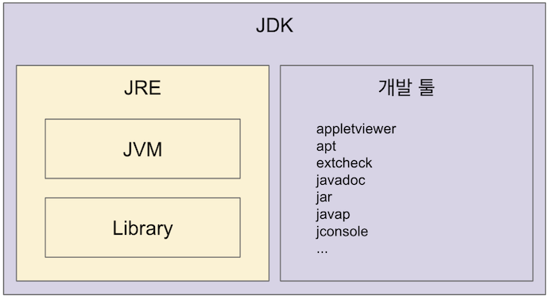
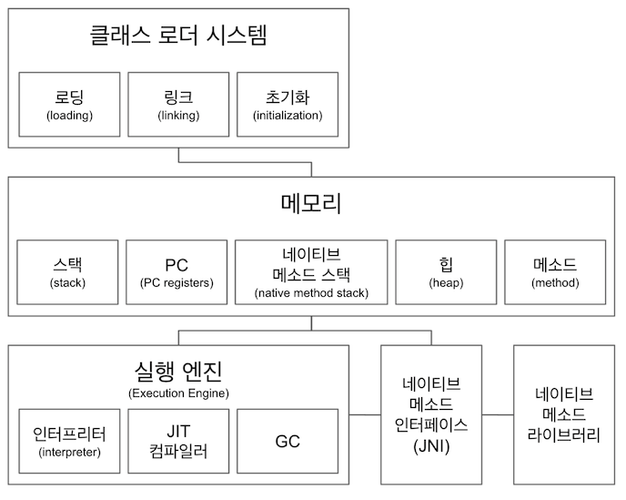
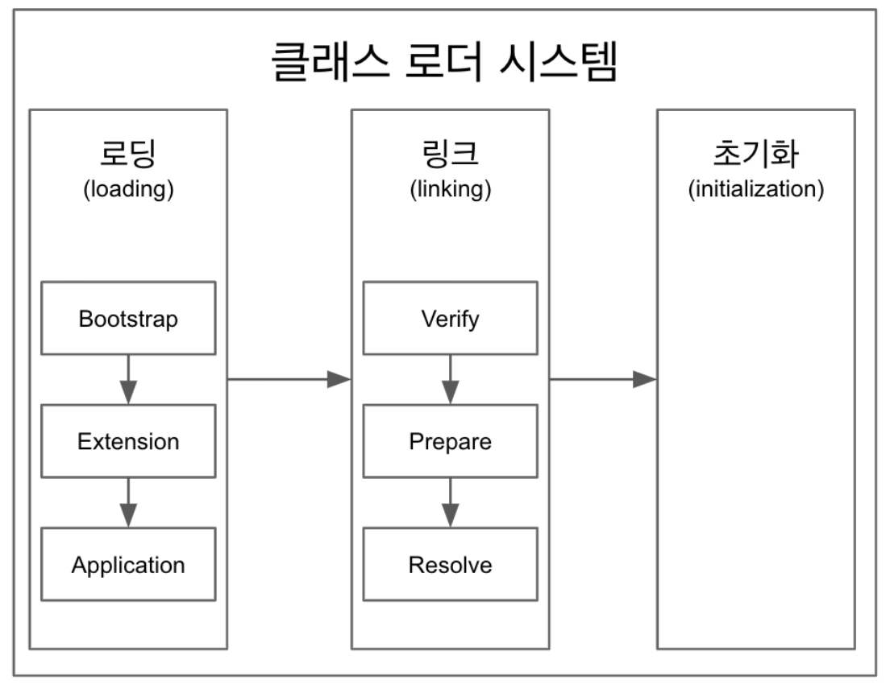

# 더 자바, 코드를 조작하는 다양한 방법
> 아래 내용은 [더 자바, 코드를 조작하는 다양한 방법](https://www.inflearn.com/course/the-java-code-manipulation "더 자바, 코드를 조작하는 다양한 방법")을 참고 하였습니다.

## 1. JVM 이해하기

#### 1) 자바, JVM, JDK, JRE

* 다음 용어를 구분할 줄 알아야 한다.

    

    * `JVM (Java Virtual Machine) `
    
        * 자바 가상 머신으로 자바 바이트 코드(.class 파일)를 OS에 특화된 코드로 변환(인터프리터와 JIT 컴파일러를 사용)하여 실행한다.
         
        * 바이트 코드를 실행하는 표준(JVM 자체는 표준)이자 구현체(특정 밴더가 구현한 JVM)다. 
        
            * JVM 스펙: https://docs.oracle.com/javase/specs/jvms/se11/html/
            
            * JVM 벤더: 오라클, 아마존, Azul, ...
        
        * 특정 플랫폼에 종속적이다.
        
    * `JRE (Java Runtime Environment)` : JVM과 라이브러리(자바 API)로 구성된다.
    
        * 자바 실행 환경으로 자바 애플리케이션을 실행할 수 있도록 구성된 배포판을 말한다.
            
        * `JVM`과 핵심 라이브러리 및 자바 런타임 환경에서 사용하는 프로퍼티 세팅이나 리소스 파일을 가지고 있다.
        
        * 개발 관련 도구는 포함하지 않는다. (그건 JDK에서 제공한다.)
        
    * `JDK (Java Development Kit)` : JRE과 개발 툴로 구성된다.
    
        * JRE + 개발에 필요한 툴 (컴파일러...)
     
        * 소스 코드를 작성할 때 사용하는 자바 언어는 플랫폼에 독립적이다.

            * Write Once Run Anywhere
        
        * 오라클은 자바 11 부터 JDK만 제공하며 JRE를 따로 제공하지 않는다.
        
    * `자바 (Java)` : 프로그래밍 언어
     
        * JDK에 들어있는 자바 컴파일러(javac)를 사용하여 자바 소스코드를 바이트 코드(.class 파일)로 컴파일 할 수 있다.
    
        * 자바 유료화? 
        
            * 자바가 유료화된 것은 아니다.
            
            * 오라클에서 만든 Oracle JDK 11 버전 부터 상용으로 사용할 때 유료이다.
    
            * 예를 들어, 오라클에서 만든 Open JDK 11 버전은 무료이다. 
                   
                * https://medium.com/@javachampions/java-is-still-free-c02aef8c9e04
    
    * `JVM 언어` : JVM 기반으로 동작하는 프로그래밍 언어
        
        * Ex) 클로저, 그루비, JRuby, Jython, Kotlin, Scala, ...
    
#### 2) JVM 구조

* JVM 구조

    

    * (1) `클래스 로더 시스템` : 클래스 파일(.class)에서 바이트 코드를 읽고 메모리에 저장한다.
        
        * `로딩(loading)` : 클래스 파일에서 바이트 코드를 읽어오는 과정
        
        * `링크(linking)` : 레퍼런스를 연결하는 과정
        
            * 검증(Verify), 준비(Prepare), 해석(Resolve)을 수행하는 과정

        * `초기화(initialization)` : static 변수를 초기화하는 과정 (+ static 블록)
        
            * 모든 클래스 변수를 코드 및 static 블록(있는 경우)에 정의된 값으로 초기화하는 과정
            
    * (2) `메모리(Runtime Data Area)`

        * ① `메소드(Method) 영역 `
        
            * 클래스 수준의 정보 (클래스 이름, 부모 클래스 이름, static 변수, 메소드)를 저장한다.
            
            * JVM 마다 하나의 영역만 존재하며 모든 Thread가 공유해서 사용한다.
    
        * ② `힙(Heap) 영역`
        
            * new 연산자로 생성된 객체를 저장한다. (인스턴스 변수 포함)
            
            * JVM 마다 하나의 영역만 존재하며 모든 Thread가 공유해서 사용한다.
    
        * ③ `스택(Stack) 영역`
        
            * 각 쓰레드 마다 런타임 스택을 하나씩 만들고, 그 안에 메소드 호출을 스택 프레임이라 부르는 블럭으로 쌓는다. (지역변수 및 매개변수 포함)
            
            * 쓰레드가 종료되면 런타임 스택도 사라진다.
            
        * ④ `PC(Program Counter) 레지스터`
        
            * 각 쓰레드 마다 하나씩 만들고, PC 레지스터는 현재 실행 중인 JVM 명령의 주소를 가지고 있다.
            
        * ⑤ `네이티브 메소드 스택`
        
            * 각 쓰레드 마다 하나씩 만들고, 네이티브(native) 메소드를 호출 할 때 사용하는 별도의 스택이다.
            
                * `네이티브 메소드`는 Java가 아닌 C, C++로 구현된 메소드를 말한다.
                
                * 예를 들어, `Thread.currentThread()`가 있다. native 키워드가 사용 된 것을 확인 할 수 있다.
            
            * [참고] https://javapapers.com/core-java/java-jvm-run-time-data-areas/#Program_Counter_PC_Register
            
    * (3) `실행 엔진(Execution Engine)`

        * ① `인터프리터(Interpreter)` : 바이트 코드를 한줄 씩 읽어서 네이티브 코드로 변환한 다음, 실행한다.
            
            * 똑같은 코드가 여러 번 나오더라도 매번 네이티브 코드로 변환해야 되기 때문에 비효율적이다.
            
        * ② `JIT 컴파일러(Just-In-Time Compiler)`
        
            * 인터프리터가 반복되는 바이트 코드를 발견하면 JIT 컴파일러로 반복되는 코드를 전부 네이티브 코드로 바꿔 놓는다. 
            
            * 그 다음 부터 인터프리터는 네이티브 코드로 컴파일된 코드를 바로 사용한다. (프로그램 실행 속도를 향상 시킴)
    
        * ③ `GC(Garbage Collector)` : 더 이상 참조되지 않는 객체를 모아서 정리한다.
            
    * (4) `JNI(Java Native Interface)` : 자바 애플리케이션에서 자바가 아닌 언어(C, C++, 어셈블리)로 작성된 함수를 사용할 수 있는 방법을 제공한다.
         
        * https://medium.com/@bschlining/a-simple-java-native-interface-jni-example-in-java-and-scala-68fdafe76f5f  
    
    * (5) `네이티브 메소드 라이브러리(Native Method Libraries)` : 실행 엔진에 필요한 네이티브 라이브러리를 모아 놓은 것이다.
        
            * 네이티브 메소드는 항상 JNI를 통해서 사용한다.
    
* 자바 실행 과정
 
    * ① 자바 컴파일러(`javac`)가 자바 소스코드(`.java`)를 바이트 코드(`.class`)로 컴파일 한다.
    
    * ② 클래스 로더가 JVM의 메모리에 저장된 바이트 코드(`.class`)를 읽어서 JVM의 메모리에 저장한다.

    * ③ 실행 엔진(Execution Engine)이 바이트 코드를 한줄 씩 읽어서 네이티브 코드로 변환한 다음, 실행한다.

        * 똑같은 코드를 여러 번 해석하는 것은 비효율적이므로 JIT 컴파일러를 사용한다.
        
        * 그리고 GC로 더 이상 참조되지 않는 객체를 모아서 정리한다.
        
        * 메모리 또는 실행 엔진이 네이티브 라이브러리를 사용한다면 JNI를 통해서 사용한다.
        
#### 3) 클래스 로더

* 클래스 로더

    

    * `로딩(loading)` → `링크(linking)` → `초기화(initialization)` 순으로 진행된다.
    
        * 로딩(loading)
        
            * 클래스 로더는 클래스 파일(.class)을 읽고, 적절한 바이너리 데이터를 만든 다음, 이를 JVM의 `메소드 영역`에 저장한다.
            
            * 이떄, 메소드 영역에 저장하는 데이터는 다음과 같다.
            
                * `FQCN (Fully Qualified Class Name)` : 클래스가 속한 패키지명을 모두 포함한 이름을 말한다. (+ 클래스 로더)
                
                * `클래스(class)`, `인터페이스(interface)`, `enum`
                
                * 메소드와 변수
                
            * 로딩이 끝나면 해당 클래스 타입의 `Class` 객체를 생성하여 `힙 영역`에 저장한다.
            
        * 링크(linking)
        
            * `Verify`, `Prepare`, `Resolve` 세 단계로 나눠져 있다.
            
                * `검증(Verification)` : 클래스 파일(.class)이 올바른 형식으로 되어 있는지 검증한다.
                
                * `준비(Preparation)` : 클래스 변수에 메모리를 할당하고 메모리를 기본 값으로 초기화한다.
                
                * `해석(Resolution)` : 심볼릭 메모리 참조를 메소드 영역에 있는 실제 참조로 변경한다.
                
        * 초기화(initialization) 
        
            * 이 단계에서 모든 클래스 변수가 코드 및 static 블록(있는 경우)에 정의된 값으로 초기화 된다.
   
* 클래스 로더의 종류

    * 클래스 로더는 계층 구조로 이루어져 있으며 기본적으로 세가지 클래스 로더가 제공된다.

    * `부트스트랩 클래스 로더(BootStrap ClassLoader)`
    
        * JVM을 기동할 때 생성되며, Object 클래스들을 비롯하여 자바 API들을 로드한다.
        
    * `플랫폼 클래스 로더(Platform ClassLoader)`
    
        * 기본 자바 API를 제외한 확장 클래스들을 로드한다.
    
        * 예전에는 `확장 클래스 로더(Extension ClassLoader)`라고 불렸다.
    
    * `애플리케이션 클래스 로더(Application ClassLoader)`
    
        * 애플리케이션의 클래스들을 로드한다
        
        * 즉, 사용자가 지정한 클래스패스 내의 클래스들을 로드한다.
      
            * 클래스패스(classpath)
            
                * 클래스를 찾는 경로를 말한다.
                
                * 애플리케이션 실행할 때 주는 -classpath 옵션 또는 java.class.path 환경 변수의 값에 해당하는 위치
            
        * `시스템 클래스 로더(System Class Loader)`라고도 한다.
        
* `ClassLoader`가 클래스를 읽는 순서는 다음과 같다.

    * 최상위인 `BootStrap ClassLoader` → `Platform ClassLoader `→ `Application ClassLoader` 순서대로 읽게 된다.
    
    * 애플리케이션 클래스 로더(Application ClassLoader)에서도 클래스를 읽지 못한다면, `ClassNotFoundException` 예외가 발생한다.
    
## 2. 바이트코드 조작

#### 1) 코드 커버리지는 어떻게 측정할까?

* (1) 실습 준비

    * ① Moim 클래스를 작성한다.

        ```java
        public class Moim {
        
            int maxNumberOfAttendees; // 최대 참가자
        
            int numberOfEnrollment; // 현재 신청한 숫자
        
            public boolean isEnrollmentFull(){ // 현재 신청이 가득 찼는지 확인하는 메소드
                if(maxNumberOfAttendees == 0){ // max가 0이면 제한하지 않는다. (무한대로 받음)
                    return false;
                }
        
                if(numberOfEnrollment < maxNumberOfAttendees){ // max 보다 작다면 full이 아님
                    return false;
                }
        
                return true; // 이외 경우에는 가득찬 걸로 간주한다.
            }
            
        }
        ```
      
    * ② 테스트 코드를 작성한다.

        ```java
        public class MoimTest {
        
            @Test
            public void isFull(){
                Moim moim = new Moim();
                moim.maxNumberOfAttendees = 100;
                moim.numberOfEnrollment = 10;
                Assert.assertFalse(moim.isEnrollmentFull()); // 모임은 full이 아닐 것으로 기대한다.
            }
        }
        ```
      
* (2) 코드 커버리지

    * `코드 커버리지(Code Coverage)`는 소스 코드 중 테스트를 통해 실행된 코드의 비율(%)을 말한다. 
    
    * 코드 커버리지는 어떻게 측정할까?

        * `바이트 코드`를 읽어서 코드 커버리지를 측정해야 되는 부분을 개수를 세고 코드가 실행될 때 그 중 몇 개를 지나갔는지 다시 개수를 센다.
        
        * 그래서 어디는 지나갔고 지나가지 않았는지를 비교하여 그 결과를 보여주는 것이다.
        
            * 빨간색 : 해당 라인에서 어떤 명령도 실행되지 않음
            * 노란색 : 해당 라인에서 일부만 실행됨
            * 초록색 : 해당 라인에서 모든 명령이 실행됨

* (3) 실습 - JaCoCo 사용

    * ① `pom.xml`에 JaCoCo 0.8.5 버전 의존성을 추가한다. (JaCoCo 0.8.4 버전에서 에러가 발생해서 변경하였음)
    
        ```html
        <dependency>
          <groupId>org.jacoco</groupId>
          <artifactId>jacoco-maven-plugin</artifactId>
          <version>0.8.5</version>
        </dependency>
        ```

    * ② `pom.xml`에 JaCoCo 플러그인을 추가한다.
    
        ```html
        <build>
            <plugins>
              <plugin>
                <groupId>org.jacoco</groupId>
                <artifactId>jacoco-maven-plugin</artifactId>
                <version>0.8.5</version>
                <executions>
                  <execution>
                    <goals>
                      <goal>prepare-agent</goal>
                    </goals>
                  </execution>
                  <execution>
                    <id>report</id>
                    <phase>prepare-package</phase>
                    <goals>
                      <goal>report</goal>
                    </goals>
                  </execution>
                </executions>
              </plugin>
            </plugins>
        </build>
        ```

    * ➂ 인텔리제이 터미널에서 `mvn clean verify`로 메이븐 빌드를 한다.
    
    * ➃ `target/site/jacoco/index.html`를 `Open in Browser`로 실행하세요.
    
* (4) 실습 - 커버리지를 만족하지 못하면 빌드가 실패 하도록 설정

    * `pom.xml`에 `<execution>`를 하나 더 추가한다. (코드 커버리지가 50% 이상 이어야 빌드가 성공하도록 함)
    
        ```html
        <execution>
            <id>jacoco-check</id>
            <goals>
                <goal>check</goal>
            </goals>
            <configuration>
                <rules>
                    <rule>
                        <element>PACKAGE</element>
                        <limits>
                            <limit>
                                <counter>LINE</counter>
                                <value>COVEREDRATIO</value>
                                <minimum>0.50</minimum>
                            </limit>
                        </limits>
                    </rule>
                </rules>
            </configuration>
        </execution>
        ```
      
    * 코드 커버리지 퍼센트(%)가 90% 이상일 때, 빌드가 성공하도록 하면 빌드에 실패하게 된다.

#### 2) 모자에서 토끼를 꺼내는 마술

* `바이트 코드 조작`은 아무 것도 없는 `Moja`에서 `Rabbit`을 꺼내는 마술을 가능하게 한다.

* (1) 바이트 코드 조작 라이브러리

    * `ASM` : https://asm.ow2.io/
    * `Javassist` : https://www.javassist.org/
    * `ByteBuddy` : https://bytebuddy.net/#/

* (2) 실습

    * ① `pom.xml`에 ByteBuddy 의존성을 추가한다.

        ```html
        <dependency>
            <groupId>net.bytebuddy</groupId>
            <artifactId>byte-buddy</artifactId>
            <version>1.10.1</version>
        </dependency>
        ```

    * ➁ 실습에서 사용 할 다음 클래스를 작성한다.
    
        ```java
        public class Moja {
        
            public String pullOut() {
                return "";
            }
        }
        ```
      
        ```java
        public class Masulsa {
        
            public static void main(String[] args) {
                System.out.println(new Moja().pullOut());
            }
        }
        ```

    * ➂ Masulsa 클래스에서 바이트 코드를 조작하는 부분을 추가하고 나머지 부분은 주석 처리 한 다음, 실행한다.
    
        ```java
        public class Masulsa {
        
            public static void main(String[] args) {
                try {
                    /* 바이트 코드를 변경해서 저장한다. */
                    new ByteBuddy().redefine(Moja.class)
                            .method(named("pullOut")).intercept(FixedValue.value("Rabbit!"))
                            .make().saveIn(new File("/Users/FINTFACE/Downloads/classloadersample2/target/classes/"));
                } catch (IOException e) {
                    e.printStackTrace();
                }
        
        //        System.out.println(new Moja().pullOut());
            }
        
        }
        ```
      
    * ➃ Masulsa 클래스를 이전과는 반대로 주석 처리를 하고 실행하면 콘솔에 `Rabbit!`이 출력되는 것을 확인 할 수 있다. 
    
        * 바이트 코드(Moja.class)를 직접 확인하면 소스코드와는 다르게 변경된 것을 확인 할 수 있다.
    
            ```java
            public class Masulsa {
            
                public static void main(String[] args) {
            //        try {
            //            /* 바이트 코드를 변경해서 저장한다. */
            //            new ByteBuddy().redefine(Moja.class)
            //                    .method(named("pullOut")).intercept(FixedValue.value("Rabbit!"))
            //                    .make().saveIn(new File("/Users/FINTFACE/Downloads/classloadersample2/target/classes/"));
            //        } catch (IOException e) {
            //            e.printStackTrace();
            //        }
            
                    System.out.println(new Moja().pullOut());
                }
            
            }
            ```
          
            * 위의 코드에서 바이트 코드 조작과 pullOut()를 호출하는 부분을 같이 사용 할 수 없다.
               
            * 그 이유는 바이트 코드가 조작되기 전에 클래스 로더에 의해 원본 클래스(Moja.class)가 메모리에 로딩 되어 사용 되기 때문이다.
              
            * 즉, `pullOut()` 호출 시, 원본 클래스(Moja.class)를 로딩하여 아무것도 출력되지 않는다.

#### 3) Javaagent 실습

* 바이트 코드를 조작한 다음, 클래스 로더가 클래스를 읽도록 해야 하는데, 이럴때 `Javaagent`를 사용 할 수 있다.

    * 클래스로더가 클래스를 읽어올 때, `Javaagent`를 거쳐서 변경된 바이트 코드를 읽어 들여 사용한다.

* 실습 - Javaagent JAR 파일 만들기

    * ① premain()를 정의한다. 여기서 바이트 코드 조작 시 ByteBuddy, ASM 등을 사용 할 수 있다.
    
        ```java
        public class MasulsaAgent {
        
            public static void premain(String agentArgs, Instrumentation inst){
        
            }
            
        }
        ```
      
    * ➁ `pom.xml`에 ByteBuddy 의존성을 추가한다.

        ```html
        <dependency>
            <groupId>net.bytebuddy</groupId>
            <artifactId>byte-buddy</artifactId>
            <version>1.10.1</version>
        </dependency>
        ```
      
    * ➂ premain()를 정의한다. 여기서 바이트 코드 조작 시 ByteBuddy, ASM 등을 사용 할 수 있다.
    
        ```java
        public class MasulsaAgent {
        
            public static void premain(String agentArgs, Instrumentation inst){
                new AgentBuilder.Default()
                        .type(ElementMatchers.any())
                        .transform((builder, typeDescription, classLoader, javaModule) -> builder.method(named("pullOut")).intercept(FixedValue.value("Rabbit!"))).installOn(inst);
            }
        
        }
        ```

    * ➃ 에이전트를 JAR로 패키징 하면서 JAR 파일 안에 특정한 값들을 넣어줘야 합니다.
    
         ```html
         <build>
           <plugins>
             <plugin>
               <groupId>org.apache.maven.plugins</groupId>
               <artifactId>maven-jar-plugin</artifactId>
               <version>3.1.2</version>
               <configuration>
                 <archive>
                   <index>true</index>
                   <manifest>
                     <addClasspath>true</addClasspath>
                   </manifest>
                   <manifestEntries>
                     <mode>development</mode>
                     <url>${project.url}</url>
                     <key>value</key>
                     <Premain-Class>me.kevinntech.MasulsaAgent</Premain-Class>
                     <Can-Redefine-Classes>true</Can-Redefine-Classes>
                     <Can-Retransform-Classes>true</Can-Retransform-Classes>
                   </manifestEntries>
                 </archive>
               </configuration>
             </plugin>
           </plugins>
         </build>
         ```
      
        * `Premain-Class` : 자바 애플리케이션 시작 시, 에이전트를 붙이는 방식 
        
        * `Agent-Class` : 자바 애플리케이션 런타임 중에 동적으로 붙이는 방식
        
        * 보다 자세한 내용은 아래 링크를 참조하자.
        
            * https://docs.oracle.com/javase/8/docs/api/java/lang/instrument/package-summary.html

    * ➄ 인텔리제이 터미널에서 `mvn clean package`로 에이전트를 Jar로 패키징 한다.
    
    * ➅ Jar 파일의 경로를 복사한다. 
    
    * ➆ 원래 프로젝트(classloadersample)의 JVM Option에서 자바 에이전트를 사용 하도록 설정한 다음, 애플리케이션을 실행한다.
    
        * `-javaagent:/Users/FINTFACE/Downloads/MasulsaAgent/target/MasulsaAgent-1.0-SNAPSHOT.jar`

        * 이 방식은 파일 시스템의 파일을 변경하는 것이 아닌 클래스 로딩 시 적용 되도록 한다.

#### 4) 바이트 코드 조작 정리

* 바이트 코드를 조작하는 것은 다음과 같이 활용 될 수 있다.

    * 프로그램 분석
    
        * 코드에서 버그 찾는 툴
        
        * 코드 복잡도 계산
        
    * 클래스 파일 생성
    
        * 프록시
        
        * 특정 API 호출 접근 제한
        
        * 스칼라 같은 언어의 컴파일러
        
    * 그 밖에도 자바 소스 코드를 건드리지 않고 코드 변경이 필요한 여러 경우에 사용할 수 있다.
    
        * 프로파일러 (newrelic)
        
        * 최적화
        
        * 로깅
        
        * ...
    
    * 스프링이 컴포넌트 스캔을 하는 방법 (ASM)
    
        * 컴포넌트 스캔으로 빈으로 등록할 후보 클래스 정보를 찾는데 사용한다.
        
        * `ClassPathScanningCandidateComponentProvider` -> `SimpleMetadataReader`
        
        * `ClassReader`와 `Visitor`를 사용해서 클래스에 있는 메타 정보를 읽어온다. 
        
    * 참고
    
        * https://www.youtube.com/watch?v=39kdr1mNZ_s
        
        * ASM, Javassist, ByteBuddy, CGlib
        
## 3. 리플렉션

#### 1) 스프링의 Depedency Injection은 어떻게 동작할까?

* (1) BookRepository를 작성한다.
    
     ```java
     @Repository
     public class BookRepository {
     }
     ```
  
* (2) 그리고 BookService를 작성한다.
    
     ```java
     @Service
     public class BookService {
         @Autowired
         BookRepository bookRepository;
     }
     ```
  
    * bookRepository 인스턴스는 어떻게 null이 아닌걸까?
    
    * 스프링은 어떻게 BookService 인스턴스에 BookRepository 인스턴스를 넣어준 것일까?
    
#### 2) 리플렉션 API 1부

* (1) 리플렉션(Reflection)

    * 동적으로 특정 클래스를 로딩하거나, 클래스의 필드나 메소드를 알아내고 값을 가져오거나 메소드를 실행할 수 있는 기능을 말한다.
    
    * 리플렉션의 시작은 `Class<T>` 타입의 인스턴스다.

* (2) 실습 준비

    * 실습 코드를 준비한다.
    
         ```java
         public class Book {
         
             private static String B = "BOOK";
         
             private static final String C = "BOOK";
         
             private String a = "a";
         
             public String d = "d";
         
             protected String e = "e";
         
             public Book() {
             }
         
             public Book(String a, String d, String e) {
                 this.a = a;
                 this.d = d;
                 this.e = e;
             }
         
             private void f(){
                 System.out.println("F");
             }
         
             public void g(){
                 System.out.println("g");
             }
         
             public Integer h(){
                 return 100;
             }
             
         }
         ```
      
         ```java
         public interface MyInterface {
         }
         ```
      
         ```java
         public class MyBook extends Book implements MyInterface{
         
         }
         ```
  
* (3) Class<T> 타입의 인스턴스에 접근하는 방법

    * 모든 클래스를 로딩 한 다음, `Class<T>`의 인스턴스가 생긴다. `타입.class`로 접근 할 수 있다.

         ```java
         /*
         * 클래스 로딩이 끝나면 해당 클래스 타입의 Class 인스턴스를 생성하여 힙 영역에 저장한다.
         * 그래서 타입.class로 접근 할 수 있다.
         * */
         Class<Book> bookClass = Book.class;
         ```

    * 모든 인스턴스는 `getClass()` 메소드를 가지고 있다. `인스턴스.getClass()`로 접근 할 수 있다.

         ```java
         /*
         * 애플리케이션에 이미 생성한 인스턴스가 있다면 인스턴스의 getClass()를 사용하여 접근 할 수 있다.
         * */
         Book book = new Book();
         Class<? extends Book> bookClass2 = book.getClass();
         ```

    * 문자열(클래스가 속한 패키지명을 포함한 이름)로 `Class<T>`의 인스턴스에 접근 할 수 있다.

        * `Class.forName("FQCN")`로 접근 할 수 있다.
        
        * 클래스패스에 해당 클래스가 없다면 `ClassNotFoundException`이 발생한다.
        
         ```java
         /*
         * Class.forName()는 주어진 문자열과 이름이 같은 클래스 또는 인터페이스의 Class 객체를 리턴한다.
         * 그리고 런타임 시, 동적으로 클래스를 메모리에 로드하여 정보를 읽어온다.
         * */
         Class<?> bookClass3 = Class.forName("me.kevinntech.Book");
         ```
      
* (4) 실습 - Class<T> 인스턴스를 통해 할 수 있는 것

    * 모든 클래스를 로딩 한 다음, `Class<T>`의 인스턴스가 생긴다. `타입.class`로 접근 할 수 있다.

         ```java
         public class App {
             public static void main( String[] args ) throws ClassNotFoundException {
                 Class<Book> bookClass = Book.class;
         
                 /*
                 * getFields()는 public 필드만 리턴한다.
                 * */
                 Arrays.stream(bookClass.getFields())
                         .forEach(System.out::println);
                 System.out.println();
         
                 /*
                  * getDeclaredFields()는 모든 필드를 리턴한다.
                  * */
                 Arrays.stream(bookClass.getDeclaredFields())
                         .forEach(System.out::println);
                 System.out.println();
         
                 /*
                  * 모든 필드와 값을 출력한다.
                  * */
                 Book book = new Book();
                 Arrays.stream(bookClass.getDeclaredFields()).forEach( f -> {
                                     try {
                                         f.setAccessible(true); // 접근 가능하게 만든다.
                                         System.out.printf("%s %s \n", f, f.get(book));
                                     } catch (IllegalAccessException e) {
                                         e.printStackTrace();
                                     }
                                 }
                         );
                 System.out.println();
         
                 /*
                  * getMethods()는 조상 클래스로 부터 상속 받은 메소드를 포함한 public 메소드를 리턴한다.
                  * */
                 Arrays.stream(bookClass.getMethods()).forEach(System.out::println);
                 System.out.println();
         
                 /*
                  * getConstructors()는 public 생성자를 리턴한다.
                  * */
                 Arrays.stream(bookClass.getConstructors()).forEach(System.out::println);
                 System.out.println();
         
                 /*
                  * getSuperclass()는 조상 클래스를 리턴한다. (자바는 단일 상속만을 허용)
                  * */
                 System.out.println(MyBook.class.getSuperclass());
                 System.out.println();
         
                 /*
                  * getInterfaces()는 해당 클래스가 구현한 인터페이스를 리턴한다.
                  * */
                 Arrays.stream(MyBook.class.getInterfaces()).forEach(System.out::println);
                 System.out.println();
         
                 /*
                  * 필드의 접근 제어자 정보를 출력한다.
                  * */
                 Arrays.stream(Book.class.getDeclaredFields()).forEach( f -> {
                         int modifiers = f.getModifiers();  // 해당 필드의 접근자 정보를 리턴한다.
                         System.out.println(f);
                         System.out.println(Modifier.isPrivate(modifiers));
                         System.out.println(Modifier.isStatic(modifiers));
                     }
                 );
                 System.out.println();
             }
         }
         ```
      
#### 2) 애노테이션과 리플렉션

* (1) 실습 전에 알고 있어야 하는 내용

    * 애노테이션

        * `@Retention` : 해당 애노테이션이 유지되는 기간을 지정한다. (소스, 클래스, 런타임)
        
        * `@Inherited` : 해당 애노테이션이 자손 클래스에 상속 되도록 한다.
        
        * `@Target` : 해당 애노테이션이 적용 가능한 대상을 지정한다.
    
    * 리플렉션

        * `getAnnotations()` : 상속 받은 (@Inherit) 애노테이션까지 조회한다.
        
        * `getDeclaredAnnotations()` : 자신에게만 붙어 있는 애노테이션을 조회한다.
    
* (2) 실습

    * 애노테이션을 정의한다. (`@Retention`를 런타임으로 지정한다.)

         ```java
         @Retention(RetentionPolicy.RUNTIME)
         @Target({ElementType.TYPE, ElementType.FIELD})
         @Inherited
         public @interface MyAnnotation {
         
             String value() default "kevin";
         
             int number() default 100;
         
         }
         ```
      
        ```java
        @Retention(RetentionPolicy.RUNTIME)
        @Inherited
        public @interface AnotherAnnotation {
        
            String value() default "kevin";
        
            int number() default 100;
        
        }
        ```
      
    * 애노테이션을 사용한다.

         ```java
         @MyAnnotation
         public class Book {
         
             private static String B = "BOOK";
         
             private static final String C = "BOOK";
         
             // 필드에 애노테이션 사용
             @MyAnnotation
             private String a = "a";
         
             public String d = "d";
         
             protected String e = "e";
         
             public Book() {
             }
         
             public Book(String a, String d, String e) {
                 this.a = a;
                 this.d = d;
                 this.e = e;
             }
         
             private void f(){
                 System.out.println("F");
             }
         
             // 메소드에 애노테이션 사용
             @AnotherAnnotation
             public void g(){
                 System.out.println("g");
             }
         
             public Integer h(){
                 return 100;
             }
         
         }
         ```
      
    * 애노테이션 정보를 출력한다. (애노테이션을 정의할 때, `@Retention`를 런타임으로 지정하지 않는다면 어떠한 정보도 출력되지 않는다.)

         ```java
         public class App {
             public static void main( String[] args ) throws ClassNotFoundException {
                 /*
                  * 상속 받은 애노테이션까지 조회한다.
                  * */
                 Arrays.stream(MyBook.class.getAnnotations()).forEach(System.out::println);
                 System.out.println();
         
                 /*
                  * 자신에게만 붙어 있는 애노테이션을 조회한다.
                  * */
                 Arrays.stream(MyBook.class.getDeclaredAnnotations()).forEach(System.out::println);
                 System.out.println();
         
                 /*
                 * 필드에 붙어있는 애노테이션 정보를 출력한다.
                 * */
                 Arrays.stream(Book.class.getDeclaredFields()).forEach(f -> {
                     Arrays.stream(f.getAnnotations()).forEach(System.out::println);
         
                     //// 필드에 붙어있는 애노테이션 안에 저장된 정보를 출력 할 수도 있다.
                     //Arrays.stream(f.getAnnotations()).forEach(a -> {
                     //    if(a instanceof MyAnnotation){
                     //        MyAnnotation myAnnotation = (MyAnnotation) a;
                     //        System.out.println(myAnnotation.value());
                     //        System.out.println(myAnnotation.number());
                     //    }
                     //});
                 });
             }
         }
         ```
      
#### 3) 리플렉션 API 2부: 클래스 정보 수정 또는 실행

* (1) 실습 준비

    * Book 클래스를 다음과 같이 수정한다.

         ```java
         public class Book {
         
             public static String A = "A";
         
             private String B = "B";
         
             public Book() {
             }
         
             public Book(String b) {
                 B = b;
             }
         
             private void c() {
                 System.out.println("C");
             }
         
             public int sum(int left, int right){
                 return left + right;
             }
         
             public static int multiply(int left, int right){
                 return left * right;
             }
         
         }
         ```

* (2) 클래스 정보를 수정 또는 실행

    * Class 인스턴스 만들기
    
        * `Class.newInstance()`는 Deprecated 되었다.
        
        * 그래서 **생성자를 이용하여 Class 인스턴스를 만들어야 한다.**
                
    * 생성자로 인스턴스 만들기
    
        * Constructor.newInstance(params)
        
            * 기본 생성자로 인스턴스 만들기
            
                 ```java
                 Class<?> bookClass = Class.forName("me.kevinntech.Book");
                 Constructor<?> constructor = bookClass.getConstructor(null);
                 Book book = (Book) constructor.newInstance();
                 ```
              
            * 매개변수가 있는 생성자로 인스턴스 만들기
            
                ```java
                Class<?> bookClass = Class.forName("me.kevinntech.Book");
                Constructor<?> constructor = bookClass.getConstructor(String.class);
                Book book = (Book) constructor.newInstance("myBook");
                
                System.out.println(book);
                ```
        
    * 필드 값 가져오기/설정하기

        ```java
        Field.get(object) // 가져오기
        Filed.set(object, value) // 설정하기
        ```
      
        * 인스턴스 변수의 값을 가져오거나 설정하려면 `get()` 또는 `set()`의 파라미터로 인스턴스를 전달해야 한다.

            ```java
            Field b = Book.class.getDeclaredField("B");
            b.setAccessible(true);
            System.out.println(b.get(book));
            b.set(book, "BBBBBBB"); // Book 객체의 b 필드에 값을 설정한다.
            ```
         
        * static 변수의 값을 가져오거나 설정하려면 `get()` 또는 `set()`의 파라미터로 `null`를 전달하면 된다.

            ```java
            Field b = Book.class.getDeclaredField("B");
            b.setAccessible(true);
            System.out.println(b.get(book));
            b.set(book, "BBBBBBB"); // Book 객체의 b 필드에 값을 설정한다.
            System.out.println(b.get(book)); // 변경된 것을 확인 할 수 있다.
            ```
     
    * 메소드 실행하기

        ```java
        Object Method.invoke(object, params) 
        ```
      
        * 인스턴스 메소드를 호출하려면 invoke()의 파라미터로 인스턴스를 전달해야 한다.
        
            ```java
            Method c = Book.class.getDeclaredMethod("c");
            c.setAccessible(true);
            c.invoke(book);
            ```
          
            ```java
            Method sum = Book.class.getDeclaredMethod("sum", int.class, int.class);
            int invoke = (int) sum.invoke(book, 1, 2);
            System.out.println(invoke);
            ```
          
        * static 메소드를 호출하려면 invoke()의 파라미터로 `null`를 전달하면 된다.
        
            ```java
            Method multiply = Book.class.getDeclaredMethod("multiply", int.class, int.class);
            int result = (int) multiply.invoke(null, 2, 3);
            System.out.println(result);
            ```

#### 4) 나만의 DI 프레임워크 만들기

* 실습 - `@Inject`라는 애노테이션을 만들어서 필드를 주입 해주는 컨테이너 서비스 만들기

    * `@Inject`라는 애노테이션을 정의한다.
    
        ```java
        @Retention(RetentionPolicy.RUNTIME)
        public @interface Inject {
        }
        ```
      
    * `ContainerService`라는 클래스를 정의한다.
    
        ```java
        public class ContainerService {
        }
        ```
      
    * 테스트 할 때, 사용 할 다음과 같은 클래스들을 작성한다.
    
        ```java
        public class ContainerServiceTest {
        
            @Test
            public void getObject(){
                BookRepository bookRepository = ContainerService.getObject(BookRepository.class);
                assertNotNull(bookRepository);
            }
        
            @Test
            public void getObject_BookService(){
                BookService bookService = ContainerService.getObject(BookService.class);
                assertNotNull(bookService);
        
                //bookService가 가지고 있는 bookRepository도 null이 아니어야 한다.
                assertNotNull(bookService.bookRepository);
            }
        
        }
        ```
      
        ```java
        public class BookService {
        
            /*
            * BookRepository 타입의 객체가 주입되는 것을 기대한다.
            * */
            @Inject
            BookRepository bookRepository;
        
        }
        ```
      
        ```java
        public class BookRepository {
        }
        ```
      
    * 테스트 코드를 작성하면서 ContainerService 클래스의 코드를 수정한다.
    
        ```java
        public class ContainerService {
        
            /*
            * [제네릭 메소드]
            * Class<T> 타입을 매개변수로 전달 받으면 그 안에 있는 T를 리턴한다.
            * 즉, classType에 해당하는 타입의 객체를 만들어 준다.
            * 그리고 해당 객체의 필드 중에 @Inject가 있다면 해당 필드도 같이 만들어 제공한다.
            * */
            public static <T> T getObject(Class<T> classType){
                T instance = createInstance(classType);
        
                // 해당 클래스 타입의 필드를 살펴보면서 @Inject이 붙어 있는지 확인한다.
                Arrays.stream(classType.getDeclaredFields()).forEach(f -> {
                    if(f.getAnnotation(Inject.class) != null){ // @Inject이 붙어 있다면
                        // 해당 필드의 타입(BookRepository)을 가져와서 인스턴스를 생성한다.
                        Object fieldInstance = createInstance(f.getType());
                        f.setAccessible(true);
        
                        try {
                            f.set(instance, fieldInstance); // 필드에 인스턴스를 저장한다.
                        } catch (IllegalAccessException e) {
                            throw new RuntimeException(e);
                        }
                    }
                });
        
                return instance;
            }
        
            private static <T> T createInstance(Class<T> classType){
                try {
                    return classType.getConstructor(null).newInstance();
                } catch (InstantiationException | IllegalAccessException | InvocationTargetException | NoSuchMethodException e) {
                    throw new RuntimeException(e);
                }
            }
        }
        ```
      
    * 인텔리제이 터미널에서 `mvn install`를 한다. 그러면 로컬 메이븐 저장소에 설치된다. 그리고 해당 Jar 파일을 다른 메이븐 프로젝트에서 참조 할 수 있다.
    
#### 5) 리플렉션 정리

* 리플렉션 사용 시 주의 할 것

    * 잘못 사용 할 경우, 다음과 문제가 발생 할 수 있다.
    
        * 지나친 사용은 성능 이슈를 야기 할 수 있다. 반드시 필요한 경우에만 사용할 것
        
        * 컴파일 시, 확인되지 않고 런타임 시에만 발생하는 문제를 만들 가능성이 있다. 
        
        * 의도적으로 접근 지시자를 무시하고 데이터에 접근 할 수 있다.

* 리플렉션 활용 예시
 
    * 스프링
    
        * 의존성 주입
        
        * MVC 뷰에서 넘어온 데이터를 특정 객체에 바인딩 할 때, 사용한다.
        
    * 하이버네이트
    
        * 특정 @Entity 클래스에 Setter가 없다면 리플렉션을 사용하여 필드에 값을 설정한다.
        
    * JUnit
    
        * JUnit 프레임워크에서 사용 할 용도로 만든 것 (범용적 X)
    
        * https://junit.org/junit5/docs/5.0.3/api/org/junit/platform/commons/util/ReflectionUtils.html

* 참고

    * https://docs.oracle.com/javase/tutorial/reflect/index.html