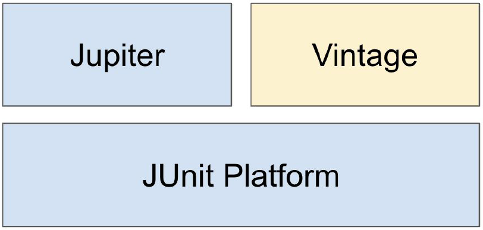

# 더 자바, 애플리케이션을 테스트하는 다양한 방법
> 아래 내용은 [더 자바, 애플리케이션을 테스트하는 다양한 방법](https://www.inflearn.com/course/the-java-application-test# "더 자바, 애플리케이션을 테스트하는 다양한 방법")을 참고 하였습니다.

## 1. JUnit 5

#### 1) JUnit 5 소개

* (1) JUnit이란

    * `JUnit`은 Java의 테스팅 프레임워크이다.

        * `JUnit 5`는 자바 8 이상을 필요로 함.
    
        * 대체재: TestNG, Spock ...

* (2) JUnit 5

    * `JUnit 5`는 3개의 모듈로 구성되어 있다.
    
        
    
        * ① `JUnit Platform` : JUnit으로 작성한 테스트를 실행하는 런처와 TestEngine API를 제공한다.
    
            * IDE가 JUnit Platform을 사용해서 `@Test`이 붙어있는 메서드를 실행해준다.
    
        * ② `Jupiter` : JUnit 5를 지원하는 TestEngine API의 구현체이다.
    
        * ③ `Vintage` : JUnit 3와 4를 지원하는 TestEngine API의 구현체이다.
        
#### 2) JUnit 5 시작하기

* (1) 프로젝트 만들기

    * JUnit5를 시작하는 방법은 다음 2가지가 존재한다.

        * ① 스프링 부트 프로젝트 만들기

            * 스프링 부트 2.2 이상 버전으로 프로젝트를 만든다면 기본적으로 JUnit 5 의존성이 추가된다.

        * ② Gradle 또는 Maven 프로젝트 만들기

            * 프로젝트를 생성한 다음, Maven을 사용한다면 `pom.xml`에 다음 의존성을 추가한다.
            
                ```html
                <dependency>
                    <groupId>org.junit.jupiter</groupId>
                    <artifactId>junit-jupiter-engine</artifactId>
                    <version>5.5.2</version>
                    <scope>test</scope>
                </dependency>
                ```
              
* (2) 테스트 코드 작성하기

    * ① Study 클래스를 생성한다.

        ```java
        public class Study {
        }
        ```

    * ② Mac을 사용한다면 단축키(Cmd + Shift + t)를 사용해서 테스트 코드를 작성한다.

    * ③ 테스트 메소드의 내용을 작성한다.

        ```java
        class StudyTest {
        
            @Test
            void create(){
                Study study = new Study();
                assertNotNull(study);
                System.out.println("create");
            }
        
            @Test
            @Disabled
            void create1(){
                System.out.println("create1");
            }
        
            @BeforeAll
            static void beforeAll(){
                System.out.println("before all");
            }
        
            @AfterAll
            static void afterAll(){
                System.out.println("after all");
            }
        
            @BeforeEach
            void beforeEach(){
                System.out.println("Before each");
            }
        
            @AfterEach
            void afterEach(){
                System.out.println("After each");
            }
        
        }
        ```

        * `JUnit 4`에서는 테스트 클래스와 메소드 모두 public 이어야 한다.
        
        * 위에서 사용된 테스트 관련 애노테이션은 아래에서 살펴본다.
        
* (3) 테스트 관련 기본 애노테이션 (**JUnit 5 기준**)

    * `@Test` : 테스트 메소드로 선언한다.

    * `@BeforeAll` : 모든 테스트가 시작 되기 전에 단 한번 실행된다.
    
        * 메서드가 static void인 경우만 사용 가능하다. 
        
        * private이면 안된다.

    * `@AfterAll` : 모든 테스트가 끝난 다음에 단 한번 실행된다.
    
        * `@BeforeAll`과 조건 동일
    
    * `@BeforeEach` : 하나의 테스트가 시작되기 전에 매번 실행된다.
    
        * 메소드가 static일 필요는 없다.

    * `@AfterEach` : 하나의 테스트가 끝날 때 마다 매번 실행된다.

    * `@Disabled` : 특정 테스트를 실행 하고 싶지 않은 경우에 사용한다.

* (4) 테스트 관련 기본 애노테이션 (**JUnit 4 기준**)

    * `@Test` : 테스트 메소드로 선언한다.

    * `@BeforeClass` : 모든 테스트가 시작 되기 전에 단 한번 실행된다.

    * `@AfterClass` : 모든 테스트가 끝난 다음에 단 한번 실행된다.
    
    * `@Before` : 하나의 테스트가 시작되기 전에 매번 실행된다.
    
    * `@After` : 하나의 테스트가 끝날 때 마다 매번 실행된다.

    * `@Ignore` : 특정 테스트를 실행 하고 싶지 않은 경우에 사용한다.

#### 3) 테스트 이름 표기하기

* (1) 기본적인 테스트 이름 표기 방식

    * 테스트를 실행하면 그 결과는 기본적으로 테스트 메소드명으로 표시된다.

    * 아래와 같은 방식으로 테스트 이름을 원하는 이름으로 표시할 수 있다.

* (2) `@DisplayNameGeneration`

    * `@DisplayNameGeneration(DisplayNameGenerator.ReplaceUnderscores.class)`

        * 테스트 이름을 _(언더 스코어)에서 공백 문자로 변경한 이름으로 만든다.

        * 클래스에 사용 가능하다. 

            ```java
            @DisplayNameGeneration(DisplayNameGenerator.ReplaceUnderscores.class)
            class StudyTest {
            	...
            }
            ```

    * `@DisplayName`

        * 테스트 이름을 사용자가 정의한 이름으로 만든다.  

        * @Test이 붙어있는 메서드에 사용한다.

        * `@DisplayNameGeneration` 보다 우선 순위가 높다.

            ```java
            @Test
            @DisplayName("스터디 만들기")
            void create_new_study(){
              Study study = new Study();
              assertNotNull(study);
              System.out.println("create");
            }
            ```

* (3) 테스트 실행 방법

    * 테스트 메소드에 포커스를 두고 테스트를 실행하면 해당 메소드만 실행한다.

    * 중립 영역에 포커스를 두고 테스트를 실행하면 테스트 클래스 안에 있는 모든 테스트를 실행한다.
    
#### 4) Assertion

* (1) org.junit.jupiter.api.Assertions.*

    * `assertEquals(expected, actual)` : 기대한 값(expected)이 실제 값(actual)과 같은지 확인한다.
    
    * `assertNotNull(actual)` : 값이 null이 아닌지 확인한다.
    
    * `assertTrue(boolean)` : 다음 조건이 참(true)인지 확인한다.
    
    * `assertAll(executables...)` : 모든 검증을 실행하고 그 중에서 실패한 검증에 대해서만 에러 메시지로 보여준다.
    
        * 여러 개의 assert 문을 각각 람다식으로 작성하여 매개변수로 전달함.
        
    * `assertThrows(expectedType, executable)` : executable을 실행한 결과로 지정한 타입의 예외가 발생하는지 확인한다.
    
    * `assertTimeout(duration, executable)` : 특정 시간 안에 실행이 완료되는지 확인한다.
    
        * 첫 번째 매개변수(`duration`) : 얼마 만에 끝나야 하는지를 지정한다.
        
        * 두 번째 매개변수(`executable`) : 실행 할 문장을 람다식으로 지정한다.
           
* (2) 실습하기

    * 실습 1 - Study를 처음 만들었을 때, 상태가 DRAFT 인지 확인하는 테스트 코드를 작성한다.
    
        * ① 테스트 코드를 작성한다.
        
            ```java
            @DisplayNameGeneration(DisplayNameGenerator.ReplaceUnderscores.class)
            class StudyTest {
            
                @Test
                @DisplayName("스터디 만들기")
                void create_new_study(){
                    // 스터디를 처음 만들었을 때, 상태가 DRAFT인지 확인한다.
                    Study study = new Study();
                    assertNotNull(study);
                    assertEquals(StudyStatus.DRAFT, study.getStatus()); // 테스트에 실패하게 됨
                }
                
            }
            ```
          
        * ② 열거형 StudyStatus를 작성한다. 
        
            ```java
            public enum StudyStatus {
                DRAFT, STARTED, ENDED
            }
            ```
          
        * ③ Study 클래스에 StudyStatus 타입 변수를 선언하고 getStatus()를 만든다.
        
            ```java
            public class Study {
            
                private StudyStatus status;
            
                public StudyStatus getStatus() {
                    return this.status;
                }
            }
            ```
          
        * ④ 테스트를 실행하면 기대한 값과 실제 값이 다르며 처음 상태가 `null`인 것을 알 수 있다.
        
        * ⑤ 테스트 실패 시, 메시지(message)를 출력 하도록 할 수도 있다.

            ```java
            assertEquals(StudyStatus.DRAFT, study.getStatus(), "스터디를 처음 만들면 상태 값이 DRAFT여야 한다.");
            ```
         
            * 문자열 연산을 해서 복잡한 메시지를 생성해야 하는 경우, 다음과 같이 람다식을 사용하면 테스트를 실패 했을 때만 해당 메시지를 만들도록 할 수 있다. (성능 향상)

                ```java
                assertEquals(StudyStatus.DRAFT, study.getStatus(), () -> "스터디를 처음 만들면 " + StudyStatus.DRAFT + "상태여야 한다." );
                ```
            
        * ⑥ 테스트가 정상적으로 통과 되도록 하려면 기본 값(DRAFT)을 설정하면 된다.
        
            ```java
            public class Study {
            
                private StudyStatus status = StudyStatus.DRAFT;
            
                public StudyStatus getStatus() {
                    return this.status;
                }
            }
            ```
          
    * 실습 2 
    
        * ① Study 클래스에 limit 필드를 추가한 다음, 생성자와 getter를 만든다.

            ```java
            public class Study {
            
                private StudyStatus status;
            
                private int limit;
            
                public Study(int limit) {
                    this.limit = limit;
                }
            
                public StudyStatus getStatus() {
                    return this.status;
                }
            
                public int getLimit() {
                    return limit;
                }
            }
            ```

        * ② 테스트 메서드 내에 다음과 같이 assertTrue()를 호출한다.

            ```java
            @Test
            @DisplayName("스터디 만들기")
            void create_new_study(){
                Study study = new Study(-10);
                assertNotNull(study);
                assertEquals(StudyStatus.DRAFT, study.getStatus(),
                () -> "스터디를 처음 만들면 " + StudyStatus.DRAFT + "상태여야 한다."); // 여기에서 테스트가 실패한다.
            
                assertTrue(study.getLimit() > 0 , "스터디 최대 참석 가능 인원은 0보다 커야 한다.");
            }
            ```

        * ③ 테스트를 실행하면 `assertEquals()`에서 테스트가 실패하기 때문에 `assertTrue()`는 실행 되지 않는다.

        * ④ Study 클래스의 status를 변경한 다음, 테스트를 실행해야 `assertTrue()`에서도 테스트가 실패한다는 것을 그제서야 알 수 있다. 

            * `private StudyStatus status = StudyStatus.DRAFT;`

        * ⑤ 모든 검증을 실행해서 결과를 한 번에 알고 싶다면 `assertAll()`를 사용하면 된다.

            ```java
            @Test
            @DisplayName("스터디 만들기")
            void create_new_study(){
                Study study = new Study(-10);
                assertAll(
                    () -> assertNotNull(study),
                    () -> assertEquals(StudyStatus.DRAFT, study.getStatus(),
                          () -> "스터디를 처음 만들면 " + StudyStatus.DRAFT + "상태여야 한다."),
                    () -> assertTrue(study.getLimit() > 0 , "스터디 최대 참석 가능 인원은 0보다 커야 한다.")
                );
            }
            ```

    * 실습 3
    
        * ① 다음과 같이 Study 클래스의 생성자를 변경한다.

            ```java
            public class Study {
            
                private StudyStatus status;
            
                private int limit;
            
                public Study(int limit) {
                    if(limit < 0){
                        throw new IllegalArgumentException("limit은 0 보다 커야 한다.");
                    }
          
                    this.limit = limit;
                }
            
                public StudyStatus getStatus() {
                    return this.status;
                }
            
                public int getLimit() {
                    return limit;
                }
            }
            ```

        * ② 테스트 메서드를 다음과 같이 변경한다.
        
            * `assertThrows()`를 호출하는데 executable을 실행한 결과로 지정한 타입의 예외가 발생하는지 확인한다.
            
                ```java
                @Test
                @DisplayName("스터디 만들기")
                void create_new_study(){
                    // 두 번째 파라미터의 코드를 실행 했을 때, 해당 예외가 발생하는지 확인한다.
                    IllegalArgumentException exception = assertThrows(IllegalArgumentException.class, () -> new Study(-10) );
                    String message = exception.getMessage(); // 발생한 예외 메시지를 String 타입의 변수에 저장
                    assertEquals("limit은 0 보다 커야 한다.", message); // 기대했던 메시지와 같은지 확인한다.
                }
                ```
              
    * 실습 4
    
        * 테스트 코드를 다음과 같이 작성한다.

            ```java
            @Test
            @DisplayName("스터디 만들기")
            void create_new_study(){
              assertTimeout(Duration.ofSeconds(1), () -> {
                  new Study(10);
                  Thread.sleep(2000);
              }); // 1초 안에 끝나야 한다. Study를 만드는 것은
                  // Thread.sleep(2000)으로 일부러 테스트를 실패 하도록 만든다.
            }
            ```
          
            * `assertTimeout()`는 지정한 timeout를 넘어서도 테스트가 끝날 때까지 기다려야 된다는 단점이 있다. 
              
            * `assertTimeoutPreemptively()`는 지정한 timeout을 지나면 더 이상 기다리지 않고 테스트를 종료 시킨다.
              
                * 단, 해당 메서드는 executable에 ThreadLocal를 사용하는 코드가 있다면 예상치 못한 결과가 발생 할 수 있으므로 주의 해야 한다.

* (3) `AssertJ`, `Hamcrest`, `Truth` 등의 라이브러리를 사용할 수도 있다.

    ```java
    @Test
    @DisplayName("스터디 만들기")
    void create_new_study(){
      Study actual = new Study(10);
      assertThat(actual.getLimit()).isGreaterThan(0); // [AssertJ] 0 보다 큰지 확인
    }
    ```
  
#### 5) 조건에 따라 테스트 실행 하기

* (1) 개요

    * 특정한 조건을 만족하는 경우에 테스트를 실행하는 방법에 대해서 알아본다.
    
    * 즉, 어떤 테스트 코드를 특정 OS, 자바 버전, 환경 변수에 따라 실행 여부를 결정 해야 할 때 사용 할 수 있다.

* (2) org.junit.jupiter.api.Assumptions.*

    * ① `assumeTrue(조건)` : 조건이 true이면 이후 테스트를 진행하고 그렇지 않으면 테스트를 생략한다.
    
        ```java
        @Test
        @DisplayName("스터디 만들기")
        void create_new_study(){
          String test_env = System.getenv("TEST_ENV"); // TEST_ENV의 환경 변수 값을 가져온다.
          System.out.println(test_env);
          assumeTrue("LOCAL".equalsIgnoreCase(test_env));
        
          Study actual = new Study(10);
          assertThat(actual.getLimit()).isGreaterThan(0); // 0보다 큰지 확인
        }
        ```
      
    * ② `assumingThat(조건, 테스트)` : 조건이 true이면 두 번째 인자로 받은 테스트를 수행한다.
      
        ```java
        @Test
        @DisplayName("스터디 만들기")
        void create_new_study(){
            String test_env = System.getenv("TEST_ENV"); // TEST_ENV의 환경 변수 값을 가져온다.
        
            assumingThat("LOCAL".equalsIgnoreCase(test_env), () -> {
                System.out.println("local");
                Study actual = new Study(100);
                assertThat(actual.getLimit()).isGreaterThan(0); // 0보다 큰지 확인
            });
        
            assumingThat("keesun".equalsIgnoreCase(test_env), () -> {
                System.out.println("keesun");
                Study actual = new Study(10);
                assertThat(actual.getLimit()).isGreaterThan(0); // 0보다 큰지 확인
            });
        }
        ```
      
* (3) `@Enabled___` 와 `@Disabled___`

    * 종류
    
        * ① OnOS
        
        * ② OnJre
        
        * ③ IfSystemProperty
        
        * ④ IfEnvironmentVariable
        
        * ⑤ If

    * 예시

        * ① 운영체제
        
            ```java
            @Test
            @DisplayName("스터디 만들기")
            @EnabledOnOs({OS.MAC, OS.LINUX}) // 운영체제(OS)가 MAC, LINUX일 때 테스트 코드를 활성화
            void create_new_study(){
                String test_env = System.getenv("TEST_ENV");
                System.out.println("local");
                Study actual = new Study(10);
                assertThat(actual.getLimit()).isGreaterThan(0);
            }
            
            @Test
            @Disabled
            @DisabledOnOs(OS.MAC) // 운영체제(OS)가 MAC일 때 테스트 코드를 비활성화
            void create_new_study_again(){
                System.out.println("create1");
            }
            ```
          
        * ② 자바 버전
        
            ```java
            @Test
            @DisplayName("스터디 만들기")
            @EnabledOnOs({OS.MAC, OS.LINUX}) // 운영체제(OS)가 MAC, LINUX일 때 테스트 코드를 활성화
            void create_new_study(){
                String test_env = System.getenv("TEST_ENV");
                System.out.println("local");
                Study actual = new Study(10);
                assertThat(actual.getLimit()).isGreaterThan(0);
            }
            
            @Test
            @Disabled
            @DisabledOnOs(OS.MAC) // 운영체제(OS)가 MAC일 때 테스트 코드를 비활성화
            void create_new_study_again(){
                System.out.println("create1");
            }
            ```
          
        * ③ 환경변수
        
            * TEST_ENV라는 환경 변수의 값이 LOCAL과 일치 한다면 테스트 코드를 실행한다.
        
                ```java
                @Test
                @DisplayName("스터디 만들기")
                @EnabledIfEnvironmentVariable(named = "TEST_ENV", matches = "LOCAL")
                void create_new_study(){
                    Study actual = new Study(10);
                    assertThat(actual.getLimit()).isGreaterThan(0);
                }
                ```
              
#### 6) 태깅과 필터링

* (1) 개요

    * 테스트 그룹을 만들고 원하는 테스트 그룹만 테스트를 실행할 수 있는 기능

* (2) @Tag

    * `@Tag`는 테스트 메소드에 태그를 추가한다.

    * 하나의 테스트 메소드에 여러 태그를 사용 할 수 있다.
    
* (3) Intellij에서 특정 태그로 테스트를 필터링 하는 방법

    * ① `@Tag`를 이용하여 테스트 코드를 변경한다.
    
        ```java
        class StudyTest {
        
            @Test
            @DisplayName("스터디 만들기 fast")
            @Tag("fast")
            void create_new_study(){
                Study actual = new Study(10);
                assertThat(actual.getLimit()).isGreaterThan(0);
            }
        
            @Test
            @DisplayName("스터디 만들기 slow")
            @Tag("slow")
            void create_new_study_again(){
                System.out.println("create1");
            }
        
        }
        ```
      
    * ② 인텔리제이 우측 상단 메뉴에서 `[Edit Configurations...]`를 클릭한다.

    * ③ `Test kind`를 "Tags"로, `Tag expression`을 "fast"로 변경한다.
    
    * ④ `[apply]` - `[OK]` 버튼을 클릭한다.
    
        * 그러면 `fast`라는 `@Tag("fast")`이 붙어 있는 테스트 메소드만 실행된다.
           
* (4) 메이븐에서 테스트를 필터링 하는 방법

    ```html
    <profiles>
        <profile>
            <id>ci</id>
            <build>
                <plugins>
                    <plugin>
                        <artifactId>maven-surefire-plugin</artifactId>
                        <configuration>
                            <groups>fast | slow</groups>
                        </configuration>
                    </plugin>
                </plugins>
            </build>
        </profile>
    </profiles>
    ```
        
#### 7) 커스텀 태그

* (1) 개요

    * JUnit 5 애노테이션을 조합하여 커스텀 태그를 만들 수 있다.

* (2) 실습

    * ① 다음과 같이 `FastTest` 애노테이션을 만든다.

        ```java
        @Target(ElementType.METHOD) // 해당 애노테이션을 메서드에 적용 할 수 있다.
        @Retention(RetentionPolicy.RUNTIME)
        @Test         // 테스트 용도로 사용한다.
        @Tag("fast") // 해당 애노테이션을 사용하면 fast라는 태그를 붙인다.
        public @interface FastTest {
        }
        ```
      
        * 동일한 방식으로 `SlowTest` 애노테이션도 만든다.

    * ② 테스트 코드를 다음과 같이 변경 할 수 있다.
    
        ```java
        class StudyTest {
        
            @FastTest
            @DisplayName("스터디 만들기 fast")
            void create_new_study(){
                Study actual = new Study(10);
                assertThat(actual.getLimit()).isGreaterThan(0);
            }
        
            @SlowTest
            @DisplayName("스터디 만들기 slow")
            void create_new_study_again(){
                System.out.println("create1");
            }
        
        }
        ```
      
        * 즉, `@Test`, `@Tag("fast")`를 제거하고 `@FastTest`을 적용한다.
        
#### 8) 테스트 반복하기 1부

* (1) @RepeatedTest

    * `@RepeatedTest`는 하나의 테스트 메소드를 반복할 때 사용한다.

        * `value` : 반복 횟수 지정한다.
    
        * `name` : 반복 테스트 이름을 지정한다. 
        
            * `{displayName} ` :  `@DisplayName`으로 지정한 테스트 명 표시
            
            * `{currentRepetition}` : 현재 반복 횟수
            
            * `{totalRepetitions} `: 총 반복 횟수

    * 실습
    
        * ① 해당 테스트를 10번 반복한다.
    
            ```java
            @RepeatedTest(10)
            void repeatTest(){
                System.out.println("test ");
            }
            ```

        * ② 테스트 메소드에 RepetitionInfo 타입의 파라미터를 지정 할 수 있다.
    
            ```java
            @RepeatedTest(10)
            void repeatTest(RepetitionInfo repetitionInfo){
                System.out.println("test " + repetitionInfo.getCurrentRepetition() + "/" + repetitionInfo.getTotalRepetitions());
            }
            ```
          
            * RepetitionInfo 타입의 파라미터로 현재 반복 횟수와 총 반복 횟수를 알아 낼 수 있다.
          
        * ③ 반복 테스트 이름을 지정 할 수도 있다.
    
            ```java
            @DisplayName("스터디 만들기")
            @RepeatedTest(value = 10, name = "{displayName}, {currentRepetition}/{totalRepetitions}")
            void repeatTest(RepetitionInfo repetitionInfo){
                System.out.println("test " + repetitionInfo.getCurrentRepetition() + "/" + repetitionInfo.getTotalRepetitions());
            }
            ```
          
* (2) @ParameterizedTest
    
    * `@ParameterizedTest`는 테스트 메소드의 파라미터에 여러 개의 인자를 대입해가며 반복적으로 실행한다.

        * `name` : 반복 테스트 이름을 지정한다. 
        
            * `{displayName}`  : `@DisplayName`으로 지정한 테스트 명을 표시한다.
            
            * `{index}` : 몇 번째 테스트인지 표시한다.
            
            * `{0}`, `{1}`, ... : 파라미터에 전달된 인자를 인덱스로 참조한다.
      
    * 실습
    
        ```java
        @DisplayName("스터디 만들기")
        @ParameterizedTest(name = "{index} {displayName} message={0}")
        @ValueSource(strings = {"날씨가", "많이", "추워지고", "있네요."}) // 지정한 배열의 값이 하나씩 테스트 메소드의 인자로 전달된다.
        void parameterizedTest(String message){
            System.out.println(message);
        }
        ```
      
        * `@ValueSource` : 테스트 메소드의 파라미터 하나에 대입 할 여러 개의 인자를 배열로 지정한다. 
      
#### 9) 테스트 반복하기 2부

* (1) 인자 값들의 소스

    * `@ValueSource` : 테스트 메소드의 파라미터 하나에 대입 할 여러 개의 인자를 배열로 지정한다. 
    
        * 테스트 메소드의 파라미터가 1개일 때만 사용할 수 있다. 

    * `@EmptySource` : 테스트 메소드의 파라미터에 비어 있는 값을 인자로 전달한다.

    * `@NullSource` : 테스트 메소드의 파라미터에 Null 값을 인자로 전달한다.

    * `@NullAndEmptySource` : 테스트 메소드의 파라미터에 Null 값과 비어 있는 값을 인자로 전달한다.

        * `@EmptySource,` `@NullSource`를 합친 것과 같다.
        
            ```java
            @DisplayName("스터디 만들기")
            @ParameterizedTest(name = "{index} {displayName} message={0}")
            @ValueSource(strings = {"날씨가", "많이", "추워지고", "있네요."})
            @NullAndEmptySource
            void parameterizedTest(String message , int ms){
                System.out.println(message);
            }
            ```
          
            ```java
            @DisplayName("스터디 만들기")
            @ParameterizedTest(name = "{index} {displayName} message={0}")
            @ValueSource(ints = {10, 20, 40})
            void parameterizedTest(Integer limit){
                System.out.println(limit);
            }
            ```
          
    * `@CsvSource` : 테스트 메소드의 여러 파라미터에 대입 할 여러 개의 인자를 배열로 지정한다. 
    
    * 추가적인 애노테이션
    
        * `@EnumSource`
    
        * `@MethodSource`
    
        * `@CsvFileSource`
        
        * `@ArgumentSource`

* (2) 인자 값 타입 변환 

    * 암묵적인 타입 변환
    
        * https://junit.org/junit5/docs/current/user-guide/#writing-tests-parameterized-tests-argument-conversion-implicit
        
    * 명시적인 타입 변환
    
        * ① `SimpleArgumentConverter`를 상속 받은 클래스를 작성한다.

            ```java
            static class StudyConverter extends SimpleArgumentConverter{
            
                @Override
                protected Object convert(Object source, Class<?> targetType) throws ArgumentConversionException {
                    // targetType(변환 하려는 타입)이 Study 여야 한다.
                    assertEquals(Study.class, targetType, "Can only convert to Study");
                    return new Study(Integer.parseInt(source.toString()));
                }
            
            }
            ```

        * ② 테스트 메소드의 파라미터에 `@ConvertWith`를 지정하면서 앞서 작성한 클래스를 전달한다.

            ```java
            @DisplayName("스터디 만들기")
            @ParameterizedTest(name = "{index} {displayName} message={0}")
            @ValueSource(ints = {10, 20, 40})  // 숫자를 Study 타입으로 변환하고자 함
            void parameterizedTest(@ConvertWith(StudyConverter.class) Study study){
                System.out.println(study.getLimit());
            }
            ```

* (3) 테스트 메소드의 여러 개의 파라미터로 인자를 전달 받기

    * 다음과 같이 Study 클래스를 변경한다.

        ```java
        public class Study {
        
            private StudyStatus status;
        
            private int limit;
        
            private String name; // 추가
        
            public Study(int limit, String name) { // 추가
                this.limit = limit;
                this.name = name;
            }
        
            public Study(int limit) {
                if(limit < 0){
                    throw new IllegalArgumentException("limit은 0 보다 커야 한다.");
                }
                this.limit = limit;
            }
        
            public StudyStatus getStatus() {
                return this.status;
            }
        
            public int getLimit() {
                return limit;
            }
        
            public String getName() { // 추가
                return name;
            }
        
            @Override
            public String toString() { // 추가
                return "Study{" +
                        "status=" + status +
                        ", limit=" + limit +
                        ", name='" + name + '\'' +
                        '}';
            }
        }
        ```

        * name 필드를 추가하고 생성자, getter를 추가한 다음, toString()를 오버라이딩 한다. 
        
    * 다음과 같이 `@CsvSource`를 사용한 다음, 메서드의 매개변수를 변경한다.
    
        ```java
        @DisplayName("스터디 만들기")
        @ParameterizedTest(name = "{index} {displayName} message={0}")
        @CsvSource({"10, '자바 스터디'", "20, 스프링"})
        void parameterizedTest(Integer limit, String name){
            Study study = new Study(limit, name);
            System.out.println(study);
        }
        ```
      
        * 아래 코드의 경우, `10`이 `limit`에 대입되고 `'자바 스터디'`는 `name`에 대입된다.

* (4) 인자 값 조합 

    * 2개 이상의 인자 값을 조합해서 하나의 인자로 받는 방법은 2 가지가 있다.
    
        * 테스트 메소드의 파라미터에 `ArgumentsAccessor`를 사용한다.
          
            ```java
            @DisplayName("스터디 만들기")
            @ParameterizedTest(name = "{index} {displayName} message={0}")
            @CsvSource({"10, '자바 스터디'", "20, 스프링"})
            void parameterizedTest(ArgumentsAccessor argumentsAccessor){
                Study study = new Study(argumentsAccessor.getInteger(0), argumentsAccessor.getString(1));
                System.out.println(study);
            }
            ```
          
            * `argumentsAccessor.getInteger(0)` : 첫 번째 인자 값을 가져온다.
    
            * `argumentsAccessor.getString(1)` : 두 번째 인자 값을 가져온다.

        * Custom Aggregators를 만든다.
        
            * ① `ArgumentsAggregator` 인터페이스를 구현한 클래스를 작성한다.
          
                ```java
                static class StudyAggregator implements ArgumentsAggregator {
                    @Override
                    public Object aggregateArguments(ArgumentsAccessor accessor, ParameterContext context) throws ArgumentsAggregationException {
                        return new Study(accessor.getInteger(0), accessor.getString(1));
                    }
                }
                ```

            * ② 전달 받고자 하는 파라미터(Study)를 작성한 다음, `@AggregateWith`를 지정하면서 사용 할 Aggregator를 명시한다. 
          
                ```java
                @DisplayName("스터디 만들기")
                @ParameterizedTest(name = "{index} {displayName} message={0}")
                @CsvSource({"10, '자바 스터디'", "20, 스프링"})
                void parameterizedTest(@AggregateWith(StudyAggregator.class) Study study){
                    System.out.println(study);
                }
                ```
              
                * `Aggregator`는 static 내부 클래스 이거나 public class 여야 한다는 제약사항이 있다.

#### 10) 테스트 인스턴스

* (1) 개요

    * `JUnit`은 테스트 메소드 마다 테스트 인스턴스를 새로 만든다. `[기본 전략]` 

        * 아래 코드를 실행할 때, value의 값이 출력되는 것을 보면 항상 1이라는 것을 알 수 있다.
        
            ```java
            class StudyTest {
            
                int value = 1;
            
                @FastTest
                @DisplayName("스터디 만들기 fast")
                void create_new_study(){
                    /* this를 출력하면 테스트 마다 StudyTest의 해시 코드 값이 다르다는 것을 알 수 있다.
                       즉, 테스트 마다 현재 객체가 다르다는 것을 알 수 있다. */
                    System.out.println(this);
                    System.out.println(value++);
                    Study actual = new Study(1);
                    assertThat(actual.getLimit()).isGreaterThan(0);
                }
            
                @SlowTest
                @DisplayName("스터디 만들기 slow")
                void create_new_study_again(){
                    System.out.println(this);
                    System.out.println("create1 " + value++);
                }
            
            }
            ```
      
        * 그 이유는 테스트 메소드를 독립적으로 실행해서 예상치 못한 부작용을 방지하기 위해서다.
    
            * 어떤 테스트가 먼저 실행되어 서로 공유하는 값이 바뀌게 되면 테스트의 순서에 따라 테스트가 불안정해질 수 있다.

    * JUnit 5에서는 이 기본 전략을 변경할 수 있다.

* (2) @TestInstance(Lifecycle.PER_CLASS)

    * `@TestInstance(Lifecycle.PER_CLASS)` : 테스트 클래스 마다 인스턴스를 하나만 만들어 사용한다.

        * 즉, 해당 테스트 클래스 안에 있는 모든 테스트 메서드가 하나의 테스트 인스턴스를 공유하게 된다.

        * 경우에 따라, 테스트 간에 공유하는 모든 상태를 `@BeforeEach` 또는 `@AfterEach`에서 초기화 할 필요가 있다.

        * `@BeforeAll`과 `@AfterAll`을 인스턴스 메소드 또는 인터페이스에 정의한 default 메소드로 정의할 수도 있다.

    * 실습
   
        ```java
        @DisplayNameGeneration(DisplayNameGenerator.ReplaceUnderscores.class)
        @TestInstance(TestInstance.Lifecycle.PER_CLASS) // 테스트 클래스 마다 인스턴스를 하나만 만들어 사용한다.
        class StudyTest {
        
            // ...
            
            @BeforeAll
            void beforeAll(){ // @TestInstance를 사용하면 static이 아니어도 됨
                System.out.println("before all");
            }
        
            @AfterAll
            void afterAll(){ // @TestInstance를 사용하면 static이 아니어도 됨
                System.out.println("after all");
            }
        
        }
        ```
      
#### 11) 테스트 순서

* (1) 테스트 순서

    * 테스트 메소드가 특정한 순서에 의해 실행 되긴 하지만 어떻게 그 순서를 정하는지는 확실하지 않다.

        * 테스트 인스턴스를 테스트 마다 새로 만드는 것과 같은 이유이다.

    * 하지만 경우에 따라, 특정 순서대로 테스트를 실행하고 싶을 때도 있다.

        * Ex) 시나리오 테스트 (회원 가입 → 로그인 → 개인 페이지로 이동 → 닉네임 변경 ...)

    * 그러한 경우에는 테스트 메소드를 원하는 순서에 따라 실행 하도록 `@TestInstance(Lifecycle.PER_CLASS)`과 `@TestMethodOrder`를 함께 사용하면 된다.

        * `@TestMethodOrder`에는 `MethodOrderer`의 구현체를 설정한다.
    
            * 기본 구현체는 다음과 같다.
        
                * ① `Alphanumeric` 
            
                * ② `OrderAnnoation` : `@OrderAnnoation`로 순서를 정한다. 낮은 값 일 수록 더 높은 우선 순위를 가진다.
            
                * ③ `Random`
        
* (2) 실습

    * 테스트 메소드가 특정한 순서에 의해 실행 되긴 하지만 어떻게 그 순서를 정하는지는 분명히 하지 않다.
    
        ```java
        @DisplayNameGeneration(DisplayNameGenerator.ReplaceUnderscores.class)
        @TestInstance(TestInstance.Lifecycle.PER_CLASS)
        @TestMethodOrder(MethodOrderer.OrderAnnotation.class)
        class StudyTest {
        
            int value = 1;
        
            @Order(2) // JUnit에서 제공하는 @Order를 사용해야 한다.
            @FastTest
            @DisplayName("스터디 만들기 fast")
            void create_new_study(){
                System.out.println(this);
                System.out.println(value++);
                Study actual = new Study(1);
                assertThat(actual.getLimit()).isGreaterThan(0);
            }
        
            @Order(1)
            @SlowTest
            @DisplayName("스터디 만들기 slow")
            void create_new_study_again(){
                System.out.println(this);
                System.out.println("create1 " + value++);
            }
        
            @Order(3)
            @DisplayName("스터디 만들기")
            @RepeatedTest(value = 10, name = "{displayName}, {currentRepetition}/{totalRepetitions}")
            void repeatTest(RepetitionInfo repetitionInfo){
                System.out.println("test " + repetitionInfo.getCurrentRepetition() + "/" + repetitionInfo.getTotalRepetitions());
            }
        
            @Order(4)
            @DisplayName("스터디 만들기")
            @ParameterizedTest(name = "{index} {displayName} message={0}")
            @CsvSource({"10, '자바 스터디'", "20, 스프링"})
            void parameterizedTest(@AggregateWith(StudyAggregator.class) Study study){
                System.out.println(study);
            }
        
            static class StudyAggregator implements ArgumentsAggregator {
                @Override
                public Object aggregateArguments(ArgumentsAccessor accessor, ParameterContext context) throws ArgumentsAggregationException {
                    return new Study(accessor.getInteger(0), accessor.getString(1));
                }
            }
        
            @BeforeAll
            void beforeAll(){
                System.out.println("before all");
            }
        
            @AfterAll
            void afterAll(){
                System.out.println("after all");
            }
        
            @BeforeEach
            void beforeEach(){
                System.out.println("Before each");
            }
        
            @AfterEach
            void afterEach(){
                System.out.println("After each");
            }
        
        }
        ```
      
#### 12) junit-platform.properties

* (1) `junit-platform.properties` : JUnit 설정 파일이다. 

    * 클래스패스 루트(`src/test/resources/`)에 넣어두면 적용된다.

* (2) 실습 

    * ① `src/test` 아래에 `resources`라는 디렉토리를 만든다.
    
    * ② `src/test/resources`에 `junit-platform.properties` 파일을 만든다.
    
    * ③ 해당 디렉토리를 test의 클래스패스로 사용 하도록 인텔리제이의 설정을 변경해야 한다.
    
    * ④ `[file]` - `[Project Structure...]` - `[Modules]`를 클릭한 다음, `resources`를 선택하고 `Test Resources`를 클릭한 다음, `[Apply]` - `[OK]` 버튼을 클릭한다.

    * ⑤ `resources`의 아이콘이 변경 되었음을 확인 할 수 있다.
    
* (3) junit-platform.properties 설정 사항

    * 테스트 인스턴스 라이프 사이클 설정
    
        * `junit.jupiter.testinstance.lifecycle.default = per_class`

    * 확장팩 자동 감지 기능
    
        * `junit.jupiter.extensions.autodetection.enabled = true`

    * `@Disabled`를 무시하고 실행하기
    
        * `junit.jupiter.conditions.deactivate = org.junit.*DisabledCondition`
        
            * `org.junit`으로 시작하는 모든 패키지 중 `DisabledCondition`를 사용하지 않겠다.라는 의미다.

    * 테스트 이름 표기 전략을 설정하기
    
        ```
        junit.jupiter.displayname.generator.default = \
        org.junit.jupiter.api.DisplayNameGenerator$ReplaceUnderscores
        ```
      
        * 위에서 사용된 역슬래쉬(`\`)는 줄 바꿈을 의미한다.

#### 13) 확장 모델

* (1) 확장 모델

    * JUnit 4의 확장 모델은 `@RunWith(Runner)`, `TestRule`, `MethodRule`
      
    * JUnit 5의 확장 모델은 단 하나, `Extension`이 있다. 

* (2) 확장팩 만들기

    * 실행 시간이 오래 걸리는 테스트를 찾아내서 `@SlowTest`를 붙이도록 권장하는 Extension 클래스를 작성한다.

        ```java
        public class FindSlowTestExtension implements BeforeTestExecutionCallback, AfterTestExecutionCallback {
        
            private static final long THRESHOLD = 1000L;
        
            @Override
            public void beforeTestExecution(ExtensionContext context) throws Exception {
                ExtensionContext.Store store = getStore(context);
                store.put("START_TIME", System.currentTimeMillis()); // 시작 시간(START_TIME)으로 현재 시간을 지정한다.
            }
        
            @Override
            public void afterTestExecution(ExtensionContext context) throws Exception {
                Method requiredTestMethod = context.getRequiredTestMethod(); // 리플렉션(reflection) API 사용하기
                SlowTest annotation = requiredTestMethod.getAnnotation(SlowTest.class);
        
                String testMethodName = context.getRequiredTestMethod().getName();
                ExtensionContext.Store store = getStore(context);
                long start_time = store.remove("START_TIME", long.class); // store에서 시작 시간(START_TIME)을 가져오면서 삭제한다.
                long duration = System.currentTimeMillis() - start_time; // duration을 계산한다.
        
                if (duration > THRESHOLD && annotation == null) {  // 1초를 넘고 SlowTest 애노테이션이 없는 경우, 메시지를 출력한다.
                    // 해당 테스트 메소드에 @SlowTest를 붙이세요 라는 메시지를 콘솔에 출력한다.
                    System.out.printf("Please consider mark method [%s] with @SlowTest. \n", testMethodName); 
                }
            }
        
            private ExtensionContext.Store getStore(ExtensionContext context) {
                String testClassName = context.getRequiredTestClass().getName();   // 테스트 클래스명
                String testMethodName = context.getRequiredTestMethod().getName(); // 테스트 메소드명
      
                // 테스트 클래스명과 메소드명을 조합해서 Store를 만들어서 받아온다.
                return context.getStore(ExtensionContext.Namespace.create(testClassName, testMethodName));
            }
        
        }
        ```

* (3) 확장팩 등록하기

    * 확장팩을 등록하는 방법은 3 가지가 존재한다.

        * ① `@ExtendWith` : 해당 Extension 클래스를 선언한다. `[선언적인 등록 방법]`

            ```java
            @ExtendWith(FindSlowTestExtension.class)
            @TestMethodOrder(MethodOrderer.OrderAnnotation.class)
            class StudyTest {
            
                // ...
            
                @Order(1)
                @Test // 메시지가 나타나도록 @SlowTest를 @Test로 변경
                @DisplayName("스터디 만들기 slow")
                @Disabled
                void create_new_study_again() throws InterruptedException {
                    Thread.sleep(1005L); // 그리고 1초 보다 약간 더 걸리게 함
                    System.out.println(this);
                    System.out.println("create1 " + value++);
                }
            
                // ...
            }
            ```

        * ② `@RegisterExtension` 사용하기 `[프로그래밍으로 등록하는 방법]`
        
            * FindSlowTestExtension의 THRESHOLD 값을 테스트 마다 다르게 지정하고 싶다면 다음과 같이 변경한다.

                ```java
                public class FindSlowTestExtension implements BeforeTestExecutionCallback, AfterTestExecutionCallback {
                
                    private long THRESHOLD;
                    
                    public FindSlowTestExtension(long THRESHOLD){
                        this.THRESHOLD = THRESHOLD;
                    }
                    
                    // ...
                
                }
                ```

            * `@RegisterExtension`를 사용해서 프로그래밍으로 확장팩을 등록한다. 이때, THRESHOLD 값을 지정한다.
            
                ```java
                @TestMethodOrder(MethodOrderer.OrderAnnotation.class)
                class StudyTest {
                
                    int value = 1;
                
                    @RegisterExtension
                    static FindSlowTestExtension findSlowTestExtension = new FindSlowTestExtension(1000L);
                            
                    // ...
                            
                 }
                ```

        * ③ 자바 ServiceLoader 이용하기 `[자동으로 등록하는 방법]`
        
            * JUnit 설정 파일에 `junit.jupiter.extensions.autodetection.enabled = true`를 추가한다.
    
            * 그리고 아래 링크의 내용을 참고하여 진행한다. (흔히 사용하는 방법은 아니므로 설명을 생략 하였음)
            
                * https://junit.org/junit5/docs/current/user-guide/#extensions-registration-automatic
            
#### 14) JUnit 4 마이그레이션

* (1) JUnit 4 마이그레이션 실습

    * ① 스프링 부트로 프로젝트를 만들면 `pom.xml`에서 vintage engine 의존성이 제외된 상태이다.
        
        ```html
        <exclusions>
            <exclusion>
                <groupId>org.junit.vintage</groupId>
                <artifactId>junit-vintage-engine</artifactId>
            </exclusion>
        </exclusions>
        ```
         
        * Maven의 경우, 위와 같은 `<exclusions></exclusions>`를 제거하면 `junit-vintage-engine` 의존성이 추가된다.
        
        * 그리고 JUnit 5의 junit-platform으로 JUnit 3과 4로 작성된 테스트를 실행할 수 있다.
       
    * ② StudyJUnit4Test라는 클래스를 작성한다.
        
        ```java
        import org.junit.Before;
        import org.junit.Test;
        
        public class StudyJUnit4Test {
        
            @Before
            public void before(){
                System.out.println("before");
            }
        
            @Test
            public void createTest(){
                System.out.println("test");
            }
        
            @Test
            public void createTest2(){
                System.out.println("test2");
            }
            
        }
        ```
      
        * JUnit 4에서 `@Test`는 `jupiter`가 아닌 `junit` 밑에 있는 애노테이션을 사용해야 한다.
          
        * 그리고 메소드는 `public void` 여야 한다.
        
    * ③ JUnit 5의 `JUnit Platform`으로 JUnit 3과 4로 작성된 테스트를 실행할 수 있다.
    
        * 이것을 확인하고 싶다면 패키지를 선택해서 테스트를 실행 하면 된다.
        
    * ④ 결과를 보면 실행 하는 엔진에 따라 분리 되어 표시된다. (JUnit Vintage, JUnit Jupiter)

* (2) @Rule

    * JUnit 4의 `@Rule`은 기본적으로 지원하지 않지만, `junit-jupiter-migrationsupport` 모듈이 제공하는 `@EnableRuleMigrationSupport`를 사용하면 다음 타입의 Rule을 지원한다.

        * ① `ExternalResource`
    
        * ② `Verifier`
    
        * ③ `ExpectedException`

    * JUnit 4로 작성한 테스트가 JUnit 5에서 완벽하게 동작하지는 않는다. 그러므로 아래 표를 참고하여 코드 자체를 마이그레이션 하는 것도 고려해보자.

* (3) JUnit 4 vs JUnit 5

    |                       JUnit 4                      |                         JUnit 5                        |
    |:--------------------------------------------------:|:------------------------------------------------------:|
    | `@Category(Class)`                                 | `@Tag(String)`                                         |
    | `@Runwith`, `@Rule` , `@ClassRule`                 | `@ExtendWith` , `@RegisterExtension`                   |
    | `@Ignore`                                          | `@Disabled`                                            |
    | `@Before`, `@After`, `@BeforeClass`, `@AfterClass` | `@BeforeEach`, `@AfterEach`, `@BeforeAll`, `@AfterAll` |
      
## 2. Mockito

#### 1) Mockito 소개

* (1) `Mock` : 진짜 객체와 비슷하게 동작하지만 프로그래머가 직접 그 객체의 행동을 관리하는 객체다.

* (2) `Mockito` : Java Mocking Framework다.

    * Mock 객체를 만들고 어떻게 동작해야 하는지를 관리하며 검증할 수 있는 방법을 제공한다.
    
    * `Mockito`은 테스트를 작성하는 50% 이상의 자바 개발자가 사용하는 Mock 프레임워크이다.
    
        * www.jetbrains.com/lp/devecosystem-2019/java/
        
    * 대체재: EasyMock , JMock

* (3) Mockito 사용 이유

    * 단위 테스트를 작성할 때, 외부 서비스를 직접 사용해서 테스트를 작성하게 되면 의존성이 높아지며 복잡한 구현을 하게 된다.
    
    * 그래서 외부 서비스가 어떻게 동작해야 되는지를 예측해서 Mock으로 만들면 의존성을 끊어지며 보다 간편하게 테스트를 작성 할 수 있다.
    
* (4) 단위 테스트에 고찰

    * 일부 개발자들은 단위 테스트의 단위를 클래스 또는 객체(Object) 하나로 정하는 경우가 있다.
   
    * "단위 테스트의 단위를 행동으로 보고 행동과 연관된 객체들은 모두 테스트가 되어도 상관이 없다"고 볼 수도 있다.
    
        * https://martinfowler.com/bliki/UnitTest.html
    
    * Ex) 컨트롤러 호출을 하나의 행동으로 보고 행동과 연관된 객체들도 하나의 단위로 본다.
    
#### 2) Mockito 시작하기

* (1) 프로젝트 만들기

    * Mockito를 시작하는 방법은 다음 2가지가 존재한다.

        * ① 스프링 부트 프로젝트 만들기

            * 스프링 부트 2.2 이상 버전으로 프로젝트 생성 시 `spring-boot-starter-test`에서 자동으로 Mockito 의존성을 추가한다. 

        * ② Gradle 또는 Maven 프로젝트 만들기

            * 프로젝트를 생성한 다음, Maven을 사용한다면 `pom.xml`에 다음 의존성을 추가한다.
            
                ```html
                <dependency>
                  <groupId>org.mockito</groupId>
                  <artifactId>mockito-core</artifactId>
                  <version>3.1.0</version>
                  <scope>test</scope>
                </dependency>
              
                <dependency>
                  <groupId>org.mockito</groupId>
                  <artifactId>mockito-junit-jupiter</artifactId>
                  <version>3.1.0</version>
                  <scope>test</scope>
                </dependency>
                ```
              
                * `mockito-core` : Mockito에서 제공하는 기본적인 기능이 들어있다. 
                
                * `mockito-junit-jupiter` : JUnit 5에서 Mockito를 연동해서 사용 할 수 있도록 한다. 
              
* (2) Mock을 활용한 테스트 작성 방법

    * 다음 세 가지만 알면 `Mock`을 활용한 테스트를 쉽게 작성할 수 있다.
      
        * ① `Mock`을 만드는 방법 
          
        * ② `Mock`이 어떻게 동작해야 하는지 관리하는 방법      
          
        * ③ `Mock`의 행동을 검증하는 방법
        
#### 3) Mock 객체 만들기

* (1) Mock 객체를 만드는 경우

    * 다음과 같은 StudyService 클래스가 존재한다고 가정한다.
    
        ```java
        public class StudyService {
        
            private final MemberService memberService;
        
            private final StudyRepository repository;
        
            public StudyService(MemberService memberService, StudyRepository repository) {
                assert memberService != null; //memberService는 null이면 안되며 null이 되면 assertException이 발생
                assert repository != null; //
                this.memberService = memberService;
                this.repository = repository;
            }
        
            public Study createNewStudy(Long memberId, Study study){
                Optional<Member> member = memberService.findById(memberId);
                study.setOwner(member.orElseThrow(() -> new IllegalArgumentException("Member doesn't exist for id : " + memberId)));
                return repository.save(study);
            }
        
        }
        ```
      
    * 이때, StudyService 객체를 만드는 테스트를 작성한다면 아래 주석으로 표시한 부분에서 더 이상 진행 할 수 없다.
    
    * 그 이유는 `StudyService` 생성자는 `MemberService`와 `StudyRepository`의 구현체가 필요한데 작성된 구현체가 없기 때문이다.
    
        ```java
        class StudyServiceTest {
        
            @Test
            void createStudyService(){
                StudyService studyService = new StudyService(); // 여기에서 부터 막히게 된다.
            }
        
        }
        ```
      
    * 이러한 경우에 `Mock`을 사용 할 수 있다.
      
* (2) Mock 객체 만들기

    * ① `Mockito.mock()` 메소드로 만드는 방법
    
        * 기본적으로는 다음과 같이 작성하면 된다.
    
            ```java
            MemberService memberService = Mockito.mock(MemberService.class);
            StudyRepository studyRepository = Mockito.mock(StudyRepository.class);
            ```
          
        * static import 문을 사용하여 다음과 같이 할 수도 있다.
    
            ```java
            MemberService memberService = mock(MemberService.class);
            StudyRepository studyRepository = mock(StudyRepository.class);
            ```
          
    * ② `@Mock` 애노테이션으로 만드는 방법
    
        * `@ExtendWith`로 `MockitoExtension`을 등록한다.

            ```java
            @ExtendWith(MockitoExtension.class)
            ```
                
        * `@Mock`를 필드, 메소드의 매개변수에 사용한다.
        
            * 필드
            
                ```java
                @ExtendWith(MockitoExtension.class)
                class StudyServiceTest {
                
                    @Mock
                    MemberService memberService;
                
                    @Mock
                    StudyRepository studyRepository;
                
                    @Test
                    void createStudyService(){
                        StudyService studyService = new StudyService(memberService, studyRepository);
                
                        assertNotNull(studyService);
                    }
                
                }
                ```
              
            * 메소드의 매개변수
            
                ```java
                @ExtendWith(MockitoExtension.class)
                class StudyServiceTest {
                    
                    @Test
                    void createStudyService(@Mock MemberService memberService, 
                                            @Mock StudyRepository studyRepository){
                        StudyService studyService = new StudyService(memberService, studyRepository);
                        assertNotNull(studyService);
                    }
                
                }
                ```
              
#### 4) Mock 객체 Stubbing

* (1) 모든 Mock 객체의 행동

    * 모든 Mock 객체의 메소드를 호출하면 다음과 같은 경우에 따라 다르게 행동한다.  

        * ① 리턴 값이 있는 메소드를 호출하면 기본적으로 `Null`을 리턴한다.
    
        * ② 메소드의 리턴 타입이 `Optional` 타입인 경우, 비어있는 Optional(`Optional.empty`)를 리턴한다.
        
            ```java
            @ExtendWith(MockitoExtension.class)
            class StudyServiceTest {
            
                @Test
                void createStudyService(@Mock MemberService memberService,
                                        @Mock StudyRepository studyRepository){
                                        
                    // memberService의 findById()로 id가 1번인 Member를 가져온다.
                    Optional<Member> optional = memberService.findById(1L); 
                    assertNull(optional);
            
                }
            
            }
            ```
          
        * ③ 메소드의 리턴 타입이 `Primitive` 타입이면 각 타입에 맞는 기본 값을 리턴한다.
          
            * Ex) boolean는 false를, int와 long은 0을 리턴한다.
            
        * ④ 메소드의 리턴 타입이 컬렉션이면 비어있는 컬렉션을 리턴한다.
          
        * ⑤ 메소드의 리턴 타입이 `void`이면 예외를 던지지 않고 아무런 일도 발생하지 않는다.
        
            ```java
            @ExtendWith(MockitoExtension.class)
            class StudyServiceTest {
            
                @Test
                void createStudyService(@Mock MemberService memberService,
                                        @Mock StudyRepository studyRepository){
                    memberService.validate(2L);
                }
            
            }
            ```
      
* (2) Stubbing

    * `Stubbing`는 Mock 객체의 행동을 조작하는 것을 말한다.
    
        * 특정 매개변수를 받은 경우 특정한 값을 리턴하거나 예외를 던지도록 만들 수 있다.

            * `when()` : Mock 객체에 대해 특정 조건을 지정할 때 사용한다.
    
                * 주로, 특정 메소드 호출 시 특정한 값을 반환하도록 지정한다.

                * `Stubbing`을 할 때, 인자 매칭 처리 (Argument matchers)는 다음과 같이 할 수 있다.
                
                    * ① `any()` : 인자 값이 임의의 값에 일치하도록 한다.
                    
                        * 메소드의 인자 값으로 어떤 값이든 가능하다는 것을 의미한다.
                
                            ```java
                            @ExtendWith(MockitoExtension.class)
                            class StudyServiceTest {
                            
                                @Mock
                                MemberService memberService;
                            
                                @Mock StudyRepository studyRepository;
                            
                                @Test
                                void createNewStudy(@Mock MemberService memberService,
                                                    @Mock StudyRepository studyRepository){
                                    StudyService studyService = new StudyService(memberService, studyRepository);
                                    assertNotNull(studyService);
                            
                                    Member member = new Member();
                                    member.setId(1L);
                                    member.setEmail("keesun@email.com");
                            
                                    /*
                                    * [Mock 객체에 대한 Stubbing]
                                    * memberService의 findById()의 인자 값으로 어떤 값을 전달해서 호출하더라도 Optional로 감싼 Member 객체를 리턴해라
                                    * */
                                    when(memberService.findById(any())).thenReturn(Optional.of(member));
                            
                                    assertEquals("keesun@email.com" , memberService.findById(1L).get().getEmail()); // 테스트가 통과되는 것을 확인 할 수 있다.
                                    assertEquals("keesun@email.com" , memberService.findById(2L).get().getEmail()); // 테스트가 통과되는 것을 확인 할 수 있다.
                                }
                            
                            }
                            ```
                
                    * ② `anyInt()`, `anyShort()`, `anyLong()`, `anyByte()`, `anyChar()`, `anyDouble()`, `anyFloat()`, `anyBoolean()`
                
                        * 인자 값이 어떠한 XXX 값에 일치하도록 함 
                       
                        * 예를 들어, `anyInt()`는 메소드의 인자 값으로 어떤 int 값이든 가능하다는 것을 의미한다.

            * `thenReturn()` : 특정 메소드 호출 시, 리턴하는 값을 지정한다.
            
                ```java
                @ExtendWith(MockitoExtension.class)
                class StudyServiceTest {
                
                    @Test
                    void createNewStudy(@Mock MemberService memberService,
                                        @Mock StudyRepository studyRepository){
                        StudyService studyService = new StudyService(memberService, studyRepository);
                        assertNotNull(studyService);
                
                        Member member = new Member();
                        member.setId(1L);
                        member.setEmail("keesun@email.com");
                
                        // Mock 객체에 대한 Stubbing
                        // 아래 코드가 의미하는 바는 memberService의 findById()가 1L로 호출되면 Optional로 감싼 Member 객체를 리턴해라
                        // 메소드를 호출할 때, 정확히 1L 일 때 테스트가 통과하게 된다.
                        when(memberService.findById(1L)).thenReturn(Optional.of(member));
                
                        Study study = new Study(10, "java");
                
                        Optional<Member> findById = memberService.findById(1L);
                        assertEquals("keesun@email.com" , findById.get().getEmail()); // 테스트가 통과되는 것을 확인 할 수 있다.
                
                    }
                
                }
                ```
                                         
            * `thenThrow()` : 특정 메소드 호출 시, 예외를 발생 시킨다. (메소드의 리턴 타입이 있는 경우에 사용 가능)
            
               ```java
               // memberService의 findById()를 호출할 때, 인자로 1L을 전달하면 예외를 발생시킨다.
               when(memberService.findById(1L)).thenThrow(new RuntimeException());
               ```

            * `doThrow()` : void 메소드가 호출된 경우 예외를 발생 시킨다.
            
               ```java
               // 예외를 발생 시킨다. memberService가 validate(1L)을 호출할 때
               doThrow(new IllegalArgumentException()).when(memberService).validate(1L);
               
               // 예외에 대한 검증
               assertThrows(IllegalArgumentException.class, () -> {
                memberService.validate(1L); // Stubbing에 매칭되는 메서드를 실행하면 예외가 발생한다.
               });
               ```
          
        * 메소드가 동일한 매개변수로 여러 번 호출될 때, 호출되는 순서에 따라 각각 다르게 행동 하도록 조작 할 수 있다.
        
           ```java
           @ExtendWith(MockitoExtension.class)
           class StudyServiceTest {
           
               @Test
               void createNewStudy(@Mock MemberService memberService,
                                       @Mock StudyRepository studyRepository){
                   StudyService studyService = new StudyService(memberService, studyRepository);
                   assertNotNull(studyService);
           
                   Member member = new Member();
                   member.setId(1L);
                   member.setEmail("keesun@email.com");
           
                   /* 다음과 같이 행동 하도록 Stubbing을 한다.
                      findById()가 첫 번째 호출 될 때는 Optional<Member>를 리턴한다.
                            " "  두 번째 호출 될 때는 RuntimeException 예외를 발생시킨다.   
                            " "  세 번째 호출 될 때는 Optional.empty를 리턴한다.        */
                   when(memberService.findById(any()))
                           .thenReturn(Optional.of(member))
                           .thenThrow(new RuntimeException())
                           .thenReturn(Optional.empty());
           
                   // 첫 번째 호출
                   Optional<Member> byId = memberService.findById(1L);
                   assertEquals("keesun@email.com", byId.get().getEmail());
           
                   // 두 번째 호출
                   assertThrows(RuntimeException.class, () -> {
                       memberService.findById(2L);
                   });
           
                   // 세 번째 호출
                   assertEquals(Optional.empty(), memberService.findById(3L));
           
               }
           
           }
           ```
          
#### 5) Mock 객체 Stubbing 연습 문제

* TODO에 해당하는 작업을 코딩으로 채워 넣으세요.

    ```java
    @ExtendWith(MockitoExtension.class)
    class StudyServiceTest {
    
        @Test
        void createNewStudy(@Mock MemberService memberService,
                            @Mock StudyRepository studyRepository){
            StudyService studyService = new StudyService(memberService, studyRepository);
            assertNotNull(studyService);
    
            Member member = new Member();
            member.setId(1L);
            member.setEmail("keesun@email.com");
    
            Study study = new Study(10, "테스트");
    
            // TODO memberService 객체에 findById 메소드를 1L 값으로 호출하면 Optional.of(member) 객체를 리턴 하도록 Stubbing
            when(memberService.findById(1L)).thenReturn(Optional.of(member));
    
            // TODO studyRepository 객체에 save 메소드를 study 객체로 호출하면 study 객체를 그대로 리턴 하도록 Stubbing
            when(studyRepository.save(study)).thenReturn(study);
            
            studyService.createNewStudy(1L, study);
    
            assertNotNull(study.getOwner());
            assertEquals(member, study.getOwner());
        }
    
    }
    ```