# 김영한님의 자바 ORM 표준 JPA 프로그래밍 - 기본편
> 아래 내용은 [자바 ORM 표준 JPA 프로그래밍 - 기본편](https://www.inflearn.com/course/ORM-JPA-Basic "자바 ORM 표준 JPA 프로그래밍 - 기본편") 강좌를 정리한 내용 입니다.

## 1. JPA 소개

### 1. SQL 중심적인 개발의 문제점

* 데이터베이스에 객체를 저장하려면 반복적인 SQL 문을 작성해야 한다.
  
* SQL에 의존적인 개발을 피하기 어렵다.

### 2. 패러다임의 불일치

* 상속

    * 객체는 상속관계가 있지만, 관계형 데이터베이스는 상속 관계가 없다.
    
    * 객체는 상속이라는 기능을 가지고 있지만 테이블은 상속이라는 기능이 없다.

* 연관관계

    * 객체는 참조를 사용해서 연관된 객체를 조회한다.

    * 반면 테이블은 기본 키(PK) 또는 외래 키(FK)를 사용해서 조인을 한 다음, 연관된 테이블을 조회한다.

### 3. JPA (Java Persistence API)

* JPA란?

    * `JPA(Java Persistence API)`는 자바 진영의 ORM 기술 표준이다.

    * JPA는 애플리케이션과 JDBC 사이에서 동작한다.

        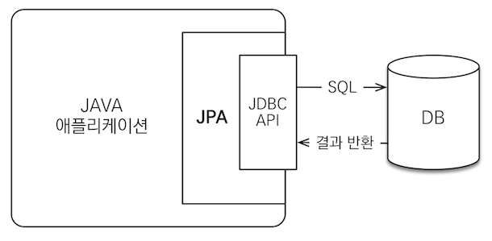

        * JAVA 애플리케이션에서 JPA에게 명령을 하면, JPA는 JDBC API를 사용해서 SQL을 만든 다음, DB에 전달한다. 
        
        * 그리고 DB로 부터 그 결과를 받는다.
        
    * JPA는 패러다임의 불일치를 해결한다.

* ORM (Object-Relational Mapping, 객체 관계 매핑)

    * `ORM`는 객체와 관계형 데이터베이스를 매핑(연결) 해주는 것을 말한다.

* JPA는 표준 명세

    * JPA는 자바 ORM 기술에 대한 API 표준 명세를 말한다.

        * 즉, 인터페이스를 모아둔 것이다.

    * JPA의 대표적인 구현체로는 하이버네이트가 있다.
  
* JPA를 사용하는 이유

    * 생산성을 증가 시킨다.
    
        * CRUD가 이미 정의 되어 있다.
        
            * 저장: jpa.persist(member)
            
            * 조회: Member member = jpa.find(memberId)
            
            * 수정: member.setName("변경할 이름")
            
            * 삭제: jpa.remove(member)
       
    * 유지보수 해야 하는 코드 수가 줄어든다.

        * 기존에는 필드를 변경하면 모든 SQL 문을 수정 했었지만 JPA를 사용하면 필드만 추가하면 된다. (DB에 컬럼이 추가되어 있는 경우)

    * 패러다임의 불일치 해결
    
    * 성능 최적화 기능

        * ① 1차 캐시와 동일성(identity) 보장
    
            * 같은 트랜잭션 안에서는 같은 엔티티를 반환 – 약간의 조회 성능 향상
    
            * DB Isolation Level이 Read Commit이어도 애플리케이션에서 Repeatable Read 보장

                ```java
                String memberId = "100";
                Member m1 = jpa.find(Member.class, memberId); // SQL
                Member m2 = jpa.find(Member.class, memberId); // 캐시
                
                println(m1 == m2) // true
                ```
              
                * 위의 코드에서 SQL은 1번만 실행된다.

        * ② 트랜잭션을 지원하는 쓰기 지연 - INSERT
    
            * 트랜잭션을 커밋 할 때까지 INSERT SQL을 모음
    
            * JDBC BATCH SQL 기능을 사용해서 한번에 SQL 전송

        * ③ 지연 로딩과 즉시 로딩
    
            * `지연 로딩(LAZY LOADING)` : 연관된 엔티티를 실제 사용할 때 조회한다.
    
            * `즉시 로딩(EAGER LOADING)` : 엔티티를 조회할 때, 연관된 엔티티도 함께 조회한다.

## 2. JPA 시작

### 1. 데이터베이스 방언

* JPA는 특정 데이터베이스에 종속적이지 않다.

* 각각의 데이터베이스가 제공하는 SQL 문법과 함수는 조금씩 다르다.

    * ① 데이터 타입 : 가변 문자 타입으로 MySQL은 VARCHAR, Oracle은 VARCHAR2를 사용
    
    * ② 다른 함수명 : 문자열을 자르는 함수로 SQL 표준은 SUBSTRING()를 사용하지만 Oracle은 SUBSTR()를 사용
    
    * ③ 페이징 처리 : MySQL은 LIMIT을 사용하지만 Oracle은 ROWNUM을 사용

* `방언(Dialect)` : SQL 표준을 지키지 않는 특정 데이터베이스만의 고유한 기능을 말한다.

* **하이버네이트를 포함한 대부분의 JPA 구현체들은 특정 데이터베이스에 종속되지 않도록 다양한 데이터베이스 방언 클래스를 제공한다.**

    * 하이버네이트는 다양한 데이터베이스 방언을 제공한다.
    
        * ① H2 : `org.hibernate.dialect.H2Dialect`
        
        * ② Oracle 10g : `org.hibernate.dialect.Oracle10gDialect`
        
        * ③ MySQL : `org.hibernate.dialect.MySQL5InnoDBDialect`
        
### 2. 애플리케이션 개발

* (1) 엔티티 매니저 설정

    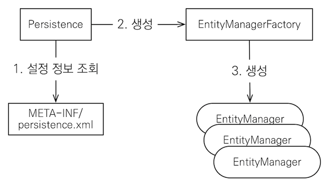

    * ① JPA는 `persistence.xml`이라는 설정 정보를 읽어서 엔티티 매니저 팩토리를 생성한다.

        * `persistence.xml`는 JPA 설정 파일이다.
    
            * 연결할 데이터베이스 당 하나의 영속성 유닛(persistence-unit)을 등록한다.
    
        * `EntityManagerFactory emf = Persistence.createEntityManagerFactory("hello");`
        
            * `META-INF/persistence.xml`에서 이름이 hello인 영속성 유닛을 찾아서 엔티티 매니저 팩토리를 생성한다.
    
    * ② 엔티티 매니저 팩토리에서 엔티티 매니저를 생성한다.
    
        * `EntityManager em = emf.createEntityManager();`
        
            * 엔티티 매니저를 사용해서 엔티티를 데이터베이스에 등록/조회/수정/삭제를 할 수 있다.
            
            * 엔티티 매니저는 내부에 데이터소스(데이터베이스 커넥션)을 유지하면서 데이터베이스와 통신한다.
        
                * `DataSource` : 커넥션 풀의 Connection을 관리하기 위한 객체이다. DataSource 객체를 통해서 필요한 Connection을 획득, 반납 등의 작업을 한다.
        
    * ③ 마지막으로 사용이 끝난 엔티티 매니저는 반드시 종료해야 한다.
    
        * `em.close(); // 엔티티 매니저 종료`
        
    * 애플리케이션을 종료할 때, 엔티티 매니저 팩토리도 종료해야 한다.
    
        * `emf.close(); // 엔티티 매니저 팩토리 종료`
        
* (2) 트랜잭션 관리

    * JPA를 사용하면 항상 트랜잭션 안에서 데이터를 변경해야 한다.
    
        * ① 트랜잭션을 시작하려면 엔티티 매니저에서 트랜잭션 API를 받아와야 한다.
      
        * ② 트랜잭션 API를 사용해서 비즈니스 로직이 정상 동작하면 트랜잭션을 커밋(commit)하고 예외가 발생하면 트랜잭션을 롤백(rollback)한다.

            ```java
            EntityManagerFactory emf = Persistence.createEntityManagerFactory("hello");
        
            EntityManager em = emf.createEntityManager();
        
            EntityTransaction tx = em.getTransaction(); // 트랜잭션 API
        
            tx.begin(); // 트랜잭션 시작
        
            try{
                // 비즈니스 로직 작성
                tx.commit(); // 트랜잭션 커밋
            }catch (Exception e){
                tx.rollback(); // 예외 발생 시 트랜잭션 롤백
            }finally {
                em.close(); // 엔티티 매니저 종료
            }
        
            emf.close(); // 엔티티 매니저 팩토리 종료
            ```

* (3) 비즈니스 로직 작성

    * ① 등록
    
        * `em.persist()` : 엔티티를 등록한다.
    
    * ② 수정
    
        * JPA는 어떤 엔티티가 변경되었는지 추적하는 기능을 가지고 있다. 따라서 엔티티의 값만 변경하면 된다.
        
        * `member.setName("HelloB");`
        
    * ③ 삭제
    
        * `em.remove()` : 엔티티를 삭제한다.
        
    * ④ 한 건 조회
    
        * `em.find()` : 엔티티 하나를 조회한다.
        
        * 메소드의 파라미터로 조회할 `엔티티 타입`과 `엔티티의 식별자 값`을 전달한다.

* (4) 주의사항    

    * ① `EntityManagerFactory`는 하나만 생성해서 애플리케이션 전체에서 공유해서 사용해야 한다.
    
    * ② `EntityManager`는 쓰레드 간에 공유해서는 안 된다.
    
        * 보통, `EntityManager`는 데이터베이스 트랜잭션 단위로 만들며 트랜잭션이 끝날 때, 같이 종료시킨다. 
    
    * ③ JPA의 모든 데이터 변경은 트랜잭션 안에서 실행해야 한다.

* (5) JPQL(Java Persistence Query Language)

    * `JPQL` : SQL을 추상화한 객체 지향 쿼리 언어를 말한다.
    
        * SQL과 문법 유사해서 SELECT, FROM, WHERE, GROUP BY, HAVING, JOIN 등을 지원한다.
    
        * `JPQL`은 엔티티 객체를 대상으로 쿼리한다.
        
            * SQL에 의존적인 개발을 피할 수 있다.

* (6) 쿼리 파라미터 출력하기

    * ① `pom.xml`에 다음 의존성을 추가한다.
    
        ```html
        <!-- logback -->
        <dependency>
            <groupId>ch.qos.logback</groupId>
            <artifactId>logback-classic</artifactId>
            <version>1.2.3</version>
        </dependency>
        ```
      
    * ② `resources` 아래에 `logback.xml` 파일을 만든다.
    
        ```html
        <?xml version="1.0" encoding="UTF-8"?>
        <configuration>
            <appender name="STDOUT" class="ch.qos.logback.core.ConsoleAppender">
                <layout class="ch.qos.logback.classic.PatternLayout">
                    <Pattern>%d{HH:mm} %-5level %logger{36} - %msg%n</Pattern>
                </layout>
            </appender>
        
            <logger name="org.hibernate.type" level="trace" />
        
            <root level="info">
                <appender-ref ref="STDOUT" />
            </root>
        </configuration>
        ```

## 3. 영속성 관리

* (1) 영속성 컨텍스트(persistence context)

    * `영속성 컨텍스트`는 **엔티티를 영구 저장하는 환경**을 말한다.
    
    * 영속성 컨텍스트는 논리적인 개념이며 눈에 보이지 않는다.
    
    * 엔티티 매니저를 통해서 영속성 컨텍스트에 접근한다.

* (2) 엔티티의 생명주기

    * 엔티티에는 4가지 상태가 존재한다.

        * ① `비영속(new/transient)` : 영속성 컨텍스트와 전혀 관계가 없는 **새로운** 상태
    
        * ② `영속(managed)` : 영속성 컨텍스트에 **저장**된 상태
    
        * ③ `준영속(detached)` : 영속성 컨텍스트에 저장되었다가 **분리**된 상태
    
        * ④ `삭제(removed)` : **삭제**된 상태

* (3) 엔티티의 각 상태에 대해 자세히 알아보기

    * ① 비영속(new)
    
        * 엔티티 객체를 생성한 상태를 말한다.
          
        * 아직 영속성 컨텍스트나 데이터베이스와는 전혀 관계가 없는 상태다.
        
            ```java
            //객체를 생성한 상태 (비영속)
            Member member = new Member();
            member.setId("member1");
            member.setUsername("회원1");
            ```
          
    * ② 영속(managed)
    
        * 엔티티 매니저를 통해서 엔티티를 영속성 컨텍스트에 저장하면 영속성 컨텍스트가 엔티티를 관리하게 되며 이를 영속 상태라 한다.
               
            ```java
            EntityManager em = emf.createEntityManager();
            em.getTransaction().begin();
            
            //객체를 저장한 상태(영속)
            em.persist(member);
            ```
          
    * ③ 준영속(detached)
    
        * 영속성 컨텍스트가 관리하던 영속 상태의 엔티티를 영속성 컨텍스트가 관리하지 않으면 준영속 상태가 된다.
               
            ```java
            //회원 엔티티를 영속성 컨텍스트에서 분리, 준영속 상태
            em.detach(member);
            ```
          
    * ④ 삭제(removed)
    
        * 엔티티를 영속성 컨텍스트와 데이터베이스에서 삭제한다.
               
            ```java
            //객체를 삭제한 상태(삭제)
            em.remove(member);
            ```

* (4) 영속성 컨텍스트의 이점

    * 1차 캐시
    
        * `1차 캐시 (First Level Cache)`는 영속성 컨텍스트가 내부에 가지고 있는 캐시를 말한다. 
        
        * 영속 상태의 엔티티는 모두 이곳에 저장된다.
        
        * 쉽게 이야기하면, 영속성 컨텍스트 내부에 Map이 하나 있는데 키는 `@Id`로 매핑한 식별자고 값은 엔티티 인스턴스다.
        
    * 엔티티의 `동일성(identity)`을 보장한다.
    
    * 트랜잭션을 지원하는 쓰기 지연이 가능하다.

        * `트랜잭션을 지원하는 쓰기 지연(transactional write-behind)`  
    
            * 엔티티 매니저는 트랜잭션을 커밋하기 직전까지 데이터베이스에 엔티티를 저장하지 않고 쓰기 지연 SQL 저장소에 INSERT SQL을 차곡 차곡 모아둔다.
        
            * 그리고 트랜잭션을 커밋 할 때 모아둔 쿼리를 데이터베이스에 보내는 것을 말한다.

    * 변경 감지(Dirty Checking)
        
        * 변경 감지는 엔티티의 변경사항을 데이터베이스에 자동으로 반영하는 기능이다.
    
    * 지연 로딩(Lazy Loading)
    
* (5) 영속성 컨텍스트의 이점 - CRUD로 알아보기

    * 엔티티 조회
    
        * 다음 코드를 실행하면 회원(member) 엔티티는 영속 상태가 되며 1차 캐시에 회원 엔티티를 저장한다. 회원 엔티티는 아직 데이터베이스에 저장되지 않았다.

            ```java
            // 엔티티를 생성한 상태(비영속)
            Member member = new Member();
            member.setId("member1");
            member.setUsername("회원1");
            
            // 엔티티를 영속
            em.persist(member);
            ```
          
            * `em.find()`를 호출하면 먼저 1차 캐시에서 엔티티를 찾고 만약 찾는 엔티티가 1차 캐시에 없으면 데이터베이스에서 조회한다.
          
        * 1차 캐시에서 조회하는 경우
        
            ```java            
            //1차 캐시에서 조회
            Member findMember = em.find(Member.class, "member1");
            ```
          
            * ① `em.find()`를 호출하면 먼저 1차 캐시에서 식별자 값으로 엔티티를 찾는다.

            * ② 만약 찾는 엔티티가 있으면 데이터베이스를 조회하지 않고 메모리에 있는 1차 캐시에서 엔티티를 조회한다.
            
        * 데이터베이스에서 조회
        
            ```java            
            //데이터베이스에서 조회
            Member findMember2 = em.find(Member.class, "member2");
            ```
          
            * ① `em.find(Member.class, "member2")`를 실행한다.
              
            * ② member2가 1차 캐시에 없으므로 데이터베이스에서 조회한다.
              
            * ③ 조회한 데이터로 member2 엔티티를 생성해서 1차 캐시에 저장한다. (영속 상태)
              
            * ④ 영속 상태의 엔티티를 반환한다.
            
        * 영속 엔티티의 동일성 보장
        
            ```java            
            Member a = em.find(Member.class, "member1");
            Member b = em.find(Member.class, "member1");
            
            System.out.println(a == b); // 동일성 비교
            ```
          
            * `em.find(Member.class, "member1")`를 반복해서 호출해도 영속성 컨텍스트는 1차 캐시에 있는 같은 엔티티 인스턴스를 반환한다.
        
            * 영속성 컨텍스트는 엔티티의 동일성을 보장한다.
    
                * 동일성(identity) 비교
                
                    * `동일성`은 실제 인스턴스가 같다는 것을 의미한다. 

                    * 따라서 인스턴스의 참조 값을 비교하는 `==` 비교의 결과가 같다는 것을 의미한다.
         
                * 동등성(equality) 비교
                
                    * `동등성`은 실제 인스턴스는 다를 수 있지만 인스턴스가 가지고 있는 값은 같다는 것을 의미한다.
                    
                    * 따라서 인스턴스가 가지고 있는 값을 비교하는 `equals()`의 결과가 같다는 것을 의미한다.
    
    * 엔티티 등록
    
        *  엔티티 매니저를 사용해서 엔티티를 영속성 컨텍스트에 등록해보자.

            ```java            
            EntityManager em = emf.createEntityManager();
            EntityTransaction transaction = em.getTransaction();
            
            //엔티티 매니저는 데이터 변경 시 트랜잭션을 시작해야 한다.
            transaction.begin(); // [트랜잭션] 시작
            
            em.persist(memberA); // em.persist()를 하면 해당 엔티티의 PK 값이 설정되고 난 다음에 영속 상태가 된다.
            //여기까지 INSERT SQL을 데이터베이스에 보내지 않는다.
            
            //커밋하는 순간, 데이터베이스에 INSERT SQL을 보낸다.
            transaction.commit(); // [트랜잭션] 커밋
            ```
           
            * ① `em.persist(memberA);`를 실행하면 다음과 같이 동작한다.
            
                * 영속성 컨텍스트는 1차 캐시에 회원 엔티티(memberA)를 저장하면서 동시에 회원 엔티티 정보로 INSERT 쿼리를 만든다.
                
                * 그리고 만들어진 INSERT 쿼리를 `쓰기 지연 SQL 저장소`에 보관한다.
                
            * ② 트랜잭션을 커밋하면 엔티티 매니저는 영속성 컨텍스트를 플러시 하여 `쓰기 지연 SQL 저장소`에 모인 쿼리를 데이터베이스에 보내고 실제 데이터베이스 트랜잭션을 커밋한다. 

    * 엔티티 수정
    
        * JPA로 엔티티를 수정할 때는 단순히 엔티티를 조회해서 데이터만 변경하면 된다.
        
            ```java            
            // 영속 엔티티 조회
            Member memberA = em.find(Member.class, "memberA");
            
            // 영속 엔티티 데이터 수정
            memberA.setUsername("hi");
            memberA.setAge(10);
            
            //em.update(member) 이런 코드가 있어야 하지 않을까? 생각 할 수도 있다. 그렇지만 필요 X
            
            transaction.commit(); // [트랜잭션] 커밋
            ```
          
            * ① 트랜잭션을 커밋하면 엔티티 매니저 내부에서 먼저 플러시(`flush()`)가 호출된다.
            
            * ② 엔티티와 스냅샷을 비교해서 변경된 엔티티를 찾는다.
            
                * `스냅샷`은 엔티티를 영속성 컨텍스트에 보관할 때, 최초 상태를 복사해서 저장해두는 것을 말한다.
    
            * ③ 변경된 엔티티가 있으면 수정 쿼리를 생성해서 `쓰기 지연 SQL 저장소`에 보낸다.

            * ④ `쓰기 지연 SQL 저장소`의 쿼리를 데이터베이스에 보낸다.

            * ⑤ 실제 데이터베이스 트랜잭션을 커밋한다.

    * 플러시(flush)
    
        * `플러시`는 **영속성 컨텍스트의 변경 내용을 데이터베이스에 반영하는 것**을 말한다.

            * 영속성 컨텍스트에 보관된 엔티티를 지우는 것이 아닌 영속성 컨텍스트의 변경 내용을 데이터베이스에 동기화하는 것이다
      
        * **플러시의 동작 과정** 

            * ① **변경 감지가 동작**해서 영속성 컨텍스트에 있는 모든 엔티티를 스냅샷과 비교해서 변경된 엔티티를 찾는다.

                * **변경된 엔티티는 UPDATE 쿼리를 만들어 `쓰기 지연 SQL 저장소`에 등록한다.**

            * ② **그리고 `쓰기 지연 SQL 저장소`의 쿼리를 데이터베이스에 전송한다.** (등록, 수정, 삭제 쿼리)
            
        * **영속성 컨텍스트를 플러시 하는 방법**

            * ① `em.flush()`를 직접 호출한다.

            * ② **트랜잭션 커밋 시 플러시가 자동 호출**된다.

            * ③ **JPQL 쿼리 실행 시 플러시가 자동 호출**된다.
            
    * 준영속 상태
    
        * `준영속 상태(detached)`는 영속 상태의 엔티티가 영속성 컨텍스트에서 분리 된 것을 말한다.
        
        * 따라서 **준영속 상태의 엔티티는 영속성 컨텍스트가 제공하는 기능을 사용할 수 없다.**

        * **준영속 상태로 만드는 방법**

            * ① `em.detach(entity)` : 특정 엔티티만 준영속 상태로 전환한다.
            
                * detach()를 호출하는 순간 1차 캐시 부터 쓰기 지연 SQL 저장소까지 해당 엔티티를 관리하기 위한 모든 정보가 제거된다. 
    
            * ② `em.clear()` : 영속성 컨텍스트를 완전히 초기화한다.
    
            * ③ `em.close()` : 영속성 컨텍스트를 종료한다.

    * 엔티티 삭제
    
        * 엔티티를 삭제하려면 **먼저 삭제 대상 엔티티를 조회**한 다음, `em.remove()`**에 삭제 대상 엔티티를 전달하면 된다.**
        
            ```java            
            //삭제 대상 엔티티 조회
            Member memberA = em.find(Member.class, "memberA");
            
            em.remove(memberA); //엔티티 삭제
            ```

## 4. 엔티티 매핑

* 객체와 테이블 매핑

    * (1) @Entity
    
        * `@Entity`는 JPA가 관리하는 "엔티티"로 만든다. 
        
            * 테이블과 매핑 할 클래스에 붙여준다.
        
            * [주의 사항] JPA는 엔티티 객체를 생성할 때, 기본 생성자를 사용하므로 기본 생성자가 반드시 있어야 한다.

    * (2) @Table
    
        * `@Table`은 엔티티와 매핑할 테이블을 지정한다.
        
            * `@Table`을 생략하면 엔티티 이름을 테이블 이름으로 매핑한다.

            * uniqueConstraints 속성은 DDL 자동 생성 시에 유니크 제약 조건을 만든다.

                ```java            
                @Entity
                @Table( name = "MEMBER", 
                        uniqueConstraints = {@UniqueConstraint(name = "NAME_AGE_UNIQUE", columnNames = {"NAME", "AGE"})}
                )
                public class Member {
                
                    @Id @GeneratedValue
                    @Column(name = "ID")
                    private String id;
                
                    @Column(name = "NAME")
                    private String userName;
                
                    private int age;
                }
                ```
    
                * 2개 이상의 복합 유니크 제약 조건도 만들 수 있다.

    * (3) 데이터베이스 스키마 자동 생성
    
        * JPA는 애플리케이션 실행 시점에 DDL을 자동으로 생성하는 기능을 제공한다.
        
        * 이렇게 자동으로 생성된 DDL은 개발 장비에서만 사용해야 한다. 또는 적절히 다듬은 후 사용한다.

            * `hibernate.hbm2ddl.auto` 속성
            
                * `create` : 기존 테이블을 삭제하고 새로 생성한다. 
                
                * `create-drop` : create와 같으나 애플리케이션을 종료할 때, 생성한 테이블을 DROP 한다.
                
                * `update` : 데이터베이스 테이블과 엔티티 매핑정보를 비교해서 변경사항만 반영한다. (운영 DB에 사용하면 안됨)
                
                * `validate` : 엔티티와 테이블이 정상적으로 매핑 되었는지만 확인한다.
                
                * `none` : 자동 생성 기능을 사용하지 않는다.
            
        * DDL 자동 생성 기능은 DDL을 자동 생성할 때만 사용되고 JPA의 실행 로직에는 영향을 주지 않는다.
        
* 필드와 컬럼 매핑

    * (1) @Column
    
        * `@Column`는 필드와 매핑할 컬럼을 지정한다.
        
            * name 속성은 필드와 매핑할 테이블의 컬럼 이름을 지정한다.

            * nullable 속성은 null 값의 허용 여부를 지정한다.
    
            * unique 속성은 하나의 컬럼에 간단히 유니크 제약 조건을 걸 때 사용한다.

                ```java            
                @Column(unique = true)
                private String username;
                ```
              
                * 두 개 이상의 컬럼에 유니크 제약 조건을 걸 때는 클래스 레벨에서 `@Table`의 `uniqueConstraints` 속성을 사용해야 한다. 
    
            * length 속성은 문자 길이 제약 조건을 지정할 때 사용한다.

                ```java            
                @Column(length = 100)
                private String data;
                ```

    * (2) @Enumerated
    
        * `@Enumerated`는 자바의 enum 타입을 매핑한다.
        
            * `EnumType.ORDINAL`이 아닌 `EnumType.STRING`를 사용해야 한다.

    * (3) @Temporal
    
        * `@Temporal`는 날짜 타입을 매핑한다.
        
        * 자바의 LocalDate, LocalDateTime을 사용하면 `@Temporal`을 생략 할 수 있다.
        
    * (4) @Lob
    
        * `@Lob`는 BLOB, CLOB 타입을 매핑한다.
        
        * 매핑하는 필드 타입이 문자면 `CLOB`으로 매핑하고 나머지는 `BLOB`으로 매핑한다.

            * CLOB: String, char[], java.sql.CLOB
    
            * BLOB: byte[], java.sql.BLOB

    * (5) @Transient
    
        * `@Transient`는 특정 필드를 데이터베이스에 매핑하지 않는다.
          
* 기본 키 매핑

    * (1) 기본 키 매핑 애노테이션
    
        * ① `@Id` : 필드를 테이블의 기본 키(Primary Key)에 매핑 한다.
    
            * `@Id` 애노테이션이 사용된 필드를 식별자 필드라 한다.
    
        * ② `@GeneratedValue` : 기본 키 자동 생성 전략을 지정한다.
        
    * (2) 기본 키 매핑 방법
    
        * **기본 키를 직접 할당**하려면 `@Id`만 사용한다.
    
        * **기본 키를 자동 생성**하려면 `@Id`에 `@GeneratedValue`를 추가하고 원하는 키 생성 전략을 선택한다.

            * ① `IDENTITY` 전략
    
                * 기본 키 생성을 데이터베이스에 위임하는 전략이다.

                    ```java
                    @Entity
                    public class Member {
                        @Id
                        @GeneratedValue(strategy = GenerationType.IDENTITY)
                        private Long id;
                        
                        // ...
                    }
                    ```

                * 주로 MySQL, PostgreSQL, SQL Server, DB2에서 사용
    
                * 해당 전략은 `트랜잭션을 지원하는 쓰기 지연`이 동작하지 않는다.

                    * AUTO_INCREMENT는 데이터베이스에 INSERT SQL을 실행한 이후에 식별자(ID) 값을 알 수 있다.

                    * 따라서 IDENTITY 전략은 `em.persist()`를 호출하는 시점에 INSERT SQL을 데이터베이스에 전달한 후 식별자를 조회해서 엔티티의 식별자에 할당한다.
    
            * ② `SEQUENCE` 전략
    
                * 데이터베이스 시퀀스 오브젝트를 사용해서 기본 키를 생성하는 전략이다.
                  
                    ```java
                    @Entity
                    @SequenceGenerator(
                        name = "MEMBER_SEQ_GENERATOR",  // 식별자 생성기 이름
                        sequenceName = "MEMBER_SEQ",    // 매핑할 데이터베이스의 시퀀스 이름
                        initialValue = 1,               // 시퀀스 DDL을 생성할 때 처음 시작하는 수를 1로 지정한다.
                        allocationSize = 1)             // 시퀀스 한 번 호출에 증가하는 수를 지정한다.
                    public class Member {
                        @Id
                        @GeneratedValue(strategy = GenerationType.SEQUENCE, 
                                        generator = "MEMBER_SEQ_GENERATOR")
                        private Long id;
                    }
                    ```
    
                    * 데이터베이스 시퀀스는 유일한 값을 순서대로 생성하는 특별한 데이터베이스 오브젝트다.
            
                    * 오라클, PostgreSQL, DB2, H2 데이터베이스에서 사용할 수 있다.
            
                    * `@SequenceGenerator`이 필요하다.
                    
                        * JPA는 시퀀스에 접근하는 횟수를 줄이기 위해 `allocationSize`를 사용한다.
                        
                        * 여기에 설정한 값만큼 한 번에 시퀀스 값을 증가시키고 나서 그만큼 메모리에 시퀀스 값을 할당한다.
                
                * 해당 전략은 `트랜잭션을 지원하는 쓰기 지연`이 동작한다.
                
                    * SEQUENCE 전략은 `em.persist()`를 호출할 때 먼저 데이터베이스 시퀀스를 사용해서 식별자를 조회한다.
    
                    * 그리고 조회한 식별자를 엔티티에 할당한 후에 엔티티를 영속성 컨텍스트에 저장한다.
    
                    * 이후 트랜잭션을 커밋해서 플러시가 일어나면 엔티티를 데이터베이스에 저장한다.
    
            * ③ `TABLE` 전략
    
                * 키 생성 전용 테이블을 하나 만들어서 데이터베이스 시퀀스를 흉내내는 전략이다.

                    * 키 생성 전용 테이블 생성하기

                        ```java
                        create table MY_SEQUENCES (
                            sequence_name varchar(255) not null,
                            next_val bigint,
                            primary key ( sequence_name )
                        )
                        ```
    
                    * 매핑하기                  

                        ```java
                        @Entity
                        @TableGenerator(
                            name = "MEMBER_SEQ_GENERATOR",  // 식별자 생성기 이름
                            table = "MY_SEQUENCES",         // 키 생성 테이블 명
                            pkColumnValue = "MEMBER_SEQ",   // 시퀀스 컬럼명
                            allocationSize = 1)             // 시퀀스 한 번 호출에 증가하는 수를 지정한다. (성능 최적화에 사용됨)
                        public class Member {
                            @Id
                            @GeneratedValue(strategy = GenerationType.TABLE,
                                            generator = "MEMBER_SEQ_GENERATOR")
                            private Long id;
                        ```

                        * 해당 전략은 실무에서 거의 사용되지 않는다.
        
                * TABLE 전략의 장, 단점
                
                    * 장점: 모든 데이터베이스에 적용 가능
    
                    * 단점: 성능이 좋지 않음
                
                * `@TableGenerator`이 필요하다.
    
            * ④ `AUTO` : 선택한 데이터베이스 방언에 따라 자동으로 지정한다. (기본 값)
    
        * 기본 키를 UUID로 자동 생성하기

            ```java
            @Entity
            @Table(name = "ORDERS")
            public class Order {
            
              @Id
              @GeneratedValue(generator = "uuid2")
              @GenericGenerator(name = "uuid2", strategy = "uuid2")
              @Column(columnDefinition = "BINARY(16)")
              private UUID id;
            
              // ...
            }
            ```
          
            * `UUID (Universally Unique IDentifier, 범용 고유 식별자)` : 어느 곳에서나 고유한 ID를 의미한다.
    
                * `@GenericGenerator`의 strategy 속성에서 uuid2로 설정하면 `org.hibernate.id.UUIDGenerator`를 이용해서 키 값을 생성하게 된다.

                * `UUIDGenerator`는 5개의 영역으로 UUID를 생성한다.

                    ```
                    2e66aa13-9c65-4935-a900-de0cb1d89e9b
                    ```

                    * [UUID의 각 영역에 대한 설명](https://github.com/hibernate/hibernate-orm/blob/9b00aaf9a55f9879a512b34c13dd25425264494b/hibernate-core/src/main/java/org/hibernate/id/UUIDGenerationStrategy.java#L21-L28 "UUID의 각 영역에 대한 설명")
    
    * (3) 권장하는 식별자 전략
    
        * **데이터베이스 기본 키는 다음 3가지 조건을 모두 만족해야 한다.**
        
            * **① null 값은 허용하지 않는다.**
            
            * **② 유일해야 한다.**
            
            * **③ 변하면 안 된다.**
            
        * 테이블의 기본 키를 선택하는 전략은 크게 2가지가 있다.
                    
            * ① `자연 키(natural key)` : 비즈니스에 의미가 있는 키를 말한다.
    
                * Ex) 주민등록번호, 이메일, 전화번호

            * ② `대리 키(surrogate key)` : 비즈니스와 관련 없는 임의로 만들어진 키를 말한다. 대체 키로도 불린다.

                * Ex) 오라클 시퀀스, AUTO_INCREMENT, 키 생성 테이블 사용
                
            * 미래까지 위에 있는 조건을 만족하는 자연 키는 찾기 어렵다. 따라서 **대리 키(대체 키)를 사용하자.**
            
                * 즉, **타입은 Long형으로 하고 대체 키를 기본 키로 사용**하되 **주민등록번호나 이메일처럼 자연 키의 후보가 되는 컬럼들은**
                  
                * **필요에 따라 유니크 인덱스를 설정해서 사용**하는 것을 권장한다.

## 5. 연관관계 매핑 기초

* 객체를 테이블에 맞추어 모델링 (객체 연관관계 사용 X)

    * 예시
    
        ```java
        @Entity
        public class Member {
        
            @Id @GeneratedValue
            @Column(name = "MEMBER_ID")
            private Long id;
        
            @Column(name = "USERNAME")
            private String username;
        
            // 외래 키
            @Column(name = "TEAM_ID")
            private Long teamId;
            
            //...
        }
        
        @Entity
        public class Team {
        
            @Id @GeneratedValue
            @Column(name = "TEAM_ID")
            private Long id;
        
            private String name;
            
            //...
        }
        ```

    * 문제점 \

        * 외래 키를 직접 다루기 때문에 객체 지향적인 방법이 아니다.

            ```java
            // 팀 저장
            Team team = new Team();
            team.setName("TeamA");
            em.persist(team);
            
            // 회원 저장
            Member member = new Member();
            member.setUsername("member1");
            member.setTeamId(team.getId());
            em.persist(member);
            ```

        * 식별자로 다시 조회해야되는 경우가 발생할 수 있다.

            ```java
            // 회원 조회
            Member findMember = em.find(Member.class, member.getId());
            
            // 연관관계가 없기 때문에 teamId로 DB를 조회해야 한다.
            Long findTeamId = findMember.getTeamId();
            em.find(Team.class, findTeamId);
            ```
          
            * 예를 들어, 어떤 회원을 조회한 다음, 해당 회원이 어느 팀에 소속되어 있는지 알고 싶다면 DB에서 식별자로 다시 조회해야 한다.

* 연관관계가 필요한 이유

    * 객체를 테이블에 맞추어 데이터 중심으로 모델링하면, 객체들의 협력 관계를 만들 수 없다.

    * **테이블과 객체 사이에는 다음과 같은 차이가 있다.**

        * **테이블은 외래 키로 조인을 사용해서 연관된 테이블을 찾는다.**

        * **객체는 참조(reference)를 사용해서 연관된 객체를 찾는다.**

* 단방향 연관관계

    * (1) 객체 지향적인 모델링 (객체 연관관계 사용)
    
        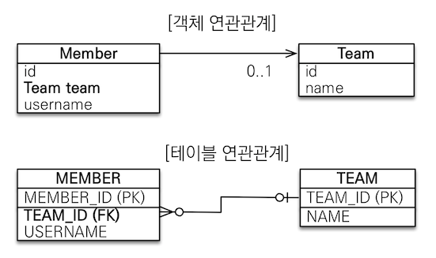 
    
        * ① 객체 연관관계

            * 회원(`Member`) 객체는 `Member.team` 필드로 팀(`Team`) 객체와 연관관계를 맺는다.
    
            * 회원 객체와 팀 객체는 단방향 관계다.
       
                * 회원은 `Member.team` 필드를 통해서 팀을 알 수 있지만, 반대로 팀은 회원을 알 수 없다.

        * ② 테이블 연관관계

            * 회원(`MEMBER`) 테이블은 `TEAM_ID` 외래 키로 팀(`TEAM`) 테이블과 연관관계를 맺는다.

            * 회원 테이블과 팀 테이블은 양방향 관계다. 
            
                * 회원 테이블의 `TEAM_ID` 외래 키를 통해서 회원과 팀을 조인 할 수 있고 반대로 팀과 회원도 조인할 수 있다.

                    ```sql            
                     SELECT *
                     FROM MEMBER M JOIN TEAM T ON M.TEAM_ID = T.TEAM_ID
                  
                     SELECT *
                     FROM TEAM T JOIN MEMBER M ON T.TEAM_ID = M.TEAM_ID
                    ```
          
    * (2) 객체의 참조와 테이블의 외래 키를 매핑한다.
    
        * `연관관계 매핑`은 객체의 참조(`Member.team`)와 테이블의 외래 키(`MEMBER.TEAM_ID`)를 매핑하는 것이다.
          
        * `연관관계 매핑`은 어떤 연관관계 인지(`@ManyToOne`) 그리고 연관관계를 매핑할 때, 사용할 외래 키(`@JoinColumn`)를 지정한다.

            ```java            
            @Entity
            public class Member {
                @Id @GeneratedValue
                @Column(name = "MEMBER_ID")
                private Long id;
          
                @Column(name = "USER_NAME")
                private String username;
          
                @ManyToOne
                @JoinColumn(name = "TEAM_ID")
                private Team team;
            }
            ```

            ```java            
            @Entity
            public class Team {
                @Id @GeneratedValue
                @Column(name = "TEAM_ID")
                private Long id;
          
                private String name;
            }
            ```
          
            * `@ManyToOne` : 다대일(N:1) 관계라는 매핑 정보다.
              
                * 회원과 팀은 다대일 관계다.
            
            * `@JoinColumn` : 해당 연관관계를 조인할 때, 사용할 외래 키 컬럼을 지정한다. 
              
                * 즉, 객체와 테이블의 연관관계를 매핑할 때, 사용할 외래 키를 지정한다.
            
                    * name 속성 : 매핑할 외래 키 이름을 지정한다.
                    
                        * 예를 들어, 회원과 팀 테이블은 `TEAM_ID` 외래 키로 연관관계를 맺으므로 이 값을 지정하면 된다.
    
                    * foreignKey 속성 : 외래 키 제약조건을 직접 지정한다. (DDL을 자동 생성할 때만 사용됨)
    
                        ```java
                        // Member 클래스
                        @ManyToOne
                        @JoinColumn(name = "TEAM_ID", foreignKey = @ForeignKey(name = "FK__MEMBER__TEAM"))
                        private Team team;
                        ```

                * 해당 애노테이션은 생략 할 수 있다.
    
                    * `@JoinColumn` 애노테이션을 생략하면 외래 키를 찾을 때, 기본 전략을 사용한다.

                        ```java
                        @ManyToOne
                        private Team team;
                        ```

                        * 기본 전략 : 필드명 + _ + 참조하는 테이블의 컬럼명
    
                            * Ex) team_TEAM_ID 외래 키를 사용한다.
    
                                * 필드명(team) + _ + 참조하는 테이블의 컬럼명(TEAM_ID)

    * (3) 객체–관계 매핑 (ORM)
    
        * 앞서 살펴본 코드를 실행 했을 때, 객체(`Member`)의 참조와 테이블(`MEMBER`)의 외래 키를 매핑하면 다음 그림과 같다.
        
            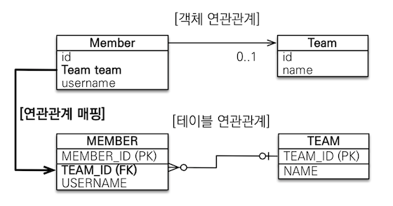
            
    * (4) 연관관계를 매핑한 엔티티를 저장한다.

        ```java
        // 팀 저장            
        Team team = new Team();
        team.setName("TeamA");
        em.persist(team); // em.persist()를 하면 해당 엔티티의 PK 값이 설정되고 난 다음에 영속 상태가 된다.
        
        // 회원 저장
        Member member = new Member();
        member.setUsername("member1");
        member.setTeam(team); // 회원 -> 팀 참조
        em.persist(member); // 저장
        ```
        
        * 회원 엔티티가 팀 엔티티를 참조하도록 하고 회원 엔티티를 영속성 컨텍스트에 저장했다.
        
        * JPA는 회원이 참조하는 팀의 식별자(`Team.id`)를 외래 키로 사용해서 적절한 등록 쿼리를 생성한다.

            ```sql
            INSERT INTO TEAM (TEAM_ID, NAME) VALUES (1, ‘TeamA’);
            
            INSERT INTO MEMBER (MEMBER_ID, USERNAME, TEAM_ID) VALUES (2, ‘member1’, 1);
            ```
        
    * (5) 연관관계가 있는 엔티티를 조회한다.
    
        ```java
        // 조회
        Member findMember = em.find(Member.class, 2L);
        
        // 참조를 사용해서 연관 관계 조회
        Team findTeam = findMember.getTeam();
        ```

        * `findMember.getTeam()`을 사용해서 findMember와 연관된 team 엔티티를 조회 할 수 있다.
        
    * (6) 연관 관계를 수정한다.
    
        ```java
        // 새로운 팀 B
        Team teamB = new Team();
        teamB.setName("TeamB");
        em.persist(teamB);
      
        // member1에 새로운 팀 B를 설정한다.
        findMember.setTeam(teamB);
        ```
      
        * TeamA 소속이던 회원을 새로운 팀 TeamB에 소속되도록 수정한다. 

* 양방향 연관관계와 연관관계의 주인
        
    * (1) 양방향 연관관계

        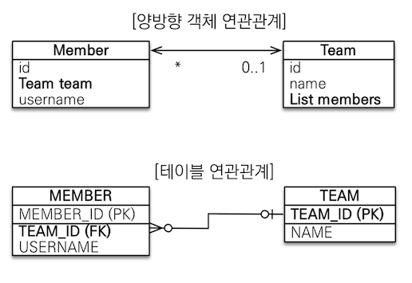 
        
        * ① 객체 연관관계
          
            * 회원에서 팀으로 접근하고 반대 방향인 팀에서도 회원으로 접근 할 수 있는 양방향 연관관계로 매핑한다.
              
            * 회원과 팀은 다대일 관계다. 반대로 팀에서 회원은 일대다 관계다.
            
                * 일대다 관계는 여러 건과 연관관계를 맺을 수 있으므로 컬렉션을 사용해야 한다.
                        
        * ② 테이블 연관관계
          
            * 데이터베이스 테이블은 외래 키 하나로 양방향으로 조회할 수 있다.
              
            * 두 테이블의 연관관계는 외래 키 하나만으로 양방향 조회가 가능하므로 처음부터 양방향 관계다.
            
    * (2) 양방향 연관관계 매핑

        * ① Member 엔티티
            
            ```java
            @Entity
            public class Member{
              @Id @GeneratedValue
              @Column(name = "MEMBER_ID")
              private Long id;
          
              @Column(name = "USER_NAME")
              private String username;
          
              @ManyToOne
              @JoinColumn(name = "TEAM_ID")
              private Team team;
            }   
            ```

            * 이제 양방향 관계를 매핑하자. Member 엔티티는 단방향과 동일하다.
              
        * ② Team 엔티티
            
            ```java
            @Entity
            public class Team{
              @Id @GeneratedValue
              @Column(name = "TEAM_ID")
              private Long id;
          
              private String name;
          
              // ArrayList로 초기화 해두면 add를 할 때, NPE가 발생하지 않는다.
              @OneToMany(mappedBy = "team")
              private List<Member> members = new ArrayList<>();
            }   
            ```
          
            * 팀에서 회원은 일대다 관계다. 따라서 Team 엔티티에 컬렉션인 `List<Member> members`를 추가한다.

            * 그리고 일대다 관계를 매핑하기 위해 `@OneToMany` 매핑 정보를 사용했다.

            * mappedBy 속성은 양방향 매핑일 때, 사용 하는데 반대쪽 매핑의 필드 이름(team)을 값으로 주면 된다.

        * ③ 일대다 컬렉션 조회

            * 팀에서 회원 컬렉션으로 객체 그래프 탐색을 사용해서 조회한 회원들을 출력한다.

                ```java
                Member findMember = em.find(Member.class, member.getId());
                List<Member> members = findMember.getTeam().getMembers(); // (팀 -> 회원)
                
                for(Member m : members){
                  System.out.println("m = " + m.getUsername());
                }  
                ```

    * (3) 연관관계의 주인과 mappedBy

        * mappedBy 속성을 이해하기 위해서는 객체와 테이블 간에 연관관계를 맺는 차이를 이해해야 한다.
        
            * **객체와 테이블이 연관 관계를 맺는 차이**
    
                * 엔티티를 양방향 연관관계로 설정하면 객체의 참조는 둘인데 외래 키는 하나다. 따라서 둘 사이에 차이가 발생한다.
    
                    * ① 객체 연관관계
        
                        * **객체의 양방향 연관관계는** 사실 양방향 관계가 아니라 **서로 다른 단방향 연관관계 2개**다.
            
                            * 회원 → 팀 연관관계 1개 (단방향)
                
                            * 팀 → 회원 연관관계 1개 (단방향)
        
                    * ② 테이블 연관관계
    
                        * **테이블의 양방향 연관관계는 1개**다.
                          
                            * **테이블은 외래 키 하나로 두 테이블의 연관관계를 관리**한다.
            
                                * 회원 ↔ 팀의 연관관계 1개 (양방향)
                        
            * **즉, 객체의 참조 필드 2개 중에서 하나로 외래 키를 관리해야 한다.**
    
                * `Member.team`, `Team.members` 둘 중 어떤 것을 연관관계의 주인으로 정해야 할까?

                    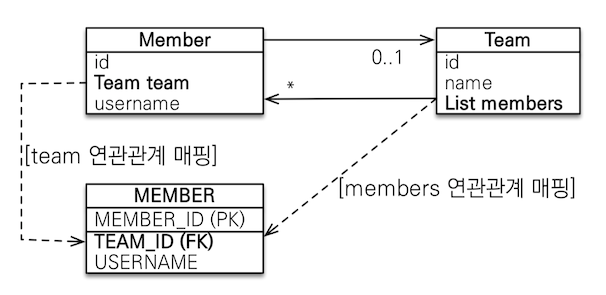 
                    
                * 즉, 2개의 참조 필드 중에서 `Member.team` 값을 바꿨을 때, 외래 키(`TEAM_ID`)가 수정 되도록 해야될까?
                  
                * 아니면 `Team.members` 값을 바꿨을 때, 외래 키(`TEAM_ID`)가 수정 되도록 해야될까?

                    * **연관관계의 주인은 테이블에 외래 키가 있는 곳으로 정해야 한다.**
    
                        * 즉, **테이블의 연관관계에서 `N`인 쪽을 연관관계의 주인으로 정해야 한다.**
                          
                            * 그 이유는 JPA를 사용하는데 있어서 헷갈리지 않도록 하기 위해서다.
                    
                    * **연관관계의 주인이 아니면 mappedBy 속성을 지정한다.** 
                    
            * 연관관계의 주인(Owner)

                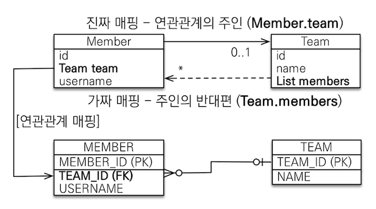 

                * ① **양방향 연관관계 매핑 규칙**

                    * **양방향 연관관계 매핑 시, 객체의 두 연관관계 중 하나를 연관관계의 주인으로 정해야 한다.**
    
                    * **연관관계의 주인만이 데이터베이스 연관관계와 매핑되고 외래 키를 관리(등록, 수정) 할 수 있다.**
    
                    * **반면에 주인이 아닌 쪽(mappedBy)은 읽기만 할 수 있다.**

                * ② 연관관계의 주인

                    * **연관관계의 주인은 테이블에 외래 키가 있는 곳으로 정해야 한다.**
    
                        * 여기서는 회원 테이블이 외래 키를 가지고 있으므로 `Member.team`이 연관관계의 주인이 된다.
        
                        * 주인이 아닌 `Team.members`에는 `mappedBy="team"` 속성을 사용해서 주인이 아님을 지정한다.
        
                        * mappedBy 속성의 값으로는 연관관계의 주인인 team을 지정한다.
                    
                * [참고]
                
                    * 데이터베이스 기준으로 테이블의 다대일, 일대다 관계에서는 항상 다 쪽이 외래 키를 가진다.
                      
                    * 다 쪽인 `@ManyToOne`은 항상 연관관계의 주인이 되므로 `mappedBy`를 설정 할 수 없다.

    * (4) 양방향 연관관계의 주의점

        * ① 양방향 연관관계 매핑 시 가장 많이하는 실수
        
            * **연관관계의 주인에는 값을 입력하지 않고, 주인이 아닌 방향(역방향)만 값을 입력하는 실수를 한다.**

                ```java
                Team team = new Team();
                team.setName("TeamA");
                em.persist(team);
              
                Member member = new Member();
                member.setUsername("member1");
                
                // 역방향 (연관관계의 주인이 아닌 방향)만 연관관계 설정 
                team.getMembers().add(member);
              
                em.persist(member);
                ```

                * 주인이 아닌 방향(역방향)만 값을 입력하면 테이블(MEMBER)에 외래 키가 설정되지 않는 문제점이 있다.          

            * **순수한 객체 관계를 고려해서 항상 양쪽에 값을 설정해야 한다.** (객체 지향적인 관점)  
            
                ```java
                Team team = new Team();
                team.setName("TeamA");
                em.persist(team);
              
                Member member = new Member();
                member.setUsername("member1");
              
                // 연관관계의 주인에 값 설정
                member.setTeam(team);
                em.persist(member);
              
                // 역방향도 값 설정
                team.getMembers().add(member);
                ```

            * 정리하자면 연관관계의 주인과 주인이 아닌 방향(역방향) 둘 다 값을 설정해야 하는 이유는 다음과 같다.

                * 예를 들어, 연관관계의 주인에는 값을 설정하고 역방향은 값을 설정하지 않았다고 가정한다.

                    ```java
                    Team team = new Team();
                    team.setName("TeamA");
                    em.persist(team);
                    
                    Member member = new Member();
                    member.setUsername("member1");
                    member.setTeam(team);
                    em.persist(member);
                    ```
      
                * `flush()`와 `clear()`를 한 다음, 조회한다면 DB에서 다시 조회를 하기 때문에 정상적으로 동작한다.

                    ```java
                    em.flush();
                    em.clear();
                    
                    Team findTeam = em.find(Team.class, team.getId());
                    List<Member> members = findTeam.getMembers();
                    
                    for (Member m : members) {
                        System.out.println("m = " + m.getUsername());
                    }
                    ```

                    * 역방향에 값을 설정하지 않더라도 Team의 getMembers()를 호출해서 List<Member>를 가져온 다음, for 문으로 반복을 진행하면
    
                    * 지연 로딩이 동작하여 해당 팀과 연관된 회원들을 조회하는 쿼리가 발생한다. 역방향에 값을 설정하지 않더라도 문제가 없어 보인다.

                * 하지만 이 상황에서 문제가 발생 할 수 있는 경우는 다음 2 가지가 있다.    

                    * `flush()`와 `clear()`를 하지 않고 조회한다면 1차 캐시에서 조회하기 때문에 문제가 발생한다.
                    
                    * 또한 JPA 없이 순수한 자바 코드를 대상으로 테스트하는 경우에도 문제가 될 수 있다.

                * 따라서 항상 양쪽에 값을 설정해야 한다.

        * ② **연관관계 편의 메소드를 생성하자.**
        
            * `member.setTeam(team)`과 `team.getMembers().add(member)`를 각각 호출하다 보면 실수로 둘 중 하나만 호출해서 양방향이 깨질 수 있다.
    
            * 그래서 `Member`에 `changeTeam()` 메소드 하나로 양방향 연관관계를 모두 설정하도록 변경했다.

                ```java
                @Entity
                public class Member{
                  @Id @GeneratedValue
                  @Column(name = "MEMBER_ID")
                  private Long id;
              
                  @Column(name = "USER_NAME")
                  private String username;
              
                  @ManyToOne
                  @JoinColumn(name = "TEAM_ID")
                  private Team team;
              
                  // 연관관계 편의 메소드
                  public void changeTeam(Team team){
                      this.team = team;
                      team.getMembers().add(this);
                  } 
                }   
                ```

                ```java
                Team team = new Team();
                team.setName("TeamA");
                em.persist(team);
              
                Member member = new Member();
                member.setUsername("member1");
                member.changeTeam(team);
                em.persist(member);
                ```
              
            * 반대편(Team)에서 연관관계 편의 메소드를 만들어서 사용하는 것도 가능하다. 둘 중 한 곳에만 작성하면 된다.

                ```java
                @Entity
                public class Team {
                
                    @Id @GeneratedValue
                    @Column(name = "TEAM_ID")
                    private Long id;
                
                    private String name;
                    
                    @OneToMany(mappedBy = "team")
                    private List<Member> members = new ArrayList<>();
                
                    // 반대편(Team)에서 연관관계 편의 메소드
                    public void addMember(Member member) {
                        member.setTeam(this);
                        members.add(member);
                    }
                    
                }
                ```

        * ③ **양방향 연관관계 매핑 시에 무한 루프를 조심하자**

            * `toString()`

                * 양방향 연관관계에 있는 엔티티에 `toString()`가 있다면 양쪽으로 서로 호출하면서 무한 루프에 빠질 수 있다.
                  
                * 따라서 `toString()`를 만들 때는 참조(reference) 타입은 제외하자.

            * `JSON 생성 라이브러리`
            
                * **양방향 연관관계에 있는 엔티티를 JSON으로 직렬화 하면 무한 루프에 빠지게 된다.**
            
                * 따라서 **컨트롤러에서는 절대 엔티티를 반환하지 않는다.** 
                
                    * 컨트롤러에서 엔티티를 반환하는 상황에서 엔티티를 변경하면 API 스펙 자체가 변경되는 문제점이 있다. 
                     
                    * **단순 값만 있는 DTO로 변환해서 반환하자.** 그러면 `JSON 생성 라이브러리`로 인한 문제는 발생하지 않는다.

                * 무한 루프에 빠지지 않도록 하는 애노테이션으로 해결할 수도 있다.                    

                    * JSON 생성 라이브러리들은 무한 루프에 빠지지 않도록 하는 애노테이션을 제공한다.
                    
                        * Jackson 2.0 버전 이전 : `@JsonManagedReference`, `@JsonBackReference`
                        
                        * Jackson 2.0 버전 이상 : `@JsonIdentityInfo`

    * (5) 양방향 매핑 정리하기

        * **단방향 연관관계 매핑만으로도 객체와 테이블의 연관관계 매핑은 이미 완료된 것이다.**

            * 단방향을 양방향으로 만드는 것은 반대 방향으로 조회(객체 그래프 탐색) 기능이 추가된 것 뿐이다.

            * JPQL에서 역방향으로 탐색해야 되는 경우가 있다면 양방향으로 만들면 된다.

        * **JPA 모델링 시, 처음에는 단방향 매핑으로 설계를 완료하고 양방향은 필요할 때 추가하면 된다.**

            * 나중에 추가해도 되는 이유는 테이블에 영향을 주지 않기 때문이다.
    
        * **단방향 연관관계는 항상 외래 키가 있는 곳(N)을 기준으로 매핑하면 된다.**

## 6. 다양한 연관관계 매핑

* 연관관계 매핑 시 고려사항 3가지

    * (1) **다중성**
      
        * ① 일대일: `@OneToOne`
          
        * ② 일대다: `@OneToMany`
          
        * ③ 다대일: `@ManyToOne`
          
        * ④ 다대다: `@ManyToMany`
           
            * 사실, 다대다는 실무에서 사용하면 안 된다. 
            
    * (2) **단방향, 양방향**
      
        * ① 테이블

            * 외래 키 하나로 양쪽으로 조인 할 수 있다.
    
            * 테이블은 사실 방향이라는 개념이 없다.

        * ② 객체

            * 참조용 필드가 있는 쪽으로만 참조 할 수 있다.

                * 한쪽만 참조하면 단방향이다.
    
                * 양쪽이 서로 참조하면 양방향이다.
    
                    * 사실은 단방향이 2개인 것이다.
            
    * (3) 양방향인 경우, **연관관계의 주인**를 정해야 한다.

        * 객체의 양방향 관계는 참조가 2개 있는데 둘 중 테이블의 외래 키를 관리할 참조를 지정해야 한다.

        * 외래 키를 관리하는 참조가 연관관계의 주인이 된다.

        * 주인의 반대편은 외래 키를 관리하는데 영향을 주지 않으며 단순 조회만 가능하다.

* `다중성`과 관련해서 자세히 살펴보기

    * 다대일 [N:1]
    
        * ① 다대일 단방향
        
            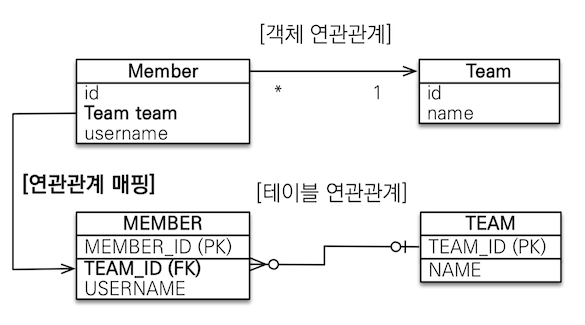 
    
            * 관계형 데이터베이스에서는 항상 다 쪽에 외래 키가 있어야 한다.
            
                * 그렇지 않다면 설계가 잘못된 것이다.
    
            * 다대일 단방향은 가장 많이 사용하는 연관관계다.
    
            * **외래 키가 있는 쪽에 참조를 추가하고 연관관계를 매핑한다.**
    
            * **"다대일"의 반대는 "일대다"가 된다.**
            
        * ② 다대일 양방향
        
            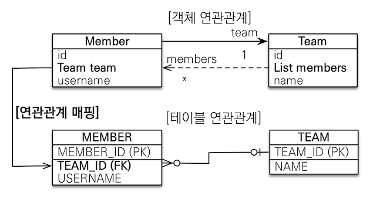

            * 외래 키가 있는 쪽이 연관관계의 주인이다.

            * 양쪽을 서로 참조하도록 할 때, 사용한다.
            
    * 일대다 [1:N]
    
        * ① 일대다 단방향
    
            * ERD
        
                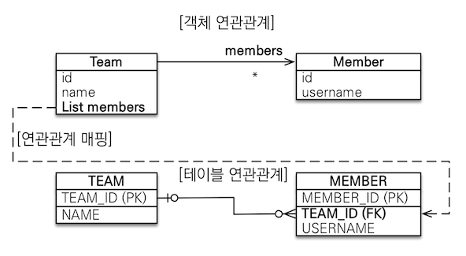
    
                * **일대다 단방향 관계에서 일(1)이 연관관계의 주인이라고 가정한다.** 
    
                    * 하나의 팀은 여러 회원을 참조 할 수 있는데 이런 관계를 일대다 관계라 한다. (Team이 연관관계의 주인이 된 구조)
        
                        * 그리고 팀은 회원들을 참조하지만 반대로 회원은 팀을 참조하지 않으면 둘의 관계는 단방향이다.
    
                * **테이블의 일대다 관계는 항상 다(N) 쪽에 외래 키가 있다.**
    
                * **일대다 단방향 관계**는 (객체와 테이블의 차이 때문에) **반대편 테이블의 외래 키를 관리하는 특이한 구조**가 된다.
        
                    * 즉, Team 엔티티의 members의 값을 변경하면 반대편 테이블(MEMBER)의 외래 키를 수정(UPDATE)하게 된다.
                    
                        * 다 쪽인 Member 엔티티에는 외래 키를 매핑 할 수 있는 참조 필드가 없다.
            
                        * 대신에 반대 쪽인 Team 엔티티에만 외래 키를 매핑 할 수 있는 참조 필드인 members가 있기 때문이다.
                
            * 소스코드

                * 회원(Member) 엔티티

                    ```java
                    @Entity
                    public class Member {
                    
                        @Id @GeneratedValue
                        @Column(name = "MEMBER_ID")
                        private Long id;
                    
                        @Column(name = "USERNAME")
                        private String username;
                    
                        // Getter, Setter
                    }
                    ```

                * 팀(Team) 엔티티

                    ```java
                    @Entity
                    public class Team {
                      @Id @GeneratedValue
                      @Column(name = "TEAM_ID")
                      private Long id;
                  
                      private String name;
                  
                      @OneToMany
                      @JoinColumn(name = "TEAM_ID")
                      private List<Member> members = new ArrayList<>();

                      // 연관관계 편의 메소드
                      public void addMembers(Member member) {
                        members.add(member);
                      }
                  
                      // Getter, Setter
                    }   
                    ```
                  
                    * **일대다 단방향 관계는** `@JoinColumn`**을 꼭 사용해야 한다.**
    
                        * **그렇지 않으면 조인 테이블 방식을 사용해서 중간 테이블(TEAM_MEMBER)을 하나 추가한다.**
                    
                    * **일대다 단방향 매핑 보다는 다대일 양방향 매핑을 사용하자**
        
                        * 사실 다대일 단방향과 양방향만 알면 일대다에 대해서는 몰라도 된다.

        * ② 일대다 양방향
    
            * ERD
        
                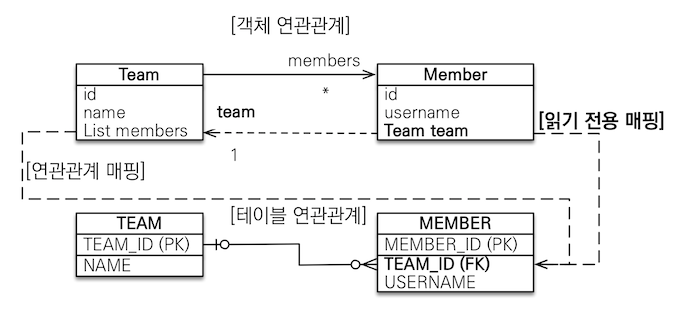
    
                * 일대다 양방향 매핑은 공식적으로 존재하지는 않는다. 
                
                * 일대다 단방향 매핑 반대편에 같은 외래 키를 사용하는 다대일 단방향 매핑을 읽기 전용으로 하나 추가하면 된다.
    
            * 소스코드 
    
                ```java
                @Entity
                public class Member {
                
                    //...
                
                    // 다대일 단방향 매핑을 읽기 전용으로 추가한다.
                    @ManyToOne
                    @JoinColumn(name = "TEAM_ID", insertable = false, updatable = false)
                    private Team team;
                }
                ```

                * **일대다 양방향 매핑 보다는 다대일 양방향 매핑을 사용하자**
            
    * 일대일 [1:1]

        * 설명
    
            * 일대일 관계는 그 반대도 일대일 관계다.
        
            * 주 테이블이나 대상 테이블 중에 누가 외래 키를 가질지 선택할 수 있다.

                * `주 테이블` : 많이 접근(Access)하는 테이블을 말한다.
        
            * 외래 키(FK)에 유니크(UNI) 제약조건을 추가해야 한다.
    
                * `@JoinColumn(name = "LOCKER_ID", unique = true)`
        
        * 예시

            * ① 주 테이블에 외래 키가 있는 일대일 단방향 관계

                * ERD
                
                    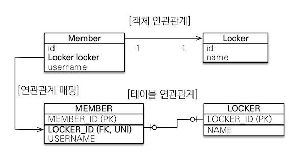
        
                    * `MEMBER`가 주 테이블이고 `LOCKER`는 대상 테이블이다.
        
                    * `@OneToOne`으로 일대일 단방향 관계를 매핑하고 `@JoinColumn`를 지정한다. (다대일 단방향과 거의 비슷함)
    
                * 소스코드
                
                    ```java
                    @Entity
                    public class Member {
                      @Id @GeneratedValue
                      @Column(name = "MEMBER_ID")
                      private Long id;
                  
                      @Column(name = "USER_NAME")
                      private String username;
                  
                      @OneToOne
                      @JoinColumn(name = "LOCKER_ID")
                      private Locker locker;
                    }   
                    ```
                  
                    ```java
                    @Entity
                    public class Locker {
                      @Id @GeneratedValue
                      private Long id;
                  
                      private String name;
                    }   
                    ```
                  
            * ② 주 테이블에 외래 키가 있는 일대일 양방향 관계
    
                * ERD
    
                    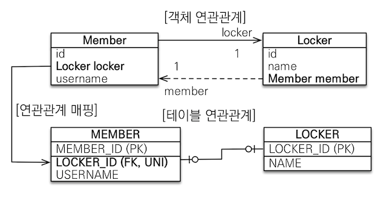
        
                    * 일대일 **양방향** 관계이므로 **연관관계의 주인**을 정해야 한다.
                    
                    * 다대일 양방향 매핑처럼 **외래 키가 있는 곳이 연관관계의 주인**이며 **반대편은 mappedBy 속성**을 사용한다.
    
                * 소스코드

                    ```java
                    @Entity
                    public class Locker {
                      @Id @GeneratedValue
                      private Long id;
                  
                      private String name;
                  
                      @OneToOne(mappedBy = "locker")
                      private Member member;
                    }   
                    ```

                    * MEMBER 테이블이 외래 키를 가지고 있으므로 Member 엔티티에 있는 `Member.locker`가 연관관계의 주인이다. 
                    
                    * 따라서 반대 매핑인 `Locker.member`는 `mappedBy` 속성을 사용해서 연관관계의 주인이 아니라고 설정했다.

            * ③ 대상 테이블에 외래 키가 있는 일대일 단방향 관계
    
                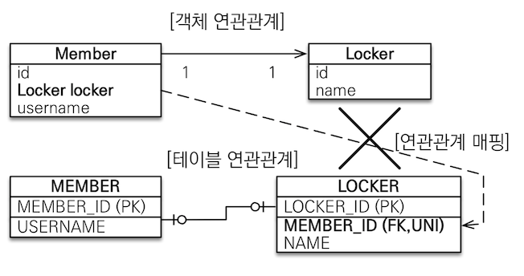
    
                * 주 엔티티(Member)에 참조 필드가 있으면서 대상 테이블에 외래 키가 있는 일대일 단방향 관계는 JPA에서 지원하지 않는다.  (일대다 단방향과 거의 비슷함) 
                
                    * 이러한 경우에는 양방향 관계로 만들고 Locker를 연관관계의 주인으로 설정해야 한다.
    
                    * 즉, **일대일 연관관계는 자신의 엔티티가 자신의 테이블에 있는 외래 키를 직접 관리해야 한다. (★★★)**  
                      
            * ④ 대상 테이블에 외래 키가 있는 일대일 양방향 관계
    
                * ERD
    
                    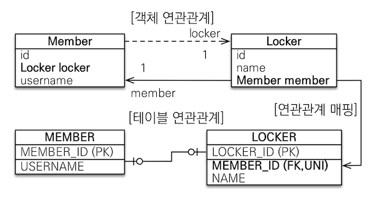
        
                    * 주 엔티티(Member) 대신에 **대상 엔티티인 Locker를 연관관계의 주인으로 만들어서 LOCKER 테이블의 외래 키를 관리하도록 한다.**
    
                    * 사실, 주 테이블에 외래 키가 있는 일대일 양방향 관계와 매핑 방법이 같다.
    
                * 소스코드
                    
                    ```java
                    @Entity
                    public class Member {
                      @Id @GeneratedValue
                      @Column(name = "MEMBER_ID")
                      private Long id;
                  
                      @Column(name = "USER_NAME")
                      private String username;
                  
                      @OneToOne(mappedBy = "member")
                      private Locker locker;
                    }   
                    ```
                  
                    ```java
                    @Entity
                    public class Locker {
                      @Id @GeneratedValue
                      private Long id;
                  
                      private String name;
                  
                      @OneToOne
                      @JoinColumn(name = "MEMBER_ID")
                      private Member member;
                    }   
                    ```
    
        * 정리하기

            * ① 주 테이블에 외래 키가 있는 일대일 관계 - [객체지향 개발자가 선호하는 방식] 
            
                * 장점 : 주 테이블만 조회해도 대상 테이블에 데이터가 있는지 확인 가능하다.
                
                * 단점 : 값이 없으면 외래 키에 null을 허용한다.
            
            * ② 대상 테이블에 외래 키가 있는 일대일 관계 - [DBA가 선호하는 방식]
            
                * 장점 : 주 테이블과 대상 테이블을 일대일에서 일대다 관계로 변경할 때 테이블 구조가 유지된다.
                
                * 단점 : 프록시 기능의 한계로 지연 로딩으로 설정해도 항상 즉시 로딩된다.
                
                    * 지연 로딩으로 설정 했을 때, 연관된 엔티티가 있으면 프록시 객체가 들어가고 연관된 엔티티가 없으면 null이 들어간다.
                    
                        * 주 테이블(MEMBER)에 외래 키(LOCKER_ID)가 있으면 값이 있는지 없는지 주 테이블을 조회하는 시점에 외래 키 컬럼을 보고 바로 확인 할 수 있다. 따라서 지연 로딩이 가능하다.
                        
                        * 반면 대상 테이블(LOCKER)에 외래 키(MEMBER_ID)가 있으면 값이 있는지 없는지 주 테이블(MEMBER)을 조회하는 시점에 바로 확인 할 수 없고 대상 테이블(LOCKER)을 조회하는 추가 쿼리를 실행해야 한다.
                          
                        * 따라서 지연 로딩으로 설정하더라도 항상 즉시 로딩된다.

    * 다대다 [N:M]
    
        * (1) 다대다
          
            * 관계형 데이터베이스는 정규화된 테이블 2개로 다대다 관계를 표현 할 수 없다.
              
                * **다대다 관계는 연결 테이블을 추가해서 일대다, 다대일 관계로 풀어내야 한다.**

            * 객체는 컬렉션을 사용해서 객체 2개로 다대다 관계를 표현 할 수 있다.
    
                * 회원(Member)은 상품(Product)을 리스트로 가질 수 있다.

                * 상품(Product)은 회원(Member)을 리스트로 가질 수 있다.
    
        * (2) 다대다 매핑의 한계

            * **다대다 매핑은 편리해 보이지만 실무에서 사용할 수 없다.**
            
            * **연결 테이블이 보통 연결만 하고 끝나지 않는다.**

                * 연결 테이블에 주문 시간, 수량 같은 컬럼이 더 필요한 경우가 많다.
    
                * 하지만 연결 테이블에 컬럼을 추가하면 더 이상 `@ManyToMany`를 사용할 수 없다. 
                
        * (3) 다대다 매핑의 한계를 극복하기

            * ① **연결 테이블용 엔티티를 추가한다.** (즉, 연결 테이블을 엔티티로 승격한다.)
    
            * ② 그리고 `@ManyToMany`를 `@OneToMany`, `@ManyToOne`로 변경한다.
            
                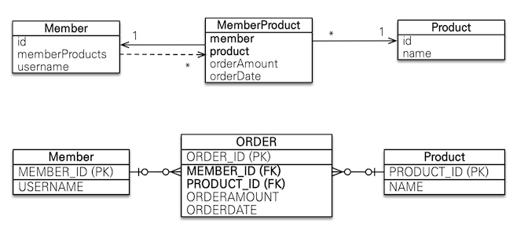
                
                * 연결 테이블(`Order`)에 새로운 기본 키(`ORDER_ID`)를 추가하고 다른 식별자는 외래 키로 사용한다.
                    
        * (4) 예시 - 다대다 매핑을 일대다 다대일로 변경하기

            * ① 회원과 회원상품을 양방향 관계로 만든다. 회원 상품 엔티티 쪽이 외래 키를 가지고 있으므로 연관관계의 주인이다.
                
                ```java
                @Entity
                public class Member {
                  @Id @GeneratedValue
                  @Column(name = "MEMBER_ID")
                  private Long id;
              
                  //...
              
                  @OneToMany(mappedBy = "member")
                  private List<MemberProduct> memberProducts = new ArrayList<>();
                }   
                ```
              
            * ② 회원 상품 엔티티는 기본 키를 매핑하는 `@Id`과 외래 키를 매핑하는 `@JoinColumn`을 동시에 사용한다.
            
                ```java
                @Entity
                public class MemberProduct {
                  @Id @GeneratedValue
                  private Long id;
                
                  @ManyToOne
                  @JoinColumn(name = "MEMBER_ID")
                  private Member member;
                
                  @ManyToOne
                  @JoinColumn(name = "PRODUCT_ID")
                  private Product product;
                
                  private int orderAmount;
                  
                  private LocalDateTime orderDateTime;
                
                  // 주문 회원에 대한 연관관계 편의 메소드 
                  public void changeMember(Member member) {
                      this.member = member;
                      member.getMemberProducts().add(this);
                  }
                    
                  // 주문 상품에 대한 연관관계 편의 메소드
                  public void changeProduct(Product product) {
                      this.product = product;
                      product.getMemberProducts().add(this);
                  }
                }   
                ```
              
            * ③ 상품 엔티티에서 회원 상품 엔티티로 연관관계를 만들었다.
            
                ```java
                @Entity
                public class Product {
                  @Id @GeneratedValue
                  private Long id;
              
                  private String name;
              
                  @OneToMany(mappedBy = "product")
                  private List<MemberProduct> memberProducts = new ArrayList<>();
                }   
                ```

* 다양한 연관관계 매핑 정리

    * 다대일 단방향, 양방향 매핑을 사용한다.
    
        * (일대다 단방향 매핑, 일대다 양방향 매핑 보다는 다대일 양방향 매핑을 사용하자.)
    
    * 또는 일대일 단방향, 양방향 매핑을 사용한다.
    
    * 그리고 다대다 관계는 연결 테이블을 추가해서 일대다, 다대일 관계로 풀어내야 한다.

## 7. 고급 매핑

### 1. 상속관계 매핑

* (1) 개요
  
    * 관계형 데이터베이스는 상속 관계가 없다.
    
    * 관계형 데이터베이스의 슈퍼타입 서브타입 관계라는 모델링 기법이 객체의 상속 관계와 가장 유사하다.
    
    * ORM에서 이야기 하는 **`상속관계 매핑`은 객체의 상속 구조와 DB의 슈퍼타입 서브타입 관계를 매핑하는 것이다.**

* (2) 상속관계 매핑 전략

    * ① `조인 전략 (Joined Strategy)` : 엔티티 각각을 모두 테이블로 만들고 조회할 때 조인을 사용한다.
    
        * 정석적인 방법이다.
    
    * ② `단일 테이블 전략 (Single-Table Strategy)` : 하나의 테이블로 통합한다. (기본 값)
    
        * 구분 컬럼(DTYPE)으로 어떤 자식 데이터가 저장되었는지 구분한다.
    
    * ③ `구현 클래스 마다 테이블 전략 (Table-per-Concrete-Class Strategy)` : 자식 엔티티 마다 하나의 테이블을 만든다. 
      
        * 잘 사용하지 않는다.
    
* (3) 상속관계 매핑 전략을 자세하게 살펴보기

    * ① 조인 전략
    
        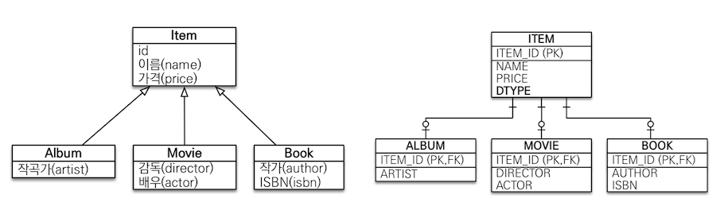
    
        * `조인 전략 (Joined Strategy)`은 엔티티 각각을 모두 테이블로 만들고 자식 테이블이 부모 테이블의 `기본 키`를 받아서 `기본 키 + 외래 키`로 사용하는 전략이다. 
        
            * 이 전략을 사용할 때 주의할 점이 있는데 객체는 타입으로 구분할 수 있지만 테이블은 타입의 개념이 없다. 
            
            * 따라서 타입을 구분하는 컬럼(`DTYPE`)을 추가해야 한다.
        
        * 예시
        
            * 조인 전략을 사용한 예제 코드는 다음과 같다.
        
                ```java
                @Entity
                @Inheritance(strategy = InheritanceType.JOINED)
                @DiscriminatorColumn
                public abstract class Item {
                    
                    @Id @GeneratedValue
                    private Long id;
                    
                    private String name;
                    
                    private int price;
                    
                    // Getter, Setter
                }   
                ```
              
                * 상속 관계 매핑은 부모 엔티티에 `@Inheritance`를 사용해야 한다. 그리고 상속관계 매핑 전략을 지정해야 하는데 여기서는 조인 전략을 사용한다.
                
                * `@DiscriminatorColumn`는 부모 엔티티에 구분 컬럼을 지정한다. 
                  
                    * DB에서 테이블만 보더라도 해당 컬럼으로 저장된 자식 테이블을 구분할 수 있다.
    
                        * name 속성 : 구분 컬럼의 이름을 지정한다.

                            * 구분 컬럼의 기본 이름은 DTYPE이다.
                
            * 자식 엔티티를 저장할 때, 구분 컬럼에 입력할 값을 직접 지정할 수 있다.
            
                ```java
                @Entity
                @DiscriminatorValue("A")
                public class Album extends Item {
                
                    private String artist;  // 작곡가
                
                }
                
                @Entity
                @DiscriminatorValue("B")
                public class Book extends Item {
                
                    private String author;  // 작가
                
                    private String isbn;    // ISBN
                
                }
                
                @Entity
                @DiscriminatorValue("M")
                public class Movie extends Item {
                
                    private String director;    // 감독
                
                    private String actor;       // 배우
                
                    // Getter, Setter
                }
                ```
          
                * `@DiscriminatorValue("M")` : 자식 엔티티를 저장할 때, 구분 컬럼에 입력할 값을 지정한다.
        
                    * 만약 영화(Movie) 엔티티를 저장하면 구분 컬럼인 DTYPE에 M이 저장된다.
    
            * 데이터를 저장하고 조회하는 예시는 다음과 같다.
            
                ```java
                // 자식 엔티티를 저장할 때, 부모 엔티티에도 INSERT를 한다.
                Movie movie = new Movie();
                movie.setDirector("aaaa");
                movie.setActor("bbbb");
                movie.setName("바람과 함께 사라지다.");
                movie.setPrice(10000);
                
                em.persist(movie);
                
                em.flush();
                em.clear();
                
                // 자식 엔티티를 조회할 때 조인을 사용해서 부모 엔티티도 조회한다.
                Movie findMovie = em.find(Movie.class, movie.getId());
                System.out.println("findMovie = " + findMovie);
                ```
    
    * ② 단일 테이블 전략
    
        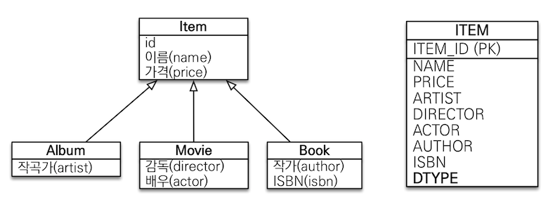
    
        * `단일 테이블 전략 (Single-Table Strategy)`은 하나의 테이블로 통합한다.
        
            * 그리고 구분 컬럼(DTYPE)으로 어떤 자식 데이터가 저장 되었는지 구분한다.
        
            * 이 전략을 사용할 때 주의점은 자식 엔티티가 매핑한 컬럼은 모두 null을 허용해야 한다는 점이다.
            
                * 예를 들어, Book 엔티티를 저장하면 ITEM 테이블의 AUTHOR, ISBN만 사용하고 다른 엔티티와 매핑된 ARTIST, DIRECTOR, ACTOR 컬럼은 사용하지 않으므로 null이 입력되기 때문이다.
                
        * 예시
        
            ```java
            @Entity
            @Inheritance(strategy = InheritanceType.SINGLE_TABLE)
            @DiscriminatorColumn    // 단일 테이블 전략은 @DiscriminatorColumn가 없더라도 구분 컬럼을 무조건 추가한다.
            public abstract class Item {
                
                @Id @GeneratedValue
                private Long id;
                
                private String name;
                
                private int price;
                
                // Getter, Setter
                
            }   
            ```
                 
            * 단일 테이블 전략은 기본적으로 `@DiscriminatorColumn`을 지정하지 않더라도 `DTYPE`이 추가된다.
    
            * 그리고 데이터를 조회할 때, 조인을 사용하지 않아도 된다. 
    
    * ③ 구현 클래스 마다 테이블 전략

        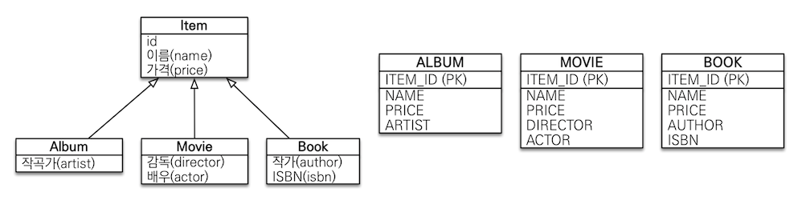
      
        * `구현 클래스 마다 테이블 전략 (Table-per-Concrete-Class Strategy)`은 자식 엔티티 마다 하나의 테이블을 만든다.
    
            * 그리고 자식 테이블 각각에 필요한 컬럼이 모두 있다.
              
            * 여러 자식 테이블을 함께 조회할 때 SQL에 UNION ALL을 사용해야 되기 때문에 성능이 느리다. (즉, 부모 엔티티 타입으로 조회 시) 
        
                * Ex) `Item item = em.find(Item.class, movie.getId());`
    
                    * 이 전략은 데이터베이스 설계자와 ORM 전문가 둘 다 추천하지 않는다.

        * 예시
        
            ```java
            @Entity
            @Inheritance(strategy = InheritanceType.TABLE_PER_CLASS)
            public abstract class Item {
            
                @Id @GeneratedValue
                private Long id;
                
                private String name;
                
                private int price;
                
                // Getter, Setter
                
            }
            ```

### 2. @MappedSuperclass

* (1) @MappedSuperclass

    * `@MappedSuperclass` : 자식 클래스에게 공통 매핑 정보를 제공하는 부모 클래스를 작성할 때 사용한다.
    
        * `@MappedSuperclass`로 지정한 클래스는 엔티티가 아니므로 `em.find()` 나 JPQL에서 사용할 수 없다.
    
            * Ex) `em.find(BaseEntity)` -> 불가능함
        
        * 해당 클래스를 직접 생성해서 사용할 일은 거의 없으므로 추상 클래스로 만드는 것을 권장한다.
        
        * 주로 등록일, 수정일, 등록자, 수정자와 같은 전체 엔티티에서 공통으로 적용하는 정보를 모을 때 사용한다.
    
            * [참고사항] @Entity 클래스는 @Entity 또는 @MappedSuperclass로 지정한 클래스만 상속 받을 수 있다.
    
* (2) 예시

    * ① BaseEntity를 작성한다.

        ```java
        @MappedSuperclass
        public abstract class BaseEntity {
            // @Column는 없어도 됨. @Column를 사용할 수 있다는 것을 보여주기 위함
            @Column(name = "INSERT_MEMBER") 
            private String createdBy;
            
            private LocalDateTime createdDate;
            
            @Column(name = "UPDATE_MEMBER")
            private String lastModifiedBy;
            
            private LocalDateTime lastModifiedDate;
            
            // Getter, Setter
        }   
        ```

    * ② 특정 엔티티 클래스가 BaseEntity를 상속 받도록 한다.      

        ```java
        @Entity
        public class Member extends BaseEntity {
            @Id @GeneratedValue
            @Column(name = "MEMBER_ID")
            private Long id;
            
            @Column(name = "USER_NAME")
            private String username;
        }   
        ```
      
        * BaseEntity를 상속 받는 자식 클래스는 공통 매핑 정보를 제공 받는다.
      
    * ③ 엔티티를 만들어서 저장한다.

        ```java
        Member member = new Member();
        member.setUsername("user1");
        member.setCreatedBy("kim");
        member.setCreatedDate(LocalDateTime.now());
        
        em.persist(member);
        ```

## 8. 프록시와 연관관계 관리

### 1. 프록시(Proxy)

* `프록시 객체`는 실제 엔티티 객체를 대신해서 데이터베이스 조회를 지연할 수 있는 가짜 객체를 말한다.

* em.find() vs em.getReference() 

    * `em.find()` : 데이터베이스를 통해서 실제 엔티티 객체를 조회한다.
    
    * `em.getReference()` : 데이터베이스 조회를 미루는 프록시 엔티티 객체를 조회한다.

        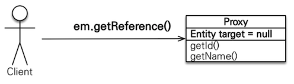

* 프록시 특징

    * ① 프록시 클래스는 실제 클래스를 상속 받아서 만들어진다. 

        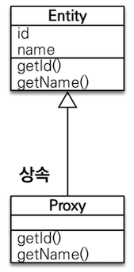

    * ② 프록시 객체는 실제 객체에 대한 참조(target)를 보관한다.

    * ③ 프록시 객체의 메소드를 호출하면 프록시 객체는 실제 객체의 메소드를 호출한다.

        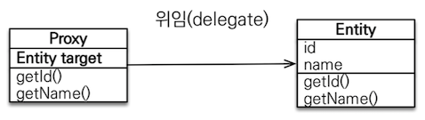    

* 프록시 객체의 초기화
    
    * `프록시 객체의 초기화`는 프록시 객체가 실제 사용될 때, 영속성 컨텍스트를 통해 실제 엔티티 객체를 생성하는 것이다.
    
    * 프록시의 초기화 과정

        * 소스코드

            ```java
            /* findMember의 클래스 타입이 hellojpa.Member$HibernateProxy$ZIFtUTMC인 것을 확인할 수 있다. */
            Member findMember = em.getReference(Member.class, "id1");   // 프록시 객체를 반환한다.
            findMember.getName();                                       // 프록시 객체의 메소드를 호출하면 프록시의 초기화가 진행된다. 
            ```

        * 그림
    
            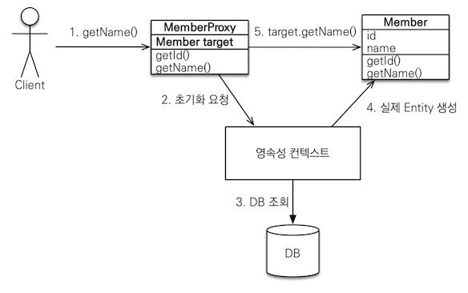
        
            * ① 프록시 객체(`member`)의 메소드(`getName()`)를 호출한다.
        
                * 이 시점에는 프록시 객체의 target에 값이 없다.
              
            * ② 프록시 객체는 실제 엔티티 객체가 생성되어 있지 않으면 영속성 컨텍스트에 실제 엔티티 객체의 생성을 요청한다. 이것을 프록시의 초기화라 한다.
              
            * ③ 영속성 컨텍스트는 데이터베이스를 조회해서 실제 엔티티 객체를 생성한다.
              
            * ④ 프록시 객체는 생성된 실제 엔티티 객체의 참조를 `target` 멤버 변수에 보관한다.
            
                * ② ~ ④의 과정은 `target`에 값이 없을 때만 진행된다. 
              
            * ⑤ 프록시 객체는 실제 엔티티 객체의 메소드(`getName()`)를 호출해서 결과를 반환한다.
        
* 프록시 정리하기

    * ① 프록시 객체는 처음 사용할 때 한 번만 초기화된다.

    * ② 프록시 객체를 초기화 할 때, 프록시 객체가 실제 엔티티로 바뀌는 것이 아니다. 

        * 프록시 객체가 초기화되면 프록시 객체를 통해서 실제 엔티티에 접근 할 수 있게 되는 것이다.

    * ③ 프록시 객체는 원본 엔티티를 상속받은 객체이므로 타입 체크 시, 주의해야 한다. 

        * `==` 비교 대신에 `instanceof`를 사용해야 한다.

    * ④ 영속성 컨텍스트에 찾는 엔티티가 이미 있으면 데이터베이스를 조회할 필요가 없으므로 `em.getReference()`를 호출해도 프록시가 아닌 실제 엔티티를 반환한다.

        ```java
        Member m1 = em.find(Member.class, member1.getId());
        System.out.println("m1 = " + m1.getClass()); // m1 = class hellojpa.Member
        
        Member reference = em.getReference(Member.class, member1.getId());
        System.out.println("reference = " + reference.getClass()); // reference = class hellojpa.Member
        ```
    
        * JPA는 같은 트랜잭션 안에서 조회하면 같은 엔티티를 반환한다.
    
            * 즉, JPA에서 같은 트랜잭션 안에서 조회 했다면 실제 엔티티, 프록시 객체 중 무엇이던간에 `==` 비교는 `true`를 반환해야 한다.

    * ⑤ 영속성 컨텍스트에 찾는 엔티티가 이미 프록시로 있다면 `em.find()`를 호출해도 프록시를 반환한다. 
  
    * ⑥ 영속성 컨텍스트의 도움을 받을 수 없는 준영속 상태일 때, 프록시를 초기화 하면 문제가 발생한다.

        ```java
        try {
            Member member1 = new Member();
            member1.setUsername("member1");
            em.persist(member1);
            
            em.flush();
            em.clear();
            
            Member refMember = em.getReference(Member.class, member1.getId());
            System.out.println("refMember = " + refMember.getClass());
            
            em.detach(refMember); // refMember를 준영속 상태로 만들기
                                  // em.close(), em.clear()도 준영속 상태로 만들 수 있다.
            
            refMember.getUsername(); // LazyInitializationException 예외 발생
            
            tx.commit();
        } catch (Exception e) {
            tx.rollback();
            e.printStackTrace();
        } finally {
            em.close();
        }
        ```

        * 하이버네이트는 `org.hibernate.LazyInitializationException` 예외를 발생시킨다.

        * 문제가 발생하는 이유는 프록시의 초기화 요청은 영속성 컨텍스트를 통해 이루어지기 때문이다. 
    
* 프록시 관련 유틸리티 메소드

    * `isLoaded(Object entity)` : 프록시 인스턴스의 초기화 여부를 확인한다.

        ```java
        PersistenceUnitUtil persistenceUnitUtil = emf.getPersistenceUnitUtil();
        persistenceUnitUtil.isLoaded(refMember);
        ```
    
    * `Hibernate.initialize(entity)` : 프록시를 강제로 초기화한다.
    
        * JPA 표준에서는 강제 초기화 기능이 없으므로 member.getName()과 같은 방식으로 초기화를 해야 한다. 
        
### 2. 즉시 로딩과 지연 로딩

* JPA는 개발자가 연관된 엔티티의 조회 시점을 선택 할 수 있도록 두 가지 방법을 제공한다.

    * ① `즉시 로딩 (EAGER LOADING)` : 특정 엔티티를 조회할 때, 연관된 엔티티도 함께 조회하는 방식이다.

        * 연관된 엔티티를 프록시 객체로 조회하지 않는다. 따라서 연관된 엔티티가 실제 엔티티 객체다.   

            * [예시] `em.find(Member.class, "member1")` 처럼 호출할 때, 회원 엔티티와 연관된 팀 엔티티도 함께 조인으로 조회한다.
        
            * [설정 방법] `@ManyToOne(fetch = FetchType.EAGER)`
    
    * ② `지연 로딩 (LAZY LOADING)` : 특정 엔티티를 조회할 때, 연관된 엔티티는 실제 사용할 때 조회하는 방식이다.
    
        * 특정 엔티티를 조회할 때, 연관된 엔티티에 프록시 객체를 넣어둔다. 그리고 프록시 객체를 실제 사용할 때, 초기화 하면서 데이터베이스를 조회한다.
    
            * [예시] `em.find(Member.class, "member1")` 처럼 호출할 때, 회원(member1)을 조회하고 회원의 team 멤버 변수에 프록시 객체를 넣어둔다.
                
                * `member.getTeam().getName()`처럼 팀 엔티티를 실제 사용하는 시점에 데이터베이스를 조회해서 프록시 객체를 초기화한다.
            
                    * 조회 대상이 영속성 컨텍스트에 이미 있으면 프록시 객체가 아닌 실제 객체를 사용한다.
        
            * [설정 방법] `@ManyToOne(fetch = FetchType.LAZY)`
        
* 주의사항

    * ① **실무에서는 모든 연관관계에 `지연 로딩 (LAZY LOADING)`을 사용해야 한다.**

    * ② `즉시 로딩 (EAGER LOADING)`을 적용하면 예상하지 못한 쿼리가 발생한다.
    
    * ③ `즉시 로딩`은 JPQL에서 `N+1` 문제를 일으킨다.

        * `N+1 문제` : 쿼리 1개를 실행 했을 때, 얻은 결과의 개수(`N개`)만큼 추가 쿼리가 발생하는 문제를 말한다.

            * (정리 하자면) 특정 엔티티를 조회하기 위한 쿼리 1개를 실행 했을 때, 얻은 결과의 개수(N개) 만큼 해당 엔티티와 연관된 엔티티를 조회하기 위한 추가적인 쿼리가 발생하는 문제를 말한다.
    
        * N+1 문제의 발생 케이스와 해결책

            * 예제로 사용할 엔티티는 다음과 같다.

                * 회원 (Member)

                    ```java
                    @Entity
                    public class Member {
                        @Id @GeneratedValue
                        @Column(name = "MEMBER_ID")
                        private Long id;
                        
                        @Column(name = "USER_NAME")
                        private String username;
                        
                        @ManyToOne(fetch = FetchType.EAGER)
                        @JoinColumn(name = "TEAM_ID")
                        private Team team;
                        
                        // 연관관계 편의 메소드
                        public void changeTeam(Team team) {
                            this.team = team;
                            team.getMembers().add(this);
                        } 
                    }
                    ```

                * 팀 (Team)

                    ```java
                    @Entity
                    public class Team {
                        @Id @GeneratedValue
                        @Column(name = "TEAM_ID")
                        private Long id;
                        
                        private String name;
                        
                        @OneToMany(mappedBy = "team", fetch = FetchType.LAZY)
                        private List<Member> members = new ArrayList<>();
                    }   
                    ```

            * N+1 문제가 발생하는 케이스는 다음과 같다. 
                  
                * ⓐ 특정 엔티티의 연관된 엔티티를 즉시 로딩(EAGER)으로 설정하고 JPQL로 특정 엔티티를 조회하는 경우에 `N+1` 문제가 발생한다.

                    ```java
                    // 초기 데이터 설정
                    Team teamA = new Team();
                    teamA.setName("teamA");
                    em.persist(teamA);
                    
                    Team teamB = new Team();
                    teamB.setName("teamB");
                    em.persist(teamB);
                    
                    Member member1 = new Member();
                    member1.setUsername("member1");
                    member1.setTeam(teamA);
                    em.persist(member1);
                    
                    Member member2 = new Member();
                    member2.setUsername("member2");
                    member2.setTeam(teamB);
                    em.persist(member2);
                    
                    em.flush();
                    em.clear();
                    
                    // [N + 1 문제 발생] Member 클래스에서 연관된 엔티티(Team)를 즉시 로딩으로 설정했다고 가정한다.
                    List<Member> members = em.createQuery("select m from Member m", Member.class)
                            .getResultList();
                    ```

                    * 문제 상황 설명
                      
                        * 일단, JPQL(`select m from Member m`)로 회원(Member) 엔티티를 조회한다.
            
                            * Member 클래스를 보면 연관된 엔티티인 Team이 즉시 로딩(EAGER)으로 설정되어 있다.
    
                            * 그리고 Team은 조회하지 않은 상황이다.
            
                        * 그러면 즉시, `select t from Team t where t.TEAM_ID = xxx`라는 쿼리(SQL)를 실행해서 연관된 엔티티인 Team을 조회한다.
    
                        * 정리 하자면, JPQL(`select m from Member m`)로 회원(Member)만 조회 하더라도 조회한 회원의 결과 개수(`N`)만큼 연관된 엔티티인 팀(Team)을 조회하는 추가 쿼리가 발생한다. 

                    * 해결책
                      
                        * 연관된 엔티티인 Team을 LAZY로 설정하면 연관된 엔티티에 프록시 객체를 넣게 되며 N+1 문제도 발생하지 않는다.

                            ```java
                            @Entity
                            public class Member {

                                // ...
                            
                                @ManyToOne(fetch = FetchType.LAZY)
                                @JoinColumn(name = "TEAM_ID")
                                private Team team;
                            
                                // ...
                            }
                            ```

                * ⓑ 특정 엔티티의 연관된 엔티티(`@OneToMany`)를 지연 로딩(LAZY)으로 설정하더라도 Loop를 이용해서 조회하면 N+1 문제가 발생한다.    

                    ```java
                    // 초기 데이터 설정
                    Team teamA = new Team();
                    teamA.setName("teamA");
                    em.persist(teamA);
                    
                    Team teamB = new Team();
                    teamB.setName("teamB");
                    em.persist(teamB);
                    
                    Member member1 = new Member();
                    member1.setUsername("member1");
                    member1.setTeam(teamA);
                    em.persist(member1);
                    
                    Member member2 = new Member();
                    member2.setUsername("member2");
                    member2.setTeam(teamB);
                    em.persist(member2);
                    
                    em.flush();
                    em.clear();
                    
                    // [N + 1 문제 발생] Team 클래스에서 연관된 엔티티(Member)를 지연 로딩으로 설정했다고 가정한다.
                    List<Team> teams = em.createQuery("select t from Team t", Team.class)
                            .getResultList();
                    
                    for (Team team : teams) {
                        System.out.println("team.getMembers() = " + team.getMembers());
                    } 
                    ```
                  
                    * 문제 상황 설명

                        * 일단, JPQL(`select t from Team t`)로 팀(Team) 엔티티를 조회한다.

                            * Team 클래스를 보면 연관된 엔티티인 Member가 지연 로딩(LAZY)으로 설정되어 있다.

                        * 그러면 Team 엔티티에서 연관된 엔티티인 List<Member>에 프록시 객체를 넣어두게 되며 N+1 문제는 발생하지 않는다.
    
                        * 하지만 앞서 조회한 List<Team>를 Loop로 반복하며 팀(Team)과 연관된 엔티티 필드를 사용하면 프록시 초기화를 위한 쿼리가 발생하며 결과적으로 N+1 문제가 발생한다. 

                    * 해결책

                        * 팀(Team) 엔티티를 조회할 때, 연관된 엔티티인 Member를 함께 조회하도록 Fetch 조인을 사용하면 된다. 

                            ```java
                            // 일대다 조인은 일(1)의 기준에서는 데이터가 더 많아질 수 있기 때문에 distinct를 사용했다. 
                            List<Team> teams = em.createQuery("select distinct t from Team t join fetch t.members", Team.class)
                                    .getResultList();
                            ```

            * N+1 문제에 대한 해결책은 다음과 같다. 
            
                * ⓐ JPQL의 fetch 조인을 이용한다.
                
                * ⓑ `@EntityGraph`를 이용한다.
                
                * ⓒ `@BatchSize`를 이용한다.
                
    * ④ `@ManyToOne`, `@OneToOne`의 기본 값은 즉시(EAGER) 로딩이므로 `LAZY`로 설정해야 한다.
    
        * `@XToOne` 시리즈는 `LAZY`로 설정해야 한다.

### 3. 영속성 전이: CASCADE

* CASCADE 란?
    
    * `CASCADE`는 해당 엔티티의 상태 변화를 연관된 엔티티에 전파시킨다.
    
        * 예를 들어, 부모만 영속 상태로 만들면 연관된 자식 엔티티까지 함께 영속 상태로 만들어 저장하고 싶다면 CASCADE를 사용한다.
        
            * `@OneToMany(mappedBy = "parent", cascade = CascadeType.PERSIST)`

    * CASCADE의 종류
    
        * `ALL` : 모든 CASCADE를 적용한다.
    
        * `PERSIST` : 엔티티를 영속화할 때, 연관된 엔티티도 함께 영속화한다.
    
        * `REMOVE` : 엔티티를 제거할 때, 연관된 엔티티도 함께 제거한다.
        
        * `MERGE` : 엔티티를 병합할 때, 연관된 엔티티도 함께 병합한다.
    
        * `REFRESH` : 엔티티를 새로고침할 때, 연관된 엔티티도 함께 새로고침한다.
    
        * `DETACH` : 엔티티를 준영속 상태로 만들 때, 연관된 엔티티도 함께 준영속 상태로 만든다.
        
    * 주의사항
    
        * CASCADE는 연관관계를 매핑하는 것과 아무 관련이 없다.
        
        * 단지 엔티티를 영속화할 때 연관된 엔티티도 함께 영속화하는 편리함을 제공할 뿐이다.
        
        * **특정 엔티티가 개인 소유(혼자서 참조)하는 엔티티에만 CASCADE 속성을 사용해야 한다.**
    
            * 즉, **하나의 부모 엔티티만 자식 엔티티를 참조하는 경우에 CASCADE 속성을 사용해야 한다**는 의미다.
    
            * 만약 Parent 이외에도 Member도 Child를 참조한다면 CASCADE를 사용해서는 안 된다.

* 실습하기
    
    * ① 부모 엔티티를 작성한다.
    
        ```java
        @Entity
        public class Parent {
          @Id @GeneratedValue
          private Long id;

          // 부모만 영속 상태로 만들면 연관된 자식 엔티티까지 함께 영속화해서 저장한다.
          @OneToMany(mappedBy = "parent", cascade = CascadeType.PERSIST)
          private List<Child> children = new ArrayList<>();
      
          // 연관관계 편의 메소드
          public void addChild(Child child) {
              children.add(child);
              child.setParent(this);
          }
      
          // Getter, Setter
        }
        ```
        
    * ② 자식 엔티티를 작성한다.
    
        ```java
        @Entity
        public class Child {
          @Id @GeneratedValue
          private Long id;
          
          @ManyToOne
          @JoinColumn(name = "parent_id")
          private Parent parent;
      
          // Getter, Setter
        }
        ```
      
    * ③ 부모 엔티티를 영속화할 때, 연관된 자식 엔티티들도 함께 영속화한다.

        ```java
        Child child1 = new Child();
        Child child2 = new Child();
        
        Parent parent = new Parent();
        parent.addChild(child1); // 연관관계 설정
        parent.addChild(child2); // 연관관계 설정
        
        em.persist(parent); // 부모 저장, 연관된 자식들 저장
        /* 
        em.persist(child1);
        em.persist(child2); 
        */
        ```

* [참고] persist, remove 호출 순서      

    * 외래 키 테이블에 데이터를 입력할 때는 외래 키에 의해 참조되는 테이블에 데이터가 있는지 확인하고 입력한다.
      
        * 먼저 참조되는 테이블에 데이터를 입력한 다음에, 외래 키 테이블에 데이터를 입력하자.
    
            ```java
            // 참조되는 테이블
            em.persist(parent);
          
            // 외래 키 테이블
            em.persist(child1);
            em.persist(child2);
            ```
            
            * 양방향 연관관계인 경우에 반대 순서로 persist를 하게 되면 불필요한 UPDATE 쿼리가 추가적으로 발생한다.

    * 외래 키 테이블에 데이터가 남아 있다면, 외래 키에 의해 참조되는 테이블의 데이터를 변경하거나 삭제할 수 없다.        

        * 먼저 외래 키 테이블의 데이터를 삭제한 다음에, 참조되는 테이블의 데이터를 삭제하자. (입력의 반대 순서로 진행함)  
    
            ```java
            // 외래 키 테이블
            em.remove(child1);
            em.remove(child2);
          
            // 참조되는 테이블
            em.remove(parent);
            ```
    
### 4. 고아 객체

* `고아 객체 제거 (Orphan Removal)`는 부모 엔티티와 연관관계가 끊어진 자식 엔티티를 자동으로 삭제하는 기능이다.

    * `@OneToMany(orphanRemoval = true)`

* 실습하기
    
    * ① 고아 객체 제거 기능을 활성화한다. 
    
        ```java
        @Entity
        public class Parent {
          @Id @GeneratedValue
          private Long id;
          
          @OneToMany(mappedBy = "parent", cascade = CascadeType.ALL, orphanRemoval = true)
          private List<Child> children = new ArrayList<>();
      
          public void addChild(Child child) {
              children.add(child);
              child.setParent(this);
          }
        }
        ```
              
    * ② 부모 엔티티의 컬렉션에서 자식 엔티티를 삭제하면 자동으로 DB에서도 삭제한다.

        ```java
        Child child1 = new Child();
        Child child2 = new Child();
        
        Parent parent = new Parent();
        parent.addChild(child1);
        parent.addChild(child2);
        
        em.persist(parent);
        
        em.flush();
        em.clear();
        
        // orphanRemoval를 사용하는 코드 
        Parent findParent = em.find(Parent.class, parent.getId());
        findParent.getChildren().remove(0); // delete from Child where id=? 과 같은 쿼리가 발생한다.
        ```

* 주의사항

    * **특정 엔티티가 개인 소유(혼자서 참조)하는 엔티티에만 고아 객체 제거 기능을 사용해야 한다.**

    * `orphanRemoval`는 `@OneToOne`, `@OneToMany`에만 사용할 수 있다.

    * 고아 객체 제거 기능을 활성화 하면, 부모를 제거할 때 자식도 함께 제거된다. 
    
        * 이것은 `CascadeType.REMOVE` 처럼 동작한다.

* 영속성 전이 + 고아 객체, 생명주기

    * `CascadeType.ALL + orphanRemoval=true` : 두 옵션을 모두 활성화 하면 부모 엔티티를 통해서 자식의 생명주기를 관리할 수 있다.

        * 도메인 주도 설계 (DDD)의 `애그리거트 루트 (Aggregate Root)` 개념을 구현할 때, 유용하다.
    
            * 부모 엔티티의 데이터를 삭제하면 자식 엔티티의 데이터도 함께 삭제된다. - CASCADE
    
            * 자식 엔티티를 부모 엔티티와 연관관계를 끊으면 자식 테이블에서 자식 데이터가 삭제된다. - orphanRemoval
    
        * 두 옵션을 모두 활성화 하면 자식 엔티티에 대해서는 리포지토리를 만들지 않아도 된다.
    
            * 그 이유는 부모 엔티티를 통해서 자식 엔티티의 생명주기를 관리하기 때문이다.

### 9. 값 타입

#### 1) JPA의 데이터 타입 분류

* JPA의 데이터 타입은 크게 `엔티티 타입`과 `값 타입`으로 나눌 수 있다.

    * ① 엔티티 타입

        * `엔티티 타입 (Entity Type)` : 식별자를 가지고 있는 객체를 말한다.
          
            * `@Entity`로 정의한 객체를 말하기도 한다.
    
            * 데이터가 변해도 식별자를 통해 지속해서 추적할 수 있다.

                * Ex) 회원 엔티티의 나이 값을 변경해도 식별자로 인식 가능하다.

            * 공유 할 수 있다.

    * ② 값 타입 

        * `값 타입 (Value Type)` : 식별자를 가지지 않는 값 그 자체를 의미한다. 
    
            * int, Integer, String 처럼 단순히 값으로 사용하는 자바의 기본 타입이나 객체를 말한다.

            * 식별자가 없으므로 값을 변경하면 추적할 수 없다.

                * Ex) 숫자 100을 200으로 변경하면 완전히 다른 값으로 대체된다.

            * 값 타입은 생명주기를 엔티티에 의존한다.

                * Ex) 회원 엔티티를 삭제하면 이름, 나이 필드도 함께 삭제된다.

            * 여러 엔티티에서 값 타입을 공유해서 사용하면 안 된다.

                * Ex) 특정 회원의 이름 변경 시 다른 회원의 이름도 함께 변경되면 안 되기 때문이다.

            * [참고] 자바의 기본 타입(primitive type)은 절대 공유되지 않는다.

                * int, double과 같은 기본 타입은 절대 공유되지 않는다.

                    * 기본 타입은 항상 값을 복사하기 때문이다.

                    * 그래서 기본 타입을 값 타입으로 사용 했을 때, 안전하다.

                * Integer 같은 래퍼 클래스나 String 과 같은 특수한 클래스는 공유 가능한 객체이지만 변경 불가능 (Immutable)하다.

                    * 따라서 `부작용 (Side effect)`이 발생하지 않는다.
    
                    * `부작용 (Side effect)` : 의도하지 않은 결과가 나타나는 것을 말한다. 

#### 2) 값 타입 분류

* `값 타입 (Value Type)`은 크게 3 가지로 나눌 수 있다.

    * ① `기본 값 타입 (Basic Value Type)` : 자바의 기본 타입 (int, double ...), 래퍼 클래스 (Integer, Long ...), String과 같은 것을 말한다.

    * ② `임베디드 타입 (Embedded Type)` : 다른 타입들을 포함하고 있는 타입을 말한다.

        * 주로 기본 값 타입을 모아서 만들기 때문에 `복합 값 타입 (Composite Value Type)`이라고도 한다.

        * 임베디드 타입도 `int`, `String`과 같은 **값 타입**이다.

    * ③ `값 타입 컬렉션 (Value Type Collection)` : **컬렉션에 값 타입을 넣어서 사용하는 것**을 말한다.

#### 3) 임베디드 타입

* **(1) 임베디드 타입의 장점**

    * 재사용이 가능하다.

    * 응집도가 높다.

        * `Period.isWork()`처럼 해당 값 타입에서만 사용하는 의미 있는 메소드를 만들 수 있다.

* **(2) 임베디드 타입을 사용하는 경우**

    * 회원 엔티티는 이름, 근무 시작일과 종료일, 도시, 번지, 우편번호를 가진다.
    
        ```java
        public class Member {
            private Long id;                    
            private String name;                // 이름
            
            private LocalDateTime startDate;    // 근무 시작일
            private LocalDateTime endDate;      // 근무 종료일
        
            private String city;                // 도시
            private String street;              // 번지
            private String zipcode;             // 우편번호
        }
        ```
    
    * 여기서, 임베디드 타입을 이용하면 "회원 엔티티는 이름, 근무 기간, 집 주소를 가진다."로 변경할 수 있다.
    
        ```java
        public class Member {
            private Long id;
            
            private String name;                // 이름
            
            private Period workPeriod;          // 근무 기간
                
            private Address homeAddress;        // 집 주소
        }
        ```

* **(3) 임베디드 타입과 테이블을 매핑하기**

    * 매핑 결과를 그림으로 먼저 살펴보기

        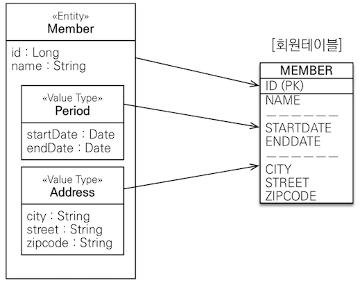

        * ① 임베디드 타입은 엔티티의 값일 뿐이다.

        * ② **임베디드 타입을 사용하기 전과 후에 매핑하는 테이블은 같다.**

        * ③ **임베디드 타입 덕분에 객체와 테이블을 아주 세밀하게 (fine-grained) 매핑하는 것이 가능하다.**

        * ④ 잘 설계한 ORM 애플리케이션은 매핑한 테이블의 수 보다 클래스의 수가 더 많다.

        * ⑤ 임베디드 타입은 값 타입을 포함하거나 엔티티를 참조할 수 있다.

    * 실습하기

        * ① 임베디드 타입을 정의한다.

            ```java
            @Embeddable
            public class Period {
            
                private LocalDateTime startDate;
            
                private LocalDateTime endDate;
            
                // 기본 생성자 필수
                public Period() {
                }
            
                // Getter만 만들기
            }
            ```

            ```java
            @Embeddable
            public class Address {
          
                private String city;
          
                private String street;
          
                private String zipcode;
            
                // 기본 생성자 필수
                public Address() {
                }
            
                public Address(String city, String street, String zipcode) {
                    this.city = city;
                    this.street = street;
                    this.zipcode = zipcode;
                }
            
                /*
                * Getter만 만들기
                * "값 타입"을 여러 엔티티에서 공유하면 위험하다. 그 이유는 부작용(side effect)이 발생하기 때문이다.
                * 불변 객체(immutable object)로 만들기 위해, 생성자로만 값을 설정하고 수정자(Setter)는 만들지 않는다.
                * */
            
            }
            ```

            * `@Embeddable` : 임베디드 타입을 정의하는 곳에 붙여준다.

            * **임베디드 타입은 기본 생성자가 필수다.**

        * ② 임베디드 타입을 사용한다.

            ```java
            @Entity
            public class Member {
            
                @Id @GeneratedValue
                @Column(name = "MEMBER_ID")
                private Long id;
            
                @Column(name = "USERNAME")
                private String username;
            
                // Period
                @Embedded
                private Period workPeriod;
            
                // 주소
                @Embedded
                private Address homeAddress;
            
                // Getter
            }
            ```

            * `@Embedded` : 임베디드 타입을 사용하는 곳에 붙여준다.

        * ③ 엔티티를 등록한다.

            ```java
            Member member = new Member();
            member.setUsername("hello");
            member.setHomeAddress(new Address("city", "street", "100"));
            member.setWorkPeriod(new Period());
            
            em.persist(member);
            ```

* **(4) 하나의 엔티티 내에서 같은 값 타입을 여러 개 선언하기**

    * `@AttributeOverrides` : 임베디드 타입에 정의한 매핑 정보를 재정의한다.

        * 하나의 엔티티에서 같은 값 타입을 여러 번 선언하면 테이블에 매핑되는 컬럼명이 중복된다.

        * 이때는 `@AttributeOverrides`를 사용해서 매핑 정보(컬럼명 속성)를 재정의한다.

        * `@AttributeOverride`의 속성은 다음과 같다.

            * `name` : 임베디드 타입 내에 있는 필드 이름을 의미한다.

            * `column` : 임베디드 타입 내에 있는 필드와 매핑 하고자 하는 테이블의 컬럼 이름을 의미한다.

    * 예시

        ```java
        @Entity
        public class Member {
        
            //...
        
            @Embedded
            private Address homeAddress;
        
            @Embedded
            @AttributeOverrides({
                    @AttributeOverride(name = "city",
                            column = @Column(name = "COMPANY_CITY")),
                    @AttributeOverride(name = "street",
                            column = @Column(name = "COMPANY_STREET")),
                    @AttributeOverride(name = "zipcode",
                            column = @Column(name = "COMPANY_ZIPCODE"))
            })
            private Address companyAddress;
        
        }
        ```

* **(5) 임베디드 타입과 null**

    * 임베디드 타입의 값이 `null`이면 매핑한 컬럼 값은 모두 `null`이 된다.

        ```java
        member.setAddress(null); // null 입력
        em.persist(member);
        ```

        * 예를 들어, 임베디드 타입(`Address`)의 값이 null이면 회원 테이블의 주소와 관련된 CITY, STREET, ZIPCODE 컬럼 값은 모두 null이 된다.

#### 4) 값 타입과 불변 객체

* **(1) 개요**

    * 값 타입은 복잡한 객체 세상을 조금이라도 단순화하려고 만든 개념이다.

    * 따라서 값 타입은 단순하고 안전하게 다룰 수 있어야 한다.

* **(2) 값 타입 공유 참조**

    * 여러 엔티티에서 (임베디드 타입과 같은) "값 타입"을 공유하면 위험하다.

    * 그 이유는 부작용(side effect)이 발생하기 때문이다.

        ```java
        Address address = new Address("city", "street", "10000");
        
        // 회원 1
        Member member1 = new Member();
        member1.setUsername("member1");
        member1.setHomeAddress(address);
        em.persist(member1);
        
        // 회원 2
        Member member2 = new Member();
        member2.setUsername("member2");
        member2.setHomeAddress(address);
        em.persist(member2);
        
        // 회원 1의 주소만 "newCity"로 변경되길 기대했지만 회원 2의 주소도 같이 변경된다.
        member1.getHomeAddress().setCity("newCity");
        ```

        * 회원1, 회원2가 같은 Address 인스턴스를 참조하고 있는 상황에서 city의 값을 "newCity"로 변경하면 회원 1, 2 모두 값이 변경된다.

    * 이러한 부작용을 막으려면 값 타입을 복사해서 사용하면 된다.

* **(3) 값 타입을 복사해서 사용하기**

    * 값 타입을 공유하는 것은 위험하다. 대신 값(인스턴스)을 복사해서 사용해야 한다.

        ```java
        Address address = new Address("city", "street", "10000");
        
        // 회원 1
        Member member1 = new Member();
        member1.setUsername("member1");
        member1.setHomeAddress(address);
        em.persist(member1);
        
        // 회원 1의 address 값을 복사해서 새로운 copyAddress 값을 생성한 다음, 그 주소로 변경한다.
        Address copyAddress = new Address(address.getCity(),
                                          address.getStreet(),
                                          address.getZipcode());
        
        // 회원 2
        Member member2 = new Member();
        member2.setUsername("member2");
        member2.setHomeAddress(copyAddress);
        em.persist(member2);
        
        // 원래 의도한 대로 회원 1의 주소만 변경된다.
        member1.getHomeAddress().setCity("newCity");
        ```

* **(4) 객체 타입의 한계**

    * 항상 값을 복사해서 사용하면 공유 참조로 인해 발생하는 부작용을 피할 수 있다.

    * 임베디드 타입처럼 **직접 정의한 `값 타입`은 자바의 기본 타입(primitive)이 아니라 객체 타입이다.**

    * 객체 타입은 복사를 하지 않고 원본의 참조 값을 직접 대입하는 것을 막을 방법이 없다.

        * 즉, **객체의 공유 참조는 피할 수 없다.**

            * 자바의 기본 타입은 값을 복사해서 전달한다.

                ```java
                int a = 10;
                int b = a;  // 기본 타입은 값을 복사해서 전달한다.
                b = 4;
                ```

            * 자바의 객체 타입은 참조 값을 복사해서 전달한다.

                ```java
                Address a = new Address("Old");
                Address b = a;  // 객체 타입은 참조를 복사해서 전달한다.
                b.setCity("New");
                ```

                * a와 b는 같은 Address 인스턴스를 가리킨다.

                * 따라서 b의 값을 변경하면 a도 변경된다.

* **(5) 불변 객체**

    * 값 타입은 부작용 걱정 없이 사용 할 수 있어야 한다. 부작용이 일어나면 값 타입이라 할 수 없다.

    * **객체 타입을 변경할 수 없게 만들면 부작용을 원천 차단할 수 있다.**

    * 따라서 **값 타입은 불변 객체 (Immutable Object)로 설계해야 한다.**

        * `불변 객체 (Immutable Object)` : **생성 시점 이후 절대 값을 변경할 수 없는 객체**를 말한다.

            * 불변 객체를 구현하는 간단한 방법은 **생성자로만 값을 설정하고 수정자(Setter)를 만들지 않으면 된다.**

                * 또는 수정자를 `private`으로 만들어도 된다.

            * [참고] `Integer`, `String`은 자바가 제공하는 대표적인 불변 객체다.

    * **값 타입의 일부를 변경하고 싶다면 값 타입 인스턴스를 새롭게 만들어 완전히 대체해야 한다.** (newAddress로 대체하기)

        ```java
        Address address = new Address("city", "street", "10000");
        
        Member member1 = new Member();
        member1.setUsername("member1");
        member1.setHomeAddress(address);
        em.persist(member1);
        
        Address newAddress = new Address("newCity", address.getStreet(), address.getZipcode());
        member1.setHomeAddress(newAddress);
        ```

        * 값 타입 안의 필드 하나만 변경하는 것은 잘못된 방식이다.

#### 5) 값 타입의 비교

* **값 타입은 인스턴스가 달라도 그 안에 있는 값이 같으면 같은 것으로 봐야 한다.**

    ```java
    int a = 10;
    int b = 10;
    ```

    ```java
    Address a = new Address("서울시");
    Address b = new Address("서울시");
    ```

* 자바에서 객체를 비교하는 방법은 2 가지가 있다.

    * ① `동일성 (Identity)` : 두 개의 객체가 완전히 같다는 것을 의미한다.

        * 동일성 비교는 `==` 연산자를 사용해서 객체의 참조 값을 비교한다.

    * ② `동등성 (Equivalence)` : 두 개의 객체가 가지고 있는 값이 같다는 것을 의미한다.

        * 동등성 비교는 `equals()`를 사용해서 객체가 가지고 있는 값을 비교한다.

* **값 타입은 `a.equals(b)`를 사용해서 동등성 비교를 해야한다.**

    * 따라서 값 타입의 `equals()` 메소드를 적절하게 재정의해야 한다. (주로 모든 필드 사용함)

#### 6) 값 타입 컬렉션

* **(1) 값 타입 컬렉션 ?**

    * `값 타입 컬렉션 (Value Type Collection)` : **컬렉션에 값 타입을 넣어서 사용하는 것**을 말한다.

        * 값 타입을 하나 이상 저장할 때, 값 타입 컬렉션을 사용한다.

        * `@ElementCollection`, `@CollectionTable`를 사용해서 매핑한다.

        * 관계형 데이터베이스의 테이블은 하나의 컬럼 안에 컬렉션을 포함할 수 없다.

            * JSON을 지원하는 DB는 가능한 경우도 있다. 하지만 기본적으로는 가능하지 않다.

            * 따라서 컬렉션을 저장하기 위한 별도의 테이블을 생성해야 한다.

                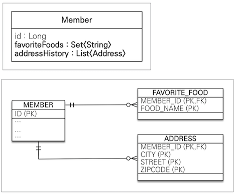
    
                * 값 타입 컬렉션을 매핑하는 테이블은 모든 컬럼을 묶어서 기본 키(PK)를 구성해야 한다.

        * 값 타입 컬렉션은 기본적으로 `지연 로딩 (LAZY LOADING)` 전략을 사용한다.

            * @ElementCollection의 fetch 속성을 확인 해보면 알 수 있다.

* **(2) 값 타입 컬렉션을 매핑하고 사용하기**

    * ① 값 타입 컬렉션을 매핑한다.

        ```java
        @Entity
        public class Member {
        
            @Id @GeneratedValue
            @Column(name = "MEMBER_ID")
            private Long id;
        
            @Column(name = "USERNAME")
            private String username;
        
            @Embedded
            private Address homeAddress;
        
            @ElementCollection
            @CollectionTable(name = "FAVORITE_FOOD",
                    joinColumns = @JoinColumn(name = "MEMBER_ID"))
            @Column(name = "FOOD_NAME") // 새롭게 생성되는 테이블의 컬럼명을 지정 (String은 예외적으로 가능)
            private Set<String> favoriteFoods = new HashSet<>();
        
            @ElementCollection
            @CollectionTable(name = "ADDRESS",
                    joinColumns = @JoinColumn(name = "MEMBER_ID"))
            private List<Address> addressHistory = new ArrayList<>();
        
            // Getter, Setter
        
        }
        ```

        * `@ElementCollection` : 값 타입 컬렉션을 사용할 때 지정한다.

        * `@CollectionTable` : 값 타입 컬렉션과 매핑할 테이블을 지정한다. 새롭게 생성되는 테이블에 대한 매핑 정보를 입력한다.

            * `joinColumns` : 값 타입 컬렉션과 매핑할 테이블의 외래 키(FK)를 지정한다.

        * favoriteFoods처럼 값 타입 컬렉션에 사용되는 것(String)이 하나면 `@Column`을 사용해서 컬럼명을 지정 할 수 있다.

    * ② 값 타입 컬렉션을 사용한다.

        * 값 타입을 저장하기

            ```java
            Member member = new Member();
            member.setUsername("member1");
            member.setHomeAddress(new Address("homeCity", "street", "10000"));
            
            member.getFavoriteFoods().add("치킨");
            member.getFavoriteFoods().add("족발");
            member.getFavoriteFoods().add("피자");
            
            member.getAddressHistory().add(new Address("old1", "street", "10000"));
            member.getAddressHistory().add(new Address("old2", "street", "10000"));
            
            em.persist(member);
            ```

            * 값 타입 컬렉션은 영속성 전이(Cascade) + 고아 객체 제거 기능을 필수로 가진다고 볼 수 있다.

                * 즉, member만 영속 상태로 만들어도 값 타입 컬렉션은 자동으로 DB에 반영된다.

        * 값 타입을 조회 및 수정하기

            ```java
            /*
             * 값 타입 조회
             * */
            Member findMember = em.find(Member.class, member.getId());
            
            /*
             * 값 타입 수정
             * */
            // findMember.getHomeAddress().setCity("newCity"); // 잘못된 방식 (X)
            Address a = findMember.getHomeAddress();
            findMember.setHomeAddress(new Address("newCity", a.getStreet(), a.getZipcode())); // 올바른 방식 (O)
            
            // 좋아하는 음식을 "치킨"에서 "한식"으로 변경하기
            findMember.getFavoriteFoods().remove("치킨");
            findMember.getFavoriteFoods().add("한식");
            
            // 주소를 변경하기 (Address에서 eqauls()와 hashCode()가 오버라이딩 되어 있어야 함)
            findMember.getAddressHistory().remove(new Address("old1", "street", "10000"));
            findMember.getAddressHistory().add(new Address("newCity1", "street", "10000"));
            ```

            * **값 타입을 수정할 때는 값 타입 인스턴스 자체를 대체해야 한다.**

                * 값 타입 안의 필드 하나만 변경하는 것은 잘못된 방식이다.

* **(3) 값 타입 컬렉션의 제약사항**

    * ① 값 타입은 엔티티와 다르게 식별자 개념이 없다. 값은 변경하면 추적이 어렵다.

        * 식별자가 있다면 값 타입이 아닌 엔티티다.

    * ② **값 타입 컬렉션에 변경사항이 발생하면, 주인 엔티티와 연관된 모든 데이터를 테이블에서 삭제하고, 값 타입 컬렉션에 있는 현재 값을 테이블에 모두 다시 저장한다.**

        * Ex) `delete from ADDRESS where MEMBER_ID=?`

    * ③ 값 타입 컬렉션을 매핑하는 테이블은 모든 컬럼을 묶어서 기본 키(PK)를 구성해야 한다.

        * 컬럼에 `null`을 입력 할 수 없고, 같은 값을 중복해서 저장 할 수 없다.

* **(4) 값 타입 컬렉션을 사용하는 경우**

    * 값을 추적할 필요가 없고 정말 단순한 경우에만 값 타입 컬렉션을 사용한다.

        * Ex) 셀렉트 박스에 내가 좋아하는 음식을 여러 개를 체크 할 수 있도록 하는 경우

    * 하지만 대부분은 엔티티를 사용한다.

        * Ex) 주소 이력 관리

* **(5) 값 타입 컬렉션의 대안**

    * 설명

        * 실무에서는 `값 타입 컬렉션` 대신에 **일대다 관계를 위한 엔티티를 만들고, 여기에서 값 타입을 사용**한다. (값 타입을 엔티티로 승격)

            * 일대다 단방향 매핑은 다른 테이블에 외래 키가 있기 때문에 update 쿼리가 발생한다.

            * 다대일 일대다 양방향 매핑을 하면 update 쿼리가 발생하지 않는다.

        * 그리고 `CASCADE` + `고아 객체 제거 (Orphan Removal)` 기능을 적용하면 값 타입 컬렉션처럼 사용 할 수 있다.

    * 예시

        * ① AddressEntity를 작성한다.

            ```java
            @Entity
            @Table(name = "ADDRESS")
            public class AddressEntity {
            
                @Id @GeneratedValue
                private Long id;
            
                private Address address;
            
                public AddressEntity() {
                }
            
                public AddressEntity(String city, String street, String zipcode) {
                    this.address = new Address(city, street, zipcode);
                }
            
                // Getter, Setter
            
            }
            ```

        * ② Member 엔티티의 코드를 변경한다.

            ```java
            @Entity
            public class Member {
            
                @Id @GeneratedValue
                @Column(name = "MEMBER_ID")
                private Long id;
            
                @Column(name = "USERNAME")
                private String username;
            
                @Embedded
                private Address homeAddress;
            
                // 일대다 단방향 매핑
                @OneToMany(cascade = CascadeType.ALL, orphanRemoval = true)
                @JoinColumn(name = "MEMBER_ID") // FK로 사용
                private List<AddressEntity> addressHistory = new ArrayList<>();
            
            }
            ```
          
## 10. 객체지향 쿼리 언어

### 1. 객체지향 쿼리 언어 소개 

* **(1) JPA는 다양한 쿼리 방법을 지원한다**

    * JPQL
    
    * JPA Criteria
    
    * QueryDSL
    
    * 네이티브 SQL

    * JDBC API를 직접 사용하거나 MyBatis, SpringJdbcTemplate를 함께 사용하기

* **(2) JPQL**

    * 애플리케이션이 필요한 데이터만 DB에서 가져오려면 결국 검색 조건이 포함된 SQL이 필요하다. 
    
        * Ex) 나이가 18살 이상인 회원을 모두 검색한다.
    
    * JPA는 SQL을 추상화한 JPQL이라는 객체 지향 쿼리 언어를 제공한다.

        ```java
        // JPQL
        String jpql = "select m from Member m where m.age > 18";
        List<Member> result = em.createQuery(jpql, Member.class).getResultList();
        
        // 실행된 SQL
        select m.id as id,
               m.age as age,
               m.USERNAME as USERNAME,
               m.TEAM_ID as TEAM_ID
        from   Member m
        where  m.age > 18
        ```

    * SQL과 문법이 유사하다. (SELECT, FROM, WHERE, GROUP BY, HAVING, JOIN 지원)
    
    * JPQL은 엔티티 객체를 대상으로 쿼리한다.
    
    * SQL은 데이터베이스 테이블을 대상으로 쿼리한다.
    
* **(3) Criteria**

    * `Criteria`는 JPQL을 자바 코드로 작성할 수 있도록 도와주는 기술(빌더 클래스 API)이다.
    
        ```java
        // Criteria 사용 준비
        CriteriaBuilder cb = em.getCriteriaBuilder(); 
        CriteriaQuery<Member> query = cb.createQuery(Member.class);
        
        // 루트 클래스 (조회를 시작할 클래스)
        Root<Member> m = query.from(Member.class);
        
        // 쿼리 생성
        CriteriaQuery<Member> cq = query.select(m).where(cb.equal(m.get("username"), "kim"));
        List<Member> resultList = em.createQuery(cq).getResultList();
        ```
    
    * JPA 표준 스펙이다.
      
    * 장점 : 문자 기반의 JPQL 보다 동적 쿼리를 안전하게 생성할 수 있다.

    * **단점 : 코드가 복잡하고 직관적으로 이해하기 힘들다.** 
    
        * `Criteria` 대신에 `QueryDSL`를 사용하는 것을 권장한다.
    
* **(4) QueryDSL**

    * `QueryDSL`는 JPQL을 자바 코드로 작성할 수 있도록 도와주는 기술(빌더 클래스 API)이다.

        ```java
        // JPQL
        /* select m from Member m where m.age > 18 */
        JPAFactoryQuery query = new JPAQueryFactory(em);
        QMember m = QMember.member;
        
        List<Member> list =
            query.selectFrom(m)
                 .where(m.age.gt(18))
                 .orderBy(m.name.desc())
                 .fetch();
        ```

    * 오픈소스 프로젝트다.
    
    * 문자 기반의 JPQL 보다 동적 쿼리를 안전하게 생성할 수 있다.

        * `동적 쿼리`는 실행 시점에 검색 조건에 따라 다른 쿼리를 생성하는 것을 말한다.      

    * 컴파일 시점에 문법 오류를 찾을 수 있다.
    
    * 단순하고 쉽기 때문에 실무에서 사용하는 것을 권장한다.

    * [참고] 레퍼런스 문서
    
        * `영어 버전` : http://www.querydsl.com/static/querydsl/4.4.0/reference/html_single/
          
        * `한글 버전` : http://www.querydsl.com/static/querydsl/4.0.1/reference/ko-KR/html_single/

* **(5) 네이티브 SQL**

    * `네이티브 SQL`는 SQL을 직접 사용할 수 있도록 JPA가 제공하는 기능을 말한다.

        ```java
        String sql = "SELECT ID, AGE, TEAM_ID, NAME FROM MEMBER WHERE NAME = 'kim'";
        List<Member> resultList = em.createNativeQuery(sql, Member.class).getResultList();
        ```

    * JPQL로 해결할 수 없는 특정 데이터베이스에 의존적인 기능을 사용할 때 이용한다.
     
        * Ex) 오라클 CONNECT BY, 특정 DB만 사용하는 SQL 힌트
    
* **(6) JDBC 직접 사용하거나 SpringJdbcTemplate 등**

    * JPA를 사용하면서 JDBC 커넥션을 직접 사용하거나 스프링 JdbcTemplate, 마이바티스 등을 함께 사용할 수 있다.
    
    * 단, 적절한 시점에 영속성 컨텍스트를 강제로 플러시 할 필요가 있다.
    
        * Ex) JPA를 우회해서 SQL을 실행하기 직전에 영속성 컨텍스트를 수동으로 `flush()` 해야한다.

            ```java
            /* [★★★ 중요 ★★★]
            * JPA와 관련 없이 DB에 접근해서 쿼리를 실행한다고 가정한다.
            * 이러한 경우에는 SQL을 실행하기 직전에 영속성 컨텍스트를 수동으로 flush() 해야 한다.
            * */
            em.flush();
            
            /*
            * JDBC 커넥션을 직접 사용해서 쿼리를 실행한다.
            * */
            // 1) 드라이버 로딩
            Class.forName("com.mysql.jdbc.Driver");
            
            // 2) DB 연결
            Connection connection = DriverManager.getConnection(url, "id", "password");
            
            // 3) 쿼리를 수행하기 위한 Statement 객체를 생성
            Statement statement = connection.createStatement();
            
            // 4) SQL 쿼리 작성
            String sql = "SELECT * FROM MEMBER";
            
            // 5) 쿼리 실행
            ResultSet resultSet = statement.executeQuery(sql);
            ```

### 2. JPQL

* **(1) JPQL ?**

    * `JPQL (Java Persistence Query Language, 자바 영속성 쿼리 언어)` : 테이블이 아닌 엔티티 객체를 대상으로 검색하는 객체지향 쿼리 언어다.
    
        * 애플리케이션이 DB에서 필요한 데이터만 가져오려면 결국 검색 조건이 포함된 SQL이 필요하다. 
            
        * JPQL은 SQL을 추상화해서 특정 데이터베이스 SQL에 의존하지 않는다.
        
        * JPQL은 결국 SQL로 변환된다.
    
    * 예제로 사용할 도메인 모델
    
        * 그림
          
            * UML
        
                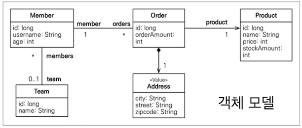    
            
            * ERD
        
                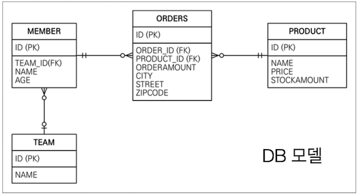
            
                * Address라는 임베디드 타입은 ERD에서 ORDERS 테이블에 포함되어 있다. 
        
        * 소스코드
        
            * Member
            
                ```java
                @Entity
                public class Member {
                
                    @Id @GeneratedValue
                    private Long id;
                
                    private String username;
                
                    private int age;
                
                    @ManyToOne
                    @JoinColumn(name = "TEAM_ID")
                    private Team team;
                
                    @OneToMany(mappedBy = "member")
                    private List<Order> orders = new ArrayList<>();
                
                    // Getter, Setter
                }
                ```
            
            * Team
            
                ```java
                @Entity
                public class Team {
                
                    @Id @GeneratedValue
                    private Long id;
                
                    private String name;
                
                    @OneToMany(mappedBy = "team")
                    private List<Member> members = new ArrayList<>();
                
                    // Getter, Setter
                }
                ```
            
            * Order
            
                ```java
                @Entity
                @Table(name = "ORDERS")
                public class Order {
                
                    @Id @GeneratedValue
                    private Long id;
                
                    private int orderAmount;
                
                    @Embedded
                    private Address address;
                
                    @ManyToOne
                    @JoinColumn(name = "MEMBER_ID")
                    private Member member;
                
                    @ManyToOne
                    @JoinColumn(name = "PRODUCT_ID")
                    private Product product;
                
                    // 연관관계 편의 메소드 
                    public void changeMember(Member member) {
                        this.member = member;
                        member.getOrders().add(this);
                    }
                
                    // Getter, Setter
                }
                ``` 
             
            * Address
            
                ```java
                @Embeddable
                public class Address {
                
                    private String city;
                
                    private String street;
                
                    private String zipcode;
                
                    // Getter, Setter
                }
                ```
            
            * Product
            
                ```java
                @Entity
                public class Product {
                
                    @Id @GeneratedValue
                    private Long id;
                
                    private String name;
                
                    private int price;
                
                    private int stackAmount;
                
                    // Getter, Setter
                }
                ```
    
    * 실행 코드 작성하기
    
        ```java
        public class JpaMain {
        
            public static void main(String[] args) {
                EntityManagerFactory emf = Persistence.createEntityManagerFactory("hello");
        
                EntityManager em = emf.createEntityManager();
        
                EntityTransaction tx = em.getTransaction();
        
                tx.begin(); // 트랜잭션 시작
        
                try {
                    // 실행 준비 데이터 만들기
                    Member member = new Member();
                    member.setUsername("member1");
                    member.setAge(10);
                    em.persist(member);
        
                    // JPQL 작성하기
                    
                    tx.commit();
                } catch (Exception e) {
                    e.printStackTrace();
                    tx.rollback();
                } finally {
                    em.close();
                }
        
                emf.close();
            }
        }
        ```

* **(2) JPQL 기본 문법**

    * 문법
    
        ```java
        SELECT 별칭 (별칭.필드명) 
        FROM 엔티티명 AS 별칭
        WHERE 조건식
        ```
      
    * 예시

        * `select m from Member as m where m.age > 18`
        
            * 엔티티와 속성은 대소문자를 구분한다. (Member, age)
            
            * JPQL 키워드는 대소문자를 구분하지 않는다. (SELECT, FROM, where)
            
            * 테이블 이름이 아닌 엔티티 이름을 사용한다. (Member) 
            
            * 별칭이 필수다. (m) 
    
                * 즉, m과 같은 별칭을 반드시 넣어야 한다.
            
                * as는 생략 가능하다.

* **(3) TypedQuery, Query**

    * `TypedQuery` : 반환 타입이 명확할 때 사용한다.
    
        ```java
        TypedQuery<Member> query = em.createQuery("select m from Member m", Member.class);
        ```

        ```java
        TypedQuery<String> query = em.createQuery("select m.username from Member m", String.class);
        ```

    * `Query` : 반환 타입이 명확하지 않을 때 사용한다.
    
        ```java
        // username은 String , age는 int이므로 타입 정보가 명확하지 않다.
        Query query = em.createQuery("select m.username, m.age from Member m");
        ```
    
* **(4) 결과 조회 API**

    * `query.getResultList()` : (SELECT 쿼리를 실행한) 결과를 리스트로 반환한다.
    
        * 단, 결과가 없으면 비어있는 리스트를 반환한다.
        
            ```java
            List<Member> resultList = em.createQuery("select m from Member m", Member.class).getResultList();
    
            for (Member member1 : resultList) {
                System.out.println("member = " + member1);
            }
            ```
    
    * `query.getSingleResult()` : (SELECT 쿼리를 실행한) 결과를 단일 객체로 반환한다. 
    
        * 결과가 정확히 하나일 때, 사용해야 한다.

        * 결과가 없으면 예외(`javax.persistence.NoResultException`)가 발생한다.
        
        * 결과가 둘 이상이면 예외(`javax.persistence.NonUniqueResultException`)가 발생한다.

* **(5) 파라미터 바인딩**

    * JPQL는 `이름 기준 파라미터 바인딩`과 `위치 기준 파라미터 바인딩`을 제공한다.
    
        * `이름 기준 파라미터`는 이름을 기준으로 파라미터를 구분하는 방법이다.
        
            * 문법 : `:이름`
            
            * 예시
              
                ```java
                TypedQuery<Member> query = em.createQuery("select m from Member m where m.username = :username", Member.class);
                query.setParameter("username", "member1");
                Member singleResult = query.getSingleResult();
                
                System.out.println("singleResult = " + singleResult.getUsername());
                ```

                * `위치 기준 파라미터 바인딩` 보다는 `이름 기준 파라미터 바인딩` 방식을 사용하는 것이 좋다.

        * `위치 기준 파라미터`는 위치를 기준으로 파라미터를 구분하는 방법이다.

            * 문법 : `?위치 값` (위치 값은 1 부터 시작함)        

            * 예시
              
                ```java
                Member singleResult = em.createQuery("select m from Member m where m.username = ?1", Member.class)
                        .setParameter(1, "member1")
                        .getSingleResult();
        
                System.out.println("singleResult = " + singleResult.getUsername());
                ```
              
                * 해당 방식은 순서에 따라서 버그가 발생할 가능성이 있다. 

* **(6) 프로젝션**

    * `프로젝션 (projection)`은 SELECT 절에 조회할 대상을 지정하는 것을 말한다.
    
        * 프로젝션 대상은 엔티티, 임베디드 타입, 스칼라 타입이 있다.
        
            * 스칼라 타입은 숫자, 문자 등 기본 데이터 타입을 의미한다.
            
        * `DISTINCT`로 중복을 제거할 수 있다.
        
        * **엔티티 프로젝션으로 조회한 엔티티는 영속성 컨텍스트에서 관리된다.**
    
    * 프로젝션에 대한 예시
    
        ```java
        SELECT m FROM Member m                    // Member 엔티티를 조회한다.                     [엔티티 프로젝션]      => 결과가 모두 영속성 컨텍스트에서 관리된다.
        SELECT m.team FROM Member m               // Member 엔티티와 연관된 Team 엔티티를 조회한다.    [엔티티 프로젝션]      =>              ""
        SELECT m.address FROM Member m            // Member 엔티티의 Address 임베디드 타입을 조회한다. [임베디드 타입 프로젝션]
        SELECT m.username, m.age FROM Member m    // Member 엔티티의 회원 이름, 나이를 조회한다.       [스칼라 타입 프로젝션]
        ```
      
        * [참고] `SELECT a FROM Address a`처럼 FROM 절에 임베디드 타입을 사용하는 것은 불가능하다.

    * 프로젝션에서 여러 값을 조회하는 방법
    
        * ① `Query` 타입으로 조회

            ```java
            Query query = em.createQuery("select m.username, m.age from Member m");
            
            List resultList = query.getResultList();
            
            for (Object o : resultList) {
                // Query 객체는 SELECT 절의 조회 대상(엔티티, 필드)이 둘 이상이면 Object[]를 반환하고 하나면 Object를 반환한다.
                // 따라서 이 경우에는 조회 대상이 2개이므로 Object[]로 형변환을 해야한다.
                Object[] result = (Object[]) o; 
                System.out.println("username = " + result[0] + ", age = " + result[1]);
            }
            ```

        * ② `Object[]` 타입으로 조회

            ```java
            List<Object[]> resultList = em.createQuery("select distinct m.username, m.age from Member m")
                    .getResultList();

            for (Object[] row : resultList) {
                System.out.println("username = " + row[0]); // username = member1
                System.out.println("age = " + row[1]);      // age = 10
            }
            ```
        
        * ③ `new` 명령어로 조회 (여러 개의 단순 값을 DTO로 바로 조회하는 방식)
        
            * 먼저 DTO를 작성한다.

                ```java
                public class MemberDTO {
                
                    private String username;
                
                    private int age;
              
                    // 순서와 타입이 일치하는 생성자
                    public MemberDTO(String username, int age) {
                        this.username = username;
                        this.age = age;
                    }
        
                    // Getter, Setter
                }
                ```
              
            * 여러 값을 DTO로 조회한다.

                ```java          
                List<MemberDTO> result = em.createQuery("select new jpql.MemberDTO(m.username, m.age) from Member m", MemberDTO.class)
                        .getResultList();
                
                for (MemberDTO dto : result) {
                    System.out.println("username = " + dto.getUsername());
                    System.out.println("age = " + dto.getAge());
                }
                ```
              
                * new 키워드 다음에 패키지 명을 포함한 전체 클래스명을 입력해야 한다.

                    * 현재 `MemberDTO`는 아래 경로에 존재한다고 가정한다.
                      
                        * `src/main/java/jpql/MemberDTO.java`
    
                    * `src/main/java/` 아래에서 부터 패키지 명을 작성하면 된다.
    
                        * `jpql.MemberDTO(m.username, m.age)`

                * 순서와 타입이 일치하는 생성자가 필요하다.

* **(7) 페이징 API**

    * JPA는 페이징을 다음 두 API로 추상화 했다.

        * `setFirstResult(int startPosition)` : 조회 시작 위치를 지정한다. (0 부터 시작)
        
        * `setMaxResults(int maxResult)` : 조회할 데이터 수를 지정한다.
        
    * 예시

        ```java          
        // 0 번째 부터 시작해서 10개의 데이터를 조회한다.
        List<Member> result = em.createQuery("select m from Member m order by m.age desc", Member.class)
                .setFirstResult(0)
                .setMaxResults(10)
                .getResultList();
        ```
      
        * `setFirstResult(0)` 처럼 `startPosition`이 0으로 지정되면 실행되는 SQL 문에서 `OFFSET`이 생략된다.

    * 데이터베이스 방언을 이용해서 다음과 같이 DBMS 마다 다른 페이징 쿼리를 실행한다.

        * MySQL
        
            ```sql
            SELECT  M.ID AS ID,
                    M.AGE AS AGE,
                    M.TEAM_ID AS TEAM_ID,
                    M.USERNAME AS USERNAME
            FROM    MEMBER M
            ORDER BY M.AGE DESC LIMIT ?, ?
            ```

        * Oracle 12c
        
            ```sql
            SELECT  * 
            FROM    ( SELECT    ROW_.*,
                                ROWNUM ROWNUM_ 
                      FROM      ( SELECT    M.ID as ID,
                                            M.AGE as AGE,
                                            M.TEAM_ID as TEAM_ID,
                                            M.USERNAME as USERNAME 
                                  FROM      MEMBER M    
                                  ORDER BY  M.AGE DESC ) ROW_ 
                      WHERE     ROWNUM <= ? ) 
            WHERE   ROWNUM_ > ?
            ```
        
        * SQL Server 2012
        
            ```sql
            SELECT  M.ID,
                    M.AGE,
                    M.TEAM_ID,
                    M.USERNAME
            FROM    MEMBER M
            ORDER BY M.AGE DESC OFFSET ? ROWS FETCH NEXT ? ROWS ONLY
            ```

* **(8) 집합과 정렬**

    * 집합은 집합 함수와 함께 통계 정보를 구할 때, 사용한다.

        * 집합 함수
        
            * `COUNT` : 개수를 구한다.
            
            * `MAX`, `MIN` : 최대, 최소 값을 구한다. 
    
                * 문자, 숫자, 날짜 등에 사용한다.
            
            * `AVG` : 평균 값을 구한다. 
    
                * 숫자 타입만 사용할 수 있다.
            
            * `SUM` : 합계를 구한다. 
    
                * 숫자 타입만 사용할 수 있다. 

        * 집합 함수 사용 시 참고사항
        
            * NULL 값은 무시하므로 통계에 잡히지 않는다.
            
            * 값이 없는데 SUM, AVG, MAX, MIN 함수를 사용하면 NULL 값이 된다. 
              
                * 단 COUNT는 0이 된다.
            
            * DISTINCT를 집합 함수 안에 사용해서 중복된 값을 제거하고 집합을 구할 수 있다.
            
                * `select COUNT(DISTINCT m.age) from Member m`

        * GROUP BY, HAVING
        
            * `GROUP BY` : 특정 그룹끼리 묶어준다.
            
            * `HAVING` : GROUP BY로 그룹화한 통계 데이터를 기준으로 필터링한다.

                ```java          
                // 팀 이름을 기준으로 그룹별로 묶은 다음, 평균 나이가 10살 이상인 그룹을 조회한다.
                SELECT t.name, COUNT(m.age), SUM(m.age), AVG(m.age), MAX(m.age), MIN(m.age)
                FROM Member m LEFT JOIN m.team t
                GROUP BY t.name  
                HAVING AVG(m.age) >= 10
                ```

        * 정렬 (ORDER BY)
        
            * `ORDER BY` : 결과를 정렬할 때 사용한다.
            
                ```java          
                // 나이를 기준으로 내림차순으로 정렬하고 나이가 같으면 이름을 기준으로 오름차순으로 정렬한다.
                SELECT t.name, COUNT(m.age) AS cnt  
                FROM Member m LEFT JOIN m.team t  
                GROUP BY t.name  
                ORDER BY t.name ASC, cnt DESC
                ```
              
            * `ASC` : 오름차순(기본 값), `DESC` : 내림차순

* **(9) 조인**

    * JPQL 조인은 연관 필드를 사용해서 조인을 한다.
    
        * `연관 필드 (association field)` : 연관 관계를 위한 필드를 말한다. (즉, 다른 엔티티와 연관관계를 가지기 위해 사용하는 필드다.)
        
            * Ex) `Member m inner join m.team t`
            
                * 회원이 가지고 있는 연관 필드로 팀과 조인한다.
                
                * 조인한 팀에는 t라는 별칭을 주었다.
        
        * [참고] 
        
            * `엔티티 조인` : 단일 값 연관 필드(m.team)를 사용해서 조인을 하는 것을 말한다.  
            
            * `컬렉션 조인` : 컬렉션 연관 필드(t.members)를 사용해서 조인을 하는 것을 말한다.

    * 내부 조인은 `[INNER] JOIN`을 사용한다. (`INNER`는 생략 가능)
    
        ```java          
        // 내부 조인
        String query = "select m from Member m inner join m.team t";
        List<Member> result = em.createQuery(query, Member.class)
                .getResultList();
        ```
    
        * 위의 JPQL을 실행하면 Member와 Team을 조인해서 데이터를 가져온다.
    
            * Member와 Team의 연관관계를 매핑할 때 fetch가 EAGER로 되어 있다면 Member와 연관된 엔티티인 Team의 데이터를 함께 가져오려고 시도한다. (이때, N + 1 문제 발생)
    
            * 따라서 fetch를 LAZY로 지정하자.

    * 외부 조인은 `LEFT [OUTER] JOIN`을 사용한다. (`OUTER`는 생략 가능)
    
        ```java          
        // 외부 조인
        String query = "select m from Member m left join m.team t";
        List<Member> result = em.createQuery(query, Member.class)
                .getResultList();
        ```
      
    * 세타 조인은 전혀 관계없는 엔티티를 조인할 때 사용한다. (내부 조인만 지원)
    
        ```java          
        // 세타 조인
        String query = "select m from Member m, Team t";
        ```
      
        * 카테시안 곱이라고도 한다.
      
    * ON 절
    
        * ON 절은 **조인 대상을 필터링**한 다음, 조인을 하고자 할 때, 사용한다.
        
            * Ex) 회원과 팀을 조인하면서, 팀 이름이 A인 것만 조회한다.
            
                ```java          
                String query = "select m from Member m left join m.team t on t.name = 'teamA'";
                ```
        
        * **연관관계가 없는 엔티티를 외부 조인**할 때도 사용한다. (하이버네이트 5.1 부터)
        
            * Ex1) 회원의 이름과 팀의 이름이 같은 대상을 외부 조인
            
                ```java          
                String query = "select m from Member m left join Team t on m.username = t.name";
                ```

            * Ex2) 회원과 팀의 팀 아이디가 같은 대상을 외부 조인 (SQL에서 외부 조인 하듯이)
            
                ```java
                String query = "select m.username, t.name from Member m left join Team t on m.team = t.id";
                
                List<Object[]> resultList = em.createQuery(query)
                        .getResultList();
                
                for (Object[] objects : resultList) {
                    System.out.println(objects[0] + " " + objects[1]);
                }
                ```
              
                * 강좌에서 사용된 코드가 아닌 내가 테스트 용도로 작성했던 예제다. 
    
* **(10) 서브 쿼리**

    * `서브 쿼리 (Sub Query)`은 쿼리문 안에 포함되어 있는 또 다른 쿼리문을 말한다.
    
        * JPQL는 WHERE, HAVING 절에서만 서브 쿼리를 사용 할 수 있다.
        
            * 하이버네이트는 SELECT 절의 서브 쿼리를 지원한다.

                ```java          
                select (select avg(m1.age) from Member m1) as avgAge from Member m
                ```

            * JPQL에서 FROM 절의 서브 쿼리 (인라인 뷰)는 지원하지 않는다.

                ```java
                // 다음과 같은 인라인 뷰는 JPQL에서 지원하지 않는다.
                select mm.age, mm.username from (select m.age, m.username from Member m) as mm
                ```
              
            * 지원하지 않는 인라인 뷰에 대한 해결책은 다음과 같다.
              
                * 조인으로 해결 할 수 있다면 조인을 사용한다.
                
                * 또는 네이티브 쿼리로 해결할 수도 있다.
            
        * 예시
          
            * 나이가 평균보다 많은 회원
            
                ```java          
                select m from Member m
                where m.age > (select avg(m2.age) from Member m2)
                ```

                * 위와 같이 메인 쿼리와 서브 쿼리가 전혀 관계가 없는 쿼리는 성능이 좋다.

            * 한 건이라도 주문한 고객
            
                ```java          
                select m from Member m
                where (select count(o) from Order o where m = o.member) > 0
                ```
              
                * 위와 같이 메인 쿼리와 서브 쿼리가 연관성이 있는 쿼리는 성능이 좋지 않다.

    * 서브 쿼리 지원 함수
 
        * EXISTS
        
            * `[NOT] EXISTS (subquery)` : 서브 쿼리에 결과가 존재하면 참이다. (NOT은 반대) 

            * 예시
            
                ```java          
                // 팀A 소속인 회원을 조회한다.
                select m from Member m 
                where exists (select t from m.team t WHERE t.name = '팀A')
                ```

        * ALL, ANY, SOME 
        
            * `{ALL | ANY | SOME} (subquery)`
    
                * `ALL` : 서브쿼리의 결과가 **모두** 조건을 만족하면 참이다.
                
                * `ANY`, `SOME` : 서브쿼리의 결과 중 **어느 하나라도** 조건을 만족하면 참이다. (둘은 같은 의미)

                    * ALL, ANY, SOME은 비교 연산자(`=`, `>`, `>=`, `<`, `<=`, `<>`)와 같이 사용한다.

            * 예시
            
                ```java          
                // 전체 상품 각각의 재고보다 주문량이 많은 주문들
                select o from Order o
                where o.orderAmount > ALL (select p.stockAmount from Product p)
              
                // 어떤 팀이든 팀에 소속된 회원 
                select m from Member m
                where m.team = ANY (select t from Team t)
                ```

        * IN
        
            * `[NOT] IN (subquery)` : 서브 쿼리의 결과 중 하나라도 같은 것이 있으면 참이다.
    
                * 참고로 IN은 서브쿼리가 아닌 곳에서도 사용한다. 
    
            * 예시

                ```java
                // 20세 이상을 보유한 팀      
                select t from Team t
                where t IN (select t2 from Team t2 JOIN t2.members m2 where m2.age >= 20)
                ```

* **(11) 조건식**

    * JPQL 타입 표현

        * JPQL에서 사용하는 타입은 아래와 같이 표시한다.

            * 문자
            
                * 문자는 작은 따옴표 사이에 표현한다.
                
                * 작은 따옴표(`'`)를 표현하고 싶으면 작은 따옴표 2개(`''`)를 사용한다.
                
                    * Ex) `'HELLO'`, `'She''s'`
                
            * 숫자
            
                * `L` : Long 타입으로 지정한다.
                
                * `D` : Double 타입으로 지정한다.
                
                * `F` : Float 타입으로 지정한다.
                
                    * Ex) `10L`, `10D`, `10F`
    
            * 날짜
            
                * `{d 'yyyy-mm-dd'}` : DATE
                
                * `{t 'hh:mm:ss'}` : TIME 
    
                * `{ts 'yyyy-mm-dd hh:mm:ss.f'}` : TIMESTAMP
    
                    * Ex) `m.createDate = {d '2021-01-03'}`
               
            * Boolean
            
                * `TRUE` 또는 `FALSE`
                
            * ENUM
            
                * ENUM은 하드 코딩 시, 패키지명을 포함한 전체 이름(Ex: `jpql.MemberType.ADMIN`)을 사용해야 한다.

                    ```java
                    @Entity
                    public class Member {
                    
                        // ...
                        
                        @Enumerated(EnumType.STRING)
                        private MemberType type;
                    
                    }
                    ```
                  
                    ```java          
                    select m.username from Member m where m.type = jpql.MemberType.ADMIN
                    ```
                  
                    * [참고] 엔티티에서 enum 타입을 선언할 때는 `@Enumerated(EnumType.STRING)`을 사용해야 한다.
    
                * `setParameter()`를 사용하면 패키지명을 포함하지 않아도 된다.

                    ```java          
                    String query = "select m.username, 'HELLO', true from Member m " + 
                    "where m.type = :userType";
                    
                    em.createQuery(query)
                        .setParameter("userType", MediaType.ADMIN)
                        .getResultList();
                    ```
    
            * 엔티티 타입
            
                * `TYPE(별칭)`은 엔티티의 상속 구조에서 조회 대상을 특정 자식 타입으로 한정할 때 사용한다. 
    
                * 주로 상속 관계에서 사용한다.
                
                    * Ex) `TYPE(i) = Book`
    
                        ```java          
                        em.createQuery("select i from Item i where type(i) = Book", Item.class);
                        ```
                        
                        * 엔티티 타입이 Book인 데이터만 조회한다.
    
                * 사실, 자주 사용하지는 않는다.

    * 연산자
    
        * 논리 연산
    
            * `AND` : 둘 다 만족하면 참
    
            * `OR` : 둘 중 하나만 만족하면 참
    
            * `NOT` : 조건식의 결과를 반대로 만든다.
    
        * 비교식
    
            * `=`, `>`, `>=`, `<`, `<=`, `<>`
    
        * BETWEEN, IN, LIKE, IS NULL
    
            * `필드 [NOT] BETWEEN A AND B` : 필드 값이 A 이상 B 이하면 참이다.
    
            * `필드 [NOT] IN(목록)` : 필드 값이 지정된 목록에 포함되어 있으면 참이다.

            * `필드 [NOT] LIKE 패턴값` : 필드 값이 문자열 패턴과 일치하면 참이다.
    
                * `%` : 무엇이든 허용한다는 의미다. (값이 없어도 됨)

                * `_` : 한 글자를 매칭할 때 사용한다. (값이 있어야 함)

            * `필드 IS [NOT] NULL` : 필드 값이 NULL이면 참이다.
    
                * NULL은 =가 아닌 IS NULL로 비교해야 한다.

    * CASE 식
    
        * 기본 CASE 식
        
            * 문법
            
                ```java          
                CASE  
                    WHEN <조건식> THEN <스칼라식>  
                    ELSE <스칼라식>  
                END
                ```
              
                * `스칼라 식`은 하나의 값을 반환하는 식을 말한다.

            * 예시
            
                ```java          
                select
                    case when m.age <= 10 then '학생요금' 
                         when m.age >= 60 then '경로요금'
                         else '일반요금'
                    end
                from Member m
                ```
              
        * 단순 CASE 식 
        
            * 문법
            
                ```java          
                CASE <조건대상>  
                    WHEN <스칼라식1> THEN <스칼라식2>
                    ELSE <스칼라식>
                END
                ```

            * 예시
            
                ```java          
                select
                    case t.name
                        when '팀A' then '인센티브110%' 
                        when '팀B' then '인센티브120%'
                        else '인센티브105%'
                    end
                from Team t
                ```
              
        * COALESCE
        
            * 문법 : `COALESCE(<스칼라식>, {,<스칼라식>}+)`
            
            * 설명 : 지정한 스칼라식 중에서 NULL이 아닌 첫 번째 값을 반환한다. 모두 NULL인 경우에는 NULL을 반환한다.

            * 예시
            
                ```java
                // 사용자 이름(m.username)이 null이 아니면 사용자 이름(m.username)을 반환하고, null이면 '이름 없는 회원'을 반환한다.
                select coalesce(m.username,'이름 없는 회원') from Member m
                ```
              
        * NULLIF
        
            * 문법 : `NULLIF(<스칼라식>, <스칼라식>)`
            
            * 설명 : 두 값이 같으면 null을 반환하고 다르면 첫 번째 값을 반환한다.

            * 예시
            
                ```java
                // 사용자 이름이 '관리자'면 null을 반환하고 나머지는 본인의 이름을 반환한다. (관리자의 이름을 숨길 때 사용)
                select NULLIF(m.username, '관리자') from Member m
                ```

* **(12) JPQL 기본 함수**

    * 문자 함수
    
        * `CONCAT(문자1, 문자2)` : 문자를 더한다.
        
            * Ex) `CONCAT('A', 'B')` = AB
    
            * [참고] `||` 연산자는 문자열 연결을 한다.
            
        * `SUBSTRING(문자, 위치 [,길이])` : 위치부터 시작해서 길이만큼 문자를 구한다. 길이 값이 없으면 나머지 전체 길이를 의미한다.
        
            * Ex) `SUBSTRING(‘ABCDEF’, 2, 3)` = BCD
            
        * `TRIM(문자)` : TRIM 문자를 제거한다. (LEADING : 왼쪽만, TRAILING : 오른쪽만, BOTH : 양쪽, TRIM 문자의 기본 값은 공백)
        
            * Ex) `TRIM('ABC')` = 'ABC'
            
        * `LOWER(문자)` : 소문자로 변경한다.
        
            * Ex) `LOWER('ABC')` = abc

        * `UPPER(문자)` : 대문자로 변경한다.
        
            * Ex) `UPPER('abc')` = ABC

        * `LENGTH(문자)` : 문자 길이를 알려준다.
        
            * Ex) `LENGTH('ABC')` = 3
            
        * `LOCATE(찾을 문자, 원본 문자 [, 검색 시작 위치])` : 원본 문자에서 찾는 문자의 위치를 반환한다. 1 부터 시작하며 못 찾으면 0을 반환한다.
        
            * Ex) `LOCATE('DE', 'ABCDEFG')` = 4

    * 수학 함수
    
        * `ABS(수학식)` : 절대값을 구한다.
        
            * Ex) `ABS(-10)` = 10
            
        * `SQRT(수학식)` : 제곱근을 구한다
        
            * Ex) `SQRT(4)` = 2.0
            
        * `MOD(수학식, 나눌 수)` : 나머지를 구한다
        
            * Ex) `MOD(4, 3)` = 1
            
        * `SIZE(컬렉션 값 연관 경로식)` : 컬렉션의 크기를 구한다
        
            * Ex) `SIZE(t.members)`

    * 날짜 함수
    
        * `CURRENT_DATE` : 현재 날짜
        
        * `CURRENT_TIME` : 현재 시간 
        
        * `CURRENT_TIMESTAMP` : 현재 날짜 + 시간

        * 하이버네이트는 날짜 타입에서 년,월,일,시간,분,초 값을 구하는 기능을 지원한다.
        
            ```java
            select year(CURRENT_TIMESTAMP), month(CURRENT_TIMESTAMP), day(CURRENT_TIMESTAMP) from Member;
            ```
          
    * JPA 용도
    
        * `SIZE` : 컬렉션의 크기를 반환한다.

            ```java
            select size(t.members) from Team t;
            ```

        * `INDEX` : `@OrderColumn`을 사용할 때, 컬렉션의 위치 값을 반환한다. (`@OrderColumn` 자체를 사용하지 않는 것을 권장함)
        
            ```java
            select index(t.members) from Team t;
            ```

* **(13) 사용자 정의 함수 호출**

    * JPA는 사용자 정의 함수 호출을 지원한다.
    
        * Dialect에 추가하는 방법
        
            * ① 자신이 사용하는 DB 방언 (Dialect) 클래스를 상속받은 다음, 사용자 정의 함수를 등록한다.
    
                ```java
                public class MyH2Dialect extends H2Dialect {
              
                    // Dialect의 생성자에서 사용자 정의 함수를 추가한다.
                    public MyH2Dialect() {
                        registerFunction("group_concat", new StandardFunction("group_concat", StandardBasicTypes.STRING));
                    }
              
                }
                ```

                * **Dialect에 사용자 정의 함수를 추가하는 방법은 버전이 변경됨에 따라 수정이 필요할 수 있기 때문에 추천하지 않는다.** 
    
                * **따라서 MetadataBuilderContributor 인터페이스를 구현하는 방법을 이용하자.** 
                
            * ② `persistence.xml`에서 기존의 방언 클래스를 상속받은 방언 클래스로 대체한다.
    
                ```html
                <property name="hibernate.dialect" value="dialect.MyH2Dialect" />
                ```
    
            * ③ 사용자 정의 함수를 호출한다.
            
                * JPA 문법
    
                    ```java
                    select function('group_concat', m.username) from Member m
                    ```
                  
                * 하이버네이트 문법
    
                    ```java
                    select group_concat(m.username) from Member m
                    ```

        * MetadataBuilderContributor 인터페이스를 구현하는 방법 (Hibernate 5.2.18 부터)
    
            * ① MetadataBuilderContributor 인터페이스를 구현한 클래스를 작성한다.

                ```java
                public class SqlFunctionsMetadataBuilderContributor 
                        implements MetadataBuilderContributor {
                         
                    @Override
                    public void contribute(MetadataBuilder metadataBuilder) {
                        metadataBuilder.applySqlFunction("group_concat", new StandardSQLFunction("group_concat",StandardBasicTypes.STRING));
                    }
                }
                ```

            * ② 새로 만든 SqlFunctionsMetadataBuilderContributor를 Spring 설정 파일에 추가한다.

                ```
                spring.jpa.properties.hibernate.metadata_builder_contributor=com.example.SqlFunctionsMetadataBuilderContributor
                ```

            * ③ 사용자 정의 함수를 호출한다.
            
                * @Query
                
                    ```java
                    @Query("select function('group_concat', m.username) from Member m")
                    ```
                
                * Querydsl
                
                    ```java
                    List<String> result = queryFactory
                            .select(Expressions.stringTemplate(
                                    "function('replace', {0}, {1}, {2})",
                                    member.username, "member", "m"))
                            .from(member)
                            .fetch();
                    ```

* **(14) 경로 표현식**

    * `경로 표현식` : `.(점)`을 찍어 객체 그래프를 탐색하는 것을 말한다.
    
        ```java
        SELECT m.username               // 상태 필드 (m.username, t.name)
        FROM Member m JOIN m.team t     // 단일 값 연관 필드 (m.team)
                      JOIN m.orders o   // 컬렉션 값 연관 필드 (m.orders)
        WHERE t.name = '팀A';
        ```
      
    * 경로 표현식 용어 정리
    
        * `상태 필드 (state field)` : 단순히 값을 저장하기 위한 필드를 말한다.
        
            * Ex) m.username
        
        * `연관 필드 (association field)` : 연관 관계를 위한 필드를 말한다. (즉, 다른 엔티티와 연관관계를 가지기 위해 사용하는 필드다.)
        
            * `단일 값 연관 필드` : 연관관계의 대상이 엔티티인 것을 말한다. (`@ManyToOne`, `@OneToOne`)
            
                * Ex) m.team
            
            * `컬렉션 값 연관 필드` : 연관관계의 대상이 컬렉션인 것을 말한다. (`@OneToMany`, `@ManyToMany`)
          
                * Ex) m.orders, t.members
                
    * 경로 표현식의 특징
    
        * `상태 필드 경로` : 경로 탐색의 끝이다. 더 이상 탐색할 수 없다.
    
            * Ex) `select m.username from Member m`
    
                * 예를 들어, `m.username`에서 점(.)을 찍더라도 더 이상 탐색할 수 없다. 
        
        * `연관 경로` : **묵시적으로 내부 조인이 발생한다.**
          
            * `단일 값 연관 경로` : 계속 탐색할 수 있다.
    
                * Ex) `select m.team from Member m`
    
                    * 예를 들어, SELECT 절에 `m.team`처럼 작성하면 실행되는 SQL에 묵시적으로 내부 조인이 발생한다.
    
                        ```sql
                        -- 연관 경로에 의해 실행되는 묵시적 내부 조인은 다음과 같다. 
                        SELECT  T.ID, T.NAME 
                        FROM    MEMBER  M INNER JOIN TEAM T ON M.TEAM_ID = T.ID
                        ```
                      
                    * 그리고 `m.team`에서 점(.)을 찍어서 `m.team.name`으로 더 탐색할 수 있다.
    
            * `컬렉션 값 연관 경로` : 더 이상 탐색할 수 없다.
    
                ```java
                // 컬렉션 값 연관 경로를 사용하는 JPQL를 작성한다.
                String query = "select t.members from Team t";
                Collection result = em.createQuery(query, Collection.class)
                        .getResultList();
                
                for (Object o : result) {
                    System.out.println("o = " + o);
                }
                ```
                
                ```sql
                -- 연관 경로에 의해 실행되는 묵시적 내부 조인은 다음과 같다. 
                SELECT  M.ID,
                        M.AGE,
                        M.TEAM_ID,
                        M.TYPE,
                        M.USERNAME
                FROM    TEAM T INNER JOIN MEMBER M ON T.ID = M.TEAM_ID
                ```
    
                * [묵시적 조인] `select t.members from Team t`
    
                    * 예를 들어, SELECT 절에 `t.members`처럼 작성하면 실행되는 SQL에 묵시적으로 내부 조인이 발생한다.
                      
                    * `t.members`는 컬렉션 자체를 의미하기 때문에 `t.members.size`처럼 size만 사용할 수 있다.
                    
                * [명시적 조인] `select m.username from Team t join t.members m`
        
                    * **컬렉션은 경로 탐색의 끝이다. 컬렉션에서 경로 탐색을 하고 싶으면 명시적 조인을 통해 별칭을 얻어야 한다.**
        
                        * `join t.members m`으로 컬렉션에 새로운 별칭을 얻었다. 이제 별칭 m 부터 다시 경로 탐색을 할 수 있다.
                
        * 정리하기
          
            * "경로 표현식의 특징"에서 살펴본 내용 보다는 아래 내용을 확실히 기억하자. 
              
            * **묵시적 조인 보다는 항상 명시적 조인을 사용하자.**
    
                * **묵시적 조인은 조인이 일어나는 상황을 파악하기 어렵다.**
    
                * 그리고 조인은 SQL 튜닝에 중요한 포인트다. 

    * 명시적 조인, 묵시적 조인
    
        * `명시적 조인` : JOIN 키워드를 직접 사용해서 SQL 조인이 발생하는 것을 의미한다.
        
            * Ex) `select m from Member m join m.team t`
            
                * Member와 연관된 team과 조인을 하라는 의미다. 
        
        * `묵시적 조인` : 경로 표현식에 의해 묵시적으로 SQL 조인이 발생하는 것을 의미한다. (내부 조인만 가능하다.)
        
            * Ex) `select m.team from Member m`

    * 경로 표현식 예제    

        * Ex1) `select o.member.team from Order o` (성공)

            * 조인이 2번 발생한다.
    
        * Ex2) `select t.members from Team` (성공)
    
        * Ex3) `select t.members.username from Team t` (실패)
    
            * 컬렉션(`t.members`)은 경로 탐색의 끝이다.
    
        * Ex4) `select m.username from Team t join t.members m` (성공)

* **(15) 페치 조인**

    * `페치 조인 (fetch join)`은 **연관된 엔티티나 컬렉션을 SQL 한 번에 함께 조회하는 기능**이다.
    
        * SQL 조인의 종류가 아니다.
        
        * **JPQL에서 성능 최적화를 위해 제공하는 기능이다.**
    
        * `join fetch` 명령어를 사용한다.
        
            * `[ LEFT [OUTER] | INNER ] JOIN FETCH 조인경로`
            
        * `N+1 문제`는 즉시 로딩, 지연 로딩 둘 다에서 발생하는 문제다.
        
            * 해결 방법으로 페치 조인을 사용 할 수 있다.
            
    * 엔티티 페치 조인 - 다대일 관계 페치 조인 
    
        * 페치 조인을 사용해서 회원 엔티티를 조회하면서 연관된 팀 엔티티도 함께 조회하는 JPQL을 보자.
    
            ```java
            // JPQL
            select m from Member m join fetch m.team
            ```
    
        * 실행된 SQL은 다음과 같다. 

            ```sql
            // SQL
            SELECT M.*, T.* 
            FROM MEMBER M INNER JOIN TEAM T ON M.TEAM_ID = T.ID
            ```
    
        * 페치 조인을 사용하는 코드를 살펴보자.
        
            ```java
            /*
            * 회원 1, 팀 A
            * 회원 2, 팀 A
            * 회원 3, 팀 B
            * */
            
            // 팀(Team)
            Team teamA = new Team();
            teamA.setName("팀A");
            em.persist(teamA);
            
            Team teamB = new Team();
            teamB.setName("팀B");
            em.persist(teamB);
            
            // 회원(Member)
            Member member1 = new Member();
            member1.setUsername("회원1");
            member1.setTeam(teamA);
            em.persist(member1);
            
            Member member2 = new Member();
            member2.setUsername("회원2");
            member2.setTeam(teamA);
            em.persist(member2);
            
            Member member3 = new Member();
            member3.setUsername("회원3");
            member3.setTeam(teamB);
            em.persist(member3);
            
            em.flush();
            em.clear();
            
            String query =  "select m from Member m join fetch m.team";
            
            List<Member> result = em.createQuery(query, Member.class)
                    .getResultList();
            
            for (Member member : result) {
                // 페치 조인으로 회원과 팀을 함꼐 조회하기 때문에 지연 로딩이 발생하지 않는다.
                System.out.println("member = " + member.getUsername() + ", " + member.getTeam().getName());
            }
            ```

            * 실행 과정 설명
              
                * ① 페치 조인을 사용하면 다음 그림처럼 SQL 조인을 시도한다.
    
                    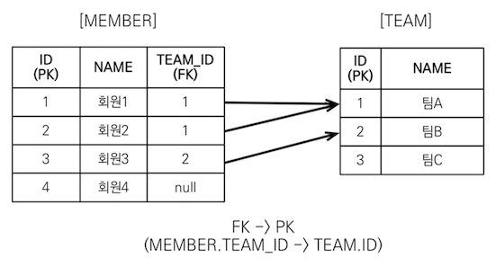
    
                * ② SQL 조인의 결과는 다음 그림과 같다.
    
                    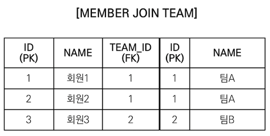
    
                * ③ 엔티티 페치 조인을 한 결과 객체(리스트)는 다음 그림과 같다.
    
                    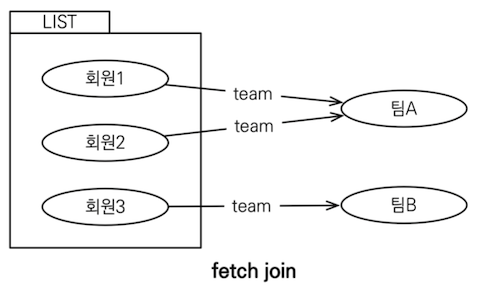
                    
                    * 회원과 팀 객체가 객체 그래프를 유지하면서 조회된 것을 확인할 수 있다.    

            * 소스코드 설명

                * 위의 예제에서 페치 조인을 사용하지 않는다면 N+1 문제가 발생한다.
                
                    ```java
                    // 페치 조인을 사용하지 않는 JPQL
                    String query =  "select m from Member m";
                    
                    List<Member> result = em.createQuery(query, Member.class)
                            .getResultList();
                    
                    for (Member member : result) {
                        /* [N+1 문제 발생]
                           회원1, 팀A (SQL 실행)
                           회원2, 팀A (1차 캐시에서 조회)
                           회원3, 팀B (SQL 실행)       */
                        System.out.println("member = " + member.getUsername() + ", " + member.getTeam().getName());
                    }
                    ```
    
                * 회원을 조회할 때 페치 조인을 사용해서 팀도 함께 조회 했으므로 연관된 팀 엔티티는 프록시가 아닌 실제 엔티티다. 
                  
                    * 따라서 연관된 팀을 사용해도 지연 로딩이 일어나지 않는다.
    
                * 페치 조인을 사용해서 함께 조회하는 회원과 팀 엔티티는 영속성 컨텍스트에서 관리된다.    

    * 컬렉션 페치 조인 - 일대다 관계 페치 조인
    
        * 페치 조인을 사용해서 팀 엔티티를 조회하면서 연관된 회원 컬렉션도 함께 조회하는 JPQL을 보자. (즉, 일대다 관계인 컬렉션을 페치 조인한다.)

            ```java
            // JPQL        
            select t from Team t join fetch t.members where t.name = '팀A'
            ```

        * 실행된 SQL은 다음과 같다.

            ```sql
            // SQL        
            SELECT T.*, M.*
            FROM TEAM T INNER JOIN MEMBER M ON T.ID = M.TEAM_ID
            WHERE T.NAME = '팀A'
            ```
    
        * 페치 조인을 사용하는 코드를 살펴보자. (일대다 관계)

            ```java
            String query =  "select t from Team t join fetch t.members";
            
            List<Team> result = em.createQuery(query, Team.class).getResultList();
            
            for (Team team : result) {
                System.out.println("team = " + team.getName() + " | members = " + team.getMembers().size());
                
                for (Member member : team.getMembers()) {
                    // 페치 조인으로 팀과 회원을 함께 조회해서 지연 로딩이 발생하지 않는다.
                    System.out.println("-> member = " + member);
                }
            }
            ```

            * 실행 과정 설명
              
                * ① 컬렉션을 페치 조인하면 다음 그림처럼 SQL 조인을 시도한다.
    
                    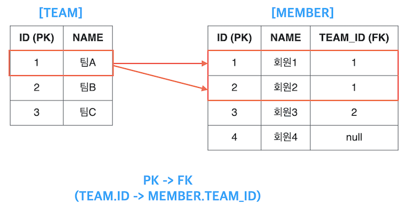
    
                * ② SQL 조인의 결과는 다음 그림과 같다.
    
                    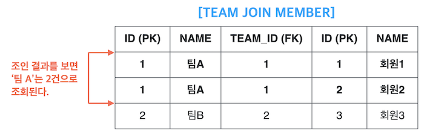   
    
                * ③ 일대다 관계인 컬렉션을 페치 조인한 결과 객체(리스트)는 다음과 같다.
    
                    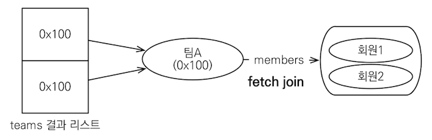
    
                    * 컬렉션 페치 조인을 한 결과 객체 (`teams`)는 주소가 `0x100`으로 같은 '팀A'를 2건 가지게 된다.
    
                    * 위의 그림에 있는 `teams`는 예제 소스코드의 `List<Team> result`와 같다. 

            * **주의사항**
            
                * **일대다 조인은 결과 개수가 늘어날 수도 있다.**
                
                * 일대일 또는 다대일 조인은 결과 개수가 늘어나지 않는다. (같거나 작아진다)

            * 실행 결과

                ```
                team = 팀A | members = 2
                -> member = Member{id=3, username='회원1', age=0}
                -> member = Member{id=4, username='회원2', age=0}
                team = 팀A | members = 2
                -> member = Member{id=3, username='회원1', age=0}
                -> member = Member{id=4, username='회원2', age=0}
                team = 팀B | members = 1
                -> member = Member{id=5, username='회원3', age=0}
                ```
              
                * 컬렉션 페치 조인을 하기 전에는 팀 엔티티에 2건의 데이터(`팀A`, `팀B`)가 있었다.
    
                * 컬렉션 페치 조인을 한 이후에는 팀 엔티티에 3건의 데이터(`팀A`, `팀A`, `팀B`)가 있다.

    * 페치 조인과 DISTINCT
    
        * JPQL의 `DISTINCT`는 SQL에 DISTINCT를 추가하면서 애플리케이션에서 한번 더 중복을 제거한다. (즉, 같은 식별자를 가지는 엔티티는 하나만 남겨 놓는다.). 

            ```java        
            select distinct t
            from Team t join fetch t.members where t.name = '팀A'
            ```
          
            * `select distinct t`의 의미는 팀 엔티티의 중복을 제거하라는 것이다. 

            * 위의 예시를 실행 했을 때, 동작 과정은 다음과 같다.    

                * ① SQL에 DISTINCT를 추가하더라도 각 행(ROW)의 데이터가 다르므로 SQL 결과에서는 중복 제거에 실패한다. (SQL은 SELECT 절에 나열된 모든 컬럼 값이 같을 때만 중복된 행으로 판단함)
                
                    * TEAM_ID: 1, TEAM_NAME : 팀A, **MEMBER_ID : 1**, TEAM_ID : 1, NAME : 회원1
                    
                    * TEAM_ID: 1, TEAM_NAME : 팀A, **MEMBER_ID : 2**, TEAM_ID : 1, NAME : 회원2
                
                * ② 애플리케이션에서 한번 더 중복 제거를 시도한다. 즉, **같은 식별자를 가지는 Team 엔티티는 하나만 남겨 놓는다.**
        
                    * 애플리케이션에서 중복을 제거 했을 때 결과 객체는 다음과 같다.

                        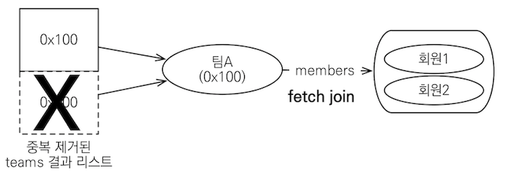
        
                    * 애플리케이션 실행 결과는 다음과 같다.
        
                        ```
                        team = 팀A | members = 2
                        -> member = Member{id=3, username='회원1', age=0}
                        -> member = Member{id=4, username='회원2', age=0}
                        team = 팀B | members = 1
                        -> member = Member{id=5, username='회원3', age=0}
                        ```                        

    * 페치 조인과 일반 조인의 차이
    
        * ① **일반 조인을 실행하면 연관된 엔티티를 함께 조회하지 않는다.**

            ```java
            // JPQL       
            select t
            from Team t join t.members m where t.name = '팀A'
            ```

            ```sql
            // SQL
            SELECT T.*
            FROM TEAM T INNER JOIN MEMBER M ON T.ID = M.TEAM_ID
            WHERE T.NAME = '팀A'      
            ```

            * JPQL에서 팀과 회원 컬렉션을 조인했으므로 회원 컬렉션도 함께 조회할 것이라고 기대해서는 안 된다.

                * JPQL은 결과를 반환할 때 연관관계까지 고려하지 않는다. 
            
                * **단지 SELECT 절에 지정한 엔티티만 조회할 뿐이다.**
            
            * 따라서 팀 엔티티만 조회하고, 연관된 회원 컬렉션은 조회하지 않는다.
    
                * 만약 회원 컬렉션을 지연 로딩으로 설정 했다면 프록시나 아직 초기화하지 않은 컬렉션 래퍼를 반환한다.

        * ② **페치 조인을 사용할 때만 연관된 엔티티도 함께 조회한다.** 

            ```java
            // JPQL
            select t
            from Team t join fetch t.members where t.name = ‘팀A'
            ```
            
            ```sql
            // SQL
            SELECT T.*, M.*
            FROM TEAM T INNER JOIN MEMBER M ON T.ID = M.TEAM_ID
            WHERE T.NAME = '팀A'
            ```
          
            * 실행된 SQL를 보면 `SELECT T.*, M.*`으로 팀과 회원을 함께 조회한 것을 알 수 있다.

            * 즉, **페치 조인은 객체 그래프를 SQL 한번에 조회하는 개념이다.** 
        
    * 페치 조인의 특징과 한계

        * ① **페치 조인의 대상에는 별칭을 사용하면 안 된다.**
    
            * `select t from Team t join fetch t.members m` (X)
    
                * 여기서 문제가 되는 부분은 `t.members m` 이다.

            * JPA 표준에서는 지원하지 않지만 하이버네이트는 페치 조인에 별칭을 사용하는 것을 지원한다. (가급적 사용하면 안 된다.)
    
            * 하지만 별칭을 잘못 사용하면 연관된 데이터 수가 달라져서 데이터 무결성이 깨질 수 있다.
    
                * Ex) 팀과 연관된 회원이 5명인데, 그 중에 1명만 조회하면 나머지 회원 4명이 누락되기 때문에 이상하게 동작할 수 있다.
                  
        * ② **fetch join 대상을 on, where 등에서 필터링 조건으로 사용하면 안된다.**
    
            * 아래 예시를 살펴보며 좀 더 자세히 이해해보자.

                * 1번. 
                  
                    * `select t from Team t join fetch t.members m where m.age > 10` (X)
    
                        * 페치 조인은 어떤 엔티티와 연관된 모든 것을 가져 오겠다는 의미를 가진다.
    
                            * 따라서 연관된 엔티티의 데이터 중 일부만 가져오는 행위를 해서는 안 된다. 

                        * 페치 조인 대상(`t.members`)에 별칭을 잘못 사용해서 컬렉션 결과를 일부만 조회 되도록 필터링 하면 객체와 DB의 상태 일관성이 깨져버린다.

                            * 예를 들어, 팀과 연관된 회원이 5명이며 나이가 10살 보다 큰 회원만 조회 하도록 where 조건을 지정하면 결과는 3명이 된다.
                    
                            * 이것은 JPA에서 설계한 의도와 다르다. 
    
                                * 즉, `t.members`를 하면 팀과 연관된 회원에 모두 접근 가능해야 한다.

                * 2번.
    
                    * `select t from Team t join fetch t.members m where t.name=:teamName` (O)

                        * 해당 쿼리에서 `Team`은 fetch join 대상이 아니므로 where에서 마음껏 사용해도 된다.

                        * 하지만 `t.members m`은 페치 조인 대상이다. 
                          
                        * 따라서 on, where 등에서 필터링 조건으로 사용하면 위험하다.

                * 3번. 
                  
                    * `select t from Team t join fetch t.members m join fetch m.locker` (O)
    
                        * 페치 조인을 여러 단계로 하는 경우에는 페치 조인의 대상에 별칭을 줄 수 있다.
    
        * ③ 둘 이상의 컬렉션은 페치 조인을 할 수 없다.

            * JPA 구현체에 따라 가능한 경우도 있는데 가급적 사용하면 안된다.

            * `컬렉션 * 컬렉션`의 카테시안 곱이 만들어지므로 주의해야 한다.
    
            * 하이버네이트를 사용하면 `MultipleBagFetchException` 예외가 발생한다.

        * ④ 컬렉션을 페치 조인하면 페이징 API(setFirstResult, setMaxResults)를 사용할 수 없다.
        
            * 컬렉션(`일대다`)이 아닌 단일 값 연관 필드(`일대일`, `다대일`)들은 페치 조인을 사용해도 페이징 API를 사용할 수 있다.
    
                * 일대다는 조심하자! 데이터가 더 많아 질 수 있다.
                 
            * 하이버네이트에서 컬렉션을 페치 조인하고 페이징 API를 사용하면 경고 로그를 남기면서 메모리에서 페이징 처리를 한다.

                ```java
                // [잘못된 방식] 일대다 페치 조인         
                String query = "select t from Team t join fetch t.members m"
                
                List<Team> result = em.createQuery(query, Team.class)
                        .setFirstResult(0)
                        .setMaxResults(1)
                        .getResultList();
                ```

                * 데이터가 많으면 성능 이슈와 메모리 초과 예외가 발생 할 수 있어서 매우 위험하다.

            * 해결 방법은 다음과 같다.
            
                * 일대다 페치 조인을 다대일 페치 조인으로 뒤집어서 해결한다.
           
                    ```java 
                    // [올바른 방식] 다대일 페치 조인       
                    String query = "select m from Member m join fetch m.team"
                    
                    List<Team> result = em.createQuery(query, Team.class)
                            .setFirstResult(0)
                            .setMaxResults(1)
                            .getResultList();
                    ```
                  
                * 또는 `@BatchSize`를 사용하여 해결한다. 

                    ```java 
                    @Entity
                    public class Team {
                    
                        //...
                    
                        @BatchSize(size = 100) // 1000 이하 값으로 설정
                        @OneToMany(mappedBy = "team")
                        private List<Member> members = new ArrayList<>();
                        
                    }
                    ```

                    ```java 
                    String query = "select t from Team t";
                    
                    List<Team> result = em.createQuery(query, Team.class)
                            .setFirstResult(0)
                            .setMaxResults(2)
                            .getResultList();
                    
                    for (Team team : result) {
                        System.out.println("team = " + team.getName() + " | members = " + team.getMembers().size());
                    
                        for (Member member : team.getMembers()) {
                            System.out.println("-> member = " + member);
                        }
                    }
                    ```

                    * `@BatchSize` : (특정 엔티티와 연관된 엔티티를 실제 사용할 때) 지정한 size 만큼 SQL의 IN 절에 특정 엔티티의 ID를 설정해서 연관된 엔티티를 조회한다.
    
                        * 위의 예시에서 Team의 members는 지연 로딩(LAZY LOADING)으로 설정되어 있다.
    
                        * 조회한 Team 엔티티와 연관된 엔티티인 members를 실제 사용할 때, 지정한 size 만큼 SQL의 IN 절에 Team 엔티티의 ID를 설정해서 연관된 엔티티 members를 조회한다.
    
                            ```sql
                            SELECT  M.*
                            FROM    MEMBER M
                            WHERE   M.TEAM_ID IN (?, ?) 
                            ```
                          
                    * `hibernate.default_batch_fetch_size`로 글로벌 설정이 가능하다.

                        * size는 1000 이하의 값을 설정한다.
    
    * 정리하기
    
        * ① 페치 조인은 연관된 엔티티들을 SQL 한 번으로 조회한다. 
    
            * SQL 호출 횟수를 줄여서 성능을 최적화할 수 있다.  
        
        * ② 엔티티에 직접 적용하는 글로벌 로딩 전략 보다 페치 조인이 우선적으로 적용된다.
        
            * `@OneToMany(fetch = FetchType.LAZY)` : 글로벌 로딩 전략

        * ③ 실무에서 글로벌 로딩 전략은 모두 지연 로딩으로 설정한다.

        * ④ 페치 조인은 객체 그래프를 유지할 때 사용하면 효과적이다.
        
        * ⑤ **여러 테이블을 조인해서 엔티티가 가진 모양이 아닌 전혀 다른 결과를 만들어야 하면, 페치 조인 보다는 일반 조인을 사용하고 필요한 값들만 조회해서 DTO로 반환하는 것이 효과적이다.**
        
            * **Ex) 통계 쿼리**
    
* **(16) 다형성 쿼리**

    * `TYPE`은 엔티티의 상속 구조에서 조회 대상을 특정 자식 타입으로 한정할 때 사용한다.

        * Ex) Item 중에 Book, Movie를 조회해라

            ```java
            // JPQL        
            select i from Item i
            where type(i) IN (Book, Movie)
            ```

            ```sql
            // SQL      
            select i from i
            where i.DTYPE in ('B', 'M')
            ```

    * `TREAT`은 상속 구조에서 부모 타입을 특정 자식 타입으로 다룰 때 사용한다.

        * 자바의 타입 캐스팅과 유사하다.

        * JPA 표준은 FROM, WHERE 절에서 사용, 하이버네이트는 SELECT 절에서도 사용 가능

        * Ex) 부모인 Item과 자식 Book이 있다.

            ```java
            // JPQL        
            select i from Item i
            where treat(i as Book).author = 'kim'
            ```

            ```sql
            // SQL (Single 테이블 전략을 사용한다고 가정함)         
            select i.* from Item i
            where i.DTYPE = 'B' and i.author = 'kim'
            ```
          
* **(17) 엔티티 직접 사용**

    * 기본 키 값

        * JPQL에서 엔티티를 직접 사용하면 실행되는 SQL에서 해당 엔티티의 기본 키 값을 사용한다.
        
            ```java
            // JPQL        
            select count(m.id) from Member m // 엔티티의 아이디를 사용
            select count(m) from Member m // 엔티티를 직접 사용
            ```

            ```sql
            // SQL        
            select count(m.id) as cnt 
            from Member m
            ```
    
            * 엔티티를 식별 할 수 있는 것은 기본 키 값이기 때문이다.
          
        * 엔티티를 JPQL의 파라미터로 전달하면 실행되는 SQL에서 해당 엔티티의 기본 키 값을 사용한다.
    
            ```java        
            String query = "select m from Member m where m = :member"; 
            List resultList = em.createQuery(query)
                                .setParameter("member", member)
                                .getResultList();
            ```

            ```sql
            // SQL        
            select m.*
            from Member m
            where m.id = ?
            ```

    * 외래 키 값

        * 기본 키 값이 1L인 팀 엔티티를 파라미터로 사용하고 있다. m.team은 현재 team_id라는 외래 키와 매핑되어 있다.

        * JPQL에서 엔티티를 직접 사용하면 실행되는 SQL에서 해당 엔티티의 외래 키 값을 사용한다.    

            ```java        
            Team team = em.find(Team.class, 1L);
          
            // 실행되는 SQL에서 "m.team" : 외래 키, ":team" : 기본 키로 변환된다. 
            String qlString = "select m from Member m where m.team = :team"; 
            List resultList = em.createQuery(qlString)
                                .setParameter("team", team) .getResultList();
            ```

            ```sql
            // SQL        
            SELECT M.*
            FROM MEMBER M
            WHERE M.TEAM_ID = ?
            ```
    
* **(18) Named 쿼리: 정적 쿼리**

    * JPQL 쿼리는 동적 쿼리와 정적 쿼리로 분류할 수 있다.

        * `동적 쿼리 (Dynamic Query)` : 실행 시점에 검색 조건에 따라 다른 쿼리를 생성하는 것을 말한다.
    
        * `정적 쿼리 (Static Query)` : (어떤 검색 조건에도 변경되지 않는) 고정된 형태의 쿼리를 말한다.
    
    * `Named 쿼리` : 미리 정의한 쿼리(JPQL)에 이름을 부여해서 필요할 때 사용하는 것을 말한다.

        * Named 쿼리의 특징
          
            * ① 정적 쿼리다.
              
            * ② 애플리케이션 로딩 시점에 JPQL 문법을 체크해서 미리 SQL로 파싱해둔다. (문법 체크 시, 문제가 있다면 오류가 발생함)
        
                * `파싱 (Parsing)` : 어떤 데이터를 원하는 형태로 가공하는 것을 말한다.
            
            * ③ 따라서 오류를 빨리 확인할 수 있고 사용하는 시점에는 파싱된 결과를 재사용하므로 성능 상 이점이 있다.

        * 사용 방법
    
            * ① @NamedQuery를 사용해서 Named 쿼리를 정의한다. 

                ```java        
                @Entity
                @NamedQuery(
                    name = "Member.findByUsername", // name의 관례는 "엔티티명.쿼리명" 이다.
                    query = "select m from Member m where m.username = :username")
                public class Member {
                    //...
                }
                ```
              
                * name 속성에 쿼리 이름을 부여하고 query 속성에 사용할 쿼리를 입력한다.

            * ② Named 쿼리를 사용한다. 
            
                ```java        
                List<Member> resultList = em.createNamedQuery("Member.findByUsername", Member.class)
                                            .setParameter("username", "회원1")
                                            .getResultList();
                ```
              
                * 스프링 데이터 JPA에서는 해당 방식 보다 유용한 `@Query`를 제공한다.
        
* **(19) 벌크 연산**

    * `벌크 연산 (Bulk Data Operations)`은 한 번에 여러 데이터(Row)를 수정하거나 삭제하는 방법을 말한다. (SQL의 UPDATE, DELETE 문)

        * 벌크 연산의 특징
    
            * ① 쿼리 한 번으로 테이블의 여러 행을 변경한다.
    
            * ② executeUpdate()의 결과는 벌크 연산으로 영향을 받은 엔티티 수를 반환한다.
    
            * ③ UPDATE, DELETE를 지원한다.
    
            * ④ INSERT (INSERT INTO .. SELECT)는 하이버네이트에서 지원한다.
    
            * ⑤ 스프링 데이터 JPA에서는 벌크 연산을 `@Modifying`으로 제공한다.

        * 벌크 연산이 필요한 이유
          
            * 예를 들어, 재고가 10개 미만인 모든 상품의 가격을 10% 상승 하려고 할 때, JPA의 변경 감지 기능으로 해결하려면 너무 많은 SQL 문을 실행해야 한다. 
        
                * ① 재고가 10개 미만인 상품을 리스트로 조회한다.
        
                * ② 리스트를 반복문으로 순회하며 상품 엔티티의 가격을 10% 증가한다.
        
                * ③ 트랜잭션 커밋 시점에 변경 감지가 동작한다.
        
            * 만약 변경된 데이터가 100건이라면 100 번의 UPDATE SQL문이 실행된다.
    
            * 따라서 SQL 한 번에 여러 데이터를 수정하거나 삭제하는 벌크 연산이 필요하다.

        * 벌크 연산 예시
          
            * UPDATE 벌크 연산
    
                * 모든 회원의 나이를 20살로 변경한다.
                
                    ```java
                    // 팀(Team)
                    Team teamA = new Team();
                    teamA.setName("팀A");
                    em.persist(teamA);
                    
                    Team teamB = new Team();
                    teamB.setName("팀B");
                    em.persist(teamB);
                    
                    // 회원(Member)
                    Member member1 = new Member();
                    member1.setUsername("회원1");
                    member1.setTeam(teamA);
                    em.persist(member1);
                    
                    Member member2 = new Member();
                    member2.setUsername("회원2");
                    member2.setTeam(teamA);
                    em.persist(member2);
                    
                    Member member3 = new Member();
                    member3.setUsername("회원3");
                    member3.setTeam(teamB);
                    em.persist(member3);
                    
                    /* JPQL을 실행하기 직전에 flush()가 자동 호출된다. 
                       따라서 영속성 컨텍스트의 현재 상태가 DB에 반영된다.
                       그 다음, 벌크 연산이 실행되어 DB에서 모든 회원의 나이를 20살로 변경한다. 
                       하지만 영속성 컨텍스트는 변경되지 않았다. */
                    int resultCount = em.createQuery("update Member m set m.age = 20")
                            .executeUpdate();
                    
                    /* 만약 벌크 연산을 수행한 후, 바로 영속성 컨텍스트를 초기화하면 데이터베이스에서 벌크 연산이 적용된 데이터를 조회한다.
                       (주석에서 설명한대로 동작 되도록 하고 싶다면 clear()의 주석을 해제하자. */
                    // em.clear();
                    
                    Member findMember = em.find(Member.class, member1.getId());
                    System.out.println("findMember = " + findMember.getAge());
                    ```
                  
                    * 벌크 연산을 수행하기 전에 모든 회원의 나이는 0 이었다. 
                      
                        * 나이를 따로 설정하지 않았기 때문에 기본 값 0을 가진다.
        
                    * 벌크 연산을 수행하면 DB에 있는 모든 회원의 나이는 20살이 된다.
        
                    * 그 다음, 영속성 컨텍스트를 초기화하지 않는다면 영속성 컨텍스트에 있는 모든 회원의 나이는 그대로 0살이다. 
        
                        * 벌크 연산은 영속성 컨텍스트를 무시하고 데이터베이스에 직접 쿼리하기 때문이다.
        
                    * 따라서 벌크 연산을 수행한 후에 바로 영속성 컨텍스트를 초기화한다. (`em.clear()`)
    
                * 재고가 10개 미만인 모든 상품의 가격을 10% 상승한다.        
    
                    ```java
                    String query = "update Product p " +
                                   "set p.prce = p.price * 1.1 " +
                                   "where p.stockAmount < :stockAmount";
                    
                    // JPQL을 실행하기 직전에 flush()가 자동 호출된다.
                    int resultCount = em.createQuery(query)
                                        .setParameter("stockAmount", 10)
                                        .executeUpdate();
                  
                    // 벌크 연산을 수행한 후, 바로 영속성 컨텍스트를 초기화한다.
                    em.clear();
                    ```
            
                    * 벌크 연산(UPDATE, DELETE)은 `executeUpdate()`를 사용한다. 
                      
                        * 해당 메소드는 벌크 연산으로 영향을 받은 엔티티 건수를 반환한다.
        
            * DELETE 벌크 연산
            
                ```java
                // 가격이 100원 미만인 상품을 삭제한다.
                String query = "delete from Product p " +
                               "where p.price < :price";
                
                int resultCount = em.createQuery(query)
                                    .setParameter("price", 100)
                                    .executeUpdate();
              
                // 벌크 연산을 수행한 후, 바로 영속성 컨텍스트를 초기화한다.
                em.clear();
                ```
          
        * 벌크 연산의 주의사항
    
            * **벌크 연산은 영속성 컨텍스트를 무시하고 데이터베이스에 직접 쿼리한다**는 점에 주의해야 한다.
        
                * 따라서 영속성 컨텍스트와 데이터베이스에 있는 데이터가 다를 수 있다.
    
            * 해결책은 다음 2 가지가 있다.
            
                * ① 벌크 연산을 가장 먼저 실행한다. 
                
                * ② 벌크 연산을 수행한 후, 바로 영속성 컨텍스트를 초기화한다.
                
                    * 영속성 컨텍스트를 초기화하면 이후 엔티티를 조회할 때, 벌크 연산이 적용된 데이터베이스에서 엔티티를 조회한다.
    
## 11. ETC

### 1. 변경 감지(Dirty Checking) 와 병합(merge)

* **(1) 준영속 엔티티?**

    * `준영속 엔티티` : 영속성 컨텍스트가 더 이상 관리하지 않는 엔티티를 말한다.

        ```java
        @Controller
        @RequiredArgsConstructor
        public class ItemController {
        
            // ...
            
            @PostMapping(value = "/items/{itemId}/edit")
            public String updateItem(@ModelAttribute("form") BookForm form) {
                Book book = new Book();
                book.setId(form.getId());
                book.setName(form.getName());
                book.setPrice(form.getPrice()); book.setStockQuantity(form.getStockQuantity());
                book.setAuthor(form.getAuthor());
                book.setIsbn(form.getIsbn());
        
                itemService.saveItem(book);
        
                return "redirect:/items";
            }
        
        }
        ```

        * Book 객체는 이미 DB에 한번 저장 되어서 식별자가 존재한다.
    
        * Book 객체처럼 엔티티 객체를 새롭게 만들더라도 기존의 식별자를 가지고 있으면 준영속 엔티티로 볼 수 있다.
    
        * 따라서 Book 객체는 준영속 상태의 객체다.

* **(2) 준영속 엔티티를 수정하는 2 가지 방법** 
  
    * ① 변경 감지 기능 사용
    
        ```java
        @Service
        @Transactional(readOnly = true)
        @RequiredArgsConstructor
        public class ItemService {
            
            // ...
        
            @Transactional
            public void updateItem(Long itemId, Item itemParam) {   // itemParam : 파라미터로 넘어온 준영속 상태의 엔티티
                // 영속성 컨텍스트에서 엔티티를 다시 조회한다.
                Item findItem = itemRepository.findOne(itemId);
        
                // 데이터를 수정한다.
                findItem.setName(itemParam.getName());
                findItem.setPrice(itemParam.getPrice());
                findItem.setStockQuantity(itemParam.getStockQuantity());
            }
            
        }
        ```
        
        * ⓐ 트랜잭션 안에서 엔티티를 다시 조회한다. 
          
            * 조회한 엔티티는 영속 상태다. 
        
        * ⓑ 조회한 영속 상태의 엔티티 값을 파라미터로 넘어온 준영속 상태의 엔티티 값으로 변경한다.
        
        * ⓒ 트랜잭션을 커밋하는 시점에 변경 감지(Dirty Checking)가 동작해서 데이터베이스에 UPDATE SQL를 실행한다.
        
    * ② 병합(merge) 사용
    
        ```java
        @Service
        @Transactional(readOnly = true)
        @RequiredArgsConstructor
        public class ItemService {
        
            @Transactional
            public void updateItem(Item itemParam) { // itemParam : 파라미터로 넘어온 준영속 상태의 엔티티
                Item mergeItem = em.merge(item);
            }
            
        }
        ```
      
        * `merge`는 준영속 상태의 엔티티를 영속 상태로 변경할 때 사용한다.
    
* **(3) 병합 동작 방식**

    * 상세 버전
    
        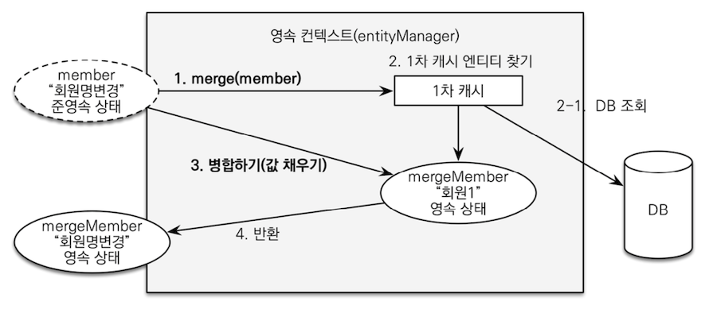
      
        * ① `merge()`를 실행한다.
          
        * ② 파라미터로 넘어온 준영속 엔티티의 식별자 값으로 1차 캐시에서 엔티티를 조회한다. 

            * 만약 1차 캐시에 엔티티가 없으면 데이터베이스에서 엔티티를 조회한 다음, 1차 캐시에 저장한다.          

        * ③ 조회한 영속 엔티티(mergeMember)에 준영속 엔티티(member)의 값을 채워 넣는다.
    
            * member 엔티티의 모든 값을 mergeMember에 밀어 넣는다. 
              
            * 이때 mergeMember의 "회원1"이라는 이름이 "회원명변경"으로 변경된다.

        * ④ 영속 상태인 엔티티(mergeMember)를 반환한다.
    
    * 요약 버전

        * ① 준영속 엔티티의 식별자 값으로 영속 엔티티를 조회한다.
          
        * ② 영속 엔티티의 값을 준영속 엔티티의 값으로 모두 교체한다 (병합한다). 
          
        * ③ 트랜잭션 커밋 시점에 변경 감지 기능이 동작해서 데이터베이스에 UPDATE SQL를 실행한다.
    
    * 주의 사항

        * 변경 감지 기능을 사용하면 원하는 속성만 선택해서 변경할 수 있지만 병합을 사용하면 모든 속성이 변경된다. 
          
        * 따라서 병합 시 값이 없으면 null로 수정할 위험도 있다. 
    
### 2. OSIV와 성능 최적화

* **(1) OSIV는 무엇인가?**

    * `OSIV (Open Session In View)` : 영속성 컨텍스트를 뷰까지 열어둔다는 의미다.

        * 하이버네이트에서는 Open Session In View 라고 하며 JPA에서는 Open EntityManager In View 라고 한다.    

        * 영속성 컨텍스트가 살아 있으면 엔티티는 항상 영속 상태로 유지된다. 따라서 뷰에서도 지연 로딩이 가능하다.
        
        * 스프링 부트에서는 기본적으로 OSIV가 켜져 있다.
        
            * 실시간 서비스는 OSIV를 끄고, ADMIN 처럼 데이터베이스 커넥션을 많이 사용하지 않는 서비스는 OSIV를 켠다.

* **(2) OSIV ON / OFF**
  
    * OSIV ON (`spring.jpa.open-in-view=true`)
    
        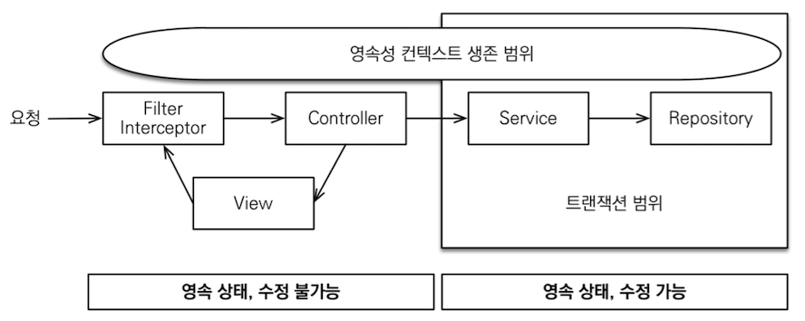
        
        * 클라이언트의 요청이 들어와서 **서비스 계층에서 트랜잭션을 시작하면 영속성 컨텍스트(데이터베이스 커넥션)를 생성해서 클라이언트의 요청에 대한 응답을 완료할 때까지 유지한다.**
        
        * 따라서 뷰 템플릿 또는 컨트롤러에서 지연 로딩이 가능했던 것이다.

        * 하지만 OSIV가 켜져 있으면 오랜 시간 동안 데이터베이스 커넥션 리소스를 사용하기 때문에 실시간 트래픽이 중요한 애플리케이션에서는 커넥션이 부족할 수 있다. 이것은 결국 장애로 이어질 수 있다.
        
            * 예를 들어, 컨트롤러에서 외부 API를 호출하면 외부 API가 처리될 때까지 대기하는 시간만큼 데이터베이스 커넥션 리소스를 반환하지 못하고 유지해야 한다.
            
                * `외부 API` : 다른 팀 또는 기업과 협업하기 위한 API를 말한다.

    * OSIV OFF (`spring.jpa.open-in-view=false`)
    
        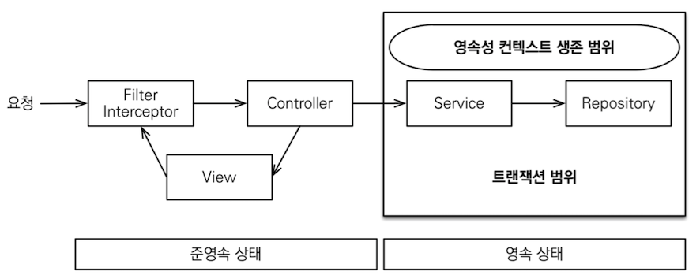
        
        * 클라이언트의 요청이 들어와서 **서비스 계층에서 트랜잭션을 시작하면 영속성 컨텍스트(데이터베이스 커넥션)를 생성해서 트랜잭션을 종료할 때까지 유지한다.**
    
            * 즉, 트랜잭션을 시작해서 종료할 때까지만 영속성 컨텍스트를 유지한다. 
    
            * 트랜잭션을 종료할 때 영속성 컨텍스트도 종료하고 데이터베이스 커넥션도 반환한다. 
    
        * 따라서 데이터베이스 커넥션 리소스를 낭비하지 않는다.
    
        * 하지만 모든 지연 로딩을 트랜잭션 안에서 처리해야 된다는 단점이 있다.
    
* **(3) 커맨드와 쿼리 분리하기**

    * 실무에서 OSIV를 끈 상태로 복잡성을 관리하는 좋은 방법이 있다. 
      
    * 바로 Command와 Query를 분리하는 것이다.

        * 보통 비즈니스 로직은 특정 엔티티 몇 개를 등록하거나 수정하는 것이므로 성능이 크게 문제가 되지 않는다. 
        
        * 그런데 복잡한 화면을 출력하기 위한 쿼리는 화면에 맞추어 성능을 최적화 하는 것이 중요하다. 
    
        * 따라서 이 둘의 관심사를 명확하게 분리하는 선택은 유지보수 관점에서 충분히 의미 있다.
    
        * 단순하게 설명해서 다음처럼 분리하는 것이다.

            * OrderService
            
                * `OrderService` : 핵심 비즈니스 로직
                
                * `OrderQueryService` : 화면이나 API에 맞춘 서비스 (주로 읽기 전용 트랜잭션 사용)

        * 보통 서비스 계층에서 트랜잭션을 유지하며 두 서비스는 모두 트랜잭션을 유지하면서 지연 로딩을 사용할 수 있다.
    

    