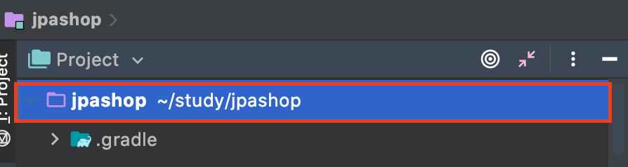
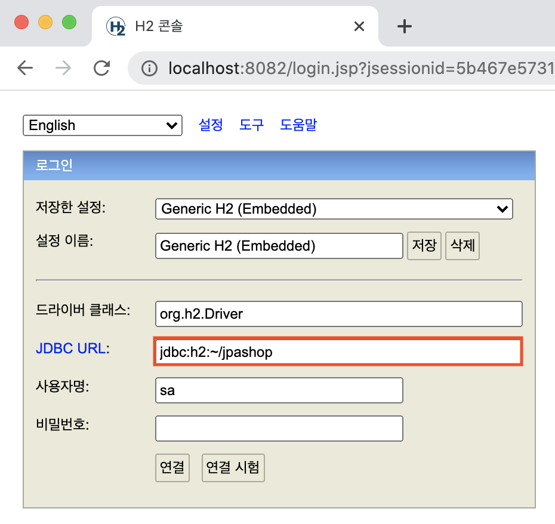

# 김영한님의 실전! 스프링 부트와 JPA 활용1 - 웹 애플리케이션 개발
> 아래 내용은 [실전! 스프링 부트와 JPA 활용1 - 웹 애플리케이션 개발](https://www.inflearn.com/course/%EC%8A%A4%ED%94%84%EB%A7%81%EB%B6%80%ED%8A%B8-JPA-%ED%99%9C%EC%9A%A9-1 "실전! 스프링 부트와 JPA 활용1 - 웹 애플리케이션 개발") 강좌를 정리한 내용 입니다.

## 1. 프로젝트 환경설정

### 1. 터미널에서 프로젝트로 이동 및 gradle 의존 관계 보기

* Mac 기준으로 아래 그림처럼 프로젝트 명을 선택한 다음, command + shift + c를 누른다.

 

* 다음과 같이 터미널을 실행하여 입력한다.

```
cd /Users/FINTFACE/study/jpashop
```
 
* gradle 의존 관계 보기

 ```
 ./gradlew dependencies
 ```

### 2. View 환경설정

스프링 부트 viewName 매핑 : `resources:templates/` + {ViewName} + `.html`
 
#### 1) 컨트롤러 작성하기

 ```java
@Controller
public class HelloController {

    @GetMapping("hello")
    public String hello(Model model){
        model.addAttribute("data", "hello!!!");
        return "hello";
    }
}
 ```

#### 2) View 작성하기

* 서버 사이드 렌더링이 되면 th:text의 결과를 태그의 내용물로 대체한다. 
    
 ```html
<!DOCTYPE HTML>
<html xmlns:th="http://www.thymeleaf.org"> <head>
    <title>Hello</title>
    <meta http-equiv="Content-Type" content="text/html; charset=UTF-8" /> </head>
<body>
<p th:text="'안녕하세요. ' + ${data}" >안녕하세요. 손님</p>
</body>
</html>
 ```
#### 3) H2 데이터베이스 설치

* 개발이나 테스트 용도로 가볍고 편리한 DB, 웹 화면 제공 

##### (1) 다운로드 및 설치

##### (2) H2 데이터베이스 실행 및 파일 생성 방법 

* H2 데이터베이스를 설치한 경로 ( `~/study/h2/bin` ) 에서 `./h2.sh`로 실행한다.
    * `chmod 755 h2.sh`로 h2.sh에 권한을 부여하자. 

* JDBC URL : `jdbc:h2:~/jpashop` 로 DB 파일을 생성 할 경로를 지정한 다음 (파일 모드), 연결 버튼을 클릭한다.

  

* `~/jpashop.mv.db` 파일 생성 확인 이후 부터는 `jdbc:h2:tcp://localhost/~/jpashop` 이렇게 접속 

#### 4) JPA

##### (1) `main/resources/application.yml` 작성하기

##### (2) 회원 엔티티 작성

 ```java
@Entity
@Getter @Setter
public class Member {

    @Id @GeneratedValue
    private Long id;

    private  String username;
    
}
 ```

##### (3) 회원 리포지토리 작성

 ```java
@Repository
public class MemberRepository {

    @PersistenceContext
    private EntityManager entityManager;

    public Long save(Member member){
        entityManager.persist(member);
        return member.getId();
    }

    public Member find(Long id){
        return entityManager.find(Member.class, id);
    }
}
 ```

##### (4) 테스트 코드 작성

 ```java
@RunWith(SpringRunner.class)
@SpringBootTest
public class MemberRepositoryTest {

    @Autowired MemberRepository memberRepository;

    @Test
    @Transactional
    @Rollback(false)
    public void testMember() throws Exception{
        //given
        Member member = new Member();
        member.setUsername("memberA");

        //when
        Long savedId = memberRepository.save(member);
        Member findMember = memberRepository.find(savedId);

        //then
        Assertions.assertThat(findMember.getId()).isEqualTo(member.getId());
        Assertions.assertThat(findMember.getUsername()).isEqualTo(member.getUsername());
        Assertions.assertThat(findMember).isEqualTo(member);
        System.out.println("findMember == memer: " + (findMember == member));
    }
}
 ```

### 3. JPA와 DB 설정, 동작 확인

* `@PersistenceContext` : EntityManager를 주입 받는다.

* `@Transactional`
    * 테스트 코드에 사용하면 기본적으로 테스트가 종료된 다음, 바로 롤백을 한다.
    
    * `@Rollback(false)`를 붙이면 롤백을 하지 않고 커밋을 한다.

### 4. jar 빌드해서 동작 확인

* `./gradlew clean build`
* `cd build`
* `cd libs`
* `java -jar jpashop-0.0.1-SNAPSHOT.jar`

### 5. 쿼리 파라미터 로그 남기기

* 로그에 다음을 추가하기 `org.hibernate.type` : SQL 실행 파라미터를 로그로 남긴다. 

* 외부 라이브러리 사용
    * 스프링 부트를 사용하면 이 라이브러리만 추가하면 된다.
    * `implementation 'com.github.gavlyukovskiy:p6spy-spring-boot-starter:1.5.6'`

## 2. 도메인 분석 설계

해당 파트는 강좌를 참고 하도록 하자.

* 외래 키가 있는 곳을 연관 관계의 주인으로 정해라.

### 엔티티 설계 시 주의점

#### (1) 엔티티에는 가급적 Setter를 사용하지 말자

#### (2) 모든 연관관계는 지연로딩으로 설정!

#### (3) 컬렉션은 필드에서 바로 초기화 하자.

#### (4) 테이블, 컬럼명 생성 전략

스프링 부트 신규 설정 (엔티티(필드) 테이블(컬럼))
1. 캐멀 케이스 → 언더스코어(memberPoint → member_point) 
2. (점)  → _(언더스코어)
3. 대문자 → 소문자

## 3~5. 회원, 상품, 주문 도메인 개발

* `Given, When, Then`
    * `Given`절에서 테스트 할 상황을 설정한다.
    * `When`절에서 테스트 대상을 실행한다.
    * `Then`절에서 결과를 검증한다.

* `@PersistenceContext` : 스프링이 EntityManager를 만들어서 주입 시켜준다.

 ```java
    @PersistenceContext
    private EntityManager em;
 ```

* `@PersistenceUnit` : 스프링이 EntityManagerFactory를 만들어서 주입 시켜준다. (거의 사용 하지 않음)

 ```java
    @PersistenceUnit
    private EntityManagerFactory emf;
 ```

* `@RequiredArgsConstructor` : final 필드 만을 가지고 생성자를 만들어준다.

* 생성자가 하나인 경우에는 `@Autowired`가 없더라도 스프링이 자동 주입을 해준다.

* 스프링 데이터 JPA를 사용하면 EntityManager에 `@PersistenceContext` 대신에 `@Autowired`를 사용 할 수 있다.

* 그래서 아래와 같이 생성자 인젝션으로 작성 할 수 있다.

 ```java
@Repository
@RequiredArgsConstructor
public class MemberRepository {

    private final EntityManager em;

    ...

}
 ```

* `application.yml`에 `jdbc:h2:mem:test`를 사용하면 메모리 모드로 동작한다. 

* 사실 이 설정 없어도 스프링 부트에서는 메모리 모드로 동작함.

* `@NoArgsConstructor(access = AccessLevel.PROTECTED)` : 직접 객체를 생성 하는 것이 아닌 생성 메서드를 이용 하도록 할 때 사용 할 수 있다.

* `도메인 모델 패턴`이란? 서비스 계층은 단순히 엔티티에 필요한 요청을 위임하는 역할을 하며 엔티티가 비즈니스 로직을 처리하는 것

* `트랜잭션 스크립트 패턴`이란? 엔티티에는 비즈니스 로직이 거의 없고 서비스 계층에서 대부분의 비즈니스 로직을 처리하는 것     


  
