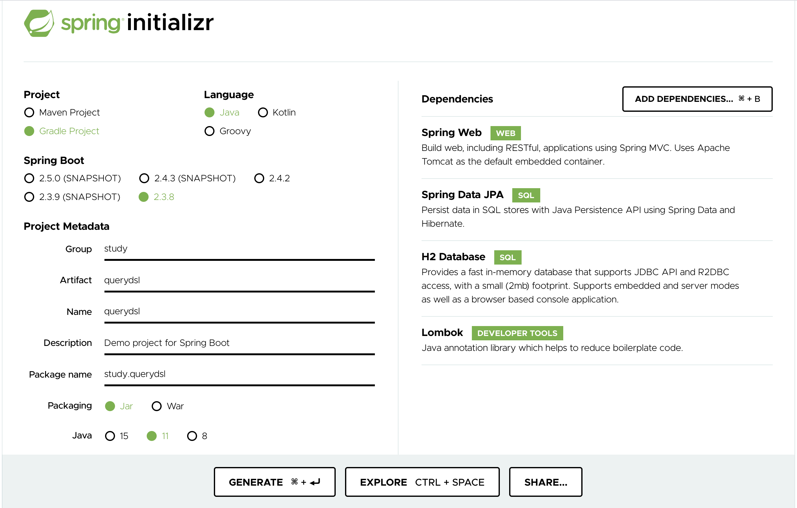

# 김영한님의 실전! Querydsl
> 아래 내용은 [실전! Querydsl](https://www.inflearn.com/course/Querydsl-실전# "실전! Querydsl") 강좌를 정리한 내용 입니다.

## 1. 프로젝트 환경설정

* 프로젝트 생성

    * `스프링 부트 스타터`에서 프로젝트를 생성한다.
    
    * 의존성 추가 : `Spring Web`, `JPA`, `H2`, `LOMBOK`
    
        
        
* QueryDsl 설정 및 검증

    * `Gradle`의 경우, `build.gradle`에 주석을 참고해서 QueryDsl 설정을 추가한다.
    
        ```
        plugins {
        	...
      
        	//querydsl용 플러그인 추가
        	id "com.ewerk.gradle.plugins.querydsl" version "1.0.10"
      
        	...
        }
        
        ...
        
        dependencies {
        	...
      
        	//querydsl 라이브러리 추가
        	implementation 'com.querydsl:querydsl-jpa'
      
        	...
        }
        
        ...
      
        // querydsl 빌드 관련 설정 START
        def querydslDir = "$buildDir/generated/querydsl"
        
        querydsl {
        	jpa = true
        	querydslSourcesDir = querydslDir
        }
        sourceSets {
        	main.java.srcDir querydslDir
        }
        configurations {
        	querydsl.extendsFrom compileClasspath
        }
        compileQuerydsl {
        	options.annotationProcessorPath = configurations.querydsl
        }
        // querydsl 빌드 관련 설정 END
        ```
      
    * Querydsl 환경설정 검증
    
        * 검증용 엔티티 생성
        
            ```java
            @Entity
            @Getter @Setter
            public class Hello {
          
                @Id @GeneratedValue
                private Long id;
          
            }
            ```
          
        * 검증용 Q 타입 생성
        
            * 인텔리제이(IntelliJ)에서 Gradle인 경우, 사용법
        
                * `Gradle` → `Tasks` → `build` → `clean`
                
                * `Gradle` → `Tasks` → `other` → `compileQuerydsl`
                
            * 콘솔에서 Gradle인 경우, 사용법
        
                * `./gradlew clean compileQuerydsl`
                
        * Q 타입 생성 확인
        
            * `build` → `generated` → `querydsl`
            
            * `study.querydsl.entity.QHello.java` 파일이 생성되어 있어야 함
                
        * [참고] Q 타입은 컴파일 시점에 자동 생성되므로 버전 관리를 하지 않는 것이 좋다. 
        
            * 앞서 설정에서 생성 위치를 `gradle build` 폴더 아래 생성 되도록 했기 때문에 이 부분도 자연스럽게 해결된다. 
            
            * 대부분 `gradle build` 폴더를 git에 포함하지 않는다.

        * 테스트 케이스로 실행 검증
        
            ```java
            @SpringBootTest
            @Transactional
            //@Commit
            class QuerydslApplicationTests {
            
                @Autowired EntityManager em;
            
                @Test
                void contextLoads() {
                    // Hello 엔티티 저장
                    Hello hello = new Hello();
                    em.persist(hello);
            
                    // JPAQueryFactory 생성
                    JPAQueryFactory query = new JPAQueryFactory(em);
                    QHello qHello = QHello.hello;
                    
                    Hello result = query
                            .selectFrom(qHello)
                            .fetchOne();
            
                    assertThat(result).isEqualTo(hello);
                    assertThat(result.getId()).isEqualTo(hello.getId()); // lombok 동작 확인 (hello.getId())
            
                }
            
            }
            ```

* H2 데이터베이스 설치

    * Mac을 사용하는 경우, `chmod 755 h2.sh`로 권한을 부여해야 된다.
    
* 스프링 부트 설정 - JPA, DB

    * `org.hibernate.SQL` 옵션은 `로거(logger)`를 통해 하이버네이트 실행 SQL을 남긴다.
    
        ```
        spring:
          datasource:
            url: jdbc:h2:tcp://localhost/~/querydsl
            username: sa
            password:
            driver-class-name: org.h2.Driver
        
          jpa:
            hibernate:
              ddl-auto: create
            properties:
              hibernate:
                #show_sql: true
                format_sql: true
        
        logging.level:
          org.hibernate.SQL: debug
        #  org.hibernate.type: trace
        ```

    * 쿼리 파라미터 로그 남기기
    
        * `implementation 'com.github.gavlyukovskiy:p6spy-spring-boot-starter:1.5.8'`

## 2. 예제 도메인 모델

* `스프링 데이터 JPA` 강좌와 동일한 예제 도메인 모델을 사용하므로 생략한다.

## 3. 기본 문법

#### 1) JPQL vs Querydsl

* JPQL vs Querydsl

    * `Querydsl`은 JPQL 빌더이다.
    
    * JPQL은 문자이므로 실행 시점에 오류를 발견 할 수 있다. 하지만 Querydsl은 코드이므로 컴파일 시점에 오류를 발견 할 수 있다. 
    
    * 그리고 JPQL은 파라미터 바인딩을 직접 처리해야 되지만 Querydsl은 파라미터 바인딩을 자동으로 처리해준다.

* 실습

    * 테스트 기본 코드를 작성한다.
    
        ```java
        @SpringBootTest
        @Transactional
        public class QuerydslBasicTest {
        
            @Autowired
            EntityManager em;
        
            @BeforeEach
            public void before(){
                Team teamA = new Team("teamA");
                Team teamB = new Team("teamB");
        
                em.persist(teamA);
                em.persist(teamB);
        
                Member member1 = new Member("member1", 10, teamA);
                Member member2 = new Member("member2", 20, teamA);
                Member member3 = new Member("member3", 30, teamB);
                Member member4 = new Member("member4", 40, teamB);
        
                em.persist(member1);
                em.persist(member2);
                em.persist(member3);
                em.persist(member4);
            }
        
        }
        ```
    
    * JPQL
    
        ```java
        @Test
        public void startJPQL(){
            // member1을 찾아라.
            String qlString =
                    "select m from Member m " +
                    "where m.username = :username";
        
            Member findMember = em.createQuery(qlString, Member.class)
                    .setParameter("username", "member1")
                    .getSingleResult();
        
            assertThat(findMember.getUsername()).isEqualTo("member1");
        }
        ```
      
    * Querydsl
    
        ```java
        @Test
        public void startQuerydsl(){
            // EntityManager로 JPAQueryFactory를 생성한다.
            JPAQueryFactory queryFactory = new JPAQueryFactory(em);
        
            // 쿼리 타입(Q)을 생성한다. 생성자에는 별칭을 지정한다.
            QMember m = new QMember("m");
        
            Member findMember = queryFactory
                    .select(m)
                    .from(m)
                    .where(m.username.eq("member1"))
                    .fetchOne();
        
            assertThat(findMember.getUsername()).isEqualTo("member1");
        }
        ```

#### 2) 기본 Q-Type 활용

* Q 클래스 인스턴스를 사용하는 2가지 방법

    * Q 클래스 인스턴스를 직접 생성해서 사용하기

        ```java
        QMember qMember = new QMember("m"); //별칭 직접 지정 
        ```

    * 이미 생성된 Q 클래스의 기본 인스턴스를 사용하기

        ```java
        QMember qMember = QMember.member; //기본 인스턴스 사용
        ```
* Tip

    * Q 클래스의 기본 인스턴스를 `static import`와 함께 사용 할 수 있다.
    
        * `QMember.member`라고 작성한 다음, 퀵 픽스 기능을 사용하면 `member`로 작성 할 수 있다.
      
            ```java
            @Test
            public void startQuerydsl(){
                Member findMember = queryFactory
                        .select(member)
                        .from(member)
                        .where(member.username.eq("member1"))
                        .fetchOne();
            
                assertThat(findMember.getUsername()).isEqualTo("member1");
            }
            ```
    
    * `Querydsl`로 작성한 코드가 실행하는 JPQL를 보고 싶다면 다음 설정을 추가하자.
       
        * `spring.jpa.properties.hibernate.use_sql_comments: true`
        
    * 같은 테이블을 조인해야 하는 경우가 있다면 다음과 같이 직접 생성하고 그 외의 경우에는 기본 인스턴스를 사용하자.
    
        * `QMember m1 = new QMember("m1");`
        
#### 3) 검색 조건 쿼리

* JPQL이 제공하는 모든 검색 조건 제공

    ```java
    member.username.eq("member1") // username = 'member1'
    member.username.ne("member1") //username != 'member1'
    member.username.eq("member1").not() // username != 'member1'
  
    member.username.isNotNull() //이름이 is not null
  
    member.age.in(10, 20) // age in (10,20)
    member.age.notIn(10, 20) // age not in (10, 20)
    member.age.between(10,30) //between 10, 30
  
    member.age.goe(30) // age >= 30
    member.age.gt(30) // age > 30
    member.age.loe(30) // age <= 30
    member.age.lt(30) // age < 30
  
    member.username.like("member%") //like 검색 
    member.username.contains("member") // like ‘%member%’ 검색 
    member.username.startsWith("member") //like ‘member%’ 검색
    ```

* AND 조건 처리

    * `and()`를 사용하기
            
            ```java
            @Test
            public void search(){
                Member findMember = queryFactory
                        .selectFrom(member)
                        .where(member.username.eq("member1")
                                .and(member.age.eq(10)))
                        .fetchOne();
            
                assertThat(findMember.getUsername()).isEqualTo("member1");
            }
            ```

    * AND 조건을 파라미터로 처리하기
        
        * `where()`에 파라미터로 검색 조건을 `,`로 구분하여 전달하면 AND 조건이 추가된다.
    
        * 그리고 이 방식은 null 값을 무시하기 때문에 동적 쿼리를 만들 때, 편리하다.
    
            ```java
            @Test
            public void searchAndParam(){
                Member findMember = queryFactory
                        .selectFrom(member)
                        .where(member.username.eq("member1"),
                                (member.age.eq(10)))
                        .fetchOne();
            
                assertThat(findMember.getUsername()).isEqualTo("member1");
            }
            ```

#### 4) 결과 조회

* 문법

    * `fetch()` : 리스트로 조회한다. 데이터가 없으면 비어있는 리스트를 반환한다. 
    
    * `fetchOne()` : 단 건을 조회할 때, 사용한다.
    
        * 결과가 없으면 `null`을 반환하고
        
        * 결과가 둘 이상이면 `com.querydsl.core.NonUniqueResultException` 예외가 발생한다.
        
    * `fetchFirst()` : limit을 붙여 fetchOne()을 실행한다.
    
        * `limit(1).fetchOne()`
        
    * `fetchResults()` : 페이징 정보를 포함하는 결과를 반환한다. total count 쿼리를 추가 실행한다. 
    
    * `fetchCount()` : count 쿼리로 변경해서 count를 조회한다.

* 예시

    ```java
    @Test
    public void resultFetch(){
        //List
        List<Member> fetch = queryFactory
                .selectFrom(member)
                .fetch();
    
        //단 건 - 결과가 둘 이상이므로 예외가 발생함. 주석 처리하고 실행하자.
        //Member findMember1 = queryFactory
        //        .selectFrom(member)
        //        .fetchOne();
    
        //처음 한 건 조회
        Member findMember2 = queryFactory
                .selectFrom(member)
                .fetchFirst();
    
        //페이징에서 사용
        QueryResults<Member> results = queryFactory
                .selectFrom(member)
                .fetchResults();
    
        //count 쿼리로 변경
        long count = queryFactory
                .selectFrom(member)
                .fetchCount();
    
    }
    ```
  
#### 5) 정렬

* 정렬은 `orderBy()`를 사용하며 파라미터로 정렬 조건을 `,`로 구분하여 전달하면 된다.

    ```java
    /*
    * 회원 정렬 순서
    * (1) 회원 나이 내림차순(DESC)
    * (2) 회원 이름 오름차순(ASC)
    *     단, (2)에서 회원 이름이 없으면 마지막에 출력 (nulls last)
    * */
  
    List<Member> result = queryFactory
            .selectFrom(member)
            .where(member.age.eq(100))
            .orderBy(member.age.desc(), member.username.asc().nullsLast())
            .fetch();
    ```

    * `asc()` : 오름차순 정렬
      
    * `desc()` : 내림차순 정렬 
    
    * `nullsFirst()` : null 데이터가 먼저 나오도록 한다.
    
    * `nullsLast()` : null 데이터가 마지막에 나오도록 한다.

#### 6) 페이징

* 페이징은 `offset()`과 `limit()`을 사용한다.

    * `offset()`은 시작 페이지를 지정하며 페이지는 0 부터 시작한다. 
    
    * `limit()`은 조회 할 데이터 건수를 지정한다.
    
* 예시

    * 기본적인 사용 방법

        ```java
        @Test
        public void paging1(){
            List<Member> result = queryFactory.selectFrom(member)
                    .orderBy(member.username.desc())
                    .offset(1)
                    .limit(2)
                    .fetch();
        
            assertThat(result.size()).isEqualTo(2);
        }
        ```
      
    * 전체 데이터 수가 필요하면 다음과 같이 작성한다.

        ```java
        @Test
        public void paging2(){
            // count 쿼리를 실행한 다음, 컨텐츠를 조회하기 위한 쿼리가 실행된다.
            QueryResults<Member> queryResults = queryFactory.selectFrom(member)
                    .orderBy(member.username.desc())
                    .offset(1)
                    .limit(2)
                    .fetchResults();
        
            assertThat(queryResults.getTotal()).isEqualTo(4);
            assertThat(queryResults.getLimit()).isEqualTo(2);
            assertThat(queryResults.getOffset()).isEqualTo(1);
            assertThat(queryResults.getResults().size()).isEqualTo(2);
        }
        ```
      
        * count 쿼리가 실행되니 성능 상 주의가 필요하다.
        
        * count 쿼리에 조인이 필요 없는 성능 최적화가 필요하다면, count 전용 쿼리를 별도로 작성해야 한다.

#### 7) 집합

* 집합 함수

    ```java
    @Test
    public void aggregation(){
        List<Tuple> result = queryFactory
                .select(member.count(), // 회원 수
                        member.age.sum(), // 나이 합계 
                        member.age.avg(), // 평균 나이
                        member.age.max(), // 최대 나이
                        member.age.min()) // 최소 나이
                .from(member)
                .fetch();
    
        Tuple tuple = result.get(0);
        assertThat(tuple.get(member.count())).isEqualTo(4);
        assertThat(tuple.get(member.age.sum())).isEqualTo(100);
        assertThat(tuple.get(member.age.avg())).isEqualTo(25);
        assertThat(tuple.get(member.age.max())).isEqualTo(40);
        assertThat(tuple.get(member.age.min())).isEqualTo(10);
    
    }
    ```
  
* GroupBy 사용

    ```java
    @Test
    public void aggregation(){
        List<Tuple> result = queryFactory
                .select(member.count(), // 회원 수
                        member.age.sum(), // 나이 합계 
                        member.age.avg(), // 평균 나이
                        member.age.max(), // 최대 나이
                        member.age.min()) // 최소 나이
                .from(member)
                .fetch();
    
        Tuple tuple = result.get(0);
        assertThat(tuple.get(member.count())).isEqualTo(4);
        assertThat(tuple.get(member.age.sum())).isEqualTo(100);
        assertThat(tuple.get(member.age.avg())).isEqualTo(25);
        assertThat(tuple.get(member.age.max())).isEqualTo(40);
        assertThat(tuple.get(member.age.min())).isEqualTo(10);
    
    }
    ```

* GroupBy 사용

    ```java
    /*
    * 팀의 이름과 각 팀의 평균 연령을 구해라.
    * */
    @Test
    public void group() throws Exception {
        List<Tuple> result = queryFactory
                .select(team.name, member.age.avg())
                .from(member)
                .join(member.team, team)
                .groupBy(team.name)
                .fetch();
    
        Tuple teamA = result.get(0);
        Tuple teamB = result.get(1);
        
        assertThat(teamA.get(team.name)).isEqualTo("teamA");
        assertThat(teamA.get(member.age.avg())).isEqualTo(15); // (10 + 20) / 2
    
        assertThat(teamB.get(team.name)).isEqualTo("teamB");
        assertThat(teamB.get(member.age.avg())).isEqualTo(35); // (30 + 40) / 2
    }
    ```

* groupBy(), having() 예시

    ```java
    .groupBy(item.price)
    .having(item.price.gt(1000))
    ```

* **[TIP]** Live Templates 기능

    * `[IntelliJ IDEA]` - `[Preferences]` 를 클릭한다.
    
    * `live template`으로 검색한다.
    
    * + 버튼을 클릭한 다음, `Template Group...`으로 그룹을 생성한다.
    
    * 다시 + 버튼을 클릭한 다음, `Live Template`으로 다음과 같은 라이브 템플릿을 작성한다.
    
        ```java
        @Test
        public void $NAME$() throws Exception {
            //given
            $END$
            //when
            
            //then
        }
        ```
      
        * `Define`를 클릭하여 `Java`를 체크한다.
        
        * `Use static import if possible` , `Shorten FQ names`를 체크한다.

#### 8) 조인(Join) - 기본 조인

* 기본 조인

    * 조인의 기본 문법은 다음과 같다.

        ```java
        join(조인 대상, 별칭으로 사용할 Q타입)
        ```

        * `첫 번째 파라미터` : 조인 대상을 지정한다.
        
        * `두 번째 파라미터` : 별칭(alias)으로 사용할 Q 타입을 지정한다.

    * 종류
    
        * `join()` , `innerJoin()` : 내부 조인(inner join) 
        
        * `leftJoin()` : left 외부 조인(left outer join) 
        
        * `rightJoin()` : right 외부 조인(right outer join)

    * 예시 - 기본 조인
    
        ```java
        /**
         * 팀A에 소속된 모든 회원를 찾아라
         */
        @Test
        public void join() {
            /*
            * member는 QMember.member와 같다.
            * team는 QTeam.team와 같다.
            * */
        
            List<Member> result = queryFactory
                    .selectFrom(member)
                    .join(member.team, team)
                    .where(team.name.eq("teamA"))
                    .fetch();
        
            assertThat(result)
                    .extracting("username")
                    .containsExactly("member1", "member2");
        }
        ```
      
* `세타 조인` : 연관관계가 없는 필드로 조인을 한다.

    ```java
    @Test
    public void theta_join(){
        em.persist(new Member("teamA"));
        em.persist(new Member("teamB"));
        
        /*
        * MEMBER 테이블과 TEAM 테이블의 모든 행을 조인한 결과를 WHERE 절로 걸러낸다.
        * 이 과정에서 DB가 성능 최적화를 함
        * */
        List<Member> result = queryFactory
                .select(member)
                .from(member, team)
                .where(member.username.eq(team.name))
                .fetch();
    
        assertThat(result)
                .extracting("username")
                .containsExactly("teamA", "teamB");
    
        assertThat(result)
                .extracting("username")
                .containsExactly("teamA", "teamB");
    }
    ```
  
    * from 절에 여러 엔티티를 선택해서 세타 조인을 한다.
  
    * 외부 조인(outer join)이 불가능하다.
    
        * 조인 on을 사용하면 외부 조인이 가능

#### 9) 조인(Join) - ON 절

* ON 절을 활용한 조인 (JPA 2.1 부터 지원)

    * ① 조인 대상 필터링
      
    * ② 연관관계가 없는 엔티티를 외부 조인

* (1) 조인 대상 필터링

    ```java
    /*
    * 회원과 팀을 조인하면서, 팀 이름이 teamA인 팀만 조인하고 회원은 모두 조회한다.
    * JPQL : select m, t from Member m left join m.team t on t.name = 'teamA'
    * */
    @Test
    public void join_on_filtering(){
        List<Tuple> result = queryFactory
                .select(member, team)
                .from(member)
                .leftJoin(member.team, team)
                .on(team.name.eq("teamA"))
                .fetch();
    
        for (Tuple tuple : result) {
            System.out.println("tuple = " + tuple);
        }
    }
    ```
  
    * on 절을 활용해 조인 대상을 필터링 할 때, 외부 조인이 아니라 내부 조인(inner join)을 사용하면, where 절에서 필터링 하는 것과 기능이 동일하다. 
    
    * 따라서 내부조인 이면 where 절로 해결하자.
    
* (2) 연관관계가 없는 엔티티를 외부 조인

    ```java
    /*
     * 연관관계가 없는 엔티티를 외부 조인
     * 회원 이름이 팀 이름과 같은 대상을 외부 조인해라.
     * */
    @Test
    public void join_one_no_relation(){
        em.persist(new Member("teamA"));
        em.persist(new Member("teamB"));
    
        List<Tuple> result = queryFactory
                .select(member, team)
                .from(member)
                .leftJoin(team).on(member.username.eq(team.name))
                .fetch();
    
        for (Tuple tuple : result) {
            System.out.println("tuple = " + tuple);
        }
    }
    ```
  
    * 일반 조인과 on 조인 차이
    
        * `일반 조인` : leftJoin(member.team, team)
        
        * `on 조인` : from(member).leftJoin(team).on(xxx)

#### 10) 조인(Join) - 페치 조인

* 페치 조인은 SQL 조인을 활용해서 연관된 엔티티를 SQL 한번에 조회하는 기능이다. 

    * 주로 성능 최적화에 사용한다.
    
* (1) 페치 조인 미적용

    ```java
    @PersistenceUnit
    EntityManagerFactory emf;
    
    @Test
    public void fetchJoinNo() {
        em.flush();
        em.clear();
    
        Member findMember = queryFactory
                .selectFrom(member)
                .where(member.username.eq("member1"))
                .fetchOne();
    
        boolean loaded = emf.getPersistenceUnitUtil().isLoaded(findMember.getTeam());
        assertThat(loaded).as("페치 조인 미적용").isFalse(); // 지연 로딩이므로 false가 맞다.
    }
    ```

* (2) 페치 조인 적용

    * 사용 방법
    
        * `join()`, `leftJoin()` 등 조인 기능 뒤에 `fetchJoin()`를 추가하면 된다.

            ```java
            @Test
            public void fetchJoinUse(){
                em.flush();
                em.clear();
            
                Member findMember = queryFactory
                        .selectFrom(member)
                        .join(member.team, team)
                        .fetchJoin()
                        .where(member.username.eq("member1"))
                        .fetchOne();
            
                boolean loaded = emf.getPersistenceUnitUtil().isLoaded(findMember.getTeam());
                assertThat(loaded).as("페치 조인 적용").isTrue(); // 즉시 로딩을 하므로 true가 맞다.
            }
            ```
  
            * 즉시 로딩으로 Member, Team SQL 쿼리 조인으로 한번에 조회한다.

#### 11) 서브쿼리

* `com.querydsl.jpa.JPAExpressions`를 사용한다.

* 예시

    * (1) 서브 쿼리 eq 사용

        ```java
        /*
        * 나이가 가장 많은 회원 조회
        * */
        @Test
        public void subQuery(){
        
            // 별칭이 중복되면 안되는 경우에는 직접 생성 할 수 있다.
            QMember memberSub = new QMember("memberSub");
        
            List<Member> result = queryFactory
                    .selectFrom(member)
                    .where(member.age.eq(
                            JPAExpressions
                                    .select(memberSub.age.max())
                                    .from(memberSub) // 회원의 나이가 가장 많은 사람
                    ))
                    .fetch();
        
            assertThat(result).extracting("age")
                    .containsExactly(40);
        }
        ```

    * (2) 서브쿼리 여러 건 처리 in 사용

        ```java
        @Test
        public void subQueryIn(){
        
            QMember memberSub = new QMember("memberSub");
        
            List<Member> result = queryFactory
                    .selectFrom(member)
                    .where(member.age.in(
                            JPAExpressions
                                    .select(memberSub.age)
                                    .from(memberSub)
                                    .where(memberSub.age.gt(10))
                    ))
                    .fetch();
        
            assertThat(result).extracting("age")
                    .containsExactly(20, 30, 40);
        }
        ```
      
    * (3) select 절에 subquery

        ```java
        @Test
        public void selectSubQuery(){
        
            QMember memberSub = new QMember("memberSub");
        
            List<Tuple> result = queryFactory
                    .select(member.username,
                            JPAExpressions
                                    .select(memberSub.age.avg())
                                    .from(memberSub))
                    .from(member)
                    .fetch();
        
            for (Tuple tuple : result) {
                System.out.println("tuple = " + tuple);
            }
        
        }
        ```

    * (4) `JPAExpressions`에도 static import 문을 사용 할 수 있다.
    
    * (5) from 절의 서브쿼리 한계와 해결방안
    
        * 한계

            * JPQL의 서브쿼리는 FROM 절의 서브쿼리(인라인 뷰)는 지원하지 않는다.

            * Querydsl 또한 지원하지 않는다. SELECT, WHERE 절에서는 서브쿼리를 사용 할 수 있다.

                * 하이버네이트 구현체를 사용하면 select 절의 서브쿼리는 지원한다.

        * 해결방안

            * ① 서브쿼리를 join으로 변경한다. (가능한 상황도 있고, 불가능한 상황도 있다.)

            * ② 애플리케이션에서 쿼리를 2번 분리해서 실행한다.

            * ③ 네이티브 쿼리를 사용한다.

#### 12) case 문

* case 문은 select, where 절에서 사용 가능하다.

* 예시

    * 단순한 조건

        ```java
        @Test
        public void basicCase(){
            List<String> result = queryFactory
                    .select(member.age
                            .when(10).then("열살")
                            .when(20).then("스무살")
                            .otherwise("기타"))
                    .from(member)
                    .fetch();
        
            for (String s : result) {
                System.out.println("s = " + s);
            }
        }
        ```
      
    * 복잡한 조건

        ```java
        @Test
        public void complexCase(){
            List<String> result = queryFactory
                    .select(new CaseBuilder()
                            .when(member.age.between(0, 20)).then("0~20살")
                            .when(member.age.between(21, 30)).then("21~30살")
                            .otherwise("기타"))
                    .from(member)
                    .fetch();
        
            for (String s : result) {
                System.out.println("s = " + s);
            }
        }
        ```

    * orderBy에서 case 문 함께 사용하기

        ```java
        NumberExpression<Integer> rankPath = new CaseBuilder()
                .when(member.age.between(0, 20)).then(2) // 0 ~ 20살 회원을 두 번째 출력
                .when(member.age.between(21, 30)).then(1) // 21 ~ 30살 회원을 세 번째 출력
                .otherwise(3); // 0 ~ 30살이 아닌 회원을 첫 번째 출력
        
        List<Tuple> result = queryFactory
                .select(member.username, member.age, rankPath)
                .from(member)
                .orderBy(rankPath.desc())
                .fetch();
        ```
      
        * Querydsl은 자바 코드로 작성하기 때문에 `rankPath`처럼 복잡한 조건을 변수로 선언해서 select 절, orderBy 절에서 사용 할 수 있다.
                
#### 13) 상수, 문자 더하기

* 상수가 필요하면 Expressions.constant(xxx) 사용

    ```java
    @Test
    public void constant(){
        List<Tuple> result = queryFactory
                .select(member.username, Expressions.constant("A"))
                .from(member)
                .fetch();
    
        for (Tuple tuple : result) {
            System.out.println("tuple = " + tuple);
        }
    
    }
    ```

* 문자 더하기

    ```java
    @Test
    public void concat(){
        List<String> result = queryFactory
                .select(member.username.concat("_").concat(member.age.stringValue()))
                .from(member)
                .where(member.username.eq("member1"))
                .fetch();
    
        for (String s : result) {
            System.out.println("s = " + s);
        }
    }
    ```
  
    * `stringValue()` : 문자가 아닌 다른 타입들을 문자로 변환한다. (ENUM을 처리할 때도 자주 사용)

## 4. 중급 문법

#### 1) 프로젝션과 결과 반환 - 기본

* 프로젝션

    * `프로젝션`은 select 대상을 지정하는 것을 말한다.

    * 프로젝션 대상이 하나면 타입을 명확하게 지정 할 수 있다.
    
    * 프로젝션 대상이 둘이면 튜플이나 DTO로 조회한다.

* 프로젝션 대상이 하나

    ```java
    List<String> result = queryFactory
            .select(member.username)
            .from(member)
            .fetch();
    ```

* 튜플 조회

    ```java
    List<Tuple> result = queryFactory
            .select(member.username, member.age)
            .from(member)
            .fetch();
    ```
  
#### 2) 프로젝션과 결과 반환 - DTO 조회

* (1) DTO를 작성한다.

    ```java
    @Data
    @NoArgsConstructor
    public class MemberDto {
    
        private String username;
    
        private int age;
    
        public MemberDto(String username, int age) {
            this.username = username;
            this.age = age;
        }
    
    }
    ```
  
* (2) DTO로 조회한다.

    * 순수 JPA에서 DTO 조회

        ```java
        List<MemberDto> result = em.createQuery("select new study.querydsl.dto.MemberDto(m.username, m.age) from Member m", MemberDto.class)
                .getResultList();
        ```
      
        * 순수 JPA에서 DTO를 조회할 때는 new 명령어를 사용해야 한다. 
        
        * DTO의 패키지 명을 다 기술해야 하므로 지저분해진다. 그리고 생성자 방식만 지원한다.

    * Querydsl 빈 생성(Bean population)

        * 결과를 DTO 반환할 때 사용
        
        * 다음 3가지 방법을 지원한다.
        
            * `프로퍼티 접근` : Setter를 이용하여 지정

                ```java
                List<MemberDto> result = queryFactory
                        .select(Projections.bean(MemberDto.class,
                                member.username,
                                member.age))
                        .from(member)
                        .fetch();
                ```

            * `필드 직접 접근` : Setter 없이 직접 접근하여 지정
            
                ```java
                List<MemberDto> result = queryFactory
                        .select(Projections.fields(MemberDto.class,
                                member.username,
                                member.age))
                        .from(member)
                        .fetch();
                ```
            
            * `생성자 사용`
            
                ```java
                List<MemberDto> result = queryFactory
                        .select(Projections.constructor(MemberDto.class,
                                member.username,
                                member.age))
                        .from(member)
                        .fetch();
                ```
                
                * 생성자는 이름이 아닌 타입과 관련이 있다.

        * 프로퍼티나, 필드 접근 생성 방식에서 이름이 다를 때 해결 방안

            * 다음과 같은 DTO를 작성한다.

                ```java
                @Data
                public class UserDto {
                    
                    private String name;
                    
                    private int age;
                    
                }
                ```

            * 프로퍼티나, 필드 접근 생성 방식에서 DTO와 엔티티의 필드 이름이 다른 경우, 필드 값이 null로 지정된다.
            
            * 이를 해결하기 위해 다음과 같이 작성한다.
                 
                ```java
                QMember memberSub = new QMember("memberSub");
                
                List<UserDto> result = queryFactory
                        .select(Projections.fields(UserDto.class,
                                member.username.as("name"),
                                ExpressionUtils.as(JPAExpressions
                                        .select(memberSub.age.max())
                                        .from(memberSub), "age")
                        ))
                        .from(member)
                        .fetch();
                ```
              
                * `username.as("name")` : 필드에 별칭을 적용한다.
                
                * `ExpressionUtils.as(source, alias)` : 필드나, 서브 쿼리에 별칭을 적용한다. 

#### 3) 프로젝션과 결과 반환 - @QueryProjection

* (1) 생성자 + @QueryProjection

    * DTO 생성자에 `@QueryProjection`를 붙인다.
                
        ```java
        @Data
        @NoArgsConstructor
        public class MemberDto {
        
            private String username;
        
            private int age;
            
            @QueryProjection
            public MemberDto(String username, int age) {
                this.username = username;
                this.age = age;
            }
        
        }
        ```
      
    * `Gradle`의 `compileQuerydsl`으로 컴파일 함으로써 `QMemberDto`를 생성한다.

    * `@QueryProjection`를 사용하기
    
        ```java
        List<MemberDto> result = queryFactory
                .select(new QMemberDto(member.username, member.age))
                .from(member)
                .fetch();
        ```
      
        * 이 방법은 컴파일 시, 타입을 체크하여 오류를 발견 할 수 있다는 장점이 있으며
        
        * DTO에 QueryDSL 애노테이션을 유지해야 하는 점과 DTO까지 Q 파일을 생성해야 하는 단점이 있다.
        
* (2) distinct

    * JPQL의 distinct와 같다.

        ```java
        List<String> result = queryFactory
                .select(member.username).distinct()
                .from(member)
                .fetch();
        ```
      
#### 4) 동적 쿼리 - BooleanBuilder 사용

* 동적 쿼리를 해결하는 두 가지 방식

    * (1) BooleanBuilder
    
        * `BooleanBuilder`를 이용해서 OR 또는 AND 조건을 이어 붙일 수 있으며 이를 WHERE에 사용한다.
        
        * 해당 방식은 WHERE 절의 조건을 한눈에 알아보기 어렵다는 단점이 있다.
        
            ```java
            private List<Member> searchMember1(String usernameCond, Integer ageCond) {
                BooleanBuilder builder = new BooleanBuilder();
            
                if(usernameCond != null){
                    builder.and(member.username.eq(usernameCond));
                }
            
                if(ageCond != null){
                    builder.and(member.age.eq(ageCond));
                }
            
                return queryFactory
                        .selectFrom(member)
                        .where(builder)
                        .fetch();
            }
            ```
         
    * (2) Where 다중 파라미터 사용
    
        * `BooleanExpression` 타입을 리턴하는 매소드를 만들어서 where 조건으로 추가하는 방식이다.
        
            * `BooleanExpression`은 `where()`에서 사용 할 수 있는 값이며 `,`를 and 조건으로 사용한다.
        
        * Querydsl의 `where()`는 파라미터로 `null`을 전달 받으면 무시한다. (조건으로 추가 X)
               
            ```java
            private List<Member> searchMember2(String usernameCond, Integer ageCond) {
                return queryFactory
                        .selectFrom(member)
                        .where(usernameEq(usernameCond), ageEq(ageCond))
                        .fetch();
            }
            
            private BooleanExpression usernameEq(String usernameCond) {
                return usernameCond != null ? member.username.eq(usernameCond) : null;
            }
            
            private BooleanExpression ageEq(Integer ageCond) {
                return ageCond != null ? member.age.eq(ageCond) : null;
            }
            
            ```
          
            * 메서드를 다른 쿼리에서도 재활용 할 수 있으며 쿼리 자체의 가독성이 높아진다.
            
        * 여러 가지 조건을 조립한 메소드를 만들어서 사용 할 수도 있다.
               
            ```java
            private List<Member> searchMember2(String usernameCond, Integer ageCond) {
                return queryFactory
                        .selectFrom(member)
                        .where(allEq(usernameCond, ageCond))
                        .fetch();
            }
            
            private BooleanExpression allEq(String usernameCond, Integer ageCond){
                return usernameEq(usernameCond).and(ageEq(ageCond));
            }
            ```
          
            * `null` 체크는 주의해서 처리해야 한다.
            
#### 5) 수정, 삭제 - 벌크 연산

* 수정(update)

    * 쿼리 한번에 여러 데이터 수정하기

        ```java
        @Test
        //@Commit
        public void bulkUpdate(){
            /*
            * member1 = 10 -> 비회원
            * member2 = 20 -> 비회원
            * member3 = 30 -> 유지
            * member4 = 40 -> 유지
            * */
        
            long count = queryFactory
                    .update(member)
                    .set(member.username, "비회원")
                    .where(member.age.lt(28))
                    .execute();
        }
        ```
      
    * 기존 숫자에 특정 숫자만큼 더하기

        ```java
        @Test
        public void bulkAdd(){
            long count = queryFactory
                    .update(member)
                    .set(member.age, member.age.add(1))
                    .where(member.age.lt(28))
                    .execute();
        }
        ```
      
        * 더하기 : `add(1)`
        
        * 빼기 : `add(-1)`
        
        * 곱하기 : `multiply(2)`
    
* 삭제(delete)

    * 쿼리 한번에 여러 데이터 삭제하기
    
        ```java
        @Test
        public void bulkDelete(){
            // 나이가 18살 보다 많은 회원을 삭제하라.
            long count = queryFactory
                    .delete(member)
                    .where(member.age.gt(18))
                    .execute();
        }
        ```
    
* 벌크 연산은 영속성 컨텍스트를 무시하고 실행되기 때문에 벌크 연산을 실행하고 나면 영속성 컨텍스트를 초기화 하는 것이 안전하다.

    ```java
    em.flush();
    em.clear();
    ```
        
    * 영속성 컨텍스트와 DB의 내용이 달라지는 것을 방지하기 위해서 이러한 코드를 적용한다.
    
#### 6) SQL function 호출하기

* `SQL function`은 JPA와 같이 Dialect에 등록된 내용만 호출할 수 있다.

    * 회원 이름에서 member라는 단어를 M으로 변경하기 위해 replace 함수를 사용한다.
    
        ```java
        @Test
        public void sqlFunction(){
            List<String> result = queryFactory
                    .select(Expressions.stringTemplate(
                            "function('replace', {0}, {1}, {2})",
                            member.username, "member", "m"))
                    .from(member)
                    .fetch();
        
            for (String s : result) {
                System.out.println("s = " + s);
            }
        }
        ```
    
    * 회원 이름을 소문자로 변경하여 `where()`에서 비교한다.
    
        ```java
        @Test
        public void sqlFunction2(){
            List<String> result = queryFactory
                    .select(member.username)
                    .from(member)
                    .where(member.username.eq(
                            Expressions.stringTemplate("function('lower', {0})", member.username)))
                    .fetch();
        
            for (String s : result) {
                System.out.println("s = " + s);
            }
        }
        ```

* Querydsl은 `lower()`와 같은 ANSI 표준 함수들을 상당 부분 내장하고 있다. 따라서 다음과 같이 처리 할 수도 있다.

    ```java
    List<String> result = queryFactory
            .select(member.username)
            .from(member)
            .where(member.username.eq(member.username.lower()))
            .fetch();
    ```
  
## 5. 실무 활용 - 순수 JPA와 Querydsl

#### 1) JPAQueryFactory 스프링 빈 등록

* `JPAQueryFactory`를 스프링 빈으로 등록해서 주입 받아 사용해도 된다.

    * `JPAQueryFactory`를 스프링 빈으로 등록하기
    
        ```java
        @SpringBootApplication
        public class QuerydslApplication {
        
            // ...
        
            @Bean
            JPAQueryFactory jpaQueryFactory(EntityManager em){
                return new JPAQueryFactory(em);
            }
        
        }
        ```
      
        * 동시성 문제는 걱정하지 않아도 된다. 
        
        * 왜냐하면 여기서 스프링이 주입해주는 엔티티 매니저는 실제 동작 시점에 진짜 엔티티 매니저를 찾아주는 프록시용 가짜 엔티티 매니저이다. 
        
        * 이 가짜 엔티티 매니저는 실제 사용 시점에 트랜잭션 단위로 실제 엔티티 매니저(영속성 컨텍스트)를 할당해준다.

    * `JPAQueryFactory` 빈을 주입 받아 사용하기
    
        ```java
        @Repository
        public class MemberJpaRepository{
      
            private final EntityManager em;
        
            private final JPAQueryFactory queryFactory;
        
            public MemberJpaRepository(EntityManager em, JPAQueryFactory queryFactory){
                this.em = em;
                this.queryFactory = queryFactory;
            }
      
        }
        ```
