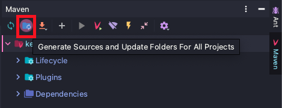

# 김영한님의 실전! Querydsl
> 아래 내용은 [실전! Querydsl](https://www.inflearn.com/course/Querydsl-실전# "실전! Querydsl") 강좌를 정리한 내용 입니다.

## 1. 프로젝트 환경설정

* (1) 프로젝트 생성하기

    * https://start.spring.io/ 에서 프로젝트를 생성한다.
    
        * 의존성 추가 : `Spring Web`, `JPA`, `H2`, `Lombok`, `Validation` (최신 버전인 경우)
        
            
        
* (2) Querydsl 설정하기

    * Gradle인 경우, `build.gradle`에 다음과 같은 Querydsl 설정을 추가한다.
    
        * Gradle 5 버전 이전
        
            ```
            plugins {
                ...
            
                // querydsl 용 플러그인 추가
                id "com.ewerk.gradle.plugins.querydsl" version "1.0.10"
            
                ...
            }
            
            ...
            
            dependencies {
                ...
            
                // querydsl 라이브러리 추가
                implementation 'com.querydsl:querydsl-jpa'
            
                ...
            }
            
            ...
            
            test {
                useJUnitPlatform()
            }
            
            // [START] querydsl 빌드 관련 설정 
            def querydslDir = "$buildDir/generated/querydsl"
            
            querydsl {
                jpa = true
                querydslSourcesDir = querydslDir
            }
            sourceSets {
                main.java.srcDir querydslDir
            }
            configurations {
                querydsl.extendsFrom compileClasspath
            }
            compileQuerydsl {
                options.annotationProcessorPath = configurations.querydsl
            }
            // [END] querydsl 빌드 관련 설정 
            ```

        * Gradle 5 버전 이상

            ```
            // 추가
            buildscript {
                ext {
                    queryDslVersion = "5.0.0"
                }
            }
            
            plugins {
                ...
                
                // 추가
                id "com.ewerk.gradle.plugins.querydsl" version "1.0.10"
                
                ...
            }
            
            ...
            
            dependencies {
                ...
                
                //querydsl 추가
                implementation "com.querydsl:querydsl-jpa:${queryDslVersion}"
                implementation "com.querydsl:querydsl-apt:${queryDslVersion}"
            
                ...
            }
            
            test {
                useJUnitPlatform()
            }
            
            // [START] querydsl 빌드 관련 설정 
            def querydslDir = "$buildDir/generated/querydsl"
            
            querydsl {
                jpa = true
                querydslSourcesDir = querydslDir
            }
            sourceSets {
                main.java.srcDir querydslDir
            }
            compileQuerydsl{
                options.annotationProcessorPath = configurations.querydsl
            }
            configurations {
                compileOnly {
                    extendsFrom annotationProcessor
                }
                querydsl.extendsFrom compileClasspath
            }
            // [END] querydsl 빌드 관련 설정 
            ```

* (3) Querydsl 설정을 검증하기

    * ① 검증용 엔티티를 작성한다.
    
        ```java
        @Entity
        @Getter @Setter
        public class Hello {
      
            @Id @GeneratedValue
            private Long id;
      
        }
        ```
      
    * ② 검증용 Q 타입을 생성한다. (인텔리제이 또는 콘솔 방식 중 한 가지를 적용하면 됨)

        * Maven
    
            * 인텔리제이(IntelliJ)에서 Q 타입 생성 방법
        
                * `Generate Sources and Update Folders For All Projects`
                
                    
                
        * Gradle
    
            * 인텔리제이(IntelliJ)에서 Q 타입 생성 방법
    
                * `Gradle` → `Tasks` → `other` → `compileQuerydsl`

                    * build 디렉토리를 삭제하고 싶다면 `Gradle` → `Tasks` → `build` → `clean`를 적용한다.
    
            * 콘솔에서 Q 타입 생성 방법
        
                * `./gradlew clean compileQuerydsl`
            
    * ③ Q 타입이 생성 되었는지 확인한다.
    
        * Maven
        
            * `target/generated-sources/java` 디렉토리를 확인한다.
    
        * Gradle
    
            * `build/generated/querydsl` 디렉토리를 확인한다.
            
                * 해당 디렉토리 안에 `QHello.java` 파일이 생성되어 있어야 한다.
    
    * ④ Querydsl이 정상적으로 동작하는지 테스트 코드를 작성해서 검증한다.
    
        ```java
        @SpringBootTest
        @Transactional
        //@Commit
        class QuerydslApplicationTests {
        
            @Autowired EntityManager em;
        
            @Test
            void contextLoads() {
                // Hello 엔티티를 저장한다.
                Hello hello = new Hello();
                em.persist(hello);
        
                // JPAQueryFactory를 생성한다.
                JPAQueryFactory query = new JPAQueryFactory(em);
                QHello qHello = QHello.hello;
                
                Hello result = query
                        .selectFrom(qHello)
                        .fetchOne();
        
                assertThat(result).isEqualTo(hello);
                assertThat(result.getId()).isEqualTo(hello.getId()); // lombok 동작 확인 (hello.getId())
        
            }
        
        }
        ```
      
        * `@Transactional`를 테스트 코드에서 사용하면 기본적으로 롤백을 한다.
    
            * `@Commit`를 추가적으로 적용하면 롤백을 하지 않는다.

    * [참고 사항] 
      
        * Q 타입은 컴파일 시점에 자동 생성되므로 Git으로 버전 관리를 하지 않는 것이 좋다.
    
            * Querydsl 설정에서 Q 타입의 생성 위치를 Gradle의 `build` 디렉토리 아래로 설정했다.
            
            * 그리고 Gradle의 `build` 디렉토리는 대부분 Git에 포함하지 않는다. 따라서 이 부분은 자연스럽게 해결된다.

* (4) H2 데이터베이스 설치하기

    * ① H2 데이터베이스 설치 파일을 다운로드 받은 다음에 설치한다.

    * ② Mac을 사용하는 경우, `chmod 755 h2.sh`로 권한을 부여해야 된다.
    
* (5) 스프링 부트 설정하기 (`application.yml`)

    ```yaml
    spring:
      datasource:
        url: jdbc:h2:tcp://localhost/~/querydsl
        username: sa
        password:
        driver-class-name: org.h2.Driver
    
      jpa:
        hibernate:
          ddl-auto: create
        properties:
          hibernate:
            #show_sql: true
            format_sql: true
    
    logging.level:
      org.hibernate.SQL: debug
    #  org.hibernate.type: trace
    ```

    * `spring.jpa.hibernate.ddl-auto: create` : 애플리케이션 실행 시점에 테이블을 drop 하고, 다시 생성한다.

    * `org.hibernate.SQL` : 로거(logger)를 통해 하이버네이트 실행 SQL을 출력한다.
    
    * 쿼리 파라미터를 로그로 출력하기

        * [첫 번째 방식] `application.yml`에 아래 옵션 추가하기
          
            * `org.hibernate.type` : SQL 실행 파라미터를 로그로 남긴다.
    
        * [두 번째 방식] 외부 라이브러리를 사용하기
          
            * `build.gradle`에 `implementation 'com.github.gavlyukovskiy:p6spy-spring-boot-starter:1.5.8'`

## 2. 예제 도메인 모델

* ① Member 엔티티를 작성한다.

    ```java
    @Entity
    @Getter @Setter
    @NoArgsConstructor(access = AccessLevel.PROTECTED)
    @ToString(of = {"id", "username", "age"})
    public class Member {
        @Id
        @GeneratedValue
        @Column(name = "member_id")
        private Long id;
        private String username;
    
        private int age;
    
        @ManyToOne(fetch = FetchType.LAZY)
        @JoinColumn(name = "team_id")
        private Team team;
    
        public Member(String username) {
            this(username, 0);
        }
    
        public Member(String username, int age) {
            this(username, age, null);
        }
    
        public Member(String username, int age, Team team) {
            this.username = username;
            this.age = age;
    
            if (team != null) {
                changeTeam(team);
            }
        }
    
        public void changeTeam(Team team) {
            this.team = team;
            team.getMembers().add(this);
        }
    }
    ```

* ② Team 엔티티를 작성한다.

    ```java
    
    @Entity
    @Getter @Setter
    @NoArgsConstructor(access = AccessLevel.PROTECTED)
    @ToString(of = {"id", "name"})
    public class Team {
        
        @Id
        @GeneratedValue
        @Column(name = "team_id")
        private Long id;
    
        private String name;
    
        @OneToMany(mappedBy = "team")
        List<Member> members = new ArrayList<>();
    
        public Team(String name) {
            this.name = name;
        }
    
    }
    ```

* ③ 테스트 코드를 작성한다.

    ```java
    @SpringBootTest
    @Transactional
    @Commit
    public class MemberTest {
        
        @PersistenceContext
        EntityManager em;
    
        @Test
        public void testEntity() {
            Team teamA = new Team("teamA");
            Team teamB = new Team("teamB");
    
            em.persist(teamA);
            em.persist(teamB);
    
            Member member1 = new Member("member1", 10, teamA);
            Member member2 = new Member("member2", 20, teamA);
            Member member3 = new Member("member3", 30, teamB);
            Member member4 = new Member("member4", 40, teamB);
    
            em.persist(member1);
            em.persist(member2);
            em.persist(member3);
            em.persist(member4);
    
            List<Member> members = em.createQuery("select m from Member m", Member.class)
                    .getResultList();
    
            for (Member member : members) {
                System.out.println("member=" + member);
                System.out.println("-> member.team=" + member.getTeam());
            }
        }
        
    }
    ```

## 3. 기본 문법

#### 1) JPQL vs Querydsl

* JPQL vs Querydsl

    * `JPQL` : 엔티티 객체를 대상으로 검색하는 객체지향 쿼리 언어다.

        * JPQL은 문자이므로 실행 시점에 오류를 발견할 수 있다.

    * `Querydsl`은 JPQL 빌더다.
    
        * Querydsl은 코드이므로 컴파일 시점에 오류를 발견할 수 있다. 
    
        * 그리고 JPQL은 파라미터 바인딩을 직접 처리해야 되지만 Querydsl은 파라미터 바인딩을 자동으로 처리해준다.

* 실습하기

    * ① 기본적인 테스트 코드를 작성한다.
    
        ```java
        @SpringBootTest
        @Transactional
        public class QuerydslBasicTest {
        
            @Autowired
            EntityManager em;
        
            @BeforeEach
            public void before(){
                Team teamA = new Team("teamA");
                Team teamB = new Team("teamB");
        
                em.persist(teamA);
                em.persist(teamB);
        
                Member member1 = new Member("member1", 10, teamA);
                Member member2 = new Member("member2", 20, teamA);
                Member member3 = new Member("member3", 30, teamB);
                Member member4 = new Member("member4", 40, teamB);
        
                em.persist(member1);
                em.persist(member2);
                em.persist(member3);
                em.persist(member4);
            }
        
        }
        ```

    * ② JPQL과 Querydsl의 차이점을 비교할 수 있는 코드를 작성한다.

        * JPQL
        
            ```java
            @Test
            public void startJPQL(){
                // member1을 찾아라.
                String qlString =
                        "select m from Member m " +
                        "where m.username = :username";
            
                Member findMember = em.createQuery(qlString, Member.class)
                        .setParameter("username", "member1")
                        .getSingleResult();
            
                assertThat(findMember.getUsername()).isEqualTo("member1");
            }
            ```
          
        * Querydsl
        
            ```java
            @Test
            public void startQuerydsl(){
                // EntityManager로 JPAQueryFactory를 생성한다.
                JPAQueryFactory queryFactory = new JPAQueryFactory(em);
            
                // 쿼리 타입(Q)을 생성한다. 생성자에는 별칭을 지정한다.
                QMember m = new QMember("m");
            
                Member findMember = queryFactory
                        .select(m)
                        .from(m)
                        .where(m.username.eq("member1")) // 파라미터 바인딩 처리
                        .fetchOne();
            
                assertThat(findMember.getUsername()).isEqualTo("member1");
            }
            ```

* Querydsl의 기본적인 사용 방법

    * ① JPAQueryFactory를 생성한다.
    
        ```java
        JPAQueryFactory queryFactory = new JPAQueryFactory(em);
        ```
      
        * JPAQueryFactory는 클래스의 필드로 선언해서 제공하더라도 동시성 문제가 없다.
    
            * 스프링 프레임워크는 여러 쓰레드에서 동시에 같은 EntityManager에 접근해도, 트랜잭션 마다 별도의 영속성 컨텍스트를 제공하기 때문에, 동시성 문제는 걱정하지 않아도 된다.
    
    * ② 쿼리 타입(Q)을 생성하면서 생성자에는 별칭을 지정한다.

        ```java
        QMember m = new QMember("m");
        // QMember qMember = QMember.member; // 기본 인스턴스를 사용하는 것도 가능
        ```

        * 생성자에 별칭을 지정하는 것은 어떤 QMember 인지 구분하는 이름을 지정하는 것과 같다.
    
        * 사실, 이미 생성된 Q 클래스의 기본 인스턴스를 사용할 것이기 때문에 이 부분은 크게 중요하지 않다.

    * ③ Querydsl를 이용해서 JPQL를 작성한다.
    
        ```java
        Member findMember = queryFactory
            .select(m)
            .from(m)
            .where(m.username.eq("member1")) 
            .fetchOne();
        ```

#### 2) 기본 Q-Type 활용

* Q 클래스 인스턴스를 사용하는 2 가지 방법

    * ① Q 클래스 인스턴스를 직접 생성해서 사용하기

        ```java
        QMember qMember = new QMember("m"); //별칭 직접 지정 
        ```

    * ② 이미 생성된 Q 클래스의 기본 인스턴스를 사용하기

        ```java
        QMember qMember = QMember.member; //기본 인스턴스 사용
        ```

* 참고사항

    * Q 클래스의 기본 인스턴스를 `static import`와 함께 사용할 수 있다.
    
        ```java
        @Test
        public void startQuerydsl(){
            Member findMember = queryFactory
                    .select(member)
                    .from(member)
                    .where(member.username.eq("member1"))
                    .fetchOne();
        
            assertThat(findMember.getUsername()).isEqualTo("member1");
        }
        ```

        * 즉, `QMember.member` 대신에 `member`로 작성할 수 있다.    

    * `Querydsl`로 작성한 코드가 실행하는 JPQL를 보고 싶다면 다음 설정을 추가하자.
       
        * `spring.jpa.properties.hibernate.use_sql_comments: true`
    
    * 같은 테이블을 조인해야 하는 경우가 아니면 기본 인스턴스를 사용하자.
    
        ```java
        QMember m1 = new QMember("m1"); // 같은 테이블을 조인해야 하는 경우가 있을 때 직접 생성함
        ```

#### 3) 검색 조건 쿼리

* 기본 검색 쿼리

    ```java
    @Test
    public void search() {
        Member findMember = queryFactory
                .selectFrom(member)
                .where(member.username.eq("member1")
                        .and(member.age.eq(10)))
                .fetchOne();
        assertThat(findMember.getUsername()).isEqualTo("member1");
    }
    ```
    
    * `select()`, `from()`은 `selectFrom()`으로 합칠 수 있다.
    
    * 검색 조건은 `.and()`, `.or()`를 메서드 체인으로 연결할 수 있다.

* JPQL이 제공하는 모든 검색 조건을 지원한다.

    ```java
    member.username.eq("member1")           // username = 'member1'
    member.username.ne("member1")           // username != 'member1'
    member.username.eq("member1").not()     // username != 'member1'
  
    member.username.isNotNull()             // 이름이 is not null
  
    member.age.in(10, 20)                   // age in (10,20)
    member.age.notIn(10, 20)                // age not in (10, 20)
    member.age.between(10, 30)              // between 10 and 30
  
    member.age.goe(30)                      // age >= 30
    member.age.gt(30)                       // age > 30
    member.age.loe(30)                      // age <= 30
    member.age.lt(30)                       // age < 30
  
    member.username.like("member%")         // like 검색 
    member.username.contains("member")      // like '%member%' 검색 
    member.username.startsWith("member")    // like 'member%' 검색
    ```
  
    * **eq** (`=`) : equals
    
    * **ne** (`!=`) : not equal to
    
    * **gt** (`>`) : greater than
    
    * **goe** (`>=`) : greater than or equal to
    
    * **lt** (`<`) : less than
    
    * **loe** (`<=`) : less than or equal to

* AND 조건을 처리하기

    * `and()`를 사용하기
            
        ```java
        @Test
        public void search(){
            Member findMember = queryFactory
                    .selectFrom(member)
                    .where(member.username.eq("member1")
                            .and(member.age.eq(10)))
                    .fetchOne();
        
            assertThat(findMember.getUsername()).isEqualTo("member1");
        }
        ```

    * AND 조건을 파라미터로 처리하기
        
        * `where()`에 검색 조건을 `,`로 구분해서 전달하면 AND 조건으로 추가된다.
    
            ```java
            @Test
            public void searchAndParam(){
                Member findMember = queryFactory
                        .selectFrom(member)
                        .where(member.username.eq("member1"),
                               member.age.eq(10))
                        .fetchOne();
            
                assertThat(findMember.getUsername()).isEqualTo("member1");
            }
            ```

        * 이 방식은 null 값을 무시한다.

            ```java
            queryFactory
                .selectFrom(member)
                .where(member.username.eq("member1"),
                       member.age.eq(10), 
                       null) // null 무시
                //...
            ```

            * 메서드 추출을 활용해서 동적 쿼리를 깔끔하게 만들 수 있다.
    
#### 4) 결과 조회

* 문법

    * `fetch()` : 리스트로 조회한다. 
      
        * 조회 결과가 없으면 비어있는 리스트를 반환한다. 
    
    * `fetchOne()` : 1 건을 조회한다.
    
        * 조회 결과가 없으면 `null`을 반환한다.
        
        * 조회 결과가 둘 이상이면 `com.querydsl.core.NonUniqueResultException` 예외가 발생한다.
        
    * `fetchFirst()` : 처음 1 건만 조회한다.
    
        * 내부 코드가 `limit(1).fetchOne()`으로 되어 있음.
        
    * `fetchResults()` : 추가 total count 쿼리를 호출하는 페이징 결과를 조회한다.
      
        * total count 쿼리를 추가적으로 실행한다. 
    
    * `fetchCount()` : (select 절을 count 쿼리로 변경해서) count 수만 조회한다.

* 예시

    ```java
    @Test
    public void resultFetch(){
        // List
        List<Member> fetch = queryFactory
                .selectFrom(member)
                .fetch();
    
        // 단 건 - 결과가 둘 이상이므로 예외가 발생함. 주석 처리하고 실행하자.
        //Member findMember1 = queryFactory
        //        .selectFrom(member)
        //        .fetchOne();
    
        // 처음 한 건 조회
        Member findMember2 = queryFactory
                .selectFrom(member)
                .fetchFirst();
    
        // 페이징에서 사용
        QueryResults<Member> results = queryFactory
                .selectFrom(member)
                .fetchResults();
    
        // count 쿼리로 변경
        long count = queryFactory
                .selectFrom(member)
                .fetchCount();
    
    }
    ```
  
#### 5) 정렬

* 정렬은 `orderBy()`를 사용한다. 
  
* `orderBy()`의 파라미터로 정렬 조건을 `,`로 구분해서 전달하면 된다.

    ```java
    /*
    * 회원 정렬 순서
    * ① 회원 나이 내림차순(DESC)
    * ② 회원 이름 오름차순(ASC)
    *    단, ②에서 회원 이름이 없으면 마지막에 출력한다. (nulls last)
    * */
  
    List<Member> result = queryFactory
            .selectFrom(member)
            .where(member.age.eq(100))
            .orderBy(member.age.desc(), member.username.asc().nullsLast())
            .fetch();
    ```

    * `asc()` : 오름차순으로 정렬한다.
      
    * `desc()` : 내림차순으로 정렬한다. 
    
    * `nullsFirst()` : null 데이터가 먼저 나오도록 한다.
    
    * `nullsLast()` : null 데이터가 마지막에 나오도록 한다.

#### 6) 페이징

* 페이징은 `offset()`과 `limit()`을 사용한다.

    * `offset()` : 조회 시작 위치를 지정한다. (0 부터 시작)
    
    * `limit()` : 조회할 데이터 수를 지정한다.
    
* 예시

    * 기본적인 사용 방법은 다음과 같다.

        ```java
        @Test
        public void paging1(){
            List<Member> result = queryFactory.selectFrom(member)
                    .orderBy(member.username.desc())
                    .offset(1)
                    .limit(2)
                    .fetch();
        
            assertThat(result.size()).isEqualTo(2);
        }
        ```
      
    * 전체 데이터 수가 필요하면 `fetchResults()`를 활용한다.

        ```java
        @Test
        public void paging2(){
            // count 쿼리를 실행한 다음, 컨텐츠를 조회하기 위한 쿼리가 실행된다.
            QueryResults<Member> queryResults = queryFactory.selectFrom(member)
                    .orderBy(member.username.desc())
                    .offset(1)
                    .limit(2)
                    .fetchResults();
        
            assertThat(queryResults.getTotal()).isEqualTo(4);
            assertThat(queryResults.getLimit()).isEqualTo(2);
            assertThat(queryResults.getOffset()).isEqualTo(1);
            assertThat(queryResults.getResults().size()).isEqualTo(2);
        }
        ```
      
        * count 쿼리가 실행되기 때문에 성능 상 주의가 필요하다.
        
        * count 쿼리에 조인이 필요없는 성능 최적화가 필요하다면, count 전용 쿼리를 별도로 작성해야 한다.

#### 7) 집합

* 집계 함수

    * 집계 함수는 집합 안에 NULL 값이 있다면 이를 제외하고 처리한다.
      
        * 단, `COUNT(*)`는 모든 컬럼의 행수를 카운트하기 때문에 NULL 값이 있어도 무시되지 않는다.
        
    * 집계 함수의 종류

        * `count()` : 행의 개수를 구한다.
        
        * `sum()` : 합계를 구한다.
        
        * `avg()` : 평균을 구한다.
        
        * `max()` : 최대 값을 구한다.
        
        * `min()` : 최소 값을 구한다.
    
    * 예시

        ```java
        @Test
        public void aggregation(){
            List<Tuple> result = queryFactory
                    .select(member.count(), // 회원 수
                            member.age.sum(), // 나이 합계 
                            member.age.avg(), // 평균 나이
                            member.age.max(), // 최대 나이
                            member.age.min()) // 최소 나이
                    .from(member)
                    .fetch();
        
            Tuple tuple = result.get(0);
            assertThat(tuple.get(member.count())).isEqualTo(4);
            assertThat(tuple.get(member.age.sum())).isEqualTo(100);
            assertThat(tuple.get(member.age.avg())).isEqualTo(25);
            assertThat(tuple.get(member.age.max())).isEqualTo(40);
            assertThat(tuple.get(member.age.min())).isEqualTo(10);
        
        }
        ```
      
* GROUP BY, HAVING

    * `groupBy()` : 지정한 컬럼 값이 같은 행을 하나의 그룹으로 묶는다.

        ```java
        /*
        * 팀의 이름과 각 팀의 평균 연령을 구해라.
        * */
        @Test
        public void group() throws Exception {
            List<Tuple> result = queryFactory
                    .select(team.name, member.age.avg())
                    .from(member)
                    .join(member.team, team)
                    .groupBy(team.name)
                    .fetch();
        
            Tuple teamA = result.get(0);
            Tuple teamB = result.get(1);
            
            assertThat(teamA.get(team.name)).isEqualTo("teamA");
            assertThat(teamA.get(member.age.avg())).isEqualTo(15); // (10 + 20) / 2
        
            assertThat(teamB.get(team.name)).isEqualTo("teamB");
            assertThat(teamB.get(member.age.avg())).isEqualTo(35); // (30 + 40) / 2
        }
        ```

    * `having()` : 그룹화된 결과에 대한 조건을 지정한다.
    
        ```java
        .groupBy(item.price)
        .having(item.price.gt(1000))
        ```

* 참고 사항
  
    * Live Templates 기능
    
        * ① `[IntelliJ IDEA]` - `[Preferences]`를 클릭한다.
        
        * ② `live template`으로 검색한다.
        
        * ③ `+` 버튼을 클릭한 다음, `Template Group...`으로 그룹을 생성한다.
        
        * ④ 다시 `+` 버튼을 클릭한 다음, `Live Template`으로 다음과 같은 라이브 템플릿을 작성한다.
        
            ```java
            @Test
            public void $NAME$() throws Exception {
                //given
                $END$
                //when
                
                //then
            }
            ```
          
            * `Define`를 클릭하여 `Java`를 체크한다.
            
            * `Use static import if possible` , `Shorten FQ names`를 체크한다.

#### 8) 조인(Join) - 기본 조인

* 기본 조인

    * 문법

        ```java
        join(조인 대상, 별칭으로 사용할 Q 타입)
        ```

        * `첫 번째 파라미터` : 조인 대상을 지정한다.
        
        * `두 번째 파라미터` : 별칭(alias)으로 사용할 Q 타입을 지정한다.

    * 종류
    
        * `join()` , `innerJoin()` : 내부 조인(inner join)을 한다.
        
        * `leftJoin()` : 왼쪽 외부 조인(left outer join)을 한다. 
        
        * `rightJoin()` : 오른쪽 외부 조인(right outer join)을 한다.

    * 예시
    
        ```java
        /**
         * 팀A에 소속된 모든 회원를 찾아라
         */
        @Test
        public void join() {
            /*
            * member는 QMember.member와 같다.
            * team는 QTeam.team와 같다.
            * */
        
            List<Member> result = queryFactory
                    .selectFrom(member)
                    .join(member.team, team)
                    .where(team.name.eq("teamA"))
                    .fetch();
        
            assertThat(result)
                    .extracting("username")
                    .containsExactly("member1", "member2");
        }
        ```
      
* `크로스 조인(CROSS JOIN)`
  
    * CROSS JOIN는 한쪽 테이블의 모든 행과 다른 쪽 테이블의 모든 행을 결합하는 것을 말한다.
      
        * 연관관계가 없는 필드로 크로스 조인을 할 수 있다.

    * 예시

        ```java
        @Test
        public void theta_join(){
            em.persist(new Member("teamA"));
            em.persist(new Member("teamB"));
            
            /*
            * MEMBER 테이블과 TEAM 테이블의 모든 행을 조인한 결과를 WHERE 절로 걸러낸다.
            * 이 과정에서 DB가 성능 최적화를 함
            * */
            List<Member> result = queryFactory
                    .select(member)
                    .from(member, team)
                    .where(member.username.eq(team.name))
                    .fetch();
        
            assertThat(result)
                    .extracting("username")
                    .containsExactly("teamA", "teamB");
        
            assertThat(result)
                    .extracting("username")
                    .containsExactly("teamA", "teamB");
        }
        ```
      
        * from 절에 여러 엔티티를 선택해서 크로스 조인을 한다.
      
        * 이 방식은 외부 조인(outer join)이 불가능하다.
    
#### 9) 조인(Join) - ON 절

* ON 절을 활용한 조인 (JPA 2.1 부터 지원)

    * ① 조인 대상을 필터링하기
      
    * ② 연관관계가 없는 엔티티를 외부 조인하기

* 예시

    * ① 조인 대상을 필터링하기
    
        ```java
        /*
        * 회원과 팀을 조인하면서, 팀 이름이 teamA인 팀만 조인하고 회원은 모두 조회한다.
        * JPQL : select m, t from Member m left join m.team t on t.name = 'teamA'
        * */
        @Test
        public void join_on_filtering(){
            List<Tuple> result = queryFactory
                    .select(member, team)
                    .from(member)
                    .leftJoin(member.team, team)
                    .on(team.name.eq("teamA"))
                    .fetch();
        
            for (Tuple tuple : result) {
                System.out.println("tuple = " + tuple);
            }
        }
        ```
      
        * on 절을 활용한 조인 대상을 필터링 할 때, `leftJoin()`이 아닌 `join()`를 사용하면, where 절에서 필터링하는 것과 동일하다. 
        
        * 따라서 내부조인이면 익숙한 where 절로 해결하고 외부 조인이 필요한 경우에 이 기능을 사용하자.
        
    * ② 연관관계가 없는 엔티티를 외부 조인하기
    
        ```java
        /*
         * 연관관계가 없는 엔티티를 외부 조인
         * 회원 이름이 팀 이름과 같은 대상을 외부 조인해라.
         * */
        @Test
        public void join_one_no_relation(){
            em.persist(new Member("teamA"));
            em.persist(new Member("teamB"));
        
            List<Tuple> result = queryFactory
                    .select(member, team)
                    .from(member)
                    .leftJoin(team).on(member.username.eq(team.name))
                    .fetch();
        
            for (Tuple tuple : result) {
                System.out.println("tuple = " + tuple);
            }
        }
        ```

        * 하이버네이트 5.1 부터 on를 사용해서 서로 관계가 없는 필드로 내부(외부) 조인이 가능하다.      

        * 일반 조인과 on 조인 차이
        
            * `일반 조인` : `leftJoin(member.team, team)`
            
            * `on 조인` : `from(member).leftJoin(team).on(xxx)`

#### 10) 조인(Join) - 페치 조인

* 페치 조인(fetch join)은 연관된 엔티티나 컬렉션을 SQL 한 번에 함께 조회하는 기능이다.

    * SQL에서 제공하는 기능이 아니다.

    * 주로 성능 최적화에 사용한다.
    
* 예시
    
    * (1) 페치 조인 미적용
    
        ```java
        @PersistenceUnit
        EntityManagerFactory emf;
        
        @Test
        public void fetchJoinNo() {
            em.flush();
            em.clear();
        
            Member findMember = queryFactory
                    .selectFrom(member)
                    .where(member.username.eq("member1"))
                    .fetchOne();
        
            boolean loaded = emf.getPersistenceUnitUtil().isLoaded(findMember.getTeam());
            assertThat(loaded).as("페치 조인 미적용").isFalse(); // 지연 로딩이므로 false가 맞다.
        }
        ```
    
    * (2) 페치 조인 적용
    
        * `fetchJoin()` : fetch join을 한다. 
          
            * 조인 기능 (`join()`, `leftJoin()` 등) 뒤에 `fetchJoin()`를 추가한다.
    
                ```java
                @Test
                public void fetchJoinUse(){
                    em.flush();
                    em.clear();
                
                    Member findMember = queryFactory
                            .selectFrom(member)
                            .join(member.team, team)
                            .fetchJoin()
                            .where(member.username.eq("member1"))
                            .fetchOne();
                
                    boolean loaded = emf.getPersistenceUnitUtil().isLoaded(findMember.getTeam());
                    assertThat(loaded).as("페치 조인 적용").isTrue(); // 페치 조인으로 인한 즉시 로딩을 하므로 true가 맞다.
                }
                ```
        
                * Member, Team를 SQL 한 번에 함께 조인으로 조회한다.

#### 11) 서브쿼리

* `JPAExpressions` : 서브쿼리를 만들 때 사용한다.
  
    * `com.querydsl.jpa.JPAExpressions`

* 예시

    * (1) WHERE 절에 서브쿼리 사용하기
      
        * 서브쿼리 eq 사용
    
            ```java
            /*
            * 나이가 가장 많은 회원을 조회한다.
            * */
            @Test
            public void subQuery(){
                // 메인 쿼리와 서브 쿼리에서 사용하는 테이블의 별칭이 중복되면 안 된다. 따라서 별칭을 직접 지정해서 Q 인스턴스를 만든다. 
                QMember memberSub = new QMember("memberSub");
            
                List<Member> result = queryFactory
                        .selectFrom(member)
                        .where(member.age.eq(
                                JPAExpressions
                                        .select(memberSub.age.max())
                                        .from(memberSub) // 회원의 나이가 가장 많은 사람
                        ))
                        .fetch();
            
                assertThat(result).extracting("age")
                        .containsExactly(40);
            }
            ```
    
        * 서브쿼리 goe 사용
        
            ```java
            /*
             * 나이가 평균 나이 이상인 회원 조회
             * */
            @Test
            public void subQueryGoe() {
                QMember memberSub = new QMember("memberSub");
            
                List<Member> result = queryFactory
                        .selectFrom(member)
                        .where(member.age.goe(
                                JPAExpressions
                                        .select(memberSub.age.avg())
                                        .from(memberSub)
                        )).fetch();
            
                assertThat(result).extracting("age")
                        .containsExactly(30, 40);
            }
            ```
    
        * 서브쿼리 in 사용
    
            ```java
            @Test
            public void subQueryIn(){
            
                QMember memberSub = new QMember("memberSub");
            
                List<Member> result = queryFactory
                        .selectFrom(member)
                        .where(member.age.in(
                                JPAExpressions
                                        .select(memberSub.age)
                                        .from(memberSub)
                                        .where(memberSub.age.gt(10))
                        ))
                        .fetch();
            
                assertThat(result).extracting("age")
                        .containsExactly(20, 30, 40);
            }
            ```
      
    * (2) select 절에 서브쿼리 사용하기

        ```java
        @Test
        public void selectSubQuery(){
        
            QMember memberSub = new QMember("memberSub");
        
            List<Tuple> result = queryFactory
                    .select(member.username,
                            JPAExpressions
                                    .select(memberSub.age.avg())
                                    .from(memberSub))
                    .from(member)
                    .fetch();
        
            for (Tuple tuple : result) {
                System.out.println("tuple = " + tuple);
            }
        
        }
        ```

        * `JPAExpressions` 도 static import 문을 사용할 수 있다.
    
            * Ex) `JPAExpressions.select()` -> `select()`
    
* from 절의 서브쿼리 한계점과 해결방안

    * (1) 한계점

        * JPA의 JPQL는 from 절의 서브쿼리(인라인 뷰)를 지원하지 않는다.

            * 따라서 Querydsl도 지원하지 않는다. 
              
                * 사실, JPA의 표준 스펙에서는 select 절에서 서브쿼리를 사용할 수 없다.

            * 하이버네이트 구현체를 사용하면 select 절의 서브쿼리를 지원한다.

    * (2) 해결방안

        * ① 서브쿼리를 join으로 변경한다.
          
            * 가능한 상황도 있고, 불가능한 상황도 있다.

        * ② 애플리케이션에서 쿼리를 2번 분리해서 실행한다.

        * ③ 네이티브 쿼리를 사용한다.

#### 12) case 문

* case 문은 select, where, order by 절에서 사용 가능하다.

    * 단순 CASE 식

        ```java
        @Test
        public void basicCase(){
            List<String> result = queryFactory
                    .select(member.age
                            .when(10).then("열살")
                            .when(20).then("스무살")
                            .otherwise("기타"))
                    .from(member)
                    .fetch();
        
            for (String s : result) {
                System.out.println("s = " + s);
            }
        }
        ```
      
    * 기본 CASE 식

        ```java
        @Test
        public void complexCase(){
            List<String> result = queryFactory
                    .select(new CaseBuilder()
                            .when(member.age.between(0, 20)).then("0~20살")
                            .when(member.age.between(21, 30)).then("21~30살")
                            .otherwise("기타"))
                    .from(member)
                    .fetch();
        
            for (String s : result) {
                System.out.println("s = " + s);
            }
        }
        ```

        * DB에서 계산하는 작업이 정말 필요할까? 라는 고민이 필요하다.
        
        * 물론 필요한 경우도 있을 것이다. **가급적 DB는 데이터를 필터링 또는 그룹핑하고 계산하는 작업을 최소한으로만 하고 나머지는 애플리케이션에서 처리해야 한다.**
        
        * 예를 들어, 이번 예제의 경우에서는 DB가 아닌 애플리케이션에서 처리하는 것이 맞다.

    * orderBy에서 case 문을 함께 사용하기

        ```java
        NumberExpression<Integer> rankPath = new CaseBuilder()
                .when(member.age.between(0, 20)).then(2) // 0 ~ 20살 회원을 두 번째 출력
                .when(member.age.between(21, 30)).then(1) // 21 ~ 30살 회원을 세 번째 출력
                .otherwise(3); // 0 ~ 30살이 아닌 회원을 첫 번째 출력
        
        List<Tuple> result = queryFactory
                .select(member.username, member.age, rankPath)
                .from(member)
                .orderBy(rankPath.desc())
                .fetch();
        ```
      
        * Querydsl은 자바 코드로 작성하기 때문에 `rankPath`처럼 복잡한 조건을 변수로 선언해서 select, orderBy 절에서 사용할 수 있다.
                
#### 13) 상수, 문자 더하기

* 상수
  
    * `Expressions.constant()` : select 절에서 상수를 지정할 때 사용한다.
    
        ```java
        @Test
        public void constant(){
            List<Tuple> result = queryFactory
                    .select(member.username, Expressions.constant("A"))
                    .from(member)
                    .fetch();
        
            for (Tuple tuple : result) {
                System.out.println("tuple = " + tuple);
            }
        
        }
        ```

* 문자 더하기

    ```java
    @Test
    public void concat(){
        List<String> result = queryFactory
                .select(member.username.concat("_").concat(member.age.stringValue()))
                .from(member)
                .where(member.username.eq("member1"))
                .fetch();
    
        for (String s : result) {
            System.out.println("s = " + s);
        }
    }
    ```
  
    * 설명
      
        * 위의 예시에서 `member.username`는 문자 타입이지만 `member.age`는 숫자 타입이다. 
          
        * 따라서 `concat()`을 하려면 `member.age`를 문자 타입으로 변환해야 한다.  

    * `stringValue()` : 문자가 아닌 다른 타입들을 문자로 변환한다. 
    
        * 이 방법은 ENUM을 처리할 때도 자주 사용한다.

## 4. 중급 문법

#### 1) 프로젝션과 결과 반환 - 기본

* `프로젝션 (projection)` : select 대상을 지정하는 것을 말한다.

    * 프로젝션 대상이 하나면 타입을 명확하게 지정할 수 있다.
    
        * Ex) `List<String>` , `List<Member>`
    
    * 프로젝션 대상이 둘 이상이면 튜플이나 DTO로 조회한다.

* 예시
  
    * 프로젝션 대상이 하나
    
        ```java
        List<String> result = queryFactory
                .select(member.username)
                .from(member)
                .fetch();
        ```
    
    * 프로젝션 대상이 둘 이상
      
        * 튜플 조회
        
            ```java
            List<Tuple> result = queryFactory
                    .select(member.username, member.age)
                    .from(member)
                    .fetch();
            ```
          
            * Tuple는 리포지토리 계층에서 사용하는 것은 괜찮으나 다른 계층(서비스, 컨트롤러)에서 사용하는 것은 좋은 설계가 아니라고 생각한다. (by 강사님) 
          
        * DTO 조회
    
            * 다음 강좌에서 DTO로 바로 조회하는 방법을 학습한다. (자주 사용되며 중요하다.)

#### 2) 프로젝션과 결과 반환 - DTO 조회

* 순수 JPA에서 DTO 조회

    * ① DTO를 작성한다.
    
        ```java
        @Data
        @NoArgsConstructor
        public class MemberDto {
        
            private String username;
        
            private int age;
        
            public MemberDto(String username, int age) {
                this.username = username;
                this.age = age;
            }
        
        }
        ```

    * ② 바로 DTO로 조회한다.

        ```java
        @Test
        public void findDtoByJPQL() {
            List<MemberDto> result = em.createQuery("select new study.querydsl.dto.MemberDto(m.username, m.age) from Member m", MemberDto.class)
                    .getResultList();
        
            for (MemberDto memberDto : result) {
                System.out.println("memberDto = " + memberDto);
            }
        }
        ```

        * 순수 JPA에서 DTO로 조회할 때는 new 명령어를 사용해야 한다.

        * DTO의 패키지명을 모두 기술해야 하므로 지저분해진다. 
          
        * 생성자 방식만 지원한다.

* Querydsl에서 DTO 조회

    * Querydsl 빈 생성 (Bean population)이라고 하며 결과를 DTO로 반환할 때 사용한다.
    
        * ① DTO를 작성한다.
    
            * 앞서 작성한 DTO를 사용하자.

        * ② 다음 4 가지 방법 중 하나를 이용해서 바로 DTO로 조회한다.
    
            * `프로퍼티 접근` : Setter를 이용하여 지정하는 방식이다.

                * `Projections.bean()`를 사용한다.

                    ```java
                    List<MemberDto> result = queryFactory
                            .select(Projections.bean(MemberDto.class,
                                    member.username,
                                    member.age))
                            .from(member)
                            .fetch();
                    ```
                  
                    * 이 방식은 DTO에 기본 생성자가 필요하다.
    
            * `필드 직접 접근` : (Setter 없이) 필드에 직접 접근하여 지정하는 방식이다.

                * `Projections.fields()`를 사용한다.
            
                    ```java
                    List<MemberDto> result = queryFactory
                            .select(Projections.fields(MemberDto.class,
                                    member.username,
                                    member.age))
                            .from(member)
                            .fetch();
                    ```

                    * 이 방식은 DTO에 기본 생성자가 필요하다.
            
            * `생성자 사용` : 생성자를 사용해서 지정하는 방식이다.

                * `Projections.constructor()`를 사용한다.            

                    ```java
                    List<MemberDto> result = queryFactory
                            .select(Projections.constructor(MemberDto.class,
                                    member.username,
                                    member.age))
                            .from(member)
                            .fetch();
                    ```

                    * 지정한 값과 동일한 매개변수 타입을 가지는 생성자가 존재해야 한다. 
    
                        * 즉, 생성자 사용 방식은 이름이 아닌 타입이 일치하면 된다.
    
            * `@QueryProjection` 사용하기
    
                * 다음 강좌에서 학습한다.
    
    * 프로퍼티 또는 필드 접근 방식에서 DTO와 엔티티의 필드명이 다른 경우에 대한 해결 방법

        * ① 새로운 DTO를 작성한다.

            ```java
            @Data
            @NoArgsConstructor
            public class UserDto {
                
                private String name;
                
                private int age;
                
            }
            ```
    
        * ② 별칭을 지정한다.
             
            ```java
            QMember memberSub = new QMember("memberSub");
            
            List<UserDto> result = queryFactory
                    .select(Projections.fields(UserDto.class,
                            member.username.as("name"),
                            ExpressionUtils.as(JPAExpressions
                                    .select(memberSub.age.max())
                                    .from(memberSub), "age")
                    ))
                    .from(member)
                    .fetch();
            ```

            * DTO (`UserDto`)의 필드명은 name 인데 엔티티 (`Member`)의 필드명은 username 이므로 맞지 않다.
    
            * 이러한 경우에 다음과 같은 메소드를 사용해서 별칭을 지정하면 된다.

                * `as()` : 특정 필드에 별칭을 지정한다.          
    
                    * Ex) `username.as("name")` : username 필드에 name이라는 별칭을 지정한다.
                
                * `ExpressionUtils.as(source, alias)` : 필드 또는 서브쿼리의 결과에 별칭을 지정한다. 

#### 3) 프로젝션과 결과 반환 - @QueryProjection 및 distinct

* `@QueryProjection` : DTO용 Query Type을 생성하는 방식이다.

    * 특징
    
        * 가장 권장하는 DTO 조회 방식이다.
          
        * IDE에서 자동 완성 기능을 지원한다.
    
        * 컴파일 시점에 타입을 체크해서 오류를 발견할 수 있다.
    
            * `Projections.constructor()`는 런타임 시점이 되서야 오류를 발견할 수 있다는 단점이 있다.
    
        * DTO 용 Query Type을 생성해야 된다는 단점이 있다. 
    
        * DTO가 QueryDSL에 의존성을 가지는 단점이 있다.
  
    * 사용 방법

        * ① DTO의 생성자에 `@QueryProjection`를 붙인다.
                    
            ```java
            @Data
            @NoArgsConstructor
            public class MemberDto {
            
                private String username;
            
                private int age;
                
                @QueryProjection
                public MemberDto(String username, int age) {
                    this.username = username;
                    this.age = age;
                }
            
            }
            ```
          
        * ② `Gradle`의 `compileQuerydsl`를 클릭한다. 
          
            * 컴파일을 함으로써 Query Type (`QMemberDto`)를 생성한다.
    
        * ③ 바로 DTO로 조회한다.
        
            ```java
            List<MemberDto> result = queryFactory
                    .select(new QMemberDto(member.username, member.age))
                    .from(member)
                    .fetch();
            ```
    
* `distinct()` : SQL에 DISTINCT를 추가하고 애플리케이션에서 같은 식별자를 가지는 엔티티의 중복을 제거한다.
    
    ```java
    List<String> result = queryFactory
            .select(member.username).distinct()
            .from(member)
            .fetch();
    ```

    * JPQL의 distinct와 같다.
      
#### 4) 동적 쿼리

* 동적 쿼리를 해결하는 두 가지 방식

    * (1) BooleanBuilder

        * `BooleanBuilder` : where 절의 조건문을 작성할 때 사용한다.    

            * 특징

                * `BooleanBuilder`에 초기 값을 지정할 수도 있다.

                    * Ex) `BooleanBuilder builder = new BooleanBuilder(member.username.eq(usernameCond));`

                * `BooleanBuilder`에 AND 또는 OR 조건을 이어 붙일 수 있다.
            
                * 해당 방식은 WHERE 절의 조건을 한눈에 알아보기 어렵다는 단점이 있다.
    
            * 예시
        
                ```java
                @Test
                public void dynamicQuery_BooleanBuilder() {
                    /*
                    * 파라미터의 값을 변경할 때 마다 실행되는 JPQL이 달라지는 것을 확인할 수 있다.
                    * */
                    String usernameParam = "member1";
                    Integer ageParam = 10;
                
                    List<Member> result = searchMember1(usernameParam, ageParam);
                    assertThat(result.size()).isEqualTo(1);
                }
                
                private List<Member> searchMember1(String usernameCond, Integer ageCond) {
                    // ① 먼저 BooleanBuilder를 만든다.
                    BooleanBuilder builder = new BooleanBuilder();
                
                    // ② usernameCond이 null이 아니면 BooleanBuilder에 AND 조건을 이어 붙인다.
                    if (usernameCond != null) {
                        builder.and(member.username.eq(usernameCond));
                    }
                
                    if (ageCond != null) {
                        builder.and(member.age.eq(ageCond));
                    }
                
                    // ③ where 절에 BooleanBuilder를 지정한다.
                    return queryFactory
                            .selectFrom(member)
                            .where(builder)
                            .fetch();
                }
                ```
         
    * (2) BooleanExpression

        * `BooleanExpression` : where 절의 조건문을 작성할 때 사용한다.    

            * 특징
    
                * `BooleanExpression` 타입을 리턴하는 메소드를 만든 다음에 where 절의 조건으로 추가한다.

                    * `BooleanExpression`는 `where()`의 파라미터로 전달할 수 있으며 `,`를 and 조건으로 사용한다.

                * Querydsl의 `where()`는 파라미터로 `null`을 전달 받으면 무시한다. 
                  
                    * 즉, 조건문에 추가하지 않는다.

                * `BooleanExpression` 타입을 리턴하는 메소드는 다른 쿼리에서도 재활용 할 수 있으며 쿼리 자체의 가독성이 높아진다.

                * `BooleanExpression`를 사용하는 것을 권장하며 해당 방식을 사용 할 수 없는 경우에는 `BooleanBuilder`를 사용한다.

            * 예시
    
                * 기본적인 사용 방법
               
                    ```java
                    @Test
                    public void dynamicQuery_WhereParam() {
                        /*
                         * 파라미터의 값을 변경할 때 마다 실행되는 JPQL이 달라지는 것을 확인할 수 있다.
                         * */
                        String usernameParam = "member1";
                        Integer ageParam = 10; // null
                    
                        List<Member> result = searchMember2(usernameParam, ageParam);
                        assertThat(result.size()).isEqualTo(1);
                    }
                    
                    private List<Member> searchMember2(String usernameCond, Integer ageCond) {
                        return queryFactory
                                .selectFrom(member)
                                .where(usernameEq(usernameCond), ageEq(ageCond))
                                .fetch();
                    }
                    
                    private BooleanExpression usernameEq(String usernameCond) {
                        return usernameCond != null ? member.username.eq(usernameCond) : null;
                    }
                    
                    private BooleanExpression ageEq(Integer ageCond) {
                        return ageCond != null ? member.age.eq(ageCond) : null;
                    }
                    ```
    
                * `BooleanExpression`는 여러 가지 조건을 조합할 수 있다.
                       
                    ```java
                    private BooleanExpression allEq(String usernameCond, Integer ageCond){
                        return usernameEq(usernameCond).and(ageEq(ageCond));
                    }
                    ```
                  
                    * `null` 체크는 주의해서 처리해야 한다.
            
#### 5) 수정, 삭제 - 벌크 연산

* 수정(update)

    * 쿼리 한번에 여러 데이터를 수정하기

        ```java
        @Test
        //@Commit
        public void bulkUpdate() {
            /*
            * member1 = 10 -> 비회원
            * member2 = 20 -> 비회원
            * member3 = 30 -> 변경 X (member3)
            * member4 = 40 -> 변경 X (member4)
            * */
        
            long count = queryFactory
                    .update(member)
                    .set(member.username, "비회원")
                    .where(member.age.lt(28))
                    .execute();
        }
        ```
      
        * `execute()`는 UPDATE를 했을 때, 영향을 받은 행(Row) 수를 반환한다.
    
        * `@Commit`를 메소드 레벨에 적용해서 해당 메소드만 커밋 되도록 할 수 있다.
      
    * 기존 값에 특정 숫자 만큼 더하기

        ```java
        @Test
        public void bulkAdd() {
            long count = queryFactory
                    .update(member)
                    .set(member.age, member.age.add(1))
                    .where(member.age.lt(28))
                    .execute();
        }
        ```
      
        * `add()` : 더하기
        
        * `subtract()` : 빼기
        
        * `multiply()` : 곱하기
    
        * `divide()` : 나누기
    
        * `mod()` : 나머지 연산
    
* 삭제(delete)

    * 쿼리 한번에 여러 데이터를 삭제하기
    
        ```java
        @Test
        public void bulkDelete() {
            // 나이가 18살 보다 많은 회원을 삭제하라.
            long count = queryFactory
                    .delete(member)
                    .where(member.age.gt(18))
                    .execute();
        }
        ```

* 벌크 연산 시, 주의사항    

    * 벌크 연산은 영속성 컨텍스트를 무시하고 실행되기 때문에 벌크 연산을 실행하고 나면 영속성 컨텍스트를 초기화하는 것이 안전하다.
    
        ```java
        em.flush();
        em.clear();
        ```
            
        * 영속성 컨텍스트와 DB의 내용이 달라지는 것을 방지하기 위해서 이러한 코드를 적용한다.
    
#### 6) SQL function 호출하기

* Dialect에 등록된 SQL function만 호출할 수 있다.

    * 회원 이름에서 member라는 단어를 M으로 변경하기 위해 replace 함수를 사용한다.
    
        ```java
        @Test
        public void sqlFunction() {
            List<String> result = queryFactory
                    .select(Expressions.stringTemplate(
                            "function('replace', {0}, {1}, {2})",
                            member.username, "member", "m"))
                    .from(member)
                    .fetch();
        
            for (String s : result) {
                System.out.println("s = " + s);
            }
        }
        ```
      
        * `Expressions.stringTemplate("function('함수명', {0}, {1}, ...)", 인자1, 인자2, ...)`처럼 호출하고자 하는 SQL 함수를 작성한다.
    
    * 회원 이름을 소문자로 변경하기 위해 lower 함수를 사용한다.
    
        ```java
        @Test
        public void sqlFunction2() {
            List<String> result = queryFactory
                    .select(member.username)
                    .from(member)
                    .where(member.username.eq(
                            Expressions.stringTemplate("function('lower', {0})", member.username)))
                    .fetch();
        
            for (String s : result) {
                System.out.println("s = " + s);
            }
        }
        ```

* Querydsl는 `lower()`과 같은 ANSI 표준 함수들을 내장하고 있다. 
  
    * 따라서 다음과 같이 처리할 수도 있다.

        ```java
        List<String> result = queryFactory
                .select(member.username)
                .from(member)
                .where(member.username.eq(member.username.lower()))
                .fetch();
        ```
  
## 5. 실무 활용 - 순수 JPA와 Querydsl

#### 1) 순수 JPA 리포지토리와 Querydsl

* (1) 순수 JPA 리포지토리

    * 순수 JPA 리포지토리를 작성한다.

        ```java
        @Repository
        public class MemberJpaRepository {
            
            private final EntityManager em;
        
            private final JPAQueryFactory queryFactory;
        
            public MemberJpaRepository(EntityManager em) {
                this.em = em;
                this.queryFactory = new JPAQueryFactory(em);
            }
        
            public void save(Member member) {
                em.persist(member);
            }
        
            public Optional<Member> findById(Long id) {
                Member findMember = em.find(Member.class, id);
                return Optional.ofNullable(findMember);
            }
        
            public List<Member> findAll() {
                return em.createQuery("select m from Member m", Member.class)
                        .getResultList();
            }
        
            public List<Member> findByUsername(String username) {
                return em.createQuery("select m from Member m where m.username = :username", Member.class)
                        .setParameter("username", username)
                        .getResultList();
            }
            
        }
        ```

    * 테스트 코드를 작성한다.
    
        ```java
        @SpringBootTest
        @Transactional
        class MemberJpaRepositoryTest {
        
            @Autowired
            EntityManager em;
        
            @Autowired MemberJpaRepository memberJpaRepository;
        
            @Test
            public void basicTest() {
                Member member = new Member("member1", 10);
                memberJpaRepository.save(member);
        
                Member findMember = memberJpaRepository.findById(member.getId()).get();
                assertThat(findMember).isEqualTo(member);
        
                List<Member> result1 = memberJpaRepository.findAll();
                assertThat(result1).containsExactly(member);
        
                List<Member> result2 = memberJpaRepository.findByUsername("member1");
                assertThat(result2).containsExactly(member);
            }
        
        }
        ```
    
* (2) 순수 JPA 리포지토리에서 Querydsl 사용하기

    * Querydsl를 활용해서 findAll()와 회원명으로 조회하는 메소드를 작성한다.

        ```java
        public List<Member> findAll_Querydsl() {
            return queryFactory
                .selectFrom(member)
                .fetch();
        }
        
        public List<Member> findByUsername_Querydsl(String username) {
            return queryFactory
                .selectFrom(member)
                .where(member.username.eq(username))
                .fetch();
        }
        ```
      
    * 테스트 코드를 작성한다.

        ```java
        @Test
        public void basicQuerydslTest() {
            Member member = new Member("member1", 10);
            memberJpaRepository.save(member);
      
            Member findMember = memberJpaRepository.findById(member.getId()).get();
            assertThat(findMember).isEqualTo(member);
      
            List<Member> result1 = memberJpaRepository.findAll_Querydsl();
            assertThat(result1).containsExactly(member);
            
            List<Member> result2 = memberJpaRepository.findByUsername_Querydsl("member1");
            assertThat(result2).containsExactly(member);
        }
        ```
    
* (3) JPAQueryFactory를 스프링 빈으로 등록하기

    * `JPAQueryFactory`는 스프링 빈으로 등록한 다음, 주입 받아서 사용해도 된다.
    
        ```java
        @SpringBootApplication
        public class QuerydslApplication {
        
            // ...
        
            @Bean
            JPAQueryFactory jpaQueryFactory(EntityManager em) {
                return new JPAQueryFactory(em);
            }
        
        }
        ```
      
        * JPAQueryFactory는 동시성 문제에 대해서 걱정하지 않아도 된다. 
        
            * 그 이유는 여기서 스프링이 주입하는 엔티티 매니저는 프록시용 가짜 엔티티 매니저이기 때문이다.
            
            * 이 가짜 엔티티 매니저는 실제 사용하는 시점에 트랜잭션 단위로 진짜 엔티티 매니저(영속성 컨텍스트)를 할당해준다.

#### 2) 동적 쿼리와 성능 최적화 조회 - Builder 사용

* (1) 실습 준비하기
  
    * ① 조회 최적화용 DTO를 작성한다.
    
        ```java
        @Data
        public class MemberTeamDto {
        
            private Long memberId;
        
            private String username;
        
            private int age;
        
            private Long teamId;
        
            private String teamName;
        
            @QueryProjection
            public MemberTeamDto(Long memberId, String username, int age, Long teamId, String teamName) {
                this.memberId = memberId;
                this.username = username;
                this.age = age;
                this.teamId = teamId;
                this.teamName = teamName;
            }
        
        }
        ```

    * ② `Gradle`의 `compileQuerydsl`를 클릭해서 DTO 용 Q 타입을 생성한다.     

    * ③ 검색 조건을 전달할 때 사용할 DTO를 작성한다.
    
        ```java
        @Data
        public class MemberSearchCondition {
        
            private String username;
        
            private String teamName;
        
            private Integer ageGoe;
        
            private Integer ageLoe;
            
        }
        ```
      
        * 이름이 너무 길면 `MemberCond`처럼 줄여서 사용해도 된다.

* (2) Builder를 사용한 동적 쿼리 작성하기

    * ① BooleanBuilder를 사용한 동적 쿼리를 작성한다.

        ```java
        @Repository
        public class MemberJpaRepository {
        
            // ...
        
            public List<MemberTeamDto> searchByBuilder(MemberSearchCondition condition) {
                BooleanBuilder builder = new BooleanBuilder();
      
                if (hasText(condition.getUsername())) {
                    builder.and(member.username.eq(condition.getUsername()));
                }
                if (hasText(condition.getTeamName())) {
                    builder.and(team.name.eq(condition.getTeamName()));
                }
                if (condition.getAgeGoe() != null) {
                    builder.and(member.age.goe(condition.getAgeGoe()));
                }
                if (condition.getAgeLoe() != null) {
                    builder.and(member.age.loe(condition.getAgeLoe()));
                }
        
                return queryFactory
                        .select(new QMemberTeamDto(
                                member.id,
                                member.username,
                                member.age,
                                team.id,
                                team.name
                        ))
                        .from(member)
                        .leftJoin(member.team, team)
                        .where(builder)
                        .fetch();
            }
        
        }
        ```

        * `StringUtils.hasText()` : null과 빈 문자열이 아니면서 공백이 아닌 문자가 하나 이상 있는 문자열인지 검사한다.

            * 스프링에서 제공하는 메소드다.

    * ② 테스트 코드를 작성한다.
    
        ```java
        @SpringBootTest
        @Transactional
        class MemberJpaRepositoryTest {
        
            // ...
        
            @Test
            public void searchTest() {
                Team teamA = new Team("teamA");
                Team teamB = new Team("teamB");
                em.persist(teamA);
                em.persist(teamB);
        
                Member member1 = new Member("member1", 10, teamA);
                Member member2 = new Member("member2", 20, teamA);
                Member member3 = new Member("member3", 30, teamB);
                Member member4 = new Member("member4", 40, teamB);
                em.persist(member1);
                em.persist(member2);
                em.persist(member3);
                em.persist(member4);
        
                MemberSearchCondition condition = new MemberSearchCondition();
                condition.setAgeGoe(35);
                condition.setAgeLoe(40);
                condition.setTeamName("teamB");
        
                List<MemberTeamDto> result = memberJpaRepository.searchByBuilder(condition);
                assertThat(result).extracting("username").containsExactly("member4");
            }
        
        }
        ```

        * 동적 쿼리를 작성할 때는 조건이 모두 null 인 경우를 조심해야 한다. 이러한 경우에 전체 조회가 된다.
    
        * 따라서 null 체크를 잘하거나 기본 조건을 지정해주는 것이 좋다. 페이징 처리를 하는 것도 좋은 방법이 된다.

#### 3) 동적 쿼리와 성능 최적화 조회 - Where 절 파라미터 사용

* BooleanExpression를 사용한 동적 쿼리 작성하기

    * ① BooleanExpression를 사용한 동적 쿼리를 작성한다.
    
        ```java
        @Repository
        public class MemberJpaRepository {
        
            // ...
            
            public List<MemberTeamDto> search(MemberSearchCondition condition) {
                return queryFactory
                        .select(new QMemberTeamDto(
                                member.id,
                                member.username,
                                member.age,
                                team.id,
                                team.name
                        ))
                        .from(member)
                        .leftJoin(member.team, team)
                        .where(
                                usernameEq(condition.getUsername()),
                                teamNameEq(condition.getTeamName()),
                                ageGoe(condition.getAgeGoe()),
                                ageLoe(condition.getAgeLoe()))
                        .fetch();
            }
            
            private BooleanExpression usernameEq(String username) {
                return isEmpty(username) ? null : member.username.eq(username);
            }
            
            private BooleanExpression teamNameEq(String teamName) {
                return isEmpty(teamName) ? null : team.name.eq(teamName);
            }
            
            private BooleanExpression ageGoe(Integer ageGoe) {
                return ageGoe == null ? null : member.age.goe(ageGoe);
            }
            
            private BooleanExpression ageLoe(Integer ageLoe) {
                return ageLoe == null ? null : member.age.loe(ageLoe);
            }
            
        }
        ```

        * BooleanExpression는 여러가지 조건을 조합할 수 있다.
        
            ```java
            private BooleanExpression ageBetween(Integer ageGoe, Integer ageLoe) {
                if (ageGoe == null || ageLoe == null) {
                    return null;
                }
                
                return ageGoe(ageGoe).and(ageLoe(ageLoe));
            }
            ```

    * ② 앞서 작성한 테스트 코드에서 BooleanExpression를 사용한 쿼리를 호출 하도록 변경해서 실행한다.

        ```java
        @SpringBootTest
        @Transactional
        class MemberJpaRepositoryTest {
        
            // ...
        
            @Test
            public void searchTest() {
                //...
        
                List<MemberTeamDto> result = memberJpaRepository.search(condition); // 변경된 부분
                assertThat(result).extracting("username").containsExactly("member4");
            }
        
        }
        ```

#### 4) 조회 API 컨트롤러 개발

* (1) 프로파일 설정하기 

    * 샘플 데이터를 추가하는 것이 테스트 코드를 실행하는 것에 영향을 주지 않도록 프로파일을 설정한다.

        ```yaml
        # src/main/resources/application.yml
        spring:
          profiles:
            active: local
        # 생략 ...
        ```

        * 일반적으로 사용되는 **프로파일 이름**은 다음과 같다.
    
            * `local` : 로컬 환경
            
            * `dev` , `develop` : 개발 서버
            
            * `real` : 운영 서버
        
        * 스프링 부트를 구동할 때, `The following profiles are active: local`이라는 로깅을 확인하면 현재 활성화 되어 있는 프로파일을 알아 낼 수 있다.
    
    * test 디렉토리에 기존 application.yml를 복사한 다음, 해당 파일의 내용 중에서 프로파일을 test로 변경한다.    

        ```yaml
        # src/test/resources/application.yml
        spring:
          profiles:
            active: test
        # 생략 ...
        ```

* (2) 샘플 데이터를 추가하기

    ```java
    @Profile("local")
    @Component
    @RequiredArgsConstructor
    public class InitMember {
    
        private final InitMemberService initMemberService;
    
        @PostConstruct
        public void init() {
            initMemberService.init();
        }
    
        @Component
        static class InitMemberService {
    
            @PersistenceContext
            EntityManager em;
    
            @Transactional
            public void init() {
                Team teamA = new Team("teamA");
                Team teamB = new Team("teamB");
    
                em.persist(teamA);
                em.persist(teamB);
    
                for (int i = 0; i < 100; i++) {
                    Team selectedTeam = i % 2 == 0 ? teamA : teamB;
                    em.persist(new Member("member" + i, i, selectedTeam));
                }
            }
            
        }
        
    }
    ```
  
    * `@PostConstruct`과 `@Transactional`는 로직을 분리해야 한다.
      
        * 빈 라이프 사이클 때문에 두 애노테이션을 함께 사용하는 것은 불가능하다. 

* (3) 조회 API 컨트롤러 작성하기

    * ① 조회 API 컨트롤러를 작성한다.
    
        ```java
        @RestController
        @RequiredArgsConstructor
        public class MemberController {
        
            private final MemberJpaRepository memberJpaRepository;
        
            @GetMapping("/v1/members")
            public List<MemberTeamDto> searchMemberV1(MemberSearchCondition condition) {
                return memberJpaRepository.search(condition);
            }
        
        }
        ```
      
    * ② 포스트맨을 사용해서 테스트한다.

        * `localhost:8080/v1/members?teamName=teamB&ageGoe=31&ageLoe=35`

## 6. 실무 활용 - 스프링 데이터 JPA와 Querydsl (★★★)

#### 1) 순수 JPA에서 스프링 데이터 JPA 리포지토리로 변경하기
  
* (1) 스프링 데이터 JPA 리포지토리 생성하기

    * JpaRepository 인터페이스를 상속받은 인터페이스를 작성한다.
 
        ```java
        public interface MemberRepository extends JpaRepository<Member, Long> {
            // 쿼리 메소드 기능 - 메소드 이름으로 쿼리 생성
            List<Member> findByUsername(String username);
        }
        ```
            
        * 공통 인터페이스(JpaRepository)는 CRUD 메소드를 제공하므로 직접 구현할 필요가 없다.
    
        * 제네릭은 `<엔티티 타입, 식별자 타입>`를 설정한다.
        
* (2) 사용자 정의 Repository 생성하기

    * ① 사용자 정의 인터페이스를 작성한다.

        ```java
        public interface MemberRepositoryCustom {
            List<MemberTeamDto> search(MemberSearchCondition condition);
        }
        ```

    * ② 사용자 정의 인터페이스를 구현한 클래스를 작성한다.

        ```java
        import com.querydsl.core.types.dsl.BooleanExpression;
        import com.querydsl.jpa.impl.JPAQueryFactory;
        import study.querydsl.dto.MemberSearchCondition;
        import study.querydsl.dto.MemberTeamDto;
        import study.querydsl.dto.QMemberTeamDto;
        
        import javax.persistence.EntityManager;
        import java.util.List;
        
        import static org.springframework.util.StringUtils.hasText;
        import static study.querydsl.entity.QMember.member;
        import static study.querydsl.entity.QTeam.team;
        
        public class MemberRepositoryCustomImpl implements MemberRepositoryCustom {
        
            private final JPAQueryFactory queryFactory;
        
            public MemberRepositoryCustomImpl(EntityManager em) {
                this.queryFactory = new JPAQueryFactory(em);
            }
        
            public List<MemberTeamDto> search(MemberSearchCondition condition){
                return queryFactory
                        .select(new QMemberTeamDto(
                                member.id,
                                member.username,
                                member.age,
                                team.id,
                                team.name))
                        .from(member)
                        .leftJoin(member.team, team)
                        .where(
                                usernameEq(condition.getUsername()),
                                teamNameEq(condition.getTeamName()),
                                ageGoe(condition.getAgeGoe()),
                                ageLoe(condition.getAgeLoe())
                        )
                        .fetch();
            }
        
            private BooleanExpression usernameEq(String username) {
                return hasText(username) ? member.username.eq(username) : null;
            }
        
            private BooleanExpression teamNameEq(String teamName) {
                return hasText(teamName) ? team.name.eq(teamName) : null;
            }
        
            private BooleanExpression ageGoe(Integer ageGoe) {
                return ageGoe != null ? member.age.goe(ageGoe) : null;
            }
        
            private BooleanExpression ageLoe(Integer ageLoe) {
                return ageLoe != null ? member.age.loe(ageLoe) : null;
            }
        
        }
        ```
      
        * 클래스 이름을 짓는 규칙은 다음과 같다.

            * 기존 방식 : `리포지토리 인터페이스명 + Impl`
            
                * Ex) `MemberRepositoryImpl`

            * 변경된 방식 (스프링 데이터 2.x 부터) : `사용자 정의 인터페이스명 + Impl`

                * Ex) `MemberRepositoryCustomImpl`
                    
        * 위와 같은 클래스명으로 작성하면 스프링 데이터 JPA가 인식해서 스프링 빈으로 등록한다.

    * ③ 스프링 데이터 JPA 리포지토리가 사용자 정의 인터페이스를 상속 받도록 한다.

        ```java
        public interface MemberRepository extends JpaRepository<Member, Long> , MemberRepositoryCustom {
            // 쿼리 메소드 기능 - 메소드 이름으로 쿼리 생성
            List<Member> findByUsername(String username);
        }
        ```

    * ④ 사용자 정의 인터페이스가 정상적으로 동작하는지 테스트한다.
    
        ```java
        @SpringBootTest
        @Transactional
        class MemberRepositoryTest {
        
            @Autowired
            EntityManager em;
        
            @Autowired MemberRepository memberRepository;

            // ...
                  
            @Test
            public void searchTest() {
                Team teamA = new Team("teamA");
                Team teamB = new Team("teamB");
                em.persist(teamA);
                em.persist(teamB);
        
                Member member1 = new Member("member1", 10, teamA);
                Member member2 = new Member("member2", 20, teamA);
                Member member3 = new Member("member3", 30, teamB);
                Member member4 = new Member("member4", 40, teamB);
                em.persist(member1);
                em.persist(member2);
                em.persist(member3);
                em.persist(member4);
        
                MemberSearchCondition condition = new MemberSearchCondition();
                condition.setAgeGoe(35);
                condition.setAgeLoe(40);
                condition.setTeamName("teamB");
        
                List<MemberTeamDto> result = memberRepository.search(condition);
        
                assertThat(result).extracting("username").containsExactly("member4");
            }
        
        }
        ```

#### 2) 스프링 데이터의 페이징을 활용하기 1

* (3) 스프링 데이터의 페이징 기능을 Querydsl에서 활용하기

    * Querydsl 페이징 연동

        * ① 사용자 정의 인터페이스에 페이징 관련 메소드를 추가한다. 
    
            ```java
            public interface MemberRepositoryCustom {
                // ...
            
                Page<MemberTeamDto> searchPageSimple(MemberSearchCondition condition, Pageable pageable);
            
                Page<MemberTeamDto> searchPageComplex(MemberSearchCondition condition, Pageable pageable);
            }
            ```
          
        * ② 사용자 정의 인터페이스를 구현한 클래스(`MemberRepositoryCustomImpl`)에서 메소드의 내용을 완성한다.
        
            * 간단한 페이징
            
                ```java
                public class MemberRepositoryCustomImpl implements MemberRepositoryCustom {
                
                    // ...
              
                    @Override
                    public Page<MemberTeamDto> searchPageSimple(MemberSearchCondition condition, Pageable pageable) {
                        QueryResults<MemberTeamDto> results = queryFactory
                                .select(new QMemberTeamDto(
                                        member.id,
                                        member.username,
                                        member.age,
                                        team.id,
                                        team.name))
                                .from(member)
                                .leftJoin(member.team, team)
                                .where(
                                        usernameEq(condition.getUsername()),
                                        teamNameEq(condition.getTeamName()),
                                        ageGoe(condition.getAgeGoe()),
                                        ageLoe(condition.getAgeLoe())
                                )
                                .offset(pageable.getOffset())
                                .limit(pageable.getPageSize())
                                .fetchResults();
                
                        List<MemberTeamDto> content = results.getResults();
                        long total = results.getTotal();
                
                        return new PageImpl<>(content, pageable, total);
                    }
                    
                }
                ```
    
                * `PageRequest`
                
                    * `page` : 조회할 페이지 번호 (0번 부터 시작)
                    
                    * `size` : 한 페이지 마다 조회 할 데이터 수
    
                    * `sort` : 정렬 방식
    
                * `offset()`는 시작 위치를 지정하며 `limit()`는 조회할 데이터 수를 지정한다.
                
                    * `offset`은 조회할 페이지 번호(page) * 한 페이지 마다 조회 할 데이터 수(size)와 같다.
                
                * `fetchResults()` : 컨텐츠와 전체 카운트를 한번에 조회할 수 있다. (실제 쿼리는 2번 호출됨)

                    * 전체 카운트 쿼리가 호출된 다음에 컨텐츠를 조회하는 쿼리가 호출된다.                

                    * `fetchResults()`에서 전체 카운트 쿼리 호출 시, 필요 없는 `order by`는 제거한다.
                
                * `PageImpl` : 스프링 데이터에서 제공하는 Page 인터페이스의 구현체다. 
    
            * 전체 카운트와 컨텐츠(데이터 내용)를 별도로 조회하기
            
                ```java
                public class MemberRepositoryCustomImpl implements MemberRepositoryCustom {
                
                    // ...
                
                    @Override
                    public Page<MemberTeamDto> searchPageComplex(MemberSearchCondition condition, Pageable pageable) {
                        // 컨텐츠 (데이터 내용) 조회 쿼리
                        List<MemberTeamDto> content = queryFactory
                                .select(new QMemberTeamDto(
                                        member.id.as("memberId"),
                                        member.username,
                                        member.age,
                                        team.id.as("teamId"),
                                        team.name.as("teamName")))
                                .from(member)
                                .leftJoin(member.team, team)
                                .where(
                                        usernameEq(condition.getUsername()),
                                        teamNameEq(condition.getTeamName()),
                                        ageGoe(condition.getAgeGoe()),
                                        ageLoe(condition.getAgeLoe())
                                )
                                .offset(pageable.getOffset())
                                .limit(pageable.getPageSize())
                                .fetch();
                
                        // 전체 카운트 조회 쿼리
                        long total = queryFactory
                                .select(member)
                                .from(member)
                                .leftJoin(member.team, team)
                                .where(
                                        usernameEq(condition.getUsername()),
                                        teamNameEq(condition.getTeamName()),
                                        ageGoe(condition.getAgeGoe()),
                                        ageLoe(condition.getAgeLoe())
                                )
                                .fetchCount();
                
                        return new PageImpl<>(content, pageable, total);
                    }
                    
                }
                ```
              
                * 전체 카운트 조회 쿼리에 대해서 최적화를 할 수 있다면 2개의 쿼리로 분리할 수 있다.
                    
                    * 예를 들어 전체 카운트를 조회할 때, 필요 없는 조인 쿼리를 줄일 수 있다.
    
                * 코드를 리펙토링해서 컨텐츠 (데이터 내용) 조회 쿼리과 전체 카운트 조회 쿼리를 읽기 좋게 분리하면 좋다.

#### 3) 스프링 데이터의 페이징을 활용하기 2 - CountQuery 최적화

* 용어 정리하기

    * `페이지 사이즈` : 한 페이지 마다 표시할 데이터 수
    
    * `컨텐츠 사이즈` : 현재 페이지에 실제 표시할 수 있는 데이터 수

* CountQuery 최적화하기

    * 전체 count 쿼리를 생략할 수 있는 경우는 다음과 같다. 
      
        * ① 첫 번째 페이지면서 컨텐츠 사이즈가 페이지 사이즈 보다 작은 경우에 전체 count 쿼리를 생략할 수 있다.
    
            * 예를 들어, 첫 번째 페이지면서 페이지 사이즈가 5개 이고 컨텐츠 사이즈가 2개이면 전체 사이즈는 2개가 되기 때문에 count 쿼리를 호출할 필요가 없다. 
      
        * ② 마지막 페이지 일 때, 시작 위치(offset)과 컨텐츠 사이즈를 더하면 전체 사이즈를 구할 수 있다. 이러한 경우에 count 쿼리를 생략할 수 있다.

            * 예를 들어, 마지막 페이지일 때 시작 위치(offset)가 6일 때, 컨텐츠 사이즈 2개를 더하면 전체 사이즈인 8개를 구할 수 있다.
            
                * 0번 페이지 : 3개
                
                * 1번 페이지 : 3개
                
                * 2번 페이지 [마지막 페이지] : 2개

    * 실습하기
    
        ```java
        @Override
        public Page<MemberTeamDto> searchPageComplex(MemberSearchCondition condition, Pageable pageable) {
            // ...
      
            JPAQuery<Member> countQuery = queryFactory
                    .select(member)
                    .from(member)
                    .leftJoin(member.team, team)
                    .where(
                            usernameEq(condition.getUsername()),
                            teamNameEq(condition.getTeamName()),
                            ageGoe(condition.getAgeGoe()),
                            ageLoe(condition.getAgeLoe())
                    );
        
            // getPage()에서 전체 count 쿼리가 필요한 경우에는 호출하고 필요하지 않다면 호출하지 않는다.
            return PageableExecutionUtils.getPage(content, pageable, () -> countQuery.fetchCount());
        }
        ```

        * `PageableExecutionUtils.getPage()` : 전체 count 쿼리 호출을 생략할 수 있는 경우에 대해서는 전체 count 쿼리를 호출하지 않는다.

#### 3) 스프링 데이터의 페이징을 활용하기 3 - 컨트롤러 개발

* 컨트롤러 개발

    * ① MemberController의 코드를 변경한다.
    
        ```java
        @RestController
        @RequiredArgsConstructor
        public class MemberController {
        
            private final MemberJpaRepository memberJpaRepository;
        
            private final MemberRepository memberRepository;
        
            @GetMapping("/v1/members")
            public List<MemberTeamDto> searchMemberV1(MemberSearchCondition condition){
                return memberJpaRepository.search(condition);
            }
        
            @GetMapping("/v2/members")
            public Page<MemberTeamDto> searchMemberV2(MemberSearchCondition condition, Pageable pageable){
                return memberRepository.searchPageSimple(condition, pageable);
            }
        
            @GetMapping("/v3/members")
            public Page<MemberTeamDto> searchMemberV3(MemberSearchCondition condition, Pageable pageable){
                return memberRepository.searchPageComplex(condition, pageable);
            }
        
        }
        ```
    
    * ② 포스트맨을 사용해서 테스트한다.
    
        * `localhost:8080/v2/members`
        
        * `localhost:8080/v2/members?page=0&size=5`
    
        * `localhost:8080/v3/members?page=1&size=5`
    
* 스프링 데이터 정렬 (Sort)

    * 스프링 데이터 JPA는 자신의 정렬(Sort)을 Querydsl의 정렬(OrderSpecifier)로 편리하게 변경하는 기능을 제공한다. 

        * 궁금하다면 교재를 참고하자.

    * 참고사항 
      
        * 스프링 데이터의 정렬(Sort)은 조인이 사용되면 Pageable의 Sort 기능이 정상적으로 동작하지 않는다. 
          
        * 정렬 조건을 파라미터로 직접 받아서 `orderBy()`로 처리하는 것을 권장한다.

## 7. 스프링 데이터 JPA가 제공하는 Querydsl 기능

#### 1) 인터페이스 지원 - QuerydslPredicateExecutor

* QuerydslPredicateExecutor 인터페이스

    ```java
    public interface QuerydslPredicateExecutor<T> {
        
        Optional<T> findById(Predicate predicate);
        
        Iterable<T> findAll(Predicate predicate);
        
        long count(Predicate predicate);
        
        boolean exists(Predicate predicate);
        
        // ... more functionality omitted.
    }
    ```

* 스프링 데이터 리포지토리에 QuerydslPredicateExecutor 적용하기

    * ① 스프링 데이터 리포지토리가 QuerydslPredicateExecutor를 상속 받도록 한다.
    
        ```java
        public interface MemberRepository extends JpaRepository<Member, Long>, QuerydslPredicateExecutor<Member> {
            
        }
        ```
    
    * ② 테스트 코드를 작성한다.
    
        ```java
        @SpringBootTest
        @Transactional
        class MemberRepositoryTest {
        
            // ...
            
            @Test
            public void querydslPredicateExecutorTest() {
                Iterable<Member> result = memberRepository.findAll(
                        member.age.between(10, 40)
                                .and(member.username.eq("member1"))
                );
        
                for (Member member1 : result) {
                    System.out.println("member1 = " + member1);
                }
            }
            
        }
        ```
    
        * 예를 들어, `findAll()`에 Querydsl의 조건을 입력할 수 있다.

* 한계점

    * ① 조인이 불가능하다. 
      
        * 묵시적 조인은 가능하지만 left join이 불가능하다.
    
    * ② 클라이언트가 Querydsl에 의존해야 한다. 
      
        * 서비스 클래스가 Querydsl이라는 구현 기술에 의존해야 한다. 
      
    * ③ 복잡한 실무환경에서 사용하기에는 한계가 명확하다.

#### 2) Querydsl Web 지원

* Querydsl Web 지원

    ```java
    @Controller
    class UserController {
    
      @Autowired UserRepository repository;
    
      @RequestMapping(value = "/", method = RequestMethod.GET)
      String index(Model model, @QuerydslPredicate(root = User.class) Predicate predicate,    
              Pageable pageable, @RequestParam MultiValueMap<String, String> parameters) {
    
        model.addAttribute("users", repository.findAll(predicate, pageable));
    
        return "index";
      }
      
    }
    ```

    * `@QuerydslPredicate(root = User.class)`와 같은 애노테이션을 적용한다.

        * ① 이때, 쿼리 파라미터가 `?firstname=Dave&lastname=Matthews` 처럼 전달된다고 가정한다.  
    
        * ② 그러면 Querydsl의 조건으로 사용할 수 있는 다음과 같은 Predicate로 바인딩을 해준다.
      
            * `QUser.user.firstname.eq("Dave").and(QUser.user.lastname.eq("Matthews"))`
    
* 한계점

    * ① 단순한 조건만 가능하다.
    
    * ② 조건을 커스텀하는 기능이 복잡하고 명시적이지 않다. 
      
    * ③ 컨트롤러가 Querydsl에 의존하게 된다.
    
    * ④ 복잡한 실무환경에서 사용하기에는 한계가 명확하다.

#### 3) 리포지토리 지원 - QuerydslRepositorySupport

* QuerydslRepositorySupport 적용하기

    ```java
    public class MemberRepositoryCustomImpl extends QuerydslRepositorySupport {
    
        public MemberRepositoryCustomImpl() {
            super(Member.class);
        }
        
        public List<MemberTeamDto> search(MemberSearchCondition condition){
            return from(member)
                    .leftJoin(member.team, team)
                    .where(
                            usernameEq(condition.getUsername()),
                            teamNameEq(condition.getTeamName()),
                            ageGoe(condition.getAgeGoe()),
                            ageLoe(condition.getAgeLoe())
                    )
                    .select(new QMemberTeamDto(
                            member.id,
                            member.username,
                            member.age,
                            team.id,
                            team.name))
                    .fetch();
        }
        
        public Page<MemberTeamDto> searchPageSimple(MemberSearchCondition condition, Pageable pageable) {
            JPQLQuery<MemberTeamDto> jpqlQuery = from(member)
                    .leftJoin(member.team, team)
                    .where(
                            usernameEq(condition.getUsername()),
                            teamNameEq(condition.getTeamName()),
                            ageGoe(condition.getAgeGoe()),
                            ageLoe(condition.getAgeLoe())
                    )
                    .select(new QMemberTeamDto(
                            member.id,
                            member.username,
                            member.age,
                            team.id,
                            team.name));
    
            // applyPagination()에서 offset()와 limit()를 적용한다. 그리고 정렬도 적용한다.
            JPQLQuery<MemberTeamDto> query = getQuerydsl().applyPagination(pageable, jpqlQuery);
            
            QueryResults<MemberTeamDto> queryResults = query.fetchResults();
            List<MemberTeamDto> content = queryResults.getResults();
            long total = queryResults.getTotal();
    
            return new PageImpl<>(content, pageable, total);
        }
    
    }
    ```

* QuerydslRepositorySupport의 장점과 한계점

    * 장점
    
        * `getQuerydsl().applyPagination()` : 스프링 데이터가 제공하는 페이징을 Querydsl에 편리하게 적용한다.
    
            * 단! 스프링 데이터의 Sort는 오류가 발생한다. Querydsl에서 제공하는 QSort여야 함.
    
            * `getQuerydsl()` : 스프링 데이터 JPA에서 제공하는 Querydsl 용 유틸리티 인스턴스다.
    
        * `from()` 으로 시작 가능하다.
          
            * 최근에는 QueryFactory를 사용해서 select()로 시작하는 것이 더 명시적이다. 
              
        * EntityManager를 제공한다.
        
            * `getEntityManager()`
        
    * 한계점
    
        * Querydsl 3 버전을 대상으로 만든 것이며 Querydsl 4 버전에 나온 JPAQueryFactory로 시작할 수 없다.
        
            * 따라서 select로 시작할 수 없다. (from으로 시작해야 함) 
              
        * QueryFactory를 제공하지 않는다.
        
        * 스프링 데이터 Sort 기능이 정상적으로 동작하지 않는다.

* QuerydslRepositorySupport과 JPAQueryFactory 함께 사용하기
  
    ```java
    public class MemberRepositoryCustomImpl extends QuerydslRepositorySupport {
    
        private final JPAQueryFactory queryFactory;
  
        public MemberRepositoryCustomImpl(EntityManager em) {
            super(Member.class);
            this.queryFactory = new JPAQueryFactory(em);
        }
        
        // ...
    
    }
    ```

#### 4) Querydsl 지원 클래스를 직접 만들기

* (1) 개요

    * 스프링 데이터가 제공하는 `QuerydslRepositorySupport`가 지닌 한계를 극복하기 위해 Querydsl 지원 클래스를 직접 만들어 보자.

    * 직접 만들 `Querydsl4RepositorySupport`의 장점은 다음과 같다.
      
        * ① 스프링 데이터가 제공하는 페이징을 Querydsl에 편리하게 적용할 수 있다. 
        
        * ② 컨텐츠와 전체 카운트 쿼리를 분리할 수 있다.
        
        * ③ 스프링 데이터의 Sort를 지원한다.
        
        * ④ `select()`, `selectFrom()`으로 시작할 수 있다. 
          
        * ⑤ `EntityManager`, `QueryFactory`를 제공한다.

* (2) 실습하기

    * ① `Querydsl4RepositorySupport`를 작성한다.
    
        ```java
        import com.querydsl.core.types.EntityPath;
        import com.querydsl.core.types.Expression;
        import com.querydsl.core.types.dsl.PathBuilder;
        import com.querydsl.jpa.impl.JPAQuery;
        import com.querydsl.jpa.impl.JPAQueryFactory;
        import org.springframework.beans.factory.annotation.Autowired;
        import org.springframework.data.domain.Page;
        import org.springframework.data.domain.Pageable;
        import org.springframework.data.jpa.repository.support.JpaEntityInformation;
        import org.springframework.data.jpa.repository.support.JpaEntityInformationSupport;
        import org.springframework.data.jpa.repository.support.Querydsl;
        import org.springframework.data.querydsl.SimpleEntityPathResolver;
        import org.springframework.data.support.PageableExecutionUtils;
        import org.springframework.stereotype.Repository;
        import org.springframework.util.Assert;
        
        import javax.annotation.PostConstruct;
        import javax.persistence.EntityManager;
        import java.util.List;
        import java.util.function.Function;
        
        /**
         * Querydsl 4.x 버전에 맞춘 Querydsl 지원 라이브러리
         *
         * @author Younghan Kim
         * @see org.springframework.data.jpa.repository.support.QuerydslRepositorySupport
         */
        @Repository
        public abstract class Querydsl4RepositorySupport {
        
            private final Class domainClass;
            private Querydsl querydsl;
            private EntityManager entityManager;
            private JPAQueryFactory queryFactory;
        
            public Querydsl4RepositorySupport(Class<?> domainClass) {
                Assert.notNull(domainClass, "Domain class must not be null!");
        
                this.domainClass = domainClass;
            }
        
            @Autowired
            public void setEntityManager(EntityManager entityManager) {
                Assert.notNull(entityManager, "EntityManager must not be null!");
        
                // 스프링 데이터가 제공하는 Sort 버그를 해결하는 코드 [START]
                JpaEntityInformation entityInformation = JpaEntityInformationSupport.getEntityInformation(domainClass, entityManager);
                SimpleEntityPathResolver resolver = SimpleEntityPathResolver.INSTANCE;
                EntityPath path = resolver.createPath(entityInformation.getJavaType());
                // 스프링 데이터가 제공하는 Sort 버그를 해결하는 코드 [END]
                this.entityManager = entityManager;
                this.querydsl = new Querydsl(entityManager, new PathBuilder<>(path.getType(), path.getMetadata()));
                this.queryFactory = new JPAQueryFactory(entityManager);
            }
        
            @PostConstruct
            public void validate() {
                Assert.notNull(entityManager, "EntityManager must not be null!");
                Assert.notNull(querydsl, "Querydsl must not be null!");
                Assert.notNull(queryFactory, "QueryFactory must not be null!");
            }
        
            protected JPAQueryFactory getQueryFactory() {
                return queryFactory;
            }
        
            protected Querydsl getQuerydsl() {
                return querydsl;
            }
        
            protected EntityManager getEntityManager() {
                return entityManager;
            }
        
            protected <T> JPAQuery<T> select(Expression<T> expr) {
                return getQueryFactory().select(expr);
            }
        
            protected <T> JPAQuery<T> selectFrom(EntityPath<T> from) {
                return getQueryFactory().selectFrom(from);
            }
        
            protected <T> Page<T> applyPagination(Pageable pageable, Function<JPAQueryFactory, JPAQuery> contentQuery) {
                JPAQuery jpaQuery = contentQuery.apply(getQueryFactory()); // 실제 JPAQueryFactory를 Function에 넘겨주는 부분
                List<T> content = getQuerydsl().applyPagination(pageable, jpaQuery).fetch();
                return PageableExecutionUtils.getPage(content, pageable, jpaQuery::fetchCount);
            }
        
            protected <T> Page<T> applyPagination(Pageable pageable, Function<JPAQueryFactory, JPAQuery> contentQuery, Function<JPAQueryFactory, JPAQuery> countQuery) {
                JPAQuery jpaContentQuery = contentQuery.apply(getQueryFactory());
                List<T> content = getQuerydsl().applyPagination(pageable, jpaContentQuery).fetch();
        
                JPAQuery countResult = countQuery.apply(getQueryFactory());
                return PageableExecutionUtils.getPage(content, pageable, countResult::fetchCount);
            }
        
        }
        ```
    
    * ② `Querydsl4RepositorySupport`를 사용하는 코드를 작성한다.
    
        ```java
        import com.querydsl.core.types.dsl.BooleanExpression;
        import com.querydsl.jpa.impl.JPAQuery;
        import org.springframework.data.domain.Page;
        import org.springframework.data.domain.Pageable;
        import org.springframework.data.support.PageableExecutionUtils;
        import org.springframework.stereotype.Repository;
        import study.querydsl.dto.MemberSearchCondition;
        import study.querydsl.entity.Member;
        import study.querydsl.repository.support.Querydsl4RepositorySupport;
        
        import java.util.List;
        
        import static org.springframework.util.StringUtils.hasText;
        import static study.querydsl.entity.QMember.member;
        import static study.querydsl.entity.QTeam.team;
        
        @Repository
        public class MemberTestRepository extends Querydsl4RepositorySupport {
        
            public MemberTestRepository() {
                super(Member.class);
            }
        
            public List<Member> basicSelect() {
                return select(member)
                        .from(member)
                        .fetch();
            }
        
            public List<Member> basicSelectFrom() {
                return selectFrom(member)
                        .fetch();
            }
        
            // QuerydslRepositorySupport과 같은 방식의 페이징 처리하기
            public Page<Member> searchPageByApplyPage(MemberSearchCondition condition, Pageable pageable) {
                JPAQuery<Member> query = selectFrom(member)
                        .leftJoin(member.team, team)
                        .where(usernameEq(condition.getUsername()),
                                teamNameEq(condition.getTeamName()),
                                ageGoe(condition.getAgeGoe()),
                                ageLoe(condition.getAgeLoe()));
        
                List<Member> content = getQuerydsl().applyPagination(pageable, query)
                        .fetch();
        
                return PageableExecutionUtils.getPage(content, pageable, query::fetchCount); // 조건에 따라 total count를 실행함
            }
        
            // Querydsl4RepositorySupport에서 제공하는 기능을 이용하면 페이징 처리를 더 짧은 코드로 작성할 수 있다. (searchPageByApplyPage과 동일한 동작을 함)
            public Page<Member> applyPagination(MemberSearchCondition condition, Pageable pageable) {
                return applyPagination(pageable, contentQuery -> contentQuery
                        .selectFrom(member)
                        .leftJoin(member.team, team)
                        .where(usernameEq(condition.getUsername()),
                                teamNameEq(condition.getTeamName()),
                                ageGoe(condition.getAgeGoe()),
                                ageLoe(condition.getAgeLoe())));
            }
        
            // Querydsl4RepositorySupport에서 컨텐츠 조회 쿼리와 전체 카운트 조회 쿼리를 분리하기
            public Page<Member> applyPagination2(MemberSearchCondition condition, Pageable pageable) {
                return applyPagination(
                        pageable,
                        contentQuery -> contentQuery
                            .selectFrom(member)
                            .leftJoin(member.team, team)
                            .where(usernameEq(condition.getUsername()),
                                    teamNameEq(condition.getTeamName()),
                                    ageGoe(condition.getAgeGoe()),
                                    ageLoe(condition.getAgeLoe())),
                        countQuery -> countQuery
                            .select(member.id)
                            .from(member)
                            .where(usernameEq(condition.getUsername()),
                                    teamNameEq(condition.getTeamName()),
                                    ageGoe(condition.getAgeGoe()),
                                    ageLoe(condition.getAgeLoe()))
                        );
            }
        
            private BooleanExpression usernameEq(String username) {
                return hasText(username) ? member.username.eq(username) : null;
            }
        
            private BooleanExpression teamNameEq(String teamName) {
                return hasText(teamName) ? team.name.eq(teamName) : null;
            }
        
            private BooleanExpression ageGoe(Integer ageGoe) {
                return ageGoe != null ? member.age.goe(ageGoe) : null;
            }
        
            private BooleanExpression ageLoe(Integer ageLoe) {
                return ageLoe != null ? member.age.loe(ageLoe) : null;
            }
        
        }
        ```

## 8. Spring Data JPA 프로젝트에서 Querydsl를 적용하는 방법에 대한 정리

#### 1) 프로젝트 설정하기

* (1) 프로젝트 생성하기

    * https://start.spring.io/ 에서 프로젝트를 생성한다.

        * 의존성 추가 : `Spring Web`, `JPA`, `H2`, `Lombok`, `Validation` (최신 버전인 경우)

          
    
    * `application.yml` 파일을 생성한다.

        ```yaml
        spring:
          jpa:
            hibernate:
              ddl-auto: create
            properties:
              hibernate:
                #show_sql: true
                format_sql: true
                use_sql_comments: true
        
        logging.level:
          org.hibernate.SQL: debug
        #  org.hibernate.type: trace
        ```

* (2) Gradle 설정하기

    * `build.gradle`에 다음과 같은 Querydsl 관련 내용을 추가한다.

        ```
        // Gradle 5 버전 이상 
      
        // 추가
        buildscript {
            ext {
                queryDslVersion = "5.0.0"
            }
        }
        
        plugins {
            ...
            
            // 추가
            id "com.ewerk.gradle.plugins.querydsl" version "1.0.10"
            
            ...
        }
        
        ...
        
        dependencies {
            ...
            
            //querydsl 추가
            implementation "com.querydsl:querydsl-jpa:${queryDslVersion}"
            implementation "com.querydsl:querydsl-apt:${queryDslVersion}"
        
            ...
        }
        
        test {
            useJUnitPlatform()
        }
        
        // [START] querydsl 빌드 관련 설정 
        def querydslDir = "$buildDir/generated/querydsl"
        
        querydsl {
            jpa = true
            querydslSourcesDir = querydslDir
        }
        sourceSets {
            main.java.srcDir querydslDir
        }
        compileQuerydsl{
            options.annotationProcessorPath = configurations.querydsl
        }
        configurations {
            compileOnly {
                extendsFrom annotationProcessor
            }
            querydsl.extendsFrom compileClasspath
        }
        // [END] querydsl 빌드 관련 설정 
        ```

* (3) Querydsl 설정하기

    * ① 엔티티를 작성한다.
    
        ```java
        @Entity
        @Getter @Setter
        @NoArgsConstructor(access = AccessLevel.PROTECTED)
        @ToString(of = {"id", "username", "age"})
        public class Member {
            @Id
            @GeneratedValue
            @Column(name = "member_id")
            private Long id;
            private String username;
        
            private int age;
        
            @ManyToOne(fetch = FetchType.LAZY)
            @JoinColumn(name = "team_id")
            private Team team;
        
            public Member(String username) {
                this(username, 0);
            }
        
            public Member(String username, int age) {
                this(username, age, null);
            }
        
            public Member(String username, int age, Team team) {
                this.username = username;
                this.age = age;
        
                if (team != null) {
                    changeTeam(team);
                }
            }
        
            public void changeTeam(Team team) {
                this.team = team;
                team.getMembers().add(this);
            }
        }
        ```
    
        ```java
        
        @Entity
        @Getter @Setter
        @NoArgsConstructor(access = AccessLevel.PROTECTED)
        @ToString(of = {"id", "name"})
        public class Team {
            
            @Id
            @GeneratedValue
            @Column(name = "team_id")
            private Long id;
        
            private String name;
        
            @OneToMany(mappedBy = "team")
            List<Member> members = new ArrayList<>();
        
            public Team(String name) {
                this.name = name;
            }
        
        }
        ```

    * ② DTO를 작성한다.

        * 검색 조건으로 사용할 DTO를 작성한다.
        
            ```java
            @Data
            public class MemberSearchCondition {
            
                private String username;
            
                private String teamName;
            
                private Integer ageGoe;
            
                private Integer ageLoe;
            
            }
            ```

        * 조회 결과를 담는 용도로 사용할 DTO를 작성한다.
        
            ```java
            @Data
            public class MemberTeamDto {
            
                private Long memberId;
            
                private String username;
            
                private int age;
            
                private Long teamId;
            
                private String teamName;
            
                @QueryProjection
                public MemberTeamDto(Long memberId, String username, int age, Long teamId, String teamName) {
                    this.memberId = memberId;
                    this.username = username;
                    this.age = age;
                    this.teamId = teamId;
                    this.teamName = teamName;
                }
            
            }
            ```

    * ② Query Type (Q Type)를 생성한다.
    
        * `Gradle` → `Tasks` → `other` → `compileQuerydsl`를 클릭한다.
    
    * ③ Gradle인 경우에 `build/generated/querydsl` 디렉토리에 Q 타입이 생성 되었는지 확인한다.
    
#### 2) Spring Data JPA 프로젝트에 Querydsl 적용하기

* (1) JPAQueryFactory를 주입 받아 사용하기

    * ① Querydsl용 자바 설정 파일을 만든다. 

        ```java
        @Configuration
        public class QuerydslConfig {
        
            @Autowired
            private EntityManager entityManager;
        
            @Bean
            public JPAQueryFactory jpaQueryFactory() {
                return new JPAQueryFactory(entityManager);
            }
        }
        ```

        * JPAQueryFactory는 동시성 문제에 대해서 걱정하지 않아도 된다.
        
            * 그 이유는 여기서 스프링이 주입하는 엔티티 매니저는 프록시용 가짜 엔티티 매니저이기 때문이다.
            
            * 이 가짜 엔티티 매니저는 실제 사용하는 시점에 트랜잭션 단위로 진짜 엔티티 매니저(영속성 컨텍스트)를 할당해준다.

                * 정리하자면, 트랜잭션 마다 별도의 영속성 컨텍스트를 제공하기 때문에 동시성 문제가 없다.    

    * ② JpaRepository를 상속받은 스프링 데이터 JPA 리포지토리를 작성한다.

        ```java
        public interface MemberRepository extends JpaRepository<Member, Long> {

        }
        ```
      
    * ③ 사용자 정의 인터페이스를 작성한다.

        ```java
        public interface MemberRepositoryCustom {
            List<MemberTeamDto> search(MemberSearchCondition condition);
        }
        ```

    * ④ 사용자 정의 인터페이스를 구현한 클래스를 작성한다.

        ```java
        import static me.kevinntech.querydslconfig.entity.QMember.member;
        import static me.kevinntech.querydslconfig.entity.QTeam.team;
        import static org.springframework.util.StringUtils.hasText;
        
        @RequiredArgsConstructor
        public class MemberRepositoryCustomImpl implements MemberRepositoryCustom {
        
            private final JPAQueryFactory queryFactory;
        
            @Override
            public List<MemberTeamDto> search(MemberSearchCondition condition) {
                return queryFactory
                        .select(new QMemberTeamDto(
                                member.id,
                                member.username,
                                member.age,
                                team.id,
                                team.name))
                        .from(member)
                        .leftJoin(member.team, team)
                        .where(
                                usernameEq(condition.getUsername()),
                                teamNameEq(condition.getTeamName()),
                                ageGoe(condition.getAgeGoe()),
                                ageLoe(condition.getAgeLoe())
                        )
                        .fetch();
            }
        
            private BooleanExpression usernameEq(String username) {
                return hasText(username) ? member.username.eq(username) : null;
            }
        
            private BooleanExpression teamNameEq(String teamName) {
                return hasText(teamName) ? team.name.eq(teamName) : null;
            }
        
            private BooleanExpression ageGoe(Integer ageGoe) {
                return ageGoe != null ? member.age.goe(ageGoe) : null;
            }
        
            private BooleanExpression ageLoe(Integer ageLoe) {
                return ageLoe != null ? member.age.loe(ageLoe) : null;
            }
        
        }
        ```
    
    * ⑤ 스프링 데이터 JPA 리포지토리가 사용자 정의 인터페이스를 상속 받도록 한다.

        ```java
        public interface MemberRepository extends JpaRepository<Member, Long> , MemberRepositoryCustom {
      
        }
        ```

    * ⑥ 사용자 정의 인터페이스가 정상적으로 동작하는지 테스트한다.

        ```java
        @SpringBootTest
        @Transactional
        class MemberRepositoryTest {
        
            @Autowired EntityManager em;
            @Autowired MemberRepository memberRepository;
        
            @Test
            public void searchTest() {
                Team teamA = new Team("teamA");
                Team teamB = new Team("teamB");
                em.persist(teamA);
                em.persist(teamB);
        
                Member member1 = new Member("member1", 10, teamA);
                Member member2 = new Member("member2", 20, teamA);
                Member member3 = new Member("member3", 30, teamB);
                Member member4 = new Member("member4", 40, teamB);
                em.persist(member1);
                em.persist(member2);
                em.persist(member3);
                em.persist(member4);
        
                MemberSearchCondition condition = new MemberSearchCondition();
                condition.setAgeGoe(35);
                condition.setAgeLoe(40);
                condition.setTeamName("teamB");
        
                List<MemberTeamDto> result = memberRepository.search(condition);
        
                assertThat(result).extracting("username").containsExactly("member4");
            }
        
        }
        ```
    
* (2) 직접 만든 Querydsl 지원 클래스를 사용하기

    * ① `Querydsl4RepositorySupport`를 작성한다.
    
        * 앞서 정리한 내용을 참고하자.

    * ② `Querydsl4RepositorySupport`를 상속받은 클래스를 작성한다.
    
        ```java
        import static me.kevinntech.querydslconfig.entity.QMember.member;
        import static me.kevinntech.querydslconfig.entity.QTeam.team;
        import static org.springframework.util.StringUtils.hasText;
        
        @Repository
        public class MemberRepositorySupport extends Querydsl4RepositorySupport {
        
            public MemberRepositorySupport() {
                super(Member.class); // 사용하고자 하는 도메인 클래스를 super()의 매개변수로 입력한다.
            }
        
            public List<MemberTeamDto> search(MemberSearchCondition condition) {
                return select(new QMemberTeamDto(
                                member.id,
                                member.username,
                                member.age,
                                team.id,
                                team.name))
                        .from(member)
                        .leftJoin(member.team, team)
                        .where(
                                usernameEq(condition.getUsername()),
                                teamNameEq(condition.getTeamName()),
                                ageGoe(condition.getAgeGoe()),
                                ageLoe(condition.getAgeLoe())
                        )
                        .fetch();
            }
        
            private BooleanExpression usernameEq(String username) {
                return hasText(username) ? member.username.eq(username) : null;
            }
        
            private BooleanExpression teamNameEq(String teamName) {
                return hasText(teamName) ? team.name.eq(teamName) : null;
            }
        
            private BooleanExpression ageGoe(Integer ageGoe) {
                return ageGoe != null ? member.age.goe(ageGoe) : null;
            }
        
            private BooleanExpression ageLoe(Integer ageLoe) {
                return ageLoe != null ? member.age.loe(ageLoe) : null;
            }
        
        }
        ```

    * ③ `MemberRepositorySupport`가 정상적으로 동작하는지 테스트한다.
    
        ```java
        @SpringBootTest
        @Transactional
        class MemberRepositorySupportTest {
        
            @Autowired EntityManager em;
            @Autowired MemberRepositorySupport memberRepositorySupport;
        
            @Test
            public void searchTest() {
                Team teamA = new Team("teamA");
                Team teamB = new Team("teamB");
                em.persist(teamA);
                em.persist(teamB);
        
                Member member1 = new Member("member1", 10, teamA);
                Member member2 = new Member("member2", 20, teamA);
                Member member3 = new Member("member3", 30, teamB);
                Member member4 = new Member("member4", 40, teamB);
                em.persist(member1);
                em.persist(member2);
                em.persist(member3);
                em.persist(member4);
        
                MemberSearchCondition condition = new MemberSearchCondition();
                condition.setAgeGoe(35);
                condition.setAgeLoe(40);
                condition.setTeamName("teamB");
        
                List<MemberTeamDto> result = memberRepositorySupport.search(condition);
        
                assertThat(result).extracting("username").containsExactly("member4");
            }
        
        }
        ```