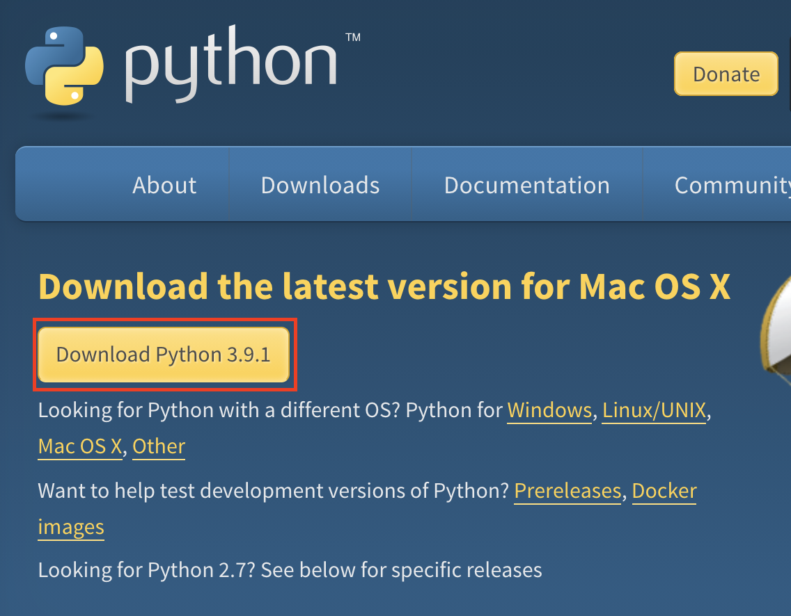
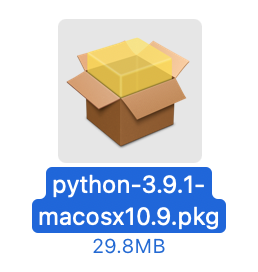
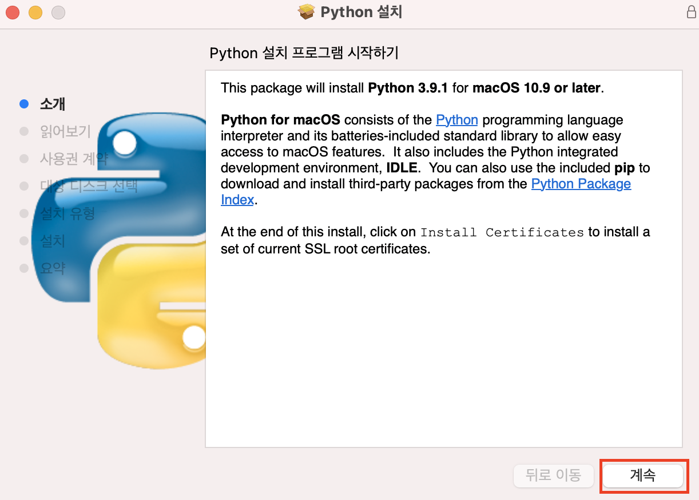
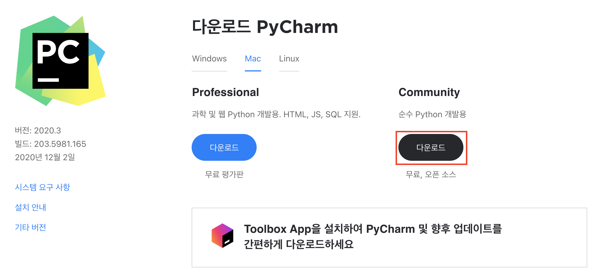

# 파이썬 기본 문법 정리
> 아래 내용은 [Do it! 점프 투 파이썬](https://book.naver.com/bookdb/book_detail.nhn?bid=15052904 "Do it! 점프 투 파이썬")과 [파이썬 알고리즘 인터뷰](https://book.naver.com/bookdb/book_detail.nhn?bid=16406247 "파이썬 알고리즘 인터뷰")을 참고하여 작성 하였습니다.

## 1. 파이썬이란 무엇인가?

#### 1) 파이썬이란?

* 파이썬(Python)은 귀도 반 로섬(Guido Van Rossum)이 개발한 인터프리터 언어이다. 

#### 2) 파이썬의 특징

* 파이썬은 인간다운 언어이다.

    ```python
    // 만약 4가 1, 2, 3, 4 중에 있으면 "4가 있습니다"를 출력한다.
    if 4 in [1, 2, 3, 4]: print("4가 있습니다.")
    ```

* 파이썬은 문법이 쉬워 빠르게 배울 수 있다.

* 파이썬은 무료이지만 강력하다.

    * 파이썬은 오픈 소스이므로 무료이다.
    
    * 파이썬과 C는 찰떡궁합이란 말이 있다.
    
        * 프로그램의 전반적인 뼈대는 파이썬으로 만들고, 빠른 실행 속도가 필요한 부분은 C로 만들어서 파이썬 프로그램 안에 포함 시키는 것이다.

    * 파이썬 라이브러리들 중에는 C로 만들어진 것도 많다.

* 파이썬은 간결하다.

* 파이썬은 프로그래밍을 즐기게 해 준다.

* 파이썬은 개발 속도가 빠르다.

#### 3) Mac에서 파이썬 3.x 버전 설치하기 

* 파이썬의 공식 홈페이지의 다운로드 페이지(https://www.python.org/downloads/)에서 파이썬 언어 패키지를 다운로드한다.

    * 파이썬의 공식 홈페이지에서 사용하는 OS에 맞는 링크를 제공하기 때문에 다음 그림과 같은 버튼을 클릭하자.
    
        
        
* 다운로드 받은 `python-3.x.pkg`를 실행한다.

    
    
* 다음과 같은 팝업창이 나타나면 설치가 진행 될 때까지 `계속` 버튼을 클릭한다.

    
    
* 설치가 완료되면 `닫기` 버튼을 클릭하여 종료한다.

* 파이썬이 정상적으로 설치되었다면 `Launchpad`에서 확인 할 수 있다.

#### 4) 파이참(PyCharm) 커뮤니티 버전 설치하여 사용하기

* 파이참 다운로드 및 설치하기

    
    
#### 5) 파이썬 기본

* (1) 주석

    * `주석(comment) `: 프로그램 코드에 대한 설명을 작성할 때 사용한다.
    
        * `#` : 한 줄 주석
        
        * `'''` : 여러 줄 주석. 작은 따옴표(') 세 개를 연속으로 사용한다.       

* (2) `들여쓰기(indent)`

    * 파이썬에서 들여쓰기 방법은 공백 2칸, 공백 4칸 등 여러 가지 방법이 있다.
      
    * 파이썬 코딩 스타일 가이드인 `PEP 8`에 따라 **공백 4칸**을 원칙으로 한다. 
      
    * 파이참을 이용하면 별도로 신경쓰지 않아도 코딩 가이드를 자동으로 맞춰준다.
    
## 2. 자료형

#### 1) 숫자형

* `숫자형(Number)`은 숫자 형태로 이루어진 자료형

* 숫자형은 어떻게 만들고 사용할까?

    * `정수형(Integer)` : 정수를 뜻하는 자료형을 말한다.
    
        ```python
        >>> a = 50
        >>> a = -120
        >>> a = 0
        ```
      
        * `프롬프트(>>>)`가 있으면 대화형 인터프리터에 실습하는 것을 의미한다.
        
    * `실수형(Floating-point)` : 소수점이 포함된 숫자를 말한다.
    
        ```python
        >>> a = 1.2
        >>> a = -3.45
        ```
      
* 숫자형을 활용하기 위한 연산자

    * `사칙연산(+, -, *, /)`
    
        ```python
        >>> a = 5
        >>> b = 2
        >>> a + b
        7
        >>> a * b
        10
        >>> a / b
        2.5
        ```
      
        * 자바에서 처럼 나눗셈(/)을 했을 때, 몫을 결과로 반환하기를 원한다면 //를 사용하자.
      
    * x의 y 제곱을 나타내는 `**` 연산자
    
        ```python
        >>> a = 5
        >>> b = 2
        >>> a ** 5
        25
        ```
      
    * 나눗셈 후 나머지를 반환하는 `%` 연산자
    
        ```python
        >>> 7 % 3
        1
        ```
      
    * 나눗셈 후 몫을 반환하는 `//` 연산자
    
        ```python
        >>> 7 / 4
        1.75
        >>> 7 // 4
        1
        ```
      
#### 2) 문자열 자료형

* `문자열(String)`은 문자들의 집합을 의미한다.

* 문자열은 어떻게 만들고 사용할까?

    * 큰 따옴표(`"`)로 양쪽 둘러싸기
    
        ```python
        "Hello World"
        ```
    
    * 작은 따옴표(`'`)로 양쪽 둘러싸기
    
        ```python
        'Python is fun'
        ```
    
    * 큰따옴표 3개를 연속(`"""`)으로 써서 양쪽 둘러싸기
    
        ```python
        """Life is too short, You need python"""
        ```

    * 작은따옴표 3개를 연속(`'''`)으로 써서 양쪽 둘러싸기
    
        ```python
        '''Life is too short, You need python'''
        ```     

* 문자열 안에 작은 따옴표나 큰따옴표를 포함시키고 싶을 때

    * 문자열에 작은따옴표(`'`)를 포함시키기
    
        * 문자열을 큰따옴표(`"`)로 둘러싼다.
        
            ```python
            >>> food = "Python's favorite food is perl"
            ```

    * 문자열에 큰따옴표(`"`)를 포함시키기
    
        * 문자열을 작은따옴표(`'`)로 둘러싼다.
        
            ```python
            >>> food = '"Python is very easy." he says.'
            ```
          
* 문자열 연산하기

    * 파이썬에서는 문자열을 더하거나 곱할 수 있다.
    
    * ① 문자열을 더해서 연결하기(Concatenation)
    
        ```python
        >>> head = "Python"
        >>> tail = " is fun!"
        >>> head + tail
        'Python is fun!'              
        ```
      
        * head와 tail 변수가 +에 의해서 합쳐진다.
        
    * ② 문자열을 곱하기
    
        ```python
        >>> a = "python"
        >>> a * 2
        'pythonpython'           
        ```
      
        * 여기서 `*` 는 문자열의 반복을 의미한다.
        
    * ③ 문자열의 길이 구하기
    
        ```python
        >>> a = "Life is too short"
        >>> len(a)
        17           
        ```
      
        * `len()`는 문자열의 길이를 알려준다.

* 문자열 인덱싱과 슬라이싱

    * 인덱싱(Indexing)은 무엇인가를 가리킨다는 의미이며 슬라이싱(Slicing)은 무엇인가를 잘라낸다는 의미다.

    * 문자열 인덱싱
    
        * 파이썬의 인덱스는 0 부터 시작한다.

            ```python
            >>> a = "Life is too short, You need Python"
            >>> a[3]
            'e'           
            ```
          
            * `a[3]`이 뜻하는 것은 a라는 문자열의 네 번째 문자 e를 말한다.
            
            * `a[번호]`는 문자열 안의 특정한 값을 뽑아내는 역할을 한다.
            
    * 문자열 인덱싱 활용하기
    
        * 인덱스가 마이너스(-)인 것은 뒤에서 부터 읽는다는 것을 의미한다.
        
            ```python
            >>> a = "Life is too short, You need Python"
            >>> a[-1]
            'n'           
            ```
          
            * `a[-1]`은 뒤에서부터 세어 첫 번째가 되는 문자를 말한다.
            
            * 0과, -0은 똑같은 것이기 때문에 `a[-0]`은 `a[0]`과 똑같다.
            
            * 추가적인 예시를 들자면, `a[-5]`는 뒤에서 부터 다섯 번째 문자를 말한다.
            
    * 문자열 슬라이싱
    
        * 문자열 슬라이싱은 문자열을 잘라내는 것을 의미한다.
        
            ```python
            >>> a = "Life is too short, You need Python"
            >>> a[0:4]
            'Life'           
            ```
          
            * `a[0:4]`는 인덱스 0 부터 3 까지의 문자를 뽑아낸다는 의미다.
            
        * `a[시작번호:끝 번호]`를 지정할 때, 시작번호 부터 끝 번호까지 문자를 뽑아낼 때, 끝 번호는 범위에 포함되지 않는다. 
        
        * `a[시작번호:]` 처럼 끝 번호를 생략하면 시작 번호 부터 문자열 끝까지를 뽑아낸다.
        
            ```python
            >>> a[19:]
            'You need Python'           
            ```

        * `a[:]` 처럼 시작 번호와 끝 번호를 생략하면 문자열의 처음부터 끝까지를 뽑아낸다.
        
            ```python
            >>> a[:]
            'Life is too short, You need Python'           
            ```
          
        * 슬라이싱에서도 마이너스(-) 기호를 사용 할 수 있다.
        
            ```python
            >>> a[19:-7]
            'You need'           
            ```
          
            * `a[19:-7]`이 뜻하는 것은 `a[19]`에서 부터 `a[-8]`까지를 말한다. 
            
    * 슬라이싱으로 문자열 나누기
    
        * 다음 코드는 문자열 a를 두 부분으로 나눈다.
        
        * 숫자 8을 기준으로 문자열 a를 양쪽으로 한번씩 슬라이싱 했다.
        
            ```python
            >>> a = "20010331Rainy"
            >>> year = a[:4]
            >>> day = a[4:8]
            >>> weather = a[8:]
            >>> year
            '2001'
            >>> year
            '0331'
            >>> weather
            'Rainy'
            ```
          
            * `a[:4]`는 처음부터 `a[3]`까지
            
            * `a[4:8]`는 `a[4]` 부터 `a[7]`까지
            
            * `a[8:]`는 `a[8]` 부터 마지막까지
            
    * Pithon이라는 문자열을 Pyhone으로 바꾸려면 어떻게 해야 될까?
    
        * 다음과 같이 생각 할 수도 있다.
        
            ```python
            >>> a = "Pithon"
            >>> a[1] = 'y'
            ```
            
            * `a[1]`의 값을 y로 바꿀려고 생각 할 수도 있다.
            
            * 하지만 문자열은 immutable한 자료형이기 때문에 값을 변경 할 수 없다.
            
        * 앞서 살펴본 슬라이싱 기법을 사용하여 해결 할 수 있다.
        
            ```python
            >>> a = "Pithon"
            >>> a[:1] + 'y' + a[2:]
            ```
          
    * `a[이상:미만:간격]` : 기본적인 간격은 1칸 씩 이동하도록 되어 있다.
    
        ```python
        >>> a = “12345678”
        >>> a[::-1] # 문자열 뒤집기
        ```
      
* 문자열 포매팅

    * format 함수를 사용한 포매팅
    
        * 숫자 바로 대입하기
        
            ```python
            >>> "I eat {0} apples".format(3)
            'I eat 3 apples'
            ```
  
        * 문자열 바로 대입하기
          
            ```python
            >>> "I eat {0} apples".format("five")
            'I eat five apples'
            ```
          
        * 숫자 값을 가진 변수로 대입하기
          
            ```python
            >>> number = 3
            >>> "I eat {0} apples".format(number)
            'I eat 3 apples'
            ```
          
        * 2개 이상의 값 넣기
          
            ```python
            >>> number = 10
            >>> day = "three"
            >>> "I ate {0} apples. I was sick for {1} days.".format(number, day)
            'I ate 10 apples. I was sick for three days.'
            ```
          
    * f 문자열 포매팅
    
        * 파이썬 3.6 버전 부터는 f 문자열 포매팅 기능을 사용 할 수 있다.
        
        * 다음과 같이 문자열 앞에 f 접두사를 붙인다.
        
            ```python
            >>> age = 30
            >>> f'나는 내년이면 {age+1}살이 된다.'
            '나는 내년이면 31살이 된다.'
            ```
          
        * 딕셔너리는 f 문자열 포매팅에서 다음과 같이 사용 할 수 있다.
        
            ```python
            >>> d = {'name':'홍길동', 'age':30}
            >>> print(f'나의 이름은 {d["name"]} 입니다. 나이는 {d["age"]} 입니다.')
            '나의 이름은 홍길동 입니다. 나이는 30 입니다.'
            ```
        
* 문자열 관련 함수

    * 문자열 자료형은 `문자열 내장 함수`를 가지고 있다.
    
        * ① `count()` : 문자열에서 주어진 문자의 개수를 반환한다.
        
            ```python
            >>> a = "hobby"
            >>> a.count('b')
            2
            ```
          
        * ② `find()` : 주어진 문자가 처음으로 나온 위치를 반환한다. 만약 존재하지 않는다면 -1을 반환한다.
        
            ```python
            >>> a = "Python is the best choice"
            >>> a.find('b')
            14 # 문자열에서 b가 처음 나온 위치
            ```
          
            * `index()`를 사용 할 수도 있다. 만약 찾는 문자나 문자열이 존재하지 않는다면 오류를 발생시킨다.
          
        * ③ `join()`: 주어진 문자열의 각 문자 사이에 어떤 문자를 삽입한다.
        
            ```python
            >>> ",".join('abcd')
            'a,b,c,d'
            ```
          
        * ④ `upper()` , `lower()` : 대문자로 변경한다. / 소문자로 변경한다.

            ```python
            >>> a = "hi"
            >>> a.upper()
            'HI'
            ```

        * ⑤ `lstrip()`, `rstrip()`, `strip()` : 왼쪽 공백 지우기 / 오른쪽 공백 지우기 / 양쪽 공백 지우기

            ```python
            >>> a = " hi "
            >>> a.strip()
            'hi'
            ```

        * ⑤ `replace()` : 문자열 바꾸기

            ```python
            >>> a = "Life is too short"
            >>> a.replace("Life", "Your leg")
            'hi'
            ```
          
            * `replace(바뀌게 될 문자열, 바꿀 문자열)`처럼 사용해서 문자열 안의 특정한 값을 다른 값으로 변경한다.

        * ⑥ `split()` : 문자열 나누기

            ```python
            >>> a = "Life is too short"
            >>> a.split() # 공백을 기준으로 문자열 나눔
            ['Life', 'is', 'too', 'short']
            ```
          
            ```python
            >>> b = "a:b:c:d"
            >>> b.split(":") # : 기호를 기준으로 문자열 나눔
            ['a', 'b', 'c', 'd']
            ```
          
            * `split()`는 공백을 기준으로 문자열을 나눈다.    
            * 만약 괄호 안에 특정 값을 지정하면 괄호 안의 값을 구분자로 해서 문자열을 나눈다.
      
#### 3) 리스트 자료형

* 리스트란 무엇인가?

    * `리스트(List)`는 동적 배열을 말한다. 즉, 크기를 자유롭게 변경 할 수 있다.

    * 리스트 안에는 어떠한 자료형도 포함 시킬 수 있다.

* 리스트 만들기

    * `리스트명 = [요소1, 요소2, 요소3, ...]`
    
    * 리스트를 생성하는 예시는 다음과 같다.
    
        ```python
        >>> a = [] # 비어 있는 리스트
        >>> b = [1, 2, 3]
        >>> c = ['Life', 'is', 'too', 'short']
        >>> d = [1, 2, 'Life', 'is']
        >>> e = [1, 2, ['Life', 'is']] # 리스트 안에 리스트를 포함 할 수 있다. 
        ```
      
        * 비어 있는 리스트는 `a = list()`로 생성 할 수도 있다.

* 리스트의 인덱싱과 슬라이싱

    * 리스트의 인덱싱

        * 리스트를 생성한다.
        
            ```python
            >>> a = [1, 2, 3]
            ```
          
        * 리스트 a의 첫 번째 요소 값
        
            ```python
            >>> a[0] 
            ```
          
        * 리스트 a의 첫 번째 요소인 a[0]과 세 번째 요소인 a[2]의 값을 더한다.
        
            ```python
            >>> a[0] + a[2] 
            ```
          
        * 리스트 a의 마지막 요소 값
        
            ```python
            >>> a = [1, 2, 3]
            >>> a[0]        
            >>> a[0] + a[2] 
            >>> a[-1]       
            ```
          
        * 리스트 안에 또 다른 리스트를 포함 하도록 만든다.
        
            ```python
            >>> a = [1, 2, 3, ['a', 'b', 'c']]
            >>> a[0]
            1        
            >>> a[-1]
            ['a', 'b', 'c']     
            ```
          
        * 다음과 같이 리스트 안에 포함된 `['a', 'b', 'c']` 리스트에서 a 값을 꺼낼 수 있다. 
    
            ```python
            >>> a[-1][0]
            'a'
            >>> a[-1][1]
            'b'
            >>> a[-1][2]
            'c'
            ```
          
            * `a[-1]`는 리스트 a의 마지막 요소인 `['a', 'b', 'c']`를 의미하며 
            
            * 해당 리스트의 첫 번째 요소를 가져오기 위해 `[0]`을 붙여준 것이다.

    * 리스트의 슬라이싱

        * 리스트를 생성한다.
        
            ```python
            >>> a = [1, 2, 3, 4, 5]
            ```
          
        * 리스트 a의 인덱스가 0인 요소 부터 1인 요소까지 가져온다.
        
            ```python
            >>> a[0:2] 
            ```
          
        * 몇 가지 예를 더 들어보자.
        
            ```python
            >>> a[:2]  # 처음부터 a[1]까지
            >>> a[2:]  # a[2] 부터 마지막까지 
            ```
          
* 리스트 연산하기

    * 리스트 더하기(+)

        * 리스트에서 + 기호는 리스트를 합치는 기능을 한다.
        
            ```python
            >>> a = [1, 2, 3]
            >>> a = [4, 5, 6]
            [1, 2, 3, 4, 5, 6]
            ```
          
    * 리스트 반복하기(*)
        
        ```python
        >>> a = [1, 2, 3]
        >>> a * 3                       # [1, 2, 3] 리스트가 세 번 반복되어 새로운 리스트를 만든다.
        [1, 2, 3, 1, 2, 3, 1, 2, 3]
        ```

    * 리스트 길이 구하기
        
        ```python
        >>> a = [1, 2, 3]
        >>> len(a)
        3
        ```
        
* 리스트의 수정과 삭제

    * 리스트에서 값 수정하기
        
        * `a[2]`의 요소 값을 3에서 4로 변경한다.
        
            ```python
            >>> a = [1, 2, 3]
            >>> a[2] = 4
            >>> a
            [1, 2, 4]
            ```
          
    * del 함수를 사용해서 리스트 요소를 삭제하기
        
        * `del a[x]`는 x번째 요소를 삭제한다.
        
            ```python
            >>> a = [1, 2, 3]
            >>> del a[1]
            >>> a
            [1, 3]
            ```
          
        * 슬라이싱 기법을 이용하여 리스트의 여러 요소를 한번에 삭제할 수도 있다.
        
            ```python
            >>> a = [1, 2, 3, 4, 5]
            >>> del a[2:]
            >>> a
            [1, 2]
            ```
          
            * 리스트를 삭제하는 방법에는 2 가지가 더 있다. 그것은 remove()와 pop()이다. 
 
* 리스트 관련 함수

    * 리스트에 요소 추가(append)
        
        * `append(x)`는 리스트의 맨 마지막에 x를 추가한다.
        
            ```python
            >>> a = [1, 2, 3]
            >>> a.append(4)
            >>> a
            [1, 2, 3, 4]
            ```
          
        * 리스트에 다시 리스트를 추가 할 수도 있다.
        
            ```python
            >>> a.append([5, 6])  # 리스트의 맨 마지막에 [5, 6]을 추가한다.
            >>> a
            [1, 2, 3, 4, [5, 6]]
            ```
          
    * 리스트 정렬(sort)
        
        * `sort()`는 리스트의 요소를 오름차순으로 정렬한다. (문자 역시 알파벳 순으로 정렬한다.)
        
            ```python
            >>> a = [1, 4, 3, 2]
            >>> a.sort()
            >>> a
            [1, 2, 3, 4]
            ```
          
        * `sort(reverse=True)`는 리스트의 요소를 내림차순으로 정렬한다. (reverse 옵션을 True로 지정)
                    
            ```python
            >>> a = [1, 4, 3, 2]
            >>> a.sort(reverse=True)
            >>> a
            , 3, 2, 1]
            ```

    * 리스트 뒤집기(reverse)
        
        * `reverse()`는 리스트를 역순으로 뒤집는다.
        
            ```python
            >>> a = ['a', 'c', 'b']
            >>> a.reverse()
            >>> a
            ['b', 'c', 'a']
            ```
 
     * 리스트 위치 반환(index)
      
        * `index(x)`는 x의 위치를 반환한다. 존재하지 않으면 값 오류(ValueError)가 발생한다.
        
            ```python
            >>> a = [1, 2, 3]
            >>> a.index(3) # 리스트 a에서 3의 위치를 반환한다. 
            2
            ```
          
     * 리스트에 요소 삽입(insert)
      
        * `insert(a, b)`는 리스트의 a번째 위치에 b를 삽입한다.
        
            ```python
            >>> a = [1, 2, 3]
            >>> a.insert(0, 4) # 리스트 a에서 인덱스가 0인 위치에 4를 삽입 
            [4, 1, 2, 3]
            ```
          
     * 리스트에 요소 제거(remove)
      
        * `remove(x)`는 리스트에서 첫 번째로 나오는 x를 삭제한다.
        
            ```python
            >>> a = [1, 2, 3, 1, 2, 3]
            >>> a.remove(3) # 리스트 a에서 첫 번째 3만 제거되는 것을 알 수 있다.
            [1, 2, 1, 2, 3]
            ```
          
     * 리스트에서 요소 꺼내기(pop)
      
        * `pop()`는 리스트의 맨 마지막 요소를 꺼내고 해당 요소를 삭제한다.
        
            ```python
            >>> a = [1, 2, 3]
            >>> a.pop()
            3
            ```
          
     * 리스트에 포함된 요소 x의 개수 세기(count)
      
        * `count(x)`는 리스트 안에 x가 몇 개 있는지 반환한다.
        
            ```python
            >>> a = [1, 2, 3, 1]
            >>> a.count(1)
            2
            ```
          
     * 리스트 확장(extend)
      
        * `extend(x)`는 원래의 리스트에 x 리스트를 더한다.
        
            ```python
            >>> a = [1, 2, 3]
            >>> a.extend([4, 5])
            [1, 2, 3, 4, 5]
            ```
          
#### 4) 튜플

* 튜플이란 무엇인가?

    * `튜플(tuple)`은 리스트와 거의 같지만 값을 변경 할 수 없다.

* 튜플 생성하기

    * 튜플은 ()로 생성한다. 
    
    * `t1 = (1, 2, 'a', 'b')`
    
    * `t2 = 1, 2, 3`
    
        * 튜플은 ()를 생략 할 수 있다.
    
* 튜플의 요소 값을 변경하거나 삭제하면 오류가 발생한다.

* 튜플 다루기
    
    * 튜플은 값을 변경 할 수 없다는 점만 제외하면 리스트와 완전히 동일하다.

    * 인덱싱 하기

        ```python
        >>> t1 = (1, 2, 'a', 'b')
        >>> t1[0]
        1
        ```
      
    * 슬라이싱 하기

        ```python
        >>> t1 = (1, 2, 'a', 'b')
        >>> t1[1:] # t1[1]부터 끝까지
        (2, 'a', 'b')
        ```
      
    * 튜플 더하기

        ```python
        >>> t2 = (3, 4)
        >>> t1 + t2 # t1, t2를 더한 새로운 튜플을 생성
        (1, 2, 'a', 'b', 3, 4)
        ```
      
    * ...

#### 5) 딕셔너리(dictionary)

* 딕셔너리(dictionary)란 무엇인가?

    * `딕셔너리`는 Key와 Value를 한 쌍으로 갖는 자료형이다.

    * **키(Key)를 통해 값(Value)를 얻는다.**
  
        * 딕셔너리는 리스트나 튜플처럼 순차적으로(sequential) 해당 요소 값을 구하지 않고 Key를 통해 Value를 얻는다.
        
    * 키(Key)는 중복 될 수 없다.
   
* 딕셔너리 만들기

    * `{Key1:Value1, Key2:Value2, Key3:Value3, ...}`

    * 예시

        ```python
        >>> dic = {'name' : 'pey', 'phone' : '0119993323', 'birth' : '1118'}
        ```

* 딕셔너리에 Key-Value 쌍 추가, 삭제하기

    * 딕셔너리에 Key-Value 쌍 추가하기

        ```python
        >>> a = {1: 'a'}
        >>> a[2] = 'b' # Key는 2, Value는 'b'인 한 쌍을 추가한다.
        >>> a
        {1: 'a', 2: 'b'}
        ```

    * 딕셔너리에 Key-Value 쌍 삭제하기

        ```python
        >>> del a[1] # Key가 1인 Key-Value 쌍을 삭제한다.
        >>> a
        {2: 'b', 'name': 'pey', 3: [1, 2, 3]}
        ```

* 딕셔너리를 만들 때 주의할 사항

    * 중복되는 Key 값을 설정해 놓으면 하나를 제외한 나머지 것들이 모두 무시된다
    
        ```python
        >>> a = {1:'a', 1:'b'}
        >>> a
        {1: 'b'}
        ```
      
* 딕셔너리 관련 함수

    * `keys()` : 딕셔너리의 key를 리스트로 만든다.
    
        ```python
        >>> a = {'name': 'pey', 'phone': '0119993323', 'birth': '1118'}
        >>> a.keys()
        dict_keys(['name', 'phone', 'birth'])
        ```
      
    * `values()` : 딕셔너리의 value를 리스트로 만든다.
    
        ```python
        >>> a.values()
        dict_values(['pey', '0119993323', '1118'])
        ```
      
    * `items()` : 딕셔너리의 key와 value의 쌍을 튜릎로 묶은 값을 dict_items 객체로 반환한다.
    
        ```python
        >>> a.values()
        dict_values(['pey', '0119993323', '1118'])
        ```
      
    * `clear()` : 딕셔너리의 모든 요소를 삭제한다.
    
        ```python
        >>> a.clear()
        >>> a
        {}
        ```
      
    * `get()` : 딕셔너리의 Key에 해당하는 Value를 반환한다.
    
        ```python
        >>> a = {'name':'pey', 'phone':'0119993323', 'birth': '1118'}
        >>> a.get('name')
        'pey'
        ```
      
        * 존재하지 않는 키로 값을 가져오려고 할 경우 a.get('nokey')는 None을 반환한다. (None은 거짓을 의미)

    * `get(x, 디폴트 값)` : 딕셔너리에 찾는 Key 값이 없는 경우, 디폴트 값을 반환한다.
    
        ```python
        >>> a.get('foo', 'bar')
        ```
      
    * `get(x, 디폴트 값)` : 딕셔너리에 찾는 Key 값이 없는 경우, 디폴트 값을 반환한다.
    
        ```python
        >>> a = {'name':'pey', 'phone':'0119993323', 'birth': '1118'}
        >>> 'name' in a
        True
        >>> 'email' in a
        False
        ```
      
    * `in` : 해당 Key가 딕셔너리에 있는지 확인한다.
    
        ```python
        >>> a = {'name':'pey', 'phone':'0119993323', 'birth': '1118'}
        >>> 'name' in a
        True
        ```
         
#### 6) 집합 자료형

* 집합(set)이란?

    * `집합`은 순서가 없고 중복을 허용하지 않는 자료형이다.

* 집합 만들기

    * 집합은 `set()`으로 만든다.
    
* 교집합, 합집합, 차집합 구하기

    * 실습을 위한 2개의 set을 만든다.
    
        ```python
        >>> s1 = set([1, 2, 3, 4, 5, 6])
        >>> s2 = set([4, 5, 6, 7, 8, 9])
        ```
      
        * 리스트를 이용하여 set을 만들 수 있다. (즉, 리스트가 set으로 변한다)
                  
    * 교집합
    
        * `&`를 사용하면 교집합을 구할 수 있다.
    
            ```python
            >>> s1 & s2  # s1.intersection(s2)
            {4, 5, 6}
            ```
          
    * 합집합
    
        * `|`를 사용하면 합집합을 구할 수 있다.
    
            ```python
            >>> s1 | s2 # s1.union(s2)
            {1, 2, 3, 4, 5, 6, 7, 8, 9}
            ```
          
    * 차집합
    
        * `-`를 사용하면 차집합을 구할 수 있다.
    
            ```python
            >>> s1 - s2 # s1.difference(s2)
            {1, 2, 3}
            ```
          
* set 관련 함수

    * `add()` : 이미 만들어진 set에 값을 추가한다.
    
        ```python
        >>> s1 = set([1, 2, 3])
        >>> s1.add(7)
        >>> s1
        {1, 2, 3, 7}
        ```
      
    * `update()` : 여러 개의 값을 한번에 추가한다.
    
        ```python
        >>> s1 = set([1, 2, 3])
        >>> s1.update([7, 8, 9])
        >>> s1
        {1, 2, 3, 7, 8, 9}
        ```
      
    * `remove()` : 특정 값을 제거한다.
    
        ```python
        >>> s1 = set([1, 2, 3])
        >>> s1.remove(1)
        >>> s1
        {2, 3}
        ```
          
#### 7) 불 자료형

* 불 자료형이란?

    * `불(bool) 자료형`은 참(True)과 거짓(False)을 나타내는 자료형이다.
    
    * 불 자료형은 다음 2가지 값만을 가질 수 있다.
    
        * `True` : 참
        
        * `False` : 거짓
        
    * 파이썬에서는 문자열, 리스트, 튜플, 딕셔너리의 값이 존재하면 참(True)이 되며 없다면 거짓(False)가 된다.
    
        * `"python"` : 참(True)
        
        * `""` : 거짓(False)
        
        * `[1, 2, 3]` : 참(True)
        
        * `[]` : 거짓(False)
        
        * ...
        
#### 8) 변수

* 파이썬에서 사용하는 변수는 객체를 가리키는 것이다. (Java의 참조변수와 유사)

    * `a = 5`
    
        * 5라는 값을 가지는 정수 자료형(객체)이 자동으로 메모리에 생성되고
        
        * 변수 a는 객체가 저장된 메모리의 주소를 가리키게 된다.
    
    * `id()` : 변수가 가리키고 있는 객체의 주소 값을 반환한다.
    
    * 다음 링크에서 시각적으로 확인 할 수 있다.
    
        * http://pythontutor.com/visualize.html#mode=edit
        
* 혼동하기 쉬운 복사 

    * 어떤 변수를 다른 변수에 대입하면 해당 변수의 주소 값이 복사된다.
    
        ```python
        >>> a = [3, 4, 5]
        >>> b = a
        ```
      
* 리스트 복사하기

    * `[:]` 사용
    
        * 리스트 전체를 가리키는 `[:]`를 사용해서 복사한다.
    
            ```python
            >>> a = [3, 4, 5]
            >>> b = a[:] # 리스트 a의 처음 요소부터 끝 요소까지 슬라이싱
            >>> a[1] = 7
            >>> a
            [3, 7, 5]
            >>> b
            [3, 4, 5]
            ```
          
    * `copy` 모듈 사용
    
        * `copy` 모듈를 이용하여 리스트를 복사한다.
        
            ```python
            >>> from copy import copy
            >>> a = [3, 4, 5]
            >>> b = copy(a)
            ```
      
* 변수를 만드는 여러가지 방법

    * 튜플로 a, b에 값을 대입 할 수 있다.
    
        ```python
        >>> a, b = ('python', 'life)
        ```
      
    * 괄호를 생략하는 것도 가능하다.
    
        ```python
        >>> a, b = 'python', 'life
        ```
      
    * 리스트로 변수를 만들 수 있다.
    
        ```python
        >>> [a, b] = ['python', 'life']
        ```
      
    * 다음과 같이 두 변수의 값을 교환 할 수 있다.
    
        ```python
        >>> a = 3
        >>> b = 5
        >>> a, b = b, a
        ```


        
        

        

    


    

            


    


    


    


        

        


    
    
    
    
    
    

    

    

    


  

  

  

  

  

    


     
