# 백기선님의 스프링 부트 개념과 활용
> 아래 내용은 [스프링 부트 개념과 활용](https://www.inflearn.com/course/%EC%8A%A4%ED%94%84%EB%A7%81%EB%B6%80%ED%8A%B8 "스프링 부트 개념과 활용") 강좌를 정리한 내용 입니다.

## 1. 스프링 부트 시작하기

#### 1) 스프링 부트 소개

* (1) 스프링 부트

    * `Spring Boot`는 제품 수준의 Spring 기반 애플리케이션을 빠르고 쉽게 만들 수 있도록 도와준다.

    * 가장 널리 사용되는 설정을 기본적으로 제공함으로써 개발자가 일일이 직접 설정하지 않도록 한다. (`opinionated view`)
    
        * Ex) 톰캣 설정

* (2) 스프링 부트 목적

    * 스프링 개발 시, 더 빠르고 폭넓은 사용성을 제공한다.

    * 개발자가 일일이 설정하지 않아도 이미 컨벤션으로 정해진 설정을 제공하며 요구사항에 맞게 설정을 쉽고 빠르게 변경 할 수 있다.

    * 비즈니스 로직을 구현하는데 필요한 기능 뿐만 아니라, 다양한 기능을 제공한다.

    * XML 설정을 더 이상 사용하지 않으며, `code generation`도 하지 않는다.

* (3) 시스템 요구사항

    * 자바 8 버전 이상 필요
    
#### 2) 스프링 부트 시작하기

* `인텔리제이` 또는 `start.spring.io`에서 프로젝트 생성하기

    * `Spring Web` 의존성을 추가

#### 3) 스프링 부트 프로젝트 구조
        
* 메이븐(Maven) 기본 프로젝트 구조와 동일하다.

    * `src\main\java` : 자바 코드가 저장된다.

    * `src\main\resources`
    
        * 자바 코드를 제외한 모든 파일이 저장된다. 
        
        * 즉, `resources`가 클래스패스 루트이다.
        
    * `src∖test∖java` : 테스트 코드가 저장된다.
    
    * `src∖test∖resources` : 테스트 코드용 리소스가 저장된다.

* 메인 애플리케이션의 위치는 다음과 같이 지정해야 한다.

    * `src\main\java`에 디폴트 패키지(me.kevinntech)를 만들고 여기에 메인 애플리케이션이 위치 하도록 해야한다.
    
        * 메인 애플리케이션 : `@SpringBootApplication`이 붙어있는 클래스를 말한다.
    
    * 그 이유는 `src\main\java`에 메인 애플리케이션이 위치하면 모든 패키지에 대해서 컴포넌트 스캔을 하기 때문이다.
    
## 2. 스프링 부트 원리

#### 1) 의존성 관리 이해

* 의존성 관리(dependency management)

    * `의존성 관리` 기능은 `pom.xml`에 의존성을 정의할 때, 라이브러리 버전을 명시하지 않더라도 적절한 버전을 가져 올 수 있도록 한다.
    
    * `spring-boot-starter`는 프로젝트에 설정 해야되는 많은 의존성들을 미리 정의하여 제공한다.
   
    * `spring-boot-dependencies`에서 의존성 버전을 관리하고 있다.
   
    * 스프링 부트가 제공하는 의존성 관리 기능은 개발자가 직접 관리해야하는 의존성의 개수를 줄여주는 장점이 있다.
    
        * 스프링 부트 버전을 업그레이드하면 관련 라이브러리와의 호환성을 신경쓰지 않아도 된다.
    
#### 2) 의존성 관리 응용

* (1) 스프링 부트가 버전 관리를 해주는 의존성을 추가하는 방법

    ```html
    <dependencies>
        ...
    
        <dependency>
            <groupId>org.springframework.boot</groupId>
            <artifactId>spring-boot-starter-data-jpa</artifactId>
        </dependency>
        
        ...
    </dependencies>
    ```

* (2) 스프링 부트가 버전 관리를 해주지 않는 의존성을 추가하는 방법

    * ① `Maven Repository`에서 사용 하고자 하는 의존성을 검색한다.

    * ② 의존성을 추가하는 스크립트를 복사한다.

        ```html
        <dependency>
            <groupId>org.modelmapper</groupId>
            <artifactId>modelmapper</artifactId>
            <version>2.1.0</version>
        </dependency>
        ```
  
    * ③ 자신의 프로젝트에 있는 `pom.xml`에 붙여넣는다.

* (3) 기존 의존성 버전을 변경하는 방법

    * ① 기존 스프링 버전을 확인한다.
    
        * `spring-boot-dependencies`의 `<properties>`에는 의존성 버전을 일괄적으로 관리하고 있다. 

        * `<spring.version>`을 찾아보면 스프링의 버전을 확인 할 수 있는데, 다음과 같은 코드를 복사하자.

        * `<spring.version>5.1.17.RELEASE</spring.version>`

    * ② 원하는 스프링 버전으로 변경한다.
    
        * `pom.xml`에서 `<properties></properties>` 안에 복사한 코드를 붙여넣고 스프링 버전을 변경한다.

            ```html
            <properties>
                <java.version>1.8</java.version>
                <spring.version>5.1.16.RELEASE</spring.version>
            </properties>
            ```
          
    * ③ 스프링 버전이 변경된 것을 확인 할 수 있다.

#### 3) 자동 설정 이해

* (1) 자동 설정 개요

    * `@SpringBootApplication`은 다음 3개의 애노테이션을 합친 것이다.

        * `@SpringBootConfiguration`, `@ComponentScan`, `@EnableAutoConfiguration`
      
    * 스프링 부트 애플리케이션은 2 단계에 걸쳐 빈(Bean)을 등록한다.
    
        * `@ComponentScan`으로 빈을 읽어서 등록한 다음, `@EnableAutoConfiguration`으로 추가적인 Bean을 읽어서 등록한다.

* (2) 첫 번째 단계 (`@ComponentScan`)

    * `@ComponentScan`은 `@Component` 애노테이션이 붙어있는 클래스들을 스캔하여 스프링 IoC 컨테이너에 빈으로 등록한다.

    * 다음 애노테이션이 붙은 클래스는 컴포넌트 스캔 대상이다.

        * `@Component`, `@Configuration`, `@Repository`, `@Service`, `@Controller`, `@RestController`

* (3) 두 번째 단계 (`@EnableAutoConfiguration`)

    * `spring-boot-autoconfigure`라는 프로젝트에 `spring.factories`라는 스프링 메타 파일이 있다.
    
    * 해당 파일에 설정된 `EnableAutoConfiguration` 키 값과 일치하는 클래스들을 빈으로 등록한다.  

    * 그런데 모두 빈으로 등록되는 것은 아니며 조건에 따라 등록된다. 
    
        * 예를 들어, `WebMvcAutoConfiguration` 클래스를 살펴보면 `@ConditionalXXX` 형식의 애노테이션들이 많이 사용되며 해당 애노테이션은 조건에 따라 빈 등록 여부를 결정할 때 사용된다. 

#### 4) 자동 설정 만들기 1부: Starter와 Autoconfigure

* (1) 자동 설정 구현

    * `Xxx-Spring-Boot-Autoconfigure` 모듈 : 자동 설정
    
    * `Xxx-Spring-Boot-Starter` 모듈 : 필요한 의존성 정의
    
        * 그냥 하나로 만들고 싶다면? `Xxx-Spring-Boot-Starter`

* (2) `Xxx-Spring-Boot-Starter`만 만드는 구현 방법

    * ① 먼저, maven 프로젝트를 `xxx-spring-boot-starter` 형식으로 생성한다.

    * ② `pom.xml`에 의존성을 추가한다.

        ```html
        <dependencies>
            <dependency>
                <groupId>org.springframework.boot</groupId>
                <artifactId>spring-boot-autoconfigure</artifactId>
            </dependency>
            <dependency>
                <groupId>org.springframework.boot</groupId>
                <artifactId>spring-boot-autoconfigure-processor</artifactId>
                <optional>true</optional>
            </dependency>
        </dependencies>
        
        <dependencyManagement>
            <dependencies>
                <dependency>
                    <groupId>org.springframework.boot</groupId>
                    <artifactId>spring-boot-dependencies</artifactId>
                    <version>2.2.11.RELEASE</version>
                    <type>pom</type>
                    <scope>import</scope>
                </dependency>
            </dependencies>
        </dependencyManagement>
        ```
      
    * ③ 패키지(me.kevinntech)를 만든 다음, 자동 설정의 대상이 되는 클래스를 작성한다.
    
        ```java
        public class Holoman {
            
            String name;
            
            int howLong;
        
            public String getName() {
                return name;
            }
        
            public void setName(String name) {
                this.name = name;
            }
        
            public int getHowLong() {
                return howLong;
            }
        
            public void setHowLong(int howLong) {
                this.howLong = howLong;
            }
        
            @Override
            public String toString() {
                return "Holoman{" +
                        "name='" + name + '\'' +
                        ", howLong=" + howLong +
                        '}';
            }
        }
        ```
      
    * ④ 자동 설정 파일(`@Configuration`)을 만든다.
   
        ```java
        @Configuration
        public class HolomanConfiguration {
        
            @Bean
            public Holoman holoman(){
                Holoman holoman = new Holoman();
                holoman.setHowLong(5);
                holoman.setName("kevinntech");
                return holoman;
            }
            
        }
        ```   
      
    * ⑤ `src/main/resource/META-INF`에 `spring.factories` 파일을 만들고 여기에 자동 설정 파일을 추가한다.
    
        ```java
        org.springframework.boot.autoconfigure.EnableAutoConfiguration=\
          me.kevinntech.HolomanConfiguration
        ```
      
    * ⑥ 터미널에서 `mvn install` 명령어를 실행 하거나 인텔리제이의 Maven 탭에서 `install`를 클릭한다.
    
        * 그러면 해당 프로젝트를 빌드하여 jar 파일을 생성하며 이 파일을 다른 maven 프로젝트에서도 사용 할 수 있도록 로컬 maven 저장소에 설치한다.
    
    * ⑦ 기존 프로젝트(spring-boot-second)의 `pom.xml`에 아래 코드를 추가한다.
    
        ```html
        <dependency>
        	<groupId>org.example</groupId>
        	<artifactId>kevin-spring-boot-starter</artifactId>
        	<version>1.0-SNAPSHOT</version>
        </dependency>
        ```    
      
    * ⑧ 의존성이 들어온 것을 확인 할 수 있다.

    * ⑨ 스프링 부트 메인 애플리케이션을 다음과 같이 변경 한다.

        ```java
        @SpringBootApplication
        public class Application {
        
        	public static void main(String[] args) {
        		SpringApplication application = new SpringApplication(Application.class);
        		application.setWebApplicationType(WebApplicationType.NONE);
        		application.run(args);
        	}
        
        }
        ```
      
    * 그리고 `ApplicationRunner` 인터페이스를 구현한 클래스를 작성하여 자동 설정에 의해 빈을 주입 받을 수 있다는 것을 확인 할 수 있다.    
    
        ```java
        @Component
        public class HolomanRunner implements ApplicationRunner {
        
            @Autowired
            Holoman holoman;
        
            @Override
            public void run(ApplicationArguments args) throws Exception {
                System.out.println(holoman);
            }
        }
        ```
      
    * 앞서 살펴본 구현 방식은 문제점이 존재한다.

        * 스프링 부트의 메인 애플리케이션에 명시적으로 빈을 등록하게 되면 `@ComponentScan`이 빈으로 등록한 다음, 
        
        * `@EnableAutoConfiguration`이 자동 설정 파일을 읽어 빈으로 등록하는데 이때, 명시적으로 등록한 빈을 덮어쓰게 된다는 문제점이 있다.

            ```java
            @SpringBootApplication
            public class SpringBootSecondApplication {
            
                ...
            
                @Bean
                public Holoman holoman(){ // 명시적으로 빈을 등록
                    Holoman holoman = new Holoman();
                    holoman.setName("whiteship");
                    holoman.setHowLong(60);
                    return holoman;
                }
            
            }
            ```
          
#### 5) 자동 설정 만들기 2부: @ConfigurationProperties

* 이전에 발생한 문제점을 해결하기 위한 방법을 아래에서 하나씩 살펴본다.

* (1) `@ConditionalOnMissingBean`으로 덮어쓰기 방지하기

    * ① `kevin-spring-boot-starter` 프로젝트의 `HolomanConfiguration`를 다음과 같이 수정한다.

        ```java
        @Configuration
        public class HolomanConfiguration {
        
            @Bean
            @ConditionalOnMissingBean
            public Holoman holoman(){
                Holoman holoman = new Holoman();
                holoman.setHowLong(5);
                holoman.setName("kevinntech");
                return holoman;
            }
        
        }
        ```

        * `@ConditionalOnMissingBean`
        
            * 해당 bean이 등록되어 있지 않은 경우에만 조건을 만족한다.
            
            * `@Bean`과 함께 사용되어 조건을 만족하는 경우에만 빈을 등록한다.
            
        * `@ConditionalOnClass`
        
            * 해당 class가 클래스패스에 존재할 때만 조건을 만족한다. 
            
    * ② 그리고 `Maven install`을 한다.
    
    * ③ 기존 프로젝트(spring-boot-second)에서 Maven을 `refresh`한다.
    
    * ④ 애플리케이션을 다시 실행하면 내가 직접 등록한 빈이 출력되는 것을 확인 할 수 있다.
    
* 필요한 빈(Bean)을 일일이 재정의하는 것이 아닌 값만 변경하고 싶다면 다음과 같이 할 수 있다.
    
* (2) `@ConfigurationProperties`

    * ① 기존 프로젝트(spring-boot-second)의 `src\main\resources`에 `application.properties` 파일을 만든다.

    * ② `key = value` 형식으로 Bean에 설정할 값을 작성한다.    

        ```
        holoman.name = kevin
        holoman.how-long = 9
        # howLong도 가능(camel case)
        ```
      
    * ③ kevin-spring-boot-starter 프로젝트에 `@ConfigurationProperties("prefix")`를 붙인 Properties 클래스를 작성한다.

        ```java
        @ConfigurationProperties("holoman")
        public class HolomanProperties {
        
            private String name;
        
            private int howLong;
        
            public String getName() {
                return name;
            }
        
            public void setName(String name) {
                this.name = name;
            }
        
            public int getHowLong() {
                return howLong;
            }
        
            public void setHowLong(int howLong) {
                this.howLong = howLong;
            }
        }
        ```
      
        * `@ConfigurationProperties`는 `*.properties` 파일의 프로퍼티 값을 자바 클래스에 바인딩 한다.
      
    * ④ 인텔리제이 얼티메이트 버전에서는 알림이 나타나는데 해당 링크의 의존성을 `pom.xml`에 추가한다.

        ```html
        <dependency>
        	<groupId>org.springframework.boot</groupId>
        	<artifactId>spring-boot-configuration-processor</artifactId>
        	<optional>true</optional>
        </dependency>
        ```
      
    * ⑤ Bean 설정을 담당하고 있는 HolomanConfiguration 클래스가 properties 파일을 읽어와 값을 사용할 수 있도록 `@EnableConfigurationProperties` 애노테이션을 붙인다.

        ```java
        @Configuration
        @EnableConfigurationProperties(HolomanProperties.class)
        public class HolomanConfiguration {
        
            @Bean
            @ConditionalOnMissingBean
            public Holoman holoman(HolomanProperties properties){
                Holoman holoman = new Holoman();
                holoman.setHowLong(properties.getHowLong());
                holoman.setName(properties.getName());
                return holoman;
            }
        
        }
        ```
      
    * ⑥ kevin-spring-boot-starter 프로젝트에서 `mvn install`를 하고 spring-boot-second 프로젝트에서 `refresh`를 한 다음, 실행한다.

#### 6) 내장 서블릿 컨테이너

* 용어 정리

    * `[참고]` https://gmlwjd9405.github.io/2018/10/27/webserver-vs-was.html

    * **(1) 정적 페이지(Static Pages)와 동적 페이지(Dynamic Pages)**
	
        * 정적 페이지
     
            * 고정된 결과가 출력되는 자원
        
            * Ex) image, html, css, javascript 파일과 같이 컴퓨터에 저장되어 있는 파일들
    
        * 동적 페이지
     
            * 시간이나 특정 조건에 따라 응답 데이터가 달라지는 자원
    
            * Ex) JSP, PHP, ASP.net 등

    * **(2) 웹 서버(Web Server)와 WAS(Web Application Server)**
	
        * `웹 서버(Web Server)`
 
            * 웹 브라우저로 부터  HTTP 요청을 받아 정적인 컨텐츠(.html .jpeg .css 등)를 제공하는 프로그램

            * 웹 서버의 기능
            
                * ① 정적인 컨텐츠를 제공 (WAS를 거치지 않고 바로 자원을 제공한다)
    
                * ② 동적인 컨텐츠를 제공하기 위해 클라이언트의 요청(Request)을 WAS에 보내고, WAS가 처리한 결과를 클라이언트에게 전달(응답, Response)한다.
    
            * 웹 서버의 예시
            
                * Ex) Apache Server, Nginx, IIS 등

        * `WAS(Web Application Server)`
 
            * DB 조회나 다양한 로직 처리를 요구하는 동적인 컨텐츠를 제공하기 위해 만들어진 Application Server를 말한다.

            * 웹 컨테이너(Web Container) 또는 서블릿 컨테이너(Servlet Container)라고도 불린다.
            
                * Container란 JSP, Servlet을 실행시킬 수 있는 소프트웨어를 말한다. 즉, WAS는 JSP, Servlet 구동 환경을 제공한다.

            * WAS의 역할

                * `WAS` = `Web Server + Web Container`

            * WAS의 예시
            
                * Ex) Tomcat, Jboss, Jeus, Web Sphere 등

* 스프링 부트가 서블릿 컨테이너는 아니다.

    * 스프링 부트는 내장 서블릿 컨테이너를 쉽게 사용 할 수 있도록 해주는 도구(Tool)일 뿐, 스프링 부트 자체가 서블릿 컨테이너는 아니다.

    * 자바 코드로 서블릿 컨테이너를 만들 수 있다.
    
        ```java
        @SpringBootApplication
        public class Application {
        
        	public static void main(String[] args) throws LifecycleException {
        		Tomcat tomcat = new Tomcat(); // 톰캣 객체 생성
        		tomcat.setPort(8080); // 포트 설정
        		tomcat.getConnector(); // 해당 코드가 추가되어야 정상적으로 동작한다.
        
        		Context context = tomcat.addContext("/", "/"); // 톰캣에 컨텍스트 추가
        
        		// 서블릿 만들기
        		HttpServlet servlet = new HttpServlet() {
        			@Override
        			protected void doGet(HttpServletRequest req, HttpServletResponse resp) throws ServletException, IOException {
        				PrintWriter writer = resp.getWriter();
        				writer.println("<html><head><title>");
        				writer.println("Hey, Tomcat");
        				writer.println("</title></head>");
        				writer.println("<body><h1>Hello Tomcat</h1></body>");
        				writer.println("</html>");
        			}
        		};
        
        		// 톰캣에 서블릿 추가              
        		String servletName = "helloServlet";
        		tomcat.addServlet("/", servletName, servlet);
      
        		// 컨텍스트에 서블릿 맵핑 
        		context.addServletMappingDecoded("/hello", servletName);

        		// 톰캣 실행 및 대기             
        		tomcat.start();
        		tomcat.getServer().await();
        	}
        
        }
      
        ```
      
    * 이 모든 과정을 보다 상세하게 설정하고 실행 해주는 것이 바로 스프링 부트의 자동 설정이다.
    
        * `spring-boot-autoconfigure`에서 `spring.factories`를 열어보면 자동 설정 파일들이 있다.
        
        * 서블릿 웹 서버를 생성하는 것과 디스패처 서블릿을 생성한 다음, 서블릿 웹 서버에 등록하는 것은 2개의 자동 설정 파일로 나뉘어져 있다.
        
            * `ServletWebServerFactoryAutoConfiguration`는 서블릿 웹 서버를 생성하는 자동 설정 파일이다.
            
                * `TomcatServletWebServerFactoryCustomizer`는 서블릿 웹 서버를 커스터마이징한다.
                
            * `DispatcherServletAutoConfiguration`
            
                * `DispatcherServlet`를 만들고 서블릿 웹 서버에 등록한다.
                
                * `DispatcherServlet`는 `HttpServlet`를 상속해서 만든 Spring MVC의 핵심 클래스이다.
        
* 즉, 스프링 부트의 자동 설정이 내장 서블릿 컨테이너(Tomcat, Jetty, Undertow)를 생성하고 실행 시킨다.

#### 7) 내장 서블릿 컨테이너 응용 1부 : 컨테이너와 서버 포트

* 내장 서블릿 컨테이너 변경

    * 서블릿 기반의 웹 애플리케이션을 개발할 때, 기본적으로 톰캣을 사용하게 된다. 이를 변경해보자.
    
        * ① `spring-boot-starter-web`는 다음과 같이 `spring-boot-starter-tomcat`을 포함하고 있다.
        
        * ② `pom.xml`에 톰캣의 의존성을 제외하기 위해 `<exclusions>` 엘리먼트를 추가하고 Jetty 의존성을 추가한다.
            
            ```html
            <dependencies>
                <dependency>
                    <groupId>org.springframework.boot</groupId>
                    <artifactId>spring-boot-starter-web</artifactId>
                    <exclusions>
                        <exclusion>
                            <groupId>org.springframework.boot</groupId>
                            <artifactId>spring-boot-starter-tomcat</artifactId>
                        </exclusion>
                    </exclusions>
                </dependency>
            
                <dependency>
                    <groupId>org.springframework.boot</groupId>
                    <artifactId>spring-boot-starter-jetty</artifactId>
                </dependency>
                
                ...
          
            </dependencies>
            ```
          
        * ③ 톰캣 의존성은 사라지고 Jetty 의존성이 추가 되었음을 확인 할 수 있으며 실행 또한 Jetty로 실행된다. 

* 내장 서블릿 컨테이너 사용 하지 않기

    *  웹 관련 의존성이 추가 되어 있다면 스프링 부트는 웹 애플리케이션으로 만들려고 시도한다.
    
        * 여기서 웹 관련 의존성이란 `spring-boot-starter-web`, `spring-boot-starter-undertow` 등을 말한다.

    * 어떠한 서블릿 컨테이너도 사용하고 싶지 않으면 `application.properties`에 `spring.main.web-application-type=none`를 추가하면 된다.
    
* 포트 변경하기

    * ① 원하는 포트로 변경
    
        ```
        #application.properties
        server.port=7070
        ```
      
    * ② 랜덤 포트로 사용
    
        ```
        #application.properties      
        server.port=0
        ```
      
    * ③ 런타임 시 HTTP 포트 찾기
    
        * `ApplicationListener<ServletWebServerInitializedEvent>`를 이용한다.
    
            ```java
            @Component
            public class PortListener implements ApplicationListener<ServletWebServerInitializedEvent> {
                // 서블릿 웹 서버가 생성(초기화)되면 해당 이벤트의 리스너가 호출된다.
                @Override
                public void onApplicationEvent(ServletWebServerInitializedEvent event) {
                    // 이벤트에서 WebServerApplicationContext를 꺼낸다.
                    ServletWebServerApplicationContext applicationContext = event.getApplicationContext();
                    System.out.println(applicationContext.getWebServer().getPort()); // 웹 서버를 얻은 다음, 포트 정보를 출력
                }
            }
            ```

#### 8) 내장 웹 서버 응용 2부: HTTPS와 HTTP2

* `KeyStore`는 암호화 / 복호화 및 디지털 서명에 사용되는 키(Key)와 인증서(Certificate)를 추상화한 Java의 인터페이스이다.

* `keytool`은 KeyStore 기반으로 인증서와 key를 관리할 수 있는 명령어 방식의 유틸리티로 JDK에 포함되어 있다. 

* (1) HTTPS 설정하기

    * 인텔리제이의 터미널에서 다음과 같은 keytool 명령어로 keystore를 만든다.

        ```
        keytool -genkey -alias spring -storetype PKCS12 -keyalg RSA -keysize 2048 -keystore keystore.p12 -validity 4000
        
        키 저장소 비밀번호 입력: 123456
        새 비밀번호 다시 입력: 123456
        이름과 성을 입력하십시오.
          [Unknown]:  KEVIN KIM
        조직 단위 이름을 입력하십시오.
          [Unknown]:  KEVINNTECH
        조직 이름을 입력하십시오.
          [Unknown]:  CEO
        구/군/시 이름을 입력하십시오?
          [Unknown]:  Seoul
        시/도 이름을 입력하십시오.
          [Unknown]:  Seoul
        이 조직의 두 자리 국가 코드를 입력하십시오.
          [Unknown]:  KO
        CN=KEVIN KIM, OU=KEVINNTECH, O=CEO, L=Seoul, ST=Seoul, C=KO이(가) 맞습니까?
          [아니오]:  y
        ```
      
    * 그러면 다음과 같이 keystore가 생성된 것을 확인 할 수 있다.
    
        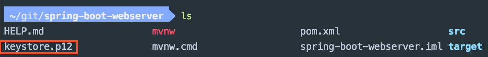
        
    * 그리고 `application.properties`를 다음과 같이 수정한 다음, 스프링 부트 애플리케이션을 실행한다.
    
        ```
        # 만약 keystore가 애플리케이션 루트가 아닌 resources에 있었다면 classpath:를 붙여주면 된다.
        server.ssl.key-store = keystore.p12
        server.ssl.key-store-type = PKCS12
        server.ssl.key-store-password = 123456
        server.ssl.keyAlias = spring
        ```
      
    * 이렇게 지정하면 스프링 부트에서 톰캣이 사용하는 커넥터는 하나만 등록되는데 해당 커넥터에 SSL이 적용된다.
    
    * 즉, 앞으로는 모든 요청에 https를 붙여야 한다. (http로 접근하면 Bad Request가 결과로 나타난다.)
    
* (2) HTTP 커넥터를 코딩으로 설정하기

    * https를 적용하면 http 요청을 받을 수 있는 커넥터가 없다. 

    * 그래서 http와 https를 모두 사용하고 싶다면 멀티 커넥터를 설정해야 한다.

        ```java
        @SpringBootApplication
        @RestController
        public class SpringBootWebserverApplication {
        
            // GET 요청 시 처리
            @GetMapping("/hello")
            public String hello() {
                return "Hello Spring";
            }
        
            public static void main(String[] args) {
                SpringApplication.run(SpringBootWebserverApplication.class, args);
            }
        
            // 멀티 커넥터 설정 
            @Bean
            public ServletWebServerFactory serverFactory(){
                TomcatServletWebServerFactory tomcat = new TomcatServletWebServerFactory();
                tomcat.addAdditionalTomcatConnectors(createStandardConntor()); // 커넥터 추가
                return tomcat;
            }
        
            private Connector createStandardConntor() {
                Connector connector = new Connector("org.apache.coyote.http11.Http11NioProtocol");
                connector.setPort(8080);
                return connector; // 커넥터를 리턴
            }
        
        }
        ```
  
    * http는 8080, https는 8443으로 포트 번호를 설정한다.
    
        ```
        server.ssl.key-store = keystore.p12
        server.ssl.key-store-type = PKCS12
        server.ssl.key-store-password = 123456
        server.ssl.keyAlias = spring
        server.port = 8443
        ```
  
    * 터미널에서 다음과 같은 요청으로 확인 할 수 있다.

        ```
        curl -I -k --http2 http://localhost:8080/hello
        curl -I -k --http2 https://localhost:8443/hello
        ```
  
* (3) HTTP2 설정

    * HTTP2를 활성화 하려면 `application.properties`에 `server.http2.enabled = true`를 추가한다.
    
    * 그리고 서블릿 컨테이너 마다 제약 사항이 다른데, Undertow의 경우, HTTPS만 적용 되어 있다면 추가 설정이 필요 없다.

    * 하지만 톰캣의 경우, `Tomcat 9.0.x` 과 `JDK 9` 이상의 버전을 사용하지 않으면 설정이 매우 복잡해진다. 
    
    * 그러므로 Undertow를 사용하기 위해 다음과 같이 `pom.xml`을 설정한다.
    
        ```html
        <dependency>
            <groupId>org.springframework.boot</groupId>
            <artifactId>spring-boot-starter-web</artifactId>
            <exclusions>
                <exclusion>
                    <groupId>org.springframework.boot</groupId>
                    <artifactId>spring-boot-starter-tomcat</artifactId>
                </exclusion>
            </exclusions>
        </dependency>
        
        <dependency>
            <groupId>org.springframework.boot</groupId>
            <artifactId>spring-boot-starter-undertow</artifactId>
        </dependency>
        ```
  
    * http2로 요청을 보내면 http2를 사용하고 있는 것을 확인 할 수 있다.
        
        ```html
        curl -I -k --http2 https://localhost:8443/hello
        ```
      
    * 명심해야 될 것은 HTTP2를 사용하려면 SSL이 적용되어 있어야 한다.
    
#### 9) 톰캣 HTTP2 설정

* `pom.xml`에서 Java와 Tomcat의 버전을 변경한다.

    * 스프링 부트 버전에 따라 아래 설정은 필요 없을 수도 있다. 

        ```html
        <properties>
            <java.version>11</java.version>
            <tomcat.version>9.0.10</tomcat.version>
        </properties>
        ```
        
    * 만약, 기존에 Java 9 이전 버전을 사용 하고 있었다면 JDK 버전을 변경해야 한다.
    
    * 그래서 인텔리제이의 `[File]-[Project Structure]-[Project]`에서 **Project SDK** 그리고 `[File]-[Project Structure] - [Modules] - [Dependencies]`에서 **Module SDK**를 변경한다.

* http2로 요청을 보내면 정상적인 응답을 확인 할 수 있다.
    
    ```html
    curl -I -k --http2 https://localhost:8443/hello
    ```
  
#### 10) 독립적으로 실행 가능한 JAR 

* (1) JAR 만들기

    * 스프링 부트 메인 애플리케이션을 다음과 같이 작성한다.
    
        ```java
        @SpringBootApplication
        @RestController
        public class SpringinitApplication {
        
        	@GetMapping("/")
        	public String hello(){
        		return "Hello Spring";
        	}
        
        	public static void main(String[] args) {
        		SpringApplication.run(SpringinitApplication.class, args);
        	}
        
        }
        ```
      
    * 인텔리제이 터미널에서 `mvn clean`를 이용하여 Maven으로 빌드 시 생성 되었던 target 디렉토리의 내용을 모두 삭제한다.
    
    * `mvn package`를 이용하여 컴파일된 결과물을 패키지 파일로 생성한다. (JAR, WAR ...)
    
        * 위의 과정을 `mvn clean package`로 한번에 처리 할 수도 있다.

        * 그리고 `mvn package -DskipTests`와 같은 방식으로 테스트를 생략하고 패키징을 할 수도 있다.

    * 그리고 다음 명령어로 target 디렉토리로 이동한 다음, JAR 파일이 생성 되었는지 확인한다.
    
        ```
        cd target
        ls
        ```
      
        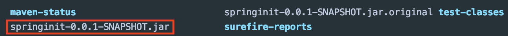

* (2) JAR 실행

    * JAR 파일 하나를 실행하면 스프링 부트 애플리케이션이 동작한다.
    
        * `java -jar springinit-0.0.1-SNAPSHOT.jar` 
    
* (3) JAR 파일 하나로 애플리케이션이 실행되는 이유는 무엇일까?

    * **하나의 JAR 파일 안에 프로젝트에서 사용되는 JAVA 클래스, 리소스, 외부 라이브러리 JAR 파일 등이 포함 되어 있기 때문이다.**
    
    * `JAVA`에는 `내장 JAR`를 읽을 수 있는 표준 방법이 없다.
    
    * 하지만 `스프링 부트`는 `내장 JAR` 파일을 읽을 수 있는 로더가 있으며 실행도 할 수 있다.
    
    * 독립적으로 실행 가능한 JAR 관련 용어
    
        * `내장 JAR` : JAR 파일 안에 있는 JAR 파일을 말한다.
        
        * `spring-boot-maven-plugin` : 패키징을 처리한다.
        
        * `org.springframework.boot.loader.jar.JarFile` : 내장 JAR를 읽는다.
        
        * `org.springframework.boot.loader.Launcher` : JAR 파일을 실행한다.

* 스프링 부트의 주요 목표 중 하나가 `독립적으로 실행 가능한 애플리케이션(stand-alone)`을 만들 수 있도록 하는 것이다.
    
## 3. 스프링 부트 활용

#### 1) SpringApplication : 1부 - `핵심 기능`

* (1) SpringApplication 실행 방법

    * 이전까지 실행 했던 방법은 다음과 같다.
    
        ```java
        @SpringBootApplication
        public class SpringinitApplication {
        
        	public static void main(String[] args) {
        		SpringApplication.run(SpringinitApplication.class, args);
        	}
        
        }
        ```
      
    * 하지만 이렇게 사용하게 되면 스프링 애플리케이션이 제공하는 다양한 커스터마이징 기능을 사용하기가 어렵다.
    
    * 그래서 `SpringApplication` 인스턴스를 만든 다음, `run()`를 호출하는 방법을 사용한다.
          
        ```java
        @SpringBootApplication
        public class SpringinitApplication {
        
        	public static void main(String[] args) {
        		SpringApplication app = new SpringApplication(SpringinitApplication.class);
        		app.run(args);
        	}
        
        }
        ```
      
    * 그리고 `SpringApplicationBuilder`로 애플리케이션을 실행하고 커스터마이징 기능을 사용하는 것도 가능하다.
          
        ```java
        @SpringBootApplication
        public class SpringinitApplication {
        
        	public static void main(String[] args) {
        		new SpringApplicationBuilder()
        				.sources(SpringinitApplication.class)
        				.run(args);
        	}
        
        }
        ```

* (2) 기본 로그 레벨 INFO

    * 어떠한 옵션도 변경하지 않고 실행하면 **기본 로그 레벨은 INFO다**.
    
    * 로그 관련 실습

        * ① `[Edit Configurations...]`를 클릭한다.
        
            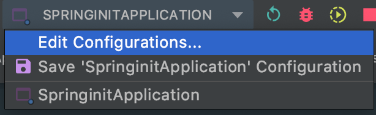
            
        * ② `VM option`에 `-Ddebug`를 작성하거나 `Program arguments`에 `--debug`를 작성한 다음, 실행하면 애플리케이션 로그가 디버그 레벨까지 출력된다.

        * ③ 다음 그림처럼 디버그 레벨로 출력된 로그를 확인 할 수 있다.

            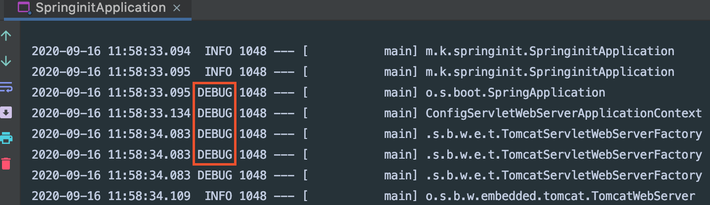

        * 디버그 레벨로 출력된 로그를 보면 어떠한 자동 설정이 적용 되었는지, 적용되지 않았다면 그 이유를 확인 할 수 있다.

* (3) FailureAnalyzer

    * `FailureAnalyzer`는 애플리케이션 에러가 발생 했을 때, 에러 메시지를 좀 더 예쁘게 출력 해주는 기능이다.

    * 스프링 부트 애플리케이션은 기본적으로 여러 가지 `FailureAnalyzer`들이 등록 되어 있다.

* (4) 배너

    * 스프링 부트 애플리케이션 실행 시 처음 나타나는 로고를 `배너`라고 한다.
    
        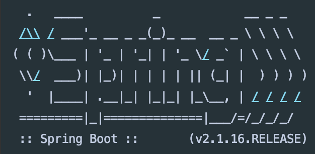
        
    * 배너를 변경하는 방법
    
        * `src/main/resources`에 배너 파일(banner.txt)를 만든 다음, 배너로 사용 할 텍스트를 입력한다.
        
        * 또는 banner를 gif, jpg, png로도 만들 수 있다.

    * 배너를 표시할 때, 여러가지 변수를 사용 할 수도 있다.
    
        * `${spring-boot.version}`를 사용하면 스프링 부트 버전이 출력된다.

            * 전제 조건은 MANIFEST 파일이 존재해야 된다. 
    
                * JAR 파일로 패키징 할 때, MANIFEST 파일도 만들어 주기 때문에 JAR 파일로 패키징을 한 다음, 해당 JAR 파일을 실행하면 된다.

    * 배너 파일의 위치를 변경하는 방법

        * `application.properties`에서 `spring.banner.location`를 지정하면 된다.
        
    * 배너가 나타나지 않도록 하는 방법
    
        ```java
        @SpringBootApplication
        public class SpringinitApplication {
        
        	public static void main(String[] args) {
        		SpringApplication app = new SpringApplication(SpringinitApplication.class);
        		app.setBannerMode(Banner.Mode.OFF);
        		app.run(args);
        	}
        
        }
        ```

    * 배너를 코딩으로 구현하는 방법
    
        * `SpringApplication.setBanner()`에 Banner 인터페이스를 구현한 것을 설정하면 된다.
    
            ```java
            @SpringBootApplication
            public class SpringinitApplication {
            
                public static void main(String[] args) {
                    SpringApplication app = new SpringApplication(SpringinitApplication.class);
                    app.setBanner(new Banner() {
                        @Override
                        public void printBanner(Environment environment, Class<?> sourceClass, PrintStream out) {
                            out.println("=================");
                            out.println("KEVINNTECH");
                            out.println("=================");
                        }
                    });
                    app.run(args);
                }
            
            }
            ```
  
#### 2) SpringApplication : 2부 - `핵심 기능`

* (1) `ApplicationEvent`와 `Listener`

    * ① 이벤트 리스너 만들기
    
        * ApplicationListener 인터페이스를 구현하는 클래스를 정의한다.
        
            ```java
            @Component
            public class SampleListener implements ApplicationListener<ApplicationStartingEvent> {
            
                @Override
                public void onApplicationEvent(ApplicationStartingEvent applicationStartingEvent) {
                    System.out.println("=======================");
                    System.out.println("Application is Starting");
                    System.out.println("=======================");
                }
            }
            ```
          
    * ② 이벤트 리스너를 빈(Bean)으로 등록하기
    
        * 이벤트 리스너를 빈(Bean)으로 등록하기 위해 `@Component` 애노테이션을 붙여준다.
        
        * 그러면 이벤트가 발생하면 빈으로 등록되어 있는 해당 이벤트 리스너가 실행된다.

    * ③ 여기서 발생 할 수 있는 문제점
    
        * `ApplicationContext`가 만들어진 다음, 발생하는 이벤트들은 해당 이벤트의 리스너가 빈(Bean)인 경우, 알아서 호출 할 수 있는데, 문제는 `ApplicationContext`가 만들어지기 이전에 발생하는 이벤트다.

        * `ApplicationStartingEvent`는 `ApplicationContext`가 만들어지기 이전에 발생하는 이벤트이며 해당 이벤트에 대한 리스너를 빈으로 등록하더라도 실행 되지 않는다.

        * 이러한 문제를 해결하려면 `addListeners()`를 사용하면 된다. (리스너에 붙였던 @Component 애노테이션은 의미가 없기 때문에 제거하자.)
    
            ```java
            @SpringBootApplication
            public class SpringinitApplication {
            
                public static void main(String[] args) {
                    SpringApplication app = new SpringApplication(SpringinitApplication.class);
                    app.addListeners(new SampleListener());
                    app.run(args);
                }
            
            }
            ```

* (2) WebApplicationType 설정

    * 웹 애플리케이션 타입은 다음 세 종류가 있다.
    
        * `WebApplicationType.SERVLET`는 Spring MVC가 있을 때 사용되는 타입이다.
    
        * `WebApplicationType.REACTIVE`는 Spring Webflux가 있을 때 사용되는 타입이다.
    
        * `WebApplicationType.NONE`는 둘 다 없을 때 사용되는 타입이다. (내장 서블릿 컨테이너가 실행 되지 않음)
    
    * `Spring MVC`와 `Spring Webflux` 둘 다 있다면 `WebApplicationType.SERVLET`으로 설정된다.
   
        * 이러한 상황에서 `Spring Webflux`를 선택하고 싶다면 다음과 같이 메인 애플리케이션에 명시적으로 지정하면 된다.
    
            * `app.setWebApplicationType(WebApplicationType.REACTIVE);`
        
* (3) 애플리케이션 아규먼트(Argument) 사용하기

    * 아규먼트(Argument)
    
        * `JVM option`는 `-D`로 시작하며 JVM 설정과 관련된 Argument이다.
    
        * `애플리케이션 아규먼트`는 `--`로 시작하며 애플리케이션 설정과 관련된 Argument이다. 
        
            * `Program arguments:`
            
    * 실습

        * ① `[Edit Configurations...]`에서 다음과 같이 설정한다.
    
            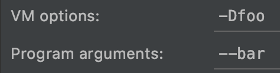
    
        * ② 그리고 `SampleListener`의 코드를 다음과 같이 변경한 다음, 애플리케이션을 실행한다.
    
            ```java
            @Component
            public class SampleListener{
            
                /* 어떤 빈(Bean)에 생성자가 1개이고 그 생성자의 파라미터가
                    빈(Bean)인 경우, 스프링이 해당 빈을 자동으로 주입한다. */
                public SampleListener(ApplicationArguments arguments){
                    System.out.println("foo: " + arguments.containsOption("foo"));
                    System.out.println("bar: " + arguments.containsOption("bar"));
                }
            
            }
            ```
          
        * ③ 실행 결과를 보면 foo는 false로 출력되고 bar는 true로 출력된다.
            
        * 즉, ApplicationArguments 객체에는 JVM option 값이 전달 되지 않는다는 것을 알 수 있다.
    
* (4) 스프링 부트 애플리케이션이 실행된 이후, 뭔가 추가적으로 더 실행하고 싶을 때, 사용하는 방법

    * ① `ApplicationRunner` **[추천]**

        ```java
        @Component
        public class SampleListener implements ApplicationRunner {
        
            @Override
            public void run(ApplicationArguments args) throws Exception {
                System.out.println("foo: " + args.containsOption("foo"));
                System.out.println("bar: " + args.containsOption("bar"));
            }
        
        }
        ```
      
        * `ApplicationRunner` 인터페이스를 구현한다.
      
    * ② `CommandLineRunner`
    
    * `@Order`로 순서를 지정 할 수도 있다. (값이 낮을수록 우선 순위가 높다)

#### 3) 외부 설정 : 1부 - `핵심 기능`

* (1) `외부 설정`은 애플리케이션에서 사용하는 여러 가지 설정 값들을 정의한다.

    * `properties`
    
    * `YAML`
    
    * `환경변수`
    
    * `커맨드 라인 아규먼트`

* (2) `application.properties` 또는 `application.yml`

    * `application.properties`는 스프링 부트 애플리케이션이 구동될 때, 자동으로 로딩하는 **외부 설정 파일**이다.
                
        * 해당 이름은 컨벤션으로 정해진 것이다.

    * 실습
    
        * ① 설정 값 정의하기
        
            * `키 = 값` 형태로 설정 값을 정의한다.
    
                ```java
                #application.properties
                kevin.name = kevin
                ```
              
        * ② 애플리케이션에서 설정 값 참조하기
        
            * 애플리케이션에서 설정 값을 참조하려면 `@Value`를 사용하면 된다.
    
                ```java
                @Component
                public class SampleRunner implements ApplicationRunner {
                
                    @Value("${kevin.name}")
                    private String name;
                
                    @Override
                    public void run(ApplicationArguments args) throws Exception {
                        System.out.println("================");
                        System.out.println(name);
                        System.out.println("================");
                    }
                }
                ```
    
* (2) 프로퍼티 우선 순위

    * ① 유저 홈 디렉토리에 있는 spring-boot-dev-tools.properties

    * ② 테스트에 있는 @TestPropertySource

    * ③ @SpringBootTest 애노테이션의 properties 애트리뷰트

    * ④ 커맨드 라인 아규먼트

    * ⑤ SPRING_APPLICATION_JSON (환경 변수 또는 시스템 프로퍼티)에 들어있는 프로퍼티

    * ⑥ ServletConfig 파라미터

    * ⑦ ServletContext 파라미터

    * ⑧ java:comp/env JNDI 애트리뷰트

    * ⑨ System.getProperties() 자바 시스템 프로퍼티

    * ⑩ OS 환경 변수

    * ⑪ RandomValuePropertySource

    * ⑫ JAR 밖에 있는 특정 프로파일용 application properties

    * ⑬ JAR 안에 있는 특정 프로파일용 application properties

    * ⑭ JAR 밖에 있는 application properties

    * ⑮ JAR 안에 있는 application properties

    * ⑯ @PropertySource

    * ⑰ 기본 프로퍼티 (SpringApplication.setDefaultProperties)
    
* (3) 테스트 코드에서 외부 설정 - 에러가 발생 할 수도 있는 방법

    * ① 다음과 같은 테스트 코드를 작성한다.
    
        ```java
        @RunWith(SpringRunner.class)
        @SpringBootTest
        public class SpringinitApplicationTests {
        
            @Autowired
            Environment environment; // Environment 빈을 주입 받은 다음, 설정 값을 가져 올 수 있다.
        
            @Test
            public void contextLoads() {
                assertThat(environment.getProperty("kevin.name"))
                        .isEqualTo("kevin");
            }
        
        }
        ```
      
    * ② 테스트에서만 사용되는 `application.properties` 파일이 필요하다고 가정한다.
    
        * 다음과 같은 경로에 `resources` 디렉토리가 없다면 생성한다.
        
            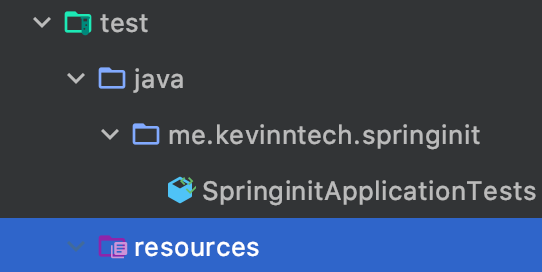
            
        * 인텔리제이에서 `[File]` - `[Project Structure]`를 클릭한 다음, 아래 그림처럼 `src/test`에 있는 `resources`를 선택하고 `Test Resources` 아이콘을 클릭한다. 
        
        * 그 다음, `[Apply]`와 `[OK]` 버튼을 클릭한다.
          
            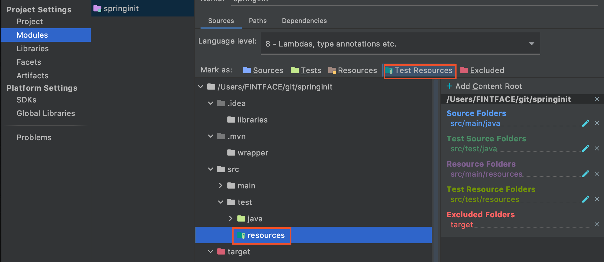
            
        * `test/resources`에 `application.properties` 파일을 생성한 다음, 아래 내용처럼 작성한다.
        
            ```
            kevin.name=kevinntech
            ```
                
    * ③ 그리고 테스트 코드를 그대로 실행하면 에러가 발생하므로 다음과 같이 코드를 변경한 다음, 실행하자.
    
        ```java
        @RunWith(SpringRunner.class)
        @SpringBootTest
        public class SpringinitApplicationTests {
        
            @Autowired
            Environment environment;
        
            @Test
            public void contextLoads() {
                assertThat(environment.getProperty("kevin.name"))
                        .isEqualTo("kevinntech"); // 변경된 부분 
            }
        
        }
        ```

* (4) 테스트 코드에서 외부 설정 - 에러가 발생하는 이유
    
    * ① `src/main/resources`에 있는 `application.properties`를 다음과 같이 수정한다.

        ```
        kevin.name=kevin
        kevin.age=${random.int} # 수정된 부분
        ```
      
    * ② SampleRunner 코드를 다음과 같이 수정한다. 

        ```java
        @Component
        public class SampleRunner implements ApplicationRunner {
        
            @Value("${kevin.name}")
            private String name;
        
            // 수정된 부분
            @Value("${kevin.age}")
            private int age;
        
            // 수정된 부분
            @Override
            public void run(ApplicationArguments args) throws Exception {
                System.out.println("================");
                System.out.println(name);
                System.out.println(age);
                System.out.println("================");
            }
        }
        ```
      
    * ③ `src/main`에 있는 SampleRunner를 실행하면 문제가 없지만 테스트 코드를 실행하면 에러가 발생한다. 그 이유는 무엇일까?
            
        * 테스트 코드를 실행하면 먼저 `src` 디렉토리를 빌드해서 클래스패스에 놓는다. 그 다음, `test` 디렉토리를 빌드해서 클래스패스에 놓는다.
          
            * 이 과정에서 `test` 디렉토리에 있는 외부 설정 파일(`application.properties`)로 `src` 디렉토리에 있는 것을 덮어쓰게 된다.
              
            * 그리고 test 디렉토리에 있는 외부 설정 파일은 `kevin.age`가 정의되어 있지 않으므로 에러가 발생하게 되는 것이다.
            
            * 그래서 에러가 발생하지 않도록 하려면 `test` 디렉토리에 있는 외부 설정 파일을 삭제하거나 `kevin.age = ${random.int}` 부분을 추가해야 한다. 
            
            * 이러한 방식으로 관리 하기는 힘들다.
    
* (5) 테스트 코드에서 외부 설정 - 해결방법

    * ① `@SpringBootTest`의 `properties` 속성을 이용하는 방법
    
        ```java
        @RunWith(SpringRunner.class)
        @SpringBootTest(properties = "kevin.name = kevin2")
        public class SpringinitApplicationTests {
        
        	@Autowired
        	Environment environment;
        
        	@Test
        	public void contextLoads() {
        		assertThat(environment.getProperty("kevin.name"))
        				.isEqualTo("kevin2");
        	}
        
        }
        ```
    
    * ② `@TestPropertySource`를 사용하여 직접 외부 설정 값을 지정하는 방법
    
        ```java
        @RunWith(SpringRunner.class)
        @TestPropertySource(properties = "kevin.name=kevin3")
        // @TestPropertySource(properties = {"kevin.name=kevin3", "kevin.age=20"}) // 여러 설정 값 지정
        @SpringBootTest
        public class SpringinitApplicationTests {
        
        	@Autowired
        	Environment environment;
        
        	@Test
        	public void contextLoads() {
        		assertThat(environment.getProperty("kevin.name"))
        				.isEqualTo("kevin3");
        	}
        
        }
        ```

    * ③ 테스트 용도의 외부 설정 파일을 다른 이름(`test.properties`)으로 만든 다음, `@TestPropertySource`로 외부 설정 파일 경로를 지정하는 방법

        * 외부 설정 파일 이름이 다르기 때문에 `application.properties` 파일을 덮어 쓰지 않게 된다.
    
            ```java
            @RunWith(SpringRunner.class)
            @TestPropertySource(locations = "classpath:/test.properties") // 테스트에서는 클래스패스를 기준으로 test.properties를 사용한다.
            @SpringBootTest
            public class SpringinitApplicationTests {
            
                @Autowired
                Environment environment; // Environment 빈을 주입 받은 다음, 설정 값을 가져 올 수 있다.
            
                @Test
                public void contextLoads() {
                    assertThat(environment.getProperty("kevin.name"))
                            .isEqualTo("kevin2");
                }
            
            }
            ```
      
            ```
            #test.properties
            kevin.name=kevin2
            ```
      
* (6) 랜덤 값 설정 및 플레이스 홀더

    ```
    kevin.name = kevin
    kevin.fullName = ${kevin.name} Kim  // 플레이스 홀더
    
    kevin.age = ${random.int} // 랜덤 값
    ```

* (7) `application.properties` 파일의 우선 순위

    * 우선 순위가 높은 설정 파일이 낮은 설정 파일을 덮어쓴다.
    
        * ① `file:./config/`
        
        * ② `file:./`
        
        * ③ `classpath:/config/`      
        
        * ④ `classpath:/`
          
#### 4) 외부 설정 : 2부 - `핵심 기능`

* (1) 외부 설정을 빈(Bean)으로 등록하기

    * 같은 `key`로 시작하는 외부 설정을 묶어서 하나의 클래스로 정의한 다음, 빈으로 등록 할 수 있다. 
    
        * 자동 완성, 타입 컨버전 등이 가능해진다.
   
            ```
            kevin.name = kevin
            # random.int(0, 100) 처럼 , 다음에 공백이 있으면 에러 발생함
            kevin.age = ${random.int(0,100)} 
            kevin.fullName = ${kevin.name} Kim
            ```

    * 실습
            
        * ① 클래스를 다음과 같이 작성한다.
        
            * `@ConfigurationProperties`는 외부 설정 파일의 프로퍼티 값을 클래스에 바인딩을 한다.
    
                ```java
                @Component
                @ConfigurationProperties("kevin")
                public class KevinProperties {
                
                    String name;
                
                    int age;
                
                    String fullName;
                
                    // Getter, Setter
                    public String getName() {
                        return name;
                    }
                
                    public void setName(String name) {
                        this.name = name;
                    }
                
                    public int getAge() {
                        return age;
                    }
                
                    public void setAge(int age) {
                        this.age = age;
                    }
                
                    public String getFullName() {
                        return fullName;
                    }
                
                    public void setFullName(String fullName) {
                        this.fullName = fullName;
                    }
                }
                ```
              
                * 빈으로 등록한 다음, Getter, Setter를 만든다.
     
        * ② `pom.xml`에 다음과 같은 의존성을 추가한다.
        
            ```html
            <dependency>
                <groupId>org.springframework.boot</groupId>
                <artifactId>spring-boot-configuration-processor</artifactId>
            </dependency>
            ```
          
            * 해당 애노테이션(`@ConfigurationProperties`)이 붙어 있는 클래스를 분석해서 메타 정보를 생성해주는 플러그인에 대한 의존성을 추가해주어야 한다.
          
        * ③ SampleRunner 코드를 외부 설정 클래스(KevinProperties)의 Bean을 주입 받아서 사용하도록 한다.
        
            ```java
            @Component
            public class SampleRunner implements ApplicationRunner {
                
                /*  // 기존 코드
                    @Value("${kevin.fullName}")
                    private String name;
                
                    @Value("${kevin.age}")
                    private int age;    */
                
                @Autowired
                KevinProperties kevinProperties;
                
                @Override
                public void run(ApplicationArguments args) throws Exception {
                    System.out.println("================");
                    System.out.println(kevinProperties.getName());
                    System.out.println(kevinProperties.getAge());
                    System.out.println("================");
                }
            }
        ```
      
* (2) 융통성 있는 바인딩 (Relaxed Binding)

    * `application.properties`에서 사용되는 키(key)에  `_ (under score)` 또는 `- (kebab)`이 포함되어 있더라도 적절하게 `캐멀 케이스(camelcase)`로 변환하여 바인딩 된다.
  
        ```
        kevin.name = kevin
        kevin.age = ${random.int(0,100)} 
        kevin.full_name = ${kevin.name} Kim
        ```
      
* (3) 프로퍼티 타입 컨버전

    * `application.properties`에 있는 설정 값이 외부 설정 클래스에 바인딩 될 때, 해당 클래스의 필드에 적절한 타입(int, String, Duration 등)으로 타입 컨버전이 된다.

        ```java
        @Component
        @ConfigurationProperties("kevin")
        public class KevinProperties {
        
            String name;
        
            int age;
        
            String fullName;
        
            @DurationUnit(ChronoUnit.SECONDS)
            private Duration sessionTimeout = Duration.ofSeconds(30);
        
            // getter, setter가 있다고 가정
        }
        ```
      
    * `application.properties`에서 설정 값을 지정할 때 s, m, h, d 와 같은 `suffix`를 사용하면 `@DurationUnit`을 사용하지 않더라도 `Duration`으로 타입 컨버전이 된다.

        ```
        kevin.name = kevin
        kevin.age = ${random.int(0,100)}
        kevin.full_name = ${kevin.name} Kim
        kevin.sessionTimeout=25s
        ```

* (4) 프로퍼티 값 검증

    * `@Validated`와 `JSR-303` 애노테이션 (`@NotNull` 등...)를 사용하여 프로퍼티 값을 검증 할 수 있다.
    
        ```java
        @Component
        @ConfigurationProperties("kevin")
        @Validated
        public class KevinProperties {
        
            @NotEmpty
            String name;
        
            ...
        }
        ```

    * `kevin.name`의 값을 비어 있도록 만든 다음, 애플리케이션을 실행하면 프로퍼티 값이 검증 되는 것을 확인 할 수 있다.

        ```
        kevin.name = 
        kevin.age = ${random.int(0,100)}
        kevin.full_name = ${kevin.name} Kim
        kevin.sessionTimeout=25s
        ```

* (5) `@Value`과 `@ConfigurationProperties` 비교

    * `@Value` 보다는 `@ConfigurationProperties`를 사용하는 것이 좋다.
      
    * 그 이유는 `@Value`는 SpEL을 사용 할 수 있지만 위에서 언급된 기능들은 전부 사용 할 수 없기 때문이다.   

#### 5) 프로파일 - `핵심 기능`

* (1) Profile 이란

    * `프로파일(Profile)`은 특정 실행 환경에서 사용할 빈들의 묶음을 말한다.

    * 예를 들어, 운영 환경과 테스트에서 서로 다른 빈이 사용 되도록 할 수 있다.

* (2) Profile 설정

    * ① Profile 정의
    
        * 다음과 같이 `@Profile`과 `@Configuration`를 이용하여 두 개의 클래스를 정의한다.
        
            ```java
            /* 프로파일이 prod일 때만 사용되는 설정 파일 */
            @Profile("prod")
            @Configuration
            public class BaseConfiguration {
            
                @Bean
                public String hello(){
                    return "hello";
                }
            
            }
            ```
          
            ```java
            /* 프로파일이 test일 때만 사용되는 설정 파일 */
            @Profile("test")
            @Configuration
            public class TestConfiguration {
            
                @Bean
                public String hello(){
                    return "hello test";
                }
            
            }
            ```

    * ② Profile 사용

        * SampleRunner에서 앞서 정의한 빈(Bean)을 사용하려고 하면 해당 빈(Bean)을 찾을 수 없다는 에러가 발생한다.
        
        * 그 이유는 프로파일을 정의만 하고 활성화 하지 않았기 때문이다.

            ```java
            @Component
            public class SampleRunner implements ApplicationRunner {
            
                @Autowired
                private String hello;
            
                @Override
                public void run(ApplicationArguments args) throws Exception {
                    System.out.println("================");
                    System.out.println(hello);
                    System.out.println("================");
                }
            }
            ```
          
    * ③ Profile 활성화

        * `application.properties`에서 `spring.profiles.active`로 활성화 할 프로파일을 지정한다.

            ```
            spring.profiles.active=prod
            ```

* (3) Profile용 프로퍼티 파일 만들기

    * ① `application-{profile}.properties`라는 이름으로 Profile용 프로퍼티 파일을 만든다.
        
        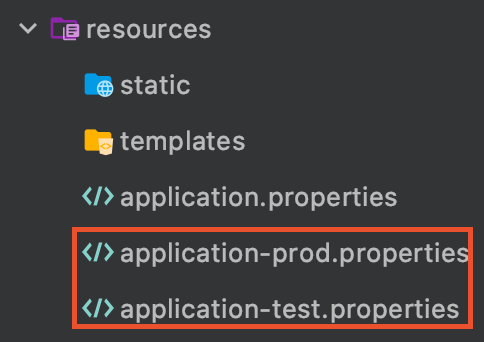
            
        * 그리고 각 파일에 맞는 설정 값을 지정한다.
        
            ```
            # application-prod.properties
            kevin.name = kevin prod
            ```
          
            ```
            # application-test.properties
            kevin.name = kevin test
            ```
                   
    * ② Profile 사용
    
        * SampleRunner의 코드를 변경한다.
        
            ```java
            @Component
            public class SampleRunner implements ApplicationRunner {
            
                @Autowired
                private String hello;
            
                @Autowired
                private KevinProperties kevinProperties;
            
                @Override
                public void run(ApplicationArguments args) throws Exception {
                    System.out.println("================");
                    System.out.println(hello);
                    System.out.println(kevinProperties.getName());
                    System.out.println("================");
                }
            }
            ```
          
        * `Profile용 프로퍼티 파일`이 `기본 application.properties` 보다 우선순위가 더 높다.
        
            * `application-prod.properties`, `application-test.properties` **>** `application.properties`
          
        * 그렇기 때문에 `application-prod.properties`의 값(kevin.name)이 `application.properties`에 있는 값(kevin.name)을 오버라이딩 한다.        

* (4) 다른 Profile용 프로퍼티 파일을 포함하기

    * `spring.profiles.include`는 `Profile용 프로퍼티 파일`을 포함할 때, 사용한다.  
    
        * ① Profile용 프로퍼티 파일 만들기
    
            ```
            # application-proddb.properties
            kevin.full-name = dbdbdb
            ```    
    
        * ② 프로파일 용 프로퍼티 파일을 포함한다.
        
            ```
            # application-prod.properties
            kevin.name = kevin prod
            spring.profiles.include=proddb
            ```
          
            * `spring.profiles.include`는 해당 `Profile용 프로퍼티 파일`의 설정들을 가져 올 수 있다.

#### 6) 로깅 1부 : 스프링 부트 기본 로거 설정 - `핵심 기능`

* (1) 로깅 퍼사드 VS 로거

    * 스프링 부트는 기본적으로 `Commons Logging`을 사용하며 결국에는 `SLF4j`를 사용하게 된다.

    * `로깅 퍼사드(Logging Facade)` : 실제 로깅을 하는 것이 아닌 **로거(Logger) API 들을 추상화 해놓은 인터페이스**다.
    
        * Ex) `Commons Logging`, `SLF4j`
    
        * `로깅 퍼사드`를 사용하면 원하는 로거로 바꿔서 사용 할 수 있다.

    * `로거(Logger)` : 로그를 기록하는 구현체를 말한다. 
    
        * Ex) `JUL`, `Log4J2` , `LogBack`
    
* (2) 스프링 5에 로거 관련 변경 사항

    * 스프링 5 이전까지

        * `Commons Logging`은 런타임 시 클래스 로딩 관련 이슈를 포함한 여러 가지 문제들이 있었다. 
        
        * 그래서 개발자들은 `Commons Logging`을 기피하게 되었고 `SLF4j`라는 새로운 로깅 퍼사드가 만들어지게 되었다.
        
        * 그럼에도 불구하고 스프링이 `Commons Logging`을 사용하는 이유는 스프링 프레임워크 코어 모듈이 만들어질 때는 `SLF4j`가 만들어지기 전이었으며 
        
        * 스프링 개발자들이 `Commons Longging`을 사용하고 있었기 때문이다.
    
        * 스프링 부트 1.x 버전에서는 `Commons Logging`에 대한 의존성을 제외시키고 `SLF4j` 의존성을 추가해서 사용 했었다고 한다. 하지만 이러한 과정은 너무 귀찮은 문제가 있었다.

    * `Spring-JCL`

        * 스프링 5 부터는 `pom.xml`에서 `Commons Logging`를 제외하지 않더라도 `Commons Logging` 코드를
        
        * 컴파일 시점에 `SLF4j` 또는 `Log4j2`로 변경 할 수 있는 기능을 가진 `Spring-JCL`이라는 모듈을 만들었다.
    
    * 정리
    
        * `Commons Logging` → `SLF4j` → `Logback`

            * `Commons Logging`을 `SLF4j`로 변환해주며 `SLF4j`는 `Logback`으로 보낸다.
          
                * `Logback` : SLF4j의 구현체
          
            * 즉, 스프링 부트는 최종적으로 `Logback`을 사용해서 로그를 남기게 된다.
    
* (3) 스프링 부트 로깅

    * 로깅 기본 포맷은 다음과 같다.
     
        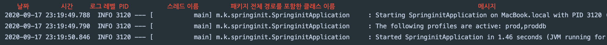
        
    * 더 많은 내용의 로그를 출력하고 싶다면 `[Edit Configurations...]에`서 `Program arguments`에 `--debug`를 지정하거나 `VM options`에 `-Ddebug`를 지정한다.  

        * `--debug` : 일부 핵심 라이브러리(내장 컨테이너, 하이버네이트, 스프링 부트)만 디버깅 모드로 더 많은 정보를 출력한다.
        
        * `--trace` : 전부 다 디버깅 모드로 출력한다.
 
    * 로그를 컬러로 출력
    
        * `application.properties`에서 `spring.output.ansi.enabled = always`를 지정하면 로그가 컬러로 출력된다.
 
    * 로그를 파일로 출력
    
        * 로그는 기본적으로 콘솔에 출력된다.
    
        * 로그를 파일로 출력하는 방법은 다음과 같이 2가지가 있다.
        
            * `logging.file` : 지정한 로그 파일에 기록한다.
            
            * `logging.path` : 지정한 경로에 `spring.log` 파일로 기록한다. 
            
                * 예를 들어, `logging.path=logs`를 지정하면 logs 디렉토리 안에 `spring.log` 파일로 기록된다.
        
    * 로그 레벨 조정
    
        * `logging.level.패키지경로 = 로그 레벨`처럼 패키지 마다 로그 레벨을 지정 할 수 있다.
        
            * `logging.level.me.kevinntech = DEBUG`로 지정하면 해당 패키지의 로그 레벨을 디버그로 지정한다.
        
    * 로거 만들기
    
        * `LoggerFactory` 클래스의 `getLogger()` 메소드로 `Logger` 객체를 얻는다. (이때, SLF4j를 사용)

            ```java
            import org.slf4j.Logger;
            import org.slf4j.LoggerFactory;
          
            @Component
            public class SampleRunner implements ApplicationRunner {
            
                private Logger logger = LoggerFactory.getLogger(SampleRunner.class);
            
                @Autowired
                private String hello;
            
                @Autowired
                private KevinProperties kevinProperties;
            
                @Override
                public void run(ApplicationArguments args) throws Exception {
                    logger.info("=====================");
                    logger.info(hello);
                    logger.info(kevinProperties.getName());
                    logger.info(kevinProperties.getFullName());
                    logger.info("=====================");
                }
            }
            ```
          
        * 로그 레벨 마다 로그를 출력하는 메소드를 제공한다.
        
            * 위에서 아래쪽으로 내려 갈수록 심각한 오류를 의미한다.

                * ① `logger.trace()` : debug 보다 훨씬 상세한 정보를 표시한다.

                * ② `logger.debug()` : 디버깅하기 위한 정보를 표시한다.

                * ③ `logger.info()` : 로그인, 상태 변경과 같은 정보성 메시지를 표시한다. 
                
                * ④ `logger.warn()` : 오류는 아니지만, 잠재적인 오류의 원인이 될 수 있는 경고성 정보를 표시한다.
                
                * ⑤ `logger.error()` : 요청을 처리하는 도중 오류가 발생한 경우, 표시한다.

                    * 개발 할 때는 로그를 조금 더 자세히 보고 싶을 수도 있고, 실제 운영 중일 때는 그 정도까지는 필요 없을 수도 있기 때문에
                    
                    * 필요에 따라 로그 레벨을 조정하여 원하는 레벨로 로그를 남길 수 있다.
          
#### 7) 로깅 2부 : 커스터마이징 - `핵심 기능`

* (1) 실습 준비

    * ① 로그를 INFO에서 DEBUG 레벨로 출력 하도록 변경한다.

        ```java
        @Component
        public class SampleRunner implements ApplicationRunner {
        
            private Logger logger = LoggerFactory.getLogger(SampleRunner.class);
        
            @Autowired
            private String hello;
        
            @Autowired
            private KevinProperties kevinProperties;
        
            @Override
            public void run(ApplicationArguments args) throws Exception {
                logger.debug("=====================");
                logger.debug(hello);
                logger.debug(kevinProperties.getName());
                logger.debug(kevinProperties.getFullName());
                logger.debug("=====================");
            }
        }
        ```
      
    * ② `[Edit Configurations...]`에서 `VM Options`와 `Program arguments`에 설정한 내용을 제거한다.
    
    * ③ `application.properties`에서 `logging.level.org.springframework=debug`를 추가하고 실행한 다음, 결과를 확인한다.
    
        * 그러면 위의 코드에서 `logger.debug(hello)`와 같이 내가 DEBUG 레벨로 출력한 로그는 콘솔에 표시되지 않는다.
        
        * 그 이유는 `me.kevinntech` 패키지는 여전히 INFO 레벨이기 때문이다.

    * ④ 그래서 `application.properties`에서 `logging.level.me.kevinntech=debug`를 추가하고 실행하면 정상적으로 출력되는 것을 확인 할 수 있다.

        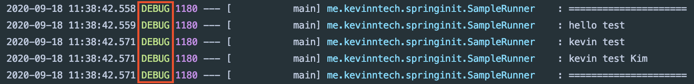

* (2) 커스텀 로그 설정 파일 사용하기

    * 로거에 맞는 커스텀 로그 설정 파일을 다음과 같이 생성한다.
      
        * Logback : `logback-spring.xml`
        
            ```html
            <?xml version="1.0" encoding="UTF-8"?>
            <configuration>
                <include resource="org/springframework/boot/logging/logback/base.xml"/>
                <logger name="me.kevinntech" level="DEBUG"/>
            </configuration>
            ```
          
            * `application.properties` 보다 더 많은 로거 관련 설정이 필요하다면 커스텀 로그 설정 파일을 생성한다.
    
        * Log4J2 : `log4j2-spring.xml`
      
        * JUL (추천 X) : `logging.properties`
        
    * `Logback extension`
    
        * Logback 설정 파일 안에서 `프로파일` 또는 `Environment 프로퍼티`를 사용 할 수 있다.
    
            * 프로파일 : `<springProfile name="프로파일">`
            
                * 특정 프로파일 일 때만, 특정 로그 설정이 적용 되도록 할 수 있다.
            
            * Environment 프로퍼티 : `<springProperty>`

* (3) 로거를 Log4j2로 변경하기

    * 기본적으로는 Logback을 사용하게 되는데 Log4j2로 변경하는 방법은 다음과 같다.
   
        * 일단, 이전 실습에서 만들었던 `logback-spring.xml`를 삭제한다.
        
        * ① `pom.xml`에서 기본적으로 들어오는 로깅을 `<exclusion>`으로 제외한다.
        
        * ② 그리고 `log4j2` 의존성을 추가한다.
        
            ```html
            <dependency>
                <groupId>org.springframework.boot</groupId>
                <artifactId>spring-boot-starter-web</artifactId>
                <exclusions>
                    <exclusion>
                        <groupId>org.springframework.boot</groupId>
                        <artifactId>spring-boot-starter-logging</artifactId>
                    </exclusion>
                </exclusions>
            </dependency>
            
            <dependency>
                <groupId>org.springframework.boot</groupId>
                <artifactId>spring-boot-starter-log4j2</artifactId>
            </dependency>
            ```
    
        * ③ `application.properties`에 `logging.level.me.kevinntech = debug`를 추가한 다음, 애플리케이션을 실행한다.

        * ④ 이제, 최종적으로 로그 메시지를 출력하는 것은 Log4J2가 된다.
    
#### 8) 테스트 - `핵심 기능`

* (1) 실습 준비

    * ① 새로운 프로젝트를 생성한다.
    
    * ② `Controller`와 `Service` 클래스를 작성한다. 
    
    * 그리고 `Controller`가 `Service`를 호출하고 "hello kevin"를 리턴하도록 한다.
    
        ```java
        @RestController
        public class SampleController {
        
            @Autowired
            private SampleService sampleService;
        
            @GetMapping("/hello")
            public String hello() {
                return "hello " + sampleService.getName();
            }
        
        }
        ```
        
        ```java
        @Service
        public class SampleService {
        
            public String getName() {
                return "kevin";
            }
        }
        ```
      
    * ③ 테스트 코드를 작성 하기 전에 `pom.xml`에 다음과 같은 의존성이 존재하는지 확인한다.
    
        * `spring-boot-starter-test`라는 의존성이 추가되어 있다면 테스트에 필요한 라이브러리는 대부분 있다고 보면 된다. (`JUnit`, `Mockito`, `JsonPath` 등...)
    
            ```html
            <dependency>
                <groupId>org.springframework.boot</groupId>
                <artifactId>spring-boot-starter-test</artifactId>
                <scope>test</scope>
            </dependency>
            ```
      
* (2) 테스트 코드 작성

    * `@SpringBootTest`
    
        * 스프링 부트의 통합 테스트 애노테이션이며 테스트에 필요한 모든 의존성을 제공한다.

            * JUnit 4에서는 `@RunWith(SpringRunner.class)`와 같이 사용해야 한다.
            
            * JUnit 5에서는 `@SpringBootTest` 안에 `@ExtendWith(SpringExtension.class)`가 포함되어 때문에 생략 가능하다.
        
        * `webEnvironment`의 타입
        
            * `MOCK` : 내장 서블릿 컨테이너를 구동 하지 않고 서블릿 컨테이너를 Mocking 한 것을 실행한다. (기본 값)
            
                * `webEnvironment`가 Mock 타입이면 실제 서블릿 컨테이너를 구동 하지 않고 서블릿 컨테이너를 Mocking 한 것을 실행한다.
 
                * 이 때는 `MockMVC`라는 클라이언트를 사용해야 한다.
            
            * `RANDOM_PORT`, `DEFINED_PORT` : 내장 서블릿 컨테이너를 구동한다.
            
                * `webEnvironment`가 `RANDOM_PORT` 또는 `DEFINED_PORT` 타입이면 해당 포트로 내장 서블릿 컨테이너를 구동한다.
                
                * 이 때는 `MockMvc`가 아닌 `TestRestTemplate` 이나 `WebTestClient`라는 클라이언트를 사용해야 한다.
                        
            * `NONE` : 서블릿 환경을 제공하지 않는다.

    * `MockMvc` 사용
    
        * `MockMVC` 라는 클라이언트를 사용하려면 `@AutoConfigureMockMvc`를 붙여주고, `MockMVC`를 주입 받으면 된다.          
    
            ```java
            @RunWith(SpringRunner.class)
            @SpringBootTest(webEnvironment = SpringBootTest.WebEnvironment.MOCK)
            @AutoConfigureMockMvc
            public class SampleControllerTest {
            
                @Autowired
                MockMvc mockMvc; // MockMvc를 주입 받는다.
            
                @Test
                public void hello() throws Exception {
                    mockMvc.perform(get("/hello"))      // MockMvc를 통해 "/hello"로 HTTP GET 요청을 한다.
                            .andExpect(status().isOk()) // status 코드가 200 OK
                            .andExpect(content().string("hello kevin")) // 컨텐츠가 hello kevin 이길 바란다.
                            .andDo(print()); // 요청온 것을 출력한다.
                }
            
            }
            ```
          
            * ① `@RunWith(SpringRunner.class)`
            
                * JUnit에서 기본적으로 내장된 Runner가 아닌 스프링 Runner를 사용 하도록 한다.
        
            * ② `mockMvc.perform(get("/hello"))`
            
                * MockMvc를 통해 해당 주소로 HTTP GET 요청을 한다.

            * ③ `.andExpect(status().isOk())`
            
                * `mockMvc.perform()`의 결과를 검증한다.
                
                * HTTP Header의 상태(Status)가 200 OK 인지 검증한다.
        
            * ④ `.andExpect(content().string("hello kevin"))`
            
                * `mockMvc.perform()`의 결과를 검증한다.
                
                * 응답 본문의 내용을 검증한다.
        
    * `TestRestTemplate` 사용
     
        * 다음과 같이 webEnvironment를 RANDOM_PORT 타입으로 지정하고 `TestRestTemplate`를 주입 받아서 사용한다.
        
            ```java
            @RunWith(SpringRunner.class)
            @SpringBootTest(webEnvironment = SpringBootTest.WebEnvironment.RANDOM_PORT)
            public class SampleControllerTest {
            
                @Autowired
                TestRestTemplate testRestTemplate;
            
                @Test
                public void hello() throws Exception {
                    String result = testRestTemplate.getForObject("/hello", String.class); // 
                    assertThat(result).isEqualTo("hello kevin");
                }
            
            }
            ```
          
            * 위의 코드는 테스트용 서블릿 컨테이너가 랜덤 포트로 구동된다.
        
            * `getForObject(url, responsetype)`는 해당 URL에 HTTP GET 방식으로 요청하여 결과를 `responsetype` 타입으로 받는다.
         
        * 만약 `Service` 단까지 가지 않고 `Controller`만 테스트 하고 싶다면 어떻게 해야할까?
       
            ```java
            @RunWith(SpringRunner.class)
            @SpringBootTest(webEnvironment = SpringBootTest.WebEnvironment.RANDOM_PORT)
            public class SampleControllerTest {
            
                @Autowired
                TestRestTemplate testRestTemplate;
            
                @MockBean
                SampleService mockSampleService;
            
                @Test
                public void hello() throws Exception {
                    when(mockSampleService.getName()).thenReturn("kevin");
                    String result = testRestTemplate.getForObject("/hello", String.class);
                    assertThat(result).isEqualTo("hello kevin");
            
                }
            
            }
            ```
          
          * `@MockBean`으로 컨트롤러가 사용하는 서비스(`SampleService`) 타입의 Mock 객체를 정의한다. (Mocking)
        
          * 그러면 `SampleController`가 사용하는 `ApplicationContext`에 있는 `SampleService` 빈을 Mock 객체(`mockSampleService`)로 교체한다.
        
          * 그래서 원본이 아닌 Mock 객체를 사용해서 테스트 할 수 있다.
          
    * `WebTestClient` 사용
     
        * `WebTestClient`를 사용하면 비동기적으로 클라이언트 요청을 할 수 있다.
        
            * ① 먼저, `pom.xml`에 `WebFlux` 의존성을 추가한다.
            
                ```html
                <dependency>
                    <groupId>org.springframework.boot</groupId>
                    <artifactId>spring-boot-starter-webflux</artifactId>
                </dependency>
                ```
              
            * ② 코드를 다음과 같이 수정한다.
            
                ```java
                @RunWith(SpringRunner.class)
                @SpringBootTest(webEnvironment = SpringBootTest.WebEnvironment.RANDOM_PORT)
                public class SampleControllerTest {
                
                    @Autowired
                    WebTestClient webTestClient;
                
                    @MockBean
                    SampleService mockSampleService;
                
                    @Test
                    public void hello() throws Exception {
                        when(mockSampleService.getName()).thenReturn("kevin");
                
                        webTestClient.get().uri("/hello").exchange() // 요청
                                .expectStatus().isOk()
                                .expectBody(String.class).isEqualTo("hello kevin");
                    }
                
                }
                ```
              
                * `@SpringBootTest` 애노테이션은 스프링 메인 애플리케이션(`@SpringBootApplication`)을 찾아가서 
                
                * 해당 패키지를 기준으로 하위에 있는 모든 빈(Bean)을 스캔한 다음, 테스트용 `ApplicationContext`를 만들면서 스캔한 모든 빈을 등록해주고, 
                
                * `@MockBean`을 찾아서 해당 빈(Bean)만 Mock 객체로 교체한다. 그리고 `@MockBean`는 @Test 마다 자동으로 리셋된다.
            
    * 슬라이스 테스트 (단위 테스트)
    
        * 단위 테스트를 위한 `@JsonTest`, `@WebMvcTest`, `@WebFluxTest`, `@DataJpaTest` 애노테이션을 제공한다.
        
            * 수많은 빈들을 등록하는 것이 아닌 내가 테스트 하고자 하는 빈만 등록하고 싶을 때, 해당 애노테이션을 사용한다.
            
            * 즉, 레이어 별로 잘라서 테스트를 하고 싶을 때 사용된다. (레이어 별로 빈이 등록된다.)
                     
        * 예시
        
            * `@WebMvcTest`는 내부에 `@AutoConfigureMockMvc`를 포함하고 있다.
        
            * `@WebMvcTest`를 사용하면 하나의 컨트롤러만 테스트 할 수도 있으며 Web과 관련된 것(Controller ...)만 빈(Bean)으로 등록된다. 
            
            * 일반적인 컴포넌트(Service, Repository)는 빈으로 등록되지 않기 때문에 `@MockBean`으로 Mock 객체를 정의해야 한다.
          
            * 그리고 `@WebMvcTest`는 `MockMvc`로 테스트 해야 한다.
        
                ```java
                @RunWith(SpringRunner.class)
                @WebMvcTest(SampleController.class)
                public class SampleControllerTest {
                
                    @MockBean
                    SampleService mockSampleService;
                
                    @Autowired
                    MockMvc mockMvc;
                
                    @Test
                    public void hello() throws Exception {
                        when(mockSampleService.getName()).thenReturn("kevin");
                
                        mockMvc.perform(get("/hello"))
                                .andExpect(content().string("hello kevin"));
                    }
                
                }
                ```
          
                * `@WebMvcTest()`에 테스트 하고자 하는 클래스(SampleController.class)를 지정한다.
                
                    * SampleController 하나만 Bean으로 등록 되기 때문에, 훨씬 더 가벼운 테스트가 된다.
        
* (3) 테스트 유틸

    * 스프링 테스트가 제공하는 유틸은 다음과 같다.
    
        * ① **`OutputCapture`**
        
            * 이 중 제일 유용할 것 같은 `OutputCapture`에 대해서만 아래 실습에서 살펴본다.
            
            * `OutputCapture`는 JUnit의 Rule을 확장해서 만든 것이며 로그를 비롯한 콘솔(console)에 출력되는 모든 것을 캡처한다.
          
            * 로그 메시지를 대상으로 테스트 코드를 작성할 때, 사용 할 수 있다.
          
        * ② `TestPropertyValues`
          
        * ③ `TestRestTemplate`
          
        * ④ `ConfigFileApplicationContextInitializer`
        
    * 실습
    
        * ① SampleController에서 로거를 만든 다음, 로그를 출력한다.
        
            ```java
            @RestController
            public class SampleController {
            
                Logger logger = LoggerFactory.getLogger(SampleController.class);
            
                @Autowired
                private SampleService sampleService;
            
                @GetMapping("/hello")
                public String hello() {
                    logger.info("kevin");
                    System.out.println("skip"); // 이렇게 작성하면 안되지만 이것 또한 캡처된다는 것을 보여주기 위해서 작성한다.
                    return "hello " + sampleService.getName();
                }
            
            }
            ```
          
        * ② outputCapture를 통해 holoman과 skip이 출력되는지 확인 할 수 있다.

            ```java
            @RunWith(SpringRunner.class)
            @WebMvcTest(SampleController.class)
            public class SampleControllerTest {
            
                @Rule
                public OutputCapture outputCapture = new OutputCapture();
            
                @MockBean
                SampleService mockSampleService;
            
                @Autowired
                MockMvc mockMvc;
            
                @Test
                public void hello() throws Exception {
                    when(mockSampleService.getName()).thenReturn("kevin");
            
                    mockMvc.perform(get("/hello"))
                            .andExpect(content().string("hello kevin"));
            
                    assertThat(outputCapture.toString())
                            .contains("kevin")
                            .contains("skip");
                }
            
            }
            ```
          
#### 9) Spring-Boot-Devtools - `핵심 기능`

* `Spring-Boot-Devtools`는 개발할 때, 유용한 기능을 포함하고 있는 스프링 부트 모듈이다.

    * `Spring-Boot-Devtools` 사용하기

        * `pom.xml`에 다음과 같은 의존성을 추가해야 한다.
        
            ```html
            <dependency>
                <groupId>org.springframework.boot</groupId>
                <artifactId>spring-boot-devtools</artifactId>
            </dependency>
            ```
          
    * 주요 기능

        * ① **캐시 설정을 개발 환경에 맞게 변경한다.** `[Property Defaults]`
        
            * 캐싱은 운영 환경에서는 매우 유용하지만 개발 환경에서는 방금 애플리케이션에서 변경 한 내용을 볼 수 없기 때문에 불편한 점이 있다.
            
            * 이러한 이유로 `spring-boot-devtools`는 개발 단계에서는 캐시 설정을 비활성화한다.
        
                * `캐시(Cache)`란 데이터를 미리 복사해 놓는 임시 저장소를 말한다.
        
        * ② **클래스패스에 있는 파일이 변경될 때 마다** (Build Project) **자동으로 애플리케이션을 재시작한다.** `[Automatic Restart]`
        
            * 재시작하는 속도가 직접 톰캣을 종료 했다가 구동하는 것 보다 훨씬 빠르다. 그 이유는 스프링 부트가 2개의 클래스 로더를 사용하기 때문이다.
            
                * ① `base classloader`: 의존성을 읽어 들이는 클래스 로더다.
                
                * ② `restart classloader`: 애플리케이션을 읽어 들이는 클래스 로더다.
        
        * ③ **애플리케이션을 재시작 했을 때, 웹 브라우저를 자동 새로고침(refresh)하는 기능(live reload)를 제공한다.** `[LiveReload]`
        
            * 해당 기능을 적용 하려면 웹 브라우저에 플러그인을 설치해야 한다.
            
            * Live Reload 서버를 사용하지 않으려면 `spring.devtools.liveload.enabled = false`로 설정한다.
            
        * ④ **글로벌 설정** `[Global Settings]`
        
            * `spring-boot-devtools` 의존성이 추가되어 있다면 `~/.spring-boot-devtools.properties`가 프로퍼티 우선 순위가 가장 높아진다.
            
        * ⑤ 리모트 애플리케이션 `[Remote Applications]`
        
            * 원격에서 동작하고 있는 애플리케이션을 종료하거나 재시작할 수 있는 기능이다. 
            
            * 운영 환경에서 사용하는 기능은 아니며 개발용이다. 설정하는 것도 복잡하기 때문에 사용하는 것을 추천하지 않는다.

#### 10) 스프링 웹 MVC 1부 : 소개

* (1) 실습 준비

    * ① 새로운 프로젝트를 생성한다.
    
    * ② test 디렉토리에서 user 패키지를 생성한 다음, `UserControllerTest` 클래스를 작성한다.
    
    * ③ 테스트 코드를 작성한다.

        ```java
        @RunWith(SpringRunner.class)
        @WebMvcTest(UserController.class)
        public class UserControllerTest {
        
            @Autowired
            MockMvc mockMvc; // @WebMvcTest를 만들때 주로 사용하는 MockMvc 객체를 주입 받는다.
        
            @Test
            public void hello() throws Exception {
                mockMvc.perform(get("/hello"))
                        .andExpect(status().isOk())
                        .andExpect(content().string("hello"));
            }
        
        }
        ```
      
    * ④ 그리고 다음과 같이 컨트롤러(UserController)를 작성한 다음, 테스트를 실행하면 성공하게 된다.
        
         ```java
         @RestController
         public class UserController {
         
             @GetMapping("/hello")
             public String hello() {
                 return "hello";
             }
         }
         ```
      
    * 스프링 부트는 자동 설정을 통해 스프링 웹 MVC 기능들을 기본적으로 제공하기 때문에 어떠한 설정 파일을 작성하지 않아도 바로 스프링 웹 MVC 개발을 시작 할 수 있다.
    
* (2) 스프링 웹 MVC 란?

    * MVC 패턴 기반의 웹 프레임워크를 말한다.
    
* (3) 스프링 MVC 확장 ★★★

    * 스프링 부트가 기본적으로 제공하는 스프링 웹 MVC 기능들을 모두 사용하면서 추가적인 설정을 하고 싶다면
    
    * `@Configuration` + `WebMvcConfigurer`를 사용한다.

         ```java
        @Configuration
        public class WebConfig implements WebMvcConfigurer {
        
        }
         ```
    
* (4) 스프링 MVC 재정의

    * 스프링 웹 MVC 기능들을 원하는 대로 재정의 하고 싶다면 `@Configuration` + `@EnableWebMvc`를 사용한다.
    
#### 11) 스프링 웹 MVC 2부 : HttpMessageConverters

* (1) HttpMessageConverters 인터페이스

    * `HttpMessageConverters`는 HTTP 요청 본문을 객체로 변환하거나 객체를 HTTP 응답 본문으로 변환할 때 사용한다.
     
    * `{“username”:”kevin”, “password”:”123”}` <-> `User`
    
    * `@RequestBody`, `@ResponseBody`와 함께 사용한다.
    
* (2) HttpMessageConverters 실습

    * ① HTTP 요청 본문에 아래와 같은 데이터가 있을 때, 객체로 변환하고 싶다면 

         ```
        // HTTP 요청 본문
        {“username”:”kevin”, “password”:”123”}
         ```
      
    * ② 먼저, 변환하고자 하는 객체에 해당하는 클래스를 만든다. 

         ```java
         public class User {      
            private Long id;
        
            private String username;
        
            private String password;
        
            /* getter, setter가 있어야 한다.
               그러면 자바 빈 규약에 따라서 getter, setter를 사용해서 바인딩을 해준다. */
         }
         ```
    
    * ③ 그리고 컨트롤러를 작성할 때, 다음과 같이 `@RequestBody`와 `@ResponseBody`를 사용하면 된다.
 
        ```java
        @RestController
        public class UserController {
        
          @PostMapping("/users/create")
          public @ResponseBody User create(@RequestBody User user){
              return user;
          }
        }
        ```
      
        * `@RestController`를 사용하면 `@ResponseBody`를 생략 할 수 있다.
 
        * `@Controller`를 사용하면 `@ResponseBody`를 추가해주어야 한다. 
        
        * 그렇지 않으면 뷰 리졸버를 사용하여 반환 값에 해당하는 뷰를 찾는다.
      
    * ④ 아래와 같은 테스트 코드를 작성하여 정상 동작 하는지 확인 해보자.
    
        ```java
        import static org.hamcrest.Matchers.equalTo;
        import static org.hamcrest.Matchers.is;
        import static org.springframework.test.web.servlet.request.MockMvcRequestBuilders.get;
        import static org.springframework.test.web.servlet.request.MockMvcRequestBuilders.post;
        import static org.springframework.test.web.servlet.result.MockMvcResultMatchers.*;
        
        
        @RunWith(SpringRunner.class)
        @WebMvcTest(UserController.class)
        public class UserControllerTest {
        
          @Autowired
          MockMvc mockMvc;
        
          @Test
          public void createUser_JSON() throws Exception {
              String userJson = "{\"username\":\"kevin\", \"password\":\"123\"}";
        
              mockMvc.perform(post("/users/create")
                      .contentType(MediaType.APPLICATION_JSON_UTF8)
                      .accept(MediaType.APPLICATION_JSON_UTF8)
                      .content(userJson))
                  .andExpect(status().isOk())
                  .andExpect(jsonPath("$.username", is(equalTo("kevin"))))
                  .andExpect(jsonPath("$.password", is(equalTo("123"))));
          }
          
        }
        ```

#### 12) 스프링 웹 MVC 3부 : ViewResolver

* (1) ContentNegotiatingViewResolver

    * 스프링 부트는 ViewResolver 중 하나인 `ContentNegotiatingViewResolver`를 제공한다.
      
    * HTTP 요청에 있는 Accept 헤더는 클라이언트(웹 브라우저)가 원하는 응답의 형태를 값으로 담고 있다.
      
    * 즉, Accept 헤더의 값에 따라 응답이 달라 질 수 있다.
      
    * `ContentNegotiatingViewResolver`는 어떠한 요청이 들어오면 해당 요청에 대해 응답을 만들 수 있는 모든 View를 찾아낸 다음, Accept 헤더와 비교해서 가장 적절한 View를 반환한다.
      
    * 클라이언트가 원하는 View를 판단하는데 있어서 가장 좋은 정보는 Accept 헤더이며 경우에 따라서는 Accept 헤더를 제공하지 않는 요청도 있다.
      
    * 이러한 경우, format이라는 파라미터 `"/path?format=pdf"` 를 사용하면 해당 타입의 View를 반환한다.
     
* (2) 실습

    * ① JSON의 경우, 별도의 설정이 필요 없지만 XML의 경우, `pom.xml`에 아래 의존성을 추가해야 XML 메시지 컨버터가 동작한다.
    
        ```html
        <dependency>
            <groupId>com.fasterxml.jackson.dataformat</groupId>
            <artifactId>jackson-dataformat-xml</artifactId>
            <version>2.9.6</version>
        </dependency>
        ```

    * ② 다음과 같이 테스트 코드를 변경한 다음, 테스트를 실행한다.
    
        ```java
        @RunWith(SpringRunner.class)
        @WebMvcTest(UserController.class)
        public class UserControllerTest {
        
            @Autowired
            MockMvc mockMvc; // Web Mvc Test를 만들때 주로 사용하는 MockMvc 객체를 주입 받는다.
        
            @Test
            public void createUser_JSON() throws Exception {
                String userJson = "{\"username\":\"kevin\", \"password\":\"123\"}";
        
                mockMvc.perform(post("/users/create")
                        .contentType(MediaType.APPLICATION_JSON_UTF8) // 요청은 JSON
                        .accept(MediaType.APPLICATION_XML) // 응답은 XML
                        .content(userJson))
                    .andExpect(status().isOk())
                    .andExpect(xpath("/User/username").string("kevin"))
                    .andExpect(xpath("/User/password").string("123"));
            }
        
        }
        ```
      
* (3) HttpMessageConvertersAutoConfiguration

    *  `HttpMessageConverter`는 `HttpMessageConvertersAutoConfiguration`에 의해서 적용된다.
    
#### 13) 스프링 웹 MVC 4부 : 정적 리소스 지원

* (1) 정적 리소스

    * 정적 리소스는 이미 만들어져 있는 리소스(HTML, CSS, JS ...)를 말한다.

    * 즉, 클라이언트로 부터 요청을 받았을 때, 요청에 대한 리소스가 이미 만들어져 있어서 그대로 응답하면 되는 경우를 말한다.

* (2) 기본 리소스 위치

    * ① classpath:/static

    * ② classpath:/public

    * ③ classpath:/resources/

    * ④ classpath:/META-INF/resources
    
    * Ex) `/hello.html`이라는 요청이 들어왔을 때, `/static/hello.html`이 있다면 해당 파일을 요청한 곳으로 보내준다.
    
* (3) 예시

    * ① `src/resources/static`에 `hello.html`를 만든다. 

    * ② `hello.html`의 내용을 다음과 같이 작성한다.

        ```html
        <!DOCTYPE html>
        <html lang="en">
        <head>
            <meta charset="UTF-8">
            <title>Title</title>
        </head>
        <body>
          Hello Static Resource
        </body>
        </html>
        ```
    
    * ③ 그리고 스프링 부트 애플리케이션을 실행한 다음, 웹 브라우저에서 `localhost:8080/hello.html`로 요청하면 해당 파일을 보여준다.
    
        * Last-Modified 헤더를 보고 304 응답을 보낸다.
        
        * 정적 리소스는 `ResourceHttpRequestHandler`가 처리한다.
        
* (4) 요청 URL 패턴 설정

    * URL 패턴은 기본적으로 루트(/)로 되어 있다. 변경하는 방법은 다음과 같다.
    
    * ① `application.properties`에서 `spring.mvc.static-path-pattern`를 사용하여 변경한다.
  
        ```
        // application.properties
        spring.mvc.static-path-pattern=/static/**
        ```
      
    * ② `localhost:8080/static/hello.html`으로 요청해야 정상적으로 동작한다. 

* (5) 리소스 핸들러 커스터마이징
     
    * `WebMvcConfigurer`의 `addResourceHandlers()`를 오버라이딩하여 리소스 핸들러를 추가한다.
       
    * ① `me/kevinntech/demospringmvc/config` 패키지 아래에 WebConfig 클래스를 작성한다.

    * ② WebMvcConfigurer의 addResourceHandlers()를 오버라이딩하여 리소스 핸들러를 추가한다. (스프링 부트가 제공하는 리소스 핸들러는 그대로 유지함)

        ```java
        @Configuration
        public class WebConfig implements WebMvcConfigurer {
        
            @Override
            public void addResourceHandlers(ResourceHandlerRegistry registry) {
                registry.addResourceHandler("/m/**")
                        .addResourceLocations("classpath:/m/")
                        .setCachePeriod(20);
            }      
        }
        ```
      
        * 위의 코드는 `/m/`으로 시작하는 URL 요청이 오면, `classpath:/m/` 위치에 있는 리소스를 제공하는 리소스 핸들러를 추가한다.
         
        * 그리고 리소스 핸들러를 커스터마이징 할 때, 캐싱 전략은 직접 설정 해주어야 한다.
      
    * ③ `resources/m`에 `hello.html`을 작성한 다음, 애플리케이션을 실행하고 `localhost:8080/m/hello.html`로 요청한다.

#### 14) 스프링 웹 MVC 5부 : 웹 JAR

* (1) WebJars

    * 스프링 부트는 웹 JAR에 대한 기본 매핑을 지원한다.

    * `WebJars`는 클라이언트에서 사용하는 웹 라이브러리를 JAR 파일로 패키징한 것을 말한다.

    * 클라이언트에서 사용하는 웹 라이브러리 : Bootstrap, Jquery, React.js, Vue.js, Angular.js ...

* (2) 실습

    * ① 예를 들어, JQuery의 WebJAR를 사용하려면 Maven Repository에서 의존성을 복사한다.
    
        ```html
        <dependency>
            <groupId>org.webjars.bower</groupId>
            <artifactId>jquery</artifactId>
            <version>3.3.1</version>
        </dependency>
        ```
      
    * ② 프로젝트의 pom.xml에 복사한 내용을 붙여넣는다.

    * ③ `resources/m/hello.html`의 내용을 다음과 같이 변경하고 실행하면 JQuery가 정상 동작되는 것을 확인 할 수 있다.

        ```html
        <!DOCTYPE html>
        <html lang="en">
        <head>
            <meta charset="UTF-8">
            <title>Title</title>
        </head>
        <body>
        Mobile Hello Static Resource AHA
        
        <script src = "/webjars/jquery/3.3.1/dist/jquery.min.js"></script>
        <script>
            $(function() {
                alert("ready!");
            });
        </script>
        </body>
        </html>
        ```

#### 15) 스프링 웹 MVC 6부 : Index 페이지와 파비콘 

* (1) Index 페이지 (또는 Welcome Page)
          
    * 인덱스(Index) 페이지는 애플리케이션 루트로 요청했을 때 보여주는 페이지를 말한다.
      
        * 애플리케이션 루트는 `localhost:8080`를 말함
      
    * 앞서 살펴본 기본 리소스 위치에 index.html 또는 index.템플릿 파일이 존재하면 스프링이 해당 파일을 Index 페이지로 사용한다.
     
* (2) Index 페이지 - 실습
          
    * ① `resources/static`에 아래와 같은 `index.html`을 작성한다.
    
        ```html
        <!DOCTYPE html>
        <html lang="en">
        <head>
            <meta charset="UTF-8">
            <title>Title</title>
        </head>
        <body>
        <h1>웰컴!! 스프링 부트</h1>
        
        <script src = "/webjars/jquery/dist/jquery.min.js"></script>
        <script>
            $(function() {
                alert("ready!");
            });
        </script>
        </body>
        </html>
        ```

    * ② 웹 브라우저에서 애플리케이션 루트로 요청하면 인덱스 페이지가 나타나는 것을 확인 할 수 있다.
    
* (3) 파비콘(Favicon)
          
    * 파비콘은 웹 페이지 상단 탭에 보여지는 아이콘을 말한다.
           
* (4) 파비콘 만들기

    * ① 웹 브라우저에서 favicon.io를 방문한다.
 
    * ② Generator를 이용하여 텍스트, 색상을 설정한 다음, Download 버튼을 클릭하여 파비콘을 만든다.
    
* (5) 파비콘 변경하기

    * 파비콘 파일을 기본 리소스 위치로 옮긴 다음, 애플리케이션을 재 실행한다.
    
    * [파비콘이 변경되지 않을 때, 해결방법](https://stackoverflow.com/questions/2208933/how-do-i-force-a-favicon-refresh "파비콘이 변경되지 않을 때, 해결방법")
    
#### 16) 스프링 웹 MVC 7부 : Thymeleaf 

* (1) 템플릿 엔진이란?
          
    * `템플릿 엔진`은 지정된 템플릿 양식과 데이터가 합쳐져 HTML 문서를 출력하는 소프트웨어를 말한다.
    
    * 기본적인 템플릿은 같은데 그 안에 들어가는 값만 달라지는 경우가 있다.

    * 이러한 경우에는 정적인 컨텐츠를 사용 할 수 없고 동적으로 컨텐츠를 생성해서 응답을 해야한다. 이때, 템플릿 엔진을 사용 할 수 있다.
    
* (2) 스프링 부트가 자동 설정을 지원하는 템플릿 엔진
          
    * FreeMarker
    
    * Groovy
    
    * Thymeleaf
    
    * Mustache
    
* (3) JSP를 권장하지 않는 이유
          
    * JSP는 자동 설정을 지원하지 않으며 스프링 부트에서 권장하지 않는 템플릿 엔진이다.
    
    * JAR로 패키징 할 때는 동작 하지 않고, WAR로 패키징 해야 함.
    
    * Undertow는 JSP를 지원하지 않음.

* (4) 템플릿 파일 위치

    * `/src/main/resources/template/`이다.
    
* (5) Thymeleaf 사용하기
          
    * ① 타임리프 의존성을 추가한다.
    
        ```html
        <dependency>
            <groupId>org.springframework.boot</groupId>
            <artifactId>spring-boot-starter-thymeleaf</artifactId>
        </dependency>
        ```
      
    * ② 컨트롤러를 작성한다.
    
        ```java
        @Controller
        public class SampleController {
        
            @GetMapping("/hello")
            public String hello(Model model){
                // model은 Java의 Map과 같다고 생각하면 된다.
                model.addAttribute("name", "kevin");
                return "hello";
            }
        
        }
        ```
      
    * ③ 테스트 코드를 작성한다.
     
        ```java
        @RunWith(SpringRunner.class)
        @WebMvcTest(SampleController.class)
        public class SampleControllerTest {
        
            @Autowired
            MockMvc mockMvc;
        
            @Test
            public void hello() throws Exception {
        
                // 요청 "/hello"
                // 응답
                // - 모델 name : kevin
                // - 뷰 이름 : hello
        
                mockMvc.perform(get("/hello"))
                        .andExpect(status().isOk())
                        .andDo(print())
                        .andExpect(view().name("hello"))
                        .andExpect(model().attribute("name", is("kevin")))
                        .andExpect(content().string(containsString("kevin")));
            }
        }
        ```
      
    * ④ `resources/templates`에 `hello.html`를 생성한 다음, 아래와 같이 작성한다.
     
        ```html
        <!DOCTYPE html>
        <html xmlns:th="http://www.thymeleaf.org">
        <head>
            <meta charset="UTF-8">
            <title>Title</title>
        </head>
        <body>
        <h1 th:text="${name}">Name</h1>
        </body>
        </html>
        ```

#### 17) 스프링 웹 MVC 8부 :  HtmlUnit

* (1) HtmlUnit
          
    * `HtmlUnit`는 HTML을 단위 테스트 하기 위한 도구(tool)이다.
    
    * 스프링 부트는 HtmlUnit에 대한 기능을 지원한다.
    
    * HtmlUnit은 webClient를 만든 다음, webClient로 어떤 요청을 보내고 결과를 받아서 HtmlPage라는 인터페이스를 통해 여러 방식(xml, text …)으로 가져올 수 있다.
      
    * 그리고 form submit에 대한 테스트가 가능하며 특정 브라우저를 시뮬레이션 할 수도 있다. (이외에도 여러 가지 기능을 지원한다.)
    
* (2) HtmlUnit 사용하기
          
    * ① 의존성을 추가한다.

        ```html
        <dependency>
            <groupId>org.seleniumhq.selenium</groupId>
            <artifactId>htmlunit-driver</artifactId>
            <scope>test</scope>
        </dependency>
        
        <dependency>
            <groupId>net.sourceforge.htmlunit</groupId>
            <artifactId>htmlunit</artifactId>
            <scope>test</scope>
        </dependency>
        ```
    
    * ② 테스트 코드를 작성한다.
    
        ```java
        @RunWith(SpringRunner.class)
        @WebMvcTest(SampleController.class)
        public class SampleControllerTest {
        
            @Autowired
            WebClient webClient; // HtmlUnit를 사용하면 WebClient를 주입 받는다. MockMvc를 사용 할 수도 있다.
        
            @Test
            public void hello() throws Exception {
                HtmlPage page = webClient.getPage("/hello");
                HtmlHeading1 h1 = page.getFirstByXPath("//h1");
                assertThat(h1.getTextContent()).isEqualToIgnoringCase("Kevin");
            }
        }
        ```
      
#### 18) 스프링 웹 MVC 9부 : ExceptionHandler

* (1) 스프링 부트가 제공하는 기본 예외 처리기
          
    * 스프링 부트 애플리케이션을 실행하면 기본적으로 ErrorHandler가 이미 등록 되어 있다.

    * 그리고 기본 ErrorHandler에 의해 어떤 메시지들이 표시된다.
    
    * 웹 브라우저에서 localhost:8080으로 요청 시, Index 페이지가 없을 때 보이는 화면
    
    * 또는 터미널에서 `curl http://localhost:8080/`으로 요청 시 받게되는 응답이 기본 ErrorHandler가 처리해준 결과이다.
    
    * 기본적인 Error Handling 로직은 BasicErrorController에 들어 있다. (HTML과 JSON 응답 지원)
    
    * 커스터마이징을 하는 방법은 ErrorController를 구현한 클래스를 작성하고 빈으로 등록하면 된다.
    
        * BasicErrorController를 상속 받아서 작성 할 수도 있다.

* (2) 스프링 MVC 예외 처리 방법
          
    * ① 컨트롤러를 작성한다.

        ```java
        @Controller
        public class SampleController {
        
            @GetMapping("/hello")
            public String hello(){
                throw new SampleException(); // 에러를 발생시킨다.
            }
              
            /*
              @ExceptionHandler를 사용하여 SampleController에서 
              SampleException라는 예외가 발생하면 해당 핸들러를 사용하겠다라고 지정한다.
              @ResponseBody를 사용하여 Json으로 리턴한다.
              */
            @ExceptionHandler(SampleException.class)
            public @ResponseBody AppError sampleError(SampleException e){
                AppError appError = new AppError();
                appError.setMessage("error.app.key");
                appError.setReason("IDK IDK IDK");
                return appError;
            }
        
        }
        ```
    
    * ② RuntimeException을 상속 받은 SampleException 클래스를 작성한다.

        ```java
        public class SampleException extends RuntimeException {
        
        }
        ```

    * ③ 애플리케이션의 Error 정보를 담고있는 커스텀 클래스를 작성한다.

        ```java
        public class AppError {
        
            private String message;
        
            private String reason;
        
            public String getMessage() {
                return message;
            }
        
            public void setMessage(String message) {
                this.message = message;
            }
        
            public String getReason() {
                return reason;
            }
        
            public void setReason(String reason) {
                this.reason = reason;
            }
            
        }
        ```
      
    * ④ 애플리케이션을 실행한 다음, `localhost:8080/hello`로 요청하면 AppError 응답이 발생한다.
    
    * Exception Handler를 전역적으로 사용하고 싶다면 클래스를 따로 만들고 해당 클래스에 `@ControllerAdvice`를 붙인다.
      
    * 그리고 클래스 안에 `@ExceptionHandler`들을 정의하면, 여러 컨트롤러에서 발생하는 SampleException을 처리하는 핸들러가 된다.
    
* (3) 커스텀 에러 페이지
          
    * 커스텀 에러 페이지를 사용하면 에러가 발생 했을 때, 응답의 상태 코드 값에 따라 다른 에러 페이지를 보여 줄 수 있다.    
   
    * ① `src/resources/static` 또는 `src/resources/templates` 중 아무 곳이나 error 디렉토리를 생성한다.
      
    * ② html 파일을 생성할 때, 파일명을 상태 코드 값에 맞게 작성하면 된다.
      
    * 예를 들어, `404.html` 또는 `5xx.html`과 같이 작성하면 된다.
      
#### 19) 스프링 웹 MVC 10부 :  Spring HATEOAS

* (1) HATEOAS란?

    * `HATEOAS`는 **H**ypermedia **A**s **T**he **E**ngine Of **A**pplication **S**tate의 약자로

    * Rest API에서 서버가 클라이언트에게 리소스를 제공할 때, 리소스와 연관된 정보를 같이 제공하며 클라이언트는 연관된 링크 정보를 바탕으로 리소스에 접근하는 것을 말한다.

* (2) 연관된 링크 정보?

    * ① Relation

    * ② Hypertext Reference

* (3) Spring HATEOAS란?

    * HATEOAS를 구현하기 위해 편리한 기능들을 제공 해주는 tool(라이브러리)이다.
    
* (4) Spring HATEOAS - 실습

    * ① `spring-boot-starter-hateoas` 의존성 추가

        ```html
        <dependency>
        	<groupId>org.springframework.boot</groupId>
        	<artifactId>spring-boot-starter-hateoas</artifactId>
        </dependency>
        ```
        
        * `spring-boot-starter-hateoas` 의존성 추가하면 스프링 부트는 다음과 같은 것들을 제공한다.
        
        * ObjectMapper 제공
            * `spring.jackson.* `  
            * `Jackson2ObjectMapperBuilder`
        
        * LinkDiscovers 제공
            * 클라이언트 쪽에서 링크 정보를 Rel 이름으로 찾을때 사용할 수 있는 XPath 확장 클래스

    * ② SampleController를 작성한다.
 
        ```java
        @RestController
        public class SampleController {
        
            @GetMapping("/hello")
            public Resource<Hello> hello() {
                Hello hello = new Hello();
                hello.setPrefix("Hey,");
                hello.setName("Kevin");
        
                // Hateoas에 있는 Resource 클래스를 사용하여 링크 정보를 추가한다.
                Resource<Hello> helloResource = new Resource<>(hello);
                helloResource.add(linkTo(methodOn(SampleController.class).hello()).withSelfRel());
        
                return helloResource;
            }
        
        }
        ```
       
            * Hateoas에 있는 Resource를 선언한다. 
    
            * (해당 Resource는 서버가 제공할 리소스 + 링크 정보를 뜻한다.)
    
            * 그리고 SampleController 클래스에서 제공하는 hello()라는 메서드에 대한 링크를 Self라는 릴레이션으로 만들어서 추가한다.
 
        * Spring HATEOAS 1.0 부터 `Resource`는 `EntityModel`로 대체 되었다.
        
             ```java
             @RestController
             public class SampleController {
             
                 @GetMapping("/hello")
                 public EntityModel<Hello> hello(){
                     Hello hello = new Hello();
                     hello.setPrefix("Hey, ");
                     hello.setName("Kevin");
             
                     EntityModel<Hello> helloEntityModel = new EntityModel<>(hello);
                     helloEntityModel.add(linkTo(methodOn(SampleController.class).hello()).withSelfRel());
             
                     return helloEntityModel;
                 }
             }
             ```
 
     * ③ 위의 코드에서 사용된 Hello 클래스를 작성한다.
     
        ```java
        public class Hello {
        
            private String prefix;
        
            private String name;
        
            public String getPrefix() {
                return prefix;
            }
        
            public void setPrefix(String prefix) {
                this.prefix = prefix;
            }
        
            public String getName() {
                return name;
            }
        
            public void setName(String name) {
                this.name = name;
            }
        
            @Override
            public String toString() {
                return prefix + " " + name;
            }
        }
        ```
       
     * ④ 그리고 테스트 코드를 작성한다.
     
        ```java
        @RunWith(SpringRunner.class)
        @WebMvcTest(SampleController.class)
        public class SampleControllerTest {
        
            @Autowired
            MockMvc mockMvc;
        
            @Test
            public void hello() throws Exception {
                mockMvc.perform(get("/hello"))
                        .andDo(print())
                        .andExpect(status().isOk())
                        .andExpect(jsonPath("$._links.self").exists());
            }
        }
        ```

#### 20) 스프링 웹 MVC 11부 : CORS

* (1) Origin

    * Origin은 특정 페이지에 접근할 때 사용되는 URI의 스키마, 호스트 이름, 포트를 말한다. 
    
    * 즉, 아래의 세가지를 조합한 것이 하나의 Origin 이다.
         
        * ① URI 스키마 (http, https)
            
           * URI 스키마를 URI 프로토콜 이라고도 함
        
        * ② 호스트 이름 (whiteship.me, localhost)
          
        * ③ 포트 (8080, 18080)
        
    * URI의 스키마, 호스트 이름, 포트 이 3가지 중 하나라도 다르면 `Cross-Origin`이다.
        
* (2) SOP (Single-Origin Policy)

    * `SOP`는 같은 Origin에만 리소스를 요청 할 수 있는 정책이다.
      
    * 기본적으로는 SOP가 적용되어 있으므로 Origin이 다른 경우에는 리소스를 요청 할 수 없다.
    
    * localhost:18080의 애플리케이션이 localhost:8080에서 실행 중인 애플리케이션의 리소스를 가져 올 수 없다. 
    
    * 그 이유는 SOP에 위반되기 때문이다.
    
* (3) CORS (Cross-Origin Resource Sharing)

    * `CORS`는 서로 다른 Origin끼리 리소스를 요청 할 수 있는 정책이다.

    * 즉, SOP를 우회하기 위한 표준 기술이다.
    
* (4) CORS - 실습

    * ① Rest API를 제공하는 서버를 만들기 위해, 새로운 프로젝트를 생성한다.

    * ② 다음과 같은 코드를 작성한다.
    
        ```java
        @SpringBootApplication
        @RestController
        public class SpringcorsserverApplication {
          
            // @CrossOrigin(origins = "http://localhost:18080")
            // /hello로 GET 요청을 하면 Hello라는 메시지를 표시한다. (REST API)
        	@GetMapping("/hello")
        	public String hello(){
        		return "Hello";
        	}
        
        	public static void main(String[] args) {
        		SpringApplication.run(SpringcorsserverApplication.class, args);
        	}
        
        }
        ```
      
    * ③ Rest API를 요청하는 클라이언트를 만들기 위해, 새로운 프로젝트를 생성한다.

    * ④ Mvn Repository에서 JQuery 의존성을 복사한 다음, pom.xml에 추가한다.

        ```html
        <dependency>
            <groupId>org.webjars.bower</groupId>
            <artifactId>jquery</artifactId>
            <version>3.3.1</version>
        </dependency>
        ```

    * ⑤ 그리고 클라이언트 프로젝트에 Index 페이지를 생성한다.  

        ```html
        <!DOCTYPE html>
        <html lang="en">
        <head>
            <meta charset="UTF-8">
            <title>Title</title>
        </head>
        <body>
        <h1>CORS Client</h1>
        
        <script src="/webjars/jquery/3.3.1/dist/jquery.min.js"></script>
        <script>
            $(function() {
                $.ajax("http://localhost:8080/hello")
                .done(function(msg){
                    alert(msg);
                })
                .fail(function(){
                    alert("fail");
                });
            });
        </script>
        </body>
        </html>
        ```

    * ⑥ `application.properties`에서 `server.port = 18080`를 지정하여 포트를 변경한 다음, 클라이언트 역할을 하는 애플리케이션을 실행한다.

    * ⑦ 결과는 fail인데 그 이유는 서버 애플리케이션에 CORS 설정을 하지 않았기 때문이다.
    
    * ⑧ 서버 프로젝트의 코드에서 @CrossOrigin 애노테이션을 사용하도록 변경한다.
    
    * ⑨ 서버 애플리케이션을 재실행하고 클라이언트 애플리케이션에서 요청하면 정상적으로 처리되는 것을 확인 할 수 있다.
    
* (5) 여러 컨트롤러에 대한 CORS 설정

    * 여러 컨트롤러에 대해 CORS 설정을 해야 된다면 `WebMvcConfigurer`를 구현한 WebConfig 클래스를 작성한다. (웹 관련 설정 파일 작성)
      
    * 그리고 `addCorsMappings()`를 오버라이딩 하면 된다.
    
        ```java
        @Configuration
        public class WebConfig implements WebMvcConfigurer {
        
            @Override
            public void addCorsMappings(CorsRegistry registry) {
                registry.addMapping("/**")
                        .allowedOrigins("http://localhost:18080");
            }
        }
        ```
      
#### 21) 스프링 데이터 1부 : 소개

* 자세한 내용은 해당 강좌를 참고하자.

#### 22) 스프링 데이터 2부 : 인메모리 데이터베이스

* 인-메모리 데이터베이스

    * 주기억장치(main memory)에 데이터를 저장하는 DBMS를 말한다.

    * Mysql과 같은 DBMS는 디스크에 데이터를 저장한다.

    * 디스크에 최적화된 데이터베이스보다 더 빠르다.

    * 메모리에 저장 되기 때문에 휘발성이라는 단점이 있다.

* 스프링 부트가 지원하는 인메모리 데이터베이스

    * ① H2 (추천, 콘솔 때문에...)

    * ② HSQL
    
    * ③ Derby

* `Spring-JDBC`가 클래스패스에 있으면 자동 설정이 필요한 빈을 설정 해준다.

    * ① DataSource

    * ② JdbcTemplate

* 프로젝트 생성하기

    * 프로젝트를 생성할 때, 다음과 같이 설정한다.
    
        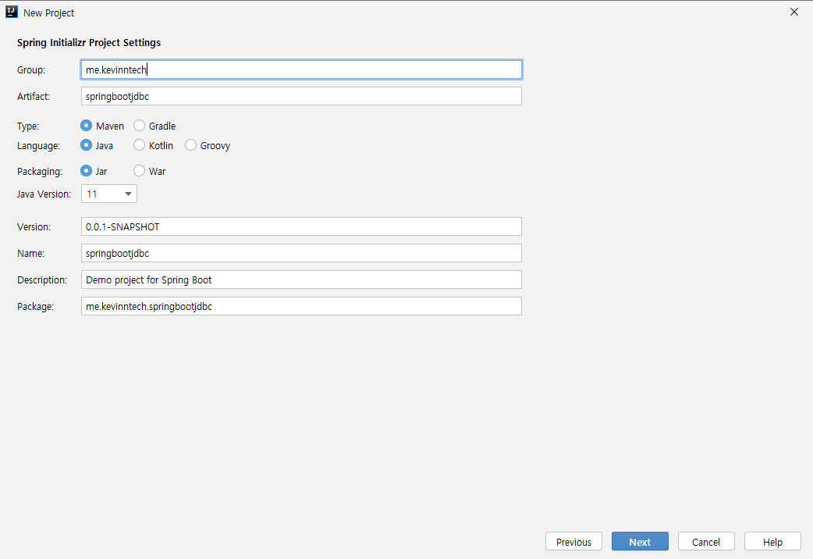
        
    * 그리고 h2, JDBC 라이브러리를 추가한다.

        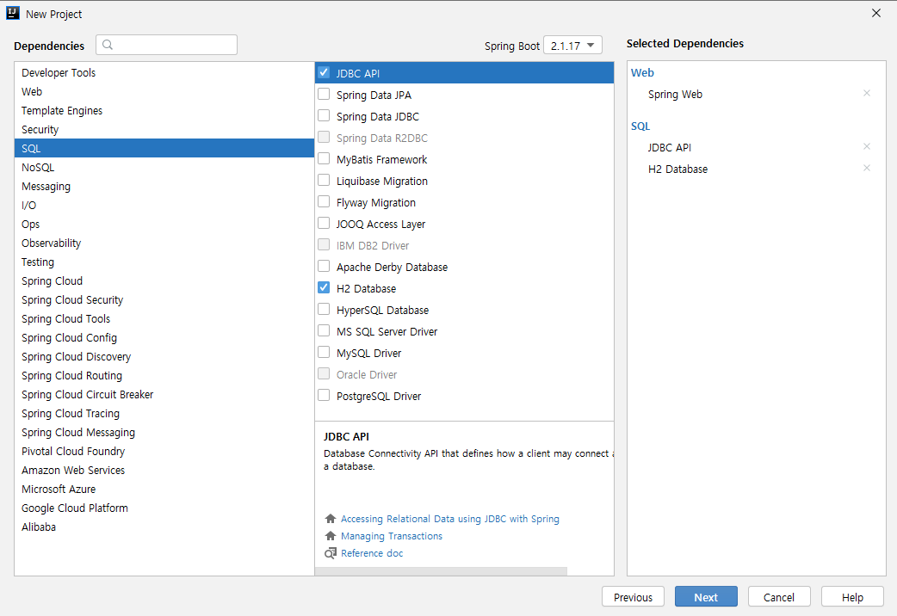

        * H2 의존성을 추가하고 아무런 DataSource 설정을 하지 않으면 스프링 부트는 자동으로 인메모리 데이터베이스를 사용한다.
        
* DataSource를 이용한 DB 연동 실습

    * `ApplicationRunner` 인터페이스를 구현한 H2Runner 클래스를 작성한 다음, 빈으로 등록한다.

    * 그리고 기본적으로 `DataSource`가 빈으로 등록 되어 있기 때문에 주입 받아서 사용하면 된다.

    * 인-메모리 데이터베이스 기본 연결 정보는 `DataSourceProperties`에서 확인 할 수 있다.

        ```java
        @Component
        public class H2Runner implements ApplicationRunner {
        
            @Autowired
            DataSource dataSource;
        
            @Autowired
            JdbcTemplate jdbcTemplate;
        
            @Override
            public void run(ApplicationArguments args) throws Exception {
                // 커넥션을 가져온다.
                try(Connection connection = dataSource.getConnection()){ // try-resource문으로 자원을 자동 해제한다.
                    // DB 연결 정보를 출력한다.
                    System.out.println(connection.getMetaData().getURL());
                    System.out.println(connection.getMetaData().getUserName());
        
                    // statement 만들기
                    Statement statement = connection.createStatement();
                    String sql = "CREATE TABLE USER(ID INTEGER NOT NULL, name VARCHAR(255), PRIMARY KEY (id))";
                    statement.executeUpdate(sql);
                }
        
                jdbcTemplate.execute("INSERT INTO USER VALUES (1, 'kevin')");
            }
        
        }
        ```
      
        * JdbcTemplate
      
            * JdbcTemplate를 주입 받아 사용 할 수도 있다.
      
            * 기본적인 JDBC API를 사용하는 것 보다 더 편리하다.

* H2 콘솔 사용하는 방법

    * 아래 2가지 방법 중 하나를 선택해서 진행한다.

        * `spring-boot-devtools` 의존성을 추가한다.

        * 또는 `application.properties`에 `spring.h2.console.enabled=true`를 추가한다.
        
        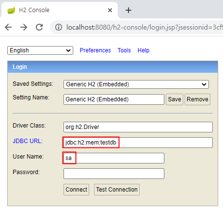
        
    * 그리고 웹 브라우저에서 `localhost:8080/h2-console/`로 접속한다.

#### 23) 스프링 데이터 3부 : MySQL

* DBCP(DataBase Connection Pool)란? 

    * `DBCP`는 DB와 연결하는 커넥션을 미리 여러 개 생성하여 풀(Pool)에 저장 해놓고 필요할 때 꺼내 쓰는 방식을 말한다.
    
    * 몇 개를 만들어 놓을지, 얼마나 사용되지 않으면 없앨 것 인지 등의 여러가지 설정들을 할 수 있다. 
    
    * DBCP는 애플리케이션 성능에 아주 핵심적인 역할을 한다.
    
    * 따라서 자신이 사용하는 DBCP에 대한 학습과 버그 리포팅에 대해 지속적으로 관심을 가져야한다.
    
    * 스프링 부트는 기본적으로 `HikariCP`라는 DBCP를 사용한다.
    
* 지원하는 DBCP

    * ① HikariCP (기본)
    
    * ② Tomcat CP
    
    * ③ Commons DBCP2
    
* 스프링 부트에서 DBCP 설정

    * `application.properties`에 `spring.datasource.DBCP명.속성=속성값`으로 설정한다.
      
    * 예를 들어, 다음과 같이 풀(pool)에 유지시킬 수 있는 최대 커넥션 수를 지정 할 수 있다. 
     
    * `spring.datasource.hikari.maximum-pool-size=4`
    
* MySQL 사용하기

    * ① MySQL에 접속 할 수 있는 `Connector`에 대한 의존성을 추가한다.
    
        ```html
        <dependency>
            <groupId>mysql</groupId>
            <artifactId>mysql-connector-java</artifactId>
        </dependency>
        ```
         
    * ② MySQL를 직접 설치 또는 도커를 이용하여 MySQL를 설치한다.
    
        ```
        docker run -p 3306:3306 --name mysql_boot -e MYSQL_ROOT_PASSWORD=1 -e MYSQL_DATABASE=springboot -e MYSQL_USER=kevin -e MYSQL_PASSWORD=pass -d mysql
        ```
      
        * `docker exec -i -t mysql_boot bash`로 도커 컨테이너에 들어가서 bash를 실행한다.
        
        * `mysql -u kevin -p`로 도커 컨테이너에 설치된 MySQL에 접속한다.
        
    * ③ `application.properties`에서 데이터베이스 연결 설정을 한다.
    
        ```
        spring.datasource.url=jdbc:mysql://localhost:3308/springboot
        spring.datasource.username=kevin
        spring.datasource.password=pass
        ```
      
    * ④ MySQLRunner를 작성한 다음, MySQL로 쿼리를 전달한다.
    
        ```java
        @Component
        public class MySQLRunner implements ApplicationRunner {
        
            @Autowired
            DataSource dataSource;
        
            @Autowired
            JdbcTemplate jdbcTemplate;
        
            @Override
            public void run(ApplicationArguments args) throws Exception {
        
                try(Connection connection = dataSource.getConnection()){
                    // DB 연결 정보를 출력한다.
                    System.out.println(connection.getMetaData().getURL());
                    System.out.println(connection.getMetaData().getUserName());
        
                    Statement statement = connection.createStatement();
                    String sql = "CREATE TABLE USER(ID INTEGER NOT NULL, name VARCHAR(255), PRIMARY KEY (id))";
                    statement.executeUpdate(sql);
        
                }
        
                jdbcTemplate.execute("INSERT INTO USER VALUES (1, 'kevin')");
        
            } 
        }
        ```
      
    * ⑤ USER 테이블이 만들어지고 kevin이라는 데이터가 들어간 것을 확인 할 수 있다.
    
        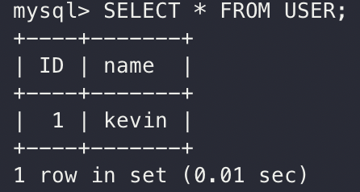
        
        * `docker stop mysql_boot`로 도커 컨테이너를 멈추게 한다.
        
        * `docker rm mysql_boot`로 도커 컨테이너를 삭제한다.
        
* MySQL 라이센스 (GPL) 주의

    * MySQL 대신 MariaDB를 사용하는 것을 검토한다.
      
    * 소스코드 공개 의무 여부를 확인해야 한다.
    
#### 24) 스프링 데이터 4부 : PostgreSQL 설정하기

* PostgreSQL

    * PostgreSQL는 무료이다. (상용에서도 문제 없다.)
    
    * 소스코드 공개 의무가 없다.
    
* PostgreSQL 사용하기

    * ① `pom.xml`에 PostgreSQL 드라이버 의존성을 추가한다.

        ```html
        <dependency>
            <groupId>org.postgresql</groupId>
            <artifactId>postgresql</artifactId>
        </dependency>
        ```
      
      * 여러 개의 데이터베이스 의존성이 있더라도 `application.properties`에서 `datasource`의 url에 설정한 것이 적용된다.
    
    * ② 도커를 이용한 PostgreSQL 설치

        ```
        docker run -p 5432:5432 -e POSTGRES_PASSWORD=pass -e POSTGRES_USER=kevin -e POSTGRES_DB=springboot --name postgres_boot -d postgres
        ```
    
    * ③ 아래 명령어로 도커 컨테이너 안으로 들어가기

        ```
        docker exec -i -t postgres_boot bash
        ```
    
    * ④ 명령어 `su - postgres`를 입력하여 유저를 postgres로 변경한다.
    
    * ⑤ `psql 사용할 데이터베이스명 --username 유저명`으로 PostgreSQL에 접속한다.

        * `psql springboot --username kevin`
        
        * PostgreSQL 명령어
          
            * `\l` : 전체 데이터베이스 목록 조회
          
            * `\dt` : 데이터베이스의 테이블 조회
          
    * ⑥ `application.properties`를 다음과 같이 작성한다.

        ```
        spring.datasource.url=jdbc:postgresql://localhost:5432/springboot
        spring.datasource.username=kevin
        spring.datasource.password=pass
        ```
    
    * ⑦ 아래와 같은 PgSQLRunner를 작성한 다음, 애플리케이션을 실행한다.

        ```java
        @Component
        public class PgSQLRunner implements ApplicationRunner {
        
            @Autowired
            DataSource dataSource;
        
            @Autowired
            JdbcTemplate jdbcTemplate;
        
            @Override
            public void run(ApplicationArguments args) throws Exception {
        
                try(Connection connection = dataSource.getConnection()){
                    // DB 연결 정보를 출력한다.
                    System.out.println(dataSource.getClass());
                    System.out.println(connection.getMetaData().getDriverName());
                    System.out.println(connection.getMetaData().getURL());
                    System.out.println(connection.getMetaData().getUserName());
        
                    Statement statement = connection.createStatement();
                    String sql = "CREATE TABLE ACCOUNT(ID INTEGER NOT NULL, name VARCHAR(255), PRIMARY KEY (id))";
                    statement.executeUpdate(sql);
                }
        
                jdbcTemplate.execute("INSERT INTO ACCOUNT VALUES (1, 'kevin')");
        
            }
        
        }
        ```
      
            * PostgreSQL에서는 USER가 키워드이므로 USERS 또는 ACCOUNT라는 테이블명을 사용해야 한다.
    
    * ⑧ 그리고 PostgreSQL에서 테이블과 데이터가 생성되었음을 확인 할 수 있다.
      
        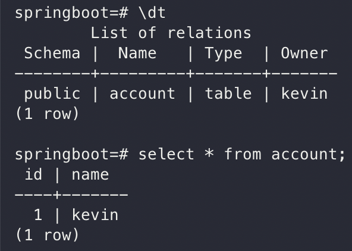
        
#### 25) 스프링 데이터 5부 :  ORM, JPA,  스프링 데이터 JPA 개요

* ORM(Object Relational Mapping)?

    * `ORM`는 객체와 릴레이션을 맵핑 할 때 발생하는 개념적 불일치를 해결하는 프레임워크를 말한다.

    * 개념적 불일치?
    
        * 객체는 상속이라는 개념이 있지만 테이블은 상속이라는 개념이 없음

* JPA?

    * `JPA`는 ORM을 위한 자바 (EE) 표준을 말한다.

    * 대부분의 자바 표준은 하이버네이트 기반으로 만들어져 있다.

* 스프링 데이터 JPA(Spring Data JPA)?

    * `Spring Data JPA`는 JPA 표준 스펙을 아주 쉽게 사용할 수 있게 스프링 데이터로 추상화 시켜 놓은 것을 말한다.

* 추상화 → 구체화

    * `Spring Data JPA` → `JPA` → `Hibernate` → `Datasource` 

#### 26) 스프링 데이터 6부 :  스프링 데이터 JPA 연동

* 스프링 데이터 JPA 사용하기

    * ① 프로젝트 생성하기    
    
    * ② pom.xml에 스프링 데이터 JPA 의존성을 추가한다.

        ```html
        <dependency>
        	<groupId>org.springframework.boot</groupId>
        	<artifactId>spring-boot-starter-data-jpa</artifactId>
        </dependency>
        ``` 

    * ③ account 패키지를 생성한 다음, Entity 클래스를 작성한다.
    
        ```java
        @Entity
        public class Account {
        
            @Id @GeneratedValue
            private Long id;
        
            private String username;
        
            private String password;
        
            public Long getId() {
                return id;
            }
        
            public void setId(Long id) {
                this.id = id;
            }
        
            public String getUsername() {
                return username;
            }
        
            public void setUsername(String username) {
                this.username = username;
            }
        
            public String getPassword() {
                return password;
            }
        
            public void setPassword(String password) {
                this.password = password;
            }
        
            @Override
            public boolean equals(Object o) {
                if (this == o) return true;
                if (o == null || getClass() != o.getClass()) return false;
                Account account = (Account) o;
                return Objects.equals(id, account.id) &&
                        Objects.equals(username, account.username) &&
                        Objects.equals(password, account.password);
            }
        
            @Override
            public int hashCode() {
                return Objects.hash(id, username, password);
            }
        
        }
        ``` 
    
    * ④ account 패키지에 Repository 인터페이스를 작성한다.

        ```java
        public interface AccountRepository extends JpaRepository<Account, Long> {
            
        }
        ```
    
    * ⑤ pom.xml에 PostgreSQL 의존성을 추가한다.
 
         ```html
         <dependency>
         	<groupId>org.postgresql</groupId>
         	<artifactId>postgresql</artifactId>
         </dependency>
         ```  
    
    * ⑥ (PostgreSQL를 설치하지 않았다면) 도커를 이용한 PostgreSQL를 설치한다.

         ```
         docker run -p 5432:5432 -e POSTGRES_PASSWORD=pass -e POSTGRES_USER=kevin -e POSTGRES_DB=springboot --name postgres_boot -d postgres
         ```
    
    * ⑦ `application.properties`에 데이터베이스 접속 정보를 입력한 다음, 애플리케이션을 실행한다.
    
        * application.properties에 데이터베이스 관련 설정을 하지 않으면 인-메모리 DB를 사용하려고 한다. 
        
         ```
         spring.datasource.url=jdbc:postgresql://localhost:5432/springboot
         spring.datasource.username=kevin
         spring.datasource.password=pass
         
         spring.jpa.properties.hibernate.jdbc.lob.non_contextual_creation=true
         ```

* 테스트 코드 작성하기

    * ① 테스트에서 사용할 인-메모리 데이터베이스인 H2의 의존성을 추가한다.  

        ```html
        <dependency>
        	<groupId>com.h2database</groupId>
        	<artifactId>h2</artifactId>
        	<scope>test</scope>
        </dependency>
        ``` 
    
    * ② 테스트 코드를 작성한 다음, 실행한다.
    
        * @DataJpaTest는 슬라이스 테스트를 할 때, 사용되는 애노테이션인데 해당 애노테이션을 사용하면 인-메모리 DB를 사용하도록 자동 설정된다.

            ```java
            @RunWith(SpringRunner.class)
            @DataJpaTest
            public class AccountRepositoryTest {
            
                @Autowired
                DataSource dataSource;
            
                @Autowired
                JdbcTemplate jdbcTemplate;
            
                @Autowired
                AccountRepository accountRepository;
            
                @Test
                public void di() throws SQLException {
                    Account account = new Account();
                    account.setUsername("kevin");
                    account.setPassword("pass");
            
                    Account newAccount = accountRepository.save(account);
            
                    assertThat(newAccount).isNotNull();
            
                    Account existingAccount = accountRepository.findByUsername(newAccount.getUsername());
                    assertThat(existingAccount).isNotNull();
            
                    Account nonexistingAccount = accountRepository.findByUsername("whiteship");
                    assertThat(nonexistingAccount).isNull();
                }
            
            }
            ```
          
        * @SpringBootTest를 사용하여 테스트를 진행 할 수도 있다.
          
        * 하지만 application.properties에 설정된 DB에 데이터가 반영되기 때문에 테스트 DB를 설정 해둔 다음, 테스트를 진행해야 한다.
          
        * 또는 @SpringBootTest(properties = "spring.datasource.url={테스트DB URL}”)와 같이 할 수도 있다.
              
        * 슬라이싱 테스트를 만드는 것이 더 간단하고 안전하기 때문에 이 방법을 권장한다.