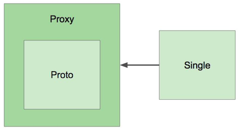
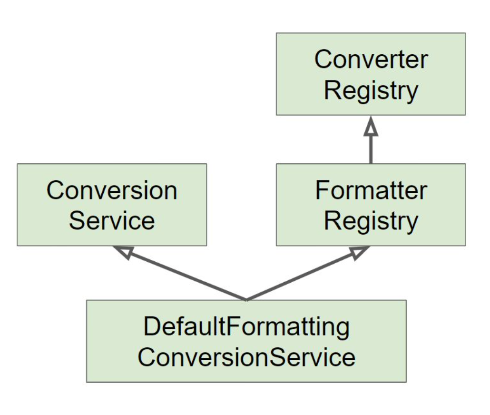
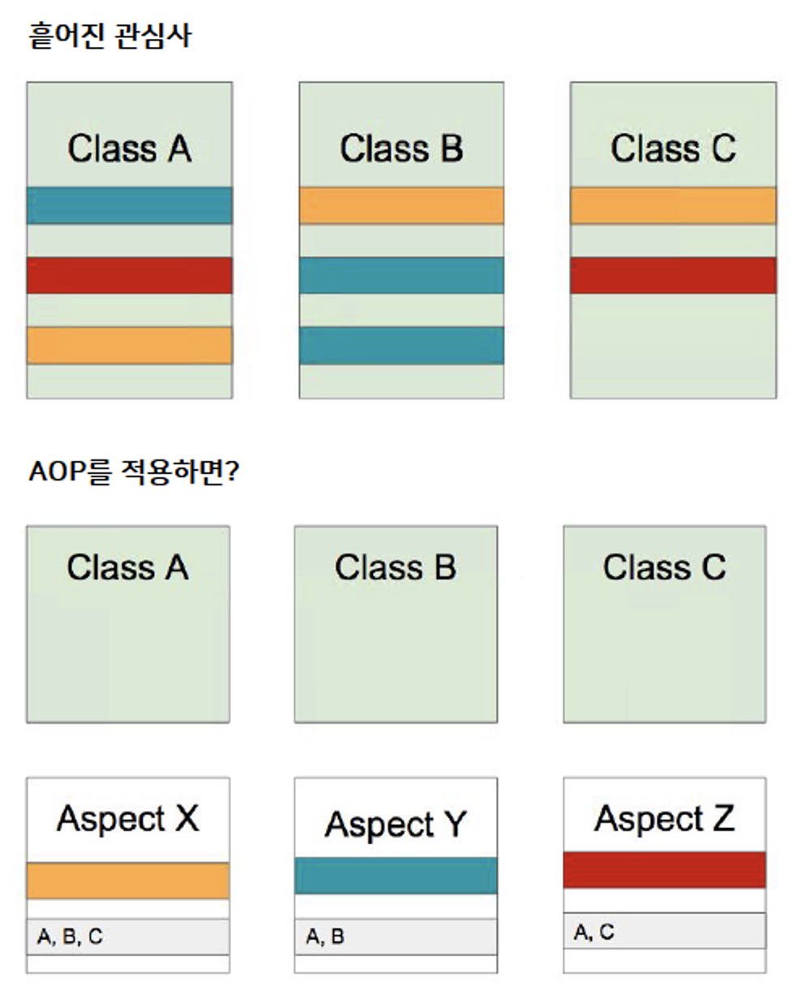

# 스프링 프레임워크 핵심 기술
> 아래 내용은 [백기선님의 스프링 프레임워크 핵심 기술](https://www.inflearn.com/course/spring-framework_core "스프링 프레임워크 핵심 기술")과 [김영한님의 스프링 핵심 원리 - 기본편](https://www.inflearn.com/course/%EC%8A%A4%ED%94%84%EB%A7%81-%ED%95%B5%EC%8B%AC-%EC%9B%90%EB%A6%AC-%EA%B8%B0%EB%B3%B8%ED%8E%B8 "스프링 핵심 원리 - 기본편") 강좌를 정리한 내용입니다.

## 1. 스프링 소개

#### 1) 스프링이란?

* 스프링은 "소규모 애플리케이션 또는 기업용 애플리케이션을 자바로 개발하는데 있어 유용하고 편리한 기능을 제공하는 프레임워크"이다.

#### 2) 스프링의 역사

* 2003년 등장

* 최근까지 주로 서블릿 기반 애플리케이션을 만들 때 사용해 옴.

* 스프링 5 부터는 WebFlux 지원으로 서블릿 기반이 아닌 서버 애플리케이션도 개발할 수 있게 됨.

#### 3) 스프링의 디자인 철학

* 모든 선택은 개발자의 몫.

* 다양한 관점을 지향한다. 

* 하위 호환성을 지킨다. 

* API를 신중하게 설계한다.

* 높은 수준의 코드를 지향한다.

## 2. IoC 컨테이너와 빈

### 2-1. IoC 컨테이너 1부: 스프링 IoC 컨테이너와 빈

#### 1) 제어의 역전(IoC: Inversion of Control)

* `제어의 역전(IoC)`은 `의존성 주입(Dependency Injection)`이라고도 하며, **어떤 객체가 사용하는 의존 객체를 직접 만들어 사용하는게 아니라 주입 받아 사용하는 방법**을 말한다.

    * 의존 객체를 직접 만들어 사용하는 예시는 다음과 같다.
    
        ```java
        BookRepository bookRepository = new BookRepository();
         
        BookService service = new BookService(bookRepository);
        ```
    
    * IoC의 예시는 다음과 같다.
    
        ```java
        // BookService 타입의 객체가 사용할 bookRepository라는 의존 객체를 
        // 직접 만들어 사용하는게 아니라, 주입 받아 사용하는 방법을 말함
        
        @Autowired
        BookRepository bookRepository;
         
        BookService service = new BookService(bookRepository);
        ```

#### 2) 빈(Bean)

* `빈(Bean)`은 **스프링 IoC 컨테이너가 관리하는 객체**이다

* **스프링에서 빈으로 등록될 때의 장점**은 다음과 같다.
  
    * ① **의존성 관리**

        * 의존성 주입을 받으려면 빈이 되어야 한다.
  
    * ② **싱글톤 객체로 만들어서 관리하고 싶을 때, 편리하다.**
  
        * 스프링 IoC 컨테이너에 등록되는 빈은 기본적으로 싱글톤 scope으로 등록된다.
        
            * 메모리 측면에서 효율적이며 컨테이너 안에 미리 만들어둔 객체를 사용하므로 런타임 시 성능 최적화에 유리함.
  
    * ③ **라이프 사이클 인터페이스를 제공한다.** 
      
        * Ex) `@PostConstruct`

#### 3) 스프링 IoC 컨테이너

* `스프링 IoC 컨테이너`는 빈 설정 파일로 부터 빈 정의를 읽어 들이고 빈을 생성한 다음, 제공(주입)하는 역할을 한다.

    * 스프링 컨테이너는 싱글톤 패턴의 문제점을 해결하면서, 객체를 싱글톤으로 관리한다.

    * `싱글톤 레지스트리 (Singleton Registry)` : 스프링이 직접 싱글톤 객체를 생성하고 관리하는 기능을 제공하는 것을 말한다.    

#### 4) 스프링 IoC 컨테이너 관련 인터페이스

##### (1) BeanFactory

* `BeanFactory`는 스프링 IoC 컨테이너의 최상위에 있는 인터페이스이다.

* IoC 컨테이너 기능을 수행한다. (빈을 생성하고 의존성을 관리)

##### (2) ApplicationContext

* `ApplicationContext`는 BeanFactory를 상속받은 인터페이스이다.

* `ApplicationContext`는 BeanFactory의 IoC 컨테이너 기능을 가지고 있으면서도 다음과 같은 추가적인 기능을 가진다.

    * 국제화 기능 (i18n) `MessageSource`

    * 이벤트 발행 기능 `ApplicationEventPublisher`

    * 리소스 로딩 기능 `ResourceLoader`

    * 프로파일과 프로퍼티 `EnvironmentCapable`
    
* `ApplicationContext` 인터페이스를 구현한 대표적인 클래스

    * `ClassPathXmlApplicationContext` [XML]

    * `AnnotationConfigApplicationContext` [Java]

### 2-2. IoC 컨테이너 2부: ApplicationContext와 다양한 빈 설정 방법

#### 1) 빈 설정 파일

* 스프링 IoC 컨테이너는 `빈 설정 파일`이 필요하다.

#### 2) 빈을 등록(설정)하는 방법과 의존성 주입

##### 2-1) `application.xml`에 빈을 등록하는 방법

* 빈(Bean) 등록 및 의존성 주입하기

    * 다음과 같이 빈(Bean)으로 등록할 클래스를 작성한다.
    
        ```java
        public class BookService {
        
            // BookService가 BookRepository를 사용한다고 가정
            BookRepository bookRepository;
        
            public void setBookRepository(BookRepository bookRepository) {
                this.bookRepository = bookRepository;
            }
        }
        ```
      
    * resources 디렉토리 아래에 application.xml 파일을 다음과 같이 작성 한다.
    
        ```html
        <?xml version="1.0" encoding="UTF-8"?>
        <beans xmlns="http://www.springframework.org/schema/beans"
               xmlns:xsi="http://www.w3.org/2001/XMLSchema-instance"
               xsi:schemaLocation="http://www.springframework.org/schema/beans http://www.springframework.org/schema/beans/spring-beans.xsd">
        
            <bean id="bookService"
                  class="me.whiteship.springapplicationcontext.BookService">
                <property name="bookRepository" ref="bookRepository"></property>
            </bean>
        
            <bean id="bookRepository"
                  class="me.whiteship.springapplicationcontext.BookRepository">
            </bean>
        
        </beans>
        ```
      
        * `<bean>` 태그는 빈을 등록하는 태그이다.
        
        * `<bean>` 태그의 id는 빈을 구분할 때 사용하는 이름을 의미하며 camel-case로 작성한다.
        
            * 그리고 class는 빈의 타입을 의미한다.
        
        * `<property>` 태그는 setter를 이용하여 의존성을 주입 받을 때 사용한다.
        
        * `<property>` 태그의 name은 setter의 이름에서 가져온 것이며 `ref`는 (해당 setter의 매개변수로 전달 될 수 있는) 다른 bean 의 id를 참조한다.
        
* 빈(Bean)을 사용하기

    * XML 빈 설정 파일을 사용하는 `ClassPathXmlApplicationContext`를 만든 다음, Bean을 사용 할 수 있다.

        ```java
        ApplicationContext context = new ClassPathXmlApplicationContext("application.xml");
        ```

    * 해당 방법은 빈을 일일이 등록 해야 하기 때문에 번거롭다. 이러한 이유로 등장한 것이 `<context:component-scan>` 이다.
    
##### 2-2) `application.xml` 과 `<context:component-scan>` 태그를 활용한 빈 등록 

* 빈 설정 파일(application.xml)에 `<context:component-scan>` 태그를 이용하면 `base-package`에서 부터
  
* `@Component`와 이를 확장한 애노테이션(`@Service`, `@Repository`, `@Controller`)을 스캔하여 해당 클래스를 빈으로 등록한다.

    ```html
    <context:component-scan base-package="me.whiteship.springapplicationcontext"/>
    ```
  
* 그리고 `@Autowired` 애노테이션을 사용해서 빈을 주입 받을 수 있다. 즉, 컨테이너에서 빈을 꺼낼 수 있다.

    ```java
    @Service
    public class BookService {
    
        @Autowired
        BookRepository bookRepository;
    
        public void setBookRepository(BookRepository bookRepository) {
            this.bookRepository = bookRepository;
        }
    }
    ```

##### 2-3) Java 설정 파일

* "빈 설정 파일을 XML이 아닌 Java로 만들 수 없을까?" 라는 생각에 등장한 것이 바로 Java 설정 파일이다.

* 방금 전까지 선언 했던 애노테이션(`@Repository`, `@Service`, `@Autowird`)을 모두 제거한다.

* 그리고 `@Configuration`을 붙인 `ApplicationConfig` 클래스를 작성한다.

    * 빈(Bean) 등록 및 의존성 주입하기
    
        * Java 설정 파일을 이용하여 빈 등록 및 의존성 주입을 한다.
    
            ```java
            @Configuration
            public class ApplicationConfig {
                
                @Bean
                public [등록할 빈의 타입][빈의 id](){
                    return new [등록할 빈의 타입]();
                }
                
            }
            ```
          
            * `@Configuration` : 스프링 IoC 컨테이너에게 해당 클래스가 빈 설정 파일이라는 것을 알려준다.
       
            * `@Bean` : 메서드의 실행 결과로 반환되는 객체를 Bean으로 등록한다. (클래스에는 `@Bean` 선언 불가능)
            
                * `@Configuration`이 선언된 클래스 내에 있는 메서드에 사용된다.
                
                * 보통 외부 라이브러리들을 Bean으로 등록하고 싶은 경우에 사용된다.

        * 예시는 다음과 같다.                

            ```java
            @Configuration
            public class ApplicationConfig {
            
                @Bean
                public BookRepositry bookRespository() {
                  return new BookRepository();
                }
            
                @Bean
                public BookService bookService() {
                  BookService bookService = new BookService();
                  bookService.setBookRepositry(bookRepository());  // setter를 사용한 의존성 주입
          
                  return bookService;
                }
            }
            ```        
      
    * 빈(Bean)을 사용하기
    
        * Java 빈 설정 파일을 사용하는 `AnnotionConfigApplicationContext`를 만든 다음, Bean을 사용 할 수 있다.
        
            ```java
            ApplicationContext context = new AnnotationConfigApplicationContext(ApplicationConfig.class)
            ```  

##### 2-4) Java 설정 파일에 @ComponentScan를 활용한 빈 등록  ★★★

* 앞서 살펴본 Java 설정도 Bean을 일일이 등록해야 하는 번거로움이 있어서 XML에서 처럼 컴포넌트 스캔을 사용할 수 있다.

* `@ComponentScan` 애노테이션을 이용하여 `@Component` 애노테이션이 붙어 있는 클래스들을 스캔해서 빈으로 등록한다.

    * 빈(Bean) 등록 및 의존성 주입하기
    
        ```java
        @Configuration
        // 해당 class가 위치한 곳부터 Component Scan을 한다.
        @ComponentScan(basePackageClasses = DemoApplication.class) 
        public class ApplicationConfig { 
        
        }
        ```
        * `basePackages`로 classpath를 사용할 수도 있지만 `basePackageClasses`가 더 type-safe 하다.
        
    * 빈(Bean)을 사용하기
    
        * Java 빈 설정 파일을 사용하는 `AnnotionConfigApplicationContext`를 만든 다음, Bean을 사용 할 수 있다.

##### 2-5) @SpringBootApplication  ★★★

* `@SpringBootApplication`는 내부적으로 `@Configuration`과 `@ComponentScan` 애노테이션을 포함하고 있다.

* 따라서 `@SpringBootApplication`이 붙어있는 클래스 자체가 Bean 설정 파일이다.

* 그러므로 SpringBoot의 경우, ApplicationConfig 파일이 필요없다.
           
    ```java
    @SpringBootApplication
    public class DemoApplication {
        public static void main(String[] args) {
            SpringApplication.run(DemoApplication.class, args);
        }
    }
    ```

### 2-3. IoC 컨테이너 3부: @Autowired

#### 1) 실습 준비

* Book

    ```java
    public class Book {
    
        private Long id;
    
        private String name;
    
        private Long price;
    
        public Book(Long id, String name, Long price) {
            this.id = id;
            this.name = name;
            this.price = price;
        }
    
        // Getter, Setter
        
    }
    ```
  
* BookService

    ```java
    @Service
    public class BookService {
    
        private BookRepository bookRepository;
        
        public BookService(BookRepository bookRepository) {
            this.bookRepository = bookRepository;
        }
    
        public void save(Book book) {
            bookRepository.save(book);
        }
    
        public Book findBook(Long bookId) {
            return bookRepository.findById(bookId);
        }
    
    }
    ```

* BookRepository

    ```java
    public interface BookRepository {
    
        void save(Book book);
    
        Book findById(Long id);
    
    }
    ```

* MemoryBookRepository

    ```java
    @Repository
    public class MemoryBookRepository implements BookRepository {
    
        private static ConcurrentMap<Long, Book> store = new ConcurrentHashMap<>();
    
        @Override
        public void save(Book book) {
            store.put(book.getId(), book);
        }
    
        @Override
        public Book findById(Long bookId) {
            return store.get(bookId);
        }
    
    }
    ```

#### 2) @Autowired

* `@Autowired`는 필요한 의존 객체의 “타입"에 해당하는 빈을 찾아 주입한다.

    * 즉, `@Autowired`는 의존관계를 자동으로 주입해준다.

    * 의존관계를 자동으로 주입 받으려면 스프링 컨테이너가 관리하는 스프링 빈이어야 한다.

#### 2) @Autowired의 required 옵션

* `@Autowired`의 required 옵션은 자동 주입 대상이 반드시 존재해야 되는지 여부를 의미한다.

    * required 옵션이 `true`면 자동 주입 대상이 반드시 존재해야 한다. (기본 값)
 
        * 따라서 필요한 의존 객체의 타입에 해당하는 빈을 찾지 못하면 애플리케이션 구동에 실패한다.

    * required 옵션이 `false`면 자동 주입 대상이 없더라도 애플리케이션 구동에 성공한다. (필드, setter만 가능)

        * 수정자 (setter)의 자동 주입 대상을 선택으로 처리하기
        
            ```java
            @Service
            public class BookService {
            
                private BookRepository bookRepository;
            
                @Autowired(required = false)
                public void setBookRepository(BookRepository bookRepository) {
                    this.bookRepository = bookRepository;
                }
            
                // ...
            }
            ```
    
            * `@Autowired(required=false)`는 자동 주입할 대상(BookRepository)이 없으면 수정자(setter) 메서드 자체가 호출되지 않는다.

            * 즉, BookRepository가 의존성 주입이 되지 않은 상태로 BookService가 빈으로 등록된다.
    
        * 필드의 자동 주입 대상을 선택으로 처리하기
        
            ```java
            @Service
            public class BookService {
            
                @Autowired(required = false)
                BookRepository bookRepository;
          
                // ...
            }
            ```

#### 3) @Autowired를 사용 할 수 있는 위치

* `@Autowired`는 생성자 (constructor), 수정자 (setter), 필드 (field)에 사용할 수 있다.

    * `생성자 주입 (Constructor Injection)` : 생성자를 통해서 의존관계를 주입 받는 방법이다.

        ```java
        @Service
        public class BookService {
        
            private BookRepository bookRepository;
        
            @Autowired
            public BookService(BookRepository bookRepository) {
                this.bookRepository = bookRepository;
            }
        
            // ...
        }
        ```
    
        * 생성자 주입의 특징

            * ① 생성자를 호출하는 시점에 단 1번만 호출되는 것이 보장된다.

            * ② 불변, 필수 의존관계에 사용한다.

                * `불변` : 한번 생성되고 난 이후에 변하지 않는 경우를 말한다.
                
                * `필수` : 반드시 값이 입력 되어야 하는 경우를 말한다.

        * **생성자가 하나인 경우에는 `@Autowired`를 생략 하더라도 의존관계를 자동으로 주입한다.** (스프링 4.3 부터)
    
        * 생성자 주입을 권장하는 이유는 다음과 같다.

            * ① 불변 객체로 설계 가능 
            
                * 대부분의 의존관계 주입은 한번 일어나면 애플리케이션 종료 시점까지 의존관계를 변경할 일이 거의 없다.
            
                    * 대부분의 의존관계는 애플리케이션 종료 전까지 변하면 안된다. (불변해야 한다.)
            
                * 수정자 주입을 사용하면, setter를 public으로 열어 두어야 한다.
            
                    * 누군가 실수로 변경할 수도 있고, 변경하면 안되는 메서드를 열어두는 것은 좋은 설계 방법이 아니다.
            
                * **생성자 주입은 객체를 생성할 때, 단 1번만 호출 되므로 이후에 호출되는 일이 없다. 따라서 불변하게 설계할 수 있다.**
            
            * ② 누락 방지
            
                * 생성자 주입을 사용하면 의존관계에 해당하는 객체를 누락 했을 때 컴파일 오류가 발생한다.  
    
                    ```java
                    // 생성자 주입을 사용한 코드
                    @Service
                    public class BookService {
                    
                        private BookRepository bookRepository;
                    
                        @Autowired
                        public BookService(BookRepository bookRepository) {
                            this.bookRepository = bookRepository;
                        }
                    
                        // ...
                    }
                    ```
                    
                    ```java
                    class BookServiceTest {
                    
                        @Test
                        void createBook() {
                            // BookRepository bookRepository = new MemoryBookRepository();
                            // BookService bookService = new BookService(bookRepository);
                            BookService bookService = new BookService(); // 의존 객체 누락 시, 컴파일 에러 발생
                    
                            bookService.save(new Book(1L, "JPA", 38000L));
                            Book findBook = bookService.findBook(1L);
                    
                            assertThat(findBook.getName()).isEqualTo("JPA");
                            assertThat(findBook.getId()).isEqualTo(1L);
                            assertThat(findBook.getPrice()).isEqualTo(38000L);
                        }
                        
                    }
                    ```
                    
                    * `isSameAs()`는 == 연산자를 사용해서 비교하며 `isEqualTo()`은 equals()를 사용해서 비교한다고 생각하면 된다.

                    * 즉, `isSameAs()`는 객체의 참조 값을 비교하며 `isEqualTo()`는 객체가 가진 값을 비교할 때 사용한다고 생각하면 된다.

            * ③ final 키워드 사용 가능
            
                * 생성자 주입을 사용하면 필드에 final 키워드를 사용할 수 있다.
            
                    * `final` : 값을 한번 할당하면 재할당 할 수 없다는 것을 의미한다.
                    
                        * 즉, final 키워드를 사용하면 해당 필드는 필수 값이 된다.
            
                * 따라서 생성자에서 필드 값을 설정하지 않는 실수를 컴파일 시점에 막아준다.
            
                    ```java
                    @Service
                    public class BookService {
                    
                        private final BookRepository bookRepository;    // 컴파일 에러 발생
                    
                        @Autowired
                        public BookService(BookRepository bookRepository) {
                            // 생성자에서 bookRepository의 필드 값을 설정하지 않았다.
                            // 즉, this.bookRepository = bookRepository; 와 같은 코드를 작성하지 않는 실수를 했다고 가정한다.
                        }
                    
                        // ...
                    }
                    ```
            
                    * 필드에 final 키워드를 사용 했다면 자바는 컴파일 시점에 오류를 발생시킨다.
                    
                        * **컴파일 오류는 세상에서 가장 빠르고, 좋은 오류다!**
            
                    * [참고] 생성자 주입을 제외한 나머지 주입 방식은 모두 생성자 이후에 호출되므로, 필드에 final 키워드를 사용할 수 없다.
            
                        * 생성자 주입 방식만 final 키워드를 사용할 수 있다.
    
      * `수정자 주입 (Setter Injection)` : 필드의 값을 변경하는 수정자(setter) 메서드를 통해서 의존관계를 주입 받는 방법이다.
  
        ```java
        @Service
        public class BookService {
        
            BookRepository bookRepository;
            
            @Autowired
            public void setBookRepository(BookRepository bookRepository) {
                this.bookRepository = bookRepository;
            }
        
            // ...
        }
        ```
    
        * 수정자 주입의 특징
          
            * ① 선택, 변경 가능성이 있는 의존관계에 사용한다.
            
                * `선택` : 선택적으로 의존관계를 주입하고 싶은 경우를 말한다. 
                  
                    * 의존관계에 있는 객체가 스프링 빈으로 등록되지 않았더라도 정상적으로 동작하게 하는 경우다.

                    * setter에 `@Autowired(required = false)`를 지정하면 된다.                     

                * `변경` : 의존관계에 있는 객체가 중간에 다른 객체로 변경될 수 있는 경우를 말한다.
                  
            * ② 자바 빈 프로퍼티 규약의 수정자 메서드 방식을 사용하는 방법이다.
   
    * `필드 주입 (Field Injection)` : 필드에 바로 의존관계를 주입 받는 방법이다.

        ```java
        @Service
        public class BookService {
        
            @Autowired
            BookRepository bookRepository;
        }
        ```

        * 필드 주입의 특징    

            * ① 외부에서 변경이 불가능해서 테스트 하기가 힘들다는 치명적인 단점이 있다.
            
            * ② DI 프레임워크가 없으면 아무것도 할 수 없다. (즉, 스프링 컨테이너를 구동하지 않으면서 순수한 자바 코드로 테스트를 할 수 없다.)
            
                * 필드 주입은 사용하지 말자!
                
                    * 애플리케이션의 실제 코드와 관계 없는 테스트 코드에서는 사용해도 된다.
                    
                    * 또는 스프링 설정을 목적으로 하는 @Configuration과 같은 곳에서만 특별한 용도로 사용해도 된다.

* 의존관계 주입을 하는 순서

    * `필드`, `setter` 주입은 먼저 스프링 빈으로 등록한 다음, 의존관계를 주입한다.

        ```java
        @Service
        public class BookService {              // 1) BookService가 스프링 빈으로 등록된다.
        
            @Autowired
            BookRepository bookRepository;      // 2) BookService의 생성자 호출 이후에 BookRepository에 대한 의존관계를 주입한다.
        }
        ```
      
        * 생성자 주입을 제외한 나머지 의존 관계 주입은 생성자 호출 이후에 이루어진다.
    
    * `생성자 주입`은 스프링 빈으로 등록하면서 의존관계 주입도 한번에 처리한다.

        * 스프링 빈 저장소는 스프링 빈을 등록하기 전에 필요한 의존관계 그래프를 내부에서 모두 만든다.

            ```java
            @Service
            public class BookService {
            
                private BookRepository bookRepository;
            
                @Autowired
                public BookService(BookRepository bookRepository) {
                    this.bookRepository = bookRepository;
                }
            
                // ...
            }
            ```
    
        * 예를 들어, BookService를 빈으로 등록하려고 할 때, 의존관계에 있는 빈(BookRepository)이 스프링 컨테이너에 없다면 해당 객체를 먼저 빈으로 등록한다.

        * 그리고 스프링 빈 저장소에서 BookRepository를 꺼낸 다음, 생성자를 통해 주입하면서 BookService를 스프링 빈으로 등록하는 과정을 마무리한다.

#### 4) 롬복과 최신 트렌드

* (1) 롬복 ?

    * `롬복 (Lombok)` : getter, setter 등의 반복되는 코드를 자동으로 생성해주는 라이브러리다.

        * `@Getter` : getter 메서드를 자동 생성한다.

        * `@Setter` : setter 메서드를 자동 생성한다.

        * `@NoArgsConstructor` : 매개변수가 없는 생성자(기본 생성자)를 자동 생성한다.

        * `@AllArgsConstructor` : 모든 필드를 매개변수로 받는 생성자를 자동 생성한다.

        * `@RequiredArgsConstructor` : `final` 필드만 매개변수로 받는 생성자를 자동 생성한다.

        * `@ToString` : toString() 메서드를 자동 생성한다.

        * `@EqualsAndHashCode` : equals()와 hashCode() 메서드를 자동 생성한다.

            * of 속성을 사용하여 동등성 비교에 사용할 필드를 명시한다.

                * Ex) `@EqualsAndHashCode(of = "id")`

        * `@Data` : `@Getter`, `@Setter`, `@RequiredArgsConstructor`, `@ToString`, `@EqualsAndHashCode`를 한번에 설정한다.

        * `@Builder` : 빌더 패턴을 사용할 수 있도록 한다.

* (2) 프로젝트에 롬복 라이브러리를 적용하기 

    * ① 인텔리제이에 롬복 플러그인을 설치(Install)한 다음, 인텔리제이를 재시작한다.

        

    * ② 빌드 도구에 롬복 라이브러리를 추가한다.

        * Maven

            ```html
            <dependency>
                <groupId>org.projectlombok</groupId>
                <artifactId>lombok</artifactId>
                <version>1.16.20</version>
                <scope>provided</scope>
            </dependency>
            ```

        * Gradle

            ```
            //lombok 설정 추가 - START
            configurations {
                compileOnly {
                    extendsFrom annotationProcessor
                }
            }
            //lombok 설정 추가 - END
        
            dependencies {
                implementation 'org.springframework.boot:spring-boot-starter'
            
                //lombok 라이브러리 추가 - START
                compileOnly 'org.projectlombok:lombok'
                annotationProcessor 'org.projectlombok:lombok'
                //lombok 라이브러리 추가 - END
            
                testImplementation('org.springframework.boot:spring-boot-starter-test') {
                    exclude group: 'org.junit.vintage', module: 'junit-vintage-engine'
                }
            }
            ```

    * ③ 인텔리제이에서 `Preferences` -> `Annotation Processors`를 검색 -> `Enable annotation processing`를 체크한다. (+ 재시작)
    
    * ④ 임의의 클래스를 만들어서 롬복이 정상적으로 동작하는지 확인한다.

      ```java
      @Getter
      @Setter
      @ToString
      public class HelloLombok {
      
          private String name;
          private int age;
      
          public static void main(String[] args) {
              HelloLombok helloLombok = new HelloLombok();
              helloLombok.setName("kevin");
      
              System.out.println("helloLombok = " + helloLombok);
          }
      
      }
      ```

* (3) 롬복을 사용하는 최신 트렌드

    * 생성자가 단 하나인 경우에는 `@Autowired`를 생략 하더라도 의존관계를 자동으로 주입한다. (스프링 4.3 부터)

    * 롬복 라이브러리가 제공하는 `@RequiredArgsConstructor`를 사용하면 final 필드만 매개변수로 받는 생성자를 자동으로 생성한다.

        ```java
        @Service
        @RequiredArgsConstructor
        public class BookService {
        
            private final BookRepository bookRepository;
        
            // ...
        }
        ```

        * 코드에는 보이지 않지만 실제 호출이 가능하다.

#### 5) @Autowired에서 발생할 수 있는 경우의 수

* @Autowired에서 발생할 수 있는 경우의 수

    * ① 필요한 의존 객체의 타입에 해당하는 빈이 없는 경우, 애플리케이션 구동에 실패한다.
    
    * ② **필요한 의존 객체의 타입에 해당하는 빈이 한 개인 경우**, 해당 빈을 주입한다.
    
    * ③ 필요한 의존 객체의 타입에 해당하는 빈이 여러 개인 경우
    
        * **빈 이름으로 시도해서 같은 이름의 빈을 찾으면** 해당 빈을 주입한다. 
    
        * 빈 이름으로 시도해서 같은 이름의 빈을 찾지 못하면 애플리케이션 구동에 실패한다.

* 정리하자면, `@Autowired`는 타입으로 매칭을 시도하고 이때 2개 이상의 빈이 있으면 필드 이름(파라미터 이름)으로 빈 이름과 매칭을 시도한다.

#### 6) 같은 타입의 빈이 여러 개일 때, 의존성 주입

* (1) 실습 준비
  
    * BookRepository 인터페이스를 구현한 클래스 2개를 작성한다. (MemoryBookRepository, DbBookRepository)
    
        ```java
        public interface BookRepository { }
        
        @Repository
        public class MemoryBookRepository implements BookRepository { }
        
        @Repository
        public class DbBookRepository implements BookRepository{ }
        ```
          
    * BookService 클래스에서 `@Autowired`로 BookRepository를 주입 받으려고 한다.    

        ```java
        @Service
        public class BookService {
            
            private BookRepository bookRepository;
        
            @Autowired
            public BookService(BookRepository bookRepository) {
                this.bookRepository = bookRepository;
            }
        }
        ```
      
    * 애플리케이션을 실행하면 에러가 발생한다.
    
        * 에러가 발생한 이유는 두 개의 클래스 중 어떤 클래스를 주입해야 하는지 알 수 없기 때문이다. 

* (2) 조회 대상 빈이 2개 이상일 때 해결책

    * ① `@Primary` : (같은 타입의 빈이 여러 개 일 때) 우선 순위를 가지는 빈으로 지정하여 해당 빈이 주입 되도록 한다.

        ```java
        @Repository
        @Primary
        public class DbBookRepository implements BookRepository {}
        ```

    * ② `@Qualifier`는 추가 구분자를 붙여주는 방법이다.

        * ① 빈 등록 시 `@Qualifier`를 붙여준다.
        
            * dbBookRepository라는 구분자를 붙여준다.
            
                ```java
                @Repository
                @Qualifier("dbBookRepository")
                public class DbBookRepository implements BookRepository {}
                ```
            
            * memoryBookRepository라는 구분자를 붙여준다.
            
                ```java
                @Repository
                @Qualifier("memoryBookRepository")
                public class MemoryBookRepository implements BookRepository {}
                ```
        
        * ② 주입 시에 `@Qualifier`를 붙여주고 등록한 이름을 적어준다.
        
            ```java
            // 생성자 자동 주입 예시
            @Service
            public class BookService {
            
                private BookRepository bookRepository;
            
                @Autowired
                public BookService(@Qualifier("dbBookRepository") BookRepository bookRepository) {
                    this.bookRepository = bookRepository;
                }
                
            }
            ```
            
            * `@Qualifier`로 주입할 때 `@Qualifier("dbBookRepository")`로 지정한 부분을 찾지 못하면 어떻게 될까?
            
            * 그러면 `dbBookRepository`라는 빈 이름을 갖는 스프링 빈을 추가적으로 찾는다.
            
            * 하지만 `@Qualifier`는 `@Qualifier`로 지정한 부분을 찾는 용도로만 사용하는게 명확하고 좋다.
    
    * ③ `해당 타입의 모든 빈을 주입 받기`

        * 컬렉션을 사용하면 해당 타입의 모든 빈을 주입 받을 수 있다.

            * List  
            
                ```java
                @Service
                public class BookService {
                
                    private List<BookRepository> bookRepositories;
                
                    @Autowired
                    public BookService(List<BookRepository> bookRepositories) {
                        this.bookRepositories = bookRepositories;
                    }
                
                    public List<BookRepository> getBookRepositories() {
                        return bookRepositories;
                    }
                
                }
                ```
              
                * `List<BookRepository>` : BookRepository 타입의 모든 빈을 List 형식으로 넣어준다.

                    * 만약 해당 타입의 스프링 빈이 없으면, 비어 있는 컬렉션을 주입한다.

            * Map

                ```java
                @Service
                public class BookService {
                
                    private Map<String, BookRepository> bookRepositoryMap;
                
                    @Autowired
                    public BookService(Map<String, BookRepository> bookRepositoryMap) {
                        this.bookRepositoryMap = bookRepositoryMap;
                    }
                
                    public Map<String, BookRepository> getBookRepositoryMap() {
                        return bookRepositoryMap;
                    }
                    
                }
                ```

                * `Map<String, BookRepository>` : Map의 키에 스프링 빈의 이름을 넣어주고, 값으로는 필요한 의존 객체의 타입(BookRepository)에 해당하는 모든 빈을 넣어준다.

                    * 만약 해당 타입의 스프링 빈이 없으면, 비어 있는 Map을 주입한다.
    
* (3) @Primary과 @Qualifier를 비교하기

    * 사용 예시
    
        * 예를 들어, 메인 데이터베이스의 커넥션을 가져오는 빈에는 `@Primary`를 사용하고 서브 데이터베이스의 커넥션을 가져오는 객체에는 `@Qualifier`를 사용할 수 있다.
    
    * 우선 순위
    
        * `@Primary`과 `@Qualifier`를 둘 다 지정하면 `@Primary` 보다는 `@Qualifier`의 우선순위가 더 높다.
        
        * 스프링은 자동 보다는 수동이, 넒은 범위의 선택권 보다는 좁은 범위의 선택권이 우선 순위가 높다.

* (4) @Qualifier를 대체하는 커스텀 애노테이션을 만들어 사용하기

    * 설명
      
        * `@Qualifier("mainBookRepository")`처럼 문자로 입력하면 컴파일 시 타입 체크가 되지 않는다.
    
        * 따라서 커스텀 애노테이션을 만들어서 문제를 해결할 수 있다.

    * 예시
    
        * ① 커스텀 애노테이션을 작성한다.

            ```java
            @Target({ElementType.FIELD, ElementType.METHOD, ElementType.PARAMETER,
                    ElementType.TYPE, ElementType.ANNOTATION_TYPE})
            @Retention(RetentionPolicy.RUNTIME)
            @Documented
            @Qualifier("mainBookRepository")
            public @interface MainBookRepository {
            }
            ```
    
            * 위에서 사용한 메타 애노테이션은 `@Qualifier`의 내용을 참고했다.
    
        * ② 커스텀 애노테이션을 적용한다.
    
            ```java
            @Repository
            @MainBookRepository
            public class DbBookRepository implements BookRepository {
            
            }
            ```
    
            ```java
            @Service
            public class BookService {
            
                private BookRepository bookRepository;
            
                @Autowired
                public BookService(@MainBookRepository BookRepository bookRepository) {
                    this.bookRepository = bookRepository;
                }
            
                public BookRepository getBookRepository() {
                    return bookRepository;
                }
                
            }
            ```

#### 7) @Autowired 동작 원리

* `BeanPostProcessor`의 구현체(`AutowiredAnnotationBeanPostProcessor`)가 Bean의 초기화 라이프 사이클(초기화 콜백) 이전에 @Autowired 애노테이션이 붙어 있는 빈(Bean)을 찾아 주입한다.

#### 8) 빈 생명주기 콜백

* (1) 개요

    * 스프링 빈은 객체를 생성하고, 의존관계 주입이 다 끝난 다음에야 필요한 데이터를 사용할 수 있는 준비가 완료된다. 
    
    * 따라서 초기화 작업은 의존관계 주입이 모두 완료되고 난 다음에 호출해야 한다. 
    
    * 그런데 개발자가 의존관계 주입이 모두 완료된 시점을 어떻게 알 수 있을까?
    
    * 스프링은 의존관계 주입이 완료되면 스프링 빈에게 콜백 메서드를 통해서 초기화 시점을 알려주는 다양한 기능을 제공한다. 
    
    * 또한 스프링은 스프링 컨테이너가 종료되기 직전에 소멸 콜백을 준다. (싱글톤 빈에만 해당)
    
* (2) 스프링 빈의 이벤트 라이프 사이클

    * `스프링 컨테이너 생성` -> `스프링 빈 생성` -> `의존관계 주입` -> `초기화 콜백` -> `빈(Bean) 사용` -> `소멸전 콜백` -> `스프링 컨테이너 종료`    

        * **생성자 주입**의 경우, 생성자를 호출하면서 의존관계 주입도 한번에 처리된다. 
        
        * `초기화 콜백` : 스프링 빈이 생성되고, 의존관계 주입이 완료된 이후에 호출된다.

            * 초기화 작업은 외부 커넥션을 연결하는 것과 같은 무거운 동작을 수행한다.
            
            * 따라서 생성자 안에서 초기화 작업을 함께 처리하는 것 보다는 객체를 생성하는 부분과 초기화 작업을 하는 부분을 명확하게 나누는 것이 유지보수 관점에서 좋다.
            
                * 물론, 초기화 작업이 단순하다면 생성자에서 한번에 처리하는 것이 나을 수도 있다.

        * `소멸전 콜백` : 스프링 빈이 소멸되기 직전에 호출된다.
    
        * [참고] `콜백 (callback)` : 어떤 이벤트가 발생하는 경우, 호출되는 메소드를 말한다. 
    
* (3) 빈 생명주기 콜백

    * `빈 생명주기 콜백 (Bean LifeCycle Callback)`은 빈의 특정 시점(생성, 초기화, 소멸 등)에 호출 되도록 정의된 메소드를 말합니다.

    * 스프링은 크게 3 가지 방법으로 빈 생명주기 콜백을 지원한다.

        * ① 초기화, 소멸 인터페이스(InitializingBean, DisposableBean)를 사용하기
    
            * `InitializingBean`은 `afterPropertiesSet()` 메서드로 초기화를 지원한다.
        
            * `DisposableBean`은 `destroy()` 메서드로 소멸을 지원한다.
            
                * 인터페이스를 사용하는 초기화, 종료 방법은 스프링 초창기에 나온 방법들이고, 지금은 다음의 더 나은 방법들이 있어서 거의 사용하지 않는다.
            
        * ② 빈 설정 정보에서 초기화 메서드, 소멸 메서드를 지정하기

            * 빈 설정 정보에서 `@Bean`의 `initMethod`, `destroyMethod` 옵션으로 초기화 메서드, 소멸 메서드를 지정한다.        
    
        * ③ `@PostConstruct`, `@PreDestroy` 애노테이션을 사용하기
        
            * `@PostConstruct` : 빈이 생성되고, 의존관계 주입이 완료된 이후에 호출될 초기화 메소드에 적용한다.
        
            * `@PreDestroy` : 빈이 소멸되기 직전에 호출될 소멸 메소드에 적용한다.
    
* (4) 실습

    * ① 먼저, 실습을 위한 준비 작업을 한다.
    
        * NetworkClient를 작성한다.

            ```java
            public class NetworkClient {
            
                private String url;
            
                public NetworkClient() {
                    System.out.println("생성자 호출, url = " + url);
                    connect();
                    call("초기화 연결 메시지");
                }
            
                public void setUrl(String url) {
                    this.url = url;
                }
            
                // 서비스 시작 시 호출
                public void connect() {
                    System.out.println("connect: " + url);
                }
            
                public void call(String message) {
                    System.out.println("call: " + url + " message = " + message);
                }
            
                // 서비스 종료 시 호출
                public void disconnect() {
                    System.out.println("close: " + url);
                }
                
            }
            ```

        * 빈 설정 정보를 작성한다.
    
            ```java
            @Configuration
            public class AppConfig {
          
                @Bean
                public NetworkClient networkClient() {
                    NetworkClient networkClient = new NetworkClient();
                    networkClient.setUrl("http://hello-spring.dev");
                    return networkClient;
                } 
          
            }
            ```

    * ② 빈 생명주기 콜백을 사용하는 코드를 작성한다.
    
        * 초기화, 소멸 인터페이스(InitializingBean, DisposableBean)를 사용하기

            * ⓐ InitializingBean, DisposableBean 인터페이스를 구현한다.

                ```java
                public class NetworkClient implements InitializingBean, DisposableBean {
                
                    private String url;
                
                    // ...
                
                    // 초기화 메소드
                    @Override
                    public void afterPropertiesSet() throws Exception {
                        System.out.println("NetworkClient.afterPropertiesSet");
                        connect();
                        call("초기화 연결 메시지");
                    }
                
                    // 소멸 메소드
                    @Override
                    public void destroy() throws Exception {
                        System.out.println("NetworkClient.destroy");
                        disconnect();
                    }
                
                }
                ```
              
            * ⓑ 애플리케이션을 실행해서 결과를 확인한다.
    
                ```
                생성자 호출, url = null
                NetworkClient.afterPropertiesSet
                connect: http://hello-spring.dev
                call: http://hello-spring.dev message = 초기화 연결 메시지
                NetworkClient.destroy
                close: http://hello-spring.dev
                ```
              
                * 출력 결과를 보면 초기화 메서드가 의존관계 주입 완료 이후에 적절하게 호출된 것을 확인할 수 있다.
    
                * 그리고 스프링 컨테이너를 종료하자 소멸 메서드가 호출된 것도 확인할 수 있다.

        * 빈 설정 정보에서 초기화 메서드, 소멸 메서드를 지정하기
        
            * ⓐ 스프링 컨테이너에 빈으로 등록 하고자 하는 클래스에 초기화, 소멸 메소드를 선언한다.
              
                ```java
                public class NetworkClient {
                    private String url;
                    
                    //...
              
                    public void init() { // 초기화 메소드
                        System.out.println("NetworkClient.init"); 
                        connect();
                        call("초기화 연결 메시지");
                    }
                    
                    public void close() { // 소멸 메소드
                        System.out.println("NetworkClient.close");
                        disconnect();
                    } 
                }
                ```
    
            * ⓑ 앞서 작성한 클래스를 빈 설정 정보에서 직접 빈으로 등록하면서 초기화, 소멸 메서드를 지정한다.
    
                ```java
                @Configuration
                public class AppConfig {
                
                    @Bean(initMethod = "init", destroyMethod = "close")
                    public NetworkClient networkClient() {
                        NetworkClient networkClient = new NetworkClient();
                        networkClient.setUrl("http://hello-spring.dev");
                        return networkClient;
                    }
                
                }
                ```

        * `@PostConstruct`, `@PreDestroy` 애노테이션을 사용하기

            * 초기화, 소멸 메소드를 선언한 다음, `@PostConstruct`, `@PreDestroy` 애노테이션을 적용하면 된다.
            
                ```java
                public class NetworkClient {
                
                    private String url;
                
                    public NetworkClient() {
                        System.out.println("생성자 호출, url = " + url);
                    }
                
                    public void setUrl(String url) {
                        this.url = url;
                    }
                
                    // 서비스 시작 시 호출
                    public void connect() {
                        System.out.println("connect: " + url);
                    }
                
                    public void call(String message) {
                        System.out.println("call: " + url + " message = " + message);
                    }
                
                    // 서비스 종료 시 호출
                    public void disconnect() {
                        System.out.println("close: " + url);
                    }
                
                    @PostConstruct
                    public void init() { // 초기화 메소드
                        System.out.println("NetworkClient.init");
                        connect();
                        call("초기화 연결 메시지");
                    }
                
                    @PreDestroy
                    public void close() { // 소멸 메소드
                        System.out.println("NetworkClient.close");
                        disconnect();
                    }
                
                }
                ```
              
                * AppConfig에서 @Bean의 initMethod과 destroyMethod 옵션을 제거하자.

* (5) 빈 생명주기 콜백에 대한 3 가지 방법의 각 특징

    * 초기화, 소멸 인터페이스(InitializingBean, DisposableBean)를 사용하기

        * ① 초기화, 소멸 인터페이스는 스프링에 의존하는 코드를 작성하게 된다.

        * ② 초기화, 소멸 메서드의 이름을 변경할 수 없다.

        * ③ 내가 코드를 고칠 수 없는 외부 라이브러리에 초기화, 소멸 메서드를 적용할 수 없다.

    * 빈 설정 정보에서 초기화 메서드, 소멸 메서드를 지정하기

        * ① 메서드 이름을 자유롭게 줄 수 있다.

        * ② 스프링 빈이 스프링 코드에 의존하지 않는다.

        * ③ 내가 코드를 고칠 수 없는 외부 라이브러리에 초기화, 소멸 메서드를 적용할 수 있다.

    * `@PostConstruct`, `@PreDestroy` 애노테이션을 사용하기

        * ① 최신 스프링에서 가장 권장하는 방법이다.

        * ② 애노테이션 하나만 붙이면 되므로 매우 편리하다.

        * ③ 컴포넌트 스캔과 잘 어울린다.

        * ④ 내가 코드를 고칠 수 없는 외부 라이브러리에는 초기화, 소멸 메서드를 적용할 수 없다.

            * 이 경우에는 `@Bean`의 initMethod, destroyMethod 옵션을 사용하자.

### 2-4. IoC 컨테이너 4부: @Component와 컴포넌트 스캔

#### 1) @ComponentScan

* `@ComponentScan`는 `@Component` 애노테이션이 붙어 있는 클래스들을 스캔해서 빈으로 등록한다.

    * `BasePackages` : 입력된 패키지를 컴포넌트 스캔의 시작 위치로 지정한다.
      
        * 입력된 패키지를 포함한 하위 패키지를 모두 탐색한다.      

        * 패키지의 경로를 문자열로 입력 받기 때문에 type-safe 하지 않다.

    * `BasePackageClasses` : 입력된 클래스가 위치한 패키지를 컴포넌트 스캔의 시작 위치로 지정한다.  
    
    * `값을 지정하지 않음` : 해당 애노테이션에 값을 지정하지 않으면 `@ComponentScan`이 붙어있는 클래스가 위치한 패키지를 컴포넌트 스캔의 시작 위치로 지정한다.

* 컴포넌트 스캔을 사용하려면 빈 설정 정보에 `@ComponentScan`을 붙여주면 된다.    

* 스프링 부트에서는 `@SpringBootApplication`이 붙어있는 클래스가 컴포넌트 스캔의 시작 지점이다.

#### 2) @ComponentScan의 주요 기능

* ① 컴포넌트 스캔의 시작 위치를 설정하는 기능을 가지고 있다. 
  
* ② 특정 애노테이션에 대한 컴포넌트 스캔 여부를 결정하는 필터(Filter) 기능을 가지고 있다.

    * `includeFilters` : 컴포넌트 스캔의 대상에 포함한다.
    
    * `excludeFilters` : 컴포넌트 스캔의 대상에서 제외한다.

        ```java
        @Configuration
        @ComponentScan(
            includeFilters = @Filter(type = FilterType.ANNOTATION, classes = MyIncludeComponent.class),
            excludeFilters = @Filter(type = FilterType.ANNOTATION, classes = MyExcludeComponent.class)
        )
        ```
      
#### 3) 컴포넌트 스캔 대상 : @Component과 이를 확장한 애노테이션

* `@Component` : 컴포넌트 스캔의 대상이 된다.

* @Component를 확장한 애노테이션
  
    * @Component를 확장한 애노테이션은 컴포넌트 스캔의 대상이 될 뿐만 아니라 스프링이 부가 기능을 수행한다.
      
        * `@Controller` : 스프링 MVC의 컨트롤러로 인식한다.
        
        * `@Service` : 특별한 처리를 하지 않습니다.
    
            * 다만, 개발자들이 "핵심 비즈니스 로직이 여기에 있겠구나"라고 생각 하도록 도움을 준다.
          
        * `@Repository` : 스프링 데이터 접근 계층으로 인식한다. 
          
            * 데이터 계층의 예외를 스프링 예외로 변환한다. 
        
        * `@Configuration` : 빈 설정 정보로 인식한다. 
    
            * 스프링 빈이 싱글톤을 유지 하도록 추가적인 처리를 한다.
    
            * 즉, `@Configuration`을 적용하면 바이트코드를 조작하는 CGLIB 기술을 사용해서 싱글톤을 보장한다.
    
### 2-5. IoC 컨테이너 5부: 빈의 스코프

#### 1) 빈의 스코프

* `빈의 범위 (Scope)` : 빈이 존재할 수 있는 범위를 의미합니다.

    * `싱글톤 (singleton)` : (스프링 컨테이너에 조회할 때 마다) 스프링 빈의 인스턴스를 단 한번만 생성한다. (기본 값) 

        * 스프링 컨테이너의 시작과 종료까지 유지된다.
    
        * 싱글톤 빈은 스프링 컨테이너를 생성하는 시점에 생성되고 초기화 메서드도 실행된다.

    * `프로토타입 (prototype)` : (스프링 컨테이너에 조회할 때 마다) 스프링 빈의 인스턴스를 매번 새롭게 생성한다.

        * 스프링 컨테이너는 프로토타입 빈을 생성하고 의존관계 주입, 초기화 콜백까지만 처리하고 더 이상 관리하지 않는다.   
    
            * 프로토타입 빈을 관리할 책임은 프로토타입 빈을 받은 클라이언트에 있다.

        * 프로토타입 빈은 스프링 컨테이너에서 빈을 조회할 때 생성되고 초기화 메서드도 실행된다.

    * 웹 관련 스코프

        * `request` : 스프링 빈의 인스턴스를 HTTP 요청 마다 새롭게 생성한다.

            * 웹 요청이 들어와서 나갈 때까지 유지되는 스코프이다. 
          
        * `session` : 스프링 빈의 인스턴스를 세션 마다 새롭게 생성한다.
          
            * 세션이 생성되고 종료될 때까지 유지되는 스코프이다. 
          
        * `application` : 서블릿 컨텍스트와 같은 범위로 유지되는 스코프이다.

* `@Scope`는 빈의 범위를 지정한다.

#### 2) 빈의 스코프에 대한 실습 

* ① Proto라는 클래스를 작성한 다음, 컴포넌트 스캔의 대상이 되어 Bean으로 등록 되도록 한다. 그리고 @Scope를 붙여서 빈의 스코프를 prototype으로 지정한다.

    ```java
    @Component
    @Scope("prototype")
    public class Proto {
    }
    ```
  
* ② Single이라는 클래스를 작성한 다음, 컴포넌트 스캔의 대상이 되어 Bean으로 등록 되도록 한다.

    ```java
    @Component
    public class Single {      
        @Autowired
        private Proto proto;
    
        public Proto getProto() { // Single이 참조하고 있는 Proto를 반환
            return proto;
        }
    }
    ```
  
    * 싱글톤 빈이 프로토타입의 빈을 의존 하도록 한다. 그리고 프로토타입의 빈을 가져올 수 있도록 getter를 작성한다.
    
* ③ AppRunner 클래스에서 스프링 컨테이너에 등록된 싱글톤과 프로토타입 빈을 꺼내서 출력한다.
  
    ```java
    @Component
    public class AppRunner implements ApplicationRunner {
    
        @Autowired
        ApplicationContext ctx;
        
        @Override
        public void run(ApplicationArguments args) throws Exception {
            System.out.println("proto");
            
            System.out.println(ctx.getBean(Proto.class));
            System.out.println(ctx.getBean(Proto.class));
            System.out.println(ctx.getBean(Proto.class));
            
            System.out.println("single");
            System.out.println(ctx.getBean(Single.class));
            System.out.println(ctx.getBean(Single.class));
            System.out.println(ctx.getBean(Single.class));
        }
    }
    ```
    
    * 싱글톤 스코프인 Single 빈은 항상 같은 인스턴스이며 프로토타입 스코프인 Proto 빈은 매번 새로운 인스턴스를 생성하는 것을 확인할 수 있다.
  
    * ApplicationRunner 인터페이스를 구현한 클래스에 @Component 적용하면 컴포넌트 스캔의 대상이 되며 스프링 부트를 구동하는 시점에 run 메서드의 코드가 실행된다.

#### 3) 싱글톤과 프로토타입을 같이 사용 하는 경우, 발생할 수 있는 문제점 

* ⓐ 프로토타입 빈이 싱글톤 빈을 참조하는 경우

    * 아무 문제가 없다.
    
    * 그 이유는 프로토타입 빈은 스프링 컨테이너에서 꺼낼 때 마다 항상 새로운 인스턴스를 생성하지만 그 새로운 인스턴스가 참조하고 있는 싱글톤 Bean은 항상 동일하며 원래 의도한대로 사용되는 것이므로 문제가 없다.  

* ⓑ 싱글톤 빈이 프로토타입 빈을 참조하는 경우 

    * ① 문제가 발생한다.
    
        * 싱글톤 빈은 인스턴스가 단 한번만 생성 된다. 그리고 생성될 때 프로토타입 빈의 프로퍼티도 이미 설정 되었기 때문에 
          
        * 싱글톤 Bean을 매번 사용할 때 마다 싱글톤 빈이 참조하고 있는 프로토타입 빈이 변경되지 않는 문제점이 있다.  

    * ② 예시를 한번 살펴 보자.

      ```java
      @Component
      public class AppRunner implements ApplicationRunner {
      
          @Autowired
          ApplicationContext ctx;
      
          @Override
          public void run(ApplicationArguments args) throws Exception {
      
              System.out.println("proto by single");
      
              /* 여기서 getProto()가 매번 다른 인스턴스를 반환하는 것을 의도 하였는데
                 결과는 그렇지 않다 */
              System.out.println(ctx.getBean(Single.class).getProto());
              System.out.println(ctx.getBean(Single.class).getProto());
              System.out.println(ctx.getBean(Single.class).getProto());
          }
      }
      ``` 
  
    * ③ 앞서 살펴본 문제점을 해결하는 방법은 프로토타입 빈에 `@Scope` 애노테이션을 사용할 때 `proxyMode`를 설정하는 것이다.
  
        * `scopedProxyMode.DEFAULT`가 기본 값이며 이는 "프록시 (Proxy)를 사용하지 않는다"는 것을 의미한다.
        
        * `proxyMode = ScopedProxyMode.TARGET_CLASS`는 "해당 Bean을 클래스 기반의 Proxy로 감싼다"는 것을 의미한다. 

            * Q. Proxy로 감싸는 이유는 무엇일까?
    
                
            
            * A. 싱글톤 Bean이 프로토타입 Bean을 직접 참조하는 것이 아닌 Proxy를 거쳐서 참조 하도록 해야 프로토타입 Bean을 매번 새로운 인스턴스로 바꿔 줄 수 있다.
    
                ```java
                @Component 
                @Scope(value = "prototype", proxyMode = ScopedProxyMode.TARGET_CLASS)
                public class proto {
                
                }
                ```
              
#### 4) 싱글톤 객체 사용 시 주의할 점

* 싱글톤 객체는 여러 클라이언트가 같은 객체를 공유하기 때문에 상태를 유지 하도록 (Stateful) 설계하면 안된다.

    * 싱글톤 빈은 무상태(Stateless)로 설계해야 한다.

        * ① 특정 클라이언트가 값을 변경할 수 있는 필드를 사용하지 않는다.

        * ② 가급적 읽기만 가능해야 한다.

        * ③ 필드 대신에 자바에서 공유되지 않는 지역 변수, 파라미터, ThreadLocal 등을 사용해야 한다.
    
* 싱글톤 빈은 스프링 컨테이너를 구동하는 시점에 인스턴스를 생성합니다.

### 2-6. IoC 컨테이너 6부: Environment 1부. 프로파일
         
#### 1) EnvironmentCapable, Environment

* `EnvironmentCapable` 인터페이스는 `Environment`에 대한 참조를 제공한다.

    * `ApplicationContext extends EnvironmentCapable`

        * `ApplicationContext`는 `EnvironmentCapable` 인터페이스를 상속 받기 때문에 `ApplicationContext`의 `getEnvironment()`로 `Environment` 객체를 가져올 수 있다.

* `Environment`는 현재 애플리케이션이 실행중인 환경을 나타내는 인터페이스이다.
  
    * 프로파일과 프로퍼티를 다룰 때 사용한다. 
    
    * `Environment`를 이용하여 활성화 된 프로파일을 확인 하거나 프로파일을 설정 할 수 있다.

#### 2) 프로파일(Profile)

* `프로파일(Profile)`은 특정 실행 환경에서 사용할 **빈들의 묶음**을 말한다.
  
    * 테스트 환경에서는 A라는 빈을 사용하고, 배포 환경에서는 B라는 빈을 사용하고 싶을 때 `Profile`을 이용할 수 있다.                    
      
#### 3) 프로파일 확인하기
  
```java
@Component
public class AppRunner implements ApplicationRunner {

    @Autowired
    ApplicationContext ctx;

    @Override
    public void run(ApplicationArguments args) throws Exception {
        Environment environment = ctx.getEnvironment();
        System.out.println(Arrays.toString(environment.getActiveProfiles()));
        System.out.println(Arrays.toString(environment.getDefaultProfiles()));
    }
}
```

* `getActiveProfiles()` : 현재 활성화한 프로파일을 가져온다.

* `getDefaultProfiles()` : (어떠한 프로파일을 설정하지 않아도) 기본적으로 적용되는 프로파일을 가져온다.

#### 4) 프로파일 정의하기

* `@Profile`는 프로파일을 정의한다.
  
    * ① 클래스에 사용하기
    
        * `@Configuration @Profile("test")`
        
        * `@Component @Profile("test")`
        
    * ② 메서드에 사용하기
    
        * `@Bean @Profile("test")`
          
* 예시 1 - 빈 설정 파일에서 프로파일 정의하기 
 
    * ① 아래 코드에서 지정한 `@Profile("test")`은 해당 빈 설정 파일(TestConfiguration)이 test 프로파일 일 때만 적용된다는 것을 의미한다.
    
        ```java
        @Configuration
        @Profile("test")
        public class TestConfiguration {
        
            @Bean
            public BookRepository bookRepository(){
                return new TestBookRepository();
            }
        }
        ```

    * ② AppRunner 클래스에서는 앞서 정의한 빈 설정 파일(TestConfiguration.java)에서 등록한 빈을 주입 받는다.
          
    * ③ 그러나 코드를 실행하면 그 결과는 BookRepository 타입의 빈을 찾을 수 없다는 에러가 발생하게 된다.
    
        ```java
        @Component
        public class AppRunner implements ApplicationRunner {
        
            @Autowired
            ApplicationContext ctx;
        
            @Autowired
            BookRepository bookRepository;
        
            @Override
            public void run(ApplicationArguments args) throws Exception {
                Environment environment = ctx.getEnvironment();
                System.out.println(Arrays.toString(environment.getActiveProfiles()));
                System.out.println(Arrays.toString(environment.getDefaultProfiles()));
            }
        }
        ```
      
        * 에러가 발생한 이유는 test 프로파일로 설정하지 않고 애플리케이션을 실행 하였으므로 빈 설정 파일이 적용되지 않는다.
         
        * 그래서 BookRepository 빈도 등록되지 않았다.

* 예시 2 - 해당 빈(Bean)에 바로 프로파일을 정의하기 

    ```java
    @Repository
    @Profile("test") // test에서 사용할 repository이다.
    public class TestBookRepository implements BookRepository{
    }
    ```

#### 5) 프로파일 설정하기

* ① Active profiles 설정

    * 인텔리제이에서 [Edit Configurations]를 클릭한다.

    * `Active profiles`를 `test`로 지정한 다음, [Apply] – [OK]를 클릭한다.

* ② VM Options 설정

    * [Edit Configurations]를 클릭한 다음, VM options를 `-Dspring.profiles.active="test"`로 지정하는 것도 가능하다.

    * 프로파일 설정을 완료하고 AppRunner를 다시 실행 하면 getActiveProfiles()가 test로 출력되는 것을 확인 할 수 있다.

* ③ `application.properties`에서 설정

    * `spring.profiles.active=프로파일명`

* ④ `@ActiveProfiles` : 테스트 시 활성화할 프로파일을 지정한다.

#### 6) 프로파일 표현식

* `!` : not

    * `@Profile("!prod") // prod가 아닌 경우` 

* `&` : and

    * `@Profile("!prod & test")` 
    
* `|` : or

### 2-6. IoC 컨테이너 6부: Environment 2부. 프로퍼티
         
#### 1) 프로퍼티

* `프로퍼티`는 다양한 방법으로 정의할 수 있는 **`key=value` 형태의 설정 값**이다.

* `Environment`를 이용하여 프로퍼티 소스를 설정하거나 프로퍼티 값을 가져올 수 있다.

#### 2) 프로퍼티 설정 방법

* (1) JVM 시스템 프로퍼티 (-Dkey="value")

    * ① `-Dkey=value`의 형태로 프로퍼티를 설정한다.
    
    * ② 그리고 `environment.getProperty()`로 프로퍼티 값을 가져온다.

        ```java
        @Component
        public class AppRunner implements ApplicationRunner {
        
            @Autowired
            ApplicationContext ctx;
        
            @Autowired
            BookRepository bookRepository;
        
            @Override
            public void run(ApplicationArguments args) throws Exception {
                Environment environment = ctx.getEnvironment();
                System.out.println(environment.getProperty("app.name"));
            }
        }
        ```

* (2) `@PropertySource`를 이용하여 프로퍼티를 체계적으로 관리하기

    * ① `resources`에 `app.properties` 파일을 생성한다.

        ```
        # app.properties
        app.about=spring
        ```
      
    * ② `@Configuration`이 붙어있는 클래스에 `@PropertySource` 애노테이션을 추가한다.
    
        ```java
        @SpringBootApplication
        @PropertySource("classpath:/app.properties")
        public class Demospring51Application {
        
            public static void main(String[] args) {
        
                SpringApplication.run(Demospring51Application.class, args);
            }
        
        }
        ```
        
        * `@PropertySource`는 `Environment`에 프로퍼티 파일(`properties`)의 프로퍼티를 주입한다.
        
        * `classpath:/`는 `target/classes` 디렉토리를 의미한다.
        
            * `classpath:/` : 클래스패스를 기준으로 한 루트 디렉토리
        
    * ③ 그리고 `environment.getProperty()`로 프로퍼티 값을 가져온다.
    
        ```java
        @Component
        public class AppRunner implements ApplicationRunner {
        
            @Autowired
            ApplicationContext ctx;
        
            @Autowired
            BookRepository bookRepository;
        
            @Override
            public void run(ApplicationArguments args) throws Exception {
                Environment environment = ctx.getEnvironment();
                System.out.println(environment.getProperty("app.name"));
                System.out.println(environment.getProperty("app.about"));
            }
        }
        ```

#### 3) 프로퍼티 우선 순위

* StandardServletEnvironment의 우선순위 

    * ServletConfig 매개변수 
    * ServletContext 매개변수 
    * JNDI (java:comp/env/) 
    * JVM 시스템 프로퍼티 (-Dkey=”value”) 
    * JVM 시스템 환경 변수 (운영 체제 환경 변수) 

### 2-7. IoC 컨테이너 7부: MessageSource
         
#### 1) MessageSource

* `MessageSource`는 국제화(i18n) 기능을 제공하는 인터페이스다.

* `ApplicationContext`는 `MessageSource` 인터페이스를 상속 받는다.

    * `ApplcationContext`를 주입 받을 수 있다면 `MessageSource`도 주입 받을 수 있다.

#### 2) MessageSource 사용하기

* (1) `resources` 디렉토리에 메시지 설정 파일을 생성한다.

    * `[파일명]_[언어]_[국가].properties` 형식으로 메시지 설정 파일을 생성해야 한다.  
    
        * `messages.properties` : 기본 메시지 설정 파일
            
            ```java
            # message.properties
            
            greeting = Hello, {0}
            ```
            
            * 시스템의 언어 및 지역에 맞는 프로퍼티 파일이 존재하지 않을 경우에 사용된다. 
    
        * `messages_ko_KR.properties` : 한글 메시지 설정 파일 
        
            ```java
            # message_ko_KR.properties
            
            greeting = 안녕, {0}
            ```

* (2) AppRunner 클래스에서 아래와 같은 코드를 작성한다.

    ```java
    @Component
    public class AppRunner implements ApplicationRunner {
    
        @Autowired
        MessageSource messageSource;
    
        @Override
        public void run(ApplicationArguments args) throws Exception {
            // 이미 등록 되어 있는 Bean이 어떠한 클래스 인지 확인
            System.out.println(messageSource.getClass());
            
            Locale.setDefault(new Locale("en","US"));
            
            // 현재 기본 로케일이 Locale.US 이므로 "messages_en_US" 파일을 읽는다.
            System.out.println(messageSource.getMessage("greeting", new String[]{"keesun"}, Locale.getDefault())); // 기본 로케일
            
            // 로케일이 Locale.KOREA 이므로 "messages_ko_KR" 파일을 읽는다.
            System.out.println(messageSource.getMessage("greeting", new String[]{"keesun"}, Locale.KOREA));
        }
    }
    ```

    * 스프링 부트에서는 별다른 설정 필요 없이 `messages`로 시작하는 프로퍼티 파일의 내용을 `MessageSource`로 읽어준다.
    
        * 그 이유는 `ResourceBundleMessageSource`가 이미 Bean으로 등록되어 있어서 `messages`라는 `Resource Bundle`을 읽도록 되어 있기 때문이다. 
    
    * `getMessage()` : 다국어가 적용된 메시지를 가져온다. 

        * 첫 번째 매개변수(`code`) : 메시지 설정 파일의 Key 값을 지정한다.

        * 두 번째 매개변수(`args`) : 메시지 출력 시, 사용 할 파라미터를 지정한다. `properties`에서 지정한 `{0}`에 전달된다.

        * 세 번째 매개변수(`locale`) : 로케일 값을 지정한다.

#### 3) 리로딩 기능이 있는 메시지 소스 사용하기 

* `MessageSource`의 구현체로 `ReloadableResourceBundleMessageSource`를 빈으로 등록하여 사용하면 애플리케이션 실행 중에 메시지를 리로드하여 변경사항을 적용할 수 있다. 

    * ① MessageSource 빈을 등록한다. 

        ```java
        @SpringBootApplication
        public class Demospring51Application {
        
            public static void main(String[] args) {
                SpringApplication.run(Demospring55Application.class, args);
            }
        
            @Bean
            public MessageSource messageSource(){
                var messageSource = new ReloadableResourceBundleMessageSource();
                messageSource.setBasename("classpath:/messages");
                messageSource.setDefaultEncoding("UTF-8");
                messageSource.setCacheSeconds(3); // 최대 3초 까지만 캐싱을 하도록 하고 메시지를 다시 읽는다.
                return messageSource;
            }
        
        }
        ```
      
        * `setBasename()` : messages 리소스 번들을 지정 한다.
          
        * `setDefaultEncoding("UTF-8");` : 인코딩을 UTF-8로 설정한다. (한글이 깨지지 않도록 하기 위함)
          
        * `setCacheSeconds()` : 메시지를 캐싱하는 최대 시간(초)을 설정한다. 

    * ② 1초 마다 메시지를 읽어서 출력하도록 한다.
    
        ```java
        @Component
        public class AppRunner implements ApplicationRunner {
        
            @Autowired
            MessageSource messageSource;
        
            @Override
            public void run(ApplicationArguments args) throws Exception {
                while(true){
                    Locale.setDefault(new Locale("en","US"));
                    System.out.println(messageSource.getMessage("greeting", new String[]{"keesun"}, Locale.KOREA));
                    System.out.println(messageSource.getMessage("greeting", new String[]{"keesun"}, Locale.getDefault()));
                    Thread.sleep(1000l);
                }
        
            }
        }
        ```
      
    * ③ 애플리케이션 실행 도중 `message.properties`와 `message_ko_KR.properties`의 값을 변경한 다음, `Build Project`를 하면 메시지가 리로드 되는 것을 확인 할 수 있다.

### 2-8. IoC 컨테이너 8부: ApplicationEventPublisher
         
#### 1) ApplicationEventPublisher 

* `ApplicationEventPublisher`는 옵저버 패턴의 구현체로 이벤트 프로그래밍에 필요한 기능을 제공하는 인터페이스다.
   
* `ApplicationContext`는 `ApplicationEventPublisher`를 상속 받는다.
  
#### 2) Spring 4.2 이전 버전에서 이벤트 발생 및 처리

* (1) 이벤트 만들기 - `ApplicationEvent` 상속 
  
    * Spring 4.2 이전 버전에서는 `ApplicationEvent`를 상속받은 이벤트를 만들고 빈으로 등록하지는 않는다.
  
    * 아래 코드에서 `MyEvent`는 이벤트를 발생시킨 source와 정수 데이터를 담아서 전달하도록 하였다. 

        ```java
        public class MyEvent extends ApplicationEvent {
        
            private int data;
        
            public MyEvent(Object source) {
                super(source); // source : 이벤트를 발생시킨 소스
            }
        
            public MyEvent(Object source, int data){
                super(source);
                this.data = data;
            }
        
            public int getData(){
                return data;
            }
        }
        ```
      
* (2) 이벤트 발생 시키기 
    
    * `ApplicationEventPublisher.publishEvent()` : 이벤트를 발생 시킨다.

        ```java
        @Component
        public class AppRunner implements ApplicationRunner {
        
            @Autowired
            ApplicationEventPublisher publishEvent;
        
            @Override
            public void run(ApplicationArguments args) throws Exception {
                publishEvent.publishEvent(new MyEvent(this, 100));
            }
        }
        ```
      
* (3) 이벤트 핸들러 작성 
  
    * 이벤트를 받아서 처리하는 `이벤트 핸들러`는 `ApplicationListener`를 구현한 클래스를 작성한 다음, 빈으로 등록한다. (Spring 4.2 이전 버전) 
        
    * 그리고 `onApplicationEvent()`에 이벤트 발생 시, 처리할 코드를 작성하면 된다.
 
        ```java
        @Component
        public class MyEventHandler implements ApplicationListener<MyEvent> {
            @Override
            public void onApplicationEvent(MyEvent event) {
                System.out.println("이벤트 받았다. 데이터는 " + event.getData());
            }
        }
        ```

* 애플리케이션 실행 순서 

    * ① 스프링 부트 애플리케이션이 구동되고 `AppRunner`가 실행 되면서 `publishEvent()`로 이벤트를 발생 시킨다.  
    
    * ② 등록 되어 있는 Bean 중에서 이벤트 핸들러(`MyEventHandler`)가 발생된 이벤트를 처리한다.  

#### 3) Spring 4.2 이후 버전에서 이벤트 발생 및 처리

* (1) 이벤트 만들기
      
    * Spring 4.2 버전 부터는 이벤트를 만들 때, `ApplicationEvent`를 상속받을 필요가 없다. 
    
    * 그래서 아래와 같이 코드를 변경 하였다. 

        ```java
        public class MyEvent{
        
            private Object source;
            
            private int data;
        
            public MyEvent(Object source, int data) {
                this.source = source;
                this.data = data;
            }
        
            public int getData() {
                return data;
            }
        
            public Object getSource() {
                return source;
            }
        }
        ```

        * 위의 코드는 스프링 코드가 노출되지 않는 POJO 기반의 프로그래밍이며 이는 개발자가 테스트 및 유지보수 하기 쉽게 만들어준다.

        * `비침투성(non-invasive)` : 프레임워크의 코드가 자신의 코드에 노출되지 않는 것을 말한다.
        
            * 즉, POJO를 그대로 유지하면서도 스프링의 기능을 제공하는 것을 말한다.
            
        * `POJO(Plain Old Java Object)`
        
            * 오래된 방식의 간단한 자바 오브젝트를 말한다.
            
            * 객체 지향적인 원리에 충실하면서, 환경과 기술에 종속되지 않고 필요에 따라 재활용될 수 있는 방식으로 설계된 오브젝트를 말한다.
            
                * 토비의 스프링

* (2) 이벤트 발생 시키기  
      
    * `ApplicationEventPublisher.publishEvent()` : 이벤트를 발생 시킨다.
    
* (3) 이벤트 핸들러 작성

    * Spring 4.2 이후 버전에서 이벤트 핸들러는 `ApplicationListener`를 구현할 필요가 없다.

    * **이벤트 핸들러는 빈으로 등록하고 이벤트를 처리하는 메소드에 `@EventListener`를 붙여준다.**
    
        * 이벤트 핸들러를 빈으로 등록 해야 하는 이유는 스프링이 이벤트를 누구에게 전달해야 하는지를 알아야 하기 때문이다.

            ```java
            @Component
            public class MyEventHandler {
            
                @EventListener
                public void handle(MyEvent event) { // 메서드 명은 사용자 마음대로 결정 할 수 있다.
                    System.out.println("이벤트 받았다. 데이터는 " + event.getData());
                }
            }
            ```
          
#### 4) 여러 개 존재하는 이벤트 핸들러

* 이벤트 핸들러가 여러 개인 경우, 하나의 쓰레드(thread)에서 순차적으로 실행된다. 

    * 여기서 **순차적**이라는 것은 어떤 핸들러가 먼저 실행 될지는 모르지만, 하나의 핸들러가 실행되고 나서 다른 핸들러가 실행된다는 것을 의미한다. 

* (1) 새로운 이벤트 핸들러를 작성하고 현재 쓰레드를 출력하는 코드를 추가한다.

    ```java
    @Component
    public class AnotherHandler {
    
        @EventListener
        public void handle(MyEvent event){
            System.out.println(Thread.currentThread().toString());
            System.out.println("Another " + event.getData());
        }
    
    }
    ```

* (2) 기존 핸들러(MyEventHandler)의 코드를 변경한다. 실행 결과를 보면 둘 다 main 쓰레드가 출력되는 것을 확인 할 수 있다.

    ```java
    @Component
    public class MyEventHandler{
    
        @EventListener
        public void handle(MyEvent event) {
            System.out.println(Thread.currentThread().toString());
            System.out.println("이벤트 받았다. 데이터는 " + event.getData());
        }
    }
    ```

#### 5) 이벤트 핸들러의 처리 순서 정하기 - @Order 

* (1) 다음 애노테이션을 사용하여 이벤트 핸들러의 처리 순서를 정할 수 있다.

    ```java
    @Component
    public class MyEventHandler{
    
        @EventListener
        @Order(Ordered.HIGHEST_PRECEDENCE)
        public void handle(MyEvent event) {
            System.out.println(Thread.currentThread().toString());
            System.out.println("이벤트 받았다. 데이터는 " + event.getData());
        }
    }
    ```
  
    * `@Order` : 이벤트 핸들러의 처리 순서를 결정한다. @Order 애노테이션에 설정하는 값이 커질수록 우선순위가 낮아진다. 

    * `Ordered.HIGHEST_PRECEDENCE`로 설정하면 가장 높은 우선순위를 갖게 된다. (가장 먼저 실행 됨)
  
* (2) AnotherHandler에는 `@Order(Ordered.HIGHEST_PRECEDENCE + 2)`를 붙여준다. 그러면 MyEventHandler가 먼저 이벤트를 처리하고 AnotherEventHandler가 나중에 처리하게 된다.

    ```java
    @Component
    public class AnotherHandler {
    
        @EventListener
        @Order(Ordered.HIGHEST_PRECEDENCE + 2)
        public void handle(MyEvent myEvent){
            System.out.println(Thread.currentThread().toString());
            System.out.println("Another" + myEvent.getData());
        }
    }
    ```

#### 6) 이벤트 핸들러의 비동기적 실행 - @Async

* (1) 이벤트 핸들러를 비동기적으로 실행 하려면 `@Async`를 사용한다. (각각 별도의 쓰레드에서 동작하게 됨)

    ```java
    @Component
    public class MyEventHandler{
    
        @EventListener
        @Async
        public void handle(MyEvent event) {
            System.out.println(Thread.currentThread().toString());
            System.out.println("이벤트 받았다. 데이터는 " + event.getData());
        }
    }
    ```
  
    ```java
    @Component
    public class AnotherHandler {
    
        @EventListener
        @Async
        public void handle(MyEvent myEvent){
            System.out.println(Thread.currentThread().toString());
            System.out.println("Another" + myEvent.getData());
        }
    }
    ```

* (2) 그리고 `@SpringBootApplication`이 붙어 있는 클래스에 `@EnableAsync`을 붙여준다. 

    ```java
    @SpringBootApplication
    @EnableAsync
    public class Demospring51Application {
    
        public static void main(String[] args) {
            SpringApplication.run(Demospring51Application.class, args);
        }
    
    }
    ```

#### 7) 스프링이 제공하는 기본 이벤트 

* `ContextRefreshedEvent` : ApplicationContext를 초기화 하거나 리프레쉬 했을 때 발생. 
  
* `ContextStartedEvent` : ApplicationContext를 start()하여 라이프 사이클 빈들이 시작 신호를 받은 시점에 발생. 
  
* `ContextStoppedEvent` : ApplicationContext를 stop()하여 라이프 사이클 빈들이 정지 신호를 받은 시점에 발생. 
  
* `ContextClosedEvent` : ApplicationContext를 close()하여 싱글톤 빈이 소멸되는 시점에 발생. 
  
* `RequestHandledEvent` : HTTP 요청을 처리했을 때 발생. 

#### 8) 스프링이 제공하는 기본 이벤트를 처리하는 핸들러 만들기

```java
@Component
public class MyEventHandler{

    @EventListener
    @Async
    public void handle(MyEvent event) {
        System.out.println(Thread.currentThread().toString());
        System.out.println("이벤트 받았다. 데이터는 " + event.getData());
    }

    @EventListener
    @Async
    public void handle(ContextRefreshedEvent event){
        System.out.println(Thread.currentThread().toString());
        System.out.println("ContextRefreshedEvent");
    }

    @EventListener
    @Async
    public void handle(ContextClosedEvent event){
        System.out.println(Thread.currentThread().toString());
        System.out.println("ContextClosedEvent");
    }

}
```

### 2-9. IoC 컨테이너 9부: ResourceLoader
         
#### 1) ResourceLoader

* `ResourceLoader`는 리소스를 읽어오는 기능을 제공하는 인터페이스다.

#### 2) 예시

* ① `ResourceLoader` 빈을 주입 받은 다음, Resource 객체를 얻는다. 

    * `ResourceLoader` 대신 `ApplicationContext`를 주입 받아서 사용 할 수도 있지만 가장 구체적인 인터페이스를 주입 받는 것이 직관적이다.

* ② Resource 객체의 주요 메서드를 호출한 결과를 출력한다. 

    ```java
    @Component
    public class AppRunner implements ApplicationRunner {
    
        @Autowired
        ResourceLoader resourceLoader;
    
        @Override
        public void run(ApplicationArguments args) throws Exception {
            Resource resource = resourceLoader.getResource("classpath:test.txt");
            System.out.println(resource.exists());
            System.out.println(resource.getDescription());
            System.out.println(Files.readString(Path.of(resource.getURI())));  // 파일 내용을 읽어서 출력 (Java 11 버전 기능)
        }
    }
    ```

    * ResourceLoader의 `getResource()` : 지정한 이름의 Resource 객체를 얻는다. 
    
    * Resource의 메소드
    
        * `exists()` : 리소스가 존재하는지 확인한다. 
               
        * `getDescription()` : 상세 설명을 반환한다.

* ③ resources 디렉토리에 `test.txt` 파일을 생성한다.

* ④ 프로젝트를 빌드하면 `resources` 디렉토리의 파일들은 `target/classes`로 복사된다.
    
    * `클래스패스(classpath)`의 루트 디렉토리는 `target/classes`이다.
    
    * 그래서 위의 코드에서 `getResource()`를 호출할 때, `classpath:` 접두어를 지정하면 `target/classes`를 기준으로 리소스를 찾게 된다. 

## 3. Resource / Validation

### 3-1. Resource 추상화

#### 1) Resource

* `Resource`는 리소스에 접근하기 위한 인터페이스이다.

    * `java.net.URL`을 추상화한 것

    * 스프링 내부에서 많이 사용하는 인터페이스

* `Resource`를 추상화한 이유는 다음과 같다.

    * `java.net.URL` 클래스는 클래스 패스를 기준으로 리소스를 읽어오는 기능이 없다.
    
    * `ServletContext`를 기준으로 상대 경로로 리소스를 읽어오는 기능이 없다.
    
    * 새로운 핸들러를 등록하여 특별한 URL 접미사를 만들어 사용할 수는 있지만 구현이 복잡하고 편의성 메소드가 부족하다.

#### 2) Resource 인터페이스의 주요 메서드

* `exists()`: 리소스가 존재하는지 확인한다.

* `isReadable()` : 리소스를 읽을 수 있는지 확인한다.
  
* `isFile()` : 리소스가 파일인지 확인한다.
  
* `isOpen()` : 리소스가 열려 있는지 확인한다.
  
* `getDescription()` : 상세 설명을 반환한다.

#### 3) Resource의 구현체

* `Resource`의 주요 구현체는 다음과 같다.

    * `UrlResource`
        
        * URL을 기준으로 리소스를 찾는다. 
        
        * 지원하는 프로토콜은 http, https, ftp, file, jar
        
    * `ClassPathResource`
    
        * 접두어가 classpath: 일 때, 클래스패스를 기준으로 리소스를 찾는다.
 
    * `FileSystemResource`
    
        * 파일 시스템을 기준으로 리소스를 찾는다.
 
    * `ServletContextResource`
    
        * 웹 애플리케이션 루트에서 상대 경로로 리소스를 찾는다.
        
        * 스프링 부트의 기본적인 내장형 톰캣은 `context path`가 지정 되어 있지 않으므로 리소스를 찾을 수가 없다. 
        
        * 그래서 클래스 패스를 기준으로 찾도록 classpath 접두어를 사용해야 된다.

#### 4) 리소스 읽어오기

* **`Resource`의 타입은 리소스 위치를 지정하는 `location` 문자열과 `ApplicationContext`의 타입에 따라 결정된다.**

    * ApplicationContext가 `ClassPathXmlApplicationContext`이면 Resource의 타입은 `ClassPathResource`가 된다.
    
        * 즉, 리소스를 읽어 올 때 클래스패스(classpath)를 기준으로 읽어온다. 
    
    * ApplicationContext가 `FileSystemXmlApplicationContext`이면 Resource의 타입은 `FileSystemResource`가 된다. 

        * 즉, 리소스를 읽어 올 때 파일 시스템을 기준으로 읽어온다. (파일 경로) 

    * ApplicationContext가 `WebApplicationContext`이면 Resource의 타입은 `ServletContextResource`가 된다.

        * 즉, 리소스를 읽어 올 때 웹 애플리케이션 루트에서 상대 경로로 리소스를 찾는다.

* **`ApplicationContext`의 타입에 상관없이 리소스 타입을 강제하려면 `java.net.URL` (+ `classpath:`) 접두어 중 하나를 사용하면 된다.**

    * 접두어를 사용하는 방법을 권장하며 그 이유는 명시적이기 때문이다.
    
        * `classpath:me/whiteship/config.xml` → ClassPathResource
        
        * `file:///some/resource/path/config.xml` → FileSystemResource

* 예시
    
    * 스프링 부트에서 Web 의존성을 추가하고 `@Autowired`으로 `ApplicationContext`를 주입 받는 경우, `WebApplicationContext` 구현체 중 하나를 주입 받게 된다.
    
    * 그리고 `ApplicationContext`가 `WebApplicationContext` 타입이면 `getResource()`로 얻는 Resource 구현체의 타입은 `ServletContextResource`이다.
    
    * 하지만 아래 예제에서는 `classpath:` 접두어를 사용 했기 때문에 Resource 구현체의 타입은 `ClassPathResource`이다.
    
        ```java
        @Component
        public class AppRunner implements ApplicationRunner {
        
            @Autowired
            ApplicationContext resourceLoader;
        
            @Override
            public void run(ApplicationArguments args) throws Exception {
                System.out.println(resourceLoader.getClass()); // ApplicationContext의 타입을 출력
        
                Resource resource = resourceLoader.getResource("classpath:test.txt");
                // 기본적으로 Resource는 ServletContextResource를 사용하지만 접두어를 사용하므로 classpath로 바뀜
                System.out.println(resource.getClass()); // Resource의 타입을 출력
        
                System.out.println(resource.exists());
                System.out.println(resource.getDescription());
                System.out.println(Files.readString(Path.of(resource.getURI())));
            }
        }
        ```
    
### 3-2. Validation 추상화

#### 1) Validator 인터페이스 

* `Validator`는 애플리케이션에서 사용하는 객체를 검증하는 기능을 제공한다.

* 어떤 특정 계층에 사용하는 기능이 아닌 모든 계층에서 사용할 수 있다. (웹, 서비스, 데이터 계층 등...)

* Java EE 표준 스펙 중 하나인 `Bean Validation`용 애노테이션들을 사용해서 객체를 검증할 수도 있다.

    * `JSR-303(Bean Validation 1.0)`과 `JSR-349(Bean Validation 1.1)`

#### 2) Validator 인터페이스를 구현하는 클래스 

* Validator 인터페이스를 구현하는 클래스는 아래의 메서드를 구현해야 한다.

    * `boolean supports(Class clazz)` : 해당 Validator가 파라미터로 전달되는 클래스 타입을 검증 할 수 있는지 확인한다.
    
    * `void validate(Object target, Errors error)` : 실제 검증 작업을 한다.

#### 3) Validator 생성 및 사용 

* 다음과 같은 Event 클래스를 작성하는데 title 필드가 비어 있거나 null이면 안된다고 가정한다.

    ```java
    public class Event {
    
        Integer id;
    
        String title;
    
        public Integer getId() {
            return id;
        }
    
        public void setId(Integer id) {
            this.id = id;
        }
    
        public String getTitle() {
            return title;
        }
    
        public void setTitle(String title) {
            this.title = title;
        }
    }
    ```

* 그러면 Event에 대한 Validator를 다음과 같이 구현할 수 있다.

    * ① Validator 만들기
    
        ```java
        public class EventValidator implements Validator {
        
            @Override
            public boolean supports(Class<?> clazz) {
                return Event.class.equals(clazz);
            }
        
            @Override
            public void validate(Object target, Errors errors) {
                ValidationUtils.rejectIfEmptyOrWhitespace(errors, "title", "notempty", "Empty title is not allowed.");
            }
        }
        ```

        * `supports()`는 파라미터로 전달되는 클래스 타입이 `Event` 인지 확인하도록 구현한다.
        
        * `validate()`는 다음 메소드를 이용하여 구현한다.
        
            * `ValidationUtils.rejectIfEmptyOrWhitespace()` : 객체의 필드가 비어있거나 공백일 경우에 에러 코드를 추가한다.  
                  
                * 파라미터로는 Errors 객체, 필드명, 에러코드, 디폴트 메시지를 전달한다.
                  
                * 에러코드는 메시지를 가져올 때 사용할 key가 되며 디폴트 메시지는 지정한 에러코드에 해당하는 메시지를 찾지 못할 경우 사용할 메시지를 지정한다.

        * `validate()`를 구현 할 때, `ValidationUtils`를 사용하지 않고 다음과 같이 처리 할 수도 있다.

            ```java
            @Override
            public void validate(Object target, Errors errors) {
                Event event = (Event) target;
                if (event.getTitle() == null) {
                    errors.rejectValue("title", "notempty", "Empty title is not allowed");
                }
            }
            ```

    * ② Validator 사용

        ```java
        @Component
        public class AppRunner implements ApplicationRunner {
        
            @Override
            public void run(ApplicationArguments args) throws Exception {
                // 검증 대상인 Event 객체 생성
                Event event = new Event();
        
                // EventValidator 객체 생성
                EventValidator eventValidator = new EventValidator();
        
                // Errors의 구현체인 BeanPropertyBindingResult 객체를 생성하면서 event 객체를 전달
                // 해당 객체는 event 객체에 에러가 발생할 경우, 에러 정보를 담는 용도로 사용된다.
                Errors errors = new BeanPropertyBindingResult(event, "event");
        
                // EventValidator의 validate() 메서드로 검증을 합니다.
                // 파라미터로 검증할 객체 event와 검증 시 발생한 에러 정보를 담을 errors 객체를 전달한다.
                eventValidator.validate(event, errors);
        
                // 에러가 있는지 확인
                System.out.println(errors.hasErrors());
        
                // 발생한 모든 에러를 가져와서 순차적으로 순회하며 에러코드와 디폴트 메시지를 출력한다.
                errors.getAllErrors().forEach( e -> {
                    System.out.println("===== error code =====");
                    Arrays.stream(e.getCodes()).forEach(System.out::println);
                    System.out.println(e.getDefaultMessage());
                });
            }
        }
        ```
         
        * BeanPropertyBindingResult 클래스는 Errors 인터페이스의 구현체이며 객체에 대한 에러 정보를 담을 때 사용한다. 
        
        * Spring MVC를 사용할 경우, `BeanPropertyBindingResult`는 Spring MVC가 자동으로 생성해서 파라미터에 전달하므로 해당 클래스를 직접 사용하는 경우는 거의 없다.
          
#### 4) LocalValidatorFactoryBean

* 스프링 부트 2.05 이상 버전을 사용할 때, `LocalValidatorFactoryBean`이 빈으로 자동 등록된다.

    * ① Validator 빈을 주입 받기
    
         * Validator를 직접 구현하지 않고 Validator 타입의 필드에 의존성 주입을 받으면 `LocalValidatorFactoryBean`이 주입된다.

            ```java
            @Component
            public class AppRunner implements ApplicationRunner {
            
                @Autowired
                Validator validator;  // Validator 빈을 주입 받기

            }
            ```

         * Event에 대한 Validator를 구현하는 것이 아닌 LocalValidatorFactoryBean을 사용해서 검증 해보겠다. 
                   
    * ② Bean Validation 애노테이션을 사용
    
         * `LocalValidatorFactoryBean`는 `@NotEmpty`, `@Email`과 같은 Bean Validation 애노테이션을 체크해서 검증한다.
         
            ```java
            public class Event {
             
                Integer id;
             
                @NotEmpty
                String title;  // @NotEmpty : 비어 있으면 안됨
             
                @Min(0)
                Integer limit; // @Min(0) : 최소 0 이상이어야 함
             
                @Email
                String email; //  @Email : 이메일이 필요함
             
                public Integer getId() {
                    return id;
                }
             
                public void setId(Integer id) {
                    this.id = id;
                }
             
                public String getTitle() {
                    return title;
                }
             
                public void setTitle(String title) {
                    this.title = title;
                }
            }
            ``` 

    * ③ Validator 사용
    
         * 아래 코드에서는 검증 대상의 필드에 오류가 발생 하도록 값을 설정하고 검증을 한다.
         
             ```java
             @Component
             public class AppRunner implements ApplicationRunner {
             
                 @Autowired
                 Validator validator;
             
                 @Override
                 public void run(ApplicationArguments args) throws Exception {
                     System.out.println(validator.getClass());
             
                     // 검증 대상인 Event 객체 생성
                     Event event = new Event();
                     event.setLimit(-1);   // limit에 에러 발생을 위해 -1로 설정
                     event.setEmail("aaa2"); // email에 email이 아닌 값으로 설정
             
                     Errors errors = new BeanPropertyBindingResult(event, "event");
             
                     validator.validate(event, errors); // 빈으로 주입 받은 Validator를 사용하여 검증한다.
             
                     System.out.println(errors.hasErrors());
             
                     errors.getAllErrors().forEach( e -> {
                         System.out.println("===== error Code =====");
                         Arrays.stream(e.getCodes()).forEach(System.out::println);
                         System.out.println(e.getDefaultMessage());
                     });
                 }
             }
             ``` 

## 4. 데이터 바인딩

### 4-1. 데이터 바인딩 추상화 : PropertyEditor

#### 1) 데이터 바인딩

* `데이터 바인딩`이란?

    * [기술적인 관점] : 프로퍼티 값을 타겟 객체에 설정하는 기능을 말한다.
    
    * [사용자 관점] : 사용자가 입력한 값을 도메인 객체에 동적으로 변환해 넣어주는 기능을 말한다.

    * 정리하자면, 사용자가 입력하는 값은 주로 문자열이며 그 값을 객체가 가지고 있는 다양한 프로퍼티 타입으로 변환해서 넣어주는 기능을 말한다.

* 스프링은 데이터 바인딩 기능을 여러 인터페이스(`PropertyEditor`, `Converter`, `Formatter`)로 추상화하여 제공한다.

#### 2) PropertyEditor

* PropertyEditor

    * `PropertyEditor`는 스프링 3.0 이전까지 `DataBinder`가 변환 작업에 사용한 인터페이스이다.
    
        * 상태 정보를 저장 하고 있어서 쓰레드-세이프 하지 않다. 
          
            * PropertyEditor가 가지고 있는 value가 서로 다른 쓰레드에게 공유된다.
    
        * 따라서 `PropertyEditor`는 싱글톤 scope 빈으로 등록해서 사용하면 안된다. 
    
        * 대신 `@InitBinder`로 등록해서 사용한다. 
    
        * `Object`와 `String` 간의 변환만 할 수 있어 사용 범위가 제한적이다.

* 예시 - PropertyEditor를 이용하지 않는 경우

    * (1) 도메인 클래스 작성

        ```java
        public class Event {
        
            private Integer id;
        
            private String title;
        
            public Event(Integer id) {
                this.id = id;
            }
        
            public Integer getId() {
                return id;
            }
        
            public void setId(Integer id) {
                this.id = id;
            }
        
            public String getTitle() {
                return title;
            }
        
            public void setTitle(String title) {
                this.title = title;
            }
        
            @Override
            public String toString() {
                return "Event{" +
                        "id=" + id +
                        ", title='" + title + '\'' +
                        '}';
            }
        }
        ```

    * (2) 컨트롤러 작성

        ```java
        @RestController // Spring Mvc 관련 내용은 다른 강좌에서 진행
        public class EventController {
        
            @GetMapping("/event/{event}")
            public String getEvent(@PathVariable Event event){
                System.out.println(event);
                return event.getId().toString();
            }
        
        }
        ```
      
    * (3) 테스트 코드 작성

        ```java
        @RunWith(SpringRunner.class)
        @WebMvcTest
        public class EventControllerTest {
        
            @Autowired
            MockMvc mockMvc;
        
            @Test
            public void getTest() throws Exception {
                mockMvc.perform(get("/event/1"))            // "/event/1"로 get 요청을 하면
                        .andExpect(status().isOk())         // 상태가 200 OK인 것을 바라며
                        .andExpect(content().string("1"));  // 결과가 1이 되길 바란다.
            }
        }
        ```
      
        * 테스트 코드를 실행하면 String을 Event 타입으로 변환 할 수 없다는 에러가 나타난다.  

* 예시 - PropertyEditor를 이용한 데이터 바인딩

    * (1) `PropertyEditorSupport`를 상속받은 클래스 작성
     
        * PropertyEditor 인터페이스를 직접 구현해도 되지만 구현해야 하는 메서드가 너무 많기 때문에 
    
        * PropertyEditorSupport 클래스를 상속 받은 다음, `getAsText()`, `setAsText()`를 구현 하면 된다.
            
            ```java
            public class EventEditor extends PropertyEditorSupport {
                @Override
                public String getAsText() {
                    // PropertyEditor가 받은 객체를 getValue()로 가져 올 수 있다.
                    Event event = (Event) getValue(); 
                    return super.getAsText();
                }
            
                @Override
                public void setAsText(String text) throws IllegalArgumentException {
                    // 전달 받은 문자열을 숫자로 변환한 다음, Event 객체로 변환한다.
                    setValue(new Event(Integer.parseInt(text)));
                }
            }
            ```
                                      
            * `getAsText()`: 객체(Object)를 문자열(String)으로 변환한다.
        
            * `setAsText()`: 문자열(String)을 객체(Object)로 변환한다.

    * (2) 컨트롤러에 등록 

        * `@InitBinder`으로 컨트롤러에서 사용할 바인더를 등록할 수 있다. 
        
        * 즉, PropertyEditor는 쓰레드-세이프 하지 않기 때문에 빈(Bean)으로 등록하지 못하며 `@InitBinder`로 등록해서 사용한다.

            ```java
            @RestController
            public class EventController {
            
                @InitBinder
                public void init(WebDataBinder webDataBinder){ // WebDataBinder는 DataBinder의 구현체 중 하나이다.
                    // webDataBinder에 Event 클래스 타입을 처리할 PropertyEditor를 등록한다.
                    webDataBinder.registerCustomEditor(Event.class, new EventEditor());
                }
            
                @GetMapping("/event/{event}")
                public String getEvent(@PathVariable Event event){
                    System.out.println(event);
                    return event.getId().toString();
                }
                
            }
            ```
          
            * 컨트롤러는 어떠한 요청을 처리하기 전에 컨트롤러에서 정의한 데이터 바인더(webDataBinder)에 들어 있는 PropertyEditor를 사용한다.  
            
            * 그래서 문자열로 들어온 1을 숫자로 변환한 다음, Event 객체로 변환한다.
            
    * (3) 앞서 작성한 테스트 코드를 다시 실행하면 성공적으로 처리된다. 

### 4-2. 데이터 바인딩 추상화: Converter와 Formatter

#### 1) Converter

* Converter

    * `Converter`는 서로 다른 타입 간의 변환을 담당한다.
    
        * S 타입 -> T 타입
    
    * 상태 정보가 없으므로(Stateless) 쓰레드 세이프하다.
    
    * `ConverterRegistry`에 등록해서 사용한다.
    
* 예시 - Converter를 이용한 데이터 바인딩

    * (1) Converter를 구현한 클래스를 작성한다.
    
        ```java
        public class EventConverter {
            
            // Converter<Source, Target> : 즉, 아래 코드는 String을 Event로 변환
            //@Component // 빈으로 등록 할 때, 사용한다.
            public static class StringToEventConverter implements Converter<String, Event>{
                @Override
                public Event convert(String source) {
                    return new Event(Integer.parseInt(source));
                }
            }
     
            // Converter<Source, Target> : 즉, 아래 코드는 Event를 String으로 변환
            //@Component   
            public static class EventToStringConverter implements Converter<Event, String>{
                @Override
                public String convert(Event source) {
                    return source.getId().toString();
                }
            }
        }
        ```
      
    * (2) 스프링 부트 없이 `Spring Web MVC`만 사용하는 경우에 컨버터 등록하기

        * 스프링 웹 설정 파일(WebConfig)에서 `addFormatters()`를 오버라이딩 한 다음, `FormatterRegistry`의 `addConverter()`로 컨버터를 등록한다.

            ```java
            @Configuration
            public class WebConfig implements WebMvcConfigurer {
                @Override
                public void addFormatters(FormatterRegistry registry) {
                    registry.addConverter(new EventConverter.StringToEventConverter());
                }
            }
            ```

#### 2) Formatter

* Formatter

    * `Formatter`는 Object와 String 간의 변환을 담당한다. (PropertyEditor 대체재)
    
        * 문자열을 Locale에 따라 국제화 하는 기능도 제공한다.

    * `FormatterRegistry`에 등록해서 사용한다.
    
    * thread-safe 하므로 빈으로 등록해서 사용 할 수도 있다.
    
* 예시 - Formatter를 이용한 데이터 바인딩 

    * (1) `Formatter`를 구현한 클래스를 작성한다.

        ```java
        //@Component
        public class EventFormatter implements Formatter<Event> {
        
            @Override
            public Event parse(String text, Locale locale) throws ParseException {
                return new Event(Integer.parseInt(text));
            }
        
            @Override
            public String print(Event object, Locale locale) {
                return object.getId().toString();
            }
        }
        ```

        * 주요 메소드

            * `parse()` : 문자열(String)을 객체(Object)로 변환한다. 
        
            * `print()` : 객체(Object)를 문자열(String)으로 변환한다.
            
                * PropertyEditor와 차이점은 문자열을 Locale에 따라 다국화 하는 기능도 제공한다.
    
        * 빈으로 등록 할 수 있다는 것은 다른 빈을 주입 받을 수 있다는 이야기다.
    
            * MessageSource를 주입 받아서 국제화 기능을 적용 할 수도 있다.

                ```java
                @Autowired
                MessageSource messageSource;
                ```

    * (2) 스프링 부트 없이 `Spring Web MVC`만 사용하는 경우에 Formatter 등록하기
                
        * 스프링 웹 설정 파일(WebConfig)에서 `addFormatters()`를 오버라이딩 한 다음, `FormatterRegistry`의 `addFormatter()`로 포매터를 등록한다.

            ```java
            @Configuration
            public class WebConfig implements WebMvcConfigurer {
                @Override
                public void addFormatters(FormatterRegistry registry) {
                    registry.addFormatter(new EventFormatter());
                }
            }
            ```

#### 3) ConversionService

* `ConversionService`는 여러 `Converter`와 `Formatter`를 관리하며 변환 기능을 제공한다.

    * 즉, `Converter`와 `Formatter`는 `ConversionService`에 등록 되어 실제 변환 작업을 하게된다.
    
        * [참고] `PropertyEditor`는 `DataBinder` 인터페이스를 통해 사용된다.

* 스프링 MVC, 빈 (value) 설정, SpEL에서 사용한다.

* 스프링이 제공하는 여러 가지 `ConversionService` 구현체 중 `DefaultFormattingConversionService`가 자주 사용된다.

    

    * 해당 클래스는 `ConversionService`와 `FormatterRegistry`를 구현하였다.
    
    * 여러가지 기본 컨버터와 포매터가 등록 되어 있다.
    
* `FormatterRegistry`는 사실상 `ConverterRegistry`를 상속 받고 있기 때문에 `FormatterRegistry`에 컨버터도 등록 할 수 있다.

#### 4) 스프링 부트에서 Converter와 Formatter

* 웹 애플리케이션인 경우에는 `DefaultFormattingConversionSerivce`를 상속해서 만든 `WebConversionService`를 빈으로 등록해 준다.

* 스프링 부트를 사용하면 자동으로 `Converter`와 `Formatter` 빈을 찾아서 `ConversionService`에 등록해 준다.

## 5. SpEL (Spring Expression Language)

#### 1) 스프링 EL 이란?

* `SpEL`은 객체 그래프를 조회하고 조작하는 기능을 제공한다.

* Unified EL과 비슷하지만, 메서드 호출을 지원하며, 문자열 템플릿 기능도 제공한다. 

#### 2) SpEL 문법

##### ① 표현식

* `#{"표현식"}`는 표현식을 평가(실행)한다.

* 표현식 안에는 프로퍼티를 사용 할 수 있다. 
  
    * `#{${my.data} + 1}`는 가능하다.

##### ② 프로퍼티 참조

* `${"프로퍼티"}`는 프로퍼티를 참조한다.

#### 3) SpEL 예시

* `application.properties`에 `my.value = 100`가 저장 되어 있다고 가정한다.

* `@Value`에 SpEL로 작성 되어 있다면 SpEL를 평가해서 결과 값을 변수에 할당한다.

    ```java
    @Component
    public class AppRunner implements ApplicationRunner {
    
        @Value("#{1 + 1}")
        int value;
    
        @Value("#{'hello ' + 'world'}")
        String greeting;
    
        @Value("#{1 eq 1}")
        boolean trueOrFalse;
    
        @Value("hello")
        String hello;
    
        @Value("${my.value}")
        int myValue;
    
        @Value("#{${my.value} eq 100}")
        boolean isMyValue100;
    
        @Value("#{'spring'}")
        String spring;
    
        @Override
        public void run(ApplicationArguments args) throws Exception {
            System.out.println("=================");
            System.out.println(value);
            System.out.println(greeting);
            System.out.println(trueOrFalse);
            System.out.println(hello);
            System.out.println(myValue);
            System.out.println(isMyValue100);
            System.out.println(spring);
        }
    }
    ```

#### 4) SpEL가 사용되는 곳 

* ① `@Value` 애노테이션

* ② `@ConditionalOnExpression` 애노테이션

* ③ 스프링 시큐리티

    * 메소드 시큐리티, `@PreAuthorize`, `@PostAuthorize`, `@PreFilter`, `@PostFilter`

    * XML 인터셉터 URL 설정

    * ...
    
* ④ 스프링 데이터 
    
    * @Query 애노테이션
    
        * 예시
          
            * `@Query("select u from User u where u.firstname = :#{#customer.firstname}")`

            * `@Query("select u from User u where u.emailAddress = ?#{principal.emailAddress}")`

* ⑤ Thymeleaf

## 6. 스프링 AOP : 개념 소개

>AOP 관련 내용을 작성할 때, [jojoldu님의 블로그](https://jojoldu.tistory.com/71?category=635883 "jojoldu")를 일부 참조 하였습니다.

#### 1) AOP

* `AOP (Aspect-Oriented Programming : 관점 지향 프로그래밍)`

    
        
    * `AOP`는 OOP를 보완하는 수단으로, **핵심 기능에서 부가 기능을 분리해서 `Aspect`라는 모듈 형태로 만드는 프로그래밍 기법**을 말한다.

        * 즉, 부가 기능의 관점에서 바라볼때, 공통된 요소를 추출하는 것을 말한다.

    * 핵심 기능과 부가 기능
    
        * `핵심 기능(Core Concerns)`
        
            * **비즈니스 로직**을 말한다.
            
            * Ex) 게시글 관리, 회원 관리 등
    
        * `부가 기능(Cross-cutting Concerns : 흩어진 관심사)`
        
            * **핵심 기능을 도와주는 부가적인 기능**을 말한다.
    
            * Ex) 로깅, 트랜잭션 처리 등

#### 2) AOP 관련 용어 

* ① `Aspect` : **부가 기능을 모듈화한 것**을 말한다.

    * `Aspect`는 부가 기능을 정의한 `Advice`와 `Advice`를 어디에 적용할지를 결정하는 `PointCut`을 함께 가지고 있다.

* ② `Target` : **부가 기능을 적용할 대상**을 말한다. 

* ③ `Advice` : **실질적으로 부가 기능을 담은 구현체**를 말한다.

    * `Advice`는 `Aspect`가 **무엇**을 **언제** 할지를 정의하고 있다.

* ④ `JoinPoint` : **Advice가 Target에 적용 될 수 있는 시점**을 말한다.
   
    * Ex) 메소드 호출 시점, 생성자 호출 시점 등
    
        * 스프링에서는 메소드 JoinPoint만 제공한다.

* ⑤ `PointCut` : 어떤 `JoinPoint`에 `Advice`가 적용되어야 하는지를 정의한다.

    * `Joint Point`의 상세 스펙을 정의한 것이다.

* ⑥ `프록시 (Proxy)` : 타겟을 감싸서 타겟의 요청을 대신 받아주는 랩핑(Wrapping) 오브젝트를 말한다.

    * 호출자(클라이언트)가 타겟을 호출하게 되면 타겟을 감싸고 있는 프록시(Proxy)가 호출되어 어드바이스에 등록된 기능을 수행 후 타겟 메소드를 호출한다.
            
#### 3) Java의 AOP 구현체

* `AspectJ` : 다양한 `JoinPoint`와 기능을 제공함

* `스프링 AOP` : `AspectJ`에 비해 다소 적은 기능을 제공함

#### 4) AOP 적용 방법

* `위빙(Weaving)`은 타겟 객체에 Advice를 적용해서 새로운 프록시 객체를 생성하는 과정을 말한다.

    * (1) `컴파일 시점` - AspectJ
    
        * 자바 파일을 클래스 파일로 만들 때, 위빙이 이루어지는 방식이다.
    
    * (2) `클래스 로딩 시점` - AspectJ
    
        * JVM이 클래스를 로딩할 때, 위빙이 이루어지는 방식이다.
    
    * (3) `런타임 시점` - Spring AOP

        * 런타임 시에 메소드를 호출할 때, 위빙이 이루어지는 방식이다.    

            * 런타임 시에 프록시 빈을 생성한다. 그리고 클라이언트가 타겟을 호출한다.

            * 그러면 타겟을 감싸고 있는 프록시 빈이 어드바이스에 등록된 기능을 수행한 다음에 타겟 메소드를 호출한다.

## 7. 스프링 AOP : 프록시 기반 AOP

#### 1) 스프링 AOP 

* `스프링 AOP`는 **프록시 기반의 AOP 구현체**이다.

* **스프링 빈(Bean)에만 AOP를 적용할 수 있다.** 

* 모든 AOP 기능을 제공하는 것이 목적이 아니라, 스프링 IoC와 연동하여 엔터프라이즈 애플리케이션에서 가장 흔한 문제에 대한 해결책을 제공하는 것이 목적이다.

#### 2) 프록시 패턴

* **프록시 패턴을 사용하는 이유는 기존 코드를 변경하지 않고 접근 제어 또는 부가 기능을 추가하기 위해 사용된다.**

    

    * `프록시 패턴`에서 `클라이언트(Client)`는 `인터페이스 타입(Subject)`으로 `프록시 객체(Proxy)`를 사용하게 된다.
    
    * 그리고 `프록시 객체`는 `타겟 객체(Real Subject)`를 참조하고 있다.
    
        * `프록시 객체`가 원래 해야 할 일을 가지고 있는 `타겟 객체`를 감싸서 `클라이언트`의 요청을 처리하게 된다.

#### 3) 예제

* 프록시 패턴을 적용하기 전 코드

    * 앞서 살펴본 그림의 `Subject`에 해당하는 EventService 인터페이스를 작성한다.
    
        ```java
        public interface EventService {
        
            void createEvent();
        
            void publishEvent();
        
        }
        ```
    
    * 그리고 `Real Subject`에 해당하는 SimpleEventService 클래스를 작성한 다음, 빈으로 등록한다.
          
        ```java
        @Service
        public class SimpleEventService implements EventService {
        
            @Override
            public void createEvent() {
                try {
                    Thread.sleep(1000);            // 1초 쉬고
                } catch (InterruptedException e) {
                    e.printStackTrace();
                }
                System.out.println("Created an event"); // 메시지 출력
            }
        
            @Override
            public void publishEvent() {
                try {
                    Thread.sleep(2000);            // 2초 쉬고
                } catch (InterruptedException e) {
                    e.printStackTrace();
                }
                System.out.println("Published an event"); // 메시지 출력
            }
        }
        ```
    
    * `Client`에 해당하는 AppRunner 클래스를 작성한다.
          
        ```java
        @Component
        public class AppRunner implements ApplicationRunner {
        
            @Autowired
            EventService eventService; // 인터페이스가 있다면 인터페이스 타입으로 주입 받는 것이 좋다.
        
            @Override
            public void run(ApplicationArguments args) throws Exception {
                eventService.createEvent();
                eventService.publishEvent();
            }
        }
        ```
      
        * 위의 코드를 실행하면 `createEvent()`를 호출하고 1초 후에 "Created an event" 메시지가 출력되고
                
        * `publishEvent()`를 호출하고 나서 2초 후에 "Published an event" 메시지가 출력된다.
      
    * EventService에 deleteEvent()를 새롭게 추가하고 `Real Subject`에 해당하는 SimpleEventService에 createEvent()와 publishEvent()의 실행 시간을 측정하는 기능을 추가한다. 
          
        ```java
        public interface EventService {
        
            void createEvent();
        
            void publishEvent();
        
            void deleteEvent();
        }
        ```
      
        ```java
        public class SimpleEventService implements EventService {
        
            @Override
            public void createEvent() {
                long begin = System.currentTimeMillis(); // 흩어진 관심사
                try {
                    Thread.sleep(1000);
                } catch (InterruptedException e) {
                    e.printStackTrace();
                }
                System.out.println("Created an event");
                System.out.println(System.currentTimeMillis() - begin); // 흩어진 관심사
            }
        
            @Override
            public void publishEvent() {
                long begin = System.currentTimeMillis();
                try {
                    Thread.sleep(2000);           
                } catch (InterruptedException e) {
                    e.printStackTrace();
                }
                System.out.println("Published an event"); 
                System.out.println(System.currentTimeMillis() - begin);
            }
        
            public void deleteEvent(){
                System.out.println("Delete an event");
            }
        }
        ```
    
    * 그리고 AppRunner에 deleteEvent()를 호출하는 코드를 추가한 다음, 애플리케이션을 실행 해보자.
    
        ```java
        @Component
        public class AppRunner implements ApplicationRunner {
        
            @Autowired
            EventService eventService;
        
            @Override
            public void run(ApplicationArguments args) throws Exception {
                eventService.createEvent();
                eventService.publishEvent();
                eventService.deleteEvent();
            }
        }
        ```

        * 성능 측정이 필요하다면 매번 기존 코드에 성능을 측정하는 코드를 추가해주어야 한다.
          
        * 기존의 코드를 건들지 않고 성능을 측정 할 수는 없을까? 라는 생각에 적용 할 수 있는 것이 Proxy 패턴이다.

* 프록시 패턴을 적용한 코드  

    * 일단, `SimpleEventService` 클래스에서 성능을 측정하는 코드를 제거하자.
    
        ```java
        @Service
        public class SimpleEventService implements EventService {
        
            @Override
            public void createEvent() {
                try {
                    Thread.sleep(1000);
                } catch (InterruptedException e) {
                    e.printStackTrace();
                }
                System.out.println("Created an event");
            }
        
            @Override
            public void publishEvent() {
                try {
                    Thread.sleep(2000);            
                } catch (InterruptedException e) {
                    e.printStackTrace();
                }
                System.out.println("Published an event");
            }
        
            public void deleteEvent(){
                System.out.println("Delete an event");
            }
        }
        ```
    
    * 그 다음, `SimpleEventService`와 동일한 인터페이스를 구현한 Proxy 클래스를 작성한 다음, 빈으로 등록한다.
      
    * 그리고 `@Primary`로 우선 순위를 가지는 빈으로 지정해서 해당 빈이 주입 되도록 한다.
      
        ```java
        @Primary
        @Service
        public class ProxySimpleEventService implements EventService {
        
            @Autowired
            SimpleEventService simpleEventService; // Proxy는 Real Subject의 빈을 주입 받아 사용해야 한다.
        
            @Override
            public void createEvent() {
                long begin = System.currentTimeMillis(); // 흩어진 관심사
                simpleEventService.createEvent(); // Proxy는 SimpleEventService로 위임을 한다.
                System.out.println(System.currentTimeMillis() - begin); // 흩어진 관심사
            }
        
            @Override
            public void publishEvent() {
                long begin = System.currentTimeMillis(); // 흩어진 관심사
                simpleEventService.publishEvent();
                System.out.println(System.currentTimeMillis() - begin); // 흩어진 관심사
            }
        
            @Override
            public void deleteEvent() {
                simpleEventService.deleteEvent();  
            }
        }
        ```
    
        * 프록시는 `Real Subject`에게 일을 대신 처리 하도록 위임을 한 다음, 부가 기능(성능을 측정하는 코드)를 수행한다.
    
        * 그러면 `Client`에 해당하는 `AppRunner`는 `@Autowired`로 `EventService`를 주입 받는데 `@Primary`로 지정한 `ProxySimpleEventService` 빈이 주입된다.

* 여전히 존재하는 문제점    

    * 앞서 Proxy 클래스를 만들어서 모든 문제가 해결된 것처럼 보이지만 아직도 문제점이 존재한다.
     
        * 매번 Proxy 클래스를 작성해야 되며 이를 여러 클래스와 메소드에 적용해야 한다면 상당히 번거롭다고 느끼게 될 것이다.
          
        * 이러한 이유로 등장하게 된 것이 바로 `스프링 AOP`다.
    
#### 4) 동적 프록시 (Dynamic Proxy)

* 스프링 IoC 컨테이너가 제공하는 기반 시설과 동적 프록시를 사용하여 여러 복잡한 문제를 해결한 것이 바로 스프링 AOP다.
  
    * `동적 프록시 (Dynamic Proxy)` : 애플리케이션이 실행되고 있는 도중에 프록시 객체를 생성하는 방법을 말한다. 
    
    * `스프링 IoC 컨테이너`는 특정 클래스가 빈으로 등록될 때, 해당 Bean을 대체하는 동적 프록시 빈을 만들어 등록시켜 준다.
    
        * 이때, 사용되는 것이 `AbstractAutoProxyCreator`이다.
        
        * `AbstractAutoProxyCreator`는 `BeanPostProcessor`의 구현체다.
        
            * `BeanPostProcessor` : 새로운 빈(Bean) 인스턴스를 조작 할 수 있는 기능을 제공한다.

## 8. 스프링 AOP : @AOP

#### 1) 스프링 AOP 구현하기

* (1) 다음과 같은 의존성을 추가한다.  

    ```html
    <dependency>
        <groupId>org.springframework.boot</groupId>
        <artifactId>spring-boot-starter-aop</artifactId>
    </dependency>
    ```
  
* (2) `@Aspect`를 붙인 Aspect 클래스를 작성한 다음, 빈(Bean)으로 등록한다. 그리고 `ProceedingJoinPoint`의 `proceed()`로 타겟 메서드를 호출한 다음, 그 결과 값을 전달 받는다.

    ```java
    @Component
    @Aspect
    public class PerfAspect {
    
        /*
         * [PointCut] :me.whiteship 패키지와 하위 패키지에 있는 EventService의 모든 메서드에 advice를 적용 합니다.
         * */
        @Around("execution(* me.whiteship..*.EventService.*(..))")
        public Object logPerf(ProceedingJoinPoint pjp) throws Throwable{
            /*
            * [Advice]
            * */
            long begin = System.currentTimeMillis();
    
            Object retVal = pjp.proceed();
            System.out.println(System.currentTimeMillis() - begin); // 실행 시간 출력
    
            return retVal;
        }
    
    }
    ```

    * `@Aspect` : Aspect 역할을 하는 클래스를 선언할 때 사용한다.
    
        * `Aspect`는 부가 기능을 정의한 `Advice`와 `Advice`를 어디에 적용할지를 결정하는 `PointCut`을 함께 가지고 있다.  

    * `@Around` : 어드바이스를 의미한다. 

        * 어드바이스는 `Aspect`가 **무엇**을 **언제** 할지를 정의하고 있다.

            * 무엇은 어드바이스 메소드(`logPerf()`)를 말한다.
              
            * 언제는 `@Around`를 말한다.
              
                * `@Around` : 타겟 메소드를 호출하기 전과 후에 어드바이스 기능을 수행한다.
    
        * 주의사항

            * 어드바이스 메소드의 파라미터(`ProceedingJoinPoint`)는 해당 Advice가 적용되는 대상을 의미한다.
    
                * IDE에서 `ProceedingJoinPoint`를 입력할 때, PJP만 입력하면 알려준다. 
            
            * 여기서 주의할 점은 `@Around`의 경우, 반드시 `proceed()`가 호출되어야 한다는 것이다.
            
            * `proceed()`는 타겟 메서드를 의미하며 `proceed()`를 호출해야 타겟 메소드가 실행된다.
        
    * `"execution(* me.whiteship..*.EventService.*(..))"` : 포인트컷 표현식을 의미한다.
    
#### 2) 특정 메소드에만 AOP를 적용하기

* ① 앞서 살펴본 예제에서 deleteEvent()는 적용 대상에서 제외를 해야 된다면 어떻게 해야 될까? 애노테이션을 직접 정의하는 방법으로 해결 가능하다. 

    ```java
    /*
    * 이 애노테이션을 사용하면 성능을 로깅해 줍니다.
    */
    @Documented
    @Target(ElementType.METHOD)
    @Retention(RetentionPolicy.CLASS) // 기본 값인 CLASS 이상을 유지해야 됨
    public @interface PerfLogging {
    
    }
    ```
  
    * `@Retention` : 애노테이션 정보가 유지되는 기간을 지정한다.

        * `SOURCE`
        
            * 소스코드까지만 유지된다.
            
            * 컴파일 이후 해당 애노테이션 정보는 사라진다.
            
        * `CLASS`
        
            * 컴파일 이후 클래스 파일(.class)까지 유지된다. (기본 값)
            
            * 런타임 시, 클래스를 메모리로 읽어오면 해당 애노테이션 정보는 사라진다.
            
        * `RUNTIME`
        
            * 애플리케이션 실행 중에도 애노테이션 정보가 유지된다. 
            
* ② 스프링 AOP를 적용하고 싶은 메소드에 앞서 정의한 애노테이션을 붙여준다.

    ```java
    @Service
    public class SimpleEventService implements EventService {
    
        @PerfLogging
        @Override
        public void createEvent() {
            try {
                Thread.sleep(1000);
            } catch (InterruptedException e) {
                e.printStackTrace();
            }
            System.out.println("Created an event");
        }
    
        @PerfLogging
        @Override
        public void publishEvent() {
            try {
                Thread.sleep(2000); 
            } catch (InterruptedException e) {
                e.printStackTrace();
            }
            System.out.println("Published an event");
        }
    
        public void deleteEvent(){
            System.out.println("Delete an event");
        }
    }
    ```

* ③ 포인트컷 표현식이 아닌 애노테이션 표현식으로 변경한다.

    ```java
    @Component
    @Aspect
    public class PerfAspect {
    
        // @PerfLogging 애노테이션이 붙여진 곳에 Advice를 적용하라
        @Around("@annotation(PerfLogging)")
        public Object logPerf(ProceedingJoinPoint pjp) throws Throwable{
    
            long begin = System.currentTimeMillis();
            Object retVal = pjp.proceed();
            System.out.println(System.currentTimeMillis() - begin);
            return retVal;
    
        }
    
    }
    ```

## 9. Null-Safety

#### 1) Null 관련 애노테이션

* 스프링 5에서 (IDE의 지원을 받아) 컴파일 시점에 최대한 `NullPointerException`을 방지하기 위해 아래와 같은 애노테이션이 추가 되었다. 
 
    * `@NonNull` : Null을 허용 하지 않음
      
    * `@Nullable` : Null을 허용
      
    * `@NonNullApi` : 해당 패키지의 모든 파라미터와 리턴 값은 Null을 허용 하지 않음
      
    * `@NonNullFields` : 해당 패키지의 모든 필드는 Null을 허용하지 않음
    
#### 2) 예시

* ① EventService 클래스를 작성할 때 createEvent() 메서드의 파라미터도 Null을 허용하지 않고 리턴 값도 Null을 허용하지 않도록 한다.

    ```java
    @Service
    public class EventService {
    
        @NonNull
        public String createEvent(@NonNull String name){
            return "hello " + name;
        }
    }
    ```

* ② 그리고 AppRunner 클래스를 작성한 다음, createEvent() 메서드로 null을 전달한다

    ```java
    @Component
    public class AppRunner implements ApplicationRunner {
    
        @Autowired
        EventService eventService;
    
        @Override
        public void run(ApplicationArguments args) throws Exception {
            eventService.createEvent(null);
        }
    }
    ```

* ③ 우리는 1번 과정에서 IDE의 경고 메시지의 도움을 받아 Null을 방지하기 위해 @NonNull 애노테이션을 붙였다. 

* 아래 메서드 호출 시 매개변수로 Null을 전달하고 있기 때문에 IDE에서 경고 메시지를 표시해주어야 하는데 어떠한 경고 메시지도 나타나지 않는다.
  
    ```java
    eventService.createEvent(null);
    ```
  
* 그래서 IDE의 경고 메시지를 통해 Null을 방지하려면 인텔리제이의 설정을 변경해야 한다.
  
    * 이 내용은 해당 강좌를 참고하도록 하자.

## 10. PSA

* (1) `PSA (Portable Service Abstraction)` : 환경의 변화와 관계없이 일관된 방식의 기술 접근 환경을 제공하려는 추상화 구조를 말한다.

* (2) 추상화 계층을 사용하는 이유

    * `편의성` : 우리는 Spring이 제공하는 추상화 계층을 사용함으로써 `Servlet`과 같은 Row 레벨로 코드를 작성하지 않아도 된다.
    
	* `Portable` : 어떠한 기술을 다른 기술로 변경 할 수 있다는 의미다.
	         
        * 코드를 거의 변경하지 않고 다음과 같이 변경 할 수 있다.
        
            * ① `Servlet` 또는 `Reactive` 기반으로 개발 하도록 변경 할 수 있다.
    
	            * 즉, 우리는 Spring이 제공하는 추상화 계층을 사용하지만, 실제로는 `Tomcat` 또는 `Netty`를 사용한다.
        
            * ② 톰캣, 제티, 언더토우와 같은 서버를 변경 할 수도 있다.

* (3) 예시

    * ① 스프링 웹 MVC

        * 기존의 서블릿을 이용한 애플리케이션
        
            ```java
            // /owner/create
            public class OwnerCreateServlet extends HttpServlet {
            
                // GET
                @Override
                protected void doGet(HttpServletRequest req, HttpServletResponse resp) throws ServletException, IOException {
                    super.doGet(req, resp);
                }
            
                // POST
                @Override
                protected void doPost(HttpServletRequest req, HttpServletResponse resp) throws ServletException, IOException {
                    super.doPost(req, resp);
                }
            
            }
            ```
          
            * `HttpServlet`를 상속받은 클래스를 작성한 다음, `doGet()` 또는 `doPost()`를 오버라이딩 해서 GET 또는 POST 요청을 처리한다.
            
        * 스프링이 제공하는 추상화 계층 : `@Controller`, `@RequestMapping`
        
            ```java
            @Controller
            class OwnerController {
            
            	private static final String VIEWS_OWNER_CREATE_OR_UPDATE_FORM = "owners/createOrUpdateOwnerForm";
          
            	// ...
          
            	@GetMapping("/owners/new")
            	public String initCreationForm(Map<String, Object> model) {
            		Owner owner = new Owner();
            		model.put("owner", owner);
            		return VIEWS_OWNER_CREATE_OR_UPDATE_FORM;
            	}
            
            	@PostMapping("/owners/new")
            	public String processCreationForm(@Valid Owner owner, BindingResult result) {
            		if (result.hasErrors()) {
            			return VIEWS_OWNER_CREATE_OR_UPDATE_FORM;
            		}
            		else {
            			this.owners.save(owner);
            			return "redirect:/owners/" + owner.getId();
            		}
            	}
    
            }
            ```
          
            * 스프링의 PetClinic 예제를 보면 서블릿 애플리케이션을 만들고 있는데도 서블릿을 전혀 사용하고 있지 않다.
            
    * ② 스프링 트랜잭션

        * 기존 JDBC의 트랜잭션 처리

            ```java
            try{
                dbConnection = getDBConnect();
                
                // SQL를 여러 번 호출 하더라도 커밋을 하지 않는다.
                dbConnection.setAutoCommit(false); // 기본 값은 true이다.
                
                // INSERT 문
                
                dbConnection.commit();
                System.out.println("Done!");
            } catch(SQLException e){
                System.out.println(e.getMessage());
                dbConnection.rollback();
            } finally{
                //...
            }
            ```
            
            * JDBC의 트랜잭션 처리는 Low Level의 처리가 필요하다.

        * 스프링이 제공하는 추상화 계층 : `@Transactional`
        
            * `@Transactional` : 해당 애노테이션이 붙어 있는 메소드는 트랜잭션 처리가 된다.

            * JDBC를 사용하는 `Datesource Transaction Manager` 또는 `Jpa Transaction Manager`로 변경해서 사용 할 수도 있다.

