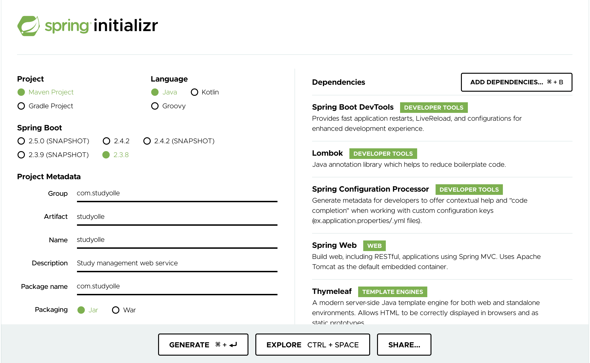

# 백기선님의 스프링과 JPA 기반 웹 애플리케이션 개발
> 아래 내용은 [스프링과 JPA 기반 웹 애플리케이션 개발](https://www.inflearn.com/course/스프링-JPA-웹앱# "스프링과 JPA 기반 웹 애플리케이션 개발") 강좌를 정리한 내용 입니다.

## 1. 프로젝트 만들기

* https://start.spring.io/ 에서 다음과 같이 프로젝트를 생성 할 수 있다. 

    
    
    * 스프링 부트
    * 스프링 웹 MVC
    * 타임리프 (뷰 템플릿)
    * 스프링 시큐리티
    * 스프링 데이터 JPA
    * H2
    * PostgreSQL
    * 롬복
    * 스프링 mail
    * 스프링 부트 devtools

## 2. 스프링 MVC

* (1) 도메인 만들기

    * ① `domain` 패키지를 생성한다.

    * ② 해당 패키지에 도메인 클래스를 작성한다.
    
         ```java
        @Entity
        @Getter @Setter @EqualsAndHashCode(of = "id") // 무한루프 방지
        @Builder @AllArgsConstructor @NoArgsConstructor
        public class Account {
        
            @Id @GeneratedValue
            private Long id;
        
            @Column(unique = true)
            private String email;
        
            @Column(unique = true)
            private String nickname;
        
            private String password;
        
            private boolean emailVerified;
        
            // 이메일을 검증할 때, 사용 할 토큰 값을 저장하는 필드를 선언
            private String emailCheckToken;
        
            // 가입 날짜
            private LocalDateTime joinedAt;
        
            // 짧은 자기 소개
            private String bio;
        
            private String url;
        
            private String occupation;
        
            // 살고 있는 지역
            private String location;
        
            @Lob @Basic(fetch = FetchType.EAGER)
            private String profileImage;
        
            private boolean studyCreatedByEmail;
        
            private boolean studyCreatedByWeb;
        
            private boolean studyEnrollmentResultByEmail;
        
            private boolean studyEnrollmentResultByWeb;
        
            private boolean studyUpdatedByEmail;
        
            private boolean studyUpdatedByWeb;
        
        }
         ```
      
* (2) 컨트롤러 만들기
 
    * ① `account` 패키지를 생성한다.

    * ② `AccountController`를 작성한다.
    
         ```java
        @Controller
        public class AccountController {
        
            @GetMapping("/sign-up")
            public String signUpForm(Model model){
                return "account/sign-up";
            }
        
        }
         ```
 
* (3) 뷰 만들기

    * `templates/account/sign-up`에 `sign-up.html`을 작성한다.
    
         ```html
        <!DOCTYPE html>
        <html lang="en">
        <head>
            <meta charset="UTF-8">
            <title>Title</title>
        </head>
        <body>
        Sign Up page
        </body>
        </html>
         ```

## 3. 스프링 시큐리티

* (1) 스프링 시큐리티 기본 설정
 
    * ① `config` 패키지를 생성한다. 
    
    * ② `SecurityConfig` 클래스를 작성한다.
    
         ```java
        @Configuration
        @EnableWebSecurity
        public class SecurityConfig extends WebSecurityConfigurerAdapter {
        
            @Override
            protected void configure(HttpSecurity http) throws Exception {
        
                http.authorizeRequests()
                        // 권한 확인 없이 접근 가능해야 함
                        .mvcMatchers("/", "/login", "/sign-up", "/check-email", "/check-email-token",
                                "/email-login", "/check-email-login", "/login-link").permitAll()
                        // 프로필은 HTTP GET 요청만 가능하며
                        .mvcMatchers(HttpMethod.GET, "/profile/*").permitAll()
                        // 나머지는 로그인을 해야 사용 할 수 있다.
                        .anyRequest().authenticated();
            }
        
        }
         ```
      
        * `@EnableWebSecurity`는 스프링 시큐리티 설정을 활성화한다.
        
        * `authorizeRequests()`는 시큐리티 처리에 HttpServletRequest를 이용한다는 것을 의미한다.
        
        * 스프링 시큐리티 설정은 `WebSecurityConfigurerAdapter` 클래스를 상속 받은 `SecurityConfig`를 작성한 다음, `HttpSecurity` 타입을 파라미터로 가지는 메서드를 오버라이딩 하여 지정한다.
        
        * `mvcMatchers()` 는 특정 경로를 지정한다. 
        
        * `permitAll()` 는 모든 사용자가 접근 할 수 있다.
        
        * `hasRole()` 는 특정 권한을 가진 사용자만 접근 할 수 있다.
        
        * `.anyRequest().authenticated()` 는 나머지 요청에 대해서는 인증된 사용자만 접근할 수 있다.
        
    * ③ 테스트 코드 작성하기
    
        ```java
        @SpringBootTest
        @AutoConfigureMockMvc
        class AccountControllerTest {
        
            @Autowired private MockMvc mockMvc;
            
            @DisplayName("회원 가입 화면 보이는지 테스트")
            @Test
            void signUpForm() throws Exception {
                mockMvc.perform(get("/sign-up"))
                        .andDo(print())
                        .andExpect(status().isOk())
                        .andExpect(view().name("account/sign-up"));
            }      
      
        }
        ```

* (2) static 리소스에 스프링 시큐리티 필터를 적용하지 않기

    ```java
    @Configuration
    @EnableWebSecurity
    public class SecurityConfig extends WebSecurityConfigurerAdapter {
    
        ...
    
        // static 리소스에 스프링 시큐리티 필터를 적용하지 않도록 한다.
        @Override
        public void configure(WebSecurity web) throws Exception {
            web.ignoring()
                    .requestMatchers(PathRequest.toStaticResources().atCommonLocations());
        }
    
    }
    ```

## 4. 타임리프

* (1) 타임리프 네임 스페이스를 선언

    ```html
    <html lang="en" xmlns:th="http://www.thymeleaf.org">
    ```

* (2) 자주 사용하는 타임리프 문법

    * `th:action` : <form> 태그의 action 속성 값을 대체한다.
    
    * `@{ ... }` : 링크 표현식으로, 서버의 루트 경로를 기준으로 탐색하여 **URL을 대체한다.**

    * `th:object`, `th:field`
    
        * `th:object="${폼 객체명}"`으로 Form 객체를 지정하여 HTML Form에 바인딩을 한다.
        
        * `th:field`
        
            * 해당 HTML 필드와 Form 객체의 필드를 바인딩한다.
        
            * HTML 필드 값이 Form 객체의 필드로 설정된다. 반대로 Form 객체의 필드 값이 HTML 필드 값으로 설정되기도 한다. 
    
        * 예시
        
            ```html
            <form th:action="@{/signup}" th:object="${signUpForm}" method="post">
                <div class="form-group">
                    <label for="nickname">닉네임</label>
                    <input id="nickname" type="text" th:field="*{nickname}">
                    <small id="nicknameHelp" class="form-text text-muted">
                        공백없이 문자와 숫자로만 3자 이상 20자 이내로 입력하세요. 가입후에 변경할 수 있습니다.
                    </small>
                </div>
        
                <div class="form-group">
                    <label for="email">이메일</label>
                    <input id="email" type="email" th:field="*{email}">
                    <small id="emailHelp" class="form-text text-muted">
                        사용자의 이메일을 공개하지 않습니다.
                    </small>
                </div>
        
                <div class="form-group">
                    <label for="password">패스워드</label>
                    <input id="password" type="password" th:field="*{password}">
                    <small id="passwordHelp" class="form-text text-muted">
                        8자 이상 50자 이내로 입력하세요. 영문자, 숫자, 특수기호를 사용할 수 있으며 공백은 사용할 수 없습니다.
                    </small>
                </div>
        
                <div class="form-group">
                    <button class="btn btn-primary btn-block" type="submit">가입하기</button>
                    <small id="submitHelp" class="form-text text-muted">
                        <a href="#">약관</a>에 동의하시면 가입하기 버튼을 클릭하세요.
                    </small>
                </div>
            </form>
            ```
          
    * `th:if="${#fields.hasErrors('필드명')}"` : 필드에 오류가 있을 경우에만 특정 태그를 표시한다.
     
    * `th:errors="*{필드명}"` : 태그의 내용을 해당 필드와 관련된 에러 메시지로 대체한다.
    
## 5. 부트스트랩(Bootstrap)

* 부트스트랩 기본 설정

    * ① **Get started**를 클릭한 다음, **Quick start**에서 CSS 관련 코드를 복사-붙여넣기 한다.
    
        ```html
        <link href="https://cdn.jsdelivr.net/npm/bootstrap@5.0.0-beta1/dist/css/bootstrap.min.css" rel="stylesheet" integrity="sha384-giJF6kkoqNQ00vy+HMDP7azOuL0xtbfIcaT9wjKHr8RbDVddVHyTfAAsrekwKmP1" crossorigin="anonymous">
        ```
    
    * ② JS 관련 코드도 복사-붙여넣기 하는데 뷰의 <body> 태그 아래에 넣는다.
    
        ```html
        <script src="https://cdn.jsdelivr.net/npm/@popperjs/core@2.5.4/dist/umd/popper.min.js" integrity="sha384-q2kxQ16AaE6UbzuKqyBE9/u/KzioAlnx2maXQHiDX9d4/zp8Ok3f+M7DPm+Ib6IU" crossorigin="anonymous"></script>
        <script src="https://cdn.jsdelivr.net/npm/bootstrap@5.0.0-beta1/dist/js/bootstrap.min.js" integrity="sha384-pQQkAEnwaBkjpqZ8RU1fF1AKtTcHJwFl3pblpTlHXybJjHpMYo79HY3hIi4NKxyj" crossorigin="anonymous"></script>
        ```