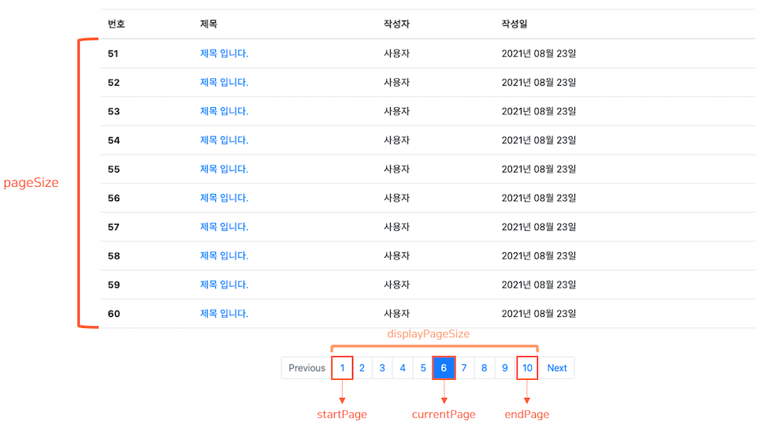

# 페이징
> 아래 내용은 [스타트 스프링 부트](https://book.naver.com/bookdb/book_detail.nhn?bid=12247655 "스타트 스프링 부트")를 참고하여 작성한 내용 입니다.

## 1. 스프링 데이터 JPA를 이용한 페이징 처리하기

* **(1) 도메인 작성하기**

    ```java
    @Entity
    @NoArgsConstructor @AllArgsConstructor
    @EqualsAndHashCode(of = "id")
    @Getter @Builder
    public class Post {
    
        @Id @GeneratedValue
        private Long id;
    
        private String title;
    
        private String content;
    
        private LocalDateTime updatedDate;
    
        private String updatedBy;
    
    }
    ```

* **(2) 컨트롤러 작성하기**

    ```java
    /*
    * 예제 코드를 쉽게 작성하기 위해 아래처럼 URI 매핑을 작성 했지만 URI 매핑과 관련된 부분은 개선이 필요합니다.
    * 예를 들어, 게시글을 생성하는 코드에서 GET "/posts/new" 보다는 POST "/posts"이 더 나은 선택입니다.
    * */
    @Controller
    @RequiredArgsConstructor
    public class PostController {
    
        private final PostService postService;
        private final PostRepository postRepository;
    
        /*
         * 게시글 생성하기
         * GET http://localhost:8080/posts/new
         * */
        @GetMapping("/posts/new")
        @ResponseBody
        public String createPost() {
            PostDto postDto = new PostDto();
            postDto.setTitle("제목 입니다.");
            postDto.setContent("내용 입니다.");
            postDto.setUpdatedBy("사용자");
            postDto.setUpdatedDate(LocalDateTime.now());
    
            // 게시글 생성
            for (int i = 0; i < 50; i++) {
                postService.createPost(postDto);
            }
    
            return "ok";
        }
    
        /*
         * 게시글 목록
         * GET http://localhost:8080/posts/search
         * */
        @GetMapping("/posts/search")
        public String getPosts(Model model, @ModelAttribute CustomPageRequest customPageRequest) {
            Page<Post> postPage = postRepository.findAll(customPageRequest.getPageable());
            CustomPageResponse<Post, PostDto> postCustomPageResponse = new CustomPageResponse<>(postPage, post -> new PostDto(post));
    
            model.addAttribute("currentPage", postCustomPageResponse.getCurrentPage());
            model.addAttribute("postList", postCustomPageResponse.getContent());
            model.addAttribute("startPage", postCustomPageResponse.getStartPage());
            model.addAttribute("endPage", postCustomPageResponse.getEndPage());
            model.addAttribute("isPrevious", postCustomPageResponse.isPrevious());
            model.addAttribute("isNext", postCustomPageResponse.isNext());
    
            return "posts/list";
        }
    
        /*
         * 게시글 목록 (JSON)
         * GET http://localhost:8080/posts/search-in-json
         * */
        @GetMapping("/posts/search-in-json")
        @ResponseBody
        public CustomPageResponse<Post, PostDto> getPostsInJson(@ModelAttribute CustomPageRequest customPageRequest) {
            Page<Post> postPage = postRepository.findAll(customPageRequest.getPageable());
            CustomPageResponse<Post, PostDto> postCustomPageResponse = new CustomPageResponse<>(postPage, post -> new PostDto(post));
    
            return postCustomPageResponse;
        }
    
    }
    ```

* **(3) 서비스 작성하기**

    ```java
    @Service
    @Transactional
    @RequiredArgsConstructor
    public class PostService {
    
        private final PostRepository postRepository;
    
        public Post createPost(PostDto postDto) {
            Post newPost = postRepository.save(postDto.toEntity());
    
            return newPost;
        }
    
    }
    ```

* **(4) 리포지토리 작성하기**

    ```java
    public interface PostRepository extends JpaRepository<Post, Long> {
    
        Page<Post> findAll(Pageable pageable);
    
    }
    ```

* **(5) DTO 작성하기**

    * ⓐ PostDto를 작성한다.
    
        ```java
        @Data
        @NoArgsConstructor
        public class PostDto {
        
            private Long id;
        
            private String title;
        
            private String content;
        
            private LocalDateTime updatedDate;
        
            private String updatedBy;
        
            public PostDto(Post post) {
                this.id = post.getId();
                this.title = post.getTitle();
                this.content = post.getContent();
                this.updatedDate = post.getUpdatedDate();
                this.updatedBy = post.getUpdatedBy();
            }
        
            public Post toEntity() {
                return Post.builder()
                        .title(title)
                        .content(content)
                        .updatedDate(updatedDate)
                        .updatedBy(updatedBy)
                        .build();
            }
        
        }
        ```
    
    * ⓑ CustomPageRequest를 작성한다.
    
        ```java
        @Data
        public class CustomPageRequest {
        
            // 현재 페이지 번호
            private int page;
        
            // 페이지 크기
            private int size;
        
            public CustomPageRequest() {
                this.page = 1;
                this.size = 10;
            }
        
            /* 클라이언트는 페이지 번호가 1번 부터 시작하는 것으로 알고 있으며 스프링 데이터 JPA는 페이지 번호가 0번 부터 시작하는 것으로 알고 있다.
               클라이언트의 요청을 처리할 때는 스프링 데이터 JPA의 기준으로 맞춰주기 위해 전달받은 페이지 번호에서 -1을 한다. */
            public Pageable getPageable() {
                return PageRequest.of(page - 1, size);
            }
        
            public Pageable getPageable(Sort sort) {
                return PageRequest.of(page - 1, size, sort);
            }
            
        }
        ```
    
    * ⓒ CustomPageResponse를 작성한다.
    
        ```java
        // PageResultDto에서 페이징 처리에 필요한 정보들을 정의한다.
        @Data
        public class CustomPageResponse<$Entity, $Dto> {
            // 컨텐츠를 담을 때는 Dto 형태로 담는다. (즉, Dto 리스트로 만듦)
            private List<$Dto> content;
        
            // 페이지 번호 목록
            private List<Integer> pageNumbers;
        
            // 총 페이지 개수
            private int totalPages;
        
            // 현재 페이지 번호
            private int currentPage;
        
            // 페이지 크기
            private int pageSize;
        
            // 시작 페이지 번호, 끝 페이지 번호
            private int startPage, endPage;
        
            // 이전 페이지와 다음 페이지 존재 여부
            private boolean isPrevious, isNext;
        
            public CustomPageResponse(Page<$Entity> page, Function<$Entity, $Dto> function) {
                content = page.stream()
                        .map(function)
                        .collect(Collectors.toList());
        
                totalPages = page.getTotalPages();
        
                createPagingData(page.getPageable());
            }
        
            private void createPagingData(Pageable pageable) {
                /* 클라이언트는 페이지 번호가 1번 부터 시작하는 것으로 알고 있으며 스프링 데이터 JPA는 페이지 번호가 0번 부터 시작하는 것으로 알고 있다.
                   서버가 응답을 만들 때는 클라이언트의 기준으로 맞춰주기 위해 전달받은 페이지 번호에서 +1을 한다. */
                this.currentPage = pageable.getPageNumber() + 1;
                this.pageSize = pageable.getPageSize();     // 한 페이지에 출력될 데이터(게시글) 수
                int displayPageSize = 10;                   // 한 화면에 출력될 페이지 수
        
                // 현재 페이지 번호(currentPage)를 기준으로 화면에 출력되어야 하는 마지막 페이지 번호를 먼저 계산한다.
                int tempEndPage = (int) (Math.ceil(currentPage / (double) displayPageSize)) * displayPageSize;
        
                // 화면의 시작 페이지 번호는 다음과 같이 처리한다. Ex) 20 - 9 = 11
                startPage = tempEndPage - (displayPageSize - 1);
        
                // 실제 데이터가 부족한 경우를 위해 마지막 페이지 번호는 전체 데이터의 개수를 이용해서 다시 계산한다.
                endPage = tempEndPage < totalPages ? tempEndPage : totalPages;
        
                /* 페이징 처리를 할 데이터가 하나도 없을 때, "[Previous] [1] [Next]"로 표시하기 위해서
                   1과 계산한 값의 최대 값을 구한다. */
                startPage = Math.max(1, startPage);
                endPage = Math.max(1, endPage);
        
                // 이전 페이지와 다음 페이지 존재 여부를 계산한다.
                isPrevious = startPage > 1;
                isNext = endPage < totalPages;
        
                pageNumbers = IntStream.rangeClosed(startPage, endPage).boxed().collect(Collectors.toList());
            }
        }
        ```
    
        * 한 화면에 출력할 페이지 목록은 다음과 같다.

            

        * 위의 페이지 목록을 만드는 방법을 그림과 함께 알아보자.

            
    
            * 현재 페이지 번호(`currentPage`)가 13이며 한 화면에 출력될 페이지 수(`displayPageSize`)가 10이라고 가정한다. 

                * ① 먼저, 현재 페이지 번호를 기준으로 화면에 출력되어야 하는 마지막 페이지 번호(`tempEndPage`)를 계산한다.
                  
                    * `int tempEndPage = (int) (Math.ceil(currentPage / (double) displayPageSize)) * displayPageSize;`
        
                        * currentPage : 현재 페이지 번호를 의미한다.
    
                        * displayPageSize : 한 화면에 출력할 페이지 수를 의미한다.
    
                            * [참고] pageSize : 한 페이지에 출력할 데이터 수를 의미한다.
        
                    * Ex) Math.ceil(13 / 10.0) * 10  = Math.ceil(1.3) * 10 = 20
    
                        * tempEndPage는 20이 된다.
        
                * ② 그리고 시작 페이지 번호는 다음과 같이 계산한다.
    
                    * `startPage = tempEndPage - (displayPageSize - 1);`
    
                        * tempEndPage : (임시) 마지막 페이지 번호
    
                        * displayPageSize : 한 화면에 출력할 페이지 수를 의미한다.
    
                    * Ex) 20 - (10 - 1) = 11
        
                * ③ 마지막 페이지 번호(`tempEndPage`)는 전체 데이터 개수가 부족한 경우가 발생할 수 있기 때문에 다시 계산할 필요가 있다.
    
                    * `endPage = tempEndPage < totalPages ? tempEndPage : totalPages;`
                      
                        * 예를 들어, 전체 데이터 개수가 145개면 한 화면에 출력할 페이지 목록은 11 ~ 20 페이지가 아닌 11 ~ 15 페이지까지 표시되어야 한다.
        
                        * 임시로 계산한 마지막 페이지 번호(`tempEndPage`)는 20이 되며 전체 데이터 개수가 145개면 총 페이지 개수(`totalPages`)는 15가 된다.
        
                        * 따라서 이 경우에는 20이 아닌 15가 한 화면에 출력할 페이지 목록의 마지막 페이지 번호가 되는 것이 맞다.
    
                * ④ 그리고 이전 페이지와 다음 페이지의 존재 여부를 계산한다.
        
                    * 한 화면에 출력할 페이지 목록의 시작 페이지 번호가 1 보다 크다는 것은 이전 페이지가 존재한다고 볼 수 있다.
        
                        * 1, 2, 3, 4, 5, 6, 7, 8, 9, 10
        
                        * 11, 12, 13, 14, 15
        
                            * 시작 페이지 번호 11은 1 보다 크기 때문에 이전 페이지가 존재한다.
    
                    * 한 화면에 출력할 페이지 목록의 마지막 페이지 번호가 총 페이지 개수 보다 작다는 것은 다음 페이지가 존재한다고 볼 수 있다.
        
                        * endPage : 10 , totalPages : 15  -> 다음 페이지가 존재한다.
    
                        * endPage : 15 , totalPages : 15  -> 다음 페이지가 존재하지 않는다.    

* **(6) 뷰 작성하기**

    * ⓐ Header를 작성한다. (`templates/fragments/header.html`)

        ```html
        <!DOCTYPE html>
        <html xmlns:th="http://www.thymeleaf.org">
        
        <head th:fragment="header">
            <!-- Required meta tags -->
            <meta charset="UTF-8">
            <!-- Google Font CSS -->
            <link href="https://fonts.googleapis.com/css?family=Noto+Sans+KR:300,400,500&display=swap" rel="stylesheet">
            <!-- Bootstrap -->
            <link rel="stylesheet" href="https://cdn.jsdelivr.net/npm/bootstrap@4.6.0/dist/css/bootstrap.min.css" integrity="sha384-B0vP5xmATw1+K9KRQjQERJvTumQW0nPEzvF6L/Z6nronJ3oUOFUFpCjEUQouq2+l" crossorigin="anonymous">
            <script src="https://code.jquery.com/jquery-3.5.1.slim.min.js" integrity="sha384-DfXdz2htPH0lsSSs5nCTpuj/zy4C+OGpamoFVy38MVBnE+IbbVYUew+OrCXaRkfj" crossorigin="anonymous"></script>
            <script src="https://cdn.jsdelivr.net/npm/bootstrap@4.6.0/dist/js/bootstrap.bundle.min.js" integrity="sha384-Piv4xVNRyMGpqkS2by6br4gNJ7DXjqk09RmUpJ8jgGtD7zP9yug3goQfGII0yAns" crossorigin="anonymous"></script>
        
            <title>게시판</title>
            <style>
            * {
              font-family: -apple-system, BlinkMacSystemFont, "Noto Sans KR", "Segoe UI", Roboto, "Helvetica Neue", Arial, "Noto Sans", sans-serif, "Apple Color Emoji", "Segoe UI Emoji", "Segoe UI Symbol", "Noto Color Emoji";
            }
        
            /* ------ 고정된 FOOTER ------ */
            html {
              position: relative;
              min-height: 100%;
            }
        
            body {
              /* Margin bottom by footer height */
              margin-bottom: 60px;
            }
        
            .footer {
              position: absolute;
              bottom: 0;
              width: 100%;
              height: 60px;
              line-height: 60px;
              background-color: #f5f5f5;
            }
        
          </style>
        </head>
        ```

    * ⓑ 페이징을 처리하는 게시글 목록 뷰를 작성한다. (`templates/posts/list.html`)

        ```html
        <!DOCTYPE html>
        <html lang="en" xmlns:th="http://www.thymeleaf.org">
        <head th:replace="fragments/header :: header"></head>
        <body>
            <div class="container my-5">
                <div>
                    <table class="table border-bottom border-gray">
                        <thead>
                        <tr>
                            <th scope="col">번호</th>
                            <th scope="col">제목</th>
                            <th scope="col">작성자</th>
                            <th scope="col">작성일</th>
                        </tr>
                        </thead>
        
                        <tbody>
                        <tr th:each="post : ${postList}">
                            <th scope="row" th:text="${post.id}">number</th>
                            <td>
                                <a th:href="@{'/posts/' + ${post.id}}" class="text-decoration-none">
                                    <span class="text-truncate" th:text="${post.title}"></span>
                                </a>
                            </td>
                            <td th:text="${post.updatedBy}">별명</td>
                            <td th:text="${#temporals.format(post.updatedDate, 'yyyy년 MM월 dd일')}">작성일</td>
                        </tr>
                        </tbody>
                    </table>
                </div>
            </div>
        
            <!-- 페이지네이션 -->
            <div>
                <nav>
                    <ul class="pagination justify-content-center">
                        <li class="page-item" th:classappend="${!isPrevious} ? disabled">
                            <a th:href="@{/posts/search(page=${startPage} - 1)}" class="page-link" tabindex="-1" aria-disabled="true">
                                Previous
                            </a>
                        </li>
                        <li class="page-item" th:classappend="${i == currentPage}? active" th:each="i : ${#numbers.sequence(startPage, endPage)}">
                            <a th:href="@{/posts/search(page=${i})}" class="page-link" href="#" th:text="${i}">1</a>
                        </li>
                        <li class="page-item" th:classappend="${!isNext} ? disabled">
                            <a th:href="@{/posts/search(page=${endPage} + 1)}" class="page-link">
                                Next
                            </a>
                        </li>
                    </ul>
                </nav>
            </div>
        </body>
        </html>
        ```