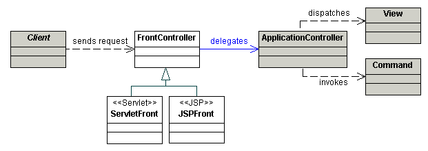
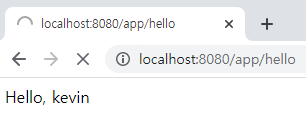

# 백기선님의 스프링 웹 MVC
> 아래 내용은 [스프링 웹 MVC](https://www.inflearn.com/course/%EC%9B%B9-mvc# "스프링 웹 MVC") 강좌를 정리한 내용 입니다.

## 1. 스프링 MVC 동작 원리

#### 1) 스프링 MVC 소개

* (1) 롬복(Lombok)

    * 롬복(Lombok)은 자바로 개발할 때, 자주 사용하는 코드(Getter, Setter, 기본 생성자, toString 등)를 애노테이션으로 자동 생성 해준다.
    
    * 롬복 설치 과정
    
        * ① 롬복 의존성 추가하기
    
            ```html
            <dependency>
                <groupId>org.projectlombok</groupId>
                <artifactId>lombok</artifactId>
                <version>1.16.20</version>
                <scope>provided</scope>
            </dependency>
            ```
          
         * ② 롬복 플러그인 설치하기
         
            * 롬복(Lombok) 플러그인을 Install 한 다음, 인텔리제이를 재 시작 해야 한다.
                
            
                
         * ③ `Enable annotation processing`을 체크한다.       
    
            
     
          * ④ 지금부터 해당 프로젝트에서 롬복을 사용 할 수 있다.
          
    * 자주 사용하는 롬복 애노테이션
    
        * `@Getter` : getter 메서드를 자동 생성한다.
        * `@Setter` : setter 메서드를 자동 생성한다.
        * `@NoArgsConstructor` : 매개변수가 없는 생성자(기본 생성자)를 자동 생성한다.
        * `@AllArgsConstructor` : 모든 필드 값을 매개변수로 받는 생성자를 자동 생성한다.
        * `@RequiredArgsConstructor` : `final`이나 `@NonNull`인 필드 값만 매개변수로 받는 생성자를 자동 생성한다.
        * `@ToString` : toString() 메서드를 자동 생성한다. exclude 속성을 사용하여 특정 필드를 결과에서 제외 시킬 수 있다.
        * `@EqualsAndHashCode` : equals()와 hashCode() 메서드를 자동 생성한다.
        * `@Data` : `@Getter`, `@Setter`, `@RequiredArgsConstructor`, `@ToString`, `@EqualsAndHashCode`를 한꺼번에 설정한다.
        * `@Builder` : 빌더 패턴을 사용 할 수 있도록 한다.

* (2) MVC 란?
    
    * 모델(Model)
    
        * 화면에 전달 할 또는 화면에서 전달 받은 데이터를 담고 있는 객체이다.
    
        * 도메인 객체 또는 DTO를 말한다.
    
    * 뷰(View)
    
        * 모델이 담고 있는 데이터를 보여주는 역할을 한다.
    
        * 다양한 형태로 보여 줄 수 있다. (HTML, JSON, XML ...)
    
    * 컨트롤러(Controller)
    
        * 사용자의 입력을 받아 모델 객체의 데이터를 변경하거나 모델 객체를 뷰에 전달하는 역할을 한다.
    
            * ① 입력 값 검증
        
            * ② 입력 받은 데이터로 모델 객체를 변경
        
            * ③ 변경된 모델 객체를 뷰에 전달
    
* (3) Spring MVC
    
    * `Spring MVC`는 서블릿 기반의 웹 애플리케이션을 개발할 때, MVC 패턴을 쉽게 사용 할 수 있도록 도와주는 프레임워크이다.
    
* (4) 실습
    
    * ① 프로젝트 생성
    
        
        
    * ② 컨트롤러(Controller) 작성
    
        ```java
        @Controller
        public class EventController {
        
            // "/events" GET 요청이 들어오면 처리 할 핸들러 지정
            // @RequestMapping(value = "/events" , method = RequestMethod.GET)
            @GetMapping("/events")
            public String events(Model model){
                return "events";
            }
        }
        ```
      
    * ③ 모델(Model) 작성
    
        ```java
        @Getter @Setter
        @Builder @NoArgsConstructor @AllArgsConstructor
        public class Event {
        
            private String name;
        
            private int limitOfEnrollment;
        
            private LocalDateTime startDateTime;
        
            private LocalDateTime endDateTime;
        }
        ```
       
    * ④ 서비스 작성
    
        ```java
        @Service
        public class EventService {
        
            public List<Event> getEvents(){
            	// Event 생성
                Event event1 = Event.builder()
                        .name("스프링 웹 MVC 스터디 1차")
                        .limitOfEnrollment(5)
                        .startDateTime(LocalDateTime.of(2019, 1, 10, 10, 0))
                        .endDateTime(LocalDateTime.of(2019, 1, 10, 12, 0))
                        .build();
        
                Event event2 = Event.builder()
                        .name("스프링 웹 MVC 스터디 2")
                        .limitOfEnrollment(5)
                        .startDateTime(LocalDateTime.of(2019, 1, 17, 10, 0))
                        .endDateTime(LocalDateTime.of(2019, 1, 17, 12, 0))
                        .build();
        
                return List.of(event1, event2); // List.of() : 변경 할 수 없는 List를 생성한다. 변경 시 예외 발생
            }
        
        }
        ```
       
    * ⑤ 컨트롤러(Controller) 변경
    
        ```java
        @Controller
        public class EventController {
        
            @Autowired
            EventService eventService; // Service를 주입 받아 사용한다.
        
            // "/events" GET 요청이 들어오면 처리 할 핸들러 지정
            // @RequestMapping(value = "/events" , method = RequestMethod.GET)
            @GetMapping("/events")
            public String events(Model model){
                model.addAttribute("events", eventService.getEvents()); // 모델에 담는다.
                return "events"; // 뷰의 이름
            }
        }
        ```
      
    * ⑥ 뷰(View) 작성 [events.html]
    
        ```html
        <!DOCTYPE html>
        <html lang="en" xmlns:th="http://www.thymeleaf.org">
        <head>
            <meta charset="UTF-8">
            <title>Title</title>
        </head>
        <body>
            <h1>이벤트 목록</h1>
            <table>
                <tr>
                    <th>이름</th>
                    <th>참가 인원</th>
                    <th>시작</th>
                    <th>종료</th>
                </tr>
                <tr th:each="event : ${events}">
                    <td th:text="${event.name}">이벤트 이름</td>
                    <td th:text="${event.limitOfEnrollment}">100</td>
                    <td th:text="${event.startDateTime}">2021년 1월 10일 오전 10시</td>
                    <td th:text="${event.endDateTime}">2021년 1월 10일 오전 12시</td>
                </tr>
            </table>
        </body>
        </html>
        ```

* (5) MVC 패턴의 장점
    
    * 동시 다발적(Simultaneous) 개발 가능

        * 백엔드 개발자와 프론트엔드 개발자가 독립적으로 개발을 진행 할 수 있다.

    * 높은 결합도
    
        * 논리적으로 관련있는 기능을 하나의 컨트롤러로 묶거나, 특정 모델과 관련있는 뷰를 그룹화 할 수 있다.

    * 낮은 의존도
    
        * 뷰, 모델, 컨트롤러는 각각 독립적이다.

        * (서로 간에 독립적이다.)

    * 개발 용이성
    
        * 책임이 구분되어 있어 코드 수정하는 것이 편하다.

    * 한 모델에 대한 여러 형태의 뷰를 가질 수 있다.

* (6) MVC 패턴의 단점

    * 코드 내비게이션 복잡함

    * 코드 일관성 유지에 노력이 필요함
    
    * 높은 학습 곡선이 필요함

#### 2) 서블릿 애플리케이션 

* (1) 서블릿(Servlet)

    * `서블릿(Servlet)`은 자바를 사용하여 웹 페이지를 동적으로 생성하는 서버 측 프로그램이다.

    * Java 코드 안에 HTML 코드가 있다.

* (2) JSP(Java Server Pages)

    * 서블릿 기반의 서버 사이드 스크립트 기술이다.

    * HTML 태그 안에 Java 코드가 있다.

* (3) 서블릿의 특징

    * 자바 엔터프라이즈 에디션은 웹 애플리케이션 개발용 스펙과 API를 제공한다.

    * 그 중에 가장 중요한 클래스 중 하나가 `HttpServlet`이며 요청 마다 새로운 프로세스를 만드는 것이 아닌 한 프로세스 내의 자원을 공유하는 스레드를 만들어서 요청을 처리한다.

    * 서블릿 등장 이전에 사용하던 기술인 CGI(Common Gateway Interface)는 요청 당 프로세스를 만들어서 사용한다.

* (4) 서블릿의 장점 (CGI에 비해)

    * 빠르다.

    * 플랫폼(OS)에 독립적이다.

    * 보안성이 좋다.

    * 이식성이 좋다.

* (5) 서블릿 엔진 또는 서블릿 컨테이너 (Tomcat, Jetty, Undertow, ...)

    * 서블릿 생명주기(Life Cycle)를 관리
    
    * 세션 관리

    * 네트워크 서비스

    * MIME(마임) 기반 메시지를 인코딩 / 디코딩

    * ...

* (6) 서블릿 생명주기(Life Cycle) 

    * 서블릿은 우리가 직접 실행 할 수 없으며 서블릿 컨테이너가 실행 할 수 있다.
    
    * 서블릿의 생명주기는 다음과 같다.

        * ① 서블릿 컨테이너가 서블릿 인스턴스의 `init()` 메소드를 호출하여 초기화 한다. 
    
            * (최초 요청을 받았을 때 한번 초기화 하고 나면 그 다음 요청 부터는 이 과정을 생략한다.)
    
        * ② 서블릿이 초기화 된 다음 부터 클라이언트의 요청을 처리 할 수 있다.
    
        * 각 요청은 별도의 쓰레드로 처리하고 이때 서블릿 인스턴스의 `service()` 메소드를 호출한다.
    
            * 이 안에서 HTTP 요청을 받고 클라이언트로 보낼 HTTP 응답을 만든다.
        
            * `service()`는 보통 HTTP Method에 따라 `doGet()`, `doPost()` 등으로 처리를 위임한다.
        
            * 따라서 보통 `doGet()` 또는 `doPost()`를 구현한다.
            
        * ③ 서블릿 컨테이너의 판단에 따라 해당 서블릿을 메모리에서 내려야 할 시점에 `destroy()`를 호출한다.

#### 3) 서블릿 애플리케이션 개발

* (1) 프로젝트 생성

    * ① Maven 프로젝트를 선택하고 `Create from archetype`를 체크한 다음, 아래와 같이 선택한다.
    
        * `archetype`는 메이븐(Maven)에서 미리 만들어 놓은 프로젝트 구조

        

    * ② 다음과 같이 지정한다.
    
        
        
    * ③ 메이븐 홈 디렉토리가 지정 되어 있다면 [FINISH]를 클릭한다.
      
    * (이 과정을 진행 하기 전에 메이븐이 설치 되어 있어야 한다.)  
    
           
        
* (2) 서블릿 생성

    * ① `pom.xml`에 서블릿 API 의존성을 추가한다.

        ```html
        <dependency>
            <groupId>javax.servlet</groupId>
            <artifactId>javax.servlet-api</artifactId>
            <version>4.0.1</version>
            <scope>provided</scope>
        </dependency>
        ```
      
        * provided : 어디선가 제공되는 의존성이라는 의미다. 코딩하는 시점에는 사용 할 수 있으나 War 패키징할 때는 제외된다. 
    
    * ② `src/main`에 java 디렉토리를 생성한다.
    
    * ③ 다음과 같이 `Project Structure`에서 java 디렉토리를 Source 디렉토리로 지정한다.
    
        
        
    * ④ `src/java`에 `me.kevinntech` 패키지를 생성한 다음, HelloServlet 클래스를 작성한다.
    
        ```java
        public class HelloServlet extends HttpServlet {
        
            @Override
            public void init() throws ServletException {
                System.out.println("init");
            }
        
            @Override
            protected void doGet(HttpServletRequest req, HttpServletResponse resp) throws ServletException, IOException {
                System.out.println("doGet");
                resp.getWriter().println("<html>");
                resp.getWriter().println("<head>");
                resp.getWriter().println("<body>");
                resp.getWriter().println("<h1>Hello Servlet</h1>");
                resp.getWriter().println("</body>");
                resp.getWriter().println("</head>");
                resp.getWriter().println("</html>");
            }
        
            @Override
            public void destroy() {
                System.out.println("destroy");
            }
            
        }
        ```
      
        * 서블릿을 실행 하려면 톰캣이 필요하며 서블릿을 독자적으로 실행 할 수는 없다.
    
* (3) 톰캣 설치
      
    * ① `pom.xml`에 서블릿 의존성을 추가한다.

        
    
    * ② 다운로드 받은 파일을 압축 해제 한다.
     
    * ③ Mac의 경우, 톰캣 디렉토리로 이동하여 실행 파일(`.sh`)에 대한 실행 권한을 부여 해야한다.
    
        
    
        * `chmod +x ./*.sh`는 현재 디렉토리에 있는 `.sh` 파일에 대해 실행 권한을 부여한다.
        
* (4) 톰캣 실행 (인텔리제이 얼티메이트 버전 기준)

    * ① [Add Configuration...]를 클릭한다.
    
        
        
    * ② + 버튼을 클릭한 다음, Tomcat Server에서 Local를 선택한다.

        
        
    * ③ 톰캣이 설치된 경로를 지정하고 Before launch에 maven goal로 `compile war:exploded`를 추가한다.
    
        
        
    * ④ 그리고 Fix 버튼을 클릭한 다음, 아래와 같이 선택한다.
    
        
        
        * `war exploded`는 war 압축을 해제한 상태로 톰캣에 배포한다는 의미다.

* (5) `web.xml`에 서블릿 등록 및 맵핑
    
```html
<!DOCTYPE web-app PUBLIC
 "-//Sun Microsystems, Inc.//DTD Web Application 2.3//EN"
 "http://java.sun.com/dtd/web-app_2_3.dtd" >

<web-app>
  <display-name>Archetype Created Web Application</display-name>

  <servlet>
    <servlet-name>hello</servlet-name>
    <servlet-class>me.kevinntech.HelloServlet</servlet-class>
  </servlet>

  <servlet-mapping>
    <servlet-name>hello</servlet-name>
    <url-pattern>/hello</url-pattern>
  </servlet-mapping>
</web-app>
```

#### 4) 서블릿 리스너와 서블릿 필터

* (1) 서블릿 리스너

    * `서블릿 리스너`는 웹 애플리케이션에서 발생하는 주요 이벤트를 감지하고 각 이벤트에 특별한 작업을 처리하도록 할 수 있다.
   
* (2) 이벤트의 종류

    * `이벤트`는 크게 2가지로 나눌 수 있다.
    
        * ① 서블릿 컨텍스트 수준의 이벤트
    
            * 컨텍스트 라이프사이클 이벤트
        
            * 컨텍스트 애트리뷰트 변경 이벤트
    
        * ② 세션 수준의 이벤트
    
            * 세션 라이프사이클 이벤트
    
            * 세션 애트리뷰트 변경 이벤트

* (3) 서블릿 필터

    * `서블릿 필터`는 서블릿 실행 전후에 어떤 작업을 하고자 할 때, 사용한다.

    * 체인 형태의 구조로 되어 있다.
  
        
        
* (4) 서블릿 리스너 - 실습

    * ① `ServletContext`의 라이프 사이클을 감지 할 수 있는 `ServletContextListener`를 구현한 클래스를 작성한다. 

        * `ServletContextListener`는 `ServletContext`의 라이프 사이클을 감지 할 수 있다.
        
        * 그리고 웹 애플리케이션이 시작되거나 종료될 때, 호출할 메서드(`contextInitialized()`, `contextDestroyed()`)를 정의한 인터페이스다.
        
        ```java
        public class MyListener implements ServletContextListener {
            @Override
            public void contextInitialized(ServletContextEvent sce) { // 웹 애플리케이션을 초기화 할 때 호출한다.
                System.out.println("Context Initialized");
                sce.getServletContext().setAttribute("name", "kevin");
            }
        
            @Override
            public void contextDestroyed(ServletContextEvent sce) { // 웹 애플리케이션을 종료 할 때 호출한다.
                System.out.println("Context Destroyed");
            }
        }
        ```
      
    * ② 서블릿 컨테이너가 어떤 리스너인지 알 수 있도록 `web.xml`에 리스너(MyListener)를 등록한다.
             
        ```html
        <listener>
          <listener-class>me.kevinntech.MyListener</listener-class>
        </listener>
        ```
      
    * ③ 그리고 `HelloServlet`를 다음과 같이 변경한 다음, 애플리케이션을 실행한다.
         
        ```java
        public class HelloServlet extends HttpServlet {
        
            @Override
            public void init() throws ServletException {
                System.out.println("init");
            }
        
            @Override
            protected void doGet(HttpServletRequest req, HttpServletResponse resp) throws ServletException, IOException {
                System.out.println("doGet");
                resp.getWriter().println("<html>");
                resp.getWriter().println("<head>");
                resp.getWriter().println("<body>");
                resp.getWriter().println("<h1>Hello, " + getName() + "</h1>"); // name에 해당하는 애트리뷰트를 꺼내서 출력한다.
                resp.getWriter().println("</body>");
                resp.getWriter().println("</head>");
                resp.getWriter().println("</html>");
            }
        
            private Object getName() {
                return getServletContext().getAttribute("name");
            }
        
            @Override
            public void destroy() {
                System.out.println("destroy");
            }
        
        }
        ```

    * ④ 결과는 다음과 같다.
    
        
        
* (5) 서블릿 필터 - 실습

    * ① 필터(`Filter` 인터페이스를 구현한 클래스)를 작성한다.
    
        ```java
        public class MyFilter implements Filter {
        
            @Override
            public void init(FilterConfig filterConfig) throws ServletException {
                System.out.println("Filter Init");
            }
        
            @Override
            public void doFilter(ServletRequest servletRequest, ServletResponse servletResponse, FilterChain filterChain) throws IOException, ServletException {
                System.out.println("Filter");
                filterChain.doFilter(servletRequest , servletResponse); // 필터 체이닝을 함
            }
        
            @Override
            public void destroy() {
                System.out.println("Filter Destroy");
            }
        }
        ```
      
        * `init()` : 필터가 초기화 될 때 호출된다.
        
        * `doFilter()` : 필터와 매핑된 Servlet에 요청이 들어오면 호출된다.
        
            * `doFilter()`에 필터가 할 일을 작성한다.
            
            * `filterChain.doFilter()` : 다음 필터를 호출하고 결국에는 servlet에게 요청이 전달되도록 한다.
 
         * `destroy()` : 필터가 삭제될 때 호출된다.
          
    * ② `web.xml`에 필터(MyFilter)를 등록한다.
    
        ```html
        <filter>
          <filter-name>myFilter</filter-name>
          <filter-class>me.kevinntech.MyFilter</filter-class>
        </filter>
        
        <filter-mapping>
          <filter-name>myFilter</filter-name>
          <servlet-name>hello</servlet-name>
        </filter-mapping>
        ```
      
    * ③ 애플리케이션을 실행하여 결과를 확인한다.
    
#### 5) 스프링 IoC 컨테이너 연동

* (1) 서블릿 애플리케이션에 스프링 연동하기

    * 서블릿 애플리케이션에 스프링을 사용한다는 것은 다음과 같은 의미를 갖는다.

        * ① 서블릿에서 스프링이 제공하는 `IoC 컨테이너`를 사용하는 것
    
        * ② 스프링이 제공하는 서블릿 구현체인 `DispatcherServlet`를 사용하는 것
        
* (2) 서블릿에서 스프링이 제공하는 IoC 컨테이너 사용하기

    * ① `pom.xml`에 다음과 같은 의존성을 추가한다.
    
        * 스프링 부트를 사용하고 있는 것이 아니기 때문에 버전을 명시해야 한다. 

            ```html
            <dependency>
              <groupId>org.springframework</groupId>
              <artifactId>spring-webmvc</artifactId>
              <version>5.1.18.RELEASE</version>
            </dependency>
            ```

    * ② `web.xml`에서 MyListener 대신에 스프링이 제공하는 `ContextLoaderListener`를 사용한다.
  
        * 서블릿 컨테이너는 `web.xml`에 기술된 내용으로 초기화를 진행한다.
                
        ```html
          <listener>
            <listener-class>org.springframework.web.context.ContextLoaderListener</listener-class>
          </listener>
        ```

        * `ServletContext`는 모든 서블릿들이 사용 할 수 있는 정보를 모아 둔 저장소를 말한다.
        
        * ContextLoaderListener

            * `ContextLoaderListener`는 서블릿 리스너의 구현체이며

            * `ServletContext`의 라이프 사이클에 맞춰서 `ServletContext`에 `스프링 IoC 컨테이너(ApplicationContext)`를 자동으로 등록하고 소멸 시켜준다.

            * `ContextLoaderListener`가 `ApplicationContext`를 생성한 다음, `ServletContext`에 등록하려면 `ApplicationContext`의 타입과 `스프링 IoC 컨테이너 설정 파일`이 필요하다.
            
            * 그래서 ③번 과정에서 해당 내용을 설정한다.
            
    * ③ `web.xml`에서 `contextClass`에 ApplicationContext의 타입을 지정하고 `contextConfigLocation`에 자바 설정 파일을 지정한다.

            ```html
              <context-param>
                <param-name>contextClass</param-name>
                <param-name>org.springframework.web.context.support.AnnotationConfigWebApplicationContext</param-name>
              </context-param>
            
              <context-param>
                <param-name>contextConfigLocation</param-name>
                <param-value>me.kevinntech.AppConfig</param-value>
              </context-param>
            ```
            
        * `contextClass` 파라미터는 `ContextLoaderListener`가 등록 할 스프링 IoC 컨테이너의 타입을 지정할 때 사용한다.     
  
        * `contextConfigLocation` 파라미터는 스프링 IoC 컨테이너의 설정 파일 위치를 지정할 때 사용한다.  
        
    * ④ 자바 설정 파일을 작성한다.

        ```java
        @Configuration
        @ComponentScan
        public class AppConfig {
        }
        ```

    * ⑤ 빈으로 등록하기 위한 HelloService 클래스를 작성

        ```java
        @Service
        public class HelloService {
        
            public String getName(){
                return "kevin";
            }
            
        }
        ```
      
    * ⑥ 다음과 같이 HelloServlet 클래스를 변경한 다음, 애플리케이션을 실행한다.

        ```java
        public class HelloServlet extends HttpServlet {
        
            @Override
            public void init() throws ServletException {
                System.out.println("init");
            }
        
            @Override
            protected void doGet(HttpServletRequest req, HttpServletResponse resp) throws ServletException, IOException {
                System.out.println("doGet");
        
                // 서블릿에서 ServletContext를 통해 ApplicationContext를 꺼내 사용할 수 있다.
                // 그리고 ApplicationContext에서 빈을 꺼낼 수 있다.
                ApplicationContext context = (ApplicationContext) getServletContext().getAttribute(WebApplicationContext.ROOT_WEB_APPLICATION_CONTEXT_ATTRIBUTE);
                HelloService helloService = context.getBean(HelloService.class);
        
                resp.getWriter().println("<html>");
                resp.getWriter().println("<head>");
                resp.getWriter().println("<body>");
                resp.getWriter().println("<h1>Hello, " + helloService.getName() + "</h1>");
                resp.getWriter().println("</body>");
                resp.getWriter().println("</head>");
                resp.getWriter().println("</html>");
            }
        
            private Object getName() {
                return getServletContext().getAttribute("name");
            }
        
            @Override
            public void destroy() {
                System.out.println("destroy");
            }
        
        }
        ```
      
#### 6) 스프링 MVC 연동

* (1) Front Controller 

    
        
    * 사용자의 요청 하나를 처리할 때 마다 서블릿을 만든다면 매번 `web.xml`에 Servlet를 등록하고 맵핑하는 과정이 필요하다.
      
    * 이러한 불편한 점을 해결하기 위해 등장한 것이 바로 `FrontController` 패턴이다.
      
    * `FrontController`는 하나의 컨트롤러가 모든 요청을 받아서 해당 요청을 처리 할 핸들러에게 요청을 분배하는 패턴을 말한다.
    
* (2) DispatcherServlet
  
    * `DispatcherServlet`는 스프링에서 Front Controller 역할을 하는 서블릿을 이미 구현 해놓은 것을 말한다.

    * `DispatcherServlet`이 모든 요청을 받아서 해당 요청을 처리 할 핸들러에게 요청을 분배(Dispatch)하고 핸들러의 실행 결과를 `Http 응답(Response)`로 만든다.

* (3) Root WebApplicationContext 와 Servlet WebApplicationContext

    

    * ① Root WebApplicationContext

        * `Root WebApplicationContext`는 `ContextLoaderListener`에 의해 `ServletContext`에 등록 되는 ApplicationContext를 말한다.

        * `Root WebApplicationContext`는 다른 Servlet에서도 사용할 수 있다.

        * Web과 관련된 빈들은 등록 되지 않는다. (Service와 Repository...가 등록 됨)

    * ② Servlet WebApplicationContext

        * `Servlet WebApplicationContext`는 `DispatcherServlet`이 `Root WebApplicationContext`를 상속 받아 만든 ApplicationContext를 말한다.

        * `Servlet WebApplicationContext`은 해당 DispatcherServlet 내부에서만 사용 가능하다. 
        
        * Web과 관련된 빈이 등록된다. (Controller, ViewResolver, 다른 웹 관련 빈)

* (4) 상속 구조로 만드는 이유?

    * 만약 `DispatcherServlet`를 여러 개 만들어야되고 다른 `DispatcherServlet`들이 공용으로 사용하는 빈이 있다면 `Root WebApplicationContext`를 상속 받는 구조로 만든다.

* (5) 스프링이 제공하는 DispatcherServlet을 사용하기 (계층 구조로 만들기)

    * ① 컨트롤러를 작성한다.
    
        ```java
        @RestController
        public class HelloController {
        
            @Autowired
            HelloService helloService; // 빈으로 등록 되어 있는 Service를 주입 받는다.
        
            @GetMapping("/hello")
            public String hello() {
                return "Hello, " + helloService.getName();
            }
        
        }
        ```
      
    * ② `web.xml`에 `DispatcherServlet`을 등록한다.
      
        * DispatcherServlet이 WebConfig 파일을 사용하여 ApplicationContext를 만들도록 설정한다.
      
        * 그리고 app으로 시작하는 모든 요청을 DistpatcherServlet이 받아서 처리 하도록 한다.
      
        ```html
        <!DOCTYPE web-app PUBLIC
                "-//Sun Microsystems, Inc.//DTD Web Application 2.3//EN"
                "http://java.sun.com/dtd/web-app_2_3.dtd" >
        
        <web-app>
            <display-name>Archetype Created Web Application</display-name>
        
            <context-param>
                <param-name>contextClass</param-name>
                <param-value>org.springframework.web.context.support.AnnotationConfigWebApplicationContext</param-value>
            </context-param>
        
            <context-param>
                <param-name>contextConfigLocation</param-name>
                <param-value>me.kevinntech.AppConfig</param-value>
            </context-param>
            
            <listener>
                <listener-class>org.springframework.web.context.ContextLoaderListener</listener-class>
            </listener>
        
            <servlet>
                <servlet-name>app</servlet-name>
                <servlet-class>org.springframework.web.servlet.DispatcherServlet</servlet-class>
                <init-param>
                    <param-name>contextClass</param-name>
                    <param-value>org.springframework.web.context.support.AnnotationConfigWebApplicationContext</param-value>
                </init-param>
                <init-param>
                    <param-name>contextConfigLocation</param-name>
                    <param-value>me.kevinntech.WebConfig</param-value>
                </init-param>
            </servlet>
        
            <servlet-mapping>
                <servlet-name>app</servlet-name>
                <url-pattern>/app/*</url-pattern>
            </servlet-mapping>
        
        </web-app>
        ```
      
        * DispatcherServlet은 app으로 시작하는 모든 요청을 받아서 실제 요청을 처리 할 핸들러를 찾은 다음, 핸들러에게 요청을 분배한다.
      
    * ③ AppConfig 클래스를 작성한다. 
    
        * 컴포넌트 스캔을 할 때, Controller를 제외한 나머지만 빈(Bean)으로 등록한다.
      
        * 그리고 ContextLoaderListener가 만드는 ApplicationContext (`Root WebApplicationContext`)는 Service, Repository를 빈으로 등록하도록 한다.
    
        ```java
        @Configuration
        @ComponentScan(excludeFilters = @ComponentScan.Filter(Controller.class)) // 컨트롤러는 빈으로 등록하지 않음
        public class AppConfig {
        }
        ```
      
    * ④ WebConfig 클래스를 수정한다.
      
        * 컴포넌트 스캔을 할 때, 기본 필터는 사용하지 않고 Controller만 빈(Bean)으로 등록한다.
      
        * DispatcherServlet이 만드는 ApplicationContext (`Servlet WebApplicationContext`)는 Controller를 빈으로 등록하도록 한다.
          
        ```java
        @Configuration
        @ComponentScan(useDefaultFilters = false , includeFilters = @ComponentScan.Filter(Controller.class))
        public class WebConfig {
        
        }
        ```
      
    * ⑤ 웹 브라우저에서 다음 URL로 요청한다.

      
            
* (6) 스프링이 제공하는 DispatcherServlet을 사용하기 (계층 구조로 만들지 않기)

    * DispatcherServlet를 여러 개 등록하지 않는다면 계층 구조로 만들 필요 없이 DispatcherServlet이 만드는 ApplicationContext에 모든 빈을 등록 할 수도 있다.

    * ① 아래와 같이 `web.xml`을 변경한 다음, `AppConfig` 파일은 더 이상 필요 없으므로 삭제한다.
    
        ```html
        <!DOCTYPE web-app PUBLIC
                "-//Sun Microsystems, Inc.//DTD Web Application 2.3//EN"
                "http://java.sun.com/dtd/web-app_2_3.dtd" >
        
        <web-app>
            
            <display-name>Web Application</display-name>
        
            <servlet>
                <servlet-name>app</servlet-name>
                <servlet-class>org.springframework.web.servlet.DispatcherServlet</servlet-class>
                <init-param>
                    <param-name>contextClass</param-name>
                    <param-value>org.springframework.web.context.support.AnnotationConfigWebApplicationContext</param-value>
                </init-param>
                <init-param>
                    <param-name>contextConfigLocation</param-name>
                    <param-value>me.kevinntech.WebConfig</param-value>
                </init-param>
            </servlet>
        
            <servlet-mapping>
                <servlet-name>app</servlet-name>
                <url-pattern>/app/*</url-pattern>
            </servlet-mapping>
        
        </web-app>
        ```
      
    * ② 그리고 `WebConfig`를 다음과 같이 변경한다.
    
        ```java
        @Configuration
        @ComponentScan
        public class WebConfig {
        
        }
        ```
      
        * 이제 모든 빈(Bean)이 WebConfig에 의해서 등록되도록 한다.
          
        * 더 이상 `Root WebApplicationContext`는 만들어지지 않으며 DispatcherServlet이 만드는 WebApplicationContext에 모든 빈이 등록된다.
      
    * ③ 애플리케이션을 실행하여 확인 해보자.
    
* (7) 정리

    * 사실, `DispatcherServlet`이 여러 개인 경우는 보기 드물다.

    * 최근에는 `DispatcherServlet`을 하나만 등록한 다음, `DispatcherServlet`이 만드는 `ApplicationContext`에 모든 빈을 등록하는 방식을 사용한다.
    
#### 7) DispatcherServlet 동작 원리 1부

* (1) DispatcherServlet 초기화

    * 다음과 같은 특별한 타입의 빈들을 찾거나, 기본 전략에 해당하는 빈들을 등록한다. 
      
        * HandlerMapping: 핸들러를 찾아주는 인터페이스 
        * HandlerAdapter: 핸들러를 실행하는 인터페이스 
        * HandlerExceptionResolver 
        * ViewResolver 
        * ...
    
* (2) DispatcherServlet 동작 순서

    * ① 클라이언트가 요청을 하면 `DispatcherServlet`이 요청을 받아서 분석한다. (로케일, 테마, 멀티파트 등) 

    * ② (핸들러 맵핑에게 위임하여) 요청을 처리할 핸들러를 찾는다.  

    * ③ (등록되어 있는 핸들러 어댑터 중에) 해당 핸들러를 실행 할 수 있는 “핸들러 어댑터”를 찾는다. 

    * ④ 찾아낸 “핸들러 어댑터”를 사용해서 핸들러의 응답을 처리한다. 핸들러의 리턴 값을 보고 어떻게 처리할지 판단한다.

        * 뷰 이름에 해당하는 뷰를 찾아서 모델 데이터를 랜더링한다.
    
        * @ResponseEntity가 있다면 Converter를 사용해서 응답 본문을 만든다.

    * ⑤ 예외가 발생 했다면, 예외 처리 핸들러에 요청 처리를 위임한다.

    * ⑥ 최종적으로 응답을 보낸다.
    
* (3) DispatcherServlet 분석하기

    * ① 키보드에서 `shift`를 2번 누르면 다음과 같은 팝업창이 나타나며 `DispatcherServlet`를 검색하여 클릭하자.
    
      
      
    * ② 다음과 같이 `DispatcherServlet` 코드에서 `doService()`, `doDispatch()`에 BreakPoint를 지정한다.
      
    * 그리고 HelloController의 hello()에도 BreakPoint를 지정한다.
    
      
      
      

           
      
    * ③ 애플리케이션을 디버깅 모드로 실행한다.
    
      
      
    * ④ 그리고 웹 브라우저에서 아래 URL로 요청을 하면, DispatcherServlet이 사용되며 디버그가 걸린다.
    
        * `http://localhost:8080/app/hello`
        
      
      
      
      
        * 디버그 단축키
        
            * Step Over `[F8]` : 다음 라인으로 넘어간다. 
            
            * Step Into `[F7]` : 현재 라인이 메서드에 있다면 메서드 안으로 들어간다.
      
* (4) 정리하기

    * 어떠한 설정을 하지 않아도 DispatcherServlet이 기본적으로 제공하는 2개의 핸들러 맵핑이 있다. 

        * ① `BeanNameUrlHandlerMapping`
    
        * ② `RequestMappingHandlerMapping`
        
            * 애노테이션 정보를 기반으로 핸들러를 찾아주는 HandlerMapping이다.
            
            * 즉, @Controller, @RequestMapping , @GetMapping , @PostMapping를 지정한 핸들러를 찾는다.

            * @RequestMapping를 메타 애노테이션으로 사용하는 @GetMapping , @PostMapping가 있다.

    * 강좌에서 진행한 실습에서는 3개의 HandlerAdapter가 있었다.

        * ① HttpRequestHandlerAdapter
    
        * ② SimpleControllerHandlerAdapter

        * ③ RequestMappingHandlerAdapter

            * 실습에서 사용된 핸들러 어댑터

    * `invokeHandlerMethod()`에서 Java의 Reflection을 사용해서 해당 요청을 처리할 수 있는 핸들러를 실행하게 된다. 

        * 여기서는 @GetMapping("/hello")가 붙어있는 메서드를 실행하게 된다.
    
        * 관련 애노테이션
        
            * `@RestController` : `@Controller`에 `@ResponseBody`가 추가된 것이다.
            * `@RequestBody` : HTTP 요청 몸체(body)를 자바 객체로 변환한다. 
            * `@ResponseBody` : 자바 객체를 HTTP 응답 몸체(body)로 변환한다.
            
    * `ReturnValueHandler`는 핸들러에서 리턴한 값을 처리하는 핸들러다. 
      
        * 실습에서 사용된 `ReturnValueHandler`는 Converter를 사용해서 리턴 값을 HTTP 본문에 넣어준다.  
    
#### 8) DispatcherServlet 동작 원리 2부

* (1) @ResponseEntity가 있는 경우(@ResponseBody 핸들러에서 리턴한 경우)

    * @ResponseBody이 붙어 있는 핸들러에서 리턴한 값은 응답 본문에 바로 쓰며 ModelAndView는 Null이 된다.
    
    * 사용된 HandlerMapping, HandlerAdapter
    
        * ① RequestMappingHandlerMapping
        
            * 애노테이션 정보를 기반으로 한 핸들러를 찾는다.
        
        * ② RequestMappingHandlerAdapter
        
            * 애노테이션 정보를 기반으로 한 핸들러를 실행한다.
        
* (2) View가 있는 경우

    * 실습
   
        * ① SimpleController를 작성한다. /simple이라는 요청을 처리하는 핸들러를 만들며 ModelAndView 객체를 리턴한다.
        
            ```java
            @org.springframework.stereotype.Controller("/simple")
            public class SimpleController implements Controller {
            
                @Override
                public ModelAndView handleRequest(HttpServletRequest request, HttpServletResponse response) throws Exception {
                    return new ModelAndView("/WEB-INF/simple.jsp");
                }
            
            }
            ```
    
        * ② webapp/WEB-INF에 simple.jsp를 작성한다.
 
            ```html
            <html>
            <body>
            <h2>Hello Simple MVC!</h2>
            </body>
            </html>
            ```

        * ③ 웹 브라우저에서 해당 URL(`http://localhost:8080/app/simple`) 로 요청한다.
        
            * ModelAndView는 Null이 아니며 View에 모델 데이터를 렌더링 하여 뷰를 완성한 다음, 응답을 보낸다.
 
            ```html
            <html>
            <body>
            <h2>Hello Simple MVC!</h2>
            </body>
            </html>
            ```
          
    * 사용된 HandlerMapping, HandlerAdapter
        
        * ① BeanNameUrlHandlerMapping
      
            * 요청 URI와 같은 이름을 갖는 핸들러를 찾는다.
      
        * ② SimpleControllerHandlerAdapter           
      
            * Controller 인터페이스를 구현해서 만든 핸들러를 실행 할 수 있는 어댑터이다.

#### 9) DispatcherServlet 동작 원리 3부: 커스텀 ViewResolver 

* (1) DispatcherServlet 내부 살펴보기
      
    * 디스패처 서블릿이 제공하는 핸들러 매핑, 핸들러 어댑터, 뷰 리졸버 등은 어디서 가져오는 것일까? 

        * 이를 알아 보기 위해 디스패처 서블릿(DispatcherServlet)의 내부 코드를 살펴보자. 

    * `initStrategies()`에서 디스패처 서블릿이 사용하는 기본 전략들을 초기화 하고 있다.
    
        
        
    * 동작하는 방식은 거의 다 비슷하므로 이 중에서 `initViewResolvers()`만 아래에서 살펴본다.
    
* (2) initViewResolvers() 내부 살펴보기
      
    * ① `initViewResolvers()`는 ViewResolver 타입의 빈들을 전부 찾아와서 ViewResolver 목록에 넣어둔다.

        * `this.viewResolvers = new ArrayList<>(matchingBeans.values());`

    * ② 만약에 없다면 기본 전략을 가져와서 지정한다.

        * `this.viewResolvers = getDefaultStrategies(context, ViewResolver.class);`

        * 이 기본 전략에 `InternalResourceViewResolver`가 들어 있었던 것이다.

    * `DispatcherServlet.properties` 파일은 디스패처 서블릿의 기본 전략으로 사용되는 빈(Bean)을 정의 하고 있다.
    
        * 키보드에서 `shift`를 2번 누르면 나타나는 팝업창에서 해당 파일을 검색하여 확인하자.
    
* (3) 커스텀 ViewResolver 만들기
      
    * ① WebConfig를 다음과 같이 수정한다.

        * `InternalResourceViewResolver`는 `DispatcherServlet.properties`에서 기본 전략으로 사용되지만
      
        * `WebConfig`에서 직접 `ViewResolver` 빈을 등록하면서 `prefix`와 `suffix`를 지정하면 코드를 좀 더 간결하게 만들 수 있다.
      
        * 이렇게 직접 `ViewResolver` 빈을 등록하면 `ViewResolver`에 대해서는 기본 전략을 적용 하지 않는다.
        
            ```java
            @Configuration
            @ComponentScan
            public class WebConfig {
            
                @Bean
                public ViewResolver viewResolver(){
                    InternalResourceViewResolver viewResolver = new InternalResourceViewResolver();
                    viewResolver.setPrefix("/WEB-INF/"); // View는 WEB-INF에 있으며
                    viewResolver.setSuffix(".jsp"); // View의 확장자는 항상 JSP이다.
                    return viewResolver;
                }
                
            }
            ```
      
    * ② `SimpleController`와 `HelloController`를 다음과 같이 수정한다.

        ```java
        @org.springframework.stereotype.Controller("/simple")
        public class SimpleController implements Controller {
        
            @Override
            public ModelAndView handleRequest(HttpServletRequest request, HttpServletResponse response) throws Exception {
                return new ModelAndView("simple");
            }
        
        }
        ```
      
        ```java
        @Controller
        public class HelloController {
        
            @Autowired
            HelloService helloService;
        
            @GetMapping("/hello")
            @ResponseBody
            public String hello() {
                return "Hello, " + helloService.getName();
            }
        
            @GetMapping("/sample")
            public String sample(){
                return "sample";
            }
        
        }
        ```
      
#### 10) 스프링 MVC 구성 요소

* 스프링 MVC 구성 요소에 대해서 살펴본다.
      
* 정확히는 DispatcherServlet이 사용하는 여러 가지 인터페이스에 대해서 살펴본다.

* (1) DispatcherSerlvet의 기본 전략
      
    * `DispatcherServlet.properties`에 정의되어 있다.

* (2) DispatcherSerlvet이 사용하는 인터페이스
      
    
    
    * ① `MultipartResolver`

        * 파일 업로드 요청 처리에 필요한 인터페이스
    
        * MultipartResolver 타입의 빈이 등록 되어 있어야 디스패처 서블릿이 해당 빈을 사용하여 파일 업로드 요청을 처리 할 수 있다. 
    
        * `HttpServletRequest`를 `MultipartHttpServletRequest`로 변환해주어 요청이 담고 있는 File을 꺼낼 수 있는 API 제공.

    * ② `LocaleResolver`

        * 클라이언트의 위치(Locale) 정보를 파악하는 인터페이스

        * 기본 전략은 요청의 `accept-language`를 보고 판단한다.

    * ③ `ThemeResolver`
    
        * 애플리케이션에 설정된 테마를 파악하고 변경할 수 있는 인터페이스

        * [참고 URL](https://memorynotfound.com/spring-mvc-theme-switcher-example/ "참고 URL")

    * ④ `HandlerMapping`

        * 요청을 처리할 핸들러를 찾는 인터페이스

    * ⑤ `HandlerAdapter`
    
        * `HandlerMapping`이 찾아낸 "핸들러"를 실행하는 인터페이스

        * 스프링 MVC `확장력`의 핵심

    * ⑥ `HandlerExceptionResolver`

        * 요청 처리 중에 발생한 에러를 처리하는 인터페이스 

    * ⑦ `RequestToViewNameTranslator `

        * 핸들러에서 뷰 이름을 명시적으로 리턴하지 않은 경우, 요청을 기반으로 뷰 이름을 판단하는 인터페이스 

    * ⑧ `ViewResolver`
    
        * 뷰 이름(string)에 해당하는 뷰를 찾아내는 인터페이스

    * ⑨ `FlashMapManager`

        * FlashMap 인스턴스를 가져오고 저장하는 인터페이스

        * FlashMap은 주로 리다이렉션을 할 때 요청 매개변수를 사용하지 않고 데이터를 전달하고 정리할 때 사용한다.
        
            * 즉, 리다이렉션을 할 때 데이터 전송을 편하게 하기 위한 방법
                
        * PRG(Post-Redirect-Get) 패턴

            * Post 요청을 받은 다음에 데이터를 저장하고 Get 요청으로 리다이렉트를 한다. (`중복 Form Submission`을 방지하기 위한 요청 처리 패턴이다.)
            
            * 그래서 웹 브라우저를 새로고침(Refresh) 하더라도 `중복 Form Submission`이 발생하지 않도록 한다.
            
            * 즉, 새로고침(Refresh) 하더라도 GET 요청을 하게 되는 것이다.
            
        * Post 요청을 받은 다음에 데이터를 저장하고 리다이렉트를 할 때, `FlashMap`를 사용하면 `redirect:/events?id=2019` 가 아닌 `redirect:/events`로 할 수 있도록 해준다.
                
#### 11) 스프링 MVC 동작 원리 정리

* (1) DispatcherServlet
      
    * `Spring MVC`는 Servlet 기반으로 동작하며 서블릿 컨테이너가 필요하다.
    
    * `DispatcherServlet`는 (굉장히 복잡한) 서블릿이다.
    
* (2) DispatcherServlet 초기화

    * ① 특정 타입에 해당하는 빈을 찾는다. 

    * ② 특정 타입의 빈이 없으면 `DispatcherServlet.properties`에 정의된 기본 전략을 사용한다.

* (3) 스프링 부트를 사용하지 않는 스프링 MVC

    * (1) 서블릿 컨테이너(Ex : 톰캣)에 등록한 웹 애플리케이션(WAR)에 DispatcherServlet을 등록한다.

        * ① `web.xml`에 서블릿을 등록한다.
    
        * ② 또는 `WebApplicationInitializer`를 구현한 클래스에 자바 코드로 서블릿을 등록한다. (스프링 3.1+, 서블릿 3.0+)
        
            ```java
            // 이전에 만든 web.xml 파일을 삭제하자.
            public class WebApplication implements WebApplicationInitializer {
                @Override
                public void onStartup(ServletContext servletContext) throws ServletException {
                    // ApplicationContext 만들기
                    AnnotationConfigWebApplicationContext context = new AnnotationConfigWebApplicationContext();
                    context.register(WebConfig.class);
                    context.refresh();
            
                    // DispatcherServlet 만들기
                    DispatcherServlet dispatcherServlet = new DispatcherServlet(context);
                    // ServletContext에 DispatcherServlet를 등록
                    ServletRegistration.Dynamic app = servletContext.addServlet("app", dispatcherServlet);
                    // /app 이하의 모든 요청을 DispatcherServlet이 처리 하도록 함
                    app.addMapping("/app/*");
                }
            }
            ```
          
    * (2) 세부 구성 요소는 빈 설정하기 나름.
    
* (4) 스프링 부트를 사용하는 스프링 MVC

    * (1) 스프링 부트 애플리케이션에 내장 톰캣을 만들고 그 안에 `DispatcherServlet`을 등록한다.

        * 여기서 "그 안"이라는 것은 내장 톰캣을 의미 함
    
        * 스프링 부트 자동 설정이 자동으로 해줌.

    * (2) 스프링 부트의 주관에 따라 여러 인터페이스 구현체를 빈으로 등록한다.

        * 스프링 부트를 기반으로 개발하는 경우, 이러한 설정을 사용 할 것이라는 주관에 따라 미리 빈을 등록 해놓는다.

        * 물론 `DispatcherServlet`도 기본적으로 등록하는 것이 있지만, 스프링 부트가 더 많은 것들을 기본적으로 등록 해준다.
        
## 2. 스프링 MVC 설정

#### 1) 스프링 MVC 구성 요소를 직접 빈으로 등록하기

* @Configuration을 사용한 자바 설정 파일에 @Bean을 사용해서 스프링 MVC 구성 요소를 직접 등록 할 수 있다.

* 하지만 스프링 MVC 구성 요소를 직접 @Bean으로 등록하여 사용하는 것은 가장 Low Level로 설정하는 것이며

*  스프링 부트가 나오기 전에도 이렇게 하는 경우는 거의 없었다. 그래서 등장하게 된 것이 바로 `@EnableWebMVC`이다.

    ```java
    @Configuration
    @ComponentScan
    public class WebConfig {
    
        @Bean
        public HandlerMapping handlerMapping(){
            RequestMappingHandlerMapping handlerMapping = new RequestMappingHandlerMapping();
            handlerMapping.setInterceptors(); // 인터셉터 설정
            handlerMapping.setOrder(Ordered.HIGHEST_PRECEDENCE); // 핸들러 맵핑 빈에 대한 순서를 지정한다.
                                                                // 가장 높은 우선 순위를 가지게 하여 해당 핸들러 맵핑이 등록 되도록 함
            return handlerMapping;
        }
    
        @Bean
        public HandlerAdapter handlerAdapter(){
            RequestMappingHandlerAdapter handlerAdapter = new RequestMappingHandlerAdapter();
            return handlerAdapter;
        }
    
        @Bean
        public ViewResolver viewResolver(){
            InternalResourceViewResolver viewResolver = new InternalResourceViewResolver();
            viewResolver.setPrefix("/WEB-INF/"); // View는 WEB-INF에 있으며
            viewResolver.setSuffix(".jsp"); // View의 확장자가 항상 JSP이다.
            return viewResolver;
        }
    
    }
    ```
   
    *  인터셉터는 핸들러를 처리 하기 전, 후에 해야 할 작업이 있을 때 사용한다. (서블릿 필터와 유사)
    
#### 2) @EnableWebMvc

* (1) @EnableWebMvc 란?
      
    * `@EnableWebMvc` : 애노테이션 기반의 스프링 MVC를 사용할 때, 필요한 빈 설정을 자동으로 해준다.
    
        ```java
        @Configuration
        @EnableWebMvc
        public class WebConfig {
            
        }
        ```
      
* (2) @EnableWebMvc 내부 살펴보기
      
    * @EnableWebMVC에서 DelegatingWebMvcConfiguration 설정 파일을 import 하고 있다. 
    
    * DelegatingWebMvcConfiguration는 WebMvcConfigurationSupport를 상속 받고 있다. 
    
    * WebMvcConfigurationSupport는 핸들러 맵핑 또는 인터셉터 등 다양한 빈을 등록 하고 있다.
    
* (3) @EnableWebMvc 사용하기
      
    * ① @Configuration를 사용한 자바 설정 파일에 @EnableWebMvc를 지정한다.
    
    * ② DispatcherServlet이 사용하는 ApplicationContext에 ServletContext를 설정한다. 
      
        * context.setServletContext(servletContext); 
          
        * ※ DispatcherServlet이 사용하는 ApplicationContext에 ServletContext가 설정 되어 있어야 한다. 
          
        * 그 이유는 WebMvcConfigurationSupport에서 ServletContext를 참조하기 때문에 빈 설정이 제대로 되지 않을 수 있기 때문이다.
        
        ```java
        public class WebApplication implements WebApplicationInitializer {
            @Override
            public void onStartup(ServletContext servletContext) throws ServletException {
                // ApplicationContext 만들기
                AnnotationConfigWebApplicationContext context = new AnnotationConfigWebApplicationContext();
                context.setServletContext(servletContext); // servletContext 설정 하기 !!!
                context.register(WebConfig.class);
                context.refresh();
        
                // DispatcherServlet 만들기
                DispatcherServlet dispatcherServlet = new DispatcherServlet(context);
                ServletRegistration.Dynamic app = servletContext.addServlet("app", dispatcherServlet);
                app.addMapping("/app/*");
            }
        }
        ```
      
        * @EnableWebMVC는 DelegatingWebMvcConfiguration를 import 하는데 DelegatingWebMvcConfiguration는 Delegation 구조로 되어 있다. 
          
        * Delegation 구조는 어딘가에 위임을 해서 읽어오는 구조를 말하며 확장성이 좋다.
          
        * 따라서 WebMvcConfigurationSupport이 기본적으로 설정 해주는 핸들러 맵핑에 인터셉터를 추가 하거나 메시지 컨버터를 추가하는 것을 간편하게 할 수 있다. 
          
        * 이렇게 커스터마이징을 하기 위해서는 WebMvcConfigurer 인터페이스를 구현하면 된다.
        
#### 3) WebMvcConfigurer 인터페이스

* (1) WebMvcConfigurer 란?
      
    * `WebMvcConfigurer` : @EnableWebMvc가 제공하는 빈을 커스터마이징 할 수 있는 기능을 제공하는 인터페이스
    
        ```java
        @Configuration
        @ComponentScan
        @EnableWebMvc
        public class WebConfig implements WebMvcConfigurer {
        
            // ViewResolver 커스터마이징
            @Override
            public void configureViewResolvers(ViewResolverRegistry registry){
                registry.jsp("/WEB-INF/" , ".jsp");
            }
        
        }
        ```
      
#### 4) 스프링 부트의 스프링 MVC 설정

* (1) 스프링 부트의 MVC

    
    
    * 스프링 부트의 “주관”이 적용된 자동 설정이 동작한다.
   
        * ① JSP 보다 Thymeleaf 선호 
        
        * ② JSON 지원 
        
        * ③ 정적 리소스 지원 (+ 웰컴 페이지, 파비콘 등 지원)
    
    * 스프링 부트의 자동 설정에 대해 살펴 보기 위해 디버그 모드로 실행한다

    * 앞서 살펴본 것 보다 스프링 부트에서 handlerMapping과 handlerAdapter가 더 많이 설정되어 있는 것을 확인 할 수 있다. 

    
    
    * SimpleUrlHandlerMapping에 resourceHandlerMapping 라는 빈이 등록 되어 있으며 해당 빈은 static 리소스를 사용 할 수 있도록 한다.  

    

    * static 리소스에 resourceHandlerMapping을 적용하면 캐싱 관련 정보가 응답 헤더에 추가된다. 
      
    * 그래서 리소스를 조금 더 효율적으로 제공 할 수 있는데, 리소스가 변경 되지 않았다면 304 notmodified라는  
      
    * 응답을 보내서 브라우저가 캐싱하고 있는 리소스를 그대로 사용하도록 하는 것이 가능하다.
      
    * Index 페이지를 지원하는 WelcomPageHanlderMapping도 있다.  
    
    * viewResolvers에는 5개가 등록 되어 있는 것을 확인 할 수 있다.

    
    
    * ContentNegotiatingViewResolver가 뷰 이름에 해당하는 뷰를 찾는 일을 나머지 뷰 리졸버들에게 위임한다.
    
* (2) 스프링 부트의 MVC 자동 설정은 어떻게 이루어지는가?

    * ① spring-boot-autoconfigure라는 jar 파일을 보면 spring.factories 파일에 자동 설정 대상의 빈들이 정의 되어 있다.

    

    * ② 그 중 DispatcherServletAutoConfiguration에서 디스패처 서블릿을 생성하여 빈으로 등록하는 것을 확인 할 수 있다.

    

    * ③ 그리고 WebMvcAutoConfiguration에서는 스프링 웹 MVC 자동 설정이 정의 되어 있다.
      
        * 해당 클래스의 애노테이션을 좀 더 자세히 살펴 보자.

        * @ConditionalOnWebApplication
        
            * 스프링 부트 애플리케이션의 타입이 특정 타입일 때만 빈으로 등록하는 애노테이션이다. 
              
            * 참고로, 스프링 부트 애플리케이션의 타입은 총 3가지(Servlet, Webflux, NonWeb)가 있다. 
        
        * @ConditionalOnClass : 해당 클래스가 클래스패스에 있는 경우에만 사용 할 수 있다는 애노테이션이다. 
        
        * @ConditionalMissingBean : 해당 타입의 빈이 등록되지 않은 경우에만 사용할 수 있다는 애노테이션이다.

    * ④ 아래 코드에서 @ConditionalOnMissingBean(WebMvcConfigurationSupport.class) 의미는 다음과 같다.

    * WebMvcConfigurationSupport는 @EnableWebMVC 가 import 하는 DelegatingWebMvcConfiguration이 상속받고 있는 클래스다.    

    * 즉, WebMvcConfigurationSupport 빈이 등록 되지 않은 경우에 WebMvcAutoConfiguration 설정을 사용 한다는 의미다.
    
    

* (3) 스프링 MVC 커스터마이징

    * ① 스프링 부트에서는 application.properties를 사용해서 스프링 MVC를 커스터 마이징 할 수 있다.
    
    * ② @Configuration + Implements WebMvcConfigurer      ★★★
    
        * 스프링 부트의 스프링 MVC 자동 설정을 그대로 사용하면서 추가적인 설정을 한다.
    
    * ③ @Configuration + @EnableWebMvc + Imlements WebMvcConfigurer
    
        * 스프링 부트의 스프링 MVC 자동 설정을 사용하지 않고 직접 설정한다.
    
    * ① ~ ③ 번 순으로 적용하는 것을 고려한다.

#### 5) 스프링 부트에서 JSP 사용하기

* (1) 프로젝트 만들기
      
    * ① JSP를 사용할 때는 프로젝트 생성 시, 패키징(Packaging)을 War로 해야 된다.
    
        
    
    * ② 의존성은 Web만 추가한다.
    
        
        
    * ③ 프로젝트를 생성한 다음, pom.xml에 아래 의존성도 추가한다.
    
        ```html
        <dependency>
        <groupId>javax.servlet</groupId>
        <artifactId>jstl</artifactId>
        </dependency>
        <dependency>
        <groupId>org.apache.tomcat.embed</groupId>
        <artifactId>tomcat-embed-jasper</artifactId>
        <scope>provided</scope>
        </dependency>
        ```
      
* (2) JSP 사용하기
      
    * ① 컨트롤러 클래스를 작성한다.
      
        ```java
        @Controller
        public class EventController {
        
            @GetMapping("/events")
            public String getEvents(Model model){
                Event event1 = new Event();
                event1.setName("스프링 웹 MVC 스터디 1");
                event1.setStarts(LocalDateTime.of(2019, 1, 15, 10, 0));
        
                Event event2 = new Event();
                event2.setName("스프링 웹 MVC 스터디 2");
                event2.setStarts(LocalDateTime.of(2019, 1, 22, 10, 0));
        
                List<Event> events = List.of(event1, event2);
        
                model.addAttribute("events", events);
                model.addAttribute("message", "Happy New Year!");
        
                return "events/list";
            }
        }
        ```
      
    * ② Event 클래스를 작성한다.
      
        ```java
        public class Event {
        
            private String name;
        
            private LocalDateTime starts;
        
            public String getName() {
                return name;
            }
        
            public void setName(String name) {
                this.name = name;
            }
        
            public LocalDateTime getStarts() {
                return starts;
            }
        
            public void setStarts(LocalDateTime starts) {
                this.starts = starts;
            }
        }
        ```
      
    * ③ 아래와 같은 디렉토리 구조를 생성한 다음, list.jsp를 작성한다.
    
        
        
    * ④ list.jsp의 내용을 변경한다. 태그 라이브러리를 선언하는 부분이 필요하다.
    
        ```html
        <%@ page contentType="text/html;charset=UTF-8" language="java" %>
        <%@ taglib prefix ="c" uri="http://java.sun.com/jsp/jstl/core"%>
        <html>
        <head>
            <title>Title</title>
        </head>
        <body>
            <h1>이벤트 목록</h1>
            <h2>${message}</h2>
            <table>
                <tr>
                    <th>이름</th>
                    <th>시작</th>
                    <c:forEach items="${events}" var="event">
                        <tr>
                            <td>${event.name}</td>
                            <td>${event.starts}</td>
                        </tr>
                    </c:forEach>
                </tr>
            </table>
        </body>
        </html>
        ```
      
    * ⑤ application.properties에 다음 내용을 추가한다.
    
        ```
        spring.mvc.view.prefix=/WEB-INF/jsp/
        spring.mvc.view.suffix=.jsp
        ```
      
    * ⑥ 애플리케이션을 실행하여 결과를 확인한다.
    
        
        
    * ⑦ 스프링 부트로 만들면 mvnw라는 커맨드가 생기며 로컬에 메이븐이 설치 되어 있지 않더라도 메이븐으로 빌드 할 수 있다.
    
        ```
        ./mvnw package
        ```
      
        * 윈도우 환경이면 링크를 참조하여 IntelliJ IDEA와 Git Bash 연동한 다음, 위의 명령어를 실행 해주세요.
        
    * ⑧ war 파일을 java -jar 명령으로 실행 할 수 있다.
  
        ```
        java -jar target/*.war
        ```
        
* JSP의 제약사항
      
    * JSP는 다음과 같은 제약사항이 있기 때문에 권장하지 않는다.

        * ① JAR 프로젝트로 만들 수 없음, WAR 프로젝트로 만들어야 함
    
        * ② Java -JAR로 실행할 수는 있지만 “실행 가능한 JAR 파일”은 지원하지 않음
    
        * ③ 언더토우(JBoss에서 만든 서블릿 컨테이너)는 JSP를 지원하지 않음
    
        * ④ Whitelabel 에러 페이지를 error jsp로 오버라이딩 할 수 없음.
        
#### 6) WAR 파일 배포하기

* (1) java -jar를 사용해서 실행하기

    
    
    * SpringApplication.run를 사용하기
    
* (2) 서블릿 컨테이너에 배포하기

    
    
    * SpringBootServletInitializer (WebApplicationInitializer)를 사용하기
    
#### 7) 포매터 추가하기

* (1) Formatter

    * Formatter는 어떤 객체를 문자열로 변환 하거나 어떤 문자열을 다른 객체로 변환할 때 사용하는 인터페이스다.
    
    * Formatter는 사실 아래 2가지 인터페이스를 하나로 합친 것이다. 
    
        * ① Parser : 어떤 문자열을 (Locale 정보를 참고하여) 객체로 어떻게 변환할 것인가
        
        * ② Printer : 해당 객체를 (Locale 정보를 참고하여) 문자열 로 어떻게 출력할 것인가
        
* (2) 사전 작업 

    * ① 컨트롤러 클래스 작성
      
        * http 응답 본문에 핸들러의 결과를 넣는다.
        
        ```java
        @RestController
        public class SampleController {
            
            @GetMapping("/hello")
            public String hello(){
                return "hello";
            }
            
        }
        ```
      
    * ② 테스트 코드 작성
              
        ```java
        @RunWith(SpringRunner.class)
        @WebMvcTest
        public class SampleControllerTest {
        
            @Autowired
            MockMvc mockMvc;
        
            @Test
            public void hello() throws Exception {
                this.mockMvc.perform(get("/hello"))
                            .andDo(print())
                            .andExpect(content().string("hello"));
            }
        }
        ```
      
    * ③ 컨트롤러 클래스를 다음과 같이 변경한다.
      
        * 포매터를 이용하면 어떤 문자열을 객체로 받을 수 있다.
    
        ```java
        @RestController
        public class SampleController {
        
            @GetMapping("/hello/{name}")
            public String hello(@PathVariable("name") Person person){
                return "hello " + person.getName();
            }
        
        }
        ```
      
    * ④ Person 클래스 작성
         
        ```java
        public class Person {
        
            private String name;
        
            public String getName() {
                return name;
            }
        
            public void setName(String name) {
                this.name = name;
            }
        }
        ```
      
    * ⑤ 테스트 코드를 다음과 같이 변경한 다음, 실행
       
        ```java
        @RunWith(SpringRunner.class)
        @WebMvcTest
        public class SampleControllerTest {
        
            @Autowired
            MockMvc mockMvc;
        
            @Test
            public void hello() throws Exception {
                this.mockMvc.perform(get("/hello/kevin"))
                            .andDo(print())
                            .andExpect(content().string("hello kevin"));
            }
        }
        ```

        * 테스트 코드 실행 시, 결과는 실패 할 것이다.
          
        * 그 이유는 컨트롤러에서 {name}에 들어오는 문자열을 Person으로 어떻게 변환해야 하는지 스프링 MVC가 모르기 때문이다.
          
        * 그것을 알려 줄 수 있는 것이 바로 포매터다.
        
* (3) 포매터 추가하기 (스프링 부트를 사용하지 않을 때)

    * ① 포매터 클래스를 작성하기
      
        ```java
        public class PersonFormatter implements Formatter<Person> {
        
            @Override
            public Person parse(String text, Locale locale) throws ParseException {
                Person person = new Person();
                person.setName(text);
                return person;
            }
        
            @Override
            public String print(Person object, Locale locale) {
                return object.toString();
            }
        }
        ```
      
    * ② WebMvcConfigurer의 addFormatters(FormatterRegistry) 메소드를 정의하기
      
        ```java
        @Configuration
        public class WebConfig implements WebMvcConfigurer {
            @Override
            public void addFormatters(FormatterRegistry registry) {
                registry.addFormatter(new PersonFormatter());
                
            }
        }
        ```
      
    * ③ 앞서 작성한 테스트 코드를 다시 실행 하기
    
        * 테스트가 정상적으로 통과되는 것을 확인 할 수 있다.
      
        
        
        * 웹 브라우저에서 다음과 같은 URL로 요쳥하면 어떻게 처리 해야 될까?

        * http://localhost:8080/hello?name=kevin
        
    * ④ 컨트롤러 클래스 변경하기
    
        ```java
        @RestController
        public class SampleController {
        
            @GetMapping("/hello")
            public String hello(@RequestParam("name") Person person){
                return "hello " + person.getName();
            }
        
        }
        ```
      
    * ⑤ 테스트 코드 변경하기
    
        ```java
        @RunWith(SpringRunner.class)
        @WebMvcTest
        public class SampleControllerTest {
        
            @Autowired
            MockMvc mockMvc;
        
            @Test
            public void hello() throws Exception {
                this.mockMvc.perform(get("/hello")
                                .param("name", "kevin"))
                            .andDo(print())
                            .andExpect(content().string("hello kevin"));
            }
        }
        ```
      
    * ⑥ 애플리케이션을 실행해서 웹 브라우저에서 확인하는 것도 가능하다.
    
        
        
* (4) 포매터 추가하기 (스프링 부트를 사용하는 경우)

    * 해당 포매터를 빈으로 등록하면 된다.  (WebConfig 파일은 필요 없다)
    
        ```java
        @Component
        public class PersonFormatter implements Formatter<Person> {
        
            @Override
            public Person parse(String text, Locale locale) throws ParseException {
                Person person = new Person();
                person.setName(text);
                return person;
            }
        
            @Override
            public String print(Person object, Locale locale) {
                return object.toString();
            }
        
        }
        ```
      
    * 위와 같이 수정한 다음, 애플리케이션을 실행하여 웹 브라우저에서 확인하면 문제 없이 실행된다.

    * 하지만, 테스트는 실패 할 것이다. 그 이유는 @WebMvcTest는 슬라이싱 테스트용 이기 때문에 웹과 관련된 빈만 등록하며
    
    * 포매터에 @Component을 사용한 경우는 빈으로 등록하지 않기 때문이다. 
    
    * 테스트 코드에서 발생하는 에러는 다음과 같이 해결한다.
    
        * @SpringBootTest를 사용하여 통합 테스트로 변경하고 이제, MockMvc가 자동으로 빈으로 등록되지 않기 때문에 @AutoConfigureMockMvc를 사용한다.

#### 8) 도메인 클래스 컨버터 자동 등록 

* (1) 도메인 클래스

    * 요청으로 이름이 들어오면 이름에 해당하는 도메인 클래스(Person) 타입의 객체로 맵핑 했는데, 보통 Person의 id에 해당하는 것으로 맵핑한다.

* (2) 포매터를 만들 필요가 없는 경우

    * ① 다음과 같이 도메인 클래스를 변경한다.
    
        ```java
        public class Person {
        
            private Long id; 
            
            private String name;
        
            public String getName() {
                return name;
            }
        
            public void setName(String name) {
                this.name = name;
            }
        
            public Long getId() {
                return id;
            }
        
            public void setId(Long id) {
                this.id = id;
            }
            
        }
        ```
   
    * ② id에 해당하는 이름을 출력 하고자 하는 경우, 포매터를 직접 등록 할 필요가 없다. 포매터 클래스를 작성한 것이 있다면 삭제하자.
    
        ```java
        @RestController
        public class SampleController {
        
            @GetMapping("/hello")
            public String hello(@RequestParam("id") Person person){
                return "hello " + person.getName(); // id에 해당하는 이름 출력
            }
        
        }
        ```
      
    * ③ 테스트 코드를 다음과 같이 변경하고 실행하면 테스트에 실패하게 된다.
    
        ```java
        @RunWith(SpringRunner.class)
        @SpringBootTest
        @AutoConfigureMockMvc
        public class SampleControllerTest {
        
            @Autowired
            MockMvc mockMvc;
        
            @Test
            public void hello() throws Exception {
                this.mockMvc.perform(get("/hello")
                                .param("id", "1"))
                            .andDo(print())
                            .andExpect(content().string("hello kevin"));
            }
        }
        ```
    
* (3) 도메인 클래스 컨버터를 사용하는 경우

    * 스프링 데이터 JPA는 스프링 MVC용 도메인 클래스 컨버터를 제공한다.
    
    * 도메인 클래스 컨버터는 스프링 데이터 JPA가 제공하는 Repository를 사용해서 ID에 해당하는 엔티티를 읽어온다.   

    * ① 스프링 데이터 JPA 의존성을 설정하기
    
        ```html
        <dependency>
            <groupId>org.springframework.boot</groupId>
            <artifactId>spring-boot-starter-data-jpa</artifactId>
        </dependency>
        <dependency>
            <groupId>com.h2database</groupId>
            <artifactId>h2</artifactId>
        </dependency>
        ```
      
    * ② 엔티티 맵핑
     
        ```java
        @Entity
        public class Person {
        
          @Id @GeneratedValue
          private Integer id;
        
          ...
        }
        ```
      
    * ③ 리파지토리 추가
     
        ```java
        public interface PersonRepository extends JpaRepository<Person, Long> {
        }
        ```
      
    * ④ 테스트 코드 변경하기
     
        ```java
        @RunWith(SpringRunner.class)
        @SpringBootTest
        @AutoConfigureMockMvc
        public class SampleControllerTest {
        
            @Autowired
            MockMvc mockMvc;
        
            @Autowired
            PersonRepository personRepository;
        
            @Test
            public void hello() throws Exception {
                Person person = new Person();
                person.setName("kevin");
                Person savedPerson = personRepository.save(person);
        
                this.mockMvc.perform(get("/hello")
                            .param("id", savedPerson.getId().toString()))
                        .andDo(print())
                        .andExpect(content().string("hello kevin"));
            }
        
        }
        ```

#### 9) 핸들러 인터셉터 1부 : 개념

* (1) HandlerInterceptor 

    * HandlerInterceptor는 핸들러 맵핑에 설정할 수 있는 인터셉터다.
    
    * 핸들러를 실행하기 전, 후(아직 랜더링 전) 그리고 완료(랜더링까지 끝난 이후) 시점에 부가 작업을 하고 싶은 경우에 사용할 수 있다.
    
    * 여러 핸들러에서 반복적으로 사용하는 코드를 줄이고 싶을 때 사용할 수 있다. 
    
        * Ex) 로깅, 인증 체크, Locale 변경 등...
        
* (2) boolean preHandle(request, response, handler) 

    * preHandle()는 핸들러를 실행 하기 전에 호출된다. 

    * "핸들러"에 대한 정보를 사용할 수 있기 때문에 서블릿 필터에 비해 보다 세밀한 로직을 구현할 수 있다. 
    
    * 리턴 값으로 계속 다음 인터셉터 또는 핸들러로 요청, 응답을 전달 할지(true) 응답 처리가 이곳에서 끝났다는 것(false)을 알린다.
 
* (3) void postHandle(request, response, modelAndView )

    * postHandle()는 핸들러 실행이 끝나고 아직 뷰를 랜더링 하기 전에 호출된다.

    * "뷰"에 전달할 추가적이거나 여러 핸들러에 공통적인 모델 정보를 담는데 사용할 수도 있다. 

    * 이 메소드는 인터셉터 역순으로 호출된다. 

    * 비동기적인 요청 처리 시에는 호출되지 않는다.
    
* (4) void afterCompletion(request, response, handler, ex)

    * afterCompletion()는 요청 처리가 완전히 끝난 뒤(뷰 렌더링 끝난 뒤)에 호출된다.
    
    * preHandler에서 true를 리턴한 경우에만 호출된다.
    
    * 이 메소드는 인터셉터 역순으로 호출된다.

    * 비동기적인 요청 처리 시에는 호출되지 않는다.
    
* (5) void afterCompletion(request, response, handler, ex)

    * ① preHandle 1

    * ② preHandle 2

    * ③ 요청 처리 [핸들러]

    * ④ postHandle 2

    * ⑤ postHandle 1

    * ⑥ 뷰 렌더링

    * ⑦ afterCompletion 2

    * ⑧ afterCompletion 1
    
* (6) 핸들러 인터셉터 VS 서블릿 필터

    * 핸들러 인터셉터는 서블릿 필터 보다 구체적인 처리가 가능하다.
    
    * 서블릿 필터는 보다 일반적인 용도의 기능을 구현하는데 사용하는게 좋다.
      
        * Ex) XSS Filter
    
    * Spring MVC에 특화 되어 있는 정보를 참고 해야 한다면 핸들러 인터셉터를 구현하는 것이 좋다.
    
#### 10) 핸들러 인터셉터 2부 : 만들고 등록하기

* (1) 핸들러 구현하기

    * HandlerInterceptor를 구현한 클래스를 작성한다.
    
        ```java
        public class GreetingInterceptor implements HandlerInterceptor {
        
            @Override
            public boolean preHandle(HttpServletRequest request, HttpServletResponse response, Object handler) throws Exception {
                System.out.println("preHandle 1");
                return true; // 다음 인터셉터 또는 핸들러로 요청을 전달 하도록 함
            }
        
            @Override
            public void postHandle(HttpServletRequest request, HttpServletResponse response, Object handler, ModelAndView modelAndView) throws Exception {
                System.out.println("postHandle 1");
            }
        
            @Override
            public void afterCompletion(HttpServletRequest request, HttpServletResponse response, Object handler, Exception ex) throws Exception {
                System.out.println("afterCompletion 1");
            }
            
        }
        ```
      
        ```java
        public class AnotherInterceptor implements HandlerInterceptor {
        
            @Override
            public boolean preHandle(HttpServletRequest request, HttpServletResponse response, Object handler) throws Exception {
                System.out.println("preHandle 2");
                return true;
            }
        
            @Override
            public void postHandle(HttpServletRequest request, HttpServletResponse response, Object handler, ModelAndView modelAndView) throws Exception {
                System.out.println("postHandle 2");
            }
        
            @Override
            public void afterCompletion(HttpServletRequest request, HttpServletResponse response, Object handler, Exception ex) throws Exception {
                System.out.println("afterCompletion 2");
            }
        
        }
        ```
      
* (2) 핸들러 등록하기

    * WebMvcConfigurer를 구현한 WebConfig 클래스에서 addInterceptors()를 오버라이딩 하여 핸들러를 등록한다.
    
        ```java
        @Configuration
        public class WebConfig implements WebMvcConfigurer {
        
            @Override
            public void addInterceptors(InterceptorRegistry registry) {
                // 별다른 순서를 지정하지 않으면 add한 순서대로 먼저 적용된다.
                registry.addInterceptor(new GreetingInterceptor());
                registry.addInterceptor(new AnotherInterceptor());
            }
            
        }
        ```
      
    * 특정 패턴에 해당하는 요청에만 핸들러 인터셉터를 적용할 수도 있다. 그리고 핸들러 인터셉터의 순서를 지정할 수 있다.
    
        ```java
        @Configuration
        public class WebConfig implements WebMvcConfigurer {
        
            @Override
            public void addInterceptors(InterceptorRegistry registry) {
                // 명시적으로 순서를 지정하고 싶다면 아래와 같이 할 수 있다. (낮을수록 우선순위 ↑)
                registry.addInterceptor(new GreetingInterceptor()).order(0);
                registry.addInterceptor(new AnotherInterceptor())
                        .addPathPatterns("/hi")
                        .order(-1);
            }
        
        }
        ```

