# 백기선님의 스프링 웹 MVC
> 아래 내용은 [스프링 웹 MVC](https://www.inflearn.com/course/%EC%9B%B9-mvc# "스프링 웹 MVC") 강좌를 정리한 내용 입니다.

## 1. 스프링 MVC 동작 원리

#### 1) 스프링 MVC 소개

* (1) 롬복(Lombok)

    * `롬복(Lombok)`은 자바로 개발할 때, 자주 사용하는 코드(Getter, Setter, 기본 생성자, toString 등)를 애노테이션으로 자동 생성 해준다.
    
    * 롬복 설치 과정
    
        * ① 롬복 의존성 추가하기
    
            ```html
            <dependency>
                <groupId>org.projectlombok</groupId>
                <artifactId>lombok</artifactId>
                <version>1.16.20</version>
                <scope>provided</scope>
            </dependency>
            ```
          
         * ② 롬복 플러그인 설치하기
         
            * 롬복(Lombok) 플러그인을 Install 한 다음, 인텔리제이를 재 시작 해야 한다.
                
            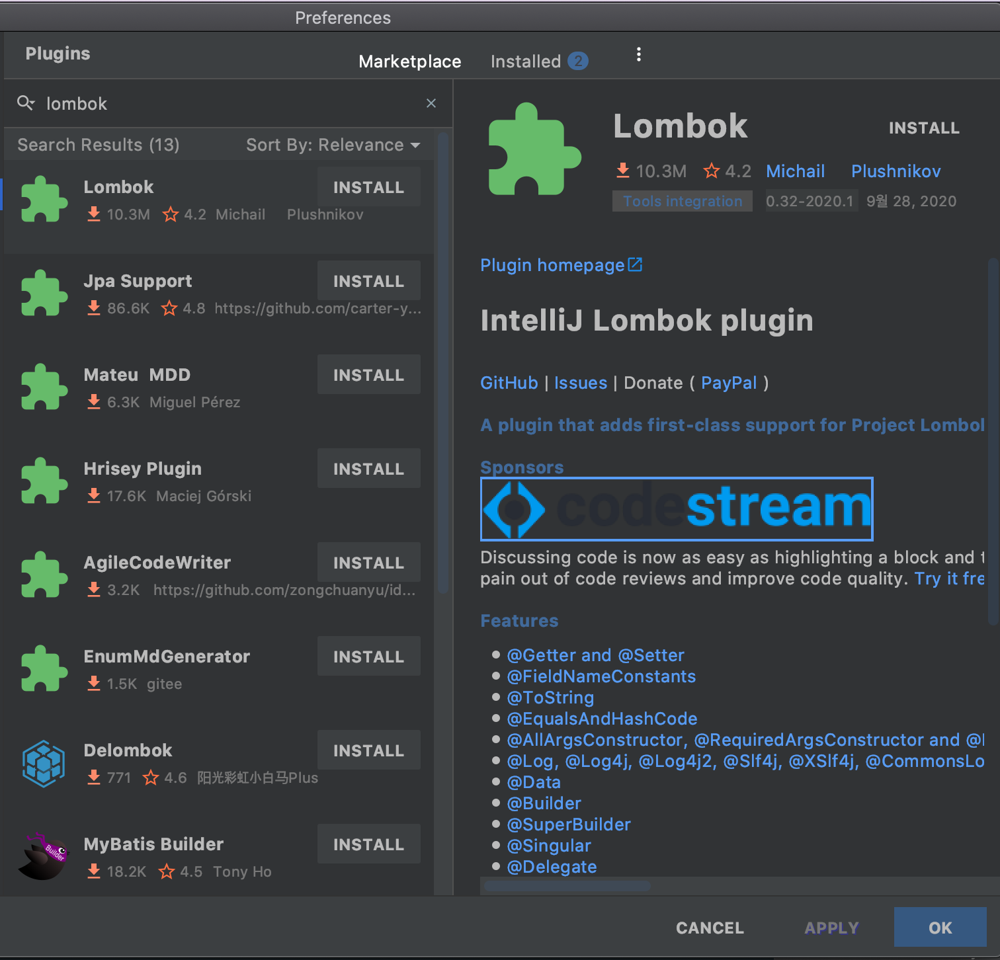
                
         * ③ `Enable annotation processing`을 체크한다.       
    
            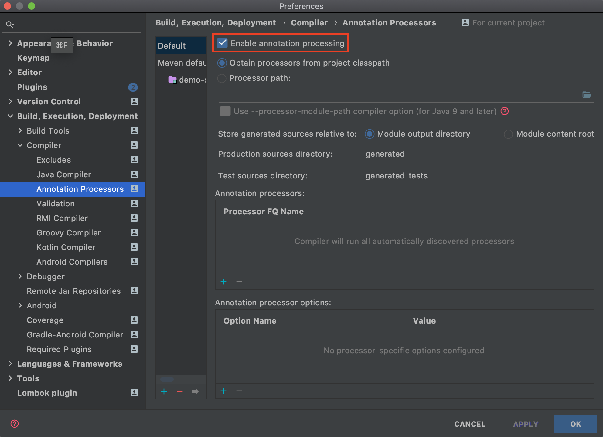
  
         * ④ 지금부터 해당 프로젝트에서 롬복을 사용 할 수 있다.
          
    * 자주 사용하는 롬복 애노테이션
    
        * `@Getter` : getter 메서드를 자동 생성한다.
        * `@Setter` : setter 메서드를 자동 생성한다.
        * `@NoArgsConstructor` : 매개변수가 없는 생성자(기본 생성자)를 자동 생성한다.
        * `@AllArgsConstructor` : 모든 필드 값을 매개변수로 받는 생성자를 자동 생성한다.
        * `@RequiredArgsConstructor` : `final`이나 `@NonNull`인 필드 값만 매개변수로 받는 생성자를 자동 생성한다.
        * `@ToString` : toString() 메서드를 자동 생성한다. exclude 속성을 사용하여 특정 필드를 결과에서 제외 시킬 수 있다.
        * `@EqualsAndHashCode` : equals()와 hashCode() 메서드를 자동 생성한다.
        * `@Data` : `@Getter`, `@Setter`, `@RequiredArgsConstructor`, `@ToString`, `@EqualsAndHashCode`를 한꺼번에 설정한다.
        * `@Builder` : 빌더 패턴을 사용 할 수 있도록 한다.

* (2) MVC 란?
    
    * `모델(Model)`
    
        * 화면에 전달 할 또는 화면에서 전달 받은 데이터를 담고 있는 객체이다.
    
        * 도메인 객체 또는 DTO를 말한다.
    
    * `뷰(View)`
    
        * 모델이 담고 있는 데이터를 보여주는 역할을 한다.
    
        * 다양한 형태로 보여 줄 수 있다. (HTML, JSON, XML ...)
    
    * `컨트롤러(Controller)`
    
        * 사용자의 입력을 받아 모델 객체의 데이터를 변경하거나 모델 객체를 뷰에 전달하는 역할을 한다.
    
            * ① 입력 값 검증
        
            * ② 입력 받은 데이터로 모델 객체의 데이터를 변경
        
            * ③ 변경된 모델 객체를 뷰에 전달
    
* (3) Spring MVC
    
    * `Spring MVC`는 서블릿 기반의 웹 애플리케이션을 개발할 때, MVC 패턴을 쉽게 사용 할 수 있도록 도와주는 프레임워크이다.
    
* (4) 실습
    
    * ① 프로젝트 생성
    
        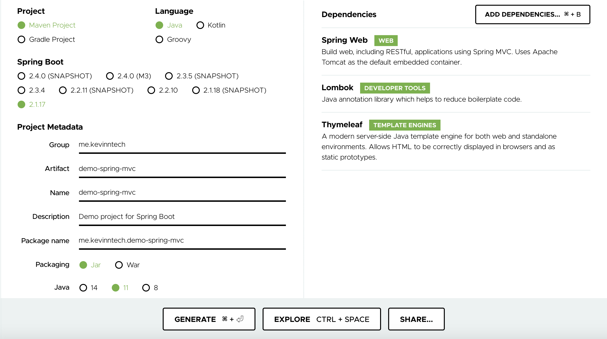
        
    * ② 컨트롤러(Controller) 작성
    
        ```java
        @Controller
        public class EventController {
        
            // "/events" GET 요청이 들어오면 처리 할 핸들러 지정
            // @RequestMapping(value = "/events" , method = RequestMethod.GET)
            @GetMapping("/events")
            public String events(Model model){
                return "events";
            }
        }
        ```
      
    * ③ 모델(Model) 작성
    
        ```java
        @Getter @Setter
        @Builder @NoArgsConstructor @AllArgsConstructor
        public class Event {
        
            private String name;
        
            private int limitOfEnrollment;
        
            private LocalDateTime startDateTime;
        
            private LocalDateTime endDateTime;
        }
        ```
       
    * ④ 서비스 작성
    
        ```java
        @Service
        public class EventService {
        
            public List<Event> getEvents(){
            	// Event 생성
                Event event1 = Event.builder()
                        .name("스프링 웹 MVC 스터디 1차")
                        .limitOfEnrollment(5)
                        .startDateTime(LocalDateTime.of(2019, 1, 10, 10, 0))
                        .endDateTime(LocalDateTime.of(2019, 1, 10, 12, 0))
                        .build();
        
                Event event2 = Event.builder()
                        .name("스프링 웹 MVC 스터디 2")
                        .limitOfEnrollment(5)
                        .startDateTime(LocalDateTime.of(2019, 1, 17, 10, 0))
                        .endDateTime(LocalDateTime.of(2019, 1, 17, 12, 0))
                        .build();
        
                return List.of(event1, event2); // List.of() : 변경 할 수 없는 List를 생성한다. 변경 시 예외 발생
            }
        
        }
        ```
       
    * ⑤ 컨트롤러(Controller) 변경
    
        ```java
        @Controller
        public class EventController {
        
            @Autowired
            EventService eventService; // Service를 주입 받아 사용한다.
        
            // "/events" GET 요청이 들어오면 처리 할 핸들러 지정
            // @RequestMapping(value = "/events" , method = RequestMethod.GET)
            @GetMapping("/events")
            public String events(Model model){
                model.addAttribute("events", eventService.getEvents()); // 모델에 담는다.
                return "events"; // 뷰의 이름
            }
        }
        ```
      
    * ⑥ 뷰(View) 작성 [events.html]
    
        ```html
        <!DOCTYPE html>
        <html lang="en" xmlns:th="http://www.thymeleaf.org">
        <head>
            <meta charset="UTF-8">
            <title>Title</title>
        </head>
        <body>
            <h1>이벤트 목록</h1>
            <table>
                <tr>
                    <th>이름</th>
                    <th>참가 인원</th>
                    <th>시작</th>
                    <th>종료</th>
                </tr>
                <tr th:each="event : ${events}">
                    <td th:text="${event.name}">이벤트 이름</td>
                    <td th:text="${event.limitOfEnrollment}">100</td>
                    <td th:text="${event.startDateTime}">2021년 1월 10일 오전 10시</td>
                    <td th:text="${event.endDateTime}">2021년 1월 10일 오전 12시</td>
                </tr>
            </table>
        </body>
        </html>
        ```

* (5) MVC 패턴의 장점
    
    * 동시 다발적(Simultaneous) 개발 가능

        * 백엔드 개발자와 프론트엔드 개발자가 독립적으로 개발을 진행 할 수 있다.

    * 높은 결합도
    
        * 논리적으로 관련있는 기능을 하나의 컨트롤러로 묶거나, 특정 모델과 관련있는 뷰를 그룹화 할 수 있다.

    * 낮은 의존도
    
        * 뷰, 모델, 컨트롤러는 각각 독립적이다.

            * 서로 간에 독립적이다.

    * 개발 용이성
    
        * 책임이 구분되어 있어 코드 수정하는 것이 편하다.

    * 한 모델에 대한 여러 형태의 뷰를 가질 수 있다.

* (6) MVC 패턴의 단점

    * 코드 내비게이션이 복잡함

    * 코드 일관성 유지에 노력이 필요함
    
    * 높은 학습 곡선이 필요함

#### 2) 서블릿 애플리케이션 

* (1) 서블릿(Servlet)

    * `서블릿(Servlet)`은 자바를 사용하여 웹 페이지를 동적으로 생성하는 서버 측 프로그램이다.

    * Java 코드 안에 HTML 코드가 있다.

* (2) JSP(Java Server Pages)

    * 서블릿 기반의 서버 사이드 스크립트 기술이다.

    * HTML 태그 안에 Java 코드가 있다.

* (3) 서블릿의 특징

    * 자바 엔터프라이즈 에디션은 웹 애플리케이션 개발용 스펙과 API를 제공한다.

    * 그 중에 가장 중요한 클래스 중 하나가 `HttpServlet`이며 **요청 마다** 새로운 프로세스를 만드는 것이 아닌 한 프로세스 내의 자원을 공유하는 **스레드를 만들어서 요청을 처리한다.**

    * 서블릿 등장 이전에 사용하던 기술인 `CGI(Common Gateway Interface)`는 요청 당 프로세스를 만들어서 사용한다.

* (4) 서블릿의 장점 (CGI에 비해)

    * 빠르다.

    * 플랫폼(OS)에 독립적이다.

    * 보안성이 좋다.

    * 이식성이 좋다.

* (5) 서블릿 엔진 또는 서블릿 컨테이너 (Tomcat, Jetty, Undertow, ...)

    * 서블릿 생명주기(Life Cycle)를 관리
    
    * 세션 관리

    * 네트워크 서비스

    * MIME(마임) 기반 메시지를 인코딩 / 디코딩

    * ...

* (6) 서블릿 생명주기(Life Cycle) 

    * 서블릿은 우리가 직접 실행 할 수 없으며 서블릿 컨테이너가 실행 할 수 있다.
    
    * 서블릿의 생명주기는 다음과 같다.

        * ① 서블릿 컨테이너가 서블릿 인스턴스의 `init()` 메소드를 호출하여 초기화를 한다. 
    
            * 최초 요청을 받았을 때, 서블릿 컨테이너가 서블릿을 한번 초기화 하게 되고 그 다음 요청 부터는 이 과정을 생략한다.
    
        * ② 서블릿이 초기화 된 다음 부터 클라이언트의 요청을 처리 할 수 있다.
    
            * 각 요청은 별도의 쓰레드로 처리하고 이때 서블릿 인스턴스의 `service()` 메소드를 호출한다.
        
                * 이 안에서 HTTP 요청을 받고 클라이언트로 보낼 HTTP 응답을 만든다.
            
                * `service()`는 보통 HTTP Method에 따라 `doGet()`, `doPost()` 등으로 처리를 위임한다.
            
                * 따라서 보통 `doGet()` 또는 `doPost()`를 구현한다.
            
        * ③ 서블릿 컨테이너의 판단에 따라 해당 서블릿을 메모리에서 내려야 할 시점에 `destroy()`를 호출한다.

#### 3) 서블릿 애플리케이션 개발

* (1) 프로젝트 생성

    * ① Maven 프로젝트를 선택하고 `Create from archetype`를 체크한 다음, 아래와 같이 선택한다.
    
        * `archetype`는 메이븐(Maven)에서 미리 만들어 놓은 프로젝트 구조

        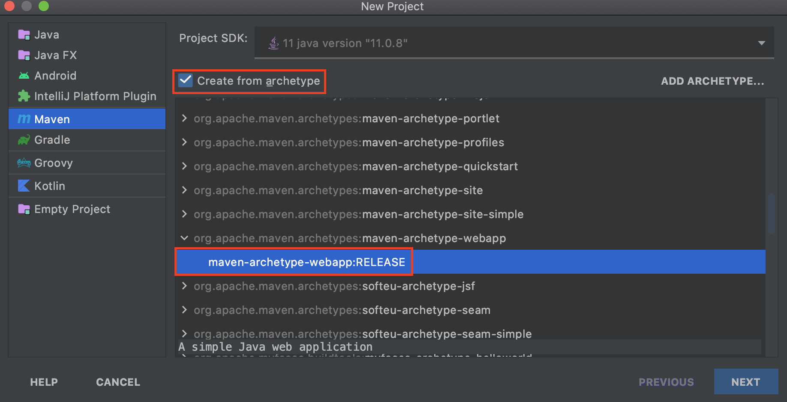

    * ② 다음과 같이 지정한다.
    
        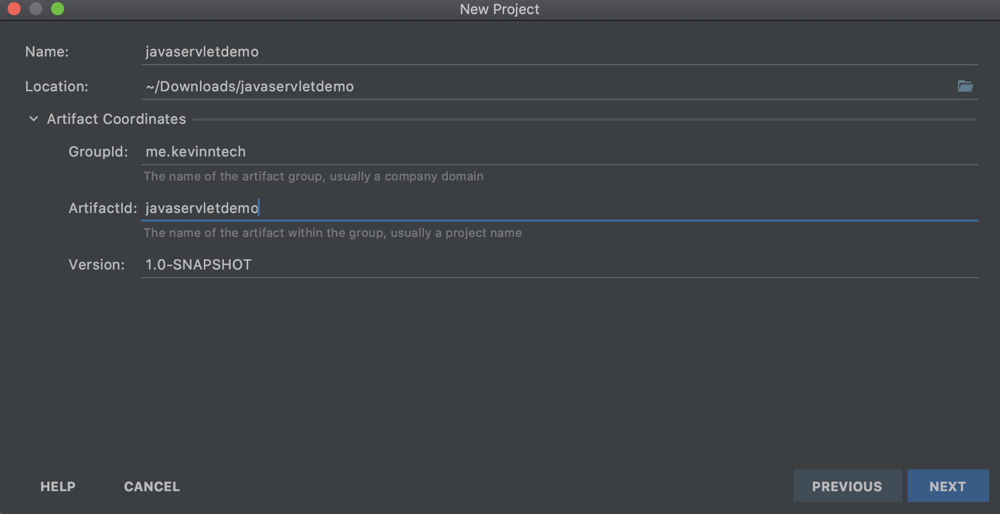
        
    * ③ 메이븐 홈 디렉토리가 지정 되어 있다면 [FINISH]를 클릭한다.
      
    * (이 과정을 진행 하기 전에 메이븐이 설치 되어 있어야 한다.)  
    
        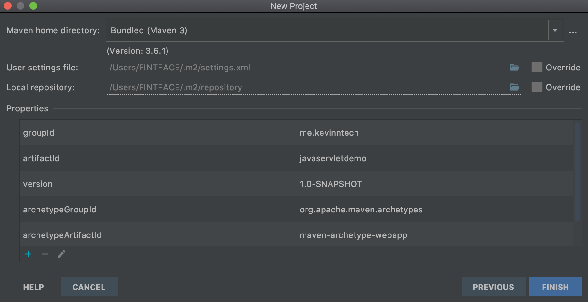   
        
* (2) 서블릿 생성

    * ① `pom.xml`에 서블릿 API 의존성을 추가한다.

        ```html
        <dependency>
            <groupId>javax.servlet</groupId>
            <artifactId>javax.servlet-api</artifactId>
            <version>4.0.1</version>
            <scope>provided</scope>
        </dependency>
        ```
      
        * `<scope>` : 해당 의존성을 언제, 어떻게 클래스패스에 넣어서 사용할 것인가를 정의한다. 
      
            * `test` : 테스트를 실행할 때만 사용하는 의존성을 의미한다.
            
            * `provided` : 어디선가 제공되는 의존성이라는 것을 의미한다. 코딩하는 시점에는 사용 할 수 있으나 War 패키징할 때는 제외된다. 

    * ② `src/main`에 java 디렉토리를 생성한다.
    
    * ③ 다음과 같이 `Project Structure`에서 java 디렉토리를 Source 디렉토리로 지정한다.
    
        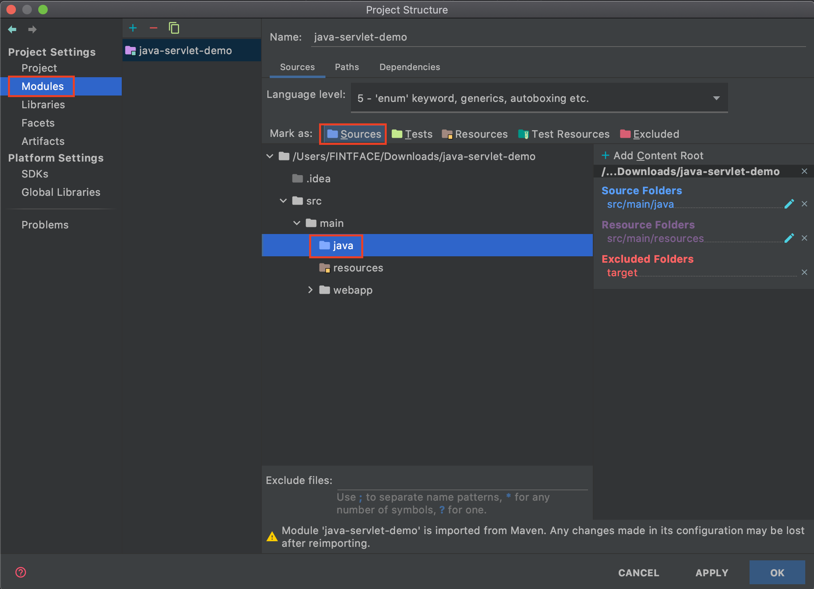
        
    * ④ `src/java`에 `me.kevinntech` 패키지를 생성한 다음, HelloServlet 클래스를 작성한다.
    
        ```java
        public class HelloServlet extends HttpServlet {
        
            @Override
            public void init() throws ServletException {
                System.out.println("init");
            }
        
            @Override
            protected void doGet(HttpServletRequest req, HttpServletResponse resp) throws ServletException, IOException {
                System.out.println("doGet");
                resp.getWriter().println("<html>");
                resp.getWriter().println("<head>");
                resp.getWriter().println("<body>");
                resp.getWriter().println("<h1>Hello Servlet</h1>");
                resp.getWriter().println("</body>");
                resp.getWriter().println("</head>");
                resp.getWriter().println("</html>");
            }
        
            @Override
            public void destroy() {
                System.out.println("destroy");
            }
            
        }
        ```
      
        * 서블릿을 실행 하려면 톰캣이 필요하며 서블릿을 독자적으로 실행 할 수는 없다.
    
* (3) 톰캣 설치
      
    * ① `pom.xml`에 서블릿 의존성을 추가한다.

        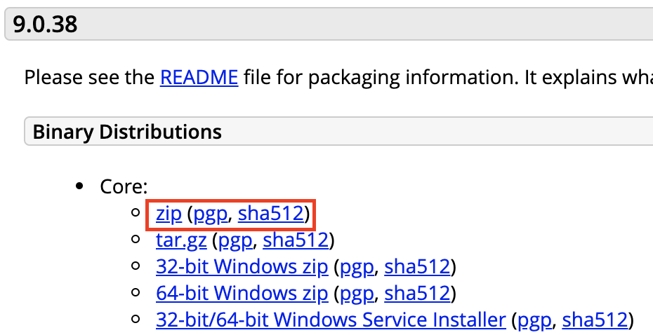
    
    * ② 다운로드 받은 파일을 압축 해제 한다.
     
    * ③ Mac의 경우, 톰캣 디렉토리로 이동하여 실행 파일(`.sh`)에 대한 실행 권한을 부여 해야한다.
    
        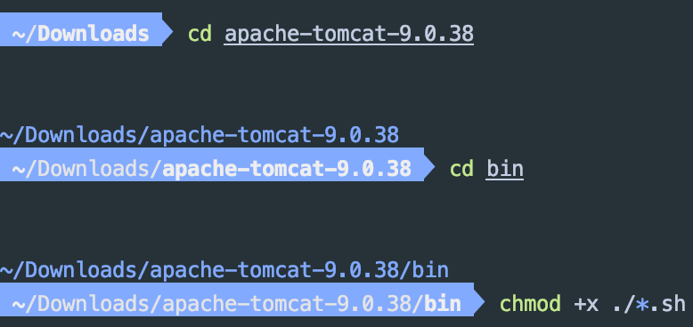
    
        * `chmod +x ./*.sh`는 현재 디렉토리에 있는 `.sh` 파일에 대해 실행 권한을 부여한다.
        
* (4) 톰캣 실행 (인텔리제이 얼티메이트 버전 기준)

    * ① [Add Configuration...]를 클릭한다.
    
        
        
    * ② + 버튼을 클릭한 다음, Tomcat Server에서 Local를 선택한다.

        
        
    * ③ 톰캣이 설치된 경로를 지정하고 Before launch에 maven goal로 `compile war:exploded`를 추가한다.
    
        
        
    * ④ 그리고 Fix 버튼을 클릭한 다음, 아래와 같이 선택한다.
    
        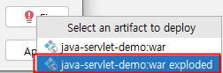
        
        * `war exploded`는 war 압축을 해제한 상태로 톰캣에 배포한다는 의미다.

* (5) `web.xml`에 서블릿 등록 및 맵핑
    
```html
<!DOCTYPE web-app PUBLIC
 "-//Sun Microsystems, Inc.//DTD Web Application 2.3//EN"
 "http://java.sun.com/dtd/web-app_2_3.dtd" >

<web-app>
  <display-name>Archetype Created Web Application</display-name>

  <servlet>
    <servlet-name>hello</servlet-name>
    <servlet-class>me.kevinntech.HelloServlet</servlet-class>
  </servlet>

  <servlet-mapping>
    <servlet-name>hello</servlet-name>
    <url-pattern>/hello</url-pattern>
  </servlet-mapping>
</web-app>
```

#### 4) 서블릿 리스너와 서블릿 필터

* (1) 서블릿 리스너

    * `서블릿 리스너`는 웹 애플리케이션에서 발생하는 주요 이벤트를 감지하고 각 이벤트에 특별한 작업을 처리하도록 할 수 있다.
   
* (2) 이벤트의 종류

    * `이벤트`는 크게 2가지로 나눌 수 있다.
    
        * ① `서블릿 컨텍스트 수준의 이벤트`
    
            * 컨텍스트 라이프사이클 이벤트
        
            * 컨텍스트 애트리뷰트 변경 이벤트
    
        * ② `세션 수준의 이벤트`
    
            * 세션 라이프사이클 이벤트
    
            * 세션 애트리뷰트 변경 이벤트

* (3) 서블릿 필터

    * `서블릿 필터`는 서블릿 실행 전후에 어떤 작업을 하고자 할 때, 사용한다.

    * 체인 형태의 구조로 순차적으로 적용된다.
  
        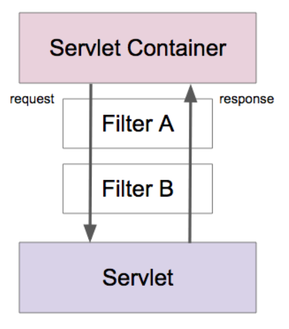
        
* (4) 서블릿 리스너 - 실습

    * ① `ServletContext`의 라이프 사이클을 감지 할 수 있는 `ServletContextListener`를 구현한 클래스를 작성한다. 

        * `ServletContextListener`는 `ServletContext`의 라이프 사이클을 감지 할 수 있다.
        
        * 그리고 웹 애플리케이션이 시작되거나 종료될 때, 호출할 메서드(`contextInitialized()`, `contextDestroyed()`)를 정의한 인터페이스다.
        
            ```java
            public class MyListener implements ServletContextListener {
                @Override
                public void contextInitialized(ServletContextEvent sce) { // 웹 애플리케이션을 초기화 할 때 호출한다.
                    System.out.println("Context Initialized");
                    sce.getServletContext().setAttribute("name", "kevin");
                }
            
                @Override
                public void contextDestroyed(ServletContextEvent sce) { // 웹 애플리케이션을 종료 할 때 호출한다.
                    System.out.println("Context Destroyed");
                }
            }
            ```
      
    * ② 서블릿 컨테이너가 어떤 리스너인지 알 수 있도록 `web.xml`에 리스너(MyListener)를 등록한다.
             
        ```html
        <listener>
          <listener-class>me.kevinntech.MyListener</listener-class>
        </listener>
        ```
      
    * ③ 그리고 `HelloServlet`를 다음과 같이 변경한 다음, 애플리케이션을 실행한다.
         
        ```java
        public class HelloServlet extends HttpServlet {
        
            @Override
            public void init() throws ServletException {
                System.out.println("init");
            }
        
            @Override
            protected void doGet(HttpServletRequest req, HttpServletResponse resp) throws ServletException, IOException {
                System.out.println("doGet");
                resp.getWriter().println("<html>");
                resp.getWriter().println("<head>");
                resp.getWriter().println("<body>");
                resp.getWriter().println("<h1>Hello, " + getName() + "</h1>"); // name에 해당하는 애트리뷰트를 꺼내서 출력한다.
                resp.getWriter().println("</body>");
                resp.getWriter().println("</head>");
                resp.getWriter().println("</html>");
            }
        
            private Object getName() {
                return getServletContext().getAttribute("name");
            }
        
            @Override
            public void destroy() {
                System.out.println("destroy");
            }
        
        }
        ```

    * ④ 결과는 다음과 같다.
    
        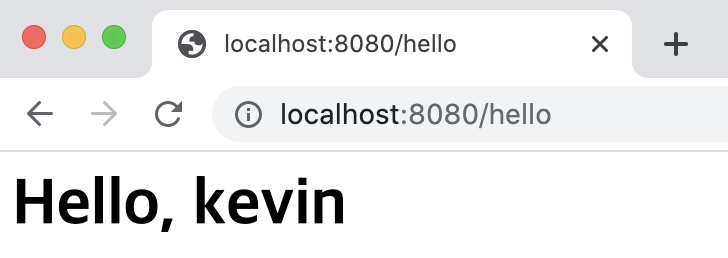
        
* (5) 서블릿 필터 - 실습

    * ① 필터(`Filter` 인터페이스를 구현한 클래스)를 작성한다.
    
        ```java
        public class MyFilter implements Filter {
        
            @Override
            public void init(FilterConfig filterConfig) throws ServletException {
                System.out.println("Filter Init");
            }
        
            @Override
            public void doFilter(ServletRequest servletRequest, ServletResponse servletResponse, FilterChain filterChain) throws IOException, ServletException {
                System.out.println("Filter");
                filterChain.doFilter(servletRequest , servletResponse); // 필터 체이닝을 함
            }
        
            @Override
            public void destroy() {
                System.out.println("Filter Destroy");
            }
        }
        ```
      
        * `init()` : 필터가 초기화 될 때 호출된다.
        
        * `doFilter()` : 필터와 매핑된 Servlet에 요청이 들어오면 호출된다.
        
            * `doFilter()`에 필터가 할 일을 작성한다.
            
            * `filterChain.doFilter()` : 다음 필터를 호출하고 결국에는 servlet에게 요청이 전달되도록 한다.
 
         * `destroy()` : 필터가 삭제될 때 호출된다.
          
    * ② `web.xml`에 필터(MyFilter)를 등록한다.
    
        ```html
        <filter>
          <filter-name>myFilter</filter-name>
          <filter-class>me.kevinntech.MyFilter</filter-class>
        </filter>
        
        <filter-mapping>
          <filter-name>myFilter</filter-name>
          <servlet-name>hello</servlet-name>
        </filter-mapping>
        ```
      
        * 필터를 서블릿 이름을 이용하여 서블릿과 매핑한다.
      
    * ③ 애플리케이션을 실행하여 결과를 확인한다.
    
#### 5) 스프링 IoC 컨테이너 연동

* (1) 서블릿 애플리케이션에 스프링 연동하기

    * 서블릿 애플리케이션에 스프링을 사용한다는 것은 다음과 같은 의미를 갖는다.

        * ① 서블릿에서 스프링이 제공하는 `IoC 컨테이너`를 사용하는 것
    
        * ② 스프링이 제공하는 서블릿 구현체인 `DispatcherServlet`를 사용하는 것
        
* (2) 서블릿에서 스프링이 제공하는 IoC 컨테이너 사용하기

    * ① `pom.xml`에 다음과 같은 의존성을 추가한다.
    
        * 스프링 부트를 사용하고 있는 것이 아니기 때문에 버전을 명시해야 한다. 

            ```html
            <dependency>
              <groupId>org.springframework</groupId>
              <artifactId>spring-webmvc</artifactId>
              <version>5.1.18.RELEASE</version>
            </dependency>
            ```

    * ② `web.xml`에서 MyListener 대신에 스프링이 제공하는 `ContextLoaderListener`를 사용한다.
  
        * 서블릿 컨테이너는 `web.xml`에 기술된 내용으로 초기화를 진행한다.
                
        ```html
          <listener>
            <listener-class>org.springframework.web.context.ContextLoaderListener</listener-class>
          </listener>
        ```

        * `ServletContext`는 모든 서블릿들이 사용 할 수 있는 정보를 모아 둔 저장소를 말한다.
        
        * `ContextLoaderListener`

            * `ContextLoaderListener`는 서블릿 리스너의 구현체이며 `ServletContext`의 라이프 사이클에 맞춰서 
            
            * `ServletContext`에 `스프링 IoC 컨테이너(ApplicationContext)`를 자동으로 등록하고 소멸 시켜준다.

                * `ContextLoaderListener`가 `ApplicationContext`를 생성한 다음, `ServletContext`에 등록하려면 `ApplicationContext`의 타입과 `스프링 IoC 컨테이너 설정 파일`이 필요하다.
                
                * 그래서 ③번 과정에서 해당 내용을 설정한다.
            
    * ③ `web.xml`에서 `contextClass`에 `ApplicationContext`의 타입을 지정하고 `contextConfigLocation`에 자바 설정 파일을 지정한다.

        ```html
          <context-param>
            <param-name>contextClass</param-name>
            <param-name>org.springframework.web.context.support.AnnotationConfigWebApplicationContext</param-name>
          </context-param>
        
          <context-param>
            <param-name>contextConfigLocation</param-name>
            <param-value>me.kevinntech.AppConfig</param-value>
          </context-param>
        ```
            
        * `contextClass` 파라미터는 `ContextLoaderListener`가 등록 할 스프링 IoC 컨테이너의 타입을 지정한다.     
  
        * `contextConfigLocation` 파라미터는 스프링 IoC 컨테이너의 설정 파일 위치를 지정한다.  
        
    * ④ 자바 설정 파일을 작성한다.

        ```java
        @Configuration
        @ComponentScan
        public class AppConfig {
        }
        ```

    * ⑤ 빈으로 등록하기 위한 HelloService 클래스를 작성한다.

        ```java
        @Service
        public class HelloService {
        
            public String getName(){
                return "kevin";
            }
            
        }
        ```
      
    * ⑥ 다음과 같이 HelloServlet 클래스를 변경한 다음, 애플리케이션을 실행한다.

        ```java
        public class HelloServlet extends HttpServlet {
        
            @Override
            public void init() throws ServletException {
                System.out.println("init");
            }
        
            @Override
            protected void doGet(HttpServletRequest req, HttpServletResponse resp) throws ServletException, IOException {
                System.out.println("doGet");
        
                // 서블릿에서 ServletContext를 통해 ApplicationContext를 꺼내 사용할 수 있다.
                // 그리고 ApplicationContext에서 빈을 꺼낼 수 있다.
                ApplicationContext context = (ApplicationContext) getServletContext().getAttribute(WebApplicationContext.ROOT_WEB_APPLICATION_CONTEXT_ATTRIBUTE);
                HelloService helloService = context.getBean(HelloService.class);
        
                resp.getWriter().println("<html>");
                resp.getWriter().println("<head>");
                resp.getWriter().println("<body>");
                resp.getWriter().println("<h1>Hello, " + helloService.getName() + "</h1>"); // HelloService에서 이름을 가져온다.
                resp.getWriter().println("</body>");
                resp.getWriter().println("</head>");
                resp.getWriter().println("</html>");
            }
        
            private Object getName() {
                return getServletContext().getAttribute("name");
            }
        
            @Override
            public void destroy() {
                System.out.println("destroy");
            }
        
        }
        ```
      
#### 6) 스프링 MVC 연동

* (1) Front Controller 

    
        
    * 사용자의 요청 하나를 처리할 때 마다 서블릿을 만든다면 매번 `web.xml`에 `Servlet`를 등록하고 맵핑하는 과정이 필요하다.
      
    * 이러한 불편한 점을 해결하기 위해 등장한 것이 바로 `FrontController` 패턴이다.
      
    * `FrontController`는 하나의 컨트롤러가 모든 요청을 받아서 해당 요청을 처리 할 핸들러에게 요청을 분배하는 패턴을 말한다.
    
* (2) DispatcherServlet
  
    * `DispatcherServlet`는 스프링에서 Front Controller 역할을 하는 서블릿을 이미 구현 해놓은 것을 말한다.

    * `DispatcherServlet`이 모든 요청을 받아서 해당 요청을 처리 할 핸들러에게 요청을 분배(Dispatch)하고 핸들러의 실행 결과를 `Http 응답(Response)`로 만든다.

* (3) Root WebApplicationContext 와 Servlet WebApplicationContext

    

    * ① Root WebApplicationContext

        * `Root WebApplicationContext`는 `ContextLoaderListener`에 의해 `ServletContext`에 등록 되는 ApplicationContext를 말한다.

        * **`Root WebApplicationContext`는 다른 Servlet에서도 사용할 수 있다.**

        * Web과 관련된 빈들은 등록 되지 않는다. (Service와 Repository...가 등록 됨)

    * ② Servlet WebApplicationContext

        * `Servlet WebApplicationContext`는 `DispatcherServlet`이 `Root WebApplicationContext`를 상속 받아 만든 ApplicationContext를 말한다.

        * **`Servlet WebApplicationContext`은 해당 DispatcherServlet 내부에서만 사용 가능하다.** 
        
        * Web과 관련된 빈이 등록된다. (Controller, ViewResolver, 다른 웹 관련 빈)

* (4) 상속 구조로 만드는 이유?

    * 만약 `DispatcherServlet`를 여러 개 만들어야되고 다른 `DispatcherServlet`들이 공용으로 사용하는 빈이 있다면 `Root WebApplicationContext`를 상속 받는 구조로 만든다.

* (5) 스프링이 제공하는 DispatcherServlet을 사용하기 (계층 구조로 만들기)

    * ① 컨트롤러를 작성한다.
    
        ```java
        @RestController
        public class HelloController {
        
            @Autowired
            HelloService helloService; // 빈으로 등록 되어 있는 Service를 주입 받는다.
        
            @GetMapping("/hello")
            public String hello() {
                return "Hello, " + helloService.getName();
            }
        
        }
        ```
      
    * ② `web.xml`에 `DispatcherServlet`을 등록한다.
      
        * DispatcherServlet이 WebConfig 파일을 사용하여 ApplicationContext를 만들도록 설정한다.
      
        * 그리고 app으로 시작하는 모든 요청을 DistpatcherServlet이 받아서 처리 하도록 한다.
      
            ```html
            <!DOCTYPE web-app PUBLIC
                    "-//Sun Microsystems, Inc.//DTD Web Application 2.3//EN"
                    "http://java.sun.com/dtd/web-app_2_3.dtd" >
            
            <web-app>
                <display-name>Archetype Created Web Application</display-name>
            
                <context-param>
                    <param-name>contextClass</param-name>
                    <param-value>org.springframework.web.context.support.AnnotationConfigWebApplicationContext</param-value>
                </context-param>
            
                <context-param>
                    <param-name>contextConfigLocation</param-name>
                    <param-value>me.kevinntech.AppConfig</param-value>
                </context-param>
                
                <listener>
                    <listener-class>org.springframework.web.context.ContextLoaderListener</listener-class>
                </listener>
            
                <servlet>
                    <servlet-name>app</servlet-name>
                    <servlet-class>org.springframework.web.servlet.DispatcherServlet</servlet-class>
                    <init-param>
                        <param-name>contextClass</param-name>
                        <param-value>org.springframework.web.context.support.AnnotationConfigWebApplicationContext</param-value>
                    </init-param>
                    <init-param>
                        <param-name>contextConfigLocation</param-name>
                        <param-value>me.kevinntech.WebConfig</param-value>
                    </init-param>
                </servlet>
            
                <servlet-mapping>
                    <servlet-name>app</servlet-name>
                    <url-pattern>/app/*</url-pattern>
                </servlet-mapping>
            
            </web-app>
            ```
          
            * DispatcherServlet은 app으로 시작하는 모든 요청을 받아서 실제 요청을 처리 할 핸들러를 찾은 다음, 핸들러에게 요청을 분배한다.
      
    * ③ AppConfig 클래스를 작성한다. 
    
        * 컴포넌트 스캔을 할 때, Controller를 제외한 나머지만 빈(Bean)으로 등록한다.
      
        * 그리고 ContextLoaderListener가 만드는 ApplicationContext (`Root WebApplicationContext`)는 Service, Repository를 빈으로 등록하도록 한다.
    
            ```java
            @Configuration
            @ComponentScan(excludeFilters = @ComponentScan.Filter(Controller.class)) // 컨트롤러는 빈으로 등록하지 않음
            public class AppConfig {
            }
            ```
      
    * ④ WebConfig 클래스를 수정한다.
      
        * 컴포넌트 스캔을 할 때, 기본 필터는 사용하지 않고 Controller만 빈(Bean)으로 등록한다.
      
        * DispatcherServlet이 만드는 ApplicationContext (`Servlet WebApplicationContext`)는 Controller를 빈으로 등록하도록 한다.
          
            ```java
            @Configuration
            @ComponentScan(useDefaultFilters = false , includeFilters = @ComponentScan.Filter(Controller.class))
            public class WebConfig {
            
            }
            ```
      
    * ⑤ 웹 브라우저에서 다음 URL로 요청한다.

      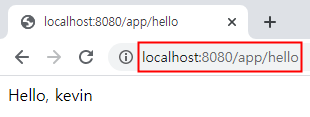
            
* (6) 스프링이 제공하는 DispatcherServlet을 사용하기 (계층 구조로 만들지 않기)

    * DispatcherServlet를 여러 개 등록하지 않는다면 계층 구조로 만들 필요 없이 DispatcherServlet이 만드는 ApplicationContext에 모든 빈을 등록 할 수도 있다.

    * ① 아래와 같이 `web.xml`을 변경한 다음, `AppConfig` 파일은 더 이상 필요 없으므로 삭제한다.
    
        ```html
        <!DOCTYPE web-app PUBLIC
                "-//Sun Microsystems, Inc.//DTD Web Application 2.3//EN"
                "http://java.sun.com/dtd/web-app_2_3.dtd" >
        
        <web-app>
            
            <display-name>Web Application</display-name>
        
            <servlet>
                <servlet-name>app</servlet-name>
                <servlet-class>org.springframework.web.servlet.DispatcherServlet</servlet-class>
                <init-param>
                    <param-name>contextClass</param-name>
                    <param-value>org.springframework.web.context.support.AnnotationConfigWebApplicationContext</param-value>
                </init-param>
                <init-param>
                    <param-name>contextConfigLocation</param-name>
                    <param-value>me.kevinntech.WebConfig</param-value>
                </init-param>
            </servlet>
        
            <servlet-mapping>
                <servlet-name>app</servlet-name>
                <url-pattern>/app/*</url-pattern>
            </servlet-mapping>
        
        </web-app>
        ```
      
    * ② 그리고 `WebConfig`를 다음과 같이 변경한다.
    
        ```java
        @Configuration
        @ComponentScan
        public class WebConfig {
        
        }
        ```
      
        * 이제 모든 빈(Bean)이 WebConfig에 의해서 등록되도록 한다.
          
        * 더 이상 `Root WebApplicationContext`는 만들어지지 않으며 DispatcherServlet이 만드는 WebApplicationContext에 모든 빈이 등록된다.
      
    * ③ 애플리케이션을 실행하여 확인 해보자.
    
* (7) 정리

    * 사실, `DispatcherServlet`이 여러 개인 경우는 보기 드물다.

    * 최근에는 `DispatcherServlet`을 하나만 등록한 다음, `DispatcherServlet`이 만드는 `ApplicationContext`에 모든 빈을 등록하는 방식을 사용한다.
    
#### 7) DispatcherServlet 동작 원리 1부

* (1) DispatcherServlet 초기화

    * 다음과 같은 특별한 타입의 빈들을 찾거나, 기본 전략에 해당하는 빈들을 등록한다. 
      
        * `HandlerMapping` : 핸들러를 찾아주는 인터페이스
         
        * `HandlerAdapter` : 핸들러를 실행하는 인터페이스 
        
        * `HandlerExceptionResolver`
        
        * `ViewResolver`
        
        * ...
    
* (2) DispatcherServlet 동작 순서

    * ① 클라이언트가 요청을 하면 `DispatcherServlet`이 요청을 받아서 분석한다. (로케일, 테마, 멀티파트 등) 

    * ② (핸들러 맵핑에게 위임하여) 요청을 처리할 핸들러를 찾는다.  

    * ③ (등록되어 있는 핸들러 어댑터 중에) 해당 핸들러를 실행 할 수 있는 "핸들러 어댑터"를 찾는다. 

    * ④ 찾아낸 "핸들러 어댑터"를 사용해서 핸들러의 응답을 처리한다. 
    
        * 핸들러의 리턴 값을 보고 어떻게 처리할지 판단한다.

            * 뷰 이름에 해당하는 뷰를 찾아서 모델 데이터를 랜더링한다.
        
            * `@ResponseBody`가 있다면 Converter를 사용해서 응답 본문을 만든다.

    * ⑤ 예외가 발생 했다면, 예외 처리 핸들러에 요청 처리를 위임한다.

    * ⑥ 최종적으로 응답을 보낸다.
    
* (3) DispatcherServlet 분석하기

    * ① 키보드에서 `shift`를 2번 누르면 다음과 같은 팝업창이 나타나며 `DispatcherServlet`를 검색하여 클릭하자.
    
      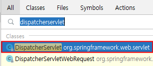
      
    * ② 다음과 같이 `DispatcherServlet` 코드에서 `doService()`, `doDispatch()`에 BreakPoint를 지정한다.
      
    * 그리고 `HelloController`의 `hello()`에도 BreakPoint를 지정한다.
    
      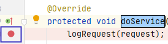
      
      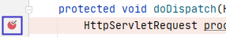

      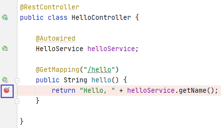     
      
    * ③ 애플리케이션을 디버깅 모드로 실행한다.
    
      
      
    * ④ 그리고 웹 브라우저에서 아래 URL로 요청을 하면, `DispatcherServlet`이 사용되며 디버그가 걸린다.
    
        * `http://localhost:8080/app/hello`
        
          
          
          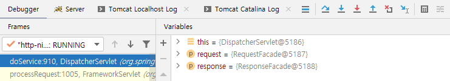
      
        * 디버그 단축키
        
            * `Step Over [F8]` : 다음 라인으로 넘어간다. 
            
            * `Step Into [F7]` : 현재 라인이 메서드에 있다면 메서드 안으로 들어간다.
            
            * `Resume Program` : 다음 Breakpoint로 이동한다.
      
* (4) 정리하기

    * HandlerMapping

        * ① `BeanNameUrlHandlerMapping` : HTTP 요청 URL과 같은 빈(Bean) 이름을 갖는 핸들러를 찾는다.
           
        * ② `RequestMappingHandlerMapping` : 애노테이션 정보를 기반으로 작성된 핸들러를 찾는다. (★★★)
        
            * 즉, `@Controller`, `@RequestMapping` ( + `@GetMapping` , `@PostMapping`)를 지정한 핸들러를 찾는다.

    * HandlerAdapter

        * ① `HttpRequestHandlerAdapter` : HttpRequestHandler 인터페이스를 구현한 클래스의 핸들러를 실행한다.
    
        * ② `SimpleControllerHandlerAdapter` : Controller 인터페이스를 구현한 클래스의 핸들러를 실행한다.

        * ③ `RequestMappingHandlerAdapter` : 애노테이션 정보를 기반으로 작성된 핸들러를 실행한다. (★★★)

    * `invokeHandlerMethod()`에서 Java의 리플렉션을 사용해서 해당 요청을 처리할 수 있는 핸들러를 실행하게 된다. 

        * 여기서 `@GetMapping("/hello")`가 붙어있는 메서드를 실행하게 된다.
                
    * `ReturnValueHandler`는 핸들러에서 리턴한 값을 처리하는 핸들러다. 
      
        * 여기서 사용된 `RequestResponseBodyMethodPrecessor`는 Converter를 사용해서 핸들러의 리턴 값을 HTTP 본문에 넣어준다.  
    
        * `@ResponseBody`이 붙어 있는 핸들러에서 리턴한 값은 응답 본문에 바로 쓰며 `ModelAndView`는 `null`이 된다.
    
    * [참고]
    
        * `@RestController` : `@Controller`에 `@ResponseBody`가 추가된 것이다.
        
        * `@RequestBody` : HTTP 요청 본문(body)을 자바 객체로 변환한다. 
        
            * JSON으로 전달되는 데이터를 자바 객체로 변환한다. 
        
        * `@ResponseBody` : 자바 객체를 HTTP 응답 본문(body)로 변환한다.
    
        * `ResponseEntity` : HTTP 응답의 상태코드, 헤더, 본문를 직접 설정 할 수 있는 리턴 타입이다.
        
#### 8) DispatcherServlet 동작 원리 2부

* (1) `@ResponseBody` 핸들러에서 리턴하는 경우

    * `@ResponseBody`이 붙어 있는 핸들러에서 리턴한 값은 응답 본문에 바로 쓰며 `ModelAndView`는 Null이 된다.
    
    * 사용된 HandlerMapping, HandlerAdapter
    
        * ① `RequestMappingHandlerMapping` : 애노테이션 정보를 기반으로 작성된 핸들러를 찾는다.
        
        * ② `RequestMappingHandlerAdapter `: 애노테이션 정보를 기반으로 작성된 핸들러를 실행한다.

* (2) 핸들러에서 View 이름을 리턴하는 경우

    * 실습
    
        ```java
        @Controller
        public class HelloController {
            
            @GetMapping("/hello")
            public String sample(){
                return "/WEB-INF/sample.jsp";
            }
            
        }
        ```

        * `ModelAndView`가 `null`이 아니며 뷰(view)에 모델 데이터를 렌더링 하여 뷰를 완성한 다음, 뷰를 응답에 담아서 보낸다.
    
    * 사용된 HandlerMapping, HandlerAdapter
    
        * ① `RequestMappingHandlerMapping` : 애노테이션 정보를 기반으로 작성된 핸들러를 찾는다.
        
        * ② `RequestMappingHandlerAdapter `: 애노테이션 정보를 기반으로 작성된 핸들러를 실행한다.

* (3) 핸들러에서 ModelAndView를 리턴하는 경우

    * 실습
   
        * ① `SimpleController`를 작성한다. `/simple`이라는 요청을 처리하는 핸들러를 만들며 `ModelAndView` 객체를 리턴한다.
        
            ```java
            @org.springframework.stereotype.Controller("/simple")
            public class SimpleController implements Controller {
            
                @Override
                public ModelAndView handleRequest(HttpServletRequest request, HttpServletResponse response) throws Exception {
                    return new ModelAndView("/WEB-INF/simple.jsp");
                }
            
            }
            ```
    
        * ② `webapp/WEB-INF`에 `simple.jsp`를 작성한다.
 
            ```html
            <html>
            <body>
            <h2>Hello Simple MVC!</h2>
            </body>
            </html>
            ```

        * ③ 웹 브라우저에서 해당 URL(`http://localhost:8080/app/simple`) 로 요청한다.
        
            * `ModelAndView`가 `null`이 아니며 뷰(view)에 모델 데이터를 렌더링 하여 뷰를 완성한 다음, 뷰를 응답에 담아서 보낸다.
 
                ```html
                <html>
                <body>
                <h2>Hello Simple MVC!</h2>
                </body>
                </html>
                ```
          
    * 사용된 HandlerMapping, HandlerAdapter

        * ① `BeanNameUrlHandlerMapping` : HTTP 요청 URL과 같은 빈(Bean) 이름을 갖는 핸들러를 찾는다.
      
        * ② `SimpleControllerHandlerAdapter` : Controller 인터페이스를 구현한 클래스의 핸들러를 실행한다.

#### 9) DispatcherServlet 동작 원리 3부: 커스텀 ViewResolver 

* (1) DispatcherServlet 내부 살펴보기
      
    * 디스패처 서블릿이 제공하는 핸들러 매핑, 핸들러 어댑터, 뷰 리졸버 등은 어디서 가져오는 것일까? 

        * 이를 알아 보기 위해 디스패처 서블릿(DispatcherServlet)의 내부 코드를 살펴보자. 

            * `initStrategies()`에서 디스패처 서블릿이 사용하는 기본 전략들을 초기화 하고 있다.
            
                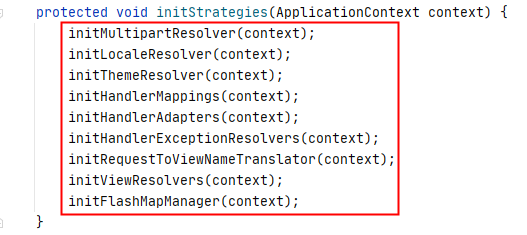
                
            * 동작하는 방식은 거의 다 비슷하므로 이 중에서 `initViewResolvers()`만 아래에서 살펴본다.
    
* (2) initViewResolvers() 내부 살펴보기
      
    * ① `initViewResolvers()`는 ViewResolver 타입의 빈들을 전부 찾아와서 ViewResolver 목록에 넣어둔다.

        * `this.viewResolvers = new ArrayList<>(matchingBeans.values());`

    * ② 만약에 없다면 기본 전략을 가져와서 지정한다.

        * `this.viewResolvers = getDefaultStrategies(context, ViewResolver.class);`

        * 이 기본 전략에 `InternalResourceViewResolver`가 들어 있었던 것이다.

    * `DispatcherServlet.properties` 파일은 디스패처 서블릿의 기본 전략으로 사용되는 빈(Bean)을 정의 하고 있다.
    
        * 키보드에서 `shift`를 2번 누르면 나타나는 팝업창에서 해당 파일을 검색하여 확인하자.
    
* (3) 커스텀 ViewResolver 만들기
      
    * ① WebConfig를 다음과 같이 수정한다.

        * `InternalResourceViewResolver`는 `DispatcherServlet.properties`에서 기본 전략으로 사용되지만
      
        * `WebConfig`에서 직접 `ViewResolver` 빈을 등록하면서 `prefix`와 `suffix`를 지정하면 코드를 좀 더 간결하게 만들 수 있다.
      
        * 이렇게 직접 `ViewResolver` 빈을 등록하면 `ViewResolver`에 대해서는 기본 전략을 적용하지 않는다.
        
            ```java
            @Configuration
            @ComponentScan
            public class WebConfig {
            
                @Bean
                public ViewResolver viewResolver(){
                    InternalResourceViewResolver viewResolver = new InternalResourceViewResolver();
                    viewResolver.setPrefix("/WEB-INF/"); // View는 WEB-INF에 있으며
                    viewResolver.setSuffix(".jsp"); // View의 확장자는 항상 JSP이다.
                    return viewResolver;
                }
                
            }
            ```
      
    * ② `SimpleController`와 `HelloController`를 다음과 같이 수정한다.

        ```java
        @org.springframework.stereotype.Controller("/simple")
        public class SimpleController implements Controller {
        
            @Override
            public ModelAndView handleRequest(HttpServletRequest request, HttpServletResponse response) throws Exception {
                return new ModelAndView("simple"); // 뷰 이름만 지정하면 된다.
            }
        
        }
        ```
      
        ```java
        @Controller
        public class HelloController {
        
            @Autowired
            HelloService helloService;
        
            @GetMapping("/hello")
            @ResponseBody
            public String hello() {
                return "Hello, " + helloService.getName();
            }
        
            @GetMapping("/sample")
            public String sample(){
                return "sample";
            }
        
        }
        ```
      
#### 10) 스프링 MVC 구성 요소

* 스프링 MVC 구성 요소에 대해서 살펴본다. 정확히는 `DispatcherServlet`이 사용하는 여러 가지 인터페이스에 대해서 살펴본다.

    * (1) DispatcherServlet의 기본 전략
          
        * `DispatcherServlet.properties`에 정의되어 있다.
    
    * (2) DispatcherServlet이 사용하는 인터페이스
          
        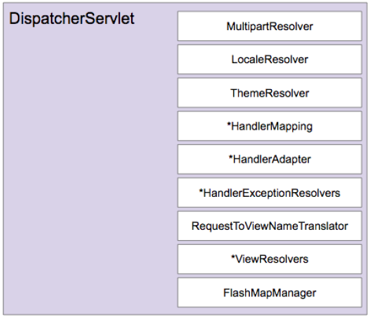
        
        * ① `MultipartResolver`
    
            * 파일 업로드 요청 처리에 필요한 인터페이스
        
            * MultipartResolver 타입의 빈이 등록 되어 있어야 디스패처 서블릿이 해당 빈을 사용하여 파일 업로드 요청을 처리 할 수 있다. 
        
            * `HttpServletRequest`를 `MultipartHttpServletRequest`로 변환을 해주며 해당 요청이 담고 있는 File을 꺼낼 수 있는 API를 제공한다.

                ```java
                public ModelAndView handleRequest(HttpServletRequest request, HttpServletResponse response) {
                    MultipartHttpServletRequest multipartRequest = (MultipartHttpServletRequest) request;
                    MultipartFile multipartFile = multipartRequest.getFile("image"); // 요청이 담고 있는 File을 꺼낼 수 있는 API
                    
                    ...
                }
                ```
              
            * 스프링 부트에서는 어떠한 설정을 하지 않아도 `MultipartResolver` 빈이 기본적으로 등록되어 있다.

        * ② `LocaleResolver`
    
            * 클라이언트의 위치(Locale) 정보를 파악하는 인터페이스
    
            * 기본 전략은 요청의 `accept-language`를 보고 판단한다.
    
        * ③ `ThemeResolver`
        
            * 애플리케이션에 설정된 테마를 파악하고 변경할 수 있는 인터페이스
    
            * [참고 URL](https://memorynotfound.com/spring-mvc-theme-switcher-example/ "참고 URL")
    
        * ④ `HandlerMapping`
    
            * 요청을 처리할 핸들러를 찾는 인터페이스
    
        * ⑤ `HandlerAdapter`
        
            * `HandlerMapping`이 찾아낸 "핸들러"를 실행하는 인터페이스
    
            * 스프링 MVC `확장력`의 핵심
    
        * ⑥ `HandlerExceptionResolver`
    
            * 요청 처리 중에 발생한 예외를 처리하는 인터페이스 
    
        * ⑦ `RequestToViewNameTranslator`
    
            * 핸들러에서 뷰 이름을 명시적으로 리턴하지 않은 경우, 요청을 기반으로 뷰 이름을 판단하는 인터페이스
            
                * 즉, 요청 URL(`/sample`)을 기반으로 뷰 이름을 판단한다. 
    
        * ⑧ `ViewResolver`
        
            * 뷰 이름(String)에 해당하는 뷰를 찾아내는 인터페이스
    
        * ⑨ `FlashMapManager`
    
            * `FlashMap` 인스턴스를 가져오고 저장하는 인터페이스
    
                * `FlashMap`은 주로 리다이렉션을 할 때 요청 매개변수를 사용하지 않고 데이터를 전달하고 정리할 때 사용한다.
                
                    * 즉, 리다이렉트를 할 때 데이터 전송을 편하게 하기 위한 방법

            * Post 요청을 받은 다음에 데이터를 저장하고 리다이렉트를 할 때, `FlashMap`를 사용하면 `redirect:/events?id=2019` 가 아닌 `redirect:/events`로 할 수 있도록 해준다.

                * `PRG(Post-Redirect-Get) 패턴`
            
                    * Post 요청을 받은 다음, 리다이렉트를 해서 사용자가 웹 브라우저에서 새로고침을 하더라도 GET 요청을 보내도록 하는 패턴을 말한다. 
    
                        * 즉, `중복 Form Submission`을 방지하기 위한 요청 처리 패턴이다.

#### 11) 스프링 MVC 동작 원리 정리

* (1) DispatcherServlet
      
    * `Spring MVC`는 Servlet 기반으로 동작하며 서블릿 컨테이너가 필요하다.
    
    * `DispatcherServlet`는 (굉장히 복잡한) 서블릿이다.

* (2) DispatcherServlet 초기화

    * ① 특정 타입에 해당하는 빈을 찾는다. 

    * ② 특정 타입의 빈이 없으면 `DispatcherServlet.properties`에 정의된 기본 전략을 사용한다.

* (3) 스프링 부트를 사용하지 않는 스프링 MVC

    * ① 서블릿 컨테이너(Ex : 톰캣)에 등록한 웹 애플리케이션(War)에 DispatcherServlet을 등록한다.

        * `web.xml`에 서블릿을 등록한다.
    
        * 또는 `WebApplicationInitializer`를 구현한 클래스에 자바 코드로 서블릿을 등록 할 수도 있다. (스프링 3.1+, 서블릿 3.0+)
        
            ```java
            // 이전에 만든 web.xml 파일을 삭제하자.
            public class WebApplication implements WebApplicationInitializer {
                @Override
                public void onStartup(ServletContext servletContext) throws ServletException {
                    // ApplicationContext 만들기
                    AnnotationConfigWebApplicationContext context = new AnnotationConfigWebApplicationContext();
                    context.register(WebConfig.class);
                    context.refresh();
            
                    // DispatcherServlet 만들기
                    DispatcherServlet dispatcherServlet = new DispatcherServlet(context);
                    // ServletContext에 DispatcherServlet를 등록
                    ServletRegistration.Dynamic app = servletContext.addServlet("app", dispatcherServlet);
                    // /app 이하의 모든 요청을 DispatcherServlet이 처리 하도록 함
                    app.addMapping("/app/*");
                }
            }
            ```
  
    * ② 세부 구성 요소는 빈 설정하기 나름.

* (4) 스프링 부트를 사용하는 스프링 MVC

    * (1) 스프링 부트 애플리케이션에 내장 톰캣을 만들고 그 안에 `DispatcherServlet`을 등록한다.

        * 여기서 "그 안"이라는 것은 내장 톰캣을 의미 함

        * 스프링 부트 자동 설정이 자동으로 해줌.

    * (2) 스프링 부트의 주관에 따라 여러 인터페이스 구현체를 빈으로 등록한다.

        * 스프링 부트를 기반으로 개발하는 경우, 이러한 설정을 사용 할 것이라는 주관에 따라 미리 빈을 등록 해놓는다.

        * 물론 `DispatcherServlet`도 기본적으로 등록하는 것이 있지만, 스프링 부트가 더 많은 것들을 기본적으로 등록 해준다.

## 2. 스프링 MVC 설정

#### 1) 스프링 MVC 구성 요소를 직접 빈으로 등록하기

* `@Configuration`을 사용한 자바 설정 파일에 `@Bean`을 사용해서 스프링 MVC 구성 요소를 직접 빈으로 등록 할 수도 있다.

* 하지만 스프링 MVC 구성 요소를 직접 `@Bean`으로 등록하여 사용하는 것은 가장 Low Level로 설정하는 것이며

* 스프링 부트가 나오기 전에도 이렇게 하는 경우는 거의 없었다. 그래서 등장하게 된 것이 바로 다음에 배울 `@EnableWebMVC`이다.

    ```java
    @Configuration
    @ComponentScan
    public class WebConfig {
    
        @Bean
        public HandlerMapping handlerMapping(){
            RequestMappingHandlerMapping handlerMapping = new RequestMappingHandlerMapping();
            handlerMapping.setInterceptors(); // 인터셉터를 설정
            handlerMapping.setOrder(Ordered.HIGHEST_PRECEDENCE); // 핸들러 맵핑 빈(Bean)에 대한 순서를 지정한다.
                                                                // 가장 높은 우선 순위를 가지게 하여 해당 핸들러 맵핑이 등록 되도록 한다.
            return handlerMapping;
        }
    
        @Bean
        public HandlerAdapter handlerAdapter(){
            RequestMappingHandlerAdapter handlerAdapter = new RequestMappingHandlerAdapter();
            return handlerAdapter;
        }
    
        @Bean
        public ViewResolver viewResolver(){
            InternalResourceViewResolver viewResolver = new InternalResourceViewResolver();
            viewResolver.setPrefix("/WEB-INF/"); // View는 WEB-INF에 있으며
            viewResolver.setSuffix(".jsp"); // View의 확장자가 항상 JSP이다.
            return viewResolver;
        }
    
    }
    ```
   
    * 인터셉터는 핸들러를 처리 하기 전, 후에 해야 할 작업이 있을 때 사용한다. (서블릿 필터와 유사)
    
#### 2) @EnableWebMvc

* (1) @EnableWebMvc 란?
      
    * `@EnableWebMvc`은 애노테이션 기반의 스프링 MVC를 사용할 때, 필요한 빈을 자동으로 등록한다.
    
        ```java
        @Configuration
        @EnableWebMvc
        public class WebConfig {
            
        }
        ```

    * `@EnableWebMvc`를 사용하지 않는다면 스프링 MVC 구성 요소를 직접 빈으로 등록한 것은 빈으로 등록되며 
    
    * 빈을 등록하지 않았다면 디스패처 서블릿 기본 전략에 정의되어 있는 빈을 등록하게 된다.
      
* (2) @EnableWebMvc 내부 살펴보기
      
    * `@EnableWebMVC` 내부를 보면 `DelegatingWebMvcConfiguration` 설정 파일을 import 하고 있다. 
    
    * `DelegatingWebMvcConfiguration`는 `WebMvcConfigurationSupport`를 상속 받고 있다. 
    
    * `WebMvcConfigurationSupport`는 스프링 MVC 구성 요소를 빈으로 등록한다. (핸들러 맵핑 또는 인터셉터 등) 
    
* (3) @EnableWebMvc 사용하기
      
    * ① `@Configuration`를 사용한 자바 설정 파일에 `@EnableWebMvc`를 지정한다.
    
    * ② 아래의 코드로 DispatcherServlet이 사용하는 ApplicationContext에 ServletContext를 설정한다. 
      
    * `context.setServletContext(servletContext);` 
                  
        ```java
        public class WebApplication implements WebApplicationInitializer {
            @Override
            public void onStartup(ServletContext servletContext) throws ServletException {
                // ApplicationContext 만들기
                AnnotationConfigWebApplicationContext context = new AnnotationConfigWebApplicationContext();
                context.setServletContext(servletContext); // servletContext 설정 하기
                context.register(WebConfig.class);
                context.refresh();
        
                // DispatcherServlet 만들기
                DispatcherServlet dispatcherServlet = new DispatcherServlet(context);
                ServletRegistration.Dynamic app = servletContext.addServlet("app", dispatcherServlet);
                app.addMapping("/app/*");
            }
        }
        ```
      
        * DispatcherServlet이 사용하는 ApplicationContext에 ServletContext가 설정 되어 있어야 하는 이유는 
        
        * `WebMvcConfigurationSupport`에서 ServletContext를 참조하기 때문에 빈 설정이 제대로 되지 않을 수 있기 때문이다.
       
* (4) 정리

    * `@EnableWebMVC`는 `DelegatingWebMvcConfiguration`를 import 하는데 `DelegatingWebMvcConfiguration`는 Delegation 구조로 되어 있다. 
    
    * Delegation 구조는 어딘가에 위임을 해서 읽어오는 구조를 말하며 확장성이 좋다.
    
    * `WebMvcConfigurationSupport`가 기본적으로 설정 해주는 빈(Bean)에 인터셉터를 추가 하거나 메시지 컨버터를 추가하는 것을 간편하게 할 수 있다
    
    * 이러한 커스터마이징을 하기 위해서는 `WebMvcConfigurer` 인터페이스를 구현하면 된다.
        
#### 3) WebMvcConfigurer 인터페이스

* WebMvcConfigurer 란?
      
    * `WebMvcConfigurer` 인터페이스는 스프링 MVC의 구성 요소에 해당하는 빈을 커스터마이징 할 수 있는 기능을 제공한다.
    
        ```java
        @Configuration
        @ComponentScan
        @EnableWebMvc
        public class WebConfig implements WebMvcConfigurer {
        
            // ViewResolver 커스터마이징
            @Override
            public void configureViewResolvers(ViewResolverRegistry registry){
                registry.jsp("/WEB-INF/" , ".jsp");
            }
        
        }
        ```
      
        * 위의 코드가 스프링 부트 없이 스프링 MVC를 사용하는 방법이다.
      
#### 4) 스프링 부트의 스프링 MVC 설정

* (1) 스프링 부트의 MVC

    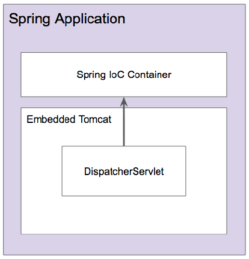
    
    * 스프링 부트의 “주관”이 적용된 자동 설정이 동작한다.
   
        * ① JSP 보다 Thymeleaf 선호 
        
        * ② JSON 지원 
        
        * ③ 정적 리소스 지원 (+ 웰컴 페이지, 파비콘 등 지원)

* (2) 스프링 부트의 MVC 관련 기본 설정 살펴보기

    * 스프링 부트의 MVC 관련 기본 설정에 대해 살펴 보기 위해 디버그 모드로 실행한다

    * 앞서 살펴본 것 보다 스프링 부트에서 `handlerMapping`과 `handlerAdapter`가 더 많이 설정되어 있는 것을 확인 할 수 있다. 

        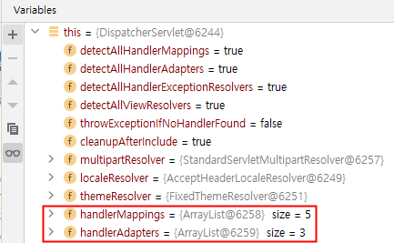
    
    * `SimpleUrlHandlerMapping`에 `resourceHandlerMapping`라는 빈이 등록 되어 있으며 해당 빈은 static 리소스를 사용 할 수 있도록 한다.  

        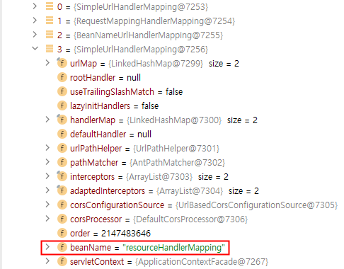

        * static 리소스에 `resourceHandlerMapping`을 적용하면 캐싱 관련 정보가 응답 헤더에 추가된다. 
      
        * 그래서 리소스를 조금 더 효율적으로 제공 할 수 있는데, 예를 들어 리소스가 변경 되지 않았다면 `304 Not Modified`라는 응답을 보내서 브라우저가 캐싱하고 있는 리소스를 그대로 사용하도록 하는 것이 가능하다.
      
    * 그리고 Index 페이지를 지원하는 `welcomePageHandlerMapping`도 있다.  
    
    * 그 다음, `viewResolvers`에는 뷰 리졸버 5개가 등록 되어 있는 것을 확인 할 수 있다.

        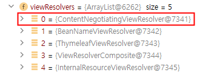
    
        * `ContentNegotiatingViewResolver`는 뷰 이름에 해당하는 뷰를 찾는 일을 나머지 뷰 리졸버들에게 위임한다.
    
* (3) 스프링 부트의 MVC 자동 설정은 어떻게 이루어지는가?

    * ① `spring-boot-autoconfigure`라는 jar 파일을 보면 `spring.factories`라는 파일에 자동 설정 대상의 빈들이 정의 되어 있다.

        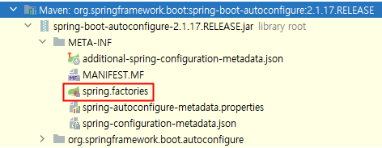

    * ② 그 중 `DispatcherServletAutoConfiguration`에서 디스패처 서블릿을 생성하여 빈으로 등록하는 것을 확인 할 수 있다.

        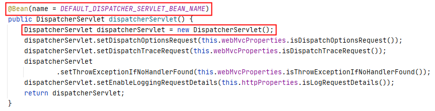

    * ③ 그리고 `WebMvcAutoConfiguration`에서는 스프링 웹 MVC 관련 자동 설정이 정의 되어 있다.
      
        * 해당 클래스의 애노테이션을 좀 더 자세히 살펴 보자.

        * `@ConditionalOnWebApplication`
        
            * 애플리케이션의 타입이 웹 애플리케이션인 경우, 조건을 만족하는 애노테이션이다.
              
            * 참고로, 스프링 부트 애플리케이션의 타입은 총 3가지(`SERVLET`, `REACTIVE`, `NONE`)가 있다. 
        
        * `@ConditionalOnClass` : 해당 클래스가 클래스패스에 있는 경우에만 조건을 만족하는 애노테이션이다. 
        
        * `@ConditionalMissingBean` : 해당 타입의 빈이 등록되지 않은 경우에만 조건을 만족하는 애노테이션이다.

    * ④ 아래 코드의 `@ConditionalOnMissingBean(WebMvcConfigurationSupport.class)` 의미는 다음과 같다.

        * `WebMvcConfigurationSupport` 빈이 등록 되어 있지 않은 경우에는 `WebMvcAutoConfiguration` 설정을 사용 한다는 의미다.
    
        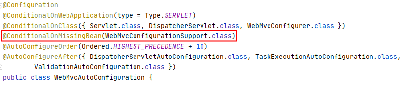

* (4) 스프링 MVC 커스터마이징

    * ① 스프링 부트에서는 `application.properties`를 사용해서 스프링 MVC를 커스터마이징 할 수 있다.
    
    * ② `@Configuration` + `implements WebMvcConfigurer`
    
        * 스프링 부트의 스프링 MVC 자동 설정을 그대로 사용하면서 추가적인 설정을 한다.
    
    * ③ `@Configuration` + `@EnableWebMvc` + `implements WebMvcConfigurer`
    
        * 스프링 부트의 스프링 MVC 자동 설정을 사용하지 않고 직접 설정한다.
    
    * ① ~ ③ 번 순으로 적용할 것을 고려한다.
    
* 스프링 부트를 사용하는 경우, 포매터와 컨버터는 스프링 MVC 커스터마이징을 하지 않고 빈으로만 등록하면 된다. 

#### 5) 스프링 부트에서 JSP 사용하기

* (1) 프로젝트 만들기
      
    * ① `JSP`를 사용할 때는 프로젝트 생성 시, 패키징(Packaging)을 `War`로 해야 된다.
    
        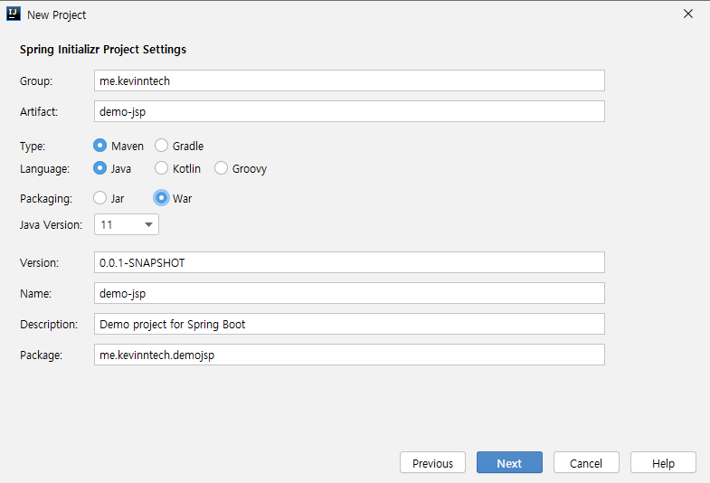
    
    * ② 의존성은 `Spring Web`을 추가한다.
    
        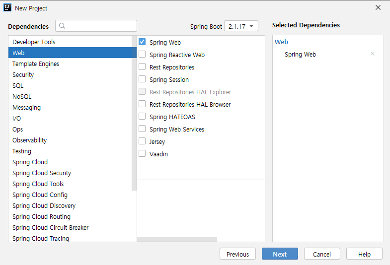
        
    * ③ 프로젝트를 생성한 다음, `pom.xml`에 JSTL과 JSP를 사용하기 위한 의존성을 추가한다.
    
        ```html
        <dependency>
        <groupId>javax.servlet</groupId>
        <artifactId>jstl</artifactId>
        </dependency>
        <dependency>
        <groupId>org.apache.tomcat.embed</groupId>
        <artifactId>tomcat-embed-jasper</artifactId>
        <scope>provided</scope>
        </dependency>
        ```
      
* (2) JSP 사용하기
      
    * ① 컨트롤러를 작성한다.
      
        ```java
        @Controller
        public class EventController {
        
            @GetMapping("/events")
            public String getEvents(Model model){
                Event event1 = new Event();
                event1.setName("스프링 웹 MVC 스터디 1");
                event1.setStarts(LocalDateTime.of(2019, 1, 15, 10, 0));
        
                Event event2 = new Event();
                event2.setName("스프링 웹 MVC 스터디 2");
                event2.setStarts(LocalDateTime.of(2019, 1, 22, 10, 0));
        
                List<Event> events = List.of(event1, event2);
        
                model.addAttribute("events", events);
                model.addAttribute("message", "Happy New Year!");
        
                return "events/list";
            }
      
        }
        ```
      
    * ② Event 클래스를 작성한다.
      
        ```java
        public class Event {
        
            private String name;
        
            private LocalDateTime starts;
        
            public String getName() {
                return name;
            }
        
            public void setName(String name) {
                this.name = name;
            }
        
            public LocalDateTime getStarts() {
                return starts;
            }
        
            public void setStarts(LocalDateTime starts) {
                this.starts = starts;
            }
      
        }
        ```
      
    * ③ 아래와 같은 디렉토리 구조를 생성한 다음, `list.jsp`를 생성한다.
    
        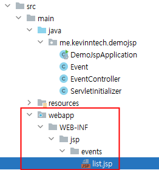
        
    * ④ `list.jsp`의 내용을 다음과 같이 작성한다.
    
        ```html
        <%@ page contentType="text/html;charset=UTF-8" language="java" %>
        <%@ taglib prefix ="c" uri="http://java.sun.com/jsp/jstl/core"%>
        <html>
        <head>
            <title>Title</title>
        </head>
        <body>
            <h1>이벤트 목록</h1>
            <h2>${message}</h2>
            <table>
                <tr>
                    <th>이름</th>
                    <th>시작</th>
                    <c:forEach items="${events}" var="event">
                        <tr>
                            <td>${event.name}</td>
                            <td>${event.starts}</td>
                        </tr>
                    </c:forEach>
                </tr>
            </table>
        </body>
        </html>
        ```
      
    * ⑤ `application.properties`에 다음 내용을 추가한다.
    
        ```
        spring.mvc.view.prefix=/WEB-INF/jsp/
        spring.mvc.view.suffix=.jsp
        ```
      
    * ⑥ 애플리케이션을 실행하여 결과를 확인한다.
    
        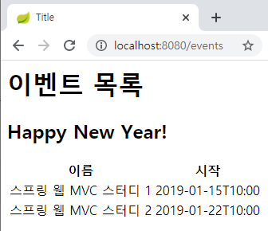
        
    * ⑦ 스프링 부트로 프로젝트를 만들면 `mvnw`라는 커맨드가 생성되며 로컬에 메이븐이 설치 되어 있지 않더라도 해당 명령을 사용하여 메이븐으로 빌드 할 수 있다.
    
        ```
        ./mvnw package
        ```
              
    * ⑧ `war` 파일을 `java -jar` 명령으로 실행 할 수 있다.
  
        ```
        java -jar target/*.war
        ```
        
* JSP의 제약사항
      
    * JSP는 다음과 같은 제약사항이 있기 때문에 권장하지 않는다.

        * ① JAR 프로젝트로 만들 수 없음, WAR 프로젝트로 만들어야 함
    
        * ② `java -jar`로 실행할 수는 있지만 "실행 가능한 JAR 파일"은 지원하지 않음
        
            * `java -jar`로 실행하는 것이 아닌 JAR 파일이 독립적으로 실행 가능 하도록 만들 수 있는데 `War`는 불가능하다. 
    
        * ③ Undertow는 JSP를 지원하지 않음
        
            * Undertow : JBoss에서 만든 서블릿 컨테이너
    
        * ④ Whitelabel 에러 페이지를 error jsp로 오버라이딩 할 수 없음.
        
#### 6) WAR 파일 배포하기

* (1) java -jar를 사용해서 실행하기

    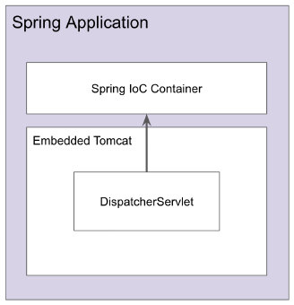
    
    * SpringApplication.run를 사용하기
    
* (2) 서블릿 컨테이너에 배포하기

    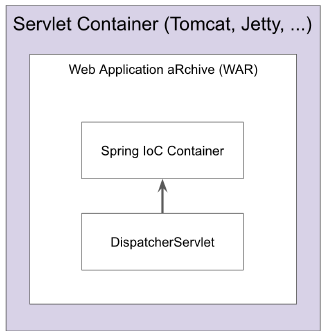
    
    * SpringBootServletInitializer (WebApplicationInitializer)를 사용하기
    
#### 7) 포매터 추가하기

* (1) Formatter

    * `Formatter`는 어떤 객체를 문자열로 변환 하거나 어떤 문자열을 다른 객체로 변환할 때 사용하는 인터페이스다.
    
    * `Formatter`는 사실, 아래의 2가지 인터페이스를 하나로 합친 것이다. 
    
        * ① Parser : 어떤 문자열을 (Locale 정보를 참고하여) 어떻게 객체로 변환할 것인가를 지정한다.
        
        * ② Printer : 해당 객체를 (Locale 정보를 참고하여) 어떻게 문자열로 출력할 것인가를 지정한다.
        
* (2) 실습 준비

    * ① 새로운 프로젝트를 생성한다.

    * ② 컨트롤러를 작성한다.
      
        * http 응답 본문에 핸들러의 결과를 넣는다.
        
        ```java
        @RestController
        public class SampleController {
            
            @GetMapping("/hello")
            public String hello(){
                return "hello";
            }
            
        }
        ```
      
    * ③ 테스트 코드를 작성한다.
              
        ```java
        @RunWith(SpringRunner.class)
        @WebMvcTest
        public class SampleControllerTest {
        
            @Autowired
            MockMvc mockMvc;
        
            @Test
            public void hello() throws Exception {
                this.mockMvc.perform(get("/hello"))
                            .andDo(print())
                            .andExpect(content().string("hello"));
            }
        }
        ```
      
    * ④ 컨트롤러를 다음과 같이 변경한다.
      
        * 포매터를 이용하면 어떤 문자열을 객체로 받을 수 있다.
    
        ```java
        @RestController
        public class SampleController {
        
            @GetMapping("/hello/{name}")
            public String hello(@PathVariable("name") Person person){
                return "hello " + person.getName();
            }
        
        }
        ```
      
    * ⑤ Person 클래스를 작성한다.
         
        ```java
        public class Person {
        
            private String name;
        
            public String getName() {
                return name;
            }
        
            public void setName(String name) {
                this.name = name;
            }
        }
        ```
      
    * ⑥ 테스트 코드를 다음과 같이 변경한 다음, 실행한다.
       
        ```java
        @RunWith(SpringRunner.class)
        @WebMvcTest
        public class SampleControllerTest {
        
            @Autowired
            MockMvc mockMvc;
        
            @Test
            public void hello() throws Exception {
                this.mockMvc.perform(get("/hello/kevin"))
                            .andDo(print())
                            .andExpect(content().string("hello kevin"));
            }
        }
        ```

        * 테스트 코드를 실행하면 결과는 실패 할 것이다.
          
        * 그 이유는 스프링 MVC가 컨트롤러에서 `{name}`에 들어오는 문자열을 어떻게 `Person`으로 변환해야 하는지를 모르기 때문이다.
          
        * 그것을 알려 줄 수 있는 것이 바로 포매터다.
        
* (3) 포매터 추가하기 (스프링 부트를 사용하지 않는 경우)

    * ① Formatter를 구현한 포매터 클래스를 작성한다.
      
        ```java
        public class PersonFormatter implements Formatter<Person> {
        
            // 어떤 문자열을 어떻게 객체로 변환할지를 지정한다.
            @Override
            public Person parse(String text, Locale locale) throws ParseException {
                Person person = new Person();
                person.setName(text);
                return person;
            }
        
            @Override
            public String print(Person object, Locale locale) {
                return object.toString();
            }
        }
        ```
      
    * ② `WebMvcConfigurer`의 addFormatters(FormatterRegistry) 메소드를 오버라이딩 한다.
      
        ```java
        @Configuration
        public class WebConfig implements WebMvcConfigurer {
            @Override
            public void addFormatters(FormatterRegistry registry) {
                registry.addFormatter(new PersonFormatter());      
            }
        }
        ```
      
    * ③ 앞서 작성한 테스트 코드를 다시 실행한다.
    
        * 테스트가 정상적으로 통과되는 것을 확인 할 수 있다.
      
        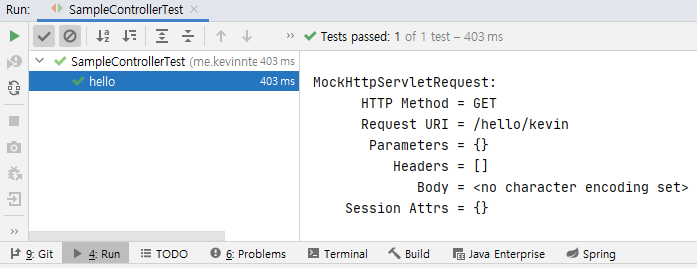
        
    * 웹 브라우저에서 `localhost:8080/hello?name=kevin`과 같은 URL로 요쳥하면 어떻게 처리 해야 될까?

        * 아래 과정을 진행하자.

    * ④ 컨트롤러를 다음과 같이 변경한다.
    
        ```java
        @RestController
        public class SampleController {
        
            @GetMapping("/hello")
            public String hello(@RequestParam("name") Person person){
                return "hello " + person.getName();
            }
        
        }
        ```
      
    * ⑤ 테스트 코드도 변경한다.
    
        ```java
        @RunWith(SpringRunner.class)
        @WebMvcTest
        public class SampleControllerTest {
        
            @Autowired
            MockMvc mockMvc;
        
            @Test
            public void hello() throws Exception {
                this.mockMvc.perform(get("/hello")
                                .param("name", "kevin"))
                            .andDo(print())
                            .andExpect(content().string("hello kevin"));
            }
        }
        ```
      
    * ⑥ 애플리케이션을 실행해서 웹 브라우저에서 확인하는 것도 가능하다.
    
        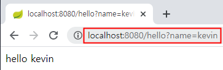
        
* (4) 포매터 추가하기 (스프링 부트를 사용하는 경우)

    * 해당 포매터를 빈으로만 등록하면 된다. (WebConfig 파일은 필요없다)
    
        * 스프링 부트는 해당 포매터가 빈으로 등록되어 있으면 포매터가 동작한다.
    
        ```java
        @Component
        public class PersonFormatter implements Formatter<Person> {
        
            @Override
            public Person parse(String text, Locale locale) throws ParseException {
                Person person = new Person();
                person.setName(text);
                return person;
            }
        
            @Override
            public String print(Person object, Locale locale) {
                return object.toString();
            }
        
        }
        ```
      
    * 위와 같이 수정한 다음, 애플리케이션을 실행하여 웹 브라우저에서 확인하면 문제가 없다.

    * 하지만, 테스트 코드를 실행하면 실패하게 된다. 그 이유는 `@WebMvcTest`는 슬라이스 테스트용 이기 때문에 웹과 관련된 빈만 등록하며 포매터에 대해서는 빈으로 등록하지 않기 때문이다. 
    
    * 해결책은 다음과 같다.
    
        * @`SpringBootTest`를 사용하여 통합 테스트로 변경하고 이제 `MockMvc`가 자동으로 빈으로 등록되지 않기 때문에 `@AutoConfigureMockMvc`를 사용한다.

            ```java
            @RunWith(SpringRunner.class)
            @SpringBootTest
            @AutoConfigureMockMvc
            public class SampleControllerTest {
            
                @Autowired
                MockMvc mockMvc;
            
                @Test
                public void hello() throws Exception {
                    mockMvc.perform(get("/hello")
                                .param("name", "kevin"))
                            .andDo(print())
                            .andExpect(content().string("hello kevin"));
                }
            }
            ```

#### 8) 도메인 클래스 컨버터 자동 등록 

* (1) 도메인 클래스

    * 요청으로 이름이 들어오면 이름에 해당하는 도메인 클래스(Person) 타입의 객체로 맵핑 했는데, 보통 Person의 id에 해당하는 것으로 맵핑한다.

* (2) 포매터 또는 컨버터를 직접 만들 필요가 없는 경우

    * ① 다음과 같이 도메인 클래스를 변경한다.
    
        ```java
        public class Person {
        
            private Long id; 
            
            private String name;
        
            public String getName() {
                return name;
            }
        
            public void setName(String name) {
                this.name = name;
            }
        
            public Long getId() {
                return id;
            }
        
            public void setId(Long id) {
                this.id = id;
            }
            
        }
        ```
   
    * ② id에 해당하는 이름을 출력 하고자 하는 경우, 포매터 또는 컨버터를 직접 등록 할 필요가 없다. 포매터 클래스를 작성한 것이 있다면 삭제하자.
    
        ```java
        @RestController
        public class SampleController {
        
            @GetMapping("/hello")
            public String hello(@RequestParam("id") Person person){
                return "hello " + person.getName(); // id에 해당하는 이름 출력
            }
        
        }
        ```
      
    * ③ 테스트 코드를 다음과 같이 변경하고 실행하면 테스트에 실패하게 된다.
    
        ```java
        @RunWith(SpringRunner.class)
        @SpringBootTest
        @AutoConfigureMockMvc
        public class SampleControllerTest {
        
            @Autowired
            MockMvc mockMvc;
        
            @Test
            public void hello() throws Exception {
                this.mockMvc.perform(get("/hello")
                                .param("id", "1"))
                            .andDo(print())
                            .andExpect(content().string("hello kevin"));
            }
        }
        ```

    * 테스트 코드에서 `/hello`에 GET 요청을 할 때, id에 1이라는 값을 전달하였지만 컨트롤러에서 1을 받아서 Person으로 변경 할 수 없으므로 에러가 발생한다.
    
    * 해당 문제는 아래에서 스프링 데이터 JPA를 이용하여 해결한다.
    
* (3) 도메인 클래스 컨버터를 사용하는 경우

    * `스프링 데이터 JPA`가 제공하는 `도메인 클래스 컨버터`는 어떠한 ID에 해당하는 엔티티로 변환해준다.
    
    * ① `pom.xml`에 스프링 데이터 JPA 의존성을 추가한다.
    
        ```html
        <dependency>
            <groupId>org.springframework.boot</groupId>
            <artifactId>spring-boot-starter-data-jpa</artifactId>
        </dependency>
        <dependency>
            <groupId>com.h2database</groupId>
            <artifactId>h2</artifactId>
        </dependency>
        ```
      
    * ② 엔티티를 맵핑한다.
     
        ```java
        @Entity
        public class Person {
        
            @Id @GeneratedValue
            private Long id;
        
            private String name;
        
            public Long getId() {
                return id;
            }
        
            public void setId(Long id) {
                this.id = id;
            }
        
            public String getName() {
                return name;
            }
        
            public void setName(String name) {
                this.name = name;
            }
        }
        ```
      
    * ③ 리파지토리를 추가한다.
     
        ```java
        public interface PersonRepository extends JpaRepository<Person, Long> {
        }
        ```
      
    * ④ 테스트 코드를 다음과 같이 변경한 다음, 실행하여 결과를 확인한다.
     
        ```java
        @RunWith(SpringRunner.class)
        @SpringBootTest
        @AutoConfigureMockMvc
        public class SampleControllerTest {
        
            @Autowired
            MockMvc mockMvc;
        
            @Autowired
            PersonRepository personRepository;
        
            @Test
            public void hello() throws Exception {
                Person person = new Person();
                person.setName("kevin");
                Person savedPerson = personRepository.save(person);
        
                this.mockMvc.perform(get("/hello")
                            .param("id", savedPerson.getId().toString()))
                        .andDo(print())
                        .andExpect(content().string("hello kevin"));
            }
        
        }
        ```

#### 9) 핸들러 인터셉터 1부 : 개념

* (1) HandlerInterceptor 

    * `HandlerInterceptor`는 핸들러를 실행하기 전, 후(아직 랜더링 전) 그리고 완료(랜더링까지 끝난 이후) 시점에 부가 작업을 하고 싶은 경우에 사용한다.
    
    * 여러 핸들러에서 반복적으로 사용하는 코드를 줄이고 싶을 때 사용할 수 있다. 
    
        * Ex) 로깅, 인증 체크, Locale 변경 등...
        
* (2) boolean preHandle(request, response, **handler**) 

    * `preHandle()`는 핸들러를 실행 하기 전에 호출된다. 

    * "핸들러"에 대한 정보를 사용할 수 있기 때문에 서블릿 필터에 비해 보다 세밀한 로직을 구현할 수 있다. 
    
    * 다음 인터셉터 또는 핸들러로 요청, 응답을 전달한다면 `true`를 리턴하고 이곳에서 끝났다면 `false`를 리턴한다.
     
* (3) void postHandle(request, response, **modelAndView**)

    * `postHandle()`는 핸들러 실행이 끝나고 아직 뷰를 랜더링 하기 전에 호출된다.

    * "뷰"에 전달할 추가적이거나 여러 핸들러에 공통적인 모델 정보를 담는데 사용할 수도 있다. 

    * 이 메소드는 인터셉터 역순으로 호출된다. 

    * 비동기적인 요청 처리 시에는 호출되지 않는다.
    
* (4) void afterCompletion(request, response, handler, ex)

    * `afterCompletion()`는 요청 처리가 완전히 끝난 뒤(뷰 렌더링이 끝난 뒤)에 호출된다.
    
    * preHandler에서 true를 리턴한 경우에만 호출된다.
    
    * 이 메소드는 인터셉터 역순으로 호출된다.

    * 비동기적인 요청 처리 시에는 afterCompletion()가 호출되지 않는다.
    
* (5) 동작 순서

    * ① preHandle 1

    * ② preHandle 2

    * ③ 요청 처리 핸들러가 실행됨 

    * ④ postHandle 2

    * ⑤ postHandle 1

    * ⑥ 뷰 렌더링

    * ⑦ afterCompletion 2

    * ⑧ afterCompletion 1
    
* (6) 핸들러 인터셉터 VS 서블릿 필터

    * 핸들러 인터셉터는 서블릿 필터 보다 구체적인 처리가 가능하다.
    
    * 서블릿 필터는 일반적인 용도의 기능을 구현하는데 사용하는 것이 좋다.
      
        * Ex) XSS Filter
    
    * Spring MVC에 특화 되어 있는 정보를 참고 해야 한다면 핸들러 인터셉터를 구현하는 것이 좋다.
    
#### 10) 핸들러 인터셉터 2부 : 만들고 등록하기

* (1) 인터셉터 구현하기

    * `HandlerInterceptor` 인터페이스를 구현한 클래스를 작성한다.
    
        ```java
        // 첫 번째 인터셉터
        public class GreetingInterceptor implements HandlerInterceptor {
        
            @Override
            public boolean preHandle(HttpServletRequest request, HttpServletResponse response, Object handler) throws Exception {
                System.out.println("preHandle 1"); // 메시지 출력
                return true; // 다음 인터셉터 또는 핸들러로 요청을 전달 하도록 함
            }
        
            @Override
            public void postHandle(HttpServletRequest request, HttpServletResponse response, Object handler, ModelAndView modelAndView) throws Exception {
                System.out.println("postHandle 1");
            }
        
            @Override
            public void afterCompletion(HttpServletRequest request, HttpServletResponse response, Object handler, Exception ex) throws Exception {
                System.out.println("afterCompletion 1");
            }
            
        }
        ```
      
        ```java
        // 두 번째 인터셉터
        public class AnotherInterceptor implements HandlerInterceptor {
        
            @Override
            public boolean preHandle(HttpServletRequest request, HttpServletResponse response, Object handler) throws Exception {
                System.out.println("preHandle 2");
                return true;
            }
        
            @Override
            public void postHandle(HttpServletRequest request, HttpServletResponse response, Object handler, ModelAndView modelAndView) throws Exception {
                System.out.println("postHandle 2");
            }
        
            @Override
            public void afterCompletion(HttpServletRequest request, HttpServletResponse response, Object handler, Exception ex) throws Exception {
                System.out.println("afterCompletion 2");
            }
        
        }
        ```
      
* (2) 인터셉터 등록하기

    * `WebMvcConfigurer`를 구현한 `WebConfig`에서 `addInterceptors()`를 오버라이딩하여 인터셉터를 등록한다.
    
        ```java
        @Configuration
        public class WebConfig implements WebMvcConfigurer {
        
            @Override
            public void addInterceptors(InterceptorRegistry registry) {
                // 별다른 순서를 지정하지 않으면 add한 순서대로 먼저 적용된다.
                registry.addInterceptor(new GreetingInterceptor());
                registry.addInterceptor(new AnotherInterceptor());
            }
            
        }
        ```
      
    * 특정 패턴에 해당하는 요청에만 핸들러 인터셉터를 적용할 수도 있다. 그리고 핸들러 인터셉터의 순서를 지정할 수 있다.
    
        ```java
        @Configuration
        public class WebConfig implements WebMvcConfigurer {
        
            @Override
            public void addInterceptors(InterceptorRegistry registry) {
                // 명시적으로 순서를 지정하고 싶다면 아래와 같이 할 수 있다. (지정된 값이 낮을수록 우선순위가 높다.)
                registry.addInterceptor(new GreetingInterceptor()).order(0);
                registry.addInterceptor(new AnotherInterceptor())
                        .addPathPatterns("/hi")
                        .order(-1);
            }
        
        }
        ```

#### 11) 리소스 핸들러

* (1) 리소스 핸들러란?

    * `리소스 핸들러`는 HTML, CSS, 자바스크립트 그리고 이미지와 같은 정적(static) 리소스를 처리하는 핸들러다.

* (2) 디폴트 서블릿 (DefaultServlet) 

    * `디폴트 서블릿`은 서블릿 컨테이너가 기본으로 제공하며 정적 리소스를 처리할 때 사용하는 서블릿이다.
        
    * 스프링은 등록되어 있는 디폴트 서블릿에 요청을 위임해서 정적 리소스를 처리한다.

    * 정적 리소스 핸들러는 가장 낮은 우선 순위로 등록된다.

        * 다른 핸들러 맵핑이 `/` 이하 요청을 처리하도록 허용하고 최종적으로 리소스 핸들러가 처리하도록 한다.
    
* (3) 스프링 부트에서 리소스 핸들러

    * 스프링 부트에서는 어떠한 설정 없이 기본적으로 정적 리소스 핸들러와 캐싱을 제공한다.

    * `resources/static` 디렉토리에 정적 파일이 있고 클라이언트에서 해당 파일을 요청하면 애플리케이션에서 제공한다.

    * 실습하기
    
        * ① `resources/static` 디렉토리에 `index.html` 파일을 생성한다.
        
            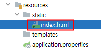
            
            ```html
            <!DOCTYPE html>
            <html lang="en">
            <head>
                <meta charset="UTF-8">
                <title>Title</title>
            </head>
            <body>
            <h1>hello index</h1>
            </body>
            </html>
            ```
          
        * ② 다음과 같은 테스트 코드를 작성하고 실행한다.
        
            ```java
            @Test
            public void helloStatic() throws Exception{
                this.mockMvc.perform(get("/index.html"))
                        .andDo(print())
                        .andExpect(status().isOk())
                        .andExpect(content().string(Matchers.containsString("hello index")));
        
            }
            ```
          
* (4) 리소스 핸들러 설정하기

    * `WebConfig`에서 `addResourceHandlers()`를 오버라이딩하여 리소스 핸들러를 등록한다.

        ```java
        @Configuration
        public class WebConfig implements WebMvcConfigurer {
        
            @Override
            public void addResourceHandlers(ResourceHandlerRegistry registry) {
                registry.addResourceHandler("/mobile/**") // 어떤 패턴의 요청을 처리 할지 지정 
                        .addResourceLocations("classpath:/mobile/") // 리소스를 찾는 위치를 지정
                          /* 만약 리소스가 변경되지 않았다면 10분 동안 캐싱을 한다.
                             변경되었다면 10분이 지나지 않아도 리소스를 다시 받아온다. */
                        .setCacheControl(CacheControl.maxAge(10, TimeUnit.MINUTES)); 
            }
        
        }
        ```
            
        * ① `addResourceHandler()` : 어떤 요청 패턴을 지원할 것인지 지정 
        
        * ② `addResourceLocations()` : 리소스를 찾는 위치를 지정
        
            * `classpath:` → 클래스패스를 기준으로 경로를 지정
        
            * `file:` → 파일 시스템을 기준으로 경로를 지정
        
            * 위와 같은 접두어를 지정하지 않으면 `src/main/webapp` 라는 디렉토리에서 찾기 때문에, 우리가 생성한 프로젝트가 War가 아니면 `classpath:` 또는 `file:`을 주로 사용 하게 될 것이다. 
        
        * ③ `setCacheControl()` : 캐싱 설정
        
        * ④ `ResourceResolver`
        
            * 요청에 해당하는 리소스를 찾는 전략
            
            * 캐싱, 인코딩(gzip, brotli), WebJar, ...
        
        * ⑤ `ResourceTransformer`
        
            * 응답으로 보낼 리소스를 수정하는 전략 
            
            * 캐싱, CSS 링크, HTML5 AppCache, ...
          
    * `src/resources/mobile` 디렉토리에 `index.html`을 작성한다.
    
        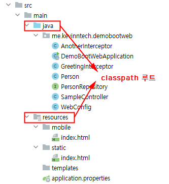
        
        ```html
        <!DOCTYPE html>
        <html lang="en">
        <head>
            <meta charset="UTF-8">
            <title>Title</title>
        </head>
        <body>
        <h1>Hello Mobile</h1>
        </body>
        </html>
        ```
        
    * 테스트 코드를 작성한다.
      
        ```java
        @Test
        public void helloStatic() throws Exception{
            this.mockMvc.perform(get("/mobile/index.html"))
                    .andDo(print())
                    .andExpect(status().isOk())
                    .andExpect(content().string(Matchers.containsString("Hello Mobile")))
                    .andExpect(header().exists(HttpHeaders.CACHE_CONTROL));
    
        }
        ```
            
#### 12) HTTP 메시지 컨버터 1부: 개요

* (1) HTTP 메시지 컨버터란?

    * `HTTP 메시지 컨버터`는 요청 본문에서 메시지를 읽어들이거나(`@RequestBody`), 응답 본문에 메시지를 작성할 때(`@ResponseBody`) 적용된다.
    
        * `@RequestBody`는 HTTP 요청 본문(body)에 있는 메시지를 `HTTP 메시지 컨버터`를 이용하여 객체로 변환한다.
        
        * `@ResponseBody`는 HTTP 응답 본문(body)에 메시지를 작성할 때 사용한다.
    
        * `@RestController`을 사용 하는 경우, `@ResponseBody`를 생략 할 수 있다.
    
        ```java
        @Controller
        public class SampleController {
        
            ...
        
            @GetMapping("/message")
            public @ResponseBody String message(@RequestBody Person person){
                return "hello person";
            }
        
        }
        ```
      
* (2) HTTP 메시지 컨버터 실습
      
    * ① 컨트롤러 작성하기
    
        * HTTP 요청 본문에 작성된 데이터를 그대로 리턴 하도록 한다.
    
        ```java
        @RestController
        public class SampleController {
        
            @GetMapping("/hello")
            public String hello(@RequestParam("id") Person person) {
                return "hello " + person.getName();
            }
        
            @GetMapping("/message")
            public @ResponseBody String message(@RequestBody String body){
                return body;
            }
        
        }
        ```
      
    * ② 테스트 코드 작성하기
    
        ```java
        @RunWith(SpringRunner.class)
        @SpringBootTest
        @AutoConfigureMockMvc
        public class SampleControllerTest {
        
            @Autowired
            MockMvc mockMvc;
        
            @Test
            public void stringMessage() throws Exception{
                this.mockMvc.perform(get("/message")
                                .content("hello"))
                            .andDo(print())
                            .andExpect(status().isOk())
                            .andExpect(content().string("hello"));
        
            }
        
        }
        ```

* (3) HTTP 메시지 컨버터의 종류
      
    * 기본 HTTP 메시지 컨버터
    
        * ① 바이트 배열 컨버터 
        * ② 문자열 컨버터 
        * ③ Resource 컨버터 
        * ④ Form 컨버터 (폼 데이터 to/from MultiValueMap<String, String>) 
    
    * 해당 의존성이 있는 경우에만 사용 가능한 HTTP 메시지 컨버터
    
        * ① JAXB2 컨버터 
        * ② Jackson2 컨버터 
        * ③ Jackson 컨버터 
        * ④ Gson 컨버터 
        * ⑤ Atom 컨버터
        * ⑥ RSS 컨버터
        * ...
        
* (4) HTTP 메시지 컨버터 설정하기
       
    * ① WebConfig에서 `extendMessageConverters()`를 오버라이딩
      
        * 기본으로 등록해주는 컨버터에 새로운 컨버터를 추가한다.
     
    * ② WebConfig에서 `configureMessageConverters()`를 오버라이딩

        * 기본으로 등록해주는 컨버터는 다 무시하고 새로운 컨버터를 설정한다.

    * ③ **의존성 추가로 컨버터를 등록하기 [추천]**
     
        * **메이븐 또는 그래들 설정에 의존성을 추가하면 그에 따른 컨버터가 자동으로 등록 된다.**
    
        * `WebMvcConfigurationSupport` 클래스에서 의존성 존재 여부에 따라 자동 등록되는 것을 확인 할 수 있다.

            * 이 기능 자체는 스프링 프레임워크의 기능이며 스프링 부트만의 기능은 아니다.
        
#### 13) HTTP 메시지 컨버터 2부: JSON

* (1) 스프링 부트를 사용하지 않는 경우

    * 사용하고 싶은 JSON 라이브러리를 의존성으로 추가한다.

        * ① `GSON`
    
        * ② `JacksonJSON`
    
        * ③ `JacksonJSON 2`

* (2) 스프링 부트를 사용하는 경우

    * 스프링 부트를 사용하면 기본적으로 `JacksonJSON 2` 의존성이 추가된다.

        * 즉, JSON용 HTTP 메시지 컨버터가 기본으로 등록된다.

    * ① SampleController를 변경한다.
    
        ```java
        @RestController
        public class SampleController {
        
            @GetMapping("/jsonMessage")
            public Person jsonMessage(@RequestBody Person person){ // HTTP 요청 본문으로 들어오는 JSON 문자열을 Person 객체로 변환
                return person; // 그리고 그대로 리턴함
            }
        
        }
        ```
      
    * ② 테스트 코드를 작성한다.
      
        * `"{\"id\":0,\"name\""`과 같이 JSON 문자열을 직접 작성하는 것은 번거롭다.

        * 그래서 `Jackson`이 제공하는 `ObjectMapper`를 사용해서 JSON 문자열을 만든다.
          
        ```java
        @RunWith(SpringRunner.class)
        @SpringBootTest
        @AutoConfigureMockMvc
        public class SampleControllerTest {
        
            @Autowired
            MockMvc mockMvc;
        
            @Autowired
            ObjectMapper objectMapper;
        
            @Test
            public void jsonMessage() throws Exception {
                Person person = new Person();
                person.setId(2019L);
                person.setName("kevin");
        
                String jsonString = objectMapper.writeValueAsString(person);
        
                this.mockMvc.perform(get("/jsonMessage")
                            .contentType(MediaType.APPLICATION_JSON_UTF8) // HTTP 요청 본문으로 JSON을 보내며
                            .accept(MediaType.APPLICATION_JSON_UTF8) // JSON으로 응답이 오길 바란다.
                            .content(jsonString))
                        .andDo(print())
                        .andExpect(status().isOk())
                        .andExpect(jsonPath("$.id").value(2019))
                        .andExpect(jsonPath("$.name").value("kevin"));
            }
        
        
        }
        ```
      
    * JSON 테스트에 `Postman`이라는 애플리케이션을 사용 할 수 있다.
    
        * `Postman`은 `REST API` 또는 `HTTP API`를 테스트 할 때 편리한 애플리케이션이다.

        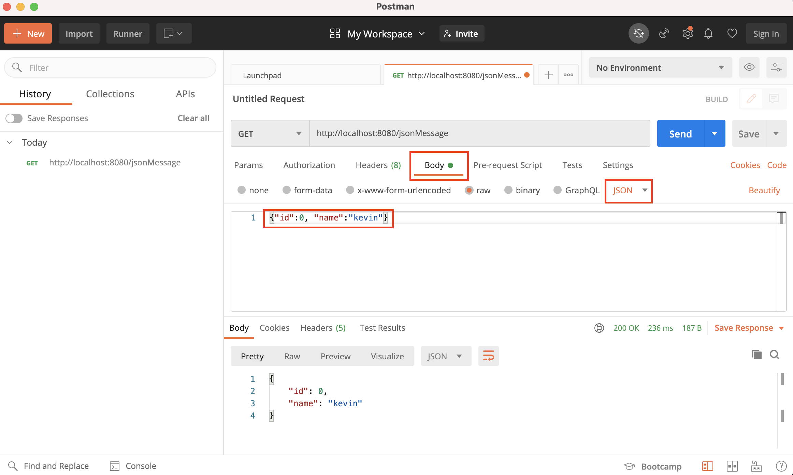
    
* (3) JSON path 문법

    * HTTP 응답 본문의 JSON 데이터를 확인할 때는 JSON path를 이용 할 수 있다. 자세한 내용은 아래 링크를 참조하자.
    
        * [JsonPath Syntax](https://github.com/json-path/JsonPath "JsonPath")
        * [JSONPath Online Evaluator](http://jsonpath.com/ "JsonPath")
  
#### 14) HTTP 메시지 컨버터 3부: XML

* (1) OXM(Object-XML Mapper) 라이브러리 중에 스프링이 지원하는 의존성을 추가한다.

    * ① JacksonXML
    
    * ② JAXB
    
* (2) JAXB 의존성 추가

    ```html
    <dependency>
        <groupId>javax.xml.bind</groupId>
        <artifactId>jaxb-api</artifactId>
    </dependency>
    <dependency>
        <groupId>org.glassfish.jaxb</groupId>
        <artifactId>jaxb-runtime</artifactId>
    </dependency>
    <dependency>
        <groupId>org.springframework</groupId>
        <artifactId>spring-oxm</artifactId>
        <version>${spring-framework.version}</version>
    </dependency>
    ```
  
* (3) Marshaller를 등록

    * ① WebConfig 파일에서 Marshaller 빈을 등록한다.

        ```html
        @Configuration
        public class WebConfig implements WebMvcConfigurer {
        
            @Bean
            public Jaxb2Marshaller jaxb2Marshaller() {
                Jaxb2Marshaller jaxb2Marshaller = new Jaxb2Marshaller();
                jaxb2Marshaller.setPackagesToScan(Person.class.getPackageName());
                return jaxb2Marshaller;
            }
               
        }
        ```
      
    * ② 도메인 클래스(Person)에 `@XmlRootElement`를 추가한다.

        ```html
        @XmlRootElement
        @Entity
        public class Person {
        
            @Id @GeneratedValue
            private Long id;
        
            private String name;
        
            public String getName() {
                return name;
            }
        
            public void setName(String name) {
                this.name = name;
            }
        
            public Long getId() {
                return id;
            }
        
            public void setId(Long id) {
                this.id = id;
            }
        }
        ```
      
    * ③ 테스트 코드를 작성한다.

        ```java
        @RunWith(SpringRunner.class)
        @SpringBootTest
        @AutoConfigureMockMvc
        public class SampleControllerTest {
        
            @Autowired
            MockMvc mockMvc;
        
            @Autowired
            Marshaller marshaller;
        
            @Test
            public void xmlMessage() throws Exception {
                Person person = new Person();
                person.setId(2019L);
                person.setName("kevin");
        
                StringWriter stringWriter = new StringWriter();
                StreamResult result = new StreamResult(stringWriter); // 이렇게 작성해야 테스트가 정상 동작 함
        
                marshaller.marshal(person, result);
                String xmlString = stringWriter.toString();
        
                this.mockMvc.perform(get("/jsonMessage")
                        .contentType(MediaType.APPLICATION_XML)
                        .accept(MediaType.APPLICATION_XML)
                        .content(xmlString))
                        .andDo(print())
                        .andExpect(status().isOk())
                        .andExpect(xpath("person/name").string("kevin"))
                        .andExpect(xpath("person/id").string("2019"));
        
            }
        
        }
        ```

* (4) Xpath 문법

    * 아래 링크를 참조하자.
     
        * [XPath Syntax](https://www.w3schools.com/xml/xpath_syntax.asp "XPath Syntax")
        
        * [XPath Tester / Evaluator](https://www.freeformatter.com/xpath-tester.html "XPath Tester / Evaluator")

* 스프링 부트를 사용하는 경우, 기본으로 XML 의존성을 추가해주지 않는다.

#### 15) 기타 WebMvcConfigurer 설정

* (1) CORS 설정

    * Cross Origin 요청 처리 설정
    
    * 같은 도메인에서 온 요청이 아니더라도 처리를 허용하고 싶다면 설정한다. 

* (2) `addReturnValueHandlers()` : 리턴 값 핸들러 설정 

    * 스프링 MVC가 제공하는 기본 리턴 값 핸들러가 아닌 리턴 핸들러를 추가하고 싶을 때 설정한다. 

* (3) `addArgumentResolvers()` : 아큐먼트 리졸버 설정 

    * 스프링 MVC가 제공하는 기본 아규먼트 리졸버가 아닌 아규먼트 리졸버를 추가하고 싶을 때 설정한다. 

* (4) `addViewControllers()` : 뷰 컨트롤러

    * (핸들러를 작성하지 않고) 단순하게 요청 URL을 특정 뷰로 연결하고 싶을 때 사용할 수 있다. 

        ```java
        @Configuration
        public class WebConfig implements WebMvcConfigurer {
        
            @Override
            public void addViewControllers(ViewControllerRegistry registry) {
                // "/hi"라는 요청이 들어오면 "hi"라는 이름의 뷰를 보여주도록 한다.
                registry.addViewController("/hi").setViewName("hi");
            }
        
        }
        ```

* (5) `configureAsyncSupport()` : 비동기 설정

    * 비동기 요청 처리에 사용할 타임아웃이나 TaskExecutor를 설정할 수 있다. 

* (6) `configureViewResolvers()` : 뷰 리졸버 설정

    * 핸들러에서 리턴하는 뷰 이름에 해당하는 문자열을 View 인스턴스로 바꿔줄 뷰 리졸버를 설정한다. 

* (7) `configureContentNegotiation()` : Content Negotiation 설정

    * 요청 본문 또는 응답 본문을 어떤 (MIME) 타입으로 보내야 하는지 결정하는 전략을 설정한다.

* 더 자세한 내용이 궁금하다면 [WebMvcConfigurer](https://docs.spring.io/spring-framework/docs/current/javadoc-api/org/springframework/web/servlet/config/annotation/WebMvcConfigurer.html "WebMvcConfigurer")를 참조하자.

#### 16) 스프링 MVC 설정 마무리

* (1) 스프링 MVC 설정은 `DispatcherServlet`이 사용 할 여러 빈들을 설정하는 것이다. 

    * `DispatcherServlet`이 사용하는 스프링 MVC 구성 요소를 직접 빈(Bean)으로 등록하면 (등록하지 않는다면 DispatcherServlet 기본 전략를 이용)
    
    * `DispatcherServlet`은 `ApplicationContext`에 등록되어 있는 빈 중에서 스프링 MVC 구성 요소에 해당하는 빈을 찾아서 사용한다. 
   
        * ① HandlerMapper
               
        * ② HandlerAdapter
             
        * ③ ViewResolver
           
        * ④ ExceptionResolver
            
        * ⑤ LocaleResolver
           
        * ...
    
        * 일일히 직접 빈으로 등록하려니 너무 많고, 해당 빈들이 참조하는 또 다른 객체들까지 설정하려면 설정해야 되는 것이 너무 많다.
      
* (2) @EnableWebMvc

    * 애노테이션 기반의 스프링 MVC 설정을 간편하게 만든다.
           
    * `WebMvcConfigurer`가 제공하는 메소드를 구현하여 커스터마이징 할 수도 있다.

* (3) 스프링 부트

    * 스프링 부트 자동 설정을 통해 다양한 스프링 MVC 기능을 아무런 설정 파일을 만들지 않아도 제공한다.

    * `WebMvcConfigurer`가 제공하는 메소드를 구현하여 커스터마이징 할 수 있다.

    * `@EnableWebMvc`를 사용하면 스프링 부트의 자동 설정을 사용 하지 못한다.
    
* (4) 스프링 MVC 설정 방법

    * ① 스프링 부트를 사용하는 경우에는 `application.properties`으로 커스터마이징을 시작한다.
         
    * ② ①번으로 불가능 하다면 `WebMvcConfigurer`를 사용한다.
         
    * ③ `@Bean`으로 MVC 구성 요소를 직접 빈으로 등록한다. 
    
## 3. 스프링 MVC 활용

#### 1) 스프링 MVC 핵심 기술 소개 

* (1) 애노테이션 기반의 스프링 MVC

    * 요청 맵핑하기

    * 핸들러 메소드

    * 모델과 뷰

    * 데이터 바인더

    * 예외 처리

    * 글로벌 컨트롤러
    
* (2) 사용할 기술

    * 스프링 부트

    * 스프링 프레임워크 웹 MVC

    * 타임리프
    
* (3) 학습 할 애노테이션

    * `@RequestMapping`
    
        * `@GetMapping`, `@PostMapping`, `@PutMapping`, ...

    * `@ModelAttribute`

    * `@RequestParam`, `@RequestHeader`

    * `@PathVariable`, `@MatrixVariable`

    * `@SessionAttribute`, `@RequestAttribute`, `@CookieValue`

    * `@Valid`

    * `@RequestBody`, `@ResponseBody`

    * `@ExceptionHandler`

    * `@ControllerAdvice`
    
* (4) 프로젝트 생성

    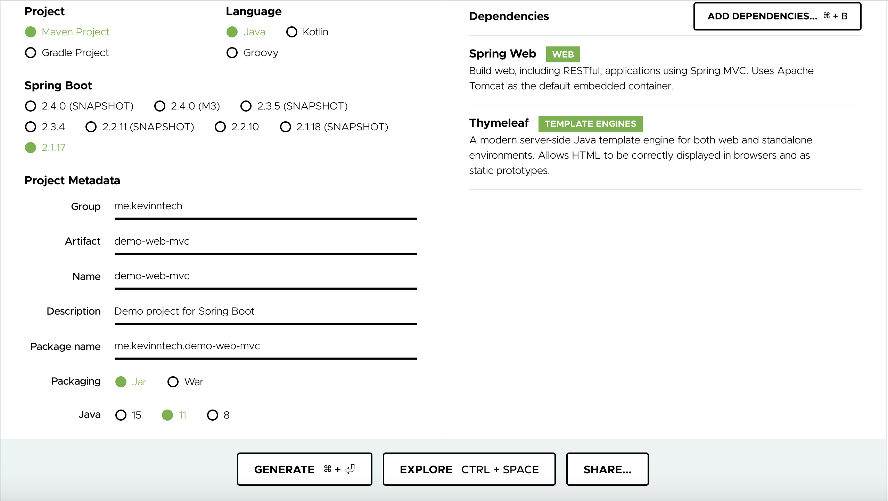
            
#### 2) HTTP 요청 맵핑하기 1부 : 요청 메소드

* HTTP 요청을 핸들러에 맵핑하는 방법에 대해서 알아본다.

* `핸들러(Handler)`는 컨트롤러 안에 요청을 처리 할 수 있는 메서드를 말한다.

* (1) 애노테이션 기반의 스프링 MVC

    * HTTP 메소드(Method)는 `GET`, `POST`, `PUT`, `PATCH`, `DELETE` 등이 있다.
        
    * `@RequestMapping`은 HTTP 요청을 처리하는 핸들러를 지정하는 애노테이션이다.
      
    * HTTP 메소드를 따로 지정하지 않으면 모든 HTTP 메소드를 처리하게 된다.
     
* (2) HTTP method 맵핑하기 1 - 모든 HTTP 메소드 처리

    * ① 컨트롤러를 작성한다.
    
        ```java
        @Controller
        public class SampleController {
            
            @RequestMapping("/hello")
            @ResponseBody           // 핸들러의 반환 값인 문자열을 응답으로 보내고 싶다면 @ResponseBody를 사용한다.
            public String hello(){
                return "hello";     // @ResponseBody가 없다면 해당 이름에 해당하는 뷰를 찾게 된다. 
            }
            
        }
        ```
    
    * ② 테스트 코드를 작성
        
        ```java
        @RunWith(SpringRunner.class)
        @WebMvcTest
        public class SampleControllerTest {
        
            @Autowired
            MockMvc mockMvc;
        
            @Test
            public void helloTest() throws Exception {
                mockMvc.perform(get("/hello"))
                        .andDo(print())
                        .andExpect(status().isOk())
                        .andExpect(content().string("hello"));
            }
        }
        ```
      
        * `@RunWith(SpringRunner.class)`
        
            * `SpringRunner.class`
            
                * 스프링에서 제공하는 JUnit용 Runner이다.
                
                * 스프링 테스트를 조금 더 효율적으로 실행 할 수 있도록 도와주는 클래스이며 테스트에서 사용 할 `ApplicationContext`도 만들어준다.
                
        * JUnit4에서는 테스트 메소드를 만들 때 `public void`로 선언 해야 됨
        
* (3) HTTP method 맵핑하기 2 - 하나의 HTTP 메소드만 처리

    * ① 컨트롤러 작성
    
        ```java
        @Controller
        public class SampleController {
        
            @RequestMapping(value = "/hello" , method = RequestMethod.GET) // GET 요청에 대해 처리
            @ResponseBody      
            public String hello(){
                return "hello";
            }
        
        }
        ```
      
    * ② 테스트 코드를 변경

        * 핸들러는 `GET` 요청에 대해서 처리 하도록 되어 있으므로 테스트 코드에서 `PUT` 요청을 하게 되면 테스트에 실패 할 것이다.
          
        * 그래서 다음과 같이 테스트 코드를 변경한다.
    
        ```java
        @RunWith(SpringRunner.class)
        @WebMvcTest
        public class SampleControllerTest {
        
            @Autowired
            MockMvc mockMvc;
        
            @Test
            public void helloTest() throws Exception {
                mockMvc.perform(put("/hello"))
                        .andDo(print())
                        .andExpect(status().isMethodNotAllowed());
            }
        }
        ```
      
* (4) HTTP method 맵핑하기 3 - 여러 HTTP 메소드 처리

    * ① 컨트롤러를 작성한다.
    
        * 여러 HTTP 메소드에 대해 처리 하고 싶은 경우에는 `@RequestMapping`의 `method `속성에 {}로 배열을 지정 할 수 있다.
          
        * 아래의 핸들러는 HTTP GET과 PUT 요청에 대해서 허용한다.
    
        ```java
        @Controller
        public class SampleController {
        
            @RequestMapping(value = "/hello" , method = {RequestMethod.GET, RequestMethod.PUT})
            @ResponseBody
            public String hello(){
                return "hello";
            }
        
        }
        ```
      
    * ② 테스트 코드를 변경한다.
       
        * GET, PUT, POST 요청에 대한 테스트를 진행한다.
        
            ```java
            @RunWith(SpringRunner.class)
            @WebMvcTest
            public class SampleControllerTest {
            
                @Autowired
                MockMvc mockMvc;
            
                @Test
                public void helloTest() throws Exception {
                    mockMvc.perform(get("/hello")) // GET 요청 테스트
                            .andDo(print())
                            .andExpect(status().isOk());
            
                    mockMvc.perform(put("/hello")) // PUT 요청 테스트
                            .andDo(print())
                            .andExpect(status().isOk());
            
                    mockMvc.perform(post("/hello")) // POST 요청 테스트
                            .andDo(print())
                            .andExpect(status().isMethodNotAllowed());
                }
                
            }
            ```

* (5) `@RequestMapping`의 축약형

    * ① `@GetMapping`

    * ② `@PostMapping`

    * ③ `@PutMapping`

    * ④ `@PatchMapping`

    * ⑤ `@DeleteMapping`
    
* (6) `@RequestMapping`를 클래스에 지정

    * 다음과 같이 클래스에 `@RequestMapping`를 지정하면 해당 컨트롤러의 모든 핸들러는 GET 요청만 처리한다. 
    
        ```java
        @Controller
        @RequestMapping(method = RequestMethod.GET) // 해당 컨트롤러의 모든 핸들러는 GET 요청만 처리한다.
        public class SampleController {
        
            @RequestMapping("/hello")
            @ResponseBody
            public String hello(){
                return "hello";
            }
            
        }
        ```
      
* (7) HTTP 메소드의 종류

    * GET 요청

        * GET 요청은 클라이언트가 서버의 리소스를 요청 할 때 사용한다.
    
        * 캐싱 할 수 있다. (조건적인 GET으로 바뀔 수 있다.)
        
            * 조건부 헤더(If-Modified-Since ...)를 사용하여 HTTP 조건부 요청을 할 수 있다.
               
            * 조건에 따라 서버가 `304 Not Modified`라고 응답을 하면서 본문(body)를 보내지 않더라도 
               
            * 클라이언트가 캐싱하고 있던 그 정보를 바로 보여줌으로써 요청 처리가 굉장히 빨라지며 서버 쪽 리소스도 아낄 수 있다.
    
        * 브라우저 기록에 남는다.
    
        * 북마크를 할 수 있다.
    
        * 민감한 데이터를 보낼 때는 사용하지 않아야 한다. (URL에 다 보이니까)
        
        * 멱등성(Idempotent)을 보장한다.
    
            * 멱등성(Idempotent)는 여러 번 수행을 해도 결과가 같은 경우를 말한다.

    * POST 요청

        * POST 요청은 클라이언트가 서버의 리소스를 새로 만들거나 수정 할 때 사용한다.
    
        * 서버에 보내는 데이터를 POST 요청 본문에 담는다.
    
        * 캐시 할 수 없다.
    
        * 브라우저 기록에 남지 않는다.
    
        * 북마크 할 수 없다.
    
        * 데이터 길이 제한이 없다.

    * PUT 요청

        * PUT 요청은 URI에 해당하는 데이터를 새로 만들거나 수정할 때 사용한다.

        * POST와 다른 점은 "URI"에 대한 의미가 다르다.

            * POST의 URI는 보내는 데이터를 처리 할 수 있는 리소스를 지칭하며

            * PUT의 URI는 보내는 데이터에 해당하는 리소스 자체를 지칭한다.

        * 멱등성(Idempotent)을 보장한다.

    * PATCH 요청

        * PUT과 비슷하지만, 기존 엔티티와 새 데이터의 차이점만 보낸다는 차이가 있다.

        * 리소스가 가지고 있는 일부 데이터만 수정 하고 싶은 경우에 PATCH를 사용하고 수정하고 싶은 데이터를 전부 보내는 경우에는 PUT 또는 POST를 사용한다. 

        * 멱등성(Idempotent)을 보장한다.

    * DELETE 요청

        * URI에 해당하는 리소스를 삭제할 때 사용한다.

        * 멱등성(Idempotent)을 보장한다.

#### 3) HTTP 요청 맵핑하기 2부 : URI 패턴 맵핑

* (1) URI, URL, URN 차이점

    * URI (Uniform Resource Identifier, 통합 자원 식별자)
   
        * 인터넷 상의 자원을 식별하기 위한 문자열

        * URI의 하위 개념으로 URL과 URN이 있다.

        * 예시
        
            * http://www.test.com/books.php?id=1234
            
                * http://www.test.com/라는 서버에 위치한 books.php 파일은 쿼리 스트링 파라미터인 id의 값에 따라 여러가지 결과가 나타난다.

                * 여기서 URL은 books.php라는 자원의 위치를 표기한 http://www.test.com/books.php다.

                * 내가 원하는 정보에 도달 하기 위해서는 `?id=1234`라는 식별자(Identifier)가 필요하다.

                * 그래서 http://www.test.com/books.php?id=1234 라는 주소는 URI는 맞지만 URL은 아니다.

    * URL (Uniform Resource Locator)
   
        * 인터넷 상의 자원의 위치를 나타내는 것

        * URI는 URL을 포함하는 개념이다. (URI > URL)

    * URN (Uniform Resource Name)
   
        * 인터넷 상의 자원의 이름을 나타내는 것 (자원의 위치에 영향을 받지 않는 유일 무이한 이름을 말한다.)

        * URN은 서로 중복되지 않는 유일한 값이어야 한다.
        
        * 예시

            * `urn:isbn:0451450523`
            
                * URN으로 1926년에 출간된 the Last Unicorn의 도서 식별 번호를 가리킨다.

            * `urn:oid:2.16.840`
            
                * URN으로 미국을 의미하는 OID 입니다.
         
    
* (2) HTTP 요청을 여러 개의 문자열과 맵핑

    * ① 컨트롤러 작성

        * {}로 배열을 지정 할 수 있다.
    
        * "/hello" 와  "/hi"에 대한 요청을 처리 하는 핸들러를 작성한다.
    
        ```java
        @Controller
        public class SampleController {
        
            @GetMapping({"/hello", "/hi"})
            @ResponseBody
            public String hello(){
                return "hello";
            }
        
        }
        ```
    
    * ② 테스트 코드를 작성
    
        ```java
        @RunWith(SpringRunner.class)
        @WebMvcTest
        public class SampleControllerTest {
        
            @Autowired
            MockMvc mockMvc;
        
            @Test
            public void helloTest() throws Exception {
                mockMvc.perform(get("/hello")) // GET 요청 테스트
                        .andDo(print())
                        .andExpect(status().isOk());
        
                mockMvc.perform(get("/hi")) // PUT 요청 테스트
                        .andDo(print())
                        .andExpect(status().isOk());
            }
        
        }
        ```
      
* (3) 요청 식별자로 맵핑하기

    * @RequestMapping은 다음 패턴을 지원한다.

    * `?`
    
        * 임의의 한 글자
        
        * `"/author/???"` → `"/author/123"`

    * `*` 
    
        * 임의의 여러 글자
        
        * `"/author/*"` → `"/author/kevin"`

    * `**` 
    
        * 임의의 여러 경로(path)
        
        * `"/author/**"` → `"/author/kevin/book"`
        
* (4) 클래스에 선언한 `@RequestMapping`과 조합

    * 클래스에 선언한 URI 패턴 뒤에 이어 붙여서 맵핑 합니다.
    
        ```java
        @Controller
        @RequestMapping("/hello")
        public class SampleController {
        
            @RequestMapping("/**")
            @ResponseBody
            public String hello(){
                return "hello";
            }
        
        }
        ```
      
* (5) 정규 표현식으로 맵핑할 수도 있다.

    * ① `@RequestMapping`를 정규 표현식을 이용하여 `/{varName:정규 표현식}`로 작성한다.

        ```java
        @Controller
        @RequestMapping("/hello")
        public class SampleController {
        
            @RequestMapping("/{name:[a-z]+}")
            @ResponseBody
            public String hello(@PathVariable String name){
                return "hello " + name;
            }
        
        }
        ```
      
        * `@PathVariable`는 `@RequestMapping`의 URI에서 `{변수명}`로 명시된 변수의 값을 받아온다.
        
        * `@PathVariable`를 지정한 변수명과 URI의 `{변수명}`이 다르다면 `@PathVariable("변수명")`으로 명시 할 수도 있다.

    * ② 테스트 코드를 작성한다.
    
        ```java
        @RunWith(SpringRunner.class)
        @WebMvcTest
        public class SampleControllerTest {
        
            @Autowired
            MockMvc mockMvc;
        
            @Test
            public void helloTest() throws Exception {
                mockMvc.perform(get("/hello/kevin")) // GET 요청 테스트
                        .andDo(print())
                        .andExpect(status().isOk())
                        .andExpect(content().string("hello kevin"));
            }
        
        }
        ```

* (6) 패턴이 중복되는 경우에는?

    * URI 패턴이 중복되는 경우에는 가장 구체적으로 맵핑되는 핸들러를 선택한다.

    * 실습
    
        * ① 컨트롤러 클래스를 작성한다.
        
            ```java
            @Controller
            @RequestMapping("/hello")
            public class SampleController {
            
                @RequestMapping("/kevin") // 가장 구체적으로 맵핑되는 핸들러를 선택한다.
                @ResponseBody
                public String helloKevin(){
                    return "hello kevin";
                }
            
                @RequestMapping("/**")
                @ResponseBody
                public String hello(){
                    return "hello";
                }
            
            }
            ```  
          
        * ② 테스트 코드를 작성한다.
        
            ```java
            @RunWith(SpringRunner.class)
            @WebMvcTest
            public class SampleControllerTest {
            
                @Autowired
                MockMvc mockMvc;
            
                @Test
                public void helloTest() throws Exception {
                    mockMvc.perform(get("/hello/kevin")) // GET 요청 테스트
                            .andDo(print())
                            .andExpect(status().isOk())
                            .andExpect(content().string("hello kevin"))
                            .andExpect(handler().handlerType(SampleController.class))
                            .andExpect(handler().methodName("helloKevin"));
                }
            
            }
            ```

* (7) URI 확장자 맵핑 지원

    * 스프링 MVC는 `URI 확장자 맵핑`을 지원한다.
    
        * 스프링 MVC는 `/hello/kevin.html`이나 `/hello/kevin.json`과 같은 확장자로 요청을 하더라도 처리 해준다.
        
        * 최근 추세는 URI에 `.html`, `.json`과 같이 사용하는 것이 아닌 HTTP 요청 헤더에 원하는 확장자를 지정하여 전달한다.

    * 하지만 이 `URI 확장자 맵핑`은 권장하지 않는 기능이다. (스프링 부트에서는 기본으로 `URI 확장자 맵핑` 기능을 사용하지 않도록 설정되어 있다.)

        * `RFD Attack`이라는 보안 이슈가 있다.
    
        * URI 변수, Path 매개변수, URI 인코딩을 사용할 때 불명확해진다.
      
#### 4) HTTP 요청 맵핑하기 3부: 미디어 타입 맵핑

* (1) 특정한 타입의 데이터를 보내는 요청만 처리하는 핸들러

    * 특정한 타입의 데이터를 보내는 요청만 처리하는 핸들러를 만들고 싶다면 `consumes` 옵션을 지정한다.
    
        * ① `@RequestMapping(consumes = MediaType.APPLICATION_JSON_UTF8_VALUE)`

            * `MediaType`에는 MediaType 타입을 리턴하는 것과 String을 리턴하는 것이 있다.
            
                * MediaType을 리턴하는 것은 `APPLICATION_JSON_UTF8`과 같은 형식이다.
                
                * String을 리턴하는 것은 `APPLICATION_JSON_UTF8_VALUE`와 같이, 이름이 VALUE로 끝난다. 
            
        * ② HTTP의 `Content-Type` 헤더로 필터링 한다.

            * 매치 되는 않는 경우에 `415 Unsupported Media Type` 응답
    
    * 실습
    
        * ① 컨트롤러를 작성한다.
        
            ```java
            @Controller
            public class SampleController {
                
                @RequestMapping(value = "/hello", consumes = MediaType.APPLICATION_JSON_UTF8_VALUE)
                @ResponseBody
                public String hello(){
                    return "hello";
                }
            
            }
            ```
          
            * 해당 핸들러는 JSON 요청만 처리 하도록 하였다.
            
        * ② 아래 테스트 코드에서는 어떠한 헤더도 지정하지 않았기 때문에 테스트가 실패하게 된다. 
        
            ```java
            @RunWith(SpringRunner.class)
            @WebMvcTest
            public class SampleControllerTest {
            
                @Autowired
                MockMvc mockMvc;
            
                @Test
                public void helloTest() throws Exception {
                    mockMvc.perform(get("/hello")) // GET 요청 테스트
                            .andDo(print())
                            .andExpect(status().isOk());
                }
            
            }
            ```
          
        * ③ 테스트 코드를 올바르게 변경한다.
        
            ```java
            @RunWith(SpringRunner.class)
            @WebMvcTest
            public class SampleControllerTest {
            
                @Autowired
                MockMvc mockMvc;
            
                @Test
                public void helloTest() throws Exception {
                    mockMvc.perform(get("/hello")
                                .contentType(MediaType.APPLICATION_JSON_UTF8))
                            .andDo(print())
                            .andExpect(status().isOk());
                }
            
            }
            ```
          
* (2) 특정한 타입의 응답을 만드는 핸들러

    * 특정한 타입의 응답을 만드는 핸들러를 지정하려면 `produces` 옵션을 지정한다.
       
        * ① `@RequestMapping(produces = MediaType.APPLICATION_JSON_UTF8_VALUE)`
          
        * ② Accept 헤더로 필터링을 하는데 Accept 헤더가 없는 경우에도 처리를 해준다.

            * Accept 헤더가 없는 경우(설정하지 않는 경우)에는 아무거나 받겠다는 것으로 인식한다.
                  
        * 매치 되지 않는 경우에는 `406 Not Acceptable`로 응답한다.

    * 실습
       
        ```java
        @Controller
        public class SampleController {
        
            /* produces = MediaType.APPLICATION_JSON_UTF8_VALUE 이면
               클라이언트가 JSON을 요청하는 경우에만 핸들러가 처리한다. */
            @RequestMapping(
                    value = "/hello",
                    consumes = MediaType.APPLICATION_JSON_UTF8_VALUE,
                    produces = MediaType.APPLICATION_JSON_UTF8_VALUE
            )
            @ResponseBody
            public String hello(){
                return "hello";
            }
        
        }
        ```
      
        ```java
        @RunWith(SpringRunner.class)
        @WebMvcTest
        public class SampleControllerTest {
        
            @Autowired
            MockMvc mockMvc;
        
            @Test
            public void helloTest() throws Exception {
                mockMvc.perform(get("/hello")
                            .contentType(MediaType.APPLICATION_JSON)
                            .accept(MediaType.APPLICATION_JSON))
                        .andDo(print())
                        .andExpect(status().isOk());
            }
        
        }
        ```
      
* (3) 클래스에 선언한 `@RequestMapping`의 `consumes`나 `produces` 옵션은 메소드에서 사용한 `@RequestMapping`의 설정으로 덮어쓴다. 

    * URI의 경우에는 조합 할 수 있었지만 `consumes`나 `produces` 옵션은 메소드의 설정으로 오버라이딩 하도록 되어 있다.

        ```java
        @Controller
        @RequestMapping(consumes = MediaType.APPLICATION_XML_VALUE)
        public class SampleController {
        
            @RequestMapping(
                    value = "/hello",
                    consumes = MediaType.APPLICATION_JSON_UTF8_VALUE,
                    produces = MediaType.TEXT_PLAIN_VALUE
            )
            @ResponseBody
            public String hello(){
                return "hello";
            }
        
        }
        ```
     
#### 5) HTTP 요청 맵핑하기 4부: 헤더와 파라미터 맵핑

* (1) 특정한 헤더가 있을 때, 요청을 처리하고 싶은 경우

    * `@RequestMapping(headers = "key")`
    
    * 실습
    
        * ① 컨트롤러 작성
        
            ```java
            @Controller
            public class SampleController {
                // FROM이라는 HTTP 요청 헤더가 있는 경우에만 요청을 처리하는 핸들러
                @RequestMapping(value = "/hello" , headers = HttpHeaders.FROM)
                @ResponseBody
                public String hello(){
                    return "hello";
                }
            
            }
            ```
          
        * ② 테스트 코드 작성
        
            ```java
            @RunWith(SpringRunner.class)
            @WebMvcTest
            public class SampleControllerTest {
            
                @Autowired
                MockMvc mockMvc;
            
                @Test
                public void helloTest() throws Exception {
                    mockMvc.perform(get("/hello")
                                .header(HttpHeaders.FROM, "localhost"))
                            .andDo(print())
                            .andExpect(status().isOk());
                }
            
            }
            ```

* (2) 특정한 헤더가 없을 때, 요청을 처리하고 싶은 경우

    * `@RequestMapping(headers = "!key")`
    
    * 실습
    
        * ① 컨트롤러 작성
        
            ```java
            @Controller
            public class SampleController {
            
                @RequestMapping(value = "/hello", headers = "!" + HttpHeaders.FROM)
                @ResponseBody
                public String hello(){
                    return "hello";
                }
            
            }
            ```
          
        * ② 테스트 코드 작성
        
            ```java
            @RunWith(SpringRunner.class)
            @WebMvcTest
            public class SampleControllerTest {
            
                @Autowired
                MockMvc mockMvc;
            
                @Test
                public void helloTest() throws Exception {
                    mockMvc.perform(get("/hello")
                                .header(HttpHeaders.AUTHORIZATION, "111"))
                            .andDo(print())
                            .andExpect(status().isOk());
                }
            
            }
            ```

* (3) 특정한 헤더 키/값이 있을 때, 요청을 처리하고 싶은 경우

    * `@RequestMapping(headers = "key=value")`
    
    * 실습
           
        ```java
        @Controller
        public class SampleController {
        
            @RequestMapping(value = "/hello", headers = HttpHeaders.AUTHORIZATION + "=" + "111")
            @ResponseBody
            public String hello(){
                return "hello";
            }
        
        }
        ```
      
* (4) 특정한 요청 매개변수 키를 가지고 있을 때, 요청을 처리하고 싶은 경우

    * `@RequestMapping(params = "a")`
    
    * 실습
           
        * ① 컨트롤러 작성
        
            ```java
            @Controller
            public class SampleController {
            
                @RequestMapping(value = "/hello", params = "name")
                @ResponseBody
                public String hello(){
                    return "hello";
                }
            
            }
            ```
          
        * ② 테스트 코드 작성
        
            ```java
            @RunWith(SpringRunner.class)
            @WebMvcTest
            public class SampleControllerTest {
            
                @Autowired
                MockMvc mockMvc;
            
                @Test
                public void helloTest() throws Exception {
                    mockMvc.perform(get("/hello")
                                .param("name", "kevin"))
                            .andDo(print())
                            .andExpect(status().isOk());
                }
            
            }
            ```
          
* (5) 특정한 요청 매개변수가 없을 때, 요청을 처리하고 싶은 경우

    * `@RequestMapping(params = "!a")`

* (6) 특정한 요청 매개변수 키/값을 가지고 있을 때, 요청을 처리하고 싶은 경우

    * `@RequestMapping(params = "a=b")`
      
    * 실습
          
        ```java
        @Controller
        public class SampleController {
        
            @GetMapping(value = "/hello" , params = "name=kevin")
            @ResponseBody
            public String hello(){
                return "hello";
            }
        
        }
        ```
      
#### 6) HTTP 요청 맵핑하기 5부 : HEAD와 OPTIONS 요청 처리

* (1) 우리가 구현하지 않아도 스프링 웹 MVC에서 자동으로 처리하는 `HTTP Method`가 있다.

    * ① HEAD
        
    * ② OPTIONS
    
* (2) HEAD

    * `HEAD` 요청은 GET 요청과 동일 하지만 **응답 본문(Body)을 받아오지 않고 응답 헤더만 받아온다.**
    
    * 실습
    
        * ① 테스트 코드를 변경한다.
        
            ```java
            @RunWith(SpringRunner.class)
            @WebMvcTest
            public class SampleControllerTest {
            
                @Autowired
                MockMvc mockMvc;
            
                @Test
                public void helloTest() throws Exception {
                    mockMvc.perform(head("/hello")
                                .param("name", "kevin"))
                            .andDo(print())
                            .andExpect(status().isOk());
                }
            
            }
            ```
          
        * ② 테스트 결과를 보면 응답 본문(Body)은 받아오지 않고 응답 헤더(Headers)만 받아오는 것을 확인 할 수 있다.
         
            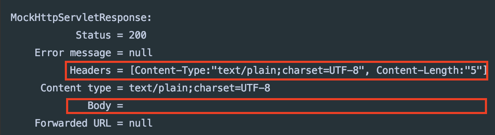
            
* (3) OPTIONS

    * `OPTIONS` 요청은 **사용 할 수 있는 HTTP Method를 제공한다.**
       
    * 서버 또는 특정 리소스가 제공하는 기능을 확인할 때 사용 할 수 있다.
      
    * 서버는 Allow 응답 헤더에 사용할 수 있는 `HTTP Method` 목록을 제공해야 한다.
    
    * 실습
    
        * ① 컨트롤러를 작성한다.
        
            ```java
            @Controller
            public class SampleController {
            
                @GetMapping("/hello")
                @ResponseBody
                public String hello(){
                    return "hello";
                }
            
                @PostMapping("/hello")
                @ResponseBody
                public String helloPost(){
                    return "hello";
                }
            
            }
            ```
          
        * ② 테스트 코드를 작성한다.
        
            ```java
            @RunWith(SpringRunner.class)
            @WebMvcTest
            public class SampleControllerTest {
            
                @Autowired
                MockMvc mockMvc;
            
                @Test
                public void helloTest() throws Exception {
                    mockMvc.perform(options("/hello"))
                            .andDo(print())
                            .andExpect(status().isOk());
                }
            
            }
            ```
          
        * ③ 테스트 결과를 보면 Allow 응답 헤더에서 `/hello`라는 리소스가 지원하는 `HTTP Method` 목록을 확인 할 수 있다.
         
            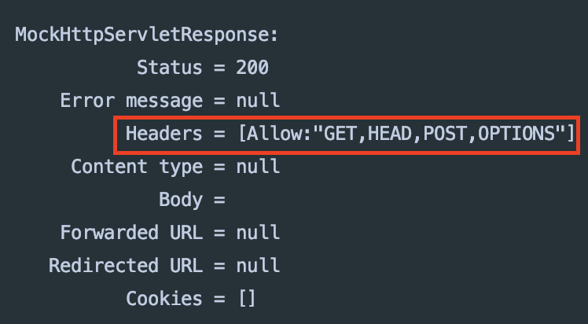
            
 * (4) 응답 헤더를 확인하는 방법
 
     * ① ALLOW 헤더가 있는지 확인하는 테스트 코드를 작성한다.
           
         ```java
         @RunWith(SpringRunner.class)
         @WebMvcTest
         public class SampleControllerTest {
         
             @Autowired
             MockMvc mockMvc;
         
             @Test
             public void helloTest() throws Exception {
                 mockMvc.perform(options("/hello"))
                         .andDo(print())
                         .andExpect(status().isOk())
                         .andExpect(header().exists(HttpHeaders.ALLOW)); // ALLOW 헤더가 있는지 확인
             }
         }
         ```

     * ② 순서에 상관 없이 ALLOW 헤더에 해당 HTTP 메서드가 있는지 확인하는 테스트 코드를 작성한다.
           
         ```java
         @RunWith(SpringRunner.class)
         @WebMvcTest
         public class SampleControllerTest {
         
             @Autowired
             MockMvc mockMvc;
         
             @Test
             public void helloTest() throws Exception {
                 mockMvc.perform(options("/hello"))
                         .andDo(print())
                         .andExpect(status().isOk())
                         .andExpect(header().stringValues(HttpHeaders.ALLOW,
                                 hasItems(
                                         containsString("GET"),
                                         containsString("POST"),
                                         containsString("HEAD"),
                                         containsString("OPTIONS")
                                         )))
                 ;
             }
         }
         ```
       
#### 7) HTTP 요청 맵핑하기 6부 : 커스텀 애노테이션

* (1) `@RequestMapping` 애노테이션을 메타 애노테이션으로 사용하기

    * `@GetMapping`과 같은 커스텀한 애노테이션을 만들 수 있다.

    * 실습
    
        * ① `@RequestMapping` 애노테이션을 메타 애노테이션으로 사용하여 커스텀 애노테이션을 만든다.
        
            * `@Retention`이 `RUNTIME`이 아니면 테스트에 실패하게 된다.
            
            * 클래스가 메모리에 로딩 될 때 해당 애노테이션 정보는 사라진다.
            
            * 하지만 스프링은 런타임 시, 디스패처 서블릿이 동작할 때 애노테이션 정보를 참고해야 한다. 그래서 RUNTIME 이어야 한다.
        
             ```java
             @Documented
             @Target(ElementType.METHOD)
             @Retention(RetentionPolicy.RUNTIME)
             @RequestMapping(method = RequestMethod.GET, value = "/hello")
             public @interface GetHelloMapping {
             }
             ```

        * ② 컨트롤러의 핸들러에 `@GetHelloMapping`를 사용한다.
               
             ```java
             @Controller
             public class SampleController {
             
                 @GetHelloMapping
                 @ResponseBody
                 public String hello(){
                     return "hello";
                 }
             
             }
             ```
          
        * ③ 테스트 코드를 실행한다.
               
             ```java
             @RunWith(SpringRunner.class)
             @WebMvcTest
             public class SampleControllerTest {
             
                 @Autowired
                 MockMvc mockMvc;
             
                 @Test
                 public void helloTest() throws Exception {
                     mockMvc.perform(get("/hello"))
                             .andDo(print())
                             .andExpect(status().isOk());
                 }
             }
             ```

* (2) 메타(Meta) 애노테이션

    * `메타 애노테이션`은 애노테이션을 만들 때 사용하는 애노테이션이다.

    * 스프링이 제공하는 대부분의 애노테이션은 메타 애노테이션으로 사용 할 수 있다.
    
* (3) 조합(Composed) 애노테이션

    * 조합 애노테이션은 한 개 혹은 여러 메타 애노테이션을 조합해서 만든 애노테이션이다.
      
        * Ex) `@GetMapping`

    * 코드를 간결하게 줄일 수 있다.
    
    * 보다 구체적인 의미를 부여할 수 있다.
    
* (4) `@Retention`
      
    * `@Retention`는 애노테이션이 유지되는 기간을 지정하는데 사용된다.

        * Source
        
            * 소스 코드까지만 유지된다.
        
            * 즉, 컴파일 하면 해당 애노테이션 정보는 사라진다.
    
        * Class
        
            * 컴파일까지 유지된다. (컴파일 한 `.class` 파일에도 유지)
    
            * 런타임 시, 클래스를 메모리로 읽어오면 해당 애노테이션 정보는 사라진다.
    
        * Runtime
        
            * 런타임까지 유지된다. 
            
                * 애플리케이션 구동 중에도 애노테이션 정보가 유지되도록 할 때 사용한다.
    
            * 실행 시에 리플렉션을 통해 클래스 파일에 저장된 애노테이션의 정보를 읽어서 처리 할 수 있다.
            
* (5) `@Target`
      
    * 해당 애노테이션이 적용 가능한 대상을 지정할 때 사용한다. 
    
* (6) `@Documented`
      
    * 애노테이션에 대한 정보가 `javadoc`으로 작성한 문서에 포함 되도록 한다.
    
#### 8) HTTP 요청 맵핑하기 7부 : 맵핑 연습문제

* 다음 요청을 처리할 수 있는 핸들러 메소드를 맵핑하는 `@RequestMapping` (또는 `@GetMapping`, `@PostMapping` 등)을 정의하세요.

    * ① `GET /events`
    
         ```java
         @Controller
         public class SampleController {
         
             @GetMapping("/events")
             @ResponseBody
             public String events(){
                 return "events";
             }
         
         }
         ```
      
    * ② `GET /events/1, GET /events/2, GET /events/3,` ...
    
         ```java
         @Controller
         public class SampleController {
         
             @GetMapping("/events/{id}") // {id} : 플레이스 홀더
             @ResponseBody
             public String getAnEvents(@PathVariable int id){
                 return "events";
             }
         
         }
         ```
      
    * ③ `POST /events` `CONTENT-TYPE: application/json` `ACCEPT: application/json`
    
         ```java
         @Controller
         public class SampleController {
         
             @PostMapping(
                         value = "/events",
                         consumes = MediaType.APPLICATION_JSON_UTF8_VALUE,
                         produces = MediaType.APPLICATION_JSON_UTF8_VALUE)
             @ResponseBody
             public String createEvent(){
                 return "events";
             }
         
         }
         ```
      
    * ④ `DELETE /events/1, DELETE /events/2, DELETE /events/3,` ...
       
         ```java
         @Controller
         public class SampleController {
         
             @DeleteMapping("/events/{id}")
             @ResponseBody
             public String removeAnEvents(@PathVariable int id){
                 return "events";
             }
         
         }
         ```
      
    * ⑤ 다음 내용을 참고하여 작성하세요.
    
        * `PUT /events/1` `CONTENT-TYPE: application/json` `ACCEPT: application/json`,
        
        * `PUT /events/2` `CONTENT-TYPE: application/json` `ACCEPT: application/json`, ...
        
         ```java
         @Controller
         public class SampleController {
         
             @PutMapping(
                     value = "/events/{id}",
                     consumes = MediaType.APPLICATION_JSON_UTF8_VALUE,
                     produces = MediaType.APPLICATION_JSON_UTF8_VALUE)
             @ResponseBody
             public String updateEvent(@PathVariable int id){
                 return "events";
             }
         
         }
         ```
      
* 연습문제에 대한 테스트 코드는 다음과 같다.

     ```java
     @RunWith(SpringRunner.class)
     @WebMvcTest
     public class SampleControllerTest {
     
         @Autowired
         MockMvc mockMvc;
     
         @Test
         public void getEvents() throws Exception {
             mockMvc.perform(get("/events"))
                     .andExpect(status().isOk());
         }
     
         @Test
         public void getEventsWithId() throws Exception {
             mockMvc.perform(get("/events/1"))
                     .andExpect(status().isOk());
             mockMvc.perform(get("/events/2"))
                     .andExpect(status().isOk());
             mockMvc.perform(get("/events/3"))
                     .andExpect(status().isOk());
         }
     
         @Test
         public void createEvent() throws Exception{
             mockMvc.perform(post("/events")
                         .contentType(MediaType.APPLICATION_JSON_UTF8)
                         .accept(MediaType.APPLICATION_JSON_UTF8))
                     .andExpect(status().isOk());
         }
     
         @Test
         public void deleteEvent() throws Exception{
             mockMvc.perform(delete("/events/1"))
                     .andExpect(status().isOk());
             mockMvc.perform(delete("/events/2"))
                     .andExpect(status().isOk());
             mockMvc.perform(delete("/events/3"))
                     .andExpect(status().isOk());
         }
     
         @Test
         public void updateEvent() throws Exception{
             mockMvc.perform(put("/events/1")
                     .contentType(MediaType.APPLICATION_JSON_UTF8)
                     .accept(MediaType.APPLICATION_JSON_UTF8))
                     .andExpect(status().isOk());
         }
     }
     ```
  
* `consumes`와 `produces` 옵션을 사용하는 핸들러 일부만 빼내어 클래스를 작성 할 수도 있다.

     ```java
     @Controller
     @RequestMapping(
             consumes = MediaType.APPLICATION_JSON_UTF8_VALUE,
             produces = MediaType.APPLICATION_JSON_UTF8_VALUE)
     public class EventUpdateController {
     
         @PutMapping("/events/{id}")
         @ResponseBody
         public String updateEvent(@PathVariable int id){
             return "events";
         }
     
         @PostMapping("/events")
         @ResponseBody
         public String createEvent(){
             return "events";
         }
     
     }
     ```
  
#### 9) 핸들러 메소드 1부 : 지원하는 메소드 아규먼트와 리턴 타입

* 핸들러 메소드 아규먼트는 주로 요청 그 자체 또는 요청에 들어있는 정보를 받아오는데 사용한다.

    * PushBuilder

        * 클라이언트가 어떤 URL로 요청을 하면 서버는 렌더링에 필요한 데이터를 클라이언트에게 전달한다.
    
        * 그리고 해당 URL의 뷰에서 사용하는 이미지가 있다면 클라이언트는 한번 더 서버에게 이미지를 요청하게 된다.
    
        * 그러나 PushBuilder를 사용하는 경우, 클라이언트가 어떤 URL로 요청을 하면 서버는 요청한 URL의 뷰에서 사용하는 리소스까지 한번에 응답하게 되므로 
        
        * 클라이언트와 서버 간의 연결을 맺는 Hop이 줄어든다.

    * https://docs.spring.io/spring-framework/docs/current/reference/html/web.html#mvc-ann-methods
        
* 핸들러 메소드 리턴은 주로 응답 또는 모델을 랜더링할 뷰에 대한 정보를 제공하는데 사용한다.

    * `@ResponseBody `: 핸들러의 리턴 값을 `HttpMessageConverter`를 사용해서 응답 본문에 작성한다.

    * https://docs.spring.io/spring-framework/docs/current/reference/html/web.html#mvc-ann-return-types

#### 10) 핸들러 메소드 2부 : URI 패턴

* (1) @PathVariable

    * `@PathVariable` : URI 템플릿 변수를 읽어올 때 사용한다.
        
        * URI 템플릿 변수명과 메소드 파라미터명이 같다면 따로 이름을 명시하지 않아도 된다.
        
        * 타입 변환 지원.
        
        * (기본)값이 반드시 있어야 한다.
        
        * Optional 지원.
    
    * 실습
    
        * ① 테스트 코드 작성

             ```java
             @RunWith(SpringRunner.class)
             @WebMvcTest
             public class SampleControllerTest {
             
                 @Autowired
                 MockMvc mockMvc;
             
                 @Test
                 public void getEvent() throws Exception {
                     mockMvc.perform(get("/events/1"))
                             .andDo(print())
                             .andExpect(status().isOk())
                             .andExpect(jsonPath("id").value(1));
                 }
             
             }
             ```

        * ② 컨트롤러 작성
        
             ```java
             @Controller
             public class SampleController {
             
                 @GetMapping("/events/{id}")
                 @ResponseBody
                 public Event getEvent(@PathVariable Integer id){
                     Event event = new Event();
                     event.setId(id);
                     return event;
                 }
             }
             ```
          
* (2) @MatrixVariable

    * `@MatrixVariable` : 요청 URI 경로에서 키/값 쌍의 데이터를 읽어올 때 사용한다.
            
        * 타입 변환 지원.
                 
        * (기본)값이 반드시 있어야 한다.
                
        * Optional 지원.
               
        * MatrixVariable은 기본적으로 비활성화 되어 있다. 그래서 활성화 하려면 다음과 같이 설정해야 한다.

             ```java
             @Configuration
             public class WebConfig implements WebMvcConfigurer {
                 @Override
                 public void configurePathMatch(PathMatchConfigurer configurer) {
                     UrlPathHelper urlPathHelper = new UrlPathHelper(); // UrlPathHelper 생성
                     urlPathHelper.setRemoveSemicolonContent(false); // UrlPathHelper가 세미콜론을 제거 하지 않도록 설정
                     configurer.setUrlPathHelper(urlPathHelper); // configurer에 urlPathHelper를 설정
                 }
             }
             ```
    
    * 실습
    
        * ① 테스트 코드 작성

             ```java
             @RunWith(SpringRunner.class)
             @WebMvcTest
             public class SampleControllerTest {
             
                 @Autowired
                 MockMvc mockMvc;
             
                 @Test
                 public void getEvent() throws Exception {
                     mockMvc.perform(get("/events/1;name=kevin"))
                             .andDo(print())
                             .andExpect(status().isOk())
                             .andExpect(jsonPath("id").value(1));
                 }
             
             }
             ```
          
        * ② 컨트롤러 작성
          
             ```java
             @Controller
             public class SampleController {
             
                 @GetMapping("/events/{id}")
                 @ResponseBody
                 public Event getEvent(@PathVariable Integer id, @MatrixVariable String name){
                     Event event = new Event();
                     event.setId(id);
                     event.setName(name);
                     return event;
                 }
             }
             ```
                  
#### 11) 핸들러 메소드 3부 : 요청 매개변수

* (1) 요청 매개변수란?

    * ① `쿼리 스트링(Query String)`

        * URL 주소 뒤에 `?key=value`의 형식으로 요청을 보내는 것을 말한다.
        
        * `쿼리 파라미터`라고도 한다.
    
            * `"http://localhost:8080/events?name=kevin"`

    * ② `폼 데이터(form-data)`

        * HTTP 요청 본문에 `key=value`의 형식으로 요청을 보내는 것을 말한다.

* (2) @RequestParam

    * `@RequestParam`는 요청 매개변수에 들어있는 단순 타입 데이터를 메소드 아규먼트로 받아올 때 사용한다.
    
        * `단순 타입` : 하나의 값을 말한다. Ex) String, Integer ...
        * `복합 타입` : 다른 타입들을 포함하고 있는 타입을 말한다. Ex) Event ...
    
    * 해당 애노테이션은 생략 할 수 있다. 하지만 헷갈릴 수 있기 때문에 생략하는 것은 권장 하고 싶지 않다.
    
    * `required` 속성의 기본 값은 `true` 이므로 값이 반드시 있어야 한다.
    
        * required = false로 설정한 다음, defaultValue 속성으로 기본 값을 지정 할 수도 있다.
        
        * `public Event getEvent(@RequestParam(required = false, defaultValue = "kevin") String name){}`
        
    * `String`이 아닌 값들은 타입 컨버전을 지원한다.
    
    * `Map<String, String>` 또는 `MultiValueMap<String, String>`에 사용해서 모든 요청 매개변수를 받아 올 수도 있다.

         ```java
         @Controller
         public class SampleController {
         
             @PostMapping("/events")
             @ResponseBody
             public Event getEvent(@RequestParam Map<String, String> params){
                 Event event = new Event();
                 event.setName(params.get("name"));
                 return event;
             }
         
         }
         ```
            
* (3) @RequestParam - 사용 예시
      
    * ① POST 요청으로 name을 받아서 Event에 설정을 한 다음, Event를 Json으로 반환한다.

         ```java
         @Controller
         public class SampleController {
         
             @PostMapping("/events")
             @ResponseBody
             public Event getEvent(@RequestParam String name){
                 Event event = new Event();
                 event.setName(name);
                 return event;
             }
             
         }
         ```
      
    * ② 쿼리 매개변수로 요청을 보내는 테스트 코드는 다음과 같이 작성한다.

         ```java
         @RunWith(SpringRunner.class)
         @WebMvcTest
         public class SampleControllerTest {
         
             @Autowired
             MockMvc mockMvc;
         
             @Test
             public void postEvent() throws Exception {
                 mockMvc.perform(post("/events?name=kevin"))
                         .andDo(print())
                         .andExpect(status().isOk())
                         .andExpect(jsonPath("name").value("kevin"));
             }
         
         }
         ```
      
    * ③ 폼 데이터로 요청을 보내는 테스트 코드는 다음과 같이 작성한다.

         ```java
         @RunWith(SpringRunner.class)
         @WebMvcTest
         public class SampleControllerTest {
         
             @Autowired
             MockMvc mockMvc;
         
             @Test
             public void postEvent() throws Exception {
                 mockMvc.perform(post("/events")
                             .param("name", "kevin"))
                         .andDo(print())
                         .andExpect(status().isOk())
                         .andExpect(jsonPath("name").value("kevin"));
             }
         
         }
         ```

#### 12) 핸들러 메소드 4부 : 폼 서브밋 (타임리프)

* (1) 폼을 보여줄 요청 처리

    * `GET /events/form`
    
    * 뷰: events/form.html
    
    * 모델: "event", new Event()

* (2) 타임리프
    
    * 실습

        * ① 컨트롤러 작성
        
             ```java
             @Controller
             public class SampleController {
             
                 @GetMapping("/events/form")
                 public String eventsForm(Model model){
                     Event newEvent = new Event();
                     newEvent.setLimit(50);
                     model.addAttribute("event", newEvent); // 모델에 "event"라는 이름으로 Event 객체를 저장
                     return "events/form"; // 뷰 이름 리턴
                 }
             
             }
             ```

        * ② 뷰 작성
        
            * `templates`에 `events`라는 디렉토리를 생성한 다음, 그 안에 `form.html` 파일을 생성한다.
            
                 ```html
                 <!DOCTYPE html>
                 <html lang="en" xmlns:th="http://www.thymeleaf.org">
                 <head>
                     <meta charset="UTF-8">
                     <title>Create New Title</title>
                 </head>
                 <body>
                 <form action="#" th:action="@{/events}" method="post" th:object="${event}">
                     <input type="text" title="name" th:field="*{name}"/>
                     <input type="text" title="limit" th:field="*{limit}"/>
                     <input type="submit" value="Create"/>
                 </form>
                 </body>
                 </html>
                 ```
              
                * 타임리프 파일은 `templates` 디렉토리에 위치해야 한다.
                
                * 타임리프는 서블릿 컨테이너가 없어도 렌더링을 할 수 있다는 장점이 있다.
                
                * 타임리프의 표현식
                
                    * `@{}`: 타임리프의 URL 표현식
    
                    * `${}`: variable 표현식 -> 모델 데이터를 참조할 때 사용
                
                    * `*{}`: selection 표현식

        * ③ 애플리케이션을 실행하고 웹 브라우저에서 값을 입력한 다음, submit을 하면 입력한 값이 Json으로 나타나는 것을 확인 할 수 있다.   
        
            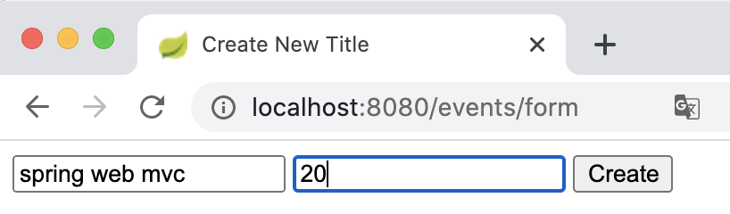
            
            
            
        * ④ 다음과 같은 테스트 코드로 테스트 할 수도 있다.  
        
             ```java
             @RunWith(SpringRunner.class)
             @WebMvcTest
             public class SampleControllerTest {
             
                 @Autowired
                 MockMvc mockMvc;
             
                 @Test
                 public void eventForm() throws Exception{
                     mockMvc.perform(get("/events/form"))
                             .andDo(print())
                             .andExpect(view().name("/events/form")) // 뷰 이름 확인하기
                             .andExpect(model().attributeExists("event")); // 모델에 해당 속성이 존재하는지 확인하기
                 }
                 
             }
             ```

* (3) 포스트맨(Postman)으로 테스트하기
    
    * ① 쿼리 스트링(Query String)
    
        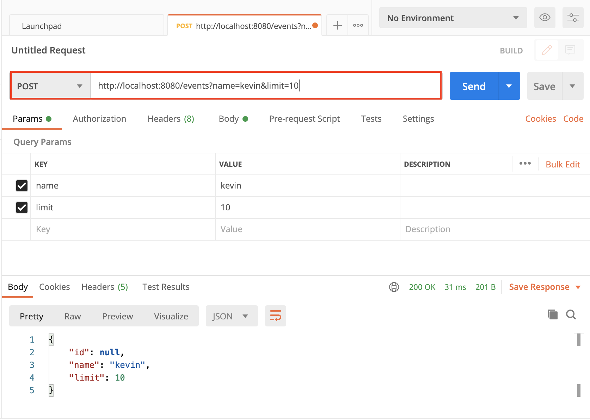

    * ② 폼 데이터(form-data)

        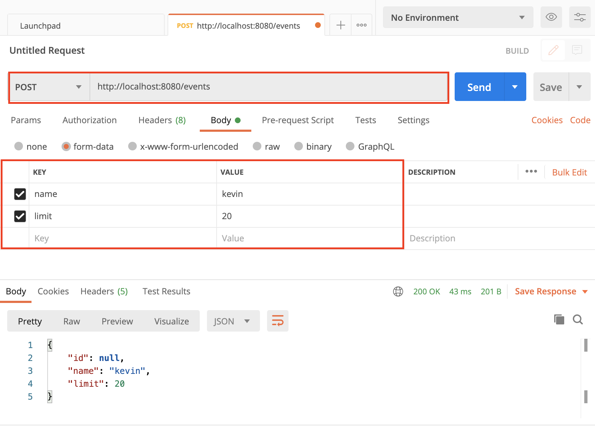   
       
#### 13) 핸들러 메소드 5부 : @ModelAttribute

* (1) @ModelAttribute

    * `@ModelAttribute`는 사용자가 요청 시 전달하는 값을 복합 타입 객체로 바인딩할 때 사용한다.
     
    * 해당 애노테이션은 생략 할 수 있다. 하지만 헷갈릴 수 있기 때문에 생략하는 것은 권장 하고 싶지 않다.

    * 첫 번째 코드 블럭의 내용을 두 번째 코드 블럭처럼 변경 할 수 있다.
    
         ```java
         @PostMapping("/events")
         @ResponseBody
         public Event getEvent(@RequestParam String name,
                               @RequestParam Integer limit){
             Event event = new Event();
             event.setName(name);
             event.setLimit(limit);
             return event;
         }
         ```
  
         ```java
         @PostMapping("/events")
         @ResponseBody
         public Event getEvent(@ModelAttribute Event event){
             return event;
         }
         ```

* (2) 값을 바인딩 할 수 없는 경우?

    * 값을 바인딩 할 수 없는 경우에는 `BindException`이 발생한다. (400 에러)
    
    * 좋은 방법은 아니지만 name은 URI 경로를 통해 받고 limit은 폼 데이터로 받는다고 가정한다.
    
        ```java
        @PostMapping("/events/name/{name}")
        @ResponseBody
        public Event getEvent(@ModelAttribute Event event){
          return event;
        }
        ```

    * 그리고 다음과 같은 테스트 코드를 작성한다.

        ```java
        @RunWith(SpringRunner.class)
        @WebMvcTest
        public class SampleControllerTest {
        
            @Autowired
            MockMvc mockMvc;
         
            @Test
            public void postEvent() throws Exception {
                mockMvc.perform(post("/events/name/kevin")
                            .param("limit", "kevinntech")) // 바인딩 에러가 발생하도록 Integer 타입이 아닌 값을 지정한다.
                        .andDo(print())
                        .andExpect(status().isOk())
                        .andExpect(jsonPath("name").value("kevin"));
            }
          
        }
        ```

* (3) 바인딩 에러를 직접 다루고 싶은 경우

    * `@ModelAttribute`를 지정한 매개변수의 바로 오른쪽에 `BindingResult` 타입의 매개변수를 선언한다.
           
    * 그러면 `BindException` 에러가 바로 발생하는 것이 아닌 bindingResult 매개변수에 바인딩과 관련된 에러가 저장되며 요청은 처리된다.
         
         ```java
         @Controller
         public class SampleController {
         
             @PostMapping("/events/name/{name}")
             @ResponseBody
             public Event getEvent(@ModelAttribute Event event, BindingResult bindingResult){
                 if(bindingResult.hasErrors()){
                     System.out.println("==========================");
                     bindingResult.getAllErrors().forEach(c -> {
                         System.out.println(c.toString());
                     });
                 }
                 return event;
             }
         
         }
         ```
      
    * 그리고 바인딩 에러가 발생했을 때, 폼 데이터를 그대로 저장하지 않고 해당 폼(Form)을 다시 보여주면서 입력 값 중에서 잘못된 값을 알려 줄 수도 있다.  

* (4) 바인딩 이후에 검증(Validation) 작업을 추가로 하고 싶은 경우

    * `@Valid` 또는 `@Validated` 애노테이션을 사용한다.
    
    * 실습
           
        * ① 핸들러에 `@Valid` 또는 `@Validated` 애노테이션을 사용한다.
        
            * 사용자가 요청 시 전달하는 값(-10)이 바인딩 된 다음, `@Valid`을 사용 하였으므로 유효성 검증(Validation)을 수행한다.
            
            * 유효성 검증(Validation)에 대한 에러도 BindingResult에 저장된다. 
          
             ```java
             @Controller
             public class SampleController {
             
                 @PostMapping("/events/name/{name}")
                 @ResponseBody
                 public Event getEvent(@Valid @ModelAttribute Event event, BindingResult bindingResult){
                     if(bindingResult.hasErrors()){
                         System.out.println("==========================");
                         bindingResult.getAllErrors().forEach(c -> {
                             System.out.println(c.toString());
                         });
                     }
                     return event;
                 }
             
             }
             ```
          
            * 즉, `BindingResult`에는 바인딩 에러와 유효성 검증(Validation) 에러가 저장된다. 
          
        * ② Event 클래스에 JSR-303 애노테이션 중 하나인 `@Min(0)`으로 limit이 최소 0 이상 이어야 한다고 지정한다.
        
             ```java
             public class Event {
             
                 private Integer id;
             
                 private String name;
             
                 @Min(0) // limit의 값은 최소 0 이상
                 private Integer limit;
             
                 ...
                 
             }
             ```
          
        * ③ 테스트 코드를 작성한다.
        
             ```java
             @RunWith(SpringRunner.class)
             @WebMvcTest
             public class SampleControllerTest {
             
                 @Autowired
                 MockMvc mockMvc;
             
                 @Test
                 public void postEvent() throws Exception {
                     mockMvc.perform(post("/events/name/kevin")
                                 .param("limit", "-10")) // 스터디 정원(limit)에 마이너스 값을 지정한다. 
                             .andDo(print())
                             .andExpect(status().isOk())
                             .andExpect(jsonPath("name").value("kevin"));
                 }
             
             }
             ```

#### 14) 핸들러 메소드 6부 : @Validated

* @Validated

    * 자바 스펙에 있는 `@Valid` 애노테이션은 그룹을 지정 할 수 없다.
          
    * 스프링이 제공하는 `@Validated`는 그룹 클래스를 설정할 수 있다.
    
        * `@Validated`만 사용하더라도 `@Valid`와 동일하게 검증이 된다.
    
             ```java
             public class Event {
             
                 interface ValidateLimit {}
                 interface ValidateName {}
             
                 private Integer id;
             
                 // 해당 애노테이션이 사용 되어야 하는 Validation 그룹으로 ValidateName를 지정한다. 
                 @NotBlank(groups = ValidateName.class)
                 private String name;
             
                 // 해당 애노테이션이 사용 되어야 하는 Validation 그룹으로 ValidateLimit를 지정한다. 
                 @Min(value = 0 , groups = ValidateLimit.class) // limit의 값은 최소 0 이상
                 private Integer limit;
             
                 ...
             }
             ```
              
             ```java
             @Controller
             public class SampleController {
             
                 // ValidateLimit이라는 그룹으로 검증 하도록 한다. 그러면 @NotBlank는 적용되지 않고 @Min만 적용된다.
                 @PostMapping("/events/name/{name}")
                 @ResponseBody
                 public Event getEvent(@Validated(Event.ValidateLimit.class) @ModelAttribute Event event , BindingResult bindingResult){
                     if(bindingResult.hasErrors()){
                         System.out.println("==========================");
                         bindingResult.getAllErrors().forEach(c -> {
                             System.out.println(c.toString());
                         });
                     }
                     return event;
                 }
             
             }
             ```
      
#### 15) 핸들러 메소드 7부 : 폼 서브밋 (에러 처리)

* **[목표]** 바인딩 에러가 발생했을 때, 폼 데이터를 그대로 저장하지 않고 해당 폼(Form)을 다시 보여주면서 입력 값 중에서 잘못된 값을 알려주고 제대로된 값이 들어온 경우에 처리한다. 

* (1) 바인딩 에러 발생 시 Model에 담기는 정보

    * Event (사용자로 부터 입력 받은 모델 데이터)
    
    * BindingResult.event (BindingResult라는 에러 정보)

* (2) 타임리프 사용 시 바인딩 에러를 보여주기

    * https://www.thymeleaf.org/doc/tutorials/2.1/thymeleafspring.html#field-errors

    * `<p th:if="${#fields.hasErrors('limit')}" th:errors="*{limit}">Incorrect date</p>`

* (3) Post / Redirect / Get 패턴

    * https://en.wikipedia.org/wiki/Post/Redirect/Get

    * Post 이후에 웹 브라우저를 새로고침(Refresh) 하더라도 중복된 폼 서브밋이 발생하지 않도록 하는 패턴

* (4) 타임리프 목록 보여주기

    * https://www.thymeleaf.org/doc/tutorials/2.1/thymeleafspring.html#listing-seed-starter-data

         ```html
         <a th:href="@{/events/form}">Create New Event</a> 
         <div th:unless="${#lists.isEmpty(eventList)}"> 
            <ul th:each="event: ${eventList}">
                <p th:text="${event.Name}">Event Name</p> 
            </ul>
         </div> 
         ```

* (5) 실습
      
    * ① 도메인 클래스를 수정한다.

         ```java
         public class Event {
         
             private Integer id;
         
             @NotBlank
             private String name;
         
             @Min(value = 0)
             private Integer limit;
         
             ...
         }
         ```
 
    * ② 컨트롤러를 작성한다.

         ```java
         @Controller
         public class SampleController {
         
             @PostMapping("/events")
             public String getEvent(@Validated @ModelAttribute Event event,
                                    BindingResult bindingResult){
                 // 에러가 있는 경우 Form을 다시 보여준다.
                 if(bindingResult.hasErrors()){
                     return "/event/form";
                 }
      
                 return "/event/list"; // 뷰 이름
             }
         
         }
         ```

    * ③ 컨트롤러에 대한 테스트 코드를 작성한다.

         ```java
         @RunWith(SpringRunner.class)
         @WebMvcTest
         public class SampleControllerTest {
         
             @Autowired
             MockMvc mockMvc;
         
             @Test
             public void eventForm() throws Exception{
                 mockMvc.perform(get("/events/form"))
                         .andDo(print())
                         .andExpect(view().name("/events/form"))
                         .andExpect(model().attributeExists("event"));
             }
         
             @Test
             public void postEvent() throws Exception {
                 mockMvc.perform(post("/events")
                             .param("name", "kevin")
                             .param("limit", "-10"))
                         .andDo(print())
                         .andExpect(status().isOk())
                         .andExpect(model().hasErrors()); // 바인딩 에러가 발생한 경우, 모델에 에러 정보가 담겨 있다.
             }
         
         }
         ```

    * ④ 뷰(`form.html`)를 다음과 같이 변경한다.

         ```html
         <!DOCTYPE html>
         <html lang="en" xmlns:th="http://www.thymeleaf.org">
         <head>
             <meta charset="UTF-8">
             <title>Create New Title</title>
         </head>
         <body>
         <form action="#" th:action="@{/events}" method="post" th:object="${event}">
             <p th:if="${#fields.hasErrors('limit')}" th:errors="*{limit}">Incorrect date</p>
             <p th:if="${#fields.hasErrors('name')}" th:errors="*{name}">Incorrect date</p>
             <input type="text" title="name" th:field="*{name}"/>
             <input type="text" title="limit" th:field="*{limit}"/>
             <input type="submit" value="Create"/>
         </form>
         </body>
         </html>
         ```

    * ⑤ 적절하지 않은 데이터를 입력하고 form 제출을 하면 다음과 같은 검증 에러 메시지를 확인 할 수 있다.

        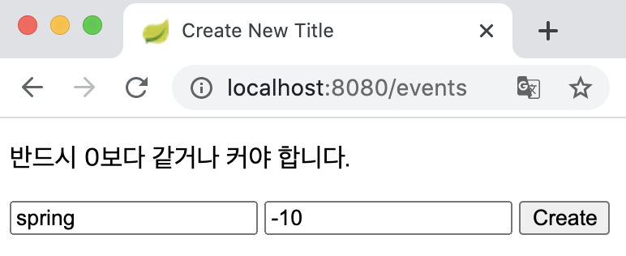
    
    * ⑥ 정상적으로 데이터가 입력 되었을 때, 목록을 보여주기 위한 `list.html`을 생성한다.

         ```html
         <!DOCTYPE html>
         <html lang="en" xmlns:th="http://www.thymeleaf.org">
         <head>
             <meta charset="UTF-8">
             <title>Event List</title>
         </head>
         <body>
         <a th:href="@{/events/form}">Create New Event</a>
         <div th:unless="${#lists.isEmpty(eventList)}">
             <ul th:each="event: ${eventList}">
                 <p th:text="${event.Name}">Event Name</p>
             </ul>
         </div>
         </body>
         </html>
         ```

    * ⑦ 컨트롤러의 코드를 다음과 같이 변경한다.
    
        * 컨트롤러에서 모델 정보를 설정하면 해당 정보를 가지고 뷰에서 렌더링 하게 된다.

             ```java
             @Controller
             public class SampleController {
             
                 @PostMapping("/events")
                 public String createEvent(@Validated @ModelAttribute Event event,
                                           BindingResult bindingResult,
                                           Model model){
                     if(bindingResult.hasErrors()){
                         return "/events/form";
                     }
                      
                     /* 이렇게 POST 요청을 처리 한 다음, 모델 정보를 주고 바로 뷰를 보여주면
                        목록 페이지를 갱신해서 보고 싶을 때, 새로고침을 하면 중복 폼 제출(POST)이 발생한다. */
                     List<Event> eventList = new ArrayList<>();
                     eventList.add(event);
                     model.addAttribute("eventList", eventList);
             
                     return "/events/list";
                 }
             
             }
             ```    

    * ⑧ 애플리케이션에서 실행하여 확인 해보자.

        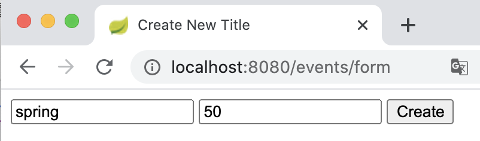

    * ⑨ `Post / Redirect / Get` 패턴을 적용한다.
    
         ```java
         @Controller
         public class SampleController {
         
             @PostMapping("/events")
             public String createEvent(@Validated @ModelAttribute Event event ,
                                       BindingResult bindingResult){
                 if(bindingResult.hasErrors()){
                     return "/events/form";
                 }
         
                 // 데이터베이스에서 save
         
                 return "redirect:/events/list"; // prefix를 사용하여 리다이렉트를 한다.
             }
         
             @GetMapping("/events/list")
             public String getEvents(Model model){
                 Event event = new Event();
                 event.setName("spring"); 
                 event.setLimit(10); // 해당 Event 객체는 데이터베이스에서 읽어 온 것으로 가정한다.
         
                 List<Event> eventList = new ArrayList<>();
                 eventList.add(event);
         
                 model.addAttribute("eventList", eventList);
                 // model.addAttribute(eventList); 로 작성 할 수도 있다.
         
                 return "/events/list";
             }
             
         }
         ```    
  
#### 16) 핸들러 메소드 8부: @SessionAttributes

* (1) HttpSession
    
    * `@SessionAttributes`를 사용하지 않고 핸들러 메소드에 `HttpSession`을 직접 사용할 수도 있다. 

* (2) @SessionAttributes

    * `@SessionAttributes`는 HTTP 세션에 모델 정보를 저장해주는 애노테이션이다.

        * 해당 애노테이션에 설정한 이름과 같은 모델 애트리뷰트를 자동으로 세션에 저장한다.
        
        * 여러 화면(또는 요청)에서 사용해야 하는 객체를 공유할 때 사용한다.
          
    * `@ModelAttribute`는 세션에 있는 데이터도 바인딩한다.
      
* (3) 실습 - HttpSession 사용하기

    * ① 컨트롤러를 작성한다.

         ```java
         @Controller
         public class SampleController {
         
             @GetMapping("/events/form")
             public String eventsForm(Model model, HttpSession httpSession){ // HttpSession을 직접 사용
                 Event newEvent = new Event();
                 newEvent.setLimit(50);
                 model.addAttribute("event", newEvent);
                 httpSession.setAttribute("event", newEvent); // 세션에 이벤트 저장
                 return "/events/form";
             }
         
         }
         ```

    * ② 테스트 코드를 작성한다.

         ```java
         @RunWith(SpringRunner.class)
         @WebMvcTest
         public class SampleControllerTest {
         
             @Autowired
             MockMvc mockMvc;
         
             @Test
             public void eventForm() throws Exception{
                 mockMvc.perform(get("/events/form"))
                         .andDo(print())
                         .andExpect(view().name("/events/form"))
                         .andExpect(model().attributeExists("event"))
                         .andExpect(request().sessionAttribute("event", notNullValue())); 
                          // sessionAttribute의 event가 notNullValue 인지 확인
             }
         
         }
         ```

    * ③ 세션에서 애트리뷰트를 직접 꺼내서 확인하도록 테스트 코드를 수정한다.
      
         ```java
         @RunWith(SpringRunner.class)
         @WebMvcTest
         public class SampleControllerTest {
         
             @Autowired
             MockMvc mockMvc;
         
             @Test
             public void eventForm() throws Exception{
                 MockHttpServletRequest request = mockMvc.perform(get("/events/form"))
                         .andDo(print())
                         .andExpect(view().name("/events/form"))
                         .andExpect(model().attributeExists("event"))
                         .andExpect(request().sessionAttribute("event", notNullValue()))
                         .andReturn().getRequest();
         
                 Object event = request.getSession().getAttribute("event");
                 System.out.println(event);
         
             }
         
         }
         ```

* (4) 실습 - @SessionAttributes 사용하기

    * `@SessionAttributes`에 설정한 이름과 같은 모델 애트리뷰트를 자동으로 세션에 저장한다.
    
         ```java
         @Controller
         @SessionAttributes("event")
         public class SampleController {
         
             @GetMapping("/events/form")
             public String eventsForm(Model model){
                 Event newEvent = new Event();
                 newEvent.setLimit(50);
                 model.addAttribute("event", newEvent);
                 return "/events/form";
             }
         
         }
         ```
      
* (5) 세션에 모델 애트리뷰트를 저장하는 이유는 무엇일까?
      
    * 여러 이유가 있겠지만 예를 들어보면 다음과 같다.
        
        * ① 장바구니에 있는 데이터는 여러 페이지에서 동일하게 유지 되어야 한다.
          
        * ② 또는 어떤 데이터를 생성할 때, 여러 페이지에 걸쳐서 만들어야 하는 경우가 있다.
          
            * 첫 번째 폼 입력 화면에서는 이름을 입력 받는다. 입력을 정상적으로 받았다면 그 다음 페이지에서는 limit을 입력 받고
             
            * 또 그 다음 페이지에서는 이름과 limit을 조합하여 Event를 만든다.
            
    * 즉, 세션에 모델 정보를 저장하면 모델을 재활용 할 수 있다.
      
* (6) `SessionStatus`를 사용해서 세션 처리 완료를 알려 줄 수 있다.
            
    * `sessionStatus.setComplete()` : 세션 처리가 완료 되었음을 알려주며 세션을 비울 때 사용한다.
    
    * 보통 `@SessionAttributes`를 사용 할 때는 `SessionStatus`를 같이 사용하여 세션 정리를 한다. 
    
         ```java
         @Controller
         @SessionAttributes("event")
         public class SampleController {
         
             @PostMapping("/events")
             public String createEvent(@Validated @ModelAttribute Event event ,
                                       BindingResult bindingResult,
                                       SessionStatus sessionStatus){
                 if(bindingResult.hasErrors()){
                     return "/events/form";
                 }
         
                 // 데이터베이스에서 save
                 
                 // 세션 처리를 완료 하였음을 알려준다.
                 sessionStatus.setComplete();
         
                 return "redirect:/events/list"; // prefix
             }
         
         }
         ```
      
#### 17) 핸들러 메소드 9부: 멀티 폼 서브밋

* 세션을 사용해서 여러 폼에 걸쳐 데이터를 나눠 입력 받고 저장하기

    * ① 컨트롤러를 작성한다.

         ```java
         @Controller
         @SessionAttributes("event")
         public class SampleController {
         
            /*
            * 1) form-name 화면을 보여준다.
            * */
             @GetMapping("/events/form/name")
             public String eventsFormName(Model model){
                 // 모델에 저장한 event 객체가 Session에 저장된다. 그 이유는 @SessionAttributes가 사용 되었기 때문이다.
                 model.addAttribute("event", new Event());
                 // 그리고 해당 뷰(form-name)에서 모델 객체를 사용한다.
                 return "/events/form-name"; 
             }

            /*
            * 2) form-name 화면에서 사용자가 이름(name)을 입력하고 제출한다면 해당 핸들러가 실행된다. 
            * */       
             @PostMapping("/events/form/name")
             public String eventsFormNameSubmit(@Validated @ModelAttribute Event event, // 세션에 저장 했던 객체에 이름이 설정된 다음, 여기로 들어온다.
                                                BindingResult bindingResult){ // 그 이유는 @ModelAttribute는 세션에 있는 정보도 바인딩 받기 때문이다. 
                 // 에러가 있다면 form-name 화면을 다시 보여준다.
                 if(bindingResult.hasErrors()){
                     return "/events/form-name"; 
                 }
         
                 // 에러가 없다면 limit을 입력 받는 뷰로 리다이렉트 한다.
                 return "redirect:/events/form/limit"; 
             }

            /*
            * 3) form-limit 화면을 보여준다.
            * */        
             @GetMapping("/events/form/limit")
             public String eventsFormLimit(@ModelAttribute Event event, Model model){
                 // @ModelAttribute로 세션에 저장된 객체를 그대로 가져와서 model에 담는다.
                 model.addAttribute("event", event);
                 // form-limit 화면을 보여준다. 
                 return "/events/form-limit"; 
             }

            /*
            * 4) form-limit 화면에서 limit을 입력하고 제출하면 해당 핸들러가 실행된다.
            * */          
             @PostMapping("/events/form/limit")
             public String eventsFormLimitSubmit(@Validated @ModelAttribute Event event,
                                                 BindingResult bindingResult,
                                                 SessionStatus sessionStatus){
                 // 문제가 있다면 form-limit 화면을 다시 보여준다.
                 if(bindingResult.hasErrors()){
                     return "/events/form-limit"; 
                 }
      
                 // 완료된 경우에 세션에서 모델 객체를 제거한다. 
                 // 그 다음, list 화면으로 리다이렉트 한다.
                 sessionStatus.setComplete(); 
                 return "redirect:/events/list";
             }

            /*
            * 5) list 화면을 보여준다.
            * */                
             @GetMapping("/events/list")
             public String getEvents(Model model){
                 Event event = new Event();
                 event.setName("spring");
                 event.setLimit(10);
         
                 List<Event> eventList = new ArrayList<>();
                 eventList.add(event);
         
                 model.addAttribute("eventList", eventList);
         
                 return "/events/list";
             }
         
         }
         ```    

    * ② `form-name.html`를 작성한다.

         ```html
         <!DOCTYPE html>
         <html lang="en" xmlns:th="http://www.thymeleaf.org">
         <head>
             <meta charset="UTF-8">
             <title>Create New Title</title>
         </head>
         <body>
         <form action="#" th:action="@{/events/form/name}" method="post" th:object="${event}">
             <p th:if="${#fields.hasErrors('name')}" th:errors="*{name}">Incorrect date</p>
             Name : <input type="text" title="name" th:field="*{name}"/>
             <input type="submit" value="Create"/>
         </form>
         </body>
         </html>
         ```  
   
    * ③ `form-limit.html`를 작성한다.
    
         ```html
         <!DOCTYPE html>
         <html lang="en" xmlns:th="http://www.thymeleaf.org">
         <head>
             <meta charset="UTF-8">
             <title>Create New Title</title>
         </head>
         <body>
         <form action="#" th:action="@{/events/form/limit}" method="post" th:object="${event}">
             <p th:if="${#fields.hasErrors('limit')}" th:errors="*{limit}">Incorrect date</p>
             Limit : <input type="text" title="limit" th:field="*{limit}"/>
             <input type="submit" value="Create"/>
         </form>
         </body>
         </html>
         ```  
      
#### 18) 핸들러 메소드 10부: @SessionAttribute

* (1) @SessionAttribute 

    * `@SessionAttribute`는 HTTP 세션에 들어있는 값을 참조 할 때 사용한다.

    * `HttpSession`을 사용하는 것에 비해 타입 컨버전을 자동으로 지원하기 때문에 조금 편리하다.
        
    * HTTP 세션에 데이터를 넣고 빼고 싶은 경우에는 `HttpSession`을 사용한다.

* (2) @SessionAttributes와는 다르다.

    * `@SessionAttributes`는 해당 컨트롤러 내에서만 동작한다.
      
        * 즉, 해당 컨트롤러 안에서 다루는 특정 모델 객체를 세션에 넣고 공유할 때 사용한다.
       
    * `@SessionAttribute`는 컨트롤러 밖(인터셉터 또는 필터 등)에서 만들어 준 세션 데이터에 접근할 때 사용한다.

* (3) 실습하기

    * ① 어떤 웹 사이트에 접속한 시간을 기록하는 인터셉터가 있다고 가정한다.

         ```java
         public class VisitTimeInterceptor implements HandlerInterceptor {
             @Override
             public boolean preHandle(HttpServletRequest request, HttpServletResponse response, Object handler) throws Exception {
                 HttpSession session = request.getSession(); // request에서 세션을 얻는다. 
         
                 if(session.getAttribute("visitTime") == null){ // 세션에 visitTime에 해당하는 것이 없다면
                     session.setAttribute("visitTime", LocalDateTime.now()); // 세션에 visitTime를 현재 서버 시각에 맞게 넣어준다.
                 }
         
                 return true; // 다음 핸들러나 인터셉터까지 요청 처리 되도록 한다.
             }
         }
         ``` 

    * ② `WebConfig`에 인터셉터를 등록한다.
    
        * 이제 모든 요청을 처리 할 때, 인터셉터가 사용 될 것이다. 

             ```java
             @Configuration
             public class WebConfig implements WebMvcConfigurer {
             
                 @Override
                 public void addInterceptors(InterceptorRegistry registry) {
                     registry.addInterceptor(new VisitTimeInterceptor());
                 }
                 
             }
             ```
    
    * ③ `@SessionAttribute`를 이용하여 컨트롤러 밖(인터셉터 또는 필터 등)에서 만들어 준 세션 데이터에 접근한다.

         ```java
         @Controller
         @SessionAttributes("event")
         public class SampleController {
         
             @GetMapping("/events/form/name")
             public String eventsFormName(Model model){
                 model.addAttribute("event", new Event());
                 return "/events/form-name"; 
             }
         
             @PostMapping("/events/form/name")
             public String eventsFormNameSubmit(@Validated @ModelAttribute Event event,
                                                BindingResult bindingResult){
                 if(bindingResult.hasErrors()){
                     return "/events/form-name";
                 }
         
                 return "redirect:/events/form/limit";
             }
         
             @GetMapping("/events/form/limit")
             public String eventsFormLimit(@ModelAttribute Event event, Model model){
                 model.addAttribute("event", event);
                 return "/events/form-limit";
             }
         
             @PostMapping("/events/form/limit")
             public String eventsFormLimitSubmit(@Validated @ModelAttribute Event event ,
                                                 BindingResult bindingResult,
                                                 SessionStatus sessionStatus){
                 if(bindingResult.hasErrors()){
                     return "/events/form-limit";
                 }
                 sessionStatus.setComplete();
                 return "redirect:/events/list";
             }
         
             @GetMapping("/events/list")
             public String getEvents(Model model, @SessionAttribute LocalDateTime visitTime){ // 세션에 저장한 접속 시간 데이터를 가져온다.
                 System.out.println(visitTime); // 그리고 가져온 데이터를 콘솔에 출력한다. 
                 Event event = new Event();
                 event.setName("spring");
                 event.setLimit(10);
         
                 List<Event> eventList = new ArrayList<>();
                 eventList.add(event);
         
                 model.addAttribute("eventList", eventList);
         
                 return "/events/list";
             }
         
         }
         ```

    * ④ 애플리케이션을 실행하여 결과를 확인한다. 
    
        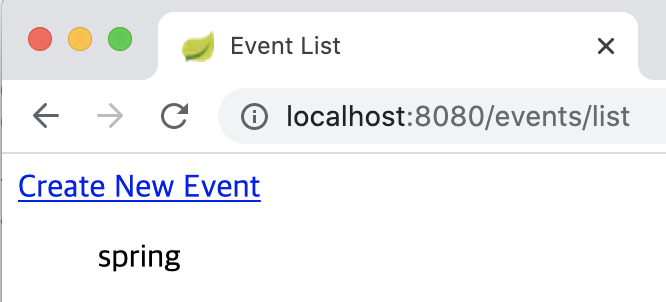   

        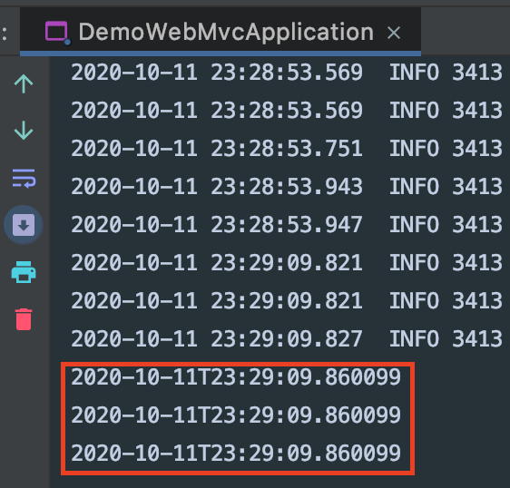

#### 19) 핸들러 메소드 11부: RedirectAttributes

* (1) 리다이렉트 시, 기본적으로 적용되는 기능

    * 리다이렉트를 할 때, Model에 들어있는 기본형(primitive type) 데이터는 기본적으로 URI 쿼리 매개변수에 추가된다.

        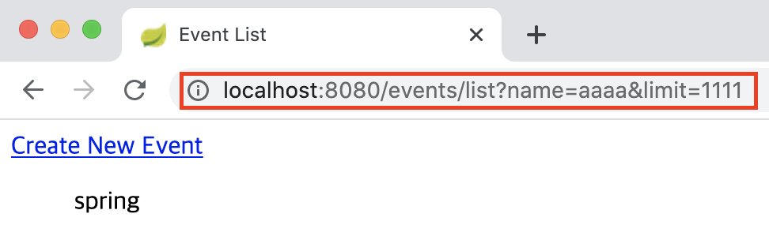
        
    * 스프링 웹 MVC만 사용 했을 때와는 달리 스프링 부트에서는 이 기능이 기본적으로 비활성화 되어 있다.
    
    * `Ignore-default-model-on-redirect` 프로퍼티를 사용해서 활성화 할 수 있다.
    
* (2) 실습 - 리다이렉트 시, 기본적으로 적용되는 기능

    * ① 컨트롤러를 작성한다.

         ```java
         @SessionAttributes("event")
         public class SampleController {
         
             ...
             
             @PostMapping("/events/form/limit")
             public String eventsFormLimitSubmit(@Validated @ModelAttribute Event event,
                                                 BindingResult bindingResult,
                                                 SessionStatus sessionStatus,
                                                 Model model){
                 if(bindingResult.hasErrors()){
                     return "/events/form-limit";
                 }
                 sessionStatus.setComplete();
      
                 // 모델에 2개의 데이터를 추가 한 다음, 리다이렉트를 한다. 
                 model.addAttribute("name", event.getName()); 
                 model.addAttribute("limit", event.getLimit());
                 return "redirect:/events/list";
             }
             
             ...
         
         }
         ```
      
    * ② application.properties 작성

         ```java
         spring.mvc.ignore-default-model-on-redirect=false
         ```
      
        * ignore-default-model-on-redirect 프로퍼티가 true이면 리다이렉트를 할 때, Model에 들어있는 primitive type 데이터는 URI 쿼리 매개변수에 추가되지 않음.

* (3) `RedirectAttributes`는 리다이렉트를 할 때, URI 쿼리 매개변수에 전달하고자 하는 데이터를 지정할 때 사용한다.
              
* (3) 실습 - RedirectAttributes 사용하기
    
    * ① 리다이렉트를 할 때, 원하는 값만 전달하고 싶다면 `RedirectAttributes`에 명시적으로 추가한다.
       
    * 그러면 `RedirectAttributes`에 명시적으로 추가한 것만 URI 쿼리 매개변수에 추가된다.
      
         ```java
         @Controller
         @SessionAttributes("event")
         public class SampleController {
         
             ...
         
             @PostMapping("/events/form/limit")
             public String eventsFormLimitSubmit(@Validated @ModelAttribute Event event ,
                                                 BindingResult bindingResult,
                                                 SessionStatus sessionStatus,
                                                 RedirectAttributes attributes){
                 if(bindingResult.hasErrors()){
                     return "/events/form-limit";
                 }
                 sessionStatus.setComplete();
                 attributes.addAttribute("name", event.getName());   // **
                 attributes.addAttribute("limit", event.getLimit()); // **
                 return "redirect:/events/list";
             }
         
             ...
         
         }
         ```

    * ② 리다이렉트 요청을 처리하는 곳에서는 쿼리 매개변수를 `@RequestParam` 또는 `@ModelAttribute`로 받을 수 있다.

        * `@RequestParam`으로 받는 경우 
      
             ```java
             @Controller
             @SessionAttributes("event")
             public class SampleController {
             
                 ...
                 
                 @GetMapping("/events/list")
                 public String getEvents(@RequestParam String name,	
                                         @RequestParam Integer limit,
                                         Model model,
                                         @SessionAttribute LocalDateTime visitTime){
                     System.out.println(visitTime);
             
                     Event newEvent = new Event();
                     newEvent.setName(name);
                     newEvent.setLimit(limit);
             
                     Event event = new Event();
                     event.setName("spring"); // 데이터베이스에서 읽어 왔다고 가정
                     event.setLimit(10);
             
                     List<Event> eventList = new ArrayList<>();
                     eventList.add(event);
                     eventList.add(newEvent);
             
                     model.addAttribute("eventList", eventList);
             
                     return "/events/list";
                 }
             
             }
             ```

        * `@ModelAttribute`로 받는 경우 
    
            * 주의해야 되는 것은 `@SessionAttributes`에 선언한 이름과 `@ModelAttribute`의 이름은 달라야 한다.
            
                * 즉, `@SessionAttributes("event")`과 `@ModelAttribute Event event`처럼 이름이 같으면 안된다.
                
            * 그 이유는 폼 서브밋을 완료한 이후, 세션을 비웠기 때문에 더 이상 `event`라는 이름의 객체는 세션에 없어서 에러가 발생하게 된다.
            
                * `@ModelAttribute("newEvent") Event event`처럼 다른 이름을 사용하자.
                
                * 또는 `sessionStatus.setComplete()`를 이후에 처리하는 방식으로도 해결 가능하다.
        
                 ```java
                 @Controller
                 @SessionAttributes("event")
                 public class SampleController {
                 
                     ...
                     
                     @PostMapping("/events/form/limit")
                     public String eventsFormLimitSubmit(@Validated @ModelAttribute Event event ,
                                                         BindingResult bindingResult,
                                                         SessionStatus sessionStatus,
                                                         RedirectAttributes attributes){
                         if(bindingResult.hasErrors()){
                             return "/events/form-limit";
                         }
                         sessionStatus.setComplete();
                         attributes.addAttribute("name", event.getName());
                         attributes.addAttribute("limit", event.getLimit());
                         return "redirect:/events/list";
                     }
                 
                     @GetMapping("/events/list")
                     public String getEvents(@ModelAttribute("newEvent") Event event, // 이름이 같으면 문제가 될 수 있는 부분
                                             Model model,
                                             @SessionAttribute LocalDateTime visitTime){
                         System.out.println(visitTime);
                 
                         Event spring = new Event();
                         spring.setName("spring");
                         spring.setLimit(10);
                 
                         List<Event> eventList = new ArrayList<>();
                         eventList.add(spring);
                         eventList.add(event);
                 
                         model.addAttribute("eventList", eventList);
                 
                         return "/events/list";
                     }
                 
                 }
                 ```
      
#### 20) 핸들러 메소드 12부: Flash Attributes

* (1) Flash Attributes

    * `Flash Attributes`는 주로 리다이렉트 시에 데이터를 전달할 때 사용한다.

        * HTTP 세션을 통해서 전달되기 때문에 데이터가 URI에 노출되지 않는다.
    
        * 임의의 객체를 저장할 수 있다.
    
    * 리다이렉트를 하기 전에 HTTP 세션에 데이터를 저장하고 리다이렉트 요청이 처리되면, 그 즉시 세션에서 데이터가 제거된다

    * `RedirectAttributes`를 통해 사용할 수 있다.

* (2) 실습

    * `RedirectAttributes`의 `addFlashAttribute()`로 저장한다. 

         ```java
         @Controller
         @SessionAttributes("event")
         public class SampleController {
         
             ...
         
             @PostMapping("/events/form/limit")
             public String eventsFormLimitSubmit(@Validated @ModelAttribute Event event ,
                                                 BindingResult bindingResult,
                                                 SessionStatus sessionStatus,
                                                 RedirectAttributes attributes){
                 if(bindingResult.hasErrors()){
                     return "/events/form-limit";
                 }
                 sessionStatus.setComplete();
                 attributes.addFlashAttribute("newEvent", event);
                 return "redirect:/events/list";
             }
         
             ...
         
         }
         ```
      
      * `Flash Attributes`로 전달한 값은 `@ModelAttribute`로 받을 수도 있지만, 사실 `Model`에 바로 들어오기 때문에 `Model`에 있는 것을 사용하면 된다.
  
           ```java
           @Controller
           @SessionAttributes("event")
           public class SampleController {
           
               ...
           
               @GetMapping("/events/list")
               public String getEvents(Model model,
                                       @SessionAttribute LocalDateTime visitTime){
                   System.out.println(visitTime);
           
                   Event spring = new Event();
                   spring.setName("spring");
                   spring.setLimit(10);
           
                   Event newEvent = (Event) model.asMap().get("newEvent"); // Model에서 꺼내서 사용
           
                   List<Event> eventList = new ArrayList<>();
                   eventList.add(spring);
                   eventList.add(newEvent);
           
                   model.addAttribute("eventList", eventList);
           
                   return "/events/list";
               }
           
           }
           ```
        
      * 테스트 코드를 작성한다.
  
           ```java
           @RunWith(SpringRunner.class)
           @WebMvcTest
           public class SampleControllerTest {
           
               @Autowired
               MockMvc mockMvc;
               
               @Test
               public void getEvents() throws Exception {
                   Event newEvent = new Event();
                   newEvent.setName("Winter is coming");
                   newEvent.setLimit(10000);
           
                   mockMvc.perform(get("/events/list")
                               .sessionAttr("visitTime", LocalDateTime.now())
                               .flashAttr("newEvent", newEvent))
                           .andDo(print())
                           .andExpect(status().isOk());
               }
           }
           ```

#### 21) 핸들러 메소드 13부: MultipartFile

* (1) 디스패처 서블릿 복습하기 

    * 디스패처 서블릿은 서블릿이므로 초기화 과정이 존재한다. 
    
    * 초기화를 할 때, 디스패처 서블릿이 사용 할 여러 가지 빈을 `ApplicationContext`에서 가져와서 설정한다.
    
    * 빈이 없는 경우에는 사용하지 않거나 기본 전략을 사용한다.

* (2) MultipartFile

    * `MultipartFile`는 파일 업로드 시 사용하는 메소드 아규먼트(Argument)이다.
    
        * `POST multipart/form-data` 요청에 들어있는 파일을 참조 할 수 있다.

        * `List<MultipartFile>` 아규먼트로 여러 파일을 참조 할 수도 있다.
        
    * `MultipartResolver` 빈이 등록 되어 있어야 사용 할 수 있다.

        * 스프링 부트의 자동 설정은 `MultipartResolver` 빈을 등록한다.

        * 따라서 스프링 부트 기반으로 웹 프로젝트를 만들었다면 아무런 설정을 하지 않아도 파일 업로드를 처리 할 수 있다.

* (3) 실습 - 파일 업로드

    * ① `templates/files` 디렉토리를 생성한다.
    
    * ② 파일 업로드 Form (`index.html`)을 만든다.
    
        ```html
        <form method="POST" enctype="multipart/form-data" action="#" th:action="@{/file}"> File: <input type="file" name="file"/>
        <input type="submit" value="Upload"/>
        </form>
        ```

    * ③ 파일 업로드를 처리하는 핸들러를 작성한다.
    
        ```java
        @Controller
        public class FileController {
        
           // "/file" 주소로 GET 요청을 하면 파일 업로드 Form을 보여준다.
           @GetMapping("/file")
           public String fileUploadForm(Model model){
               return "files/index";
           }

          /*
           * "/file" 주소로 POST 요청을 하면 해당 핸들러가 처리하게 된다.
           * @RequestParam를 사용하여 MultipartFile 타입으로 클라이언트가 전달한 파일을 받아온다.
           * HTML form의 name 속성과 핸들러의 매개변수명이 동일해야 한다. (다르다면 이름을 직접 명시해야 된다.)
           * */
           @PostMapping("/file")
           public String fileUpload(@RequestParam MultipartFile file,
                                    RedirectAttributes attributes){
               // 파일을 로컬 저장소(또는 클라우드 저장소)에 저장해야 하는데 그 부분은 생략하고 저장 되었다는 메시지만 표시한다. 
               String message = file.getOriginalFilename() + " is uploaded";
      
               // RedirectAttributes의 FlashAttribute로 넣는다.
               attributes.addFlashAttribute("message", message);
        
               return "redirect:/file"; // 리다이렉트를 하는데 "/file" 주소로 GET 요청을 한다.
           }
           
        }
        ```
           
    * ④ 파일 업로드 Form (`index.html`)에 아래 코드를 추가한 다음, 직접 애플리케이션을 실행하여 동작을 확인한다. 
    
        * message가 있다면 `<h2>`로 보여준다. 
    
            ```html
            <div th:if="${message}">
               <h2 th:text="${message}"/>
            </div>
            ```
           
    * ⑤ 테스트 코드를 작성한다.
    
        ```java
        @RunWith(SpringRunner.class)
        @SpringBootTest
        @AutoConfigureMockMvc
        public class FileControllerTest {
        
           @Autowired
           private MockMvc mockMvc;
        
           @Test
           public void fileUploadTest() throws Exception{
               // 테스트용 가짜 파일 객체(MockMultipartFile)를 만든다.  
               MockMultipartFile file = new MockMultipartFile(
                       "file", // multipart 폼의 name 속성 값
                       "test.txt",
                       "text/plain",
                       "hello file".getBytes()); // 파일에 들어가는 본문 
        
               // multipart 요청을 보내서 테스트하는 코드를 작성한다. 
               this.mockMvc.perform(multipart("/file").file(file)) 
                       .andDo(print())
                       .andExpect(status().is3xxRedirection());
           }
        }
        ```
           
#### 22) 핸들러 메소드 14부: ResponseEntity (파일 다운로드) 

* (1) 파일 리소스를 읽어오는 방법

    * 스프링 ResourceLoader 사용하기

* (2) 파일 다운로드 응답 헤더에 설정할 내용

    * Content-Disposition: 사용자가 해당 파일을 받을 때 사용할 파일 이름

    * Content-Type: 어떤 파일인가

    * Content-Length: 얼마나 큰 파일인가

* (3) 파일의 종류(미디어 타입) 알아내는 방법

    * http://tika.apache.org/

    * Mvn Repository에서 `tika`로 검색하여 찾은 의존성을 `pom.xml`에 추가한다.
    
        ```html
        <!-- https://mvnrepository.com/artifact/org.apache.tika/tika-core -->
        <dependency>
            <groupId>org.apache.tika</groupId>
            <artifactId>tika-core</artifactId>
            <version>1.20</version>
        </dependency>
        ```
      
* (4) ResponseEntity

    * `ResponseEntity`는 응답 상태 코드, 응답 헤더, 응답 본문을 설정 할 수 있는 리턴 타입이다.
    
* (5) 실습

    * resources에 파일 하나를 가져온다.

        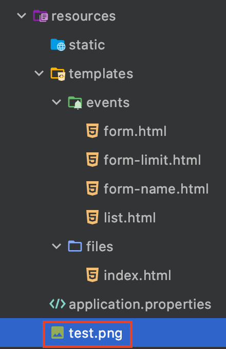
   
    * 기존에 작성한 `FileController`의 코드를 다음과 같이 수정한다. 

        ```java
        @Controller
        public class FileController {
        
            // 파일을 읽을 때는 ResourceLoader를 사용한다.
            @Autowired
            private ResourceLoader resourceLoader; 
        
            ...
        
            @GetMapping("/file/{filename}")
            public ResponseEntity<Resource> fileDownload(@PathVariable String filename) throws IOException {
                // resources 디렉토리 밑은 클래스패스이므로 클래스패스를 기준으로 파일을 읽어온다. 
                Resource resource = resourceLoader.getResource("classpath:" + filename);
                // Resource에서 파일을 꺼낸다. 
                File file = resource.getFile();
        
                /*
                * 응답 상태 코드를 200 OK으로 한다. 
                * 헤더에 CONTENT_DISPOSITION, CONTENT_TYPE, CONTENT_LENGTH를 지정한다.
                * */
                return ResponseEntity.ok()
                        .header(HttpHeaders.CONTENT_DISPOSITION,
                                "attachement; filename=\"" +
                                        resource.getFilename() + "\"")
                        .header(HttpHeaders.CONTENT_TYPE, "image/png")
                        .header(HttpHeaders.CONTENT_LENGTH, file.length() + "")
                        .body(resource);
            }
        
        }
        ```
     
        * `Content-Disposition`는 응답 본문을 브라우저가 어떻게 표시해야 할지 알려주는 헤더이다.
          
            * inline인 경우 웹 페이지 화면에 표시되고, attachment인 경우 다운로드가 된다.
          
            * filename 옵션으로 파일명까지 지정 해줄 수 있다.
          
        * `Content-Type`는 컨텐츠의 타입을 알려주는 헤더이다.
         
        * `CONTENT_LENGTH`는 요청 또는 응답 메시지의 본문 크기를 알려주는 헤더이다.
    
    * 다음과 같이 tika를 이용하여 파일 종류 알아낸 다음, CONTENT_TYPE 헤더에 설정한다. 
    
        ```java
        @Controller
        public class FileController {
            
            @Autowired
            private ResourceLoader resourceLoader;
        
            @GetMapping("/file")
            public String fileUploadForm(){
                return "files/index";
            }
        
            @GetMapping("/file/{filename}")
            public ResponseEntity<Resource> fileDownload(@PathVariable String filename) throws
                    IOException {
                Resource resource = resourceLoader.getResource("classpath:" + filename);
                File file = resource.getFile();
        
                Tika tika = new Tika(); // Tika를 빈으로 등록해서 재사용 할 수도 있다.
                String type = tika.detect(file); // detect()를 사용하면 미디어 타입을 알 수 있다.
        
                return ResponseEntity.ok()
                        .header(HttpHeaders.CONTENT_DISPOSITION,
                                "attachement; filename=\"" +
                                        resource.getFilename() + "\"")
                        .header(HttpHeaders.CONTENT_TYPE, type)
                        .header(HttpHeaders.CONTENT_LENGTH, String.valueOf(file.length()))
                        .body(resource);
            }
        
        }
        ```
      
#### 23) 핸들러 메소드 15부: @RequestBody & HttpEntity

* (1) @RequestBody

    * `@RequestBody`는 요청 본문(body)에 들어있는 데이터를 `HttpMessageConveter`를 통해 변환한 객체로 받아올 수 있다.

    * `@Valid` 또는 `@Validated`를 사용해서 값을 검증 할 수 있다.

    * BindingResult 아규먼트를 사용해서 바인딩 또는 검증 에러를 확인할 수 있다.

* (2) HttpMessageConverter

    * 스프링 MVC 설정 (WebMvcConfigurer)에서 `HttpMessageConverter`를 설정할 수 있다.

    * `configureMessageConverters()` : 기본 메시지 컨버터를 대체한다. (가급적 사용하지 말 것)

    * `extendMessageConverters()` : 메시지 컨버터를 추가한다.

* (3) 실습 - @RequestBody 사용하기

    * 기존의 SampleController를 EventController로 이름을 변경한다. (+ 테스트 코드)

    * EventApi를 작성한다. 
    
        ```java
        @RestController
        @RequestMapping("/api/events")
        public class EventApi {
        
            // @RequestBody는 요청 본문(body)에 들어있는 데이터를 Event로 변환해서 받아온다. 
            @PostMapping
            public Event createEvent(@RequestBody Event event){
                // 데이터베이스와 연결된 리포지토리에 이벤트를 저장한다. 
                return event;
            }
        
        }
        ```

    * 테스트 코드를 작성한다. 
    
        ```java
        @RunWith(SpringRunner.class)
        @SpringBootTest
        @AutoConfigureMockMvc
        public class EventApiTest {
        
            @Autowired
            ObjectMapper objectMapper;
        
            @Autowired
            MockMvc mockMvc;
        
            @Test
            public void createEvent() throws Exception {
                // 요청 본문에 넣을 이벤트 객체 만들기
                Event event = new Event();
                event.setName("kevin");
                event.setLimit(20);
              
                // writeValueAsString()를 사용하여 객체를 JSON 문자열로 변환한다.
                String json = objectMapper.writeValueAsString(event);
        
                mockMvc.perform(post("/api/events")
                            .contentType(MediaType.APPLICATION_JSON_UTF8)
                            .content(json))
                        .andDo(print())
                        .andExpect(status().isOk())
                        .andExpect(jsonPath("name").value("kevin"))
                        .andExpect(jsonPath("limit").value(20));
            }
        }
        ```
            
* (4) HttpEntity

    * `HttpEntity`는 HTTP 헤더와 본문 정보에 접근할 때 사용한다.
    
        ```java
        @RestController
        @RequestMapping("/api/events")
        public class EventApi {
        
            @PostMapping
            public Event createEvent(HttpEntity<Event> request){
                // save event
                MediaType contentType = request.getHeaders().getContentType();
                System.out.println(contentType);
                return request.getBody();
            }
        
        }
        ```

* (5) 실습 - `@Valid` 또는 `@Validated`과 `BindingResult` 아규먼트 사용하기 

    * `@Valid` 또는 `@Validated`를 사용해서 값을 검증 할 수 있다. 
    
    * 그리고 `BindingResult`를 사용해서 바인딩 또는 검증 에러를 확인할 수 있다.
       
        ```java
        @RestController
        @RequestMapping("/api/events")
        public class EventApi {
        
            @PostMapping
            public Event createEvent(@Valid @RequestBody Event event,
                                     BindingResult bindingResult){
                // save event
                if(bindingResult.hasErrors()){
                    bindingResult.getAllErrors().forEach(error -> {
                        System.out.println(error);
                    });
                }
                
                return event;
            }
        
        }
        ```

    * 테스트 코드를 다음과 같이 변경한다.
    
        ```java
        @RunWith(SpringRunner.class)
        @SpringBootTest
        @AutoConfigureMockMvc
        public class EventApiTest {
        
            @Autowired
            ObjectMapper objectMapper;
        
            @Autowired
            MockMvc mockMvc;
        
            @Test
            public void createEvent() throws Exception {
                // 요청 본문에 넣을 이벤트 객체 만들기
                Event event = new Event();
                event.setName("kevin");
                event.setLimit(-20);
        
                String json = objectMapper.writeValueAsString(event);// writeValueAsString()를 사용하여 객체를 JSON 문자열로 변환
        
                mockMvc.perform(post("/api/events")
                            .contentType(MediaType.APPLICATION_JSON_UTF8)
                            .content(json))
                        .andDo(print())
                        .andExpect(status().isOk())
                        .andExpect(jsonPath("name").value("kevin"))
                        .andExpect(jsonPath("limit").value(-20));
            }
        }
        ```

#### 24) 핸들러 메소드 16부: @ResponseBody & ResponseEntity

* (1) @ResponseBody

    * `@ResponseBody`는 핸들러가 리턴하는 값을 `HttpMessageConverter`를 사용해 응답 본문 메시지로 보낼 때 사용한다.
    
    * `@RestController` 사용 시 자동으로 모든 핸들러 메소드에 `@ResponseBody`이 적용된다.

* (2) ResponseEntity

    * `ResponseEntity`는 응답 헤더, 본문, 상태 코드를 직접 다루고 싶은 경우에 사용한다.

* (3) 실습

    * 컨트롤러를 작성한다.
    
        ```java
        @Controller
        @RequestMapping("/api/events")
        public class EventApi {
        
            @PostMapping
            public ResponseEntity<Event> createEvent(@Valid @RequestBody Event event,
                                              BindingResult bindingResult){
                // save event
                if(bindingResult.hasErrors()){
                    return ResponseEntity.badRequest().build();
                }
        
                return ResponseEntity.ok().body(event);
            }
        
        }
        ```
      
    * 테스트 코드를 작성한다.
    
        ```java
        @RunWith(SpringRunner.class)
        @SpringBootTest
        @AutoConfigureMockMvc
        public class EventApiTest {
        
            @Autowired
            ObjectMapper objectMapper;
        
            @Autowired
            MockMvc mockMvc;
        
            @Test
            public void createEvent() throws Exception {
                // 요청 본문에 넣을 이벤트 객체 만들기
                Event event = new Event();
                event.setName("kevin");
                event.setLimit(-20);
        
                String json = objectMapper.writeValueAsString(event);
        
                mockMvc.perform(post("/api/events")
                            .contentType(MediaType.APPLICATION_JSON_UTF8)
                            .content(json))
                        .andDo(print())
                        .andExpect(status().isBadRequest());
            }
        }
        ```
      
#### 25) 핸들러 메소드 17부: 정리

* (1) 다루지 못한 내용

    * @JsonView : https://www.youtube.com/watch?v=5QyXswB_Usg&t=188s
              
    * PushBuilder : HTTP/2, 스프링 5
        
* (2) 과제
      
    * 프로젝트 코드 분석 : https://github.com/spring-projects/spring-petclinic

    * 컨트롤러 코드 위주로 분석하자.
        
* (3) Octotree 크롬 플러그인

    * `Octotree` 크롬 플러그인을 사용하면 GitHub 저장소를 트리 구조로 볼 수 있다.

#### 26) 모델: @ModelAttribute 또 다른 사용법

* (1) `Model`과 `ModelMap`

    * `Model`이나 `ModelMap`이라는 메소드 아규먼트를 사용해서 모델 정보를 담을 수 있다.
    
    * 그리고 그 모델 정보를 뷰에서 참조해서 렌더링 하게 되는 것이다.

* (2) @ModelAttribute의 사용방법

    * `@RequestMapping`을 사용한 핸들러 메소드의 아규먼트에 사용하기 `[이전에 공부했던 내용]`
    
    * `@Controller` 또는 `@ControllerAdvice`를 사용한 클래스에서 공통적으로 사용하는 모델 정보를 정의 할 때 사용한다.

    * `@RequestMapping`과 같이 사용하면 해당 메소드에서 리턴하는 객체를 모델에 넣어준다. `자주 사용되는 기능 X`  
      
        * `RequestToViewNameTranslator`가 요청의 이름과 일치하는 뷰 이름을 리턴한다.
        
            ```java
            @GetMapping("/events/form/name")
            @ModelAttribute // 해당 애노테이션은 생략 가능
            public Event eventsFormName(){
                return new Event();
            }
            ```

* (3) @ModelAttribute의 또 다른 사용법 - 공통적으로 사용하는 모델 정보를 초기화

    * 컨트롤러를 변경한다.
    
        ```java
        @Controller
        @SessionAttributes("event")
        public class EventController {
          
            /* 모든 요청에 카테고리 정보를 전달하고 싶다면 해당 메소드에 @ModelAttribute를 붙이고 Model 또는 ModelMap에 addAttribute()로 넣는다.  */
            @ModelAttribute
            public void categories(Model model) {
                model.addAttribute("categories", List.of("study", "seminar", "hobby", "social"));
            }
        
        	...
        
        }
        ```
      
    * 테스트 코드를 변경한다. 
      
        ```java
        @RunWith(SpringRunner.class)
        @WebMvcTest
        public class EventControllerTest {
        
            @Autowired
            MockMvc mockMvc;
        
            ...
        
            @Test
            public void getEvents() throws Exception {
                Event newEvent = new Event();
                newEvent.setName("Winter is coming");
                newEvent.setLimit(10000);
        
                mockMvc.perform(get("/events/list")
                            .sessionAttr("visitTime", LocalDateTime.now())
                            .flashAttr("newEvent", newEvent))
                        .andDo(print())
                        .andExpect(status().isOk())
                        .andExpect(model().attributeExists("categories"))
                        .andExpect(xpath("//p").nodeCount(2));
            }
        }
        ```
            
#### 27) DataBinder: @InitBinder

* (1) @InitBinder

    * `@InitBinder`는 특정 컨트롤러에서 바인딩 또는 검증 설정을 변경하고 싶을 때 사용한다.

* (2) 실습 - @InitBinder 사용하기 

    * `@InitBinder`를 사용한다.
    
        * 메서드 리턴 타입은 `void`여야 하며 메서드명은 임의로 정해도 된다.
        
        * 그리고 WebDataBinder라는 파라미터를 사용해야 한다.
    
        ```java
        @InitBinder
        public void initEventBinder(WebDataBinder webDataBinder){
            webDataBinder.setDisallowedFields("id"); // 바인딩을 하고 싶지 않은 필드를 지정한다.
        }
        ```
      
    * `form-name.html`를 수정한다.
       
        ```html
        <!DOCTYPE html>
        <html lang="en" xmlns:th="http://www.thymeleaf.org">
        <head>
            <meta charset="UTF-8">
            <title>Create New Title</title>
        </head>
        <body>
        <form action="#" th:action="@{/events/form/name}" method="post" th:object="${event}">
            <p th:if="${#fields.hasErrors('name')}" th:errors="*{name}">Incorrect date</p>
            Id : <input type="text" title="id" th:field="*{id}"/>
            Name : <input type="text" title="name" th:field="*{name}"/>
            <input type="submit" value="Create"/>
        </form>
        </body>
        </html>
        ```

    * 폼에서 id 값을 입력하더라도 id가 바인딩 되지 않는 것을 확인 할 수 있다. 
      
* (3) 바인딩 설정
    
    * `webDataBinder.setDisallowedFields()` : 바인딩을 하고 싶지 않은 필드를 지정한다.

    * `webDataBinder.setAllowedFields() `: 바인딩을 하고 싶은 필드를 지정한다.
        
* (4) 포매터 설정
    
    * `webDataBinder.addCustomFormatter();`
        
* (5) Validator 설정
    
    * `webDataBinder.addValidators();`

    * 실습
    
        * EventValidator를 만든다.
           
            ```java
            public class EventValidator implements Validator {
            
                @Override
                public boolean supports(Class<?> clazz) {
                    return Event.class.isAssignableFrom(clazz);
                }
            
                @Override
                public void validate(Object target, Errors errors) {
                    Event event = (Event) target;
                      
                    // 이름이 aaa이면 값을 거부한다. (허용하지 않는다.)
                    if(event.getName().equalsIgnoreCase("aaa")){
                        errors.rejectValue("name", "wrongValue", "the value is not allowed");
                    }
                }
            
            }
            ```
          
        * webDataBinder에 Validator를 등록한다.
          
            ```java
            @InitBinder
            public void initEventBinder(WebDataBinder webDataBinder){
                webDataBinder.setDisallowedFields("id"); // 바인딩을 하고 싶지 않은 필드를 지정한다.
                webDataBinder.addValidators(new EventValidator());
            }
            ```
      
* (6) 특정 모델 객체에만 바인딩 또는 Validator 설정을 적용하고 싶을 때 사용 할 수 있다. 
    
    * `@InitBinder("event")` : 지정된 이름에 해당하는 모델 애트리뷰트를 바인딩 할 때, 어떠한 설정을 적용 할 수 있다.
    
        * 특정 필드는 바인딩 되지 않도록 하거나 Validator를 설정 할 수 있다. 
          
#### 28) 예외 처리 핸들러: @ExceptionHandler

* (1) `@ExceptionHandler`는 특정 예외를 처리하는 핸들러를 정의한다.

    * 지원하는 메소드 아규먼트 (해당 예외 객체, 핸들러 객체, ...)
    
    * 지원하는 리턴 값
    
    * `REST API`의 경우 응답 본문에 에러에 대한 정보를 담아주고, 상태 코드를 설정하려면 `ResponseEntity`를 주로 사용한다.
    
* (2) 실습

    * 커스텀한 예외 클래스를 정의한다.
    
        ```java
        public class EventException extends RuntimeException{
        }
        ```
      
    * 예외 처리 핸들러를 정의한 다음, 예외를 발생 시키는 코드를 작성한다.
    
        * 예외가 발생하면 @ExceptionHandler에서 예외를 처리하는데 이때, error 뷰를 보여준다. 
    
            ```java
            @Controller
            @SessionAttributes("event")
            public class EventController {
            
                @ExceptionHandler
                public String eventErrorHandler(EventException exception, // 처리하고 싶은 예외를 메소드 아규먼트로 선언한다. 
                                                Model model){
                    model.addAttribute("message", "event error");
                    return "error"; // 에러 페이지를 보여준다. 
                }
            
                ...
            
                @GetMapping("/events/form/name")
                public String eventsFormName(Model model){ 
                    throw new EventException(); // 예외를 발생시킨다. 
                }
            
                ...
            
            }
            ```
      
    * 에러 페이지(`error.html`)를 작성한다.
    
        ```html
        <!DOCTYPE html>
        <html lang="en" xmlns:th="http://www.thymeleaf.org">
        <head>
            <meta charset="UTF-8">
            <title>Error</title>
        </head>
        <body>
        
        <div th:if="${message}">
            <h2 th:text="${message}"/>
        </div>
        
        </body>
        </html>
        ```

#### 29) 전역 컨트롤러: @(Rest)ControllerAdvice

* (1) `@(Rest)ControllerAdvice`는 예외 처리, 바인딩 설정, 모델 객체 정보 설정을 모든 컨트롤러에 적용하고 싶은 경우에 사용한다.
    
    * @ExceptionHandler

    * @InitBinder

    * @ModelAttribute
      
* (2) 적용 범위를 지정 할 수도 있다.
    
    * 특정 애노테이션을 가지고 있는 컨트롤러에만 적용하기
    
        ```java
        @ControllerAdvice(annotations = RestController.class)
        ```
      
    * 특정 패키지 이하의 컨트롤러에만 적용하기
    
        ```java
        @ControllerAdvice("org.example.controllers")
        ```
      
    * 특정 클래스 타입에만 적용하기
    
        ```java
        @ControllerAdvice(assignableTypes = {EventController.class, EventApi.class})
        ```

* (3) 실습

    ```java
    @ControllerAdvice
    public class BaseController {
    
        @ExceptionHandler
        public String eventErrorHandler(EventException exception,
                                        Model model){
            model.addAttribute("message", "event error");
            return "error";
        }
    
        @InitBinder
        public void initEventBinder(WebDataBinder webDataBinder){
            webDataBinder.setDisallowedFields("id"); // 바인딩을 하고 싶지 않은 필드를 지정한다.
            webDataBinder.addValidators(new EventValidator());
        }
    
        @ModelAttribute
        public void categories(Model model) {
            model.addAttribute("categories", List.of("study", "seminar", "hobby", "social"));
        }
        
    }
    ```

    
