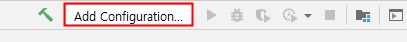
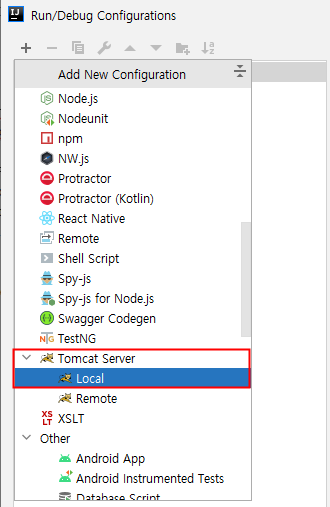

# 백기선님의 스프링 웹 MVC
> 아래 내용은 [스프링 웹 MVC](https://www.inflearn.com/course/%EC%9B%B9-mvc# "스프링 웹 MVC") 강좌를 정리한 내용 입니다.

## 1. 스프링 MVC 동작 원리

#### 1) 스프링 MVC 소개

* (1) 롬복(Lombok)

    * 롬복(Lombok)은 자바로 개발할 때, 자주 사용하는 코드(Getter, Setter, 기본 생성자, toString 등)를 애노테이션으로 자동 생성 해준다.
    
    * 롬복 설치 과정
    
        * ① 롬복 의존성 추가하기
    
            ```html
            <dependency>
                <groupId>org.projectlombok</groupId>
                <artifactId>lombok</artifactId>
                <version>1.16.20</version>
                <scope>provided</scope>
            </dependency>
            ```
          
         * ② 롬복 플러그인 설치하기
         
            * 롬복(Lombok) 플러그인을 Install 한 다음, 인텔리제이를 재 시작 해야 한다.
                
            
                
         * ③ `Enable annotation processing`을 체크한다.       
    
            
     
          * ④ 지금부터 해당 프로젝트에서 롬복을 사용 할 수 있다.
          
    * 자주 사용하는 롬복 애노테이션
    
        * `@Getter` : getter 메서드를 자동 생성한다.
        * `@Setter` : setter 메서드를 자동 생성한다.
        * `@NoArgsConstructor` : 매개변수가 없는 생성자(기본 생성자)를 자동 생성한다.
        * `@AllArgsConstructor` : 모든 필드 값을 매개변수로 받는 생성자를 자동 생성한다.
        * `@RequiredArgsConstructor` : `final`이나 `@NonNull`인 필드 값만 매개변수로 받는 생성자를 자동 생성한다.
        * `@ToString` : toString() 메서드를 자동 생성한다. exclude 속성을 사용하여 특정 필드를 결과에서 제외 시킬 수 있다.
        * `@EqualsAndHashCode` : equals()와 hashCode() 메서드를 자동 생성한다.
        * `@Data` : `@Getter`, `@Setter`, `@RequiredArgsConstructor`, `@ToString`, `@EqualsAndHashCode`를 한꺼번에 설정한다.
        * `@Builder` : 빌더 패턴을 사용 할 수 있도록 한다.

* (2) MVC 란?
    
    * 모델(Model)
    
        * 화면에 전달 할 또는 화면에서 전달 받은 데이터를 담고 있는 객체이다.
    
        * 도메인 객체 또는 DTO를 말한다.
    
    * 뷰(View)
    
        * 모델이 담고 있는 데이터를 보여주는 역할을 한다.
    
        * 다양한 형태로 보여 줄 수 있다. (HTML, JSON, XML ...)
    
    * 컨트롤러(Controller)
    
        * 사용자의 입력을 받아 모델 객체의 데이터를 변경하거나 모델 객체를 뷰에 전달하는 역할을 한다.
    
            * ① 입력 값 검증
        
            * ② 입력 받은 데이터로 모델 객체를 변경
        
            * ③ 변경된 모델 객체를 뷰에 전달
    
* (3) Spring MVC
    
    * `Spring MVC`는 서블릿 기반의 웹 애플리케이션을 개발할 때, MVC 패턴을 쉽게 사용 할 수 있도록 도와주는 프레임워크이다.
    
* (4) 실습
    
    * ① 프로젝트 생성
    
        
        
    * ② 컨트롤러(Controller) 작성
    
        ```java
        @Controller
        public class EventController {
        
            // "/events" GET 요청이 들어오면 처리 할 핸들러 지정
            // @RequestMapping(value = "/events" , method = RequestMethod.GET)
            @GetMapping("/events")
            public String events(Model model){
                return "events";
            }
        }
        ```
      
    * ③ 모델(Model) 작성
    
        ```java
        @Getter @Setter
        @Builder @NoArgsConstructor @AllArgsConstructor
        public class Event {
        
            private String name;
        
            private int limitOfEnrollment;
        
            private LocalDateTime startDateTime;
        
            private LocalDateTime endDateTime;
        }
        ```
       
    * ④ 서비스 작성
    
        ```java
        @Service
        public class EventService {
        
            public List<Event> getEvents(){
            	// Event 생성
                Event event1 = Event.builder()
                        .name("스프링 웹 MVC 스터디 1차")
                        .limitOfEnrollment(5)
                        .startDateTime(LocalDateTime.of(2019, 1, 10, 10, 0))
                        .endDateTime(LocalDateTime.of(2019, 1, 10, 12, 0))
                        .build();
        
                Event event2 = Event.builder()
                        .name("스프링 웹 MVC 스터디 2")
                        .limitOfEnrollment(5)
                        .startDateTime(LocalDateTime.of(2019, 1, 17, 10, 0))
                        .endDateTime(LocalDateTime.of(2019, 1, 17, 12, 0))
                        .build();
        
                return List.of(event1, event2); // List.of() : 변경 할 수 없는 List를 생성한다. 변경 시 예외 발생
            }
        
        }
        ```
       
    * ⑤ 컨트롤러(Controller) 변경
    
        ```java
        @Controller
        public class EventController {
        
            @Autowired
            EventService eventService; // Service를 주입 받아 사용한다.
        
            // "/events" GET 요청이 들어오면 처리 할 핸들러 지정
            // @RequestMapping(value = "/events" , method = RequestMethod.GET)
            @GetMapping("/events")
            public String events(Model model){
                model.addAttribute("events", eventService.getEvents()); // 모델에 담는다.
                return "events"; // 뷰의 이름
            }
        }
        ```
      
    * ⑥ 뷰(View) 작성 [events.html]
    
        ```html
        <!DOCTYPE html>
        <html lang="en" xmlns:th="http://www.thymeleaf.org">
        <head>
            <meta charset="UTF-8">
            <title>Title</title>
        </head>
        <body>
            <h1>이벤트 목록</h1>
            <table>
                <tr>
                    <th>이름</th>
                    <th>참가 인원</th>
                    <th>시작</th>
                    <th>종료</th>
                </tr>
                <tr th:each="event : ${events}">
                    <td th:text="${event.name}">이벤트 이름</td>
                    <td th:text="${event.limitOfEnrollment}">100</td>
                    <td th:text="${event.startDateTime}">2021년 1월 10일 오전 10시</td>
                    <td th:text="${event.endDateTime}">2021년 1월 10일 오전 12시</td>
                </tr>
            </table>
        </body>
        </html>
        ```

* (5) MVC 패턴의 장점
    
    * 동시 다발적(Simultaneous) 개발 가능

        * 백엔드 개발자와 프론트엔드 개발자가 독립적으로 개발을 진행 할 수 있다.

    * 높은 결합도
    
        * 논리적으로 관련있는 기능을 하나의 컨트롤러로 묶거나, 특정 모델과 관련있는 뷰를 그룹화 할 수 있다.

    * 낮은 의존도
    
        * 뷰, 모델, 컨트롤러는 각각 독립적이다.

        * (서로 간에 독립적이다.)

    * 개발 용이성
    
        * 책임이 구분되어 있어 코드 수정하는 것이 편하다.

    * 한 모델에 대한 여러 형태의 뷰를 가질 수 있다.

* (6) MVC 패턴의 단점

    * 코드 내비게이션 복잡함

    * 코드 일관성 유지에 노력이 필요함
    
    * 높은 학습 곡선이 필요함

#### 2) 서블릿 애플리케이션 

* (1) 서블릿(Servlet)

    * `서블릿(Servlet)`은 자바를 사용하여 웹 페이지를 동적으로 생성하는 서버 측 프로그램이다.

    * Java 코드 안에 HTML 코드가 있다.

* (2) JSP(Java Server Pages)

    * 서블릿 기반의 서버 사이드 스크립트 기술이다.

    * HTML 태그 안에 Java 코드가 있다.

* (3) 서블릿의 특징

    * 자바 엔터프라이즈 에디션은 웹 애플리케이션 개발용 스펙과 API를 제공한다.

    * 그 중에 가장 중요한 클래스 중 하나가 `HttpServlet`이며 요청 마다 새로운 프로세스를 만드는 것이 아닌 한 프로세스 내의 자원을 공유하는 스레드를 만들어서 요청을 처리한다.

    * 서블릿 등장 이전에 사용하던 기술인 CGI(Common Gateway Interface)는 요청 당 프로세스를 만들어서 사용한다.

* (4) 서블릿의 장점 (CGI에 비해)

    * 빠르다.

    * 플랫폼(OS)에 독립적이다.

    * 보안성이 좋다.

    * 이식성이 좋다.

* (5) 서블릿 엔진 또는 서블릿 컨테이너 (Tomcat, Jetty, Undertow, ...)

    * 서블릿 생명주기(Life Cycle)를 관리
    
    * 세션 관리

    * 네트워크 서비스

    * MIME(마임) 기반 메시지를 인코딩 / 디코딩

    * ...

* (6) 서블릿 생명주기(Life Cycle) 

    * 서블릿은 우리가 직접 실행 할 수 없으며 서블릿 컨테이너가 실행 할 수 있다.
    
    * 서블릿의 생명주기는 다음과 같다.

        * ① 서블릿 컨테이너가 서블릿 인스턴스의 `init()` 메소드를 호출하여 초기화 한다. 
    
            * (최초 요청을 받았을 때 한번 초기화 하고 나면 그 다음 요청 부터는 이 과정을 생략한다.)
    
        * ② 서블릿이 초기화 된 다음 부터 클라이언트의 요청을 처리 할 수 있다.
    
        * 각 요청은 별도의 쓰레드로 처리하고 이때 서블릿 인스턴스의 `service()` 메소드를 호출한다.
    
            * 이 안에서 HTTP 요청을 받고 클라이언트로 보낼 HTTP 응답을 만든다.
        
            * `service()`는 보통 HTTP Method에 따라 `doGet()`, `doPost()` 등으로 처리를 위임한다.
        
            * 따라서 보통 `doGet()` 또는 `doPost()`를 구현한다.
            
        * ③ 서블릿 컨테이너의 판단에 따라 해당 서블릿을 메모리에서 내려야 할 시점에 `destroy()`를 호출한다.

#### 3) 서블릿 애플리케이션 개발

* (1) 프로젝트 생성

    * ① Maven 프로젝트를 선택하고 `Create from archetype`를 체크한 다음, 아래와 같이 선택한다.
    
        * `archetype`는 메이븐(Maven)에서 미리 만들어 놓은 프로젝트 구조

        

    * ② 다음과 같이 지정한다.
    
        
        
    * ③ 메이븐 홈 디렉토리가 지정 되어 있다면 [FINISH]를 클릭한다.
      
    * (이 과정을 진행 하기 전에 메이븐이 설치 되어 있어야 한다.)  
    
           
        
* (2) 서블릿 생성

    * ① `pom.xml`에 서블릿 API 의존성을 추가한다.

        ```html
        <dependency>
            <groupId>javax.servlet</groupId>
            <artifactId>javax.servlet-api</artifactId>
            <version>4.0.1</version>
            <scope>provided</scope>
        </dependency>
        ```
      
        * provided : 어디선가 제공되는 의존성이라는 의미다. 코딩하는 시점에는 사용 할 수 있으나 War 패키징할 때는 제외된다. 
    
    * ② `src/main`에 java 디렉토리를 생성한다.
    
    * ③ 다음과 같이 `Project Structure`에서 java 디렉토리를 Source 디렉토리로 지정한다.
    
        
        
    * ④ `src/java`에 `me.kevinntech` 패키지를 생성한 다음, HelloServlet 클래스를 작성한다.
    
        ```java
        public class HelloServlet extends HttpServlet {
        
            @Override
            public void init() throws ServletException {
                System.out.println("init");
            }
        
            @Override
            protected void doGet(HttpServletRequest req, HttpServletResponse resp) throws ServletException, IOException {
                System.out.println("doGet");
                resp.getWriter().println("<html>");
                resp.getWriter().println("<head>");
                resp.getWriter().println("<body>");
                resp.getWriter().println("<h1>Hello Servlet</h1>");
                resp.getWriter().println("</body>");
                resp.getWriter().println("</head>");
                resp.getWriter().println("</html>");
            }
        
            @Override
            public void destroy() {
                System.out.println("destroy");
            }
            
        }
        ```
      
        * 서블릿을 실행 하려면 톰캣이 필요하며 서블릿을 독자적으로 실행 할 수는 없다.
    
* (3) 톰캣 설치
      
    * ① `pom.xml`에 서블릿 의존성을 추가한다.

        
    
    * ② 다운로드 받은 파일을 압축 해제 한다.
     
    * ③ Mac의 경우, 톰캣 디렉토리로 이동하여 실행 파일(`.sh`)에 대한 실행 권한을 부여 해야한다.
    
        
    
        * `chmod +x ./*.sh`는 현재 디렉토리에 있는 `.sh` 파일에 대해 실행 권한을 부여한다.
        
* (4) 톰캣 실행 (인텔리제이 얼티메이트 버전 기준)

    * ① [Add Configuration...]를 클릭한다.
    
        
        
    * ② + 버튼을 클릭한 다음, Tomcat Server에서 Local를 선택한다.

        
        
    * ③ 톰캣이 설치된 경로를 지정하고 Before launch에 maven goal로 `compile war:exploded`를 추가한다.
    
        
        
    * ④ 그리고 Fix 버튼을 클릭한 다음, 아래와 같이 선택한다.
    
        
        
        * `war exploded`는 war 압축을 해제한 상태로 톰캣에 배포한다는 의미다.

* (5) `web.xml`에 서블릿 등록 및 맵핑
    
```html
<!DOCTYPE web-app PUBLIC
 "-//Sun Microsystems, Inc.//DTD Web Application 2.3//EN"
 "http://java.sun.com/dtd/web-app_2_3.dtd" >

<web-app>
  <display-name>Archetype Created Web Application</display-name>

  <servlet>
    <servlet-name>hello</servlet-name>
    <servlet-class>me.kevinntech.HelloServlet</servlet-class>
  </servlet>

  <servlet-mapping>
    <servlet-name>hello</servlet-name>
    <url-pattern>/hello</url-pattern>
  </servlet-mapping>
</web-app>
```

#### 4) 서블릿 리스너와 서블릿 필터

* (1) 서블릿 리스너

    * `서블릿 리스너`는 웹 애플리케이션에서 발생하는 주요 이벤트를 감지하고 각 이벤트에 특별한 작업이 필요한 경우에 사용한다.
   
* (2) 이벤트

    * `이벤트`는 크게 2가지로 나눌 수 있다.
    
        * ① 서블릿 컨텍스트 수준의 이벤트
    
            * 컨텍스트 라이프사이클 이벤트
        
            * 컨텍스트 애트리뷰트 변경 이벤트
    
        * ② 세션 수준의 이벤트
    
            * 세션 라이프사이클 이벤트
    
            * 세션 애트리뷰트 변경 이벤트

* (3) 서블릿 필터

    * `서블릿 필터`는 들어온 요청을 서블릿으로 보내고, 또 서블릿이 작성한 응답을 클라이언트로 보내기 전에 특별한 처리가 필요한 경우에 사용한다.

    * 즉, 서블릿 실행 전후에 어떤 작업을 하고자 할 때, 사용한다.

    * 체인 형태의 구조로 되어 있다.
  
        
        
* (4) 서블릿 리스너 - 실습

    * ① `ServletContext`의 라이프 사이클을 감지 할 수 있는 `ServletContextListener`를 구현한 클래스를 작성한다. 

        * `ServletContextListener`는 웹 애플리케이션이 시작되거나 종료될 때, 호출할 메서드를 정의한 인터페이스이다.
                
        ```java
        public class MyListener implements ServletContextListener {
            @Override
            public void contextInitialized(ServletContextEvent sce) { // 웹 애플리케이션을 초기화 할 때 호출한다.
                System.out.println("Context Initialized");
                sce.getServletContext().setAttribute("name", "kevin");
            }
        
            @Override
            public void contextDestroyed(ServletContextEvent sce) { // 웹 애플리케이션을 종료 할 때 호출한다.
                System.out.println("Context Destroyed");
            }
        }
        ```
      
    * ② `web.xml`에 리스너(MyListener)를 등록한다.
             
        ```html
        <listener>
          <listener-class>me.kevinntech.MyListener</listener-class>
        </listener>
        ```
      
    * ③ 그리고 `HelloServlet`를 다음과 같이 변경한 다음, 애플리케이션을 실행한다.
         
        ```java
        public class HelloServlet extends HttpServlet {
        
            @Override
            public void init() throws ServletException {
                System.out.println("init");
            }
        
            @Override
            protected void doGet(HttpServletRequest req, HttpServletResponse resp) throws ServletException, IOException {
                System.out.println("doGet");
                resp.getWriter().println("<html>");
                resp.getWriter().println("<head>");
                resp.getWriter().println("<body>");
                resp.getWriter().println("<h1>Hello, " + getName() + "</h1>"); // name에 해당하는 애트리뷰트를 꺼낸다.
                resp.getWriter().println("</body>");
                resp.getWriter().println("</head>");
                resp.getWriter().println("</html>");
            }
        
            private Object getName() {
                return getServletContext().getAttribute("name");
            }
        
            @Override
            public void destroy() {
                System.out.println("destroy");
            }
        
        }
        ```

    * ④ 결과는 다음과 같다.
    
        
        
* (5) 서블릿 필터 - 실습

    * ① `Filter` 인터페이스를 구현한 클래스를 작성한다.
    
        ```java
        public class MyFilter implements Filter {
        
            @Override
            public void init(FilterConfig filterConfig) throws ServletException {
                System.out.println("Filter Init");
            }
        
            @Override
            public void doFilter(ServletRequest servletRequest, ServletResponse servletResponse, FilterChain filterChain) throws IOException, ServletException {
                System.out.println("Filter");
                filterChain.doFilter(servletRequest , servletResponse); // 필터 체이닝을 함
            }
        
            @Override
            public void destroy() {
                System.out.println("Filter Destroy");
            }
        }
        ```
      
    * ② `web.xml`에 필터(MyFilter)를 등록한다.
    
        ```html
        <filter>
          <filter-name>myFilter</filter-name>
          <filter-class>me.kevinntech.MyFilter</filter-class>
        </filter>
        
        <filter-mapping>
          <filter-name>myFilter</filter-name>
          <servlet-name>hello</servlet-name>
        </filter-mapping>
        ```
      
    * ③ 애플리케이션을 실행하여 결과를 확인한다.
    
#### 5) 스프링 IoC 컨테이너 연동

* (1) 서블릿 애플리케이션에 스프링 연동하기

    * 서블릿 애플리케이션에 스프링을 사용한다는 것은 아래와 같은 의미를 갖는다.

        * ① 서블릿에서 스프링이 제공하는 `IoC 컨테이너`를 사용하는 것
    
        * ② 스프링이 제공하는 서블릿 구현체인 `DispatcherServlet`를 사용하는 것
        
* (2) 서블릿에서 스프링이 제공하는 IoC 컨테이너 활용하는 방법

    * ① `pom.xml`에 아래 의존성을 추가한다.
    
        * 스프링 부트를 사용하고 있는 것이 아니기 때문에 버전을 명시해야 한다. 

            ```html
            <dependency>
              <groupId>org.springframework</groupId>
              <artifactId>spring-webmvc</artifactId>
              <version>5.1.18.RELEASE</version>
            </dependency>
            ```

    * ② `web.xml`에서 MyListener 대신에 스프링이 제공하는 `ContextLoaderListener`를 사용한다.
  
        ```html
          <listener>
            <listener-class>org.springframework.web.context.ContextLoaderListener</listener-class>
          </listener>
        ```

        * ContextLoaderListener

            * `ContextLoaderListener`는 서블릿 리스너 구현체이며

            * `ServletContext`의 라이프 사이클에 맞춰서 `ServletContext`에 스프링 IoC 컨테이너(ApplicationContext)를 등록하고 소멸 시켜준다.

                * `ServletContext`는 모든 서블릿들이 사용 할 수 있는 정보를 모아 둔 저장소
            
    * ③ `web.xml`에 다음 내용을 추가한다. 
    
        * `contextClass`에 ApplicationContext의 타입을 지정하고 `contextConfigLocation`에 자바 설정 파일을 지정한다.

            ```html
              <context-param>
                <param-name>contextClass</param-name>
                <param-name>org.springframework.web.context.support.AnnotationConfigWebApplicationContext</param-name>
              </context-param>
            
              <context-param>
                <param-name>contextConfigLocation</param-name>
                <param-value>me.kevinntech.AppConfig</param-value>
              </context-param>
            ```
      
    * ④ 자바 설정 파일을 작성한다.

        ```java
        @Configuration
        @ComponentScan
        public class AppConfig {
        }
        ```

    * ⑤ 빈으로 등록하기 위한 HelloService 클래스를 작성

        ```java
        @Service
        public class HelloService {
        
            public String getName(){
                return "kevin";
            }
            
        }
        ```
      
    * ⑥ 아래와 같이 HelloServlet 클래스를 변경한 다음, 애플리케이션을 실행한다.

        ```java
        public class HelloServlet extends HttpServlet {
        
            @Override
            public void init() throws ServletException {
                System.out.println("init");
            }
        
            @Override
            protected void doGet(HttpServletRequest req, HttpServletResponse resp) throws ServletException, IOException {
                System.out.println("doGet");
        
                // 서블릿에서 ServletContext를 통해 ApplicationContext를 꺼내 사용할 수 있다.
                // 그리고 ApplicationContext으로 빈을 꺼낼 수 있다.
                ApplicationContext context = (ApplicationContext) getServletContext().getAttribute(WebApplicationContext.ROOT_WEB_APPLICATION_CONTEXT_ATTRIBUTE);
                HelloService helloService = context.getBean(HelloService.class);
        
                resp.getWriter().println("<html>");
                resp.getWriter().println("<head>");
                resp.getWriter().println("<body>");
                resp.getWriter().println("<h1>Hello, " + helloService.getName() + "</h1>");
                resp.getWriter().println("</body>");
                resp.getWriter().println("</head>");
                resp.getWriter().println("</html>");
            }
        
            private Object getName() {
                return getServletContext().getAttribute("name");
            }
        
            @Override
            public void destroy() {
                System.out.println("destroy");
            }
        
        }
        ```
      
#### 6) 스프링 MVC 연동

* (1) Front Controller 

    
        
    * 사용자의 요청 하나를 처리할 때 마다 서블릿을 만든다면 매번 web.xml에 Servlet를 등록하고 맵핑하는 과정이 필요하다.
      
    * 이러한 불편한 점을 해결하기 위해 등장한 것이 바로 FrontController 패턴이다.
      
    * `FrontController`는 하나의 컨트롤러가 모든 요청을 받아서 해당 요청을 처리 할 핸들러에게 요청을 분배하는 방식을 말한다.
    
* (2) DispatcherServlet
  
    * `DispatcherServlet`는 스프링 MVC의 핵심이며 Front Controller 역할을 하는 서블릿을 이미 구현 해놓은 것이다.

    * DispatcherServlet이 모든 요청을 받아서 해당 요청을 처리 할 핸들러에게 요청을 분배(Dispatch)하고 핸들러의 실행 결과를 Http Response로 만든다.

* (3) Root WebApplicationContext 와 Servlet WebApplicationContext

    

    * ① Root WebApplicationContext

        * `Root WebApplicationContext`는 ContextLoaderListener에 의해 ServletContext에 등록 되는 ApplicationContext 이다.

        * Root WebApplicationContext는 다른 Servlet에서도 사용할 수 있다.

        * Web과 관련된 빈들은 등록 되지 않는다. (Service와 Repository ...이 등록 됨)

    * ② Servlet WebApplicationContext

        * `Servlet WebApplicationContext`는 DispatcherServlet이 Root WebApplicationContext를 상속 받아 만든 ApplicationContext 이다.

        * Servlet WebApplicationContext은 해당 DispatcherServlet 내부에서만 사용 가능하다. 
        
        * Web과 관련된 빈이 등록된다. (Controller, ViewResolver, 다른 웹 관련 빈)

* (4) 상속 구조로 만드는 이유?

    * 만약 DispatcherServlet를 여러 개 만들어야되고 다른 DispatcherServlet이 공용으로 사용하는 빈이 있다면 Root WebApplicationContext를 상속 받는 구조로 만든다.

* (5) 스프링이 제공하는 DispatcherServlet을 사용하기 (계층 구조로 만들기)

    * ① 컨트롤러를 작성한다.
    
        ```java
        @RestController
        public class HelloController {
        
            @Autowired
            HelloService helloService; // 빈으로 등록 되어 있는 Service를 주입 받는다.
        
            @GetMapping("/hello")
            public String hello() {
                return "Hello, " + helloService.getName();
            }
        
        }
        ```
      
    * ② `web.xml`에 `DispatcherServlet`을 등록한다.
      
        * DispatcherServlet이 WebConfig 파일을 사용하여 ApplicationContext를 만들도록 설정한다.
      
        * 그리고 app으로 시작하는 모든 요청을 DistpatcherServlet이 받아서 처리 하도록 한다.
      
        ```html
        <!DOCTYPE web-app PUBLIC
                "-//Sun Microsystems, Inc.//DTD Web Application 2.3//EN"
                "http://java.sun.com/dtd/web-app_2_3.dtd" >
        
        <web-app>
            <display-name>Archetype Created Web Application</display-name>
        
            <context-param>
                <param-name>contextClass</param-name>
                <param-value>org.springframework.web.context.support.AnnotationConfigWebApplicationContext</param-value>
            </context-param>
        
            <context-param>
                <param-name>contextConfigLocation</param-name>
                <param-value>me.kevinntech.AppConfig</param-value>
            </context-param>
            
            <listener>
                <listener-class>org.springframework.web.context.ContextLoaderListener</listener-class>
            </listener>
        
            <servlet>
                <servlet-name>app</servlet-name>
                <servlet-class>org.springframework.web.servlet.DispatcherServlet</servlet-class>
                <init-param>
                    <param-name>contextClass</param-name>
                    <param-value>org.springframework.web.context.support.AnnotationConfigWebApplicationContext</param-value>
                </init-param>
                <init-param>
                    <param-name>contextConfigLocation</param-name>
                    <param-value>me.kevinntech.WebConfig</param-value>
                </init-param>
            </servlet>
        
            <servlet-mapping>
                <servlet-name>app</servlet-name>
                <url-pattern>/app/*</url-pattern>
            </servlet-mapping>
        
        </web-app>
        ```
      
            * DispatcherServlet이 app으로 시작하는 모든 요청을 받아서 실제 요청을 처리 할 핸들러를 찾은 다음, 핸들러에게 요청을 분배한다.
      
    * ③ AppConfig 클래스를 작성한다.
    
        * 컴포넌트 스캔을 할 때, Controller를 제외한 나머지만 빈(Bean)으로 등록한다.
      
        * 그리고 ContextLoaderListener가 만드는 ApplicationContext는 Service, Repository를 빈으로 등록한다.
    
        ```java
        @Configuration
        @ComponentScan(excludeFilters = @ComponentScan.Filter(Controller.class)) // 컨트롤러는 빈으로 등록X
        public class AppConfig {
        }
        ```
      
    * ④ WebConfig 클래스를 수정한다.
      
        * 컴포넌트 스캔을 할 때, 기본 필터는 사용하지 않고 Controller만 빈(Bean)으로 등록한다.
      
        * DispatcherServlet이 만드는 ApplicationContext는 Controller를 빈으로 등록한다.
          
        ```java
        @Configuration
        @ComponentScan(useDefaultFilters = false , includeFilters = @ComponentScan.Filter(Controller.class))
        public class WebConfig {
        
        }
        ```
      
    * ⑤ 웹 브라우저에서 다음 URL로 요청한다.

      
            
* (6) 스프링이 제공하는 DispatcherServlet을 사용하기 (계층 구조로 만들지 않음)

    * DispatcherServlet를 여러 개 등록하지 않는다면 계층 구조로 만들 필요 없이 DispatcherServlet이 만드는 ApplicationContext에 모든 빈을 등록 할 수 도 있다.

    * ① 아래와 같이 web.xml을 변경한 다음, AppConfig 파일은 더 이상 필요 없으므로 삭제한다.
    
        ```html
        <!DOCTYPE web-app PUBLIC
                "-//Sun Microsystems, Inc.//DTD Web Application 2.3//EN"
                "http://java.sun.com/dtd/web-app_2_3.dtd" >
        
        <web-app>
            
            <display-name>Web Application</display-name>
        
            <servlet>
                <servlet-name>app</servlet-name>
                <servlet-class>org.springframework.web.servlet.DispatcherServlet</servlet-class>
                <init-param>
                    <param-name>contextClass</param-name>
                    <param-value>org.springframework.web.context.support.AnnotationConfigWebApplicationContext</param-value>
                </init-param>
                <init-param>
                    <param-name>contextConfigLocation</param-name>
                    <param-value>me.kevinntech.WebConfig</param-value>
                </init-param>
            </servlet>
        
            <servlet-mapping>
                <servlet-name>app</servlet-name>
                <url-pattern>/app/*</url-pattern>
            </servlet-mapping>
        
        </web-app>
        ```
      
    * ② 그리고 WebConfig를 변경한다.
    
        ```java
        @Configuration
        @ComponentScan
        public class WebConfig {
        
        }
        ```
      
        * 이제 Controller와 Service는 WebConfig에 의해서 빈으로 등록된다.
          
        * 더 이상 `Root WebApplicationContext`는 만들어지지 않으며 DispatcherServlet이 만드는 WebApplicationContext에 모든 빈이 등록된다.
      
    * ③ 애플리케이션을 실행하여 확인 해보자.
    
* (7) 정리

    * 사실, DispatcherServlet이 여러 개인 경우도 보기 드물다.

    * 최근에는 DispatcherServlet을 하나만 등록한 다음, DispatcherServlet이 만드는 ApplicationContext에 모든 빈을 등록하는 방식을 사용한다.

    * 앞서 살펴본 방식은 서블릿 컨테이너 안에 웹 애플리케이션 들어 있는 방식이며 스프링 부트는 스프링 부트 애플리케이션 안에 서블릿 컨테이너가 들어 있는 방식이다.
    
#### 7) DispatcherServlet 동작 원리 1부

* (1) DispatcherServlet 초기화

    * 다음의 특별한 타입의 빈들을 찾거나, 기본 전략에 해당하는 빈들을 등록한다. 
      
        * HandlerMapping: 핸들러를 찾아주는 인터페이스 
        * HandlerAdapter: 핸들러를 실행하는 인터페이스 
        * HandlerExceptionResolver 
        * ViewResolver 
        * ...
    
* (2) DispatcherServlet 동작 순서

    * ① 클라이언트가 요청을 하면 DispatcherServlet이 요청을 받아서 분석한다. (로케일, 테마, 멀티파트 등) 

    * ② (핸들러 맵핑에게 위임하여) 요청을 처리할 핸들러를 찾는다.  

    * ③ (등록되어 있는 핸들러 어댑터 중에) 해당 핸들러를 실행 할 수 있는 “핸들러 어댑터”를 찾는다. 

    * ④ 찾아낸 “핸들러 어댑터”를 사용해서 핸들러의 응답을 처리한다. 핸들러의 리턴 값을 보고 어떻게 처리할지 판단한다.

        * 뷰 이름에 해당하는 뷰를 찾아서 모델 데이터를 랜더링한다.
    
        * @ResponseEntity가 있다면 Converter를 사용해서 응답 본문을 만든다.

    * ⑤ 예외가 발생 했다면, 예외 처리 핸들러에 요청 처리를 위임한다.

    * ⑥ 최종적으로 응답을 보낸다.
    
* (3) DispatcherServlet 분석하기

    * ① 키보드에서 shift를 2번 누르면 아래와 같은 팝업창이 나타나며 DispatcherServlet를 검색한 다음, 클릭하자.
    
      
      
    * ② 아래와 같이 DispatcherServlet 코드에서 doService(), doDispatch()에 BreakPoint를 찍는다.
      
    * 그리고 HelloController의 hello()에도 BreakPoint를 찍는다.
    
      
      
      

           
      
    * ③ 애플리케이션을 디버깅 모드로 실행한다.
    
      
      
    * ④ 그리고 웹 브라우저에서 아래 URL로 요청을 하면, DispatcherServlet이 사용되며 디버그가 걸린다.
    
        * `http://localhost:8080/app/hello`
        
      
      
      
      
* (4) 정리하기

    * 어떠한 설정을 하지 않아도 DispatcherServlet이 기본적으로 제공하는 2개의 핸들러 맵핑이 있다. 

        * ① BeanNameUrlHandlerMapping
    
        * ② RequestMappingHandlerMapping
        
            * 애노테이션 정보를 기반으로 핸들러를 찾는다.
            
            * 즉, @Controller, @RequestMapping , @GetMapping , @PostMapping를 지정한 핸들러를 찾는다.

            * @RequestMapping를 메타 애노테이션으로 사용하는 @GetMapping , @PostMapping가 있다.

    * 3개의 HandlerAdapter가 있다.

        * ① HttpRequestHandlerAdapter
    
        * ② SimpleControllerHandlerAdapter

        * ③ RequestMappingHandlerAdapter

            * 우리가 살펴 본 예시에서는 해당 핸들러 어댑터가 실행 됨

    * invokeHandlerMethod()에서 Java의 Reflection을 사용해서 해당 요청을 처리할 수 있는 핸들러를 실행하게 된다. 

        * (여기서는 @GetMapping("/hello")가 붙은 메서드)
    
        * 관련 애노테이션
            * @RestController는 @Controller에 @ResponseBody가 추가된 것이다.
            * @RequestBody : HTTP 요청 몸체(body)를 자바 객체로 변환한다. 
            * @ResponseBody : 자바 객체를 HTTP 응답 몸체(body)로 변환한다.
            
    * ReturnValueHandler는 핸들러에서 리턴한 값을 처리 할 수 있는 핸들러를 찾는다. 
      
        * 예시에서 ReturnValueHandler는 Converter를 사용해서 리턴 값을 HTTP 본문에 넣어준다.  
    
#### 8) DispatcherServlet 동작 원리 2부

* (1) @ResponseEntity가 있는 경우(@ResponseBody 핸들러에서 리턴한 경우)

    * @ResponseBody이 붙어 있는 핸들러에서 리턴한 값은 응답 본문에 바로 쓰며 ModelAndView는 Null이 된다.
    
    * 사용된 HandlerMapping, HandlerAdapter
    
        * ① RequestMappingHandlerMapping
        
            * 애노테이션 정보를 기반으로 핸들러를 찾는다.
        
        * ② RequestMappingHandlerAdapter
        
* (2) View가 있는 경우

    * 실습
   
        * ① SimpleController를 작성한다. /simple이라는 요청을 처리하는 핸들러를 만들며 ModelAndView 객체를 리턴한다.
        
            ```java
            @org.springframework.stereotype.Controller("/simple")
            public class SimpleController implements Controller {
            
                @Override
                public ModelAndView handleRequest(HttpServletRequest request, HttpServletResponse response) throws Exception {
                    return new ModelAndView("/WEB-INF/simple.jsp");
                }
            
            }
            ```
    
        * ② webapp/WEB-INF에 simple.jsp를 작성한다.
 
            ```html
            <html>
            <body>
            <h2>Hello Simple MVC!</h2>
            </body>
            </html>
            ```

        * ③ 웹 브라우저에서 해당 URL(`http://localhost:8080/app/simple`) 로 요청한다.
        
            * ModelAndView는 Null이 아니며 View에 모델 데이터를 렌더링 하여 뷰를 완성한 다음, 응답을 보낸다.
 
            ```html
            <html>
            <body>
            <h2>Hello Simple MVC!</h2>
            </body>
            </html>
            ```
          
    * 사용된 HandlerMapping, HandlerAdapter
        
        * ①  BeanNameUrlHandlerMapping
      
            * 요청 URI와 같은 이름을 갖는 핸들러를 찾는다.
      
        * ② SimpleControllerHandlerAdapter           
      
            * Controller 인터페이스를 구현해서 만든 핸들러를 실행 할 수 있는 어댑터이다.

#### 9) DispatcherServlet 동작 원리 3부: 커스텀 ViewResolver 

* (1) DispatcherServlet 내부 살펴보기
      
    * 디스패처 서블릿이 제공하는 핸들러 매핑, 핸들러 어댑터, 뷰 리졸버 등은 어디서 가져오는 것일까? 

        * 이를 알아 보기 위해 디스패처 서블릿의 내부 코드를 살펴보자. 

    * initStrategies()에서 디스패처 서블릿이 사용하는 기본 전략들을 초기화 하고 있다.
    
        
        
    * 동작하는 방식은 거의 다 비슷하므로 이 중에서 initViewResolvers()만 아래에서 살펴본다.
    
* (2) initViewResolvers() 내부 살펴보기
      
    * ① initViewResolvers()는 ViewResolver 타입의 빈들을 전부 찾아와서 ViewResolver 목록에 넣어둔다.

        * `this.viewResolvers = new ArrayList<>(matchingBeans.values());`

    * ② 만약에 없다면 기본 전략을 가져와서 지정한다.

        * `this.viewResolvers = getDefaultStrategies(context, ViewResolver.class);`

        * 이 기본 전략에 InternalResourceViewResolver가 들어 있었던 것이다.

    * DispatcherServlet.properties 파일은 디스패처 서블릿의 기본 전략으로 사용되는 빈(Bean)을 정의 하고 있다. 
    
* (3) 커스텀 ViewResolver 만들기
      
    * ① 아래와 같이 WebConfig를 수정한다.

        * InternalResourceViewResolver는 DispatcherServlet.properties에서 기본 전략으로 사용되지만
      
        * WebConfig에서 직접 ViewResolver 빈을 등록하면서 prefix와 suffix를 지정하면 코드를 좀 더 간결하게 만들 수 있다.
      
        * 이렇게 직접 ViewResolver 빈을 등록하면 ViewResolver에 대해서는 기본 전략을 적용 하지 않는다.
        
            ```java
            @Configuration
            @ComponentScan
            public class WebConfig {
            
                @Bean
                public ViewResolver viewResolver(){
                    InternalResourceViewResolver viewResolver = new InternalResourceViewResolver();
                    viewResolver.setPrefix("/WEB-INF/"); // View는 WEB-INF에 있으며
                    viewResolver.setSuffix(".jsp"); // View의 확장자가 항상 JSP이다.
                    return viewResolver;
                }
                
            }
            ```
      
    * ② SimpleController, HelloController를 다음과 같이 수정한다.

        ```java
        @org.springframework.stereotype.Controller("/simple")
        public class SimpleController implements Controller {
        
            @Override
            public ModelAndView handleRequest(HttpServletRequest request, HttpServletResponse response) throws Exception {
                return new ModelAndView("simple");
            }
        
        }
        ```
      
        ```java
        @Controller
        public class HelloController {
        
            @Autowired
            HelloService helloService;
        
            @GetMapping("/hello")
            @ResponseBody
            public String hello() {
                return "Hello, " + helloService.getName();
            }
        
            @GetMapping("/sample")
            public String sample(){
                return "sample";
            }
        
        }
        ```
      
#### 10) 스프링 MVC 구성 요소

* 스프링 MVC 구성 요소에 대해서 살펴본다.
      
* 정확히는 DispatcherServlet이 사용하는 여러 가지 인터페이스에 대해서 살펴본다.

* (1) DispatcherSerlvet의 기본 전략
      
    * DispatcherServlet.properties 

* (2) DispatcherSerlvet이 사용하는 인터페이스
      
    
    
    * ① MultipartResolver

        * 파일 업로드 요청 처리에 필요한 인터페이스
    
        * MultipartResolver 타입의 빈이 등록 되어 있어야 디스패처 서블릿이 해당 빈을 사용하여 파일 업로드 요청을 처리 할 수 있다. 
    
        * HttpServletRequest를 MultipartHttpServletRequest로 변환해주어 요청이 담고 있는 File을 꺼낼 수 있는 API 제공.

    * ② LocaleResolver

        * 클라이언트의 위치(Locale) 정보를 파악하는 인터페이스

        * 기본 전략은 요청의 accept-language를 보고 판단.

    * ③ ThemeResolver
    
        * 애플리케이션에 설정된 테마를 파악하고 변경할 수 있는 인터페이스

    * ④ HandlerMapping

        * 요청을 처리할 핸들러를 찾는 인터페이스

    * ⑤ HandlerAdapter
    
        * HandlerMapping이 찾아낸 “핸들러”를 실행하는 인터페이스

        * 스프링 MVC 확장력 의 핵심 

    * ⑥ HandlerExceptionResolver

        * 요청 처리 중에 발생한 에러를 처리하는 인터페이스 

    * ⑦ RequestToViewNameTranslator 

        * 핸들러에서 뷰 이름을 명시적으로 리턴하지 않은 경우, 요청을 기반으로 뷰 이름을 판단하는 인터페이스 

    * ⑧ ViewResolver
    
        * 뷰 이름(string)에 해당하는 뷰를 찾아내는 인터페이스

    * ⑨ FlashMapManager

        * FlashMap 인스턴스를 가져오고 저장하는 인터페이스

        * FlashMap은 주로 리다이렉션을 사용할 때 요청 매개변수를 사용하지 않고 데이터를 전달하고 정리할 때 사용한다.

        * redirect:/events?id=2019 가 아닌 redirect:/events으로 사용 할 수 있게 해준다.

            * " 보통 리다이렉트를 할 때, 우리가 요청에서 어떤 데이터를 받고 그 데이터를 저장한 다음, 리다이렉트를 한다. 

            * 왜 리다이렉트를 하는가? 화면에서 리프레쉬를 할 때 그 데이터가 또 넘어온다. (form submittion이 또 발생한다.) 

            * 화면에서 리프레쉬를 할 때, 같은 데이터를 다시 보내오지 않도록 방지하기 위한 일종의 패턴이다.  
            * (중복 form submittion을 방지하기 위한 요청 처리 패턴) 

            * POST 요청을 받은 다음에는 리다이렉션을 하고 GET 요청으로 리다이렉트를 하는 것이다. 

            * GET 해서 뷰를 보여주고 그 상황에서는 브라우저 리프레쉬를 해도 다시 한번 form submittion이 일어나는 것이 아닌 

            * GET 요청이 다시 한번 가게 되는 것이다."
            
#### 11) 스프링 MVC 동작 원리 정리

* (1) DispatcherServlet
      
    * Spring MVC는 Servlet 기반으로 동작하며 서블릿 컨테이너가 필요하다.
    
    * DispatcherServlet는 (굉장히 복잡한) 서블릿이다.
    
* (2) DispatcherServlet 초기화

    * ① 특정 타입에 해당하는 빈을 찾는다. 

    * ② 특정 타입의 빈이 없으면 DispatcherServlet.properties에 정의된 기본 전략을 사용한다.

* (3) 스프링 부트를 사용하지 않는 스프링 MVC

    * (1) 서블릿 컨테이너(ex, 톰캣)에 등록한 웹 애플리케이션(WAR)에 DispatcherServlet을 등록한다.

        * ① web.xml에 서블릿을 등록한다.
    
        * ② 또는 WebApplicationInitializer를 구현한 클래스에 자바 코드로 서블릿을 등록한다.

        * (스프링 3.1+, 서블릿 3.0+)
        
            ```java
            // 이전에 만든 web.xml 파일을 삭제하자.
            public class WebApplication implements WebApplicationInitializer {
                @Override
                public void onStartup(ServletContext servletContext) throws ServletException {
                    // ApplicationContext 만들기
                    AnnotationConfigWebApplicationContext context = new AnnotationConfigWebApplicationContext();
                    context.register(WebConfig.class);
                    context.refresh();
            
                    // DispatcherServlet 만들기
                    DispatcherServlet dispatcherServlet = new DispatcherServlet(context);
                    ServletRegistration.Dynamic app = servletContext.addServlet("app", dispatcherServlet);
                    app.addMapping("/app/*");
                }
            }
            ```
          
    * (2) 세부 구성 요소는 빈 설정하기 나름.
    
* (4) 스프링 부트를 사용하는 스프링 MVC

    * (1) 스프링 부트 애플리케이션에 내장 톰캣을 만들고 그 안에 DispatcherServlet을 등록한다.

        * 여기서 "그 안"이라는 것은 내장 톰캣을 의미 함
    
        * → 스프링 부트 자동 설정이 자동으로 해줌.

    * (2) 스프링 부트의 주관에 따라 여러 인터페이스 구현체를 빈으로 등록한다.

        * → 스프링 부트를 기반으로 개발하는 경우, 이런 식의 설정을 사용 할 것이라는 주관에 따라 미리 빈을 등록 해놓음

        * 물론 DispatcherServlet도 기본적으로 등록하는 것이 있지만, 스프링 부트가 더 많은 것들을 등록 해준다.

