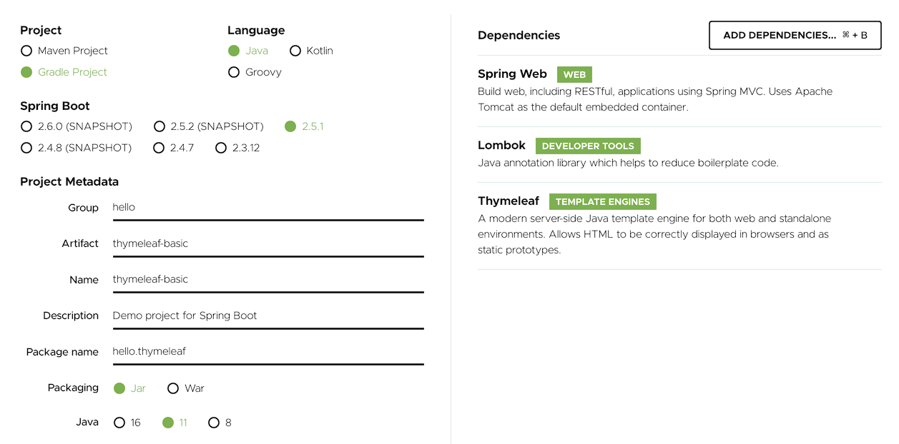

# 타임리프(Thymeleaf)
> 아래 내용은 [스프링 MVC 2편 - 백엔드 웹 개발 활용 기술](https://www.inflearn.com/course/%EC%8A%A4%ED%94%84%EB%A7%81-mvc-2 "스프링 MVC 2편 - 백엔드 웹 개발 활용 기술") 강좌를 참고하여 작성한 내용 입니다.

## 1. 타임리프 소개

* 타임리프(Thymeleaf)란?

    * `타임리프`는 템플릿 엔진이다.

        * `템플릿 엔진` : 지정된 템플릿 양식과 데이터가 합쳐져 HTML 문서를 출력하는 소프트웨어를 말한다.

            * Ex) `JSP`, `타임리프`, `프리마커`, `머스태쉬` 등

    * Thymeleaf의 가장 큰 특징으로는 View 파일을 WAS 없이 브라우저에서 직접 실행 할 수 있다.

        * 예를 들어, 태그 라이브러리를 사용하는 JSP에는 다음과 같이 브라우저에서 직접 표시 할 수 없는 코드가 포함되어 있다.

            ```html
            <form:inputText name="userName" value="${user.name}" />
            ```
  
            * `form:inputText`는 HTML 표준 태그가 아니다.
            
        * 반면, Thymeleaf는 해당 템플릿이 처리 될 때 이를 해석하여 View 파일을 만들고 WAS 없이 동작할 때는 브라우저가 모르는 속성은 그냥 무시하고 정적으로 실행한다.

            ```html
            <input type="text" name="userName" value="James Carrot" th:value="${user.name}" />
            ```

## 2. 프로젝트 만들기

* `https://start.spring.io/` 에서 다음과 같이 프로젝트를 생성 할 수 있다. 

    

## 3. 타임리프 문법

* (1) 텍스트 - text, utext

    * `th:text` : 태그의 컨텐츠에 지정한 값을 출력한다.
    
        ```html
        <li>th:text 사용 <span th:text="${data}"></span></li>
        ```
    
    * `[[${name}]]` : 태그의 컨텐츠 안에서 직접 값을 출력한다.
    
        ```html
        <li>컨텐츠 안에서 직접 출력하기 = [[${data}]] </li>
        ```

    * Escape

        * `HTML 엔티티` : HTML 문서에서 특수 문자(`<`, `>` …)를 HTML 코드로 인식하지 않고 문자 그대로 표현하는 방법을 말한다.
    
            * Ex) `&lt;`

        * `이스케이프(escape)` : HTML에서 사용하는 특수 문자를 HTML 엔티티로 변경하는 것을 말한다.

            * Ex) `<` -> `&lt;`, `>` -> `&gt;`

        * 타임리프가 제공하는 `th:text` , `[[...]]`는 기본적으로 이스케이스(escape)를 제공한다.
    
    * Unescape

        * `th:utext` : 태그의 컨텐츠에 지정한 값을 HTML 태그 그 자체로 출력한다.

            ```html
            <span th:utext="${data}"></span>
            ```

        * `[(...)]` : 태그의 컨텐츠 안에서 직접 값을 HTML 태그 그 자체로 출력한다.

            ```html
            <li>[(${data})]</li>
            ```

        * `th:inline="none"` : 해당 태그 안에서는 타임리프가 해석하지 말라는 옵션이다.

            ```html
            <span th:inline="none">[(...)] = </span>
            ```

* (2) 변수 - SpringEL

    * `${...}` : 변수 표현식이다.
    
        * 객체(`Object`)에 접근하는 SpringEL 표현식은 다음과 같다.

            * `user.username` : user의 username 프로퍼티에 접근한다.
    
            * `user['username']` : 위와 같다.
    
            * `user.getUsername()` : user의 getUsername()를 직접 호출한다.

        * 리스트(`List`)에 접근하는 SpringEL 표현식은 다음과 같다.
        
            * `users[0].username` : List에서 첫 번째 회원을 찾고 username 프로퍼티에 접근한다. 

                * `[]`에는 인덱스를 입력한다.            

                * 즉, `list.get(0).getUsername()`과 같다.
            
            * `users[0]['username']` : 위와 같다.
            
            * `users[0].getUsername()` : List에서 첫 번째 회원을 찾고 메서드 직접 호출한다.

        * 맵(`Map`)에 접근하는 SpringEL 표현식은 다음과 같다.
        
            * `userMap['userA'].username` : Map에서 userA를 찾고, username 프로퍼티에 접근한다. 

                * `[]`에는 키(Key)를 입력한다.
                  
                * `map.get("userA").getUsername()`과 같다.
            
            * `userMap['userA']['username']` : 위와 같다. 
              
            * `userMap['userA'].getUsername()` : Map에서 userA를 찾고 메서드 직접 호출한다.

    * 지역 변수 선언
    
        * `th:with` : 지역 변수를 선언할 때, 사용한다. 
          
            * 지역 변수는 선언한 태그 안에서만 사용할 수 있다.
    
        * 예시
        
            ```html
            <h1>지역 변수 - (th:with)</h1>
            
            <div th:with="first=${users[0]}">
                <p>처음 사람의 이름은 <span th:text="${first.username}"></span></p>
            </div>
            ```

* (3) 타임리프가 제공하는 기본 객체

    * 타임리프는 다음과 같은 기본 객체들을 제공한다. 
      
        * `${#request}`
    
        * `${#response}`
        
        * `${#session}` 
        
        * `${#servletContext}` 
        
        * `${#locale}`

    * 편의 객체

        * `#request`는 `HttpServletRequest` 객체가 그대로 제공되기 때문에 데이터를 조회하려면 `request.getParameter("data")` 처럼 불편하게 접근해야 한다.

        * 이런 점을 해결하기 위해 편의 객체를 제공한다.        

            * `param` : HTTP 요청 파라미터에 접근한다.
              
                * Ex) `${param.paramData}`
            
            * `session` : HTTP 세션에 접근한다. 
              
                * Ex) `${session.sessionData}`
            
            * `@빈이름` : 스프링 빈에 접근한다.
              
                * Ex) `${@helloBean.hello('Spring!')}`

* (4) 유틸리티 객체와 날짜

    * 타임리프는 문자, 숫자, 날짜, URI 등을 편리하게 다루는 다양한 유틸리티 객체들을 제공한다.

        * `#message` : 메시지, 국제화 처리
          
        * `#uris` : URI 이스케이프 지원
          
        * `#dates` : java.util.Date 서식 지원 
          
        * `#calendars` : java.util.Calendar 서식 지원 
          
        * `#temporals` : 자바8 날짜 서식 지원
          
        * `#numbers` : 숫자 서식 지원
          
        * `#strings` : 문자 관련 편의 기능
          
        * `#objects` : 객체 관련 기능 제공
          
        * `#bools` : boolean 관련 기능 제공
          
        * `#arrays` : 배열 관련 기능 제공
          
        * `#lists` , `#sets` , `#maps` : 컬렉션 관련 기능 제공 
          
        * `#ids` : 아이디 처리 관련 기능 제공
    
            * 참고사항
              
                * [유틸리티 객체 설명](https://www.thymeleaf.org/doc/tutorials/3.0/usingthymeleaf.html#expression-utility-objects "설명")

                * [유틸리티 객체 예시](https://www.thymeleaf.org/doc/tutorials/3.0/usingthymeleaf.html#appendix-b-expression-utility-objects "예시")

    * 자바 8 날짜

        * 타임리프에서 자바 8 날짜인 `LocalDate`, `LocalDateTime`, `Instant`를 사용하려면 추가 라이브러리가 필요하다. 
          
            * 스프링 부트 타임리프를 사용하면 해당 라이브러리가 자동으로 추가된다.

                * 타임리프 자바8 날짜 지원 라이브러리 : `thymeleaf-extras-java8time`
    
        * 사용 예시

            ```html
            <span th:text="${#temporals.format(localDateTime, 'yyyy-MM-dd HH:mm:ss')}"></span>
            <span th:text="${#temporals.format(localDateTime, 'yyyy년 MM월 dd일')}"></span>
            ```
          
* (5) URL 링크

    * `@{...}` : 타임리프에서 URL을 생성할 때 사용한다. (링크 표현식)
    
        * ① 단순한 URL 
    
            * `@{/hello}` -> `/hello`
    
        * ② 쿼리 파라미터
    
            * `@{/hello(param1=${param1}, param2=${param2})}` -> `/hello?param1=data1&param2=data2`
        
                * `()` 부분은 쿼리 파라미터로 처리된다.
    
        * ③ 경로 변수
    
            * `@{/hello/{param1}/{param2}(param1=${param1}, param2=${param2})}` -> `/hello/data1/data2`
    
                * URL 경로 상에 변수가 있으면 `()` 부분은 경로 변수로 처리된다.
        
        * ④ 경로 변수 + 쿼리 파라미터 
          
            * `@{/hello/{param1}(param1=${param1}, param2=${param2})}` -> `/hello/data1?param2=data2`
    
                * 경로 변수와 쿼리 파라미터를 함께 사용 할 수도 있다.

        * ⑤ 상대 경로, 절대 경로를 표현 할 수도 있다. 
          
            * `/hello` : 절대 경로
              
            * `hello` : 상대 경로

* (6) 리터럴

    * `리터럴(Literals)` : 소스코드 상에 고정된 값을 말하는 용어다.
    
        * 예를 들어, 다음 코드에서 "Hello"는 문자 리터럴, 10 , 20는 숫자 리터럴이다. 
    
            ```java
            String a = "Hello"
            int a = 10 * 20
            ```

    * 리터럴 관련 주의사항

        * 타임리프는 다음과 같은 리터럴이 있다.
        
            * 문자: `'hello'`
              
            * 숫자: `10`
              
            * boolean: `true`, `false` 
              
            * null: `null`
        
        * 타임리프에서 문자 리터럴은 항상 `'`(작은 따옴표)로 감싸야 한다. 
          
            * Ex) `<span th:text="'hello'">`
    
        * 하지만 문자를 항상 `'`로 감싸는것은 너무 귀찮은 일이다. 
          
        * 다음과 같은 문자가 공백 없이 계속 이어진다면 하나의 의미있는 토큰으로 인지해서 작은 따옴표를 생략 할 수 있다.
        
            * `A-Z`, `a-z`, `0-9`, `[]`, `.`, `-`, `_`
        
        * 예를 들어, 작은 따옴표를 생략 할 수 있는 경우는 `<span th:text="hello">`와 같다.
    
        * 오류가 발생하는 경우와 제대로 동작하는 경우를 살펴보자.
    
            * 오류가 발생하는 경우
    
                * `<span th:text="hello world!"></span>`
    
                    * 문자 리터럴은 원칙상 `'`로 감싸야 한다.
                      
                    * 중간에 공백이 있어서 하나의 의미있는 토큰으로 인식되지 않는다. 
    
            * 제대로 동작하는 경우
        
                * `<span th:text="'hello world!'"></span> `
                  
                    * 이렇게 `'`로 감싸면 정상 동작한다.

    * 예시

        ```html
        <span th:text="'hello' + ' world!'"></span>
        <span th:text="'hello world!'"></span>
        <span th:text="'hello ' + ${data}"></span>
        <span th:text="|hello ${data}|"></span>
        ```
      
        * `<span th:text="|hello ${data}|">` : 리터럴 대체(Literal substitutions)
    
            * 리터럴 대체 문법을 사용하면 마치 템플릿을 사용하는 것처럼 편리하다.

* (7) 연산

    * 타임리프 연산은 자바와 크게 다르지 않다.
    
    * HTML 안에서 사용하기 때문에 HTML 엔티티를 사용하는 부분만 주의하자.

        * ① 산술 연산
        
            ```html
            <span th:text="10 + 2"></span>
            <span th:text="10 % 2 == 0"></span>
            ```
        
        * ② 비교 연산
        
            ```html
            <span th:text="1 &gt; 10"></span>
            <span th:text="1 gt 10"></span>
            <span th:text="1 >= 10"></span>
            <span th:text="1 ge 10"></span>
            <span th:text="1 == 10"></span>
            <span th:text="1 != 10"></span>
            ```

            * 비교 연산은 HTML 엔티티를 사용해야 하는 부분을 주의하자,
            
                * `>` : gt
                  
                * `<` : lt
                  
                * `>=` : ge
                  
                * `<=` : le
                  
                * `!` : not
                  
                * `==` : eq
                  
                * `!=` : neq, ne

        * ③ 조건식
        
            ```html
            <span th:text="(10 % 2 == 0) ? '짝수' : '홀수'"></span>
            ```
        
        * ④ Elvis 연산자 : 조건식의 편의 버전이라고 보면 된다.
        
            ```html
            <span th:text="${data}?: '데이터가 없습니다.'"></span>
            <span th:text="${nullData}?: '데이터가 없습니다.'"></span>
            ```
          
            * `${data}?: '데이터가 없습니다.'` : data가 있으면 data를 그대로 출력하고 없다면 데이터가 없습니다를 출력한다.

            * `${nullData}?: '데이터가 없습니다.'` : nullData에 null이 설정되어 있다면 데이터가 없습니다를 출력한다.        

        * ⑤ No-Operation (`_`)
        
            ```html
            <span th:text="${data}?: _">데이터가 없습니다.</span>
            <span th:text="${nullData}?: _">데이터가 없습니다.</span>
            ```

            * No-Operation인 경우, 마치 타임리프가 실행되지 않는 것처럼 HTML의 내용을 그대로 출력한다.
              
            * 마지막 예시에서는 데이터가 없습니다.라는 부분이 그대로 출력되는 것을 확인 할 수 있다.

* (8) 속성 값 설정

    * 타임리프 태그 속성(Attribute)

        * 타임리프는 주로 HTML 태그에 `th:*` 속성을 지정하는 방식으로 동작한다. 
    
            * ① 속성 설정
              
                * `th:*` : 기존 속성을 `th:*`로 지정한 속성으로 대체한다. 기존 속성이 없다면 새로 만든다.
                
                    * Ex) `<input type="text" name="mock" th:name="userA" />`
                
                        * 타임리프 렌더링 이후 결과 : `<input type="text" name="userA" />`
                
            * ② 속성 추가

                * `th:attrappend` : 속성 값의 뒤에 값을 추가한다. 
                  
                * `th:attrprepend` : 속성 값의 앞에 값을 추가한다. 
                  
                * `th:classappend` : class 속성 값의 뒤에 값을 추가한다.
    
            * ③ checked 처리
              
                * HTML에서 checked 속성은 checked 속성의 값과 상관 없이 checked라는 속성만 있어도 체크가 된다.

                    * Ex) `<input type="checkbox" name="active" checked="false" />` 
                      
                        * checked 속성이 있기 때문에 checked 처리가 되어버린다.                  

                        * 이러한 부분이 `true` , `false` 값을 주로 사용하는 개발자 입장에서는 불편하다.
    
                * `th:checked` : 값이 false 인 경우 checked 속성 자체를 제거한다. 
                  
                    * Ex) `<input type="checkbox" name="active" th:checked="false" />`

                        * 타임리프 렌더링 이후 결과 : `<input type="checkbox" name="active" />`

* (9) 반복

    * `th:each`는 반복 처리를 할 때 사용한다.

        * List, Map, 배열 등에 사용 할 수 있다.

            * Ex) `<tr th:each="user : ${users}">`
    
                * 컬렉션(`${users}`)에서 값을 하나씩 꺼낸 다음, 변수(`user`)에 담아서 해당 태그를 반복 실행한다.

                * 컬렉션이 Map인 경우, 변수에 저장되는 값은 `Map.Entry`다.

        * 추가로 반복에서 사용할 수 있는 여러 상태 값을 지원한다.

            * `index` : 0 부터 시작하는 값
              
            * `count` : 1 부터 시작하는 값
              
            * `size` : 전체 요소의 개수

            * `odd`, `even` : 현재 반복이 홀수/짝수 인지를 나타내는 boolean 값

            * `first` , `last` : 현재 반복이 첫 번째 요소 인지, 마지막 요소 인지를 나타내는 boolean 값
              
            * `current` : 현재 객체

    * 예시
    
        ```html
        <table border="1">
          <tr>
            <th>count</th>
            <th>username</th>
            <th>age</th>
            <th>etc</th>
          </tr>
            
          <tr th:each="user : ${users}">
            <td th:text="${userStat.count}">username</td>
            <td th:text="${user.username}">username</td>
            <td th:text="${user.age}">0</td>
            <td>
              index = <span th:text="${userStat.index}"></span>
              count = <span th:text="${userStat.count}"></span>
              size = <span th:text="${userStat.size}"></span>
              even? = <span th:text="${userStat.even}"></span>
              odd? = <span th:text="${userStat.odd}"></span>
              first? = <span th:text="${userStat.first}"></span>
              last? = <span th:text="${userStat.last}"></span>
              current = <span th:text="${userStat.current}"></span>
            </td>
          </tr>
        </table>
        ```

        * 반복의 두 번째 파라미터를 설정해서 반복의 상태를 확인 할 수 있다.
    
            * Ex) `<tr th:each="user, userStat : ${users}">`
    
                * 두 번째 파라미터는 생략 할 수 있는데, 생략하면 지정한 변수명(`user`) + `Stat`이 된다.

* (10) 조건부 평가

    * ① if / unless 문
      
        * `th:if` : 지정된 조건식의 결과가 `true`인 경우에만 해당 태그를 출력한다.
    
            ```html
            <span th:text="'인증이 필요합니다.'" th:if="${user.age lt 20}"></span>
            ```
    
        * `th:unless` : 지정된 조건식의 결과를 만족하지 않으면 `true`가 되어 해당 태그를 출력한다.
    
            ```html
            <span th:text="'인증이 필요합니다.'" th:unless="${user.age ge 20}"></span>
            ```

    * ② switch 문
    
        * `th:switch`, `th:case` : 자바의 switch 문과 동일하게 처리된다.
        
            ```html
            <tr th:each="user, userStat : ${users}">
                <td th:switch="${user.age}">
                    <span th:case="10">10살</span>
                    <span th:case="20">20살</span>
                    <span th:case="*">기타</span>
                </td>
            </tr>
            ```
            
            * `th : case = "*"`는 만족하는 조건이 없을 때 사용하는 디폴트다.

* (11) 주석

    * ① `표준 HTML 주석`은 타임리프가 렌더링 하지 않고, 그대로 남겨둔다.

        ```html
        <!--
        <span th:text="${data}">html data</span>
        -->
        ```
    
    * ② `타임리프 파서 주석`은 타임리프의 진짜 주석이다. 타임리프로 렌더링하면 주석 부분이 제거된다.

        ```html
        <!--/* [[${data}]] */-->
        ```
        
        ```html
        <!--/*-->
        <span th:text="${data}">html data</span>
        <!--*/-->
        ```
    
    * ③ `타임리프 프로토타입 주석`은 HTML 파일을 그대로 열어보면 주석 처리가 되지만, 타임리프로 렌더링 한 경우에만 출력되는 기능이다.

        ```html
        <!--/*-->
        <span th:text="${data}">html data</span>
        <!--*/-->
        ```
      
        * 잘 사용하지 않는 기능인 것 같다.

* (12) 블록

    * `<th:block>` : 자신에 포함된 속성을 처리하고 출력되지 않는다.

        ```html
        <th:block th:each="user : ${users}">
            <div>
                사용자 이름1 <span th:text="${user.username}"></span>
                사용자 나이1 <span th:text="${user.age}"></span>
            </div>
            <div>
                요약 <span th:text="${user.username} + ' / ' + ${user.age}"></span>
            </div>
        </th:block>
        ```
    
        * 위의 예시에서는 `<div>` 2개를 매번 반복한다.

        * `<th:block>`은 HTML 태그가 아닌 타임리프의 유일한 자체 태그다.

* (13) 자바스크립트 인라인

    * `자바스크립트 인라인` : 자바스크립트에서 타임리프를 편리하게 사용할 수 있는 기능이다.

        * 자바스크립트 인라인 기능을 적용하기
    
            * `<script th:inline="javascript">`
    
        * 자바스크립트 인라인 기능을 사용하기

            * ① 텍스트 렌더링
              
                * Ex) `var username = [[${user.username}]];`
                  
                    * 자바스크립트 인라인 사용 전 타임리프 렌더링 결과 : `var username = userA;`
            
                        * 타임리프 입장에서는 정확하게 렌더링 한 것이지만 개발자가 기대한 것은 "userA"라는 문자일 것이다.
            
                    * 자바스크립트 인라인 사용 후 타임리프 렌더링 결과 : `var username = "userA";`
                
                        * 자바스크립트 인라인를 사용하면 문자 타입인 경우, `"`를 추가하며 숫자 타입인 경우 추가하지 않는다.
                
                        * 그리고 자바스크립트에서 문제가 될 수 있는 문자가 포함되어 있으면 자바스크립트에 맞는 이스케이프 처리를 한다.
                
                            * `"` -> `\"`
            
            * ② 자바스크립트 내추럴 템플릿
            
                * 타임리프는 HTML 파일을 직접 열어도 동작하는 내추럴 템플릿 기능을 제공한다. 
            
                    * Ex) `var username2 = /*[[${user.username}]]*/ "test username"; `
                      
                        * 자바스크립트 인라인 사용 전 타임리프 렌더링 결과 : `var username2 = /*userA*/ "test username";` 
            
                            * 인라인 사용 전 결과에서는 내추럴 템플릿 기능이 동작하지 않고, 렌더링한 내용이 주석 처리된다.            
            
                        * 자바스크립트 인라인 사용 후 타임리프 렌더링 결과 : `var username2 = "userA";`
                
                            * 인라인 사용 후 결과에서는 주석 부분을 렌더링한 결과(`"userA"`)로 변수의 값을 완전히 대체한다.

            * ③ 객체
            
                * 타임리프의 자바스크립트 인라인 기능을 사용하면 객체를 JSON으로 자동으로 변환한다.
                
                    * Ex) `var user = [[${user}]];`
            
                        * 자바스크립트 인라인 사용 전 타임리프 렌더링 결과 : `var user = BasicController.User(username=userA, age=10);` 
            
                            * 인라인 사용 전 결과에서는 객체의 `toString()`가 호출된 값으로 처리된다.  
            
                        * 자바스크립트 인라인 사용 후 타임리프 렌더링 결과 : `var user = {"username":"userA","age":10};`
            
                            * 인라인 사용 후 결과에서는 타임리프를 렌더링 할 때, 객체를 JSON으로 변환한다.

        * 자바스크립트 인라인 each 사용하기
    
            * 자바스크립트 인라인은 `each`를 지원한다.

                ```html
                <script th:inline="javascript">
                
                    [# th:each="user, stat : ${users}"]
                    var user[[${stat.count}]] = [[${user}]];
                    [/]
                
                </script>
                ```
              
                * 해당 기능은 자바스크립트에서 반복문을 사용할 필요가 있을 때 사용한다.

* (14) 템플릿 조각

    * `프레그먼트(fragment)` : (완전한 HTML 문서가 아닌) HTML 문서의 일부분을 이루는 코드 조각을 말한다.
    
        * 공통적으로 사용되는 부분을 `fragment`로 정의해서 사용한다.
    
    * 프레그먼트 사용 방법
    
        * ① 프레그먼트를 정의하기

            * 기본적인 프레그먼트 정의

                ```html
                <footer th:fragment="copy">
                    푸터 자리 입니다.
                </footer>
                ```
              
                * `th:fragment` : fragment를 정의한다.

            * 파라미터를 사용한 프레그먼트 정의

                ```html
                <footer th:fragment="copyParam (param1, param2)">
                    <p>파라미터 자리 입니다.</p>
                    <p th:text="${param1}"></p>
                    <p th:text="${param2}"></p>
                </footer>
                ```

                * 파라미터를 전달해서 동적으로 프레그먼트를 렌더링 할 수도 있다.

        * ② 프레그먼트를 사용하기

            * `th:insert` : 해당 태그의 컨텐츠에 지정된 fragment를 삽입한다.

                ```html
                <div th:insert="~{template/fragment/footer :: copy}"></div>
                ```

                * fragment 표현식은 다음과 같다.
                
                  * `"~{templatename::selector}"` : 해당 template 파일 내에 있는 selector와 일치하는 fragment를 의미한다.
                
                      * `selector`는 fragment 이름을 지정하면 된다.
                
                  * `"~{templatename}"` : 전체 template 파일을 의미한다.
                
                  * `"~{::selector}"` 또는 `"~{this::selector}"` : 같은 템플릿 파일 내에 있는 selector와 일치하는 fragment를 의미한다.
                
                      * `th:insert` 또는 `th:replace`에서는 `~{ }`를 생략 할 수 있다.

            * `th:replace`는 해당 태그를 지정된 fragment로 대체한다.
    
                ```html
                <h2>부분 포함 replace</h2>
                <div th:replace="~{template/fragment/footer :: copy}"></div>
                
                <h2>부분 포함 단순 표현식</h2>
                <div th:replace="template/fragment/footer :: copy"></div>
                
                <h1>파라미터 사용</h1>
                <div th:replace="~{template/fragment/footer :: copyParam ('데이터1', '데이터2')}"></div>
                ```

* (15) 템플릿 레이아웃

    * 레이아웃에 코드 조각을 넘겨서 사용하는 방법에 대해서 알아보자.

        * ① 공통으로 사용할 레이아웃을 만든다. (프레그먼트로 정의)
        
            ```html
            <!DOCTYPE html>
            <html th:fragment="layout (title, content)" xmlns:th="http://www.thymeleaf.org">
            <head>
                <title th:replace="${title}">레이아웃 타이틀</title>
            </head>
            <body>
                <h1>레이아웃 H1</h1>
                <div th:replace="${content}">
                    <p>레이아웃 컨텐츠</p>
                </div>
                <footer>
                    레이아웃 푸터
                </footer>
            </body>
            </html>
            ```
          
            * 파라미터로 전달받은 `title`과 `content`로 태그를 대체한다.

        * ② 레이아웃을 사용한다. 이때, 파라미터로 현재 페이지의 태그를 전달한다.
        
            ```html
            <!DOCTYPE html>
            <html th:replace="~{template/layoutExtend/layoutFile :: layout(~{::title}, ~{::section})}"
                  xmlns:th="http://www.thymeleaf.org">
            <head>
                <title>메인 페이지 타이틀</title>
            </head>
            <body>
                <section>
                    <p>메인 페이지 컨텐츠</p>
                    <div>메인 페이지 포함 내용</div>
                </section>
            </body>
            </html>
            ```

            * `layout(~{::title}, ~{::section})` 이 부분이 핵심이다. 
              
                * `::title` 은 현재 페이지의 title 태그들을 전달한다.
                  
                * `::section` 는 현재 페이지의 section 태그들을 전달한다.

    * 레이아웃을 만들고 사용하면 변경할 일이 있을 때, 유지보수하기 편리하다.

## 4. 스프링 통합과 폼

* (1) 입력 폼 처리

    * 지금부터 타임리프가 제공하는 입력 폼 기능을 적용해서 기존 프로젝트의 폼 코드를 타임리프가 지원하는 기능을 사용해서 효율적으로 개선해보자.

        * `th:object` : 커맨드 객체를 지정한다.
    
        * `*{...}` : 선택 변수 식이라고 한다. `th:object`에서 선택한 객체에 접근한다. 
          
        * `th:field` : HTML 태그의 id , name , value 속성을 모두 자동으로 만들어준다.  

* (2) 등록 폼

    * ① 컨트롤러를 작성한다.
    
        * `th:object`를 적용하려면 먼저 해당 오브젝트 정보를 넘겨주어야 한다. 
          
        * 등록 폼이기 때문에 데이터가 비어있는 빈 오브젝트를 만들어서 뷰에 전달하자.
    
            ```java
            @Controller
            @RequestMapping("/form/items")
            @RequiredArgsConstructor
            public class FormItemController {
            
                @GetMapping("/add")
                public String addForm(Model model) {
                    model.addAttribute("item", new Item());
                    return "form/addForm";
                }
                
            }
            ```

    * ② 타임리프 등록 폼을 작성한다.

        ```html
        <form action="item.html" th:action th:object="${item}" method="post">
            <div>
                <label for="itemName">상품명</label>
                <input type="text" id="itemName" th:field="*{itemName}" class="form-control" placeholder="이름을 입력하세요">
            </div>
            <div>
                <label for="price">가격</label>
                <input type="text" id="price" th:field="*{price}" class="form-control" placeholder="가격을 입력하세요">
            </div>
            <div>
                <label for="quantity">수량</label>
                <input type="text" id="quantity" th:field="*{quantity}" class="form-control" placeholder="수량을 입력하세요">
            </div>
        
            <hr class="my-4">
        
            <div class="row">
                <div class="col">
                    <button class="w-100 btn btn-primary btn-lg" type="submit">상품 등록</button>
                </div>
                <div class="col">
                    <button class="w-100 btn btn-secondary btn-lg" type="button">취소</button>
                </div>
            </div>
        </form>
        ```

        * `th:action` : HTML form에서 action에 값이 없으면 현재 URL에 데이터를 전송한다.

        * `th:object="${item}"` : `<form>`에서 사용할 객체를 지정한다. 
          
            * 선택 변수 식(`*{...}`)을 적용할 수 있다.
          
        * `th:field="*{itemName}"`
        
            * `앞서 th:object`로 item을 선택했기 때문에 선택 변수 식을 적용할 수 있다.
                
            * 선택 변수 식(`*{itemName}`)는 `${item.itemName}`과 같다.
          
            * `th:field`는 id, name, value 속성을 모두 자동으로 만들어준다.

                * `id` : `th:field`에서 지정한 변수 이름과 같다. `id="itemName"` 
                  
                * `name` : `th:field`에서 지정한 변수 이름과 같다. `name="itemName"` 
                  
                * `value` : `th:field`에서 지정한 변수의 값을 사용한다. `value=""`

* (3) 수정 폼

    * ① 컨트롤러를 변경한다.
    
        ```java
        @Controller
        @RequestMapping("/form/items")
        @RequiredArgsConstructor
        public class FormItemController {
        
            private final ItemRepository itemRepository;
            
            @GetMapping("/{itemId}/edit")
            public String editForm(@PathVariable Long itemId, Model model) {
                Item item = itemRepository.findById(itemId);
                model.addAttribute("item", item);
                return "form/editForm";
            }
            
        }
        ```

    * ② 타임리프 수정 폼을 작성한다.

        ```html
        <div class="container">
            <div class="py-5 text-center">
                <h2>상품 수정 폼</h2>
            </div>
        
            <form action="item.html" th:action th:object="${item}" method="post">
                <div>
                    <label for="id">상품 ID</label>
                    <input type="text" id="id" class="form-control" th:field="*{id}" readonly>
                </div>
                <div>
                    <label for="itemName">상품명</label>
                    <input type="text" id="itemName" class="form-control" th:field="*{itemName}">
                </div>
                <div>
                    <label for="price">가격</label>
                    <input type="text" id="price" class="form-control" th:field="*{price}">
                </div>
                <div>
                    <label for="quantity">수량</label>
                    <input type="text" id="quantity" class="form-control" th:field="*{quantity}">
                </div>
            </form>
        
        </div>
        ```
      
* (4) 타임리프에서 체크박스, 라디오 버튼, 셀렉트 박스 사용하기

    * 타임리프를 사용해서 폼에서 체크박스, 라디오 버튼, 셀렉트 박스를 편리하게 사용하는 방법을 학습한다.
      
        * 준비하기

            * ① 상품 종류는 `ENUM`을 사용한다. 설명을 위해 description 필드를 추가했다.

                ```java
                public enum ItemType {
                
                    BOOK("도서"), FOOD("음식"), ETC("기타");
                
                    private final String description;
                
                    ItemType(String description) {
                        this.description = description;
                    }
                
                    public String getDescription() {
                        return description;
                    }
                
                }
                ```

            * ② 배송 방식은 `DeliveryCode`라는 클래스를 사용한다. 

                ```java
                /*
                * FAST: 빠른 배송
                * NORMAL : 일반 배송
                * SLOW : 느린 배송
                * */
                @Data
                @AllArgsConstructor
                public class DeliveryCode {
                
                    private String code;
                
                    private String displayName;
                
                }
                ```
          
                * `code`는 "FAST"와 같은 시스템에서 전달하는 값이고, `displayName` 은 "빠른 배송"과 같은 고객에게 보여주는 값이다.

            * ③ 상품(Item) 클래스를 다음과 같이 수정한다.
            
                ```java
                @Data
                public class Item {
                
                    private Long id;
                    private String itemName;
                    private Integer price;
                    private Integer quantity;
                
                    /*
                     * 체크박스, 라디오 버튼, 셀렉트 박스 예제에서 사용하는 필드
                     * */
                    private Boolean open;           // 판매 여부
                    private List<String> regions;   // 등록 지역
                    private ItemType itemType;      // 상품 종류
                    private String deliveryCode;    // 배송 방식
                
                    public Item() {
                    }
                
                    public Item(String itemName, Integer price, Integer quantity) {
                        this.itemName = itemName;
                        this.price = price;
                        this.quantity = quantity;
                    }
                }
                ```

        * 체크박스

            * 체크박스 - 1개 (타임리프 사용 X)
    
                * HTML checkbox만 사용하는 경우 
    
                    * ① HTML에 체크박스를 추가한다. (`addForm.html`)
                    
                        ```html
                        <!-- single checkbox -->
                        <div>판매 여부</div>
                        <div>
                            <div class="form-check">
                                <input type="checkbox" id="open" name="open" class="form-check-input">
                                <label for="open" class="form-check-label">판매 오픈</label>
                            </div>
                        </div>
                        ```
    
                    * ② 컨트롤러에서 전달받은 체크박스의 값을 로그로 출력 하도록 수정한다.
        
                        ```java
                        @Slf4j
                        @Controller
                        @RequestMapping("/form/items")
                        @RequiredArgsConstructor
                        public class FormItemController {
                        
                            private final ItemRepository itemRepository;
                        
                            @PostMapping("/add")
                            public String addItem(@ModelAttribute Item item, RedirectAttributes redirectAttributes) {
                                log.info("item.open={}", item.getOpen());
                                // ...
                                return "redirect:/form/items/{itemId}";
                            }
                            
                        }
                        ```
                      
                    * ③ 실행 로그는 다음과 같다.
    
                        ```
                        FormItemController : item.open=true //체크 박스를 선택하는 경우 
                        FormItemController : item.open=null //체크 박스를 선택하지 않는 경우
                        ```
    
                        * 체크박스를 선택하고 폼을 전송하면 HTML Form에서 `open=on` 이라는 값을 전달한다. 
                          
                            * 스프링은 `on`이라는 문자를 true 타입으로 변환한다. 
                              
                                * 스프링 타입 컨버터가 이 기능을 수행한다.
    
                        * 체크박스를 선택하지 않고 폼을 전송하면 `open`이라는 필드 자체가 서버로 전송되지 않는다.
                          
                            * HTML checkbox는 선택 되지 않으면 클라이언트에서 서버로 값 자체를 보내지 않는다. 
                              
                            * 수정의 경우에는 상황에 따라서 이 방식이 문제가 될 수 있다. 
    
                                * 사용자가 의도적으로 체크되어 있던 값을 체크를 해제해도 저장 시 아무 값도 넘어가지 않기 때문에, 서버 구현에 따라서 값이 오지 않은 것으로 판단해서 값을 변경하지 않을 수도 있다.
    
                * HTML checkbox + 히든필드를 사용하는 경우
    
                    * ① 체크박스에 대한 선택 해제를 인식하기 위한 히든 필드를 추가한다.
    
                        ```html
                        <input type="hidden" name="_open" value="on"/> <!-- 히든 필드 추가 -->
                        ```
    
                        * 기존 체크 박스 이름 앞에 언더스코어(`_`)를 붙인 히든 필드를 하나 만들어서 전송하면 체크박스에 대한 선택 해제를 인식할 수 있다.
    
                        * 체크박스의 선택을 해제한 경우, `_open`만 전송되는데, 스프링 MVC는 체크박스에 대한 선택을 해제했다고 판단한다.
    
                    * ② 실행 로그는 다음과 같다.
    
                        ```
                        FormItemController      : item.open=true // 체크 박스를 선택하는 경우
                        FormItemController      : item.open=false // 체크 박스를 선택하지 않는 경우
                        ```
    
                        * 체크박스를 선택하는 경우
    
                            * `open=on&_open=on` 
    
                                * 체크박스를 선택하면 스프링 MVC가 `open`에 값이 있는 것을 확인하고 사용한다. 이때 `_open`은 무시한다.
    
                        * 체크박스를 선택하지 않는 경우
    
                            * `_open=on`
    
                                * 체크박스를 선택하지 않으면 스프링 MVC가 _open 만 있는 것을 확인하고, open의 값이 선택되지 않았다고 인식한다.
    
                                * 이 경우 서버에서 Boolean 타입을 로그로 출력하면 결과가 null이 아닌 false 인 것을 확인할 수 있다.
    
            * 체크박스 - 1개 (타임리프 사용 O)
    
                * ① 타임리프가 제공하는 폼 기능을 사용하면 히든 필드를 추가하는 것을 자동으로 처리할 수 있다.
    
                    ```html
                    <div class="form-check">
                        <input type="checkbox" id="open" name="open" th:field="*{open}" class="form-check-input">
                        <label for="open" class="form-check-label">판매 오픈</label>
                    </div>
                    ```
        
                    * `th:field`는 체크 박스의 히든 필드와 관련된 부분도 함께 해결해준다. HTML 생성 결과를 보면 히든 필드 부분이 자동으로 생성되어 있다.
                      
                        * `<input type="hidden" name="_open" value="on"/>`
    
                    * 그리고 `th:field`는 값이 true 인 경우 checked 속성을 자동으로 추가한다.
        
                    * `th:field="${item.open}"`도 가능하다.
        
                * ② 조회 화면에서는 input 태그에 `disabled`를 추가하여 값을 변경하지 못하도록 할 수 있다.
    
                    ```html
                    <input type="checkbox" id="open" name="open" th:field="${item.open}" class="form-check-input" disabled>
                    ```
    
            * 체크박스 - 여러 개
    
                * ① 컨트롤러를 수정한다.
    
                    ```java
                    @Slf4j
                    @Controller
                    @RequestMapping("/form/items")
                    @RequiredArgsConstructor
                    public class FormItemController {
                    
                        private final ItemRepository itemRepository;
                    
                        @ModelAttribute("regions")
                        public Map<String, String> regions() {
                            Map<String, String> regions = new LinkedHashMap<>();
                            regions.put("SEOUL", "서울");
                            regions.put("BUSAN", "부산");
                            regions.put("JEJU", "제주");
                    
                            return regions;
                        }
                        
                        @GetMapping("/add")
                        public String addForm(Model model) {
                            model.addAttribute("item", new Item());
                    
                            return "form/addForm";
                        }
                    
                        @PostMapping("/add")
                        public String addItem(@ModelAttribute Item item, RedirectAttributes redirectAttributes) {
                            log.info("item.open={}", item.getOpen());
                            log.info("item.regions={}", item.getRegions());
                    
                            Item savedItem = itemRepository.save(item);
                            redirectAttributes.addAttribute("itemId", savedItem.getId());
                            redirectAttributes.addAttribute("status", true);
                            return "redirect:/form/items/{itemId}";
                        }
                        
                    }
                    ```
                  
                    * 해당 컨트롤러를 요청할 때 `regions()`에서 반환한 값이 자동으로 모델(model)에 담기게 된다.
    
                * ② 여러 개의 체크박스를 추가한다.
    
                    ```html
                    <!-- multi checkbox -->
                    <div>
                        <div>등록 지역</div>
                        <div th:each="region : ${regions}" class="form-check form-check-inline">
                            <input type="checkbox" th:field="*{regions}" th:value="${region.key}" class="form-check-input">
                            <label th:for="${#ids.prev('regions')}" th:text="${region.value}" class="form-check-label">서울</label>
                        </div>
                    </div>
                    ```
    
                    * `th:field="*{regions}"`는 `th:field="${item.regions}"`과 같다.
        
                        * 타임리프가 `th:value`에 해당하는 값이 `th:field="*{regions}"`에 존재한다면 `checked`를 추가한다. 없다면 추가하지 않는다.
    
                    * `th:for="${#ids.prev('open')}"`
        
                        * 멀티 체크박스는 같은 이름의 여러 체크박스를 만들 수 있다. 
                          
                        * 그런데 이렇게 반복해서 HTML 태그를 생성할 때, 생성된 HTML 태그 속성에서 name은 같아도 되지만, id는 모두 달라야 한다. 
    
                            * name은 regions로 동일하지만 id는 다른 것을 확인 할 수 있다.                      
    
                        * 따라서 타임리프는 체크박스를 each 루프 안에서 만들 때 임의로 1,2,3 숫자를 뒤에 붙여준다.
    
                    * `<input>` 태그의 id가 타임리프에 의해 동적으로 만들어진다.
    
                      * 따라서 `<label for="id 값">`으로 label의 대상이 되는 id 값을 임의로 지정하는 것은 곤란하다.
    
                      * 타임리프는 `ids.prev()` , `ids.next()`을 제공해서 동적으로 생성되는 id 값을 사용 할 수 있도록 한다.
        
                * ③ 로그 출력 결과는 다음과 같다.
    
                    * 체크박스에서 서울, 부산을 선택하는 경우
                      
                        * 폼 전송 데이터
    
                            ```
                            regions=SEOUL&_regions=on&regions=BUSAN&_regions=on&_regions=on
                            ```
    
                        * 로그 : `item.regions=[SEOUL, BUSAN]`
    
                    * 체크박스에서 지역을 선택하지 않는 경우
    
                        * 폼 전송 데이터
                        
                            ```
                            _regions=on&_regions=on&_regions=on
                            ```
                            
                            * `_regions`는 웹 브라우저에서 체크를 하나도 하지 않았을 때, 클라이언트가 서버에 아무런 데이터를 보내지 않는 것을 방지한다. 
                          
                            * 참고로 `_regions` 조차 보내지 않으면 결과는 `null`이 된다.
                        
                        * 로그 : `item.regions=[]`
    
        * 라디오 버튼
        
            * 라디오 버튼은 여러 선택지 중에 하나를 선택할 때 사용 할 수 있다. 라디오 버튼을 자바 ENUM을 활용해서 개발해보자.

                * ① 컨트롤러를 수정한다.

                    ```java
                    @Slf4j
                    @Controller
                    @RequestMapping("/form/items")
                    @RequiredArgsConstructor
                    public class FormItemController {
                    
                        private final ItemRepository itemRepository;
                    
                        @ModelAttribute("regions")
                        public Map<String, String> regions() {
                            Map<String, String> regions = new LinkedHashMap<>();
                            regions.put("SEOUL", "서울");
                            regions.put("BUSAN", "부산");
                            regions.put("JEJU", "제주");
                    
                            return regions;
                        }
                    
                        @ModelAttribute("itemTypes")
                        public ItemType[] itemTypes() {
                            return ItemType.values();
                        }
                        
                        @GetMapping("/add")
                        public String addForm(Model model) {
                            model.addAttribute("item", new Item());
                    
                            return "form/addForm";
                        }
                    
                        @PostMapping("/add")
                        public String addItem(@ModelAttribute Item item, RedirectAttributes redirectAttributes) {
                            log.info("item.open={}", item.getOpen());
                            log.info("item.regions={}", item.getRegions());
                            log.info("item.itemType={}", item.getItemType());
                    
                            Item savedItem = itemRepository.save(item);
                            redirectAttributes.addAttribute("itemId", savedItem.getId());
                            redirectAttributes.addAttribute("status", true);
                            return "redirect:/form/items/{itemId}";
                        }
                    
                    }
                    ```
                  
                    * `ItemType.values()`를 사용하면 해당 ENUM의 모든 정보를 배열로 반환한다. 
                      
                        * Ex) [BOOK, FOOD, ETC]

                * ② HTML에 라디오 버튼을 추가한다. (`addForm.html`)
                
                    ```html
                    <!-- radio button -->
                    <div>
                        <div>상품 종류</div>
                        <div th:each="type : ${itemTypes}" class="form-check form-check-inline">
                            <input type="radio" th:field="*{itemType}" th:value="${type.name()}" class="form-check-input">
                            <label th:for="${#ids.prev('itemType')}" th:text="${type.description}" class="form-check-label">
                                BOOK
                            </label>
                        </div>
                    </div>
                    ```

                * ③ 실행 로그는 다음과 같다.

                    ```
                    item.itemType=FOOD: 값이 있을 때 
                    item.itemType=null: 값이 없을 때
                    ```

                    * 라디오 버튼은 이미 선택이 되어 있다면, 수정 시에도 항상 하나를 선택하도록 되어 있으므로 체크 박스와 달리 별도의 히든 필드를 사용할 필요가 없다.
    
                        * 즉, 라디오 버튼을 한 번 선택하게 되면 그 다음 부터 null이 전달될 일은 없다.
    
                        * 물론 선택 자체를 안하는 경우에는 이전에도 null 이었기 때문에 그 경우는 상관없다. 

        * 셀렉트 박스

            * 셀렉트 박스는 여러 선택지 중에 하나를 선택할 때 사용 할 수 있다. 이번 시간에는 셀렉트 박스를 자바 객체를 활용해서 개발해보자.

                * ① 컨트롤러를 수정한다.

                    ```java
                    @Slf4j
                    @Controller
                    @RequestMapping("/form/items")
                    @RequiredArgsConstructor
                    public class FormItemController {
                    
                        private final ItemRepository itemRepository;
                        
                        @ModelAttribute("deliveryCodes")
                        public List<DeliveryCode> deliveryCodes() {
                            List<DeliveryCode> deliveryCodes = new ArrayList<>();
                            deliveryCodes.add(new DeliveryCode("FAST", "빠른 배송"));
                            deliveryCodes.add(new DeliveryCode("NORMAL", "일반 배송"));
                            deliveryCodes.add(new DeliveryCode("SLOW", "느린 배송"));
                            return deliveryCodes;
                        }
                        
                        @GetMapping("/add")
                        public String addForm(Model model) {
                            model.addAttribute("item", new Item());
                    
                            return "form/addForm";
                        }
                    
                        @PostMapping("/add")
                        public String addItem(@ModelAttribute Item item, RedirectAttributes redirectAttributes) {
                            log.info("item.open={}", item.getOpen());
                            log.info("item.regions={}", item.getRegions());
                            log.info("item.itemType={}", item.getItemType());
                            log.info("item.deliveryCode={}", item.getDeliveryCode());
                    
                            Item savedItem = itemRepository.save(item);
                            redirectAttributes.addAttribute("itemId", savedItem.getId());
                            redirectAttributes.addAttribute("status", true);
                            return "redirect:/form/items/{itemId}";
                        }
                        
                    }
                    ```
                  
                    * 배송 방식을 모델에 담는다. 

                    * 셀렉트 박스의 값을 저장하는 경우, 객체에서 리스트가 아닌 단순 타입(`String`)으로 지정하면 된다.
                    
                        ```java
                        @Data
                        public class Item {
                            
                            // ...
                            
                            private String deliveryCode;    // 배송 방식
                        
                        }
                        ```

                * ② HTML에 셀렉트 박스를 추가한다.
    
                    ```html
                    <!-- SELECT -->
                    <div>
                        <div>배송 방식</div>
                        <select th:field="*{deliveryCode}" class="form-select"> 
                            <option value="">==배송 방식 선택==</option> <!-- 아무것도 선택하지 않았을 때, 기본 값 -->
                            <option th:each="deliveryCode : ${deliveryCodes}" th:value="${deliveryCode.code}"
                                    th:text="${deliveryCode.displayName}">FAST</option>
                        </select>
                    </div>
                    
                    <hr class="my-4">
                    ```

                    * 타임리프는 `th:field="${item.deliveryCode}"`와 `th:value="${deliveryCode.code}"`의 값이 같으면 `selected="selected"`를 추가한다.